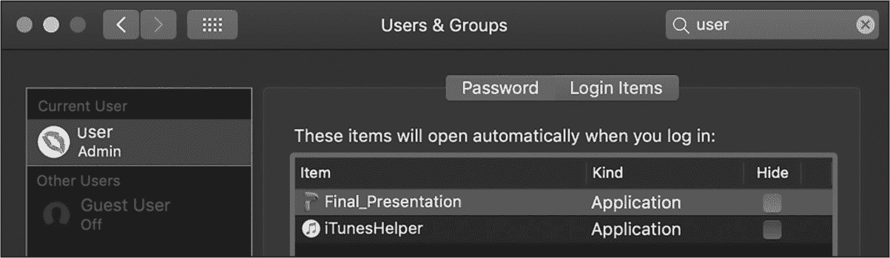
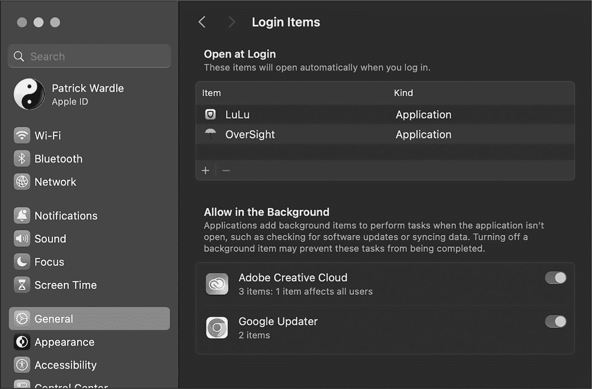

## 5 持久化


可以说，检测 macOS 恶意威胁的最佳方法之一就是关注持久化。在这里，*持久化*指的是软件（包括恶意软件）安装自身到系统中的方式，以确保它在启动时、用户登录时或某些其他确定性事件发生时自动重新执行。否则，如果用户注销或系统重启，它可能永远不会再次运行。在本章中，我将重点列举持久化项目。在第二部分中，我将介绍如何利用 Apple 的 Endpoint Security 来监控持久化事件。

作为大多数恶意软件的共同特征，持久化是一个强大的检测机制，能够揭示大多数感染。在 macOS 上，恶意软件通常以两种方式持久化：作为启动项（守护进程或代理）或作为登录项。在本章中，我将向你展示如何精确列举这些项目，以揭示几乎任何 macOS 恶意软件样本。

当然，并非所有 macOS 恶意软件都会持久化。例如，加密用户文件的勒索软件或窃取并外泄敏感用户数据的窃取者通常不需要多次运行，因此很少将自己持久化安装。

另一方面，设计用于持续运行的合法程序，如自动更新器、安全工具，甚至是简单的辅助工具，也往往会持续存在。因此，某个程序持续安装并不意味着我们的代码应该将其标记为恶意程序。

### 持久化恶意软件的示例

因为本章的重点是揭示作为登录项或启动项持久化的恶意软件，我们从每种类型的简短示例开始。WindTail 恶意软件最早由研究员 Taha Karim 公开，主要针对中东地区政府和关键基础设施的员工。^(1) 在一篇详细的研究论文中，^(2) 我提到，这款恶意软件通常伪装成名为 *Final_Presentation* 的 PowerPoint 演示文稿，并将自己作为登录项持久化，以确保每次用户登录时它都会自动重新执行。在该恶意软件的应用程序包中，我们可以找到它的主二进制文件，名为 *usrnode*。反编译该文件后，揭示了其主函数开头的持久化逻辑：

```
int main(int argc, const char* argv[])
    r12 = [NSURL fileURLWithPath:NSBundle.mainBundle.bundlePath];

    rbx = LSSharedFileListCreate(0x0, _kLSSharedFileListSessionLoginItems, 0x0);
    LSSharedFileListInsertItemURL(rbx, _kLSSharedFileListItemLast, 0x0, 0x0, r12, 0x0, 0x0);
    ...

} 
```

一旦恶意软件确定它在主机上运行的位置，它会调用 LSSharedFileListCreate 和 LSSharedFileListInsertItemURL 函数，将自己安装为一个持久化的登录项。这个登录项会使恶意软件出现在“系统偏好设置”应用程序的“登录项”面板中（图 5-1）。显然，恶意软件的作者认为这是为持久化而做的一个可以接受的妥协。



图 5-1：WindTail 将自己作为名为 Final_Presentation 的登录项持久化。

让我们来看一个其他的持久化 macOS 恶意软件样本。名为 DazzleSpy，这种复杂的国家级恶意软件利用了零日漏洞，远程感染了 macOS 用户。^(3) 尽管 DazzleSpy 的感染途径提出了检测挑战，但其持久化方法却相当明显，为防御者提供了一个简单的检测途径。

在获得初始代码执行权限并成功逃逸浏览器沙箱后，DazzleSpy 会将自身保持为一个伪装成 Apple 软件更新程序的启动代理。为了作为启动代理保持存在，项目通常会在 *LaunchAgents* 目录下创建一个属性列表。DazzleSpy 在当前用户的 *Library/LaunchAgents* 目录中创建一个属性列表，并将其命名为 *com.apple.softwareupdate.plist*。该恶意软件的二进制文件硬编码了对启动代理目录的引用，以及对该 plist 文件名称的引用，使它们在 `strings` 命令的输出中显而易见：

```
% **strings - DazzleSpy/softwareupdate**
...
%@/Library/LaunchAgents
/com.apple.softwareupdate.plist 
```

如果我们在反编译器中加载恶意软件，我们会发现一个名为 installDaemon 的类方法，它使用了这些字符串。顾名思义，该方法将持久化安装恶意软件（尽管不是作为启动守护进程，而是作为一个代理）：

```
+(void)installDaemon {
    rax = NSHomeDirectory();
    ...
    var_78 = [NSString stringWithFormat:@"%@/**Library/LaunchAgents**", rax];
    var_80 = [var_78 stringByAppendingFormat:@"/**com.apple.softwareupdate.plist**"];
    ...
    var_90 = [[NSMutableDictionary alloc] init];
    var_98 = [[NSMutableArray alloc] init];
    ...
    rax = @(YES);
    [var_90 setObject:rax forKey:@"RunAtLoad"];
 [var_90 setObject:@"com.apple.softwareupdate" forKey:@"Label"];
    [var_90 setObject:var_98 forKey:@"ProgramArguments"];
    ...
    [var_90 writeToFile:var_80 atomically:0x0];
...
} 
```

从这次反编译中，我们可以看到恶意软件首先动态构建一个指向当前用户 *Library/LaunchAgents* 目录的路径，然后将字符串 *com.apple.softwareupdate.plist* 追加到该路径中。接着，它构建一个包含 RunAtLoad、Label 和 ProgramArguments 等键的字典，这些值描述了如何重新启动持久化项目、如何识别该项目以及它的路径。为了完成持久化，恶意软件将这个字典写入启动代理目录中的属性列表文件。

通过在一个隔离的分析机器上执行恶意软件，并在文件监控器的监视下，我们可以确认 DazzleSpy 的持久性。如预期的那样，文件监控器显示该二进制文件 (*softwareupdate*) 在当前用户的 *LaunchAgents* 目录中创建了其属性列表文件：

```
# **FileMonitor.app/Contents/MacOS/FileMonitor -pretty**
...
{
  "event" : "ES_EVENT_TYPE_NOTIFY_CREATE",
  "file" : {
    "destination" : "/Users/User/Library/LaunchAgents/com.apple.softwareupdate.plist",
    "process" : {
      "pid" : 1469,
      "name" : "softwareupdate",
      "path" : "/Users/User/Desktop/softwareupdate"
    }
  }
} 
```

然后，通过检查新创建的文件的内容，我们可以找到恶意软件持久安装的路径，*/Users/User/.local/softwareupdate*：

```
<?xml version=”1.0” encoding=”UTF-8”?>
...
<plist version="1.0">
<dict>
    <key>KeepAlive</key>
    <true/>
    <key>Label</key>
    <string>com.apple.softwareupdate</string>
    <key>ProgramArguments</key>
    <array>
        <string>**/Users/User/.local/softwareupdate**</string>
        <string>1</string>
    </array>
    <key>**RunAtLoad**</key>
<true/>
 <key>SuccessfulExit</key>
    **<true/>**
</dict>
</plist> 
```

恶意软件将 RunAtLoad 键设置为 true，因此每次用户登录时，macOS 都会自动重新启动指定的二进制文件。换句话说，DazzleSpy 已经获得了持久性。

在本章开头，我提到过合法软件也会保持持久性。那么，如何判断一个持久化的项目是否是恶意的呢？可以说，最好的方法是检查该项目的代码签名信息，使用 第三章 中描述的方法。合法项目应该由公认的公司签名并且通过 Apple 的认证。

恶意持久化项目通常也有一些共同的特征。以 DazzleSpy 为例，它从隐藏的*.local*目录中运行，并且没有签名或经过公证。该恶意软件的属性列表名称*com.apple.softwareupdate*表明这个持久化项目属于 Apple。然而，Apple 从未将持久化组件安装到用户的*LaunchAgents*目录中，所有的启动项都引用仅由 Apple 公司签名的二进制文件。在这些方面，DazzleSpy 并不是一个特例；由于这些异常，大多数恶意持久化项目也同样容易被归类为可疑。

### 背景任务管理

我们如何确定某个项目是否已持久化？一种简单的方法是枚举所有在启动项目录中找到的*.plist*文件，这些目录包括系统和用户的*LaunchDaemon*和*LaunchAgent*目录。然而，从 macOS 13 开始，Apple 鼓励开发者将启动项直接移到他们的应用程序包中。^(4)这些变化实际上使得通过用户的启动项目录来持久化变得不再推荐，这意味着手动枚举持久化项目需要扫描每个应用程序包，这样做效率低下。此外，软件还可以作为登录项持久化，而这些登录项并不使用属性列表或专用目录。

幸运的是，从 macOS 13 开始，Apple 已将最常见的持久化机制（包括启动代理、启动守护进程和登录项）的管理整合到了一个名为*背景任务管理*的专有子系统中。这个子系统提供了在“系统偏好设置”应用中显示的登录项和启动项的列表（图 5-2）。



图 5-2：在“系统偏好设置”应用中显示的登录项和启动项

在我的电脑上，我的几个 Objective-See 工具会将自己安装为登录项，而 Adobe 的云同步应用程序和 Google Chrome 的更新程序则会安装为持久启动项。

当然，我们希望能够以编程方式获取这些持久化项目的列表，因为任何持久化的恶意软件很可能也会出现在这里。尽管背景任务管理子系统的组件是专有和闭源的，但动态分析表明，子系统将其跟踪的持久化项目的详细元数据存储在一个单独的数据库文件中。对于我们的目的来说，这个集中式数据库的存在是个福音。不幸的是，由于其格式是专有且没有文档记录，如果我们希望使用它，还需要做一些工作。

#### 检查子系统

让我们走一遍 Background Task Management 子系统与此数据库的交互过程。理解这些操作将帮助我们创建一个能够编程提取其内容的工具。通过文件监控，我们可以看到，当一个项被持久化时，Background Task Management 守护进程 *backgroundtaskmanagementd* 会更新 */private/var/db/com.apple.backgroundtaskmanagement/* 目录中的文件。为了原子性地执行此操作，它首先创建一个临时文件，然后通过重命名操作将其移入 *com.apple.backgroundtaskmanagement* 目录：

```
# **FileMonitor.app/Contents/MacOS/FileMonitor -pretty**
{
  "event" : "ES_EVENT_TYPE_NOTIFY_CREATE",
  "file" : {
 "destination" :
    "/private/var/folders/zz/.../TemporaryItems/.../BackgroundItems-vx.btm",
    "process" : {
       "pid" : 612,
       "name" : "backgroundtaskmanagementd",
       ...
     }
  }
  ...
}

{
  "event" : "ES_EVENT_TYPE_NOTIFY_WRITE",
  "file" : {
    "destination" :
    "/private/var/folders/zz/.../TemporaryItems/.../BackgroundItems-vx.btm",
    "process" : {
      "pid" : 612,
      "name" : "backgroundtaskmanagementd",
      ...
    }
  }
  ...
}

{
  "event" : "ES_EVENT_TYPE_NOTIFY_RENAME",
  "file" : {
    "source" :
    "/private/var/folders/zz/.../TemporaryItems/.../BackgroundItems-vx.btm",
    "destination" :
    "/private/var/db/com.apple.backgroundtaskmanagement/BackgroundItems-vx.btm",
    "process" : {
      "pid" : 612,
      "name" : "backgroundtaskmanagementd",
      ...
    }
  }
  ...
} 
```

如果我们反汇编位于 */System/Library/PrivateFrameworks/BackgroundTaskManagement.framework/Versions/A/Resources/* 目录中的守护进程的二进制文件，我们会发现 BTMStore 类的 storeNameForDatabaseVersion: 方法中有一个格式字符串引用，BackgroundItems-v%ld.btm：

```
+[BTMStore storeNameForDatabaseVersion:]
    pacibsp
    sub    sp, sp, #0x20
    stp    fp, lr, [sp, #0x10]
    add    fp, sp, #0x10
    nop
    ldr    x0, =_OBJC_CLASS_$_NSString
 str    x2, [sp, #0x10 + var_10]
    adr    x2, #0x100031f10            ; **@"BackgroundItems-v%ld.btm"**
    ... 
```

进一步的逆向工程揭示，数据库的名称包含一个版本号，随着新版 macOS 的发布，版本号会递增。在这里展示的示例中，我们将版本号抽象为 x，但在你的系统中，版本号可能是 8 或更高。使用 `file` 命令，我们可以看到 *BackgroundItems-vx.btm* 文件的内容以二进制属性列表的形式存储。要查看这些详细信息，请确保在运行命令时为你的系统提供正确的版本号：

```
% **file /private/var/db/com.apple.backgroundtaskmanagement/BackgroundItems-v****`x`****.btm**
/private/var/db/com.apple.backgroundtaskmanagement/BackgroundItems-v`x`.btm:
Apple binary property list 
```

我们可以使用 plutil 将二进制属性的内容转换为 XML。不幸的是，结果 XML 不仅包含拼写错误，还包含一些无法轻易被人类读取的序列化对象：

```
% **plutil -p /private/var/db/com.apple.backgroundtaskmanagement/BackgroundItems-v****`x`****.btm**
{
  "$archiver" => "NSKeyedArchiver"
  "$objects" => [
    0 => "$null"
    1 => {
      "$class" =>
      <CFKeyedArchiverUID 0x600002854240 [0x1e3bcf9a0]>{value = 265}

      "itemsByUserIdentifier" =>
      <CFKeyedArchiverUID 0x600002854260 [0x1e3bcf9a0]>{value = 2}

      "mdmPaloadsByIdentifier" =>
      <CFKeyedArchiverUID 0x600002854280 [0x1e3bcf9a0]>{value = 263}

      "userSettingsByUserIdentifier" =>
      <CFKeyedArchiverUID 0x6000028542a0 [0x1e3bcf9a0]>{value = 257}
    }
    ...

    265 => {
      "$classes" => [
         0 => "Storage"
         1 => "NSObject"
      ]
      "$classname" => "Storage"
    }
    ... 
```

*序列化* 是将一个已初始化的内存中的对象转换为可以保存的格式（例如，保存到文件）的过程。虽然序列化是程序与对象交互的高效方式，但序列化对象通常不可被人类读取。此外，如果对象属于一个未记录的类，我们必须首先理解该类的内部细节，才能编写代码以理解它们。

作为 Background Task Management 子系统的一部分，Apple 提供了一个名为 sfltool 的命令行工具，它可以与 *BackgroundItems-vx .btm* 文件进行交互。如果使用 dumpbtm 标志执行该工具，它将反序列化并打印出文件的内容：

```
# **sfltool dumpbtm**

#1:
                 UUID: 8C271A5F-928F-456C-B177-8D9162293BA7
                 Name: softwareupdate
       Developer Name: (null)
                 Type: legacy daemon (0x10010)
          Disposition: [enabled, allowed, visible, notified] (11)
           Identifier: com.apple.softwareupdate
                  URL: file:///Library/LaunchDaemons/com.apple.softwareupdate.plist
      Executable Path: /Users/User/.local/softwareupdate
           Generation: 1
    Parent Identifier: Unknown Developer

#2:
        UUID: 9B6C3670-2946-4F0F-B58C-5D163BE627C0
                 Name: ChmodBPF
       Developer Name: Wireshark
      Team Identifier: 7Z6EMTD2C6
                 Type: curated legacy daemon (0x90010)
          Disposition: [enabled, allowed, visible, notified] (11)
           Identifier: org.wireshark.ChmodBPF
                  URL: file:///Library/LaunchDaemons/org.wireshark.ChmodBPF.plist
      Executable Path: /Library/Application Support/Wireshark/ChmodBPF/ChmodBPF
           Generation: 1
    Assoc. Bundle IDs: [org.wireshark.Wireshark]
    Parent Identifier: Wireshark 
```

在这个示例中，反序列化后的对象包括 DazzleSpy (*softwareupdate*) 和 Wireshark 的 *ChmodBPF* 守护进程。由于 sfltool 能够从专有数据库生成反序列化输出，逆向工程它应该有助于我们理解其反序列化和解析逻辑。反过来，这应该能使我们编写出能够枚举 Background Task Management 子系统管理的所有持久化项（包括任何恶意软件）的解析器。

#### 解剖 sfltool

尽管本书的重点不在于反向工程，但我将简要讨论如何剖析 sfltool，以便你理解它与其他后台任务管理组件及极其重要的 *.btm* 文件的交互。在终端中，让我们通过运行带有 dumpbtm 标志的 sfltool 来开始流式读取系统日志消息：

```
% **log stream**
...
backgroundtaskmanagementd: -[BTMService listener:shouldAcceptNewConnection:]:
connection=<NSXPCConnection: 0x152307aa0> connection from pid 52886 on mach service named
com.apple.backgroundtaskmanagement

backgroundtaskmanagementd dumpDatabaseWithAuthorization: error=Error
Domain=NSOSStatusErrorDomain Code=0 "noErr: Call succeeded with no error" 
```

正如你在日志输出中看到的（我稍作修改以便简洁），后台任务管理守护进程收到了来自进程 ID 为 52886 的消息，该进程对应于正在运行的 sfltool 实例。你可以看到该工具已成功建立了 XPC 连接。如果连接成功，sfltool 就可以调用守护进程中的远程方法。例如，从日志消息中，你可以看到它调用了守护进程的 dumpDatabaseWithAuthorization: 方法来获取后台任务管理数据库的内容。

在列表 5-1 中，我们尝试实现相同的方法。我们利用了私有的 BackgroundTaskManagement 框架，该框架实现了必要的类，如 BTMManager，以及包括客户端方法 dumpDatabaseWithAuthorization:error: 在内的函数。

```
#import <dlfcn.h>
#import <Foundation/Foundation.h>
#import <SecurityFoundation/SFAuthorization.h>

#define BTM_DAEMON "/System/Library/PrivateFrameworks/\
BackgroundTaskManagement.framework/Resources/backgroundtaskmanagementd"

@interface BTMManager : NSObject
    +(id)shared;
    -(id)dumpDatabaseWithAuthorization:(SFAuthorization*)arg1 error:(id*)arg2;
@end

int main(int argc, const char* argv[]) {
    void* btmd = dlopen(BTM_DAEMON, RTLD_LAZY);

    Class BTMManager = NSClassFromString(@"BTMManager");
    id sharedInstance = [BTMManager shared];

    SFAuthorization* authorization = [SFAuthorization authorization];
    [authorization obtainWithRight:"system.privilege.admin"
    flags:kAuthorizationFlagExtendRights error:NULL];

    id dbContents = [sharedInstance dumpDatabaseWithAuthorization:authorization error:NULL];
    ...
} 
```

列表 5-1：尝试转储后台任务管理数据库

不幸的是，这种方法失败了。正如以下日志信息所示，失败似乎是因为我们的二进制文件（在此实例中，其进程 ID 为 20987）没有连接到后台任务管理守护进程所需的私人 Apple 权限：

```
% **log stream**
...
backgroundtaskmanagementd: -[BTMService listener:shouldAcceptNewConnection:]:
process with pid=20987 lacks entitlement 'com.apple.private.backgroundtaskmanagement.manage'
or deprecated entitlement 'com.apple.private.coreservices.canmanagebackgroundtasks' 
```

我们可以通过反向工程守护进程中负责处理来自客户端的新 XPC 连接的代码来确认，正是这个原因导致我们无法连接到守护进程：

```
/* @class BTMService */
-(BOOL)listener:(NSXPCListener*)listener
shouldAcceptNewConnection:(NSXPCConnection*)newConnection {
    ...
    x24 = [x0 valueForEntitlement:@"com.apple.private.coreservices.canmanagebackgroundtasks"];
    ...
    if(objc_opt_isKindOfClass(x24, objc_opt_class(@class(NSNumber))) == 0x0 ||
    [x24 boolValue] == 0x0) {
        // Reject the client that is attempting to connect.
    } 
```

在这个反汇编中，你可以看到对私人权限 *com.apple.private.coreservices.canmanagebackgroundtasks* 的检查，这与我们在日志中看到的匹配。如果客户端没有该权限（或更新后的 *com.apple.private.backgroundtaskmanagement.manage* 权限），系统将拒绝连接。

使用 codesign 工具，你可以看到 sfltool 确实包含了所需的权限：

```
% **codesign -d --entitlements - /usr/bin/sfltool**
Executable=/usr/bin/sfltool
[Dict]
    [Key] **com.apple.private.coreservices.canmanagebackgroundtasks**
    [Value]
        [Bool] true
    [Key] com.apple.private.sharedfilelist.export
    [Value]
        [Bool] true 
```

由于我们无法获取到连接到后台任务管理守护进程所需的私人 Apple 权限，我们只能直接从磁盘访问并解析数据库。

当获得完全磁盘访问权限时，访问数据库内容是很容易的。然而，解析其内容需要更多的工作，因为它包含了未记录的序列化对象。幸运的是，继续反向工程可以揭示，当守护进程读取数据库内容后，它的反序列化逻辑会在一个名为 _decodeRootData:error: 的方法中开始。

```
-(void*)_decodeRootData:(NSData*)data error:(void**)arg3 {
    ...
    x0 = [NSKeyedUnarchiver alloc];
    x21 = [x0 initForReadingFromData:data error:&error];
    ...
    x0 = [x21 decodeObjectOfClass:objc_opt_class(@class(Storage)) forKey:@"store"]; 
```

当后台任务管理守护进程读取数据库内容时，它会按照以下标准步骤执行反序列化操作：

1.  将数据库内容作为 NSData 对象读入内存

2.  使用这些数据初始化一个 NSKeyedUnarchiver 对象

3.  通过调用 NSKeyedUnarchiver 的 `decodeObjectOfClass:forKey:` 方法反序列化解档器中的对象

请注意序列化类名 `Storage` 及其在归档器中的键 `store`，因为它们稍后会发挥作用。还要注意，当调用 `decodeObjectOfClass:forKey:` 方法时，任何嵌入对象的 `initWithCoder:` 方法也会自动在后台调用。这允许对象执行自己的反序列化操作。

### 编写后台任务管理数据库解析器

现在我们已经准备好编写自己的解析器。让我们将通过逆向工程学到的知识应用到编写一个能够反序列化后台任务管理数据库中所有持久化项元数据的工具。我将在这里展示相关的代码片段，但你可以在 Objective-See 的 GitHub 仓库中找到这个解析器的完整代码，名为 *DumpBTM*，地址是 [*https://<wbr>github<wbr>.com<wbr>/objective<wbr>-see<wbr>/DumpBTM*](https://github.com/objective-see/DumpBTM)。在这次讨论的最后，我将展示如何在你的代码中使用这个库，以编程方式获取任何 macOS 系统上持久化项的列表。

#### 查找数据库路径

我们先编写一些代码来动态查找数据库的路径。虽然它位于 `*/private/var/db/com.apple.backgroundtaskmanagement/*` 目录中，但 Apple 会在 macOS 版本发布时偶尔修改名称中的版本号。尽管如此，通过其独特的扩展名 `*.btm*`，仍然可以轻松找到该数据库。列表 5-2 中的代码使用一个简单的谓词来查找 *com.apple.backgroundtaskmanagement* 目录中的所有 `*.btm*` 文件。应该只有一个文件，但为了安全起见，代码会选择版本号最高的那个。

```
#define BTM_DIRECTORY @"/private/var/db/com.apple.backgroundtaskmanagement/"

NSURL* getPath(void) {
 ❶ NSArray* files = [NSFileManager.defaultManager contentsOfDirectoryAtURL:
    [NSURL fileURLWithPath:BTM_DIRECTORY] includingPropertiesForKeys:nil options:0 error:nil];

  ❷ NSArray* btmFiles = [files filteredArrayUsingPredicate:[NSPredicate
    predicateWithFormat:@"self.absoluteString ENDSWITH '.btm'"]];

  ❸ return btmFiles.lastObject;
} 
```

列表 5-2：查找最新的后台任务管理数据库

首先，代码会创建一个目录中所有文件的列表 ❶。然后，通过谓词 `self.absoluteString ENDSWITH '.btm'` 和方法 `filteredArrayUsingPredicate:`，它创建第二个列表，其中仅包含 `*.btm*` 文件 ❷。接着，它返回这个列表中的最后一个文件，这个文件应该是版本号最高的那个 ❸。

#### 反序列化后台任务管理文件

我注意到后台任务管理文件中的序列化对象是特定于子系统的未文档化类的实例。为了反序列化这些对象，我们至少需要提供一个类声明。我们发现这些类嵌入在守护进程中，包括序列化数据库中的顶级对象，它属于一个名为 `Storage` 的未文档化类。回想一下，我们也在 `plutil` 输出中看到了这个类名。

该类包含描述其属性的各种实例变量，包括一个名为 `itemsByUserIdentifier` 的字典。为了反序列化 `Storage` 对象，我们创建了 列表 5-3 中所示的声明。

```
@interface Storage : NSObject <NSSecureCoding>
    @property(nonatomic, retain)NSDictionary* itemsByUserIdentifier;
@end 
```

列表 5-3：`Storage` 类接口

进一步的逆向工程揭示了 Storage 类的 itemsByUserIdentifier 字典的更多细节。例如，它包含了键值对，其中值是另一个未文档化的背景任务管理类——ItemRecord。ItemRecord 类包含了有关子系统管理的每个持久项的元数据，如其路径、代码签名信息以及其状态（例如启用或禁用）。

再次强调，由于 ItemRecord 是一个未文档化的类，因此在我们的代码中使用它需要提供从守护进程中提取的声明。第 5-4 列表 显示了这样的声明。

```
@interface ItemRecord : NSObject <NSSecureCoding>
    @property NSInteger type;
    @property NSInteger generation;
    @property NSInteger disposition;
    @property(nonatomic, retain)NSURL* url;
    ...
 @property(nonatomic, retain)NSString* identifier;
    @property(nonatomic, retain)NSString* developerName;
    @property(nonatomic, retain)NSString* executablePath;
    @property(nonatomic, retain)NSString* teamIdentifier;
    @property(nonatomic, retain)NSString* bundleIdentifier;
@end 
```

第 5-4 列表：ItemRecord 类接口

在声明了相关的类之后，我们几乎准备好触发背景任务管理文件中所有对象的序列化过程。然而，由于反序列化过程会调用每个对象的 initWithCoder: 方法，并且每个对象都遵循 NSSecureCoding 协议，我们应该提供该方法的实现，以保持链接器正常工作并确保反序列化成功。为了重新实现那些未文档化对象的 initWithCoder: 方法，我们可以使用反汇编器找到它们的实现。例如，这是 ItemRecord 对象的 initWithCoder: 方法的反编译结果：

```
-(void*)initWithCoder:(NSCoder*)decoder {
  x0 = objc_opt_class(@class(NSUUID));
  x0 = [decoder decodeObjectOfClass:x0 forKey:@"uuid"];
  self.uuid = x0;

  x0 = objc_opt_class(@class(NSString));
  x0 = [decoder decodeObjectOfClass:x0 forKey:@"executablePath"];
  self.executablePath = x0;

  x0 = objc_opt_class(@class(NSString));
  x0 = [decoder decodeObjectOfClass: x0 forKey:@"teamIdentifier"];
  self.teamIdentifier = x0;
  ...
} 
```

我们可以轻松地在自己的代码中模仿该方法（第 5-5 列表）。

```
-(id)initWithCoder:(NSCoder *)decoder {
    self = [super init];
    if(nil != self) {
        self.uuid = [decoder decodeObjectOfClass:[NSUUID class] forKey:@"uuid"];

        self.executablePath =
        [decoder decodeObjectOfClass:[NSString class] forKey:@"executablePath"];

        self.teamIdentifier =
        [decoder decodeObjectOfClass:[NSString class] forKey:@"teamIdentifier"];
        ...
    return self;
} 
```

第 5-5 列表：ItemRecord 的 initWithCoder: 方法的重新实现

在我们重新实现 ItemRecord 对象的 initWithCoder: 方法时，我们会反序列化该对象的属性，包括其 UUID、可执行路径、团队标识符等。这和调用 decodeObjectOfClass:forKey: 方法来处理传入的序列化对象中的每个属性一样简单，该对象作为一个 NSCoder 被传入。

然而，有一种更简单的方法可以访问这些方法。正如你在反汇编中看到的，背景任务管理守护进程包含了序列化的 Storage 和 ItemRecord 对象的类实现，包括它们的 initWithCoder: 方法。因此，如果我们将守护进程的二进制文件加载并链接到我们的进程地址空间中，我们就能访问这些方法，而无需自己重新实现它们。由于所有可执行文件现在都是以位置无关的方式编译的，我们可以在自己的程序中链接任何我们想要的内容，包括守护进程。第 5-6 列表 包含了加载和链接守护进程的代码，接着在触发完整反序列化数据库中存储的对象时使用了它的对象。

```
#define BTM_DAEMON "/System/Library/PrivateFrameworks/\
BackgroundTaskManagement.framework/Resources/backgroundtaskmanagementd"

❶ void* btmd = dlopen(BTM_DAEMON, RTLD_LAZY);

❷ NSURL* path = getPath();
❸ NSData* data = [NSData dataWithContentsOfURL:path options:0 error:NULL];

❹ NSKeyedUnarchiver* keyedUnarchiver =
[[NSKeyedUnarchiver alloc] initForReadingFromData:data error:NULL];

❺ Storage* storage = [keyedUnarchiver decodeObjectOfClass:
[NSClassFromString(@"Storage") class] forKey:@"store"]; 
```

第 5-6 列表：反序列化背景任务管理对象

在调用 dlopen 函数 ❶ 后，该函数加载并将背景任务管理守护进程链接到进程的内存空间，接着代码调用我们编写的一个辅助函数来获取系统背景任务管理数据库文件的路径 ❷。一旦找到并加载数据库的内容到内存中 ❸，代码就会用数据库数据初始化一个带键的反归档对象 ❹。

现在，代码已准备好通过键归档器的 decodeObjectOfClass:forKey:方法触发数据库中对象的反序列化。如前所述，数据库顶级对象的类名是 Storage。由于它没有文档，我们通过 NSClassFromString(@"Storage")动态解析它。解析成功，因为我们已经将实现此类的守护进程加载到我们的进程空间中。为了开始反序列化所需的键，我们模仿守护进程，指定字符串"store"❺。

在幕后，这段代码将触发调用 Storage 类的 initWithCoder:方法，从而有机会反序列化数据库中的顶级 Storage 对象。回想一下，这个对象包含一个字典，其中包含一个 ItemRecord 对象，描述每个持久化的项目。调用 ItemRecord 类的 initWithCoder:方法将自动反序列化这些嵌套的对象。

#### 访问元数据

一旦我们完成了反序列化，就可以访问系统上每个持久化项目的元数据，并由后台任务管理（列表 5-7）进行管理。

```
int itemNumber = 0;

❶ for(NSString* key in storage.itemsByUserIdentifier) {
  ❷ NSArray* items = storage.itemsByUserIdentifier[key];
    for(ItemRecord* item in items) {
        printf(" #%d\n", ++itemNumber);
      ❸ printf(" %s\n", [[item performSelector:NSSelectorFromString
        (@"dumpVerboseDescription")] UTF8String]);
    }
} 
```

列表 5-7：打印反序列化的项目

访问元数据就像遍历反序列化的 Storage 对象的 itemsByUserIdentifier 字典❶一样简单，该字典按用户 UUID❷组织持久化项。对于所有的 ItemRecord 对象，我们可以调用该类的 dumpVerboseDescription 方法❸，以优雅的格式打印出每个对象。因为我们没有在类接口中声明此方法，所以我们使用 Objective-C 的 performSelector:方法按名称调用它。

编译并运行代码会生成输出，提供与 Apple 的闭源 sfltool 相同的信息：

```
% **./dumpBTM**
Opened /private/var/db/com.apple.backgroundtaskmanagement/BackgroundItems-vx.btm
...
#1
                 UUID: 8C271A5F-928F-456C-B177-8D9162293BA7
                 Name: softwareupdate
       Developer Name: (null)
                 Type: legacy daemon (0x10010)
          Disposition: [enabled, allowed, visible, notified] (11)
           Identifier: com.apple.softwareupdate
                  URL: file:///Library/LaunchDaemons/com.apple.softwareupdate.plist
      Executable Path: /Users/User/.local/softwareupdate
           Generation: 1
    Parent Identifier: Unknown Developer

#2
                 UUID: 9B6C3670-2946-4F0F-B58C-5D163BE627C0
                 Name: ChmodBPF
       Developer Name: Wireshark
      Team Identifier: 7Z6EMTD2C6
                 Type: curated legacy daemon (0x90010)
 Disposition: [enabled, allowed, visible, notified] (11)
           Identifier: org.wireshark.ChmodBPF
                  URL: file:///Library/LaunchDaemons/org.wireshark.ChmodBPF.plist
      Executable Path: /Library/Application Support/Wireshark/ChmodBPF/ChmodBPF
           Generation: 1
    Assoc. Bundle IDs: [org.wireshark.Wireshark]
    Parent Identifier: Wireshark 
```

由于大多数 macOS 恶意软件是持久化的，因此能够通过编程方式枚举持久安装的项目是非常重要的。然而，这些枚举还会包括合法项，例如 Wireshark 的*ChmodBPF*守护进程，如这里所示。

#### 识别恶意项

当然，在尝试通过编程方式检测恶意软件时，单纯打印出持久化的项目并不是特别有帮助。如你刚刚看到的，后台任务管理数据库包括关于持久安装项目的元数据，这些项目可能是良性的，因此代码必须仔细检查每个项目。例如，工具输出中的第一个项目可能是可疑的；它的名字表明它是一个核心 Apple 组件，但它是从一个隐藏目录运行并且没有签名。（剧透：它是 DazzleSpy。）另一方面，第二个项目的代码签名信息，包括其开发者名称和团队 ID，将其识别为网络监控和分析工具 Wireshark 的合法组件。

要以编程方式提取每个项的信息，你可以直接访问 ItemRecord 对象的相关属性。例如，列表 5-8 更新了我们在 列表 5-7 中编写的代码，来访问每个项的属性列表路径、名称和可执行路径。

```
for(NSString* key in storage.itemsByUserIdentifier) {
    NSArray* items = storage.itemsByUserIdentifier[key];

    for(ItemRecord* item in items) {
        NSURL* url = item.url;
        NSString* name = item.name;
        NSString* path = item.executablePath;
        ...
    }
} 
```

列表 5-8：访问 ItemRecord 属性

我从 *DumpBTM* 项目中摘录了这里展示的代码，*DumpBTM* 是一个完整的后台任务管理解析器，已编译成一个库，便于链接到其他项目中。*DumpBTM* 还允许我们将每个持久性项的元数据提取到一个字典中，以便清晰地抽象掉未公开的后台任务管理对象的内部结构（列表 5-9）。其他代码可以读取这个字典，例如，检查每个项是否存在异常，或者应用启发式算法将它们分类为良性或可能是恶意的。

```
#define KEY_BTM_ITEM_URL @"url"
#define KEY_BTM_ITEM_UUID @"uuid"
#define KEY_BTM_ITEM_NAME @"name"
#define KEY_BTM_ITEM_EXE_PATH @"executablePath"

NSDictionary* toDictionary(ItemRecord* item) {
    NSMutableDictionary* dictionary = [NSMutableDictionary dictionary];

    dictionary[KEY_BTM_ITEM_UUID] = item.uuid;
    dictionary[KEY_BTM_ITEM_URL] = item.url;
    dictionary[KEY_BTM_ITEM_NAME] = item.name;
    dictionary[KEY_BTM_ITEM_EXE_PATH] = item.executablePath;
    ...
    return dictionary;
} 
```

列表 5-9：将属性提取到字典中

要提取 ItemRecord 对象的属性，我们只需创建一个字典，并将每个属性添加到字典中，键可以是我们选择的任何值。

在 *DumpBTM* 库中，一个名为 parseBTM 的导出函数调用了这里展示的 toDictionary 函数。我将在本章结束时展示如何通过调用 parseBTM 来使用这个库，获取包含所有持久性项元数据的字典，这些元数据存储在后台任务管理数据库中。

### 在你自己的代码中使用 DumpBTM

当你编译 *DumpBTM* 时，你会在其 *library/lib* 目录下找到两个文件：库的头文件（*dumpBTM.h*）和已编译的库 *libDumpBTM.a*。将这两个文件添加到你的项目中。通过 #include 或 #import 指令在源代码中包含头文件，因为这个文件包含了库的导出函数定义和常量。如果你在编译时链接已编译的库，那么你的代码应该能够调用库的导出函数（列表 5-10）。

```
❶ #import "dumpBTM.h"
...

❷ NSDictionary* contents = parseBTM(nil);

❸ for(NSString* uuid in contents[KEY_BTM_ITEMS_BY_USER_ID]) {
    for(NSDictionary* item in contents[KEY_BTM_ITEMS_BY_USER_ID][uuid]) {
        // Add code to process each persistent item.
    }
} 
```

列表 5-10：枚举持久性项

导入库的头文件 ❶ 后，我们调用其导出的 parseBTM 函数 ❷。这个函数返回一个字典，包含由后台任务管理子系统管理并存储在其数据库中的所有持久性项，键值为唯一的用户标识符。你可以看到代码如何迭代每个用户标识符，然后遍历每个持久性项 ❸。

### 结论

识别持久性安装项的能力对于检测恶意软件至关重要。在本章中，你学习了如何以编程方式与 macOS 的后台任务管理数据库进行交互，该数据库包含所有持久性启动项和登录项的元数据。虽然这个过程涉及了对后台任务管理子系统内部的一些简要探讨，但我们能够构建一个完整的解析器，能够完全反序列化数据库中的所有对象，从而为我们提供持久性安装项的列表。^(5)

然而，请注意，某些恶意软件利用了更加创意性的持久性机制，这些机制不会被后台任务管理子系统追踪，因此我们无法在该子系统的数据库中找到这些恶意软件。请不用担心；在第十章中，我们将深入探讨 KnockKnock，这是一种超越后台任务管理的方法，能够全面揭示操作系统中任何地方存在的持久性恶意软件。

本章总结了第一部分及数据收集的讨论。现在你已经准备好探索实时监控的世界，它可以为主动检测方法奠定基础。

### 注释

1.    1.  托马斯·布鲁斯特，"黑客正在揭露中东间谍活动中的苹果 Mac 弱点"，《福布斯》，2018 年 8 月 30 日，[*https://<wbr>www<wbr>.forbes<wbr>.com<wbr>/sites<wbr>/thomasbrewster<wbr>/2018<wbr>/08<wbr>/30<wbr>/apple<wbr>-mac<wbr>-loophole<wbr>-breached<wbr>-in<wbr>-middle<wbr>-east<wbr>-hacks<wbr>/#4b6706016fd6*](https://www.forbes.com/sites/thomasbrewster/2018/08/30/apple-mac-loophole-breached-in-middle-east-hacks/#4b6706016fd6).

1.    2.  帕特里克·沃德尔，"中东的网络间谍活动：解开 OSX.WindTail 的真相"，《病毒公告》，2019 年 10 月 3 日，[*https://<wbr>www<wbr>.virusbulletin<wbr>.com<wbr>/uploads<wbr>/pdf<wbr>/magazine<wbr>/2019<wbr>/VB2019<wbr>-Wardle<wbr>.pdf*](https://www.virusbulletin.com/uploads/pdf/magazine/2019/VB2019-Wardle.pdf).

1.    3.  马克-埃蒂安·M·莱维耶和安东·切列潘诺夫，"水坑攻击在亚洲部署了新的 macOS 恶意软件 DazzleSpy"，《We Live Security》，2022 年 1 月 25 日，[*https://<wbr>www<wbr>.welivesecurity<wbr>.com<wbr>/2022<wbr>/01<wbr>/25<wbr>/watering<wbr>-hole<wbr>-deploys<wbr>-new<wbr>-macos<wbr>-malware<wbr>-dazzlespy<wbr>-asia<wbr>/*](https://www.welivesecurity.com/2022/01/25/watering-hole-deploys-new-macos-malware-dazzlespy-asia/).

1.    4.  “更新来自早期版本 macOS 的辅助执行文件”，苹果开发者文档，[*https://<wbr>developer<wbr>.apple<wbr>.com<wbr>/documentation<wbr>/servicemanagement<wbr>/updating<wbr>_helper<wbr>_executables<wbr>_from<wbr>_earlier<wbr>_versions<wbr>_of<wbr>_macos*](https://developer.apple.com/documentation/servicemanagement/updating_helper_executables_from_earlier_versions_of_macos).

1.    5.  如果你有兴趣了解更多关于后台任务管理子系统的内部结构，包括如何逆向工程以理解其组件，可以参阅我在 2023 年 DEF CON 大会上的演讲：“揭秘（与绕过）macOS 的后台任务管理”，[*https://<wbr>speakerdeck<wbr>.com<wbr>/patrickwardle<wbr>/demystifying<wbr>-and<wbr>-bypassing<wbr>-macoss<wbr>-background<wbr>-task<wbr>-management*](https://speakerdeck.com/patrickwardle/demystifying-and-bypassing-macoss-background-task-management).
