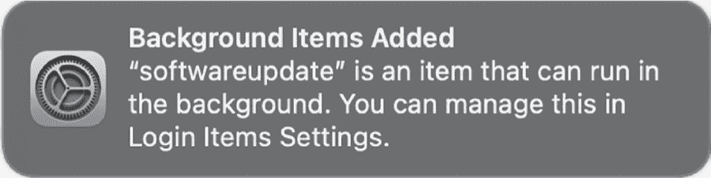

<hgroup>

## 9 静音与授权事件

</hgroup>


在上一章中，我介绍了 Apple 的 Endpoint Security 及其通知事件。在本章中，我将深入探讨更高级的主题，例如静音、静音反转和授权事件。

*静音* 指示 Endpoint Security 阻止某些事件的传递，例如那些由嘈杂的系统进程生成的事件。相反，*静音反转* 使我们能够创建专注的工具，例如仅订阅来自特定进程的事件或仅订阅与少数几个目录访问相关的事件。最后，Endpoint Security 的授权功能提供了一种机制，可以完全防止不希望发生的操作。

本章中展示的大多数代码片段都可以在 第八章 中介绍的 *ESPlayground* 项目中找到。对于这里涵盖的每个主题，我将指出该项目中相关代码所在的部分，以及如何通过命令行参数执行它。

### 静音

所有事件监控实现都面临着大量事件涌入的风险。例如，文件 I/O 事件在正常的系统活动中不断发生，文件监控程序可能会生成大量数据，导致很难找出与恶意进程相关的事件。一种解决方案是静音不相关的进程或路径。例如，您可能希望忽略涉及临时目录的文件 I/O 事件，或来自某些嘈杂的合法操作系统进程（如 Spotlight 索引服务）的事件，因为这些事件几乎不断发生，并且很少对恶意软件检测有用。

幸运的是，Endpoint Security 提供了一个灵活且强大的静音机制。它的 es_mute_path 函数将抑制来自指定进程或与指定路径匹配的事件。该函数有三个参数——一个客户端；一个指向进程、目录或文件的路径；以及一个类型：

```
es_mute_path(es_client_t* _Nonnull client, const char* _Nonnull path,
es_mute_path_type_t type); 
```

静音路径类型可以是 *ESTypes.h* 中 es_mute_path_type_t 枚举类型中的四个值之一：

```
typedef enum {
    ES_MUTE_PATH_TYPE_PREFIX,
    ES_MUTE_PATH_TYPE_LITERAL,
    ES_MUTE_PATH_TYPE_TARGET_PREFIX,
    ES_MUTE_PATH_TYPE_TARGET_LITERAL
} es_mute_path_type_t; 
```

以 PREFIX 结尾的类型告诉 Endpoint Security 提供的路径是一个较长路径的前缀。例如，您可以使用 ES_MUTE_PATH_TYPE_TARGET_PREFIX 选项来静音来自某个目录的所有文件 I/O 事件。另一方面，如果静音路径类型以 LITERAL 结尾，则路径必须完全匹配，才能静音事件。

当你想要静音负责触发 Endpoint Security 事件的进程路径时，请使用枚举中的前两个值，ES_MUTE_PATH_TYPE_PREFIX 和 ES_MUTE_PATH_TYPE_LITERAL。例如，清单 9-1 显示了来自静音功能的代码片段（位于 *ESPlayground* 项目的 *mute.m* 文件中），该代码指示 Endpoint Security 静音所有来源于 *mds_stores* 的事件，*mds_stores* 是一个非常嘈杂的 Spotlight 守护进程，负责管理 macOS 的元数据索引。

```
❶ #define MDS_STORE "/System/Library/Frameworks/CoreServices.framework/Versions/
A/Frameworks/Metadata.framework/Versions/A/Support/mds_stores"

❷ es_mute_path(client, MDS_STORE, ES_MUTE_PATH_TYPE_LITERAL); 
```

示例 9-1：静音来自 Spotlight 服务的事件

在定义了*mds_store*二进制文件的路径❶之后，我们调用`es_mute_path` API❷，传递给它一个端点客户端（之前通过调用`es_new_client`创建的），*mds_stores*二进制文件的路径，以及`ES_MUTE_PATH_TYPE_LITERAL`枚举值。

如果你希望（或同时）将事件的目标静音（例如，在文件监控中，静音被创建或删除的文件路径），可以使用 `ES_MUTE_PATH_TYPE_TARGET_PREFIX` 或 `ES_MUTE_PATH_TYPE_TARGET_LITERAL`。例如，如果我们希望文件监控静音所有涉及到与监控进程运行的用户上下文关联的临时目录的文件事件，我们可以在示例 9-2 中使用以下代码。

```
❶ char tmpDirectory[PATH_MAX] = {0};
realpath([NSTemporaryDirectory() UTF8String], tmpDirectory);

❷ es_mute_path(client, tmpDirectory, ES_MUTE_PATH_TYPE_TARGET_PREFIX); 
```

示例 9-2：静音当前用户的临时目录中的所有事件

我们通过`NSTemporaryDirectory`函数获取临时目录，然后使用`realpath`函数❶解析该路径中的任何符号链接（例如，将*/var*解析为*/private/var*）。接下来，我们静音所有目标路径位于该目录内的文件 I/O 事件❷。

让我们从终端以根权限编译并运行*ESPlayground*项目。当我们通过 Spotlight 启动计算器应用程序时，它应该会打印出各种 Endpoint Security 事件，例如文件打开和关闭事件：

```
# **ESPlayground.app/Contents/MacOS/ESPlayground -mute**

ES Playground
Executing 'mute' logic

**muted process:** /System/Library/Frameworks/
CoreServices.framework/Versions/A/Frameworks/Metadata.framework/Versions/A/Support/mds_stores

**muted directory:** /private/var/folders/zz/zyxvpxvq6csfxvn_n0000000000000/T

event: ES_EVENT_TYPE_NOTIFY_OPEN
process: /System/Library/CoreServices/Spotlight.app/Contents/MacOS/Spotlight
file path: /System/Applications/Calculator.app/Contents/MacOS/Calculator

event: ES_EVENT_TYPE_NOTIFY_CLOSE
process: /System/Library/CoreServices/Spotlight.app/Contents/MacOS/Spotlight
file path: /System/Applications/Calculator.app/Contents/MacOS/Calculator

event: ES_EVENT_TYPE_NOTIFY_OPEN
process: /System/Applications/Calculator.app/Contents/MacOS/Calculator
file path: / 
```

但是由于我们指定了`-mute`标志，我们不会接收到任何来自*mds_stores*守护进程或来自根用户临时目录中的事件。我们可以通过同时运行一个没有静音实现的文件监控来确认这一点。请注意，这次我们收到了这样的事件：

```
# **FileMonitor.app/Contents/MacOS/FileMonitor -pretty**
{
  "event" : "ES_EVENT_TYPE_NOTIFY_OPEN",
  "file" : {
    "destination" : "/private/var/folders/zz/zyxvpxvq6csfxvn_n0000000000000/T",
    "process" : {
      "pid" : 540,
      "name" : "mds_stores",
      "path" : "/System/Library/Frameworks/CoreServices.framework/
      Versions/A/Frameworks/Metadata.framework/Versions/A/Support/mds_stores"
    }
  }
  ...
} 
```

Endpoint Security 还有一些其他与静音相关的 API 值得一提。`es_mute_process`函数提供了另一种静音特定进程事件的方法：

```
es_return_t
es_mute_process(es_client_t* _Nonnull client, const audit_token_t* _Nonnull audit_token); 
```

如定义所示，该函数期望传入一个客户端和需要静音的进程的审计令牌。因为它接受的是审计令牌而不是路径（像`es_mute_path`函数那样），所以你可以静音一个正在运行的进程的特定实例。例如，你很可能希望静音来自你自己 Endpoint Security 工具的事件。使用在第一章中介绍的`getAuditToken`函数，示例 9-3 实现了这样的静音。

```
NSData* auditToken = getAuditToken(getpid());

es_mute_process(client, auditToken.bytes); 
```

示例 9-3：一个 ES 客户端自我静音

除了完全静音一个进程，你还可以通过`es_mute_process_events` API 只静音其部分事件：

```
es_return_t es_mute_process_events(es_client_t* _Nonnull client, const audit_token_t*
_Nonnull audit_token, const es_event_type_t* _Nonnull events, size_t event_count); 
```

在传递一个客户端和你打算静音的进程的审计令牌之后，应该传递一个包含需要静音事件的事件数组，以及该数组的大小。

对于每个静音 API，你会找到一个对应的取消静音函数，例如 es_unmute_path 和 es_unmute_process。此外，Endpoint Security 提供了多个全局取消静音函数。例如，es_unmute_all_paths 取消所有路径的静音。你可以在 Apple 的 Endpoint Security 开发文档中找到关于这些函数的更多细节。^(1)  ### 静音反转

*静音反转*，这是 macOS 13 中向 Endpoint Security 添加的功能，反转了静音的逻辑，包括触发事件的进程和事件本身。这使得你可以，例如，订阅非常特定的一组进程、目录或文件的事件。你会发现它对于以下任务非常有用：

+   检测未经授权访问用户目录的行为，可能是勒索软件试图加密用户文件，或窃取者试图访问身份验证令牌或 cookies^(2)

+   实施防篡改机制来保护你的安全工具^(3)

+   捕获由恶意软件样本在分析或分析过程中触发的事件

例如，考虑 MacStealer，这是一种恶意软件样本，专门针对用户 cookies。^(4) 如果我们反编译它的已编译 Python 代码，我们可以看到它包含一个常见浏览器的列表，例如 Chrome 和 Brave，并且有提取这些浏览器 cookies 的逻辑：

```
class Browsers:
def __init__(self, decrypter: object) -> object:
    ...
    self.cookies_path = []
    self.extension_path = []
    ...
    self.cookies = []
    self.decryption_keys = decrypter
    self.appdata = '/Users/*/Library/Application Support'
    self.browsers = {...
        'google-chrome':self.appdata + '/Google/Chrome/',
        ...
        'brave':self.appdata + '/BraveSoftware/Brave-Browser/',
        ...
    }
    ...
def browser_db(self, data, content_type):
    ...
    else:
        if content_type == 'cookies':
           sql = 'select name,encrypted_value,host_key,path,is_secure,..., from cookies'
           keys = ['name', 'encrypted_value', 'host_key', 'path',..., 'expires_utc']
    ...
    if __name__ == '__main__':
        decrypted = {}
        browsers = Browsers()
        paths = browsers.browser_data() 
```

该代码将收集到的 cookies 外泄，允许恶意软件作者访问用户已登录的帐户。通过利用静音反转，我们可以订阅覆盖浏览器 cookies 所在位置的文件事件。任何试图访问浏览器 cookies 的进程都会触发这些事件，包括 MacStealer，从而提供了一种检测并阻止其未经授权行为的机制。

#### 开始静音反转

要进行静音反转，调用 es_invert_muting 函数，该函数需要一个 Endpoint Security 客户端以及静音反转类型：

```
es_return_t es_invert_muting(es_client_t* _Nonnull client, es_mute_inversion_type_t mute_type);
```

你可以在 *ESTypes.h* 头文件中找到静音反转类型：

```
typedef enum {
    ES_MUTE_INVERSION_TYPE_PROCESS,
    ES_MUTE_INVERSION_TYPE_PATH,
    ES_MUTE_INVERSION_TYPE_TARGET_PATH,
    ES_MUTE_INVERSION_TYPE_LAST
} es_mute_inversion_type_t; 
```

前两种类型允许你进行进程的静音反转。第一种类型应在你想通过其审计令牌进行进程的静音反转时使用，例如，通过 es_mute_process API。另一方面，第二种类型，ES_MUTE_INVERSION_TYPE_PATH，提供了通过路径识别要静音反转的进程的方式。最后，当你想要静音反转与目标路径相关的事件（例如目录）时，应使用 ES_MUTE_INVERSION_TYPE_TARGET_PATH。

静音反转在指定的静音反转类型上全局应用；也就是说，如果您调用了带有 ES_MUTE_INVERSION_TYPE_PATH 类型的 es_invert_muting，那么所有被静音的进程路径将被取消静音。因此，通常会建议为静音反转创建一个新的 Endpoint Security 客户端。（虽然系统对客户端数量有限制，但您的程序可以创建至少几十个客户端，而不会导致 ES_NEW_CLIENT_RESULT_ERR_TOO_MANY_CLIENTS 错误。）还需要注意的是，由于静音反转仅会发生在指定的静音反转类型上，因此您可以混合使用静音和静音反转。例如，您可以静音进程，同时反转事件中找到的路径的静音。这在构建一个利用静音反转的目录监控器时非常有用，但您可能希望忽略（静音）来自受信任系统进程的事件。

静音反转还会影响*默认静音集*，即一些系统关键平台二进制文件的路径，这些路径默认会被静音。您可以调用 es_muted_paths_events 函数来检索所有静音路径的列表，包括默认路径。默认静音集的目的是保护客户端免受死锁和超时恐慌，因此您可能不希望为其路径生成事件。为了避免这样做，请考虑在任何进程路径静音反转之前调用 es_unmute_all_paths，或者在任何目标路径静音反转之前调用 es_unmute_all_target_paths。

现在，您已经启用了反向静音（例如，通过 es_invert_muting API），您可以调用之前提到的任何对应的静音 API，其静音逻辑现在将被反转。下一个部分清楚地说明了这一点，其中利用静音反转来监控单个目录中的文件访问。

#### 监控目录访问

列表 9-4 是一个静音反转代码片段，监控已登录用户的 *Documents* 目录中打开的文件。您可以在 *ESPlayground* 项目的 *muteInvert.m* 文件中的 muteInvert 函数找到完整实现。

在第 213 页的“授权事件”中，我们将结合这种方法与授权访问，这是一个有用的保护机制，能够阻止例如勒索软件或恶意软件尝试访问敏感的用户文件。

```
NSString* consoleUser =
(__bridge_transfer NSString*)SCDynamicStoreCopyConsoleUser(NULL, NULL, NULL); ❶

NSString* docsDirectory =
[NSHomeDirectoryForUser(consoleUser) stringByAppendingPathComponent:@"Documents"];

es_client_t* client = NULL;
es_event_type_t events[] = {ES_EVENT_TYPE_NOTIFY_OPEN};

es_new_client(&client, ^(es_client_t* client, const es_message_t* message) {
    // Add code here to handle delivered events.
});

es_unmute_all_target_paths(client); ❷
es_invert_muting(client, ES_MUTE_INVERSION_TYPE_TARGET_PATH); ❸
es_mute_path(client, docsDirectory.UTF8String, ES_MUTE_PATH_TYPE_TARGET_PREFIX); ❹

es_subscribe(client, events, sizeof(events)/sizeof(events[0])); 
```

列表 9-4：监控用户的 Documents 目录中的文件打开事件

首先，我们动态构建登录用户的 *Documents* 目录路径。由于 Endpoint Security 代码始终以 root 权限运行，大多数返回当前用户的 API 会直接返回 root。相反，我们使用 SCDynamicStoreCopyConsoleUser API 来获取当前登录到系统的用户名 ❶。请注意，该 API 并不支持自动引用计数（ARC）内存管理功能，因此我们添加了 __bridge_transfer，这样就无需手动释放包含用户名的内存。接下来，我们调用 NSHomeDirectoryForUser 函数获取主目录，并将路径组件 *Documents* 附加到该目录上。

在定义感兴趣的事件并创建新的 Endpoint Security 客户端之后，代码取消静音所有目标路径 ❷。然后，它调用 es_invert_muting，并传入 ES_MUTE_INVERSION_TYPE_TARGET_PATH 值来反转静音状态 ❸。接下来，代码调用 es_mute_path，传入文档的目录 ❹。由于我们已反转静音， 此 API 指示 Endpoint Security 只传送该目录中发生的事件并忽略其他所有事件。最后，我们调用 es_subscribe 并传入感兴趣的事件，开始接收这些事件的传送。

为了完成此示例，打印出事件内容，正如你会记得的，这些事件会被传送到在 es_new_client 的最后一个参数中指定的 es_handler_block_t 回调块中。列表 9-5 展示了一个内联实现。

```
es_new_client(&client, ^(es_client_t* client, const es_message_t* message) {
  ❶ es_string_token_t* procPath = &message->process->executable->path;
  ❷ es_string_token_t* filePath = &message->event.open.file->path;

  ❸ printf("event: ES_EVENT_TYPE_NOTIFY_OPEN\n");
    printf("process: %.*s\n", (int)procPath->length, procPath->data);
    printf("file path: %.*s\n", (int)filePath->length, filePath->data);

}); 
```

列表 9-5：打印出文件打开的 Endpoint Security 事件

我们提取负责进程的路径。我们始终可以在通过引用传递给处理程序块的消息结构中找到这个进程。为了获取其路径，我们检查进程结构的可执行成员 ❶。接下来，我们提取进程尝试打开的文件的路径。对于 ES_EVENT_TYPE_NOTIFY_OPEN 事件，我们在消息结构的 event 成员 ❷ 中找到这个路径。在提取了负责进程和文件的路径后，我们将其打印出来 ❸。

工具现在应该能检测到对 *Documents* 目录中文件的任何访问。你可以通过带有 -muteinvert 标志的 *ESPlayground* 来进行测试。你会看到，除非事件发生在 *Documents* 中，否则不会显示任何 Endpoint Security 事件。你可以通过在 Finder 中浏览该目录或使用终端（例如，通过 ls 列出目录内容）来触发这些事件：

```
# **ESPlayground.app/Contents/MacOS/ESPlayground -muteinvert**

ES Playground
Executing 'mute inversion' logic
unmuted all (default) paths
mute (inverted) /Users/Patrick/Documents

event: ES_EVENT_TYPE_NOTIFY_OPEN
process: /System/Library/CoreServices/Finder.app/Contents/MacOS/Finder
file path: /Users/Patrick/Documents

event: ES_EVENT_TYPE_NOTIFY_OPEN
process: /bin/ls
file path: /Users/Patrick/Documents 
```

如果我们扩展示例代码来监控其他目录，例如浏览器存储其 cookie 的目录，我们就能轻松检测到如 MacStealer 之类的窃取工具！在下一节，我将介绍强大的授权事件类型。### 授权事件

与基于通知的事件不同，后者是 Endpoint Security 客户端在系统上发生某些活动后接收到的，授权事件允许客户端在事件完成之前进行检查并决定是否允许或拒绝事件。这一功能提供了一种机制，帮助构建能够主动检测并阻止恶意活动的安全工具。尽管与授权事件的工作方式与通知事件相似，但也存在一些重要的差异。为了探讨这些差异，我们来深入了解代码。

从概念上讲，我们的目标很简单：设计一个工具，能够阻止来自互联网的未经过公证的程序执行。正如我们所见，绝大多数的 macOS 恶意软件并未经过公证，而合法软件几乎总是经过公证的，这使得这一方法在阻止恶意软件方面非常有效。当用户尝试启动从互联网下载的项目时，我们将在允许执行之前拦截该操作，并检查其公证状态。我们将允许有效公证的项目，并阻止所有其他项目。

在撰写本文时，macOS 的最新版本试图实现相同的检查，但其执行不够严格。首先，直到 macOS 15，如果用户右键点击下载项，操作系统仍然提供运行未公证项目的选项。恶意软件作者当然非常清楚这个漏洞，并经常利用它来执行未经信任的恶意软件。广泛存在的 macOS 广告软件 Shlayer 和许多 macOS 木马都喜欢使用这个技巧。此外，Apple 在 macOS 上防止未公证代码的实现存在许多可被利用的漏洞（如 CVE-2021-30657 和 CVE-2021-30853），使其实际上无效。^(5)

我在 Objective-See 最受欢迎的工具之一 BlockBlock 中实现了一个公证检查，详细讨论请参见第十一章。在公证模式下运行时，该工具会阻止任何未经过公证的下载二进制文件，包括试图利用 CVE-2021-30657 和 CVE-2021-30853 的恶意软件，远在 Apple 发布补丁之前。^(6) 我们将在这里大致遵循 BlockBlock 的方法。请注意，在您自己的实现中，您可能采取一种不那么严格的方法；例如，您可能只会阻止那些用户可能被欺骗执行的未公证项目，而不是阻止所有未公证项目。（在 macOS 15 中，Apple 引入了 ES_EVENT_TYPE_NOTIFY_GATEKEEPER_USER_OVERRIDE 事件，您或许可以利用它来检测这一点。）或者，您可能会收集未公证的二进制文件进行外部分析，或对它们应用本书中提到的其他启发式方法，再决定是否阻止其执行。

#### 创建客户端并订阅事件

在本节中，我们订阅 Endpoint Security 授权事件，然后讨论如何及时响应这些事件。您可以在 *ESPlayground* 项目的 *authorization.m* 文件中找到本节中提到的代码的完整实现。

与处理通知事件时一样，我们首先创建一个 Endpoint Security 客户端，指定一个 es_handler_block_t 块，并订阅感兴趣的事件（列表 9-6）。

```
es_client_t* client = NULL;
❶ es_event_type_t events[] = {ES_EVENT_TYPE_AUTH_EXEC};

es_new_client(&client, ^(es_client_t* client, const es_message_t* message) {
    // Add logic to allow or block processes.
});

es_subscribe(client, events, sizeof(events)/sizeof(events[0])); 
```

列表 9-6：订阅进程执行的授权事件

为了阻止未授权的进程，我们只需要订阅一个授权事件：ES_EVENT_TYPE_AUTH_EXEC ❶。苹果的开发者文档简洁地描述了它作为任何“请求操作系统授权以执行另一个映像”的进程的事件类型。^(7) 一旦调用 es_subscribe 返回，Endpoint Security 将在任何新进程即将执行时调用我们的代码。

接下来，我们必须向操作系统响应，决定是授权还是拒绝传递的事件。为了响应，我们使用 es_respond_auth_result API，该 API 在 *ESClient.h* 中定义如下：

```
es_respond_result_t es_respond_auth_result(es_client_t* _Nonnull client,
const es_message_t* _Nonnull message, es_auth_result_t result, bool cache); 
```

该函数接受接收到消息的客户端、传递的消息、授权结果以及一个标志，指示是否应该缓存结果。要允许消息，调用此函数并传入 es_auth_result_t 类型的 ES_AUTH_RESULT_ALLOW 值。要拒绝消息，指定 ES_AUTH_RESULT_DENY 值。如果将缓存标志设置为 true，Endpoint Security 将缓存授权决策，意味着来自同一进程的未来事件可能不会触发额外的授权事件。当然，这样做有性能优势，但也有一些重要的细节需要注意。首先，假设你已经缓存了一个进程执行事件的授权决策。即使该进程使用不同的参数执行，也不会生成额外的授权事件，这可能会导致问题，特别是当检测启发式方法依赖于进程参数时。其次，请注意缓存是全局的，意味着如果任何其他 Endpoint Security 客户端没有缓存该事件，你仍然会收到该事件（即使你之前已经缓存了它）。

让我们在列表 9-6 的代码基础上，提取即将启动的进程路径，然后确定如何响应。为了简单起见，在本示例中我们将允许所有进程（列表 9-7）。

```
es_client_t* client = NULL;
es_event_type_t events[] = {ES_EVENT_TYPE_AUTH_EXEC};

es_new_client(&client, ^(es_client_t* client, const es_message_t* message) {
  ❶ es_process_t* process = message->event.exec.target;
  ❷ es_string_token_t* procPath = &process->executable->path;
 printf("\nevent: ES_EVENT_TYPE_AUTH_EXEC\n");
    printf("process: %.*s\n", (int)procPath->length, procPath->data);

  ❸ es_respond_auth_result(client, message, ES_AUTH_RESULT_ALLOW, false);

});

es_subscribe(client, events, sizeof(events)/sizeof(events[0])); 
```

列表 9-7：处理进程授权事件

在回调块中，我们提取有关即将启动的进程的信息。首先，我们获取指向其 es_process_t 结构体的指针，该结构体与 Endpoint Security 消息中的 es_event_exec_t 结构体一起找到 ❶。从中，我们提取其路径 ❷ 并打印出来。最后，我们调用 es_respond_auth_result API，并使用 ES_AUTH_RESULT_ALLOW 告诉 Endpoint Security 子系统授权该进程的执行 ❸。

> 注意

*在* ESTypes.h* 中，Apple 指定了一个重要但容易忽视的细节：仅对于文件授权事件（ES_EVENT_TYPE_AUTH_OPEN），你的代码必须通过 es_respond_flags_result 函数提供授权响应，而不是通过 es_respond_auth_result 函数。相同的头文件还指出，在调用 es_respond_flags_result 函数时，应传递 0 来拒绝事件，传递 UINT32_MAX 来允许它。*

让我们运行 *ESPlayground* 并加上 -authorization 标志，然后启动计算器应用程序：

```
# **ESPlayground.app/Contents/MacOS/ESPlayground -authorization**

ES Playground
Executing 'authorization' logic

event: ES_EVENT_TYPE_AUTH_EXEC
process: /System/Applications/Calculator.app/Contents/MacOS/Calculator 
```

我们看到了授权事件，由于我们允许所有进程，Endpoint Security 并不会阻止它。

#### 遵守消息截止时间

响应授权事件时有一个非常重要的注意事项：如果我们错过了响应截止时间，Endpoint Security 将允许事件发生并强制关闭我们的客户端。

```
Exception Type:      EXC_CRASH (SIGKILL)
Exception Codes:     0x0000000000000000, 0x0000000000000000
Termination Reason:  Namespace ENDPOINTSECURITY, Code 2 EndpointSecurity client
terminated because it failed to respond to a message before its deadline 
```

从系统和可用性角度来看，这种方法是有道理的。如果程序响应时间过长，整个系统可能会出现延迟，或者更糟糕的是，系统可能会挂起。

es_message_t 结构体中有一个名为 deadline 的字段，告诉我们响应消息的具体时间。头文件中还指出，每个消息的截止时间可能会有所不同，因此我们的代码应该相应地检查每个消息的截止时间。

让我们看看 BlockBlock 的进程监控逻辑是如何处理截止时间的。^(8) 截止时间对于该工具尤其重要，因为它在授权或拒绝未认证的进程之前等待用户的输入，这意味着它面临着可能错过截止时间的实际风险 (Listing 9-8)。

```
❶ dispatch_semaphore_t semaphore = dispatch_semaphore_create(0);
❷ uint64_t deadline = message->deadline - mach_absolute_time();

❸ dispatch_async(dispatch_get_global_queue(QOS_CLASS_DEFAULT, 0), ^{
  ❹ if(0 != dispatch_semaphore_wait(semaphore,
    dispatch_time(DISPATCH_TIME_NOW, machTimeToNanoseconds(deadline)
    - (1 * NSEC_PER_SEC)))) {
      ❺ es_respond_auth_result(client, message, ES_AUTH_RESULT_ALLOW, false);
  }
}); 
```

Listing 9-8：BlockBlock 处理 Endpoint Security 消息截止时间的方式

首先，代码创建一个信号量 ❶ 并计算截止时间 ❷。由于 Endpoint Security 以绝对时间报告消息截止时间，代码通过将当前时间从截止时间中减去，来计算剩余的时间。接下来，代码提交一个块，在后台队列中异步执行 ❸，该块将消息传递给用户，并在另一个异步块中等待响应。我省略了这部分代码以保持简洁，因为其具体内容不相关。

在另一个异步队列中执行耗时的处理操作使得代码可以在处理完成后发出信号量，从而避免超时，接下来代码会设置超时 ❹。一旦 BlockBlock 向用户发送消息并等待响应，它会调用 dispatch_semaphore_wait 函数，直到某个特定时间前等待信号量。你可能猜到了：该函数会等待直到消息的截止时间前。如果发生超时（意味着用户响应没有发出信号量，而消息截止时间即将到达），代码别无选择，只能响应，默认情况下通过授权该事件 ❺。

请注意，函数返回的 Mach 绝对时间值可能因进程而异，具体取决于它们是本地进程还是被翻译的进程。为了保持一致性，你应该应用时间基准，可以使用 mach_timebase_info 函数来获取。Apple 文档通过以下代码演示了这一点，该代码使用时间基准信息将 Mach 时间值转换为纳秒：

```
uint64_t MachTimeToNanoseconds(uint64_t machTime) {
    uint64_t nanoseconds = 0;
    static mach_timebase_info_data_t sTimebase;
    if (sTimebase.denom == 0)
        (void)mach_timebase_info(&sTimebase);

    nanoseconds = ((machTime * sTimebase.numer) / sTimebase.denom);
    return nanoseconds;
} 
```

你可能注意到，列表 9-8 中的代码在计算调度信号量的等待时间时使用了这个函数。

> 注意

*如果你异步处理 Endpoint Security 消息，比如向用户请求输入并等待其响应，你必须通过 es_retain_message API 保留消息。完成消息处理后，你必须通过调用 es_release_message 来释放它。*

现在你已经了解了如何在考虑时间限制的情况下响应 Endpoint Security 授权事件，你已经准备好查看“阻止非公证进程”难题的最后一块拼图。

#### 检查二进制文件来源

一旦我们为 ES_EVENT_TYPE_AUTH_EXEC 事件注册，系统将在每个新进程生成之前调用传递给 es_new_client 函数的 es_handler_block_t 块。在这个块中，我们将添加逻辑，只拒绝来自远程位置的非公证进程。最后这一部分很重要，因为本地平台的二进制文件虽然没有经过公证，但当然应该允许。按照这个思路，你可能还希望考虑允许来自官方 Mac App Store 的应用程序。尽管这些应用没有经过公证，但它们已经通过了类似的且（希望）严格的 Apple 审核流程。

为了确定进程的二进制文件是否来自远程位置，我们将依赖 macOS 来检查二进制文件是否被转移或具有 com.apple.quarantine 扩展属性。如果其中任一条件为真，操作系统已将该项目标记为来自远程来源。*转移*是 macOS 最近版本中内置的安全缓解措施，旨在防止相对动态库劫持攻击。^(9)

简而言之，当用户尝试从下载的磁盘映像或 ZIP 文件中打开可执行项目时，macOS 会首先创建一个包含该项目副本的随机只读挂载点，然后启动这个副本。如果我们能够编程确定一个即将执行的进程已经被迁移，我们就知道需要对其进行公证检查。

要检查一个项目是否已被迁移，我们可以调用私有的 `SecTranslocateIsTranslocatedURL` API。此函数接受多个参数，包括要检查的项目路径和一个布尔标志指针，如果 macOS 已经迁移该项目，它会将该标志设置为 `true`。因为这个 API 是私有的，所以我们必须在调用它之前动态解析它。列表 9-9 中的代码完成了这两个任务。^(10)

```
#import <dlfcn.h>
BOOL isTranslocated(NSString* path) {
    BOOL isTranslocated = NO;
    void* handle = dlopen(
    "/System/Library/Frameworks/Security.framework/Security", RTLD_LAZY); ❶

    BOOL (*SecTranslocateIsTranslocatedURL)(CFURLRef path, bool* isTranslocated,
    CFErrorRef* __nullable error) = dlsym(handle,"SecTranslocateIsTranslocatedURL"); ❷

    SecTranslocateIsTranslocatedURL((__bridge CFURLRef)([NSURL fileURLWithPath:path]),
    &isTranslocated, NULL); ❸

    return isTranslocated;
} 
```

列表 9-9：一个辅助函数，使用私有 API 来判断一个项目是否已被迁移

该代码加载了 *Security* 框架，框架中包含 `SecTranslocateIsTranslocatedURL` API ❶。加载后，代码通过 `dlsym` ❷ 解析该 API，然后使用检查项目路径的方式调用该函数 ❸。当 API 返回时，它会将第二个参数设置为迁移检查的结果。

检查一个项目是否具有远程来源的另一种方法是通过 `com.apple.quarantine` 扩展属性，这个属性由负责下载该项目的应用程序或操作系统直接添加（如果应用程序在其*Info.plist*文件中设置了 LSFileQuarantineEnabled = 1）。你可以通过各种私有的 `qtn_file_*` API 来编程获取项目的扩展属性值，这些 API 位于 */usr/lib/system/libquarantine.dylib*，但你必须先动态解析这些函数。调用它们的方式如下：

1.  调用 `qtn_file_alloc` 来分配一个 _qtn_file 结构。

2.  使用 _qtn_file 指针和你希望获取其隔离属性的项目路径调用 `qtn_file_init_with_path` API。如果此函数返回 `QTN_NOT_QUARANTINED` (-1)，则表示该项目没有被隔离。

3.  使用 _qtn_file 指针调用 `qtn_file_get_flags` API 来获取 `com.apple.quarantine` 扩展属性的实际值。

4.  如果 `qtn_file_init_with_path` 函数未返回 `QTN_NOT_QUARANTINED`，你就知道该项目已被隔离，但你可能还想检查用户是否之前批准了该文件。你可以通过检查 `qtn_file_get_flags` 返回的值来确定这一点，其中可能会设置 `QTN_FLAG_USER_APPROVED (0x0040)` 位。

5.  确保通过调用 `qtn_file_free` 释放 _qtn_file 结构。

在某些情况下，macOS 没有正确地将非本地项目归类为来自远程源。例如，在 CVE-2023-27951 中，操作系统未能应用 com.apple.quarantine 扩展属性。在生产代码中，因此你可能希望采取更全面的方法来确定二进制文件的来源。例如，你可以创建一个文件监视器来检测二进制文件下载，并将这些二进制文件提交给认证检查，或者直接阻止任何未经过认证的非平台二进制文件。并且，是的，恶意软件（在启动后）可能会删除它已经下载的其他组件的隔离扩展属性，从而绕过 macOS 或 BlockBlock 的检查。因此，你也可能希望订阅 ES_EVENT_TYPE_AUTH_DELETEEXTATTR Endpoint Security 事件，它能够检测并阻止隔离属性的删除。

现在我们可以确定一个进程是否来自远程来源，接下来我们必须检查支撑该进程的二进制文件是否已进行认证。正如你在 第一章 中看到的，这和调用 SecStaticCodeCheckValidity API 并传入适当的要求字符串一样简单。

如果 BlockBlock 确认即将执行的进程来自远程来源且未经过认证，它将提示用户输入意见。如果用户决定该进程是，例如，不可信或未被识别，BlockBlock 将调用 Listing 9-10 中的功能来阻止它。

```
-(BOOL)block:(Event*)event {
    BOOL blocked = NO;

    if(YES != (blocked = [self respond:event action:ES_AUTH_RESULT_DENY])) {
        os_log_error(logHandle, "ERROR: failed to block %{public}@", event.process.name);
    }

    return blocked;
} 
```

Listing 9-10：阻止不可信进程

它调用了 respond:action: 方法，并使用了 ES_AUTH_RESULT_DENY 常量。如果我们查看这个方法，会发现其核心其实只是调用了 es_respond_auth_result，将指定的允许或拒绝动作传递给 Endpoint Security 子系统。而且，由于传入了 true 作为缓存标志，后续执行相同的进程时不会生成额外的授权事件，从而显著提高性能（Listing 9-11）。

```
-(BOOL)respond:(Event*)event action:(es_auth_result_t)action {
    ...
    result = es_respond_auth_result(event.esClient, event.esMessage, action, true);
    ...
} 
```

Listing 9-11：将操作传递给 Endpoint Security

要实现通过 Endpoint Security 阻止未经过认证的进程，参见 BlockBlock 的进程插件。^(11)

#### 阻止后台任务管理绕过

让我们考虑另一个例子，这次使用 Endpoint Security 授权事件来检测恶意软件，重点是尝试利用绕过内置 macOS 安全机制的漏洞。虽然这些漏洞的使用尚未广泛传播，但 macOS 中新安全机制的引入迫使恶意软件采用新的技术来实现其恶意目标，因此监控这些漏洞可能有助于你的检测。

在第五章中，我讨论了 macOS 新的后台任务管理（BTM）数据库，它用于监控持久化项目，生成警告并全局跟踪其行为。对于希望持久化的恶意软件来说，BTM 是一个问题，因为用户在恶意软件安装时会收到警告。例如，图 9-1 展示了用户在 DazzleSpy 恶意软件作为名为 *softwareupdate* 的二进制文件持久安装时收到的 BTM 警告。



图 9-1：BTM 警告，显示名为 softwareupdate 的二进制文件已被持久安装

幸运的是，通过我的研究，我发现 Apple 原始实现的 BTM 容易通过多种方式被绕过，从而阻止了这个警告。本节将详细介绍两种绕过方法，并展示如何利用 Endpoint Security 检测和阻止这些绕过。请注意，我已将这些问题反馈给 Apple，至少在 macOS 15（可能早期版本的 macOS 也已修复）中，似乎已得到修复。即便如此，您仍然可以根据本节中的代码检测其他本地漏洞。

##### 手动重置数据库

绕过 BTM 的第一个方法非常简单。回想一下，第五章讨论了与 macOS 一起发布的 sfltool，用户可以通过它与 BTM 数据库进行交互。它的一个命令行选项 resetbtm 会清空数据库，并导致其重建。然而，一旦运行此命令，系统不会发送后续的 BTM 警告，直到系统重启，尽管某些项目仍然可能存在。

因此，恶意软件如果想避免触发 BTM 警告，可以在执行其持久化代码之前，简单地执行带有 resetbtm 参数的 sfltool 命令。虽然这个技术在实际中尚未被观察到，但它非常容易被利用，如以下日志信息所示，这些信息是在手动重置数据库后生成的。日志显示，尽管 BTM 守护进程检测到 DazzleSpy 的持久化安装，但它决定不发布警告：

```
% **log stream**
backgroundtaskmanagementd: registerLaunchItem: result=no error, new item
disposition=[enabled, allowed, visible, not notified],
identifier=com.apple.softwareupdate,
url=file:///Users/User/Library/LaunchAgents/com.apple.softwareupdate.plist
backgroundtaskmanagementd: **should post advisory=false** for uid=501, id=
6ED3BEBC-8D60-45ED-8BCC-E0163A8AA806, item=softwareupdate 
```

在正常情况下，用户没有理由重置 BTM 数据库。因此，我们可以通过订阅 Endpoint Security 进程事件，并阻止在执行带有 resetbtm 参数的 sfltool 时启动它，从而防止此漏洞的利用。

为了检测进程的执行，包括 sfltool，我们可以注册 第八章中讨论的 ES_EVENT_TYPE_NOTIFY_EXEC 事件。我们可以通过 es_process_t 进程结构访问进程路径，并通过 es_exec_arg_count 和 es_exec_arg 辅助函数提取其参数。一旦提取了路径和参数，简单的字符串比较应该能告诉我们，报告的进程事件是否是由带有 resetbtm 参数的 sfltool 引发的。

当然，你很可能想要阻止这些事件，你可以通过注册 ES_EVENT_TYPE_AUTH_EXEC 来做到这一点。此事件的回调将被调用，并携带一个包含指向 es_process_t 结构的 Endpoint Security 消息。从中，你可以提取即将生成的进程的路径和参数，然后通过调用 es_respond_auth_result 函数，并传递 ES_AUTH_RESULT_DENY 的值来阻止进程的生成。

##### 停止信号

在研究 BTM 子系统时，我遇到了另一种轻微的绕过其警报的方式^(12)。简而言之，恶意软件可以轻松地向负责向用户显示持久性提示消息的 BTM 代理发送一个停止（SIGSTOP）信号。一旦该组件停止，恶意软件便可以在不引起用户警觉的情况下持久存在。为了检测并阻止这种绕过，我们可以再次依靠 Endpoint Security。由于在正常情况下用户不太可能向 BTM 代理发送 SIGSTOP 信号，我们可以假设这个事件是恶意软件试图对该子系统进行攻击。

在我演讲后的第二年，Sentinel One 的研究人员发现了恶意软件采取了类似（但不那么优雅）的方法。在他们的报告中^(13)，研究人员指出，恶意代码会不断向 macOS 的通知中心进程发送杀死信号，以阻止 BTM 的持久性提示消息，而该消息通常会在恶意软件持久存在时显示。

我们可以通过 ES_EVENT_TYPE_NOTIFY_SIGNAL 事件来检测信号，或者更好的是，通过相应的授权事件 ES_EVENT_TYPE_AUTH_SIGNAL 来完全阻止信号。在 Listing 9-12 中，我们将重点关注后者的任务。

```
es_client_t* client = NULL;
es_event_type_t events[] = {ES_EVENT_TYPE_AUTH_SIGNAL};

es_new_client(&client, ^(es_client_t* client, const es_message_t* message) {
    int signal = message->event.signal.sig; ❶
    es_process_t* sourceProcess = message->process; ❷
    es_process_t* targetProcess = message->event.signal.target; ❸

 // Add code to check if signal is a SIGSTOP or SIGKILL being sent to a process
    // involved in showing user notification alerts.

});

es_subscribe(client, events, sizeof(events)/sizeof(events[0])); 
```

Listing 9-12：订阅信号传递的授权事件

每当一个进程尝试发送信号时，Endpoint Security 将调用回调，并带有一个包含 es_event_signal_t 结构的消息。代码将提取信号的类型❶，以及源进程❷和目标进程❸。

我们可以检查信号是否为 SIGSTOP 或 SIGKILL，且接收信号的进程是否为 BTM 代理或通知中心。如果是，我们只需通过调用 es_respond_auth_result 并传递 ES_AUTH_RESULT_DENY 值来拒绝信号传递（参见 Listing 9-13）。

```
if((signal == SIGSTOP) || (signal == SIGKILL)) {
    pid_t targetPID = audit_token_to_pid(targetProcess->audit_token);

    if((targetPID == btmAgentPID) || (targetPID == notificationCenterPID)) {
        es_respond_auth_result(client, message, ES_AUTH_RESULT_DENY, false);
    }
} 
```

Listing 9-13：拒绝可疑的 SIGSTOP 或 SIGKILL 信号

请注意，在代码的其他地方，你可能需要查找并保存 BTM 代理和通知中心进程的进程 ID，因为你不希望每次信号传递时都查找它。你还可能想要记录一条消息，其中包含有关试图发送可疑信号的源进程的信息，或者收集这些信息以便进一步检查。

如果你实现了这段代码，编译并运行它，然后手动尝试通过停止代理来破坏 BTM 子系统的通知，你的操作应该会失败：

```
% **pgrep BackgroundTaskManagementAgent**
590

% **kill -SIGSTOP 590**
kill: kill 590 failed: operation not permitted 
```

在终端中，我们获取 BTM 代理的进程 ID（本例中为 590）。然后，我们使用 kill 命令向该代理发送 SIGSTOP 信号。这将触发一个 ES_EVENT_TYPE_AUTH_SIGNAL 事件传递给我们的程序，我们会拒绝它，导致“操作不允许”的消息显示。### 构建文件保护器

我将通过开发一个概念验证的文件保护器来结束对端点安全框架的讨论。您可以在*ESPlayground*项目的*protect.m*文件中的保护函数中找到它的完整实现。

我们的代码将监控一个特定目录（例如，用户的主目录或包含浏览器 cookie 的目录），并仅允许授权的进程访问该目录。每当一个进程试图访问该目录中的文件时，端点安全会触发一个授权事件，给予我们的代码机会来仔细检查该进程并决定是否允许它。在这个例子中，我们只会允许平台和已验证的二进制文件，其他的则被阻止。

这个文件保护器在概念上类似于苹果的透明度、同意与控制（TCC），但它增加了另一层保护。毕竟，用户可能天真地将 TCC 权限授予恶意软件，使得先前受保护的文件变得可访问，而恶意软件通常会利用或绕过 TCC 本身，就像 XCSSET 恶意软件的情况一样。^(14) 最后，您可能希望为位于 TCC 保护目录之外的文件提供授权访问（并检测未经授权的访问），例如某些第三方浏览器的 cookie 文件。

在本章之前，我讨论了通过通知事件监控已登录用户的*Documents*目录。本节中的代码类似，只不过它覆盖了用户的整个主目录，并将感兴趣的事件列表扩展到包括与文件删除尝试相关的事件。最显著的是，这段代码利用了端点安全授权事件来主动阻止不受信任的访问。像往常一样，我们将首先指定感兴趣的端点安全事件，创建端点安全客户端，设置静音反转，最后订阅这些事件（示例 9-14）。

```
NSString* consoleUser =
(__bridge_transfer NSString*)SCDynamicStoreCopyConsoleUser(NULL, NULL, NULL);

NSString* homeDirectory = NSHomeDirectoryForUser(consoleUser);

es_client_t* client = NULL;
es_event_type_t events[] = {ES_EVENT_TYPE_AUTH_OPEN, ES_EVENT_TYPE_AUTH_UNLINK}; ❶

es_new_client(&client, ^(es_client_t* client, const es_message_t* message) {
    // Add code here to implement logic to examine process and respond to event.
});

es_unmute_all_target_paths(client); ❷
es_invert_muting(client, ES_MUTE_INVERSION_TYPE_TARGET_PATH);
es_mute_path(client, homeDirectory.UTF8String, ES_MUTE_PATH_TYPE_TARGET_PREFIX); ❸

es_subscribe(client, events, sizeof(events)/sizeof(events[0])); 
```

示例 9-14：设置端点安全客户端以授权文件访问

几个端点安全授权事件与文件访问相关。在这里，我们使用 ES_EVENT_TYPE_AUTH_OPEN 和 ES_EVENT_TYPE_AUTH_UNLINK ❶，它们使我们能够授权试图打开或删除文件的程序。前者事件可以检测到具有勒索软件或盗窃者能力的多种恶意软件，而后者事件则可能检测并防止具有擦除功能的恶意软件，它们可能试图删除或清除重要文件。

在创建一个新的 Endpoint Security 客户端（我们稍后将编写其处理块）❷之后，代码设置了静音反转 ❸，因为我们只对即将指定的目录中的事件感兴趣。它动态构建了一个指向登录用户主目录的路径，然后调用 es_mute_path API。因为我们已经反转了静音，这个 API 会告诉 Endpoint Security 子系统只传递发生在指定路径中的事件。代码调用 es_subscribe 后，Endpoint Security 将开始通过执行在 es_new_client 函数中指定的处理块来传递事件。

我们该如何实现这样的处理块？为了简单起见，假设我们将允许任何访问（清单 9-15）。

```
es_new_client(&client, ^(es_client_t* client, const es_message_t* message) {
    switch(message->event_type) {
        case ES_EVENT_TYPE_AUTH_OPEN:
            es_respond_flags_result(client, message, UINT32_MAX, false); ❶
            break;
        case ES_EVENT_TYPE_AUTH_UNLINK:
            es_respond_auth_result(client, message, ES_AUTH_RESULT_ALLOW, false); ❷
            break;
        ...
    }
}); 
```

清单 9-15：允许所有文件访问

回想一下，对于 ES_EVENT_TYPE_AUTH_OPEN 事件，Apple 文档中指出我们必须使用 es_respond_flags_result 函数 ❶ 来响应。为了告诉 Endpoint Security 子系统允许该事件，我们使用 UINT32_MAX 调用这个函数。对于 ES_EVENT_TYPE_AUTH_UNLINK 事件，我们像往常一样使用 es_respond_auth_result 进行响应 ❷。

另一方面，清单 9-16 展示了拒绝在目录中打开或删除文件的代码。

```
es_new_client(&client, ^(es_client_t* client, const es_message_t* message) {
    switch(message->event_type) {
        case ES_EVENT_TYPE_AUTH_OPEN:
            es_respond_flags_result(client, message, 0, false); ❶
            break;
        case ES_EVENT_TYPE_AUTH_UNLINK:
 es_respond_auth_result(client, message, ES_AUTH_RESULT_DENY, false); ❷
            break;
        ...
    }

}); 
```

清单 9-16：拒绝所有文件访问

允许所有事件的代码唯一的变化是，我们现在调用 es_respond_flags_result 函数 ❶，将其第三个参数设置为 0，并将 es_respond_auth_result 的值传递为 ES_AUTH_RESULT_DENY ❷。

让我们扩展这段代码，提取负责该事件的进程路径，以及进程尝试打开或删除的文件路径（清单 9-17）。

```
es_new_client(&client, ^(es_client_t* client, const es_message_t* message) {
    es_string_token_t* filePath = NULL;
    es_string_token_t* procPath = &message->process->executable->path; ❶

    switch(message->event_type) {
        case ES_EVENT_TYPE_AUTH_OPEN:
            filePath = &message->event.open.file->path; ❷
            es_respond_flags_result(client, message, 0, false);
            break;
        case ES_EVENT_TYPE_AUTH_UNLINK:
            filePath = &message->event.unlink.target->path; ❸
            es_respond_auth_result(client, message, ES_AUTH_RESULT_DENY, false);
            break;
        ...
    }
}); 
```

清单 9-17：提取进程路径和文件路径

我们可以在任何 Endpoint Security 事件的消息结构中的进程成员中找到负责的进程路径 ❶，但其他信息是特定于事件的。因此，我们在每种事件类型的处理块中提取文件。对于 ES_EVENT_TYPE_AUTH_OPEN 事件，我们在 es_event_open_t 结构体中找到它 ❷，而对于 ES_EVENT_TYPE_AUTH_UNLINK 事件，它位于 es_event_unlink_t 结构体中 ❸。

现在我们应该根据某些规则来允许或拒绝文件的打开和删除，具体取决于我们要保护的内容。回想一下，MacStealer 恶意软件试图窃取浏览器的 Cookie。一般来说，除了浏览器，任何第三方进程都不应该访问浏览器的 Cookie。因此，您可能只是想实现一个拒绝规则，并设置一个例外，允许浏览器本身访问。通过进程 ID、路径，或者更好的是，代码签名信息，应该很容易识别是否是浏览器在执行该进程。

如果你在保护用户主目录中的文件，这种“拒绝所有但有例外”方法可能会影响系统的可用性。因此，你可能需要使用启发式方法，比如仅授权公证的应用程序、来自 App Store 的应用程序或平台二进制文件。然而，恶意软件有时会将操作委托给 Shell 命令，而这些命令是平台二进制文件，因此你可能需要检查相关进程的进程层级，以确保它没有被恶意滥用。

在这个例子中，我们通过只允许平台或公证二进制文件访问当前用户的主目录来简化处理（见列表 9-18）。

```
es_new_client(&client, ^(es_client_t* client, const es_message_t* message) {
    es_string_token_t* filePath = NULL;
    es_string_token_t* procPath = &message->process->executable->path;

    BOOL isTrusted = ((YES == message->process->is_platform_binary) ||
    (YES == isNotarized(message->process)));

    switch(message->event_type) {
        case ES_EVENT_TYPE_AUTH_OPEN:
            filePath = &message->event.open.file->path;
            printf("\nevent: ES_EVENT_TYPE_AUTH_OPEN\n");
            printf("responsible process: %.*s\n", (int)procPath->length, procPath->data);
            printf("target file path: %.*s\n", (int)filePath->length, filePath->data);
            if(YES == isTrusted) {
                printf("process is trusted, so will allow event\n");
                es_respond_flags_result(client, message, UINT32_MAX, false);
            } else {
                printf("process is *not* trusted, so will deny event\n");
                es_respond_flags_result(client, message, 0, false);
            }
            break;

        case ES_EVENT_TYPE_AUTH_UNLINK:
            filePath = &message->event.unlink.target->path;
            printf("\nevent: ES_EVENT_TYPE_AUTH_UNLINK\n");
            printf("responsible process: %.*s\n", (int)procPath->length, procPath->data);
            printf("target file path: %.*s\n", (int)filePath->length, filePath->data);
            if(YES == isTrusted) {
                printf("process is trusted, so will allow event\n");
                es_respond_auth_result(client, message, ES_AUTH_RESULT_ALLOW, false);
            } else {
                printf("process is *not* trusted, so will deny event\n");
                es_respond_auth_result(client, message, ES_AUTH_RESULT_DENY, false);
            }
            break;
        ...
    }
}); 
```

列表 9-18：仅授予平台和公证进程的文件访问权限

我们检查相关进程是否是平台二进制文件或已经过公证。检查一个进程是否是平台二进制文件，就像检查传递的 Endpoint Security 消息中进程结构的 is_platform_binary 成员一样简单。在第三章中，我们使用了 Apple 的代码签名 API 来判断一个进程是否经过公证；这里我们不再重复这个过程，除了提到我们创建了一个简单的辅助函数 isNotarized，它使用相关进程的审计令牌来检查其公证状态。（如果你有兴趣查看这个函数的完整实现，可以查看*ESPlayground*项目中的*protect.m*文件。）

同时值得指出的是，逻辑“或”运算符如果第一个条件为真，会短路，因此我们将平台二进制检查放在前面。因为它只是对结构中的布尔值进行简单检查，这比完整的公证检查计算量要小，所以我们先执行更高效的检查，仅在需要时才执行第二个检查。

让我们编译*ESPlayground*项目并使用-protect 标志运行它，以触发这一逻辑。该工具检测到使用内置的 macOS 命令来检查用户主目录并删除*Documents*目录中的文件，但仍然允许这些操作：

```
# **ESPlayground.app/Contents/MacOS/ESPlayground -protect**

ES Playground
Executing 'protect' logic
protecting directory: /Users/Patrick

event: ES_EVENT_TYPE_AUTH_OPEN
responsible process: /bin/ls
target file path: /Users/Patrick
process is trusted, so will allow event

event: ES_EVENT_TYPE_AUTH_UNLINK
responsible process: /bin/rm
target file path: /Users/Patrick/Documents/deleteMe.doc
process is trusted, so will allow event 
```

现在考虑一下 WindTail，这是一个持久的网络间谍植入程序，旨在枚举并外泄用户*Documents*目录中的文件。如果我们将它安装在虚拟机中，我们可以看到恶意软件（名为*Final_Presentation.app*）试图枚举用户文档目录中的文件。我们检测到这种访问行为，并且因为 WindTail 的二进制文件（在这个例子中叫做*usrnode*）不被信任，我们阻止了对该目录的访问：

```
# **ESPlayground.app/Contents/MacOS/ESPlayground -protect**

ES Playground
Executing 'protect' logic
protecting directory: /Users/User

event: ES_EVENT_TYPE_AUTH_OPEN
responsible process: /Users/User/Library/Final_Presentation.app/Contents/MacOS/usrnode
target file path: /Users/User/Documents
process is *not* trusted, so will deny event 
```

无法过分强调端点安全对于构建能够检测和防护 Mac 恶意软件的工具的重要性。近年来，苹果在该框架中添加了更多事件（如 macOS 13 中的 ES_EVENT_TYPE_NOTIFY_XP_MALWARE_DETECTED 和 macOS 15 中的 ES_EVENT_TYPE_NOTIFY_GATEKEEPER_USER_OVERRIDE），并且增强了强大的功能，因此，在构建任何安全工具时，使用端点安全应该是你首先考虑的事项。

### 结论

本章介绍了高级端点安全主题，包括静音、反向静音和授权事件。示例展示了如何使用这些功能构建能够检测恶意软件在执行未授权操作时的工具，并且主动阻止这些行为。

本章总结了本书的第二部分，专注于实时监控能力的主题。第三部分将结合第一部分和第二部分中涉及的多个主题，探索 Objective-See 最受欢迎的 macOS 恶意软件检测工具的内部工作原理。

### 注释

1.    1.  请参阅 “Client”，Apple 开发者文档，[*https://<wbr>developer<wbr>.apple<wbr>.com<wbr>/documentation<wbr>/endpointsecurity<wbr>/client*](https://developer.apple.com/documentation/endpointsecurity/client).

1.    2.  Pete Markowsky (@PeteMarkowsky), “你可以用这个做的一小部分事情。1\. 将对你的 SAAS 承载令牌的访问锁定到特定应用程序……”，X，2023 年 5 月 2 日，[*https://<wbr>x<wbr>.com<wbr>/PeteMarkowsky<wbr>/status<wbr>/1653453951839109133*](https://x.com/PeteMarkowsky/status/1653453951839109133)。

1.    3.  请参阅 [*https://<wbr>github<wbr>.com<wbr>/google<wbr>/santa<wbr>/blob<wbr>/8a7f1142a87a48a48271c78c94f830d8efe9afa9<wbr>/Source<wbr>/santad<wbr>/EventProviders<wbr>/SNTEndpointSecurityTamperResistance<wbr>.mm#L15*](https://github.com/google/santa/blob/8a7f1142a87a48a48271c78c94f830d8efe9afa9/Source/santad/EventProviders/SNTEndpointSecurityTamperResistance.mm#L15).

1.    4.  Shilpesh Trivedi, “MacStealer: 揭示一款新识别的基于 MacOS 的窃取恶意软件，” *Uptycs*，2023 年 3 月 24 日，[*https://<wbr>www<wbr>.uptycs<wbr>.com<wbr>/blog<wbr>/macstealer<wbr>-command<wbr>-and<wbr>-control<wbr>-c2<wbr>-malware*](https://www.uptycs.com/blog/macstealer-command-and-control-c2-malware)。

1.    5.  你可以在 Patrick Wardle 的文章《All Your Macs Are Belong to Us》中阅读更多关于这些认证绕过漏洞的内容，Objective-See，2021 年 4 月 26 日，[*https://<wbr>objective<wbr>-see<wbr>.org<wbr>/blog<wbr>/blog<wbr>_0x64<wbr>.html*](https://objective-see.org/blog/blog_0x64.html)，以及在 Patrick Wardle 的另一篇文章《Where’s the Interpreter!?》，Objective-See，2021 年 12 月 22 日，[*https://<wbr>objective<wbr>-see<wbr>.org<wbr>/blog<wbr>/blog<wbr>_0x6A<wbr>.html*](https://objective-see.org/blog/blog_0x6A.html)。

1.  6.  Objective-See 基金会（@objective_see），“你知道 BlockBlock . . . 吗？”，X，2022 年 3 月 2 日，[*https://<wbr>x<wbr>.com<wbr>/objective<wbr>_see<wbr>/status<wbr>/1499172783502204929*](https://x.com/objective_see/status/1499172783502204929)。

1.  7.  “ES_EVENT_TYPE_AUTH_EXEC”，苹果开发者文档，[*https://<wbr>developer<wbr>.apple<wbr>.com<wbr>/documentation<wbr>/endpointsecurity<wbr>/es<wbr>_event<wbr>_type<wbr>_t<wbr>/es<wbr>_event<wbr>_type<wbr>_auth<wbr>_exec*](https://developer.apple.com/documentation/endpointsecurity/es_event_type_t/es_event_type_auth_exec)。

1.  8.  参见 [*https://<wbr>github<wbr>.com<wbr>/objective<wbr>-see<wbr>/BlockBlock*](https://github.com/objective-see/BlockBlock)。

1.  9.  你可以阅读由我揭示的这些攻击，参见 Patrick Wardle，“OS X 上的 Dylib 劫持”，病毒公报，2015 年 3 月 19 日，[*https://<wbr>www<wbr>.virusbulletin<wbr>.com<wbr>/blog<wbr>/2015<wbr>/03<wbr>/paper<wbr>-dylib<wbr>-hijacking<wbr>-os<wbr>-x*](https://www.virusbulletin.com/blog/2015/03/paper-dylib-hijacking-os-x)。

1.  10.  列表 9-9 中的代码灵感来自 Jeff Johnson， “检测应用程序转移”，Lapcat 软件公司，2016 年 7 月 26 日，[*https://<wbr>lapcatsoftware<wbr>.com<wbr>/articles<wbr>/detect<wbr>-app<wbr>-translocation<wbr>.html*](https://lapcatsoftware.com/articles/detect-app-translocation.html)。

1.  11.  参见 [*https://<wbr>github<wbr>.com<wbr>/objective<wbr>-see<wbr>/BlockBlock<wbr>/blob<wbr>/master<wbr>/Daemon<wbr>/Daemon<wbr>/Plugins<wbr>/Processes<wbr>.m*](https://github.com/objective-see/BlockBlock/blob/master/Daemon/Daemon/Plugins/Processes.m)。

1.  12.  Patrick Wardle，“揭开 macOS 后台任务管理的神秘面纱（及绕过方法）”，在 DefCon 大会上展示，拉斯维加斯，2023 年 8 月 12 日，[*https://<wbr>speakerdeck<wbr>.com<wbr>/patrickwardle<wbr>/demystifying<wbr>-and<wbr>-bypassing<wbr>-macoss<wbr>-background<wbr>-task<wbr>-management*](https://speakerdeck.com/patrickwardle/demystifying-and-bypassing-macoss-background-task-management)。

1.  13.  Phil Stokes，“后门激活器恶意软件在 macOS 应用程序的种子中广泛传播”，Sentinel One，2024 年 2 月 1 日，[*https://<wbr>www<wbr>.sentinelone<wbr>.com<wbr>/blog<wbr>/backdoor<wbr>-activator<wbr>-malware<wbr>-running<wbr>-rife<wbr>-through<wbr>-torrents<wbr>-of<wbr>-macos<wbr>-apps<wbr>/*](https://www.sentinelone.com/blog/backdoor-activator-malware-running-rife-through-torrents-of-macos-apps/)。

1.  14.  Jaron Bradley，“XCSSET 恶意软件中发现的零日 TCC 绕过”，Jamf，2021 年 5 月 24 日，[*https://<wbr>www<wbr>.jamf<wbr>.com<wbr>/blog<wbr>/zero<wbr>-day<wbr>-tcc<wbr>-bypass<wbr>-discovered<wbr>-in<wbr>-xcsset<wbr>-malware<wbr>/*](https://www.jamf.com/blog/zero-day-tcc-bypass-discovered-in-xcsset-malware/)。
