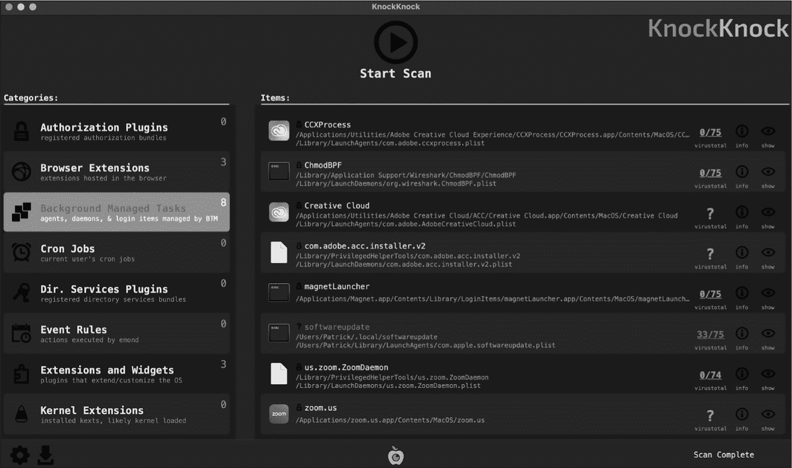

## 第十章：10 持久化枚举器


2014 年初，一位亲密的朋友请求我帮忙清除他 Mac 上的病毒。当我坐到他屏幕前时，我看到明显的广告软件感染迹象：大量的浏览器弹窗，以及被劫持的首页。更糟糕的是，重置浏览器并不起作用；每次重启后，浏览器都会恢复到感染状态，这表明系统中有一个持久化组件深藏其中。

当时，我是一名经验丰富的 Windows 恶意软件分析师，刚刚开始涉足 macOS 的世界。天真地，我以为可以下载一个能够列出系统中所有持久化软件的工具来揭示恶意组件。像微软的 AutoRuns 这样的知名安全工具提供了类似功能，适用于 Windows 系统，但我很快发现，Mac 上并没有类似的工具。

我回到家后，花了几天时间编写了一个 Python 脚本，尽管它丑得令人尴尬，但却能够列出几种类型的持久化软件。运行脚本后，我发现了一个未被识别的启动代理，最终证明它是广告软件的核心持久化组件。一旦我将其移除，他的 Mac 就恢复如新。

意识到我的脚本可以帮助其他 Mac 用户，我整理了一下并发布了它，命名为 KnockKnock。^(2)（为什么叫 KnockKnock？因为它告诉你“谁在那儿！”）如今，KnockKnock 从最初的简单命令行脚本发展到了一个功能强大的工具。现在作为原生 macOS 应用程序分发，它能够检测任何 macOS 系统上持久安装的各种项目。配合直观的用户界面（UI）、与 VirusTotal 的集成以及将结果导出用于安全信息和事件管理（SIEM）的功能，它是我在怀疑 Mac 可能感染时首先运行的工具。

在本章中，我将介绍 KnockKnock 的设计和实现，带你深入了解这个工具，并扩展你对 macOS 恶意软件常用（或可能使用）的持久化方法的理解。在这个过程中，我们将超越第五章中讨论的仅关注背景任务管理数据库的检测机制，探索其他在 macOS 上持久化的方式，包括浏览器扩展和动态库劫持。你可以在 Objective-See 的 GitHub 页面上的 KnockKnock 仓库中找到完整的源代码，链接地址是 [*https://<wbr>github<wbr>.com<wbr>/Objective<wbr>-see<wbr>/KnockKnock*](https://github.com/Objective-see/KnockKnock)。

### 工具设计

KnockKnock 是一个标准的基于 UI 的应用程序（如图 10-1 所示），但用户也可以在终端中将其作为命令行工具执行。



图 10-1：KnockKnock 的用户界面

由于这不是一本关于编写用户界面的书（谢天谢地！），所以我不会深入探讨与 KnockKnock UI 相关的代码。相反，我将主要关注它的核心组件，例如负责查询操作系统各个方面的许多插件，这些插件用来枚举持久安装的项目。

#### 命令行选项

任何 Objective-C 程序的代码从标准的 main 函数开始，KnockKnock 也不例外。在它的 main 函数中，KnockKnock 会首先检查其程序参数，以确定是否应该显示使用信息或执行命令行扫描（列表 10-1）。

```
int main(int argc, const char* argv[]) {
    ...
    if((YES == [NSProcessInfo.processInfo.arguments containsObject:@"-h"]) ||
        (YES == [NSProcessInfo.processInfo.arguments containsObject:@"-help"])) {
        usage();
        goto bail;
    }

    if(YES == [NSProcessInfo.processInfo.arguments containsObject:@"-whosthere"]) {
        ...
        cmdlineScan();
    }
    ...
} 
```

列表 10-1：解析命令行选项

你可能熟悉通过主函数的 argv 访问程序的命令行参数。Objective-C 支持这种方法，但我们也可以通过 NSProcessInfo 类中的 processInfo 属性的 arguments 数组来访问这些参数。这种技术有几个优点，最显著的是它将参数转换为 Objective-C 对象。这意味着，例如，我们可以使用 containsObject: 方法轻松判断用户是否指定了某个命令行参数，而无需考虑参数的顺序。

为了判断是否运行命令行扫描，KnockKnock 会检查用户是否指定了 -whosthere 命令行选项。如果是，它会调用 cmdlineScan 函数来扫描系统，并将关于持久安装项的信息直接输出到终端。

#### 插件

因为恶意软件可以通过多种方式在 macOS 上持久存在，并且研究人员时不时发现新的方法，KnockKnock 的设计依赖于我称之为插件的概念。每个插件对应一种持久性类型，并实现列举该类型持久性项目的逻辑。插件随后会调用 KnockKnock 的其他部分来执行例如在 UI 中显示每个项目的操作。这种模块化方法提供了一种简单高效的方式来支持新的持久性技术。例如，在研究人员 Csaba Fitzl 发布了博客文章《Beyond the Good Ol’ LaunchAgents -32- Dock Tile Plugins》，该文章详细描述了涉及 macOS Dock 插件的新持久性策略后，^(3) 我在一小时内通过一个新的插件向 KnockKnock 添加了相应的检测功能。

KnockKnock 的每个插件都继承自一个名为 PluginBase 的自定义插件基类，该类声明了所有插件共有的属性以及基础方法。该基类位于 *PluginBase.h* 中，包含插件元数据，如名称和描述，以及插件在遇到持久化项目时填充的数组（列表 10-2）。

```
@interface PluginBase : NSObject
    @property(retain, nonatomic)NSString* name;
    @property(retain, nonatomic)NSString* icon;
    @property(retain, nonatomic)NSString* description;

    @property(retain, nonatomic)NSMutableArray* allItems;
    @property(retain, nonatomic)NSMutableArray* flaggedItems;
    @property(retain, nonatomic)NSMutableArray* unknownItems;

    @property(copy, nonatomic) void (^callback)(ItemBase*);
    ....
@end 
```

列表 10-2：基础插件类的属性

该类还声明了各种基础方法（列表 10-3）。

```
-(void)scan;
-(void)reset;
-(void)processItem:(ItemBase*)item; 
```

列表 10-3：基础插件类的方法

每个插件必须实现一个扫描方法，逻辑是枚举一种持久项类型。例如，背景任务管理插件将解析背景任务管理数据库，以提取由背景任务管理子系统管理的持久项，而浏览器扩展插件将枚举已安装的浏览器，并为每个浏览器提取已安装的浏览器扩展。如果研究人员发现了一种新的持久性机制，我们可以轻松地添加一个新的插件，并提供一个能够枚举以这种新方式持久存在的项的扫描方法。

如果直接调用，基类的扫描方法将抛出异常（列表 10-4）。

```
@implementation PluginBase
...
-(void)scan {
    @throw [NSException exceptionWithName:kExceptName
    reason:[NSString stringWithFormat:kErrFormat, NSStringFromSelector(_cmd),
    [self class]] userInfo:nil];
}
@end 
```

列表 10-4：如果调用，基础扫描方法将抛出异常。

这种设计使得 KnockKnock 能够轻松调用每个插件的扫描方法，而无需了解每个插件如何实际枚举其特定类型的持久项。该类为其他两个方法（reset 和 processItem:）提供了基础实现，尽管插件可以根据需要重写这些方法。（否则，插件将仅调用基类的实现。）

这两种方法都会影响应用程序的用户界面。例如，在执行 UI 扫描时，重置方法处理用户暂停后重新启动扫描的情况，而`processItem:`方法会在插件发现持久项时更新 UI。在命令行扫描过程中，`processItem:`方法仍会跟踪检测到的项，并在扫描完成后将每个项打印到终端（列表 10-5）。

```
-(void)processItem:(ItemBase*)item {
    ...
    @synchronized(self.allItems) {
        [self.allItems addObject:item];
    }
} 
```

列表 10-5：更新持久项的全局列表

KnockKnock 声明了一个静态插件列表，按其类名排序。随后，代码会遍历此列表，为每个插件实例化一个对象（列表 10-6）。

```
static NSString* const SUPPORTED_PLUGINS[] = {@"AuthorizationPlugins",
@"BrowserExtensions", @"BTM", @"CronJobs", @"DirectoryServicesPlugins",
@"DockTiles", @"EventRules", @"Extensions", @"Kexts", @"LaunchItems",
@"DylibInserts", @"DylibProxies", @"LoginItems", @"LogInOutHooks",
@"PeriodicScripts", @"QuicklookPlugins", @"SpotlightImporters",
@"StartupScripts", @"SystemExtensions"};

PluginBase* pluginObj = nil;

for(NSUInteger i = 0; i < sizeof(SUPPORTED_PLUGINS)/sizeof(SUPPORTED_PLUGINS[0]); i++) {
    pluginObj = [[NSClassFromString(SUPPORTED_PLUGINS[i]) alloc] init]; ❶
    ...
} 
```

列表 10-6：通过名称初始化每个插件

对于每个插件类名，KnockKnock 会调用 `NSClassFromString` API，根据给定的名称获取插件类。^(4) 然后，它调用类的 `alloc` 方法来分配该类的实例（换句话说，就是创建一个对象）。接下来，它会调用新创建的对象的 `init` 方法，以允许插件对象执行任何初始化操作 ❶。我们稍后将考虑一些初始化示例。虽然这里没有展示，但 KnockKnock 接着会调用每个插件的扫描方法。#### 持久项类型

KnockKnock 将持久化项分为三种类型：文件、命令或浏览器扩展。大多数持久化项是可执行文件，如脚本或 Mach-O 二进制文件。然而，在 cron 任务的情况下，恶意软件有时会以命令形式持久化；有时它则以浏览器扩展的形式持久化，包含一组文件和资源。正确分类项目对 KnockKnock 来说非常重要，因为每种类型都有其独特的特性。例如，持久化文件可能具有可提取的代码签名信息，帮助我们进行分类。我们也可以对这些文件进行哈希处理，以检查是否为已知恶意软件。

这三种项目类型是自定义 `ItemBase` 类的子类，如示例 10-7 所示。

```
@interface ItemBase : NSObject
    @property(nonatomic, retain)PluginBase* plugin;

    @property BOOL isTrusted;
    @property(retain, nonatomic)NSString* name;
    @property(retain, nonatomic)NSString* path;
    @property(nonatomic, retain)NSDictionary* attributes;

    -(id)initWithParams:(NSDictionary*)params;
    -(NSString*)pathForFinder;
    -(NSString*)toJSON;

@end 
```

示例 10-7：`ItemBase` 类的接口

这个基类声明了多个属性，如发现该项的插件、项目的名称和路径，并且并非所有项目类型都会设置每个属性。例如，命令没有路径，而文件和扩展则有。`ItemBase` 类还实现了用于初始化项目、返回其路径以在 Finder 应用中显示以及将其转换为 JSON 的基本方法。虽然继承自该基类的对象可以根据需要重新实现每个方法，但基类的实现可能已经足够。

一旦插件的扫描方法完成，它会将任何发现的项目存储在一个名为 `allItems` 的插件属性中。在命令行扫描中，KnockKnock 将每个持久化项转换为 JSON，并将其附加到一个打印出来的字符串中（见示例 10-8）。

```
NSMutableString* output = [NSMutableString string];
...
for(NSUInteger i = 0; i < sizeof(SUPPORTED_PLUGINS)/sizeof(SUPPORTED_PLUGINS[0]); i++) {
    ...
    [plugin scan];

    for(ItemBase* item in plugin.allItems) {
        ...
 [output appendFormat:@"{%@},", [item toJSON]];
    }
    ...
} 
```

示例 10-8：将持久化项目转换为 JSON

每种项目类型都实现了自己的逻辑，将收集到的持久化项信息转换为 JSON。我们来看一下文件类型项目的 `toJSON` 方法的实现（见示例 10-9）。

```
@implementation File
-(NSString*)toJSON {
    NSData* jsonData = nil;

    jsonData =
    [NSJSONSerialization dataWithJSONObject:self.signingInfo options:kNilOptions error:NULL]; ❶

    NSString* fileSigs =
    [[NSString alloc] initWithData:jsonData encoding:NSUTF8StringEncoding];

    jsonData =
    [NSJSONSerialization dataWithJSONObject:self.hashes options:kNilOptions error:NULL]; ❷

    NSString* fileHashes = [[NSString alloc] initWithData:jsonData encoding:
    NSUTF8StringEncoding];
    ...
} 
```

示例 10-9：将文件对象属性转换为 JSON

首先，代码使用 `NSJSONSerialization` 类的 `dataWithJSONObject:options:error:` 方法将各种字典转换为 JSON。这些字典包括项目的代码签名信息 ❶ 和哈希值 ❷。该方法还将 VirusTotal 扫描结果中的数值转换为 JSON（见示例 10-10）。

```
NSString* vtDetectionRatio = [NSString stringWithFormat:@"%lu/%lu",
(unsigned long)[self.vtInfo[VT_RESULTS_POSITIVES] unsignedIntegerValue],
(unsigned long)[self.vtInfo[VT_RESULTS_TOTAL] unsignedIntegerValue]]; 
```

示例 10-10：基于 VirusTotal 扫描结果计算检测比率

从技术上讲，KnockKnock 本身不包含检测恶意代码的逻辑；它仅仅是枚举持久安装的项目。这是设计使然，因为它允许 KnockKnock 即使没有事先了解新恶意软件，也能检测到新的持久化恶意软件。然而，KnockKnock 与 VirusTotal 的集成使它能够通过向 VirusTotal 查询 API 提交每个持久化项目的哈希值，标记已知的恶意软件。该 API 返回基本的检测信息，例如有多少病毒扫描引擎扫描了这些项目，并且有多少引擎将其标记为恶意。KnockKnock 将这些数据转换为字符串比率，格式为 *正面检测*/*病毒扫描引擎*，然后将结果显示在用户界面或命令行输出中。^(5)

toJSON 方法最终构建一个单一的字符串对象，将转换后的字典、格式化的数值以及项目对象的所有其他属性组合在一起（列表 10-11）。

```
NSString* json = [NSString stringWithFormat:@"\"name\": \"%@\", \"path\":
\"%@\", \"plist\": \"%@\", \"hashes\": %@, \"signature(s)\": %@, \"VT
detection\": \"%@\"", self.name, self.path, filePlist, fileHashes,
fileSigs, vtDetectionRatio]; 
```

列表 10-11：构建一个 JSON 字符串

它将这个字符串返回给调用者进行打印。例如，在一个被持久化的 DazzleSpy 恶意软件感染的系统上，KnockKnock 会在终端显示以下 JSON：

```
% **KnockKnock.app/Contents/MacOS/KnockKnock -whosthere -pretty**
{
    "path" : "\/Users\/User\/.local\/softwareupdate",
    "hashes" : {
        "md5" : "9DC9D317A9B63599BBC1CEBA6437226E",
        "sha1" : "EE0678E58868EBD6603CC2E06A134680D2012C1B"
    },
    "VT detection" : "35\/76",
    "name" : "softwareupdate",
    "plist" : "\/Library\/LaunchDaemons\/com.apple.softwareupdate.plist",
    "signature(s)" : {
        "signatureStatus" : -67062
    }
} 
```

输出显示了几个红旗，表明这个项目很可能是恶意的。例如，它运行于一个隐藏的目录（*.local*），虽然它声称是一个 Apple 软件更新程序，但它的签名状态为 -67062，这与 errSecCSUnsigned 常量对应。然而，最能确认为恶意软件的标志是 VirusTotal 的检测比率，显示大约一半的病毒扫描引擎将其标记为恶意。

### 探索插件

KnockKnock 约有 20 个插件，用于检测各种持久化项目，包括存储在后台任务管理中的项目、浏览器扩展、cron 作业、动态库插入和代理、内核扩展、启动项、登录项、Spotlight 导入器、系统扩展等。尽管我不会在这里覆盖每个插件，但我会深入探讨其中的一些，并提供它们能检测到的恶意软件示例。

#### 后台任务管理

在第五章中，我们探讨了未文档化的后台任务管理子系统，该子系统被 macOS 用于管理和跟踪持久化项目，如启动代理、守护进程和登录项。通过逆向工程，我向你展示了如何反序列化由该子系统管理的项目，这些项目可能包括持久安装的恶意软件。随后，我们创建了一个开源库，名为*DumpBTM*，它可以在 GitHub 上找到（[*https://<wbr>github<wbr>.com<wbr>/objective<wbr>-see<wbr>/DumpBTM*](https://github.com/objective-see/DumpBTM)）。为了枚举持久安装的启动项和登录项，KnockKnock 利用了这个库。

> 注意

*在 Xcode 中，你可以在项目的 Build Phases 标签下链接一个库。在那里，展开 Link Binary With Libraries，点击**+**，然后浏览到该库。*

在链接了 *DumpBTM* 库之后，KnockKnock 的后台任务管理插件可以直接调用其导出的 API，例如 parseBTM 函数。该函数接受一个后台任务管理文件的路径（或者为 nil，默认使用系统文件），并返回一个包含关于每个持久项的反序列化元数据的字典。列表 10-12 显示了插件扫描方法中代码的一个片段。

```
#import "dumpBTM.h"

-(void)scan {
    ...
    if(@available(macOS 13, *)) {
        NSDictionary* contents = parseBTM(nil);
        ...
    }
} 
```

列表 10-12：调用 DumpBTM 库

这段代码使用了 @available Objective-C 关键字，确保插件仅在 macOS 13 及更新版本上执行（因为早期版本没有后台任务管理子系统）。然后，KnockKnock 会遍历 *DumpBTM* 库的 parseBTM 函数返回的每个持久项的元数据，并为每一个持久项实例化一个 File 项对象。它通过调用 File 类的 initWithParams: 方法来完成这一操作，该方法接受一个包含对象值的字典，包括路径，以及对于启动项的属性列表。

请注意，代码明确检查了属性列表，因为某些持久项（如登录项）在后台任务管理数据库中可能不包含此列表（列表 10-13）。这是一个重要检查，因为将不存在（nil）的项插入字典会导致程序崩溃。

```
NSMutableDictionary* parameters = [NSMutableDictionary dictionary];

parameters[KEY_RESULT_PATH] = item[KEY_BTM_ITEM_EXE_PATH];

if(nil != item[KEY_BTM_ITEM_PLIST_PATH]) {
    parameters[KEY_RESULT_PLIST] = item[KEY_BTM_ITEM_PLIST_PATH];
}

File* fileObj = [[File alloc] initWithParams:parameters]; 
```

列表 10-13：创建一个字典参数来初始化 File 对象

在初始化一个 File 对象后，KnockKnock 的后台任务管理插件可以调用基类插件的 processItem: 方法，触发 UI 刷新，或者在命令行扫描中将该项添加到系统上持久安装的项列表中。

使用*DumpBTM*库，KnockKnock 可以轻松枚举子系统管理的所有持久项。在以下输出中，你可以看到该工具显示了网络间谍植入程序 WindTail 的详细信息，该程序将一个名为*Final_Presentation.app*的应用程序作为登录项持久化：

```
% **KnockKnock.app/Contents/MacOS/KnockKnock -whosthere -pretty**
...
"Background Managed Tasks" : [
    {
        "path" : "\/Users\/User\/Library\/Final_Presentation.app\/Contents\/MacOS\/usrnode",
        "hashes" : {
            "md5" : "C68A856EC8F4529147CE9FD3A77D7865",
            "sha1" : "758F10BD7C69BD2C0B38FD7D523A816DB4ADDD90"
        },
        "VT detection" : "41\/75",
        "name" : "usrnode",
        "plist" : "n\/a",
        "signature(s)" : {
            "signatureStatus" : -2147409652
        }
    }
] 
```

现在，许多病毒扫描引擎在 VirusTotal 上已经标记出该恶意软件，并且检查其签名返回-2147409652，这与“证书被吊销”常量 CSSMERR_TP_CERT_REVOKED 对应。然而，即使 VirusTotal 上的病毒引擎还未为其开发签名，KnockKnock 也早已显示出该持久项的存在。

不幸的是，没有外部库可以枚举 KnockKnock 的其他类型的持久性，因此我们需要自己编写更多的代码。一个例子是浏览器扩展插件，我们现在来看一下这个。

#### 浏览器扩展

大多数 macOS 广告软件会安装一个恶意浏览器扩展来劫持搜索结果、显示广告，甚至拦截浏览器流量。常见的此类广告软件包括 Genieo、Yontoo 和 Shlayer。

由于没有 macOS API 可以列举已安装的浏览器扩展，KnockKnock 必须自己实现这一功能。更糟糕的是，由于每个浏览器以不同的方式管理其扩展，KnockKnock 必须为每个浏览器实现特定的列举代码。目前，该工具支持 Safari、Chrome、Firefox 和 Opera 浏览器的扩展列举。在本节中，我们将讨论特定于 Safari 的代码。

为了列出已安装的浏览器，KnockKnock 使用了相对不为人知的 Launch Services API（清单 10-14）。

```
-(NSArray*)getInstalledBrowsers {
    NSMutableArray* browsers = [NSMutableArray array];
  ❶ CFArrayRef browserIDs = LSCopyAllHandlersForURLScheme(CFSTR("https"));

    for(NSString* browserID in (__bridge NSArray *)browserIDs) {
        CFURLRef browserURL = NULL;
      ❷ LSFindApplicationForInfo(kLSUnknownCreator,
        (__bridge CFStringRef)(browserID), NULL, NULL, &browserURL);

        [browsers addObject:[(__bridge NSURL *)browserURL path]];
        ...
    }
    ...
    return browsers;
} 
```

清单 10-14：使用 Launch Services API 获取已安装浏览器的列表

该代码调用 LSCopyAllHandlersForURLScheme API，传入 URL 协议 https ❶，该 API 返回一个包含能够处理该协议的应用程序 bundle ID 的数组。然后代码调用 LSFindApplicationForInfo API，将每个 ID 映射到一个应用程序路径 ❷，并将这些路径保存到一个数组中，返回给调用者。

在 macOS 12 中，苹果将 URLsForApplicationsToOpenURL:方法添加到了 NSWorkspace 类中，用以返回所有能够打开指定 URL 的应用程序。调用这个方法并传入一个网页的 URL 时，将返回所有已安装浏览器的列表。对于较新版本的 macOS，KnockKnock 使用了这个 API（清单 10-15）。

```
#define PRODUCT_URL @"https://objective-see.org/products/knockknock.html"

NSMutableArray* browsers = [NSMutableArray array];
if(@available(macOS 12.0, *)) {
    for(NSURL* browser in [NSWorkspace.sharedWorkspace URLsForApplicationsToOpenURL:
    [NSURL URLWithString:PRODUCT_URL]]) {
        [browsers addObject:browser.path];
    }
} 
```

清单 10-15：使用 URLsForApplicationsToOpenURL:方法获取已安装浏览器的列表

你可以在 KnockKnock 的浏览器扩展插件的 scanExtensionsSafari:方法中找到列举 Safari 浏览器扩展的代码。在清单 10-16 中，这段代码使用之前的代码找到 Safari 的位置，然后调用这个方法。

```
NSArray* installedBrowsers = [self getInstalledBrowsers];

for(NSString* installedBrowser in installedBrowsers) {
    if(NSNotFound != [installedBrowser rangeOfString:@"Safari.app"].location) {
        [self scanExtensionsSafari:installedBrowser];
    }
    ...
} 
```

清单 10-16：调用 Safari 特定逻辑列举其扩展

Safari 浏览器扩展的位置随着时间的推移发生了变化；直到苹果决定将其移入钥匙串之前，你可以在*~/Library/Safari/Extensions*目录中找到它们。KnockKnock 的早期版本曾尝试跟踪这些变化，但现在，它使用了一个更简单的方法：执行 macOS 的 pluginkit 工具（清单 10-17）。

```
for(NSString* match in @[@"com.apple.Safari.extension", @"com.apple.Safari.content-blocker"]) {
    NSData* taskOutput = execTask(PLUGIN_KIT, @[@"-mAvv", @"-p", match]);
    ...
} 
```

清单 10-17：列举已安装的 Safari 扩展

-m 参数用于查找所有符合-p 参数指定的搜索条件的插件；-A 参数返回所有已安装插件的版本，而不仅仅是最新版本；-vv 参数返回详细的输出，包括显示名称和父包信息。对于-p 参数，我们首先使用 com.apple.Safari.extension，然后使用 com.apple.Safari.content-blocker。这样可以确保我们列举出传统扩展和内容拦截扩展。

我们在名为 execTask 的辅助函数中执行 pluginkit（在第一章中讨论过），该函数简单地启动指定的程序及其指定的任何参数，并将输出返回给调用者。你可以尝试自行运行 pluginkit，以列举你 Mac 上安装的 Safari 扩展。在以下输出中，你可以看到我安装了一个广告拦截器：

```
% **pluginkit -mAvv -p com.apple.Safari.extension**
...
org.adblockplus.adblockplussafarimac.AdblockPlusSafariToolbar
Path = /Applications/Adblock Plus.app/Contents/PlugIns/Adblock Plus Toolbar.appex
UUID = 87C62A05-974F-4E6C-81EE-304D4548DA60
SDK = com.apple.Safari.extension
Parent Bundle = /Applications/Adblock Plus.app
Display Name = ABP Control Panel
Short Name = $(PRODUCT_NAME)
Parent Name = Adblock Plus
Platform = macOS 
```

利用这个外部二进制文件有一个缺点，即会引入依赖关系并需要解析其输出，但它仍然是最可靠的选择。有许多方法可以解析任何输出。在列表 10-18 中，KnockKnock 采用了提取每个扩展名、路径和 UUID 的方法。

```
-(void)parseSafariExtensions:(NSData*)extensions browserPath:(NSString*)browserPath {
    NSMutableDictionary* extensionInfo = [NSMutableDictionary dictionary];

    extensionInfo[KEY_RESULT_PLUGIN] = self;
    extensionInfo[KEY_EXTENSION_BROWSER] = browserPath;

    for(NSString* line in
    [[[NSString alloc] initWithData:extensions encoding:NSUTF8StringEncoding]
    componentsSeparatedByCharactersInSet:[NSCharacterSet newlineCharacterSet]]) {
        NSArray* components = [[line stringByTrimmingCharactersInSet:
        [NSCharacterSet whitespaceCharacterSet]] componentsSeparatedByString:@"="];
        // key and value set to first and last component

        if(YES == [key isEqualToString:@"Display Name"]) {
            extensionInfo[KEY_RESULT_NAME] = value;
        } else if(YES == [key isEqualToString:@"Path"]) {
            extensionInfo[KEY_RESULT_PATH] = value;
        } else if(YES == [key isEqualToString:@"UUID"]) {
            extensionInfo[KEY_EXTENSION_ID] = value;
        }
        ...
    }
} 
```

列表 10-18：解析包含已安装 Safari 扩展的输出

解析代码按行分隔输出，然后使用等号（*=*）作为分隔符将每一行拆分为键值对。例如，这会将行 Path = /Applications/Adblock Plus.app/Contents/PlugIns/Adblock Plus Toolbar.appex 拆分为键 Path 和包含已安装广告拦截器扩展路径的值。然后，代码提取感兴趣的键值对，如路径、名称和 UUID。

使用扩展的路径，我们加载其*Info.plist*文件，并从 NSHumanReadableDescription 键中提取扩展的描述信息（列表 10-19）。

```
details = [NSDictionary dictionaryWithContentsOfFile:
[NSString stringWithFormat:@"%@/Contents/Info.plist",
extensionInfo[KEY_RESULT_PATH]]][@"NSHumanReadableDescription"];

extensionInfo[KEY_EXTENSION_DETAILS] = details;

Extension* extensionObj = [[Extension alloc] initWithParams:extensionInfo]; 
```

列表 10-19：为每个扩展初始化一个扩展对象

最后，我们创建一个 KnockKnock 浏览器扩展项对象，并使用收集到的扩展元数据。#### 动态库注入

一个名为 Flashback 的恶意软件粉碎了 Apple 操作系统免疫于恶意软件的概念。^6 Flashback 利用了一个未修补的漏洞，能够自动感染浏览到恶意网站的用户。2012 年被发现，它感染了超过 50 万名受害者，使其成为当时最成功的 Mac 恶意软件。

Flashback 还以一种新颖且隐蔽的方式保持持久性。在感染的系统上，恶意软件通过破坏 Safari 的 *Info.plist* 文件，并在名为 LSEnvironment 的键下插入以下字典，从而获得用户协助的持久性。

```
<key>LSEnvironment</key>
<dict>
  <key>DYLD_INSERT_LIBRARIES</key>
  <string>/Applications/Safari.app/Contents/Resources/UnHackMeBuild</string>
</dict>
... 
```

字典的 DYLD_INSERT_LIBRARIES 键包含一个指向恶意库 *UnHackMeBuild* 的字符串。当 Safari 启动时，它会将这个库加载到浏览器中，恶意软件便可以悄悄执行。

如今，Apple 已经通过 DYLD_INSERT_LIBRARIES 环境变量和其他方法大大减轻了 dylib 注入的风险。动态加载器现在会忽略在多种情况下的这些变量，例如对于平台二进制文件或使用硬化运行时编译的应用程序。（^7）然而，支持第三方插件的程序，尤其是旧版本 macOS 上的程序，可能仍然面临风险。

因此，KnockKnock 包含一个插件来检测这种类型的子版本。它扫描启动项和应用程序，检查是否存在 DYLD_INSERT_LIBRARIES 条目。对于启动项，这个条目位于其属性列表文件中的 EnvironmentVariables 键下，对于应用程序，你可以在应用的 *Info.plist* 文件中找到名为 LSEnvironment 的键，就像我们在 Flashback 中看到的那样。因为合法项很少使用持久的 DYLD_INSERT_LIBRARIES 插入，所以你应该仔细检查任何你发现的条目。

其他插件需要类似的所有启动项和应用程序的列表，因此 KnockKnock 在全局枚举器中生成这个列表。我们来简要看看 KnockKnock 是如何处理这种枚举的，重点讲解已安装应用程序的情况，因为在 Mac 上列出这些项目有多种方法。最不推荐的方法是手动枚举常见应用程序目录中的捆绑包（例如 */Applications*），因为你需要考虑诸如 */Applications/Utilities/* 这样的子目录，以及用户特定的应用程序。而且，应用程序可能安装在其他位置。

一篇 Stack Overflow 的帖子建议了更好的选项。^(8) 这些选项包括利用 lsregister 工具列出所有已注册到 Launch Services 的应用程序，使用 mdfind 工具或相关的 Spotlight API 列出所有由 macOS 索引的应用程序，或者使用 macOS 的 system_profiler 工具获取操作系统软件配置中已知的应用程序列表。

KnockKnock 选择使用 system_profiler 方法。该工具可以输出 XML 或 JSON，便于程序化地获取和解析。以下是 XML 输出的示例，以及安装在我电脑上的 KnockKnock 实例的元数据：

```
% **system_profiler SPApplicationsDataType -xml**
<?xml version="1.0" encoding="UTF-8"?>
...
<plist version="1.0">
<array>
    <dict>
    ...
    <key>_items</key>
    <array>
        <dict>
             <key>_name</key>
             <string>KnockKnock</string>
             <key>arch_kind</key>
             <string>arch_arm_i64</string>
             ...
             <key>path</key>
             <string>/Applications/KnockKnock.app</string>
             <key>signed_by</key>
             <array>
                <string>Developer ID Application: Objective-See, LLC (VBG97UB4TA)</string>
                <string>Developer ID Certification Authority</string>
                <string>Apple Root CA</string>
             </array>
             <key>version</key>
             <string>2.5.0</string>
        </dict>
        ... 
```

KnockKnock 通过前面在本章中讨论的 execTask 辅助函数执行 system_profiler (列表 10-20)。

```
-(void)enumerateApplications {
    NSData* taskOutput = execTask(SYSTEM_PROFILER, @[@"SPApplicationsDataType", @"-xml"]); ❶

    NSArray* serializedOutput =
    [NSPropertyListSerialization propertyListWithData:taskOutput
    options:kNilOptions format:NULL error:NULL]; ❷

    self.applications = serializedOutput[0][@"_items"]; ❸
} 
```

列表 10-20：通过 system_profiler 枚举的已安装应用程序

一旦这个辅助函数返回 ❶，KnockKnock 会将 XML 输出序列化为 Objective-C 对象 ❷，然后将找到的应用程序列表保存在一个名为 applications 的实例变量中，位于 _items 键下 ❸。

现在，KnockKnock 的全局枚举器已经获得了应用程序（以及启动项的列表，尽管我在这里没有展示这一逻辑），dylib 插入插件可以扫描每个应用程序，寻找 DYLD_INSERT_LIBRARIES 环境变量的添加。 列表 10-21 显示了这个在名为 scanApplications 的方法中的实现。

```
-(void)scanApplications {
    ...
    for(NSDictionary* installedApp in sharedItemEnumerator.applications) { ❶
        NSBundle* appBundle = [NSBundle bundleWithPath:installedApp[@"path"]]; ❷
        NSURL* appPlist = appBundle.infoDictionary[@"CFBundleInfoPlistURL"]; ❸
        NSDictionary* enviroVars = appBundle.infoDictionary[@"LSEnvironment"]; ❹

        if((nil == enviroVars) ||
            (nil == enviroVars[@"DYLD_INSERT_LIBRARIES"])) {
            continue;
        }

        NSString* dylibPath = enviroVars[@"DYLD_INSERT_LIBRARIES"]; ❺

        File* fileObj = [[File alloc] initWithParams:
        @{KEY_RESULT_PLUGIN:self, KEY_RESULT_PATH:dylibPath, KEY_RESULT_PLIST:appPlist.path}];

        [super processItem:fileObj];
    }
} 
```

列表 10-21：枚举包含插入环境变量的应用程序

代码遍历全局枚举器❶找到的所有应用程序。对于每个应用，它使用应用程序的路径加载应用程序的捆绑包❷，该捆绑包包含关于应用程序的有用元数据。这包括应用程序的 *Info.plist* 文件的内容，我们可以通过捆绑包对象的 infoDictionary 属性访问该文件。提取到 *Info.plist* 文件的路径❸后，它使用键 LSEnvironment 提取包含特定环境变量的字典❹。当然，大多数应用不会设置任何环境变量，因此代码会跳过这些。然而，对于那些设置了 DYLD_INSERT_LIBRARIES 键的应用，代码会提取它的值：即每次运行应用时插入的库的路径❺。在 Flashback 中，它入侵了 Safari，请记住，键值对看起来像这样：

```
<key>DYLD_INSERT_LIBRARIES</key>
<string>/Applications/Safari.app/Contents/Resources/UnHackMeBuild</string> 
```

最后，插件中的代码创建并处理一个表示插入库的文件项对象，将其保存到 KnockKnock 揭示的持久性项目列表中，然后将其打印到终端或显示在用户界面中。#### 动态库代理与劫持

本章我将介绍的最后一个插件检测到两种利用动态库的其他持久性机制。*Dylib 代理* 替换目标进程依赖的库为恶意库。每当目标应用启动时，恶意动态库也会加载并运行。为了避免应用丧失合法功能，它会代理请求到原始库并返回。^(9)

与 dylib 代理密切相关的是 *dylib 劫持*，它利用加载器可能在多个位置查找依赖项的事实。恶意软件可以通过欺骗加载器使用恶意依赖项而不是合法的依赖项来利用这一行为。尽管恶意软件并不常滥用这种技术，但后期利用代理 EmPyre 支持它作为持久性机制。^(10) 执行此类劫持的动态库还会代理请求，以避免破坏合法功能。

为了检测这两种技术，KnockKnock 生成动态库列表，然后检查每个库是否具有 LC_REEXPORT_DYLIB 加载命令，该命令会加载并代理到原始库的请求。尽管此加载命令是合法的，但良性库很少使用它，因此我们应该仔细检查所有使用该命令的库。

不幸的是，macOS 系统上没有简单的方法列出所有已安装的动态库，因此 KnockKnock 侧重于那些当前由运行中的进程打开或加载的库。这种方法不像扫描整个系统那样全面，但话说回来，任何持久化的恶意软件可能都在某处运行。

为了构建加载的库列表，KnockKnock 运行 lsof 工具列出系统上所有打开的文件，然后过滤掉除了可执行文件之外的所有内容。如果某个动态库已被加载，那么应该会有一个打开的文件句柄指向它，而 lsof 可以枚举这些句柄。

虽然获取打开的文件列表相对简单，但确定文件是否可执行并不像你想的那么容易。你不能仅仅通过查找扩展名为*.dylib*的文件，因为这个列表不会包括框架，虽然框架在技术上是库，但通常不会以*.dylib*结尾。例如，看看*Electron*框架。`file`命令报告它确实是一个动态库，尽管它的扩展名不是*.dylib*：

```
% **file "/Applications/Signal.app/Contents/Frameworks/Electron**
**Framework.framework/Electron Framework"**
Mach-O 64-bit dynamically linked shared library arm64 
```

另一种策略可能是通过检查文件的可执行位来判断哪些打开的文件是二进制文件，但这将包括脚本和 macOS 上的其他随机文件，如某些归档文件（正如我们在这里看到的，它们设置了可执行位 x）：

```
% **ls -l /System/Library/PrivateFrameworks/GPUCompiler.framework/Versions/**
**32023/Libraries/lib/clang/32023.26/lib/darwin/libair_rt_iosmac.rtlib**
-rwxr-xr-x  1 root  wheel  140328 Oct 19 21:35

% **file /System/Library/PrivateFrameworks/GPUCompiler.framework/Versions/**
**32023/Libraries/lib/clang/32023.26/lib/darwin/libair_rt_iosmac.rtlib**
current ar archive 
```

虽然你可以手动解析每个文件，寻找通用或 Mach-O 魔法值，但事实证明，苹果提供的 API 可以为你完成此操作。相对鲜为人知的`CFBundleCopyExecutableArchitecturesForURL` API 提取文件的可执行架构，对于非二进制文件，它返回 NULL 或空数组。^(11) KnockKnock 利用该 API，还检查受支持架构的二进制文件（Listing 10-22）。

```
BOOL isBinary(NSString* file) {
    static dispatch_once_t once;
    static NSMutableArray* supportedArchitectures = nil;

    dispatch_once(&once, ^ {
        supportedArchitectures = ❶
        [@[[NSNumber numberWithInt:kCFBundleExecutableArchitectureI386],
        [NSNumber numberWithInt:kCFBundleExecutableArchitectureX86_64]] mutableCopy];

        if(@available(macOS 11, *)) { ❷
            [supportedArchitectures addObject:
            [NSNumber numberWithInt:kCFBundleExecutableArchitectureARM64]];
        }
    });

    CFArrayRef architectures = CFBundleCopyExecutableArchitecturesForURL( ❸
    (__bridge CFURLRef)[NSURL fileURLWithPath:file]);

    NSNumber* matchedArchitecture = [(__bridge NSArray*)architectures
    firstObjectCommonWithArray:supportedArchitectures]; ❹
    ...
    return nil != matchedArchitecture;
} 
```

Listing 10-22：确定项目是否为二进制文件

`isBinary`函数构建了一个架构数组，包含 32 位和 64 位 Intel 架构的值，并在`dispatch_once`中确保初始化只执行一次，因为我们将为每个打开的文件调用此函数 ❶。此外，代码利用`@available`关键字，仅在支持的 macOS 版本上添加 ARM64 架构 ❷。

接下来，我们提取传入文件的可执行架构 ❸，使用`firstObjectCommonWithArray:`方法检查是否包含任何受支持的架构 ❹。如果我们找到了这些架构，就可以确定打开的文件确实是一个能够在 macOS 系统上执行的二进制文件。我们将这些二进制文件添加到一个动态库列表中，KnockKnock 将很快检查这些库的代理能力。

KnockKnock 还枚举所有正在运行的进程，以提取进程主二进制文件的依赖项。每个依赖项都会被添加到检查的库列表中（Listing 10-23）。

```
-(NSMutableArray*)enumLinkedDylibs:(NSArray*)runningProcs {
    NSMutableArray* dylibs = [NSMutableArray array];

    for(NSString* runningProc in runningProcs) { ❶
        MachO* machoParser = [[MachO alloc] init]; ❷
        [machoParser parse:runningProc classify:NO];

        [dylibs addObjectsFromArray:machoParser.binaryInfo[KEY_LC_LOAD_DYLIBS]]; ❸
        [dylibs addObjectsFromArray:machoParser.binaryInfo[KEY_LC_LOAD_WEAK_DYLIBS]];
    }
    ...
    return [[NSSet setWithArray:dylibs] allObjects]; ❹
} 
```

Listing 10-23：枚举所有运行进程的依赖项

为了枚举所有正在运行的进程，插件利用了在第一章中讨论的`proc_listallpids` API。然后，为了提取每个进程的依赖项，它调用了名为`enumLinkedDylibs`的方法，该方法遍历每个已加载的进程 ❶，使用我基于第二章中的代码编写的 Mach-O 类对其进行解析 ❷，并保存强依赖和弱依赖 ❸。最后，函数返回一个包含所有运行进程中找到的依赖项的列表 ❹。

接下来，我们扫描通过`lsof`和正在运行的进程枚举的库列表（Listing 10-24）。

```
-(NSMutableArray*)findProxies:(NSMutableArray*)dylibs {
    NSMutableArray* proxies = [NSMutableArray array];

    for(NSString* dylib in dylibs) {
      ❶ MachO* machoParser = [[MachO alloc] init];
        [machoParser parse:dylib classify:NO];

      ❷ if(MH_DYLIB != [[machoParser.binaryInfo[KEY_MACHO_HEADERS]
        firstObject][KEY_HEADER_BINARY_TYPE] intValue]) {
            continue;
        }

      ❸ if([machoParser.binaryInfo[KEY_LC_REEXPORT_DYLIBS] count]) {
            [proxies addObject:dylib];
        }
    }
    return proxies;
} 
```

列表 10-24：检查一个二进制文件是否为动态库（可能）执行代理功能

对于每个要扫描的库，代码片段通过 Mach-O 类 ❶ 解析它。具体来说，它检查二进制文件的类型，忽略任何不是显式动态库的文件（通过 MH_DYLIB 类型标识）❷。对于动态库，它检查并保存具有 LC_REEXPORT_DYLIB 类型加载命令的库 ❸。

该方法返回它找到的任何代理库列表，以便 KnockKnock 可以将其显示给用户，无论是在终端还是用户界面中。

### 结论

大多数 Mac 恶意软件会持久化存在，因此能够列举持久安装项的工具可以发现即使是复杂的或从未见过的威胁。在本章中，我们研究了 KnockKnock，一个提供此功能的工具，它几乎没有给持久化的 Mac 恶意软件留下未被检测到的机会。在下一章中，我们将进一步探讨持久化，并介绍一个能够实时检测持久化 Mac 恶意软件的工具。

### 注释

1.    1。  请参阅 [*https://<wbr>learn<wbr>.microsoft<wbr>.com<wbr>/en<wbr>-us<wbr>/sysinternals<wbr>/downloads<wbr>/autoruns*](https://learn.microsoft.com/en-us/sysinternals/downloads/autoruns)。

1.    2。  请参阅 [*https://<wbr>web<wbr>.archive<wbr>.org<wbr>/web<wbr>/20180117193229<wbr>/https:<wbr>/<wbr>/github<wbr>.com<wbr>/synack<wbr>/knockknock*](https://web.archive.org/web/20180117193229/https://github.com/synack/knockknock)。

1.    3。  Csaba Fitzl, “超越传统的 LaunchAgents -32- Dock Tile 插件”，*Theevilbit 博客*，2023 年 9 月 28 日，[*https://<wbr>theevilbit<wbr>.github<wbr>.io<wbr>/beyond<wbr>/beyond<wbr>_0032<wbr>/*](https://theevilbit.github.io/beyond/beyond_0032/)。

1.    4。  “NSClassFromString(_:),” Apple 开发者文档，[*https://<wbr>developer<wbr>.apple<wbr>.com<wbr>/documentation<wbr>/foundation<wbr>/1395135<wbr>-nsclassfromstring*](https://developer.apple.com/documentation/foundation/1395135-nsclassfromstring)。

1.    5。  你可以在服务的开发者文档中阅读更多关于与 VirusTotal 的编程集成，网址为 [*https://<wbr>docs<wbr>.virustotal<wbr>.com<wbr>/reference<wbr>/overview*](https://docs.virustotal.com/reference/overview)。

1.    6。  Patrick Wardle, “Mac OS X 上恶意软件的持久化方法”，VirusBulletin，2014 年 9 月 24 日，[*https://<wbr>www<wbr>.virusbulletin<wbr>.com<wbr>/uploads<wbr>/pdf<wbr>/conference<wbr>/vb2014<wbr>/VB2014<wbr>-Wardle<wbr>.pdf*](https://www.virusbulletin.com/uploads/pdf/conference/vb2014/VB2014-Wardle.pdf)。

1.    7。  Patrick Wardle, *Mac 恶意软件的艺术：分析恶意软件指南*，第一卷（旧金山：No Starch Press，2022 年），第 36 页。

1.    8.  “在 OS X 上枚举所有已安装的应用程序,” Stack Overflow, [*https://<wbr>stackoverflow<wbr>.com<wbr>/questions<wbr>/15164132<wbr>/enumerate<wbr>-all<wbr>-installed<wbr>-applications<wbr>-on<wbr>-os<wbr>-x*](https://stackoverflow.com/questions/15164132/enumerate-all-installed-applications-on-os-x)。

1.    9.  Wardle, *Mac 恶意软件的艺术*, 1:36–37。

1.  10.  参见 [*https://<wbr>github<wbr>.com<wbr>/EmpireProject<wbr>/EmPyre<wbr>/blob<wbr>/master<wbr>/lib<wbr>/modules<wbr>/persistence<wbr>/osx<wbr>/CreateHijacker<wbr>.py*](https://github.com/EmpireProject/EmPyre/blob/master/lib/modules/persistence/osx/CreateHijacker.py)。

1.  11.  “CFBundleCopyExecutableArchitecturesForURL,” Apple 开发者文档, [*https://<wbr>developer<wbr>.apple<wbr>.com<wbr>/documentation<wbr>/corefoundation<wbr>/1537108<wbr>-cfbundlecopyexecutablearchitectu<wbr>?language<wbr>=objc*](https://developer.apple.com/documentation/corefoundation/1537108-cfbundlecopyexecutablearchitectu?language=objc)。
