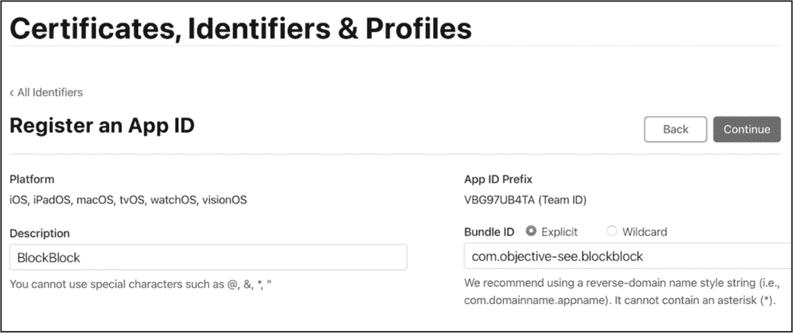
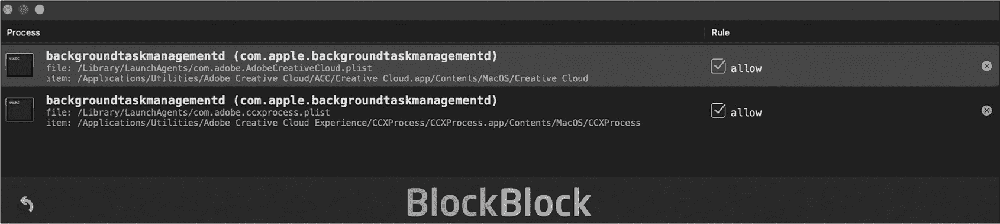

## 第十一章：11 持久性监控器


虽然上一章中介绍的 KnockKnock 提供了强大的检测能力，但它并不实时保护系统。为了补充它，我创建了 BlockBlock，它监控 KnockKnock 列出的最重要的持久性位置，并在新项出现时提醒用户，同时赋予他们阻止该活动的能力。

BlockBlock 的初始版本于 2014 年编写，主要是概念验证，尽管如此，来自商业安全公司的员工仍然把这个工具称为“垃圾软件”，并得出结论：“提供免费的优质服务不是一个人的工作。”^(1) 多年来，BlockBlock 已逐步成熟，始终凭借接近 100%的检测率有效识别持久性 Mac 恶意软件，即使事先没有这些威胁的相关知识。

在本章中，我将讨论 BlockBlock 的设计，并展示它如何利用 Endpoint Security 有效检测未经授权的持久性事件。你将了解如何申请和应用所需的 Endpoint Security 客户端授权，以及如何通过 XPC 使工具组件之间安全地进行通信。你可以在 Objective-See 的 GitHub 仓库中找到完整的 BlockBlock 源代码，网址是 [*https://<wbr>github<wbr>.com<wbr>/objective<wbr>-see<wbr>/BlockBlock*](https://github.com/objective-see/BlockBlock)。

### 授权

多个 BlockBlock 组件利用了 Endpoint Security，这意味着该工具必须从 Apple 获得特权授权。如果没有授权，除非我们禁用了系统完整性保护（SIP）和 Apple 移动文件完整性（AMFI），否则在运行时创建 Endpoint Security 客户端的尝试将失败。所以，让我们首先了解如何向 Apple 请求 Endpoint Security 客户端授权，一旦获得授权，如何将其应用到 BlockBlock。

#### 申请 Endpoint Security 授权

你可以在 [*https://<wbr>developer<wbr>.apple<wbr>.com<wbr>/contact<wbr>/request<wbr>/system<wbr>-extension<wbr>/*](https://developer.apple.com/contact/request/system-extension/) 申请 Endpoint Security 授权。申请表格会要求提供开发者信息，如你的姓名和公司，然后展示一个包含可申请授权列表的下拉菜单。选择 Endpoint Security 客户端授权 **com.apple.developer.endpoint-security.client**。在表格底部，描述你计划如何使用你所申请的授权。

鉴于端点安全的强大功能，苹果在授予客户端权限请求时非常谨慎，即使是知名的安全公司也是如此。也就是说，你可以采取一些措施来提高获得权限的机会。首先，注册为公司，例如有限责任公司（LLC）或类似公司。我只知道苹果曾经将端点安全客户端权限授予过一个个人。其次，在你的请求中，确保详细描述你计划如何使用该权限。端点安全客户端权限是为安全工具设计的，因此请包括你正在开发的工具的细节，并明确说明为什么它需要使用端点安全。最后，要做好等待的准备。

#### 注册 App ID

一旦苹果授予了你权限，你必须为你的工具注册一个 App ID，指定它的捆绑 ID 和将使用的权限。登录到你的 Apple Developer 账户，点击**Account**，然后导航到**Certificates, Identifiers & Profiles****Identifiers**。如果你已有任何现有的标识符，它们应该会显示在这里。要创建新的标识符，点击**+**。选择**App IDs**，然后点击**Continue**。选择**App**并再次点击**Continue**。

这应该会将你带到 App ID 注册表单。大多数字段的含义显而易见。对于捆绑 ID，苹果建议使用反向域名样式，通常为 *com.company.product*。对于 BlockBlock，我按照图 11-1 中所示填写了字段。



图 11-1：注册 BlockBlock 应用 ID

在表单的其余部分，你将看到选项，允许你为你的工具指定能力、应用服务或附加功能。如果苹果已经授予你端点安全客户端权限，点击**Additional Capabilities**，然后选择“端点安全”旁边的复选框。要注册新的标识符，点击**Register**。

#### 创建配置文件

现在你可以创建配置文件，它提供了操作系统在运行时授权使用权限的机制。^(2) 点击你开发者账户中的**Profiles**，应该会带你到一个页面，显示你当前的所有配置文件。你也可以通过点击 + 来注册新的配置文件。在第一页上，指定配置文件的类型。除非你通过 Mac App Store 分发你的工具，否则请选择页面底部的**Developer ID**。点击**Continue**，然后选择你刚刚创建的 App ID。

接下来，选择要包含在配置文件中的证书。这是你用来签名应用程序的证书，可能是你的 Apple Developer 证书。在下一页面中，你将看到可以添加到配置文件中的可用权限列表。要使用 Endpoint Security，选择 **System Extension EndpointSecurity for macOS**。如果 Apple 尚未授予你此权限，它将不会出现在列表中。

#### 在 Xcode 中启用权限

一旦生成了配置文件，你可以进入 Xcode 将其添加到你的项目中。首先，通过点击签名和功能面板中 **Capabilities** 旁的小**+**，然后选择 **Endpoint Security** 功能，告诉 Xcode 你的项目将使用 Endpoint Security。幕后，Xcode 会将权限添加到项目的权限文件中。

现在，在构建用于部署的工具时，你可以选择配置文件。第一次这样做时，你可能需要下载并将配置文件导入 Xcode。首先，从你的 Apple Developer 账户下载你生成的配置文件。然后，在 Xcode 的“选择证书和开发者 ID 配置文件”窗口中，选择**导入配置文件**选项，该选项位于应用程序名称旁边的下拉菜单中，浏览并选择下载的配置文件。

如果一切顺利，你应该拥有一个已编译、已授权的工具，并且该工具还包含了配置文件。例如，BlockBlock 的配置文件嵌入在其应用程序包的标准位置 *Contents/embedded.provisionprofile* 中。你可以通过运行 macOS 安全工具和命令行标志 cms -D -i 以及该路径，提取任何嵌入的配置文件。以下输出包含 BlockBlock 的应用 ID、其代码签名证书的信息以及它被授权使用的权限：

```
% **security cms -D -i BlockBlock.app/Contents/embedded.provisionprofile**
<?xml version="1.0" encoding="UTF-8"?>
...
<plist version="1.0">
<dict>
    <key>AppIDName</key>
    <string>BlockBlock</string>
    <key>DeveloperCertificates</key>
    <array>
        <data> ... </data>
    </array>
    <key>Entitlements</key>
    <dict>
        <key>com.apple.developer.endpoint-security.client</key>
        <true/>
        <key>com.apple.application-identifier</key>
        <string>VBG97UB4TA.com.objective-see.blockblock</string>
        ...
    </dict>
    ... 
```

你可以使用 codesign 工具查看程序所拥有的任何权限。对于 BlockBlock，这个列表包括 Endpoint Security 客户端权限：

```
% **codesign -d --entitlements - BlockBlock.app**
Executable=BlockBlock.app/Contents/MacOS/BlockBlock
[Dict]
    [Key] com.apple.application-identifier
    [Value]
        [String] VBG97UB4TA.com.objective-see.blockblock
    [Key] **com.apple.developer.endpoint-security.client**
    [Value]
        [Bool] true
    ... 
```

因为 macOS 需要一个配置文件来授权权限，即使是那些通常不作为应用程序开发的程序，如守护进程，也必须打包成应用程序包才能利用 Endpoint Security。你可以在 Apple 的文档中了解更多关于此设计选择的内容，^(3)，文档中还提到，如果你从守护进程切换到系统扩展，Xcode 会自动为你处理打包工作。

### 工具设计

BlockBlock 由两部分组成：一个启动守护进程和一个登录项。守护进程作为一个应用程序包装，以便使用权限和配置文件。它在后台以 root 权限运行，监控持久化事件（通过处理文件输入/输出和从 Endpoint Security 传递的其他事件），管理规则，并阻止用户指定的持久项。每当它检测到一个持久化事件时，守护进程会向登录项发送一个 XPC 消息。登录项在用户的桌面会话上下文中运行，因此能够显示用户界面（UI）元素，随后会向用户显示一个警报（图 11-2）。


图 11-2：一个 BlockBlock 警报

BlockBlock 的警报包含了关于安装持久项的项目及持久项本身的丰富信息。这些信息可以帮助用户决定是否允许或删除该项。例如，图 11-2 中显示的警报中的各种红色警告标志表明存在感染。首先，安装启动代理的项*airportpaird*没有签名，如困惑的皱眉脸所示。从其路径可以看出，它是从临时目录运行的。

如果您将注意力转向持久项，您会注意到属性列表以 com.apple 为前缀，暗示它属于 Apple。然而，它被安装在用户的启动代理目录中，而该目录仅包含第三方代理。此外，属性列表所引用的持久项是安装并从隐藏目录（*.local*）运行的。最后，如果您手动检查这个二进制文件*softwareupdate*的代码签名信息，您会发现它没有签名。

当我在 2014 年首次发布 BlockBlock 时，Apple 尚未支持系统扩展，这也是为什么我将工具的核心逻辑放在了启动守护进程中。今天，尽管这样做并非绝对必要，BlockBlock 仍然继续使用守护进程，因为这种方法仍然有其优势。首先，您可能希望开发与旧版本 macOS 兼容的工具。其次，任何具有足够权限的工具都可以安装和管理启动守护进程。另一方面，系统扩展需要额外的权限，并且要安装或删除它们，通常需要明确的用户批准。这增加了复杂性，并需要额外的代码。然而，在某些情况下，将代码放入系统扩展中是有意义的，正如您在第十三章中将看到的那样。

#### 插件

类似于 KnockKnock，BlockBlock 使用静态编译的插件来检测多种类型的持久化。每个插件负责处理一个独特的持久化事件或多个相关事件。该工具将每个插件的元数据存储在属性列表文件中，包括插件类的名称、用于定制警报的各种描述，以及最重要的，描述插件感兴趣的文件事件路径的正则表达式。例如，列表 11-1 显示了监视启动守护进程和代理新增的文件事件的插件元数据。

```
<dict>
   <key>description</key>
   <string>Launch D &amp; A</string>
   <key>paths</key>
   <array>
      <string>^(\/System|\/Users\/[^\/]+|)\/Library\/(LaunchDaemons|
      LaunchAgents)\/.+\.(?i)plist$</string>
   </array>
   <key>class</key>
   <string>Launchd</string>
   <key>alert</key>
   <string>installed a launch daemon or agent</string>
   ...
</dict> 
```

列表 11-1：启动项插件的元数据

正则表达式将应用于传入的文件输入/输出事件，匹配那些由于添加到启动守护进程和代理目录（如*/System/Library/LaunchDaemons* 或 *~/ Library/LaunchAgents*）的属性列表而被处理的事件。

所有插件都继承自一个名为`PluginBase`的自定义基类，该类实现了基础方法，如标准初始化方法和检查文件事件是否与感兴趣事件匹配的方法。初始化方法`initWithParams:`接受一个参数，即包含插件元数据的字典（列表 11-2）。

```
-(id)initWithParams:(NSDictionary*)watchItemInfo {
    ...
    NSMutableArray* regexes = [NSMutableArray array];
 for(NSString* regex in watchItemInfo[@"paths"]) {
        NSRegularExpression* compiledRegex =
        [NSRegularExpression regularExpressionWithPattern:regex
        options:NSRegularExpressionCaseInsensitive error:NULL];

        [self.regexes addObject:compiledRegex];
    }

    self.alertMsg = watchItemInfo[@"alert"];
    self.description = watchItemInfo[@"description"];
    ...
    return self;
} 
```

列表 11-2：插件对象初始化的基类逻辑

在这里，你可以看到该方法首先将每个插件感兴趣的路径编译成正则表达式，然后从元数据字典中提取其他值并保存到实例变量中。

另一个重要的基类方法`isMatch:`接受一个表示来自*FileMonitor*库的事件的文件对象，然后检查是否与插件感兴趣的路径匹配（列表 11-3）。

```
-(BOOL)isMatch:(File*)file {
    __block BOOL matched = NO;
    NSString* path = file.destinationPath;

  ❶ [self.regexes enumerateObjectsWithOptions:NSEnumerationConcurrent
    usingBlock:^(NSRegularExpression* _Nonnull regex, NSUInteger idx, BOOL
    * _Nonnull stop) {

      ❷ NSTextCheckingResult* match = [regex firstMatchInString:path options:0
        range:NSMakeRange(0, path.length)];
        if((nil == match) || (NSNotFound == match.range.location)) {
            return;
        }

      ❸ matched = YES;
        *stop = YES;
    }];

    return matched;
} 
```

列表 11-3：文件路径匹配

该方法在插件的正则表达式数组上运行`enumerateObjectsWithOptions:usingBlock:`，以便可以并发地迭代它们❶。在并发调用的回调块中，它使用当前的正则表达式检查目标文件是否匹配插件感兴趣的事件❷。例如，对于启动项插件，该方法将检查文件事件是否与启动守护进程或代理目录中属性列表的创建对应。如果发生匹配，方法会设置标志并终止枚举❸。

基础插件类中的其他方法留给每个插件来实现。例如，当用户点击警报中的“Block”按钮时，调用的`block:`方法将移除持久化项。这个逻辑必须根据持久化项的类型有所不同。如果你对每种持久化项的具体卸载逻辑感兴趣，可以查看每个插件的`block:`方法的代码。

本质上，BlockBlock 从*FileMonitor*库中获取事件，该库利用了 Apple 的 Endpoint Security。在用特定的感兴趣事件初始化 FileMonitor 对象后，它指定一个回调块，然后开始文件监控（清单 11-4）。

```
es_event_type_t events[] = {ES_EVENT_TYPE_NOTIFY_CREATE, ES_EVENT_TYPE_NOTIFY_WRITE,
ES_EVENT_TYPE_NOTIFY_RENAME, ES_EVENT_TYPE_NOTIFY_EXEC, ES_EVENT_TYPE_NOTIFY_EXIT}; ❶

FileCallbackBlock block = ^(File* file) {
    ...
    [self processEvent:file plugin:nil message:nil]; ❷
};

FileMonitor* fileMon = [[FileMonitor alloc] init];
[fileMon start:events count:sizeof(events)/sizeof(events[0]) csOption:csNone callback:block];
... 
```

清单 11-4：为每个文件事件调用的辅助方法

如果你仔细观察传递给文件监控器的 Endpoint Security 感兴趣事件，你会看到既有文件事件，也有进程事件 ❶。初始化文件监控器时包含文件事件是有意义的，我们需要进程事件来记录创建持久性项目的进程的参数。尽管并非每个持久化项目的进程都会带有参数，但许多进程是有的，在这些情况下，我们会将参数包含在展示给用户的警报中，帮助他们判断持久化事件是正常还是恶意的。在我们讨论文件输入/输出事件的处理之前，请注意，文件监控器逻辑是通过调用 `start:count:csOption:callback:` 方法启动的。

当文件监控器接收到事件时，它会调用指定的回调块，并传递一个表示该事件的文件对象。回调方法仅仅调用一个名为 `processEvent:plugin:message:` 的辅助方法 ❷。该方法调用每个插件的 `isMatch:` 方法，以查看文件事件是否与任何持久化位置匹配，例如在启动守护进程或代理目录中创建 *.plist* 文件。如果有插件对该文件事件感兴趣，BlockBlock 会创建一个自定义的 Event 对象，该对象包含表示持久化事件的文件对象和相关插件。

接下来，方法检查事件是否与任何现有规则匹配。规则是在用户与警报互动时创建的。它们可以根据诸如项目的启动文件或触发事件的进程等因素，允许或阻止持久性项目。例如，在我的开发者设备上，我也涉及摄影和照片编辑，那里有规则允许创建各种 Adobe Creative Cloud 启动代理（图 11-3）。



图 11-3：BlockBlock 规则可以允许或阻止来自指定进程的事件。

由于 Adobe 经常更新这些持久性项目，如果没有这些规则，我会频繁响应 BlockBlock 警报。如果找到匹配的规则，BlockBlock 会自动执行规则中指定的操作。否则，它会将事件发送到 BlockBlock 登录项，向用户显示警报。稍后，我们将更深入地了解双向 XPC 如何实现这种通信。不过，首先，让我们探讨一下 BlockBlock 如何使用 Endpoint Security 背景任务管理事件。

#### 背景任务管理事件

使用全局文件监视器来检测持久化的一个缺点是它效率较低，因为文件事件几乎会随着正常的系统行为不断发生。虽然我们可以利用第九章中介绍的 Endpoint Security 的静音反转功能来缓解流量的涌入，但 BlockBlock 需要监视多个位置以检测多种持久化方法，而静音反转可能无法完全缓解基于文件监视器的方法效率低下的问题。

对我们而言，一个更好的解决方案是订阅持久化事件，而不是文件事件。在之前的章节中，我讨论了 Background Task Management 子系统，这是 macOS 中的一项新功能，它管理最常见的持久化类型，包括登录项、启动代理和守护进程。Background Task Management 还向 Endpoint Security 添加了两个事件：ES_EVENT_TYPE_NOTIFY_BTM_LAUNCH_ITEM_ADD 和 ES_EVENT_TYPE_NOTIFY_BTM_LAUNCH_ITEM_REMOVE，客户端可以在登录项或启动项被持久化或移除时接收到这些事件。

BlockBlock 的最新版本利用这些事件中的第一个来弃用其大部分基于文件监视的方法，从而显著提高了效率并简化了代码库。该工具仍然监视诸如 cron 作业之类的持久化机制，但 Background Task Management 尚未为这些机制生成 Endpoint Security 事件，因此它无法完全弃用其文件监视功能。

注意：

*虽然 Endpoint Security 技术上在 macOS 13 中添加了这些 Background Task Management 事件，但它们并未正确工作。例如，Endpoint Security 不仅会为新安装的项目发送通知，还会为每个现有项目发送通知。更糟糕的是，对于登录项，它根本没有发送任何事件！在我报告了这些缺陷后，Apple 在 macOS 14 中修复了这两个问题。*^(4) *在 macOS 13 及更早版本上运行时，BlockBlock 回退到基于文件监视的方法。*

你可以在*Daemon/Monitors/BTMMonitor.m*文件夹中找到实现 Background Task Management 的 Endpoint Security 客户端的代码，在*Daemon/Plugins/Btm.m*中找到处理事件的插件。让我们先从考虑 Background Task Management 监视器开始。像任何想要利用 Endpoint Security 事件的代码一样，我们首先定义感兴趣的事件，创建一个带有处理块的 Endpoint Security 客户端，并订阅指定的事件（列表 11-5）。

```
es_event_type_t btmESEvents[] = {ES_EVENT_TYPE_NOTIFY_BTM_LAUNCH_ITEM_ADD}; ❶

es_new_client(&_endpointClient, ^(es_client_t* client, const es_message_t* message) { ❷
    // Message handler code removed for brevity ❸
});

es_subscribe(self.endpointClient, btmESEvents, sizeof(btmESEvents)/sizeof(btmESEvents[0])); ❹ 
```

列表 11-5：订阅 ES_EVENT_TYPE_NOTIFY_BTM_LAUNCH_ITEM_ADD 事件

代码首先创建一个包含单一事件的数组，供订阅❶。接着，使用 es_new_client API，它创建了一个新的 Endpoint Security 客户端。因为客户端是 BTMMonitor 类的实例变量，我们在传递给 es_new_client API 时，使用了下划线(_)前缀❷。我们之所以这么做，是因为每当使用 Objective-C 的@property 关键字声明实例变量时，编译器会自动生成一个以下划线开头的实例变量。^(5)通常我们不直接引用实例变量，而是通过对象访问它们；然而，在 Endpoint Security 的 C API（如 es_new_client）中，由于它需要一个指针，因此我们必须进行直接引用。

回想一下，es_new_client API 接受一个处理块，每当订阅的事件发生时就会调用❸。很快，你将看到 BlockBlock 的后台任务管理监控器在这个回调中执行的代码。当然，在 Endpoint Security 能够交付事件之前，我们必须告诉它我们有兴趣订阅，这可以通过 es_subscribe API 来实现❹。

清单 11-6 展示了处理块中的代码。

```
es_new_client(&_endpointClient, ^(es_client_t* client, const es_message_t* message) {
    File* file = [[File alloc] init:(es_message_t*)message csOption:csNone]; ❶

    if((ES_BTM_ITEM_TYPE_AGENT == message->event.btm_launch_item_add->item->item_type) || ❷
        (ES_BTM_ITEM_TYPE_DAEMON == message->event.btm_launch_item_add->item->item_type)) {
        file.destinationPath =
        convertStringToken(&message->event.btm_launch_item_add->item->item_url);
    }
    es_message_t* messageCopy = NULL;

    if(@available(macOS 11.0, *)) { ❸
        es_retain_message(message);
        messageCopy = (es_message_t*)message;
    } else {
 messageCopy = es_copy_message(message);
    }
    [monitor processEvent:file plugin:btmPlugin message:messageCopy]; ❹
}); 
```

清单 11-6：后台任务管理事件监控逻辑

首先，代码初始化了一个 BlockBlock 文件对象，并传入接收到的 Endpoint Security 消息❶。然后，对于启动代理和守护进程，它直接将文件的目标路径设置为刚创建的项目的属性列表。我们在 Endpoint Security 消息中的 btm_launch_item_add 结构体的 item_url 成员中找到这个属性列表❷。

最后，代码调用了本章之前提到的 BlockBlock 的 processEvent:plugin:message:方法❹。不过，这里传递给该方法的插件是 BlockBlock 的后台任务管理插件实例，接下来我将讨论这个插件。请注意，我们传递的是 Endpoint Security 消息的保留实例或副本。这是因为 BlockBlock 需要保留该消息以便后续使用（例如，处理用户的异步响应）。需要注意的是，如果运行在较新的 macOS 版本上，代码会调用更现代的 es_retain_message API，若运行在较旧版本上，则会回退到使用 es_copy_message❸。因为消息被明确地保留或复制，所以 BlockBlock 在不再需要时，必须通过调用适当的 es_release_message 或 es_free_message API 来释放它。

像所有其他 BlockBlock 插件一样，背景任务管理插件实现了方法，用于检索持久化项的名称和路径，在用户指示时阻止该项，等等。当然，它用于实现这些功能的逻辑是特定于背景任务管理持久化事件的。让我们来看一下插件的 itemObject: 方法，它返回持久化可执行文件的路径。如 示例 11-7 所示，我们可以从传递的 Endpoint Security 消息中提取此信息，尽管它会根据该项是作为启动项还是登录项持久化有所不同。

```
-(NSString*)itemObject:(Event*)event {
    NSString* itemObject = nil;

    if((ES_BTM_ITEM_TYPE_AGENT ==
    event.esMessage->event.btm_launch_item_add->item->item_type) || ❶
    (ES_BTM_ITEM_TYPE_DAEMON ==
    event.esMessage->event.btm_launch_item_add->item->item_type)) {
        itemObject =
        convertStringToken(&event.esMessage->event.btm_launch_item_add->executable_path);
    } else {
        NSString* stringToken =
        convertStringToken(&event.esMessage->event.btm_launch_item_add->item->item_url); ❷
        itemObject = [[NSURL URLWithString:stringToken] path];
    }
    return itemObject;
} 
```

示例 11-7：返回持久化项的路径

代码首先检查持久化项的类型 ❶。方便的是，Endpoint Security 使用常量，如 ES_BTM_ITEM_TYPE_AGENT 和 ES_BTM_ITEM_TYPE_DAEMON，来指示此信息，并在项结构的 item_type 成员中指定项类型。假设持久化项是启动项，代码将从 btm_launch_item_add 结构的 executable_path 成员中提取其可执行路径。为了将其从 es_string_token_t 类型转换为 Objective-C 字符串对象，我们调用 BlockBlock 的 convertStringToken 辅助函数。

对于登录项，我们可以在项结构的 item_url 成员中找到持久化项的路径 ❷。同样，我们调用 convertStringToken 辅助函数。然而，项的路径实际上是一个 URL 对象，因此我们必须将其转换回 URL，然后使用 URL 的 path 属性以字符串形式获取文件路径。

背景任务管理插件中的另一个显著方法是 block:，当用户点击持久化项的警报中的“阻止”时，BlockBlock 会调用该方法。因为在较旧的基于文件监控的插件中，有用于移除启动项和登录项的逻辑，所以背景任务管理插件可以调用相关插件来阻止该项（示例 11-8）。

```
-(BOOL)block:(Event*)event {
    __block BOOL wasBlocked = NO;

    switch(event.esMessage->event.btm_launch_item_add->item->item_type) {
      ❶ case ES_BTM_ITEM_TYPE_APP:
        case ES_BTM_ITEM_TYPE_LOGIN_ITEM: {
            LoginItem* loginItem = [[LoginItem alloc] init];
            wasBlocked = [loginItem block:event];
            break;
        }
      ❷ case ES_BTM_ITEM_TYPE_AGENT:
        case ES_BTM_ITEM_TYPE_DAEMON: {
            Launchd* launchItem = [[Launchd alloc] init];
            wasBlocked = [launchItem block:event];
            break;
        }
        ...
     }
     return wasBlocked;
} 
```

示例 11-8：调用登录项和启动项插件的阻止逻辑

为了确定背景任务管理项的类型，代码再次使用 Endpoint Security 背景任务管理消息中找到的 item_type 成员。对于登录项（可以包括持久化的用户应用程序），代码实例化 BlockBlock 的登录项插件，并调用其 block: 方法 ❶。对于启动代理和守护进程，采用类似的方式，实例化启动项插件 ❷。

这部分结束了对 BlockBlock 背景任务管理监视器和插件的讨论。接下来，让我们看看 BlockBlock 广泛使用的 XPC 通信。

### XPC

XPC 是 macOS 上事实上的进程间通信（IPC）机制。每当你编写包含多个组件的工具时，例如特权守护进程或系统扩展与在用户桌面会话中运行的代理或应用程序，这些组件通常需要通过 XPC 进行通信。在本节中，我将概述这一主题，包括 XPC API 和具体示例。如果你有兴趣了解更多内容，可以深入研究 BlockBlock 代码，BlockBlock 大量使用双向 XPC。

从某种程度上来说，XPC 符合传统的客户端/服务器模型。一个组件（在我们的案例中是 BlockBlock 守护进程）设置一个 XPC 服务器，或者说是 *监听器*。一个授权客户端（例如，BlockBlock 的登录项）可以连接到监听器，然后远程调用监听器内实现的特权方法。假设用户响应 BlockBlock 提示，指示该工具阻止一个持久安装的项，然后创建一个规则以自动阻止未来相关的项。通过 XPC，BlockBlock 的登录项可以调用守护进程的特权 *阻止* 和 *创建规则* 方法。这些方法在特权守护进程的上下文中运行，以确保它们具有适当的权限，能够删除即便是特权的持久项。它们还可以在特权上下文中创建规则，以帮助防止恶意篡改。

#### 创建监听器和代理

让我们探讨一下 BlockBlock 守护进程如何创建 XPC 监听器，更重要的是，如何确保只有授权的客户端能够连接到它。后者对安全工具至关重要，因为如果我们将 XPC 接口置于未保护状态，恶意软件或其他任何东西都可以连接到它并调用守护进程的特权方法。

BlockBlock 在名为 XPCListener 的接口中实现了 XPC 监听器和连接逻辑，该接口符合 `NSXPCListenerDelegate` 协议（列表 11-9）。

```
@interface XPCListener : NSObject <NSXPCListenerDelegate>
    @property(weak)NSXPCConnection* client;
    @property(nonatomic, retain)NSXPCListener* listener;
    ...
} 
```

列表 11-9：一个 XPC 监听器类

要创建一个 XPC 接口，你可以使用 `NSXPCListener initWithMachServiceName:` 初始化方法，该方法以 XPC 服务的名称作为参数。列表 11-10 是来自 BlockBlock 的 XPCListener 类的代码，用于创建其 XPC 监听器。

```
#define DAEMON_MACH_SERVICE @"com.objective-see.blockblock"

self.listener = [[NSXPCListener alloc] initWithMachServiceName:DAEMON_MACH_SERVICE]; 
```

列表 11-10：初始化 XPC 监听器

请注意，Apple 在更古老的 Mach 消息传递框架之上构建了 XPC。这也解释了为什么你会遇到诸如 `initWithMachServiceName:` 之类的方法名。

一旦你创建了一个监听器，你应该指定 *代理*，它包含相关的 XPC 代理方法。如果实现了这些方法，XPC 系统框架会自动调用它们。一旦被调用，代理方法可以执行重要任务，例如验证任何客户端。

由于 BlockBlock 的 XPCListener 类符合 NSXPCListenerDelegate 协议，因此它只需将监听器的委托设置为自己。然后，它调用监听器的恢复方法以开始处理客户端连接（见列表 11-11）。

```
self.listener.delegate = self;
[self.listener resume]; 
```

列表 11-11：设置委托并恢复监听器

现在，像 BlockBlock 的登录项这样的客户端可以发起连接到监听器。但在我们详细说明客户端如何执行此操作之前，我们必须确保只有授权的客户端才能连接。

#### 提取审计令牌

如果您允许任何客户端连接到您的特权 XPC 接口，未经信任的代码可能会执行监听器的特权方法。这个问题困扰着核心 macOS XPC 监听器以及许多第三方工具。具体例子请参见我 2015 年在 DEF CON 上的演讲，其中详细介绍了利用未保护和特权的 macOS writeConfig XPC 接口来提升权限至 root 的过程。^(6)

> 注意

*从 macOS 13 版本开始，简化了授权流程，我将在“设置客户端要求”中介绍这些步骤，具体请参见第 270 页。在这一节中，我将介绍授权方法，使您的工具与较早版本的操作系统兼容。*

要授权客户端，我们可以使用 NSXPCListenerDelegate 协议中的 listener: shouldAcceptNewConnection: 方法。^(7) 如果委托实现了此方法，XPC 子系统将在每次客户端尝试连接时自动调用它。该方法应检查候选客户端，并返回一个布尔值，指示是否接受该客户端。

对于授权客户端，此方法还应该配置连接；稍后我将讨论如何操作。最后，由于所有连接在授权和配置过程中都会以挂起状态启动，因此此方法应调用传入的 NSXPCConnection 对象的恢复方法，以便授权客户端开始处理任何接收到的消息，并能够发送自己的消息（见列表 11-12）。

```
-(BOOL)listener(NSXPCListener*)listener shouldAcceptNewConnection:
(NSXPCConnection*)newConnection {
    BOOL shouldAccept = NO;

    // Code to authorize the client, and ignore unauthorized ones, removed for brevity

    [newConnection resume];
    shouldAccept = YES;

bail:
    return shouldAccept;
} 
```

列表 11-12：恢复连接

尽管我们可以通过多种方式尝试验证客户端，但许多方法存在缺陷或不完整。例如，使用候选客户端的进程 ID 是危险的，因为攻击者可以利用系统重用进程 ID 的事实，迫使监听器允许未经授权的客户端。

一种更好的方法是检查客户端的审计令牌并检索其代码签名信息。不幸的是，在旧版本的 macOS 中，Apple 并没有轻易公开客户端的审计令牌，这意味着我们必须使用一些 Objective-C 技巧。listener:shouldAcceptNewConnection: 方法的第二个参数是指向 NSXPCConnection 对象的指针，该对象包含关于尝试连接到 XPC 服务的客户端的信息。虽然它确实包含了在其 auditToken 属性中的审计令牌，但该属性是私有的，这意味着我们不能直接访问它。幸运的是，Objective-C 是自省的，因此我们可以通过类扩展来访问私有属性。在 示例 11-13 中，BlockBlock 创建了对 NSXPCConnection 类的扩展。

```
@interface ExtendedNSXPCConnection : NSXPCConnection {
    audit_token_t auditToken;
}
    @property audit_token_t auditToken;
@end 
```

示例 11-13：扩展 NSXPCConnection 类以访问其私有审计令牌

请注意，扩展定义了一个属性：在 NSXPCConnection 类中找到的私有审计令牌。一旦我们声明了这个扩展，就可以访问连接客户端的私有审计令牌，如 示例 11-14 所示。

```
-(BOOL)listener:(NSXPCListener*)listener shouldAcceptNewConnection:(NSXPCConnection*)
newConnection {
    ...
    audit_token_t auditToken = ((ExtendedNSXPCConnection*)newConnection).auditToken;
    ...
} 
```

示例 11-14：访问连接客户端的审计令牌

这段代码将表示连接客户端的 NSXPCConnection 对象强制转换为 ExtendedNSXPCConnection 对象。然后，它可以轻松地提取客户端的审计令牌成员。拿到审计令牌后，代码可以验证客户端的代码签名信息，然后安全地验证客户端的身份，如果客户端已授权，则批准连接。

#### 提取代码签名详情

为了验证客户端的代码签名信息，BlockBlock 对 listener:shouldAcceptNewConnection: 委托方法的实现采取了以下步骤。首先，它使用提取的审计令牌来获取客户端进程的动态代码签名引用。然后，它使用这个引用验证客户端的代码签名信息是否有效，并提取相关信息。此外，它提取客户端的代码签名标志，以确保客户端是使用强化运行时编译的，从而防止运行时注入攻击。最后，它检查验证过的代码签名信息，确保其中包含 BlockBlock 辅助应用程序的捆绑标识符、Objective-See 开发者代码签名证书和支持的客户端版本。示例 11-15 展示了这一要求的实现。

```
" ❶ anchor apple generic and ❷ identifier \"com.objective-see.blockblock
.helper\" and ❸ certificate leaf [subject.CN] = \"Developer ID Application:
Objective-See, LLC (VBG97UB4TA)\" and ❹ info [CFBundleShortVersionString]
>= \"2.0.0\""; 
```

示例 11-15：验证连接的 XPC 客户端的代码签名要求

第三章讨论了代码签名要求，但让我们细分一下这个要求。首先，我们要求客户端使用苹果发给开发者的证书进行签名 ❶。接下来，我们要求客户端标识符与 Objective-See 的 BlockBlock 助手标识符相匹配 ❷。我们还要求客户端使用 Objective-See 的代码签名证书进行签名 ❸。最后，我们要求客户端版本为 2.0.0 或更新版本 ❹，因为旧版本的 BlockBlock 助手不支持更新的加固运行时，容易受到颠覆攻击。^(8)

如果所有这些验证和验证步骤都成功，BlockBlock 守护进程就知道，尝试连接其 XPC 接口的客户端确实是 BlockBlock 助手组件的最新版本，并且没有攻击者或恶意软件偷偷篡改这个组件。

示例 11-16 显示了实现完整客户端授权的代码。请注意使用了各种 SecTask* 代码签名 API，这些内容在 第三章 中有介绍。由于必须始终检查这些 API 的返回值，因此这段代码包含了基本的错误处理。

```
#define HELPER_ID @"com.objective-see.blockblock.helper"
#define SIGNING_AUTH @"Developer ID Application: Objective-See, LLC (VBG97UB4TA)"

-(BOOL)listener:(NSXPCListener*)listener shouldAcceptNewConnection:(NSXPCConnection*)
newConnection {
    BOOL shouldAccept = NO;
    audit_token_t auditToken = ((ExtendedNSXPCConnection*)newConnection).auditToken;

    OSStatus status = SecCodeCopyGuestWithAttributes(NULL, (__bridge CFDictionaryRef _Nullable)
    (@{(__bridge NSString*)kSecGuestAttributeAudit : [NSData dataWithBytes:&auditToken
    length:sizeof(audit_token_t)]}), kSecCSDefaultFlags, &codeRef);
    if(errSecSuccess != status) {
        goto bail;
    }

    status = SecCodeCheckValidity(codeRef, kSecCSDefaultFlags, NULL);
    if(errSecSuccess != status)  {
        goto bail;
    }

    status = SecCodeCopySigningInformation(codeRef, kSecCSDynamicInformation, &csInfo);
    if(errSecSuccess != status)  {
        goto bail;
    }

    uint32_t csFlags = [((__bridge NSDictionary*)csInfo)[(__bridge NSString*)
    kSecCodeInfoStatus] unsignedIntValue];
    if(!(CS_VALID & csFlags) && !(CS_RUNTIME & csFlags)) {
        goto bail;
    }

    NSString* requirement = [NSString stringWithFormat:@"anchor apple generic and
    identifier \"%@\" and certificate leaf [subject.CN] = \"%@\" and info
    [CFBundleShortVersionString] >= \"2.0.0\"", HELPER_ID, SIGNING_AUTH];

    SecTaskRef taskRef = SecTaskCreateWithAuditToken(NULL, ((ExtendedNSXPCConnection*)
    newConnection).auditToken);

    status = SecTaskValidateForRequirement(taskRef, (__bridge CFStringRef)(requirement));
    if(errSecSuccess != status) {
        goto bail;
    }

    shouldAccept = YES;

    // Add code here to configure and finalize the NSXPCConnection.

bail:
    return shouldAccept;
} 
```

示例 11-16：授权 XPC 客户端

你可能会惊讶于保护特权 XPC 接口是多么困难。苹果最终也意识到了这一点，幸运的是，在 macOS 13 中，它提供了两个专门设计的新的 API，用以简化确保只有授权客户端能够连接的过程。如果你的工具只在 macOS 13 或更高版本上运行，你应该使用这些 API，这样你就不必担心访问私有审计令牌或手动提取和验证代码签名信息。下一节将详细介绍这些 API。

#### 设置客户端要求

在 macOS 13 及更高版本中，NSXPCListener 类的 setConnectionCodeSigningRequirement: 方法^(9) 和 NSXPCConnection 类的 setCodeSigningRequirement: 方法^(10) 允许你在监听器或连接对象上设置代码签名要求。第一个选项适用于所有连接，而第二个选项仅适用于特定连接，但你可以使用任一选项防止未经授权的客户端连接到 XPC 接口。

BlockBlock 使用监听器方法，这种方法要求较低的粒度；它拒绝任何不属于 BlockBlock 助手客户端的连接。回想一下，示例 11-10 显示了初始化 XPC 监听器的代码。示例 11-17 基于此基础，添加了在 macOS 13 及更高版本上运行的代码。

```
#define DAEMON_MACH_SERVICE @"com.objective-see.blockblock"
#define HELPER_ID @"com.objective-see.blockblock.helper"
#define SIGNING_AUTH @"Developer ID Application: Objective-See, LLC (VBG97UB4TA)"

self.listener = [[NSXPCListener alloc] initWithMachServiceName:DAEMON_MACH_SERVICE];

if(@available(macOS 13.0, *)) {
    NSString* requirement = [NSString stringWithFormat:@"anchor apple generic and
    identifier \"%@\" and certificate leaf [subject.CN] = \"%@\" and info
    [CFBundleShortVersionString] >= \"2.0.0\"", HELPER_ID, SIGNING_AUTH]; ❶

    [self.listener setConnectionCodeSigningRequirement:requirement]; ❷
}

self.listener.delegate = self;
[self.listener resume]; 
```

示例 11-17：在 macOS 13 及更高版本上授权客户端

在分配并初始化一个 NSXPCListener 对象后，我们使用 Objective-C 的 @available 属性，值为 macOS 13.0，*来指示编译器仅在 macOS 13 或更新版本上执行以下代码❶，因为 setConnectionCodeSigningRequirement: 方法在较早版本的 macOS 中不可用。

然后，我们动态初始化一个代码签名要求字符串❷，用于验证任何尝试连接到监听器的客户端。这个要求与之前展示的相同。最后，BlockBlock 调用 setConnectionCodeSigningRequirement: 方法，指示 XPC 运行时只接受符合指定代码签名要求字符串的客户端连接。现在，我们不再需要手动验证客户端；macOS 会为我们处理这一切！

为了确认授权是否有效，请在 macOS 版本 13 或更新版本上编译并执行 BlockBlock，然后尝试通过不合法的客户端连接到其 XPC 接口。连接应该会失败，系统的 XPC 库应该会将以下消息打印到统一日志中：

```
Default     0x0     56198  0    BlockBlock: (libxpc.dylib) **Bogus check-in attempt. Ignoring**.
```

现在 BlockBlock 可以授权 XPC 客户端，它可以配置并激活连接。

#### 启用远程连接

XPC 通信通常是单向的；客户端连接到监听器并调用其方法。然而，BlockBlock 实现了双向通信。守护进程实现了大多数 XPC 方法，用于诸如阻止或删除持久项和创建规则等任务，客户端调用这些方法。然而，守护进程也会调用客户端实现的方法，例如显示用户警告。

为了实现这种双向 IPC，我们必须配置 NSXPCConnection 对象。首先，让我们在服务器端配置监听器对象。这涉及到定义客户端可以调用的远程方法，并指定 XPC 接口的服务器端对象来实现这些方法。服务器和客户端必须就客户端可以远程调用哪些方法达成一致。我们可以通过将监听器的 exportedInterface 属性设置为一个描述导出对象协议的 NSXPCInterface 对象来实现这一点。^(11)

在这种情况下，*协议*只是符合要求的对象将实现的方法列表。^(12) 我们通常在头文件（*.h*）中声明这些协议，方便在服务器端和客户端代码中引用。Listing 11-18 是 BlockBlock 守护进程的 XPC 协议。

```
@protocol XPCDaemonProtocol
    -(void)getPreferences:(void (^)(NSDictionary*))reply;
    -(void)updatePreferences:(NSDictionary*)preferences;
    -(void)getRules:(void (^)(NSData*))reply;
    -(void)deleteRule:(Rule*)rule reply:(void (^)(NSData*))reply;
    -(void)alertReply:(NSDictionary*)alert;
@end 
```

Listing 11-18: XPC 守护进程协议

一旦我们声明了这个协议，守护进程可以将 exportedInterface 属性设置为符合 XPCDaemonProtocol 协议的 NSXPCInterface 对象。你可以在监听器的 delegate 方法 listener:shouldAcceptNewConnection: 中找到启用客户端连接的代码（Listing 11-19）。

```
-(BOOL)listener:(NSXPCListener*)listener shouldAcceptNewConnection:
(NSXPCConnection*)newConnection {
    // Code to authorize the client, and ignore unauthorized ones, removed for brevity

    newConnection.exportedInterface =
    [NSXPCInterface interfaceWithProtocol:@protocol(XPCDaemonProtocol)];
    ... 
```

Listing 11-19: 设置 NSXPCConnection 的导出接口

当然，你还必须在服务器端指定实现这些方法的对象（在这种情况下是 BlockBlock 守护进程）。你可以通过设置监听器上的 exportedObject 属性来完成这一点（列表 11-20）。

```
-(BOOL)listener:(NSXPCListener*)listener shouldAcceptNewConnection:
(NSXPCConnection*)newConnection {
    // Code to authorize the client, and ignore unauthorized ones, removed for brevity
    ...
    newConnection.exportedObject = [[XPCDaemon alloc] init];
    ... 
```

列表 11-20：设置实现导出接口的对象

BlockBlock 创建了一个名为 XPCDaemon 的类，用于实现客户端可调用的方法。正如预期的那样，这个类遵循守护进程协议 XPCDaemonProtocol（列表 11-21）。

```
@interface XPCDaemon : NSObject <**XPCDaemonProtocol**>
@end 
```

列表 11-21：符合 XPCDaemonProtocol 的接口

接下来，我们将简要了解一些特权 XPC 方法，这些方法可以由在受限权限用户会话中运行的 BlockBlock 辅助组件调用。

#### 暴露方法

BlockBlock 允许用户定义规则以自动允许常见的持久性事件。特权 BlockBlock 守护进程管理这些规则，以防止无特权的恶意软件篡改它们（例如，添加允许规则让恶意软件得以持久化）。为了向用户显示这些规则，BlockBlock 客户端将通过 XPC 调用守护进程的 getRules: 方法（列表 11-22）。

```
-(void)getRules:(void (^)(NSData*))reply {
    NSData* archivedRules = [NSKeyedArchiver archivedDataWithRootObject:
    rules.rules requiringSecureCoding:YES error:nil];

    reply(archivedRules);
} 
```

列表 11-22：返回序列化规则

因为 XPC 是异步的，返回数据的方法应该通过块来返回。XPCDaemonProtocol 中声明的 getRules: 方法采用这样的块，调用者可以通过该块调用一个包含规则列表的数据对象。请注意，该方法的实现相当简单；它只是将规则序列化并将其发送回客户端。

一个更复杂的 XPC 方法示例是 alertReply:，客户端通过 XPC 在用户与持久化警报交互后（例如点击“阻止”）调用该方法。该方法接收一个封装警报的字典。用户不期望任何响应，因此该方法不使用任何回调块。列表 11-23 显示了在守护进程中实现的该方法的主要代码。

```
-(void)alertReply:(NSDictionary*)alert {
    Event* event = nil;
    @synchronized(events.reportedEvents) {
      ❶ event = events.reportedEvents[alert[ALERT_UUID]];
    }

  ❷ event.action = [alert[ALERT_ACTION] unsignedIntValue];
    if(BLOCK_EVENT == event.action) {
      ❸ [event.plugin block:event];
    }
    ...
    if(YES != [alert[ALERT_TEMPORARY] boolValue]) {
      ❹ [rules add:event];
    }
} 
```

列表 11-23：处理用户对警报的响应

首先，我们使用 UUID ❶ 从警报字典中检索表示持久事件的对象。我们将该对象包装在@synchronized 代码块中，以确保线程同步。接下来，我们从警报 ❷ 中提取用户指定的操作（阻止或允许）。如果用户决定阻止持久事件，BlockBlock 将调用相关插件的 block: 方法。这将执行插件特定的代码以删除持久项 ❸ 并为事件添加规则，前提是用户没有勾选警报中的“临时”复选框 ❹。

我提到过 BlockBlock 守护进程也需要调用辅助程序中实现的方法，例如显示警告给用户。辅助程序连接后，它可以通过相同的 XPC 接口来实现这一点，尽管我们需要指定一个专用的协议。BlockBlock 将这个客户端协议命名为 XPCUserProtocol（示例 11-24）。它包含客户端将实现的方法，守护进程可以通过 XPC 远程调用这些方法。

```
@protocol XPCUserProtocol
    -(void)alertShow:(NSDictionary*)alert;
    ...
@end 
```

示例 11-24：XPC 用户协议

回到 listener:shouldAcceptNewConnection:方法中，我们配置了监听器，允许守护进程调用客户端的远程方法（示例 11-25）。

```
-(BOOL)listener:(NSXPCListener*)listener shouldAcceptNewConnection:
(NSXPCConnection*)newConnection {
    // Code to authorize the client, and ignore unauthorized ones, removed for brevity
    ...
    newConnection.remoteObjectInterface =
    [NSXPCInterface interfaceWithProtocol:@protocol(XPCUserProtocol)]; 
```

示例 11-25：设置远程对象接口

我们设置了 remoteObjectInterface 属性，并指定了 XPCUserProtocol 协议。

#### 发起连接

到目前为止，我已经展示了 BlockBlock 守护进程如何设置 XPC 监听器，暴露方法，并确保只有授权的客户端可以连接。然而，我还没有展示客户端如何发起连接，或者它和守护进程如何远程调用 XPC 方法。

一旦 BlockBlock 守护进程运行，它的 XPC 接口就可以接受授权连接。为了连接到守护进程，BlockBlock 助手使用 NSXPCConnection 对象的 initWithMachServiceName:options:方法，指定与守护进程使用相同的名称（示例 11-26）。

```
#define DAEMON_MACH_SERVICE @"com.objective-see.blockblock"
NSXPCConnection* daemon = [[NSXPCConnection alloc]
initWithMachServiceName:DAEMON_MACH_SERVICE options:0]; 
```

示例 11-26：初始化与守护进程 XPC 服务的连接

和我们在服务器端做的一样，我们必须为远程对象接口设置协议。因为我们现在处于客户端，本文中所说的“远程对象接口”指的是在守护进程上暴露远程可调用方法的 XPC 对象（示例 11-27）。

```
#define DAEMON_MACH_SERVICE @"com.objective-see.blockblock"

NSXPCConnection* daemon = [[NSXPCConnection alloc]
initWithMachServiceName:DAEMON_MACH_SERVICE options:0];

daemon.remoteObjectInterface =
[NSXPCInterface interfaceWithProtocol: @protocol(XPCDaemonProtocol)]; ❶

daemon.exportedInterface = [NSXPCInterface interfaceWithProtocol:@protocol(XPCUserProtocol)];
daemon.exportedObject = [[XPCUser alloc] init]; ❷

[daemon resume]; ❸ 
```

示例 11-27：在客户端设置 XPC 连接对象

回想一下，这个对象符合 XPCDaemonProtocol 协议，所以我们在这里指定它❶。此外，由于守护进程需要调用客户端中实现的方法，客户端需要设置自己的导出对象。它通过 exportedInterface 和 exportedObject 方法来实现❷。前者指定协议（XPCUserProtocol），后者指定在客户端中实现导出 XPC 方法的对象（XPCUser）。最后，我们恢复连接❸，这触发了与守护进程的 XPC 监听器的实际连接。

#### 调用远程方法

到此为止，我们已经完成了 XPC 连接的实现。我将通过展示 BlockBlock 如何实际调用远程方法来结束关于 BlockBlock XPC 使用的讨论，重点介绍客户端侧的常见情况。为了抽象与守护进程的通信，BlockBlock 客户端使用一个名为 XPCDaemonClient 的自定义类。建立 XPC 连接的代码位于示例 11-26 中，这个类里也包含了调用远程 XPC 方法的代码。

若要连接到守护进程并调用其远程特权 XPC 方法（例如，获取当前规则），客户端可以执行 清单 11-28 中的代码。

```
XPCDaemonClient* xpcDaemonClient = [[XPCDaemonClient alloc] init];
NSArray* rules = [[xpcDaemonClient getRules]; 
```

清单 11-28：调用远程 XPC 方法

让我们仔细看一下 getRules 方法，它调用守护进程远程暴露的相应 getRules: 方法。这个方法很好地展示了如何调用 XPC 方法，并考虑到它们的细微差别。请注意，尽管该方法包含额外的逻辑来反序列化从守护进程接收到的规则，这里我们只关注 XPC 逻辑（清单 11-29）。

```
-(NSArray*)getRules {
    __block NSDictionary* unarchivedRules = nil;
    ...
    [[self.daemon synchronousRemoteObjectProxyWithErrorHandler:^(NSError* proxyError) { ❶
        // Code to handle any errors removed for brevity ❷
    }] getRules:^(NSData* archivedRules) {
        // Code to process the serialized rules from the daemon removed for brevity ❸
    }];
    ...
    return rules;
} 
```

清单 11-29：从守护进程获取规则

首先，代码调用 NSXPCConnection 类的同步连接方法 ❶。虽然 XPC 通常是异步的，但我们期望守护进程返回数据，因此在这种情况下使用同步调用最为合适。在其他地方，BlockBlock 使用更常见的异步 remoteObjectProxyWithErrorHandler: 方法。

XPCDaemonClient 类的 init 方法先前建立了连接，并将其保存在名为 daemon 的实例变量中。连接方法返回远程对象，该对象暴露了可以远程调用的 XPC 方法。如果在检索此对象时发生任何错误，代码将调用错误块 ❷。

拿到远程对象后，我们就可以调用它的方法，比如 getRules: 方法。为了返回数据，这个 XPC 调用需要一个回复块；清单 11-22 展示了这个方法的实现，它位于守护进程内。当调用完成时，块会执行，并将一个包含来自守护进程的序列化规则的数据对象作为参数 ❸。

### 结论

BlockBlock 的方法很简单：检测持久化项目，提醒用户，并允许他们删除不需要的项目。尽管这种设计非常直接，但它已被证明在对抗即使是最复杂的持久化 Mac 恶意软件时也非常有效。

在本章中，您了解了如何向 Apple 请求 Endpoint Security 权限。您还了解了 BlockBlock 的设计、它对 Endpoint Security 事件的使用，以及它的双向 XPC 通信。如果您正在构建自己的安全工具，我鼓励您参考 BlockBlock 使用的系统框架、API 和机制。

下一章将探讨一个旨在启发式检测一些最隐秘的恶意软件样本的工具：那些通过受害者的麦克风和摄像头偷偷监视他们的恶意软件。

### 备注

1.    1.  “为 OS X 编写 Bad @$$ Lamware,” *reverse.put.as*, 2015 年 8 月 7 日，[*https://<wbr>reverse<wbr>.put<wbr>.as<wbr>/2015<wbr>/08<wbr>/07<wbr>/writing<wbr>-bad<wbr>-lamware<wbr>-for<wbr>-os<wbr>-x<wbr>/*](https://reverse.put.as/2015/08/07/writing-bad-lamware-for-os-x/).

1.    2.  “TN3125：代码签名内幕：配置文件”，苹果开发者文档，[*https://<wbr>developer<wbr>.apple<wbr>.com<wbr>/documentation<wbr>/technotes<wbr>/tn3125<wbr>-inside<wbr>-code<wbr>-signing<wbr>-provisioning<wbr>-profiles*](https://developer.apple.com/documentation/technotes/tn3125-inside-code-signing-provisioning-profiles)。

1.    3.  “使用受限权限签名守护进程”，苹果开发者文档，[*https://<wbr>developer<wbr>.apple<wbr>.com<wbr>/documentation<wbr>/xcode<wbr>/signing<wbr>-a<wbr>-daemon<wbr>-with<wbr>-a<wbr>-restricted<wbr>-entitlement*](https://developer.apple.com/documentation/xcode/signing-a-daemon-with-a-restricted-entitlement)。

1.    4.  asfdadsfasdfasdfsasdafads，“端点安全事件：ES_EVENT _TYPE_NOTIFY_BTM_LAUNCH_ITEM_ADD 是 . . . 损坏了吗？”，苹果开发者论坛，2024 年 11 月 15 日，[*https://<wbr>developer<wbr>.apple<wbr>.com<wbr>/forums<wbr>/thread<wbr>/720468*](https://developer.apple.com/forums/thread/720468)。

1.    5.  Keith Harrison，“使用 Xcode 4.4 进行自动属性合成”，*Use Your Loaf*，2012 年 8 月 1 日，[*https://<wbr>useyourloaf<wbr>.com<wbr>/blog<wbr>/property<wbr>-synthesis<wbr>-with<wbr>-xcode<wbr>-4<wbr>-dot<wbr>-4<wbr>/*](https://useyourloaf.com/blog/property-synthesis-with-xcode-4-dot-4/)。

1.    6.  Patrick Wardle，“把这个塞进你的（根）管道里吸”，Speaker Deck，2015 年 8 月 9 日，[*https://<wbr>speakerdeck<wbr>.com<wbr>/patrickwardle<wbr>/stick<wbr>-that<wbr>-in<wbr>-your<wbr>-root<wbr>-pipe<wbr>-and<wbr>-smoke<wbr>-it*](https://speakerdeck.com/patrickwardle/stick-that-in-your-root-pipe-and-smoke-it)。

1.    7.  “listener:shouldAcceptNewConnection:”，苹果开发者文档，访问日期：2024 年 5 月 25 日，[*https://<wbr>developer<wbr>.apple<wbr>.com<wbr>/documentation<wbr>/foundation<wbr>/nsxpclistenerdelegate<wbr>/1410381<wbr>-listener<wbr>?language<wbr>=objc*](https://developer.apple.com/documentation/foundation/nsxpclistenerdelegate/1410381-listener?language=objc)。

1.    8.  你可以在《CVE-2019-13013 背后的故事》中阅读有关此类颠覆性攻击的内容，*Objective Development*，2019 年 8 月 26 日，[*https://<wbr>blog<wbr>.obdev<wbr>.at<wbr>/what<wbr>-we<wbr>-have<wbr>-learned<wbr>-from<wbr>-a<wbr>-vulnerability*](https://blog.obdev.at/what-we-have-learned-from-a-vulnerability)，其中详细描述了对一款流行的商业 macOS 防火墙产品的利用。

1.    9.  “setConnectionCodeSigningRequirement:”，苹果开发者文档，[*https://<wbr>developer<wbr>.apple<wbr>.com<wbr>/documentation<wbr>/foundation<wbr>/nsxpclistener<wbr>/3943310<wbr>-setconnectioncodesigningrequirem<wbr>?language<wbr>=objc*](https://developer.apple.com/documentation/foundation/nsxpclistener/3943310-setconnectioncodesigningrequirem?language=objc)。

1.  10.  “setCodeSigningRequirement:,” 苹果开发者文档，[*https://<wbr>developer<wbr>.apple<wbr>.com<wbr>/documentation<wbr>/foundation<wbr>/nsxpcconnection<wbr>/3943309<wbr>-setcodesigningrequirement<wbr>?language<wbr>=objc*](https://developer.apple.com/documentation/foundation/nsxpcconnection/3943309-setcodesigningrequirement?language=objc).

1.  11.  “exportedInterface，” 苹果开发者文档，[*https://<wbr>developer<wbr>.apple<wbr>.com<wbr>/documentation<wbr>/foundation<wbr>/nsxpcconnection<wbr>/1408106<wbr>-exportedinterface*](https://developer.apple.com/documentation/foundation/nsxpcconnection/1408106-exportedinterface).

1.  12.  “与协议一起工作，” 苹果开发者文档，[*https://<wbr>developer<wbr>.apple<wbr>.com<wbr>/library<wbr>/archive<wbr>/documentation<wbr>/Cocoa<wbr>/Conceptual<wbr>/ProgrammingWithObjectiveC<wbr>/WorkingwithProtocols<wbr>/WorkingwithProtocols<wbr>.html*](https://developer.apple.com/library/archive/documentation/Cocoa/Conceptual/ProgrammingWithObjectiveC/WorkingwithProtocols/WorkingwithProtocols.html).
