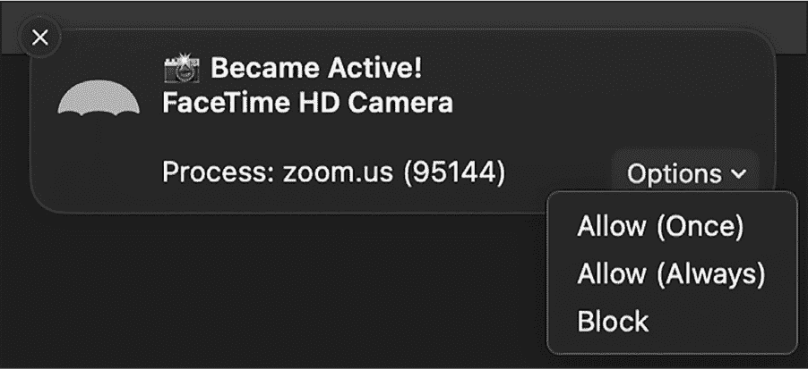

## 第十二章：12 麦克风和摄像头监控


在电视剧《黑镜》中的一集感人剧集《闭嘴并跳舞》中，黑客通过恶意软件感染一名年轻少年的电脑，通过摄像头监视他，然后勒索他实施犯罪行为。巧合的是，就在该剧集播出前，我开始逆向工程一个名为 FruitFly 的 Mac 恶意软件，它做的事情与此非常相似。^(1)

这个持久的后门程序具有多种功能，其中之一就是通过利用过时的 QuickTime API 来监视受害者的摄像头。虽然这些 API 会激活摄像头的 LED 指示灯，但恶意软件有一个相当阴险的手段，试图保持不被发现；它会等到受害者处于非活动状态后才触发监视逻辑。结果，受害者很可能没有注意到他们的摄像头已经被悄悄激活。

我对该恶意软件的调查与 FBI 的行动交集，最终导致了涉嫌创建者的逮捕，并揭示了 FruitFly 的深远影响。根据司法部的新闻稿和起诉书，该创建者在 13 年的时间里在数千台计算机上安装了 FruitFly。^(2)

最终，苹果采取了措施来缓解这一威胁，例如创建了 XProtect 检测签名。即便如此，FruitFly 依然是一个鲜明的警示，提醒 Mac 用户即使苹果尽最大努力，仍可能面临非常现实的风险。FruitFly 甚至不是唯一一个通过摄像头监视受害者的 Mac 恶意软件。其他包括 Mokes、Eleanor 和 Crisis。

为了应对这些威胁，我发布了 OverSight，一款监控 Mac 内置麦克风和摄像头，以及任何外部连接的音频和视频设备的工具，能够在检测到未经授权的访问时提醒用户。在本章中，我将解释 OverSight 是如何监控这些设备的。我还将演示这个工具是如何通过自定义谓词过滤系统日志消息，以识别负责设备访问的进程。

你可以在 Objective-See 的 GitHub 仓库中找到 OverSight 的完整源代码：[*https://<wbr>github<wbr>.com<wbr>/objective<wbr>-see<wbr>/OverSight*](https://github.com/objective-see/OverSight)。

### 工具设计

简而言之，OverSight 会在 Mac 的麦克风或摄像头被激活时提醒用户，并且最重要的是，它能够识别出负责的进程。因此，每当像 FruitFly 这样的恶意软件试图访问摄像头或麦克风时，都会触发 OverSight 的警报。虽然 OverSight 的设计并不试图对进程进行良性或恶性分类，但它提供了选项让用户允许或阻止进程，或者豁免受信任的进程（图 12-1）。



图 12-1：OverSight 提供了一个选项，允许某个工具始终访问麦克风和摄像头。

允许（一次）选项本质上不执行任何操作，因为 OverSight 会在设备激活后收到通知。然而，允许（始终）选项提供了一种简单的方法，允许用户创建规则，以防止将来受信任的进程（如 FaceTime 或 Zoom）生成警报。最后，阻止选项将通过向进程发送终止信号（SIGKILL）来终止该进程。

与包含各种组件和 XPC 通信的工具（如 BlockBlock）相比，OverSight 相对简单。它是一个自包含的独立应用程序，能够在标准用户权限下执行麦克风和摄像头的监控任务。让我们深入探讨一下 OverSight 如何实现这些监控功能，更重要的是，如何识别负责的进程。我们会发现，前者通过各种 CoreAudio 和 CoreMediaIO API 变得容易，而后者则是一个更具挑战性的任务。

#### 麦克风和摄像头枚举

为了接收关于每个连接的麦克风或摄像头已激活或已停用的通知，OverSight 会为每个设备添加一个属性监听器，该监听器用于监听“某处正在运行”属性，kAudioDevicePropertyDeviceIsRunningSomewhere。由于添加此类监听器的 API 需要设备 ID，我们首先来看看如何枚举麦克风和摄像头设备，并提取每个设备的 ID。

AVFoundation^(3) 类 AVCaptureDevice^(4) 提供了一个类方法 devicesWithMediaType:，该方法以媒体类型作为参数（见 列表 12-1）。要枚举音频设备（如麦克风），我们使用常量 AVMediaTypeAudio。要枚举视频设备，我们使用 AVMediaTypeVideo。该方法返回一个 AVCaptureDevice 对象的数组，这些对象与指定的媒体类型匹配。

```
#import <AVFoundation/AVCaptureDevice.h>

for(AVCaptureDevice* audioDevice in [AVCaptureDevice devicesWithMediaType:AVMediaTypeAudio]) {
    printf("audio device: %s\n", audioDevice.description.UTF8String);

    // Add code here to add a property listener for each audio device.
}
for(AVCaptureDevice* videoDevice in [AVCaptureDevice devicesWithMediaType:AVMediaTypeVideo]) {
    printf("video device: %s\n", videoDevice.description.UTF8String);

    // Add code here to add a property listener for each video device.
} 
```

列表 12-1：枚举所有音频和视频设备

编译并运行 列表 12-1 中的代码，在我的系统上输出如下，显示了我的 Mac 内建的麦克风和摄像头，以及一副连接的耳机：

```
Audio device: <AVCaptureHALDevice: 0x11b36a480 [MacBook Pro
Microphone][BuiltInMicrophoneDevice]>

Audio device: <AVCaptureHALDevice: 0x11a7e0440 [Bose QuietComfort 35]
[04-52-C7-77-0D-4E:input]>

Video device: <AVCaptureDALDevice: 0x10dbb2c00 [FaceTime HD Camera]
[3F45E80A-0176-46F7-B185-BB9E2C0E82E3]> 
```

你可以通过每个 AVCaptureDevice 对象的 localizedName 属性访问设备的名称，如 FaceTime HD Camera。你也可以利用其他对象属性，如 modelID、manufacturer 和 deviceType，仅监控部分设备。例如，你可能只选择监控你 Mac 内建的设备。

#### 音频监控

为了在每个音频设备上设置属性监听器，以便接收激活和停用通知，OverSight 实现了一个名为 watchAudioDevice: 的辅助方法，该方法接受一个指向 AVCaptureDevice 对象的指针。对于每个 AVMediaTypeAudio 类型的设备，OverSight 会调用这个辅助方法。

该方法的核心是调用 AVFoundation 中的 AudioObjectAddPropertyListenerBlock 函数，该函数在 *AudioHardware.h* 头文件中定义如下：

```
extern OSStatus AudioObjectAddPropertyListenerBlock(AudioObjectID inObjectID,
const AudioObjectPropertyAddress* inAddress, dispatch_queue_t __nullable inDispatchQueue,
AudioObjectPropertyListenerBlock inListener); 
```

第一个参数是音频对象的 ID，我们可以为其注册属性监听器。每个`AVCaptureDevice`对象都有一个名为`connectionID`的对象属性，包含所需的 ID，但该属性没有公开。这意味着我们不能通过编写诸如`audioDevice.connectionID`这样的代码直接访问它。然而，正如本书其他地方所提到的，您可以通过扩展对象的定义或使用`performSelector:withObject:`方法来访问私有属性。

`OverSight`使用了后一种方法。您可以在名为`getAVObjectID:`的辅助方法中找到从`AVCaptureDevice`对象获取私有设备 ID 的逻辑（示例 12-2）。

```
-(UInt32)getAVObjectID:(AVCaptureDevice*)device {
    UInt32 objectID = 0;

  ❶ SEL methodSelector = NSSelectorFromString(@"connectionID");
    if(YES != [device respondsToSelector:methodSelector]) {
        goto bail;
    }

  ❷ #pragma clang diagnostic push
    #pragma clang diagnostic ignored "-Wpointer-to-int-cast"
    #pragma clang diagnostic ignored "-Warc-performSelector-leaks"
  ❸ objectID = (UInt32)[device performSelector:methodSelector withObject:nil];
  ❹ #pragma clang diagnostic pop

bail:
    return objectID;
} 
```

示例 12-2：获取设备的私有 ID

在 Objective-C 中，您可以通过调用与属性名称匹配的对象方法来访问对象属性，包括私有属性。您可以通过选择器按名称引用这些方法，或者任何方法。`SEL`类型表示的 Objective-C 选择器实际上只是指向表示方法名称的字符串的指针。在示例 12-2 中，您可以看到代码首先使用`NSSelectorFromString`API❶为`connectionID`属性创建了一个选择器。

因为`connectionID`是一个私有属性，所以没有什么能阻止 Apple 重命名或完全移除它。因此，代码调用`respondsToSelector:`方法来确保它仍然存在于`AVCaptureDevice`对象上；如果没有找到，它就会退出。在尝试访问私有属性或调用私有方法之前，您应该始终使用`respondsToSelector:`方法；否则，您的程序可能会因为`doesNotRecognizeSelector`异常而崩溃。^(5)

接下来，代码利用了各种`#pragma`指令来保存诊断状态，并告诉编译器忽略本应显示的警告❷。当我们调用`performSelector:withObject:`方法❸时，这些警告就会被抛出，因为编译器无法知道它返回的是哪个对象，因此也不知道如何管理其内存。^(6) 由于`connectionID`只是一个无符号 32 位整数，它不需要内存管理。

最后，代码通过之前创建的选择器访问`connectionID`属性。它通过上述的`performSelector:withObject:`方法来实现，这个方法允许您在任意对象上调用任意选择器。获得设备标识符后，辅助函数恢复了先前的诊断状态❹，并将设备 ID 返回给调用者。

`AudioObjectAddPropertyListenerBlock`函数的第二个参数是一个指向`AudioObjectPropertyAddress`结构体的指针，该结构体标识我们感兴趣的需要接收通知的属性。`OverSight`初始化了该结构，如示例 12-3 所示。

```
AudioObjectPropertyAddress propertyStruct = {0};
propertyStruct.mSelector = kAudioDevicePropertyDeviceIsRunningSomewhere;
propertyStruct.mScope = kAudioObjectPropertyScopeGlobal;
propertyStruct.mElement = kAudioObjectPropertyElementMain; 
```

示例 12-3：初始化`AudioObjectPropertyAddress`结构体

我们指定了关注的属性是 kAudioDevicePropertyDeviceIsRunningSomewhere，它与系统中任何进程对设备的激活和停用相关。结构体中的其他元素表示我们指定的属性适用于整个设备，而不仅仅是某个特定的输入或输出。因此，一旦我们添加了属性监听器块，OverSight 将在指定的音频设备运行状态变化时收到通知。

该函数的第三个参数是一个标准的调度队列，用于执行监听器块（接下来会描述）。我们可以通过 dispatch_queue_create API 创建一个专用队列，或者使用 dispatch_get_global_queue，例如，使用 DISPATCH_QUEUE_PRIORITY_DEFAULT 常量，来利用现有的全局队列。该函数的最后一个参数是一个类型为 AudioObjectPropertyListenerBlock 的块，当指定设备上的指定属性发生变化时，Core Audio 框架会自动调用该块。下面是该监听器块的类型定义，也可以在*AudioHardware.h*中找到：

```
typedef void (^AudioObjectPropertyListenerBlock)(UInt32 inNumberAddresses,
const AudioObjectPropertyAddress* inAddresses); 
```

由于如果指定接收通知的属性发生变化，多个属性可能会同时变化，因此监听器块会被调用，并传递一个 AudioObjectPropertyAddress 对象的数组以及该数组中的元素个数。OverSight 只对一个属性感兴趣，因此它会忽略这些参数。为了完整性，示例 12-4 展示了 OverSight 的 watchAudioDevice:方法，该方法包含了指定感兴趣的属性、定义通知的监听器块，并将其添加到指定音频设备的核心逻辑。

```
-(BOOL)watchAudioDevice:(AVCaptureDevice*)device {
    AudioObjectPropertyAddress propertyStruct = {0};

    propertyStruct.mSelector = kAudioDevicePropertyDeviceIsRunningSomewhere;
    propertyStruct.mScope = kAudioObjectPropertyScopeGlobal;
    propertyStruct.mElement = kAudioObjectPropertyElementMain;

    AudioObjectID deviceID = [self getAVObjectID:device];

    AudioObjectPropertyListenerBlock listenerBlock =
    ^(UInt32 inNumberAddresses, const AudioObjectPropertyAddress* inAddresses) {
        // Code to handle device's run state changes removed for brevity
    };

    AudioObjectAddPropertyListenerBlock(deviceID, &propertyStruct, self.eventQueue,
    listenerBlock);
    ...
} 
```

示例 12-4：设置音频设备运行状态变化的监听器块

监听器块中的 OverSight 代码查询设备，以确定其当前状态，因为通知告诉我们运行状态发生了变化，但没有具体说明变化到了哪个状态。如果发现音频设备已开启，OverSight 会查询其日志监视器，以确定负责访问和激活该设备的进程身份。这个步骤在“负责任的进程识别”一节中有更详细的讨论（见第 288 页）。遗憾的是，这一步是必要的，因为虽然苹果提供了 API 来接收音频设备状态变化的通知，但它们并没有提供关于负责进程的任何信息。最后，监听器块会提醒用户，提供有关音频设备、其状态以及在激活情况下负责的进程的信息。

为了确定设备是被激活还是被停用，OverSight 在它名为 getMicState:的辅助方法中调用了 AudioDeviceGetProperty API（示例 12-5）。

```
-(UInt32)getMicState:(AVCaptureDevice*)device {
    UInt32 isRunning = 0;
    UInt32 propertySize = sizeof(isRunning);

    AudioObjectID deviceID = [self getAVObjectID:device]; ❶
    AudioDeviceGetProperty(deviceID, 0, false, kAudioDevicePropertyDeviceIsRunningSomewhere,
    &propertySize, &isRunning); ❷

    return isRunning;
} 
```

示例 12-5：确定音频设备的当前状态

在声明了几个必要的变量之后，该方法调用前面讨论过的 getAVObjectID: 辅助方法，从触发通知的 AVCaptureDevice 对象中提取私有设备 ID ❶。然后，它将这个值与 kAudioDevicePropertyDeviceIsRunningSomewhere 常量、大小和结果的输出指针一起传递给 AudioDeviceGetProperty 函数 ❷。通过此调用，我们将知道我们在回调块中收到的通知是由于设备激活还是由于不太重要的停用。

接下来，我将向你展示如何监控视频设备，例如内置的摄像头。

#### 摄像头监控

为了检测视频设备的运行状态变化，这些设备的类型为 AVMediaTypeVideo，我们可以采用类似于音频设备监控代码的方法。然而，我们将使用 *CoreMediaIO* 框架中的 API，并通过 CMIOObjectAddPropertyListenerBlock API 注册一个属性监听器。

OverSight 在其 watchVideoDevice: 方法中监控视频设备的运行状态变化（Listing 12-6）。

```
-(BOOL)watchVideoDevice:(AVCaptureDevice*)device {
  ❶ CMIOObjectPropertyAddress propertyStruct = {0};
    propertyStruct.mScope = kAudioObjectPropertyScopeGlobal;
    propertyStruct.mElement = kAudioObjectPropertyElementMain;
    propertyStruct.mSelector = ❷ kAudioDevicePropertyDeviceIsRunningSomewhere;

  ❸ CMIOObjectID deviceID = [self getAVObjectID:device];

  ❹ CMIOObjectPropertyListenerBlock listenerBlock = ^(UInt32
    inNumberAddresses, const CMIOObjectPropertyAddress addresses[]) {
        // Code to handle device's run-state changes removed for brevity
    };

  ❺ CMIOObjectAddPropertyListenerBlock(deviceID, &propertyStruct,
    self.eventQueue, listenerBlock);
    ...
} 
```

Listing 12-6: 设置视频设备运行状态变化的监听器块

就像监控音频设备一样，代码初始化一个属性结构来指定我们感兴趣的接收通知的属性 ❶。请注意，我们使用的常量与音频设备相同 ❷。苹果的头文件似乎没有定义特定于视频设备的常量。

接下来，我们使用 OverSight 的 getAVObjectID: 辅助方法获取视频设备的 ID ❸。我们还实现了一个类型为 CMIOObjectPropertyListenerBlock 的监听器块 ❹，然后调用 CMIOObjectAddPropertyListenerBlock 函数 ❺。一旦我们调用了这个函数，*CoreMediaIO* 框架会在监控的视频设备激活或停用时自动调用监听器块。

与音频设备一样，我们必须手动查询设备以了解它是否已被激活或禁用。你可以在 OverSight 的 getCameraState: 方法中找到这一逻辑，该方法使用 CoreMediaIO API，但与 getMicState: 方法几乎完全相同。因此，我在这里就不再详细介绍了。

#### 设备连接与断开

到目前为止，我们已经列出了当前连接到系统的音频和视频设备。对于每个设备，我们都添加了一个属性监听器块，它将在设备激活或停用时接收通知。一切顺利，但我们还需要处理当前监控的设备断开和重新连接的情况，以及用户在监控期间插入新设备的情况。例如，假设用户经常将笔记本电脑连接或断开连接到 Apple Cinema 显示器。这些显示器内置有摄像头，OverSight 应该监控这些摄像头以防止未经授权的激活，因此我们必须能够处理那些不断连接和断开的设备。

幸运的是，由于 macOS 的 NSNotificationCenter 调度机制，这个过程相对简单。它是 *Foundation* 框架的一部分，允许客户端注册自己为感兴趣事件的观察者，然后在这些事件发生时接收通知。为了了解音频或视频设备的连接和断开，我们将订阅 AVCaptureDeviceWasConnectedNotification 和 AVCaptureDeviceWasDisconnectedNotification 事件，并可以通过 Listing 12-7 中的代码进行注册。

```
[NSNotificationCenter.defaultCenter addObserver:self
selector:@selector(handleConnectedDeviceNotification:)
name:AVCaptureDeviceWasConnectedNotification object:nil];

[NSNotificationCenter.defaultCenter addObserver:self
selector:@selector(handleDisconnectedDeviceNotification:)
name:AVCaptureDeviceWasDisconnectedNotification object:nil]; 
```

Listing 12-7：注册设备连接和断开的事件

OverSight 调用了两次 addObserver:selector:name:object: 方法来注册自己监听感兴趣的事件。让我们仔细看看传递给这个方法的参数。第一个参数是用于处理通知的对象或 *观察者*。OverSight 指定 self，表示注册通知的对象与处理通知的对象相同。作为第二个参数，OverSight 使用 @selector 关键字指定在观察者对象上调用的处理通知的方法名称。对于新设备连接，我们使用名为 handleConnectedDeviceNotification: 的 OverSight 方法，对于设备断开，则使用 handleDisconnectedDeviceNotification: 方法。我们稍后会查看这些方法。

接下来，我们指定感兴趣的事件，比如设备连接或断开。这些事件的常量可以在 Apple 的 *AVCaptureDevice.h* 文件中找到。最后一个参数允许你指定一个附加对象，随通知一起传递。OverSight 没有使用这个参数，因此简单地传递 nil。

一旦 OverSight 调用了 addObserver:selector:name:object: 方法两次，每当设备连接或断开时，通知中心将触发我们相应的观察者方法。它传递给该方法的唯一参数是一个指向 NSNotification 对象的指针。在设备连接或断开的情况下，这个对象包含一个指向 AVCaptureDevice 的指针。

两个通知观察者方法首先从通知对象中提取设备，然后确定其类型（音频或视频）。接下来，代码根据设备是连接还是断开，调用 OverSight 的特定方法来开始或停止监控。

作为一个示例，Listing 12-8 展示了 handleConnectedDeviceNotification: 方法的实现。

```
-(void)handleConnectedDeviceNotification:(NSNotification *)notification {
  ❶ AVCaptureDevice* device = notification.object;

  ❷ if(YES == [device hasMediaType:AVMediaTypeAudio]) {
        [self watchAudioDevice:device];
  ❸} else if(YES == [device hasMediaType:AVMediaTypeVideo]) {
        [self watchVideoDevice:device];
    }
} 
```

Listing 12-8：当一个新设备连接时，OverSight 将开始监视它的运行状态变化。

该方法通过访问传入的 NSNotification 对象的对象属性来提取触发通知的设备 ❶。如果这个新连接的设备是音频设备，代码会调用 OverSight 的 watchAudioDevice: 方法，如前文所述，用于注册状态变化的属性监听块 ❷。对于视频设备，代码会调用 watchVideoDevice: 方法 ❸。处理设备断开连接的方法是相同的，不同之处在于它调用相关的 OverSight *unwatch* 方法，详见《停止》章节 第 293 页，用于停止音频或视频设备的监控。

如果我们仅仅对视频或音频设备是否被激活或停用感兴趣，那么就此为止。然而，如果没有包含触发该事件的责任进程，这些事件在恶意软件检测中的作用非常有限。因此，我们还需要做更多工作。

#### 责任进程识别

许多合法活动可能会激活你的麦克风或摄像头（例如，参加视频会议）。安全工具必须能够识别访问设备的进程，以便能够忽略它信任的进程，并对任何不认识的进程发出警报。

在前面的章节中，我提到过 Endpoint Security API 可以识别许多感兴趣事件的责任进程。不幸的是，Endpoint Security 目前并未报告麦克风和摄像头的访问情况（尽管我多次恳求 Apple 添加这个功能）。虽然我们已经展示了 CoreAudio 和 CoreMediaIO API 可以提供设备运行状态变化的通知，但它们并不包含关于责任进程的信息。

多年来，OverSight 采取了各种迂回的方法来准确识别责任进程。最初，它利用了这样一个事实：访问麦克风或摄像头的进程框架会向 macOS 核心摄像头和音频助手守护进程发送各种 Mach 消息。当收到设备运行状态变化通知时，OverSight 会列举出所有 Mach 消息的发送者。它还通过从 I/O 注册表中提取潜在的责任进程来补充这一信息。^(7) 不幸的是，即使采用这种结合的方法，通常也会得到多个候选进程。因此，OverSight 执行了 macOS 样本工具，该工具提供了候选进程的堆栈跟踪。通过检查这些堆栈跟踪，它可以识别出某个进程是否正在与音频或视频设备进行交互。

这种方法虽然效率不高（且样本实用性有点侵入性，因为它会短暂地暂停目标进程），但它能够持续地识别出负责的进程。当时，OverSight 是市场上唯一能够提供此功能的工具，这使得它不仅受到用户的欢迎，也吸引了商业实体的关注，这些公司反向工程了该工具，将这项功能盗用为己所用——包括所有的漏洞！当我拿出这项违规行为的证据与公司对质时，所有公司最终都承认了过错，表示道歉，并做出了赔偿。^(8)

> 注释

*有趣的是，其中一位复制了 OverSight 专有逻辑的开发人员不久后就开始为 Apple 工作。是否巧合，macOS 的更新版本现在在进程首次尝试访问麦克风或摄像头时会发出提醒。正如他们所说，模仿是最真诚的恭维方式。*

随着 macOS 的变化，OverSight 最初用来识别负责进程的方法逐渐显得过时。幸运的是，通用日志的引入提供了一个更高效的解决方案。在第六章中，我展示了如何使用通用日志的私有 API 和框架来摄取流式日志消息等任务。OverSight 使用了这些相同的 API 和框架，并结合自定义的筛选谓词，来识别触发任何麦克风或摄像头状态变化的进程。

> 注释

*日志中的消息随时可能发生变化。在这一部分中，我重点讨论的是 macOS 14 和 15 中存在的消息。虽然未来的操作系统版本可能会替换这些消息，但你应该能够识别出新的消息并进行替换。*

通用日志包含了从系统各个角落不断流出的许多消息。为了识别相关的消息（例如，涉及访问摄像头的进程），我们可以先启动一个日志流，然后打开一个使用网络摄像头的应用程序，如 FaceTime：

```
% **log stream**
...
Default     0x0   367    0    com.apple.cmio.registerassistantservice:
[com.apple.cmio:] RegisterAssistantService.m:2343:-[RegisterAssistantServer
addRegisterExtensionConnection:]_block_invoke [{private}**901**][{private}0]
added <private> endpoint <private> camera <private>

Default     0x0   **901**    0    avconferenced: (CoreMediaIO) [com.apple.cmio:]
CMIOHardware.cpp:747:CMIODeviceStartStream backtrace 0   CoreMediaIO
0x000000019b4c4040 CMIODeviceStartStream + 228    [0x19b45a000 + 434240] 
```

在流中，你可以看到与摄像头访问相关的消息。这些消息包含指向 PID 为 901 的进程的引用，或者是由该进程发出的。在这个例子中，PID 映射到 avconferenced 进程，它代表 FaceTime 访问网络摄像头。让我们尝试另一个应用程序（比如 Zoom），看看日志中显示了什么：

```
% **log stream**
...
Default     0x0   367    0    com.apple.cmio.registerassistantservice:
[com.apple.cmio:] RegisterAssistantService.m:2343:-[RegisterAssistantServer
addRegisterExtensionConnection:]_block_invoke [{private}**17873**][{private}0]
added <private> endpoint <private> camera <private>

Default     0x0   **17873**  0    zoom.us: (CoreMediaIO) [com.apple.cmio:]
CMIOHardware.cpp:747:CMIODeviceStartStream backtrace 0   CoreMediaIO
0x00007ff8248a6287 CMIODeviceStartStream
+ 205    [0x7ff824840000 + 418439]CMIOHardware.cpp:747:CMIODeviceStartStream
backtrace 0   CoreMediaIO      0x00007ff8248a6287 CMIODeviceStartStream +
205    [0x7ff824840000 + 418439] 
```

我们收到了完全相同的消息，只不过这次它们包含了一个进程 ID 17873，它属于 Zoom。你可以进行类似的实验，识别出包含有关访问麦克风的进程信息的日志消息。

为了程序化地与通用日志进行交互，OverSight 实现了一个名为 LogMonitor 的自定义类。该类中的代码与 *LoggingSupport* 框架中的私有 API 进行了接口交互。由于第六章已经详细介绍了这一策略，这里就不再重复。如果你对完整的代码感兴趣，可以查看 *OverSight* 项目中的 *LogMonitor.m* 文件。

OverSight 的 LogMonitor 类暴露了一个方法，其定义如 列表 12-9 所示。

```
-(BOOL)start:(NSPredicate*)predicate level:(NSUInteger)level
callback:(void(^)(OSLogEvent*))callback; 
```

列表 12-9：LogMonitor 的方法，通过指定的级别和谓词启动日志流

给定一个谓词和一个日志级别（例如默认或调试），此方法激活一个流式日志会话。它将传递与指定谓词匹配的 OSLogEvent 类型的日志消息给调用者，使用指定的回调块。

OverSight 使用一个谓词，该谓词匹配来自核心媒体 I/O 子系统或核心媒体子系统的所有日志消息，因为这些子系统生成包含负责进程 PID 的特定日志消息（列表 12-10）。

```
if(@available(macOS 14.0, *)) {
    [self.logMonitor start:[NSPredicate predicateWithFormat:@"subsystem=='com.apple.cmio' OR
    subsystem=='com.apple.coremedia'"] level:Log_Level_Default callback:^(OSLogEvent*
    logEvent) {
        // Code that processes cmio and coremedia log messages removed for brevity
    }];
} 
```

列表 12-10：过滤来自 cmio 和 coremedia 子系统的消息

我们故意让这些谓词尽可能宽泛，以确保 macOS 在系统日志守护进程的日志框架实例中执行谓词匹配，而不是在 OverSight 加载的同一框架实例中执行。这避免了在两个进程之间复制和传输所有系统日志消息的重大开销。然而，使用更宽泛的谓词的唯一缺点是 OverSight 必须筛选掉不相关的消息。不过，由于这两个指定子系统生成的日志消息数量不多，因此这种额外的处理不会引入太多开销。

对于来自子系统的每条消息，OverSight 检查它是否包含触发设备运行状态变化的进程 PID。列表 12-11 展示了处理摄像头事件的代码。

```
❶ NSRegularExpression* cameraRegex = [NSRegularExpression
regularExpressionWithPattern:@"\\[\\{private\\}(\\d+)\\]"
options:0 error:nil];

❷ if((YES == [logEvent.subsystem isEqual:@"com.apple.cmio"]) &&
    (YES == [logEvent.composedMessage hasSuffix:@"added <private>
    endpoint <private> camera <private>"])) {
  ❸ NSTextCheckingResult* match = [cameraRegex firstMatchInString:logEvent.
    composedMessage options:0 range:NSMakeRange(0, logEvent.composedMessage.
    length)];
    if((nil == match) || (NSNotFound == match.range.location)) {
 return;
    }
  ❹ NSInteger pid = [[logEvent.composedMessage substringWithRange:
    [match rangeAtIndex:1]] integerValue];
        self.lastCameraClient = pid;
} 
```

列表 12-11：解析 cmio 消息以检测负责的进程

对于摄像头事件，我们查找来自 com.apple.cmio 子系统的消息，该消息以添加的 <private> 端点 <private> 摄像头 <private> ❷ 结尾。为了提取该进程的 PID，OverSight 使用一个正则表达式，它会在消息处理之前初始化，以避免重新初始化 ❶，然后将其应用于候选消息 ❸。如果正则表达式不匹配，回调函数将通过返回语句退出。否则，它会提取 PID 作为整数，并将其保存到一个名为 lastCameraClient 的实例变量中 ❹。OverSight 在收到摄像头运行状态变更通知时引用该变量，并构建一个警报以显示给用户（列表 12-12）。

```
Client* client = nil;

if(0 != self.lastCameraClient) {
    client = [[Client alloc] init];
    client.pid = [NSNumber numberWithInteger:self.**lastCameraClient**];
    client.path = valueForStringItem(getProcessPath(client.pid.intValue));
    client.name = valueForStringItem(getProcessName(client.path));
}
Event* event = [[Event alloc] init:client device:device deviceType:
Device_Camera state:NSControlStateValueOn];

[self handleEvent:event]; 
```

列表 12-12：创建一个封装负责进程的对象

对于麦克风事件，方法类似，除了 OverSight 查找来自 com.apple.coremedia 子系统的消息，这些消息以 -MXCoreSession- -[MXCoreSession beginInterruption] 开头，以 Recording = YES> is going active 结尾。

使用通用日志来识别负责麦克风和摄像头访问的进程已经证明是有效的。这种策略的主要缺点是 Apple 偶尔会更改或删除相关的日志信息。例如，OverSight 在 macOS 的早期版本中使用了不同的日志信息来识别负责的进程，这迫使我在 Apple 删除这些日志信息后更新工具。你可以通过查看 OverSight GitHub 仓库中的 *AVMonitor.m* 提交历史记录来看到这些更新。

### 触发脚本

当我在 2015 年介绍 OverSight 时，macOS 对麦克风或摄像头的访问没有任何限制，这意味着任何感染系统的恶意软件都可以轻松访问这些设备。近期版本的 macOS 已经解决了这个问题，当任何应用程序首次尝试访问这些设备时，会提示用户。不幸的是，这种方法依赖于操作系统的透明度、同意和控制（TCC）机制，而黑客和恶意软件常常绕过该机制，正如 第六章 所述。

除了提供额外的防御层，OverSight 还提供了用户创造性地利用的功能。例如，它提供了一个机制，当某个进程访问麦克风或摄像头时，可以采取额外的行动。如果你打开 OverSight 的偏好设置并点击“操作”标签，你会看到可以指定一个外部脚本或二进制文件的路径。如果用户提供了这样的可执行文件，OverSight 会在每次激活事件时执行它。

为了进一步增强这一功能，另一个选项允许用户启用参数以提供给脚本，包括设备、状态和负责的进程。这使得 OverSight 相对容易集成到其他安全工具中（尽管用户经常出于更实际的原因使用这一功能，比如每次激活麦克风或摄像头时，打开家办公室外的外部灯）。

OverSight 执行外部脚本或二进制文件的代码相当简单，尽管处理参数时需要注意一些细节。OverSight 使用 NSUserDefaults 类来持久化存储设置和偏好，包括任何用户指定的脚本或二进制文件。列表 12-13 显示了当用户与浏览按钮交互时，保存项目路径的代码。

```
#define PREF_EXECUTE_PATH @"executePath"
#define PREF_EXECUTE_ACTION @"executeAction"
❶ self.executePath.stringValue = panel.URL.path;
...
❷ [NSUserDefaults.standardUserDefaults setBool:NSControlStateValueOn
forKey:PREF_EXECUTE_ACTION];

❸ [NSUserDefaults.standardUserDefaults setObject:self.executePath.stringValue
forKey:PREF_EXECUTE_PATH];

❹ [NSUserDefaults.standardUserDefaults synchronize]; 
```

列表 12-13：用于存储用户偏好的 NSUserDefaults 类

我们通过用户界面 ❶ 保存用户选择的项目路径，然后设置一个标志，表示用户指定了一个操作 ❷，并保存该项目的路径 ❸。请注意，panel 是一个 NSOpenPanel 对象，包含用户选择的项目。我们使用 NSUserDefaults 的 standardUserDefaults 对象的 setBool: 方法设置标志，并使用 setObject: 方法设置项目路径。最后，我们同步操作以触发保存 ❹。

当用户指定要运行的外部项时，OverSight 会调用一个名为 executeUserAction: 的辅助函数，在麦克风或摄像头的运行状态更改时执行该项（清单 12-14）。

```
#define SHELL @"/bin/bash"
#define PREF_EXECUTE_PATH @"executePath"
#define PREF_EXECUTE_ACTION_ARGS @"executeActionArgs"

-(BOOL)executeUserAction:(Event*)event {
    NSMutableString* args = [NSMutableString string];

    NSString* action = [NSUserDefaults.standardUserDefaults objectForKey:PREF_EXECUTE_PATH]; ❶
    if(YES == [NSUserDefaults.standardUserDefaults boolForKey:PREF_EXECUTE_ACTION_ARGS]) { ❷
        [args appendString:@"-device "]; ❸
        (Device_Camera == event.deviceType) ? [args appendString:@"camera"] :
        [args appendString:@"microphone"];

        [args appendString:@" -process "];
        [args appendString:event.client.pid.stringValue];
        ...
    }

  ❹ execTask(SHELL, @[@"-c", [NSString stringWithFormat:@"\"%@\" %@", action, args]], NO, NO);
    ... 
```

清单 12-14：执行用户指定的带参数项

executeUserAction: 方法首先从保存的偏好设置中提取用户指定的要执行项的路径 ❶。然后它检查用户是否选择了传递参数给该项 ❷。如果是，它动态构建一个包含参数的字符串，其中包括触发事件的设备和负责的进程 ❸。最后，它通过 shell 使用之前章节中讨论的 execTask 辅助函数执行该项及其任何参数 ❹。

你可能会想知道为什么 OverSight 通过 */bin/bash* 执行用户指定的项，而不是直接执行该项。嗯，因为 shell 支持执行脚本和独立的可执行文件，这意味着用户可以在 OverSight 中指定任一项。

### 停止

为用户提供一个简单的方式来暂停或完全禁用他们安装的安全工具是很好的。我将在本章结束时查看 OverSight 的代码，以停止设备和日志监控。我不会涵盖暴露此功能的 UI 组件和逻辑，但你可以在 OverSight 的*Application/StatusBarItem.m* 文件中找到它们作为 macOS 状态栏菜单的实现。

当用户禁用或停止 OverSight 时，它首先通过调用自定义日志监控器暴露的停止方法来停止日志监控器。该方法通过调用 OSLogEventLiveStream 对象的 invalidate 方法结束接收日志消息的流。一旦日志监控器停止，OverSight 会在两个循环中停止监控所有音频和视频设备（清单 12-15）。

```
-(void)stop {
    ...
    for(AVCaptureDevice* audioDevice in [AVCaptureDevice devicesWithMediaType:AVMediaType
    Audio]) {
        [self unwatchAudioDevice:audioDevice];
    }

    for(AVCaptureDevice* videoDevice in [AVCaptureDevice devicesWithMediaType:AVMediaType
    Video]) {
        [self unwatchVideoDevice:videoDevice];
    }
    ...
} 
```

清单 12-15：结束对所有设备的监控

一个循环遍历所有音频设备，调用 OverSight 的 unwatchAudioDevice: 方法，另一个循环遍历视频设备，调用 unwatchVideoDevice: 方法。这些方法中的代码移除监听器块，与本章早些时候涵盖的 watch* 监控方法几乎完全相同，正如你在来自 unwatchAudioDevice 方法的这段代码中所看到的（清单 12-16）。

```
-(void)unwatchAudioDevice:(AVCaptureDevice*)device {
    ...
    AudioObjectID deviceID = [self getAVObjectID:device];

    AudioObjectPropertyAddress propertyStruct = {0};
    propertyStruct.mScope = kAudioObjectPropertyScopeGlobal;
    propertyStruct.mElement = kAudioObjectPropertyElementMain;
    propertyStruct.mSelector = kAudioDevicePropertyDeviceIsRunningSomewhere;

  ❶ AudioObjectRemovePropertyListenerBlock(deviceID,
    &propertyStruct, self.eventQueue, self.audioListeners[device.uniqueID]);
    ...
} 
```

清单 12-16：从音频设备中移除属性监听器块

这段代码首先获取指定设备的 ID，然后初始化一个描述先前添加的属性监听器的 AudioObjectPropertyAddress ❶。它将这些内容与存储在名为 audioListeners 的字典中的监听器块一起传递给 AudioObjectRemovePropertyListenerBlock 函数。这将完全移除属性监听器块，结束 OverSight 对设备的监控。

### 结论

一些针对 Mac 用户的最隐蔽的威胁通过麦克风或摄像头监视受害者。OverSight 并不试图检测特定的恶意软件样本，而是通过采用简单但强大的启发式方法来检测未经授权的麦克风和摄像头访问，从而对抗所有这类威胁。

在本章中，我首先向你展示了 OverSight 如何利用各种 CoreAudio 和 CoreMediaIO API 注册关于麦克风和摄像头激活和停用的通知。接着，我们探讨了该工具如何使用自定义日志监视器来识别负责该事件的进程。最后，我向你展示了用户如何轻松扩展 OverSight，以便在检测到事件时执行外部脚本或二进制文件，以及停止 OverSight 的逻辑。

在下一章中，我们将继续探索构建强大安全工具的方法，重点介绍如何创建一个 DNS 监视器，能够检测并阻止未经授权的网络访问。

### 注释

1.    1.  Selena Larson, “Mac 恶意软件悄悄监视计算机用户，”CNN Money，2017 年 7 月 24 日，[*https://money.cnn.com/2017/07/24/technology/mac-fruitfly-malware-spying/index.html*.](https://money.cnn.com/2017/07/24/technology/mac-fruitfly-malware-spying/index.html)

1.    2.  美国司法部，公共事务办公室，“俄亥俄州计算机程序员因感染成千上万台计算机并获取受害者通信及个人信息而被起诉，”新闻稿编号 18-21，2018 年 1 月 10 日，[*https://<wbr>www<wbr>.justice<wbr>.gov<wbr>/opa<wbr>/pr<wbr>/ohio<wbr>-computer<wbr>-programmer<wbr>-indicted<wbr>-infecting<wbr>-thousands<wbr>-computers<wbr>-malicious<wbr>-software<wbr>-and*](https://www.justice.gov/opa/pr/ohio-computer-programmer-indicted-infecting-thousands-computers-malicious-software-and).

1.    3.  “AVFoundation，”Apple 开发者文档，[*https://<wbr>developer<wbr>.apple<wbr>.com<wbr>/documentation<wbr>/avfoundation<wbr>?language<wbr>=objc*](https://developer.apple.com/documentation/avfoundation?language=objc).

1.    4.  “AVCapture Device，”Apple 开发者文档，[*https://<wbr>developer<wbr>.apple<wbr>.com<wbr>/documentation<wbr>/avfoundation<wbr>/avcapturedevice<wbr>?language<wbr>=objc*](https://developer.apple.com/documentation/avfoundation/avcapturedevice?language=objc).

1.    5.  “doesNotRecognizeSelector:，”Apple 开发者文档，[*https://<wbr>developer<wbr>.apple<wbr>.com<wbr>/documentation<wbr>/objectivec<wbr>/nsobject<wbr>/1418637<wbr>-doesnotrecognizeselector<wbr>?language<wbr>=objc*](https://developer.apple.com/documentation/objectivec/nsobject/1418637-doesnotrecognizeselector?language=objc).

1.    6.  “performSelector 可能会导致内存泄漏，因为它的选择器未知，”Stack Overflow，2018 年 11 月 18 日，[*https://<wbr>stackoverflow<wbr>.com<wbr>/a<wbr>/20058585*](https://stackoverflow.com/a/20058585).

1.    7.  《I/O 注册表》，苹果文档档案，最后更新于 2014 年 4 月 9 日，[*https://<wbr>developer<wbr>.apple<wbr>.com<wbr>/library<wbr>/archive<wbr>/documentation<wbr>/DeviceDrivers<wbr>/Conceptual<wbr>/IOKitFundamentals<wbr>/TheRegistry<wbr>/TheRegistry<wbr>.html*](https://developer.apple.com/library/archive/documentation/DeviceDrivers/Conceptual/IOKitFundamentals/TheRegistry/TheRegistry.html)。

1.    8.  你可以在 Corin Faife 的文章“这位 Mac 黑客的代码如此优秀，以至于企业不断窃取”中了解更多这一系列事件的细节，发表于《The Verge》，2022 年 8 月 11 日，[*https://<wbr>www<wbr>.theverge<wbr>.com<wbr>/2022<wbr>/8<wbr>/11<wbr>/23301130<wbr>/patrick<wbr>-wardle<wbr>-mac<wbr>-code<wbr>-corporations<wbr>-stealing<wbr>-black<wbr>-hat*](https://www.theverge.com/2022/8/11/23301130/patrick-wardle-mac-code-corporations-stealing-black-hat)。
