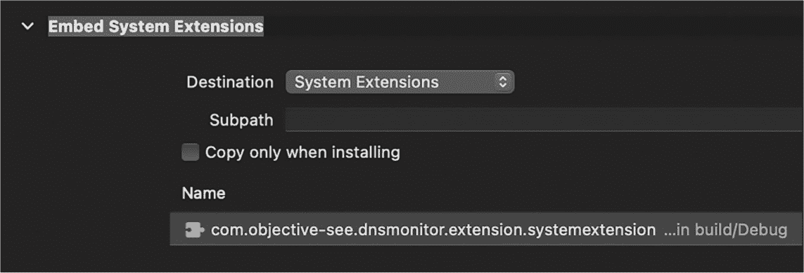

## 13 DNS 监控器


在本章中，我将专注于构建一个可部署的基于主机的网络监控器的实际操作，能够代理并阻止来自未识别进程或指向不可信域的 DNS 流量。

第七章介绍了一个基本的 DNS 代理设计，能够通过苹果的*NetworkExtension* 框架监控流量。然而，在那一章中，我跳过了许多构建可部署工具所需的步骤，包括获取必要的权限和正确地将扩展打包到主机应用程序中。本章将讨论这些任务，以及如何扩展一个基本的监控器，例如通过解析 DNS 查询和响应来阻止那些出现在封锁列表中的查询。

你可以在开源的 DNSMonitor 中找到这些能力和更多内容，DNSMonitor 是 Objective-See 工具套件的一部分（[*https://<wbr>github<wbr>.com<wbr>/objective<wbr>-see<wbr>/DNSMonitor*](https://github.com/objective-see/DNSMonitor)）。我建议你在阅读本章时下载该项目或参考仓库中的源代码，因为接下来的讨论常常为了简洁起见省略了部分代码。

### 网络扩展部署先决条件

现代网络监控工具，包括 DNSMonitor，利用了网络扩展框架。因为它们作为系统扩展打包并以独立进程运行，具有提升的权限，苹果要求开发者以非常特定的方式授予权限并打包这些扩展。在第十一章中，我们详细讲解了如何获取端点安全权限，并在 Apple Developer 门户中为该工具创建配置文件。如果你正在构建一个网络扩展，你将遵循类似的流程，虽然有一些关键的不同之处。

首先，你需要生成两个配置文件，一个用于网络扩展，另一个用于包含并加载扩展的应用程序。按照第十一章中描述的流程，在 Apple Developer 网站上为每个项目创建一个 ID。当要求选择扩展的能力时，勾选**网络扩展**，这对应于*com.apple.developer.networking.networkextension* 权限。任何开发者都可以使用这个权限（与端点安全权限不同，后者需要苹果的明确批准）。对于应用程序，选择相同的能力，以及**系统扩展**，这将允许应用程序安装、加载和管理扩展。一旦你创建了这两个 ID，就可以创建这两个配置文件。

现在，你必须在 Xcode 中安装每个配置文件。如果你查看*DNSMonitor*项目，你会看到它包含两个目标：扩展和它的宿主应用程序。当你点击这两个目标中的任何一个时，“签名和功能”选项卡应该提供一个选项来指定相关的配置文件。苹果的开发者文档建议通过取消勾选“自动管理签名”选项来启用手动签名。^(1)

“签名和功能”选项卡还会显示 DNSMonitor 项目已为扩展和应用程序启用了额外的功能，这些功能与我们在构建配置文件时指定的功能匹配。扩展指定了网络扩展功能，而应用程序则同时指定了网络扩展和系统扩展。如果你自己构建网络扩展，你必须通过点击功能旁边的+手动添加这些功能。

在幕后，添加这些功能会将相关的权限应用到每个目标的*entitlements.plist*文件中。不幸的是，我们必须手动编辑这些*entitlements.plist*文件。添加网络扩展功能并勾选 DNS 代理将添加一个值为 dns-proxy 的权限，但要部署一个使用开发者 ID 签名的扩展，我们需要 dns-proxy-systemextension 的值。^(2) 列表 13-1 展示了扩展的*entitlements.plist*文件中的内容。

```
<?xml version="1.0" encoding="UTF-8"?>
...
<plist version="1.0">
<dict>
    <key>**com.apple.developer.networking.networkextension**</key>
    <array>
        <string>**dns-proxy-systemextension**</string>
    </array>
    ... 
```

列表 13-1：我们必须授权网络扩展并指定扩展类型。

该文件包括网络扩展权限作为一个键，并且包含一个数组，其中保存了所有扩展类型。

### 打包扩展

任何使用网络扩展的工具都必须将其实现为系统扩展，并以特定的方式结构化自身，以便 macOS 可以验证并激活它。具体来说，苹果要求任何系统扩展都必须打包在一个捆绑包内，例如应用程序，并放在捆绑包的*Contents/Library/SystemExtensions/*目录下。一个配置文件还必须授权使用受限权限，而且我们不能将配置文件直接嵌入到独立的二进制文件中。

基于这些原因，DNSMonitor 包含两个组件：宿主应用程序和网络扩展。^(3) 为了正确打包扩展，我们在**构建阶段**下指定应用程序组件对扩展的依赖。我们将目标设置为**系统扩展**，这样 macOS 在构建应用程序时会将扩展复制到应用程序的*Contents/Library/SystemExtensions/*目录中（图 13-1）。



图 13-1：应用程序包含一个构建步骤，将系统扩展嵌入其中。

现在让我们关注扩展的*Info.plist*文件（列表 13-2）。

```
<?xml version="1.0" encoding=”UTF-8"?>
...
<plist version="1.0">
<dict>
    ...
  ❶ <key>CFBundlePackageType</key>
 <string>$(PRODUCT_BUNDLE_PACKAGE_TYPE)</string>
    ...
  ❷ <key>NetworkExtension</key>
    <dict>
      ❸ <key>NEMachServiceName</key>
        <string>$(TeamIdentifierPrefix)com.objective-see.dnsmonitor</string>
      ❹ <key>NEProviderClasses</key>
            <dict>
                <key>com.apple.networkextension.dns-proxy</key>
                <string>DNSProxyProvider</string>
            </dict>
        </dict>
        ... 
```

Listing 13-2：扩展的 Info.plist 文件包含特定于网络扩展的各种键值对。

我们将 CFBundlePackageType 设置为一个变量 ❶，编译器会将其替换为项目的类型，systemextension。NetworkExtension 键保存一个字典，其中包含与网络扩展相关的键值对 ❷。NEMachServiceName 键指定扩展可以用于 XPC 通信的 Mach 服务的名称 ❸。此外，请注意 NEProviderClasses 键，其中包含网络扩展的类型以及在 DNSMonitor 中实现所需网络扩展逻辑的类名 ❹。在第七章中，我提到过这个类应该实现 NEDNSProxyProvider 委托方法。我们还必须将扩展组件链接到 *NetworkExtension* 框架。

应用程序的 *entitlements.plist* 文件，如 Listing 13-3 所示，与扩展的文件非常相似。

```
<?xml version="1.0" encoding="UTF-8"?>
...
<plist version="1.0">
<dict>
    <key>com.apple.developer.networking.networkextension</key>
    <array>
        <string>dns-proxy-systemextension</string>
    </array>
    <key>com.apple.developer.system-extension.install</key>
    <true/>
    <key>com.apple.security.application-groups</key>
    <array>
        <string>$(TeamIdentifierPrefix)com.objective-see.dnsmonitor</string>
    </array>
</dict>
</plist> 
```

Listing 13-3：应用程序的 entitlements.plist 文件还包含特定于网络扩展的键值对。

两者的一个区别是添加了 *com.apple.developer.system-extension.install* 权限，设置为 true。我们通过授予应用程序系统扩展功能间接将此权限添加到应用程序的配置文件中。应用程序需要此权限才能安装并激活网络扩展。

### 工具设计

现在我已经解释了 DNSMonitor 的组成部分，让我们关注它是如何工作的，从启动应用程序开始。

#### 应用程序

你可以在*DNSMonitor/App/main.m*文件中找到应用程序的初始化逻辑。经过一些基本的参数解析（例如，检查用户是否通过 -h 标志启动了应用程序以显示默认用法），应用程序会获取负责的父进程的 bundle ID。如果这个父进程是 Finder 或 Dock（在用户双击应用程序图标的场景中，通常是这些父进程），应用程序会显示一个提示，说明 DNSMonitor 应该从终端运行。

此外，除非我们从 *Applications* 目录运行 DNSMonitor，否则当应用程序调用 OSSystemExtensionRequest request:didFailWithError: 委托方法来激活扩展时，它将失败：^(4)

```
ERROR: method '-[Extension request:didFailWithError:]' invoked with
<OSSystemExtensionActivationRequest: 0x600003a8f150>, Error Domain=
OSSystemExtensionErrorDomain Code=3 "App containing System Extension
to be activated must be in /Applications folder" UserInfo={NSLocalized
Description=App containing System Extension to be activated must be in
/Applications folder} 
```

因此，当从终端运行时，DNSMonitor 会在加载网络扩展组件之前检查它是否从正确的目录执行。如果不是，它会打印错误信息并退出（Listing 13-4）。

```
if(YES != [NSBundle.mainBundle.bundlePath hasPrefix:@"/Applications/"]) {
    ...
    NSLog(@"\n\nERROR: As %@ uses a System Extension, Apple requires it must
    be located in /Applications\n\n", [APP_NAME stringByDeletingPathExtension]);
    goto bail;
} 
```

Listing 13-4：检查监视器是否从 /Applications 目录运行

为了将捕获的 DNS 流量从扩展传递到应用程序，以便我们可以将其显示给用户，我们使用系统日志。在 Listing 13-5 中，应用程序初始化了一个自定义日志监视器，并使用谓词匹配由（即将加载的）网络扩展写入日志的消息。然后它会将任何接收到的消息打印到终端。

```
NSPredicate* predicate =
[NSPredicate predicateWithFormat:@"subsystem='com.objective-see.dnsmonitor'"];

LogMonitor* logMonitor = [[LogMonitor alloc] init];
[logMonitor start:predicate level:Log_Level_Default eventHandler:^(OSLogEventProxy* event) {
    ...
    NSLog(@"%@", event.composedMessage);
}]; 
```

示例 13-5：应用程序的日志监视器获取在扩展中捕获的 DNS 流量。

在其他情况下，你可能希望使用更强大的机制，如 XPC，来在扩展和应用程序之间来回传递数据，但对于一个简单的命令行工具，通用日志子系统已经足够。

在加载网络扩展之前，应用程序设置了一个中断信号（SIGINT）的信号处理器。因此，当用户按下 CTRL-C 时，应用程序可以卸载扩展并优雅地退出（示例 13-6）。

```
❶ signal(SIGINT, SIG_IGN);
dispatch_source_t source = dispatch_source_create(DISPATCH_SOURCE_TYPE_SIGNAL,
❷ SIGINT, 0, dispatch_get_main_queue());
❸ dispatch_source_set_event_handler(source, ^{
    ...
    stopExtension();
    exit(0);
});
dispatch_resume(source); 
```

示例 13-6：设置自定义中断信号处理器

首先，代码忽略默认的 SIGINT 操作 ❶。然后，它为中断信号创建一个调度源 ❷，并使用 dispatch_source_set_event_handler API 设置一个自定义处理器 ❸。这个自定义处理器调用一个辅助函数 `stopExtension`，在退出之前卸载并移除网络扩展。虽然这里没有显示，但监视器可以通过命令行选项执行，以便在退出时跳过卸载扩展。这避免了每次重启监视器时都需要重新启动并重新批准扩展。

最后，应用程序安装并激活了网络扩展。由于我在第七章中详细讲解了这个过程，因此在这里不再重复，只需要说明它涉及发出 OSSystemExtensionRequest 请求并配置 NEDNSProxyManager 对象。你可以在 DNSMonitor 的 *App/Extension.m* 文件中找到完整的安装和激活代码。

在网络扩展运行时，应用程序告知当前的运行循环继续，直到接收到来自用户的中断信号，因为它需要保持运行以打印捕获的 DNS 流量。

#### 扩展

在幕后，当一个应用程序调用 API 来安装和激活网络扩展时，macOS 会将扩展从应用程序的 *Contents/Library/SystemExtensions/* 目录复制到一个特权目录，*/Library/SystemExtensions/<UUID>/*，对其进行验证，然后以 root 权限执行它。运行 `ps` 命令以显示已激活的网络扩展进程信息，例如其权限级别、进程 ID 和路径：

```
% **ps aux**
...
root 38943 ... /Library/SystemExtensions/8DC3FC3A-825E-49C3-879B-6B0C08388238/
com.objective-see.dnsmonitor.extension.systemextension/Contents/MacOS/com
.objective-see.dnsmonitor.extension 
```

一旦加载，DNSMonitor 的扩展通过 os_log_create API 打开一个通用日志子系统的句柄，因为它通过日志消息将捕获的 DNS 流量传递给应用程序。日志 API 有两个参数，允许你指定子系统和类别（示例 13-7）。

```
#define BUNDLE_ID "com.objective-see.dnsmonitor"

os_log_t logHandle = os_log_create(BUNDLE_ID, "extension"); 
```

示例 13-7：在扩展中打开日志句柄

通过指定一个子系统或类别，你可以轻松创建只返回特定消息的谓词，正如我们在应用程序中所做的那样（列表 13-5）。接下来，扩展调用 NEProvider 类的 startSystemExtensionMode 方法，你可能记得该方法会实例化在扩展的*Info.plist* 文件中 NEProviderClasses 键下指定的类。扩展使用它的 DNSProxyProvider 类，该类继承自 NEDNSProxyProvider 类（列表 13-8）。

```
@interface DNSProxyProvider : NEDNSProxyProvider
    ...
@end 
```

列表 13-8：DNSProxyProvider 类的接口

在第七章中，我描述了 DNS 监视器如何实现各种 NEDNSProxyProvider 方法，比如至关重要的 handleNewFlow:，该方法会自动为所有新的 DNS 流调用。因此，我在这里不再详细讲解这一部分，尽管你可以在*Extension/DNSProxyProvider.m* 文件中找到完整的代码。

前面的章节没有讲解扩展如何通过日志将消息发送到应用程序，如何构建 DNS 缓存，以及如何阻止特定的请求或响应。接下来，我们将更详细地探讨这些主题。

#### 进程间通信

我提到过，当 DNSMonitor 的网络扩展接收到新的 DNS 请求或响应时，它会使用通用日志子系统将消息发送到应用程序的日志监视器，后者会将其打印到终端。你可以在一个名为 printPacket 的辅助方法中找到处理将 DNS 流量写入日志的扩展逻辑（列表 13-9）。

```
-(void)printPacket:(dns_reply_t*)packet flow:(NEAppProxyFlow*)flow {
    ...
    char* bytes = NULL;
    size_t length = 0;

  ❶ NSMutableDictionary* processInfo = [self getProcessInfo:flow];

    os_log(logHandle, "PROCESS:\n%{public}@\n", processInfo);

  ❷ FILE* fp = open_memstream(&bytes, &length);
  ❸ dns_print_reply(packet, fp, 0xFFFF);
  ❹ fflush(fp);

    os_log(logHandle, "PACKET:\n%{public}s\n", bytes);

    fclose(fp);
    free(bytes);
} 
```

列表 13-9：将 DNS 数据包打印到通用日志

一个名为 getProcessInfo: 的辅助函数创建了一个字典，用于描述生成 DNS 流量的进程。然后，代码通过 os_log API ❶ 将字典写入日志。

写入 DNS 数据包的字节稍微复杂一些，因为 macOS 的 dns_print_reply API（用于格式化原始 DNS 数据包）期望写入一个文件流指针（FILE *），例如 stdout。另一方面，通用日志 API 使用的是 os_log_t，而不是 FILE *。我们通过让 dns_print_reply 间接写入内存缓冲区来绕过这个小障碍，之后我们可以通过 os_log 将其记录下来。

为了让 dns_print_reply 写入缓冲区，我们传递给它一个文件句柄，该句柄背后是一个缓冲区，它是通过常常被忽视的 open_memstream API ❷ 创建的。dns_print_reply 函数格式化原始 DNS 数据包，然后通过文件句柄 ❸ 将其写入。调用 fflush 确保所有缓冲的数据被写入底层内存 ❹ 后，我们通过第二次调用 os_log 将解析后的 DNS 数据包写入通用日志。正如我之前提到的，应用程序组件中的日志监视器现在可以接收该消息并将其打印到用户的终端。

### 构建和转储 DNS 缓存

我总是感到惊讶的是，macOS 并没有提供一种方法来转储缓存的 DNS 解析结果，其中包含请求的域名和解析后的 IP 地址。然而，正如你将在本节中看到的那样，DNS 缓存转储在 DNS 监控程序中足够容易实现。

当 DNSMonitor 网络扩展启动时，它会创建一个全局数组，用于存储 DNS 请求（问题）及其响应（答案）之间映射的字典。它在名为 cache:的辅助方法中实现了此逻辑，该方法接受一个解析过的 DNS 响应数据包，包含问题和任何答案。

缓存：方法中的大部分代码用于从 DNS 响应数据包中提取问题和答案，该数据包可能包含多个问题和答案。我们在第七章中介绍了这个过程，因此这里不再重复，但你可以在*Extension/DNSProxyProvider.m*中找到该方法的完整代码。

一旦我们从 DNS 响应数据包中提取了所有问题和答案，就会将它们添加到全局缓存数组 dnsCache 中（列表 13-10）。

```
-(void)cache:(dns_reply_t*)packet {
    NSMutableArray* answers = [NSMutableArray array];
    NSMutableArray* questions = [NSMutableArray array];

    // Code to extract questions and answers from DNS response packet removed

  ❶ @synchronized(dnsCache) {
      ❷ if(dnsCache.count >= MAX_ENTRIES) {
            [dnsCache removeObjectsInRange:NSMakeRange(0, MAX_ENTRIES/2)];
        }

      ❸ for(NSString* question in questions) {
            if(0 != answers.count) {
              ❹ [dnsCache addObject:@{question:answers}];
            }
        }
        ...
    }
} 
```

列表 13-10：将 DNS 问题和答案保存到缓存

由于 DNS 响应可能异步到达并被处理，我们通过将全局缓存包裹在@synchronized 代码块❶中来同步对缓存的访问。在添加另一个条目之前，代码检查缓存是否变得过大。如果是，它会直接修剪前半部分，以淘汰最旧的条目❷。最后，它使用 NSMutableArray 的 addObject:方法为每个问题及其答案添加一个条目❸。请注意，代码片段@{question:answers}使用了 Objective-C 的简写@{}来创建一个字典，其中键是问题，值是一个答案列表❹。

此时，扩展正在缓存 DNS 问题和答案。通过解析 NoStarch.com 和 Objective-See.org 生成的条目如下所示：

```
[
    {nostarch.com:["104.20.120.46", "104.20.121.46"]},
    {objective-see.org:["185.199.110.153", "185.199.109.153",
    "185.199.111.153", "185.199.108.153"]}
] 
```

为了便于转储此缓存，扩展为 SIGUSR1 信号安装了一个信号处理程序，也叫做*用户信号 1*（列表 13-11）。

```
signal(SIGUSR1, dumpDNSCache);
```

列表 13-11：为用户信号 1 安装信号处理程序

现在，任何具有足够权限的进程都可以向扩展发送 SIGUSR1 信号。以下是在终端中手动执行此操作的方法：

```
% **sudo kill -SIGUSR1 `pgrep com.objective-see.dnsmonitor.extension`**
```

kill 命令会友好地向扩展发送 SIGUSR1 信号，我们可以通过 pgrep 查找扩展的进程 ID。由于扩展以 root 权限运行，我们必须使用 sudo 提升权限来发送信号。

如列表 13-11 中代码所示，扩展将 SIGUSR1 信号的处理程序设置为名为 dumpDNSCache 的函数。让我们来看看这个函数。它在列表 13-12 中展示，直接将每个缓存条目写入通用日志。

```
void dumpDNSCache(int signal) {
    for(NSDictionary* entry in dnsCache) {
      ❶ NSString* question = entry.allKeys.firstObject;
      ❷ os_log(logHandle, "%{public}@:%{public}@", question, entry[question]);
    }
    ...
} 
```

列表 13-12：当代码接收到 SIGUSR1 信号时，它会将缓存转储到日志中。

在 for 循环中，代码遍历其全局 DNS 缓存中的所有条目。回想一下，这个缓存是一个字典数组。每个条目的字典包含一个表示 DNS 问题的键，代码通过 allKeys 数组的 firstObject 属性提取它 ❶。然后，使用 os_log，它将问题和相应的答案写入日志 ❷。请注意使用 public 关键字，这告诉日志子系统不要编辑正在记录的缓存数据。

当你在 DNSMonitor 应用组件运行时向扩展发送 SIGUSR1 信号，它会自动处理包含转储缓存的日志消息并打印出来：

```
Dumping DNS Cache:
DNSMonitor[2027:25144] www.apple.com:(
    "23.2.84.211"
)
DNSMonitor[2027:25144] nostarch.com:(
    "104.20.120.46",
    "104.20.121.46"
)
DNSMonitor[2027:25144] objective-see.org:(
    "185.199.111.153",
    "185.199.110.153",
    "185.199.109.153",
    "185.199.108.153"
) 
```

因为扩展将缓存中的条目写入通用日志，你也可以通过 log 命令直接查看这些消息：

```
% **log stream --predicate="subsystem='com.objective-see.dnsmonitor'"**
```

然而，我建议指定过滤条件，因为如果不这样做，你会被系统其他部分的无关日志消息淹没。

### 阻止 DNS 流量

到目前为止，我们集中讨论了被动操作，比如打印 DNS 请求和响应以及转储扩展构建的缓存。但是，如果我们想扩展监控器来阻止某些流量呢？第七章介绍了苹果官方使用网络扩展来阻止流量的方法，该扩展实现了一个过滤数据提供者，用于允许、丢弃或暂停网络流。Objective-See 的开源防火墙 LuLu 采用了这种方法。^(5)

事实证明，我们还可以使用 NEDNSProxyProvider 对象来阻止 DNS 流量。因为我们已经代理了所有 DNS 流量，所以没有什么能阻止我们关闭我们选择的任何流。坚持使用 NEDNSProxyProvider 类的一个好处是，系统只会将 DNS 流量路由到扩展中。因为我们不关心其他类型的流量，这使我们的代码保持高效。另一方面，过滤数据提供者会让我们负责检查和响应所有网络流。

阻止 DNS 流量的一种简单方法是使用阻止列表。这个阻止列表可以包含已知恶意软件指挥与控制服务器、不道德的互联网服务提供商，甚至是跟踪用户或展示广告的服务器的域名和 IP 地址。每当应用程序尝试解析一个域名时，macOS 将通过扩展代理该请求，扩展可以检查该请求，并在域名在列表中时阻止它。反过来，一旦远程 DNS 服务器处理了请求并解析了域名，macOS 将通过扩展将响应代理回应用程序，然后再发送给发起原始请求的应用程序。这给扩展一个机会来检查响应，如果响应包含被禁止的 IP 地址，则阻止它。

你可以在扩展中找到屏蔽域名或 IP 地址的逻辑，这些逻辑位于名为 shouldBlock:的方法中。该方法接受一个解析后的 DNS 数据包，类型为 dns_reply_t（用于请求和响应），并返回一个布尔值，指示是否屏蔽该请求。该方法的逻辑相当复杂，因为它必须同时处理 IPv4 和 IPv6，所以我不会在这里展示完整的代码。列表 13-13 包含了该方法检查请求是否包含任何屏蔽列表中的域名的部分代码。

```
-(BOOL)shouldBlock:(dns_reply_t*)packet {
    BOOL block = NO;
    dns_header_t* header = packet->header;

    if(DNS_FLAGS_QR_QUERY == (header->flags & DNS_FLAGS_QR_MASK)) { ❶
        for(uint16_t i = 0; i < header->qdcount; i++) { ❷
 NSString* question = [NSString stringWithUTF8String:packet->question[i]->name]; ❸
            if(YES == [self.blockList containsObject:question]) { ❹
                block = YES;
                goto bail;
            }
        }
    }
    ...

bail:
    return block;
} 
```

列表 13-13：检查需要屏蔽的域名

该代码首先初始化一个 dns_header_t 指针，指向解析后 DNS 数据包的头部。该头部在 Apple 的*dns_util.h*文件中定义，包含标志（指示 DNS 数据包类型）以及各种计数信息，如问题和答案的数量：

```
typedef struct {
    uint16_t xid;
    uint16_t flags;
    uint16_t qdcount;
    uint16_t ancount;
    uint16_t nscount;
    uint16_t arcount;
} dns_header_t; 
```

列表 13-13 中的代码检查头部的 flags 成员，查看 DNS_FLAGS_QR_QUERY 位是否被设置 ❶。该标志表示 DNS 数据包是一个查询，包含一个或多个需要解析的域名。（你不会在任何头文件中找到类似 DNS_FLAGS_QR_QUERY 的常量，因为 Apple 将它们定义在*dns_util.c*中，因此你可能需要将它们直接复制到你自己的代码中。）假设 DNS 数据包包含一个查询，代码将遍历请求中的每个域名 ❷。域名的数量存储在头部结构的 qdcount 成员中，而需要解析的每个域名可以在数据包的 question 数组中找到。代码提取每个域名，并将其转换为更易处理的 Objective-C 字符串对象 ❸，然后检查它是否与全局屏蔽列表中的任何项匹配 ❹。如果匹配，代码设置标志，跳出循环并返回。

尽管这里没有展示，但检查响应数据包的代码是类似的。响应数据包在头部结构中的 ancount 成员中列出了答案的数量，并在 answer 数组中提供了这些答案。Apple 在*dns_util.h*头文件中定义了 dns_resource_record_t 结构体，用于存储这些答案。这个结构体包含多个成员，其中包括一个 dnstype 成员，它指定了答案的类型，例如 A 或 CNAME。因此，要从 DNS A 记录中提取 IPv4 地址到一个 Objective-C 对象，你可能会写出类似于列表 13-14 的代码。

```
if(ns_t_a == packet->answer[i]->dnstype) {
    NSString* address =
    [NSString stringWithUTF8String:inet_ntoa(packet->answer[i]->data.A->addr)];

    // Add code here to process the extracted answer (IP address).
} 
```

列表 13-14：从 DNS A 记录中提取答案

如果一个问题或答案与 DNSMonitor 的全局屏蔽列表中的某个条目匹配，shouldBlock:方法将返回 YES，即 Objective-C 中的 true。

shouldBlock:方法的调用位置决定了流的关闭方式。例如，阻止一个查询非常容易，因为 DNSMonitor 实际上是一个代理，负责与远程 DNS 服务器进行实际连接，因此我们可以使用 closeWriteWithError:方法来关闭本地流（参见列表 13-15）。

```
BOOL block = [self shouldBlock:parsedPacket];
if(YES == block) {
    [flow closeWriteWithError:nil];
    return;
} 
```

列表 13-15：关闭本地流

为了阻止一个答案，我们应该确保也清理与提供答案的 DNS 服务器的远程连接（列表 13-16）。

```
nw_connection_receive(connection, 1, UINT32_MAX, ^(dispatch_data_t content,
nw_content_context_t context, bool is_complete, nw_error_t receive_error) {
    ...
    BOOL block = [self shouldBlock:parsedPacket];
    if(YES == block) {
        [flow closeWriteWithError:nil];
        nw_connection_cancel(connection);
        return;
    }
}); 
```

列表 13-16：关闭远程流

DNSMonitor 使用 nw_connection_receive API 来代理响应。因此，为了阻止任何响应，它首先关闭流，然后调用 nw_connection_cancel 来取消连接。

为了完整性，我应该提到，你还可以通过返回一个响应，将响应码设置为所谓的*名称错误*，或者更简单地说，NXDOMAIN，来处理 DNS 阻断。这样的响应将告知请求方该域名未找到，即解析失败。当 DNSMonitor 以-nx 命令行选项执行时，会采用这种方法。

要生成这样的响应，你可以拿到 DNS 请求或响应数据包，并按照列表 13-17 所示的方式修改其头部中的标志位。

```
dns_header_t* header = (dns_header_t *)packet.bytes;

header->flags |= htons(0x8000);
header->flags &= ~htons(0xF);
header->flags |= htons(0x3); 
```

列表 13-17：构造 NXDOMAIN 响应

代码期望在一个可变数据对象中接收 DNS 数据包。它首先将数据包的字节类型转换为 dns_header_t 指针。接下来，它将头部中标志字段的 QR 位设置为表示数据包是响应。随后，它清除 RCODE（响应码）位，然后仅设置 NXDOMAIN 响应码。你可以在定义 DNS 技术规范的 RFP 1035 中进一步了解 DNS 头部及这些字段。^(6)

### 分类端点

与其使用硬编码的阻止列表，一个工具可以通过启发式方法确定是否阻止 DNS 请求或响应，例如，通过检查历史 DNS 记录、WHOIS 数据以及任何 SSL/TLS 证书。^(7)让我们更仔细地看一下这些技术，使用 3CX 供应链攻击作为例子。攻击中使用的*3cx.cloud*域名是 3CX 基础设施的合法一部分，但攻击者控制的*msstorageboxes.com*域名，由恶意代码引入应用程序，带来了一些警告信号：

> **历史 DNS 记录** 在 2023 年 3 月的 3CX 供应链攻击发生时，*msstorageboxes.com*域名只有一条 DNS 记录，这个域名是在几个月前才注册的。受信任的域名通常具有较长的历史和许多 DNS 记录。另一方面，黑客通常在攻击前注册其命令与控制服务器使用的域名，并在攻击后不久将其拆除。当然，黑客有时也会利用之前合法的域名，这些域名可能是他们通过标准域名采购流程购买的，或者在域名注册过期时获得的。你会在该域名的历史 DNS 记录中看到这些活动的反映。
> 
> **隐藏的 WHOIS 数据** 攻击者出于隐私原因，隐藏了 *msstorageboxes.com* 域名的 WHOIS 数据。对于一家大型知名公司而言，隐藏其身份是不寻常的。例如，合法的 3cx.cloud 域名清晰地显示其注册在 3CX Software DMCC 名下。
> 
> **域名注册商** 攻击者通过 NameCheap 注册了 *msstorageboxes.com* 域名。知名公司通常会选择更专注于企业的域名注册商，例如 CloudFlare。

### 结论

一款能够追踪所有请求和响应的 DNS 监控工具，是恶意软件检测的强大工具。在这一章中，我在 第七章的基础上，描述了如何在 Apple 的 *NetworkExtension* 框架之上实现这样的监控工具。我向你展示了如何为工具添加功能，比如缓存和阻止功能，以扩展其功能。

在本书的最后一章，我们将把像这样的 DNS 监控工具与现实中的 Mac 恶意软件进行对抗。继续阅读，看看两者的表现如何！

### 备注

1.    1.  “网络扩展授权，”Apple 开发者文档，[*https://<wbr>developer<wbr>.apple<wbr>.com<wbr>/documentation<wbr>/bundleresources<wbr>/entitlements<wbr>/com<wbr>_apple<wbr>_developer<wbr>_networking<wbr>_networkextension*](https://developer.apple.com/documentation/bundleresources/entitlements/com_apple_developer_networking_networkextension)。

1.    2.  psichel，“com.apple.developer.networking.networkextension 授权不匹配 PP，”Apple 开发者论坛，2020 年 11 月 15 日，[*https://<wbr>developer<wbr>.apple<wbr>.com<wbr>/forums<wbr>/thread<wbr>/667045*](https://developer.apple.com/forums/thread/667045)。

1.    3.  “使用受限授权签名守护进程，”Apple 开发者文档，[*https://<wbr>developer<wbr>.apple<wbr>.com<wbr>/documentation<wbr>/xcode<wbr>/signing<wbr>-a<wbr>-daemon<wbr>-with<wbr>-a<wbr>-restricted<wbr>-entitlement*](https://developer.apple.com/documentation/xcode/signing-a-daemon-with-a-restricted-entitlement)。

1.    4.  “安装系统扩展和驱动程序，”Apple 开发者文档，[*https://<wbr>developer<wbr>.apple<wbr>.com<wbr>/documentation<wbr>/systemextensions<wbr>/installing<wbr>-system<wbr>-extensions<wbr>-and<wbr>-drivers<wbr>?language<wbr>=objc*](https://developer.apple.com/documentation/systemextensions/installing-system-extensions-and-drivers?language=objc)。

1.    5.  请参阅 [*https://<wbr>github<wbr>.com<wbr>/objective<wbr>-see<wbr>/LuLu*](https://github.com/objective-see/LuLu)。

1.    6.  请参阅《域名—实现与规范》，RFC 1035，互联网工程任务组，[*https://<wbr>datatracker<wbr>.ietf<wbr>.org<wbr>/doc<wbr>/html<wbr>/rfc1035*](https://datatracker.ietf.org/doc/html/rfc1035)。

1.    7.  Esteban Borges，“如何使用被动 DNS 进行威胁狩猎”，*Security Trails*，[*https://<wbr>securitytrails<wbr>.com<wbr>/blog<wbr>/threat<wbr>-hunting<wbr>-using<wbr>-passive<wbr>-dns*](https://securitytrails.com/blog/threat-hunting-using-passive-dns)。
