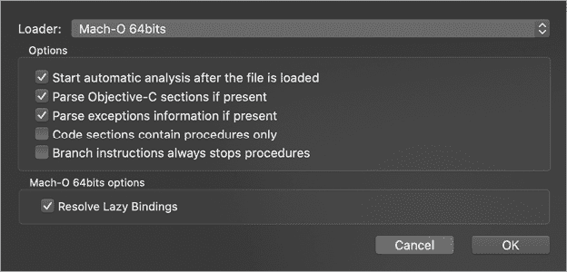
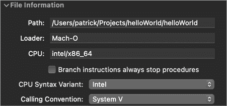
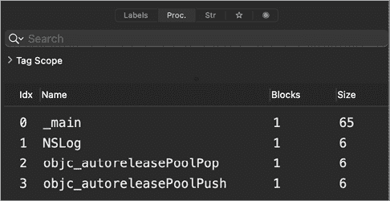
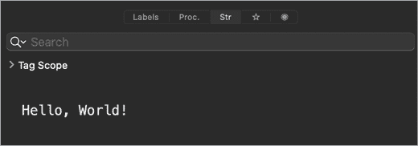
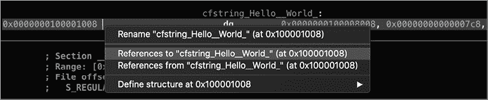
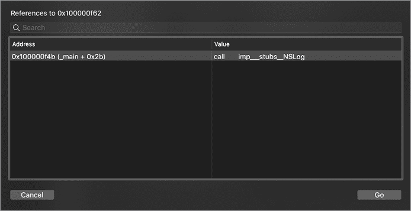

# 第六章：反汇编和反编译


在上一章中，我们介绍了多种有助于初步分析未知 Mach-O 二进制文件的静态分析工具。然而，如果你想全面理解一种新的 Mac 恶意软件样本，你需要对汇编代码有基础了解，并且能够运用复杂的二进制分析工具。

在本章中，我们将首先讨论汇编语言基础，然后介绍反汇编和反编译的静态分析方法。最后，我们将通过使用 Hopper（一种流行的反向工程工具，能够将二进制代码重构为人类可读的格式）来应用这些分析方法。尽管 Hopper 和其他高级二进制分析工具需要对低级反向工程概念有一定的理解，并且可能需要耗时的分析过程，但它们的能力是无价的。即使是最复杂的恶意软件样本，也无法与一位熟练的分析师使用这些工具时相提并论。

## 汇编语言基础

由于大多数编译后的 Mach-O 恶意软件的源代码通常不可用，分析师必须借助能够理解编译后二进制机器码并将其翻译成更易读的内容（即汇编代码）的工具。这个过程被称为*反汇编*。*汇编语言*是一种低级编程语言，直接翻译成计算机执行的二进制指令。这种直接翻译意味着编译后的二进制代码可以在之后直接转换回汇编代码。例如，在 64 位 Intel 系统上，二进制序列 0100 1000 1000 0011 1100 0000 0010 1010 可以在汇编代码中表示为 `add rax, 42`（这表示将 42 加到 `RAX` 寄存器）。

从本质上讲，一个*反汇编器*将一个编译后的二进制文件（例如恶意软件样本）作为输入，并将其翻译回汇编代码。当然，接下来我们需要理解提供的汇编代码。这一反汇编二进制代码并理解随后的汇编代码的过程，通常是恶意软件分析师提到*逆向工程*恶意样本时所指的内容。

在本节中，我们将通过聚焦于 x86_64（Intel x86 指令集的 64 位版本）来介绍各种汇编语言基础知识。我们还将坚持使用标准的 Intel 汇编语法。尽管苹果最近推出了基于 ARM 架构的 Apple Silicon（由 M1 系统芯片支持），但绝大多数 macOS 恶意软件仍然是编译为 x86_64 代码。此外，所有原生针对 M1 架构的恶意软件在可预见的未来将以通用二进制文件的形式发布。如我们在第五章讨论的，通用二进制文件包含多个特定架构的二进制文件，例如兼容 ARM 和 Intel 的文件。对于逆向工程恶意软件的目的，这些二进制文件在逻辑上应该是相同的，因此理解 Intel 的 x86_64 指令集就足够了。最后，许多汇编语言概念都适用于 Intel 和 ARM 架构。然而，如果你有兴趣了解更多有关 Apple M1 的 ARM 指令集架构，尤其是与分析 macOS 恶意软件相关的内容，请参考我 2021 年在 BlackHat 上的演讲《Arm’d and Dangerous: Analyzing arm64 Malware Targeting macOS》或我关于同一主题的白皮书。^(1)

汇编语言和逆向工程的话题已经写成了整本书。如果你想深入研究，有几本关于反汇编和逆向工程的优秀书籍，包括 *Art of Assembly Language*、*Hacker Disassembling Uncovered* 和 *Reversing: Secrets of Reverse Engineering.*^(2)

在这里，我的目标是提供必要的基础知识，并对各种概念进行简化处理，因为即便是对这些概念的基础理解，也足以成为一名合格的恶意软件分析师。

### 寄存器

寄存器是 CPU 上的临时存储槽，可以通过名称进行引用。你可以将它们视为高级编程语言中的变量。

Intel x86_64 指令集包含 16 个通用的 64 位寄存器，包括寄存器 `RAX`、`RCX`、`RDX`、`RBX`、`RSP`、`RBP`、`RDI`、`RSI` 以及 `R8` 到 `R15`。然而，其中一些寄存器通常用于特定目的。例如，`RSP` 和 `RBP` 寄存器用于管理 *栈*，这是一个帮助函数调用和存储临时（或 *局部*）变量的内存区域。你经常会遇到汇编指令，通过从 `RBP` 寄存器的负偏移量访问局部变量。该指令集还包含非通用寄存器，例如 `RIP`，它包含下一条将要执行的指令的地址。

我们可以通过其低 8 位、16 位或 32 位部分来引用许多 64 位通用寄存器，这些在二进制分析中有时会遇到。对于名称中没有数字的寄存器，通常使用两字母缩写来标识 8 位或 16 位的寄存器部分。对于 32 位部分，`R`被`E`替换。举个例子，考虑 64 位通用寄存器`RAX`。它的 8 位部分名为`AL`，16 位部分名为`AX`。最后，它的低 32 位部分名为`EAX`。对于`R8`–`R15`寄存器，`B`、`D`和`W`后缀分别表示低 8 位、16 位和 32 位部分。

### 汇编指令

汇编指令映射到一系列特定的字节，指示 CPU 执行某种操作。所有指令都包含一个*助记符*，它是操作的可读缩写。例如，`add`助记符映射到执行加法操作的二进制代码。

大多数汇编指令还包含一个或多个*操作数*。这些操作数指定了指令使用的寄存器、值或内存。可以参考表 6-1 中提供的一些助记符和示例指令。

表 6-1：助记符和示例指令

| **助记符** | **示例** | **描述** |
| --- | --- | --- |
| `add` | `add rax, 0x100` | 将第二个操作数（0x100）加到第一个操作数。 |
| `mov` | `mov rax, 0x100` | 将第二个操作数（0x100）移动到第一个操作数。 |
| `jmp` | `jmp 0x100000100` | 跳转到操作数中的地址（0x100000100）并继续执行。 |
| `call` | `call` `rax` | 执行操作数（`RAX`寄存器）中指定的子程序。 |

### 调用约定

通过研究 Mach-O 二进制文件调用的系统 API 方法，通常可以获得相当全面的理解。例如，一个恶意二进制文件如果调用文件写入 API 方法，并传入属性列表的内容和位于*~/Library/LaunchAgents*目录下的路径，很可能作为启动代理存在。因此，我们通常不需要花费数小时理解二进制文件中的所有汇编指令。相反，我们可以集中精力研究位于 API 调用附近的指令，以确定调用了哪些 API 方法，传入了哪些参数，以及根据 API 调用的结果采取了什么操作。

当程序想要调用一个方法或系统 API 时，它首先需要为调用准备参数。在汇编层面，传递参数给方法或 API 函数有特定的规则。这被称为*调用约定*。调用约定的规则在应用程序二进制接口（ABI）中进行了说明。表 6-2 展示了基于 Intel 的 64 位 macOS 系统的 ABI。

表 6-2：macOS（Intel 64 位）调用约定

| **项目** | **寄存器** |
| --- | --- |
| 第一个参数 | `RDI` |
| 第二个参数 | `RSI` |
| 第三个参数 | `RDX` |
| 第四个参数 | `RCX` |
| 第五个参数 | `R8` |
| 第六个参数 | `R9` |
| 第七个及以上参数 | 通过栈传递 |
| 返回值 | `RAX` |

由于这些规则的一致应用，恶意软件分析师可以利用它们来准确理解调用是如何进行的。例如，如果一个方法只需要一个参数，该参数的值将在调用之前始终存储在`RDI`寄存器中。一旦你通过查找`call`助记符在反汇编中识别出一个调用，向后查看汇编代码将揭示传递给方法或 API 的参数值。这通常能为代码的逻辑提供有价值的洞察，例如，恶意软件样本尝试连接的 URL，或者它正在创建的文件路径，用于感染系统。

同样，当`call`指令返回时，应用程序二进制接口（ABI）规定，调用的函数的返回值将被存储在`RAX`寄存器中。因此，你会经常看到紧跟在`call`指令之后的反汇编代码，检查并根据`RAX`中的值采取相应的操作。例如，正如你稍后会看到的，如果一个检查网络连接性的函数在`RAX`寄存器中返回零（即假），一个恶意样本可能不会向其命令与控制服务器发送信号。

### `objc_msgSend`函数

编译后，Objective-C 方法的调用会变成对`objc_msgSend`函数（或其相似变体）的调用，该函数将原始的 Objective-C 方法调用路由到适当的对象。作为恶意软件分析师，我们并不真正关心`objc_msgSend`函数本身；相反，我们更关心的是被调用的 Objective-C 对象和方法，因为这些可以为样本的功能提供有价值的线索。幸运的是，通过理解`objc_msgSend`的参数，我们通常可以重建原始 Objective-C 代码的表示。 表 6-3 总结了`objc_msgSend`的参数和返回值。

表 6-3：在`objc_msgSend`函数上下文中的调用约定

| **项** | **寄存器** | **(对于) `objc_msgSend`** |
| --- | --- | --- |
| 第一个参数 | `RDI` | `self`: 方法被调用的对象 |
| 第二个参数 | `RSI` | `op`: 方法名称 |
| 第三个及以上参数 | `RDX, RCX,` 等 | 方法的任何参数 |
| 返回值 | `RAX` | 方法的返回值 |

例如，考虑列表 6-1 中的这段 Objective-C 代码，它使用`NSURL`类的`URLWithString:`方法构造一个 URL 对象。

```
NSURL* url = [NSURL URLWithString:@"http://www.google.com"];
```

列表 6-1：通过 Objective-C 初始化 URL 对象

当我们反汇编编译后的代码时（列表 6-2），我们会看到`objc_msgSend`函数。

```
1 lea  rdx, qword [http___www_google_com]      ; @"http://www.google.com"  
2 mov  rsi, qword [0x100008028]                ; @selector(URLWithString:) 
3 mov  rdi, qword [objc_cls_ref_NSURL]         ; objc_cls_ref_NSURL 
call qword [**objc_msgSend**]
```

列表 6-2：初始化 URL 对象，反汇编

查阅表 6-3，我们可以看到`objc_msgSend`函数的第一个参数，名为`self`，包含指向正在调用方法的对象的指针。如果方法是类方法，则该指针指向类的引用；如果是实例方法，`self`将指向类的某个实例对象。回想一下，函数的第一个参数存储在`RDI`寄存器中。在清单 6-2 中，我们可以看到`self`参数引用了`NSURL`类（因为接下来的`URLWithString:`方法是类方法）3。

`objc_msgSend`函数的第二个参数，名为`op`，是指向被调用方法名称的指针。Apple 文档将此值称为选择器，它表示方法名称的空字符终止字符串。回想一下，你可以在`RSI`寄存器中找到函数调用的第二个参数。在此示例中，我们看到该参数被设置为一个指针，引用字符串`URLWithString:` 2。

传递给`objc_msgSend`函数的其余参数是调用的方法所需的参数。由于`URLWithString:`方法接受一个参数，因此反汇编代码将`RDX`寄存器（此处是第三个参数）初始化为指向包含[`www.google.com`](http://www.google.com)1 的字符串对象的指针。最后，`objc_msgSend`返回调用方法返回的内容。像任何其他函数或方法调用一样，返回值可以在`RAX`寄存器中找到。

对于`objc_msgSend`函数的深入讨论，以及 Objective-C 运行时及其内部结构，请参考 Phrack 文章《[现代 Objective-C 利用技巧](http://www.phrack.org/issues/69/9.html)》和《[Objective-C 运行时：理解与滥用](http://www.phrack.org/issues/66/4.html)》。^(3) 这也结束了我们关于汇编语言基础的简要讨论。掌握了这门低级语言的基础知识和各种 Objective-C 内部机制后，我们将更深入地研究反汇编的二进制代码。

## 反汇编

本节将讨论各种反汇编概念，并通过直接来自恶意代码的实际例子进行说明。在本章稍后的部分，我们将演示如何利用功能齐全的反汇编器生成并探索二进制文件的完整反汇编。

需要记住的是，分析恶意程序的目标是理解其一般逻辑和功能，而不一定是每一条汇编指令。如我之前所说，专注于方法和函数调用周围的逻辑通常能提供有效的途径来获得这种理解。因此，让我们看看几个反汇编代码示例，说明如何识别这些调用、它们的参数以及 API 响应。我选择这些片段是因为它们突出显示了从高层语言编写的二进制文件中渗透出来的细节。请注意，我已对其进行了删减，以提高可读性。

### Objective-C 反汇编

根据我的经验，Objective-C 仍然是针对 Mac 用户的恶意软件作者的首选语言。然而，反向工程 Objective-C 代码也存在一些挑战，例如本章前面讨论过的广泛使用 `objc_msgSend` 函数。幸运的是，我们仍然可以从反汇编中获得大量有用的信息。

Komplex 是一个后门，和一个活跃的俄罗斯 APT 组织有联系。^(4) 它包含多个组件，包括安装程序和第二阶段有效载荷。查看安装程序时，我们看到多次调用 `objc_msgSend` 函数，表明我们正在查看编译后的 Objective-C 代码。我们的目标是确定传递给 `objc_msgSend` 函数的 Objective-C 对象和方法，因为这些信息可以帮助我们弄清楚安装程序的行为。

在安装程序的主函数中，我们发现以下代码（列表 6-3）：

```
0x00000001000017De    lea        rsi, qword [_joiner]
0x00000001000017e5    movabs     rdi, 0x20f74

0x0000000100001824    mov        qword [rbp-0x90], rdi
...
0x000000010000182e    mov        qword [rbp-0x98], rsi 
...

0x0000000100001909    mov        rax, qword [objc_cls_ref_NSData] 1
0x0000000100001910    mov        rsi, qword [0x1001a9428] ; @selector(dataWithBytes:length:)
0x0000000100001917    mov        rdi, rax 2  
0x000000010000191a    mov        rdx, qword [rbp-0x98] 3
0x0000000100001921    mov        rcx, qword [rbp-0x90] 
0x0000000100001928    call       objc_msgSend 
0x000000010000192d    mov        qword [rbp-0x60], rax 
```

列表 6-3：初始化 `NSData` 对象，反汇编（Komplex）

首先，我们看到两个局部变量（`rbp-0x90` 和 `rbp-0x98`）被初始化，第一个被硬编码为 `0x20f74`，第二个被初始化为名为`_joiner`的全局变量的地址。

接下来，我们看到一个 `NSData` 类的引用被移动到 `RAX` 寄存器 1 中。两行之后，它被移动到 `RDI` 寄存器 2 中。我们知道，当调用函数时，第一个参数会存储在 `RDI` 寄存器中，并且对于 `objc_msgSend` 函数的调用，这个参数是要调用方法的类或对象。因此，我们现在知道恶意软件正在调用 `NSData` 类的方法。那么，调用的是哪一个方法呢？

事实上，传递给 `objc_msgSend` 函数的第二个参数标识了方法，我们知道它可以在 `RSI` 寄存器中找到。在反汇编中，我们看到 `RSI` 寄存器被初始化为存储在 `0x1001a9428` 地址的指针。此外，反汇编工具已注释此地址，告诉我们安装程序正在调用名为 `dataWithBytes:length:` 的方法，它属于 `NSData` 类。

接下来，看看此方法的两个参数，它们通过`RDX`和`RCX`寄存器传递给`objc_msgSend`函数 3。`RDX`寄存器将包含`dataWithBytes:`参数的值，并从本地变量`rbp-0x98`初始化。回想一下，这个变量包含一个全局变量`_joiner`的地址。`RCX`寄存器存储`length:`参数的值，并从本地变量`rbp-0x90`初始化，后者包含`0x20f74`。

从这项分析中，我们可以重构出原始的 Objective-C 调用，如下所示（列表 6-4）：

```
NSData* data = [NSData dataWithBytes:_joiner length:0x20f74]; 
```

列表 6-4：重构的 Objective-C 代码（Komplex）

创建的`NSData`对象随后被保存到位于`rbp-0x60`的本地变量中。

接下来，我们发现另一个 Objective-C 调用（列表 6-5）。

```
0x00000001000017d2    lea       rcx, qword [cfstring__tmp_content]   ; @"/tmp/content"
0x00000001000017d9    mov       edx, 0x1
...
0x0000000100001838    mov       dword [rbp-0x9c], edx
...
0x0000000100001848    mov       qword [rbp-0xb0], rcx 

0x0000000100001931    mov       rax, qword [rbp-0x60] ; ret value from dataWithBytes:length:. 
0x0000000100001935    mov       rsi, qword [0x1001a9430] ; @selector(writeToFile:atomically:) 1
0x000000010000193c    mov       rdi, rax 
0x000000010000193f    mov       rdx, qword [rbp-0xb0]
0x0000000100001946    mov       ecx, dword [rbp-0x9c] 2
0x000000010000194c    call      objc_msgSend
```

列表 6-5：写入文件，反汇编（Komplex）

这里初始化了两个本地变量，第一个是指向名为*content*的文件路径，该文件位于*/tmp*目录下，第二个是硬编码的值`1`。然后，之前反汇编代码片段中创建的`NSData`对象被加载到`RAX`中，然后再加载到`RDI`中。由于`RDI`寄存器保存`objc_msgSend`函数调用的第一个参数，我们现在知道安装程序正在对该对象调用方法。

该方法存储在`RSI`寄存器中，并被反汇编器识别为`writeToFile:atomically:` 1。此方法的参数存储在`RDX`和`RCX`寄存器中。前者对应于`writeToFile:`参数，并从本地变量中初始化，该变量保存路径*/tmp/content*。后者是`atomically:`参数的布尔标志，并从包含值`1`的本地变量中初始化。由于不需要使用整个 64 位寄存器，编译器选择仅使用低 32 位，这也解释了为何使用`ECX`而不是`RCX` 2。

从这项分析中，我们可以再次重构出原始的 Objective-C 调用（列表 6-6）：

```
[data writeToFile:@"/tmp/content" atomically:1] 
```

列表 6-6：重构的 Objective-C（Komplex）

结合我们对之前 Objective-C 调用的分析，我们发现恶意软件正在将嵌入的有效负载，存储在名为`joiner`*的全局变量*中，写入到*/tmp/content*文件中。我们可以确认，确实*joiner*包含一个嵌入的（Mach-O）有效负载，通过查看其内容，内容位于`0x100004120`（列表 6-7）。

```
_joiner:
0x0000000100004120         **db**  0xcf ; '.' 
0x0000000100004121         **db**  0xfa ; '.'
0x0000000100004122         **db**  0xed ; '.'
0x0000000100004123         **db**  0xfe ; '.'
0x0000000100004124         **db**  0x07 ; '.'
0x0000000100004125         **db**  0x00 ; '.'
0x0000000100004126        ** db**  0x00 ; '.'
```

列表 6-7：嵌入的 Mach-O 二进制文件（Komplex）

考虑到英特尔的小端格式，它指定了一个字的最低有效字节存储在最小地址处，前四个字节构成值 `0xfeedfacf`。该值映射到 `MH_MAGIC_64` 常量，表示 64 位 Mach-O 可执行文件的开始。对安装程序的反汇编进行进一步分析后发现，一旦嵌入的二进制有效负载被写入磁盘，它会被执行。对该二进制文件的分类分析表明，它实际上是 Komplex 的持久性二阶段有效负载。

### Swift 反汇编

当然，并不是所有的恶意软件都是用 Objective-C 编写的。Swift 编程语言是当下的热门新宠，几款 macOS 恶意软件样本就是用它编写的。与用 Objective-C 编写的二进制文件相比，反汇编 Swift 二进制文件稍微有些难度，因为存在名称重整和其他编程抽象等因素。*名称重整*将方法名等项进行编码，以确保它们在已编译的二进制文件中是唯一的。不幸的是，除非进行解重整，否则这会大大影响项名称的可读性，增加分析难度。

然而，现代反汇编器现在能够从编译后的 Swift 二进制文件中生成合理可读的反汇编列表，例如，重整后的名称已被完全解码并作为注释添加。此外，由于 Swift 运行时利用了许多 Objective-C 框架，我们对 `objc_msgSend` 函数的讨论仍然具有相关性。在 2020 年中期，研究人员发现了一个新的 macOS 后门，命名为 Dacls，并归因于 Lazarus APT 小组。它的恶意安装程序应用程序是用 Swift 编写的。这里我们将重点介绍几个反汇编片段，展示恶意软件初始化并启动一个 Objective-C `NSTask` 对象来执行安装命令（列表 6-8）。

```
0x000000010001e1f1    mov        r15, rax
0x000000010001e1f4    movabs     rdi, '/bin/bash' 1
0x000000010001e1fe    movabs     rsi, 'h\x00\x00\x00\x00\x00\x00\xe9'
0x000000010001e208    call       imp___stubs__$sSS10FoundationE19_bridgeToObjectiveCSo8NSString
                                 CyF ; (extension in Foundation):Swift.String._bridgeToObjectiv
                                 eC() -> __C.NSString 2

0x000000010001e20d    mov        rbx, rax
0x000000010001e210    mov        rsi, qword [0x100045ba0] ; @selector(setLaunchPath:)
0x000000010001e217    mov        rdi, r15
0x000000010001e21a    mov        rdx, rax
0x000000010001e21d    call       objc_msgSend 3
```

列表 6-8：Swift 反汇编的 `NSTask` 初始化（Dacls）

这一段 Swift 反汇编将一个 Swift 字符串桥接到 Objective-C 的 `NSString` 2。从反汇编中可以看出，这个字符串是一个 shell 路径：*/bin/bash* 1。接着，作为一个 Objective-C 字符串，它被传递给 `NSTask` 的 `setLaunchPath:` 方法，该方法通过 `objc_msgSend` 函数被调用 3。虽然在这段反汇编片段中看不到 `NSTask` 对象（它位于 `R15` 寄存器中），但方法选择器 `setLaunchPath:` 及其参数（存储在 `RAX` 中，作为桥接调用的返回值）是可以看到的。通常，仅知道一个方法名就足以确定类或对象类型，因为这个方法名可以是该类特有的。例如，快速 Google 搜索或查阅苹果文档中的 `setLaunchPath:` 方法，可以发现它属于 `NSTask` 类。

一旦恶意软件将 `NSTask` 的启动路径设置为 */bin/bash*，它会初始化任务的参数（列表 6-9）。

```
0x000000010001e273    call       swift_allocObject 1
0x000000010001e278    mov        rbx, rax
...
0x000000010001e286    mov        qword [rax+0x20], '-c' 2
...
0x000000010001e2a4    mov        r14, qword [rbp+var_80]  
0x000000010001e2a8    mov        qword [rbx+0x38], r14
...
0x000000010001e2c0    mov        rsi, qword [_$sSSN_10003d0b8]  ; type metadata for Swift.
                                                                  String ;
0x000000010001e2c7    mov        rdi, rbx
0x000000010001e2ca    call       imp___stubs__$sSa10FoundationE19_bridgeToObjectiveCSo7NSArrayC
                                 yF ; (extension in Foundation):Swift.Array._bridgeToObjectiveC
                                 () -> __C.NSArray 3
0x000000010001e2cf    mov        r13, rax
...
0x000000010001e2da    mov        rsi, qword [0x100045ba8] ; @selector(setArguments:)
0x000000010001e2e1    mov        rdi, r15 
0x000000010001e2e4    mov        rdx, r13
0x000000010001e2e7    call       objc_msgSend 4
```

列表 6-9：更多 Swift 反汇编的 `NSTask` 初始化（Dacls）

如你所见，该方法创建了一个包含各种 Swift 字符串 1 的对象，然后将其桥接到`NSArray` 3。随后，这个对象被传递给`NSTask`的`setArguments:`方法，这个方法通过`objc_msgSend`函数 4 被调用。`-c`参数 2 指示 bash 将后续的字符串作为命令处理。从这段反汇编片段很难看出方法的剩余参数，但通过使用动态分析（如接下来的章节所述），我们可以被动地恢复这些参数，并且确定它们部分地硬编码在`0x0000000100033f70`的二进制中（列表 6-10）：

```
0x0000000100033f70    **db**        " ~/Library/.mina > /dev/null 2>&1 && chmod +x
~/Library/.mina > /dev/null 2>&1 && ~/Library/.mina > /dev/null 2>&1", 0
```

列表 6-10：嵌入的参数（Dacls）

这些硬编码的参数在运行时会与复制命令（`cp`）以及恶意软件持久化后门的名称`SubMenu.nib`一起作为前缀。累计的这些参数指示 bash 首先将持久化后门复制到*~/Library/.mina*，将其设置为可执行文件，最后启动它。为了触发这些操作，恶意软件调用`NSTask`的`launch`方法（列表 6-11）。

```
0x000000010001e300    mov        rdi, qword [rcx+rax]
0x000000010001e304    mov        rsi, qword [0x100045bb0]   ; @selector(launch) 1
0x000000010001e30b    call       objc_msgSend 2
```

列表 6-11：`NSTask` 启动的反汇编（Dacls）

正如预期的那样，Objective-C 方法调用通过`objc_msgSend`函数 2 进行路由。不过，反汇编器有帮助地标注了选择器：`NSTask`的`launch`方法 1。

在此时，仅凭这些反汇编出来的 Swift 代码片段，我们已经能够提取出恶意安装程序的核心逻辑。具体来说，我们确定了一个持久化负载（*SubMenu.nib*）被复制到了*~/Library/.mina*目录，并且被启动了。

### C/C++反汇编

恶意软件作者偶尔会使用非 Apple 编程语言（如 C 或 C++）编写 Mac 恶意软件。让我们看另一个简化的反汇编片段，这次来自 Lazarus Group 的第一阶段植入程序加载器，名为 AppleJeus，最初是用 C++编写的。^(5) 这个片段来自一个名为`getDeviceSerial`的函数，但由于 C++名称修饰，它在反汇编器中显示为`Z15getDeviceSerialPc`。

当你浏览这个相当大的反汇编片段（列表 6-12）时，首先注意到反汇编器已经提取了函数声明作为注释，（幸运的是）它包含了原始名称和参数的数量与格式。从去掉名称修饰符后的函数名`getDeviceSerial`来看，我们可以假设这个函数将获取感染系统的序列号（尽管我们也会验证这一点）。由于该函数只有一个参数，即指向字符串缓冲区的指针（`char*`），因此合理推测该函数会将提取的序列号存储在该缓冲区中，以便调用者使用。

```
__Z15getDeviceSerialPc:          // getDeviceSerial(char*) 

0x0000000100004548    mov        r14, rdi 1

0x0000000100004559    mov        rax, qword [_kIOMasterPortDefault]
0x0000000100004560    mov        r15d, dword [rax] 2

0x0000000100004563    lea        rdi, qword [IOPlatformExpertDevice] ;"IOPlatformExpertDevice"
0x000000010000456a    call       IOServiceMatching 3

0x000000010000456f    mov        edi, r15d 
0x0000000100004572    mov        rsi, rax                   
0x0000000100004575    call       IOServiceGetMatchingService 4

0x000000010000457e    mov        r15d, eax
0x0000000100004581    mov        rax, qword [_kCFAllocatorDefault]
0x0000000100004588    mov        rdx, qword [rax] 
0x000000010000458b    lea        rsi, qword [IOPlatformSerialNumber] 
0x0000000100004592    xor        ecx, ecx                   
0x0000000100004594    mov        edi, r15d                 
0x0000000100004597    call       IORegistryEntryCreateCFProperty 5

0x000000010000459c    mov        edx, 0x20
0x00000001000045a1    mov        ecx, 0x8000100
0x00000001000045a6    mov        rdi, rax                   
0x00000001000045a9    mov        rsi, r14                  
0x00000001000045ac    call       CFStringGetCString 6

return
```

列表 6-12：`getDeviceSerial`函数的反汇编（AppleJeus）

首先，函数将其存储在 `RDI` 中的单一参数，即输出缓冲区，移动到 `R14` 寄存器，实质上将其保存到本地 1。这样做是因为如果 `getDeviceSerial` 函数进行其他需要参数的调用（它确实会这么做），`RDI` 寄存器将会为这些调用重新初始化。如你所见，在 `getDeviceSerial` 函数的结尾，输出缓冲区会被填充上设备的序列号。因此，函数必须将该参数保存到一个未使用的寄存器中。使用这种“临时”寄存器来保存值是非常常见的，而它们的注释通常有助于逆向工程复杂的函数。

该函数将指向 `kIOMasterPortDefault` 的指针移动到 `RAX` 中，并将其解引用到 `R15` 寄存器 2。

根据 Apple 开发者文档，`kIOMasterPortDefault` 是用于与 IOKit 服务进行通信的默认 mach 端口。^(6)（*mach 端口*是一个促进进程间通信的机制。）从这个观察来看，恶意软件很可能会利用 IOKit 来提取感染设备的序列号。

接下来，我们看到 `getDeviceSerial` 函数首次调用了 Apple 的一个 API：`IOServiceMatching` 函数 3。Apple [指出](https://developer.apple.com/documentation/iokit/1514687-ioservicematching?language=objc) 该函数接收一个参数，将创建并返回一个字典，用于搜索和匹配目标 IOKit 服务。^(7) 我们知道 `RDI` 寄存器存储着函数或方法调用的第一个参数。在调用之前，我们看到汇编代码将这个寄存器初始化为 `"IOPlatformExpertDevice"` 的值。换句话说，它是以字符串 `"IOPlatformExpertDevice"` 调用 `IOServiceMatching` 函数的。

一旦匹配字典创建完成，代码调用了另一个 IOKit API，即`IOServiceGetMatchingService`函数 4。苹果文档中提到，这个函数会找到与指定搜索条件匹配的 IOService。^(8) 对于参数，它期望一个主端口和一个匹配字典。反汇编后的代码将`R15`寄存器中的值移入`EDI`寄存器（即`RDI`寄存器的 32 位部分）。在几行之前，代码将`kIOMasterPortDefault`移入`R15`寄存器。因此，代码只是将`kIOMasterPortDefault`移入`EDI`寄存器，将其作为调用`IOServiceGetMatchingService`时的第一个参数。同样，在调用之前，注意到`RAX`被移入`RSI`寄存器，因为`RSI`寄存器作为函数调用的第二个参数使用。由于`RAX`寄存器保存调用结果，因此`RSI`寄存器将包含从`IOServiceMatching`调用返回的匹配字典。在调用`IOServiceGetMatchingService`之后，`RAX`寄存器中将返回一个`io_service_t`服务。由于匹配字典初始化为`"IOPlatformExpertDevice"`，因此将找到并返回指向`IOPlatformExpertDevice` IOKit 对象的引用。如你所见，这个对象可以用来查询系统（平台）信息，包括其序列号。

接下来，代码设置了调用系统函数的参数，该函数提取`IOKit`注册表属性的值：`IORegistryEntryCreateCFProperty` 5。此参数设置首先将`kCFAllocatorDefault`加载到`RDX`寄存器中，该寄存器用于第三个参数。苹果对该函数的文档说明了这是要使用的内存分配器。^(9) 随后，字符串`"IOPlatformSerialNumber"`的地址被加载到`RSI`寄存器中。该寄存器用于第二个参数，是所关注的属性名称。接下来，`RCX`寄存器（即`ECX`部分）的 32 位组件被初始化为零，因为通过将一个寄存器与自身进行异或操作可以将其设置为零。最后，在调用之前，将`R15D`（`D`表示`R15`寄存器的 32 位部分）中的值移入`EDI`寄存器，`EDI`是`RDI`寄存器的 32 位部分。这样做的效果是初始化`RDI`参数，其值为先前存储在`R15D`中的`kIOMasterPortDefault`。在调用`IORegistryEntryCreateCFProperty`之后，`RAX`寄存器将保存所需属性的值：`IOPlatformSerialNumber`。

最后，函数调用了`CFStringGetCString`函数，将提取的属性（一个`CFString`对象）转换为普通的、以空字符结尾的 C 字符串 6。当然，在此调用之前，必须初始化参数。`EDX`寄存器（`RDX`的 32 位部分）被设置为`0x20`，表示输出缓冲区的大小。`ECX`寄存器（`RCX`的 32 位部分）被设置为`kCFStringEncodingUTF8`（`0x8000100`）。`RDI`寄存器被设置为`RAX`的值，`RAX`包含提取的`IOPlatformSerialNumber`属性值。最后，第二个参数`RSI`被设置为`R14`。记住，`R14`寄存器包含传递给`getDeviceSerial`的`RDI`值。由于苹果的[CFStringGetCString](https://developer.apple.com/documentation/corefoundation/1542721-cfstringgetcstring?language=objc)文档中说明第二个参数是用来复制字符串的缓冲区，我们现在知道传递给`getDeviceSerial`函数的参数确实是用于存储序列号的输出缓冲区。^(10)

值得注意的是，虽然像 C++这样的高级语言需要按照指定顺序传递参数，但在汇编层面，唯一的要求是参数在调用之前必须存储在适当的寄存器或栈位置。因此，你可能会看到一些指令“无序地”初始化参数。例如，在这里，你可以看到第二个参数最后被设置。

通过聚焦于`getDeviceSerial`函数所调用的 API，我们能够确认其功能：通过`IOKit`获取受感染系统的序列号（`IOPlatformSerialNumber`）。此外，通过参数分析，我们还能够确定`getDeviceSerial`函数会使用一个缓冲区来存储序列号。谁还需要源代码呢，对吧？

### 控制流反汇编

到目前为止，我们的分析仅集中在函数内部的逻辑，而没有涉及函数之间以及调用它们的代码之间的交互。理解这些交互对于分析恶意软件非常重要，因为恶意代码往往会根据单个函数的返回值做出决定性的行动。Komplex 的载荷提供了一个生动的例子。

Komplex 的持续载荷包含一个名为`__Z19connectedToInternetv`（解码后为`connectedToInternet`）的函数。这个恰如其名的函数用于检查受感染主机是否连接到互联网。如果主机处于离线状态，恶意软件将等到网络连接恢复后，再尝试连接到其指挥控制服务器以执行任务。（这个检查也充当了一个基本的反分析机制，假设大多数分析系统是未连接到互联网的。）

让我们来检查一下恶意软件代码的反汇编，这段代码调用了`connectedToInternet`函数，并根据其响应采取行动（Listing 6-13）。

```
0x0000000100005b15:
0x0000000100005b15    call       connectedToInternet()
0x0000000100005b1a    and        al, 0x1
0x0000000100005b1c    mov        byte [rbp+var_19], al
0x0000000100005b1f    test       byte [rbp+var_19], 0x1 
1 0x0000000100005b23    jz         loc_100005b2e 
2 0x0000000100005b29    jmp        loc_100005b40 

3 0x0000000100005b2e:
0x0000000100005b2e    mov        edi, 0x3c
0x0000000100005b33    call       sleep
0x0000000100005b38    mov        [rbp+var_3C], eax
4 0x0000000100005b3b    jmp        0x0000000100005b15

loc_100005b40: 
...
```

列表 6-13：网络连接检查与控制流（Komplex）

首先，恶意软件调用了 `connectedToInternet` 函数。由于该函数不需要参数，因此不需要设置寄存器。调用后，恶意软件通过 `test` 和 `jz`（跳转零）指令检查返回值。`test` 指令对两个操作数进行按位与（丢弃结果），并根据结果设置零标志。因此，如果 `connectedToInternet` 函数返回零，`jz` 指令将跳转 1，跳转到 `0x0000000100005b2e` 的指令 3。这里，代码调用系统的 `sleep` 函数，然后再次跳转回 `0x0000000100005b15` 的指令，重新检查连接情况 4。一旦 `connectedToInternet` 函数返回非零值，将进行无条件跳转 2，退出循环。换句话说，恶意软件会等待直到系统连接到互联网后才继续执行。

现在我们已经了解了恶意软件的功能，我们可以使用以下的 Objective-C 代码来重构其逻辑（列表 6-14）。

```
while(0x0 == connectedToInternet()) {
    sleep(0x3c);
}
```

列表 6-14：网络连接检查与控制流，重构版（Komplex）

在浏览了这些反汇编的各个部分之后，我们大概都能同意，阅读汇编代码相当乏味。幸运的是，随着反编译技术的进步，现在有了希望！

## 反编译

你已经看到反汇编器如何解析文件，并将二进制代码转换回人类可读的汇编代码。反编译器则通过重新创建提取的二进制代码的源代码级表示，将这一翻译进一步推进。与汇编代码相比，这种源代码表示通常更加简洁且易读，使得分析未知的二进制文件变得更加简单。先进的逆向工程工具通常同时具有反汇编和反编译功能。此类工具的示例包括 Hopper（将在下一节讨论）、IDA Pro 和 Ghidra。

还记得 Lazarus Group 第一阶段植入加载器中的 `getDeviceSerial` 函数吗？虽然该函数的完整反汇编大约有 50 行，但反编译后的代码要简洁得多，大约 15 行（列表 6-15）。

```
int getDeviceSerial(int * arg0) {
    r14 = arg0;
    ...
    r15 = kIOMasterPortDefault;
    rax = IOServiceMatching("IOPlatformExpertDevice");
    rax = IOServiceGetMatchingService(r15, rax);
    if (rax != 0x0) {
        rbx = CFStringGetCString(IORegistryEntryCreateCFProperty(rax, 
              @"IOPlatformSerialNumber", kCFAllocatorDefault, 0x0), r14, 0x20, 
              kCFStringEncodingUTF8) != 0x0 ? 0x1 : 0x0;
        IOObjectRelease(rax);
    }
    rax = rbx;
    return rax;
}
```

列表 6-15：`getDeviceSerial` 函数的反编译（AppleJeus）

反编译后的代码非常易读，使得理解该函数的逻辑相对容易。例如，我们可以看到恶意软件获取了 `IOPlatformExpertDevice` 服务的引用，然后利用它查找系统的序列号。

同样，章节前面讨论的 `connectedToInternet` 函数反编译效果不错（见示例 6-16）。不过需要注意的是，反编译器似乎对 Objective-C 语法有些困惑，`@class` 和 `@selector` 等关键字仍然出现在输出中。背后原因是编译器优化调用了一个优化版本的 `objc_msgSend` 函数，名为 `objc_msgSend_fixup`。不过，可以明显看出，恶意软件通过向 [www.google.com](http://www.google.com) 发起请求来判断主机的网络连接状态。

```
int connectedToInternet() 
{
    if( (@class(NSData), &@selector(dataWithContentsOfURL:), (@class(NSURL), 
         &@selector(URLWithString:), @"http://www.google.com")) != 0x0) 
    {
         var_1 = 0x1;
    }
    else {
         var_1 = 0x0;
    }
    rax = var_1 & 0x1 & 0xff;
    return rax;
}
```

示例 6-16：反编译 `connectedToInternet` 函数（Komplex）

考虑到反编译相较于反汇编的诸多优势，你可能会想知道我们为什么还要讨论反汇编。事实上，反汇编仍然有一些用途。首先，即使是最好的反编译器，偶尔也会在分析复杂的二进制代码时遇到困难，比如带有反分析逻辑的恶意软件（在第九章中讨论）。反汇编器只需将二进制代码转换，错误的可能性远低于反编译器。因此，降到反汇编器提供的汇编级代码，有时可能是你唯一的选择。其次，正如我们在反编译`getDeviceSerial`和`connectedToInternet`函数时所见，汇编代码中的一些概念，比如寄存器，依然出现在代码中，因此对你的分析是有帮助的。虽然反编译可以大大简化二进制代码的分析，但理解汇编代码的能力（仍然）是任何恶意软件分析师的基础技能。

## 使用 Hopper 进行逆向工程

到目前为止，我们讨论了反汇编和反编译的概念，但并未提及提供这些服务的具体工具。这些工具可能有些复杂，对于初学者的恶意软件分析师来说也有些令人生畏。因此，我们将简要介绍一种这样的工具——Hopper，用于二进制分析。Hopper 价格合理，原生支持 macOS，拥有强大的反汇编和反编译功能，擅长分析 Mach-O 格式的二进制文件。^(11)

如果你更喜欢使用其他反汇编器或反编译器，如 IDA Pro 或 Ghidra，本节的具体内容可能不适用。然而，我们将讨论的概念在大多数逆向工程工具中是广泛适用的。

### 创建一个可分析的二进制文件

在本简要介绍 Hopper 的部分中，我们将反汇编和反编译 Apple 的标准“Hello, World!” Objective-C 代码，见示例 6-17。

```
#import <Foundation/Foundation.h>

 int main(int argc, const char * argv[]) {
 @autoreleasepool {
        NSLog(@"Hello, World!");
    }
    return 0;
}
```

示例 6-17：Apple 的“Hello, World!”

尽管是微不足道的示例，但它提供了一个足够用于展示 Hopper 许多功能和能力的二进制文件。使用 `clang` 或 Xcode 编译代码，生成 64 位 Mach-O 二进制文件（见示例 6-18）：

```
% **clang main.m -fmodules -o helloWorld** 

% **file helloWorld** 
helloWorld: Mach-O 64-bit executable x86_64
```

示例 6-18：编译“Hello, World！”

### 加载二进制文件

打开 Hopper 应用后，通过选择**文件**▶**打开**开始分析。选择要分析的 Mach-O 二进制文件。在出现的加载器窗口中，保持默认设置不变并点击**确定**（图 6-1）。



图 6-1：Hopper 中的加载器窗口

Hopper 会通过解析 Mach-O 头部、反汇编二进制代码并提取嵌入的字符串、函数和方法名等内容，自动开始分析二进制文件。一旦分析完成，Hopper 会自动在二进制文件的入口点显示反汇编代码，该入口点来自 Mach-O 头部的`LC_MAIN`加载命令。

### 探索界面

Hopper 的界面提供了多种方式来探索它生成的数据。最右边是*检查器*视图。在这里，Hopper 显示有关正在分析的二进制文件的一般信息，包括二进制类型、架构和 CPU 以及调用约定（图 6-2）。



图 6-2：Hopper 中的基本文件信息

最左边是一个段选择器，可以在与二进制文件中符号和字符串相关的各种视图之间切换。例如，*Proc* 视图显示 Hopper 在分析过程中识别的过程（函数和方法）（图 6-3）。这包括来自原始源代码的函数和方法，以及代码调用的 API。例如，在我们的“Hello, World!”二进制文件中，Hopper 识别了主函数和对苹果 `NSLog` API 的调用。



图 6-3：Hopper 中的过程视图

*Str* 视图显示 Hopper 从二进制文件中提取的嵌入字符串（图 6-4）。在我们的简单二进制文件中，唯一的嵌入字符串是“Hello, World!”



图 6-4：Hopper 中的嵌入字符串视图

在深入分析反汇编之前，最好先浏览提取出的过程名称和嵌入的字符串，因为它们通常是了解恶意软件可能能力的重要信息来源。此外，它们还可以指导你的分析工作。如果某个过程名称或嵌入字符串看起来很有趣，点击它，Hopper 会显示它在二进制文件中被引用的具体位置。

### 查看反汇编

默认情况下，Hopper 会自动显示二进制文件入口点的反汇编代码（通常是主函数）。列表 6-19 显示了主函数的完整反汇编代码。请注意，编译方法和编译器版本都会影响反汇编。最常见的是，地址（函数或指令的地址）可能会发生变化，尽管指令的顺序也可能会有所不同。

```
main:
0x0000000100003f20    push       rbp
0x0000000100003f21    mov        rbp, rsp
0x0000000100003f24    sub        rsp, 0x20
0x0000000100003f28    mov        dword [rbp+var_4], 0x0
0x0000000100003f2f    mov        dword [rbp+var_8], edi
0x0000000100003f32    mov        qword [rbp+var_10], rsi
0x0000000100003f36    call       objc_autoreleasePoolPush
0x0000000100003f3b    lea        rcx, qword [cfstring_Hello__World] ; @"Hello, World!"
0x0000000100003f42    mov        rdi, rcx ; argument "format" for method NSLog 1
0x0000000100003f45    mov        qword [rbp+var_18], rax
0x0000000100003f49    mov        al, 0x0
0x0000000100003f4b    call       NSLog 
0x0000000100003f50    mov        rdi, qword [rbp+var_18] ; argument "pool" for method objc_
                                                           autoreleasePoolPop
0x0000000100003f54    call       objc_autoreleasePoolPop 
0x0000000100003f59    xor        eax, eax
0x0000000100003f5b    add        rsp, 0x20
0x0000000100003f5f    pop        rbp
0x0000000100003f60    ret
```

列表 6-19：“Hello, World!” 通过 Hopper 反汇编

Hopper 提供了有用的注释，能够识别嵌入的字符串以及函数和方法的参数。例如，考虑地址`0x0000000100000f42`处的汇编代码，它将指向“Hello, World!”字符串的`RCX`寄存器移动到`RDI` 1。Hopper 已经识别出这段代码是为几行之后的`NSLog`调用初始化参数。

你会经常注意到，反汇编的各个组件实际上是指向二进制文件中其他地方数据的指针。例如，`0x0000000100000f3b`处的汇编代码将“Hello, World!”字符串的地址加载到`RCX`寄存器中。Hopper 足够聪明，能够识别`cfstring_Hello__World_`变量是一个指针。此外，如果你双击任何指针，Hopper 会跳转到该指针的地址。例如，在反汇编中双击`cfstring_Hello__World_`变量会带你到地址`0x0000000100001008`的字符串对象。这个`CFConstantString`类型的字符串对象也包含指针，双击这些指针会带你到指定的地址。

请注意，Hopper 还会跟踪反向交叉引用。例如，它已识别出地址`0x0000000100000fa2`处的字符串字节被`cfstring_Hello__World_`变量引用。也就是说，`cfstring_Hello__World_`变量包含对`0x0000000100000fa2`地址的引用。像这样的交叉引用大大方便了对二进制代码的静态分析；如果你注意到一个有趣的字符串，你可以简单地询问 Hopper 这个字符串在代码中哪里被引用。要查看这些交叉引用，CTRL-点击地址或项目并选择**引用到**。或者，选择地址或项目并按**X**键。例如，假设我们想查看“Hello, World!”字符串对象在反汇编中被引用的地方。我们首先选择地址`0x0000000100001008`处的字符串对象，CTRL-点击以弹出上下文菜单，然后点击**引用到 cfstring_Hello__World**（图 6-5）。



图 6-5：选择查看“Hello, World！”字符串的交叉引用选项。

这应该会弹出该项的交叉引用窗口（图 6-6）。

![“引用至 0x1000001008”的交叉引用窗口显示两列，地址（“0x100000f3b (_main + 0x1b)”）和值（“lea rcx, qword [cfstring_Hello_World_]”）。](image_fi/501942c06/f06006.png)

图 6-6：“Hello, World！”字符串的交叉引用

现在你可以看到，这个字符串只有一个交叉引用：位于地址`0x0000000100000f3b`的代码，它位于主函数内。双击它可以跳转到代码中的这个位置。

Hopper 还会为函数、方法和 API 调用创建交叉引用，帮助你轻松确定它们在代码中被调用的位置。例如，图 6-7 中的交叉引用窗口告诉我们，`NSLog` API 在`0x0000000100000f4b`的主函数中被调用。



图 6-7：`NSLog`函数的交叉引用

交叉引用大大方便了分析，可以有效帮助理解二进制文件的功能或能力。例如，假设你正在分析一个可疑的恶意软件样本，并想要查找其命令与控制服务器的地址。在 Hopper 的 Proc 视图中，你可以定位到一些 API，如 Apple 网络方法，这些方法通常被恶意软件用来连接服务器。从 Proc 视图中，通过交叉引用，你可以理解这些 API 是如何被调用的（例如，通过命令与控制服务器的 URL 或 IP 地址）。

在 Hopper 中跳转时，你常常需要快速返回到之前分析的位置。幸运的是，按下逃逸键可以让你回到你刚才的位置。

### 更改显示模式

到目前为止，我们一直在 Hopper 的默认显示模式——汇编模式下。如其名所示，这个模式显示的是二进制代码的反汇编。你可以使用 Hopper 主工具栏中的切换控件来切换显示模式（图 6-8）。


图 6-8：Hopper 中的显示模式

Hopper 支持的显示模式包括以下几种：

+   **汇编（ASM）模式：** 标准的反汇编模式，其中 Hopper 显示二进制文件的汇编指令。

+   **控制流图（CFG）模式：** 一种将过程（函数）拆分为代码块，并展示它们之间控制流的模式。

+   **伪代码模式：** Hopper 的反编译模式，其中生成类似源代码或伪代码的表示。

+   **十六进制模式：** 二进制文件的原始十六进制字节。

在四种显示模式中，伪代码模式无疑是最强大的。要进入此模式，首先选择一个过程，然后点击显示模式部分控制条中的第三个按钮。这将指示 Hopper 对过程中的代码进行反编译，以生成该代码的伪代码表示。对于我们简单的“Hello, World！”程序，它做得相当不错（清单 6-20）：

```
int _main(int arg0, int arg1) {
    var_18 = objc_autoreleasePoolPush();
    NSLog(@"Hello, World!");
    objc_autoreleasePoolPop(var_18);
    return 0x0;
}
```

清单 6-20：反编译后的“Hello, World！”

考虑到 `@autoreleasepool` 块被编译成配对的 `objc_autoreleasePoolPush` 和 `objc_autoreleasePoolPop` 调用后，反编译结果与原始源代码非常相似（清单 6-21）。

```
#import <Foundation/Foundation.h>

 int main(int argc, const char * argv[]) {
    @autoreleasepool {    
        NSLog(@"Hello, World!");
    }
    return 0;
}
```

清单 6-21：原始的“Hello, World！”源代码（用于比较）

若想获得更全面的 Hopper 使用和理解指南，请参考该应用的官方教程。^(12)

## 接下来

在掌握了从基础的文件类型识别到高级的反编译等静态分析技术后，我们现在可以将注意力转向动态分析方法。正如你将看到的，动态分析通常提供了更高效的理解恶意软件的方式。不过，静态分析和动态分析是互为补充的，你可能会发现自己会将二者结合起来使用。

## 参考文献
