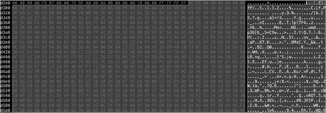
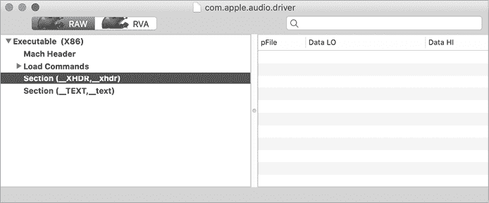

# 第九章：反分析


在前几章中，我们利用了静态和动态分析方法来揭示恶意软件的持久化机制、核心功能以及最为隐秘的秘密。当然，恶意软件作者并不希望他们的创作被公之于众。因此，他们经常通过编写反分析逻辑或其他保护方案来复杂化分析。为了成功分析这类恶意软件，我们必须首先识别这些保护措施，然后绕过它们。

本章将讨论在 macOS 恶意软件作者中常见的反分析方法。一般来说，反分析措施分为两类：旨在阻止静态分析的措施和旨在阻止动态分析的措施。让我们看看这两种措施。

## 反静态分析方法

恶意软件作者使用几种常见的方法来复杂化静态分析工作：

+   **基于字符串的混淆/加密**：在分析过程中，恶意软件分析师通常试图回答诸如“恶意软件如何持久化？”或“它的命令与控制服务器的地址是什么？”之类的问题。如果恶意软件包含与其持久化相关的明文字符串，如文件路径或命令与控制服务器的 URL，分析几乎变得太容易了。因此，恶意软件作者通常会对这些敏感字符串进行混淆或加密。

+   **代码混淆**：为了复杂化代码的静态分析（有时也包括动态分析），恶意软件作者可以对代码本身进行混淆。对于像脚本这样的非二进制恶意软件样本，有各种混淆工具可以使用。对于 Mach-O 二进制文件，恶意软件作者可以使用可执行打包器或加密器来保护二进制文件的代码。

让我们看一些反静态分析方法的例子，然后讨论如何绕过它们。正如你所看到的，通常使用动态分析技术比反静态分析方法更容易克服。在某些情况下，反过来也成立；静态分析技术可以揭示反动态分析策略。

### 敏感字符串伪装为常量

最基本的基于字符串的混淆技术之一是将敏感字符串拆分为多个部分，然后将它们作为常量直接内联到汇编指令中。根据每个部分的大小，`strings`命令可能会错过这些字符串，而反汇编器默认情况下则会以十六进制数字形式显示这些部分，这并不特别有用。我们在 Dacls 中发现了这种字符串混淆的例子（列表 9-1）：

```
main:
...
0x000000010000b5fa    movabs     rcx, **0x7473696c702e74**
0x000000010000b604    mov        qword [rbp+rax+var_209], rcx
0x000000010000b60c    movabs     rcx, **0x746e6567612e706f**
0x000000010000b616    mov        qword [rbp+rax+var_210], rcx
0x000000010000b61e    movabs     rcx, **0x6f6c2d7865612e6d**
0x000000010000b628    mov        qword [rbp+rax+var_218], rcx
0x000000010000b630    movabs     rcx, **0x6f632f73746e6567**
0x000000010000b63a    mov        qword [rbp+rax+var_220], rcx
0x000000010000b642    movabs     rcx, **0x4168636e75614c2f**
0x000000010000b64c    mov        qword [rbp+rax+var_228], rcx
0x000000010000b654    movabs     rcx, **0x7972617262694c2f**
0x000000010000b65e    mov        qword [rbp+rax+var_230], rcx
```

列表 9-1：基本的字符串混淆（Dacls）

如你所见，六个 64 位的值首先被移动到`RCX`寄存器，然后移动到相邻的基于栈的变量。敏锐的读者会注意到，这些值的每个字节都落在可打印的 ASCII 字符范围内。我们可以使用反汇编工具克服这种基本的混淆。只需指示反汇编工具将常量解码为字符，而不是默认的十六进制格式。在 Hopper 反汇编工具中，你可以简单地 CTRL 点击常量，然后选择**字符**来使用 shift-r 快捷键（清单 9-2）：

```
main:
...
0x000000010000b5fa    movabs     rcx, '**t.plist**'
0x000000010000b604    mov        qword [rbp+rax+var_209], rcx
0x000000010000b60c    movabs     rcx, '**op.agent**'
0x000000010000b616    mov        qword [rbp+rax+var_210], rcx
0x000000010000b61e    movabs     rcx, '**m.aex-lo**'
0x000000010000b628    mov        qword [rbp+rax+var_218], rcx
0x000000010000b630    movabs     rcx, '**gents/co**'
0x000000010000b63a    mov        qword [rbp+rax+var_220], rcx
0x000000010000b642    movabs     rcx, '**/LaunchA**'
0x000000010000b64c    mov        qword [rbp+rax+var_228], rcx
0x000000010000b654    movabs     rcx, '**/Library**'
0x000000010000b65e    mov        qword [rbp+rax+var_230], rcx
```

清单 9-2：去混淆的字符串（Dacls）

如果我们重新组合被拆分的字符串（注意前两个字符串组件的轻微重叠），这个去混淆后的反汇编现在揭示了恶意软件持久启动项的路径：*/Library/LaunchAgents/com.aex-loop.agent.plist*。

### 加密字符串

在之前的章节中，我们查看了几个更复杂的基于字符串的混淆示例。例如，在第七章中我们提到，WindTail 包含了各种嵌入的 base64 编码和 AES 加密的字符串，其中包括它的命令和控制服务器的地址。解密这些字符串所需的密钥被硬编码在恶意软件中，这意味着我们可以手动解码并解密服务器的地址。然而，这将涉及一些工作，例如找到（或编写）一个 AES 解密器。此外，如果恶意软件使用了自定义（或非标准的）算法来加密字符串，还需要做更多的工作。当然，在某个时刻，恶意软件必须解码并解密受保护的字符串，以便使用它们，例如连接到命令和控制服务器执行任务。因此，通常更高效的做法是直接让恶意软件运行，这样它会触发字符串的解密。如果你正在监控恶意软件的执行，解密后的字符串就可以轻松恢复。

在第七章，我展示了一个实现方法：使用网络监控工具，这使我们能够被动地恢复（之前加密的）恶意软件命令和控制服务器的地址，因为恶意软件在进行任务指派时会发送信号。我们也可以使用调试器完成相同的操作，正如你将在这里看到的那样。首先，我们定位到 WindTail 的解密逻辑，一个名为`yoop:`的方法。（在后续的章节中，我会描述如何定位这类方法。）通过查看该方法的交叉引用，我们可以看到每当恶意软件需要在使用之前解密其字符串时，都会调用这个方法。例如，清单 9-3 展示了一段反汇编代码，调用`yoop:`方法 1 来解密恶意软件的主要命令和控制服务器。

```
0x0000000100001fe5    mov        r13, qword [objc_msgSend]
...
0x0000000100002034    mov        rsi, @selector(**yoop:**)
0x000000010000203b    lea        rdx, @"F5Ur0CCFMOfWHjecxEqGLy...OLs="
0x0000000100002042    mov        rdi, self
1 0x0000000100002045    call       r13 

2 0x0000000100002048    mov        rcx, rax 
```

清单 9-3：命令和控制服务器的解密（WindTail）

我们可以在 `0x100002048` 处设置调试器断点，这是调用 `yoop:` 后立即执行的指令地址。因为 `yoop:` 方法返回明文字符串，所以当我们命中这个断点时，我们可以打印出这个字符串。 （请记住，方法的返回值可以在 `RAX` 寄存器中找到。）这将显示恶意软件的主要命令和控制服务器 *flux2key.com*，如 列表 9-4 所示：

```
% **lldb Final_Presentation.app** 

(lldb) **target create "Final_Presentation.app"**
Current executable set to 'Final_Presentation.app' (x86_64).

(lldb) **b 0x100002048**
(lldb) **run**

Process 826 stopped
* thread #5, stop reason = breakpoint 1.1

(lldb) **po $rax**
http://flux2key.com/liaROelcOeVvfjN/fsfSQNrIyxeRvXH.php?very=%@&xnvk=%@
```

列表 9-4：一个解密的命令和控制地址（WindTail）

值得注意的是，您还可以在解密函数中的返回指令（`retn`）上设置断点。当断点命中时，您将再次在 `RAX` 寄存器中找到解密后的字符串。这种方法的好处是您只需要设置一个断点，而不是在调用解密方法的多个位置设置多个断点。这意味着每当恶意软件解密时，不仅能恢复其命令和控制服务器而且任何字符串的明文。然而，手动管理这个断点将变得非常乏味，因为它将被多次调用以解密恶意软件的每个字符串。更有效的方法是通过 `breakpoint command add` 添加附加的调试器命令到断点。然后，一旦断点命中，您的断点命令将自动执行，并且可以只需打印出保存解密字符串的寄存器，然后允许进程继续自动执行。如果您对调用者感兴趣，也许是为了定位特定解密字符串使用的位置，则考虑打印出堆栈回溯。

请注意，这种基于断点的方法适用于大多数字符串混淆或加密方法，因为它对使用的算法不加区分。换句话说，通常不重要恶意软件使用何种技术来保护字符串或数据。如果您能够在静态分析期间找到去混淆或解密例程，则在阅读字符串时，您只需要一个适当放置的调试器断点。

### 定位混淆字符串

当然，这引出了一个问题：您如何确定恶意软件是否混淆了敏感字符串和数据？以及如何定位恶意软件内负责返回其明文值的例程？

虽然后者没有绝对可靠的方法，但通常很容易确定恶意标本是否有所隐瞒。例如，`strings` 命令的输出通常会产生大量提取出的字符串。如果其输出相对有限或包含大量毫无意义的字符串（尤其是长度显著的字符串），则这表明某种类型的字符串混淆正在发挥作用。例如，如果我们在 WindTail 上运行 `strings`，我们将找到各种明文字符串以及看似混淆的字符串（列表 9-5）：

```
% **strings - Final_Presentation.app/Contents/MacOS/usrnode**

/bin/sh
open -a
Song.dat
KEY_PATH
oX0s4Qj3GiAzAnOmzGqjOA==
ie8DGq3HZ82UqV9N4cpuVw==
F5Ur0CCFMO/fWHjecxEqGLy/xq5gE98ZviUSLrtFPmHE6gRZGU7ZmXiW+/gzAouX
aagHdDG+YP9BEmHLCg9PVXOuIlMB12oTVPlb8CHvda6TWtptKmqJVvI4o63iQ36Shy9Y9hPtlh+kcrCL0uj+tQ==
```

列表 9-5：混淆字符串（WindTail）

当然，这种方法并非万无一失。例如，如果混淆方法（如加密算法）产生的是非 ASCII 字符，混淆内容可能不会出现在`strings`的输出中。

然而，在反汇编工具中翻阅时，可能会发现很多或较大块的混淆数据或高熵数据，这些数据可能会在二进制代码中被交叉引用。例如，名为 NetWire 的恶意软件（它安装了一个名为*Finder.app*的恶意应用程序）在`__data`段的开头附近包含了一块看起来像是加密数据的区域（见图 9-1）。



图 9-1：嵌入的混淆数据（NetWire）

对恶意软件的`main`函数进行持续的分类分析时，发现多次调用了位于`0x00009502`的一个函数。每次调用该函数时，都会传入一个地址，该地址位于加密数据块内，而这个数据块大约从内存中的`0x0000e2f0`开始：

```
0x00007364    push       esi
0x00007365    push       0xe555
0x0000736b    call       **sub_9502**
...
0x00007380    push       0xe5d6 
0x00007385    push       eax
0x00007386    call       **sub_9502**
...
0x000073fd    push       0xe6b6
0x00007402    push       edi
0x00007403    call       **sub_9502**
```

似乎合理假设，这个函数负责解密那块加密数据。正如前面提到的，通常可以在引用加密数据的代码后设置断点，然后转储解密后的数据。以 NetWire 为例，我们可以在最后一次调用解密函数之后立即设置断点，然后在内存中查看解密后的数据。随着数据解密为一串可打印的字符串，我们可以通过`x/s`调试命令来显示它，正如列表 9-6 所示：

```
% **lldb Finder.app**

(lldb) **process launch --stop-at-entry**
(lldb) **b 0x00007408**
Breakpoint 1: where = Finder`Finder[0x00007408], address = 0x00007408

(lldb) **c**
Process 1130 resuming
Process 1130 stopped * thread #1, queue = 'com.apple.main-thread', stop reason = breakpoint 1.1

(lldb) **x/20s 0x0000e2f0**
1 0x0000e2f8: "89.34.111.113:443;" 
0x0000e4f8: "Password"
0x0000e52a: "HostId-%Rand%"
0x0000e53b: "Default Group"
0x0000e549: "NC"
0x0000e54c: "-"
2 0x0000e555: "%home%/.defaults/Finder" 
0x0000e5d6: "com.mac.host"
0x0000e607: "{0Q44F73L-1XD5-6N1H-53K4-I28DQ30QB8Q1}"
...
```

列表 9-6：转储现已解密的配置参数（NetWire）

这些内容最终是一些配置参数，包括恶意软件的命令与控制服务器地址 1，以及其安装路径 2。恢复这些配置参数大大加快了我们的分析过程。

### 寻找解混淆代码

当我们在恶意样本中遇到混淆或加密数据时，找到解混淆或解密该数据的代码非常重要。一旦我们找到了这些代码，就可以设置调试断点并恢复明文数据。这就引出了一个问题：我们如何在恶意软件中定位到这些代码？

通常，最好的方法是使用反汇编工具或反编译器，识别出引用加密数据的代码。这些引用通常指示要么是负责解密的代码，要么是后续引用解密后数据的代码。

例如，在 WindTail 的案例中，我们注意到一些字符串似乎被混淆了。如果我们选择其中一个字符串（`"BouCfWujdfbAUfCos/iIOg=="`），我们发现它在以下反汇编中被引用（见列表 9-7）：

```
0x000000010000239f    mov        rsi, @selector(yoop:)
**0x00000001000023a6**    lea        rdx, @"BouCfWujdfbAUfCos/iIOg=="
0x00000001000023ad    mov        r15, qword [_objc_msgSend] 
0x00000001000023b4    call       r15
```

列表 9-7：可能的字符串解混淆（WindTail）

回想一下，`objc_msgSend`函数用于调用 Objective-C 方法，`RSI`寄存器将保存被调用方法的名称，而`RDI`寄存器将保存其第一个参数。从引用混淆字符串的反汇编中，我们可以看到恶意软件正在调用`yoop:`方法，并将混淆字符串作为其参数。枚举对`yoop:`选择器（位于`0x100015448`）的交叉引用表明，该方法会为每个需要解码和解密的字符串调用一次（图 9-2）。

![0x100015448 的交叉引用包含多个地址，所有这些地址的值为“mov rsi, qword [0x100015448]。”](image_fi/501942c09/f09002.png)

图 9-2：`@``selector(``yoop:)`（WindTail）的交叉引用

仔细查看实际的`yoop:`方法，发现调用了名为`decode:`和`AESDecryptWithPassphrase:`的方法，这证明它确实是一个解码和解密例程（列表 9-8）。

```
-(void *)yoop:(void *)string {

  rax = [[[NSString alloc] initWithData:[[yu decode:string]
         AESDecryptWithPassphrase:key] encoding:0x1] 
         stringByTrimmingCharactersInSet:[NSCharacterSet whitespaceCharacterSet]];

  return rax;
}
```

列表 9-8：`yoop:`方法（WindTail）

另一种定位解密例程的方法是浏览反汇编代码，查找系统加密例程（如`CCCrypt`）和著名的加密常量（如 AES 的`s-boxes`）的调用。在某些反汇编器中，第三方插件如 FindCrypt^(1)可以自动化这一加密发现过程。

### 通过 Hopper 脚本进行字符串去混淆

基于断点的方法的缺点是，它仅允许你恢复特定的解密字符串。如果一个加密字符串仅在一个未执行的代码块中被引用，你将永远无法遇到它的解密值。一种更全面的方法是重新实现恶意软件的解密例程，然后传入所有恶意软件的加密字符串以恢复它们的明文值。

在第六章中，我们介绍了反汇编器，并强调了如何利用它们对已编译的二进制文件进行静态分析。这些反汇编器通常还支持外部第三方脚本或插件，可以直接与二进制文件的反汇编进行交互。这个功能非常有用，能够扩展反汇编器的功能，特别是在克服恶意软件的反静态分析措施时。作为一个例子，我们将创建一个基于 Python 的 Hopper 脚本，能够解密复杂恶意软件样本中所有嵌入的字符串。

DoubleFantasy 是臭名昭著的 Equation APT 集团的第一阶段植入物，能够对感染的主机进行调查，并在目标系统上安装一个持久的第二阶段植入物。其大部分字符串都是加密的，许多字符串在恶意软件执行时仍然保持加密状态，除非满足某些前提条件，例如特定的任务。然而，由于嵌入的字符串解密算法相当简单，我们可以在 Hopper Python 脚本中重新实现它，以解密所有恶意软件的字符串。

在观察 DoubleFantasy 恶意软件的反汇编时，我们看到似乎是一个加密字符串及其长度（`0x38`）被存储到栈中，然后调用一个未命名的子程序（列表 9-9）：

```
0x00007a93    mov        dword [esp+0x8], 0x38
0x00007a9b    lea        eax, dword [ebx+0x105a7]    ;"\xDA\xB3\...\x14"
0x00007aa1    mov        dword [esp+0x4], eax
0x00007aa5    call       sub_d900 
```

列表 9-9：一个加密字符串，以及对可能的字符串解密函数（DoubleFantasy）的调用

对这个子程序的检查表明，它通过运行一个简单的 XOR 算法来解密传入的字符串。如以下反汇编片段所示（列表 9-10），该算法使用两个密钥：

```
0x0000d908    mov        eax, dword [ebp+arg_4]
1 0x0000d90b    movzx      edi, byte [eax]
...
0x0000d930    movzx      edx, byte [esi]
0x0000d933    inc        esi
0x0000d934    mov        byte [ebp+var_D], dl
0x0000d937    mov        eax, edx
0x0000d939    mov        edx, dword [ebp+arg_0]
0x0000d93c    xor        eax, edi 1
0x0000d93e    xor        eax, ecx
2 0x0000d940    xor        eax, 0x47
0x0000d943    mov        byte [edx+ecx-1], al
0x0000d947    movzx      eax, byte [ebp+var_D]
0x0000d94b    inc        ecx
0x0000d94c    add        edi, eax
0x0000d94e    cmp        ecx, dword [ebp+var_C]
0x0000d951    jne        loc_d930
```

列表 9-10：一个简单的字符串解密算法（DoubleFantasy）

第一个密钥基于加密字符串本身的值 1，而第二个密钥硬编码为`0x47`2。了解了恶意软件的字符串解密算法后，我们可以轻松地在 Python 中重新实现它（列表 9-11）：

```
def decrypt(encryptedStr):
   ...
 1 key_1 = encryptedStr[0]
   key_2 = 0x47   

   for i in range(1, len(encryptedStr)): 
   2 byte = (encryptedStr[i] ^ key_1 ^ i ^ key_2) & 0xFF 
     decryptedStr.append(chr(byte)) 

     key_1 = encryptedStr[i] + key_1

 3 return ''.join(decryptedStr) 
```

列表 9-11：用 Python 重新实现 DoubleFantasy 的字符串解密算法

在我们用 Python 重新实现恶意软件解密例程时，我们首先初始化两个 XOR 密钥 1。然后我们简单地遍历每个加密字符串的字节，使用两个密钥对其进行解 XOR 操作 2。最后，解密后的字符串被返回 3。

在重新实现恶意软件的解密算法后，我们现在需要在所有恶意软件嵌入的加密字符串上调用它。幸运的是，Hopper 使这项工作相对简单。DoubleFantasy 的加密字符串都存储在其`_cstring`段中。通过 Hopper 提供给任何 Hopper 脚本的 API，我们可以通过编程方式遍历该段，并对每个字符串调用重新实现的解密算法。我们将列表 9-12 中的逻辑添加到 Python 代码中来完成此任务。

```
#from start to end of cString segment
#extract/decrypt all strings
i = cSectionStart
while i < cSectionEnd:

   #skip if item is just a 0x0
   if 0 == cSegment.readByte(i):
      i += 1
      continue

   stringStart = i
   encryptedString = []
   while (0 != cSegment.readByte(i)): 1
      encryptedString.append(cSegment.readByte(i))
      i += 1

      decryptedString = decryptStr(encryptedString) 2
      if decryptedString.isascii(): 3

         print(decryptedString)

         #add as inline comment and to all references 4
         doc.getCurrentSegment().setInlineCommentAtAddress(stringStart, decryptedString)

         for reference in cSegment.getReferencesOfAddress(stringStart):
            doc.getCurrentSegment().setInlineCommentAtAddress(reference, decryptedString)
```

列表 9-12：利用 Hopper API 解密嵌入字符串（DoubleFantasy）

在这个列表中，我们遍历`_cstring`段并找到任何以空字符结尾的项，这些项包括恶意软件嵌入的加密字符串 1。对于这些项，我们调用解密函数对其进行解密 2。最后，我们检查该项是否解密为可打印的 ASCII 字符串 3。此检查确保我们忽略`_cstring`段中其他非加密字符串的项。解密后的字符串随后作为内联注释直接添加到反汇编中，既添加到加密字符串的位置，也添加到代码中任何引用它的地方，以便于继续分析 4。

在 Hopper 的脚本菜单中执行我们的解密脚本后，字符串被解密，并且反汇编结果被注释。例如，如你在列表 9-13 中看到的，字符串`"\xDA\xB3\...\x14"`解密为*/Library/Caches/com.apple.LaunchServices-02300.csstore*，这实际上是恶意软件配置文件的硬编码路径。

```
0x00007a93    mov        dword [esp+0x8], 0x38
0x00007a9b    lea        eax, dword [ebx+0x105a7] ; "/Library/Caches/com.apple.LaunchServices
                                                     -02300.csstore, \xDA\xB3\...\x14"
0x00007aa1    mov        dword [esp+0x4], eax
0x00007aa5    call       sub_d900
```

列表 9-13：反汇编，现在已注释解密字符串（DoubleFantasy）

### 强制恶意软件执行其解密例程

创建反汇编脚本以促进分析是一种强有力的方法。然而，在字符串解密的上下文中，这要求你不仅要完全理解解密算法，还要能够重新实现它。这通常是一项耗时的工作。在本节中，我们将讨论一种可能更高效的方法，尤其适用于那些实现了复杂解密算法的样本。

恶意软件样本几乎肯定被设计为解密其所有字符串；我们只需要找到一种方法来说服恶意软件执行此操作。事实证明，这并不难。实际上，如果我们创建一个动态库并将其注入到恶意软件中，这个库就可以直接调用恶意软件的字符串解密例程来解密所有加密的字符串，而无需理解解密算法的内部实现。让我们通过以 EvilQuest 恶意软件为目标，来演示这个过程。

首先，我们注意到 EvilQuest 的二进制文件名为 *patch*，似乎包含了许多混淆的字符串（清单 9-14）：

```
% **strings - EvilQuest/patch**
Host: %s
ERROR: %s
1PnYz01rdaiC0000013
1MNsh21anlz906WugB2zwfjn0000083
2Uy5DI3hMp7o0cq|T|14vHRz0000013
3mTqdG3tFoV51KYxgy38orxy0000083
0JVurl1WtxB53WxvoP18ouUM2Qo51c3v5dDi0000083
2WVZmB2oRkhr1Y7s1D2asm{v1Al5AT33Xn3X0000053
3iHMvK0RFo0r3KGWvD28URSu06OhV61tdk0t22nizO3nao1q0000033
...
```

清单 9-14：混淆的字符串（EvilQuest）

静态分析 EvilQuest 中一个接受混淆字符串作为输入的函数，很容易揭示出恶意软件的去混淆（解密）逻辑，该逻辑位于名为 `ei_str` 的函数中（清单 9-15）：

```
lea     rdi, "0hC|h71FgtPJ32afft3EzOyU3xFA7q0{LBxN3vZ"...
call    **ei_str**
...
lea     rdi, "0hC|h71FgtPJ19|69c0m4GZL1xMqqS3kmZbz3FW"...
call    **ei_str**
```

清单 9-15：调用去混淆函数 `ei_str`（EvilQuest）

`ei_str` 函数相当长且复杂，因此我们不会仅通过静态分析方法来尝试解密这些字符串，而是选择动态方法。此外，由于许多字符串只有在运行时在特定情况下才会被去混淆，例如接收到特定命令时，我们将注入一个自定义库，而不是利用调试器。

我们自定义的可注入库将执行两个任务。首先，在运行中的恶意软件实例内，它将解析去混淆函数 `ei_str` 的地址。然后，它将调用 `ei_str` 函数来解密恶意软件二进制中嵌入的所有加密字符串。由于我们将此逻辑放在动态库的构造函数中，它将在库加载时执行，远早于恶意软件自身的代码运行。

清单 9-16 展示了我们为注入的动态解密库的构造函数编写的代码：

```
//library constructor
//1\. resolves address of malware's `ei_str` function
//2\. invokes it for all embedded encrypted strings
__attribute__((constructor)) static void decrypt() {

    //define & resolve the malware's ei_str function
    typedef char* (*ei_str)(char* str);
    ei_str ei_strFP = dlsym(RTLD_MAIN_ONLY, "ei_str");

    //init pointers
    //the __cstring segment starts 0xF98D after ei_str and is 0x29E9 long
    char* start = (char*)ei_strFP + 0xF98D;
    char* end = start + 0x29E9;
    char* current = start;

    //decrypt all strings
    while(current < end) {

      //decrypt and print out
      char* string = ei_strFP(current);
      printf("decrypted string (%#lx): %s\n", (unsigned long)current, string);

      //skip to next string
      current += strlen(current);
    }

    //bye!
    exit(0);
}
```

清单 9-16：我们的动态字符串去混淆库（EvilQuest）

该库代码扫描恶意软件的整个 `__cstring` 段，其中包含了所有混淆的字符串。对于每个字符串，它调用恶意软件自己的 `ei_str` 函数来去混淆该字符串。编译后（`% clang decryptor.m -dynamiclib -framework Foundation -o decryptor.dylib`），我们可以通过 `DYLD_INSERT_LIBRARIES` 环境变量强制恶意软件加载我们的解密库。在虚拟机的终端中，我们可以执行以下命令：

```
% **DYLD_INSERT_LIBRARIES=**`<path to dylib>` `<path to EvilQuest>`
```

一旦加载，库的代码会自动被调用并强迫恶意软件解密其所有字符串（清单 9-17）：

```
% **DYLD_INSERT_LIBRARIES=/tmp/decryptor.dylib EvilQuest/patch**

decrypted string (0x10eb675ec): andrewka6.pythonanywhere.com

decrypted string (0x10eb67a95): *id_rsa*/i
decrypted string (0x10eb67c15): *key*.png/i
decrypted string (0x10eb67c35): *wallet*.png/i
decrypted string (0x10eb67c55): *key*.jpg/i

decrypted string (0x10eb67d12): [Memory Based Bundle]
decrypted string (0x10eb67d6b): ei_run_memory_hrd

decrypted string (0x10eb681ad): 
<!DOCTYPE plist PUBLIC "-//Apple//DTD PLIST 1.0//EN" "http://www.apple.com/DTDs/PropertyList-1.0.dtd">
<plist version="1.0">
<dict>
<key>Label</key>
<string>%s</string>

<key>ProgramArguments</key>
<array>
```

清单 9-17：去混淆的字符串（EvilQuest）

解密后的输出（简化版）揭示了信息性字符串，似乎显示了一个潜在的命令和控制服务器、感兴趣的文件以及启动项持久化的模板。

如果恶意软件使用加固的运行时进行编译，动态加载器将忽略 `DYLD_INSERT_LIBRARIES` 变量，无法加载我们的去混淆器。为了绕过这个保护，您可以首先禁用系统完整性保护（SIP），然后执行以下命令设置 `amfi_get_out_of_my_way` 启动参数，并重新启动您的分析系统（或虚拟机）：

```
# nvram boot-args="amfi_get_out_of_my_way=0x1"
```

有关此主题的更多信息，请参见“如何将代码注入 Mach-O 应用程序，第二部分。”^(2)

### 代码级混淆

为了进一步保护其创作不被分析，恶意软件作者还可能采用更广泛的代码级混淆技术。对于那些容易分析的恶意脚本（因为它们并未被编译成二进制代码），这种混淆技术相当常见。正如我们在第四章中讨论的那样，我们通常可以利用诸如美化工具之类的工具来提高混淆脚本的可读性。混淆的 Mach-O 二进制文件虽然稍微少见，但我们会看看这种技术的几个例子。

一种混淆方法是在编译时添加*虚假*或*垃圾*指令。这些指令本质上是空操作（NOPs），对恶意软件的核心功能没有任何影响。然而，当它们有效地分布在二进制文件中时，可以掩盖恶意软件的真实指令。盛行的 Pirrit 恶意软件就是这种二进制混淆的一个例子。为了阻碍静态分析并隐藏其他旨在防止动态分析的逻辑，它的作者添加了大量垃圾指令。以 Pirrit 为例，这些指令包括调用系统 API（其结果被忽略）、虚假的控制流块，或对未使用的内存做出无关紧要的修改。以下是前者的一个例子，我们看到 `dlsym` API 被调用。这个 API 通常用于通过名称动态解析函数的地址。在 清单 9-18 中，反编译器已经确定结果没有被使用：

```
dlsym(dlopen(0x0, 0xa), 0x100058a91);
dlsym(dlopen(0x0, 0xa), 0x100058a80);
dlsym(dlopen(0x0, 0xa), 0x100058a64);
dlsym(dlopen(0x0, 0xa), 0x100058a50);
dlsym(dlopen(0x0, 0xa), 0x100058a30);
dlsym(dlopen(0x0, 0xa), 0x100058a10);
dlsym(dlopen(0x0, 0xa), 0x1000589f0); 
```

清单 9-18：虚假的函数调用（Pirrit）

在 Pirrit 的反编译过程中，我们发现了虚假的代码控制块，其逻辑与恶意软件的核心功能无关。例如，参见 清单 9-19，其中包含了对 `RAX` 寄存器的几次毫无意义的比较。（最后的检查只有当 `RAX` 等于 `0x6b1464f0` 时才会为真，因此前两个检查完全没有必要。）接下来是一大段指令，它们修改了二进制文件中的一块内存区域，而这块内存本来并未被使用：

```
if (rax != 0x6956b086) {
   if (rax != 0x6ad066c0) {
       if (rax == 0x6b1464f0) {
       *(int8_t *)byte_1000589fa = var_29 ^ 0x37;
       *(int8_t *)byte_1000589fb = *(int8_t *)byte_1000589fb ^ 0x9a;
       *(int8_t *)byte_1000589fc = *(int8_t *)byte_1000589fc ^ 0xc8;
       *(int8_t *)byte_1000589fd = *(int8_t *)byte_1000589fd ^ 0xb2;
       *(int8_t *)byte_1000589fe = *(int8_t *)byte_1000589fe ^ 0x15;
       *(int8_t *)byte_1000589ff = *(int8_t *)byte_1000589ff ^ 0x78;
       *(int8_t *)byte_100058a00 = *(int8_t *)byte_100058a00 ^ 0x1d;
       ...
       *(int8_t *)byte_100058a20 = *(int8_t *)byte_100058a20 ^ 0x69;
       *(int8_t *)byte_100058a21 = *(int8_t *)byte_100058a21 ^ 0xab;
       *(int8_t *)byte_100058a22 = *(int8_t *)byte_100058a22 ^ 0x02;
       *(int8_t *)byte_100058a23 = *(int8_t *)byte_100058a23 ^ 0x46;
```

清单 9-19：虚假的指令（Pirrit）

在 Pirrit 的反汇编代码中的几乎每个子程序里，我们都能发现大量这样的垃圾指令。虽然这些指令确实会拖慢我们的分析过程，并且最初会掩盖恶意软件的真实逻辑，但一旦我们理解它们的用途，就可以忽略它们并快速跳过。有关此类混淆方案的更多信息，可以阅读《使用 LLVM 在编译期间混淆你的代码》。^(3)

### 绕过打包的二进制代码

另一种常见的二进制代码混淆方式是使用打包器。简而言之，*打包器*通过压缩二进制代码来防止其静态分析，同时在二进制文件的入口点插入一个小的解包程序存根。由于当打包程序启动时解包程序存根会自动执行，原始代码会被恢复到内存中并随后执行，从而保留二进制文件的原始功能。

打包器与有效载荷无关，因此通常可以打包任何二进制文件。这意味着合法的软件也可以被打包，因为软件开发者有时会寻求阻止对其专有代码的分析。因此，我们不能在没有进一步分析的情况下假设任何被打包的二进制文件都是恶意的。

广为人知的 UPX 打包器深受 Windows 和 macOS 恶意软件作者的喜爱。^(4) 幸运的是，解包 UPX 打包的文件很简单。你只需要执行 UPX 并加上`-d`命令行标志（Listing 9-20）。如果你希望将解包后的二进制文件写入到一个新文件，可以同时使用`-o`标志。

```
% **upx -d ColdRoot.app/Contents/MacOS/com.apple.audio.driver** 

                       Ultimate Packer for eXecutables
                          Copyright (C) 1996 - 2013

  With LZMA support, Compiled by Mounir IDRASSI (mounir@idrix.fr)

        File size         Ratio      Format               Name
   --------------------   ------   -----------   ----------------------
   3292828   <-  983040   29.85%    Mach/i386    com.apple.audio.driver

  Unpacked 1 file.
```

Listing 9-20：通过 UPX 解包（ColdRoot）

如你所见，我们已经解包了一个 UPX 压缩的变种：被称为 ColdRoot 的恶意软件。一旦解包并解压缩完毕，我们就可以开始静态和动态分析。

这是一个合理的问题：我们怎么知道这个样本是被打包的？又怎么知道它是用 UPX 打包的呢？一种半正式的方法来判断哪些二进制文件是被打包的，就是计算二进制文件的*熵*（随机性大小），从而检测出打包的部分，这些部分的随机性远高于正常的二进制指令。我已经在 Objective-See 的 TaskExplorer 工具中加入了代码，能够以这种方式通用地检测被打包的二进制文件。^(5)

一种不那么正式的方法是使用`strings`命令，或将二进制文件加载到你选择的反汇编工具中，浏览代码。凭借经验，你将能够推断出二进制文件是否被打包，如果你观察到以下内容：

+   不寻常的段名

+   大部分字符串被混淆

+   无法反汇编的大块可执行代码

+   较少的导入（对外部 API 的引用）

不寻常的段名是一个特别好的指标，因为它们也有助于识别用于压缩二进制文件的打包工具。例如，UPX 会添加一个名为`__XHDR`的段，你可以在`strings`命令的输出或在 Mach-O 查看器中看到它（Figure 9-3）。



图 9-3：UPX 区段头（ColdRoot）

值得注意的是，UPX 在压缩工具中是一个例外，因为它可以解压任何 UPX 压缩的二进制文件。更复杂的恶意软件可能会利用定制的压缩工具，这可能意味着你没有可用的解压工具。别担心：如果你遇到一个压缩的二进制文件且没有解压工具，一个调试器可能是你最好的选择。这个方法很简单：在调试器的监控下运行压缩样本，一旦解压器存根执行完毕，就用 `memory read` LLDB 命令从内存中提取未加密的二进制文件。

有关分析其他压缩工具（如 MPRESS）和从内存中提取压缩二进制文件过程的详细讨论，请参见 Pedro Vilaça 2014 年的精彩讲座，“F*ck You HackingTeam”。^(6)

### 解密加密的二进制文件

类似于压缩工具的是 *二进制加密器*，它在二进制级别加密原始恶意代码。为了在运行时自动解密恶意软件，加密器通常会在二进制文件的开头插入解密存根和密钥信息，除非操作系统本身支持加密的二进制文件，而 macOS 就支持。如前所述，臭名昭著的 HackingTeam 喜欢使用压缩工具和加密器。在博客文章《HackingTeam 重生...》中，我提到 HackingTeam 的 macOS 植入程序 RCS 的安装程序利用了 Apple 专有且未公开的 Mach-O 加密方案，试图阻止静态分析。^(7)

让我们仔细看看如何解密通过这种方法保护的二进制文件，例如 HackingTeam 的安装程序。在 macOS 开源的 Mach-O 加载器中，我们找到了一个名为 `SG_PROTECTED_VERSION_1` 的 `LC_SEGMENT` 标志，其值为 `0x8`：^(8)

```
#define SG_PROTECTED_VERSION_1	0x8 /* This segment is protected.  If the
                                       segment starts at file offset 0, the
                                       first page of the segment is not
                                       protected.  All other pages of the
                                       segment are protected. */
```

注释显示，这个标志指定了一个 Mach-O 区段是加密的（或者用 Apple 的术语来说是“受保护的”）。通过 `otool`，我们可以解析 HackingTeam 安装程序中嵌入的 Mach-O 加载器命令，并注意到，确实，在 `__TEXT` 区段中（包含二进制执行指令的区段），该标志的值被设置为 `SG_PROTECTED_VERSION_1` 的值（Listing 9-21）：

```
% **otool -l HackingTeam/installer**
...

Load command 1
  cmd LC_SEGMENT
  cmdsize 328
  segname __TEXT
  vmaddr 0x00001000
  vmsize 0x00004000
  fileoff 0
  filesize 16384
  maxprot 0x00000007
  initprot 0x00000005
  nsects 4
  flags **0x8**
```

Listing 9-21：一个加密的安装程序；注意 `flags` 字段被设置为 `0x8`，`SG_PROTECTED_VERSION_1`（HackingTeam）

从 macOS 加载器的源代码中，我们可以看到 `load_segment` 函数会检查这个标志的值。^(9) 如果该标志被设置，加载器将调用一个名为 `unprotect_dsmos_segment` 的函数来解密该段，如 Listing 9-22 所示：

```
static load_return_t load_segment( ... )
{
  ...

  if (scp->flags & SG_PROTECTED_VERSION_1) {
    ret = unprotect_dsmos_segment(file_start,
 file_end - file_start,
            vp,
            pager_offset,
            map,
            vm_start,
            vm_end - vm_start);
            if (ret != LOAD_SUCCESS) {
                     return ret;
            }
  }
```

Listing 9-22：macOS 对加密 Mach-O 二进制文件的支持

继续分析发现，加密方案是对称的（使用 Blowfish 或 AES），并且使用一个静态密钥，该密钥存储在 Mac 的系统管理控制器中。因此，我们可以编写一个工具来解密任何以这种方式保护的二进制文件。有关这个 macOS 加密方案的更多讨论，请参见 Erik Pistelli 的博客文章“为 OS X 创建未被检测的恶意软件”。^(10)

恢复恶意软件未加密指令的另一个方法是，在解密代码执行后，从内存中转储未保护的二进制代码。对于这个特定的恶意软件样本，其未加密的代码可以在地址`0x7000`到`0xbffff`之间找到。以下调试器命令将把未加密的代码保存到磁盘上，供静态分析使用：

```
(lldb) **memory read --binary --outfile /tmp/dumped.bin 0x7000 0xbffff --force** 
```

注意，由于内存范围较大，必须指定`--force`标志。

我已经展示了，动态分析环境和工具通常能够成功应对反静态分析方法。因此，恶意软件作者也会试图检测并阻止动态分析。

## 反动态分析方法

恶意软件作者深知，分析人员通常会利用动态分析作为绕过反分析逻辑的有效手段。因此，恶意软件常常包含一些代码，尝试检测它是否在动态分析环境中执行，比如虚拟机或调试工具。

恶意软件可能利用几种常见的方法来检测动态分析环境和工具：

+   **虚拟机检测**：通常，恶意软件分析人员会在一个隔离的虚拟机中执行可疑的恶意代码，以便监控它或进行动态分析。因此，恶意软件可能认为，如果它发现自己在虚拟机中执行，它可能正被密切监控或进行动态分析。因此，恶意软件常常试图检测自己是否在虚拟化环境中运行。一般来说，如果它检测到这种环境，它会直接退出。

+   **分析工具检测/防止**：恶意软件可能会查询其执行环境，试图检测动态分析工具，如调试器。如果一个恶意样本发现自己在调试会话中运行，它可能会高概率地判断自己正被恶意软件分析人员密切分析。为了防止分析，它可能会提前退出。或者，它可能会尝试从一开始就阻止调试。

我们怎么知道一个恶意样本是否包含反分析逻辑来阻止动态分析呢？如果你在虚拟机或调试器中尝试动态分析一个恶意样本，而该样本提前退出了，这可能是它实现了反分析逻辑的标志。（当然，恶意软件退出也可能有其他原因；例如，它可能检测到其指挥与控制服务器处于离线状态。）

如果你怀疑恶意软件包含这种逻辑，首要目标应该是揭示出负责这种行为的具体代码。一旦你识别出来，你可以通过修补代码或在调试会话中简单地跳过它来绕过这段代码。揭示样本反分析代码的一种有效方法是使用静态分析，这意味着你必须了解这种反分析逻辑可能的样子。以下部分将描述恶意软件可以利用的多种程序化方法，用于检测它是否在虚拟机或调试器中执行。识别这些方法非常重要，因为许多方法广泛存在，并且在无关的 Mac 恶意软件样本中也能找到。

### 检查系统型号名称

恶意软件可能通过查询机器的名称来检查它是否在虚拟机中运行。名为 MacRansom 的 macOS 勒索病毒就执行了这样的检查。请看一下下面的反编译代码片段，它对应于恶意软件的反虚拟机检查。在这里，恶意软件在解码一个命令后，调用`system` API 来执行它。如果 API 返回一个非零值，恶意软件将提前退出（清单 9-23）：

```
rax = decodeString(&encodedString);
if (system(rax) != 0x0) goto leave;

leave:
    rax = exit(0xffffffffffffffff);
    return rax;
}
```

清单 9-23：混淆的反虚拟机逻辑（MacRansom）

为了揭示恶意软件执行的命令，我们可以利用调试器。具体来说，通过在`system` API 函数上设置断点，我们可以转储解码后的命令。正如在清单 9-24 的调试器输出中所示，这个命令作为参数传递给`system`，可以在`RDI`寄存器中找到：

```
(lldb) b system
Breakpoint 1: where = libsystem_c.dylib`system, address = 0x00007fff67848fdd
(lldb) c

Process 1253 stopped
* thread #1, queue = 'com.apple.main-thread', stop reason = breakpoint 1.1
    frame #0: 0x00007fff67848fdd libsystem_c.dylib`system
libsystem_c.dylib`system:
->  0x7fff67848fdd <+0>: pushq  %rbp

(lldb) x/s $rdi
0x100205350: "sysctl hw.model|grep Mac > /dev/null" 1
```

清单 9-24：去混淆的反虚拟机命令（MacRansom）

事实证明，命令 1 首先从`hw.model`检索系统的型号名称，然后检查它是否包含字符串`Mac`。在虚拟机中，这个命令将返回一个非零值，因为`hw.model`的值将不包含`Mac`，而是类似于`VMware7,1`的内容（清单 9-25）：

```
% **sysctl hw.model**
hw.model: VMware7,1
```

清单 9-25：系统的硬件型号（在虚拟机中）

在本地硬件上（虚拟机外），`sysctl hw.model`命令将返回一个包含`Mac`的字符串，恶意软件将不会退出（清单 9-26）：

```
% **sysctl hw.model**
hw.model: MacBookAir7,2
```

清单 9-26：系统的硬件型号（在本地硬件上）

### 统计系统的逻辑和物理 CPU 数量

MacRansom 包含另一个检查，看看它是否在虚拟机中运行。再次，恶意软件解码一个命令，通过`system` API 执行它，并在返回值非零时提前退出。它执行的命令如下：

```
echo $((`sysctl -n hw.logicalcpu`/`sysctl -n hw.physicalcpu`))|grep 2 > /dev/null
```

该命令检查恶意软件执行所在系统的逻辑 CPU 数量与物理 CPU 数量的比值。在虚拟机中，这个值通常为`1`。如果不是`2`，恶意软件将退出。在本地硬件上，逻辑 CPU 数量与物理 CPU 数量的比值通常（但不总是！）为 2，这时恶意软件会愉快地继续执行。

### 检查系统的 MAC 地址

另一个包含用于检测是否在虚拟机中运行的代码的 macOS 恶意软件样本是 Mughthesec，它伪装成 Adobe Flash 安装程序。如果检测到它正在虚拟机中运行，安装程序不会执行任何恶意操作；它只会安装一个合法的 Flash 版本。安全研究人员 Thomas Reed 指出，这种虚拟机检测是通过检查系统的 MAC 地址完成的。

如果我们反汇编恶意安装程序，我们会找到负责通过 I/O 注册表检索系统 MAC 地址的代码片段（列表 9-27）。

```
1 r14 = IOServiceMatching("IOEthernetInterface");
if (r14 != 0x0) {
  rbx = CFDictionaryCreateMutable(...);
  if (rbx != 0x0) {
    CFDictionarySetValue(rbx, @"IOPrimaryInterface", **_kCFBooleanTrue);
    CFDictionarySetValue(r14, @"IOPropertyMatch", rbx);
    CFRelease(rbx);
  }
}
...
rdx = &var_5C0;
if (IOServiceGetMatchingServices(r15, r14, rdx) == 0x0) {
  ...
  r12 = var_5C0;
  rbx = IOIteratorNext(r12);
  r14 = IORegistryEntryGetParentEntry(rbx, "IOService", rdx); 
  if (r14 == 0x0) {
    rdx = **_kCFAllocatorDefault;
  2 r15 = IORegistryEntryCreateCFProperty(var_35C, @"IOMACAddress", rdx, 0x0);
```

列表 9-27: 检索主要 MAC 地址 (Mughthesec)

恶意软件首先通过调用 `IOServiceMatching` API 并使用字符串 `"IOEthernetInterface"` 来创建一个包含主要以太网接口的迭代器。通过这个迭代器，它然后检索 MAC 地址。注意，这段代码与苹果的“GetPrimaryMACAddress”示例代码非常相似，该示例演示了如何以编程方式检索设备的主要 MAC 地址。^(11) 这并不奇怪，因为恶意软件作者经常参考（甚至复制粘贴）苹果的示例代码。

MAC 地址包含一个 *组织唯一标识符 (OUI)*，它映射到特定的供应商。如果恶意软件检测到具有与虚拟机供应商（如 VMware）匹配的 OUI 的 MAC 地址，则知道它正在虚拟机中运行。供应商的 OUI 可以在网上找到，例如在公司的网站上。例如，在 [`docs.vmware.com/`](https://docs.vmware.com/) 找到的在线文档指出，VMware 的 OUI 范围包括 `00:50:56` 和 `00:0C:29`，这意味着对于前者，VMware VM 的 MAC 地址将具有以下格式：`00:50:56:XX:YY:ZZ`。^(12)

当然，恶意软件还有很多其他方法可以编程性地检测它是否在虚拟机中执行。有关这些方法的相当全面列表，请参见“逃避: macOS”。^(13)

### 检查系统完整性保护状态

当然，并非所有分析都在虚拟机中进行。许多恶意软件分析人员利用专用分析机动态分析恶意代码。在这种情况下，由于分析是在本机硬件上执行的，基于检测虚拟机的反分析逻辑是无效的。相反，恶意软件必须寻找其他指标来确定它是否在分析环境中运行。其中一种方法是检查 *系统完整性保护 (SIP)* 的状态。

SIP 是 macOS 内建的保护机制，其中之一是可能阻止进程调试。恶意软件分析师通常需要能够调试所有进程，因此他们常常会在分析机器上禁用 SIP。广泛传播的 Pirrit 恶意软件利用这一点来检查它是否可能在分析系统上运行。具体来说，它会执行 macOS 的 `csrutil` 命令来确定 SIP 的状态。我们可以通过进程监视器被动地观察到这一点，或者通过调试器更直接地观察到。在后者的情况下，我们可以在调用 `NSConcreteTask` 的 `launch` 方法时设置断点，并转储任务对象的启动路径和参数（可以在 `RDI` 寄存器中找到），如 Listing 9-28 所示：

```
(lldb) **po**[$rdi launchPath]
/bin/sh

(lldb) **po**[$rdi arguments]
<__NSArrayI 0x10580dfd0>(
 -c, 
 command -v csrutil > /dev/null && csrutil status | grep -v "enabled" > /dev/null && echo 1 || echo 0 
)
```

Listing 9-28：检索系统完整性保护状态（Pirrit）

从调试器的输出中，我们可以确认恶意软件确实在执行 `csrutil` 命令（通过 shell，`/bin/sh`）并带有 `status` 标志。该命令的输出被传递给 `grep` 以检查 SIP 是否仍然启用。如果 SIP 被禁用，恶意软件将提前退出，试图阻止持续的动态分析。

### 检测或终止特定工具

恶意软件也可能包含反分析代码来检测并阻止动态分析工具。如你所见，这段代码通常专注于调试器检测，但某些恶意软件样本还会考虑到其他可能检测到恶意软件并提醒用户的分析或安全工具，这是恶意软件往往会竭尽全力避免的事情。

一种被称为 Proton 的恶意软件变种会查找特定的安全工具。当执行时，Proton 安装程序会查询系统，看看是否安装了任何第三方防火墙产品。如果发现有，恶意软件会选择不感染系统并直接退出。以下是从安装程序中提取的反编译代码片段（见 Listing 9-29）：

```
1 rax = [*0x10006c4a0 objectAtIndexedSubscript:0x51]; 

rdx = rax;
2 if ([rbx fileExistsAtPath:rdx] != 0x0) goto fileExists; 

fileExists:
rax = **exit(0x0);**
```

Listing 9-29：基本防火墙检测（Proton）

安装程序首先从解密的数组中提取文件路径 1。动态分析揭示，该路径指向 Little Snitch 的内核扩展，一个流行的第三方防火墙：*/Library/Extensions/LittleSnitch.kext*。如果在系统中找到这个文件，恶意软件的安装过程将被中止 2。

Proton 安装程序还有其他手段。例如，为了阻止动态分析，它会终止一些工具，如 macOS 的日志信息收集器（Console 应用）和流行的网络监视器 Wireshark。为了终止这些应用程序，它只需调用内建的 macOS 工具 `killall`。虽然这种方法相当原始且容易察觉，但它能防止分析工具与恶意软件同时运行。（当然，这些工具可以简单地重新启动，甚至只是重命名。）

### 检测调试器

调试器可以说是恶意软件分析师最强大的工具，因此大多数包含反分析代码的恶意软件都试图检测自己是否正在调试会话中运行。程序确定是否正在被调试的最常见方法是直接询问系统。根据苹果的开发者文档，进程应首先调用`sysctl` API，使用`CTL_KERN`、`KERN_PROC`、`KERN_PROC_PID`和其进程标识符（`pid`）作为参数。此外，还应提供一个`kinfo_proc`结构体^(14)。然后，`sysctl`函数将用关于进程的信息填充该结构体，其中包括`P_TRACED`标志。如果该标志被设置，则意味着该进程正在被调试。Listing 9-30，直接来自苹果文档，采用这种方式检查是否存在调试器：

```
static bool AmIBeingDebugged(void)
    // Returns true if the current process is being debugged (either 
    // running under the debugger or has a debugger attached post facto).
{
    int                 junk;
    int                 mib[4];
    struct kinfo_proc   info;
    size_t              size;

    // Initialize the flags so that, if sysctl fails for some bizarre 
    // reason, we get a predictable result.

 info.kp_proc.p_flag = 0;

    // Initialize mib, which tells sysctl the info we want, in this case
    // we're looking for information about a specific process ID.

    mib[0] = CTL_KERN;
    mib[1] = KERN_PROC;
    mib[2] = KERN_PROC_PID;
    mib[3] = getpid();

    // Call sysctl.

    size = sizeof(info);
    junk = sysctl(mib, sizeof(mib) / sizeof(*mib), &info, &size, NULL, 0);
    assert(junk == 0);

    // We're being debugged if the P_TRACED flag is set.

    return ( (info.kp_proc.p_flag & P_TRACED) != 0 );
}
```

Listing 9-30：调试器检测（通过`P_TRACED`标志）

恶意软件通常会使用这种相同的技术，在某些情况下甚至会逐字复制苹果的代码。这正是俄罗斯恶意软件 Komplex 的情况。通过查看 Komplex 主函数的反编译版本，你可以看到它调用了一个名为`AmIBeingDebugged`的函数（Listing 9-31）：

```
int main(int argc, char *argv[]) {
...
   if ((AmIBeingDebugged() & 0x1) == 0x0) { 

   //core malicious logic 

   }
   else {
    remove(argv[0]); 
}

return 0;
```

Listing 9-31：调试器检测（Komplex）

如果`AmIBeingDebugged`函数返回一个非零值，恶意软件将执行`else`代码块中的逻辑，这会导致恶意软件自我删除，试图阻止进一步的分析。正如预期的那样，如果我们检查恶意软件的`AmIBeingDebugged`函数的代码，它在逻辑上等同于苹果的调试器检测函数。

### 使用 ptrace 防止调试

另一种反调试方法是尝试完全阻止调试。恶意软件可以通过调用带有`PT_DENY_ATTACH`标志的`ptrace`系统调用来实现这一点。这个苹果特有的标志会阻止调试器附加到恶意软件并进行跟踪。尝试调试一个调用了带有`PT_DENY_ATTACH`标志的`ptrace`的进程将会失败（Listing 9-32）：

```
% **lldb proton**
...

(lldb) **r**
Process 666 exited with status = 45 (0x0000002d)
```

Listing 9-32：由于`ptrace`调用了`PT_DENY_ATTACH`标志而提前退出（Proton）

你可以通过恶意软件提前退出并返回状态`45`来判断它是否设置了`PT_DENY_ATTACH`标志。

对带有`PT_DENY_ATTACH`标志的`ptrace`函数调用相对容易发现（例如，通过检查二进制文件的导入）。因此，恶意软件可能会尝试模糊化`ptrace`调用。例如，Proton 通过名称动态解析`ptrace`函数，防止它作为导入项出现，正如你在以下代码片段中看到的那样（Listing 9-33）：

```
0x000000010001e6b8    xor        edi, edi
0x000000010001e6ba    mov        esi, 0xa
0x000000010001e6bf    call     1 dlopen 
0x000000010001e6c4    mov        rbx, rax
0x000000010001e6c7    lea        rsi, qword [ptrace]
0x000000010001e6ce    mov        rdi, rbx
0x000000010001e6d1    call     2 dlsym 
0x000000010001e6d6    mov        edi, 3 0x1f
0x000000010001e6db    xor        esi, esi
0x000000010001e6dd    xor        edx, edx
0x000000010001e6df    xor        ecx, ecx
0x000000010001e6e1    call       rax
```

Listing 9-33：通过`ptrace`和`PT_DENY_ATTACH`模糊化的反调试逻辑（Proton）

在调用 `dlopen` 函数 1 后，恶意软件调用 `dlsym` 2 动态解析 `ptrace` 函数的地址。由于 `dlsym` 函数接收指向要解析的函数名的字符串指针，例如 `[ptrace]`，因此该函数不会作为二进制文件的依赖项出现。`dlsym` 的返回值存储在 `RAX` 寄存器中，是 `ptrace` 的地址。一旦地址解析完毕，恶意软件立即调用该地址，传入 `0x1F`，这是 `PT_DENY_ATTACH` 的十六进制值 3。如果恶意软件正在被调试，调用 `ptrace` 会导致调试会话强制终止，并使恶意软件退出。

## 绕过反动态分析逻辑

幸运的是，到目前为止所介绍的反动态分析方法都比较容易绕过。克服大多数这些策略通常需要两个步骤：识别反分析逻辑的位置，然后防止其执行。在这两个步骤中，第一个通常是最具挑战性的，但一旦熟悉了本章讨论的反分析方法，它就会变得容易得多。

在开始全面调试会话之前，最好先对二进制文件进行静态筛查。在筛查过程中，留意可能揭示动态分析阻止逻辑的线索。例如，如果一个二进制文件导入了`ptrace` API，那么它很可能会尝试通过 `PT_DENY_ATTACH` 标志来防止调试。

字符串或函数和方法名称也可能揭示恶意软件对分析的反感。例如，运行 `nm` 命令（用于转储符号）针对 EvilQuest 会显示名为 `is_debugging` 和 `is_virtual_mchn` 的函数（列表 9-34）：

```
% **nm EvilQuest/patch**
...

0000000100007aa0 T _is_debugging
0000000100007bc0 T _is_virtual_mchn
```

列表 9-34：反分析函数？（EvilQuest）

毫不奇怪，持续分析揭示这两个函数都与恶意软件的反分析逻辑相关。例如，检查调用 `is_debugging` 函数的代码可以发现，如果该函数返回非零值，EvilQuest 将提前退出；也就是说，如果检测到调试器（列表 9-35）：

```
0x000000010000b89a    call       **is_debugging**
0x000000010000b89f    cmp        eax, 0x0
0x000000010000b8a2    je         continue
0x000000010000b8a8    mov        edi, 0x1
0x000000010000b8ad    call       exit
```

列表 9-35：反调试逻辑（EvilQuest）

然而，如果恶意软件还实现了反静态分析逻辑，例如字符串或代码混淆，定位旨在检测虚拟机或调试器的逻辑可能通过静态分析方法很难完成。在这种情况下，你可以使用系统化的调试会话，从恶意软件的入口点（或任何初始化程序）开始。具体来说，你可以逐步跟踪代码，观察可能与反分析逻辑相关的 API 和系统调用。如果你跳过了某个函数，且恶意软件立即退出，那么很可能是某些反分析逻辑被触发了。如果发生这种情况，只需重新启动调试会话，并进入该函数以更仔细地检查代码。

这种反复试验的方法可以通过以下方式进行：

1.  启动一个调试会话来执行恶意样本。重要的是从一开始就启动调试会话，而不是附加到已经在运行的进程上。这可以确保恶意软件没有机会执行任何反分析逻辑。

1.  在恶意软件可能调用的 API 上设置断点，以检测虚拟机或调试会话。示例包括`sysctl`和`ptrace`。

1.  不要让恶意软件不受限制地运行，而是手动逐步执行它的代码，可能跳过任何函数调用。如果遇到断点，检查它们的参数，以确定它们是否出于反分析的原因被调用。例如，检查是否调用了带有`PT_DENY_ATTACH`标志的`ptrace`，或者是否调用了`sysctl`来获取 CPU 数量或设置`P_TRACED`标志。回溯信息应该能够揭示调用这些 API 的恶意软件内代码地址。

1.  如果跳过一个函数调用导致恶意软件退出（这通常表示它可能检测到了虚拟机或调试器），则重新启动调试会话，并这次进入该函数。重复此过程，直到确定反分析逻辑的位置。

通过掌握反分析逻辑的位置，现在可以通过修改执行环境、修补磁盘上的二进制镜像、在调试器中修改程序控制流，或在调试器中修改寄存器或变量的值来绕过它。让我们简要看一下每种方法。

### 修改执行环境

可能通过修改执行环境，使反分析逻辑不再触发。回想一下，Mughthesec 包含一段逻辑，用于通过检查系统的 MAC 地址来检测它是否在虚拟机中运行。如果恶意软件检测到一个与虚拟机厂商（如 VMware）匹配的 OUI，它将不会执行。幸运的是，我们可以在虚拟机的设置中修改 MAC 地址，选择一个不属于任何虚拟机提供商 OUI 范围的地址。例如，将其设置为基础 macOS 机器的 OUI，如`F0:18:98`，这是 Apple 的 OUI。一旦 MAC 地址更改，Mughthesec 将不再将环境识别为虚拟机，因此它将愉快地执行其恶意逻辑，从而允许我们的动态分析继续进行。

### 修补二进制镜像

另一种更持久的方法来绕过反分析逻辑是修补恶意软件的磁盘上二进制镜像。Mac 勒索病毒 KeRanger 是这一方法的一个良好候选，它可能会在执行恶意载荷之前休眠几天，可能是为了阻碍自动化或动态分析。

尽管恶意软件被压缩，但它使用的是 UPX 压缩器，我们可以通过`upx -d`命令完全解包它。接下来，静态分析可以识别出名为`waitOrExit`的函数，它负责实现等待延迟。该函数由`startEncrypt`函数调用，而`startEncrypt`函数会开始勒索用户文件的过程：

```
startEncrypt:
...
0x000000010000238b    call       waitOrExit
0x0000000100002390    test       eax, eax
0x0000000100002392    je         leave
```

为了绕过延迟逻辑，使恶意软件立即继续执行，我们可以修改恶意软件的二进制代码，跳过对`waitOrExit`函数的调用。

在十六进制编辑器中，我们将恶意软件可执行指令的字节从`call`修改为`nop`。`nop`是“无操作”的缩写，它是一条指令（在 Intel 平台上为`0x90`），指示 CPU 什么都不做。当需要绕过恶意软件中的反分析逻辑时，`nop`指令非常有用，它将有问题的指令覆盖为无害的指令。我们还会将那些如果被覆盖的`call`失败时可能导致恶意软件终止的指令替换为`nop`（清单 9-36）：

```
startEncrypt:
...
0x000000010000238b    nop
0x000000010000238c    nop
0x000000010000238d    nop
...
0x0000000100002396    nop
0x0000000100002397    nop
```

清单 9-36：反分析逻辑，现已被`nop`替换（KeRanger）

现在，每当这个修改过的 KeRanger 版本被执行时，`nop`指令将不会执行任何操作，恶意软件将愉快地继续执行，从而使我们的动态分析会话得以进行。

尽管修改恶意软件的磁盘上二进制镜像是一个永久解决方案，但它并不总是最佳方法。首先，如果恶意软件使用了难以解包的非 UPX 压缩器，可能无法修补目标指令，因为它们仅在内存中解包或解密。此外，磁盘上的补丁涉及的工作量比不那么永久的方法更多，比如在调试会话期间修改恶意软件的内存代码。最后，任何二进制文件的修改都会使其加密签名失效，这可能会阻止恶意软件成功执行。因此，恶意软件分析师更常使用调试器或其他运行时方法，如注入自定义库，来绕过反动态分析逻辑。

### 修改恶意软件的指令指针

调试器最强大的功能之一就是能够直接修改恶意软件的整个状态。当你需要绕过动态分析阻止逻辑时，这一能力尤为有用。

或许最简单的方法是操控程序的指令指针，它指向 CPU 将要执行的下一条指令。这个值保存在程序计数器寄存器中，在 64 位 Intel 系统上是`RIP`寄存器。你可以在反分析逻辑处设置断点，当断点被触发时，修改指令指针，举例来说，跳过有问题的逻辑。如果操作正确，恶意软件将无法察觉。

让我们回到 KeRanger。通过在调用执行三天休眠函数的指令上设置断点，我们可以允许恶意软件继续执行，直到该断点被触发。此时，我们可以简单地修改指令指针，指向调用之后的指令。由于该函数调用从未执行，恶意软件永远不会进入休眠状态，我们的动态分析会话可以继续进行。

记住，在调试会话中，你可以通过`reg write`调试命令更改任何寄存器的值。要专门修改指令指针的值，可以在`RIP`寄存器上执行此命令。

```
(lldb) **reg write $rip** `<new value>` 
```

让我们看另一个例子。EvilQuest 恶意软件包含一个名为`prevent_trace`的函数，它调用`ptrace` API 并传入`PT_DENY_ATTACH`标志。地址`0x000000010000b8b2`处的代码调用了此函数。如果我们允许此函数在调试会话期间执行，系统将检测到调试器并立即终止会话。为了绕过这一逻辑，我们可以通过在`0x000000010000b8b2`处设置断点来避免调用`prevent_trace`。一旦断点被触发，我们修改指令指针的值来跳过该调用，正如在列表 9-37 中所示：

```
% (lldb) **b 0x10000b8b2**
Breakpoint 1: where = patch[0x000000010000b8b2]

(lldb)**c**
Process 683 resuming
Process 683 stopped
* thread #1, queue = 'com.apple.main-thread', stop reason = breakpoint 1.1

->  0x10000b8b2: callq  0x100007c20
    0x10000b8b7: leaq   0x7de2(%rip), %rdi
    0x10000b8be: movl   $0x8, %esi
    0x10000b8c3: movl   %eax, -0x38(%rbp)

(lldb) **reg write $rip 0x10000b8b7**
(lldb)**c**
```

列表 9-37：跳过反调试逻辑（EvilQuest）

现在`prevent_trace`函数从未被调用，我们的调试会话可以继续进行。

请注意，操控程序的指令指针如果不正确，可能会产生严重副作用。例如，如果操作导致栈不平衡或未对齐，程序可能会崩溃。有时，可以采取更简单的方法避免修改指令指针，而是修改其他寄存器。

### 修改寄存器值

请注意，EvilQuest 包含一个名为`is_debugging`的函数。回想一下，该函数如果检测到调试会话会返回非零值，这将导致恶意软件突然终止。当然，如果没有检测到调试会话（因为`is_debugging`返回零），恶意软件会继续正常运行。

我们可以不操作指令指针，而是在执行检查`is_debugging`函数返回值的指令上设置断点。断点被触发时，`EAX`寄存器将包含一个非零值，因为恶意软件已检测到我们的调试器。然而，通过调试器，我们可以悄悄地将`EAX`中的值切换为 0（列表 9-38）：

```
* thread #1, queue = 'com.apple.main-thread', stop reason = breakpoint 1.1
->  0x10000b89f: cmpl   $0x0, %eax
    0x10000b8a2: je     0x10000b8b2
    0x10000b8a8: movl   $0x1, %edi
    0x10000b8ad: callq  exit

(lldb) **reg read $eax**
       rax = 0x00000001

(lldb) **reg write $eax 0**
```

列表 9-38：修改寄存器值以绕过反调试逻辑

将`EAX`寄存器的值更改为 0（通过`reg write $eax 0`）确保比较指令现在会导致零标志被设置。因此，`je`指令将跳转到地址`0x10000b8b2`，避开`0x10000b8ad`处的`exit`调用。请注意，我们只需要修改`RAX`寄存器（`EAX`）的低 32 位，因为这正是比较指令（`cmp`）所检查的内容。

## 一个剩余的挑战：环境生成的密钥

在这一点上，可能看起来恶意软件分析师占了上风；毕竟，没什么反分析措施能阻止我们，不是吗？但别急。复杂的恶意软件作者使用保护加密方案，这些方案使用*环境生成的密钥*。这些密钥是在受害者的系统上生成的，因此对特定感染实例是唯一的。

这带来的影响相当深远。如果恶意软件发现自己处于不同于其密钥环境的地方，它将无法解密自身。这也意味着分析恶意软件的尝试很可能会失败，因为它将保持加密状态。如果这个环境保护机制实施得当，并且密钥信息无法从外部恢复，那么分析恶意软件的唯一方法就是直接在感染系统上进行分析，或者在感染系统中捕获的恶意软件内存转储上进行分析。

我们在由臭名昭著的方程组（Equation Group）编写的 Windows 恶意软件中见过这种保护机制，最近在 Lazarus Group 针对 macOS 的恶意软件中也见过这种机制。^(15) 后者使用感染系统的序列号加密了所有第二阶段的有效载荷。有关环境密钥生成这一有趣话题的更多内容，请参阅我 2015 年在 Black Hat 上的演讲《为 OS X 编写厉害的恶意软件》^(16)。还可以查阅 James Riordan 和 Bruce Schneier 关于这个话题的开创性论文《环境密钥生成：面向无知代理》。^(17)

## 接下来

在本章中，我们讨论了恶意软件可能利用的常见反分析方法，试图阻碍我们的分析工作。在讨论如何识别这些逻辑后，我演示了如何使用静态和动态方法绕过它们。掌握了本书至此所讲的知识，你现在已经准备好分析一款复杂的 Mac 恶意软件。在下一章，我们将揭示该恶意软件的病毒传播能力、持久性机制和目的。

## 参考文献
