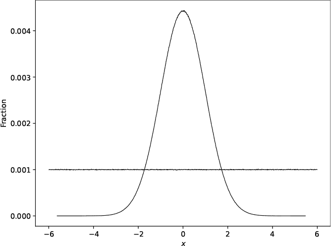
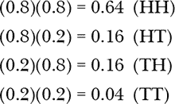
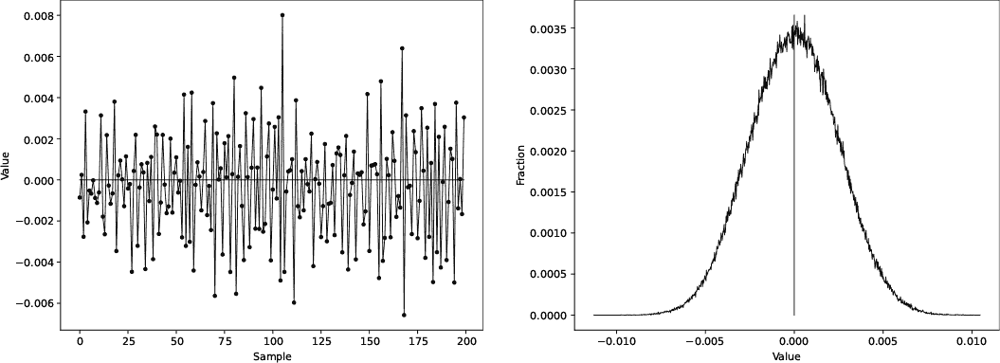
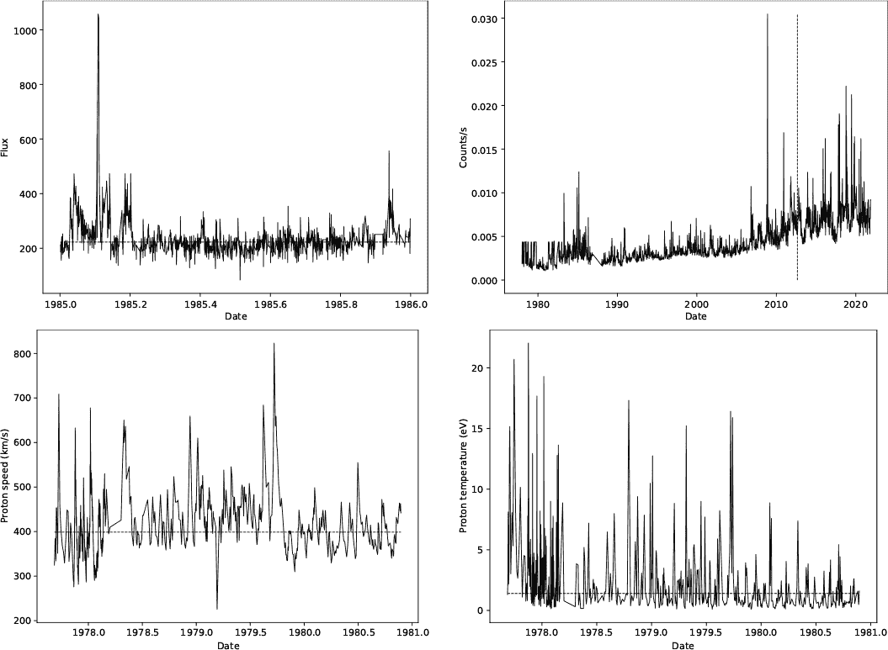
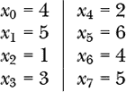
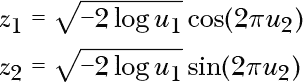
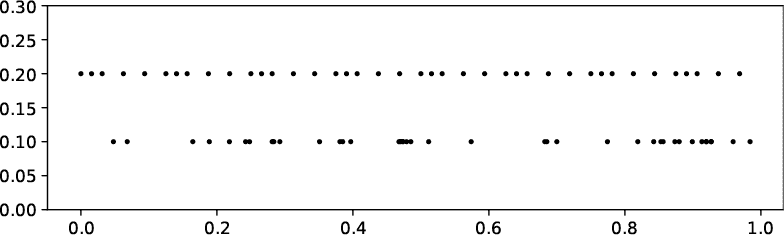

## 第一章：随机性的本质**


随机过程驱动着我们在本书后面将要开发的系统。本章介绍了特定的随机过程，包括那些真正的随机过程，以及那些是确定性的但仍然足够随机以供使用的过程——即伪随机和拟随机过程。

我们将从简要讨论概率与随机性之间的关系开始。在学习如何判断一个过程是否是随机的之后，我们将探索真正的随机过程，即那些受到真实随机性强烈影响的过程。我们还将学习伪随机和拟随机过程之间的区别。最后，我们将使用 Python 创建 `RE` 类，这是我们将在所有实验中使用的随机性引擎。

### **概率与随机性**

*概率分布*表示一个*随机变量*可以取的所有可能值，以及每个值出现的可能性。对我们来说，随机变量是一个随机过程的输出。

概率分布有两种类型。*连续型*概率分布返回来自无限集合的值，这意味着在允许范围内的任何实数。在这里，*实数*指的是实数集合ℝ中的元素，所有数字都在数轴上。*离散型*概率分布则限制返回来自有限集合的值，比如硬币的正反面或骰子上的数字。

随机过程生成的值被称为*样本*，这些值来自某种概率分布，无论是连续型的还是离散型的。例如，掷硬币会产生正面或反面的样本，而掷骰子会从集合 {1, 2, 3, 4, 5, 6} 中返回样本（假设是标准六面骰）。

如果一个随机过程返回一个单一的数字，我们如何知道它是从哪个分布中采样的呢？在某些情况下，我们有理论知识，但在其他情况下，我们只能生成大量样本。随着时间的推移，每种可能结果出现的相对频率将变得显而易见，并充当真实概率分布的替代品。

#### ***离散分布***

作为离散概率分布的一个例子，假设由于一位当地巫师的慷慨，我拥有一颗独一无二的三面骰。我的三面骰上显示的是数字 0、1 或 2。因此，每次掷骰时，都会有一面朝上。当我掷骰子 50,000 次，并记录每一面朝上的次数时，我得到了 表 1-1 中的结果。

**表 1-1：** 掷三面骰 50,000 次

| **面** | **次数** |
| --- | --- |
| 0 | 33,492 |
| 1 | 8,242 |
| 2 | 8,266 |

结果表明，出现 0、1 或 2 的概率是不相等的：0 出现了 33,492/50,000 = 66.984%的时间，1 出现了 16.484%的时间，2 出现了 16.532%的时间。如果我重复实验，每个结果的精确次数会略有不同，但显然，很多这样的实验会导致结果，其中 0 大约 67%的时间出现，1 和 2 各自大约 16.5%的时间出现。注意，67% + 16.5% + 16.5% = 100%，如果我的魔法骰子只有 0、1、2 三种结果，且比例为 67:16.5:16.5，那么这就是应该出现的情况。

掷三面骰子是一个随机过程，从一个概率分布中抽样，其中 0 的概率是 67%，1 或 2 的概率各是 16.5%。结果是有限的，所以概率分布是离散的。

让我们再做两个实验，它们从离散概率分布中抽样。第一个实验掷 50,000 次公平的硬币。第二个实验掷 50,000 次标准的六面骰子。如之前所做，我们将不同的结果统计出来，用 0 表示反面，用 1 表示正面。表 1-2 显示了硬币翻转的结果。

**表 1-2：** 公平硬币掷 50,000 次

| **面** | **次数** |
| --- | --- |
| 0 | 25,040 |
| 1 | 24,960 |

表 1-3 显示了掷骰子的结果。

**表 1-3：** 掷标准骰子 50,000 次

| **面** | **次数** |
| --- | --- |
| 1 | 8,438 |
| 2 | 8,252 |
| 3 | 8,292 |
| 4 | 8,367 |
| 5 | 8,336 |
| 6 | 8,315 |

就像我的魔法三面骰子的结果并不等概率一样，掷硬币和标准六面骰子的结果则是每个结果具有相等的概率。其计数几乎是均匀的。这种*均匀分布*，即每个可能的结果都具有相等的概率，是本书中我们将使用的最常见的分布类型。

**注意**

*为了进行这个实验，我并没有真的掷 50,000 次硬币和骰子。相反，我使用了伪随机生成器，稍后将在本章中讨论。*

#### ***连续分布***

将连续概率分布视为离散分布的极限。例如，一个六面骰子从六个可能的结果中选择。一个 20 面骰子，有时被称为 D20，从 20 个可能的结果中选择。如果我们能让骰子的面数延伸到无穷大，那么这种骰子每次掷出时，将从无限多个结果中选择。这就是连续概率分布所做的事情。

假设一个随机过程生成范围为 0 到 1 的实数，并且所有实数出现的概率相等，那么该随机过程就是从连续均匀分布中抽样，就像骰子从离散均匀分布中抽样一样。在本书中，我们将广泛使用连续均匀分布。同样，我们偶尔也会使用*正态*（有时称为*高斯*）分布。

在这一点引入一些数学符号将使后续内容更容易理解。我们最常用的均匀分布从[0, 1)区间中抽取样本，意味着样本大于或等于 0，并且严格小于 1，即 0 ≤ *x* < 1。当写出像[0, 1)这样的区间时，请注意是使用方括号还是圆括号。方括号表示包含该限制，而圆括号则不包含该限制。因此，(0, 1)表示一个区间，其中所有可能的实数除了 0 和 1 之外都允许。同样，[0, 1]包括 0 和 1，而 0, 1)包括 0 但不包括 1。后面章节中描述的伪随机和准随机过程通常会生成[0, 1)区间的输出。

均匀分布是直观的，无论是连续的还是离散的：每个可能的结果都有相同的出现概率。然而，在正态分布中，一些值比其他值更可能被生成。

欣赏正态分布的最佳方式是检查其直方图。例如，[图 1-1 展示了来自正态分布的 6000 万个样本的分布。



*图 1-1：显示正态（曲线）和均匀（线）分布的直方图*

图 1-1 中的值大约从−6 到 6。接近 0 的值最有可能出现，而极端值最不可能出现。正态分布是普遍存在的；许多物理现象都遵循这种分布。关键是，当我们从*任何*分布中获取大量样本时，均值将遵循正态分布。这就是*中心极限定理*，它是统计学的基础。

在上一节中，表 1-2 和表 1-3 统计了正反面出现的次数以及每个骰子面出现的次数。直方图是这种表格的图形表示。可能的输出被放入指定宽度的箱子中。对于骰子来说，天然的箱子宽度是 1，这样每个面就会落入带有相同标签的箱子中。

对于连续分布，箱子覆盖一个范围。例如，如果我们有一个生成 0, 1)区间中数字的过程，并且我们想要 10 个箱子，那么我们可能会将每个箱子的宽度设为 0.1。那么，*x* = 0.3052 的样本将落入从 0 开始计算的第 3 个箱子，因为：

![Image

同样，一个样本*x* = 0.0451 会落入区间 0，依此类推。当所有样本都被放入区间后，直方图会绘制每个区间的计数或落入该区间的样本比例。比例是通过将每个区间的计数除以所有区间的总和得到的。使用区间比例的直方图可以近似真实的概率分布。

让我们回到图 1-1。该图使用了 1,000 个区间，这解释了为什么曲线看起来更像一条曲线而不是条形图。图中绘制的是每个区间的比例，而不是计数，这让我们可以在不必担心生成直方图所用样本数量的情况下比较不同的分布。随着样本数量的增加，这种直方图会更接近真实的概率分布。

图 1-1 中的水平线表示一个连续的均匀分布，在–6, 6)的范围内选择值。如果每个值的选择概率相等，那么平均而言，每个区间的样本数量会相同，1/1,000 = 0.001，从而解释了均匀分布的*y*轴值。

我们只需要记住，驱动我们实验的随机过程是根据某种分布生成值的，主要是均匀分布或正态分布。还有许多其他标准分布，但我们在本书中不会深入探讨它们。

**注意**

*想要更深入了解概率和统计，我推荐* Alex Reinhart 的《Statistics Done Wrong》（2015 年）或我的书*《深度学习数学》（2021 年），这两本书均由 No Starch Press 出版。你将会看到关于概率和统计的讨论，以及微分学，我们将在本书中的多个地方提到这些内容。*

我们需要知道我们的随机过程离“真正的随机”有多近。在深入探讨随机性引擎之前，让我们考虑一下如何测试一个随机过程的输出。

### **随机性测试**

我们怎么知道一个随机过程的输出是否真的是随机的？简短的回答是：我们不能。然而，这不应该让我们气馁。我们并不是试图解决深奥的哲学问题，尽管它们可能很有趣。相反，我们要做的是找到足够好的方法来实现我们的即时目标，仅此而已。

这串二进制数字是随机的吗？

0101010011100000110000011101101111111011100000

好吧，它看起来有点随机，但我们怎么知道呢？早些时候，我们使用每个可能输出的频率来判断样本是否符合预期。一个随机过程以相等的概率生成 0 或 1 也应该符合预期。在这种情况下，有 23 个零和 23 个一。这是否表明序列是随机的？

当我说我们无法判断一个过程是否真的随机时，你开始明白我的意思了。我们所能做的就是应用测试，以增加我们对序列是随机的信心。我们可以检查各种输出的预期频率，但这并不充分。例如，以下序列也有相等数量的零和一：

![图片

我们大多数人不会认为这两种序列是特别随机的。

事实上，前面提到的三个序列都不是随机过程的输出。第一个是 6502 微处理器程序的操作码的二进制表示，用于在旧版 Apple II 计算机的屏幕上显示字母 A。操作码的比特模式不是随机的，而是严重依赖于微处理器的内部架构。我手动生成了另外两个序列，它们有相等数量的零和一。

多年来，研究人员发明了许多统计测试，它们共同设计用于检测一串值是否值得被称为随机。我们在这里没有足够的空间深入探讨这些测试，但它们远远超出了频率的范畴，还考虑了各种短期和长期的相关性。一些这样的测试套件有 DieHarder、TestU01 和 PractRand。这些套件通常需要大量的值，远超过我们在这里能处理的数量。

那么一个人该怎么做呢？我们无法证明一个随机引擎正在生成随机输出，但我们可以获得足够的信心，以便或多或少地相信它。为此，我们将使用一个名为`ent`的命令行程序，源自*熵*（entropy）一词。它应用了一组小的统计测试，可能会影响我们的信念。

许多 Linux 发行版都包括`ent`，但如果你的系统没有，可以使用以下命令安装它：

```
> sudo apt-get install ent
```

请访问以下网站，查看编译好的 Windows 版本（以及它的 GitHub 仓库链接，如果你想查看`ent`的源代码）：*[`www.fourmilab.ch/random`](https://www.fourmilab.ch/random)。* 要在 macOS 上安装`ent`，在前面的命令中将`sudo apt-get`替换为`brew`。

`ent`程序需要一个字节文件，它假定这些字节在[0, 255]范围内均匀分布。这意味着被测试的随机过程必须将其输出转换为一组均匀分布的字节。我们将在本章稍后学习如何做到这一点。

目前，书籍的 GitHub 页面包含一个文件，我们可以用它来理解`ent`的输出，*ent_test.bin*。像这样将其传递给`ent`：

```
> ent ent_test.bin
Entropy = 7.999996 bits per byte.

Optimum compression would reduce the size
of this 40000000 byte file by 0 percent.

Chi square distribution for 40000000 samples is 241.36, and randomly
would exceed this value 72.09 percent of the times.

Arithmetic mean value of data bytes is 127.5064 (127.5 = random).
Monte Carlo value for Pi is 3.141776714 (error 0.01 percent).
Serial correlation coefficient is -0.000234 (totally uncorrelated = 0.0).
```

文件*ent_test.bin*包含了由一种良好但很少使用的伪随机数生成器 MWC（乘法与进位）生成的字节。我们可能期望`ent`报告该文件是随机的。然而，`ent`不会为我们做出这个判断。相反，`ent`会运行一组六个统计测试并报告结果，留给我们自己决定这些结果是否足以支持随机性的信念。

第一个测试衡量字节的熵。*熵* 是衡量系统无序度的标准。对物理学家来说，熵与系统的微观状态数有关——例如，气体分子的位置和动量，它们导致相同的宏观物理量，如温度和压力，以及这些分子可以如何排列。然而，`ent` 报告的熵比这更深刻。它是 *香农熵*，一种衡量信息内容的标准。在这种情况下，它以比特为单位表达。一个字节有 8 比特，因此最大程度随机的序列将具有 8.0 的熵，意味着信息内容最大化。我们的测试文件具有每字节 7.999996 比特的熵，非常接近 8，这是一个良好的迹象。

我们使用 `ent` 报告的熵来估算文件压缩的可能性。这是熵的另一种表现形式。压缩算法通过利用文件中包含的信息（通过其熵来衡量）来工作。熵越低，数据的冗余性越高，信息内容越低。如果信息内容较低，就有其他方式表达这些信息，占用更少的空间。然而，如果文件是随机的且熵已最大化，则无法以其他方式表达文件内容，因此无法压缩。

接下来，`ent` 应用了 *χ*² 测试。这里重要的是报告的百分比。如果这个百分比低于 5% 或高于 95%，那么预期频率——即每个字节值出现的次数——就是可疑的。这里我们得到了 72%，所以我们仍然处于可靠的范围内。

如果字节序列是随机的，我们可能会正确地预计字节的平均值为 255/2 = 127.5。这里，我们得到了一个平均值 127.5064，非常接近。

可以通过随机数估算 *π*；`ent` 将此用作另一种随机性测试。在这种情况下，`ent` 估算出的值与显示的数字相差 0.01%。如果字节序列中有某些因素偏向模拟结果，那么它应该在计算的 *π* 值中表现出来。我们将在第三章中使用随机数估算 *π*。

最终输出行应用统计测试来衡量字节 *n* 与字节 *n* + 1 的相关性；也就是说，它关注字节的顺序。如果字节之间没有序列相关性，至少在一个字节到下一个字节的层面上，结果系数将为零。在这里，它略微为负，但非常接近零。

总的来说，`ent`的报告让我们对文件*ent_test.bin*的内容是否可以称为随机有了很大的信心。你会用这种信心水平来保护你的银行账户吗？我真心希望不是，但我们并不关注密码学；我们关注的是足够随机的随机过程，不论是自然的还是合成的，足以支持我们的实验。为此，`ent`是我们唯一需要的工具。

然而，`ent`的输出过于冗长，特别是我们在本章中将经常使用它。让我们定义一个简化版本。与之前显示的输出不同，我将以如下方式报告`ent`的结果：

```
entropy: 7.999996
chi2   : 72.09
mean   : 127.5064
pi     : 3.141776714 (0.01)
corr   : -0.000234
```

让我们开始使用我们精巧的随机性检测器。我们将从真正的随机过程开始。

### **真正的随机过程**

在本节中，我们将回顾几种通常被认为是真正随机过程的来源：掷硬币、掷骰子、各种形式的电噪声以及放射性元素的衰变。我们将在本书后续的实验中使用我们在此创建的数据集。本节涵盖的随机过程也为下一节的伪随机过程提供了对比，后者只是给人随机的假象。

人类在几个世纪以来，已经发展出多种生成随机性的方式，包括掷硬币和掷骰子。让我们考虑这些方法，看看我们是否可以将它们当作随机性引擎来信任。

#### ***掷硬币***

大多数人认为掷硬币是一个合理的随机性来源，但真的是这样吗？2009 年，两个加利福尼亚大学伯克利分校的本科生总共掷了 40,000 次硬币，并记录了硬币的起始方向，正面朝上或反面朝上。表 1-4 展示了他们的发现（数据使用经许可）。

**表 1-4：** 手动掷硬币 40,000 次

| **方向** | **正面** | **反面** | **p 值** |
| --- | --- | --- | --- |
| 朝上 | 10,231 | 9,770 | 0.0011 |
| 反面朝上 | 9,985 | 10,016 | 0.8265 |

看一眼表 1-4，可以看到当硬币正面朝上时，翻转结束时正面朝上的次数更多。反面朝上的情况也是如此；反面朝上的次数更多。我们可以使用*χ*²检验来查看这些比例是否与公平硬币的预期 50-50 分配一致。得到的 p 值在最右列。

p 值是指在零假设为真的情况下，观测到的正反面次数的概率。在统计检验中，*零假设*是被检验的假设。在此例中，对于*χ*²检验，零假设是观测到的正反面次数与相等概率一致。p 值为我们提供了支持或反对该假设的证据。如果 p 值低于标准的、略显任意的经验法则阈值 0.05（5%），则我们认为该 p 值是*统计显著*的，并宣称反对零假设。

p 值越小，我们的证据就越强。对于 0.05 的 p 值阈值，我们可能会期望大约每 20 次中有 1 次错误地拒绝零假设；而对于 0.01 的 p 值，错误拒绝的比率变成了每 100 次 1 次，随着 p 值变得越来越小，错误拒绝的比率也越来越低。然而，只有死亡和税收是确定的。一个小的 p 值并不是任何事情的*证明*；它只是一个指标，是相信与否的理由，尽管可能有强有力的证据支持。

再次查看表 1-4 中的“正面朝上”行。p 值为 0.0011，或 0.11%。根据*χ*² 检验，给定零假设为真，观察到的计数（或更极端的差异）的概率为 0.11%。因此，我们有证据支持拒绝零假设。换句话说，我们有证据表明进行正面朝上的实验部分的受试者 1 不是随机的，而是有偏向正面的倾向。

然而，受试者 2 得到的结果与零假设一致。对于她来说，p 值为 0.8265，或 83%。同样，这里的 p 值意味着*χ*² 检验报告了 83% 的概率，表明在零假设为真的情况下观察到这些计数是合理的。这完全有道理，因此我们有证据支持零假设，适用于反面朝上的情况。

*χ*² 检验将计数与预期的 50-50 分布进行了比较。我们可以再进行一次检验：*t 检验*。t 检验比较两个数据集，并返回一个 p 值，我们可以将其解释为这两个数据集是否由相同的过程生成的可能性。在这个例子中，正面朝上和反面朝上的数据集之间进行 t 检验，得到了 p 值 0.0139，或 1.39%，再次低于标准的 0.05 阈值。这作为证据表明这两个数据集很可能来自不同的过程。

在这种情况下，这意味着什么？我们有两个受试者的单一翻转集，每个受试者每次翻转硬币时，硬币的正面始终朝上。可以想象，但并未证明，受试者 1 在翻转时非常一致，因此可能使得硬币投掷存在偏差，从而当正面是起始条件时，正面出现的几率较大。对于我们来说，这个有趣的例子表明人类不能被信任去随机行动。

我们有证据表明受试者 1 对硬币翻转存在偏差。我们是否被这种偏差困住了？实际上，并没有。美国数学家和计算机科学家约翰·冯·诺依曼提出了一种巧妙的算法，可以使有偏的硬币变得公平。这个算法非常简单：

1.  将有偏的硬币翻转两次。

1.  如果两次翻转结果相同——即，都是正面或都是反面——从第 1 步重新开始。

1.  否则，保留第一次翻转的结果，忽略第二次。

将这个算法应用于受试者 1 生成的正反面序列，我们得到了 2,475 次正面和 2,538 次反面。*χ*² 检验得到了 0.37 的 p 值，远高于 0.05，这强烈证明结果数据集现在的表现符合预期。

为什么冯·诺依曼算法有效？考虑一枚偏的硬币，其正面朝上的概率不是 0.5，而是 0.8，这意味着反面朝上的概率是 0.2，因为概率之和为 1。在这种情况下，掷硬币两次会产生四种可能的正反面组合，并且具有以下概率：



记住，如果事件是独立的，即使是偏硬币的投掷也是如此，那么它们的概率相乘。而且，正面后接反面和反面后接正面的概率是相等的。因此，在这两种情况下，始终选择第一个（或第二个）结果必然会以相同的概率选择正面或反面。

文件*40000cointosses.csv*包含了本实验中使用的数据集，以及相关的代码*40000cointosses.py*。

**注意**

*请查看原始网页，了解关于实验如何进行的其他评论，包括有关将结果仅视为进一步实验可能揭示有趣内容的提示的适当警告：* [`www.stat.berkeley.edu/∼ldous/Real-World/coin_tosses.html`](https://www.stat.berkeley.edu/∼ldous/Real-World/coin_tosses.html)。

#### ***骰子投掷***

投掷公平硬币是一个随机过程，投掷公平骰子也是如此。但真的有“公平”的骰子吗？制造过程中可能存在的缺陷、形状的轻微偏差，或者骰体内的不均匀密度可能会导致偏差。然而，总的来说，尤其是对于我们的目的来说，我们可能认为骰子投掷足够随机，可以作为有用的数据。

我收集了 14 颗六面骰，并使用游戏中的骰盅将它们一起掷出。然后我拍下了结果的照片，以便统计每个面朝上的次数。我重复了这个过程 50 次，总共进行了 700 次骰子投掷。表 1-5 显示了结果。

**表 1-5：** 骰子投掷计数

| **结果** | **计数** |
| --- | --- |
| 1 | 122 |
| 2 | 98 |
| 3 | 106 |
| 4 | 126 |
| 5 | 119 |
| 6 | 129 |

正如之前所述，如果骰子是公平的，我们期望每个结果的出现次数相同。在 700 次投掷中，我们期望每个可能的结果出现 700/6 ≈ 117 次——由于实验规模较小，这是一个简单的数字，但足以让我们关注本节的主要问题：掌握我们对真正随机过程的理解。

表 1-5 中的计数值并不是 117，而是有偏差，通常偏差较大。这是否意味着骰子是加权的？也许是，但我们永远无法确定；我们只能收集有利于一个答案的证据。*χ*²检验是我们在这里选择的工具，就像在前面的硬币掷投中一样。应用它返回的 p 值为 0.28，远高于通常认为具有统计显著性的 0.05 阈值。因此，我们不拒绝零假设，并认为骰子是合理公平的，因此可能是一个真正的随机来源。

如果目标是生成真正的随机数，宏观物理系统可能不足以胜任；涉及的偏差太多，尽管我们可以使用像冯·诺依曼（von Neumann）算法来改善这种情况。而且，基于物理的随机性引擎，或许是基于自动掷骰子的方式，随着时间推移会退化，进一步引入偏差。因此，我们必须朝着不同的方向寻找。现在让我们考虑更适合用作随机性引擎的过程。

**轮盘赌轮**

轮盘赌是另一个在考虑潜在随机性来源时会想到的物理过程。在轮盘赌中，人们下注预测弹珠最终落在哪个位置。它是试图“破解”系统的人们的最爱目标，因为玩家可以在轮盘转动时下注。从表面上看，轮盘赌应该和掷骰子一样是随机的，但机械缺陷，特别是如果轮盘倾斜哪怕一点点，也会让最终的球位置偏向那些聪明的玩家。

我能找到的第一个轮盘赌“破解”事件发生在 1880 年左右，当时英国人约瑟夫·贾格（Joseph Jagger），一名纺织工人，意识到蒙特卡洛的轮盘赌轮的构造缺陷使他能够可靠地预测球的最终位置，从而比失误更多地获胜。他的成功促使轮盘赌轮设计的改进。

大约在 1960 年，爱德华·索普（Edward Thorp）与克劳德·香农（Claude Shannon）合作，构建了可能是世界上第一个可穿戴计算机，唯一的目的是用来玩轮盘赌。完整的内容可以在索普 1998 年发表的论文《第一个可穿戴计算机的发明》中找到。该计算机体积小，只有 12 个晶体管，并通过藏在鞋子里的脚踏开关操作。当轮盘转动时，脚踏开关启动一个计时器，通过一个小耳机发出八种音调中的一种，每种音调表示球更可能落入的一个八分之一区域。虽然该系统脆弱，但它有效，并且在 1961 年在拉斯维加斯试验时取得了一定的成功。

在 1970 年代，J·多伊恩·法默（J. Doyne Farmer）和诺曼·帕卡德（Norman Packard）基本上用微型计算机重复了这个实验。像索普和香农一样，他们在赌场中同样取得了成功；请参阅法默简短的页面 *[`www.doynefarmer.com/roulette`](http://www.doynefarmer.com/roulette)* 或托马斯·巴斯（Thomas Bass）所著的《幸福派》（*The Eudaemonic Pie*）一书中的更详细内容，该书可以通过互联网档案馆在线获取 (*[`archive.org`](https://archive.org)*)。

#### ***使用电压***

大多数台式计算机都有麦克风输入插孔。像 Audacity 这样的程序可以从这个输入设备录制样本。我们可能会认为，在没有连接麦克风的情况下进行录音会得到一个空文件，但事实并非如此。麦克风输入是模拟输入，容易受到电子噪声的影响：由于相关组件的特性和其他环境因素，电压会出现微小的随机变化。我们将利用这种电压的变化作为随机性引擎。

本实验要求你录制一个 WAV 文件。使用什么工具录制都没有关系。我使用了 Audacity，这是一款开源的声音编辑器，适用于大多数操作系统。在 Ubuntu 系统中，可以使用以下命令安装它：

```
> sudo apt-get install audacity
```

访问 *[`www.audacityteam.org`](https://www.audacityteam.org)* 安装适用于 Windows 和 macOS 的 Audacity。

我们希望使用单声道（mono）和较高的采样率（如 176,400 Hz，样本每秒）从麦克风输入进行录制。对于 Audacity 来说，这意味着将项目速率更改为 176,400（参见屏幕左下角），并将录音通道下拉菜单更改为**单声道**。我们还需要选择麦克风作为输入源。系统中该设备的名称超出了我的预知能力，但通过实验，点击麦克风图标旁边的下拉菜单，应该能找到正确的设备。要测试输入，请选择**点击开始监视**。你应该看到只有一个通道（例如左声道）产生的逐渐变化的声音条。如果没有，继续调整，直到出现。

要录制样本，请点击红色的录音按钮。我建议录制几分钟。要停止录音，请点击方形的停止按钮。在文件菜单中使用适当的选项将录音导出为 WAV 文件，在文件保存对话框中设置输出格式为**32 位浮点 PCM**。如果你无法使用此方法录制 WAV 文件，本书的网站上有一些小的 WAV 文件，你可以在接下来的代码中使用。

音频信号是表示为随时间变化的连续电压。采样音频信号意味着在设定的时间间隔——即采样率——内测量瞬时电压，并将该电压转换为某个范围内的数字。例如，光盘使用 16 位采样，因此每个电压都被赋予一个范围为−32,768 到 32,767 的数字。采样率决定了电压测量的频率。

当数字化信号被回放时——意味着将其转换回电压以驱动扬声器——音质的好坏取决于用于表示信号的数字数量以及采样的频率。在我们的实验中，样本表示为 32 位浮点数，采样率为 176,400 Hz。相比之下，光盘的采样率为 44,100 Hz。

图 1-2 展示了一部分音频样本及其对应的直方图。



*图 1-2：音频样本（左）和相应的直方图（右）*

图 1-2 中的*x*轴是时间，即样本编号，*y*轴是浮动的样本值，或表示当时电压的数字化值。水平线是文件中所有样本的均值；图 1-2 只显示了前 200 个。正如我们所预料的，均值几乎为 0。

图 1-2 的右侧显示了一个两秒钟片段中所有样本的直方图。我们以前见过这种形状；它几乎与图 1-1 完全相同，告诉我们噪声样本呈正态分布，均值为 0。我们将利用这个观察结果，把音频流转换成一个随机字节文件。

我们不能直接使用录音；必须处理样本，使其更具随机性，使用*silence.py*中的代码。让我们逐部分地分析。

首先，我们`import`一些库函数：

```
import sys
import numpy as np
from scipy.io.wavfile import read as wavread
```

`sys`模块提供了命令行的接口；`numpy`我们已经知道了。为了读取 WAV 文件，我们需要 SciPy 中的`read`函数。在这里，我将其重命名为`wavread`。

在脚本的底部，我们加载所需的 WAV 文件并进行处理：

```
s, d = wavread(sys.argv[1])
print("sampling rate: %d" % s)
n = len(d)//2
a = MakeBytes(d[:n])
b = MakeBytes(d[n:])
if (len(a) < len(b)):
    c = a[::-1] ^ b[:len(a)]
else:
    c = a[:len(b)] ^ b[::-1]
c.tofile(sys.argv[2])
```

`wavread`函数返回采样率（`s`）和样本本身作为 NumPy 向量（`d`）。我们显示采样率，然后将样本分为两半，并将每一半传递给`MakeBytes`，然后分别将返回值赋给`a`和`b`。`MakeBytes`将一个音频样本向量转换为字节向量。

最终的字节集在`c`中。这是`a`和`b`中字节的异或（XOR）。XOR 是一种对整数位进行的逻辑操作。如果 XOR 的一个输入为 1，另一个为 0，则输出为 1。如果两个输入相同，则输出为 0。我记得那句“要么一个，要么另一个，但不能都选。”XOR 与标准的 OR 操作不同，OR 操作在任一输入为 1 时输出 1，包括两者都为 1 的情况，如下所示：

1 XOR 1 = 0，但 1 OR 1 = 1

使用生成的字节流的一部分来修改另一部分，是改变位模式的强大方法，这增加了输出的随机性。在*silence.py*中，字节流在 XOR 之前被反转（`[::-1]`），以增加过程的随机性。

`MakeBytes`返回的字节数取决于实际传递给它的样本，而不是样本的数量。因此，`a`的向量长度可能与`b`不同，这就是`if`语句和基于`len`的索引的原因。当`c`准备好时，它通过`tofile`以二进制形式写入磁盘。

所有的操作都在`MakeBytes`函数中。将音频样本流转换为字节需要四个步骤：

1.  从每个样本中减去总体均值。

1.  根据每个样本的符号将其转换为位：如果为正，设为 1；如果为负，设为 0。

1.  使用前一节中的冯·诺依曼算法来去偏比特。

1.  将每一组 8 个位组合成一个输出字节。

函数`MakeBytes`执行了这些步骤，使用了以下代码：

```
def MakeBytes(A):
 ➊ t = A - A.mean()
 ➋ thresh = (t.max()-t.min())/100.0
    w = []
    for i in range(len(t)):
        if (np.abs(t[i]) < thresh):
            continue
        w.append(1 if t[i] > 0 else 0)
 ➌ b = []
    k = 0
    while (k < len(w)-1):
        if (w[k] != w[k+1]):
            b.append(w[k])
        k += 2
 ➍ n = len(b)//8
    c = np.array(b[:8*n]).reshape((n,8))
    z = []
    for i in range(n):
        t = (c[i] * np.array([128,64,32,16,8,4,2,1])).sum()
        z.append(t)
    return np.array(z).astype("uint8")
```

代码将样本作为`A`传入，这是一个 NumPy 向量。接下来是四个步骤。首先，我们减去任何均值（`t`） ➊。然后，我们将`thresh`定义为样本最大范围的 1%。稍后我会解释为什么。

步骤 2 表示使用每个样本的符号作为一个比特 ➋。我们观察到样本呈正态分布，且均值已被减去，因此大约一半的样本会是负数，另一半是正数。这听起来很像掷硬币：要么一个值，要么另一个值。因此，我们将正样本设为 1，负样本设为 0。那么，`thresh`的意义何在呢？

位被收集到列表`w`中，初始为空。初始化`w`后，循环检查每个样本，判断该样本的绝对值是否小于最大范围的 1%。如果是，我们忽略该样本（`continue`）；否则，我们使用样本的符号将一个新的比特添加到`w`中。样本中可能存在一个微小的、非随机的低振幅信号。忽略接近零的样本有助于去除这种信号。实际上，我们的意思是我们只对“较大”的偏离零均值的值感兴趣。

我们现在有一个长长的单个位列表（`w`）。这些位可能有偏，代表一系列不公平的掷硬币结果。为了解决这个问题，我们使用冯·诺依曼算法进行去偏，生成一个新的位列表`b` ➌。

最后，我们将`b`中的每一组 8 个位转换成`z`中的新字节列表 ➍，方法是将`b`重塑为一个*N*×8 的数组，然后按位与每个字节中的每个比特位置值相乘。当一切完成后，代码将字节列表转换为 NumPy 数组并返回。

你可能需要再次查看代码，确保你理解每个步骤。核心概念是我们利用样本正态分布的特点，生成一个比特流，在去偏后，形成最终输出字节流。

为了测试这段代码，我用 Audacity 做了一个 30 分钟的录音，并将样本保存为文件*silence.wav*。然后，我使用*silence.py*将这个大 WAV 文件转换成*silence.bin*。

**注意**

*文件* silence.wav *太大，无法包含在书的资源库中。不过，如果你非常希望拥有它，可以联系我，我会尽力帮忙。*

这是我用来转换 WAV 文件的命令行：

```
> python3 -W ignore silence.py silence.wav silence.bin
```

`wavread`函数往往会抱怨它无法理解的 WAV 文件元素。将`-W ignore`添加到命令行中可以抑制这些警告。

结果输出文件*silence.bin*的大小不到 6MB。它是一个随机字节的集合，所以我们可以将它传递给`ent`来生成报告：

```
entropy: 7.999867
chi2   : 0.01 
mean   : 127.4948
pi     : 3.136872354 (0.15)
corr   : 0.000610
```

这些值是相当不错的。唯一一个不符合我们预期的值是*χ*²，但我们可以接受这一点。以后可以将*silence.bin*保留在手边，作为本书后续章节中随机数引擎的来源。

### **随机物理过程**

许多物理过程是随机的，尽管可能存在偏差。在这一部分中，我们将探讨三种导致随机性的物理过程：大气射频噪声、*旅行者 1 号*和*旅行者 2 号*探测器在其超过 40 年的任务中所探测到的等离子体和带电粒子速率，以及放射性同位素的衰变。

#### ***大气射频噪声***

1997 年，来自都柏林圣三一大学的计算机科学教授 Mads Haahr 启动了* [`www.random.org`](https://www.random.org) *，这是一个致力于从大气射频噪声中生成真正随机数字的网站。该网站自启动以来一直在运行，并向互联网用户提供免费的随机数字服务，同时还提供一些付费的随机数字相关服务。你可以浏览* [`www.random.org`](https://www.random.org) *上的服务，但为了本书的目的，我们将继续使用免费的随机字节收集。

从网站获取随机数据有两种主要方式。首先，可以通过* [`www.random.org/bytes`](https://www.random.org/bytes) *获取 16KB 块的随机数据。只需选择所需格式并下载。然而，由于我们需要更大的字节集合作为实验的随机数引擎，因此使用* [`archive.random.org`](https://archive.random.org) *提供的存档文件会更合适。从网站直接下载文件需要支付小额费用。然而，如果你熟悉使用种子下载，文件可以合法地免费获取。我们的参考 Linux 发行版包括 Transmission，一个用于访问种子下载的客户端。该应用也可用于其他操作系统；访问* [`transmissionbt.com`](https://transmissionbt.com) *获取下载说明。

作为测试，我使用 Transmission 下载了几个月的随机字节（选择了二进制文件选项）。然后，我使用`cat`命令将所有二进制文件合并为一个。例如，像这样的命令会将所有以*.bin*结尾的二进制文件合并为文件*random_bytes*：

```
> cat *.bin >random_bytes
```

然后我将*random_bytes*（约 126MB）传递给`ent`，得到了以下结果：

```
entropy: 7.999999
chi2   : 98.32
mean   : 127.4880
pi     : 3.142011833 (0.01)
corr   : -0.000015
```

我们看到`ent`对*random_bytes*非常满意。我还拥有来自* [random.org](http://random.org) *的更大字节集合，包括过去两年的位数据。它的大小超过 500MB，`ent`也喜欢这个数据集。

```
entropy: 8.000000
chi2   : 40.68
mean   : 127.5023
pi     : 3.141375348 (0.01)
corr   : 0.000021
```

代码显示熵值已最大化，每个字节 8 位。

#### ***旅行者号等离子体和带电粒子数据***

1977 年，NASA 发射了双子座*旅行者*航天器，探索外太阳系。*旅行者 1 号*在接近木星和土星后，继续向太阳系外部进发。*旅行者 2 号*则在大巡游中经过木星、土星、天王星和海王星。迄今为止，*旅行者 2 号*是唯一一艘探测天王星和海王星的航天器。2012 年 8 月，*旅行者 1 号*成为首个人造物体离开太阳系并进入星际空间。截至本文写作时，2023 年 10 月，两个航天器仍在良好运行，并且有足够的电力，或许还能再工作十年。

*旅行者*号最著名的是它们返回的精彩图像。然而，两个航天器都携带了多个科学仪器，用于测量它们所穿越环境的各项参数。这些仪器包括用于测量等离子体质子和其他带电粒子及核子通量的设备。这些测量数据并非完全随机，而是围绕某些值波动，就像我们之前使用的麦克风输入一样。因此，可以利用*旅行者*号的数据构造一个适合作为随机源的二进制文件。

文件*voyager_plasma_lecp.bin*包含由一组*旅行者*数据文件构成的字节，其中包括 1977 年至 1980 年的等离子体质子计数、密度和温度数据，以及 1977 年至 2021 年期间的低能带电粒子通量（粒子在单位时间内通过某个区域）。我使用*process_vgr_data.py*中的代码合并了几个较小的文件，以处理单独的等离子体和带电粒子数据集。

对于每种类型的数据——等离子体质子、低能质子、低能离子和宇宙射线质子——处理过程是相同的：在时间间隔内找到中位值，并且如果观察值高于中位值，则标记为 1 位，如果低于中位值，则标记为 0 位。为了扩展位的集合，我对中位值及其 80%和 120%的值重复了这个过程。然后，我使用冯·诺依曼算法对最终的位集合进行了去偏处理。

生成的文件包含 77,265 字节，`ent`报告如下：

```
entropy: 7.995518
chi2   : 0.01
mean   : 127.5484
pi     : 3.150733867 (0.29)
corr   : -0.001136
```

这些是合理的数值。

图 1-3 展示了来自等离子体和低能带电粒子实验的*旅行者*数据样本。



*图 1-3：*旅行者*数据样本。从左上角开始，顺时针方向：低能离子、宇宙射线质子、等离子体质子温度和等离子体质子速度。*

每个图中的虚线标记了数据集的中位值。高于中位值的观察值变成 1 位，低于中位值的变成 0 位。右上方的图显示了整个任务期间宇宙射线质子的通量。垂直虚线标记了 2012 年 8 月，这是*旅行者 1 号*正式离开太阳系的日期。注意，在这之后宇宙射线质子数量的增加。

**注意**

*旅行者*数据集是从多个网站收集的。通常它们以文本格式呈现，需要我进行相当多的处理，才能整理成适合使用的格式。文件使用了不一致的格式，存在拼写错误，有时还使用了错误年份的数据。如果你想要我使用过的文件，请直接与我联系。*

#### ***放射性衰变***

从 1996 年到 2022 年 12 月，HotBits 网站（* [`www.fourmilab.ch/hotbits`](https://www.fourmilab.ch/hotbits) *）通过最随机的随机过程——放射性衰变，向公众提供了真正的随机数据。

放射性元素，如 HotBits 使用的铯-137，是不稳定的。最终，这些原子通过某种过程衰变成另一种元素，在这个例子中是铋-137。原子中的质子数决定了它是哪个元素。铯的原子核中有 55 个质子；这就是它的*原子序数*。*同位素*是元素的不同版本，其中中子的数量（也在原子核中）有所变化。两者的总和，忽略非常轻的电子，给出了*原子质量*。如果铯-137 有 55 个质子，它就必须有 82 个中子。当铯-137 的一个原子衰变时，其中一个中子会转变为质子，使原子序数变为 56，从而将原子转变为铋-137，这是一个具有 56 个质子和 81 个中子的原子。铋-137 是稳定的，因此衰变过程停止。这个过程对于不同元素会有所不同。例如，铀的衰变经历多个阶段，最终转变为稳定的铅同位素。

当一个中子变为质子时，它会释放出一个贝塔粒子（电子）和一个反中微子。中微子几乎没有质量，几乎无法探测。然而，盖革计数器可以轻松探测到贝塔粒子。这就是 HotBits 网站生成随机位的方式。为了完整性，铯到铋的衰变经历两个阶段：铋的原子核开始时处于亚稳定状态，然后大约两分钟后，通过释放一个伽马射线回到基态。伽马射线是一种高能光子，也就是光。

特定衰变发生的时间由量子物理学以及我们所称的所有“怪异现象”决定。对于放射性衰变，起作用的怪异现象是*量子隧穿效应*，即便铯原子缺乏足够的能量去将自己从所处的碗形区域推出来，它仍然有一定的非零概率能够做到这一点。量子隧穿效应在经典物理中没有类似的解释。

HotBits 通过利用两对检测之间的时间间隔来输出 1 或 0，利用了这种不可预测性。首先，检测到一个β粒子，然后是另一个。两次检测之间的时间间隔称为*T*[1]。接下来，检测到另一对，并将其时间间隔标记为*T*[2]。如果*T*[1] ≠ *T*[2]，则生成一个比特。如果*T*[1] < *T*[2]，则该比特为 0；否则，*T*[1] > *T*[2]，输出比特为 1。每次比特之后，比较的方向会被反转，以防止物理设置引入任何系统性偏差。

HotBits 需要一个 API 密钥才能一次请求最多 2,048 字节。在 24 小时内，分配的字节数量有限制。我在写这本书时每天下载字节，现在我有了一个 3,033,216 字节的文件。根据`ent`的测试，这个数据相当不错：

```
entropy: 7.999935
chi2   : 18.90
mean   : 127.5246
pi     : 3.144891758 (0.11)
corr   : 0.000100
```

在本节中，我们讨论了几种不同的生成随机数据的过程。虽然它们都很有用（正如我们稍后将看到的），但没有一种能够生成大量的随机数——在本书的后续部分，我们有时需要数百万个随机数。我们别无选择，只能转向我们可以称之为合成随机过程的方式，并通过确定性手段生成随机数。前一句话中使用的*确定性*一词可能会让你不安，但我怀疑你到下一节结束时会更容易接受通过确定性过程模拟随机过程的想法。

### **确定性过程**

正如冯·诺依曼曾经说过的：“任何试图通过确定性方式生成随机数的人，当然是生活在罪恶之中。” 随机过程的核心思想在于其不可预测性，因此，了解先前发生的事情对预测之后的结果毫无帮助。根据定义，确定性过程遵循可预测的算法；因此，它不可能是真正的随机过程。

那么，为什么要使用确定性过程呢？即使过程是确定性的，它也可以逼近一个随机过程，直到输出足够有用。*伪随机过程*逼近一个随机过程。我们将在本书中广泛使用伪随机过程。

本节还讨论了伪随机过程与*准随机过程*的关系。最后，我们将讨论两种可能已在你的计算机上可用的混合过程。

#### ***伪随机数***

有许多方法可以逼近一个随机过程，按需生成伪随机数。在这里，我将介绍一种这样的方法，用于我们未来的实验。

*线性同余生成器（LCG）*是一种生成伪随机数序列的简单方法。LCG 生成的数字对于视频游戏和许多实验来说足够好，但它们在统计学上较弱，不推荐用于严肃的用途，如密码学。

理解 LCG 的最好方法就是直接动手实践：

*x*[*i* + 1] = (*ax[i]* + *c*) mod *m*

整个生成器就是那个单一方程，其中*x*是由生成器产生的值。下标表示序列中的下一个值，*x*[*i* + 1]是从前一个值*x[i]*推导出来的。初始值*x*[0]是*种子*，它为生成器提供了初始值。几乎所有的伪随机生成器都使用某种形式的种子。

这个方程由两部分组成。第一部分是*ax[i]* + *c*，其中*a*和*c*是精心选择的正整数。第二部分取第一部分的结果*y*，并计算*y* mod *m*，其中*m*是另一个精心选择的正整数。mod 运算符指的是取模，实际上就是求余数。计算时，生成器首先使用整数除法找出*y*/*m*，然后得到余数，该余数必须在[0, *m*)范围内。最终结果既作为生成器的输出，又作为计算下一个输出的值。

为了演示这个原理，让我给你展示一个 LCG 的实际应用。我将使用小数字，这有助于理解，但在实际应用中会是糟糕的选择，正如我们接下来看到的那样：

*x*[*i* + 1] = (3*x[i]* + 0) mod 7

种子必须小于 7，所以我们使用*x*[0] = 4。以下是这个 LCG 产生的序列：



输出看起来有些随机，但在*x*[5]之后，序列开始重复。所有伪随机生成器最终都会重复。重复前的输出数量决定了生成器的*周期*。在这里，周期为 6，4、5、1、3、2、6 将永远重复。

如果常数选择得当，周期可以大得多。在我们的实验中，我们将使用一组 1980 年代流行的常数，这些常数后来被称为*MINSTD（最小标准生成器）*。它生成一个无符号整数序列，周期为 2³¹ ≈ 10⁹。对于许多应用来说，这是一个合理的周期，但一个好的生成器不仅仅看它的周期。伪随机生成器越接近真正的随机序列，就越好。像`ent`这样的统计测试套件，或者更专业的测试套件，旨在揭示生成器输出序列中的各种相关性。通过这些测试套件，很快就能发现 MINSTD 对于严肃工作来说是一个差劲的生成器，但对于我们的目的来说已经足够。

我使用 MINSTD 创建了一个 100 百万字节的文件，并将其交给了`ent`。我得到了以下结果：

```
entropy: 7.999998
chi2   : 75.99
mean   : 127.5058
pi     : 3.141177006 (0.01)
corr   : -0.000144
```

输出非常合理，因此 MINSTD 可能对我们有用。

该生成器使用*a* = 48,271、*c* = 0 和*m* = 2,147,483,647 来构造生成方程：

*x*[*i* + 1] = 48271*x[i]* mod 2147483647

如果你熟悉计算机如何内部存储数字，你会注意到 *m* 并没有使用 32 位整数的全部 32 位。相反，*m* = 2³¹ – 1 是可以存储在 *有符号* 32 位值中的最大正整数。由于取模操作，生成器的输出必须在 [0, 2³¹ – 1) 的范围内，这意味着该生成器最多只能生成约 20 亿个唯一值。

如果我们需要生成一个字节序列 [0, 255]，那就没问题。但如果我们想创建一个 64 位浮点值的序列，即 C 语言中的 `double` 类型呢？在这种情况下，我们需要做更多的工作。最简单的方法是将 *x* 除以 *m*，因为那必须会产生一个在 [0, 1) 范围内的数字。对于许多应用来说，这已经足够了，但它仍然只能从大约 20 亿个数字中选择一个。你不需要知道这些细节，但一个 64 位浮点值可以存储更多内容，因为它使用的是 52 位的二进制尾数。如果我们想充分利用 64 位浮点值能给我们的容量，就需要从 MINSTD 生成两个输出，并将从它们中提取的 52 位赋值给浮点值的尾数，指数为 0。幸运的是，我们并不需要那么高的精度，但值得注意的是，简单地除以 *m* 并没有给你所有你可能想象中的内容。

我之前提到过伪随机生成器使用种子值，即起始值。这个要求是双刃剑。将种子设置为特定的数字会导致生成器重复输出相同的数值序列，但缺点是有时我们可能需要费些劲来确保不重复使用相同的种子。

例如，使用种子 *x* = 8,675,309 的 MINSTD 每次都会产生这个序列：

0.00304057,  0.77134655,  0.66908364,  0.33651287,  0.8128977, . . .

与此同时，使用 *x* = 1,234 作为种子将始终产生：

0.02773777,  0.93004224,  0.06911496,  0.24831591,  0.45733623, . . .

这些浮点数是通过将 *x* 除以 *m* = 2,147,483,647 生成的。

通常，我们会使用伪随机生成器，比如 NumPy 内置的那些，而不指定种子值。在这种情况下，我们希望得到一个不可重复的序列，至少对我们来说是不可重复的，因为我们无法知道选择了哪个种子。如果没有提供种子值，NumPy 会从 `/dev/urandom` 中选择一个值，稍后在本章会讨论这个特殊的系统设备。

我们最常用的伪随机生成器是 PCG64，这是 NumPy 默认使用的生成器。它是一个优秀的生成器，周期为 2¹²⁸。NumPy 以前的默认生成器是梅森旋转算法（Mersenne Twister）。从统计上讲，它仍然非常好，远远优于 MINSTD。梅森旋转算法的周期为 2^(19,937) – 1，这也解释了它更常见的名字：MT19937。准确地说，它的周期是一个巨大的数字，达 6002 位，并且对人类来说完全没有意义。PCG64 的周期也不容小觑：

2¹²⁸ = 340, 282, 366, 920, 938, 463, 463, 374, 607, 431, 768, 211, 456

这只是一个在人的理解中没有意义的数字。我们任何实验都无法穷尽由 MT19937 或 PCG64 生成的序列，书中将频繁使用这两种序列。

这些生成器的输出遵循均匀分布。任何其他分布，比如正态分布，都可以通过一组均匀分布的数字来生成。例如，通过 Box-Muller 变换，可以将两个均匀分布的数字 *u*[1] 和 *u*[2] 转换为两个正态分布的数字：



关于伪随机生成器，还有很多可以说的；许多计算机科学家一生致力于与之相关的研究。然而，我们现在已经了解了满足我们需求的所有内容。

#### ***准随机序列***

对于一些实验，我们需要的随机数据是 *空间填充型* 的。我的意思是，一个生成器生成的序列看似随机，但随着时间推移，会较为均匀地填充空间。纯随机过程并不提供这种保证，但准随机序列则能做到这一点。

随机或伪随机序列与准随机序列之间的区别，最好通过实例来理解。图 1-4 比较了两个包含 40 个点的序列，一个是伪随机生成的，另一个是准随机生成的。



*图 1-4：两组 40 个点，随机（在 0.1 处）和准随机（在 0.2 处）*

下方的序列，在 *y* = 0.1 时，是伪随机生成的。它覆盖了从 0 到 1 的范围（*x* 轴），但中间存在空隙。第二个序列，在 *y* = 0.2 时，是准随机序列。它覆盖了相同的范围，但更为一致，没有拥挤或空隙。只要足够的样本，两个序列最终都会填满整个范围，但准随机序列通过更均匀地散布值来做到这一点。

我们的准随机过程使用了所谓的 *哈尔顿序列*。哈尔顿序列基于一个质数，首先按照基数（质数）划分区间 0, 1)，然后是基数的平方，再是基数的立方，以此类推。对于基数为 2，区间首先被分为两部分，然后是四分之一、八分之一，以此类推。这个过程最终将在无限极限中覆盖整个区间，并且大致均匀地填充该区间。例如，[表 1-6 展示了给定基数的哈尔顿序列的前几个值（四舍五入到三位数字）。

**表 1-6：** 哈尔顿序列

| **基数** | **序列** |
| --- | --- |
| 2 | `0, 0.5 ,  0.25 , 0.75 , 0.125, 0.625, 0.375, 0.875` |
| 3 | `0, 0.333, 0.667, 0.111, 0.444, 0.778, 0.222, 0.556` |
| 5 | `0, 0.2 ,  0.4 ,  0.6 ,  0.8 ,  0.04 , 0.24 , 0.44` |

每个序列都从 0 开始，并且完全是确定性的，就像是带有固定种子的伪随机生成器。

如果准随机序列如此可预测，为什么它还有用呢？有时，均匀填充空间比纯粹的随机填充更重要。例如，我们的一些实验涉及在多维空间中搜索，找到我们认为最佳的某个点，根据某种定义的“最佳”。在这种情况下，初始化搜索时，使得最初评估的位置大致均匀地代表整个空间往往更有意义。

准随机序列最有用的地方是组合使用。图 1-4 使用了一个基数为 2 的单一准随机序列来填充一维空间，即从 0 到 1 的区间。如果我们想填充一个二维空间，比如*xy*平面呢？为此，我们需要一对数字。看似显而易见的做法是采样两次，将第一个数字作为*x*坐标，第二个数字作为*y*坐标。让我们看看当我们将这种方法应用于伪随机数和准随机数时会发生什么。

图 1-5 试图用点填充二维空间。


*图 1-5：从左到右：坏的准随机数、伪随机数和好的准随机数序列的示例*

在图 1-5 的中间，我绘制了从伪随机生成器中采样的 500 对数据点。这些点在空间中是随机分布的，但有些区域的点较少，而有些区域的点较多，这是预期的。接下来，我用基数为 2 的准随机序列重复了这个实验。也就是说，我让序列连续采样两个值，并将它们绘制成一个点。结果如图 1-5 左侧所示。显然，出现了一些奇怪的情况。

这个图并不是一个错误；准随机序列正做着它应该做的事情。我们将随机过程定义为一种在已知前值的情况下，无法预测后续值的过程。这正是伪随机生成器所提供的；因此，我们可以使用按顺序生成的值作为二维空间中一个点的坐标。然而，准随机序列并不保证前面的值不能预测接下来会发生什么。相反，序列是完全可预测的。采样对之间会存在简单的关系，这正是我们在图 1-5 左侧看到的情况。

这并不意味着我们不能在一维情况之外使用准随机序列。诀窍是为每个维度使用不同的基数。在这里，我们有两个维度，因此需要*两个*准随机序列，每个序列使用不同的基数。图 1-5 右侧的图就是这样生成的。*x*坐标是使用基数 2 的准随机序列中的前 500 个样本，*y*坐标是使用基数 3 的准随机序列中的前 500 个样本。请记住，基数必须是质数。由于这两个准随机序列使用的基数不同，因此它们的值并不（简单地）相关，因此这些点填充了二维空间。同样，由于每个序列填充了区间[0, 1)，而我们将它们成对绘制，直观上看它们也会填充二维空间，这就是图示所展示的内容。

这个故事的寓意是，我们可以使用准随机序列，每个问题维度一个基数，按某种方式填充空间，这种方式看起来像是随机的。

#### ***结合确定性和真正随机的过程***

真正的随机过程是黄金标准，但它们通常相对较慢，至少考虑到计算机的工作速度。伪随机生成器是一个不错的替代品，但它只是一个真正随机过程的“追随者”。为什么不将两者结合起来呢？本节将探讨两种将真正的随机过程与伪随机生成器结合的方法。我称这些为*混合过程*。我们将讨论`/dev/urandom`，即 Linux 操作系统的方法，以及`RDRAND`，一种由许多新款 Intel 和 AMD 处理器支持的基于 CPU 的混合处理器指令。

`/dev/urandom`，以下简称`urandom`，和`RDRAND`的工作方式相同：它们使用一种缓慢的真正随机源来重新种子一个加密安全的伪随机数生成器。我们在本章前面学到，伪随机生成器有种子，种子设置了生成器的初始状态。以相同的方式设置种子，生成的值序列就会重复。混合方法通常会重新种子生成器，目的是改变序列，使得即便对手弄清楚伪随机生成器的工作方式，在实践中也无关紧要，因为种子是随机的，任何对生成器状态的了解在短时间后都将变得毫无用处。

我在上一段中插入了一个新短语：*加密安全*。我们的实验并不担心对手和加密技术（嗯，主要是）；我们关心的是伪随机数生成器在“相当不错”的意义上表现良好，换句话说，我们的实验使用该生成器时表现良好。

一个加密安全的伪随机生成器是一个高质量的伪随机生成器，具有以下特性：

+   攻击者对生成器在时间 *t[c]* 时的状态的了解，并不能帮助攻击者知道在任何早于 *t[c]* 的时刻 *t* 时，生成器的状态。

+   对于任何输出位*i*，没有一个多项式时间的算法可以在所有先前生成的位 0，...，*i*–1 上操作，以比 50%的准确度更好地预测*i*。

第二个特性被称为*下一位*测试。它标志着加密安全生成器作为高质量生成器的标准。

短语*多项式时间算法*来自于对算法的研究，特别是它们在时间和空间方面的表现。多项式时间算法是好的算法，它们可能在宇宙热寂之前某个时候完成。经典的冒泡排序算法就是一个多项式时间算法，因为它的运行时间与需要排序的元素数量的平方成正比；也就是说，排序*n*个元素的时间大约是*n*²的量级，这是一个多项式。任何时间或空间资源由多项式限制的算法也是多项式时间算法。例如，快速排序算法在*n*个元素时的时间复杂度是*n* log *n*。这是一个容易被多项式如*n*²所界定的函数，因此快速排序也是多项式时间算法。任何按 2*^n*增长的算法都不是多项式时间算法，因为 2*^n*是指数级的，而不是多项式的。指数级算法是糟糕的，因为它们很快变得不可处理，这正是那些关注伪随机数生成器攻击的人所希望避免的。

从算法的角度来看，混合过程使用强伪随机生成器按需提供随机值，同时定期从真正的随机源重新播种该生成器。让我们探讨`urandom`和`RDRAND`对这个问题的解决方法。

##### **从 urandom 读取随机字节**

Unix 系统将许多非文件的事物视为文件，`urandom`也不例外。为了从`urandom`获取随机字节，我们需要将其视为文件。例如，让我们运行 Python，打开`urandom`，并将其 60 百万字节写入磁盘文件，以便`ent`进行评估：

```
> python3
>>> b = open("/dev/urandom", "rb").read(60000000)
>>> open("ttt.bin", "wb").write(b)
60000000
```

输出文件是*ttt.bin*，这是一个临时的名字。当我运行代码时，`ent`报告了以下内容：

```
entropy: 7.999997
chi2   : 23.16
mean   : 127.4981
pi     : 3.141671600 (0.00)
corr   : 0.000024
```

正如预期的那样，`urandom`表现良好，并且可以作为我们的随机性引擎来使用。

Linux 内核维护一个*熵池*，这是一个从系统操作中派生的字节集合，内核每 300 秒用它来更新伪随机生成器的种子，具体信息可以在内核文件*random.c*中找到，该文件可在*[`github.com/torvalds/linux/blob/master/drivers/char/random.c`](https://github.com/torvalds/linux/blob/master/drivers/char/random.c)*查看。如果有好奇心，文件中也暴露了内核的熵源。

我们可以通过读取文件*entropy_avail*的内容来监视熵池的大小：

```
> cat /proc/sys/kernel/random/entropy_avail
3693
```

在这种情况下，我们得知在我执行命令的那一刻，熵池中有 3,693 字节，意味着当重新种子间隔到期时，3,693 字节可以用来重新种子生成器。

Linux 使用 ChaCha20 伪随机数生成器。这是一个相对较新的生成器，整体性能非常出色，即使在更高强度的测试套件下也能表现良好。这里的细节我们不关心，只关心`urandom`能提供结果。

**注意**

*如果你花费大量时间审阅与* /dev/urandom *相关的资源，你会遇到它的“亲戚”，* /dev/random*。后者设备是为了少量高质量的随机数据而设计的，它会阻塞直到足够的熵可用。这与我们的需求相悖，因此我们完全忽略了* /dev/random*。事实上，2022 年 3 月宣布，未来版本的 Linux 内核将把* /dev/random*变成* /dev/urandom*的别名。

##### **使用 RDRAND 指令**

如果你的 CPU 支持，RDRAND 指令可以提供高质量的随机数，采用与 Linux 内核和`urandom`类似的方法。主要的区别在于，熵源是 CPU 本身的一部分，且伪随机生成器会在返回 1,022 个随机值之后更新，即`RDRAND`是基于返回样本的数量重新种子的，而不是像`urandom`那样基于固定的时间间隔。

使用的伪随机数生成器不是 ChaCha20，而是 CTR_DRBG，这是一种由美国国家标准与技术研究院（NIST）开发的生成器，NIST 隶属于美国商务部。NIST 与美国政府的紧密关系导致一些人对`RDRAND`的输出产生不信任，但由于我们不关心加密安全问题，`RDRAND`是可以使用的。

与`urandom`不同，`urandom`作为二进制文件可立即被所有编程语言访问，而`RDRAND`是一个 CPU 指令，因此我们需要通过底层代码或安装一个使用该指令的 Python 库来访问它。实际上，`rdrand`库非常适合：

```
> pip install rdrand
> python3
>>> from rdrand import RdRandom
>>> RdRandom().random()
0.2047133384122450
>>> b = rdrand.rdrand_get_bytes(60000000)
>>> open("ttt.bin", "wb").write(b)
60000000
```

`RdRandom`类提供了一个接口来访问`RDRAND`，并支持`random`方法来返回一个随机浮动值。或者，`rdrand_get_bytes`函数返回请求的随机字节数，这里是 6000 万字节，供我们将`ent`的报告与`urandom`的输出进行比较。

将*ttt.bin*中的字节传递给`ent`，我们得到以下结果：

```
entropy: 7.999997
chi2   : 54.51
mean   : 127.5036
pi     : 3.141309600 (0.01)
corr   : -0.000159
```

就我们的目的而言，这些结果与`urandom`的结果没有区别；因此，我们也将不时依赖`RDRAND`。

如果你想在 C 语言中访问`RDRAND`，*drng.c*中的代码可以作为指南。请注意文件顶部的`gcc`编译指令。

在下一节中，我将详细介绍 `RE` 类，这是一个为不同随机源提供封装的 Python 类，也是我们将为所有书中的实验一致使用的随机引擎。

**注意**

*有关生成伪随机数的其他方法，请参见我的书籍* 《随机数与计算机》 *(Springer, 2018)。它包括了对伪随机数生成相关内容的全面讨论，包括特定算法的代码。*

### **本书的随机引擎**

在本节中，我们将构建 `RE` 类，这是一个随机引擎，将支持本书后续的大部分实验。如果你更喜欢直接进入实践，可以先阅读 *RE.py*，然后回来补充遗漏的细节。

我们希望设计一个类，完成以下功能：

+   提供指定数量的均匀随机样本向量

+   使用 PCG64、MT19937 或 MINSTD 生成伪随机输出

+   使用 `urandom` 或 `RDRAND` 生成混合随机输出

+   为任何指定的素数基生成准随机输出

+   在任意范围内生成浮动数或整数，[*a*, *b*)

+   生成字节（[0, 255]）或比特（[0, 1]）

+   允许使用种子值重复生成相同的输出

+   将一个字节文件作为随机源

在对 `RE` 类进行简短的测试之前，让我们先回顾一下它的源代码。

#### ***RE 类***

`RE` 类通过其构造函数进行配置，并且只提供一个公共方法：`random`。该方法接受一个单一参数，一个整数，指定要返回的样本数量，并作为 NumPy 向量返回。

`RE` 类的私有方法实现了可能的随机源，如 表 1-7 所示。

**表 1-7：** `RE` 的方法

| **方法** | **描述** |
| --- | --- |
| `Fetch` | 从磁盘文件中取样 |
| `MINSTD` | 从 MINSTD 中取样 |
| `Urandom` | 从 `/dev/urandom` 读取 |
| `RDRAND` | 从 `RDRAND` 读取 |
| `Quasirandom` | 从 Halton 序列中取样 |
| `NumPyGen` | 从 PCG64 或 MT19937 取样 |

每个私有方法接受一个单一参数，即要返回的样本数量。此外，除了 `Fetch`，每个私有方法返回一个浮动点向量，样本范围为 [0, 1)。

##### **NumPyGen 和 MINSTD**

让我们首先看一下 `NumPyGen` 和 `MINSTD`，因为它们比较简单。为了节省空间，我删除了注释和文档字符串。它们存在于 *RE.py* 中：

```
def NumPyGen(self, N):
    return self.g.random(N)

def MINSTD(self, N):
    v = np.zeros(N)
    for i in range(N):
        self.seed = (48271 * self.seed) % 2147483647
        v[i] = self.seed * 4.656612875245797e-10
    return v
```

让我们从 `NumPyGen` 开始，因为它是最简单的。`RE` 类的构造函数（稍后我们会讨论）会创建一个 NumPy 生成器，如果这是所需的随机源，并将其存储在 `g` 成员变量中。别用那种眼神看我；我们是在做实验，`g` 是一个完全合适的变量名。

NumPy 已经知道如何返回浮动数向量，所以剩下的就是告诉 NumPy 我们想要 `N` 个，然后立即将其返回给调用者 `random`，我们稍后也会讨论这个。

类似地，`MINSTD` 的任务也是返回一组浮点数样本。我们首先创建一个向量来存储样本，然后循环应用 LCG 方程。

*x*[*i*+1] = (*ax[i]*) mod *m*

其中 *a* = 48,271，*m* = 2³¹ – 1 = 2,147,483,647。为了将 *x*[*i*+1] 转换为 [0, 1) 范围内的浮点数，我们将其除以 *m*，或者像这里一样，乘以 1/*m*。

有几个值得注意的地方。首先，如果选择了 MINSTD 生成器，则 `seed` 成员变量 *就是 x*。这就是为什么它会被更新。其次，MINSTD 方程是迭代的；为了得到 *x*[*i*+1]，我们需要 *x[i]*，因为伪随机值通常需要顺序生成。在实践中，这意味着我们实现的 MINSTD 稍微有点慢，但对于我们的实验来说是可以接受的。

记住，MINSTD 使用的是 32 位整数，这意味着 `MINSTD` 返回的浮点数精度仅为 32 位浮点数。如果你了解 C 语言，这意味着它返回的是 `float` 类型，而不是 `double`。Python 中的 `float` 对应 C 语言中的 `double`，并且也使用 64 位（其中 52 位用于尾数或有效数字）。对于本书中的大部分内容，精度损失并不重要，但如果你希望在项目中使用 `RE`，应当注意这一点。

##### **RDRAND**

`RDRAND` 方法需要使用 CPU 的 RDRAND 指令，它通过 `rdrand` 模块来实现。当导入 `RE` 类时，Python 会尝试加载 `rdrand`（见 *RE.py* 顶部）。如果存在，`RDRAND` 方法将使用该库访问样本。如果库不存在，`RDRAND` 仍然有效，但会回退到 NumPy 的 PCG64 生成器并发出相应的警告信息。

让我们来看看 `RDRAND`，忽略 `rdrand` 不可用的部分：

```
def RDRAND(self, N): 
    v = np.zeros(N)
    rng = rdrand.RdRandom()
    for i in range(N):
        v[i] = rng.random()
    return v
```

`rdrand` 模块支持多个方法，但我们仅使用 `random`，它返回一个位于 [0, 1) 范围内的单一浮点数，使用了所有 52 位尾数。然而，由于 `random` 返回的是一个单一数字，我们需要一个循环，因此 `RDRAND` 并不是特别快速。如果你想要从 `rdrand` 获取字节，直接使用模块的 `rdrand_get_bytes` 函数会更高效。

##### **Urandom**

`RE` 类使用 `/dev/urandom` 如下：

```
def Urandom(self, N):
    with open("/dev/urandom", "rb") as f:
        b = bytearray(f.read(4*N))
    return np.frombuffer(b, dtype="uint32") / (1<<32)
```

代码首先将请求的字节数的四倍读取到一个 Python 字节数组中。然后，它告诉 NumPy 将字节数组视为缓冲区并从中读取 32 位无符号整数。得到的数组被除以 2³² 转换为 [0, 1) 范围内的向量。像 `MINSTD` 一样，我们将 `urandom` 视为 32 位浮点数源。

##### **准随机**

准随机数有些不同，正如我们在本章前面所见，但其实现与其他来源类似：

```
def Quasirandom(self, N):
    v = []
    while (len(v) < N):
        v.append(Halton(self.qnum, self.base))
        self.qnum += 1
    return np.array(v)
```

输出向量（`v`）是逐个样本构建的。`while` 循环调用 `Halton`，这是一个包含在 `Quasirandom` 中的函数。该函数根据给定的素数基返回 Halton 序列中的特定数字。下一个要使用的数字存储在成员变量 `qnum` 中。我们稍后会在讨论 `RE` 构造函数时回到 `qnum`。

##### **随机**

`RE` 类的唯一公共方法是 `random`：

```
def random(self, N=1):
    if (not self.disk):
        v = self.generatorsself.kind
        if (self.mode == "float"):
            v = (self.high - self.low)*v + self.low
        elif (self.mode == "int"):
            v = ((self.high - self.low)*v).astype("int64") + self.low
        elif (self.mode == "byte"):
            v = np.floor(256*v + 0.5).astype("uint8")
        else:
            v = np.floor(v + 0.5).astype("uint8")
    else:
        v = self.Fetch(N)
    return v[0] if (N == 1) else v
```

如果我们没有使用磁盘文件，那么过程是一样的，不管随机源是什么：首先，生成请求的浮点样本数量，范围在[0, 1)之间，然后将它们修改为所需的范围和类型。

由于所有随机源都接受相同的参数并返回相同的[0, 1)向量，我们将特定方法的引用存储在字典`generators`中。然后，为了获得`v`，我们只需要根据`kind`调用相应的方法，并传入样本数（默认为 1）。

拿到`v`之后，我们根据选定的配置进行修改。如果我们需要浮点数，则将其乘以`high`并加上`low`，默认值分别为 1 和 0。这会返回一个范围在[low, high)之间的浮点数。

对于整数，我们首先将`v`映射到[0, high)之间，然后加上`low`，得到一个范围在[low, high)之间的整数。在这两种情况下，上限都不包括在内，符合 Python 惯例。

获取字节时，先将其乘以 256 并四舍五入。最后，获取比特时，将`v`四舍五入。

##### **Fetch**

你问`Fetch`怎么办？它是`Urandom`和`random`的混合：

```
def Fetch(self, N=1):
    if (self.mode == "byte"):
        nbytes = N
    else:
        nbytes = 4*N

    b = []
    n = nbytes
    while (len(b) < nbytes):
        t = self.file.read(n)
        if (len(t) < n):
            n = n - len(t)
            self.file.close()
            self.file = open(self.kind, "rb")
        b += t

    if (self.mode == "byte"):
        v = np.array(b, dtype="uint8")
    else:
        v = np.frombuffer(bytearray(b), dtype="uint32")
        v = v / (1 << 32)
        if (self.mode == "float"):
            v = (self.high - self.low)*v + self.low
        elif (self.mode == "int"):
            v = ((self.high - self.low)*v).astype("int64") + self.low
        elif (self.mode == "byte"):
            v = np.floor(256*v + 0.5).astype("uint8")
        else:
            v = np.floor(v + 0.5).astype("uint8")
    return v
```

代码分为三个段落。第一段计算从磁盘文件中读取的字节数（`nbytes`）。与`Urandom`一样，我们将自己限制为 32 位浮点数。

第二段从磁盘读取字节并将其存储在`b`中。如果文件读取完毕，我们将从头开始。记住这一点，以确保你不会请求文件无法提供的过多样本。可以将文件大小除以四视为生成器的周期。

第三段根据需要处理数据。如果我们需要字节，则直接完成；我们只需将列表`b`转换为 NumPy 向量并返回。如果不是字节，我们首先将字节作为缓冲区处理，并将其读取为无符号 32 位整数，然后将其除以 2³²，使得`v`的范围在[0, 1)之间。然后，我们将数据转换为与`random`方法相同的最终输出格式。`random`和`Fetch`之间有一些重复代码，但从教学角度来看，这种清晰性是值得的。

##### **构造函数**

`RE`类的构造函数配置随机引擎。第一部分定义默认值并构建私有方法字典：

```
def __init__(self, mode="float", kind="pcg64", seed=None, low=0, high=1, base=2):
    self.generators = {
        "pcg64"  : self.NumPyGen,
        "mt19937": self.NumPyGen,
        "minstd" : self.MINSTD, 
        "quasi"  : self.Quasirandom,
        "urandom": self.Urandom,
        "rdrand" : self.RDRAND,
    }

    self.mode = mode  
    self.kind = kind  
    self.seed = seed  
    self.low  = low   
    self.high = high  
    self.base = base  
    self.disk = False
```

`mode`定义了`RE`返回的内容。它是一个字符串：`float`、`int`、`byte`或`bit`。使用`kind`来定义源。可能的值是`generators`的键或磁盘文件的路径名。这里区分大小写。

使用`low`和`high`来设置输出范围，字节和比特不受影响。请记住，输出不包括`high`。要获得确定性的序列，请设置`seed`。最后，如果处理的是拟随机序列，使用`base`。

第二部分处理源特定的内容：

```
if (self.kind == "pcg64"):
    self.g = np.random.Generator(np.random.PCG64(seed))
elif (self.kind == "mt19937"):
    self.g = np.random.Generator(np.random.MT19937(seed))
elif (self.kind == "minstd"):
    if (seed == None):
        self.seed = np.random.randint(1,93123544)
elif (self.kind == "quasi"):
    if (seed == None):
        self.qnum = 0
    elif (seed < 0):
        self.qnum = np.random.randint(0,10000)
    else:
        self.qnum = seed
elif (self.kind == "urandom") or (self.kind == "rdrand"):
    pass
else:
    self.disk = True
    self.file = open(self.kind, "rb")
```

解析第二部分留给你自己。我只想指出，对于准随机序列，种子值用于设置初始的 Halton 序列值，如果给定负种子，则该值是随机的。使用负种子为确定性的 Halton 序列添加一些随机性。

到此为止，我们已经完成了`RE`的实现。现在，让我们学习如何使用它。

#### ***RE 类示例***

以下示例展示了我们如何使用`RE`类。

第一个示例导入了`RE`，并使用所有默认设置定义了一个生成器——PCG64，返回[0, 1)区间内的浮动值：

```
>>> from RE import * 
>>> g = RE()
>>> g.random(5)
array([0.44018704, 0.98320526, 0.61820454, 0.3124574 , 0.32110503])
>>> g.random(5)
array([0.47792361, 0.67769858, 0.50001674, 0.35449271, 0.92454641])
```

第二个示例创建了一个 MT19937 生成器的实例，并使用它返回五个位于[–3, 5)区间内的浮动值：

```
>>> RE(kind='mt19937', low=-3, high=5).random(5)
array([ 4.51484908,  2.31892577,  0.98488816, -1.36846592,  1.70944267])
```

接下来，我们使用`urandom`返回[–3, 5)区间内的整数，并使用`RDRAND`进行字节采样：

```
>>> RE(kind='urandom', low=-3, high=5, mode='int').random(5)
array([2, 2, 4, 3, 2])
>>> RE(kind='rdrand', mode='byte').random(9)
array([ 67, 173, 207, 230,  10, 127, 241,  21, 213], dtype=uint8)
```

这是一个示例，指定了一个种子值，以便每次返回相同的序列：

```
>>> RE(kind='minstd', seed=5, mode='bit').random(9)
array([0, 0, 0, 0, 1, 1, 1, 1, 0], dtype=uint8)
>>> RE(kind='minstd', seed=5, mode='bit').random(9)
array([0, 0, 0, 0, 1, 1, 1, 1, 0], dtype=uint8)
```

对于一个准随机序列，如果没有提供种子，则每次序列都从零开始。如果种子小于零，则起始位置随机设置：

```
>>> RE(kind='quasi', base=2).random(6)
array([0\.   , 0.5  , 0.25 , 0.75 , 0.125, 0.625])
>>> RE(kind='quasi', base=2).random(6)
array([0\.   , 0.5  , 0.25 , 0.75 , 0.125, 0.625])
>>> RE(kind='quasi', base=2, seed=-1).random(6)
array([0.3458252, 0.8458252, 0.2208252, 0.7208252, 0.4708252, 0.9708252])
>>> RE(kind='quasi', base=2, seed=-1).random(6)
array([0.74029541, 0.49029541, 0.99029541, 0.01373291, 0.51373291,
       0.26373291])
```

这个示例将`kind`设置为文件名，从磁盘文件（这里是*hotbits.bin*）进行采样：

```
>>> RE(kind='hotbits.bin').random(5)
array([0.58051941, 0.79079893, 0.91321132, 0.26857162, 0.49829243])
```

现在我们已经知道如何使用`RE`，让我们开始实验吧。

### **总结**

本章重点介绍了生成随机性的过程，即随机过程。首先，我们探讨了概率与随机性之间的关系，并了解到随机过程是从概率分布中抽样的，这些分布可以是连续的或离散的。我们了解到，通常没有具体的答案来回答“我们如何知道一个过程的输出是否是随机的？”然而，确实有一些方法可以测试序列，以增强我们对输出是随机的或非随机的信心。实际上，我们将`ent`的输出声明为标准，因为我们的实验不需要最先进的随机过程。

接下来，我们讨论了真正的随机过程。我们从经典方法开始，比如抛硬币和掷骰子，然后将注意力转向物理过程，如模拟信号中的随机波动、大气效应引起的无线电频率噪声，以及放射性元素的衰变。

伪随机和准随机序列是随机过程的模拟。尽管它们假装是来自真正随机过程的输出，但它们并非如此。然而，它们确实以足够的精确度模拟真正的随机过程，使得它们成为我们实验的主要驱动因素。在学习了伪随机和准随机生成器的基础之后，我们讨论了混合生成器——伪随机性和真正随机过程的结合。混合生成器提供加密安全的序列。

本章的最后，展示了`RE`类的设计和代码，这个随机性引擎将驱动我们所有的实验。
