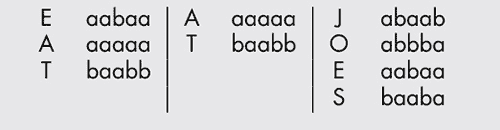
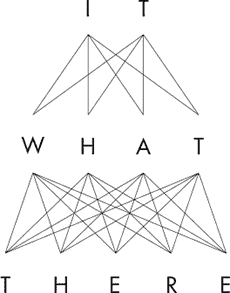
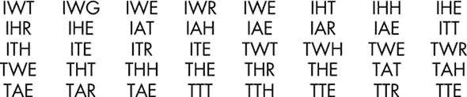
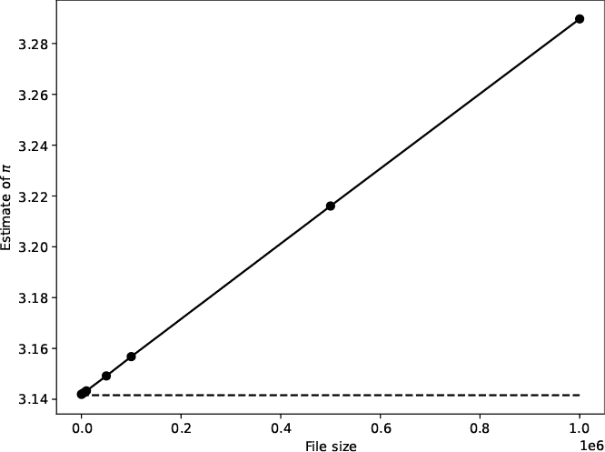
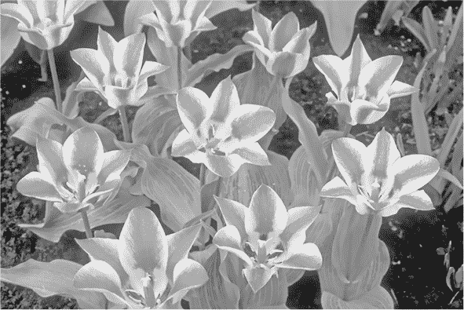
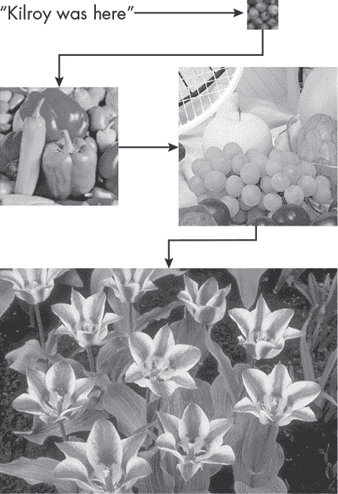

## **2

隐藏信息**


*隐写术*（Steganography），源自希腊语“隐蔽写作”，是一种隐藏信息的艺术，使得敌人无法察觉该信息的存在。与加密术不同，加密术依赖于破解加密算法的困难，而隐写术则依赖于保密性。只要知道如何隐藏信息，任何人都可以读取被隐藏的信息。如果隐藏信息的艺术被称为隐写术，那么*隐写分析*就是检测隐藏信息的过程。这是一个经典的军备竞赛：隐写术专家改进他们的技术，而隐写分析则试图阻止他们。

尽管隐写术可以在任何可以隐藏 0 和 1 的地方存在，但它最常见于文本、二进制文件、音频、视频和图像中。除了视频之外，这些也是我们实验的目标。

### **在字符串中**

本节展示了两个文本实验。第一个使用固定偏移隐藏信息，第二个则使用随机偏移。

**欺骗的简短历史**

隐写术已经存在了很长时间，并且与加密术紧密相连。

公元前 5 世纪，古希腊作家希罗多德讲述了关于米利都的流放暴君赫斯提亚乌斯的故事，米利都位于现代土耳其。他声称赫斯提亚乌斯剃光了一名奴隶的头发，并在他的头皮上刺上了一条信息，然后等待奴隶的头发长回，再将他送往米利都。赫斯提亚乌斯的朋友剃了那名奴隶的头发，并读取了信息——这是一条反对波斯人起义的指令。最终，起义失败，赫斯提亚乌斯的头颅被送给了波斯国王大流士。

1605 年，弗朗西斯·培根爵士开发了一种结合隐写术和加密术的秘密通信方法。首先，培根为字母表中的每个字母设计了一个五位二进制代码。然后，他使用该密码通过对字体做微小修改来隐藏信息，以表示 0 或 1（培根用“a”和“b”代替 0 和 1）。

例如，我们可能会用这种密码隐藏信息“EAT AT JOES”：

```
alIce openeD thE Door anD foUNd ThaT iT LEd inTo a SmaLl passage
aabaa aaaaab aab baaa aab aabba baab ab bba aaba a baaba
```

第一行展示了文本，这是《爱丽丝梦游仙境》中的一行，其中小写字母代表“a”，大写字母代表“b”。实际上，“a”字母使用的字体几乎与“大写 b”的字体相同，但稍有不同。每个信息字母的实际培根密码在第二行显示。为了找出消息，我们将字母按五个一组组织，如下所示：



#### ***固定偏移***

在第一次世界大战期间，一名德国间谍从纽约发出了以下消息：

显然，中立者的抗议完全被忽视和拒绝。伊斯曼遭受重创。封锁问题影响了对副产品的禁运借口，排除了动物脂肪和植物油。

该信件包含一条隐藏的信息。提取每个单词的第二个字母，我们得到：

珀尔辛号从纽约出发，日期为 6 月 1 日。

请注意，我们将最终的“i”解释为“1”。最终，消息变得毫无意义，因为珀辛将船从纽约开出，日期是 5 月 28 日。

尽管使用第二个字母比第一个字母更好，因为它更难意外地发现消息，但安全性仍然较低。然而，这个想法为将消息隐藏在单词串中提供了一个起点。我们从开发一个脚本开始，使用来自 *池文本*（一个包含大量文本的文档，从中选择单词）和每个单词的选定字母偏移来嵌入文本消息。这个示例没有随机性，但它为接下来的实验做了准备。

这是我们的方法：

1.  从单词的开头选择一个字母偏移量。德国间谍为每个单词的第二个字母使用了偏移量为 1。回想一下，计算机科学家使用的是零基计数，从 0 开始，而不是从 1 开始。

1.  通过从池文本（例如一本书）中选择单词来隐藏一个源消息（仅文本），使得每个单词的当前字母就是所选单词的偏移字母。

1.  将生成的单词列表写入磁盘，作为隐藏消息。

我们需要的源代码在 *steg_simple.py* 中。建议在继续之前先查看它。请注意，文件没有导入 `RE`，这里没有任何随机性。

要了解它是如何工作的，这里有一个示例，通过使用偏移量为 2 从 *alice.txt* 中选择单词来隐藏 *message.txt* 的内容：

```
Three may keep a secret, if two of them are dead.
```

使用命令行

```
> python3 steg_simple.py encode 2 message.txt alice.txt output.txt
```

生成以下内容并保存到 *output.txt*：

```
GET SCHOOLROOM VERY THERE ONE COME THAT SAYING LIKE THE
SHE HAPPENED THAT WAS THE NECK WORDS THE LITTLE ALICE
TOFFEE HOT NOW THOUGHT DOOR OFF INTO ASHAMED GREAT
MOMENT TEARS LARGE DEEP AND THE HEARD AND
```

偏移量是基于零的，意味着偏移量为 0 使用第一个字母，因此偏移量为 2 使用第三个字母。考虑到这一点，我们可以看到嵌入的消息是：

```
GET SCHOOLROOM VERY THERE ONE COME THAT SAYING LIKE THE SHE HAPPENED
THAT WAS THE NECK WORDS THE LITTLE ALICE TOFFEE HOT NOW THOUGHT DOOR
OFF INTO ASHAMED GREAT MOMENT TEARS LARGE DEEP AND THE HEARD AND
```

每个下划线字母就是消息的内容：

```
THREE MAY KEEP A SECRET IF TWO OF THEM ARE DEAD
```

首先，*steg_simple.py* 读取消息文件，去除所有不是字母的字符，然后将剩余字符转为大写。结果是一个包含消息中单词的 Python 列表。池文本也会做类似的处理。

接下来，*steg_simple.py* 逐个字母处理消息中的每个单词，通过扫描池文本来查找字母偏移与当前消息字母匹配的单词。每找到一个匹配项，就将其附加到输出的单词列表中。当所有的消息字母都被类似地处理后，输出列表会被写入磁盘。

改变偏移量会修改输出列表；例如，将其设置为 3 会得到如下结果：

```
SITTING NOTHING THERE ITSELF LATE SEEMED STRAIGHT VERY LOOK TRIED
MAKE DROP MANAGED HERSELF AFTER WHICH NEAR MILES SORT LATITUDE ROOF
LITTLE FLOWERS THROUGH THROUGH HALF ANOTHER WITH WISE THEM USUALLY
CHERRYTART PINEAPPLE SAID LIKE CHEATED FOND
```

现在我们已经嵌入了消息，让我们把它取回来：

```
> python3 steg_simple.py decode 2 output.txt tmp.txt
```

*tmp.txt* 文件包含以下内容：

```
THREEMAYKEEPASECRETIFTWOOFTHEMAREDEAD
```

我们丢失了标点和空格，消息以全大写字母形式“喊”出来，但它是可以辨认的。

现在让我们逐步分析这个示例的源代码。输入消息和（如果是编码）池文件都会通过 `ProcessText` 处理，去除非字母字符并返回一个单词列表，如 清单 2-1 所示。

```
def ProcessText(s):
    s = s.upper().split()
    text = []
    for t in s:
        z = ""
        for c in t:
            if (c in "ABCDEFGHIJKLMNOPQRSTUVWXYZ"):
                z += c
        text.append(z)
    return text
```

*清单 2-1：将一串文本转换为一个单词列表*

外部循环处理由第一行（`s`）生成的单词列表。该列表仍然包含非空格字符。内部循环遍历每个单词的字符，构建仅包含字母的版本，并将其附加到`text`中。完成所有操作后，函数返回`text`。

*steg_simple.py* 的底部根据模式解析命令行，是编码还是解码。代码展示在 Listing 2-2 中。

```
offset = int(sys.argv[2])
if (sys.argv[1] == "encode"):
    sfile = sys.argv[3]
    pfile = sys.argv[4]
    dfile = sys.argv[5]
    Encode(offset, sfile, pfile, dfile)
elif (sys.argv[1] == "decode"):
    dfile = sys.argv[3]
    sfile = sys.argv[4]
    Decode(offset, dfile, sfile)
else:
    print("Unknown option")
```

*Listing 2-2: 解析命令行*

所有的操作都在`Encode`和`Decode`中进行。我们先从`Encode`开始，如 Listing 2-3 所示。

```
def Encode(offset, sfile, pfile, dfile):
 ➊ msg = ProcessText(open(sfile).read())
    pool= ProcessText(open(pfile).read())
    enc = []
    idx = 0
 ➋ for word in msg:
        for c in word:
            done = False
            while (not done) and (idx < len(pool)):
                if (len(pool[idx]) <= offset):
                    pass
                elif (pool[idx][offset] != c):
                    pass
                else:
                    enc.append(pool[idx])
                    done = True
                idx += 1
 ➌ with open(dfile, "w") as f:
        f.write(" ".join(enc)+"\n")
```

*Listing 2-3: 编码消息*

首先，`Encode`读取并处理消息和池文本 ➊。接下来是一个三重嵌套的循环 ➋，首先处理消息中的每个单词（`msg`），然后逐个字符处理（`c`），最后在池文本（`pool`）中搜索与偏移字符匹配的单词。池文本的索引（`idx`）最初设置为零，并且之后只会递增，因此每次字符的搜索不会从头开始，而是继续在池文本文件中移动。理论上，这意味着选中的单词集合更加多样化，因为相同的单词不会重复选择以匹配消息中的相同字符。

处理完整个消息后，`enc`按顺序包含了选中的单词。剩下的就是将它们写入磁盘 ➌。注意 Python 的惯用法，通过在字符串常量（一个空格）上调用`join`方法将单词列表转换为单个字符串，最后添加一个换行符。

解码消息的过程相对简单，如 Listing 2-4 所示。

```
def Decode(offset, dfile, sfile):
    enc = ProcessText(open(dfile).read())
    plain = ""
    for w in enc:
        plain += w[offset]
    with open(sfile, "w") as f:
        f.write(plain+"\n")
```

*Listing 2-4: 解码消息*

`Decode`处理编码后的消息文件，生成一个单词列表（`enc`）。然后该函数检查每个单词，提取`offset`字母，并将其添加到`plain`中，这是输出字符串。最后，`Decode`将输出字符串写入解码后的消息文件。

#### ***随机偏移***

之前的实验有效，但并不难被破解。通过一些试验和错误，可以找到偏移并揭示隐藏的信息。我们可以通过随机改变偏移值来稍微提高安全性，使得第一个单词的第三个字母很重要，第二个单词的第五个字母很重要，接着是第一个字母和第三个字母，依此类推。结果仍然不是特别安全，但可能会使得意外发现信息变得困难。

文件*steg_text.py*实现了这种方法，并引入了我们将在本章剩余部分使用的一种技术，即使用固定种子的随机引擎生成一个确定性的随机选择偏移序列。让我们看看这种方法能为我们带来什么。

首先，我们在与关于不共享秘密的引用相同的输入消息上运行*steg_text.py*。在这种情况下，命令行是：

```
> python3 steg_text.py message.txt alice.txt output.txt
Your secret key is 499377
```

请注意“秘密密钥”，它实际上是一个伪随机数生成器种子。没有它，我们无法恢复隐藏的消息。

每次运行 *steg_text.py* 都会生成一个新的 *output.txt* 和秘密密钥。对于之前的运行，*output.txt* 变成了：

```
IT WHAT THERE THE HEAR SEEMED NATURAL VERY SKURRIED HE ALICE UP
DEAR THIS DIFFERENT VOICE CROCODILE WATERS IT THEIR BEFORE THAT
RAILWAY WOODEN SOON HALF SITS CATCHING THE TREMBLING TAIL YOUARE
WENT HUNDRED THE ANIMALS BIRDS
```

这对应于每个单词的偏移量：

```
1132131311412343131323422324231413243
THREEMAYKEEPASECRETIFTWOOFTHEMAREDEAD
```

偏移量是使用报告的种子伪随机选择的，这里的种子是 499,377。

要恢复原始消息，请使用：

```
> python3 steg_text.py 499377 output.txt tmp.txt
> cat tmp.txt
THREEMAYKEEPASECRETIFTWOOFTHEMAREDEAD
```

使用 *steg_text.py* 时，输出更难解析，因为偏移量是随机的。如果我们知道有隐藏消息，就需要付出努力去恢复它，因为每个单词字母的路径有很多种选择。例如，图 2-1 展示了通过前面三个单词的所有路径，总共有 40 种组合。



*图 2-1：通过前三个单词的所有路径*

每个组合如下：



组合 ITH、ITE、TWE、THE、THR、TAR、TAH 是常见英语单词可能的开头，例如：Ithaca、item、tweet、theme、three、tarnish 和 tahini。第四个单词 THE 给每个现有的前缀加了一个字母，其中只有 THRE 和 TART 看起来是合理的。接下来的单词 HEAR 让人清楚地知道，消息的第一个单词很可能是 THREE，或者是 TART 后面下一个单词的开头，假设消息本身没有被加密。

这个示例的源代码类似于 *steg_simple.py*，并使用了清单 2-1 中显示的相同 `ProcessText` 函数。对我们来说，重要的部分是编码器和解码器函数。我们从编码器开始，如清单 2-5 所示。

```
def Encode(mfile, pfile, ofile):
    msg = ProcessText(open(mfile).read())
    pool= ProcessText(open(pfile).read())
  ➊ key = RE(mode='int', low=10000, high=1000000).random()
    rng = RE(mode='int', low=1, high=5, seed=key)
    enc = []
    idx = 0
    for word in msg:
        for c in word:
         ➋ offset = rng.random()
            done = False
            while (not done) and (idx < len(pool)):
                if (len(pool[idx]) <= offset):
                    pass
                elif (pool[idx][offset] != c):
                    pass
                else:
                    enc.append(pool[idx])
                    done = True
                idx += 1
    with open(ofile, "w") as f:
        f.write(" ".join(enc)+"\n")
 ➌ print("Your secret key is %d" % key)
```

*清单 2-5：使用随机偏移进行编码*

和 *steg_simple.py* 一样，消息和池文件会被加载和处理。秘密密钥是使用默认的随机引擎 PCG64 ➊ 选择的。手中有了 `key`，一个新的生成器就会使用 `key` 作为种子（`rng`）进行初始化。

每个消息字母通过在池中搜索匹配的单词来编码，但这次，生成器 ➋ 返回要使用的 `offset`。在所有消息字母处理完毕后，函数会写入最终输出文件并报告秘密密钥 ➌。请比较清单 2-5 和清单 2-3；固定的 `offset` 现在被随机生成的值替代了。

解码器在清单 2-6 中展示。

```
def Decode(key, ofile, mfile):
    enc = ProcessText(open(ofile).read())
    rng = RE(mode='int', low=1, high=5, seed=key)
    plain = ""
    for w in enc:
        plain += w[rng.random()]
    with open(mfile, "w") as f:
        f.write(plain+"\n")
```

*清单 2-6：使用随机偏移进行解码*

秘密密钥构成了生成器的种子；然后，消息按单词解码，每次使用生成器中的下一个值，最后将消息写入磁盘。

有人可能会反对，因为实验中选用的词语虽然是实际存在的词，但并没有形成有意义的句子，这可能会引起对手的注意。我同意这种看法。我的辩护是，简单的程序无法生成有意义的句子，但我们仍然在嵌入一个消息，因此我们仍然遵循隐写术的精神，即便没有完全遵守它的绝对规则。别担心，章节后面的实验会给出明确的结果。

使用文本隐写术只是热身练习，因为我们可以更好地利用数字时代所提供的工具。所以，让我们放弃文本，转向隐藏任意文件到其他文件中的方法。

### **在随机数据中**

在第一章中，我们使用了`ent`工具来帮助我们判断文件是否包含随机数据。在这里，我们将一个任意文件嵌入到一个随机数据的文件中，目的是使得像`ent`这样的工具仍然让我们相信该文件包含随机数据，尽管实际上它不再是随机的。这才是真正的隐写术，因为在嵌入我们希望隐藏的数据之前和之后，文件看起来都是随机的。

为了实现我们的目标，我们需要从比特的角度思考，而不是字符和单词。我们想要隐藏的文件以及池文件，仅仅是一串比特；我们不关心这些比特代表什么。因此，关键是将源文件的比特随机散布到池文件的比特中。

例如，如果我们想要隐藏源比特 11011011 在

110101011000101010010110101011001010010111

然后我们需要将比特随机散布。

110101011001101010010010101011001110010111

以便我们可以稍后恢复随机比特位置，从而重建原始文件。

这种方法适用于池文件比我们想要隐藏的文件大得多的情况。对于任何源比特，我们选择的池文件比特与源比特相同的概率是 50%，因为我们假设池文件是随机的。因此，通过足够的池文件比特和源文件比特的随机分布，我们不认为大多数工具像`ent`会发现文件已被修改。然而，隐藏比特和池文件比特之间的正确比例很难确定。隐藏比特越少越好，但我们可以插入多少比特才不会显得显眼呢？我们将在接下来的实验中简要探讨这个问题。

我们几乎准备好考虑编码问题了。我们的计划是将源文件的比特随机散布到池文件的比特中。我们可以通过使用`RE`和固定的种子值来生成一系列随机偏移值，从而获得随机的比特位置，每个源比特对应一个偏移值。

但虽然我们无疑可以用现有的方法对源文件进行编码，我们能否将它恢复出来？我们从编码文件中读取多少比特？我们并不知道源文件的长度，因此我们不仅需要编码源文件，还需要编码它的长度。

例如，如果源文件长度为 10,356 字节，我们不仅需要编码文件的所有 8 × 10,356 = 82,848 比特，还需要编码文件的字节数。我们将使用 32 比特来编码文件长度，所以我们将编码 82,848 + 32 = 82,880 比特，前 32 个比特表示编码的文件长度（单位：字节）。然后，为了恢复文件，我们读取 32 个比特并形成长度，以便知道要提取多少额外的比特。

让我们来列出步骤。要编码一个文件：

1.  读取源文件并将其转换为比特列表。

1.  在比特列表前添加 32 位，表示源文件的长度。

1.  读取池文件并将其转换为比特列表。

1.  使用提供的密钥作为种子，生成一个随机的偏移位置列表，每个源比特对应一个偏移位置。

1.  在每个偏移位置设置池比特为对应的源比特值。

1.  将池比特转换回字节集合并写入磁盘。

解码文件的方法：

1.  读取编码文件并将其转换为比特列表。

1.  使用提供的密钥作为种子，生成 32 个偏移位置。

1.  计算文件长度和要读取的比特数。

1.  生成那么多比特的偏移位置。

1.  收集这些位置的比特并将它们转换为字节。

1.  将字节写入磁盘，作为提取的文件。

这看起来有点复杂，需要进行一些记录，但最终是直接的：我们将源文件的比特随机散布在池文件中，然后再收集它们以提取源文件。

在我们进入代码之前，我们首先学习如何运行它，以便你能进行实验。使用代码时，我们需要一个要嵌入的文件和一个池文件。本书的 GitHub 仓库包含*RandomDotOrg_sm.bin*，这是一个来自*[random.org](http://random.org)*的 5MB 随机数据文件，经过许可使用。它将作为本例的池文件。如我们所见，`ent`喜欢这个文件：

```
entropy: 7.999969
chi2   : 84.34
mean   : 127.4992
pi     : 3.140270649 (0.04)
corr   : 0.000322
```

至于源文件，请查看目录*test_images*，其中包含了一些标准的图像处理测试图像，涵盖各种类型和大小。我们将在本章后面再次使用这些图像，实验如何将文件隐藏在图像中。目前，我们需要的是*boat.png*，如图 2-2 所示。


*图 2-2：船的图像*

我们需要的代码在*steg_random.py*中。要编码文件，请使用如下命令行：

```
> python3 steg_random.py 12345 test_images/boat.png output.bin data/RandomDotOrg_sm.bin
```

该代码运行大约需要 30 秒。完成后，*output.bin*文件包含了隐藏的图像。`ent`仍然喜欢这个文件吗？它喜欢：

```
entropy: 7.999969
chi2   : 86.38
mean   : 127.4903
pi     : 3.140005417 (0.05)
corr   : 0.000403
```

要恢复图像，请第二次运行*steg_random.py*，使用相同的密钥（12345）：

```
> python3 steg_random.py 12345 output.bin tmp.png
```

现在，文件*tmp.png*包含了船的图像。

*make_random.py*中的代码使用`RE`类中可用的随机数生成器生成随机字节文件。我建议使用这个代码来创建实验所需的池文件。例如，使用以下命令生成一个包含 500 万字节的文件，使用梅森旋转算法：

```
> python3 make_random.py 5000000 none mt19937.bin mt19937
```

与大多数程序一样，运行*make_random.py*而不带参数会告诉我们如何使用该代码。

#### ***你能隐藏多少？***

让我们尝试找出在工具如`ent`给出可疑结果之前，我们可以隐藏多少比特。为此，我们需要使用*steg_random_test.py*中的代码。我让你自己阅读代码；它是一个简单的脚本，执行以下操作：

1.  使用*make_random.py*生成一个 1000 万字节的随机文件

1.  使用*steg_random.py*嵌入越来越大的文件，这些文件仅由重复的字母*A*组成

1.  运行`ent`对结果进行分析，并提取估算的*π*值

1.  绘制*π*的估算值与嵌入文件大小的关系

重复字母*A*创建了一个完全非随机的文件；它尽可能地非随机，熵为零。因此，这是最糟糕的嵌入文件，它会对输出产生最负面的影响。字母*A*本身没有什么特别之处，任何单字节值都可以。

图 2-3 展示了结果。



*图 2-3：嵌入越来越大的*A*重复文件对*π*估算值的影响

*π*的估算值与嵌入的*A*字符数量之间存在线性关系。池文件本身的估算误差为 0.01%，这是不错的。隐藏 50,000 个*A*将误差提升至 0.05%，这通常不会引起注意。然而，100,000 个*A*将误差提高到 0.5%，这开始显得有些可疑。

由于池文件有 1000 万字节，100,000 字节等于 10⁵/10⁷ = 0.01 = 1%，这意味着隐藏小于池文件大小 1%的文件通常不会引起注意。

例如，表 2-1 显示了使用`urandom`生成的 10 百万字节池文件，通过*steg_random.py*隐藏 100,000 字节的结果，这些字节全部是*A*字符，或者是*alice.txt*的前 100,000 个字符，或者是使用`RDRAND`生成的其他随机文件的输出。

**表 2-1：** 按隐藏文件类型估算的*π*值

| **隐藏文件类型** | **估算的*π*值** |
| --- | --- |
| `urandom`池 | 3.142167657 (0.02%) |
| 隐藏`RDRAND` | 3.142429257 (0.03%) |
| 隐藏*alice.txt* | 3.146091658 (0.14%) |
| 隐藏*A*字符 | 3.157525263 (0.51%) |

这些结果表明，对于一个大小为池文件 1%的隐藏文件，我们应该期待像`ent`这样的工具在与非随机性相关的度量指标上显示出轻微的增加，比如在估算*π*时出现更大的误差。请注意，*alice.txt*是一个文本文件，因此我们可以期待二进制文件的效果会更好。故事的寓意是：将你的数据隐藏在一个至少比数据本身大 100 倍的随机文件中。

现在让我们看一下代码。

#### ***steg_random.py 代码***

*steg_random.py*中的代码比我们目前使用的代码稍微复杂一些。我建议在继续之前先复习一下*steg_random.py*。你会看到两个工具函数，`MakeBit`和`MakeByte`。我们将在这里和后续的章节中使用这些函数，所以在继续编码和解码函数之前，我们先来定义它们。

##### **位与字节之间的转换**

我们打算处理位和字节，所以拥有可以相互转换的函数会很有帮助。这就是`MakeBit`和`MakeByte`的作用。列表 2-7 展示了`MakeBit`。

```
def MakeBit(byt):
    b = np.zeros(8*len(byt), dtype="uint8")
    k = 0 
    for v in byt:
        s = format(v, "08b")
        for c in s:
            b[k] = int(c)
            k += 1
    return b
```

*列表 2-7：将字节转换为位*

参数（`byt`）是我们希望转换为输出位数组（`b`）的字节数组。每个字节包含八个位，因此我们提前定义了`b`，然后使用`for`循环逐一处理`byt`中的字节来填充它。

对于每个字节，我们要求 Python 将其转换为二进制字符串（`s`），并且特别注意前导零。然后，我们使用不断增加的索引（`k`）将每一位放入输出数组中，最后返回给调用者。

我们还需要将位数组转换回字节数组；`MakeByte`在列表 2-8 中展示。

```
def MakeByte(b):
    n = len(b)//8
    t = b.reshape((n,8))
    byt = np.zeros(n, dtype="uint8")
    for i in range(n):
        v = (t[i] * np.array([128,64,32,16,8,4,2,1])).sum()
        byt[i] = v
    return byt
```

*列表 2-8：将位转换为字节*

参数是一个位数组（`b`），因此其长度将是 8 的倍数。因此，`n`是我们在输出数组中需要的字节数。为了得到字节，我们首先将`b`重新排列，将每八个位分为一组。换句话说，如果数组是一个包含 32 位的向量

```
11010101001011101101011001010100
```

它变成了

```
11010101
00101110
11010110
01010100
```

在`t`中，是一个 4×8 的位数组，表示 4 个字节。

接下来，我们将`t`的每一行与表示字节中每个位的位值的向量相乘。最后，我们将得到的向量求和，得到实际的字节值（`v`），并将其放入输出数组`byt`中。

现在，让我们来学习如何将位隐藏在随机文件中。

##### **文件编码**

文件的编码通过巧妙命名的`Encode`函数完成：

```
def Encode(key, sfile, dfile, pfile):
    src = np.fromfile(sfile, dtype="uint8")
    s = format(len(src), "08x")
    b3 = int(s[0:2],16);  b2 = int(s[2:4],16)
    b1 = int(s[4:6],16);  b0 = int(s[6:8],16)
    src = MakeBit(np.hstack(([b3,b2,b1,b0],src)))

    step = RE(mode="int", low=1, high=16, seed=key).random(len(src))
    idx = [step[0]]
    for i in range(1, len(step)):
        idx.append(idx[-1]+step[i])

    pool = MakeBit(np.fromfile(pfile, dtype="uint8"))
    if (len(pool) <= idx[-1]):
        print("Pool file is too small")
        exit(1)

    for i in range(len(src)):
        pool[idx[i]] = src[i]

    dest = MakeByte(pool)
    dest.tofile(dfile)
```

我们的目标是将源文件（`sfile`）的位随机地分散到池文件（`pfile`）的位中，并将结果输出到目标文件（`dfile`）。生成器的种子存储在`key`中。

在第一个代码段中，我们将源文件读取到字节数组（`src`）中。如前所述，我们还需要编码文件的长度，我们通过将字节数表示为十六进制字符串（`s`）来完成。我们使用一个无符号的 32 位整数作为文件长度，因此我们只能隐藏小于 4,294,967,296 字节的文件。这应该不会成为问题。表示长度的各个字节从`src`中提取出来，并按从最高有效位（`b3`）到最低有效位（`b0`）的顺序解释为十六进制数。由于`src`仍然是一个字节向量，我们通过使用 NumPy 的`hstack`函数将长度的 4 个字节加到开头。最后，我们使用`MakeBit`将`src`转换为位向量。

在第二段代码中，我们构建了`idx`，它是一个不断增加的偏移量向量，每个位对应`src`的一个偏移量。这些是`pool`中的位置，将用`src`的位值进行更新。首先，`step`是一个偏移量向量，从 1 到 15 位不等。注意使用`key`来设置种子。`idx`向量是通过将每个偏移量添加到`idx`的最后一个元素，然后再将新的偏移量附加到`idx`来构建的。

第三段代码读取池文件作为位向量（`pool`）。如果池文件太短，无法容纳`idx`中的所有位偏移位置，程序将显示简洁的消息并立即终止。

目前，我们拥有所需的一切：`src`作为位，`pool`作为位，`idx`告诉我们`src`的位应该放到哪里。因此，第四段代码是一个简单的循环，将`pool`的正确位设置为`src`的对应位。我们按顺序遍历`src`，同时遍历`idx`，但`idx`中的值是`pool`中需要更新的位置。

最后一段将更新后的`pool`转换为字节向量并写入目标文件（`dfile`）。

我们可以正式对文件进行编码；现在让我们把它解码回来。

##### **解码文件**

解码文件使用了一个同名的`Decode`函数：

```
def Decode(key, sfile, dfile):
    src = MakeBit(np.fromfile(sfile, dtype="uint8"))

    rng = RE(mode="int", low=1, high=16, seed=key)
    step = rng.random(32)
    bits = []
    idx = [step[0]]
    for i in range(1, len(step)):
        idx.append(idx[-1]+step[i])
    for i in range(len(idx)):
        bits.append(src[idx[i]])
    n = MessageLength(bits)

    offset = idx[-1]
    step = rng.random(8*n)
    idx = [offset + step[0]]
    bits = []
    for i in range(1, len(step)):
        idx.append(idx[-1]+step[i])
    for i in range(len(idx)):
        bits.append(src[idx[i]])
    dest = MakeByte(np.array(bits))
    dest.tofile(dfile)
```

在这里，`sfile`是由`Encode`生成的文件名，`dfile`是所需的输出文件名。请注意，`key`必须与用于编码的值匹配。

代码首先读取编码后的文件，并立即将其转换为位向量（`src`）。

在接下来的代码段中，创建了正确设置种子的生成器（`rng`）。请注意`RE`的实例化：整数类型，默认的 PCG64 生成器，位范围从 1 到 15，并使用种子。这是编码时使用的配置，因为它必须一致。

通过将`step`中的 32 个值添加到`idx`中的每个最终偏移量中，提取前 32 个编码位，方法与`Encode`类似。得到的`bits`被传递到辅助函数`MessageLength`中，参考列表 2-9。

```
def MessageLength(bits):
    b = MakeByte(np.array(bits))
    n = 256**3*b[0] + 256**2*b[1] + 256*b[2] + b[3]
    return n
```

*列表 2-9：将 32 位转换为无符号整数*

该函数将 32 位向量转换为 4 字节的字节向量（`b`）；按正确的位值依次乘以每个字节，从最高位字节开始；然后相加得到实际的编码文件长度（以字节为单位，`n`）。处理 32 位值的字节与将其视为基数为 256 的数字类似，因此使用了 256 的指数。

在最后一段中，计算编码文件剩余部分的位位置，就像之前一样从`step`和`idx`计算，但我们需要加上额外的偏移量来考虑已经读取的 32 位。`idx`构建完成后，立即用于提取`bits`。所有收集到的位被转换为字节（`dest`），最终输出到文件（`dfile`）。

呼！在*steg_random.py*中发生了很多事情。幸运的是，大部分内容可以转移到本章的剩余两节，那里我们将数据隐藏到音频文件和图像中。让我们学会小心地低语，这样除非我们希望别人听见，否则没人能听到我们的声音。

### **在音频文件中**

数字音频无处不在，是隐写术的天然目标。本节探讨如何将文件嵌入到数字音频中，特别是 WAV 文件。我们的方法与上一节类似：我们将把文件的位散布到数字样本中。然而，区别在于，我们不会改变随机的位，而是改变最低有效位，以最小化影响，使得信息几乎是静默的。

我们需要的文件是*steg_audio.py*。在继续之前，务必检查一下这个文件。你会注意到它使用了`MakeBit`和`MakeByte`，这些我们之前已经使用过——分别参见清单 2-7 和 2-8。同样，你还会看到`MessageLength`（清单 2-9）。

我们在第一章中讨论了数字采样，当时我们从麦克风输入生成随机位。那时，我们需要 32 位浮点数样本。在这里，我们将使用更常见的有符号 16 位样本，范围为[–32,768, 32,767]。这种样本每个使用两个字节。我们将限制只改变最低有效位，从而使样本值最多改变 1，听不出任何差别。

WAV 文件未压缩，因此可能相当大。大多数互联网音频是 MP3 格式的，这种格式采用*有损压缩*。人类听觉系统并不需要所有原始音频样本中的信息——大约 90%的信息可以丢弃，这就是所谓的“损失”。然而，由于我们计划使用最简单的音频隐写方法，并且如果文件转换为 MP3 格式，隐藏的文件将会丢失，因此我们必须使用完整的 WAV 文件。有更复杂的音频隐写方法使用回声等特征，它们能在压缩过程中生存下来，但这些内容超出了本书的范围。

该算法的需求与上一节的需求非常相似：

1.  读取源文件并将其转换为位，以及文件的字节长度。

1.  读取原始 WAV 文件，确保源文件能适配，并且如果是立体声，只使用一个声道。

1.  生成一个随机但不断增长的索引列表，指向 WAV 样本中的每一位，代表源文件的每一位。

1.  改变选定样本的第 0 位，使其与相应的源文件位匹配。

1.  将修改后的音频样本写入一个新的音频文件。

我们首先将使用代码隐藏文件，然后再探索代码本身。

#### ***一个安静的现场表演***

在详细讲解代码之前，让我们先试试 *steg_audio.py*。本书的 GitHub 仓库提供了几种示例 WAV 文件，由作曲家 Paul Kneusel 提供 (*[`www.paulkneusel.com`](https://www.paulkneusel.com)*)。首先，让我们在 *Fireflies* 中隐藏一张图像，这是一首 2016 年由钢琴家 Kristen Kosey 演奏的现场表演曲目。*Fireflies* 是一首安静的曲子，从而增加了我们可能听到由样本改变所产生的效果的概率。以下是命令行：

```
> python3 steg_audio.py 2718281828 test_images/tulips_gray.png tmp.wav Fireflies.wav
Using 3712480 samples to store the file
```

首先，我们提供秘密密钥 2718281828，然后是要嵌入的文件 *tulips_gray.png*，接着是输出文件名 *tmp.wav*，最后是源 WAV 文件 *Fireflies.wav*。代码告诉我们它用了 3,712,480 个样本来存储 *tulips_gray.png* 的比特。能够识别秘密密钥的读者会得到额外积分。

与之前一样，我们使用相同的代码恢复隐藏的文件：

```
> python3 steg_audio.py 2718281828 tmp.wav tmp.png
```

这会生成 *tmp.png*，即在 图 2-4 中显示的原始图像文件。



*图 2-4：恢复的图像*

播放输出文件 *tmp.wav*。仔细听，尝试辨别 *tmp.wav* 和原始文件 *Fireflies.wav* 之间的差异。图像文件被巧妙地隐藏，几乎无法察觉。这就是隐写术的本质：不被察觉。

好的，*steg_audio.py* 可以工作，但它到底做了什么？我们需要将每个样本的最低有效位改为与我们隐藏的文件对应的比特。让我们查看 *tulips_gray.png* 的前八个比特，以及对应的样本偏移量和样本值，如 表 2-2 中所示。

**表 2-2：** *tulips_gray.png* 的前八个比特与偏移量和样本

|   | **0** | **1** | **2** | **3** | **4** | **5** | **6** | **7** |
| --- | --- | --- | --- | --- | --- | --- | --- | --- |
| **比特** | 1 | 0 | 0 | 0 | 1 | 0 | 0 | 1 |
| **偏移量** | 35 | 36 | 50 | 68 | 85 | 90 | 92 | 99 |
| **样本** | 65,533 | 5 | 7 | 65,532 | 65,535 | 65,532 | 5 | 65,534 |

样本 35 的值为 65,533，我们希望样本 35 的最低有效位为 1。同样，样本 36 的值为 5，我们希望其最低有效位为 0，以此类推。

我们之前讨论过，WAV 文件使用的是范围为 [–32,768, 32,767] 的有符号 16 位整数。这是正确的，但当我们读取音频样本时，为了避免处理负数，我们将其解释为范围为 [0, 65,535] 的无符号整数。我们将在写入输出 WAV 文件之前，再将解释方式改回有符号 16 位整数。

我们希望样本 35 当前为 65,533，使其第一个比特为 1。为此我们有几种选择。一个方法是使用低级位操作。但请注意，当整数的第 0 位为 1 时，数字为奇数，而当第 0 位为 0 时，数字为偶数。在这种情况下，65,533 已经是奇数，意味着第 0 位已经是 1，所以我们可以保持样本不变。

第二个样本当前值为 5，但我们希望位 0 为 0。由于 5 是奇数，我们减去 1 使新样本值变为 4，且位 0 为 0，符合我们的要求。这个过程会对我们要隐藏的文件中的每个位重复进行。样本的最低有效位要么已经正确，要么偏差 1，需要加 1 或减 1。总结一下：只有当我们需要样本为奇数时才加 1；同样，只有当我们需要样本为偶数时才减 1。

让我们回到我之前关于图像文件“完全不可察觉”的傲慢说法。假设对手获取了原始的*Fireflies*声音文件。对样本进行逐比特比较可能会提供一些线索，表明有些异常，但我们仅在需要更改样本时才会进行更改。因此，单纯提取可疑 WAV 文件和原始文件之间不同的样本，不足以发现隐藏的文件，因为平均来说，只有一半的样本需要被修改。换句话说，没有关于所用样本分布的知识，原始文件很难恢复。

如果对手只有修改过的 WAV 文件呢？在这种情况下，一个精明的对手如果怀疑存在隐写术，可能会认为样本的最低有效位（least-significant bit）是最可能被改变的，因为修改其他位会在播放 WAV 文件时产生噪音，但实际上并未出现噪音。这种怀疑可能促使对手检查位 0 在样本中的分布，并与其他 WAV 文件进行对比。

如果你运行*steg_audio_test.py*，你会看到以下输出：

```
Fireflies: [5104781 5103286] 0.6398434737379124
Attitude : [1863322 1860129] 0.09798008575083986
Fun-Key  : [1664208 1661616] 0.15522993473071336
Encoded  : [5093639 5114428] 7.681149082012241e-11
```

每行报告了对应 WAV 文件中位 0 的分布情况。例如，*Fireflies.wav*中有 5,104,781 个偶数样本和 5,103,286 个奇数样本（仅针对通道 0）。每行的最后一个值是*χ*²检验的 p 值，该检验用于判断样本的偶数和奇数计数是否符合预期，即样本的偶奇性是否随机。只有 p 值的前几个数字才有意义。

请记住，p 值大于 0.05 表示支持零假设，即样本是偶数或奇数的可能性相同。Fireflies、Attitude 和 Fun-Key 的 p 值与零假设的结果高度一致。

最后一行，`Encoded`，显示的是*tmp.wav*的分布情况，这是带有*tulips_gray.png*文件隐藏其中的 Fireflies 版本。此时，p 值为 7 × 10^(–11)，这是接近 0 的最好的近似值。换句话说，*χ*²检验告诉我们，位 0*不*符合零假设——而且偏差极大。看到这些结果后，我们的对手会确信有些不对劲。

那么，我的傲慢是否合理呢？不，完全不合理。一项简单的统计测试，再加上一些关于如何在 WAV 文件中隐藏信息的思考，强有力地支持了这种观点：这个 WAV 文件已经被篡改。而且，尽管我们的对手强烈怀疑我们篡改了 WAV 文件，但他们依然无法提取信息，因为他们不知道*哪一*位被改变了。

我鼓励你尝试使用*steg_audio.py*和手头的 WAV 文件。当你准备好时，继续阅读以跟随代码的讲解。

#### ***steg_audio.py 代码***

*steg_audio.py*文件包含五个函数和底部的一个小驱动程序。我们已经熟悉了`MakeBit`、`MakeByte`和`MessageLength`函数（见清单 2-7，2-8 和 2-9）。

剩下的两个函数是`Encode`和`Decode`。你可能会注意到一个趋势。*steg_audio.py*的整体结构与*steg_random.py*的结构相匹配。让我们仔细看看`Encode`，跟踪这个过程。最好分段吸收这个函数，所以清单 2-10 展示了第一部分。

```
def Encode(key, sfile, dfile, pfile):
    src = np.fromfile(sfile, dtype="uint8")
    s = format(len(src), "08x")
    b3 = int(s[0:2],16);  b2 = int(s[2:4],16)
    b1 = int(s[4:6],16);  b0 = int(s[6:8],16)
    src = MakeBit(np.hstack(([b3,b2,b1,b0],src)))

    sample_rate, wav = wavread(pfile)
    if (wav.ndim == 2): 
        samples = wav[:,0].astype("uint16")
    else:
        samples = wav.astype("uint16")

    if (len(src) > len(samples)):
        print("The input WAV file is too short")
        exit(1)
    else:
        print("Using %d samples to store the file" % len(src))
```

*清单 2-10：在音频文件中隐藏数据（第一部分）*

清单 2-10 的第一段与*steg_random.py*中的对应代码相同。嵌入的文件在预先添加文件大小（以字节为单位，`src`）后被加载并转换为比特。

第二段读取音频文件，保持采样率（`sample_rate`）和原始样本作为有符号 16 位整数（`raw`）。接着，`if`语句将样本解释为无符号 16 位整数，同时如果有多个通道，则选择通道 0。最终结果是`samples`，即我们要更新的实际值。第三段是一个合理性检查，用来验证是否有足够的样本来隐藏源文件。

清单 2-11 展示了`Encode`的其余部分。

```
    step = RE(seed=key, mode="int", low=1, high=5).random(len(src))
    idx = [step[0]]
    for i in range(1, len(src)):
        idx.append(idx[-1]+step[i])

    if (len(samples) <= idx[-1]):
        print("Audio file too short")
        exit(1)

    for i in range(len(src)):
        if (src[i] == 0): 
            if ((samples[idx[i]] % 2) == 1): 
                samples[idx[i]] -= 1
        else:
            if ((samples[idx[i]] % 2) == 0):
                samples[idx[i]] += 1

    out = samples.astype("int16")
    if (wav.ndim == 2):
        wav[:,0] = out
        wavwrite(dfile, sample_rate, wav)
    else:
        wavwrite(dfile, sample_rate, out)
```

*清单 2-11：在音频文件中隐藏数据（第二部分）*

准备好样本后，我们可以开始隐藏一些数据。首先，我们使用提供的密钥（`step`）创建一个偏移量向量。我们在*steg_random.py*中也做了同样的事。这些偏移量用于构建`idx`，一个要修改的样本向量。最终的合理性检查确认了有足够的样本。

第二个`for`循环设置所选样本的最低有效位，根据当前位（`src[i]`）的值，必要时将其改为奇数或偶数。

循环体需要一些解释。如果当前源位是 0，那么当前样本（`samples[idx[i]]`）有两种可能性。如果样本是奇数，即除以 2 后的余数为 1，我们从样本中减去 1 使其变为偶数。否则，我们要存储的位是 1，这意味着我们检查样本是否为偶数，如果是的话，我们加 1 使其变为奇数。

最后一段将样本重新解释为有符号整数（`out`），并使用原始采样率将其写入磁盘。如果音频文件是立体声，则更新通道 0，其他通道保持不变。

要提取隐藏的文件，我们使用`Decode`逆向该过程，如列表 2-12 所示。

```
def Decode(key, sfile, dfile):
    sample_rate, wav = wavread(sfile)
    if (wav.ndim == 2):
        samples = wav[:,0].astype("uint16")
    else:
        samples = wav.astype("uint16")

    rng = RE(mode="int", low=1, high=5, seed=key)
    step = rng.random(32)
    bits = []
    idx = [step[0]]
    for i in range(1, len(step)):
        idx.append(idx[-1]+step[i])
    for i in range(len(idx)):
        bits.append(samples[idx[i]] % 2)
    n = MessageLength(bits)

    offset = idx[-1]
    step = rng.random(8*n)
    idx = [offset + step[0]]
    bits = []
    for i in range(1, len(step)):
        idx.append(idx[-1]+step[i])
    for i in range(len(idx)):
        bits.append(samples[idx[i]] % 2)

    msg = MakeByte(np.array(bits))
    msg.tofile(dfile)
```

*列表 2-12：解码隐藏在音频文件中的数据*

该过程包括四个步骤：读取编码的 WAV 文件作为无符号整数样本，生成与编码文件时使用的相同的索引集，提取位并将其写入磁盘。

在第二段中，伪随机生成器被配置为与`Encode`中相同，然后生成前 32 个步骤值以提取编码的文件长度。我们需要文件长度来确定重构隐藏文件时需要查询多少样本。注意对`MessageLength`的调用，列表 2-9。

在第三段中，文件的实际位已经被提取出来，因为我们现在知道它们的数量。最后，这些位被转换为字节并写入输出文件（`dfile`）。

接下来我们尝试在图像中隐藏数据。这个过程类似于在随机字节文件或音频文件中隐藏数据，但我们将不再使用秘密密钥的概念。

### **图像文件中的内容**

本章的最后实验是将文件隐藏在图像中。这个方法应该很熟悉：我们通过对现有像素颜色做小的改变，将文件的位分散到图像的像素中。这是最紧凑的实验，就代码而言，但在深入之前，我们需要讨论一些关于数字图像的内容。具体来说，我们需要了解计算机如何存储和解读图像，然后我将介绍算法。实验之后是代码讲解。你知道流程。

#### ***定义图像格式***

“图像格式”这一术语有多重含义，特别是在使用 Python 时。

第一个提到的是图像如何存储在磁盘上。存储方式有很多选项，主要可以分为两大类：有损和无损。

有损图像格式通过丢弃信息进行压缩，类似于 MP3 文件。保留的信息足以将图像重构到一定程度的原始图像保真度。最常见的有损图像格式是 JPEG，通常具有*.jpg*文件扩展名。该格式使用离散余弦变换（DCT）对小块进行处理，以保留重要的细节层级，同时丢弃那些对图像重构贡献不大的部分。

无损图像格式要么保留所有像素信息，要么无损压缩图像，这意味着恢复的数据与原始未压缩图像在逐位上完全一致。最常见的无损图像格式是 PNG（*.png*）。我们将仅使用 PNG 文件，因为像 JPEG 这样的有损格式不被接受，原因与 MP3 文件相同：对图像进行的细微更改会丢失。先进的隐写术技术对有损格式是强大的，但它们远超我们在这里可以探索的范围。

“图像格式”还指的是像素本身，主要的划分为灰度图像和彩色图像。

灰度图像是最简单的：每个像素是一个单独的数字，一个字节，表示从黑色（0）到白色（255）以及其中的灰色阴影的像素强度。16 位像素的灰度图像很少见，因此我们在这里将忽略它们。

计算机在表示彩色图像时有许多选择。最常见的是将每个像素的颜色分为红色、绿色和蓝色的组合。也就是说，一个显示为淡红色的像素可以表示为红色、绿色和蓝色的混合，得到了这种颜色。红色、绿色和蓝色的 *通道* 通常是字节，0 表示没有这种颜色，255 是该颜色的最大强度。例如，淡红色是 `A94141`，这是表示红色、绿色和蓝色数量的三个十六进制数。将十六进制转换为十进制，我们得到 169（红色，最大值为 255）、65（绿色）和 65（蓝色）。

#### ***使用 NumPy 和 PIL***

对 NumPy 来说，灰度图像是一个 2D 字节数组。同样，彩色图像或 RGB 图像是一个 3D 字节数组——每个颜色通道对应一个 2D 数组。我们将使用 RGB 图像进行接下来的实验。如果加载的是灰度图像，它将通过复制灰度值到每个通道来转换为 RGB。

NumPy 将图像作为数组使用，但我们如何将它们首先导入到 Python 中呢？为此，我们需要 *Python 图像库 (PIL)*，现在称为 *Pillow*。它包含在大多数 Linux 发行版中，并且适用于 Windows 和 macOS。对于 Linux 和 macOS，输入以下内容：

```
> pip install pillow
```

任何 8.4 或更高版本都应该能工作。我们只需要它来读取和写入图像文件。

本书的 GitHub 页面包括一系列标准测试图像。我们已经使用了其中的一些，而没有将它们导入到 Python 中。现在让我们来解决这个问题：

```
>>> import numpy as np
>>> from PIL import Image
>>> im = Image.open("apples.png")
>>> d = np.array(im)
>>> d.shape
(352, 375, 3)
>>> im = Image.open("barbara.png")
>>> d = np.array(im)
>>> d.shape
(256, 256)
>>> im = Image.open("barbara.png").convert("RGB")
>>> d = np.array(im)
>>> d.shape
(256, 256, 3)
```

在这里，我展示了 Python 提示符和手动输入的命令。前两行加载了 NumPy 和 PIL 的 `Image` 类。我们只需要 `Image`。

接下来的两行将文件 *apples.png* 加载到 `im` 中，这是 `Image` 类的一个实例。为了将图像转换为 NumPy 数组，将其传递给 `np.array` 创建 `d`。注意 `d` 的形状：（352，375，3）。该图像有 352 行（即高度）和 375 列（即宽度）。最后的维度是 3，表示红色、绿色和蓝色通道。

以下两行加载*barbara.png*并将其转换为 NumPy 数组。在这种情况下，数组只有两个维度：高度和宽度，都是 256。这是一个具有一个通道的灰度文件。

最后三个命令再次加载*barbara.png*，但立即将图像传递给`Image`的`convert`方法，将其转换为 RGB 图像。NumPy 数组现在具有三维，虽然作为灰度图像，每个颜色通道都是相同的。

尽管已经有很多书籍介绍了 Python 中的图像处理，但幸运的是我们只需要知道如何打开图像文件，确保它是 RGB，转化为 NumPy 数组，并将 NumPy 数组以图像的形式写入磁盘。继续之前的例子：

```
>>> d = np.array(Image.open("apples.png"))
>>> t = d[:,:,0]
>>> d[:,:,0] = d[:,:,1]
>>> d[:,:,1] = t
>>> im = Image.fromarray(d)
>>> im.save("bad_apples.png")
```

第一行重新读取*apples.png*，然后立即将其转换为 NumPy 数组。我们将始终使用这种习惯用法。

接下来的三行交换红色和绿色颜色通道。仔细阅读它们。由于 NumPy 将第三个索引作为通道，我们需要明确提到高度和宽度。

下一行使用`Image`的`fromarray`方法将`d`转换为`Image`对象：`im`。最后一行使用`save`方法将修改后的图像保存为*bad_apples.png*。PIL 使用文件扩展名来指定格式，在这种情况下是 PNG 文件。打开*bad_apples.png*来了解为什么我选择这个名字。

#### ***隐藏比特到像素中***

为了将隐藏文件的比特散布到图像的像素中，我们需要加载源文件并使用*MakeBit*将其转换为比特。然后我们加载图像文件，确认它是 RGB 图像，并将其转换为 NumPy 数组。

我们之前的实验修改了池文件的比特，使其与源文件的比特匹配。对池文件的随机偏移序列是可重现的，因为我们将随机引擎的种子设置为密钥。虽然我们可以在这里做同样的事情，但我们将采取不同的方法。正如他们所说，生活需要一些变化。

我们将使用未修改的图像作为我们的密钥。当隐藏文件时，我们将初始化随机引擎，但不设置种子，这意味着每次运行代码时，隐藏的文件会在图像的不同位置。由于我们修改的是特定的比特，因此我们通过使用未修改的图像可以知道我们修改了哪些比特。为了简化，我们将像处理音频样本时一样：每个图像文件的字节隐藏一个文件的比特。

尽管我们可以设置像素的最低有效位，就像我们对音频文件所做的那样，但我们永远无法检测到图像像素是否已经有正确的比特值。由于我们放弃了密钥以获得每次运行不同的修改像素集，我们永远无法知道哪些像素碰巧已经有了正确的比特值。

与其寻找像素的第 0 位是 0 还是 1，或者等效地询问该像素是偶数还是奇数，我们通过将 1 加到像素值来编码 0 位，将 2 加到像素值来编码 1 位。在这种情况下，未修改的图像中任何与修改后图像对应像素不同的像素，都会存储隐藏文件的一位。

在 RGB 图像中，每个像素实际上有三个字节；我们可以修改其中任何一个。当我们实现这个算法时，我们将通过要求 NumPy 将三维数组转换为一个单一的向量来“解开”图像，这是图像数据在计算机内存中的存储方式。红色、绿色和蓝色字节在解开的数组中的位置并不重要，只要 NumPy 能够保证这个过程是可重复的，而它做到了。

将图像字节作为一个向量后，我们选择一个位置子集——与隐藏文件中的位数一样多——并通过加 1 来修改它们，如果相应的位是 0，或者加 2 如果该位是 1。

字节是无符号数字，范围在[0, 255]之间，这意味着如果像素值是 255，我们加 1 来编码 0 时，将回绕到 0（或者加 2 编码 1 时回绕到 1）。这可不行，所以我们做出了一个决策：在编码之前，我们将所有大于 253 的图像像素字节修改为 253，这样加 1 后变成 254，加 2 后变成 255，从而避免溢出。

我们能够修改图像像素字节有两个原因：首先，代码每次都会为未修改的图像执行这一操作，即使在解码时也是如此，因此这是可重复的；其次，因为字节表示的是颜色值，255 与 253 之间的差异太微妙，以至于无法看出，特别是在整体颜色强度或阴影有全局变化时。

生成的代码是*steg_image.py*，我鼓励你在继续阅读之前先研究一下它。我们将在实验后逐步讲解这段代码。

这种方法与音频方法一样脆弱。如果我们使用有损图像格式（如 JPEG）存储编码后的图像，我们将丢弃编码。我们可以使用 JPEG 作为原始图像，因为 NumPy 每次都会以相同的方式解码它，但这甚至可能存在风险，因为未来版本的 NumPy 可能会改变解码图像时使用的算法（虽然这种可能性不大，但确实存在）。再次强调，我们将仅限于使用无损压缩的 PNG 文件。

现在，让我们玩得开心一点吧！

#### ***在一张图像中隐藏另一张图像***

在我们的第一次实验中，我们将在第二张图像（*apples.png*）中隐藏一张图像（*cameraman.png*）。我们需要的命令行是：

```
> python3 steg_image.py encode test_images/cameraman.png test_images/apples.png tmp.png
```

我们告诉*steg_image.py*我们要编码，然后提供要编码的文件（*cameraman.png*），接着是参考图像（*apples.png*）和输出图像文件（*tmp.png*）。

打开*apples.png*和*tmp.png*，仔细观察，如果你的软件允许，可以快速切换两者。你看到有什么区别吗？仔细检查可能会发现一些差异，但我眼睛并没有察觉到什么。

要恢复*cameraman.png*，请使用：

```
> python3 steg_image.py decode tmp.png test_images/apples.png output.png
```

*cameraman.png* 文件是 *apples.png* 大小的 16%，并且轻松地隐藏在苹果图像中。那么文件有多大时我们才能察觉到它？

如果你运行 *steg_image_test.py*，你会得到一个新的输出目录 *steg_image_test*，其中包含多个图像，文件名类似 *apple_A_0.60.png* 和 *violet_rand_0.40.png*。这些文件是图像，每个图像隐藏了特定数量的 *A* 字符或从 `RDRAND` 读取的随机数据。文件名的第一部分是测试图像来源，*apples.png* 或 *violet.png*。后者是一个 512×512 像素的淡紫色图像。

每个文件名中的分数表示用于存放编码数据的参考像素图像的比例。例如，*apple_A_0.60.png* 隐藏了字母 *A*，因此 *apples.png* 中 60% 的像素已经被修改。比例从 5% 开始，一直到 99%。查看这些输出文件，尤其是紫色文件。即使 99% 的像素已经被修改成相同的字节重复或高度随机的字节，我们仍然无法察觉输出图像文件与原始图像之间的区别。这是不可察觉的隐写术的一个例子。为了简洁起见，我不会详细讨论 *steg_image_test.py*，但请你一定看看它。

我们已经将一张图像隐藏在另一张图像中。那我们为什么不能将一条消息隐藏在一张图像中，再把这张隐藏有消息的图像隐藏在另一张图像中，依此类推，最终生成一张包含俄罗斯套娃图像的输出图像呢？为什么不呢？让我们来试试。

我们要运行的脚本在 *russian_dolls_example* 中，详见 清单 2-13。

```
echo "Encoding..."
python3 steg_image.py encode kilroy.txt       test_images/apples_32.png   /tmp/encode0.png
python3 steg_image.py encode /tmp/encode0.png test_images/peppers_128.png /tmp/encode1.png
python3 steg_image.py encode /tmp/encode1.png test_images/fruit2.png      /tmp/encode2.png
python3 steg_image.py encode /tmp/encode2.png test_images/tulips.png      russian_dolls.png
echo "Decoding..."
python3 steg_image.py decode russian_dolls.png test_images/tulips.png      /tmp/decode0.png
python3 steg_image.py decode /tmp/decode0.png  test_images/fruit2.png      /tmp/decode1.png
python3 steg_image.py decode /tmp/decode1.png  test_images/peppers_128.png /tmp/decode2.png
python3 steg_image.py decode /tmp/decode2.png  test_images/apples_32.png   output.txt
```

*清单 2-13：编码和解码俄罗斯套娃*

这是一个你可以运行的 Shell 脚本：

```
> sh russian_dolls_example
```

完成后，查看带有所有嵌套图像和原始消息的图像 *russian_dolls.png*。然后将源文件 *kilroy.txt* 与 *output.txt* 进行比较，看看它们是否相同。编码过程每个阶段的中间图像保存在系统的 *tmp* 目录中。

图 2-5 展示了构建俄罗斯套娃堆的过程。



*图 2-5：构建俄罗斯套娃堆*

首先，“Kilroy was here”这条文本消息被隐藏在苹果图像的小版本中。然后，该图像被隐藏在辣椒图像中，辣椒图像又被隐藏在水果图像中，最终这些都被隐藏在郁金香图像中作为最终输出。逆向这个过程，逐步解码，就能得到原始信息：“Kilroy was here”。

**注意**

*“Kilroy was here”这句话在二战期间被美英军队使用，部分作为玩笑，部分作为标记他们已经到过的地方。战后它成为了一种早期的网络迷因，通常会伴随一个傻乎乎的角色面孔。*

让我们一起走一遍代码，看看 Kilroy 出现过的地方。

#### ***steg_image.py 代码***

在我们所有的实验中，*steg_image.py* 可能是最简单的。它使用了`MakeBit`和`MakeByte`，并有一个简单的驱动程序来调用`Encode`和`Decode`。让我们集中讨论这两个函数，从`Encode`开始，见列表 2-14。

```
def Encode(mfile, sfile, dfile):
 ➊ msg = MakeBit(np.fromfile(mfile, dtype="uint8"))
    simg = np.array(Image.open(sfile).convert("RGB"))
    simg[np.where(simg > 253)] = 253
    row, col, channel = simg.shape
 ➋ simg = simg.ravel()
    if (len(msg) > len(simg)):
        print("Message file too long")
        exit(1)
 ➌ rng = RE(kind="mt19937")
    p = np.arange(len(simg))
    np.random.shuffle(p)
    p = p[:len(msg)]
    p.sort()
 ➍ for i in range(len(p)):
        simg[p[i]] += msg[i]+1
    simg = simg.reshape((row, col, channel))
    Image.fromarray(simg).save(dfile)
```

*列表 2-14：将文件隐藏在图像中*

要隐藏的文件（`mfile`）被读取为字节，并立即转换为比特向量 ➊。接下来，读取参考图像，如果图像还不是 RGB 格式，则转换为 RGB 格式，然后转为 NumPy 数组（`simg`）。

如前所述，我们需要防止在编码比特时发生溢出，因此我们使用 NumPy 的`where`函数来定位图像中大于 253 的位置。`where`函数返回一组索引，不论`simg`的维度如何，这些索引会立即用于将这些位置更改为 253，这是新的最大值。这样可以涵盖图像中的所有红、绿、蓝部分。

我们打算将图像作为向量使用，因此接下来我们获取实际的行、列和通道（= 3）编号，这些将在稍后重新形成图像时使用。

接下来，我们告诉 NumPy 通过调用`ravel` ➋将三维图像数组转换为向量。在 NumPy 中，`ravel`是一个反义词，即一个词语本身就是其反义词。在这种情况下，`ravel`的意思是*展开*，将数组转换为向量，一个一维的结构。调用`ravel`后，`simg`就成为了图像字节的向量。我们不关心每个特定的红、绿、蓝字节的具体位置；NumPy 会一致地应用`ravel`。

我们将图像表示为字节向量，将源文件表示为比特向量。为了将比特分散到字节中，我们需要一个位置向量；这就是`rng` ➌的作用。首先，我们使用梅森旋转算法初始化`rng`。接下来的四行代码构建了索引向量，即我们将要修改的字节（`p`）。

我们希望`p`的元素数量与`src`中的比特数量相同。首先，我们将`p`设置为 0，1，2，…，*n* – 1，其中*n*是图像`simg`中的字节数。得到的向量经过洗牌，创建了一个值的唯一排列。

以下两行保留了`p`中我们需要的元素，以便将源文件（`msg`）的每个比特放置其中，并对`p`进行排序，使得索引列表按数字顺序排列。这个最后的步骤是必要的，因为我们没有设置`rng`的种子，因此必须对图像字节的更新应用某种顺序，以保持`msg`中比特的顺序。我们在回顾`Decode`时，你会明白我是什么意思。

为了将`msg`的比特分散，我们只需要遍历它们，并使用`p`中的对应索引 ➍。我们将比特值加 1，使得 0 变成 1，1 变成 2。这个变化使我们能够通过使用参考图像作为密钥来检测所有被修改的比特。

最后，我们`reshape`更新后的图像字节，创建 3D 输出数组。注意，`reshape`在内存中正确地重新解释了字节，这种解释方式与`ravel`所用的顺序相匹配。换句话说，`reshape`反向操作了数组的排列顺序。该数组被传递给 PIL 的`Image`类，作为 PNG 文件输出。

如清单 2-15 所示，`Decode`使用参考图像作为密钥恢复隐藏的文件。

```
def Decode(dfile, sfile, mfile):
    dimg = np.array(Image.open(dfile)).ravel()
    simg = np.array(Image.open(sfile).convert("RGB")).ravel()
    simg[np.where(simg > 253)] = 253
    i = np.where(dimg != simg)
    d = dimg[i] - simg[i] - 1
    b = MakeByte(d.astype("uint8"))
    b.tofile(mfile)
```

*清单 2-15：解码图像*

`Decode`将两个图像文件加载为 NumPy 数组，一个是包含隐藏数据的图像（`dimg`），另一个是参考图像（`simg`）。然后，该函数立即将这两个图像文件转换为字节向量，参考图像通过`convert`转为 RGB 图像，正如`Encode`所做的那样。与`Encode`相同，参考图像的字节值大于 253 的会被设置为 253。

NumPy 的`where`返回两个图像不同的所有位置。因为我们假设参考图像是*完全*与创建`dimg`时使用的图像相同，所以任何差异代表隐藏文件的比特。

编码图像与参考图像之间的差异为我们提供了比特值，但这些比特是 1 和 2，而不是 0 和 1。因此，我们再减去 1，将`d`变成隐藏比特值的向量。因为我们坚持在编码时按数值顺序更改字节，所以图像中差异出现的顺序与输出比特的正确顺序匹配。换句话说，我们不需要排序；`where`返回的索引已经是排序好的。

剩下的两行将`d`转换为字节并将其写入输出文件（`mfile`）。

### **练习**

隐写术提供了许多可能性。以下是一些可供探索和思考的内容：

+   贝肯密码通过微妙地改变字体类型来嵌入表示字母的二进制代码。要将任意二进制数据嵌入文本块中，需要做什么改变？使用等宽字体的单词之间的空格怎么样？

+   制作你自己的“太空船密码”来在图画中隐藏秘密信息。这可能是一个适合孩子们的好活动。

+   我们的文本实验忽略了编码单词之间的空格。请修正这个疏漏。

+   你能想到一个简单的句子结构，拥有多种词汇选择，并利用它来编码类似于*steg_text.py*的文本消息吗？使用大量形容词、副词、名词和动词生成随机句子，使得输出语法正确。

+   在隐藏数据到音频文件时，我们使用了通道 0。使用两个立体声通道可以加倍能够编码的数据量。

+   模拟在随机字节文件中隐藏二进制数据，但将其替换为白噪声音频文件（随机样本）。这消除了仅改变每个样本最低位的限制。你能使用两个通道编码多少数据，直到声音发生变化？随机字节文件本身听起来像什么？声音可能是检测数据随机性的好方法吗？

+   有损图像压缩破坏了我们通过改变字节值来编码信息的简单方法。我们如何增加冗余，使信息即使经过 JPEG 压缩后仍能保持？

+   当图像被调整大小时，图像编码会发生什么变化？你能想到使用最近邻插值保留信息的办法吗？最近邻插值在放大图像时复制现有像素，在缩小图像时丢弃像素，也就是说，它不进行插值。

告诉我你的想法和进展如何。

### **总结**

本章探讨了随机性和隐写术，即信息的隐藏。我们首先定义了这些术语，然后回顾了一些历史上的应用。仅这一部分内容就足以成为一本单独的书，但它为实验做了铺垫。

首先，我们通过随机选择离散单词列表中的字母，将文本隐藏在其他文本中。伪随机生成器在种子、解码隐藏消息所需的秘密密钥方面 proved to be helpful.

接下来的实验使用了一组随机字节的文件。隐藏的数据被散布在随机数据中，逐位分布，同样使用伪随机生成器种子作为秘密密钥。我们发现，随机数据和隐藏数据的大小比例大约为 100:1 时，通常可以保留足够的随机性，以正确隐藏我们的信息。

然后，我们将隐藏文件的位分散到一组 WAV 音频样本的第 0 位中；这导致了一个输出音频文件，听起来并没有任何改变的迹象。然而，对 WAV 文件中第 0 位分布的统计测试揭示了篡改的迹象，尽管提取隐藏数据仍然极其困难。

最后，我们使用参考图像中的颜色信息来嵌入文件。在这个实验中，不需要秘密密钥；参考文件本身就是密钥。每次编码都会生成一组不同的修改后的图像字节，代价是需要整个参考图像作为密钥。我们了解了计算机如何存储和处理彩色图像，以及如何在 NumPy 中操作图像数据。我们将在第五章中再次使用这些知识。

想象一下隐写术的非法用途并不困难。我在这里想起了本·帕克的智慧：能力越大，责任越大。如果你打算将隐写术用于除了简单的“我想知道它是否有效”的实验之外的其他目的，请仔细考虑，放下这本书，喝杯咖啡，散步，忘掉它。

下一章将引导我们进入一个广阔的、充满随机性的模拟世界。我觉得会很有趣。希望你也同意。

阅读*poem.txt*。它是一个彩蛋。
