## 第三章：模拟现实世界**


*计算机模拟* 是使用随机性来模拟现实世界事件和过程的程序。更具体地说，计算机模拟操控*模型*，即现实世界的编程替代物。

本章将从定义模型是什么开始。接着，我们将通过两个简单的模拟示例来初步入门：通过投掷飞镖来估算*π*，以及将人们聚集在一个房间里，估算至少有两人共享生日的概率。一旦完成这些示例，我们将进一步深入，通过模拟探索达尔文进化论，捕捉自然选择和基因漂变的本质特征。

### **模型简介**

我们可以用许多方式定义模型，但我喜欢丹尼尔·L·哈特尔在《*群体遗传学与基因组学导论*》（牛津大学出版社，2020）中的定义：

模型是对复杂情境的有意简化，旨在消除不必要的细节，以便集中于本质部分。

把模型看作是我们希望探索或表征的事物的近似。对于那个事物是什么以及我们如何建模它，并没有具体的要求。

在这一章中，模型是一个代码片段，它试图捕捉现实世界过程的本质特征，例如，当越来越多的人聚集在一个房间里时，分享生日的概率如何变化，或者自然选择和基因漂变如何影响种群的基因组。模拟让我们控制实验世界，同时允许随机行为，理解已经发生的或可能发生的事情，特别是当关键参数（环境因素）变化时。

请考虑以下陈述，这句话归功于英国统计学家乔治·博克斯：

所有的模型都是错误的，但有些是有用的。

除非特别琐碎，否则所有模型在某种程度上都是错误的，特别是那些关于现实世界的模型。如果模型设计得好并且实施得当，它可能会得出关于被建模过程的有价值的结论。*过程*一词意味着一系列事件，即时间。许多模型模拟的是随着时间展开的过程；例如，我们将探讨作用于种群层面的基本进化过程。

一个好的模型能够捕捉到足够的被建模对象的特征，以得出值得信赖的结论，同时考虑现实的因素。对模型输出的盲目信任并不推荐。充其量，模型属于“信任，但验证”这一类别——这是所有科学主张的一个良好经验法则。

让我们通过投掷飞镖来估算*π*，逐步进入模拟的世界。

### **估算π**

我们将通过向飞镖靶投掷飞镖来生成*π*的估算值，*π*是圆的周长与直径的比率。在现实生活中进行这项活动会非常耗时，因此我们将模拟这个过程；也就是说，我们将创建一个模型。

#### ***使用飞镖靶***

首先，让我们了解一下向靶子投掷飞镖是如何告诉我们*π*值的。为此，我们需要一个图示（图 3-1）。

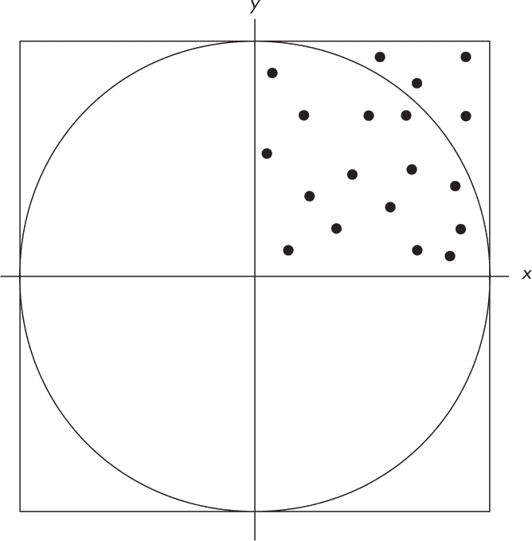

*图 3-1：模拟飞镖投掷*

图 3-1 显示了一个内有圆形的正方形。圆的直径没有明确标出，但我们假设它是 2，即半径是 1。直径也与正方形的边长相同；因此，正方形和圆的面积是

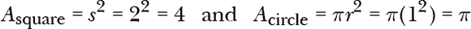

含义：

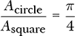

我们通过将圆的面积除以正方形的面积，并乘以 4 来计算*π*。

如果我们投掷许多飞镖，或选择许多随机点，它们最终会覆盖圆和正方形的区域。我们可以利用落在每个形状内部的飞镖数量作为面积的代理。我们现在有了一个算法：投掷飞镖并计算落在圆内（*N*）和落在正方形内（*M*）的数量，然后将*N*除以*M*并乘以 4，从而估算出*π*。

上一个图中的示例点都位于第一象限，这对我们的估算非常有效，因为正方形和圆的面积比例与它们在第一象限的部分比例相同。具体而言，第一象限是完整形状大小的 1/4，因此面积需要除以 4。但圆和正方形的面积都被除以 4，这意味着它们的比例保持不变，*π*/4。这意味着我们只需要投掷落在第一象限的飞镖。

现在我们了解了如何通过投掷飞镖来估算各自的面积和*π*，那么我们应该如何实际“投掷”它们呢？答案就在前面关于第一象限的评论中。

这是算法：

1.  随机选择两个[0, 1)之间的数字，称它们为*x*和*y*。这将成为飞镖落点（*x*, *y*）。

1.  增加*M*，即正方形内点数的计数器。

1.  如果*x*² + *y*² ≤ 1，则增加*N*，即圆内的点数。

1.  对所有期望的飞镖，重复步骤 1 到 3。

1.  返回(4*N*)/*M*作为*π*的估算值。

我们选择[0, 1)中的点，这样所有点都位于第一象限并落在正方形内。因此，如果我们投掷*n*个飞镖，*M* = *n*，我们只需要判断这些点是否也在圆内。

在第 2 步中，我们提出一个关于圆的问题，*x*² + *y*² ≤ 1 源自勾股定理：*a*² + *b*² = *c*²，其中*c*是直角三角形的斜边。这里的三角形边是*x*和*y*，意味着半径（*r* = 1）是斜边，*x*² + *y*²。任何形成斜边小于*r* = 1 的点都在圆内。

在我们继续之前，我们应该问一下，这是否是一个公正的飞镖投掷过程模型，以及我们是否做了任何不公平的假设。毕竟，一个模型的目的是模拟过程中的*最重要的部分*。我们使用两个均匀选取的随机数，位于[0, 1)之间，来表示飞镖可能落的位置，我们只做了一个假设：*所有*飞镖都落在第一象限。将随机值限制在[0, 1)区间内可以排除超出范围的飞镖，因此我们将每次投掷飞镖都视为至少落在正方形内。

回答了这些问题后，我们准备好进行测试了。

#### ***模拟随机飞镖***

我们想要的代码在*sim_pi.py*中。要运行它，提供模拟的飞镖数量和所需的随机性来源。例如：

```
> python3 sim_pi.py 10000 pcg64
pi = 3.16120000
```

这次使用 PCG64 投掷了 10,000 次飞镖。结果是*π ≈* 3.1612。四位小数的正确值是 3.1416，所以我们接近了正确值。这个估计只使用了四位小数，因为我们用一个分母为 10,000 的分数来逼近*π*。再进行十次运行得到：

3.1496，3.1188，3.1468，3.1700，3.1292，3.1372，3.0916，3.1608，3.1236，3.1140

合并所有 11 次运行结果得到*π ≈* 3.1366，和四位小数的正确值相比偏差约为 0.16%。

让我们增加掷飞镖的次数：

```
> python3 sim_pi.py 1_000_000 pcg64
pi = 3.14157600
```

结果差不多了。六位小数的正确值是 3.141593。

让我们孤注一掷——这样应该能搞定：

```
> python3 sim_pi.py 100_000_000 pcg64
pi = 3.14180732
```

奇怪。我们投掷了前一次的 100 倍飞镖，但结果却不如前一次好。我们的方法没有问题；这就是随机数的特性。第二次使用 PCG64 和 1 亿次飞镖的运行结果是 3.14160636，比之前好一些。不过，这也引出了一个问题：为什么会有如此大的变化？这就是随机生成器的特点，也提醒我们要多次重复模拟，以确认它们产生合理的输出并获得多个估计值。

使用`RE`类支持的其他随机性来源进行的单独运行结果是：

```
> python3 sim_pi.py 100_000_000 mt19937
pi = 3.14151340
> python3 sim_pi.py 100_000_000 urandom
pi = 3.14148696
> python3 sim_pi.py 100_000_000 rdrand
pi = 3.14139680
> python3 sim_pi.py 100_000_000 minstd
pi = 3.14156084
> python3 sim_pi.py 100_000_000 RandomDotOrg.bin
pi = 3.14161204
```

最后一轮使用的是*RandomDotOrg.bin*，一个来自*[random.org](http://random.org)*的 510MB 随机数据文件。所有的随机性来源都产生了合理的*π*估计值，但仍然不令人满意。为什么它们没有更接近实际值 3.14159265…？

#### ***理解 RE 类的输出***

让我们重新考虑我们希望随机投掷飞镖来模拟什么。我们希望比较*区域*，因此我们希望飞镖尽可能均匀地覆盖这些区域。

图 3-2，它是图 1-5 的重复，展示了发生了什么。图中的中间图表展示了使用随机生成器时点的位置。存在间隙和点集中的地方。尽管覆盖了区域，但并不是均匀密集的。

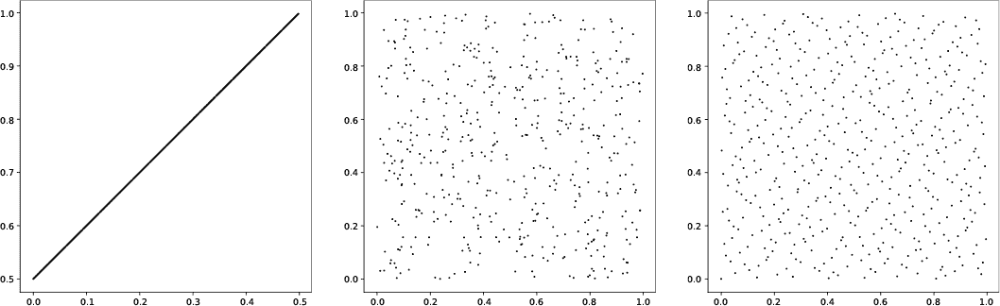

*图 3-2：差的准随机序列（左），伪随机序列（中），和好的准随机序列（右）*

图 3-2 中的右侧图，来自一对准随机序列，在区域上分布更为均匀。我们来尝试使用这个序列。我们需要的代码在 *sim_pi_quasi.py* 中：

```
> python3 sim_pi_quasi.py 10000 2 3
pi = 3.14480000
> python3 sim_pi_quasi.py 100000 2 3
pi = 3.14208000
> python3 sim_pi_quasi.py 1_000_000 2 3
pi = 3.14157200
```

第一个参数是投掷的飞镖数；另外两个参数是准随机序列的基数。为了覆盖 2D 平面，我们需要两个不同的基数，这里是 2 和 3。当飞镖数增加时，估计的质量也会提高。在使用 100 万个飞镖时，它已经与 PCG64 的 *sim_pi.py* 的第一次运行匹配。这里没有随机性；每次使用相同数量的飞镖和相同的基数运行都会得到相同的输出。此外，因为我们在纯 Python 中生成准随机序列，飞镖数量增加时，运行时间会显著增加。例如，这次运行

```
> python3 sim_pi_quasi.py 10_000_000 2 3
pi = 3.14159680
```

精确到五位小数，但在我的 Intel i7 参考系统上运行了 12 分钟。要求 1 亿个样本时，经过两个半小时的运行后，*π ≈* 3.14159184。

让我们暂时关注每个伪随机生成器的性能，这些生成器由 `RE` 类支持。文件 *sim_pi_test.py* 使用 200 万次模拟飞镖投掷，分别为 PCG64、MT19937、MINSTD、`urandom` 和 `RDRAND` 估算 *π* 50 次。结果就是 图 3-3 中的箱线图。

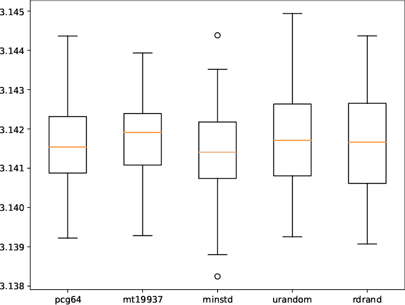

*图 3-3：箱线图展示了不同随机源的 π 估计分布*

*箱线图* 是一种总结数据集的图示；在这种情况下，是 50 个 *π* 的估计值，也就是每个伪随机生成器的 *sim_pi.py* 文件的 50 次独立运行。每个生成器的输出会生成一个带有横向条形的箱子。这个条形代表中位数值，或第 50 百分位数。中位数以下的一半估计值与中位数以上的一半估计值相等。箱子的上下限分别是第 25 百分位数和第 75 百分位数。因此，75% 的估计值位于箱子的上限以下，剩下的 25% 位于其上。

*胡须线*，在 Matplotlib 中被称为飞行器，超出了盒子的范围。盒子的高度，即第 75 百分位数与第 25 百分位数之间的差，称为 *四分位距（IQR）*。胡须线是盒子四分位数加上或减去 1.5 倍的 IQR。任何超出胡须线的数据值都是 *离群值* 的候选者，这些值与其余数据相比，具有典型的异常性。离群值可能是错误，也可能是我们在寻找的有趣现象；上下文才是关键。

图 3-3 中的五个箱子在统计上是相同的。对于 MINSTD，有两个潜在的离群值，但另一次运行 *sim_pi_test.py* 会生成一个新的图表，显示不同的箱子和潜在离群值，甚至来自 `RDRAND`，这是我们可以获得的最接近真实随机源的东西。随机过程有时会产生奇怪的输出；这没有任何意义。这个现象部分解释了为什么检测真实的癌症聚集区可能很棘手。

#### ***实现飞镖模型***

我们的掷镖模拟已经完成。现在，让我们回顾一下代码，了解其工作原理：

```
import sys
from RE import *
 def Simulate(N, rng):
    v = rng.random(2*N)
    x = v[::2]
    y = v[1::2]
    d = x*x + y*y
    inside = len(np.where(d <= 1.0)[0])
    return 4.0*inside/N

N = int(sys.argv[1])
kind = sys.argv[2]
rng = RE(kind=kind)
pi = Simulate(N, rng)
print("pi = %0.8f" % pi)
```

底部的代码解析命令行，以获取投掷的镖数（`N`）和要使用的随机源类型（`kind`）。创建一个生成器（`rng`），并将其与镖数一起传递给`Simulate`，该函数返回一个*π*的估算值，然后将其打印出来。

所有的操作都在`Simulate`中。我们需要`N`个点，即我们投掷的镖落地点。我们可以选择使用`rng`两次——第一次获取*x*坐标，再次获取*y*坐标——或者生成两倍于所需点数的点，然后将它们成对划分。我选择了后者。因此，`v`包含 2*N*个值。第一个点以及随后的每个点成为`x`，而第二个点以及随后的每个点成为`y`。

根据设计，所有点都在正方形内部。我们只需决定哪些点也在圆内。为此，我们需要知道是否满足*x*² + *y*² *≤ r*²，其中半径*r* = 1。为此，我们将`d`设置为*x*² + *y*²，并使用 NumPy 的`where`来查找小于或等于 1 的索引。这些索引的计数告诉我们有多少点位于圆内。最后，函数返回*π*的估算值，即圆内的点数除以投掷的镖数，再乘以四。

我们的掷镖模拟已经完成。现在，让我们模拟一个聚会，看看需要多少人才能使至少有两个人共享生日的概率超过 50%。

### **生日悖论**

需要多少人参加聚会，才能使至少有两个人共享生日的概率超过 50%？有一种数学方法可以计算这个概率，但如果我们不懂数学，我们可以通过大量实验来找到答案：我们可以举行许多聚会，邀请不同人数的人，在每次聚会上判断是否有至少两个人共享生日。虽然这种方法可行，但它会非常缓慢且昂贵。

#### ***模拟 100,000 场聚会***

假设我们不愿意写一份价值百万美元的资助提案来用实际的人进行这个实验，更不用说获得审查委员会的批准和成千上万人的知情同意，那么还有其他方法可以解决这个问题吗？你猜对了：模拟。

每个人都有一个生日，因此我们将模拟房间里的人数，并为每个人随机分配一个生日。然后，我们将检查每一对可能的组合，看看他们是否有相同的生日。一年有 365 天（忽略闰年），所以我们将通过选择一年中的某一天作为实际生日的代表来表示生日。换句话说，每个模拟的人都会被分配一个在[0, 364]范围内的整数。如果两个人的数字相同，则他们共享生日。

我们想要的是给定人数下的匹配概率，这意味着一次模拟是不够的。我们需要很多次模拟，针对固定人数的房间。匹配次数与模拟次数之比趋近于我们所寻求的概率。

这是我们的算法：

1.  固定房间中的人数（*K*）。

1.  给每个*K*个人分配一个生日（[0, 364]）。

1.  检查每一对可能的组合。如果他们的生日相同，增加*M*的值。

1.  从步骤 2 开始，重复*N*次。

1.  对于房间中*K*个人，估算的概率是*M*/*N*。

我们将*K*的值从 2 变化到 50。*N*应该是一个大数，比如*N* = 100,000，用于模拟 100,000 个有*K*个人的派对。我们总是可以将*N*增大并重新尝试，因为变化模拟参数并观察结果是模拟的一个重要部分。如果我们在稍微改变时遇到问题，可能是代码有 bug，或者更糟的是，设计中存在逻辑缺陷。

#### ***测试生日模型***

我们需要的代码在*birthday.py*中。让我们先运行它，了解输出结果，然后再逐步分析它。例如，以下是运行一个询问 11 人房间内至少有一对生日相同的概率时的输出：

```
> python3 birthday.py 11 minstd
11 people in the room, probability of at least 1 match = 0.140430
```

我们知道，房间里 11 个人至少有一对生日相同的概率大约是 14%。第二个参数是要使用的随机源，这里使用的是 MINSTD。可以尝试其他随机源。

如果我们添加第三个参数，我们可以存储输出并将其导入 Python，以便理解其含义：

```
> python3 birthday.py 11 minstd 11.npy
11 people in the room, probability of at least 1 match = 0.142610
 > python3
>>> import numpy as np
>>> d = np.load("11.npy")
>>> d
array([85739, 13462,   663,   125,    10,     0,     0,     1])
```

第一行代码再次运行。注意概率发生了轻微变化；随机选择生日会产生不同的结果，这些结果最终会在多次模拟后趋于均值。稍后我们会对此进行实验。

接下来，我运行了 Python（并忽略了启动消息），然后导入了 NumPy 和输出文件*11.npy*。`d`数组包含了 100,000 次模拟中找到相同生日的人数的直方图，其中`d`的索引表示数字。表 3-1 显示了匹配次数以及它们出现的频率。

**表 3-1：** 匹配次数与出现频率

| **匹配** | **次数** | **百分比** |
| --- | --- | --- |
| 0 | 85,739 | 85.739 |
| 1 | 13,462 | 13.462 |
| 2 | 663 | 0.663 |
| 3 | 125 | 0.125 |
| 4 | 10 | 0.010 |
| 5 | 0 | 0.000 |
| 6 | 0 | 0.000 |
| 7 | 1 | 0.001 |

在 85.7%的情况下，当房间里有 11 个人时，没人有相同的生日。同样，在 13.5%的情况下，出现了一对生日相同的人。最后，在 100,000 次运行中，有一次出现了七对生日相同的人。这就是随机性的本质：有时会发生一些令人惊讶的事情。

接下来，我运行了五次*birthday.py*，每次使用`RE`内置的随机数源，并且每次房间里都有 23 个人。返回的平均概率是 0.507478，即 50.7%。这是第一个返回大于 50%概率的人员数量；因此，为了回答本节开头的问题，我们平均需要 23 个人在一个房间里，才能有超过 50%的机会至少有两个人共享生日。

让我们试着可视化这里发生的事情（图 3-4）。

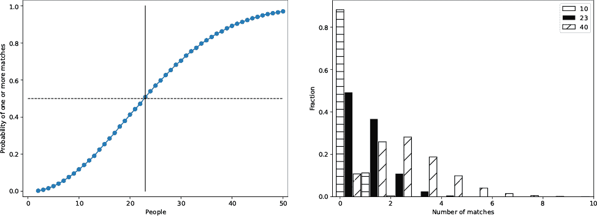

*图 3-4：至少一个匹配的概率与房间内人数的关系（左）以及按房间内人数统计的匹配直方图（右）*

图 3-4 的左侧展示了至少一个匹配的概率与房间内人数的关系。垂直线表示 23 个人，虚线水平线表示 50%的概率。正如所述，23 个人是超过 50%概率的最小人数。

图 3-4 的右侧展示了三个直方图，显示返回特定匹配次数的运行比例。条形图有偏移，以防止重叠，但最左边的条形图代表实际的匹配次数。当房间里只有 10 个人时，没有匹配的概率很高，而多个匹配的概率几乎为零。对于 23 个人，出现一个匹配的情况相对常见，两个匹配较少，三个匹配大约发生 3%的时间。对于 40 个人，已经过了 23 人的临界点，因此出现多个匹配的概率大于没有匹配的概率。

#### ***实现生日模型***

让我们通过*birthday.py*来走一遍，见清单 3-1。

```
import sys
import numpy as np
from RE import *

def Simulate(rng, M):
    matches = []
    for n in range(100_000):
        match = 0
        bdays = rng.random(M)
        for i in range(M-1):
            for j in range(i+1,M):
                if (bdays[i] == bdays[j]):
                    match += 1
        matches.append(match)
 matches = np.array(matches)
    return np.bincount(matches)

people = int(sys.argv[1])
rng = RE(kind=sys.argv[2], low=0, high=365, mode="int")
matches = Simulate(rng, people)
prob = matches[1:].sum() / matches.sum()
print("%d people in the room, probability of at least 1 match = %0.6f" % (people, prob))
if (len(sys.argv) == 4):
    np.save(sys.argv[3], matches)
```

*清单 3-1：模拟检查房间内多个人的生日*

与*sim_pi.py*一样，所有的操作都在`Simulate`中。清单 3-1 底部的代码解析命令行，以获取房间里的人数和随机数源，随机数源可以是`RE`支持的任何一个，或者是一个文件名，并且如果指定了，还会获取输出文件的名称（一个 NumPy 数组）。请注意，`rng`配置为返回[0, 365]区间的整数。

随机数源（`rng`）和房间内的人数被传递给`Simulate`。返回值是一个直方图，表示在固定的 100,000 次模拟中发生特定次数匹配的频率（`matches`）。`matches`的第一个元素是没有匹配的次数，因此，所有剩余元素的总和除以所有元素的总和就是一个或多个匹配的概率（`prob`）。然后，代码会显示该概率，并在请求时将直方图写入磁盘。

在`Simulate`中，`M`是房间内的人数，在所有 100,000 次模拟中保持固定。`Matches`将保存每次模拟的结果，即找到的匹配次数。

第一个`for`循环涵盖了模拟过程。对于每次模拟，随机选择一组生日（`bdays`），每个人（共`M`人）都有一个生日。然后，`i`和`j`的双重循环比较第`i`个人的生日与所有其他人的生日，统计每次的`match`。`i`和`j`的循环限制避免了重复计数；如果第`i`个人的生日与第`j`个人的生日匹配，那么第`j`个人的生日也会与第`i`个人的匹配，而这个已经被计数过了。所有人的生日都比较完毕后，`match`中的计数会被追加到`matches`中。

最后，在所有 100,000 次模拟结束后，`matches`列表会转化为一个 NumPy 数组，并传递给`np.bincount`来统计每个匹配次数的出现频率。

*birthday.py*是一个公平的模拟吗？它是否做了我们所期望的事？正如 Hartl 所说，它是否“消除了多余的细节，集中精力关注本质”？这里的核心任务是，在人数固定的情况下，公平地选择生日。我们假设生日在一年中的分布是均匀的——这是一个合理的假设。

到目前为止我们讨论的模拟是热身。让我们进一步提升难度，探索世界上最重要的过程——至少对地球上无数生物来说——进化。

### **模拟进化**

生物的进化是一个复杂的过程，受到遗传和环境因素的影响。在这一部分，我们将探索两个因素：自然选择和基因漂变。

*自然选择*，由达尔文在 19 世纪描述，通常被称为“适者生存”。它认为，在某个环境中，基因型（遗传代码）能够提高生存和繁殖可能性的生物，更有可能将它们的基因传递给后代。通过这种方式，随着时间的推移，生物的特征发生改变，通常最终导致物种之间无法相互繁殖——也就是说，产生了新物种。

虽然自然选择与提高生存和繁殖的可能性有关，*基因漂变*是由环境变化引起的效应，环境变化使得一小部分生物种群与更大的种群隔离。在基因漂变中，隔离期间存在的亚种群会有不同的基因组合，这可能导致整体基因库的迅速变化，通常会导致新物种的出现。

我们希望模拟自然选择和基因漂变的核心要素。我们先从自然选择开始；一旦模拟了自然选择，模拟基因漂变将变得更加清晰。

#### ***自然选择***

以下是模拟自然选择的要求：

1.  我们需要一群生物，每个生物由一组基因组成。一个生物的基因决定了它对环境的适应能力。

1.  我们需要一个环境，并以某种方式描述它，说明生物体如何适应这个环境。此外，我们还需要一个衡量该环境适应度的标准。

1.  我们需要模拟自然选择的两个最重要工具：生物体之间的繁殖（*交叉*）和随机*变异*。这个模拟必须受到生物体与环境适应度水平的影响。

1.  我们需要从一代跨越到另一代，这样我们才能随着时间的推移监控种群。

1.  最后，我们需要轻松地可视化种群在代际演化中的特征。

让我们逐一处理这些声明。

##### **生物体**

我们的生物体在其基因组中有六个基因，每个基因有 16 种可能的变种或*等位基因*。因此，生物体是一个六维向量，每个元素的值都在[0, 15]之间。这些数字在我们继续讲解时将变得更加明确。

##### **环境**

我们将通过一组基因来定义我们的环境，这些基因对应于“理想”生物体，即最适应环境的生物体。在自然界中，大多数生物体都非常适应自己的环境；如果不适应，它们会迅速灭绝。然而，基于模拟的精神，我们将选择一组基因作为“最佳”基因，并用它们作为环境的代理。

我们将使用环境基因向量与生物体基因向量之间的距离作为衡量生物体适应度的标准。这个距离越小，生物体越适应环境。虽然在讨论向量（点）时有许多可能的“距离”定义，我们将使用*欧几里得距离*：两个点之间的直线距离。我们将假设每个基因向量是六维空间中某个点的坐标。

如果环境的基因向量是**e** = (*e*[0], *e*[1], *e*[2], *e*[3], *e*[4], *e*[5])，生物体的基因向量是**x** = (*x*[0], *x*[1], *x*[2], *x*[3], *x*[4], *x*[5])，那么它们之间的欧几里得距离是：

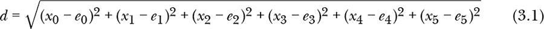

换句话说，它是各坐标差异的平方和的平方根。这里，每个坐标是[0, 15]之间的整数，用来表示该基因的选定等位基因。此外，我们将定义一个最小距离，解释为“足够好”。

##### **交叉与变异**

有性繁殖是混合基因和创造基因库多样性的绝妙方法。我们的生物体将通过交叉繁殖，选择一个基因组位置，并复制第一个亲本所有基因，直到该位置，然后复制第二个亲本剩余的所有基因。新的组合将成为后代的遗传密码。最后，我们将通过随机选择一个基因并随机改变其值来应用随机变异。图 3-5 展示了交叉与变异的过程。

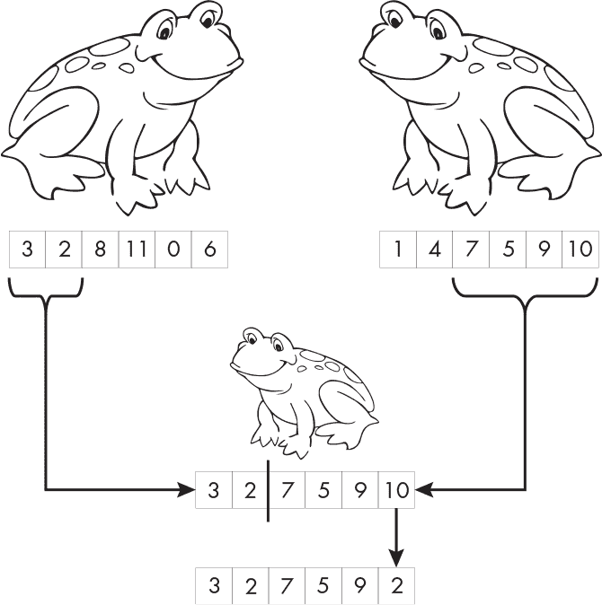

*图 3-5：交叉与变异生成新后代生物体（青蛙图片来源于公共领域，感谢维基共享资源提供）*

我们的生物体不是青蛙，但你大概能理解。两个生物体通过第一个生物体的前两个基因和第二个生物体的最后四个基因来创造后代。然后，变异将改变其中一个基因，从 10 变为 2。

为了模拟适应度对繁殖的影响，我们将偏向选择那些适应度较低的生物体，使其更有可能繁殖。我们将使用一个*贝塔分布*来实现这一点，NumPy 中已包含该分布。贝塔分布通过两个参数影响样本的整体直方图形状。如果两个参数*a*和*b*都等于 1，贝塔分布将模仿均匀分布。如果稍微增加*b*参数，分布会被修改，从而使得选择接近零的值的概率更高。

因此，在培育下一代时，我们将选择与零较为接近的个体作为种群成员。我们将按适应度对种群进行排序，适应度较高的生物体排在二维数组的前面，其中每一行代表一个生物体，每一列代表一个基因。

最终的结果是，适应度较高的生物体更可能繁殖。因此，随着代际的变化，我们预期整个种群会逐步接近环境的理想适应度。

##### **代际种群**

我之前提到过将种群保持在二维数组中。我们将把种群规模固定为 384 个生物体；原因稍后会显现出来。因此，生物体种群变成了一个 384 行 6 列的二维数组。每一代将繁殖出另外 384 个生物体。换句话说，我们的生物体是季节性的；它们经历一个季节（时间步），并在繁殖下一代后死亡。种群遗传学家通常使用这样的离散模型。

因此，模拟实现每个步骤如下：

1.  随机选择初始种群。

1.  随机选择一个环境。

1.  对于*N*代，计算每个生物体的适应度，按适应度排序种群，并通过交叉和变异繁殖每个种群成员。

1.  基于种群的序列创建输出。

##### **可视化**

每一代产生一个 384 个生物体的种群，每个生物体有 6 个基因，由 16 种等位基因中的一种表示。现在我们将了解为什么种群总是 384 个生物体，且每个生物体有 6 个基因。我们希望输出的图像是每一行显示种群的图像，每个像素代表一个生物体，同时显示环境。因此，输出图像将有 384 列，并加上额外的列来展示环境。每个像素的颜色来自相应生物体的基因编码，基因映射到 24 位 RGB 颜色值的 4 位中，如图 3-6 所示。

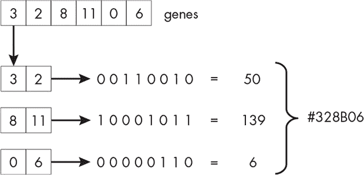

*图 3-6：基因映射到 RGB 颜色*

在图像中，基因向量变成了森林绿色的像素。随着代际的演化，我们预计种群会向环境的颜色靠近。当然，随机突变也会在其中起作用，适应度也会影响结果；我们将会对这两者进行实验。

我们从静态环境开始。

#### ***静态世界***

我们将在实验后深入研究代码。要在静态环境下运行实验，使用*darwin_static.py*：

```
> python3 darwin_static.py 500 60 0.01 4 minstd darwin_static.png 73939133
```

有几个参数，在我们的大多数实验中都很常见：

500   代数（行数）

60   适应度偏差，[0, 1000]

0.01   突变概率

4   “足够好”阈值

minstd   生成器名称或文件名

darwin_static.png   输出图像文件名

73939133   种子值（可选）

当仿真运行时，你会看到每代的平均适应度。随着代际的演变，适应度逐渐降低，直到它接近“足够好”值。仿真结束后，请查看*darwin_static.png*。需要颜色，但图像开始时类似于图 3-7。

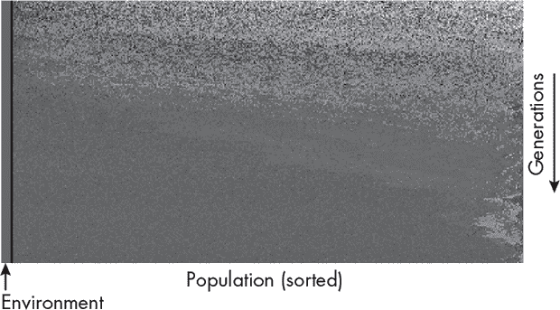

*图 3-7：可视化静态世界*

即使指定了种子，运行之间仍会有差异，因为我们使用的是 NumPy 的贝塔分布函数，而它并不考虑我们的种子值。

从上到下读取图像。最上面一行是初始的、随机生成的 384 个生物的种群。每一行之后是从上一代繁殖出来的下一代，每次都会根据适应度进行排序，因此适应度更高的生物会靠近左边。最左边的条纹是环境，代表着理想基因组的颜色。

随着你逐行查看图像，种群变得更像理想环境。然而，它从未完全崩溃并精确匹配环境。三个命令行参数会影响种群与环境匹配的速度和一致性：适应度偏差、突变概率和“足够好”的阈值。我们来逐一理解每个参数。

##### **适应度偏差**

适应度偏差是一个范围在 0 到 1,000 之间的整数。如我们在代码中所见，这个值会被 1,000 除后加到第二个贝塔分布参数上。其目的是增加适应环境更好的基因组的生物的适应度。如果适应度偏差为 0，那么适应环境更好的生物不会获得生殖上的任何好处。随着偏差的增加，生殖上的好处也会增加，从而使得种群更快速地接近环境的理想状态。

作为例子，再次运行*darwin_static.py*，只改变适应度偏差从 60 改为 600。种群应该在几代内接近环境的理想状态。将适应度偏差改为 0 并重新运行。现在你注意到什么了吗？种群无法改善，因为适应度偏差为 0 意味着没有基于基因组的繁殖优势。如果将适应度偏差设为 15，你可能需要大约 1500 代，但最终你应该会看到种群适应环境。即使是微小的繁殖优势，在长期中也能产生影响。

##### **变异概率**

现在，将适应度偏差设为 60，并调整变异率，以概率的形式表示。例如，变异率为 0.01 时，每个新繁殖出来的个体有 1%的几率发生随机变异。1%的变异率相比于真实动物来说异常高，但我们需要在没有数百万代的情况下看到我们想要的效果。

将*darwin_static.py*的变异率改为 0；这意味着每一代将仅通过交叉遗传来产生。运行几次并观察输出。你注意到什么了吗？种群的适应度应该会停留在 4（距离理想基因组 4 个单位的地方），并且会无限期地保持在那里。因为基因组已经“理想”，所以无法再发生其他变化；不论交叉点在哪里，选出任意两个个体进行交叉，它们的后代基因组仍然与父母完全相同。

让我们看看种群对变异的敏感性。将变异率从 0.01 调整为 0.1（10%），并再运行几次。注意到种群适应了环境，但从未完全适应。实际上，当你向下查看输出图像的行时，你可能会看到一些区域，其中许多种群成员已经适应，但随后出现了新的突变，迅速改变了平衡，导致种群在随后的几代中再次适应。

我的实验中使用了 0.1 的变异率，最终种群的平均适应度通常在 7.5 到 8.5 之间，远高于没有变异时的 4。如果将变异率改为 0.2 甚至 0.8，种群将更难适应环境，因为变异不断将种群推离理想状态。如果将变异率调低，比如设为 0.005，种群适应得很好，但随着时间推移（即输出图像的行数增加），你会看到小群体的突变体出现，然后适应，再次出现并发生新的突变。在输出图像中，这些群体表现为图像右侧的一片片颜色——适应性最差的生物，它们繁殖的概率最低。

##### **“足够好”阈值**

最终的命令行参数是神秘的“足够好”值，它表示环境理想基因组与有机体基因组之间的最小距离。在计算种群的适应度时，任何小于该值的距离都将被设定为该值。通过在保持适应度偏差和突变率固定（例如，分别为 60 和 0.01）的情况下，改变“足够好”值进行实验。 “足够好”值越高，种群对环境的适应就越粗糙。将其设置为 0 时，种群将快速崩溃到理想状态（如果适应度偏差较大）；如果突变率为 0，种群将停留在那个状态。

我建议在你对如何调整适应度偏差、突变率和“足够好”值来影响结果有了直观理解之后，再尝试*darwin_static.py*进行实验。在提前预测你期望在输出图像中看到什么。当使用模拟时，至关重要的一点是要改变参数，特别是要将它们推到极限。这不仅有助于理解模拟试图捕捉的过程，还能作为对模拟本身的理性检查，可能揭示出一些弱点或错误，使得结果的有效性受到影响。

在现实世界中，环境并不是静态的，至少对于进化通常起作用的时间范围而言是如此（尽管快速进化是可能的）。让我们向模拟中加入一个新特性，使环境随着时间慢慢变化，以理解这种变化如何影响种群。

#### ***逐渐变化的世界***

*darwin_slow.py*中的代码几乎与上一节的代码完全相同，但它引入了一个新特性：环境将在命令行指定的间隔内发生轻微变化。例如：

```
> python3 darwin_slow.py 500 60 0.01 4 0.01 mt19937 darwin_slow.png 66
```

新的参数是伪随机生成器（`mt19937`）前的 0.01。它表示每次生成时以 1%的概率略微修改环境。*darwin_slow.py*示例会生成一张输出图像，其中环境变化了四次。输出图像与静态情况相似，但每次环境过渡都在左侧用黑线标出。例如，前两次过渡如图 3-8 所示。

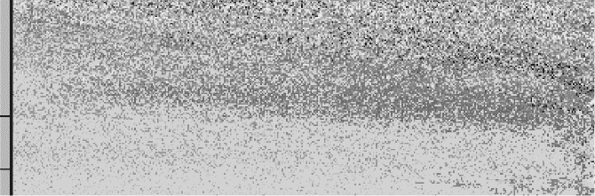

*图 3-8：环境的变化*

细节仅在全彩图像中可见；请参阅书籍的 GitHub 仓库中的*darwin_slow.png*。当第一次过渡发生时，初始的随机种群正在适应环境。然后，当环境再次变化时，种群会迅速适应新的环境。

如果你查看完整的*darwin_slow.png*图像——最好使用可以全分辨率水平查看的图像查看工具——你会注意到，在第二次环境变化后，种群适应得相当好，但这需要几个代数的时间。视觉效果是颜色被涂抹到右边，那里的有机体适应性较差。我建议多次运行模拟，而不是使用固定的 66 种子，以观察不同颜色下的整体效果。然后，探索在平滑的环境变化发生时，适应性偏差和突变率的调整会如何影响结果。为了帮助你入门，观察在表 3-2 列出的参数下多次运行时的变化。

**表 3-2：** 尝试的参数

| **适应性偏差** | **突变率** | **环境概率** |
| --- | --- | --- |
| 600 | 0.01 | 0.300 |
| 60 | 0.01 | 0.300 |
| 1 | 0.01 | 0.005 |

前两个参数集展示了一个快速变化的环境的效果，其中适应性强的有机体拥有较强的优势，而适应性较弱的则有较弱的优势。最后一组参数使用了最弱的生殖优势，但它与几乎静态的环境相结合。

缓慢变化的环境给有机体足够的时间来适应。然而，在地球漫长的历史中，并非所有的环境变化都是缓慢的；有些变化非常突然，甚至可能在一夜之间发生。让我们模拟一场灾难。

#### ***灾难性世界***

大约 6600 万年前的一天，地球上的生命形式正在各自忙碌时，一颗巨大的小行星粗暴地打断了它们的生活，结果导致了非鸟类恐龙超过 1 亿年的统治结束。对它们来说是坏消息；对我们来说是好消息。一场灾难发生了，生命做出了回应，并在撞击之后表现出截然不同的样貌。大约 2.52 亿年前的“大灭绝”事件中，生命几乎灭绝了。同样的事情发生了，灭绝后的世界与灭绝前的世界看起来截然不同。

我们已经模拟了渐进的环境变化；现在，让我们给模拟一个猛击，看看会发生什么。我们需要*darwin_catastrophic.py*。试试看：

```
> python3 darwin_catastrophic.py 500 60 0.01 4 0.01 pcg64 darwin_catastrophic.png 12345
```

这些参数与*darwin_slow.py*中的参数相同，不同之处在于每当环境变化时，它是通过选择一个全新的理想环境基因组来实现的。过渡变化十分明显。生成的图像与*darwin_slow.py*中的图像相似，但没有水平黑线标示过渡。在这种情况下，过渡变化通常非常明显。要理解我的意思，可以运行代码，或者查看本书 GitHub 页面上的*darwin_catastrophic.png*。

尝试调整模拟参数，探索结果。例如，将代数更改为 2000 代，通过缩小查看完整的输出图像。可以清楚地看到，种群对每次环境灾难的延迟反应。

我们的最终模拟引入了基因漂变。那么，突然分裂的种群在适应新环境时表现如何呢？

#### ***基因漂变***

*种群瓶颈*发生在种群经历了突然的数量减少时。一种种群瓶颈是*创始人效应*，它发生在一个小种群从一个较大的种群中分裂出来时。新较小种群中等位基因的随机组合可能会极大地影响有机体的长期生存和进化。*darwin_drift.py* 中的代码模拟了由于创立一个新的较小种群而导致的基因漂变。

这段代码与之前的示例类似，但有所不同。首先，一个较大的种群（384 个有机体）经过多代进化，试图适应环境。然后，整个种群的一定比例“分裂”出来成为新的种群。这两个种群现在分别进化。想象一下，有机体的群落被困在一个岛上，无法再与大陆上的亲戚繁殖。为了增加趣味性，分裂后发生了一次灾难，因此我们可以观察两个种群如何应对环境的突变（适应得好或不好）。

例如：

```
> python3 darwin_drift.py 500 60 0.01 4 0.2 pcg64 darwin_drift 1337
```

`pcg64` 前的 0.2 现在表示将会分裂出来形成新种群的种群比例；也就是说，随机选择 20% 的种群分裂出来形成新的种群，其余 80% 作为较大的种群保留。

与我们的其他模拟不同，*darwin_drift.py* 期望的是一个基础文件名（`darwin_drift`），而不是一个完整的文件名。代码输出一张图片，*darwin_drift.png*，以及一个按代数绘制的平均种群适应度图，*darwin_drift_plot.png*。与之前一样，使用了 500 代，并且采用了 60 的适应度偏差和 1% 的突变概率。

那么我们的图像是什么样子的呢？再次建议你查看本书 GitHub 仓库中的彩色图像，但部分输出已在图 3-9 中展示。

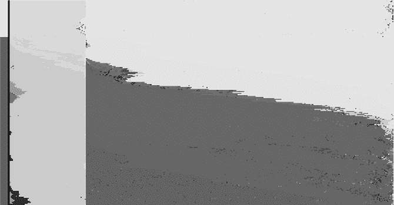

*图 3-9：可视化基因漂变*

这幅较大图像的片段显示了分裂后模拟的一部分。较小的种群在左边，较大的种群在右边。同时，如果你仔细观察环境，会发现大约在图像下方的六分之一处发生了突发灾难。两个种群对灾难的反应不同。这一点在彩色图像版本中尤为明显。

在灾难发生之前，两个种群都相对适应它们的环境。然而，较小的种群在灾难之后无法恢复或成功调整到新环境。较大的种群最终适应了新环境。彩色版本的图像清楚地显示，较小的种群有时会产生适应新环境的世代，但这种适应从未持续很久。这个效应反映了现实：小种群通常非常脆弱，容易受到快速环境变化的影响，因为它们缺乏足够的遗传多样性，无法及时适应。

图 3-10 追踪了平均种群适应度随世代变化的情况。


*图 3-10：灾难前后每代的平均种群适应度*

创始人效应事件发生在第 145 代左右，出现了两条线。较粗的线表示较小的种群。一开始，两个种群都相对适应环境，环境尚未发生变化，尽管可以认为较小的种群在适应度上存在更多变异。

灾难发生在第 318 代左右。紧接着，两个种群的适应度得分显著提高。记住，适应度得分越低越好。随后的几代开始适应新环境，但适应速度不同。较大的种群，仍然是原始种群的 80％，随着时间的推移逐渐适应新环境；然而，较小的种群未能做到这一点，至少在模拟的 500 代内是如此。在大多数*darwin_drift.py*的运行中，较小的种群未能像较大的种群一样适应新环境。有时，情况正好相反。我们将在讨论中谈论这种效应。

如果种群分裂为一半（0.5）会发生什么？或者，如果新种群只是一个很小的部分，比如 5％或 10％呢？在这种情况下，最简单的实验方法是固定适应度偏差和突变率。然后，固定种群比例并调整这些参数。

在图 3-9 中，当种群分裂时，新生成的较小种群的成员是随机选取的。因此，由于偶然因素，它们通常在基因型的代表性上与较大种群不均衡。这种差异可能意味着不常见的基因型现在有机会变得更加常见。

这个效应在*drift.py*代码中得到了体现。首先，选择一个 10,000 个数字的“种群”，范围是[0, 9]。然后，通过随机选择较大种群中的 50 个成员，构建 20 个子种群。最后，显示较大种群的平均值以及 20 个子种群的平均值。如果每个子种群的数字组合相同，那么它们的平均值将非常接近。然而，它们并不是：

```
Population mean = 4.562900
Sub-population means:
  3.60, 4.42, 4.52, 4.82, 4.36, 5.40, 4.72, 4.54, 4.24, 4.28,
  4.76, 4.66, 4.98, 4.90, 4.50, 4.50, 5.10, 4.44, 4.30, 4.62
```

子群体的均值范围从 3.60 到 5.40 不等。均匀选择的数字应给出一个 4.5 的总体均值，这接近较大的总体均值。由于随机性，子群体代表了非常不同的数字集合（基因组）。现在我们明白了为什么种群瓶颈会导致基因漂变。

#### ***仿真测试***

我们使用了四组不同的代码来进行前面的仿真。为了避免详细描述每一组，从而避免造成“死于 PowerPoint”的效果，我们将在这里介绍其中一组，并根据需要展示其他组的代码片段。

请查看列表 3-2，其中包含了*darwin_static.py*的关键部分。

```
❶ ngen = int(sys.argv[1])
   advantage = int(sys.argv[2])
   mutation = float(sys.argv[3])
   good = float(sys.argv[4])
   kind = sys.argv[5]
   oname = sys.argv[6]
   if (len(sys.argv) == 8):
       seed = int(sys.argv[7])
       rng = RE(kind=kind, seed=seed)
   else:
       rng = RE(kind=kind)

❷ npop = 384
   pop = np.zeros((npop, 6))
   for i in range(npop):
    ❸ pop[i,:] = (16*rng.random(6)).astype("uint8")
   environment = (16*rng.random(6)).astype("uint8")
   hpop = np.zeros((ngen,npop,6))
   henv = np.zeros((ngen,6))

❹ for g in range(ngen):
    ❺ fitness = np.zeros(npop)
       for i in range(npop): d = np.sqrt(((pop[i]-environment)**2).sum())
           if (d < good):
               d = good
           fitness[i] = d

    ❻ idx = np.argsort(fitness)
       pop = pop[idx]
       fitness = fitness[idx]

    ❼ hpop[g,:,:] = pop
       henv[g,:] = environment
       print("%6d: fitness = %0.8f" % (g, fitness.mean()))

    ❽ nxt = []
       for i in range(npop):
           nxt.append(Mate(pop,fitness,advantage))
       pop = np.array(nxt)
```

*列表 3-2：模拟静态环境*

我已排除了与生成输出图像相关的注释和代码。如果你对这些部分的工作原理感兴趣，请查看文件本身。我建议至少阅读`MakeRGB`，以了解基因到 RGB 颜色值的映射。

代码自然地分为三个部分：解析命令行 ➊、设置仿真 ➋ 和运行仿真 ➍。在第一部分中，随机引擎（`rng`）被配置为返回 0, 1)范围内的浮点数，且可以选择是否使用种子。这个引擎用于不同的功能，因此最好仅使用基本范围，并根据需要调整边界和数据类型。

然后，初始种群（`pop`）包含 384 个生物体（`npop`） ➋。每个生物体都被赋予一个随机生成的基因组 ➌。`environment` 也类似地被定义。最后两个变量，`hpop`和`henv`，分别追踪种群的演化和其他代码变体中的环境。请注意，这里使用的是一个 3D 数组，想象它是由多个 2D 数组组成的，每个数组保存该代的种群。输出图像是通过同时使用`hpop`和`henv`生成的。

仿真现在已经准备好，初始种群和环境已经定义。主循环 ➍ 评估每一代的表现。循环体有四个步骤：计算每个生物体的适应度 ➎，按适应度对种群排序 ➏，保存种群副本以生成图像 ➐，最后繁殖下一代 ➑。

让我们逐步了解每个步骤。为了计算适应度，我们将每个生物体的基因组与环境的基因组进行差异计算，之后对所有基因的差值进行平方求和，再应用平方根。这是 NumPy 版本的[公式 3.1。获得适应度后，`idx`会对种群和适应度向量进行排序，使得适应度更高的生物体靠近种群的前面 ➏。然后，`hpop`存储排序后的种群和环境以供输出图像生成 ➐。同时，种群的平均适应度也会被打印出来。随着种群的演化，这一平均值应该会减少，具体取决于突变率和适应度偏差。

本代的最后一步是替换它 ➑。重复调用 `Mate` 函数从现有种群中繁殖出一个新的 `npop` 生物体群体，详见示例 3-3。

```
def Mate(pop, fitness, advantage):
    a = advantage / 1000
    i = int(len(pop)*np.random.beta(1,1+a))
    j = i
    while (j == i):
        j = int(len(pop)*np.random.beta(1,1+a))
    c = int(6*rng.random())
    org = np.hstack((pop[i][:c], pop[j][c:]))

    if (rng.random() < mutation):
        c = int(6*rng.random())
        org[c] = int(16*rng.random())
    return org
```

*示例 3-3：产生下一代*

这里，`Mate` 函数接受当前种群及其相关适应性（均已排序），以及适应性偏置（`advantage`）。如前所述，适应性偏置被除以 1,000。

该函数需要选择两个不同的生物体，索引 `i` 和 `j`，然后通过交叉生成一个新的生物体。调用 NumPy 的 `beta` 函数返回一个位于 [0, 1) 区间的值，该值在根据种群大小进行缩放后，将返回 [0, 383] 范围内的一个整数。`while` 循环会持续运行，直到选中一个不同的第二个生物体（`j`）。

图 3-11 显示了不同适应性偏置值下的贝塔分布。

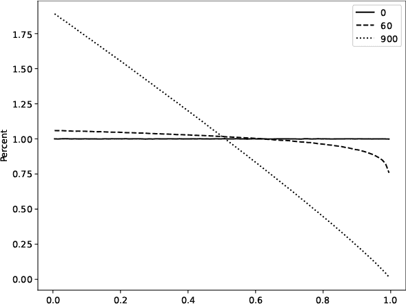

*图 3-11：由适应性偏置值调整后的贝塔分布。如果分布的左侧高于右侧，适应性较强的生物体更可能繁殖后代。*

如果偏置为 0，贝塔分布就表现为均匀分布。图中有 100 个柱状图，因此每个柱状图大约会出现 1% 的时间（实线）。适应性偏置较弱（60）时，会偏好较小的值，即较适应的生物体，同时强烈排斥最不适应的个体。类似地，偏置为 900 时，则线性选择最适应到最不适应的生物体。

交叉选择一个基因位置，[0, 5]，并通过保留一个父代的前 `c` 个基因，加入另一个父代的其余基因来构建后代（`org`）。然后，如果随机值小于全局的 `mutation` 阈值，则随机选择一个基因赋予一个新值，[0, 15]。最后，该函数返回新生物体的基因组。

总结一下：首先配置，然后在代数中循环，评估当前种群的适应性，再利用这些信息来繁殖下一代。待尘埃落定后，生成输出图像。

文件 *darwin_slow.py* 通过种群的演化改变环境，几乎与 *darwin_static.py* 一模一样。这个循环在繁殖下一代后增加了一个额外的代码段：

```
if (rng.random() < eprob):
    offset = 2*rng.random(6)-1
    environment = environment + offset
    environment = np.maximum(0,np.minimum(15,environment))
    environment = (environment + 0.5).astype("uint8")
```

这里，`eprob` 是环境变化的概率，从命令行读取。如果环境发生变化，我们会添加一个 `offset` 向量，逐基因地将理想基因组改变 ±1。将此与 *darwin_catastrophic.py* 中的灾难性环境变化进行比较：

```
if (rng.random() < eprob):
    environment = (16*rng.random(6)).astype("uint8")
```

最终的程序 *darwin_drift.py* 结构上与 *darwin_catastrophic.py* 类似，但在经历一定代数后，种群会分裂成两部分。分裂之后，环境会发生灾难性的改变。尽管涉及了记账操作，但从概念上讲，并没有发生新的变化。

### **练习**

使用以下练习作为扩展你对模拟强大功能理解的跳板。在进行这些练习时，思考任何脑海中浮现的“假如”问题：

+   修改*sim_pi.py*，使其分别调用两次`rng`，第一次获取*x*坐标，第二次获取*y*坐标。你注意到有什么不同吗？你预料到吗？

+   修改*birthday.py*，使*N* = 1,000,000 或*N* = 10,000。有什么显著的不同吗？

+   我们假设生日在一年中均匀分布。这在西方国家并不完全成立，至少在这些国家中，9 月的生日更为常见。那么，在这种情况下，随机选取的两人有相同生日的真实概率会发生什么变化？是增加还是减少？你可能希望探讨一下文件*birthday_true.py*，它使用了来自英国的数据。

+   聚会中至少需要多少人，才有 99%的概率出现至少一个生日重合？

+   我们的进化模拟假设每一代的所有成员都会繁殖并死亡，产生与上一代大小相同的新一代。如果最不适应的 10%死亡且不繁殖，而最适应的 2%繁殖两次，会发生什么？

加分题：

在他 1889 年的书《*概率论*》中，约瑟夫·伯特朗概述了三种计算随机选取的圆弦长于圆内切正三角形边长的概率的方法。文件*bertrand0.py*、*bertrand1.py*和*bertrand2.py*实现了对应三种方法的模拟：

***bertrand0.py***   使用圆上两个随机选取的点定义的弦。

***bertrand1.py***   使用与随机选取的圆半径上某点垂直的弦。

***bertrand2.py***   使用圆内一个随机选择的点作为弦的中点。

运行三种方法来选择圆的随机弦。例如：

```
> python3 bertrand0.py 500 b0.png mt19937 359
Probability is approximately 154/500 = 0.3080000
```

它们生成估算的概率，并附带展示所选弦的图形，如图 3-12 所示。

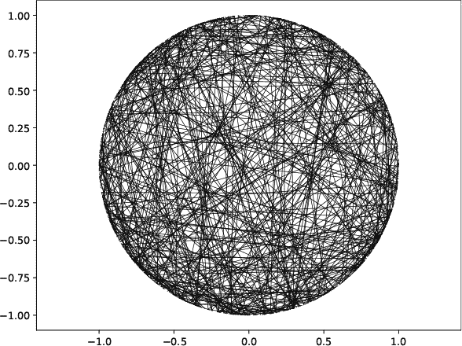

*图 3-12：选择的圆弦，当选择圆周上的点时*

每种方法的估算概率是多少？哪一种是正确的？这被称为*伯特朗悖论*，它提醒我们在定义我们要模拟的内容及其方式时需要小心。检查代码，看看弦是如何被选取的。

### **总结**

在这一章中，我们开始了对模型和模拟的初步探索；在本书中，我们将继续遇到各种模型。

我们从简单的模拟开始，估算通过掷飞镖的方法得到*π*的值，以及一个房间中平均需要多少人，才能有超过 50%的概率至少两人有相同的生日。然后我们构建了一个模型来模拟生物进化的两个关键方面：自然选择和遗传漂变。我们发现，即使是不完整的模型，也可以成为有用的工具，提供有价值的见解。

我们的模拟捕捉了一些重要进化机制的精髓，比如自然选择和基因漂变，但现实中有一大部分被忽略了：死亡和灭绝。例如，许多小型种群在应该灭绝的时候却继续进化。灭绝是自然的；几乎所有曾经存在的物种都已经灭绝（尽管我们没有理由急于加速这一过程）。加入死亡和灭绝将使模拟变得更加复杂，这超出了我们在本书中能够实现的范围。尽管如此，本节中的模拟在其范围内仍然具有实际意义和示范作用。所有的类比在某个点都会失败——这并不意味着它们毫无用处。

下一章将继续探讨有用的随机性，通过深入优化的世界来展开。随机性能否在寻找最佳解的过程中发挥作用？

**注意**

*没有正式的解答可以解决伯特兰悖论。包括我在内的许多人认为 p = 1/2 是最合理的答案。*
