## **4

优化世界**


*优化*是寻找某物最佳组合的过程，通常是定义一个函数或算法的参数。在数学中，优化通常涉及函数，并利用其导数来定位最小值或最大值。在本章中，我们将采用一种不同的方法，涉及随机性。我们将使用的算法分为两大类：群体智能和进化算法。统称为*元启发式算法*。

使用元启发式算法进行优化比基于微积分的优化更灵活。我们优化的对象不必是数学函数；它可以是算法或其他过程。事实上，任何可以被视为在某个空间中定位最佳位置的问题，其中该空间以某种形式表示问题，都适用于群体智能和进化算法。我经常使用这两类算法，从曲线拟合到演化神经网络架构都有应用。一旦你理解了将任务表述为通用优化问题的过程，你会开始在各个领域看到它们。

在本章中，我们将使用群体智能和进化算法将数据拟合到已知的函数。然后，我们将从零开始演化出最佳拟合函数。然而，我们将首先简要介绍群体智能和进化算法的基础知识。我们已经使用过一种进化算法，尽管当时它并没有被称为进化算法。在第三章中实现的算法用于探索自然选择和遗传漂变，它是一种遗传算法，是我们在本章中将遇到的两种进化算法之一。

### **带有随机性的优化**

想象一个巨大的干草堆，其中每个位置代表问题的一个可能解决方案。我们希望找到干草堆中提供最佳解决方案的部分——也就是说，我们要找到针。问题是：我们该如何找到它？

我们将使用以下通用算法来搜索干草堆：

1.  一群（种群）“代理”随机分布在干草堆中。

1.  每个代理调查其当前的位置，并给出该位置解决问题的优劣评分。

1.  代理将他们的数字报告给总部。

1.  每个代理报告完毕后，总部会评估所有数字并存储当前已知的最佳位置，如果在此迭代中有代理发现了更好的位置，则更新该位置。

1.  总部根据收到的信息将每个代理指派到干草堆中的新位置。

1.  该过程从步骤 2 开始重复，直到找到最佳位置或时间（迭代次数）耗尽。

在实施时，我们有很大的灵活性。事实上，基于这种方法的算法已被数百篇文章公开发布。许多人声称这些算法的灵感来源于自然，但这样的说法往往并不可靠，并且通常并非必要。

这是群体智能算法的例子还是进化算法的例子？其实是两者兼具。这两者的区别在于第 4 步发生的事情：过程总部用来决定智能体下一步应该去哪里的方法。这个区分对于研究人员来说至关重要，但对我们来说重要性较低。

在群体智能算法中，称为*粒子*的智能体共同工作，定位空间中的新位置进行探索。它们相互之间保持积极的意识，并从每个粒子的经验中“学习”，让整个群体不断朝着空间中越来越好的位置移动，从而找到越来越好的问题解决方案。

另一方面，进化算法运用诸如交叉和变异等技术来繁殖新的智能体（生物体）。在第三章中，我们将生物体的适应度定义为其基因组与当前环境中理想生物体基因组之间的距离。在这里，适应度是衡量生物体基因组所代表的解决方案（在大海捞针中的位置）如何解决问题的标准。通过几代繁殖更适应的解决方案，并辅以随机变异，应该能够让种群逐步接近问题的最佳解决方案。

在实际操作中，我们需要知道的就是这两种算法通过搜索空间来找到最佳位置。我们将配置我们的任务，使得最佳位置能够转化为最佳解决方案。

在成千上万的群体智能和进化算法中，我们应该使用哪一种？每种算法都有其优缺点，可能更适用于某些特定类型的问题。你需要尝试几种。

在本章中，我们将使用五种算法：两种群体智能算法，两种进化算法，以及一种显而易见但许多人并不认为是群体算法的算法。我们没有足够的篇幅逐一讲解每个算法的代码，留给你们作为练习（如果有问题，请随时联系我）。我们将边学习这些算法，边学习使用它们的框架。

这两种群体智能算法分别是*粒子群优化 (PSO)*和*Jaya*。PSO 是群体智能算法的鼻祖，许多受自然启发的算法都是 PSO 的变种。Jaya 是一种更新的算法，它没有需要调整的参数——要么它有效，要么它无效。尽管 PSO 有许多变种，我们这里将使用其中两种：标准型和简化型。

这两种进化算法分别是*遗传算法 (GA)*，它是我们在第三章中使用的一种变体，以及*差分进化 (DE)*，另一种传统且广泛使用的技术。DE 是我常用的算法之一，但它有时会有一个让人烦恼的习惯——过快地收敛到局部最小值。

最后一个算法是*随机优化（RO）*。在 RO 中，粒子之间不进行通信；它们进行局部搜索，并在找到新的位置时移动，但完全不知道其他粒子发现了什么。总部监视每个粒子，以跟踪整体上找到的最佳位置，但从不根据这些信息发布命令。

我们通过实践学习得最好，所以让我们开始将一个函数拟合到数据中。

### **使用群体进行拟合**

在科学和工程中，一个常见的任务是将一个函数拟合到一组测量数据中，其中“拟合”意味着找到一组最佳的参数，使得已知类型的函数能够尽可能精确地逼近数据。对于这个任务，我们已经知道了函数的形式；我们只需要学习参数值，以便将函数调整到数据上。在下一节中，我们将从数据开始，利用群体智能算法来告诉我们最佳的拟合函数和参数是什么（希望如此！）。我在这里使用“群体”一词是广义的，既指通过群体智能算法操控的粒子群，也指通过进化算法培养和进化出的种群。对于我们来说，这种区分并不重要。

让我们从一个简单的例子开始：一些数据，一个函数，以及最适合将函数拟合到数据的参数。该示例的代码在*curfit_example.py*中。它从一个二次函数生成一组带有随机噪声的点。然后，使用 NumPy 的 `polyfit` 函数来拟合一个二次函数：*ax*² + *bx* + *c*。图 4-1 展示了图表和拟合函数。

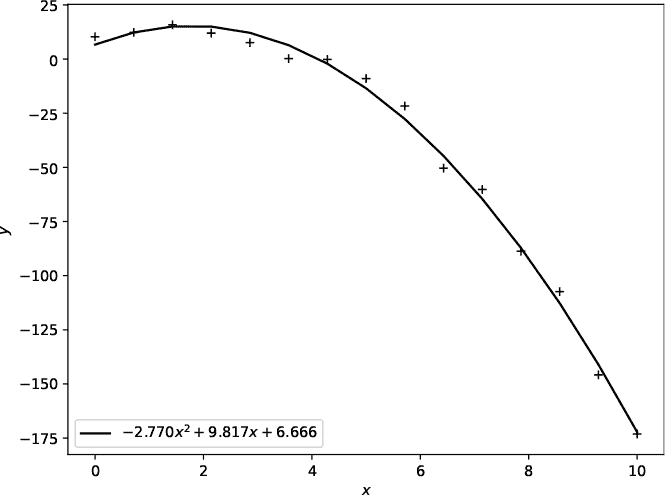

*图 4-1：将多项式拟合到一些数据*

使用拟合函数，我们可以为任何* x *近似计算出*y*，这通常也是我们首先进行数据拟合的原因。

你可能会问，如果`polyfit`能够拟合数据，为什么还要使用群体智能。遗憾的是，`polyfit`只适用于多项式，或者说是* x *的幂和的函数。如果你的函数不是多项式，还有其他函数可以使用，比如 SciPy 的 `curve_fit`。然而，我们不仅仅是为了曲线拟合而使用它；我们将其作为热身练习。SciPy 对于我们将在本章和下一章中探讨的其他优化问题并不会有太大帮助。

#### ***曲线***

现在我们已经了解了曲线拟合的基本概念，接下来让我们用群体智能来实现它。我们需要的代码在*curves.py*中。我们将先使用它，然后再分析其中的部分内容。我强烈建议你通读这段代码，熟悉一下其中的内容。

代码需要一个包含测量点及拟合函数的数据文件。我们将使用*curves.py*来拟合前面的示例。我们需要的输入文件是*curfit_example.txt*：

```
3
p[0]*x**2+p[1]*x+p[2]
10.2772497 0.0000000
12.2926738 0.7142857
15.7968918 1.4285714 11.9787533 2.1428571
7.5707351 2.8571429
0.2314503 3.5714286
-0.1762932 4.2857143
-9.0166104 5.0000000
-21.6965056 5.7142857
-50.3670945 6.4285714
-60.2153079 7.1428571
-88.6989830 7.8571429
-107.3679996 8.5714286
-145.8216296 9.2857143
-173.1300077 10.0000000
```

第一行是参数的数量，后面跟着拟合函数。该函数以 Python 代码的形式给出，其中拟合参数是向量`p`的元素，数据点用`x`表示。

我们希望拟合一个类似*ax*² + *bx* + *c*的三参数函数，所以我们使用`p[0]*x**2+p[1]*x+p[2]`。如果你想要像 sin *x*这样的函数，使用`np.sin(x)`（使用 NumPy）。注意，数据点按*y*然后*x*列出。

让我们使用*curves.py*和这个文件通过差分进化来拟合数据：

```
> python3 curves.py curfit_example.txt -10 20 20 1000 0 DE pcg64
Minimum mean total squared error: 16.430381313  (curfit_example.txt)
Parameters:
 0:   -2.7702810873939598
 1:    9.8170736277919577
 2:    6.6657767196319488
(73 best updates, 20020 function calls, time: 1.618 seconds)
```

输出告诉我们几个信息，但首先看一下参数。这些是`p`的元素，即找到的最佳参数集。将它们与图 4-1 进行比较。拟合效果相当好。

通用算法说，粒子需要评估它们在稻草堆中的位置，以确定当前位置表示的解决方案有多好。拟合函数中有三个参数；因此，我们的稻草堆是一个三维空间，粒子最初随机分布在这个空间中。三维空间中的每个点对应一个`p`向量，即一组三个参数。*curves.py*会报告在搜索过程中找到的最佳位置。

对于每个粒子，在稻草堆中的每个位置，我们计算*目标函数*的值，这是一个适应度函数，用于告诉我们该位置解的质量。对于曲线拟合，我们的目标函数衡量的是测量点(*x*, *y*)与函数返回的同一*x*位置的*y*值之间的均方误差。如果*ŷ* = *f*(*x*, ***p***)是函数在*x*位置对某粒子位置***p***的输出，则*均方误差 (MSE)*为：

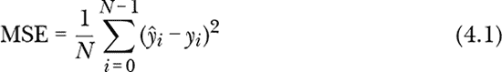

求和是针对所有测量点(*x[i]*, *y[i]*).

MSE 越接近零，说明函数拟合测量数据的效果越好，这意味着给出最小 MSE 的粒子位置就是找到的最佳拟合位置。群体算法不断调整粒子的位置，直到找到最小值或我们耗尽迭代次数。

*curves.py*文件接受许多命令行参数：

curfit_example.txt   数据文件

-10   下界

20   上界

20   粒子数量

1000   迭代次数

0   容差

DE   算法（DE，Jaya，PSO，GA，RO）

pcg64   随机源

第一个参数是包含测量数据点的文件名。第一行是拟合的参数数量，接着是实现拟合函数的代码。文件的其余部分是实际的数据点，*y*然后是*x*，每一行一个数据对。

接下来的两个参数指定搜索的边界。这些限制了群体可以移动的空间大小。指定标量值会将该值应用于所有维度；否则，需指定每个维度，用`x`分隔。在此案例中，我们告诉*curves.py*将其搜索空间限制为从（–10，–10，–10）到（20，20，20）的立方体。边界通常是有用的，但必须包含实际的最佳值；否则，搜索只会返回给定边界内的最佳位置。

以下参数，也是`20`，指定了群体的大小，或者说是散布在干草堆中的粒子数量。通常，群体越小，迭代次数越多（这里是 1,000 次）效果更好，但这只是一个经验法则，例外情况很多。

我们正在最小化均方误差（MSE）。如果 MSE 小于给定的容差，搜索会提前停止。通过将容差设置为 0，我们告诉*curves.py*搜索 1,000 次群体位置，或者如果找到没有误差的位置则提前停止。最后一个参数是`RE`的随机源。另一个参数是显示数据点和拟合结果的输出图像文件的名称，也可以提供。

群体算法是随机的，意味着它们的输出会因运行的不同而变化，因为它们在搜索过程中随机分配初始粒子位置，并使用随机值。对于许多问题，变化是微妙的，不太重要，但有时群体会迷失方向。因此，最好多次重复搜索（如果可能的话），以确保结果是有意义的。

要尝试其他的群体算法—PSO、Jaya、GA 和 RO—请通过名称指定。我怀疑你会发现，PSO、Jaya 甚至 RO 给出的结果和 DE 一样好。然而，GA 是另一个问题。数值输出很差，虽然如果你绘制结果，图形看起来通常至少还算合理。这是否意味着 GA 是一个有缺陷的算法？不，它只是并不适合这个任务。一般来说，GA 最适合非数值优化问题和维度（参数）较高的问题。在这个例子中，使用 GA 意味着要求它进化出一个每个基因有三个基因的有机体种群。这对于进化来说几乎没有什么可以工作的内容。

让我们看一个曲线拟合的例子。要拟合的函数在*sinexp.txt*文件中：

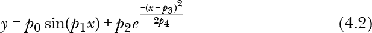

这个函数是正弦曲线和正态曲线的和，包含五个参数：我们处于一个五维的搜索空间中，每个粒子是该空间中的一个点。我无法想象一个五维的干草堆，但我们依然在这个空间中寻找针。

让我们试试使用 Jaya 的*curves.py*：

```
> python3 curves.py sinexp.txt -3 23 20 1000 0 Jaya mt19937 fit.png
Minimum mean total squared error: 0.000000015  (sinexp.txt)
Parameters:
 0:    1.9999892608106149
 1:    3.0000001706464414
 2:   20.0001115681148427
 3:    7.9999997934624147
 4:    0.6000128598331004
(137 best updates, 20020 function calls, time: 1.412 seconds)
```

我第一次尝试代码时，拟合失败，返回了 0.1656 的最小 MSE，比之前的拟合大了几个数量级。良好结果的图形见图 4-2。

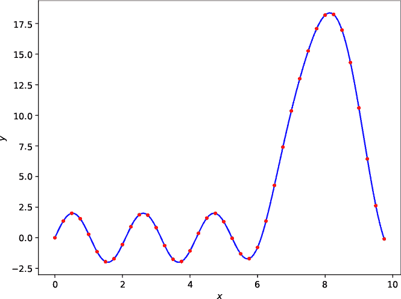

*图 4-2：使用 Jaya 对方程 4.2 的拟合*

搜索依然使用了 20 个粒子和 1,000 次迭代。我将搜索空间限制在了五个维度的-3 到 20 之间。在这个例子中，数据集是直接从函数生成的，参数值分别为 2、3、20、8 和 0.6。这也解释了极低的 MSE：测量中没有噪声。

**注意**

*在使用代码时，你可能会遇到运行时警告。这是由于群体算法使用了对指数函数来说过大的参数值。你可以在命令行中加上* -W ignore *，这样就能抑制这些警告。*

#### ***curves.py 代码***

让我们看看一些代码，感受一下群体算法在做什么；它也将帮助你理解如何将各个部分组合在一起。从*curves.py*的底部开始。代码的本质，如你在阅读时会看到的，是以下内容：

```
rng = RE(kind=kind)
b = Bounds(lower, upper, enforce="resample", rng=rng)
i = RandomInitializer(npart, ndim, bounds=b, rng=rng)
obj = Objective(X, Y, func)
swarm = DE(obj=obj, npart=npart, ndim=ndim, init=i, tol=tol, max_iter=niter, bounds=b, rng=rng)
swarm.Optimize()
res = swarm.Results()
```

第一行使用命令行给定的源（`kind`）配置一个`RE`的实例。接下来的四行配置差分进化的搜索。Jaya、PSO、RO 和 GA 的代码是相同的，只有在 PSO 的情况下，构造函数中会多一个参数。让我们逐行看；这些是使用框架配置任何群体搜索的步骤，接下来我们会再次看到它们。

首先，群体搜索是有边界的，所以我们需要一个`Bounds`类的实例，或者如果需要重写其方法（通常是`Validate`），可以使用它的子类。参数包括下限和上限、随机源和一个名为`enforce`的参数，默认设置为`resample`。回顾一下通用的搜索算法，第 5 步表示总部指示代理根据当前位点的目标函数值移动到新位置。有时，这些新位置可能超出了指定的边界。`enforce`参数决定在这种情况下该怎么办。通过将其设置为`resample`，任何超出边界的粒子维度将被该维度上的随机选择值替代。另一个选项是`clip`，它将违规维度修剪为允许的最小值或最大值。大多数情况下，这并不是我们想要的。

`RandomInitializer`参数提供了一个初始化器来配置群体。它接收群体中粒子的数量（`npart`）、搜索空间的维度（`ndim`）以及上一行配置的边界（`b`）。

搜索还需要知道如何评估目标函数，这是一个`Objective`的实例。在曲线拟合示例中，`X`和`Y`是测量点，`func`是要拟合的函数，所有这些都从命令行给定的数据文件中读取。稍后我会展示目标函数。

我们现在准备创建群体算法对象（`swarm`），这里是`DE`的一个实例。我们提供目标函数、粒子数量、维度、初始化器、边界以及随机源。我们还指定了容忍度（`tol`）和迭代次数（`max_iter`）。

给定所有的配置，使用群体对象是直接的：调用`Optimize`方法。当调用返回时，搜索结束。调用`Results`以返回一个包含搜索信息的字典。

`res` 中最重要的元素是 `gpos` 和 `gbest`。这两者都返回追踪群体在搜索过程中找到的最佳位置的列表。因此，这些列表的最终元素返回最佳位置（`gpos`）和相应的目标函数值（`gbest`）。该位置是一个向量，每个维度对应搜索空间中的一个值；这里每个维度是我们拟合数据的函数的一个参数值。`gbest` 是一个标量，表示该组参数的均方误差（MSE）。

让我们来看一下 `Objective` 类。作为目标函数传递的对象至少需要有一个名为 `Evaluate` 的方法。具体细节并不重要，但因为 Python 使用鸭子类型，所以任何具有接受单个参数的 `Evaluate` 方法的对象都可以接受。这里是 *curves.py* 使用的代码：

```
class Objective:
    def __init__(self, x, y, func):
        self.x = x
        self.y = y
        self.func = func
        self.fcount = 0

    def Evaluate(self, p):
        self.fcount += 1
        x = self.x
        y = eval(self.func)
        return ((y - self.y)**2).mean()
```

构造函数保持对测量点 `x` 和 `y` 的引用，并包含表示拟合函数的字符串 (`func`)。许多应用没有附加信息，在这种情况下，构造函数不做任何操作，也不需要指定。此外，请注意 `Objective` 并没有继承任何其他类，它只需要实现 `Evaluate` 方法，就可以被优化框架接受。

`Evaluate` 方法由群体算法调用。参数 `p` 是粒子在群体中的当前位置，即一个可能的参数值向量。第一行增加了 `fcount`，这是 `Evaluate` 被调用次数的内部计数器。*curves.py* 退出时会显示 `fcount` 的最终值。

下一行看起来有点奇怪：它将 `self.x`（即 *x* 数据）的引用赋值给局部变量 `x`。接下来的行使用 Python 的 `eval` 函数来计算函数值；因为 `eval` 同时使用了 `x` 和 `p` 作为变量名，所以我们需要在 `Evaluate` 中存在这些变量名——因此需要 `x = self.x`。计算出的函数值保存在 `y` 中。这些就是 公式 4.1 中的 *ŷ* 值。

最后，我们计算 MSE 并将其返回，作为给定粒子位置 `p` 的目标函数值（或适应度值）。注意这里没有取平方根。我省略了它，以节省一点时间。即使没有最终的平方根，最小的 MSE 仍然是最小的。

当群体算法运行时，它会调用 `Evaluate` 数千次，将粒子位置映射到均方误差（MSE）值。群体算法完全不知道*目标函数*在衡量什么；它们只知道将表示粒子位置的向量传递给目标函数，目标函数返回一个标量值，较小的值比较大的值更好。这使得框架具有通用性，适用于广泛的问题。

总结一下，使用框架的步骤如下：

1.  确定如何将潜在的解决方案映射到一个多维空间中的位置，供群体进行搜索。

1.  使用该映射创建一个目标函数类，支持至少一个`Evaluate`方法，用于接受一个候选位置向量并返回一个标量，表示该位置代表的解的质量。框架总是进行最小化，因此返回值越小，解越好。要进行最大化时，返回适应度值的负值。

1.  创建一个`Bounds`对象，用于设置搜索空间的边界以及如果超出边界时的处理方式。

1.  创建一个初始化器（`RandomInitializer`），用以提供群体粒子的初始位置。

1.  创建一个群体类的实例，`DE`、`PSO`、`Jaya`、`RO`或`GA`。

1.  通过调用`Optimize`进行搜索，并使用`Results`返回结果。

随着实践的深入，我们将更熟悉这个框架。现在，让我们回顾一下群体智能和进化算法，以理解它们之间的差异以及随机性所在。随机性远不仅仅存在于群体粒子在搜索空间中的初始配置中；每种算法的操作都依赖于随机性。

#### ***优化算法***

目前有成百上千种群体优化算法，但是什么使得它们彼此不同呢？简短的答案是：搜索方法，或者说总部在每次迭代中如何指挥代理到达新位置。

各种算法方法从最简单的 RO 开始——在 RO 中，代理之间不进行通信，而是独立地从一个更好的位置漂移到另一个更好的位置——到更复杂的算法，这些算法将代理的当前位置信息、历史记录以及群体和邻域的关联信息纳入考虑。

在本节中，我将总结框架中选择的五种算法的基本操作。在所有情况下，基本操作都是相同的：将粒子散布在整个搜索空间中，评估每个粒子的质量，决定它们下一步去哪里，并重复这个过程，直到找到最佳位置或时间耗尽。正是“决定它们下一步去哪里”这一部分区分了不同的算法。

##### **随机优化（RO）**

群体粒子通过一个浮点数向量`***x**[i]*`来表示，每个组件对应搜索空间中的一个维度。换句话说，粒子是搜索空间中的点。在每次迭代中，粒子会构造一个与当前距离一定的新的位置，并判断这个新位置是否具有更好的适应度值，也就是说，目标函数在新位置的值是否更低。如果是，粒子就移动到新位置；否则，它保持原地。新的候选位置是

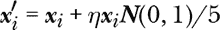

其中，*η*（η）是一个比例参数（*η* = 0.1），***N***(0, 1)是一个从均值为 0、标准差为 1 的正态分布中取样的向量。如果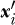的目标函数值较低，那么；否则，粒子在下一次迭代中保持原位。粒子不会利用其他粒子对搜索空间的学习结果。

##### **Jaya**

Jaya，梵语中意为“胜利”，是一种没有可调参数的群体智能算法。群体算法依赖启发式方法，因此通常会有可调参数来提高其在不同情况下的表现。而 Jaya 则不同，它要么有效，要么无效。

在每次迭代中，第*i*个粒子通过以下方式更新：

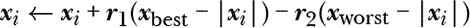

其中，***x***[best]和***x***[worst]是群体中任何粒子的当前最佳和最差位置，***r***[1]和***r***[2]是[0, 1)之间的随机向量，逐项计算。竖线符号表示对向量的每个分量取绝对值。换句话说，Jaya 将粒子移动到群体的最佳位置，远离群体的最差位置。

##### **粒子群优化（PSO）**

PSO 的更新公式取决于具体实现。我们的框架提供了两种：经典 PSO 和精简版 PSO。*curves.py*文件使用的是精简版，因此在`PSO`构造函数中设置了`bare=True`。不过，建议从经典 PSO 开始。

在经典 PSO 中，每个粒子（***x**[i]*)与另外两个向量相关联。第一个，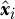，是该粒子在搜索空间中找到的最佳位置；第二个，***υ**[i]*，是粒子的速度，控制粒子在搜索空间中移动的速度和方向。

经典的 PSO 更新规则通过两个步骤完成。首先，速度更新：

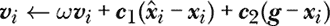

这里，*ω*是惯性因子，用来乘以当前速度。它是一个标量，通常在 0.5, 1)之间，典型的初始值为 0.9。它会随着迭代逐步减小。理论上，这会随着搜索进展而减缓粒子的速度，因为粒子很可能正接近最佳位置。第二项计算粒子目前已知的最佳位置！[Image 与其当前的位置***x**[i]*之间的差异。这个差值逐项乘以***c***[1] = *c*[1]***U***[0, 1)，即在[0, 1)之间的随机向量，再乘以标量*c*[1]。我们使用典型的值 1.49。速度更新的最后一项计算群体当前最佳位置***g***与粒子当前位置之间的差异，并将其乘以向量***c***[2] = *c*[2]***U***[0, 1)。通常，*c*[1] = *c*[2]。

其次，粒子的位置通过新计算出的速度进行更新：

***x**[i]* ← ***x**[i]* + ***υ**[i]*

**注意**

*如果你有物理学背景，并且像我一样，对速度和位置的相加感到困扰，可以想象一个* Δ t = 1 *乘以**v***[i]，其中* Δ t *是每次迭代之间的时间步长。现在单位是正确的。*

基础 PSO，有时称为 BBPSO，不使用速度向量。相反，粒子的位置通过从正态分布中抽取样本来更新。如果***x**[i]*是表示粒子*i*当前位置的向量，那么***x**[ij]*就是该向量的* j *分量。考虑到这一点，计算

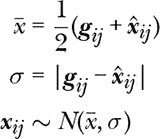

如果 *p ∼ U*[0, 1) < *p[b]*，否则

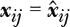

对于每个粒子（*i*）的每个分量（*j*）。这里，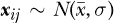表示从均值为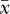、标准差为*σ*的正态分布中抽取样本。通常，*p[b]* = 0.5，因此粒子* j *的分量有 50%的几率从正态分布中计算得出，另外 50%的几率只是简单复制粒子最佳位置的对应分量。

##### **遗传算法（GA）**

从我们的进化实验中我们知道，遗传算法（GA）涉及交叉（crossover）和随机变异。*GA.py*中的代码遵循这一模式，但与整体优化框架相契合。特别是，*GA.py*默认操作浮动值，而不是整数。如果需要，你可以通过子类化`Bounds`并实现`Validate`方法来强制使用整数值。

粒子的更新规则，***x**[i]*，涉及与随机选择的配偶进行交叉，在这种情况下，配偶是从表现最好的前 50%的粒子中选择的——参见`GA`构造函数中的`top`参数。此外，当前的最佳粒子位置，即最优粒子，将未修改地传递到下一代。

我们的进化实验通过代际交配繁殖每个个体。这里，个体仅在随机值小于`CR`概率时才进行交配，默认值为 0.8。当个体繁殖时，它将被后代替代。无论***x**[i]*是否交配，都会有一定概率发生随机变异，通过为一个随机选择的维度分配一个随机值。因此，对于任何更新，粒子可能会被其后代替代，并且可能会发生随机变异。默认的变异概率为 5%（在`GA`构造函数中的`F`）。

根据经验法则，GA 似乎最适合那些非数学问题（如曲线拟合），并且涉及更多的维度，以便为进化提供更大的“基因组”进行操作。不知道这是否对生物进化有影响；无论如何，GA 的另一个特点是收敛较慢。你通常需要更多数量级的迭代（甚至更多），才能得到一个与 Jaya 或 DE 快速找到的解相似的解。让我们现在转到那里。

##### **差分进化（DE）**

DE 由 Price 和 Storn 于 1995 年发明，与此同年，粒子群优化（PSO）由 Kennedy 和 Eberhart 发明。像 PSO 一样，DE 经得起时间的考验，并已发展成一系列相似的方法。DE 是一种进化算法，其中粒子在每次迭代之间通过交叉和突变的过程更新。然而，与遗传算法（GA）中直接的交叉和突变不同，DE 用一个新向量替换***x**[i]*，从某种意义上说，这个新向量是*四个*父代的后代。DE 并不是模仿自然的。

为了更新粒子***x**[i]*，首先选择群体中其他三个成员，且它们不能是***x**[i]*。从这三个成员中创建一个捐赠向量：

***υ*** = ***υ***[1] + *F*(***υ***[2] – ***υ***[3])

某些 DE 变种要求***υ***[1]是群体中表现最好的成员，而不是随机选择的成员。在这种情况下，*F*在遗传算法中起到突变的作用。此时，默认值为*F* = 0.8。

***x**[i]*和***υ***的后代是逐个分量（逐基因）创建的，其中，在概率*CR*下，使用***υ***的对应分量；否则，保留***x**[i]*的分量。默认值为*CR* = 0.5，意味着***x**[i]*的后代平均保留 50%的现有值（基因）。

DE 有很多变种，因此出现了专门的命名法来描述它们。*DE.py*中的代码默认为“DE/rand/1/bin”，这意味着捐赠向量使用三个随机选择的向量（“rand”），一个差分（***υ***[2] – ***υ***[3]），以及*伯努利*交叉（“bin”）。伯努利试验类似于掷硬币，其中成功的概率为*p*，失败的概率为 1 – *p*。这里，*p* = *CR*是交叉概率。

`DE`类支持两种额外的选择类型和一种额外的交叉类型，如果你想尝试它们的话。如果用于构建捐赠向量的三个向量之一始终是当前群体中的最佳向量，则标签会以“DE/best/1”开头。此外，支持一种新的选择模式：DE/toggle/1，它在每次更新时在“rand”和“best”之间切换。最后，伯努利交叉可以替换为遗传算法风格的交叉，这意味着`DE`类支持来自三种不同选择和两种交叉类型的六种差分变体。你可以随意尝试它们。你注意到它们之间有什么不同吗，尤其是在群体收敛的速度上？提示：查看`DE`的`Results`方法返回的字典中`gbest`元素的所有值，以及跟踪每个新群体最佳位置（`gpos`）和目标函数值（`gbest`）的`giter`元素。

本节的目标是通过最小化数据点和函数值之间的均方误差（MSE），将已知函数拟合到数据集上。我们要寻找的是函数的参数，因为我们已经知道了我们想要的形式。这就引出了一个问题：如果我们只有数据，而不知道函数的形式怎么办？有几种方法可以解答这个问题。一个是使用机器学习模型——毕竟，机器学习模型的设计目的就是：从一组数据中学习一个模型（函数）。我们将在第五章中讨论这个问题。另一种方法是进化出一段逼近数据的代码。让我们尝试这种方法。

### **拟合数据**

曲线拟合要求我们搜索已知函数的参数。在这一节中，我们只有数据，而我们的目标是进化出一段代码，使得它能够逼近一个拟合数据的函数。我们依然希望*y* = *f*(*x*)——也就是说，对于给定的*x*，我们得到一个近似的*y*——但这里的*f*(*x*)是 Python 代码。进化代码被称为*遗传编程（GP）*，它有着悠久的历史，追溯到 1990 年代初期。相关的术语是*符号回归*。

正如名称所示，GP 通常使用 GA。然而，我们的实现采用了前一节中的框架，因此我们可以选择任何一种群体智能和进化算法。为了使用群体算法，我们需要找到我们想要的（代码）和一个多维空间之间的映射关系，其中空间中的每个位置表示一个可能的解。对于曲线拟合，映射关系很直接。如果函数中有*n*个参数，那么在搜索空间中也有*n*个参数，每个特定点的坐标实际上就是该参数的值。

在这里，我们需要更聪明一点。为了识别映射关系，我们可以考虑如何表示我们函数的代码，从这个角度出发，映射关系可能会更容易理解。

我们希望一个函数能够处理标量输入值*x*，并得出标量输出值*y*。所以，我们需要进行数学运算。我们将使用标准的算术运算，另外加上取反、模运算和幂运算。

做数学运算意味着数学表达式。在这里，事情变得更加复杂。操控数学表达式相当棘手，比我们在这本书中愿意讨论的还要复杂。传统的 GP 使用进化算法操作表达式，包含交叉和变异，交叉将两个表达式合并，而变异则改变表达式中的一个项。

幸运的是，我们可以使用一个捷径。如果我们有一个栈，并且了解后缀表示法，我们就可以具备生成表达式并将代码映射到搜索空间中的位置所需的一切。我将做详细解释，但在此之前，我们需要确保我们对栈和后缀表示法有一个清晰的认识。

#### ***介绍栈和后缀表示法***

想象一下自助餐厅托盘的堆叠。当新的托盘被添加到栈中时，它们会放在所有现有托盘的上面。当有人需要托盘时，他们拿取最上面的托盘，这意味着最后被添加到栈中的托盘是第一个被拿走的托盘。*栈*就像自助餐厅的托盘（虽然更干净）。

考虑这个例子。我们有三个数字：1、2 和 5。我们还有一个当前为空的栈。我们首先将 1*推入*栈，然后推入 2，最后推入 5。*图 4-3*显示了栈的变化过程，从左到右。

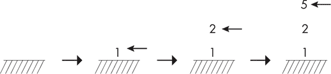

*图 4-3：栈操作*

在左侧，栈是空的；然后，向右移动，我们依次添加 1、2，最后添加 5。此时栈的深度为三，底部是 1，顶部是 5。

现在是时候*弹出*栈中的一个值了。我们得到什么值？在队列中，我们会得到 1，即第一个进入的值。而在栈中，我们得到 5，即最后一个被推入的值。再次弹出栈，我们得到 2，最后得到 1，栈变为空。栈中的值是按相反顺序弹出的，与它们被推入栈的顺序相反。

栈是操作*后缀*形式表达式的自然结构，即操作数先出现，运算符跟在其后。例如，常用的中缀表示法，我们通常写作*a* + *b*，而在后缀表示法中，这变成了*a b* +。后缀表示法，也叫逆波兰表示法（RPN），是由波兰数学家扬·Łukasiewicz 于 1924 年提出的。后缀表示法不需要括号来改变运算符的优先级。相反，它是逐步构建表达式的。将后缀表示法与栈结合起来，评估任意表达式变得非常简单。这正是我们所需要的。

为了更好地理解我的意思，我们将中缀表达式*y* = *a*(*b* + *c*) – *d* 转换为后缀表示法，并使用栈和伪代码实现它。在后缀表示法中，它变成了*a b c* + × *d* –。要评估它，从左到右移动，直到遇到运算符，这里是+。操作数是左侧的两个变量，*b*和*c*。计算*b* + *c*并将“*b c* +”替换为结果*t*[0]。此时表达式变为*a t*[0] × *d* –。重复此过程以找到×，操作数为*a*和*t*[0]。计算乘积并将其替换为*t*[1]，得到*t*[1] *d* –。最后，评估*t*[1] – *d*，得到表达式的值*y*。

让我们在代码中实现这个过程，使用栈来保存值。请考虑以下内容：

```
push(a)  | a
push(b)  | a b
push(c)  | a b c
add      | a t0
mul      | t1
push(d)  | t1 d
sub      | y
```

右侧的值显示了每条指令执行后栈的状态，其中*t*[0] = *b* + *c*，*t*[1] = *a* × *t*[0]，*y* = *t*[1] – *d*。这些表达式将结果*y*留在栈上，而`push`指令则将值压入栈中。像`add`这样的二元操作会从栈中弹出两个值，进行相加，并将结果重新压入栈中。因此，一系列的线性语句和栈就是我们实现任何关于*x*并得到*y*的函数所需的——至少，对于涉及算术运算、取反和幂运算的函数。

以这种方式编写的函数成为没有循环的指令序列。如果我们找到将这些序列映射到浮点向量的方法，那么我们就成功了。

#### ***代码与点的映射***

要演化代码，我们需要四种基本的算术运算：加法（`add`）、减法（`sub`）、乘法（`mul`）和除法（`div`）。我们还需要指数运算（`pow`），并且为了稳妥起见，我们还加入了取模运算（`mod`）。

后缀表示法区分了减法运算符和取反运算，后者被视为不同的指令，因此我们还需要取反（`neg`）指令，*x →* –*x*。

最后，我们需要两条指令：`halt`和`push`。如果执行了`halt`，代码会停止，并忽略之后的任何指令。`push`指令会将*x*或一个数字（常数）压入栈中。

我们有九条指令。我们希望按顺序执行一系列指令，这让我想起一个向量，其中每个元素是一个指令，我们从索引 0 开始，一直到向量的末尾执行这些指令。

每条指令都变成一个值，例如，`add`是 1，`sub`是 2，所以如果某个粒子的某个组件是 2，那么这个组件就表示减法指令。粒子位置是浮点数，不是整数，所以我们只保留每个位置的整数部分，这意味着一个浮点值为 2.718 的组件会被解释为 2，从而意味着减法指令。

表 4-1 包含了我们将用于指令的映射（粒子位置的整数部分）。

**表 4-1：** 粒子位置与指令的映射

| **指令** | **编号** |
| --- | --- |
| `add` | 1 |
| `sub` | 2 |
| `mul` | 3 |
| `div` | 4 |
| `mod` | 5 |
| `pow` | 6 |
| `neg` | 7 |
| `push(x)` | 8 |
| `halt` | 9 |

剩下的就是处理将常数压入栈中。如果我们不能做到这一点，我们就只能演化出类似*x*的表达式，比如*xx* + *x* – *x* – *x*，这将毫无意义。

指令编号从 1 开始，而不是 0。这是故意为之。这样编号使得向量组件在 0, 1)范围内可用，因为这个范围没有与任何指令相关联。

让我们使用这个范围将任意数字压入栈中。当我们运行搜索时，我们会指定一个最小值和最大值，比如-1 和 11。然后，我们将[0, 1)范围内的值映射到[–1, 11)范围。因此，要将常数 3.1472 压入栈中，我们发出指令 0.3456，因为：

*a* + *f*(*b* – *a*) = –1 + 0.3456(11 – ^–1) = 3.1472

通过这种方式处理，可以让我们在给定的范围内指定任意的常数值。

例如，[表 4-2 展示了由 *gp.py* 生成的一段代码，该程序是我们正在开发的，同时也给出了实际的粒子位置值。

**表 4-2：** 一个进化代码示例

| **指令** | **粒子值** |
| --- | --- |
| `push(x)` | — |
| `push(x)` | 8.5251446 |
| `push(3.00482)` | 0.6502409 |
| `mul` | 3.3605457 |
| `push(7.07870)` | 0.8539350 |
| `push(-9.09650)` | 0.0451748 |
| `mod` | 5.0708302 |
| `add` | 1.3708454 |
| `halt` | 9.7707617 |
| `div` | 4.2693693 |
| `sub` | 2.6309877 |
| `div` | 4.6783009 |
| `pow` | 6.5429319 |

任务是拟合一个表示直线的噪声数据集。进化后的函数很好地拟合了这些数据。这个案例中的数字限制是 –10 到 10，我让搜索（简单粒子群优化，PSO）使用 12 条指令。所有进化后的函数都会以 *x* 开始，栈上最初表示的是 `push(x)`。此外，当函数退出时，它会返回栈顶的值作为 *y*，剩余的栈值会被忽略。

如果粒子值 ≥ 1，则整数部分指定一个指令，所以 8.525 *→* 8，这表示推送 *x*，就像 3.360 *→* 3 表示乘法。

看一下第二个粒子向量分量 0.6502409，它在数字限制下变为：

–10 + 0.6502409(10 – ^–10) = 3.00482

这个数字将与 *x* 相乘，即第二条和第三条指令实现了 3.00482*x*。这些数据点是通过给直线 3*x* – 2 添加少量随机噪声生成的。进化后的函数立即实现了 3.00482*x*，这非常令人鼓舞。

接下来的三条指令将 7.07870 和 –9.09650 推入栈中，然后执行 `mod`。这看起来是一个奇怪的操作，但考虑一下 Python 对表达式的处理方式：

```
>>> 7.07870 % -9.09650
-2.0178000000000003
```

这些指令将 –2.0178 留在栈上。

接下来的指令是 `add`。我们将栈顶的两个值相加，刚才我们得知它们是 3.00482*x* 和 –2.0178。有趣的是，这等价于中缀表达式 3.00482*x* – 2.0178，而我之前提到这些数据点是通过 3*x* – 2 生成的。进化后的代码实现了当初生成数据点时使用的表达式。

紧接着 `add` 的指令是 `halt`，它使得函数退出，并将栈上的和作为结果。`halt` 之后的指令永远不会被执行。

太棒了！我们有了一个方法，一种将浮点向量映射到代码以实现函数的方式。它有点奇怪，但我们将继续尝试，看看能走到哪里。接下来的任务是创建 *gp.py*。

#### ***创建 gp.py***

如果你还没有阅读过 *gp.py*，请先浏览一遍。所有基本的框架部分都在那里，我们不会讨论每一行，所以在开始之前了解它将会有所帮助。

代码导入了之前曲线拟合练习中的所有框架组件；在主代码之前定义了一些辅助函数（`GetData`、`Number StrExpression`）和目标函数类，这些代码解释命令行；构造框架对象；并运行搜索。让我们在这里回顾 `Number` 和目标函数类。主代码与曲线拟合代码相似。

`Number` 函数将粒子值从 [0, 1) 转换为在执行 *gp.py* 时命令行上指定的范围。具体而言：

```
def Number(f, gmin=-20.0, gmax=20.0):
    return gmin + f*(gmax-gmin)
```

这是对前面方程的直接实现，`gmin` 和 `gmax` 是命令行上传递的限制。这些限制约束了进化代码可用的常数范围；因此，可能需要一些实验来找到合理的限制。例如，如果你运行搜索并看到常数达到了限制，那么指定的范围可能太小，可以将其大小加倍再试一次。请记住，群体智能和进化算法是随机的和启发式的。控制它们操作的参数非常多，通常需要管理这些参数以获得好的结果。

一次成功的群体搜索利用一个目标函数，引导群体朝着好的解决方案前进，这里是通过一段代码最小化已知数据点与这些数据点输出结果之间的均方误差（MSE）。因此，我们接下来的关注点是目标函数类 `Objective`：

```
class Objective:
    def __init__(self, x,y, gmin=-20.0, gmax=20.0):
        self.fcount = 0
        self.x = x.copy()
        self.y = y.copy()
        self.gmin = gmin
        self.gmax = gmax

    def Evaluate(self, p):
        self.fcount += 1
 y = np.zeros(len(self.x))
        for i in range(len(self.x)):
            y[i] = Expression(self.x[i],p, self.gmin, self.gmax)
            if (np.isnan(y[i])):
                y[i] = 1e9
        return ((y - self.y)**2).mean()
```

该类有两个方法，一个是构造函数，另一个是 `Evaluate`。构造函数保存数据点和命令行传递的数字限制。它还初始化了 `fcount`，用于追踪目标函数被评估的次数。

`Evaluate` 方法接受粒子位置（`p`），并通过它传递数据点的 *x* 坐标，生成输出向量 `y`。然后，它返回 `y` 和 `self.y` 之间的均方误差（MSE）作为目标函数值。

并不是每个由粒子位置表示的代码都是有效的。尤其是在搜索初期，随机生成的粒子位置可能会变成失败的代码块，因为它们尝试做一些不可能的操作，比如从空栈中提取值或除以零。`Evaluate` 中的 NaN 检查捕捉到这些情况，并确保返回一个非常高的目标函数值。

`Expression` 函数将粒子位置作为代码进行评估。它接受 *x* 值、粒子位置（`p`）和数字范围；请参见 Listing 4-1。

```
def Expression(x, expr, gmin=-20.0, gmax=20.0):
 ➊ def BinaryOp(s,op):
        b = s.pop()
        a = s.pop()
        if (op == 0):
            c = a + b
        elif (op == 1):
            c = a - b
        elif (op == 2):
            c = a * b
        elif (op == 3):
            c = a / b
        elif (op == 4):
            c = a % b
        elif (op == 5):
            c = a**b
        s.append(c)

    bad = 1e9
 ➋ s = [x]
    try:
     ➌ for e in expr:
            if (e < 1.0):
                s.append(Number(e, gmin=gmin, gmax=gmax)) else:
                op = int(np.floor(e))
                if (op < 7):
                    BinaryOp(s, op-1)
                elif (op == 7):
                    s.append(-s.pop())
                elif (op == 8):
                    s.append(x)
                elif (op == 9):
                    break
    except:
        return bad
    try:
     ➍ return s.pop()
    except:
        return bad
```

*Listing 4-1：将粒子位置解释为代码*

列表 4-1 是*gp.py*的核心部分。首先，有一个嵌套函数`BinaryOp` ➊，它实现了所有二进制操作，如加法和指数运算。栈（`s`）是一个标准的 Python 列表，弹出两次以获取操作数。注意顺序：如果我们想要*a* - *b*，并且*b*是栈顶项，那么第一次弹出的是*b*，而不是*a*。第二个参数决定了操作类型。一种更紧凑的实现可能会使用 Python 的`eval`函数。然而，我们需要尽可能快，所以我们选择了冗长但显著更快的复合`if`结构。

代码使用*x* ➋初始化栈，然后开始对粒子位置（`expr`）的组件进行循环 ➌。所有内容都在`try`块内，以捕获任何错误。错误将返回`bad`作为函数值。

如果粒子组件小于 1.0，它会将常量`Number`的输出压入栈中。否则，值的整数部分决定了操作。如果小于 7，则执行适当的二进制操作；否则，指令是取反、推送*x*或停止，后者会跳出循环，从而忽略剩余的粒子组件。最后，函数返回栈顶项（如果有的话）作为函数值 ➍。

*gp.py*的其余部分很简单：解析命令行，创建框架对象（`Bounds`、`RandomInitializer`、`Objective`），然后，使用适当的群体对象，调用`Optimize`和`Results`来报告搜索的效果。如果给定了最终的图表名称，我们将生成图表，展示数据点和拟合结果。

我们的曲线拟合代码使用了基本的 PSO。该代码同时使用了基本 PSO 和经典 PSO：

```
elif (alg == "PSO"):
    swarm = PSO(obj=obj, npart=npart, ndim=ndim, init=i, tol=0, max_iter=niter, bounds=b, 
                rng=rng, vbounds=Bounds([-10]*ndim, [10]*ndim, enforce="clip", rng=rng), 
                inertia=LinearInertia(), ring=True, neighbors=6)
 elif (alg == "BARE"):
    swarm = PSO(obj=obj, npart=npart, ndim=ndim, init=i, tol=0, max_iter=niter, bounds=b, 
                rng=rng, bare=True)
```

我们可以通过在命令行中传递`PSO`或`BARE`来区分这两者。请注意，PSO 使用了一些我们之前没有见过的选项。其中之一是`LinearInertia`，它在线性下降的过程中将*ω*从 0.9 减少到 0.4。惯性是每个粒子上一个迭代的速度与当前速度的乘积系数。

还有三个额外的选项。两个是`ring`和`neighbors`，它们一起工作。经典 PSO 的一种变体包括*邻域*的概念，邻域是相互协调的粒子集合。邻域的实际效果是将全局最佳位置***g***替换为邻域最佳位置。粒子安排成邻域的方式被称为*拓扑结构*。`PSO`类支持环形拓扑结构——最简单的一种。可以想象粒子形成一个圆圈；然后，对于任何粒子，左侧和右侧的`neighbors`粒子构成当前粒子的邻域。作为挑战，试着修改*PSO.py*以适应冯·诺依曼邻域，这是性能最佳的拓扑之一。通过在网上仔细搜索，你会发现冯·诺依曼拓扑的详细信息。

最后的新选项是`vbounds`，它设置了每个粒子组件的最大速度限制，类似于`bounds`设置粒子群在搜索空间中的位置限制。在速度的情况下，`enforce`是`clip`，以保持速度组件在限制内，而不是沿该维度重新采样。

可调参数的数量有时使得设置一个成功的标准 PSO 搜索变得棘手，即使有邻域的支持也是如此。因此，这些值更像是“指导方针”而不是实际规则。

现在，让我们测试一下*gp.py*，看看它能为我们做什么（以及不能做什么）。

#### ***演化拟合函数***

让我们通过几个实验来测试一下*gp.py*。

##### **拟合一条直线**

要运行*gp.py*，可以使用如下命令行：

```
> python3 gp.py data/x1_2n.txt -5 5 22 20 10000 bare minstd plot.png
```

非法操作很可能会在搜索的早期发生，因此我建议通过添加`-W ignore`来忽略运行时错误。命令行使用了输入文件*x1_2n.txt*，这就是之前提到的嘈杂直线。数值被限制在–5, 5)范围内，程序的最大长度是 22 条指令，尽管`halt`通常会出现在更早的时候。

粒子群有 20 个粒子，并运行 10,000 次迭代，使用基础的 PSO 算法和 MINSTD 随机数源。结果会写入*plot.png*，并且代码本身会显示出来：

```
Minimum mean total squared error: 0.385596890  (x1_2n.txt)
    push(x)
    push(x)
    add
    push(x)
    add
    push(4.82483)
    push(2.39118)
    div
    sub
    halt
    add
    mod
    div
    sub
    sub
    sub
    div
    mul
    halt
    push(x)
    pow
    add
    div
(23 best updates, 200020 function calls, time: 257.076 seconds)
```

请注意，`halt`出现在第九条指令中（最初的`push(x)`始终存在，因此不算在内）。

[图 4-4 展示了原始数据点以及拟合函数的输出。

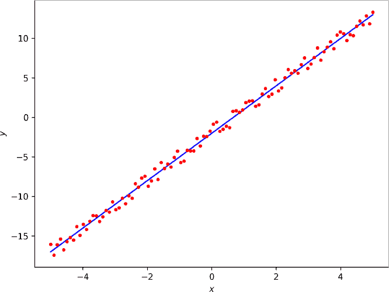

*图 4-4：拟合嘈杂的直线*

拟合效果很好，这令人鼓舞。如果我们连一条直线都拟合不好，那么就不应该期待能拟合更复杂的函数。

我们现在有了两种不同的拟合直线的方法，但达到解决方案的演化路径完全不同。第一个解决方案是演化得到的

(*x*)(3.00482) + (7.07870 mod – 9.09650) = 3.00482*x* – 2.0178

但是第二个方案得到了：

*x* + *x* + *x* – (4.82483 / 2.39118) = 3*x* – 2.01776

第二个解决方案将*x*与自身相加三次，而不是与一个常数相乘。两种解决方案都得到了几乎相同的截距，不是通过推动学习到的值，而是通过实施两个学习到的值的不同二进制操作。

*data*目录包含多个数据集，其中许多是*gpgen.py*的输出，您可以使用它们创建自定义数据集，生成最多五次幂的嘈杂多项式。运行*gpgen.py*而不带参数可以了解它的工作原理。现在，让我们使用其中的一些数据文件，推动*gp.py*的极限。

##### **拟合一个二次函数**

我们很容易就演化出了直线方程。那二次方程呢？

```
> python3 gp.py data/x2_2n.txt -5 5 22 20 10000 bare minstd plot.png
```

对我来说，运行结果是：

```
Minimum mean total squared error: 0.263703051  (x2_2n.txt)
    push(x)
    push(x)
    mul
    push(-2.97844)
    sub
    push(x)
    sub
    push(x)
    sub
    halt
(98 best updates, 200020 function calls, time: 290.683 seconds)
```

`halt`之后的指令会被忽略，因为它们没有任何效果。从现在开始，我会始终如一地这样做。得到的拟合结果见图 4-5。

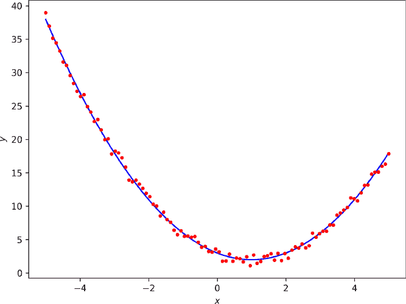

*图 4-5：拟合嘈杂的二次函数*

演化出的代码等价于：

(*x*² – ^–2.97844) – *x*) – *x*) = *x*² – 2*x* + 2.97844

将相同的数据集提供给 NumPy 的 `polyfit` 例程，结果为：

*x*² – 2.02*x* + 2.99

这让我们对进化搜索越来越有信心。

##### **拟合一个四次方程**

之前的例子都使用了最基本的 PSO，看起来它非常适合这个任务。让我们尝试不同的数据集，一个四次方程，并使用不同的算法。它们的效果是否一样好？

具体来说，我们将拟合 *x4_-2x3_3x2_-4x_5_50n.txt* 中的点，这是一种四次方程的噪声版本，*y* = *x*⁴ – 2*x*³ + 3*x*² – 4*x* + 5。唯一从一次运行到下一次运行变化的参数是优化算法。例如，这里是最基本的 PSO 命令行：

```
> python3 gp.py data/x4_-2x3_3x2_-4x_5_50n.txt -25 25 22 25 15000 bare pcg64 plot.png
```

要使用差分进化算法，只需将 `bare` 改为 `DE` 并重新运行。我们将查看每个算法的单次运行结果。

该框架的设计注重清晰性，而非速度。由于每个粒子独立评估目标函数，因此有很多并行化的机会。不幸的是，我们没有利用这些机会，因此需要耐心来复制每个算法的搜索过程：DE、最基本的 PSO、典型 PSO、Jaya、GA 和 RO。此外，框架不使用种子值，因此你运行的代码将产生不同的输出，但可能相似。

图 4-6 显示了每个算法的拟合情况，从左上角的 DE 到右下角的 RO。

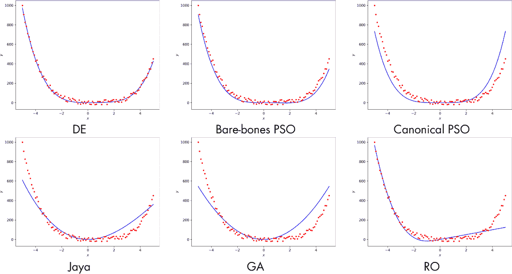

*图 4-6：每个算法的拟合结果*

显然，并非每个算法都达到预期的效果。表 4-3 显示了它们生成的等效方程。

**表 4-3：** 每个算法进化得到的拟合方程

| **算法** | **等效方程** |
| --- | --- |
| NumPy | *y* = 1.01*x*⁴ – 2.01*x*³ + 2.76*x*² – 3.34*x* + 5.76 |
| 差分进化 | *y* = *x*⁴ – 2.19254*x*³ + 3*x*² |
| 最基本 PSO | *y* = *x*⁴ – 2.23835*x*³ |
| 典型 PSO | *y* = *x*^(4.09896) |
| Jaya | *y* = –*x*³ + 19.36026*x*² |
| GA | *y* = 21.78212*x*² |
| RO | 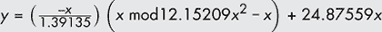 |

第一个方程是 NumPy 的 `polyfit` 例程返回的拟合结果。数据是从四次方程生成的，所以我们预计 NumPy 的拟合结果是最好的，我们将其视为黄金标准。

差分进化算法（DE）得到了最优拟合的函数。将其与 NumPy 的拟合结果进行比较。DE 的拟合恢复了多项式的前三项，系数与 NumPy 的拟合结果差不多。类似地，最基本的 PSO 恢复了多项式的前两项。典型的 PSO 仅恢复了第一项，*x*⁴（或接近）。

Jaya 产生了一个令人兴奋的结果。两个项彼此相互作用，但它们的和成为了数据集的粗略近似。作为练习，试着绘制 –*x*³，19.36*x*² 及其和，看看我的意思。

GA 和 RO 都产生了较差的输出。GA 最终得到了一个二次方程，而 RO 无论如何拟合的只是左侧的数据集点，*x* < –3 左右。

这些结果来自单次运行。我们知道，群体优化算法是随机的，并且每次运行的结果会有所不同。也许我们这样做有点不公平。于是我又进行了五次 Jaya 搜索，以下是得到的等效方程：


结果表明，Jaya 算法并未很好地收敛到局部最小值。它要么捕捉到了数据的* x *⁴特征，要么停留在二次项上。

Jaya 并不是唯一可能被低估的算法。GA 和 RO 在初始运行时产生了较差的结果。如果我们增加群体规模并进行更多迭代，会怎么样呢？直观地说，这些算法可能确实适合这样做。搜索粒子越多，我们就越有可能在搜索空间中找到好的位置，因此 RO 使用较大的群体是有道理的。对于 GA 来说，较大的种群增加了基因库的规模，因此我们也应当能够获得更好的性能，这就像第三章中基因漂变的例子，较大种群能在灾难发生后更好地适应环境。

使用 RO 算法运行 125 个粒子的群体，进行 150,000 次迭代，得到了一个计算公式为 21.54962*x*²的函数，但这并不令人鼓舞，因为 RO 甚至没有捕捉到数据集的四次项特性。使用 512 个粒子（有机体）运行 GA 算法，进行 30,000 次迭代，并要求所有有机体与表现最好的 20%成员（`top=0.2`）进行繁殖，得到了图 4-7，其中包含显示拟合结果的图表。

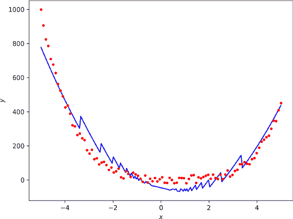

*图 4-7：遗传算法对于 512 个有机体和 30,000 代的解决方案*

演化出的指令集如下：

```
push(x)

push(-21.60479)

mul

push(21.92950)

push(-24.20913)

sub

sub

push(-24.96894)

push(-11.43579)

neg

neg

push(-21.53894)

sub

push(x)

mod

mul

push(x)

push(x)

mul

push(23.76431)

mul

add

add
```

这个函数相当奇怪，使用了所有 22 条可能的指令（初始的`push(x)`始终存在），这与其他算法得到的结果也有很大不同。等效的函数是

*y* = 23.76431*x*² – 21.60479*x* – 46.13863 – 24.96894(10.10315 mod *x*)

这种形式更有意义：一个带有额外模运算项的二次函数，从而能够解释在一般二次形式上方出现的奇怪振荡。

##### **拟合正态曲线**

前面的例子试图演化一个函数来匹配一个多项式。如果我们改为拟合一个噪声正态（高斯）曲线，会发生什么呢？在加入随机噪声之前，源函数为：

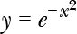

含噪声的数据点在*noisy_exp.txt*中。

我进行了三次搜索，分别是 DE、简化 PSO 和 Jaya。所有搜索都使用了 25 个粒子和 20,000 次迭代。我将数值限制在[–25, 25]之间，并且对演化出的函数限制了最大指令数为 22 条。

图 4-8 展示了拟合结果。

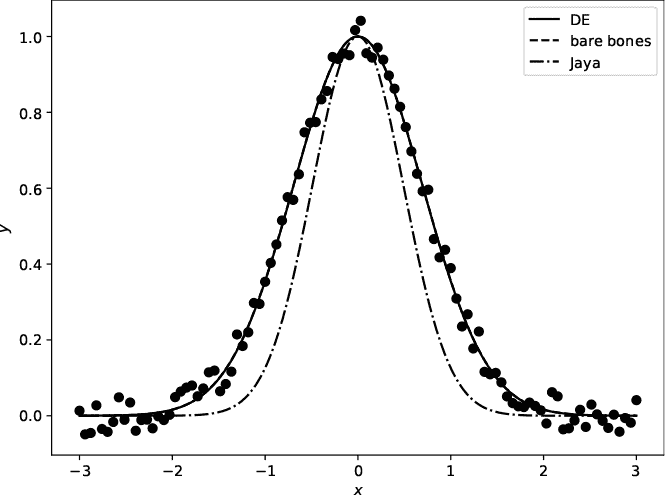

*图 4-8：演化一个函数以拟合噪声正态曲线*

DE 和裸骨 PSO 的结果几乎相同，并且重合。它们很好地拟合了数据集。正如我们在其他实验中看到的，Jaya 接近但没有产生像其他算法那样好的拟合。

那么，演化出的函数是什么？在这种情况下，不仅等效的函数是具有示范性的，代码的形式也是如此，因此我们将一起考虑这两者；见 表 4-4。

**表 4-4:** 按算法比较演化出的程序

| **DE** | **裸骨 PSO** | **Jaya** |
| --- | --- | --- |
| `push(x)` | `push(x)` | `push(x)` |
| `push(x)` | `push(x)` | `neg` |
| `push(0.35484)` | `push(x)` | `push(7.95565)` |
| `push(x)` | `push(2.80857)` | `push(x)` |
| `push(x)` | `push(x)` | `pow` |
| `mul` | `neg` | `push(x)` |
| `pow` | `push(x)` | `neg` |
| `halt` | `mul` | `pow` |
|  | `pow` | `halt` |
|  | `halt` |  |

演化出的等效函数是 *y* = 0.35484^(*x*²)（DE），*y* = 2.80857^(–*x*²)（裸骨 PSO），以及 *y* = 7.95565^(–*x*²)（Jaya）。再次强调，我们试图从噪声数据中恢复的函数是

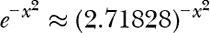

我在这里用 *e* 的前五位数字进行了近似。以这种方式写出来，很明显裸骨 PSO 搜索几乎精确地演化出了这个函数，所以我们应该期望它能够很好地拟合数据。

DE 结果一开始看起来很奇怪。它是一个指数函数，但底数是 0.35484，而不是 *e*，指数是 *x*²，而不是 –*x*²。然而，1/*e* ≈ 0.36788，这意味着 DE 演化出了与裸骨 PSO 相同的函数，因为

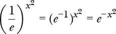

而且 0.35484 相当接近 0.36788。最后，Jaya 有正确的思路，但没有收敛到正确的底数，7.95565 > *e*。

### **练习**

群体算法的应用非常广泛。以下是你可能希望更详细探索的一些内容：

+   在 *curves* 目录下，你会找到一个 *NIST* 目录。它包含了来自美国国家标准与技术研究院（NIST）的示例曲线拟合数据文件，NIST 是美国商务部的一部分。我已经将 *.txt* 版本进行了格式化，以便它们能够与 *curves.py* 一起使用。原始版本以 *.dat* 结尾。

    这些是具有挑战性的曲线拟合测试文件，旨在测试高性能的曲线拟合程序。是否有任何群体算法能够接受这一挑战？如果可以，哪些文件能够拟合，哪些无法拟合？

+   `Results` 方法是群体对象的一部分，返回一个字典，正如我们在本章中所看到的那样。我们可以通过使用 `gbest` 和 `giter` 字典中的值，追踪目标函数值随群体迭代的变化。第一个是每个新的全局最优目标函数值的列表，第二个是标记该值成为全局最优的迭代次数的列表。

    查看*plot_gbest_giter.py*中的代码，了解如何绘制这些值以跟踪群体在搜索过程中的学习。使用本章中的示例捕获其他搜索的相应列表，绘制类似的图表。不同的群体是否在相同问题上以相同的速度收敛？

+   *gaussian.py*文件位于*micro*目录中，执行群体搜索，旨在最小化一个由两个倒转正态曲线构成的二维函数，即函数为*z* = *f*(*x*, *y*)。*gaussians.png*文件展示了该函数的三维图，函数有两个最小值，其中一个比另一个低。由于要最小化的函数有两个输入，因此搜索空间是二维的，这使得可以绘制群体中每个粒子的位置，并在搜索过程中追踪它们的移动。

    运行*gaussian.py*，不带任何参数，以了解如何进行搜索，并输出每一步群体的图像。然后，翻阅这些图像，观察群体如何搜索。已知的最佳位置是空框，群体当前的最佳位置是星号。修改算法，观察它们如何收敛并遍历空间。不同的算法搜索空间的方式一样吗？它们是否收敛到全局最小值，如果是，收敛的速度一样吗？

+   *GWO.py*文件，也在*micro*目录下，实现了灰狼优化算法（Grey Wolf Optimizer，GWO）。GWO 是一种流行的群体智能算法，理论上模拟了狼群狩猎时的行为（我并不认同这一点）。

    使用*gaussian.py*测试 GWO，然后将*curves.py*和*gp.py*改编为也使用 GWO。只需要简单的复制粘贴。GWO 的表现如何，与 DE、简化版 PSO 和 Jaya 相比怎么样？通常有人声称，GWO 没有可调参数，就像 Jaya 一样。这并不完全正确。`eta`参数，默认值为 2，是可以调整的，有时调整它有助于搜索。如果 GWO 表现不好，可以调整`eta`，例如设置为 3 或 4，再试一次。

+   考虑一下*MiCRO.py*中的代码，它也位于*micro*目录下。这个代码实现了一种带有讽刺意味的群体算法，灵感来源于放牧的牛群，我称之为*最小意识随机优化*（Minimally Conscious Random Optimization）。它旨在展示如何轻松地创建一个“新颖的”，“受自然启发”的群体算法。MiCRO 背后的理念是，群体就像是一群牛，它们在完全无视彼此的情况下，毫无目的地放牧。每次迭代时，以一定的概率，某只动物可能会抬头，考虑另一个位置比它自己的位置更好。如果发生这种情况，这只动物就会跳到那个表现更好的邻居周围的区域，并继续放牧。所以，这个算法是 RO（随机优化），但有一个轻微的概率能够注意到表现更好的邻居；因此，群体是*最小意识的*。

    使用*gaussian.py*探索 MiCRO 的表现，然后利用*RO.py*和*MiCRO.py*中的代码作为指南，发明你自己的群体算法。你的算法有效吗？表现好不好？它真的是受自然启发的吗，还是这种“自然启发”只是事后的一种辩解？

+   *gp.py* 演化出的代码仅限于算术运算、幂运算和取模运算。请添加正弦、余弦和正切运算符作为可用操作符。每个操作符从栈中取出一个项，并返回一个项到栈中。

    尝试拟合 *cos.txt*、*sin.txt* 和 *tan.txt* 数据集，这些文件位于 *data* 目录下。群体算法能做到吗？

最近的研究表明，GWO（灰狼优化算法）与其他几种流行的自然启发算法完全不新颖，它们不过是将旧的粒子群优化（PSO）思想包装在常常牵强的比喻中。既然如此，难免会有人好奇我为什么会把 GWO 列在这里。本书的重点是实用性和易于应用。GWO 很受欢迎，并且在提供问题解决方案方面表现良好。从这个角度看，是否新颖并不重要。对于更广泛的优化领域，理解什么是新颖的，什么不是，至关重要。我怀疑，最终，许多自然启发算法会证明它们只是对已有方法的另类演绎。但是，如果 GWO 有效，那就有效，所以我们将它保留在我们的小算法集合中，尽管这可能会让真正的优化研究者感到不满。

文件 *nature-inspired_algorithms.pdf* 列出了几十种自然启发和物理启发的群体优化算法。这个列表并不是详尽无遗的。

### **总结**

本章向我们介绍了群体智能和进化算法。我们使用软件框架开发了两个应用程序：一个是将数据拟合到已知的函数形式，即传统的曲线拟合，另一个是从头开始演化代码以实现最佳拟合函数。我们学习了如何使用框架，并通过探索每种群体算法来发展直觉，了解它们是如何工作的，以及如何最好地应用。每种群体算法都严重依赖于随机性，从粒子初始化配置到每个更新步骤，它们都会在搜索空间中移动粒子。

本章的实验通过定位已知函数形式的最佳参数或从头开始演化函数来拟合数据。两种尝试都取得了成功，尽管并不是每个算法的表现都同样出色。

DE（差分进化）证明非常适合这些任务，进一步证明了它作为常用算法的价值。然而，我很惊讶看到最简单的 PSO 表现得这么好。标准 PSO 并没有那么有效，但它有更多的参数可以调整，因此可能通过一些实验来改进（你可以调整 *c*[1]、*c*[2]、*ω*，即惯性参数的变化以及其他参数）。

Jaya 算法并非完全令人失望，但其表现与我在其他地方使用时相似——既不特别好也不特别差。它有时能够恢复函数形式的本质，但不能恢复其具体细节，即使允许多次迭代。作为最终的例子，我再次使用 Jaya 算法运行了一个搜索，以拟合噪声正态函数，并进行了 120,000 次迭代，是之前的六倍。结果比第一次运行的拟合更差，后者的函数是

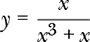

该函数看起来与正态曲线有些相似，但并未很好地拟合数据。

严格来说，RO（重置优化）并不是一种群体算法，因为粒子之间并不相互影响。不过，结合这里的示例和在其他领域的经验，RO 在许多情况下仍值得尝试。我们将在第五章中再次遇到 RO。

曲线拟合并不是遗传算法（GA）的强项。我们在第三章中了解到，当模拟自然选择和基因漂变时，遗传算法是有效的。此外，我们几乎没有深入探讨它的一些参数，比如顶级繁殖有机体的比例（`top`）或特定的变异和交叉概率（分别是*F*和*CR*）。

我们还没有结束对群体算法的探讨。让我们暂时抛开曲线和数据集，将群体技术应用到其他领域，比如图像处理，或与仿真相结合。
