## 第五章：群体优化**


群体技术不仅仅用于优化数学函数。在本章中，我们将使用随机性来将圆形填充到正方形中，布置基站，增强图像，以及组织超市的商品陈列。我们将应用与上一章相同的群体智能和进化算法集。

### **在正方形中填充圆**

一个经典的数学问题涉及将相同直径的圆放入一个正方形。等价的表述是，对于给定数量的点，找到单位正方形（[0, 1]）中位置，使得任意两点之间的最小距离尽可能大。这些点的位置对应于最佳填充圆的圆心。例如，在哪个位置放置两个点，才能使它们之间的距离最大？在对角的两个角落。此时，点之间的距离是 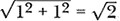，而且无法再更大。

那么三个点呢？四个点呢？十七个点呢？现在答案就不那么明显了。我们可能会采用 Locatelli 和 Raber 在 2002 年的论文《在正方形中填充相同大小的圆：一种确定性全局优化方法》中详细描述的复杂算法来处理这个问题，但我们在这里不会这样做。相反，我们将使用群体搜索中的随机性。我们需要将某个多维空间中的位置映射到候选解，然后在这个空间中搜索最佳解。

如果我们有 *n* 个点，并且想要知道 *n* 个圆心的坐标，这些圆心之间的每一对距离尽可能远，同时仍在 [0, 1] 范围内，我们需要找到 *n* 个点。刚开始时，我们可能认为这是一个 *n* 维的问题。然而，实际的维度是 2*n*：我们需要 *x* 和 *y* 坐标来确定一个点。我们知道搜索的边界是每个维度都在 [0, 1] 之间。因此，我们将使用由 [0, 1] 限制的 2*n* 维向量来表示粒子，其中每一对组件是一个点，(*x*, *y*)。换句话说，如果我们要找五个点，每个粒子就是一个 10 元素的向量：

***p*** = (*x*[0], *y*[0]; *x*[1], *y*[1]; *x*[2], *y*[2]; *x*[3], *y*[3]; *x*[4], *y*[4])

要运行搜索，我们需要问题的维度和界限，我们现在已经有了这两个信息。唯一剩下的问题是目标函数，它告诉我们每个粒子位置所代表的解有多好。问题的描述为我们指引了方向：我们需要最大化任意两点之间的最小距离。如果有五个点，我们计算每一对可能的点之间的距离，找出最小的那个距离，然后返回相反值。我们的框架只支持最小化，因此为了最大化，我们返回负值。将对的最小距离变为负数后，它就变成了最负的数。

#### ***群体搜索***

我们需要的代码在 *circles.py* 中。考虑放下书本，通读一下文件以理解代码流程。理解之后，我们就可以从目标函数类开始：

```
class Objective:
    def __init__(self):
        self.fcount = 0

    def Evaluate(self, p):
        self.fcount += 1
        n = p.shape[0]//2
        xy = p.reshape((n,2))

        dmin = 10.0
        for i in range(n):
            for j in range(i+1,n):
                d = np.sqrt((xy[i,0]-xy[j,0])**2 + (xy[i,1]-xy[j,1])**2)
                if (d < dmin):
                    dmin = d
        return -dmin
```

构造函数只是初始化 `fcount`，它用来统计 `Evaluate` 被调用的次数。`Evaluate` 方法接收一个位置向量（`p`），它立即被重塑为一组 (*x*, *y*) 对（`xy`）。

`Evaluate` 中的第二段代码会遍历 `xy` 中每一对点，并计算它们之间的欧几里得距离。如果该距离是目前找到的最小距离，我们就将其保存在 `dmin` 中。我们希望最大化任意两点之间的最小距离，因此我们首先找到粒子位置表示的任意两点之间的最小距离。

最后一行返回 `dmin` 的负值。由于框架是为了最小化而设计的，返回最小的成对距离的负值就迫使框架*最大化*这个最小距离——这正是我们想要的。

现在我们已经具备了实现搜索所需的一切。*circles.py* 的主体遵循标准方法，从命令行获取值并设置框架对象，然后调用 `Optimize` 执行搜索。

在代码中，主要步骤如下：

```
rng = RE(kind=kind)
b = Bounds([0]*ndim, [1]*ndim, enforce="clip", rng=rng)
i = RandomInitializer(npart, ndim, bounds=b, rng=rng)
obj = Objective()
swarm = PSO(obj=obj, npart=npart, ndim=ndim, init=i, 
            bounds=b, max_iter=niter, bare=True, rng=rng)
swarm.Optimize()
res = swarm.Results()
```

我们创建了所需的随机引擎，接着是边界、初始化器和目标函数实例。请注意，目标函数不需要任何附加信息。

`swarm` 对象，配置为基础的 `PSO` 搜索，后面跟着 `Optimize` 和 `Results`。没有显示的是报告最佳点集及其之间距离的代码，然后将所有搜索结果（包括点的位置简单图示）转储到提供的输出目录。

尝试在没有命令行选项的情况下运行 *circles.py*，看看它期望什么。现在我们已经准备好了，就来使用它吧。

#### ***代码***

让我们来打包一些圆圈。我创建了两个 Shell 脚本，*go_circle_results* 和 *go_plots*。前者运行 *circles.py*，用于 2 到 20 个圆圈和 7 种算法：基础的 PSO、标准 PSO、DE、GWO、Jaya、RO 和 GA。输出结果存储在 *results* 目录中。我建议你在晚上启动它，第二天早上再回来查看，因为这个框架是为了清晰设计的，而非速度。用以下命令运行：

```
> sh go_circle_results
```

当 *go_circle_results* 完成后，执行 *go_plots* 来生成一系列图表，显示每个算法定位的圆圈配置。我的结果在 表 5-1 中，不过由于群体搜索的随机性，你的结果会有所不同。

**表 5-1：** 每个算法已知和找到的最大中心距离

| ***n*** | **已知** | **基础** | **DE** | **PSO** | **GWO** | **Jaya** | **RO** | **GA** |
| --- | --- | --- | --- | --- | --- | --- | --- | --- |
| 2 | 1.4142 | 1.4142 | 1.4142 | 1.4142 | 1.4142 | 1.4142 | 1.4142 | 1.4134 |
| 3 | 1.0353 | 1.0353 | 1.0353 | 1.0353 | 1.0353 | 1.0353 | 1.0301 | 1.0264 |
| 4 | 1.0000 | 1.0000 | 1.0000 | 1.0000 | 1.0000 | 1.0000 | 0.9998 | 0.9969 |
| 5 | 0.7071 | 0.7071 | 0.7070 | 0.6250 | 0.7025 | 0.7071 | 0.6796 | 0.6052 |
| 6 | 0.6009 | 0.5951 | 0.5953 | 0.5995 | 0.5988 | 0.5858 | 0.5723 | 0.5884 |
| 7 | 0.5359 | 0.5359 | 0.5223 | 0.5000 | 0.5072 | 0.5176 | 0.5000 | 0.4843 |
| 8 | 0.5176 | 0.5090 | 0.5045 | 0.5000 | 0.5002 | 0.4801 | 0.4661 | 0.4355 |
| 9 | 0.5000 | 0.5000 | 0.4202 | 0.5000 | 0.4798 | 0.5000 | 0.4421 | 0.4470 |
| 10 | 0.4213 | 0.4147 | 0.3697 | 0.4195 | 0.4187 | 0.3517 | 0.3788 | 0.3819 |
| 11 | 0.3980 | 0.3978 | 0.3296 | 0.3694 | 0.3895 | 0.3918 | 0.3588 | 0.3787 |
| 12 | 0.3887 | 0.3726 | 0.2989 | 0.3717 | 0.3289 | 0.3819 | 0.3496 | 0.3542 |
| 13 | 0.3660 | 0.3595 | 0.2752 | 0.3333 | 0.3277 | 0.2832 | 0.3212 | 0.3230 |
| 14 | 0.3451 | 0.3354 | 0.2537 | 0.3333 | 0.3116 | 0.3435 | 0.3037 | 0.3204 |
| 15 | 0.3372 | 0.3256 | 0.2303 | 0.3333 | 0.3278 | 0.2437 | 0.2949 | 0.2995 |
| 16 | 0.3333 | 0.2996 | 0.2269 | 0.2500 | 0.3011 | 0.2220 | 0.2760 | 0.2761 |
| 17 | 0.3060 | 0.2985 | 0.2062 | 0.2913 | 0.2952 | 0.1992 | 0.2658 | 0.2721 |
| 18 | 0.3005 | 0.2782 | 0.1927 | 0.2808 | 0.2703 | 0.2126 | 0.2516 | 0.2493 |
| 19 | 0.2900 | 0.2697 | 0.1852 | 0.2500 | 0.1905 | 0.1731 | 0.2384 | 0.2559 |
| 20 | 0.2866 | 0.2632 | 0.1789 | 0.2500 | 0.2419 | 0.1659 | 0.2200 | 0.2342 |

表 5-1 显示了点之间的已知最佳距离以及群体搜索得到的距离，按算法分类。这些数值将成为我们的黄金标准。

对于 *n* < 10，许多距离可以通过几何推导得到，正如 表 5-2 所示。

**表 5-2：** 已知圆心距离

| ***n*** | **距离** |
| --- | --- |
| 2 | 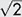 |
| 3 | 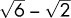 |
| 4 | 1 |
| 5 | 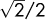 |
| 6 | 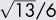 |
| 7 | 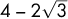 |
| 8 | 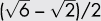 |
| 9 | 0.5 |
| 10 | 0.42127954 |

这些表达式来自 Croft、Falconer 和 Guy 的《几何中的未解问题》（Springer，1991 年）中的表 D1。由 *go_plots* 调用的 *plot_results.py* 文件使用该表生成显示打包圆形的图表。如果打包是最优的，圆形几乎不会接触。否则，圆形之间会有间隙或重叠。

检查 表 5-1 可以发现 2 到 4 个圆是直接的；每个算法都找到了最佳排列。对于 5 个圆，基本的 PSO、DE 和 Jaya 都达到了收敛解。我们不会在已知距离与差分进化解之间的一万分之一的差异上争辩。

群体在 5 个圆之后开始出现问题。对于 6 个圆，虽然没有任何群体精确到四位小数，但有几个方法非常接近。 图 5-1 展示了每个算法的输出图表。

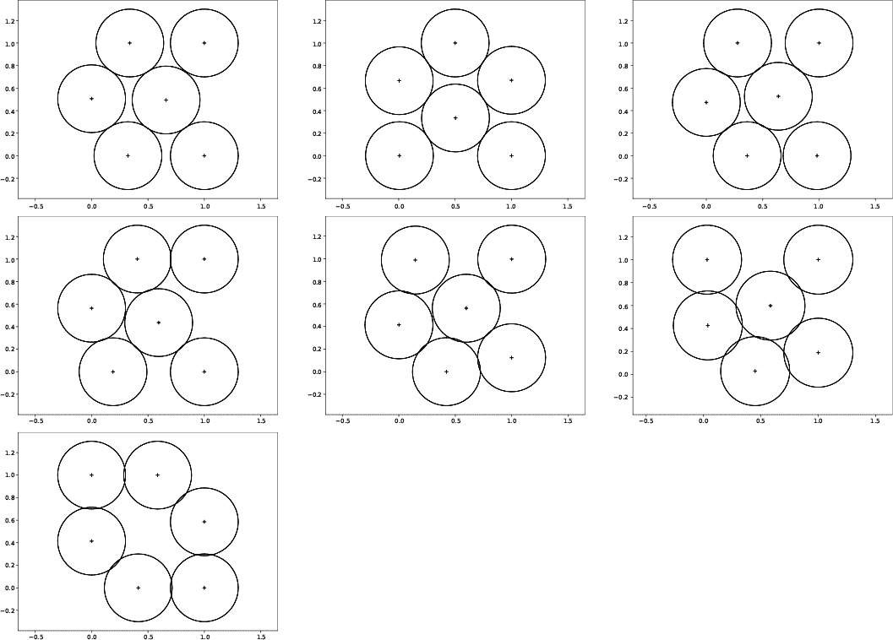

*图 5-1: 打包 6 个圆圈。从左上到右：PSO，GWO，DE，简化版 PSO，GA，RO 和 Jaya。*

尽管解决方案在圆心距离方面是独特的，但在旋转方面并不独特。标准的 PSO、DE 和 GWO 结果本质上是相同的，只是在某些情况下旋转了 90 度。

通过圆圈的数量查看*go_plots*生成的所有图形。随着*n*的增大，群体越发挣扎，但仍然有一些不错的*n*值，例如*n* = 9，在这种情况下群体更有可能找到高度对称的解决方案。由于我们在打包一个正方形，*n*的值是完全平方数—如 4、9 和 16—因此可以得到对齐良好的打包。然而，只有少数算法找到了理想的*n* = 9 输出，且没有任何算法找出最好的*n* = 16 结果。

让我们继续解决一个更实际的问题。

### **放置手机塔**

放置手机塔并非一种学术练习；涉及到实际的效用和成本。在这一部分，我们将实验一个（简化版的）手机塔位置问题。

我们的输入是一组手机塔，每个塔有不同的有效范围，以及一张显示手机塔可以放置位置的掩膜。输出是一个位置集合，指示应该放置指定塔的位置以最大化覆盖范围。

我们将使用的代码在*cell.py*中。它与其他群体实验的结构相同，但稍微更高级，因为评估粒子位置需要检查是否存在非法的塔位置并构建图像。目标函数类的`Evaluate`方法更为复杂，但仍然接受一个粒子位置并返回一个评分，较低的评分意味着更好的解决方案。

我将概述攻击计划；然后我们将逐步浏览代码的关键部分，再进行一些实验。

#### ***群体搜索***

我们需要将一定范围内的数字向量转换为可能的解决方案。我们将使用手机塔和地图，告诉我们可以在哪里放置这些塔。让我们从表示塔和地图开始。

手机塔向所有方向辐射，因此我们将它们表示为圆圈，圆的直径表示塔的强度，圆心表示塔的位置。并非所有塔的强度都相同。我们用一个(0, 1]范围内的浮动数值来指定一个塔；具体方法稍后会明确。

这些地图是灰度图像。如果一个像素的值为 0，则该像素是一个可能的塔位置；如果像素值为 255，则该位置不可用。我将一组地图放在*maps*目录中。你可以在任何图形程序中制作自己的地图；使用 255 标记塔无法放置的区域，0 则表示其他区域。地图不必是正方形。需要注意的是，地图越大，搜索越慢，这也是为什么提供的地图较小。

塔的大小是地图最大维度的一半的分数。例如，给定的地图大小是每边 80 像素。因此，一个大小为 0.1 的塔的直径为 0.1 × 40 = 4 像素，而一个 0.6 塔的直径为 0.6 × 40 = 24 像素。塔的位置存储在一个文本文件中，每行一个数字，行数表示塔的数量。查看 *towers* 目录中的文件，你会明白我的意思。

粒子位置代表塔的位置。如果有 *n* 个塔，我们需要 2*n* 维的粒子，就像我们在打包圆形时一样。粒子位置中的每两个元素是一个塔的中心位置。指定塔的顺序与粒子元素的顺序一一对应。例如，*towers0* 有六行，表示六个塔：0.1、0.2、0.3、0.4、0.5、0.6。因此，使用 *towers0* 进行搜索时，涉及到的是 12 维的粒子。

(*x*[0], *y*[0]; *x*[1], *y*[1]; *x*[2], *y*[2]; *x*[3], *y*[3]; *x*[4], *y*[4]; *x*[5], *y*[5])

其中，(*x*[0], *y*[0]) 是 0.1 塔的位置，(*x*[1], *y*[1]) 是 0.2 塔的位置，依此类推。

图 5-2 显示了默认地图。

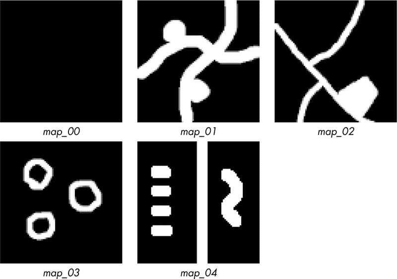

*图 5-2：默认地图*

第一张地图是空白的，没有禁区。其他地图上标记的区域对塔是禁止进入的。可以把这些区域想象成道路、停车场、湖泊等。

我们有塔和地图。我们知道如何表示塔的位置和大小。那么，如何将塔、地图和位置结合起来得到评分呢？我们希望通过将塔放置在合法位置，尽可能多地覆盖地图。因此，我们希望最小化没有被塔覆盖的合法地图像素的数量；我们希望在放置塔后，剩下的零像素尽可能少。这听起来像是目标函数的工作。

对于给定的粒子位置，目标函数需要判断是否有任何提出的塔中心位于非法位置。如果即使一个塔的位置不合法，目标函数将通过立即返回 1.0 的评分（最大可能值）来拒绝整个配置，意味着地图没有任何被覆盖。

如果所有提出的塔位置都是合法的，那么就可以计算覆盖情况了。未覆盖像素的数量除以地图中的像素总数，得出一个[0, 1]区间的值，其中 0 表示所有像素都已覆盖。这个值越低，覆盖效果越好。

我选择的方法从一张与地图图像大小相同的空图开始。我们通过将每个塔覆盖的像素添加到当前像素值中，来向图像中添加塔。

通过这种方式添加像素有两个目的：首先，最初为空的图像中，所有在塔覆盖区域内仍为 0 的像素将被暴露；其次，逐个塔添加像素，构建出一个易于理解的图像。我们将能够清楚地看到每个塔及其覆盖的区域，包括塔重叠的区域。

总结一下，对于给定的粒子位置，我们：

1.  将塔的坐标转换为一组点，就像我们之前为打包圆形所做的那样。

1.  如果任何塔的中心落在地图的非法区域，则返回 1.0 作为得分。

1.  将每个塔添加到最初为空的图像数组中，包括所有被覆盖的像素，如果所有塔的中心都被允许的话。

1.  返回未覆盖像素的数量与总像素数之比作为得分。

这些步骤将粒子位置映射到解决方案，从而生成一个表示解决方案质量的单一数字。

图 5-3 展示了左侧的输入地图和使用六个塔（位于*towers0*）通过经典粒子群搜索生成的输出结果，右侧为塔的放置情况。

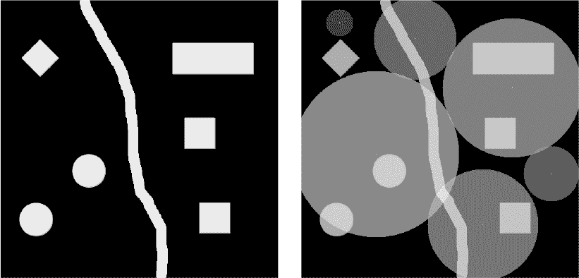

*图 5-3：输入掩膜（左）和生成的塔放置结果（右）*

塔的重叠仅轻微，且没有塔中心位于被遮挡的区域。请查看*example*目录中的文件，查看这些图像的更详细内容。

让我们回顾一下*cell.py*中的关键部分，以了解这些步骤是如何被转换为代码的。

#### ***代码***

*cell.py*中的代码相对复杂。在继续之前，花一些时间好好研究这个文件。

最重要的代码部分是目标函数类及其相关代码；请参见列表 5-1。

```
class Objective:
    def __init__(self, image, towers, radius):
        self.image = image.copy()
        self.R, self.C = image.shape
     ➊ self.radii = (towers*radius).astype("int32")
        self.fcount = 0

    def Collisions(self, xy):
        n = 0
        for i in range(xy.shape[0]):
            x,y = xy[i]
            if (self.image[x,y] != 0):
                n += 1
        return n

    def Evaluate(self, p):
        self.fcount += 1
        n = p.shape[0]//2
     ➋ xy = np.floor(p).astype("uint32").reshape((n,2))
        if (self.Collisions(xy) != 0):
            return 1.0
        empty = np.zeros((self.R, self.C))
     ➌ cover = CoverageMap(empty, xy, self.radii)
        zeros = len(np.where(cover == 0)[0])
        uncovered = zeros / (self.R*self.C) 
        return uncovered
```

*列表 5-1：目标函数类*

构造函数存储地图（`image`）、塔的向量（`towers`）和`radius`，即地图图像最大维度的一半。这设置了最大的塔范围；例如，如果塔的范围为 1，那么表示塔的圆形的半径就是`radius`像素，即地图图像的高度或宽度的一半，以较大的为准。在内部，`radii`是一个表示塔半径的像素向量 ➊。

`Evaluate`方法首先将粒子位置向量重塑为(*x*, *y*)点，正如我们在*circles.py*中做的那样。在这种情况下，我们需要的是像素坐标，因此`floor`确保点的值为整数 ➋。

`Collisions`方法首先检查任何提议的塔中心是否位于禁区内。这是一个简单的地图图像查询。如果中心像素不是 0，则计为一次碰撞。如果发生任何碰撞，则返回 1.0 的得分，表示所有像素都没有被覆盖。

假设没有碰撞，现在是放置塔并计算得分的时候了。创建一个与地图图像大小相同的`empty`图像，并将其与塔的中心（`xy`）和半径（`radii`）一同传递给`CoverageMap` ➌。返回值`cover`是一个类似于图 5-3 右侧的图像，但没有适当的缩放到[0, 255]—它是一个浮点数组。如果`cover`的某个元素为 0，意味着该元素不在任何塔的覆盖范围内，因此我们使用 NumPy 的`where`函数计算该元素的数量，并将其除以地图中的像素总数来计算得分。

`CoverageMap` 方法不属于 `Objective` 类，因为它在 *cell.py* 中的其他地方使用。然而，它对于代码的成功至关重要，因此让我们详细了解一下它（清单 5-2）。

```
def CoverageMap(image, xy, radii):
    im = image.copy()
    R,C = im.shape
 ➊ for k in range(len(radii)):
        x,y = xy[k]
     ➋ for i in range(x-radii[k],x+radii[k]):
            for j in range(y-radii[k],y+radii[k]):
                if ((i-x)**2 + (j-y)**2) <= (radii[k]*radii[k]):
                    if i < 0 or j < 0:
                        continue
                    if i >= R or j >= C:
                        continue
                    im[i,j] += 0.5*(k+1)/len(radii)
    imax = im.max()
 ➌ for k in range(len(radii)):
        x,y = xy[k]
        im[x,y] = 1.4*imax
    return im
```

*清单 5-2：为一组塔位置生成覆盖图*

`CoverageMap` 方法接受地图图像、塔的中心位置和塔的半径作为输入。其目标是填充 `im`。当前传递一个空图像给 `CoverageMap` 似乎有些奇怪，但稍后的函数调用会传递地图图像本身。

塔依次应用，中心位置为 (*x*, *y*) ➊。 (低效的) 双重循环 ➋ 检查地图中每一个可能位于当前塔范围内的像素。内循环的主体检查当前像素 (*i*, *j*) 是否在当前塔的磁盘范围内（`if` 语句）。如果是，并且 (*i*, *j*) 像素在图像空间内，则根据以下公式递增当前像素值

0.5(*k* + 1)/*n*

其中 *n* 是塔的数量。这个方程通过每个塔的特定量递增像素值（`im` 是一个浮动点数组）。结果会导致图 5-3 的右侧，其中每个磁盘具有不同的强度，并且重叠部分是可见的。

在所有塔添加后，一个最终的循环会添加每个塔的中心点 ➌。中心点的值总是最大像素值强度的 1.4 倍，以使中心点可见（最好在计算机屏幕上查看）。由于 `im` 是一个浮动点数组，它不受 [0, 255] 的限制。缩放将在稍后的代码中进行，当输出图像写入磁盘时。

`CoverageMap` 方法返回一个二维数组，其中任何剩余的零值表示没有被任何塔覆盖的像素。零值的数量与像素总数的比例即为给定塔位置的最终得分。

*cell.py* 的主体形式上与 *circles.py* 相似：解析命令行，创建框架对象并执行搜索。然而，搜索不是通过调用 `Optimize` 来执行的，而是通过反复调用 `Step`，以便可以在每次迭代中显示当前最佳得分。

搜索配置如同在清单 5-3 中所示。

```
rng = RE(kind=kind)
x,y = map_image.shape
lower = [0,0]*len(towers)
upper = [x,y]*len(towers)
b = Bounds(lower, upper, enforce="resample", rng=rng)
ndim = 2*len(towers)
w = x if (x>y) else y
radius = w//2
i = RandomInitializer(npart, ndim, bounds=b, rng=rng)
obj = Objective(map_image, towers, radius)
swarm = DE(obj=obj, npart=npart, ndim=ndim, init=i, bounds=b, 
          max_iter=niter, tol=1e-9, rng=rng)
```

*清单 5-3：配置搜索*

这里 `radius` 设置了任何塔的最大半径。

搜索本身是一个循环（清单 5-4）。

```
k = 0
swarm.Initialize()
while (not swarm.Done()):
    swarm.Step()
    res = swarm.Results()
    t = "    %5d: gbest = %0.8f" % (k,res["gbest"][-1])
    print(t, flush=True)
    k += 1
res = swarm.Results()
```

*清单 5-4：运行搜索*

`Initialize` 方法配置群体，`Done` 在搜索完成时返回 `True`（所有迭代完成或达到容忍度），而 `Step` 执行群体的一个更新（它像总部一样工作）。

每次迭代都会调用`Results`方法来报告当前最佳值——未被塔楼覆盖的图像像素的比例。循环退出后，最后一次调用`Results`会返回最佳的塔楼位置集。附加的代码捕获每次迭代的输出，并生成最优配置的覆盖图。请参阅命令行中的`frames`选项。

最终，覆盖图被生成并存储在输出目录中，如列表 5-5 所示。

```
p = res["gpos"][-1]
n = p.shape[0]//2
xy = p.astype("uint32").reshape((n,2))
radii = (towers*radius).astype("int32")
cover = CoverageMap(map_image, xy, radii)
c2 = (cover/cover.max())**(0.5)
c2 = c2/c2.max()
img = Image.fromarray((255*c2).astype("uint8"))
img.save(outdir+"/coverage.png")
```

*列表 5-5：生成覆盖图*

群体的最佳位置（`p`）被转换为一组(*x*, *y*)点，并与塔楼的相应半径一起传递给`CoverageMap`，同时还传入输入地图本身（`map_image`）。与目标函数中的`Evaluate`方法不同，这里传递的是带有遮罩区域的地图，而不是空白图像。

生成的覆盖图（`cover`）会通过平方根函数进行处理，以压缩强度，然后转换为灰度图像（`img`），并写入输出目录。

由于需要，我们跳过了*cell.py*中的代码，但仔细阅读文件后，这些部分会变得清晰。现在，让我们看看*cell.py*能做什么。

在没有参数的情况下运行*cell.py*可以展示如何使用它：

```
> python3 cell.py
cell <map> <towers> <npart> <niter> <alg> <kind> <outdir> [frames]

  <map>     -  map image (.png)
  <towers>  -  text file w/towers and ranges
  <npart>   -  number of swarm particles
  <niter>   -  number of swarm iterations
  <alg>     -  DE|RO|PSO|BARE|GWO|JAYA|GA
  <kind>    -  randomness source
  <outdir>  -  output directory (overwritten)
  frames    -  'frames' ==> output frame per iteration
```

让我们使用*map_01*和*towers0*来运行代码。例如：

```
> python3 cell.py maps/map_01.png towers/towers0 20 100 ga pcg64 test frames
```

我们使用 20 个粒子的 GA 进行 100 次迭代，并将输出结果存储到名为*test*的目录中。`frames`关键字会输出每次迭代时的当前最佳塔楼位置，这样我们就可以直观地追踪群体的演变。

请注意，100 次迭代相对于我们在*circles.py*中使用的 10,000 次或更多的迭代来说并不多。生成覆盖图的所有操作都需要时间，因此运行 10,000 次迭代是不可行的。幸运的是，我们通常只需要几百次迭代。

在*cell.py*运行时，它会输出当前群体最佳分数，并在搜索结束时给出总结。输出目录中包含*README.txt*文本文件，其中包含原始地图图像（*map.png*）和最终的覆盖图（*coverage.png*）。如果你想更详细地查看群体演化，Python 的`pickle`文件（*.pkl*）包含了群体对象。输出目录中还包含一个*frames*目录，里面保存了每次迭代时群体最佳配置的图像。翻阅这些文件，你可以看到群体如何演化。

我的运行最终得到了一个覆盖值为 0.358，这意味着大约 36%的地图没有被塔楼覆盖，具体情况见图 5-4。

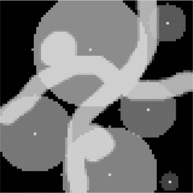

*图 5-4：塔楼放置*

*towers0*中的所有六个塔楼在输出中都可见。塔楼重叠非常少，这是一个好兆头。每个塔楼的中心避免了遮罩区域。

要实验 *cell.py*，请运行 shell 脚本 *go_tower_results*、*go_towers* 和 *go_towers0*。第一个脚本将 *towers0* 应用到所有样本地图，使用所有算法。第二个脚本将所有塔楼文件和算法应用于 *map_02*。最后，第三个脚本将每个塔楼文件应用于 *map_00*，仅使用基础的 PSO 来演示当没有障碍物时群体是如何放置塔楼的。

运行 *go_results* 和 *go_towers*，然后运行 *make_results_plot.py* 和 *make_towers_plot.py*，生成包含所有结果的图像文件，每一行显示不同群体算法的输出。

最终脚本 *go_towers0* 生成了在图 5-5 中看到的输出。

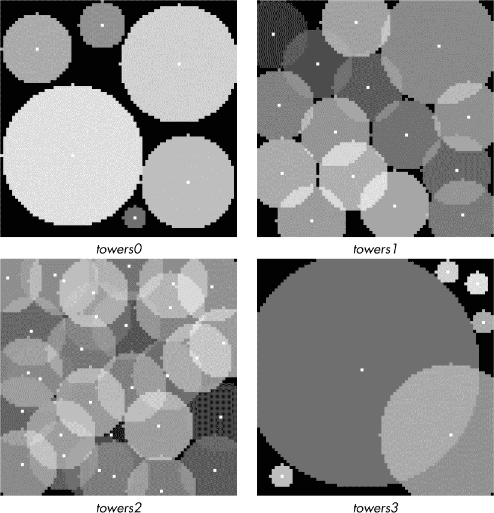

*图 5-5：在默认地图上放置塔楼*

它在空白地图上对每个塔楼文件运行基础 PSO。请注意，*towers0* 无法完全覆盖地图，但结果位置不会重叠，这意味着基础 PSO 找到了一个最优配置（多个配置中的一个）。*towers3* 的输出也差不多，小塔楼与大塔楼没有重叠。

将这些结果与 *towers1* 和 *towers2* 的结果进行对比。是否能够立刻看出 *towers1* 是否能够完全覆盖地图，尚不清楚，但 *towers2* 确实能够——然而，地图的某些小部分仍然未被覆盖。我怀疑运行超过 300 次迭代会解决这个问题。它能解决吗？在使用带有遮蔽区域的地图和空白地图时，运行时间有差别吗？如果有，为什么会这样？

随意尝试不同的自定义地图和塔楼的数量及大小，看看是否能找到一个最佳或更具实用性的塔楼大小组合。哪个效果最好，许多小塔楼还是几个大塔楼？

让我们使用随机性来实现一个“make it pretty”图像滤镜。

### **图像增强**

当我在手机图库中查看自己拍摄的照片时，我会被提供一个重新制作图片的选项；我称之为“make it pretty”滤镜。在这一节中，我们将使用群体搜索来实现一个针对灰度图像的“make it pretty”滤镜。

我们的滤镜基于一种在学术文献中经常出现的滤镜。这是一个很好的例子，展示了将现有论文稍作修改后，作为新技术发表的趋势。快速回顾文献发现有八篇论文都在实施这种方法，只对优化算法做了微小的调整：PSO、萤火虫算法、布谷鸟搜索、差分进化、PSO、布谷鸟、布谷鸟和差分进化，依次类推。虽然我们的实现只是这条光辉研究路线中的又一篇，但我以教学为借口，并不依赖新颖性或适用性来进行辩护。

抛开免责声明不谈，"make it pretty" 滤镜将一个局部图像增强函数应用于输入的灰度图像，以使其看起来更漂亮。如果这句话听起来像泥一样模糊，不用担心——我会解释清楚的。

我们打算对输入图像的每个像素应用一个函数，生成一个新的输出像素。让我们应用这个函数。

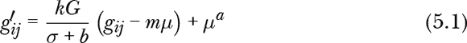

到像素 *i* 行和 *j* 列的位置；也就是 *g[ij]*。我们需要找到 *a*、*b*、*m* 和 *k* 来使图像看起来尽可能好。

*G* 是原始图像的*均值强度*，即通过将所有像素强度相加并除以像素数量得到的值。*µ* 和 *σ* 变量分别是当前像素 *g[ij]* 周围 3×3 区域的均值 (*µ*) 和标准差 (*σ*)。可以将其想象成一个井字棋（圈叉游戏）板，如 图 5-6 所示。

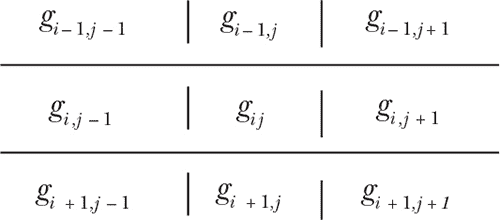

*图 5-6：像素偏移*

3×3 区域在图像上滑动，访问每个像素，计算 *µ* 和 *σ*，然后使用 方程 5.1 来创建新的像素值， 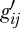。请注意， 是输出图像中 *ij* 像素的值；它并不更新原始图像中的像素 *g[ij]*。

用于更新图像像素的函数有四个参数我们需要找到，以及依赖于原始图像和我们如何应用函数的其他值。然而，函数仅告诉我们如何根据给定的 *a*、*b*、*m* 和 *k* 来更新图像；它并没有说明输出图像在人眼观察者看来有多美观。为了做到这一点，我们需要一个目标函数。

研究人员声称，以下函数捕捉了让图像看起来让人愉悦的某些因素：

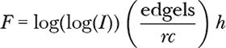

我们将使用 *F* 作为目标函数。*F* 的值越高，图像对于人眼观察者的效果就越好——至少理论上是这样。*I* 是输入图像经过边缘检测处理后的像素强度之和。*edgels* 变量是边缘检测版本中高于阈值（此处为 20）的边缘数量。最后，*r* 和 *c* 是图像的维度（行和列），*h* 是图像的熵：

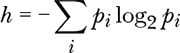

这里 *p[i]* 是 64-bin 直方图中第 *i* 个区间的像素强度概率。熵在这个意义上指的是图像的信息量。

这个练习表面上似乎类似于曲线拟合。我们有一个带有需要优化的参数的函数，但应用该函数的算法包含更多步骤。然而，正如我们很快将了解到的那样，这些额外的步骤对我们的群体算法几乎没有影响。它们仍然提供浮动点向量给目标函数，并期待返回一个标量质量度量值。群体算法对它们正在优化的内容浑然不觉。

#### ***增强函数***

我们有一个四参数优化问题：对于给定的图像，我们希望找到最佳的 *a*、*b*、*m* 和 *k* 值，这些值都是浮动点数。从框架的角度来看，一旦我们确定了参数的边界，设置过程是直接的。所有的酷炫代码都将在目标函数类中。完整程序位于 *enhance.py*。

我们从列表 5-6 开始，这是目标函数类，它实现了之前给出的精细图像增强和*F*函数。

```
class Objective:
    def __init__(self, img):
        self.img = img.copy()
        self.fcount = 0

    def F(self, dst):
        r,c = dst.shape
        Is = Image.fromarray(dst).filter(ImageFilter.FIND_EDGES) 
        Is = np.array(Is)
        edgels = len(np.where(Is.ravel() > 20)[0])
        h = np.histogram(dst, bins=64)[0]
        p = h / h.sum()
        i = np.where(p != 0)[0]
        ent = -(p[i]*np.log2(p[i])).sum() F = np.log(np.log(Is.sum()))*(edgels/(r*c))*ent
        return F

    def Evaluate(self, p):
        self.fcount += 1
        a,b,m,k = p
        dst = ApplyEnhancement(self.img, a,b,m,k)
        return -self.F(dst)
```

*列表 5-6：图像增强目标函数类*

类构造函数存储了原始图像的副本。`Evaluate`方法从提供的粒子位置中提取*a*、*b*、*m*和*k*，将它们和原始图像传递给`ApplyEnhancement`，返回一个新的图像`dst`。我们将新图像传递给`F`方法以计算分数。由于我们希望最大化*F*，因此返回其负值。

我会稍后解释`ApplyEnhancement`；现在我们先专注于`F`。该方法是线性的，并且大量使用了 NumPy 和 PIL（`Image`和`ImageFilter`）提供的强大函数。在这种情况下，逐行分析是有意义的。

首先，我们提取图像的维度（`r`、`c`）。在下一行，我们对图像应用边缘检测滤波器，生成`Is`作为`dst`的输出。边缘检测器的输出类似于图 5-7。


*图 5-7：边缘检测器的作用*

我们将 PIL 图像`Is`重新转换为 NumPy 数组，然后使用`where`来统计边缘像素大于 20 的数量。我们选择 20 是因为这是一个经验选定的阈值，效果很好。统计结果存储在`edgels`中。

目前唯一未确定的*F*部分是熵*h*，这里表示为`ent`。为了获得这一点，我们首先需要图像的直方图，使用 64 个箱子，这可以通过 NumPy 的`histogram`函数在一行代码内便捷地获得。通过将直方图按所有箱子的总和进行缩放，可以将每个箱子的计数转换为每个箱子的概率估计`p`。

得到`p`后，我们通过将概率乘以概率的对数（以 2 为底）来计算熵（`ent`）。`F`中的倒数第二行直接对应于*F*的方程，返回其值。

接下来是列表 5-7 中的`ApplyEnhancement`。

```
def ApplyEnhancement(g, a,b,c,k):
    def stats(g,i,j):
        rlo = max(i-1,0); rhi = min(i+1,g.shape[0])
        clo = max(j-1,0); chi = min(j+1,g.shape[1])
        v = g[rlo:rhi,clo:chi].ravel()
        if len(v) < 3:
            return v[0],1.0
        return v.mean(), v.std(ddof=1)

    rows,cols = g.shape
    dst = np.zeros((rows,cols))
    G = g.mean()
    for i in range(rows):
        for j in range(cols):
            m,s = stats(g,i,j)
            dst[i,j] = ((k*G)/(s+b))*(g[i,j]-c*m)+m**a
    dmin = dst.min()
    dmax = dst.max()
    return (255*(dst - dmin) / (dmax - dmin)).astype("uint8")
```

*列表 5-7：将一组参数应用于图像*

我们通过应用方程 5.1 来增强原始图像。输出图像（`dst`）是逐像素构建的，使用局部的 3×3 区域均值（`m`）和标准差（`s`），结合参数`a`、`b`、`c`和`k`。请注意，`c`在方程 5.1 中是*m*。

辅助函数`stats`定义了围绕（*i*, *j*）的 3×3 区域，考虑了图像的索引限制。然后，它返回均值和标准差。`if`语句处理了像素太少以至于无法进行有意义标准差计算的边界情况。注意在调用`std`时的`ddof`关键词。默认情况下，NumPy 通过除以数值的数量来计算偏差估计的方差，而不是通过除以比数值数量少 1 的数量来计算无偏估计。许多统计软件包默认使用无偏估计。在大多数情况下，特别是当数据集中的值少于 20 个时，我们希望使用无偏估计，因此设置`ddof=1`。回想一下，标准差是方差的平方根。

剩下的就是配置搜索，具体见 Listing 5-8。

```
orig = np.array(Image.open(src).convert("L"))
img = orig / 256.0
ndim = 4
rng = RE(kind=kind)
b = Bounds([0.0,1.0,0.0,0.5], [1.5,22,1.0,1.5], enforce="resample", rng=rng)
i = RandomInitializer(npart, ndim, bounds=b, rng=rng) obj = Objective(img)
swarm = GWO(obj=obj, npart=npart, ndim=ndim, init=i, bounds=b, max_iter=niter, rng=rng)
```

*Listing 5-8: 配置搜索*

配置遵循我们的框架：随机源（`rng`）、边界（`b`）、初始化器（`i`）、目标函数（`obj`）和`swarm`对象，这里是`GWO`。我们强制将输入图像（`orig`）转换为灰度图像（`convert`），并将其按 256 进行缩放，使其位于 [0, 1) 范围内（`img`）。在这个范围内操作图像比在 [0, 255] 范围内更为常见。操作完成后，图像将被缩放回 [0, 255]，并转换为整数类型，最后写入磁盘。

搜索是四维的（`ndim`），所以有四个边界。每个维度的边界不同。边界 *a ∈* [0, 1.5]，*b ∈* [1.0, 22]，*m ∈* [0, 1]，*k ∈* [0.5, 1.5] 是基于文献中的值。正如我们将看到的，它们似乎效果很好，但可以尝试调整它们，特别是如果你注意到输出值接近边界时。我们很快就会学会如何在搜索后找到这些值。

运行搜索就像调用`Optimize`方法对`swarm`对象进行操作那样简单，但为了在过程中跟踪*F*评分，我们将手动循环执行，而不是直接调用（见 Listing 5-9）。

```
k = 0
swarm.Initialize()
while (not swarm.Done()):
    swarm.Step()
    res = swarm.Results()
    t = "    %5d: gbest = %0.8f" % (k,res["gbest"][-1])
    print(t, flush=True)
    s += t+"\n"
    k += 1
res = swarm.Results()
pickle.dump(res, open(outdir+"/results.pkl","wb"))
a,b,m,k = res["gpos"][-1]
dst = ApplyEnhancement(img, a,b,m,k)
Image.fromarray(dst).save(outdir+"/enhanced.png")
Image.fromarray(orig).save(outdir+"/original.png")
```

*Listing 5-9: 运行搜索*

搜索在所有指定的迭代次数后结束。然后，我们通过`pickle`将最终结果（`res`）输出到目标目录。使用`gpos`键返回最终的参数集合。最后，使用最佳参数集对图像进行增强，并将其与原始图像一起写入输出目录以便进行对比。

*enhance.py* 是否有效？让我们来找出答案。

#### ***代码***

运行*enhance.py*，不带参数，以了解它在命令行中需要哪些输入：

```
> python3 enhance.py

enhance <src> <npart> <niter> <alg> <kind> <output>

  <src>    - source grayscale image
  <npart>  - number of particles
  <niter>  - number of iterations
  <alg>    - BARE,RO,DE,PSO,JAYA,GWO,GA
  <kind>   - randomness source
  <output> - output directory (overwritten)
```

我们需要提供原始图像、群体大小、迭代次数、算法类型、随机性源和输出目录名称。

*images* 目录包含一组 128×128 像素的灰度图像，我们将用它们进行实验。考虑到框架的顺序性质和每次调用目标函数时需要进行的大量图像操作，搜索速度并不是特别快，因此较小的图像效果最好。程序也能处理较大的图像，它们不必是正方形；唯一需要的是耐心。

尝试这个命令行：

```
> python3 enhance.py images/barbara.png 10 60 gwo minstd babs
  0: gbest = -4.77187094
  1: gbest = -4.80063898
  2: gbest = -5.09058855
  3: gbest = -5.09058855
--snip--
```

输出显示了每次迭代的当前群体最佳*F*分数。由于我们想最大化*F*，所以该值是负数。命令行指定了 GWO，群体为 10 个粒子，60 次迭代，输出目录名为*babs*。

在我的系统上，搜索以以下输出结束：

```
  59: gbest = -6.09797382

Search results: GWO, 10 particles, 60 iterations

Optimization minimum -6.09797382 (time = 216.419)
(14 best updates, 610 function evaluations)
```

因此，最佳参数集在 14 次群体最佳更新后得到了*F* = 6.09797。*babs*输出目录包含：

```
enhanced.png
original.png
README.txt
results.pkl
```

给我们提供了增强后的图像、原图、pickle 格式的结果以及一个 README 文件，其中包含在搜索过程中生成的所有输出。

增强后的图像应该看起来更清晰，具有更好的对比度，比原图更好。不幸的是，打印版本可能无法清晰显示这些差异。不过，图 5-8 展示了两张图片，左边是原图，右边是增强版。


*图 5-8：原图与增强图像*

特别注意书架上的书。它们的定义更加清晰，显示了改善的对比度。

要提取增强参数，加载*results.pkl*文件。

```
> python3
>>> import numpy as np; import pickle
>>> res = pickle.load(open("babs/results.pkl","rb"))
>>> res["gpos"][-1]
array([0.01867829, 1.00785356, 0.45469097, 1.1731131 ])
```

这告诉我们，*a* = 0.01867，*b* = 1.0078，*m* = 0.45469，*k* = 1.17311。我们之前没有使用过`pickle`，它需要一个文件对象（`open`的输出），并且必须使用二进制模式（`"rb"`）。

*images*目录中有九张图片。我们将对这些图片运行各种群体和进化算法，然后收集结果输出，生成展示原图和增强版的复合图像，以便评估每个算法的表现。为此，我创建了两个 Python 脚本：*process_images.py*和*merge_images.py*。

首先运行*process_images.py*。我建议你在晚上开始运行，早上回来查看。这个脚本使用每个群体算法处理*images*中的每一张图片。群体包含 10 个粒子，并且在所有情况下都会运行 75 次迭代。

当*process_images.py*完成时，使用*merge_images.py*生成复合图像，展示结果，这些结果位于*output*目录中。例如：

```
> python3 merge_images.py zelda zelda_results.png
```

创建*zelda_results.png*，如图 5-9 所示。标准 PSO 看起来是这里的胜者。

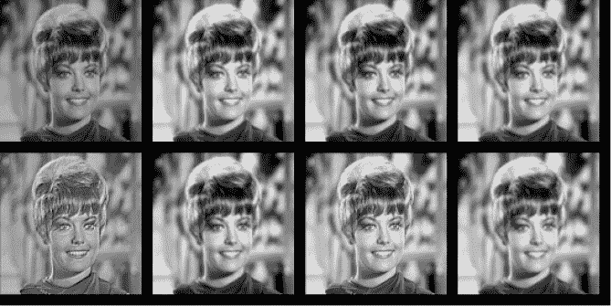

*图 5-9：复合图像。左上角开始：原图、裸骨 PSO、DE、GA、GWO、Jaya、标准 PSO、RO。*

表 5-3 列出了每个算法的*F*分数和参数。

**表 5-3：** 每个算法的*F*分数和参数

|  | ***F*** | ***a*** | ***b*** | ***m*** | ***k*** |
| --- | --- | --- | --- | --- | --- |
| **GWO** | 4.59328 | 0.00030 | 2.21893 | 0.71926 | 0.99232 |
| **标准 PSO** | 5.07767 | 0.00585 | 1.50612 | 0.39545 | 1.46734 |
| **Jaya** | 4.31448 | 1.21667 | 1.00493 | 0.76448 | 1.47750 |
| **DE** | 4.29245 | 1.24982 | 1.00076 | 0.76535 | 1.46355 |
| **裸骨 PSO** | 4.27962 | 1.09779 | 1.01205 | 0.89588 | 1.49625 |
| **GA** | 4.10057 | 1.14040 | 1.64773 | 0.12196 | 1.19704 |
| **RO** | 4.01708 | 1.08478 | 5.07904 | 0.53249 | 0.97552 |

主观上看起来最好的图像也是*F*得分最高的图像——这是一个好兆头。GWO 图像对比度较低，但非常清晰，其*F*得分位居第二。GWO 参数也与其他算法有很大不同。增强函数的参数空间可能具有相当复杂的结构，并且存在多个局部最小值。对于 Zelda 图像，GWO 算法似乎与其他结果有所不同。这种情况在其他图像中也会发生吗？哪个算法似乎整体表现最佳？

程序*F.py*将一组特定的参数应用于图像。如果我们应用 GWO 结果中的*a*和经典 PSO 结果中的*b*、*m*和*k*，会发生什么？

```
> python3 F.py images/zelda.png zelda2.png 0.00030 1.50612 0.39545 1.46734
F = 5.28999404
```

新的*F*得分更高，输出文件*zelda2.png*看起来比经典 PSO 结果更好。

这里还有很多值得探索的内容。我将在“练习”部分提供一些建议，见第 169 页，包括一种（可能的）增强彩色图像的方法。目前，让我们继续进行另一个实验，该实验结合了优化和仿真，通过找出最佳的商品陈列方式来最大化超市的利润。

### **安排超市布局**

你有没有注意到，超市通常把牛奶放在最远的地方，尽可能远离入口？或者糖果总是在最前面，靠近收银台？超市商品的摆放并不是偶然的；它是故意设计的，以最大化利润。许多人到商店来买生活必需品，比如牛奶，常常会顺便捎带点其他东西，比如糖果。超市通过这种商品布局来最大化此类偶然事件的发生，并增加收入。

本节尝试复制这样的商品排列，以验证或反驳常见的商店做法。这个实验结合了优化和仿真。我们将通过一组模拟顾客来优化商店的商品摆放，并评估这一安排。我们的目标是商品的排列方式，目标函数得分是一天的收入，函数本身是对数百名顾客的模拟。从群体初始化和位置更新到顾客的收集和习惯，随机性无处不在。要开始，请阅读*store.py*。

#### ***环境***

让我们定义一下我们的操作环境。实际的商店本质上是二维的；有一个布置在某个地面空间上的布局。我们的框架使用位置向量（一维实体）。我们将商店设为一维，因此位置向量可以是一个商店布局，每个元素代表一个商品。顾客将从商店的左侧（索引 0）进入，沿着商店向右走，就像在图 5-10 中一样。


*图 5-10：在一维超市购物（插图：Joseph Kneusel）*

人们通常去商店购买特定的商品；我们称之为*目标商品*。购物者还会有冲动购买的商品，如果在找到目标商品之前遇到这些商品，他们也会购买。

例如，图 5-10 显示了两位购物者，他们在考虑目标商品（用问号表示）和冲动商品（用感叹号表示）。

左侧的购物者正在寻找钻石商品，但如果看到圆形商品，他们也会购买。由于他们先遇到钻石商品，再遇到圆形商品，因此他们只购买了钻石商品并离开了商店。

右侧的购物者正在寻找三角形商品，但如果遇到方形商品，他们也会购买。在寻找三角形商品时，他们发现了方形商品并购买了两者。

购物模拟需要商品，这些商品位于*products.pkl*文件中。该文件包含三个列表，每个列表有 24 个元素：计数、名称和价格，按此顺序排列。这些数据来自实际的一段时间内购买的商品集合。商品按购买频率递减存储，因此最常购买的商品排在最前面，最少购买的商品排在最后面。

我们通过将每个计数除以所有计数的总和，将计数转换为购买概率。我们将在目标函数中使用购买概率。

如果商店里有 24 个商品，我们就有 24 维的位置向量。我们正在寻找商品的最佳排列，以最大化每日收入。我们稍后将更详细地讨论模拟部分，但目前让我们关注商品的顺序以及如何在群体中表示它。

一开始，我们可能会考虑将位置向量设为[0, 23]中的离散值，其中每个数字代表一个商品，是从*products.pkl*文件中读取的商品列表的索引。然而，我实现了一种替代方法，使用 0, 1)中的位置向量。

最终，我们需要一个向量，将商品按照特定顺序排列，这是向量{0, 1, 2, 3, . . . , 23}的某种排列。诀窍是将这种排列抽象化，这样我们仍然可以在[0, 1)中使用连续的浮点数值。我们不直接使用商品编号，而是将每个位置向量传递给 NumPy 的`argsort`函数，该函数返回对向量进行排序所需的索引顺序。对于一个 24 元素的向量，`argsort`的输出是数字 0 到 23 的排列。

这种方法有效——我们将看到它确实有效——令人印象深刻。我们要求群体生成一组浮动的实数，[0, 1)，这些数只有在确定它们的排序顺序之后才有用。它之所以有效，可能与使用整数值需要某种截断或舍入浮动小数点数字的情况有关，而实现的方法直接使用这些数字本身。如果将粒子位置中的某个元素从 0.304 更改为 0.288，使得整个向量的排序顺序变为更有利的配置，群体会利用这个变化，而截断可能会把这两个数字都看作 0。

以下是我们需要实现的步骤：

1.  用 [0, 1) 中的 24 个元素位置向量来初始化群体。

1.  初始化一个随机生成的购物者集合。

1.  运行我们通常的群体搜索，在该过程中，每个位置向量通过将购物者传递到商店并使用当前向量的排序顺序作为产品的排列来进行评估。然后，统计每个购物者花费的金额。他们总是能找到目标产品，但可能找不到冲动产品。最后，返回购物者总花费的负值，因为我们希望最大化每日收入。

1.  让群体算法像往常一样更新位置，直到所有迭代完成。

1.  报告找到的最佳位置的排序顺序，作为产品的“理想”排序。

接下来的两个部分详细介绍如何实现购物者以及目标函数是如何工作的。有了这些信息，我们就准备好去购物，看看我们的模拟结果是否与食品行业专家的意见一致。

#### ***购物者***

一个购物者是 `Shopper` 类的一个实例，如[清单 5-10 所示。

```
class Shopper:
    def __init__(self, fi, pv, rng):
        self.item_values = pv
     ➊ self.target = Select(fi,rng)
     ➋ self.impulse = np.argsort(rng.random(len(fi)))[:3]
        while (self.target in self.impulse):
            self.impulse = np.argsort(rng.random(len(fi)))[:3]

    def GoShopping(self, products):
        spent = 0.0
        for p in products: if (p == self.target):
                spent += self.item_values[p]
             ➌ break
            if (p in self.impulse):
                spent += self.item_values[p]
        return spent
```

*清单 5-10：* Shopper *类*

构造函数通过选择目标（`target`）和冲动（`impulse`）产品来配置购物者。它还会保留产品价格（`item_values`）的副本，以便在购物时使用。

对 `Select` 的调用返回目标产品，这是产品列表中的一个索引 ➊。`Select` 方法利用了 `fi` 是按递减顺序排列的产品购买概率这一事实（清单 5-11）。

```
def Select(fi, rng):
    t = rng.random()
    c = 0.0
    for i in range(len(fi)):
        c += fi[i]
        if (c >= t):
            return i
```

*清单 5-11：根据购买频率选择产品*

我们选择一个随机值，0, 1)（`t`）。然后，我们将每个产品的连续概率加到 `c` 上，直到其值等于或超过 `t`。当这种情况发生时，必然发生，因为 *t* < 1 且所有产品的概率总和为 1.0，这时返回当前产品的索引（`i`）。

让我们看一个例子，来澄清 `Select` 是如何工作的。假设有五个产品，每个产品的选择概率如下：

0.5, 0.3, 0.1, 0.07, 0.03

这意味着产品 0 大约有 50% 的概率被购买，而产品 4 只有 3% 的概率被购买。总和是 1.0，即 100%。现在，选择一个随机值 *t ∈* [0, 1)。这将有一半时间小于 0.5，意味着 `Select` 将返回索引 0。前两个产品概率的总和是 0.5 + 0.3 = 0.8。但是一半时间 *t* < 0.5，因此 0.5 和 0.8 之间的差异是 0.5 > *t ≤* 0.8 的时间段：30% 的时间。类似地，10% 的时间 0.8 > *t ≤* 0.9，7% 的时间 0.9 > *t ≤* 0.97，3% 的时间 0.97 > *t ≤* 1.0。因此，`Select` 返回的索引反映了该项目的真实购买概率。

[图 5-10 显示了一个单一的冲动购买产品。实际上，模拟选择了三个独特的冲动购买产品，它们不是目标产品 ➋。`argsort` 的调用返回产品索引的排列，因此保持前三个确保了唯一的产品。`while` 循环在必要时重复此过程，以确保目标不是冲动购买之一。

在评估粒子位置时，我们调用 `GoShopping` 方法。它接收一个 `products` 列表，这是当前粒子的排序顺序。然后它遍历列表，检查当前产品是否为目标或冲动购买之一。如果是，方法将价格添加到 `spent` 中，表示购物者购买了该商品。如果是目标商品，则循环退出，任何未遇到的冲动购买商品将被忽略 ➌。方法最后返回总消费金额。

`Shopper` 类表示一个单独的购物者。`Objective` 类管理购物者集合。

#### ***目标函数***

`Objective` 类评估一个单一粒子位置，或者说是一种产品配置，如 清单 5-12 所示。

```
class Objective:
    def __init__(self, nshoppers, pci, pv, rng):
        self.nshoppers = nshoppers
        self.fcount = 0
        self.shoppers = []
        for i in range(nshoppers):
            shopper = Shopper(pci, pv, rng)
            self.shoppers.append(shopper)

    def Evaluate(self, p):
        self.fcount += 1
     ➊ order = np.argsort(p)
        revenue = 0.0
        for i in range(self.nshoppers):
            revenue += self.shoppers[i].GoShopping(order)
        return -revenue
```

*清单 5-12：* 目标 *函数类*

构造函数构建了一个随机初始化的购物者列表，这意味着我们在整个模拟过程中使用相同的购物者集合。这里，`pci` 是每个产品被选择的概率，按概率从高到低排列，`pv` 是相关的价格。

`Evaluate` 方法接收一个单一的粒子位置；然而，我们并不关心 `p` 的值，而是关心它们需要按什么顺序进行移动以对其进行排序 ➊。这就是 `GoShopping` 用来确定购物者花费多少钱的产品顺序。为了得到总收入，每个购物者都被要求去购物并统计花费的金额（`revenue`）。目标函数的值是该金额的负值（为了最大化）。

*store.py* 的其余部分加载产品并解析命令行：

```
products = pickle.load(open("products.pkl","rb"))
nshoppers = int(sys.argv[1])
npart = int(sys.argv[2])
niter = int(sys.argv[3])
alg = sys.argv[4].upper()
kind = sys.argv[5]
```

然后代码创建购买概率列表（`pci`）。

```
ci = products[0]  # product counts
ni = products[1]  # product names
pv = products[2]  # product values
pci = ci / ci.sum()  # probability of being purchased
N = len(ci)          # number of products
```

在初始化群体并运行搜索之前：

```
ndim = len(ci)
rng = RE(kind=kind)
b = Bounds([0]*ndim, [1]*ndim, enforce="resample", rng=rng)
i = RandomInitializer(npart, ndim, bounds=b, rng=rng)
obj = Objective(nshoppers, pci, pv, rng)
swarm = Jaya(obj=obj, npart=npart, ndim=ndim, init=i, max_iter=niter, bounds=b, rng=rng)
swarm.Optimize()
res = swarm.Results()
```

文件的其余部分生成一份报告，显示搜索的成功程度。

#### ***购物模拟***

足够的准备工作；让我们运行看看会得到什么输出：

```
> python3 store.py 250 20 200 pso mt19937
Maximum daily revenue $1114.28 (time 38.440 seconds)
(25 best updates, 4020 function evaluations)

Product order:
             cream cheese  ( 2.3%) ($1.57)
                  berries  ( 1.9%) ($1.98)
          misc. beverages  ( 1.6%) ($2.37)
                    candy  ( 1.7%) ($2.23)
                  chicken  ( 2.4%) ($1.49)
                     beef  ( 3.0%) ($1.35)
                  dessert  ( 2.1%) ($1.76)
                   onions  ( 1.8%) ($2.10)
                   coffee  ( 3.3%) ($1.23) salty snack  ( 2.1%) ($1.66)
                   apples  ( 1.9%) ($1.87)
                   butter  ( 3.1%) ($1.29)
                chocolate  ( 2.8%) ($1.42)
              frankfurter  ( 3.4%) ($1.19)
          root vegetables  ( 6.2%) ($1.01)
            shopping bags  ( 5.6%) ($1.02)
              canned beer  ( 4.4%) ($1.08)
              brown bread  ( 3.7%) ($1.15)
             bottled beer  ( 4.6%) ($1.06)
    fruit/vegetable juice  ( 4.1%) ($1.11)
                   pastry  ( 5.1%) ($1.04)
                   yogurt  ( 7.9%) ($1.01)
               rolls/buns  (10.5%) ($1.00)
               whole milk  (14.5%) ($1.00)

milk rank = 23
candy rank = 3

Upper half median probability of being selected =  2.1
                           median product value = 1.71
Lower half median probability of being selected =  4.8
                           median product value = 1.05
```

代码需要模拟的购物者数量（`250`）、粒子数量（`20`）和迭代次数（`200`）、算法（`pso`）以及随机源（`mt19937`）。输出会显示在屏幕上。

首先，我们被告知这次运行的最大日收入为$1,114.28。产品顺序如下所示，其中第一款产品位于商店前端，这里是奶油奶酪（奇怪的是）。该顺序提供了产品名称、购买概率和价格。

传统智慧告诉我们将牛奶放在商店的后面，糖果放在前面。在这个案例中，牛奶最终成为了第 23 号产品，位于商店的后部，而糖果则是第 3 号产品，靠近前部。此次运行遵循了传统智慧——这是一个好兆头。

输出的其余部分给出了商店前半部分产品的中位购买概率以及这些产品的中位价格，然后是商店后半部分产品的同样数据。如果商群按照我们预期的方式排列商店，那么价格较高的低概率商品会出现在商店的前部（产品列表的前半部分）。与此同时，通常价格较低的高概率商品则会出现在商店的后部。这正是我们在输出中看到的：后部的商品更可能被购买，而且通常价格较低。

总体而言，搜索产生了合理的输出，验证了传统智慧。

脚本*go_store*对每个算法进行 10 次搜索，将结果保存在*output*目录中。可以通过以下命令运行它：

```
> sh go_store
```

然后继续使用*process_results.py*：

```
> python3 process_results.py
```

这应该会生成一个*results*目录，其中包含 NumPy 文件（*.npy*），存储每个算法和运行的牛奶和糖果排名，以及每次运行的最佳收入。同时，还包括一张图，展示了每个算法在不同运行中的牛奶和糖果排名；请参见图 5-11。

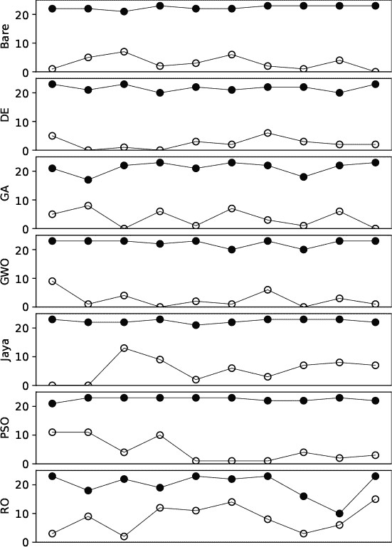

*图 5-11：各算法在 10 次运行中的产品排名，其中实心圆表示牛奶，空心圆表示糖果*

在图中，实心圆表示牛奶在排名中的位置，空心圆则表示糖果的位置。几乎所有算法都能将牛奶放在商店的最靠后的位置，PSO 的两种变体和 Jaya 可能是最一致的（对于这次*go_store*的单次运行）。一个明显的例外是 RO。尽管它每次运行都能将牛奶排在糖果后面，但有时位置并不理想。例如，在第 9 次运行中，牛奶和糖果几乎紧挨在一起。

*process_results.py*代码还会输出一个摘要。例如：

```
Mean revenue by algorithm:    t-test, best vs rest:     
    Bare: $1148.59 ( 5.09)        Bare vs   DE: 0.05296 
      DE: $1127.86 ( 8.62)        Bare vs   GA: 0.00017 
      GA: $1112.06 ( 5.81)        Bare vs  GWO: 0.36133 
     GWO: $1141.01 ( 6.30)        Bare vs Jaya: 0.04042 
    Jaya: $1130.88 ( 6.20)        Bare vs  PSO: 0.01244 
     PSO: $1125.73 ( 6.47)        Bare vs   RO: 0.00000 
      RO: $1023.75 (10.03)
```

第一部分展示了不同算法在 10 次运行中的平均收入。平均值的标准误（标准差除以样本数量的平方根，这里是 10）放在括号中。最简版 PSO 是赢家，平均日收入为$1,148.59，相比之下，RO 的收入仅为$1,023.75。

输出的右侧部分需要一些解释。我想比较不同算法在各次运行中的收入。代码找出了表现最好的算法，在这种情况下是最简版 PSO，并与其他算法进行 t 检验。*t 检验*是一种假设检验，用于判断两个数据集是否可能来自相同的数据生成过程。显示的值是 p 值，它表示在假设两个数据集来自同一数据生成过程的前提下，观察到的均值和标准差差异（或更大）的概率。如果 p 值较高，那么这两个数据集很可能来自同一个数据生成过程，这意味着检验的原假设可能有效。在这种情况下，最简版 PSO 的结果与 GWO 的结果没有显著差异，因为 p 值为 0.36。

p 值越小，结果越可能不是来自同一个数据生成过程。对于 RO 和 GA，p 值非常低，这让我们确信最简版 PSO 的结果更好。然而，其他算法的 p 值也很低。那么，最简版 PSO 是否真的在这项任务中远超其他算法，还是这次仅仅是运气好呢？

为了找出答案，我再次运行了*go_store*五次，并将*process_results.py*的输出累积到*results_per_run.txt*文件中。每次运行的最佳算法有所不同，但还是有一些趋势。在六次运行中，有三次 Jaya 表现最好；两次是最简版 PSO；一次是 GWO。GA 和 RO 的结果总是最差的。通过 t 检验的 p 值来看，Jaya、最简版 PSO 和 GWO 是适用于这个任务的优秀算法，且 Jaya 和最简版 PSO 之间可能没有显著差异。

*products.pkl*中的产品是按照购买概率递减的顺序排列，同时价格是递增的顺序，这意味着最不可能购买的产品是最贵的，反之亦然。因此，我们可能期望通过将产品按以下方式排序来最大化利润：最不可能购买但最贵的产品排在前面，而最可能购买、最便宜的产品排在最后，放在店铺的最远端。*store.py*的运行结果是群体试图实现这一理想排序的结果。

运行*product_order.py*，传入一个输出目录（*go_store*创建的*output*）以及另一个目录名，比如*orders*。你将生成一系列图表，每个算法一个，显示每个产品位置的均值，从 0 到 23，涵盖每个算法的 10 次运行。同时，还会绘制反映理想产品排序的曲线，即*products.pkl*中的产品顺序的反向排序。

图 5-12 显示了通过每种算法的 10 次运行后，按商店位置计算的平均产品成本，并与理想排序（平滑曲线）进行比较。

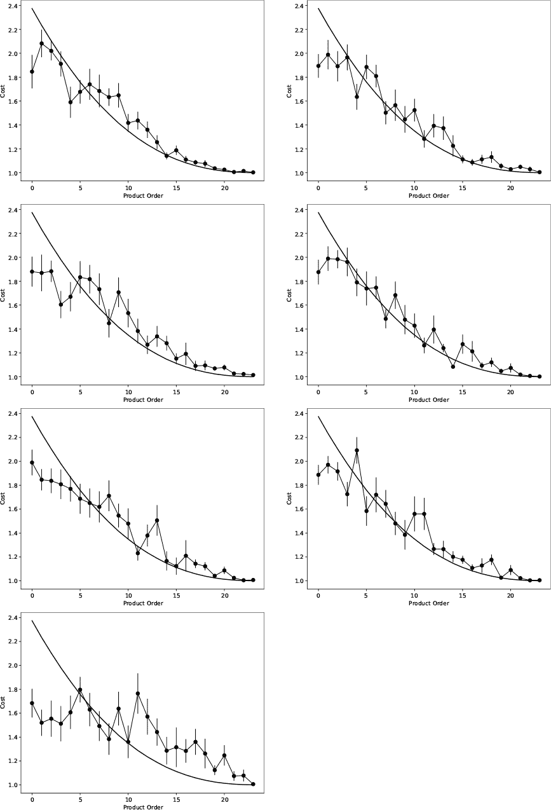

*图 5-12：比较按产品顺序排列的平均群体值与理想值。从左上角到右：基础 PSO，DE，GA，GWO，Jaya，经典 PSO，RO。*

首先，请注意，群体搜索并没有试图匹配理想的顺序。相反，任何匹配都是群体尝试最大化每日利润的一个涌现效应。

其次，除了 RO 外，所有算法在匹配最便宜产品的排序上都很有效。我们也在 图 5-11 中看到这一点，通过牛奶和糖果摆放的一致性。算法之间的大部分差异体现在最前面的几个产品的顺序上。我们也可以看到，位于商店前端的产品相对于后端的产品，其误差条较大。

产品靠近商店前端的摆放可能更为困难，因为这些产品是最少被购买的。简单的 PSO 和 Jaya 算法在更贵的产品上表现得相当不错，但可以说 GWO 更接近理想曲线。这告诉我们，算法之间的差异是微妙的，至少从这种角度来看，尽管 GA 在匹配早期产品排序方面几乎与 RO 一样差。

### **练习**

对群体算法已经厌倦了吗？我可没有。这里有更多内容可以探索和思考：

+   *Circles.py* 使用了 `enforce="clip"` 来打包圆形。将其更改为 `enforce="resample"`。如果结果突然不同，为什么会这样？

+   在正方形中打包圆形是一个与在立方体中打包球体类似的问题。修改一份 *circles.py* 来在立方体中打包球体，将二维问题转化为三维问题。运行你的代码并与 *sphere_dmin.png* 中的数据进行比较。如果遇到困难，可以查看 *spheres.py*。

+   在空地图上放置基站塔会返回（主要是）不重叠的塔。如果地图上非常繁忙且允许的位置较少，*cell.py* 会产生什么样的输出？你可以自己制作地图，或者尝试 *maps* 目录中的 *map_busy.png*。群体算法能找到放置塔的位置吗？

+   *enhance.py* 文件用于处理灰度图像。将其修改为处理 RGB 图像的增强。一个粗略的方法可以在 *rgb* 目录中的 *process_rgb_images.py* 文件中找到。这个目录里还包含了一些 RGB 图像（*original*）。*process_rgb_images.py* 是否始终产生良好的结果？为什么？实现一个新版本，该版本不单独增强每个通道，而是寻求一组跨所有通道效果最佳的参数，或许通过对每个通道求和 *F* 来实现。

+   将 *enhance.py* 修改为使用 `ddof=0` 而不是 `ddof=1` ——使用有偏方差而不是无偏方差。你是否注意到结果有所不同？

+   杂货店仿真中，每次群体的迭代都使用相同的购物者集合。如果在每次迭代前重新生成购物者集合，结果会如何？你认为这会有什么影响吗？

+   在杂货店仿真中，模拟结果使用了 250 个购物者。如果购物者数量减少到只有五个？十个？五十个？我所说的 Jaya 和基础 PSO 算法非常适合这个任务的论点会受到什么影响？

### **总结**

本章继续探索群体优化算法。我们学习了如何将圆形物体放入正方形中、在避免限制区域的同时放置手机信号塔、实现“美化”过滤器，以及将优化与仿真相结合，开发杂货店的产品布局计划。

我们使用相同的算法集合完成了所有这些工作。我们没有改变任何一个群体智能或进化算法来适应问题。相反，将问题转化为适当的形式使得算法能够直接应用。这是一种广泛适用的强大能力。现实世界中的许多过程，归根结底，都是优化问题，这意味着群体算法可能有它的作用。它们是通用算法，就像许多我们现在要讨论的机器学习算法一样。

本章及前一章的实验介绍了一种强大的通用优化问题方法。如果我们能够将问题转化为在一个多维空间中寻找最佳位置，其中每个点代表一个可能的解，那么群体智能和进化算法可能是适用的。我无法过分强调这一概念的有用性。

我们使用了一个简单的框架，支持少量的标准群体算法，而实际上有数百种算法可供选择——不过并非所有算法都等同。我们设计这个框架的目的是让它易于使用且具教学性，而非性能优越。这个框架是通向更复杂工具的垫脚石，如果你经常使用群体算法，应该考虑探索像这样的高级工具包：

**inspyred**   *[`pythonhosted.org/inspyred`](https://pythonhosted.org/inspyred)*

**pyswarms**   *[`github.com/ljvmiranda921/pyswarms`](https://github.com/ljvmiranda921/pyswarms)*

**DEAP**   *[`github.com/DEAP/deap`](https://github.com/DEAP/deap)*

这些工具包支持多种群体算法，包括群体智能和进化算法，并且针对性能进行了优化。其他语言的工具包包括：

**Java**   *[`cs.gmu.edu/~clab/projects/ecj`](https://cs.gmu.edu/~clab/projects/ecj)*

**C++**   *[`eodev.sourceforge.net`](https://eodev.sourceforge.net)*

群体算法将在第七章中再次出现，但现在，我们将探索人工智能世界中的随机性。
