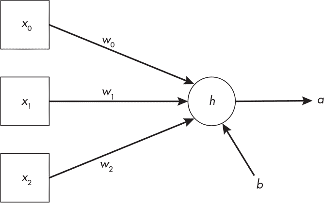
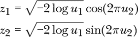
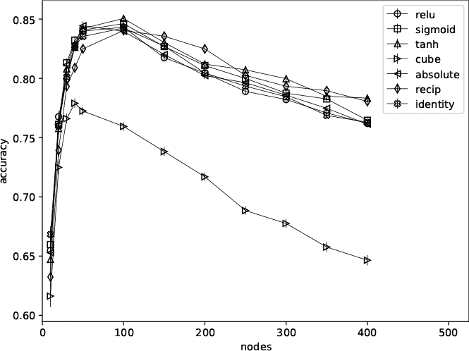
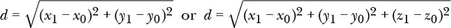
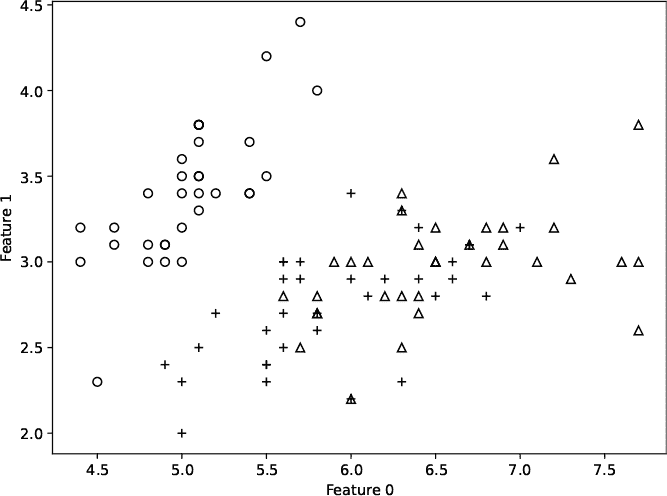
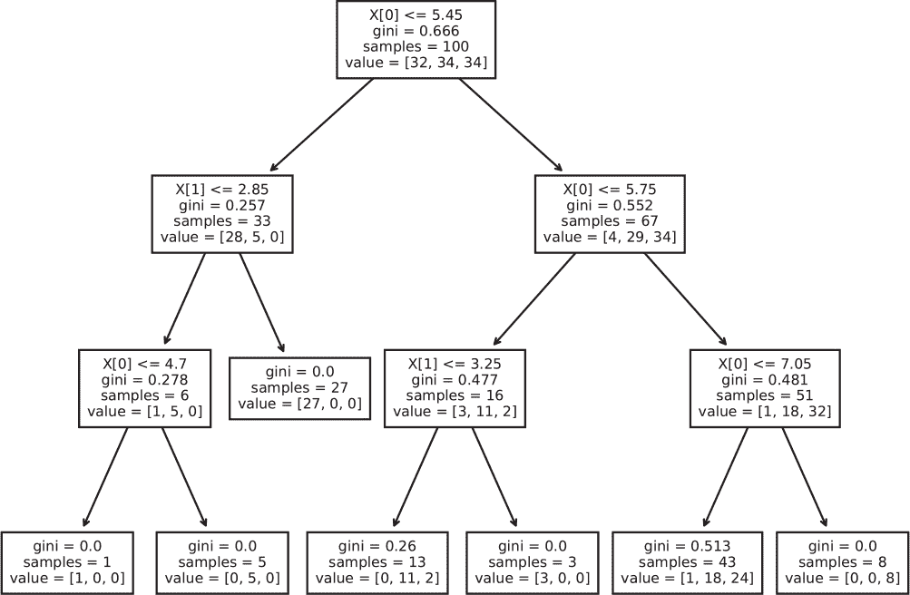
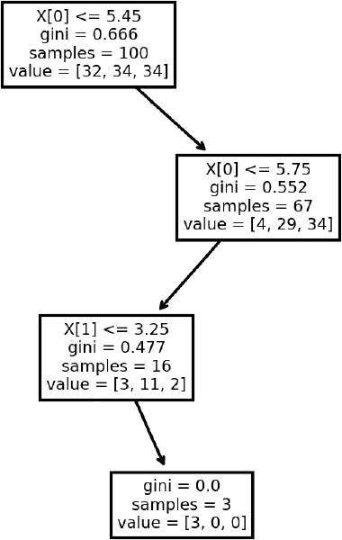
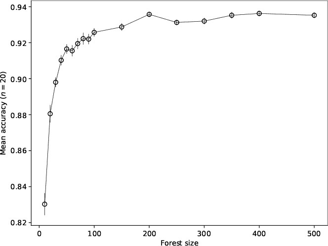

## **6

机器学习**


机器学习的目标是训练模型，在给定以前未见过的输入时生成正确的输出。这通常通过反复向模型提供一组已知的输入和输出，直到模型成功地将输出正确地分配给输入，或者*学习*成功为止。

在本章中，我们将通过构建两个数据集来探讨机器学习中的随机性，这些数据集分别用于组织学切片和手写数字图像。正如我们将要学习的，随机性在构建合适的机器学习数据集时至关重要。

接下来，我们将探索神经网络中的随机性——这是人工智能革命的驱动力。我们将专注于传统的神经网络架构；在处理高级模型时，随机性同样重要，甚至更为关键。

在神经网络之后是*极限学习机*，这是一种简单的神经网络，基本上依赖于随机性。与它们的“成年”版本不同，极限学习机不需要大量训练，而是依赖随机性的力量来完成大部分学习任务。

*随机森林*将作为本章的结尾，它们的成功也极度依赖于随机性。

我将在本章中指出随机性出现的地方。随机性是机器学习成功的核心，从你最喜欢的智能音响到你可能（不久之后）会乘坐的自动驾驶汽车，随机性都起到了关键作用。

### **数据集**

在机器学习中，我们从样本数据中训练模型。因此，在开始探索之前，我们必须构建数据集。随机性在这一过程中起着至关重要的作用。

我们将构建两个数据集。第一个由组织学切片中细胞的测量数据组成，旨在帮助模型学习组织样本是良性（类别 0）还是恶性（类别 1）。

第二个数据集由 28×28 像素的手写数字图像组成：1、4、7 和 9。图像不是以常规格式存储的；相反，它们被展开成向量，第一行图像接着第二行，以此类推，从而将 28×28 像素映射到 784 维向量。

#### ***组织学切片数据***

机器学习的礼仪规定，训练一个模型至少需要两个数据集。第一个是*训练集*，它由成对的（***x***，*y*）组成，其中***x***是输入向量，*y*是相应的输出标签。第二个是*测试集*，它与训练集的性质相同，但直到训练完成后才使用。模型在测试集上的表现决定了它学习得如何。

*raw*目录包含*bc_data.npy*和*bc_labels.npy*文件。第一个文件是一个包含 569 行 30 列的二维 NumPy 数组的数据集。每一行是一个*样本*，每一列是一个*特征*。每个样本的 30 个元素表示三种不同细胞在组织切片上的 10 个测量值。第二个文件包含标签，0 代表良性，1 代表恶性。数据行与标签之间是一一对应的。因此，*bc_data.npy*的第 0 行表示一个良性样本的特征，而第 2 行表示恶性样本的特征，因为*bc_labels.npy*中向量的第一个元素是 0，第三个元素是 1。

我们将从 569 个样本中构建两个数据集，使用 70/30 的划分方式，这意味着 70%的样本用于训练（398 个），剩余 30%用于测试（171 个）。

由于机器学习模型的学习过程通常较慢，我们应该担心 398 个样本不足以训练模型。我们需要更多的数据，但目前没有更多样本，我们该怎么办？

随机性帮助了我们。我们可以通过创建看似来自与训练数据相同来源的伪样本来*增强*数据。我们将对现有数据进行随机更改——足够让它变得不同，但不会过度改变以致标签不再准确。数据增强是现代机器学习中一个强大的部分，它帮助模型学会不专注于训练集的细节，而是寻求区分不同类别的更一般特征。

在增强训练样本之前，我们需要对数据进行标准化。许多机器学习模型在处理特征值范围不同的情况下表现困难。例如，一个特征的范围可能是[0, 2]，而另一个特征的范围可能是[–30,000, 30,000]。为了将两个特征转换到相同的相对范围，我们会减去每个特征的均值，然后除以特征的标准差。经过这种转换后，每个特征的均值接近零，标准差为一。

我们已经标准化了特征，并将其分为两个互不重叠的组，一个用于训练，另一个用于测试。现在我们准备通过使用 *主成分分析（PCA）* 来增强训练数据。如果我们能够在 30 个维度上绘制数据，我们会看到数据在某些方向上比在其他方向上分布得更广。PCA 找出这些方向，实际上是旋转 30 维坐标系，使得第一个坐标对准数据中变异性最大的方向，第二个坐标对准下一个方向，依此类推。这意味着，后面的坐标在表示数据时的重要性较小（尽管可能在区分不同类别时并非如此）。我们将利用这些方向的重要性逐渐降低的特性，随机改变坐标方向，生成与原始数据相似但不完全相同的训练数据。通过做出微小的改变，我们可以（合理地）确信新数据仍然代表原始类别的一个实例。

我们需要的代码在 *build_bc_data.py* 文件中。让我们逐步讲解关键部分，从加载原始数据并将其分成训练集和测试集开始（列表 6-1）。

```
   np.random.seed(8675309)
   x = np.load("raw/bc_data.npy")
   y = np.load("raw/bc_labels.npy")
➊ x = (x - x.mean(axis=0)) / x.std(ddof=1,axis=0)
   i = np.argsort(np.random.random(len(y)))
   x = x[i]
   y = y[i]
   n = int(0.7*len(y))
   xtrn = x[:n]
   ytrn = y[:n]
   xtst = x[n:]
   ytst = y[n:]
```

*列表 6-1：拆分原始组织学数据*

首先，我们修正 NumPy 的伪随机数种子，这样每次运行代码时都会构建相同的数据集。通常，改变 NumPy 的种子并不是一个好主意，因为它会影响到 *所有* 使用 NumPy 的代码，甚至是其他模块（比如我们在本章稍后会使用的 scikit-learn 模块）。然而，在这种情况下，我们愿意冒这个风险。

接下来，我们在标准化之前加载原始数据和标签 ➊。我们想要每个特征的均值。`x` 的列是特征，因此需要使用 `axis=0`。这个关键词会将 `mean` 函数应用到 `x` 的每一行，从而返回一个包含 30 个元素的向量，每个元素都是 `x` 相应列的均值。

我们从每个样本或每行`x`中减去这个均值。通过 NumPy 的广播规则，我们可以自动完成这个操作，无需使用循环。NumPy 足够聪明，能够察觉到我们正在尝试从一个二维数组的第二维为 30 的数据中减去一个 30 元素的向量，因此它执行减法操作，并为每一行重复这一过程。

接下来，我们将均值已被减去的数据除以每个特征的标准差。同样，`axis=0` 让我们能够跨行应用该函数。由于 NumPy 的广播规则，除法操作会应用到 `x` 的每一行，生成最终的标准化数据集。

接下来的三行通过将 `i` 分配为从 0 到 568 的数字的随机排列来对数据集进行随机化。NumPy 的 `argsort` 函数并不对向量进行排序，而是返回能够将其排序的索引序列。接下来的两行将这个排列应用到 `x` 和 `y` 上，从而同步地打乱数据和标签。

最后的五行代码将原始数据集分割为训练集（`xtrn`，`ytrn`）和测试集（`xtst`，`ytst`）。注意，我们在增强之前就已将数据集分割；如果在增强之后再进行分割，样本的增强版本很可能会出现在测试集中，这样会使得模型看起来比实际更好。

现在我们可以开始增强数据了。首先，我们需要学习原始数据的主成分，然后构建一个新的训练集，其中每个原始样本都被保留，并附加九个该样本的增强版本。

在列表 6-2 中，scikit-learn 提供了`PCA`。

```
from sklearn import decomposition
pca = decomposition.PCA(n_components=xtrn.shape[1])
pca.fit(x)
```

*列表 6-2：使用 PCA 学习主成分*

`PCA`类遵循 scikit-learn 的标准方法，即在对实例调用`fit`之前，先定义一个类的实例。我们将组件的数量设置为数据集中的特征数量（30）。

我们将使用训练好的`pca`对象在循环中构建一个包含增强样本的新训练集，如列表 6-3 所示。

```
start = 24
nsets = 10
nsamp = xtrn.shape[0]
newx = np.zeros((nsets*nsamp, xtrn.shape[1]))
newy = np.zeros(nsets*nsamp, dtype="uint8")

for i in range(nsets):
    if (i == 0):
        newx[0:nsamp,:] = xtrn
        newy[0:nsamp] = ytrn else:
        newx[(i*nsamp):(i*nsamp+nsamp),:] = generateData(pca, xtrn, start)
        newy[(i*nsamp):(i*nsamp+nsamp)] = ytrn
```

*列表 6-3：增强样本*

新的训练数据位于`newx`和`newy`中。每个现有的训练样本将伴随九个增强版本，因此新的训练集将包含 3,980 个样本，而不是仅有 398 个。

循环将数据集按 398 个样本的块构建。第一次遍历存储原始数据，后续的遍历调用`generateData`函数，返回原始数据集中的样本的一个新的增强版本。新样本的顺序与原始顺序相同，这意味着标签的顺序也保持不变。

在列表 6-4 中，`generateData`函数应用 PCA 变换，并从`start`（第 24 个）开始，改变最不重要的坐标方向。

```
def generateData(pca, x, start):
    original = pca.components_.copy()
    ncomp = pca.components_.shape[0]
    a = pca.transform(x)
    for i in range(start, ncomp):
        pca.components_[i,:] += np.random.normal(scale=0.1, size=ncomp)
    b = pca.inverse_transform(a)
    pca.components_ = original.copy()
    return b
```

*列表 6-4：应用 PCA*

PCA 是一个可逆的变换。`generateData`函数通过在从第 24 个（共 30 个）主成分开始的每个主成分上添加一个小的、正态分布的值来改变 PCA 成分。当逆变换使用这些更改后的成分时，得到的值（`b`），即一个 398 样本的块，将不再与原始数据完全相同。这些增强版本将构建新数据集的下一个块。

新的训练数据集位于`newx`和`newy`中，但样本的顺序并非随机的，因为它是按块构建的。因此，在将训练集和测试集写入磁盘之前，我们执行最终的随机化操作（列表 6-5）。

```
i = np.argsort(np.random.random(nsets*nsamp))
newx = newx[i]
newy = newy[i]
np.save("datasets/bc_train_data.npy", newx)
np.save("datasets/bc_train_labels.npy", newy)
np.save("datasets/bc_test_data.npy", xtst)
np.save("datasets/bc_test_labels.npy", ytst)
```

*列表 6-5：存储增强后的数据集*

组织学训练和测试数据集现在可以使用了。我们多次应用随机化操作，打乱数据的顺序，并改变主成分，以构建增强版本的训练数据。

#### ***手写数字***

深度学习革命的第一个重大成功之一是正确识别图像中的物体。虽然我们将构建的数据集在相对上并不先进，但它是 MNIST 数据集的一部分，MNIST 是一个常用于机器学习的更大的“工作马”数据集。我们将构建一个包含手写数字 1、4、7 和 9 的数据集。我选择这四个数字，因为即使是人类也常常把它们混淆，所以我们可能会预期机器学习模型也会犯同样的错误（时间会证明）。

Figure 6-1 展示了每种数字类型的样本。


*Figure 6-1: 示例数字，其中 1 和 7 常常被混淆，4 和 9 也是如此*

图像是 28×28 像素的灰度图，每个像素的值是[0, 255]范围内的整数。我们将把数字当作 784 维的向量（28 × 28 = 784）来处理。我将数字和它们的标签分别收集在文件*mnist_data.npy*和*mnist_labels.npy*中。

原始数字数据集相对较小，每个数字有 100 个样本；我们将原始数据拆分为 50 个训练样本和 50 个测试样本。我们将对每个图像进行多次增强，以扩展训练集的大小。

我们使用 PCA 来增强组织学数据，但由于这里处理的是图像，我们将应用基本的图像处理变换，随机生成每个训练图像的略微改变版本。特别地，我们将把每个图像旋转在[–3, 3]度之间；大约 10%的时间，我们将图像缩放至[0.8, 1.2]倍原始尺寸，同时保持最终尺寸为 28×28 像素，通过裁剪或将较小的图像嵌入到一个空白的 28×28 图像中。

我们需要的代码在*build_mnist_dataset.py*中。虽然它与构建组织学数据集的代码类似，但有所不同，主要包括将原始数据按 50/50 分配为训练集和测试集、存储未增强的训练数据，并将训练数据增强 20 次而不是 10 次，最终得到一个包含 4,200 个样本的增强训练集（200 个原始样本加上每个原始样本增强的 20 个版本）；参见 Listing 6-6。

```
   newx = []
   newy = []
   for i in range(len(ytrn)):
       newx.append(xtrn[i]) newy.append(ytrn[i])
    ➊ for j in range(20):
           newx.append(augment(xtrn[i]))
           newy.append(ytrn[i])
   xtrn = np.array(newx)
   ytrn = np.array(newy)
➋ i = np.argsort(np.random.random(len(ytrn)))
   xtrn = xtrn[i]
   ytrn = ytrn[i]
```

*Listing 6-6: 增强数字图像*

原始的 200 个训练样本（`xtrn`，`ytrn`）逐一检查。首先，我们将原始图像添加到增强后的输出（`newx`，`newy`）。然后，我们通过多次调用`augment` ➊，添加该图像的 20 个增强版本。添加完增强图像后，我们会再次打乱整个训练集，以混合图像的顺序 ➋。

Listing 6-7 展示了增强图像的代码。

```
from scipy.ndimage import rotate, zoom
def augment(x):
    im = x.reshape((28,28))
    if (np.random.random() < 0.5):
        angle = -3 + 6*np.random.random()
        im = rotate(im, angle, reshape=False)
    if (np.random.random() < 0.1):
        f = 0.8 + 0.4*np.random.random()
        t = zoom(im, f)
        if (t.shape[0] < 28):
            im = np.zeros((28,28), dtype="uint8")
            c = (28-t.shape[0])//2
            im[c:(c+t.shape[0]),c:(c+t.shape[0])] = t
        if (t.shape[0] > 28):
            c = (t.shape[0]-28)//2
            im = t[c:(c+28),c:(c+28)]
    return im.ravel()
```

*Listing 6-7: 增强图像*

输入图像（`x`），一个 NumPy 向量，首先被重塑为一个 28×28 元素的二维数组，`im`。接下来，两个`if`语句会检查随机值是否小于 0.5 或 0.1。第一个语句在 50%的时间内执行，应用一个随机旋转操作，使图像旋转某个在[–3, 3]度范围内的角度。注意这里使用了`scipy.ndimage`中的`rotate`。`reshape=False`关键字强制`rotate`返回与输入数组大小相同的输出数组。

第二个`if`语句，在 10%的时间内执行，使用`zoom`按一个随机的缩放因子在[0.8, 1.2]范围内放大图像，这意味着缩放后的图像大小从原始图像的 80%到 120%不等。调用`zoom`后的代码确保输出图像仍然是 28×28 像素，通过将较小的图像嵌入到一个空白的 28×28 图像中，或者在放大超过 100%时，选择中央的 28×28 像素。经过展开处理并重新转换为 784 元素向量后，返回新增强的图像。

*build_mnist_dataset.py*中的代码存储了较小的、未经增强的训练集和增强后的训练集。文件*mnist_test.py*使用`sklearn`的`MLPClassifier`（我们稍后会学习）来训练 40 个模型，使用训练集并保持每个模型的整体准确性。模型使用默认值，并且有一个 100 个节点的单一隐藏层。未经增强的数据集的平均准确率为 87.3%，而增强后的训练数据的平均准确率为 90.3%，这是一个具有统计学意义的差异，证明了随机增强过程有助于训练模型。虽然花时间详细讲解数据集的构建可能显得有些繁琐，但很难过分强调随机性在这个过程中的重要性。数据集的构建对现代机器学习至关重要，以至于有些比赛的模型是固定的，必须良好构建数据集才能获得获胜结果（可以搜索“Data-Centric AI Competition”）。

现在我们已经有了数据集，让我们来进行测试。

### **神经网络**

*神经网络*是一个由节点组成的集合，逐层将输入转换为输出。网络节点接受多个输入并产生一个输出，这一操作与生物神经元的工作原理足够相似，因此得名“神经网络”。神经网络不是人工的大脑；它们是前馈的、定向的、无环的*图*，这是一种在计算机科学中常用的数据结构。

网络的操作将输入转化为输出；换句话说，神经网络是一种函数，***y*** = *f*(***x***; ***θ***)。训练神经网络意味着寻找***θ***，一组使网络按预期执行的参数。

#### ***解剖分析***

如果神经网络是由层级中的节点构成的集合，那么从一个节点开始是有意义的。请参见图 6-2。



*图 6-2：神经网络节点*

数据从左到右流动。输入（*x*），无论是网络的输入还是先前网络层的输出，都与*权重*（*w*）相乘并与*偏置*（*b*）相加，然后将总和传递给*激活*函数（*h*）以产生输出，*a*。用符号表示为：

*a* = *h*(*w*[0]*x*[0] + *w*[1]*x*[1] + *w*[2]*x*[2] + *b*)

激活函数是非线性的，或者是某个超越*x*一次方的函数。现代网络通常使用*修正线性单元（ReLU）*激活函数，它会输出输入，除非输入小于零，在这种情况下输出为零，*h* = max(0, *x*)。

网络层由一组节点组成，这些节点共同接收上一层的输出作为它们的输入，并产生新的输出，每个节点一个，传递给下一层。层中的每个节点都会接收每个输入；用图论的术语来说，网络是*完全连接*的。

数据通过网络逐层流动，直到输出。通过这种方式，网络将输入***x***映射到输出***y***。输出通常是一个向量，但也可以是标量，*y*。

在神经网络中传递数据最简单的方式是将层之间的权重表示为矩阵，将偏置表示为向量。这种表示法自动地将每个输入应用于每个节点和激活函数，从而将整个层的操作简化为矩阵乘以向量，再加上另一个传递给激活函数向量版本的向量。训练意味着学习一组矩阵作为权重，每层一个矩阵，以及一组偏置向量，每层一个。

权重和偏置存在于层的节点之间的连接上，是***θ***的参数；这些是网络在训练过程中学习的内容。这类似于拟合曲线，但在这种情况下，函数由网络的架构决定。与曲线拟合不同，训练神经网络通常不涉及将训练集上的误差降到零。相反，目标是引导网络学习权重和偏置，使其能够广泛适用于新的输入。毕竟，训练模型的整个目的是使其能够处理新的、未知的输入。

神经网络训练的详细讨论超出了我们当前的范围，因为我们的目标是理解随机性在过程中的作用。如果你有兴趣了解更多神经网络的内容，我推荐我的书籍《实践深度学习：基于 Python 的入门》（2021 年），也可以从 No Starch Press 获得。记住，训练过程会产生一组特定的权重和偏置，使网络能够针对当前问题进行调整。

#### ***随机性***

随机性在训练过程的开始阶段至关重要，特别是在选择初始权重和偏置时。

训练神经网络遵循以下一般算法：

1.  随机初始化网络的权重和偏差。

1.  将随机选择的训练数据子集传入网络。

1.  使用网络输出与期望输出之间的误差度量来更新权重和偏差。

1.  从第二步开始重复，直到训练完成（具体如何决定）。

在这一部分，我们关注的是第一步。第二步和第三步涉及到一个*损失函数*，这是衡量网络错误的指标，并且包括一个两步过程来更新权重和偏差：*反向传播*和*梯度下降*。前者使用微积分中的链式法则来确定每个权重和偏差值如何影响误差，后者则利用这些度量形成的梯度来调整权重和偏差，从而最小化损失函数。

#### ***初始化***

直到 2010–2012 年，深度神经网络（具有多层结构）才在场景中爆发。促成这一发展的因素之一是认识到以往初始化模型的权重和偏差的算法相对较差；现在有了更好的选择。

我们将通过使用`sklearn`中的`MLPClassifier`类来实现一个传统的神经网络，从而探索这些选项。*MLP*代表*多层感知器*，“感知器”是神经网络的一个古老名称（我建议你搜索 Frank Rosenblatt 和他的感知器机器——这项研究在当时没有得到足够的重视，实在是太迷人了）。

##### **初始化网络**

`MLPClassifier`类包括一个内部方法`_init_coef`，该方法负责分配初始权重和偏差。我们将对`MLPClassifier`进行子类化，并重写这个方法，从而改变初始化方法，同时仍然能利用`MLPClassifier`所提供的其他功能。请查看 Listing 6-8。

```
from sklearn.neural_network import MLPClassifier

def normal(rng, mu=0, sigma=1):
    if (normal.state):
        normal.state = False
        return sigma*normal.z2 + mu
    else:
        u1,u2 = rng.random(2)
        m = np.sqrt(-2.0*np.log(u1))
        z1 = m*np.cos(2*np.pi*u2)
        normal.z2 = m*np.sin(2*np.pi*u2)
        normal.state = True
        return sigma*z1 + mu
normal.state = False

class Classifier(MLPClassifier):
    def _init_coef(self, fan_in, fan_out, dtype):
     ➊ def normvec(fan_in, fan_out):
            vec = np.zeros(fan_in*fan_out)
            for i in range(fan_in*fan_out):
                vec[i] = normal(self.rng)
            return vec.reshape((fan_in,fan_out))

        if (self.init_scheme == 0):
         ➋ return super(Classifier, self)._init_coef(fan_in, fan_out, dtype)
        elif (self.init_scheme == 1):
         ➌ vec = self.rng.random(fan_in*fan_out).reshape((fan_in,fan_out))
            weights = 0.01*(vec-0.5)
            biases = np.zeros(fan_out)
        elif (self.init_scheme == 2):
         ➍ weights = 0.005*normvec(fan_in, fan_out)
            biases = np.zeros(fan_out) elif (self.init_scheme == 3):
         ➎ weights = normvec(fan_in, fan_out)*np.sqrt(2.0/fan_in)
            biases = np.zeros(fan_out)

        return weights.astype(dtype, copy=False), biases.astype(dtype,
            copy=False)
```

*Listing 6-8: 重写初始化方法*

该子类覆盖了 scikit-learn 的做法 ➋，提供了三种其他方法。该方法返回一个权重矩阵和一个偏差向量，适用于具有`fan_in`输入和`fan_out`输出的层。`dtype`参数指定数据类型，通常是 32 位或 64 位浮点数。

默认情况下，scikit-learn 使用*Glorot 初始化*。我们通过调用父类版本的方法 ➋ 来实现。Glorot 初始化依赖于输入和输出的数量，它是提高模型性能的初始化方法之一。至少，这是它的说法。我们将对它进行测试。

另一种现代初始化方法是*He 初始化* ➎，它适用于使用 ReLU 激活函数的网络。He 初始化依赖于一个来自正态分布的样本矩阵，该分布的均值为 0，标准差为 1。我们通过嵌入式的`normvec`函数 ➊来实现这一点，这使我们能够使用`RE`类。稍后我们将具体看看如何操作。

我们通过使用小的均匀分布 ➌ 或正态分布 ➍ 随机值来初始化经典的神经网络。第一个从均匀分布中抽取随机样本，范围是 [–0.005, 0.005]。第二个使用按 0.005 缩放的正态分布样本。两种方法从直觉上看都是合理的，但正如我们将看到的，它们并不理想。

`normal` 函数返回一个正态分布的样本，其均值为 `mu`，标准差为 1。正态分布的样本对称地围绕均值选择；请参见图 1-1 中 第 4 页的示例。NumPy 提供了一个函数来从正态分布中选择样本，但我们想使用我们的 `RE` 类，因此我们需要定义一个函数，该函数从 `RE` 返回的均匀分布样本中创建正态分布样本。我们可以使用第一章中介绍的 Box-Muller 变换：



这里 *u*[1] 和 *u*[2] 是 0, 1) 范围内的均匀分布样本，这正是 `RE` 返回的内容（多么方便！）。

实现 `normal` 的代码需要解释。请注意最后一行的缩进：它不是 `normal` 的一部分，而是在定义 `normal` 后立即引用它。

Box-Muller 变换方程使用一对均匀分布的样本来生成一对正态分布的样本。虽然我们可以要求 `RE` 对象返回一对均匀分布的样本，但我们希望 `normal` 在调用时仅返回一个正态分布的样本。我们可以生成两个样本并丢弃一个，或者小心地尝试保留两个样本。这样，每次调用 `normal` 时返回一个单一的样本，并且仅在需要时生成新样本。要实现这一点，要求 `normal` 在调用之间保留状态。Python 中实现这一点的方法是使用类，但这似乎有些过于复杂。相反，我们将利用 Python 函数是对象这一特性；我们可以随意为对象添加新属性（成员变量）。我们将 `normal` 定义为一个 Python 函数，然后立即为其添加一个初始化为 `False` 的 `state` 变量——这就是[Listing 6-8 中的最后一行。

当我们调用 `normal` 时，`state` 变量的值是 `False`。这个值会在调用之间持续存在，因为它是 `normal` 函数的一个属性，`normal` 使用 `state` 的值来决定是生成两个新样本并返回第一个，同时缓存第二个，还是直接返回第二个。如果 `state` 是 `True`，则返回第二个样本 `z2`，并将其乘以所需的标准差 (`sigma`)，加上均值 (`mu`)。然后将 `state` 设置为 `False`。如果 `state` 是 `False`，则从 `rng` 获取两个均匀样本，并使用它们计算两个正态样本 `z1` 和 `z2`。缓存 `z2` 并返回 `z1`，并适当进行缩放和偏移。

要使用`Classifier`，我们通过 scikit-learn 创建一个神经网络，并添加两个新的属性：`init_scheme`用来指定所需的初始化方案，以及`rng`，它是`RE`的一个实例，用于访问我们在全书中开发的不同随机数源。

##### **实验初始化**

让我们尝试一下`Classifier`和神经网络初始化。过程中，我们将设置一个 scikit-learn 训练会话。

我们需要的代码在*init_test.py*中。它加载了之前创建的数字数据集，并使用每个初始化方案训练了 12 个模型。对于每个初始化方案，训练多个模型是必要的，因为初始化是随机的；例如，在一个初始化方案下我们可能会得到一个不太好的结果，而实际上它是一个有效的方法。通过对多个模型的结果取平均值，我们可以应用统计测试。

清单 6-9 显示了*init_test.py*主要部分的开头。

```
import numpy as np
from Classifier import *
from RE import *
from scipy.stats import ttest_ind, mannwhitneyu

xtrn = np.load("../../data/datasets/mnist_train_data.npy")/256.0
ytrn = np.load("../../data/datasets/mnist_train_labels.npy")
xtst = np.load("../../data/datasets/mnist_test_data.npy")/256.0
ytst = np.load("../../data/datasets/mnist_test_labels.npy")

N = 12
init0 = []

for i in range(N):
    init0.append(Run(0, xtrn,ytrn,xtst,ytst))
init0 = np.array(init0)
```

*清单 6-9：设置初始化实验*

这些导入语句使得`Classifier`类可用，同时导入了`RE`和两个统计测试：t 检验和*曼-惠特尼 U 检验*，它是 t 检验的非参数版本。*非参数检验*对数据没有假设，且要求更为严格。我常常同时使用这两种检验，以考虑到 t 检验结果无效的可能性——因为数据并非正态分布，这是 t 检验的一个基本假设。

接下来，我们加载数字数据集，首先是训练集（`xtrn`），然后是测试集（`xtst`）。我们将数据除以 256，将其从[0, 255]映射到 0, 1)。

以下代码段累计了初始化方案 0 的`Run`输出。返回值是使用 scikit-learn 的 Glorot 初始化的模型的整体准确率。类似的代码会捕获其他四个初始化方案的准确率。

然后，我们将所有方案的结果转化为均值和标准误差后再打印，如[清单 6-10 所示。

```
m0,s0 = init0.mean(), init0.std(ddof=1)/np.sqrt(N)
m1,s1 = init1.mean(), init1.std(ddof=1)/np.sqrt(N)
m2,s2 = init2.mean(), init2.std(ddof=1)/np.sqrt(N)
m3,s3 = init3.mean(), init3.std(ddof=1)/np.sqrt(N)
```

*清单 6-10：报告结果*

最后，我们运行统计测试，将一个初始化方案与另一个进行比较。从理论上讲，我们可能会预期初始化方案 3（He）是表现最好的，因此我们将它（`init3`）与其他方案进行比较，并报告相应的 p 值（“u”是曼-惠特尼 U 检验的 p 值）；见清单 6-11。

```
_,p = ttest_ind(init3,init0)
_,u = mannwhitneyu(init3,init0)
print("init3 vs init0: p=%0.8f, u=%0.8f" % (p,u))
_,p = ttest_ind(init3,init2)
_,u = mannwhitneyu(init3,init2)
print("init3 vs init2: p=%0.8f, u=%0.8f" % (p,u))
_,p = ttest_ind(init3,init1)
_,u = mannwhitneyu(init3,init1)
print("init3 vs init1: p=%0.8f, u=%0.8f" % (p,u))
```

*清单 6-11：运行统计测试*

统计测试`ttest_ind`和`mannwhitneyu`首先返回各自的检验统计量，然后返回相应的 p 值。p 值告诉我们，假设两组准确率来自同一分布时，我们测得的均值差异的概率。p 值越小，两组来自同一分布的可能性越小，从而增加我们对观察到的差异是真实的信心。

##### **训练网络**

配置和训练神经网络的代码位于 `Run` 函数中，详见 Listing 6-12。

```
def Run(init_scheme, xtrn,ytrn,xtst,ytst):
    clf = Classifier(hidden_layer_sizes=(100,50), max_iter=4000)
    clf.init_scheme = init_scheme
    clf.rng = RE()
    clf.fit(xtrn,ytrn)
    pred = clf.predict(xtst)
    _,acc = Confusion(pred,ytst)
    return acc
```

*Listing 6-12: 训练神经网络*

在这里，我们开始体会到 scikit-learn 的强大。`Run` 函数的参数包括要使用的初始化方案，[0, 3]，接着是训练集和测试集。首先，我们通过创建 `Classifier` 的实例来创建神经网络，`Classifier` 是我们对 scikit-learn 中 `MLPClassifier` 的子类。默认情况下，神经网络使用 ReLU 激活函数，这正是我们需要的。它还会训练，直到训练不再改善或 `max_iter` 完成整个训练集的迭代。每次通过训练集的过程被称为 *epoch*。

`hidden_layer_sizes` 关键字定义了模型的架构。我们知道输入有 784 个元素，输出有 4 个类别，因为有四个类别，分别是数字 1、4、7 和 9。输入和输出之间的层是隐藏层；我们指定了两个：第一个有 100 个节点，第二个有 50 个节点。

在训练之前，我们需要设置初始化方案（`init_scheme`）并定义 `rng`，它是 `RE` 的一个实例，使用 PCG64 默认值并且浮动值在 0, 1) 之间。

使用 `clf.fit(xtrn, ytrn)` 来训练神经网络，其中 `fit` 方法接受输入向量（`xtrn`）和相关标签（`ytrn`）。当该方法返回时，模型已经训练完毕，并为所有的权重和偏置（***θ***）找到了合适的值。

##### **评估网络**

当给定测试数据（`xtst`）时，`predict` 会生成一组预测类别标签 `pred`，其长度与已知类别标签 `ytst` 相同。我们通过构建 *混淆矩阵* 来比较两者，评估模型的表现。混淆矩阵的行表示已知的真实类别标签，列表示模型分配的标签。矩阵元素是每种可能的真实标签与分配标签配对出现的次数。一个完美的分类器会始终分配正确的标签，这意味着混淆矩阵将是对角线的。任何偏离主对角线的计数都表示错误。

`Confusion` 函数生成一个混淆矩阵和整体准确率，基于已知标签和预测标签的集合；详见 [Listing 6-13。

```
def Confusion(y,p):
    cm = np.zeros((4,4), dtype="uint16")
    for i in range(len(p)):
        cm[y[i],p[i]] += 1
    acc = np.diag(cm).sum() / cm.sum()
    return cm, acc
```

*Listing 6-13: 创建混淆矩阵*

混淆矩阵（`cm`）是一个 4×4 矩阵，因为有四个类别。最重要的操作是通过先按已知类别标签（`y`）索引，再按分配的类别标签（`p`）索引来更新 `cm`。每次发生特定的真实类别标签与分配标签的配对时，添加一个计数。

整体准确率要么是已知标签与分配标签匹配的次数，要么是主对角线的和除以所有矩阵元素的和。

运行 *init_test.py* 需要几分钟时间。我的运行结果如下：

```
init0: 0.92667 +/- 0.00167
init1: 0.89958 +/- 0.00311
init2: 0.90083 +/- 0.00183
init3: 0.92500 +/- 0.00213

init3 vs init0: p=0.54429253, u=0.55049935
init3 vs init2: p=0.00000002, u=0.00004054
init3 vs init1: p=0.00000088, u=0.00006765
```

第一个块显示了每种初始化方案下 12 个模型的平均准确度（均值 ± 标准误）。Glorot 和 He 初始化的平均准确度分别为 92.7%和 92.5%。较旧的均匀和正态初始化策略分别达到了 90.0%和 90.1%。这些差异很大，但它们在统计上显著吗？为此，看看第二个结果块。

将 He 初始化（`init3`）与 Glorot（`init0`）进行比较，t 检验和 Mann-Whitney U 的 p 值都约为 0.5。这些 p 值强烈表明两种方法之间没有差异。

现在，看看比较 He 初始化和旧方法的 p 值。它们几乎为零，意味着平均准确度的差异很可能是实质性的——He 和 Glorot 初始化都导致了显著更好的模型性能。现代深度学习得到了验证。虽然从未怀疑过，但直接确认而不是盲目相信是有益的。

### **极限学习机**

*极限学习机*是一个简单的单隐藏层神经网络。极限学习机与传统神经网络的区别在于权重和偏置的来源。

将输入向量映射通过神经网络的第一个隐藏层涉及一个权重矩阵，***W***，和一个偏置向量，***b***

***z*** = *h*(***Wx*** + ***b***)

其中***x***和***z***是向量，*h*是一个激活函数，接受一个向量输入并输出一个向量。

在传统神经网络中，***W***和***b***是在训练过程中学习得到的。在极限学习机中，***W***和***b***是随机生成的，与训练数据无关。随机矩阵有时能够将输入（例如数字图像作为向量）映射到一个新的空间，在这个空间中，分类更容易分离。

如果我们使用这个方程映射所有的训练数据，隐藏层的输出（***z***）变成一个矩阵（***Z***），它的行数与训练样本的数量相同，列数与隐藏层节点的数量相同。换句话说，随机的***W***矩阵和***b***偏置向量已经生成了一个新的训练数据版本，***Z***。

随机权重矩阵和偏置向量连接输入层和隐藏层。为了完成神经网络的构建，我们需要在隐藏层输出和模型输出之间添加一个权重矩阵；在这种情况下没有偏置向量。学习过程发生在这里，但我们需要绕个圈子来看它。

训练数据集由输入样本和相应的类标签[0, 3]组成。许多机器学习模型不使用整数类标签，而是将标签转换为*one-hot 向量*。例如，如果有四个类，则 one-hot 向量有四个元素，除了对应类标签的元素为 1，其余为 0。如果类标签是 2，则 one-hot 向量为{0, 0, 1, 0}。同样，如果类标签是 0，one-hot 向量为{1, 0, 0, 0}。为了完成极限学习机的构建，我们需要将训练集类标签转化为这种形式。我假设接下来的部分中标签已经被如此转化。

作为 one-hot 向量，类标签变成了一个矩阵***Y***，行数与训练样本的数量相同，列数与类别数相同。从隐层输出***Z***到已知标签（作为 one-hot 向量）***Y***的线性映射使用矩阵***B***：

***Y*** = ***BZ***

我们希望找到作为第二个权重矩阵的***B***。

因为我们知道通过将训练数据推送通过隐层得到的***Z***和已知标签***Y***，我们通过以下方式生成***B***：

***YZ***^(–1) = ***B***

其中***Z***^(–1)是矩阵***Z***的逆。矩阵的逆相当于标量值的倒数，它们互相抵消。为了找到***Z***的逆，我们需要 Moore-Penrose 伪逆，这是 NumPy 在其线性代数模块`linalg`中提供的。

现在我们拥有了构建极限学习机所需的所有内容：

1.  随机选择权重矩阵***W***和偏置向量***b***。

1.  将训练数据通过第一隐层，***Z*** = *h*(***WX*** + ***b***)，其中***X***和***Z***现在是矩阵，每一行代表一个训练样本。

1.  通过使用***Z***（隐层输出）的伪逆来计算输出权重矩阵，***B*** = ***YZ***^(–1)。

1.  使用***W***、***b***和***B***作为极限学习机的权重和偏置。

这有些抽象。让我们通过代码使其具体化。

#### ***实现***

文件*elm.py*实现了一个极限学习机，并将其应用于数字数据集。列表 6-14 展示了`train`函数。

```
def train(xtrn, ytrn, hidden=100):
    inp = xtrn.shape[1]
    m = xtrn.min()
    d = xtrn.max() - m
    w0 = d*rng.random(inp*hidden).reshape((inp,hidden)) + m
    b0 = d*rng.random(hidden) + m
    z = activation(np.dot(xtrn,w0) + b0)
    zinv = np.linalg.pinv(z)
    w1 = np.dot(zinv, ytrn)
    return (w0,b0,w1)
```

*列表 6-14：定义一个极限学习机*

第一行将`inp`设置为训练数据中的特征数，这里是 784。接下来的两行定义了最小训练特征值(`m`)和它与最大特征值的差(`d`)。

以下两行通过在训练数据范围[*m*, *m* + *d*]内随机采样生成随机权重矩阵和偏置向量，***W***i（`w0`）和***b***（`b0`）。同样，***W***和***b***是完全随机的，但一旦选择就固定下来。

极限学习机的最后一部分是***B***（`w1`），它是通过将训练数据传递通过隐层得到的。

```
z = activation(np.dot(xtrn,w0) + b0)
```

其中`activation`是选择的激活函数（*h*()）。

最后，为了定义 ***B***，我们将 ***YZ*** 乘以 (–1)：

```
zinv = np.linalg.pinv(z)
w1 = np.dot(zinv, ytrn)
```

函数的返回值是已定义和训练好的极限学习机：`(w0,b0,w1)`。让我们进行测试。

#### ***测试***

文件 *elm.py* 从中提取的 `train` 函数，训练一个极限学习机来分类数字数据集，使用用户提供的隐藏层节点数。例如：

```
> python3 elm.py 200 mt19937
[[49  0  1  0]
 [ 1 42  0  9]
 [ 2  4 39  4]
 [ 1  5  6 37]]

accuracy = 0.835000
```

我们使用 Mersenne Twister 伪随机数生成器构建一个包含 200 个隐藏层节点的机器。输出显示混淆矩阵和总体准确率 83.5%。混淆矩阵几乎是对角线的，这很有意义。

让我们仔细分析混淆矩阵。行表示真实的类别标签，从上到下分别是 1、4、7 和 9。列从左到右是模型分配的类别标签（我们很快会看到）。查看最上面的一行，在测试数据集中，50 个 1 中，模型将 1 预测为 1 次达 49 次，但有一次将其预测为 7。

模型在混淆矩阵的最后一行，处理数字 9 时遇到最大困难。在 49 次测试中，模型正确预测了 37 次，但错将 9 预测为 7 次和 4 次。只有一次，模型将 9 错误预测为 1。

`train` 函数创建了极限学习机。为了使用它，我们需要 `predict`，如 清单 6-15 所示。

```
def predict(xtst, model):
    w0,bias,w1 = model
    z = activation(np.dot(xtst,w0) + bias)
    return np.dot(z,w1)
```

*清单 6-15：使用极限学习机进行预测*

我们从提供的模型中提取权重矩阵和偏置向量，然后将测试数据通过隐藏层，最后通过输出层。`activation` 变量设置为当前使用的特定激活函数—默认情况下是 ReLU。我们将在下一节中尝试不同的激活函数。

`predict` 的输出是一个二维矩阵，行数与 `xtst` 中的行数相同（200），列数与类别数相同（4）。例如，第一个测试样本（`xtst[0]`）的预测输出为：

0.19551782, 0.90971894, 0.05398019, –0.06542743

第一个已知的测试标签，作为一个 one-hot 向量为：

0, 1, 0, 0

请注意，模型输出向量中最大值的索引为 1，与 one-hot 标签中最大的值相同。换句话说，第一个测试样本属于类别 1（4），并且模型成功地预测了类别 1 为最可能的类别。最后的输出值是负数：模型输出的不是概率，而是决策函数值，其中最大值表示最可能的类别标签，即使我们没有与该值相关联的真实概率。

因此，要构建混淆矩阵，我们需要类似 清单 6-16 的代码。

```
def confusion(prob,ytst):
    nc = ytst.shape[1]
    cm = np.zeros((nc,nc), dtype="uint16")
    for i in range(len(prob)):
        n = np.argmax(ytst[i])
        m = np.argmax(prob[i])
        cm[n,m] += 1
    acc = np.diag(cm).sum() / cm.sum()
    return cm,acc
```

*清单 6-16：为极限学习机构建混淆矩阵*

`confusion` 函数返回混淆矩阵和总体准确率，但我们不是直接使用 `ytst` 和 `prob` 中的值，而是应用 NumPy 的 `argmax` 函数来返回四个元素向量中最大值的索引。

列表 6-17 显示了 *elm.py* 的其余部分，该部分加载数字数据集，将其缩放到 256，然后使用三行代码训练和测试极限学习机。

```
model = train(xtrn, ytrn, nodes)
prob = predict(xtst,model)
cm,acc = confusion(prob,ytst)
```

*列表 6-17：训练和测试极限学习机*

`nodes` 参数是从命令行读取的隐藏层节点数。

极限学习机对隐藏层节点数有多敏感？这是一个很好的问题。

默认情况下，*elm.py* 中的代码使用 ReLU 激活函数。然而，文件中定义了几个其他的激活函数。在本节中，我们将探索每种激活函数与不同数量的隐藏层节点的组合，看看是否有最佳组合。

ReLU 激活函数使用 NumPy 的 `maximize` 函数，该函数按元素返回两个参数中的最大值：

```
def relu(x):
    return np.maximum(x,0)
```

我们并不局限于仅使用 ReLU。传统上，神经网络大量使用了 sigmoid 和双曲正切函数：

```
def sigmoid(x):
    return 1 / (1 + np.exp(-0.01*x))
def tanh(x):
    return np.tanh(0.01*x)
```

这两个函数都返回 S 形曲线。我在 sigmoid 和双曲正切函数中加入了 0.01 的系数来缩放 *x*。这通常不是做法，但在这里是必要的，以防止溢出错误。

为了有趣，我定义了几个其他激活函数：

```
def cube(x):
    return x**3
def absolute(x):
    return np.abs(x)
def recip(x):
    return 1/x
def identity(x):
    return x
```

让我们测试激活函数，随着隐藏层节点数从 10 到 400 的变化。代码位于 *elm_test.py* 中。它使用了 `train`、`predict` 和 `confusion` 函数。主循环如 列表 6-18 所示。

```
acts = [relu, sigmoid, tanh, cube, absolute, recip, identity]
nodes = [10,20,30,40,50,100,150,200,250,300,350,400]
N = 50
acc = np.zeros((len(acts),len(nodes),N))

for i,act in enumerate(acts):
    for j,n in enumerate(nodes):
        for k in range(N):
            activation = act
            model = train(xtrn, ytrn, n)
            prob = predict(xtst, model)
            _,a = confusion(prob, ytst)
            acc[i,j,k] = a

np.save("elm_test_results.npy", acc)
```

*列表 6-18：测试激活函数和隐藏层大小*

对每种激活函数和隐藏层大小的组合，训练了 50 个极限学习机，并跟踪整体准确度（`acc`）。注意将 `act` 赋值给 `activation`。在 Python 中，函数可以自由赋值给变量，然后在引用该变量时使用（如在 `train` 中）。

运行 *elm_test.py*，传入一个随机源（我使用了 MT19937）。当它完成后，运行 *elm_test_results.py* 解析输出并生成类似于 图 6-3 的图表，显示按隐藏层大小和激活函数的平均准确率。误差条存在但较小。



*图 6-3：极限学习机性能作为隐藏层大小和激活函数的函数*

图 6-3 最显而易见的结论是，*y* = *x*³是一个糟糕的激活函数，因为它总是导致比其他激活函数更差的模型。另一个有趣的观察是激活函数的形状相似：随着隐藏层节点数量的增加，模型准确性迅速提高，然后达到最大值后缓慢下降。激活函数之间的差异很小，尤其是在 100 个隐藏节点的最大值附近；然而，双曲正切函数在本次实验中表现最佳。实际上，`tanh`在大多数实验中表现最好，因此可以公平地说，对于这个特定数据集，使用`tanh`和 100 个隐藏层节点的极限学习机是最合适的选择。

恒等激活函数，*f*(***x***) = ***x***，避免了非线性；所有的性能都来自于线性顶层将隐藏层的输出映射到每个类别的预测。

#### ***鲁莽的群体优化***

极限学习机的吸引力在于，与训练相同规模的传统神经网络相比，模型训练的速度惊人。的确，第一次训练的模型可能不是那么好，但连续尝试几次并保留表现最好的模型似乎是合理的。我可以想象一种情景，其中自主系统可能需要快速训练一个模型，以应对快速变化的输入数据。

然而，极限学习机中的随机部分——即从输入到隐藏层的权重矩阵和偏置向量——让我产生了疑问：我们是否可以通过群体优化来学习权重矩阵和偏置向量？这行得通吗？如果可以，是否比随机版本更有效？我的想法显然忽略了极限学习机本来就是通过随机权重和偏置来工作的，但我想知道即使比传统神经网络训练更具计算开销，群体优化是否可能发挥作用。

真正的挑战在于问题的维度。我们的输入是 784 维的向量。我们已经得出结论，100 个隐藏层节点似乎是一个不错的选择，因此权重矩阵和偏置向量的总维度是：

784 × 100 + 100 = 78,500

我们将要求群体在 78,500 维的空间中搜索，以找到一个好的位置，进而获得具有最高准确性的模型。这是一个艰巨的任务。

我实验过的代码在*elm_swarm.py*中。我不会逐步讲解它，但你会看到它遵循了前几章中的类似优化代码。目标函数使用每个粒子的位置作为权重矩阵和偏置向量，然后学习输出权重矩阵，并在测试集上评估模型以得出整体准确性。因此，每次调用`Evaluate`方法都会得到一个经过训练和测试的模型。

要运行代码，可以使用这样的命令行：

```
> python3 elm_swarm.py 100 tanh 20 60 de de.pkl
```

在这里，差分进化（`de`）用于寻找一个具有`tanh`激活函数和 100 个隐藏层节点的模型。该种群有 20 个粒子，并运行 60 次迭代，之后报告最终的混淆矩阵和准确率。最佳模型被存储在文件*de.pkl*中。当前最佳的准确率会在每次迭代时显示，因此你可以看到种群的学习过程。运行*elm_swarm.py*而不带参数可以查看所有选项。

例如，前一个命令产生了以下输出：

```
  0: 0.90000 (mean swarm distance 111.844796164)
  1: 0.90000 (mean swarm distance 111.253958636)
  2: 0.90000 (mean swarm distance 110.932668482)
  3: 0.90000 (mean swarm distance 110.743740374)
  4: 0.90000 (mean swarm distance 110.701071153)
--snip--
 57: 0.93000 (mean swarm distance 106.803938775)
 58: 0.93000 (mean swarm distance 106.803938775)
 59: 0.93000 (mean swarm distance 106.803938775)
[[50  0  0  0]
 [ 0 52  0  0] [ 1  2 41  5]
 [ 1  3  2 43]]
final accuracy = 0.930000 (DE-tanh-100, 20:60, 1220 models 
  evaluated, 4 best updates)
```

每次迭代的最佳准确率与种群中粒子之间的平均距离一起显示。如果种群正在收敛，那么在搜索过程中，这个距离会缩小，正如这里所示。两个粒子之间的距离使用公式计算，找到二维或三维空间中两点之间的距离。



但扩展到 78,500 维。结果仍然是一个标量。

经过 60 次迭代，种群找到了一个权重和偏置向量，使得在保留的测试集上的总体准确率达到了 93%。这次运行有四次最佳种群更新。第二次运行使用 GWO 进行 600 次迭代，找到了一个总体准确率为 94%的模型。在这次运行中，种群从初始的粒子间距离约 90 缩小到第 600 次迭代时不到 1。总共进行了 8 次最佳种群更新。

我对所有算法运行了*elm_swarm.py*，每个算法运行了五次。表 6-1 显示了结果的平均准确率。

**表 6-1：** 每个优化算法的模型平均准确率

| 算法 | 准确率（均值 ± 标准误差） |
| --- | --- |
| GWO | 0.9260 ± 0.0087 |
| 差分进化 | 0.9200 ± 0.0016 |
| 基本粒子群优化 | 0.9190 ± 0.0019 |
| Jaya 算法 | 0.9180 ± 0.0034 |
| GA | 0.9170 ± 0.0058 |
| RO | 0.9170 ± 0.0025 |
| 粒子群优化（PSO） | 0.9160 ± 0.0024 |

结果在统计学上没有显著差异，但从最好到最差的排名是典型的（除了 PSO 之外）。GWO 的均值标准误差较大，因为一次搜索找到了一个准确率为 95.5%的模型，这是我遇到的最高准确率。

我们平均需要运行多少次*elm.py*，才能找到一个符合或超过给定准确率的模型？文件*elm_brute.py*会生成一个又一个极限学习机，最多进行给定最大次数的迭代，尝试找到一个符合或超过指定测试集准确率的模型。

从结构上看，*elm_brute.py*是对*elm.py*的一个改动，它将在一个循环中进行模型创建和测试，并在成功时报告性能，或记录无法满足准确率阈值的情况。对不同阈值运行*elm_brute.py*，每个阈值进行 10 次运行，最多 2000 次迭代，生成了表 6-2。

**表 6-2：** 为达到给定准确率尝试的模型数量

| **目标准确率** | **均值** | **最小值** | **最大值** | **成功次数** |
| --- | --- | --- | --- | --- |
| 0.70 | 1 | 1 | 1 | 10 |
| 0.75 | 1 | 1 | 1 | 10 |
| 0.80 | 1 | 1 | 1 | 10 |
| 0.85 | 2.2 | 1 | 6 | 10 |
| 0.90 | 147.2 | 15 | 270 | 10 |
| 0.91 | 504.2 | 87 | 1,174 | 9 |
| 0.915 | 858.4 | 69 | 1,710 | 9 |
| 0.92 | 788.3 | 74 | 1,325 | 4 |

第一列显示目标准确率。任何达到或超过该准确率的模型都被视为成功。接下来是找到一个达到或超过阈值模型所需的平均模型数，之后是最小和最大值。最后，显示在该阈值下，10 次实验中成功的次数。

85% 或以下的目标容易找到，平均只需进行两次搜索左右。然而，在 90% 的阈值下，突然出现一个跃升，平均需要创建大约 150 个模型。最少为 15，最多为 270，这意味着测试模型数量的分布存在长尾现象。

在 90% 以上时，模型的平均数量再次大幅增加，甚至出现了长尾现象，在 91.5% 时最多可达到 1,710。成功搜索的次数也减少，这意味着大多数情况下，2000 次迭代不足以找到准确率为 92% 或更高的模型。

我们现在有两种不同的方法。第一种方法通过随机分配权重和偏置并反复测试来盲目地寻找合适的模型——一种蛮力方法。第二种方法使用有原则的群体搜索来定位权重和偏置，并且更为成功。例如，前述的群体方法使用了 1,220 个候选模型来找到一个准确率为 93% 的模型，而运行 *elm_brute.py* 需要 21,680 个候选模型才能找到一个准确率为 93.5% 的模型。

群体技术在搜索如此高维空间时能够找到优良模型，令人印象深刻。这个方法如果不对代码进行大规模优化以提高速度，是不切实际的，但我们取得的任何成功都让人着迷。

极限学习机是随机性在实际应用中的典型例子。它们的结构鼓励实验，所以请大胆尝试。如果你发现了有趣的东西，请告诉我。与此同时，让我们继续探讨机器学习中随机性的最后一个例子。

### **随机森林**

*随机森林* 是一组（或集成）*决策树*。我们稍后会定义这些术语。随机森林背后的思想是在 1990 年代发展起来的，并由 Breiman 在他那篇恰如其分地命名为《随机森林》的 2001 年论文中提出。因此，它们有着一定的历史背景。决策树本身甚至更早，可以追溯到 1960 年代初期。让我们从那里开始。

#### ***决策树***

决策树是一种机器学习模型，由一系列是或否的问题组成，这些问题并不是问人，而是问特征向量。特征向量的答案序列从根节点开始，沿着树的路径走到一个叶子节点，即终端节点。然后，我们将与叶子节点关联的类标签赋予输入的特征向量。

决策树的一个优点是可解释性——通过它们的操作，决策树能够自我解释。神经网络难以自我解释，这个问题催生了 *可解释人工智能（XAI）*，这是现代深度学习的一个子领域。

决策树最好通过一个示例来理解，在这个示例中，我们将使用一个包含三种鸢尾花的两项测量的小数据集。该数据集是二维的；有两个特征，总共有 150 个样本。我们将使用前 100 个样本来训练决策树，其余的 50 个样本用于测试。由于数据集只有两个维度，我们可以按类别绘制其特征；见 图 6-4。



*图 6-4：鸢尾花特征*

在 图 6-4 中，圆圈代表类别 0，方块代表类别 1，菱形代表类别 2。类别 0 与其他两个类别有很好的分离，而后者的重叠较大。因此，我们可以预期决策树分类器对类别 0 会表现得很好，但经常会把类别 1 和类别 2 混淆。

让我们为这个数据集构建一棵决策树。我使用的代码也生成了 图 6-4，代码文件是 *iris_tree.py*。它使用了 scikit-learn 的 `DecisionTreeClassifier` 类，并将树的深度限制为三层。像大多数 scikit-learn 类一样，`fit` 方法使用训练数据，`predict` 方法使用测试数据。*iris_tree.py* 的输出是：

```
[[18 0 0]
 [ 1 4 11]
 [ 0 1 15]]
0.74
```

这是一个混淆矩阵，总体准确率为 74%。类别 0 完全被正确分类，18 个样本中有 18 个被正确分类，而决策树将大多数类别 1 错误标记为类别 2。

图 6-5 显示了决策树的样子。



*图 6-5：鸢尾花决策树*

树的根位于顶部。每个框是一个节点，每个框的第一行包含一个问题——在本例中是“*x*[0] ≤ 5.45？”或者说特征 0 是否小于或等于 5.45？如果答案是“是”，则向左移动；否则，向右移动。然后考虑该节点中的问题。继续这个过程，直到到达一个*叶节点*，或者没有子节点的节点。

节点的值部分表示该节点处每个类别的训练样本数量。例如，最左边的叶节点的 `value=[1,0,0]`，表示该节点中只有一个类别 0 的样本。因此，任何指向该节点的路径都会将类别 0 分配给输入特征向量。同样，紧邻右侧的叶节点标记为 `[0,5,0]`，因此指向该节点的特征向量会被分配为类别 1。最后，第二个右侧的叶节点标记为 `[1,18,24]`，表示该节点中有 1 个类别 0 的训练样本和 24 个类别 2 的样本。当多个类别都出现在同一节点时，按照多数规则，该节点会将特征向量分配为类别 2。

每个节点中有另外两行：样本数和基尼指数。前者是该节点上训练样本的数量，后者是该节点的值向量的和。决策树算法使用基尼指数来拆分节点；我们在这里不详细讨论，但你可以查看 scikit-learn 文档了解更多信息。

经典的决策树是确定性的；相同的数据集会生成相同的决策树。Scikit-learn 对此行为做了一些修改，但通过固定伪随机种子（我在*iris_tree.py*中鲁莽地这么做），我们可以生成一个可重复的决策树。我们接下来假设决策树是完全确定性的。

决策树可以自我解释。例如，输入特征向量{5.6, 3.3}将遍历图 6-6 中的路径。



*图 6-6：决策树的路径*

这是类 0 的一个示例，因为特征 0 的值在 5.45 和 5.75 之间，特征 1 的值大于 3.25。

决策树的确定性特征促成了随机森林的出现。对于某个特定的数据集，决策树要么表现很好，要么表现不好；它们通常会*过拟合*数据，对训练集的具体特征过于敏感，而对模型可能遇到的数据类型的整体特征不够敏感——至少不如我们希望的那样敏感。换句话说，它们可能在训练集上表现良好，但在其他所有数据上表现较差。

让我们学习如何通过引入随机性来遏制决策树过拟合的倾向。

#### ***额外的随机性***

有三种技术将一个孤立的决策树转变为一个决策树森林，或称随机森林。第一种是*袋装法*（bagging），它通过对原始数据集进行有放回抽样（称为*自助抽样*）生成多个新的数据集。第二种是对于每个新的自助抽样数据集，使用可用特征的随机子集，第三种是*集成法*（ensembling），即创建多个模型，这些模型以某种方式投票或以其他方式组合它们的输出。让我们在将这些技术结合起来构建随机森林之前先回顾一下它们。

##### **通过袋装法创建数据集**

我有一个包含 100 个样本的数据集，其中特征 0 来自鸢尾花数据集。这些值是来自一个父分布的测量值，特定的这些值集合是该父分布的一个样本。样本的平均值为 5.85，我们可以将其视为对总体均值的*估计*，但不一定是实际的值。我们预计，在 95%的置信度下，实际的总体均值将在什么范围内？

我们只有一组 100 个值，但我们将使用引导法生成另一组数据，该组数据是从第一组中随机抽取的，并允许同一个样本被选择多次。这被称为“带替换的抽样”。现在我们有两组样本，它们都可以合理地认为来自母体总体。我们可以多次重复这个过程，生成多个数据集，每个数据集都有一个均值。然后，利用这些均值集合，我们使用 NumPy 的 `quantile` 函数来估算 95% 的置信范围。

文件 *bootstrap.py* 实现了这个过程。它加载鸢尾花训练集，保留特征 0，然后生成 10,000 个引导数据集，保留每个数据集的均值。为了获得 95% 的置信区间，我们需要知道 2.5% 和 97.5% 的分位数值。分位数提供了数据集的百分位数。第 50 百分位数是中位数，即排序后的数据的中间值。第 25 百分位数表示 25% 的数据低于该值，而第 75 百分位数则表示 75% 的数据低于该值。

为了获得 95% 的置信范围，我们需要找出 95% 数据落在其中的值，这意味着我们需要排除 5% 的数据：底部和顶部各 2.5%。为此，我们需要找出第 2.5 百分位数和 97.5 百分位数，这两个值可以通过 NumPy 获得。让我们回顾一下代码，见 清单 6-19。

```
import numpy as np
from RE import * def bootstrap(x):
    n = RE(mode="int", low=0, high=len(x)).random(len(x))
    return x[n]

x = np.load("iris_train_data.npy")[:,0]

means = [x.mean()]
for i in range(10000):
    y = bootstrap(x)
    means.append(y.mean())
means = np.array(means)

L = np.quantile(means, 0.025)
U = np.quantile(means, 0.975)

print("mean from single measurement %0.4f" % x.mean())
print("population mean 95%% confidence interval [%0.4f, %0.4f]" % (L,U))
```

*清单 6-19: 引导法置信区间*

首先，加载鸢尾花训练数据，保留特征 0（`x`）。然后生成 10,000 个 `x` 的引导版本，并跟踪每个版本的均值。使用 `quantile` 查找下界（`L`）和上界（`U`）置信区间，再报告它们。

`bootstrap` 函数创建了一个与 `x` 长度相同的向量 `n`，其中每个值是范围从 0 到 `len(x)-1` 的整数。这些是 `x` 中的索引，可能会出现相同的索引多次——一种带有替换的抽样。

每次运行 *bootstrap.py* 都会产生略有不同的范围：

```
> python3 bootstrap.py
mean from single measurement 5.8500
population mean 95% confidence interval [5.6940, 6.0090]
```

该输出表示，真实的总体均值在 95% 的置信度下介于 5.694 和 6.009 之间。没有引导法过程，我们无法仅凭一个测量集知道这个范围。如果我们对分布的形状做出假设，认为它是正态分布或遵循 t 分布，那么我们可以进行估算；而通过引导法，我们不需要假设数据是正态分布的。

引导法是一种在构建随机森林时获取置信区间的有用技术，因为每个引导数据集都是一组合理的测量数据。从这个角度来看，引导数据集是用于训练模型的新增数据集。袋装法（Bagging）是利用引导数据集训练多个决策树的过程。

##### **模型集成的组合**

装袋方法有帮助，因为每棵决策树都是在稍微不同的数据集上训练的；任何导致某个训练集过拟合的因素，希望能在另一个训练集中得到补偿。

我们将使用装袋方法创建一个决策树集成，其中我们使用自助采样数据集训练多个模型，并平均它们的预测结果，看看是否能改善普通决策树的结果。我们将使用本章开头的组织学数据集。文件*bagging.py*训练一个用户指定数量的决策树，每棵树都使用组织学数据集的不同自助采样版本。然后，我们将每个模型应用于组织学测试数据，并平均得到的预测结果，生成集成输出。平均模型输出是一种集成方法；我们将在本章后面使用另一种方法：投票。

请参考列表 6-20 中的相关代码。

```
def Bootstrap(xtrn, ytrn):
    n = RE(mode="int", low=0, high=len(xtrn)).random(len(xtrn))
    return xtrn[n], ytrn[n]

xtrn = np.load("../data/datasets/bc_train_data.npy")
ytrn = np.load("../data/datasets/bc_train_labels.npy")
xtst = np.load("../data/datasets/bc_test_data.npy")
ytst = np.load("../data/datasets/bc_test_labels.npy")

trees = []
for i in range(N):
    tr = DecisionTreeClassifier()
    if (bag):
        x,y = Bootstrap(xtrn,ytrn)
        tr.fit(x,y)
    else:
        tr.fit(xtrn,ytrn)
    trees.append(tr)

preds = []
for i in range(N):
    preds.append(trees[i].predict(xtst))
preds = np.array(preds)
pred = np.floor(preds.mean(axis=0) + 0.5).astype("uint8")
cm, acc = Confusion(pred, ytst)
```

*列表 6-20：使用装袋方法构建决策树集成*

代码定义了一个`Bootstrap`函数，加载组织学训练和测试数据集，使用自助采样训练集创建并训练多棵决策树，然后在测试数据上做出预测，最后将结果求平均，生成最终的预测集。

第一个`for`循环创建了一个决策树对象（即`DecisionTreeClassifier`的实例）。如果`bag`为真，它使用自助采样版本的训练数据来训练树；如果`bag`为假，它每次使用整个数据集（没有装袋）。`Bootstrap`函数需要选择特征向量和正确的标签。

接下来的循环创建了`preds`，这是每棵决策树的预测列表。每棵树都是在不同的自助采样数据集上训练的，因此如果`bag`为真，预测结果将有些微差异。将`preds`转为 NumPy 数组后，我们可以对每一行求平均，得到一个单一的向量，表示每个测试样本（列）的所有树输出的平均值。我们希望给这个平均值分配一个类别标签，0 或 1，因此我们加上 0.5，然后使用`floor`函数将其舍入到最接近的整数（0 或 1）。

最后，调用`Confusion`构建混淆矩阵和总体准确率，后续代码（未展示）将显示结果。

运行一次*bagging.py*，使用 60 棵树和装袋方法，返回结果为：

```
> python3 bagging.py 60 1
Bagging with 60 decision trees:
[[101   3]
 [  9  58]]
overall accuracy 0.9298
first six accuracies: 0.9357 0.9064 0.9357 0.8830 0.9123 0.9123
```

总体集成准确率为 92.98%。前六棵决策树的准确率也显示在内。你的运行结果可能会有所不同。

再次运行代码且不使用装袋方法时，返回的结果是：

```
> python3 bagging.py 60 0
Bagging with 60 decision trees:
[[99  5]
 [13 54]]
overall accuracy 0.8947
first six accuracies: 0.9006 0.9006 0.8947 0.8947 0.8713 0.8947
```

这是一个显著较差的结果。

我运行了*bagging.py* 30 次，第一次使用了装袋方法，第二次没有使用。各自的平均准确率为 92.73%和 89.77%，使用 Mann-Whitney U 检验的 p 值小于 10^(-10)。装袋对模型质量有显著影响。

自助采样训练集和集成方法构成了随机森林的三分之二。现在让我们添加剩下的三分之一：随机特征集。

##### **使用随机特征集**

随机森林的最终要素是使用可用特征的随机子集。传统上，我们使用的特征数量是可用特征的平方根。例如，组织学数据集有 30 个特征，所以我们将在每次需要自助数据集时，随机选择 5 个特征。

公式如下：

1.  使用五个随机选择的特征选择一个自助数据集。

1.  使用此数据集训练决策树。保持它和选择的特定特征集（用于测试）。

1.  对森林中的每棵树重复步骤 1 和步骤 2。

1.  对测试数据应用每棵树，只使用树所期望的特征。

1.  对测试集的结果取平均，以获得随机森林的最终预测。

在代码中，添加随机特征选择只是对装袋示例的一个小调整；查看*forest.py*。 列表 6-21 显示了与*bagging.py*的相关更改。

```
def Bootstrap(xtrn, ytrn):
    n = RE(mode="int", low=0, high=len(xtrn)).random(len(xtrn))
    nf = xtrn.shape[1]
    m = np.argsort(RE().random(nf))[:int(np.sqrt(nf))]
    return xtrn[n][:,m], ytrn[n], m

trees = []
for i in range(N):
    tr = DecisionTreeClassifier()
    x,y,m = Bootstrap(xtrn,ytrn)
    tr.fit(x,y)
    trees.append((tr,m))

preds = []
for i in range(N):
    tr,m = trees[i]
    preds.append(tr.predict(xtst[:,m]))
preds = np.array(preds)
```

*列表 6-21：实现一个随机森林*

首先，我们必须修改`Bootstrap`，不仅要选择训练集的随机采样（`n`），还要选择一个随机的特征集（`nf`，最终得到`m`）。必须返回提取的特定特征，以便在测试时使用。

第二段像之前一样训练树，但同时带上`m`。最后，在测试时，我们对`xtst`应用每棵树，只保留适当的特征子集。*forest.py*的输出与*bagging.py*的输出相同，除了前六个单独树的准确率。

我按照之前的方法运行了代码 30 次，使用 60 棵树，以获得表 6-3 中的平均准确率。我包含了之前的平均准确率，以展示随着每个阶段的随机森林添加，准确率的提升。

**表 6-3：** 按模型类型的平均准确率

| **选项** | **平均准确率** |
| --- | --- |
| 无装袋 | 89.47% |
| 装袋，集成 | 92.98% |
| 装袋，集成，随机特征 | 95.25% |

所有随机森林步骤结合起来，相比简单的决策树，显著提高了性能。

正如你所料，scikit-learn 也通过`RandomForestClassifier`类支持随机森林：

```
from sklearn.ensemble import RandomForestClassifier
```

`RandomForestClassifier`类支持所有三种技巧以及其他技巧；请参阅 scikit-learn 文档。使用 60 棵树和所有默认设置训练 30 个`RandomForestClassifier`实例，结果的平均准确率为 96.55%，比*forest.py*的结果还要好。

#### ***与投票结合的模型***

在我们离开这一部分之前，让我们研究森林的大小如何影响性能。为了进行此实验，我们将切换到 MNIST 数字数据集。此外，我们将不再对每个模型的输出取平均，而是通过投票来分配类别标签。

我们需要的代码在*forest_mnist.py*中。它基于*forest.py*，通过不同大小的森林循环，以确定使用那么多棵树的 20 个模型的平均准确率。输出是一个图形，但在我们检查它之前，让我们回顾一下如何实现投票：

```
preds = []
for i in range(N):
    tr,m = trees[i]
    preds.append(tr.predict(xtst[:,m]))
preds = np.array(preds)

pred = []
for i in range(preds.shape[1]):
    pred.append(np.argmax(np.bincount(preds[:,i])))
pred = np.array(pred)

cm, a = Confusion(pred, ytst)
acc.append(a)
```

第一个代码段捕捉了森林中每棵树的预测结果。第二个代码段创建了`pred`，一个向量，存储每个模型在每个测试样本上最常选择的类别标签。为了获取测试样本`i`的获胜者，我们首先使用`bincount`统计每个标签在所有模型中出现的频率（`preds`的行），然后使用`argmax`返回出现次数最多的类别标签的索引。若出现平局，则选择首次出现最大值的标签，即较小的索引。通过这种方式打破平局可能会对较低的类别标签引入轻微偏差，但我们可以接受这一点——可以将其视为一种系统性误差，因为所有森林大小都受到相同影响。

图 6-7 展示了准确率如何随着森林大小的变化而变化。



*图 6-7：数字数据集的平均准确率与森林大小的关系*

起初，增加树木数量有助于提高性能，但最终，随着森林规模的增大，会出现饱和现象，回报递减。

### **练习**

机器学习是一个广泛且至关重要的领域。以下是与本章主题相关的一些练习，帮助你提升机器学习的专业知识和直觉：

+   我们对数字数据集进行了相对保守的数据增强，进行了小幅旋转和缩放。其他图像处理选项可能有助于提高本章模型的性能。通过向`augment`函数中添加其他选项来进行实验，文件位置为*build_mnist_dataset.py*。Python 中`PIL`模块的`Image`和`ImageFilter`类可能会有所帮助。使用`Image.fromarray`将一个`dtype`为 uint8 的 NumPy 数组转换为 PIL 图像。反向操作时，将`Image`对象传递给`np.array`即可。

+   `MLPClassifier`的`Classifier`子类在*init_test.py*中定义了多种初始化神经网络的方法。可以添加新的方法，看看它们如何影响结果。如果所有权重矩阵初始值为零或某个常数值，会发生什么？如果偏置向量为零呢？考虑实验 beta 分布（`np.random.beta`），因为调整其两个参数可以生成形状各异的样本。

+   极限学习机使用一个随机生成的权重矩阵和偏置向量将输入映射到第一个隐藏层。我们在本章中使用的选择方法在文献中比较常见。如果改变该方法，按非均匀分布选择随机值会发生什么呢？可以考虑使用`np.random.normal`（或者基于`RE`的版本）以及 beta 分布。会产生很大影响吗？

+   创建一个两层极限学习机，其中`w0`、`w1`、`b0`和`b1`是随机选择的。最终的权重矩阵`w2`将像以前一样从第二层隐藏层的输出中学习。将其性能与单层版本进行比较。

+   在*datasets*目录中，你会找到以*mnist_14x14*开头的文件。它们包含了所有 MNIST 数字[0, 9]的 14×14 像素版本。尝试将它们替换为本章中使用的四位数字版本。各种模型的表现如何？

+   修改*elm_brute.py*，以跟踪相同准确度下经过多次运行测试的所有模型的数量。然后使用`np.histogram`和 Matplotlib 绘制固定准确度（例如 0.92）的直方图。它们的形状是什么样的？这种形状对你来说有意义吗？

+   我们主要忽略了 scikit-learn 的`RandomForestClassifier`，转而使用我们自己开发的版本。通过阅读该类的文档页面并尝试不同选项，深入探索 scikit-learn 的方法。考虑使用组织学数据集和数字数据集。

+   运行*rf_vs_mlp.py*，然后运行*rf_vs_mlp_results.py*。（需要一些耐心。）考虑输出结果，这展示了输入特征向量的缩放如何影响模型性能。哪种类型的模型对特征的相对范围敏感，是神经网络还是随机森林？为什么会这样？思考一下神经网络的目标，并与随机森林中的单棵决策树进行比较。为什么一种模型会关注特征范围，而另一种则可能不会？

### **总结**

本章探讨了在机器学习中构建数据集时随机性的重要性，既包括在训练过程中对样本的排序，也包括通过合理的新样本增强现有样本，以扩大模型学习的数据类型。

接下来，我们讨论了神经网络的初始化。我们对子类化了 scikit-learn 的`MLPClassifier`，重写了其初始化方法，允许我们添加备用的初始化方式。然后，我们检查了这些方法对模型性能的影响。

接下来，我们探讨了极限学习机，这是一种将随机性作为其核心组成部分的神经网络子类型。我们了解了这些机器在我们的数据集上的表现，然后考虑了隐藏层大小和激活函数的影响。我们通过用一个群体优化练习学习到的随机权重矩阵和偏置向量替换原有的权重和偏置，来结束这一部分内容。我们发现，群体算法能够生成超越大多数极限学习机（在相同架构下）表现的模型。

最后，我们实验了随机森林，它是由一组决策树组成的。我们了解了什么是决策树，以及如何通过集成法、投票法和随机特征选择来构建随机森林。

下一章将从实践中抽离，带来通过生成艺术来提升我们的生活。
