## ART**


在本章中，我们将探索生成艺术——通过使用随机性算法创建的图像。我们将从“随机艺术”开始，这是一个总括性的词汇，涵盖了三种不同的艺术图像生成方法。虽然也存在其他方法，但这些将让你体验一下可能的艺术形式。我们还将学习分形艺术，分形曾在几十年前非常流行，当时个人计算机终于足够强大，能够做一些有趣的图形处理。

本章中我们将生成许多彩色图像，尽管本书是黑白的。我建议你运行代码以查看它们的实际效果。

### **创建随机艺术**

我们将从三个例子开始。第一个例子模仿了一款令早期 Apple II 个人计算机爱好者惊叹的程序。它还将我们引入 Python 的 turtle 图形包。

第二个例子实现了一个随机漫步，实际上是布朗运动的模拟，即通过显微镜观察流体中粒子的随机运动。这是一个简单的过程，配合合适的颜色表，能够生成适合印在 T 恤和咖啡杯上的美丽图像。

最后的例子通过使用随机选择的函数、旋转和颜色表来扭曲二维点阵，生成独特的图像，同样适合打印。

#### ***莫尔条纹***

*莫尔条纹*出现在数字图像中，当计算机屏幕的离散世界与应该是连续表示的图像相遇时，也就是说，当画一条线时，该线无法通过显示器强加的网格准确表示时。 图 7-1 展示了一个例子。

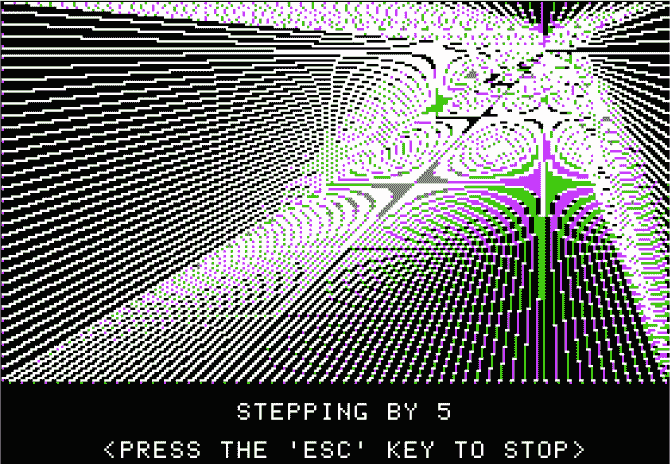

*图 7-1：“Brian’s Theme”由 Apple II 计算机呈现*

图 7-1 是 1979 年由 Brian Howard 创建的简单 BASIC 程序《Brian’s Theme》；它可以在 1983 年的 Apple II DOS 3.3 系统主盘中找到。该程序从一个随机点开始，接着从该点画出一条条线到达屏幕边缘，每次都按随机选定的值进行步进。Apple II 显示器的 280×160 像素的粗糙分辨率，以及绘制时点的颜色处理方式，产生了莫尔条纹。

让我们来创造自己的莫尔条纹。我们需要的代码在*moire.py*文件中。它向我们介绍了 Python 的 turtle 图形模块（`turtle`），这是 Python 标准库的一部分。

**注意**

*“turtle graphics”一词来自于 Logo 编程语言，它使用图形化的“海龟”在屏幕上拖动笔触，帮助儿童学习编程概念。*

简单的命令，如`FD 10`（前进 10），`RT 90`（右转 90 度）和`PD`（笔触）使得使用相对较少的编程知识就能创建复杂的图形；可以想象一个老式的螺旋画游戏，只不过是在计算机上实现。

我们希望海龟从一个随机选取的靠近中心的点出发，画出直线到达边缘，每次沿边缘走一定的距离。结果类似于 图 7-2。

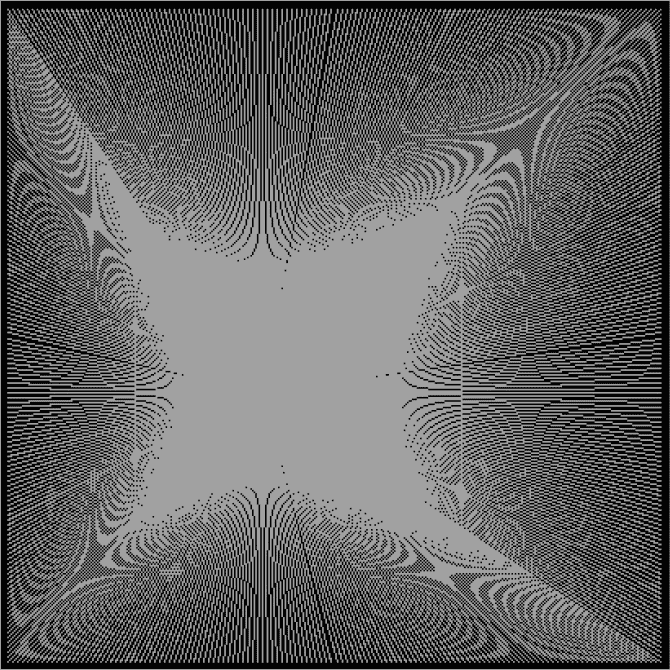

*图 7-2: “Brian’s Theme” 复刻版*

图 7-2 不过是直线一条接一条；这个图案源自莫尔条纹效应。

首先，我们导入必要的模块，并要求海龟配置显示：

```
import time
import turtle as tu
from RE import *

tu.speed(0)
tu.ht()
tu.getscreen().setup(500,500)
tu.getscreen().bgcolor('black')

x = np.linspace(-200,200,400)
y = np.linspace(-200,200,400)
```

我们配置海龟，这里是 `tu`，让它尽可能快地行进，然后隐藏它自己（`ht` 为“隐藏海龟”）。这样，我们只看到它绘制的内容。

绘图窗口调整为 500×500 像素，背景为黑色。*x* 和 *y* 维度使用 NumPy 的 `linspace` 来生成从 -200 到 200 的 400 个点的向量。海龟的屏幕将原点放置在显示窗口的中央。

我们将绘制一个莫尔条纹图案，稍等片刻，然后清空屏幕并绘制另一个——这是最好的交互式视觉艺术。我们需要一个循环：

```
while (True):
    tu.clear()
    X,Y = RE(mode='int', low=-100, high=100).random(2)
    step = RE(mode='int', low=2, high=9).random()
    r,g,b = RE(mode='int', low=1, high=256).random(3)
    color = "#%02x%02x%02x" % (r,g,b)
    tu.color(color)

    for i in range(0,400,step):
        Line(X,Y, x[i],y[0], color)
        Line(X,Y, x[0],y[i], color)
        Line(X,Y, x[i],y[-1], color)
        Line(X,Y, x[-1],y[i], color)

    time.sleep(4)
```

要开始绘图，我们清空屏幕并选择原点（`X`，`Y`）和 `step` 大小。我们使用 HTML 表示法指定颜色为红、绿、蓝；例如，`#FF0000` 是鲜红色，`#E0B0FF` 是淡紫色，`#A0522D` 是铁锈色，等等，按比例混合红、绿、蓝。

一个简单的循环随后使用 `Line` 从中心点绘制到四个屏幕边缘的图案：

```
def Line(x0,y0,x1,y1,color):
    tu.color('white')
    tu.pu()
    tu.goto(x0,y0)
    tu.pd()
    tu.goto(x1,y1)
    tu.color(color)
    tu.goto(x0,y0)
    tu.pu()
```

`Line` 方法首先用白色绘制请求的直线，然后用随机选择的颜色重新描绘它，产生闪烁效果。

考虑到现代计算机的速度，你可能会期望莫尔条纹图案会在屏幕上闪现。然而，Python 的海龟图形与其名字一样，以悠闲的速度绘制图案，本质上匹配了我们模仿的 Apple II 代码的速度。

我们将在本章稍后再次使用海龟图形。现在，是时候去散步了。

#### ***随机游走***

一个 *随机游走* 算法遵循“两步前进，一步后退”的模型，二维空间内：从原点开始，反复朝随机方向迈步。为了将这个简单的算法转化为艺术，我们跟踪步伐的顺序，创造出一个图像，每一步都会从 Matplotlib 的颜色表中选取一个颜色。

颜色表——也称为色彩映射表或查找表——是一个由红、绿、蓝格式的颜色列表构成的表。大多数颜色表，包括 Matplotlib 中的颜色表，都有 256 个条目。例如，如果某个感兴趣的值是 129，或者可以赋值为 129，那么与之关联的颜色将存储在当前使用的颜色表的索引 129 处。

如果期望的索引是 129 且颜色表是 `viridis`，那么得到的 RGB 颜色值是：

```
>>> from matplotlib import cm
>>> cmap = cm.get_cmap("viridis")
>>> cmap(129)
(0.126453, 0.570633, 0.549841, 1.0)
```

这段代码示例演示了如何访问 Matplotlib 的颜色表，但输出可能不像预期的那样。为什么有四个值？它们为什么不像海龟图形的十六进制颜色值那样在[0, 255]的范围内？RGB 颜色值通常映射到[0, 1]，或者作为最大值 1.0 的分数。为了找到对应的字节值，需要乘以 255，并保留整数部分。前述代码中的颜色是十六进制的`#20918C`。

这解释了前三个值，但第四个分量是透明度值，表示颜色的透明度。透明度值为 1.0 时是完全不透明的，0.0 时是完全透明的，而 0.5 时颜色与后面的像素颜色混合（类似堆叠图形平面）。对于我们的目的，我们允许透明背景（当查看代码时，您会发现这意味着什么）。

Matplotlib 提供了 84 种预定义的颜色表，称为*色图*；请参见*color_map_names.txt*获取完整列表。我们的随机漫步代码支持它们的任何组合。

随着随机漫步“反复在随机方向上迈步”，我并没有指定允许的方向集合。从一个点（*x*，*y*）出发，可能的方向有四个或八个，如图 7-3 所示。

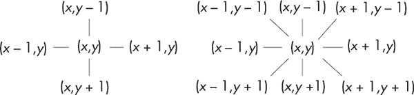

*图 7-3：随机漫步者可以移动的四个（左）或八个（右）方向*

左侧的随机漫步者（称为*4 连接*）仅限于朝着四个方向行走：北、南、东或西。而右侧的漫步者（*8 连接*）则可以选择对角线行走。*walker.py* 中的代码支持这两种选择。

请注意，如何标记从（*x*，*y*）的偏移量。如果你习惯于使用笛卡尔坐标系作图，就像数学课上那样，可能会对符号感到困惑。通常，我们期望在第一象限作图，其中 *x* 和 *y* 都是正值，并分别向右和向上增大；但大多数计算机并不是这样处理的。相反，它们将原点放在屏幕的左上角，因此 *y* 随着向下移动而增大，*x* 随着向右移动而增大。从数学角度来看，我们正在第四象限作图，并忽略了 *y* 轴的符号。

让我们运行*walker.py*，看看它给我们带来什么：

```
> python3 walker.py 4 1000000 Reds,Oranges,Reds,Oranges none portrait tshirt.png mt19937 8675309
```

该命令根据给定的扩展生成输出图像，这里是 PNG 文件；见图 7-4。

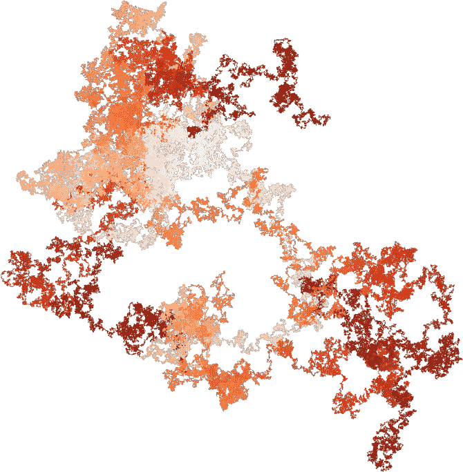

*图 7-4：示例随机漫步输出*

第一个参数告诉代码执行 4 连接的漫步。第二个参数是每个指定颜色表应迈的步数。接下来的就是颜色表，按逗号分隔且不留空格。在这里，我反复使用了 Matplotlib 的 `Reds` 和 `Oranges`。每个颜色表 1,000,000 步，总共有四个颜色表，图 7-4 中的图像表示了 400 万步随机漫步，每一步生成一个像素。

在颜色表之后，我们添加背景色或单词`none`表示透明背景。我们可以使用 HTML 十六进制格式指定颜色，格式中不需要`#`，因此`000000`是黑色背景，`FFFFFF`是白色。

以下参数是输出图像的方向。行走会在某个方向上自然地更为广泛。此参数将输出图像定向为`portrait`（使输出图像的最长维度位于 *y* 方向）或`landscape`（使输出图像使用 *x* 维度）。

最后的两个参数是随机源和源的种子值。两者都是可选的。

**注意**

*我将输出文件命名为* tshirt.png *，因为我使用这个例子制作了一件真正的 T 恤。有许多在线服务允许你上传图片并订购 T 恤。如果你想自己制作，我推荐使用数百万步、透明背景，甚至封装的 PostScript 输出格式（在命令行使用*.eps*文件扩展名）。*

让我们通过*walker.py*来走一遍。我将跳过导入常见模块和解析命令行的部分。代码如下：

```
if (len(sys.argv) == 8):
    kind = sys.argv[7]
    rng = RE(kind=kind, mode="int", low=0, high=mode)
elif (len(sys.argv) == 9):
    kind = sys.argv[7]
    seed = int(sys.argv[8])
    rng = RE(kind=kind, mode="int", low=0, high=mode, seed=seed)
else:
    rng = RE(mode="int", low=0, high=mode)
```

我们首先配置随机源。在这种情况下，如果是 4 连通，我们选择[0, 3]范围内的随机整数；如果是 8 连通，则选择[0, 7]范围内的随机整数。我们将使用这些值作为 *x* 和 *y* 偏移量列表的索引，并将这些偏移量添加到当前位置以迈出一步。代码中的三个案例处理指定随机源、带有种子值的源或默认值。

接下来是行走。主循环跟踪`X`和`Y`列表中的点，以及`C`中的颜色。在这一层，循环遍历指定的颜色表：

```
X = []; Y = []; C = []
for cname in cnames:
    x,y,c = Walk(steps,cname,mode)
    X = X + x
    Y = Y + y
    C = C + c
```

`Walk`函数模拟当前颜色表（`cname`）和`mode`的完整`steps`步行走：

```
def Walk(steps, cname, mode):
    try:
        cmap = cm.get_cmap(cname)
    except:
        cmap = cm.get_cmap("inferno")
    if (mode == 8):
        offset = [[0,-1],[1,-1],[1,0],[1,1],[0,1],[-1,1],[-1,0],[-1,-1]]
    else:
        offset = [[0,-1],[1,0],[0,1],[-1,0]]
    X = [0]
    Y = [0]
    C = [cmap(0)]
    for i in range(steps):
        m = rng.random()
        X.append(X[-1] + offset[m][0])
        Y.append(Y[-1] + offset[m][1])
     ➊ c = cmap(int(256*i/steps))
        C.append((c[0],c[1],c[2]))
    return X,Y,C
```

首先，我们获取颜色表（`cmap`），然后定义`offset`，它是 4 连通和 8 连通行走的 *x* 和 *y* 偏移值列表。行走本身从(0, 0)开始，使用索引为 0 的颜色（`C`）。

对`steps`的循环模拟了步态。我们为 *x* 和 *y* 的最后位置分别添加一个随机选择的偏移量。考虑选择颜色的代码 ➊。循环索引`i`的范围是 0, steps)。除以`steps`会产生一个分数，[0, 1)。乘以 256 则选择颜色表的一个索引。因此，一次完整的随机行走会遍历整个颜色表一次。还有其他实验选项；请参见[第 238 页的“练习”。

目前，没有输出图像，只有一组点（*x*，*y*）及其关联的颜色在`C`中。为了生成图像，我们需要`CreateOutputImage`：

```
def CreateOutputImage(X,Y,C, background):
    x = np.array(X)
    y = np.array(Y)
    xmin = x.min(); xmax = x.max()
    dx = xmax - xmin
    ymin = y.min(); ymax = y.max()
    dy = ymax - ymin
    img = np.zeros((dy,dx,4), dtype="uint8")

    if (background is not None) and (background != "none"):
        try:
            r = int(background[:2],16)
            g = int(background[2:4],16)
            b = int(background[4:],16)
            a = 255
        except:
            r,g,b,a = 0,0,0,0
    else:
        r,g,b,a = 0,0,0,0 img[:,:,0] = r; img[:,:,1] = g
    img[:,:,2] = b; img[:,:,3] = a

    for i in range(len(x)):
        xx = int((dx-1)*(x[i] - xmin) / dx)
        yy = int((dy-1)*(y[i] - ymin) / dy)
        c = C[i]
        img[yy,xx,0] = int(255*c[0])
        img[yy,xx,1] = int(255*c[1])
        img[yy,xx,2] = int(255*c[2])
        img[yy,xx,3] = 255
    return img
```

该函数分为三部分。第一部分生成 *x* 和 *y* 点的 NumPy 向量，并确定每个方向的扩展量（`dx`, `dy`），以指定输出图像 `img`。输出图像使用 4 个通道，而不是我们之前使用的 3 个通道；因为我们要支持透明背景，需要明确指定 alpha 通道。

接下来，我们将整个图像设置为透明背景色。使用 0 作为 alpha 通道的值表示透明背景，使用 255 表示完全不透明的背景。

我们遍历这些点，将每个点映射到图像的一个像素，并明确指定红色、绿色和蓝色的颜色值。查看 `xx` 和 `yy` 的赋值，了解它们如何将原始点映射到有效的图像坐标。

注意 `img` 的索引方式。代码将点 (*x*, *y*) 分配给图像，但图像的索引方式是 `(yy,xx)`。图像是先按行索引，再按列索引，这意味着 *y* 坐标（使用左上角为原点的约定）表示行，*x* 表示列。

我们快完成了。`CreateOutputImage` 函数根据行走的实际点返回图像。为了生成最终输出，我们将图像重新调整方向，以适应竖屏或横屏方向：

```
img = CreateOutputImage(X,Y,C,background)
rows, cols, _ = img.shape
if (orient == "portrait"):
    if (rows < cols):
        img = img.transpose([1,0,2])
else:
    if (rows > cols):
        img = img.transpose([1,0,2])
Image.fromarray(img).save(oname)
```

`transpose` 方法按指定的方式重新排列 NumPy 数组的列。我们根据需要交换行和列，但确保通道数保持不变。阅读 *walker.py* 以跟踪代码的整体流程。

我在章节文件中包含了几个示例输出，以激发你创建自己的作品。我特别喜欢 *example1.png*；它让我想起了 1970 年代《神秘博士》剧集中的科幻场景。*example5.png* 文件使用了当时为 1,130,496 字节的 *hotbits.bin* 文件。循环模式是由于请求的点数超过了从文件中提取的随机样本数，从而导致了重复。*example5.txt* 文件包含命令的文本。如果你创建了任何有趣的示例，请分享它们。我会在本书的 GitHub 页面上创建一个小画廊。

让我们转换思路，结合随机性和确定性，生成通过 *xy* 平面扭曲构建的图像。

#### ***一个网格***

如果你取一个二维的均匀分布的点网格，应用一个将每个点映射到新点的函数，然后绘制这些点，会发生什么？换句话说，当你扭曲一个点网格时，会发生什么？在本节中，我们将揭示答案，并利用这一过程创造随机的抽象数字艺术作品。

图 7-5 说明了这一基本过程。

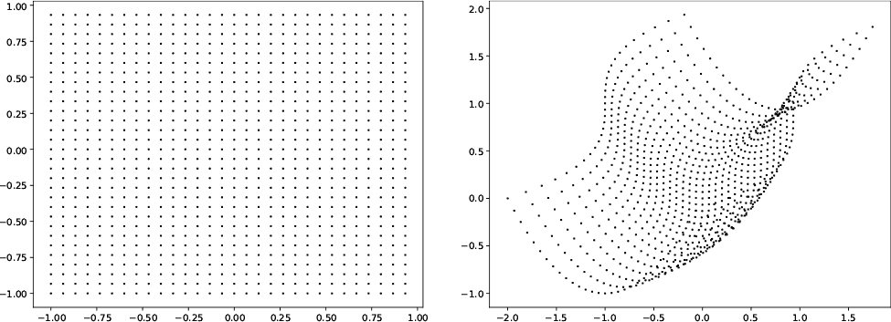

*图 7-5：左侧是点的网格，右侧是经过扭曲后的相同网格*

在 图 7-5 的左侧，我们有一个 30×30 点的网格。我们对每个点 (*x*, *y*) 应用一个函数，生成一个新点 (*x′*, *y′*)，该点绘制在 图 7-5 的右侧。

该函数是：

(*x′*, *y′*) *←* (*y*³ + *x*, *x*² + *y*)

对于输入点 (*x*, *y*)，输出的 *x* 坐标是 *y*³ + *x*，而 *y* 坐标是 *x*² + *y*。

同样，函数 (*x*, *y*) *→* (*yx*², *xy*²) 将均匀的点网格转换为 图 7-6。

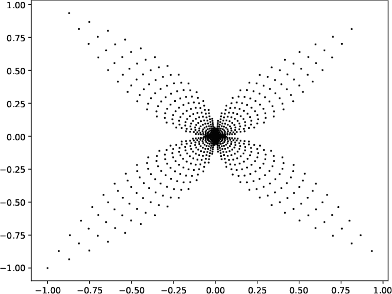

*图 7-6：由 (*x,y*) → (*yx², xy²*) 变形的均匀网格*

我们将生成一组变形函数，随机选择一个，并将其应用于均匀的点网格。然后，我们重复这个过程指定次数，并在此过程中保留所有输出点。

为了添加颜色，我们使每个变形函数返回一个颜色表索引和新的点位置。因此，每个变形函数将输入点映射到一个新的输出点和颜色表索引。每个周期会随机选择一个新的颜色表。

为了增加更多的随机性，我们将通过添加随机选择的 *x* 和 *y* 偏移量来平移点集合。因为我们是冒险型人物，所以我们还将以一个随机角度围绕原点旋转这些点。

我定义了一个包含五个变形函数的集合，其中有两个我们已经见过：

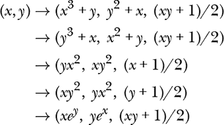

输入网格始终在[–1, 1]范围内。每个函数返回新的点和颜色表索引，这些索引是通过将第三个返回值乘以 255 后取整数部分得到的。随机函数应用、旋转、偏移和颜色表的累积效应产生了期望的输出图像。

代码在 *warp.py* 中。运行方式如下：

```
> python3 warp.py 300 11 example.png minstd 6502
```

以产生 图 7-7。

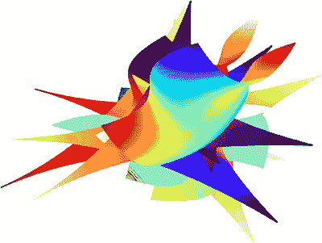

*图 7-7：变形效果*

*warp.py* 的第一个参数是每个网格维度上的点数。第二个是周期数，或者说我们将随机选择的函数应用到网格上的次数。最后三个参数是输出图像的名称、随机性源和种子（如果需要）。

首先是变形函数。例如：

```
def f0(a,b):
    x,y = a**3 + b, b**2 + a
    c = int(255*(a*b+1)/2)
    return x,y,c
```

这实现了集合中的第一个变形函数。其余四个函数类似。我们将变形函数存储在列表中，以便可以随机选择：

```
funcs = [f0,f1,f2,f3,f4]
```

*warp.py* 的主体解析命令行并从 *color_map_names.txt* 加载颜色表名称。然后，它定义了空列表来存储所有的 (*x*, *y*) 点和关联的 RGB 颜色，分别是 `X`、`Y` 和 `C`。

网格被指定为一个从 –1 到 +1 的 `npoints` 长向量：

```
v = -1 + 2*np.arange(npoints)/npoints
```

所有的操作都在对周期和网格点的循环中：

```
for k in range(cycles):
    n = int(len(cnames)*rng.random())
    cmap = cm.get_cmap(cnames[n])
    n = int(len(funcs)*rng.random())
    fn = funcs[n]
    xoff,yoff = rng.random(2)-0.5
    theta = np.pi*rng.random()
    for i in range(len(v)):
        for j in range(len(v)):
            n,m,c = fn(v[i],v[j])
            x = n*np.cos(theta) - m*np.sin(theta)
            y = n*np.sin(theta) + m*np.cos(theta)
            X.append(x+xoff)
            Y.append(y+yoff)
            C.append(cmap(c))
```

外层循环处理 `k` 变量，负责循环操作。每个周期会随机选择一个颜色映射（`cmap`）和一个变形函数（`fn`）。它还会选择随机的 *x* 和 *y* 偏移量（`xoff`，`yoff`）以及旋转角度（`theta`）。

两个内部循环，遍历`i`和`j`，在*x*和*y*方向上走遍`v`，访问 2D 网格中的每一个点。选定的函数应用于每个点，`n,m,c = fn(v[i],v[j])`，返回一个新点(*n*, *m*)和颜色表索引(`c`)。要围绕原点旋转一个点，我们将其乘以旋转矩阵。

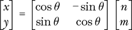

根据矩阵乘法的规则，变为：

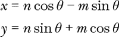

这与之前的代码相匹配。

旋转完成后，最后一步是添加*x*和*y*的偏移量。这些偏移量将点在*x*和*y*方向上移动，以避免它们重叠。

每个扭曲、旋转和偏移后的点都会添加到点和颜色的列表中。请注意，扭曲函数返回的是颜色表索引，但`C`保存的是当前颜色表由`cmap`返回的元组。

所有周期完成后，我们生成图表并将其保存到磁盘。Matplotlib 依照要求执行：

```
plt.scatter(X,Y, marker=',', s=0.6, c=C)
plt.axis('off')
plt.tight_layout(pad=0, h_pad=0, w_pad=0)
plt.savefig(oname, dpi=300)
plt.show()
```

这里，`oname`是输出图像的名称；它来自命令行参数。

与 Matplotlib 的`plot`命令不同，`scatter`接受每个点的颜色列表，这就是为什么我们为每个点构造了`C`。`tight_layout`命令去除多余的空间，这在关闭坐标轴后非常实用。

运行*warp.py*几次来实验代码。如果你将网格设置得过于细致，设置第一个参数超过 300 左右，可能会耗尽内存。虽然并不需要指定伪随机生成器和种子值，但这样做可以让你重新生成输出。文件*warp_factor_9.py*使用一个用户提供的全局种子创建指定数量的扭曲图像。

```
> python3 warp_factor_9.py 3141592 100 warpings
```

在*warpings*目录中创建 100 张图像。运行大约花费了 15 分钟，并生成了一些吸引人的输出。Matplotlib 的循环色彩表，如`flag`，展现了惊艳的效果。

虽然*warp.py*能生成漂亮的图像，但它的随机性并不特别深刻；它从一组选项中选择，依靠可能的选项组合来产生新颖性。

下一节将带领我们了解分形：一个充满数学、涌现行为和随机性的世界。

### **分形的乐趣**

*分形*是由自身的较小副本构成的数学对象；它们是*自相似的*。我们的关注点是数学分形，但近似分形在自然界中很常见——例如，树的分枝、肺部的气道和蕨类植物的叶片。

在本节中，我们将探讨随机性作为生成分形图像的一种手段。关于艺术和计算机图形学的分形有着丰富的文献。我们将做一个最简单的介绍。

首先，我们将玩混沌游戏，用 Python 的海龟画图构建简单的分形图像。然后，我们将了解生成分形图像的更复杂方法——迭代函数系统（IFS）。最后，我们将把所有内容结合起来，构建*ifs.py*。

#### ***混沌游戏***

让我们来玩一下*混沌游戏*，这个名字由数学家和分形探索者迈克尔·巴恩斯利命名。它的运作方式如下：

1.  选取三个点，(*x*[0], *y*[0])、(*x*[1], *y*[1])和(*x*[2], *y*[2])，作为三角形的顶点。

1.  设置*x* = *x*[0]和*y* = *y*[0]。

1.  随机选取三角形的一个顶点，(*x[n]*, *y[n]*)，其中*n*在[0, 2]之间。

1.  使用*x ←* 0.5(*x* + *x[n]*)和*y ←* 0.5(*y* + *y[n]*)进行更新。

1.  绘制(*x*, *y*)。

1.  从第 3 步开始重复。

该算法在*xy*平面上绘制点。让我们看看这些点的集合是否最终覆盖了平面，或者是否存在某种模式。运行*sierpinski.py*：

```
> python3 sierpinski.py
```

应该会弹出一个小窗口。Python 海龟也在其中，似乎随意地跳跃在窗口中。每次它移动时，都会留下一个小点。点的颜色对应于第 3 步中选定的三角形顶点。

让程序运行一段时间，绘制它想要绘制的内容。当你等待海龟完成任务的时间足够长后，按下一个键并检查结果图像。它应该看起来与图 7-8 相似。

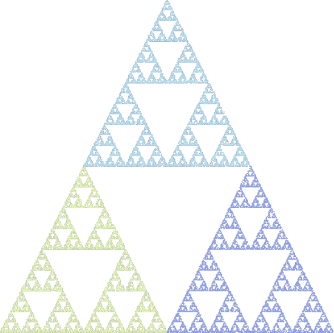

*图 7-8：混沌游戏的实际操作*

这幅图是一个分形，被称为谢尔宾斯基三角形，得名于波兰数学家瓦茨瓦夫·谢尔宾斯基，他在 1915 年研究了这种形状。

分形是由自身的副本构建而成的。例如，主三角形是由三个较小的三角形构建的，每个较小的三角形又是由三个更小的三角形构建的，依此类推，永无止境。因此，游戏并没有填满*xy*平面，而只是填充了平面上的一个子集。这样的事物被称为“分形”，因为它们的维度是非整数的。

这个分形大于一条线（维度 1），但小于一个平面（维度 2）。定义分形维度的方式有多种，但最常见的可能是豪斯多夫维度。对于谢尔宾斯基三角形，豪斯多夫维度为 log 3 / log 2 = 1.5849625……，大于一条线但小于一个平面。

让我们来看一下*sierpinski.py*，如清单 7-1 所示。

```
X = [-200,0,200];  Y = [-200,200,-200]
x = X[0]; y = Y[0]
colors = ['#E7FFAC','#ACE7FF','#97A2FF']
tu.color(colors[0])
rng = RE(mode='int', low=0, high=3)

done = False
def Done():
    global done
    done = True
tu.onkeypress(Done)
tu.listen()

while (not done):
    n = rng.random()
    x = 0.5*(x + X[n])
    y = 0.5*(y + Y[n])
    tu.color(colors[n])
    tu.goto(x,y)
    tu.pd()
    tu.dot(1)
    tu.pu()

tu.ht()
tu.done()
```

*清单 7-1：揭示谢尔宾斯基三角形*

第一段代码配置了海龟、一些颜色和伪随机生成器（`rng`）。它还定义了两个列表来保存三角形的顶点，`X`和`Y`。另一个重要部分是将`x`和`y`赋值为第一个顶点。任何随机的初始值都可以，但可能需要几次游戏迭代才能落到分形内的点上。

第二段仅为方便之用。它定义了一个全局变量`done`，以及一个事件处理程序，当我们按下键时，海龟图形会调用该处理程序。该处理程序的唯一任务是将全局变量`done`设置为`True`，以便`while`循环退出。海龟的`onkeypress`和`listen`方法告诉海龟应该监听绘图窗口中的按键，并在收到按键时执行某些操作。

所有有趣的东西都在第三段——`while`循环，它会一直运行直到按下一个键。它随机选择一个顶点`n`，并在更新`x`和`y`后，在该点上放置一个正确颜色的点。这个过程会重复，点一个接一个地放置。

混沌游戏使用三角形的顶点和随机性来揭示分形的*吸引子*，或者说是构成分形的点集。

混沌游戏同样适用于*n*边形（*n* > 2），正如*polygon.py*中的代码所示。我在这里不会详细讲解；它是一个改进版的*sierpinski.py*，可以接受命令行中的*n*，然后可选地接受一个随机源和一个种子值。图 7-9 展示了*n* = 5 和 *n* = 9 的结果。

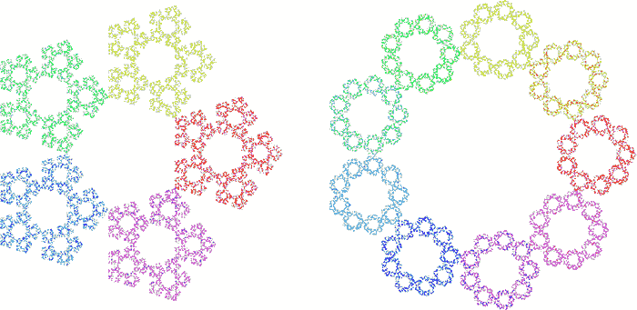

*图 7-9：带有五边形（左）和九边形（右）的混沌游戏*

阅读*polygon.py*以理解它的功能。

#### ***迭代函数系统***

本节介绍了*迭代函数系统（IFS）*，即将平面中的点映射到其他位置的方程系统。在接下来的章节中，我们将 IFS 与混沌游戏结合，生成分形图像，IFS 的吸引子。请注意，接下来会涉及到与向量和矩阵相关的数学。如果这些概念对你来说比较陌生，不用担心。我们可以在不完全掌握过程细节的情况下，利用 IFS 制作出令人惊叹的图像。不过，如果有可能的话，深入理解会更好。

要构建一个 IFS，我们需要理解几个概念。首先，矩阵将*xy*平面中的向量映射到*xy*平面中的新向量。其次，*xy*平面中的向量是指一个点（*x*，*y*）的另一种方式。第三，什么是收缩映射。最后，一组带有偏移向量和相关概率的收缩映射构成了一个 IFS，使我们能够使用混沌游戏创建分形图像。让我们开始吧。

之前，我们使用矩阵将一组点按某个角度*θ*围绕原点旋转：

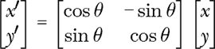

我们将其写作***x**′* = ***Mx***，其中粗体小写字母是向量，粗体大写字母是矩阵。

更具体地说，乘以一个二维向量

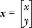

通过矩阵

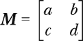

将向量映射到一个新的二维向量，***x**′*：

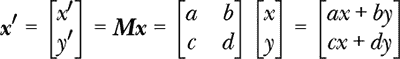

这也展示了如何通过矩阵乘以二维向量：将矩阵行的每个元素与向量的相应元素相乘并求和。我们说矩阵***M***是从***x***到***x**′*的*映射*。

在第三章中，我们学习了两点之间的欧几里得距离。考虑两个向量，***x***[0]和***x***[1]，以及它们在矩阵***M***下的映射：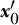 和 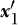。如果*d*(***x***[0]，***x***[1])是***x***[0]和***x***[1]之间的欧几里得距离，我们有

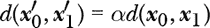

对于 0 < *α* < 1，***M***是一个*压缩映射*，将点聚集在一起。我们将使用压缩映射来表示我们的 IFS，每个映射由一个矩阵表示。

一个映射还可以包括一个常数偏移向量，它加到应用矩阵后得到的向量上。我们可以将其写成

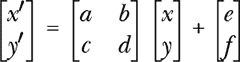

其中，向量相加是逐元素进行的，像 NumPy 那样。然而，更方便的做法是将 2×2 矩阵替换为一个 3×3 矩阵，并加入偏移向量：

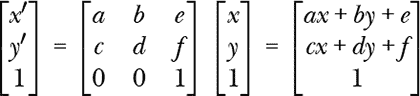

一组压缩映射矩阵，{***M***[0]，***M***[1]，***M***[2]，...}，形成一个 IFS，其中每个***M***是一个 3×3 矩阵，将映射与偏移向量结合。IFS 有*吸引子*，即一组点，后续的映射将这些点映射到吸引子中的其他点。通过这种方式，使用 IFS 中的一个矩阵对吸引子上的点进行映射会得到吸引子上的另一个点。形成吸引子的点就是我们想要成像的分形，混沌游戏是我们用来找到它们的工具。

#### ***通过点绘制的分形***

我们几乎已经到了需要的地方。我们有了一个 IFS，即一组矩阵，***M***。我们还知道，混沌游戏帮助我们找到 IFS 的吸引子上的点。为了将混沌游戏应用于一组矩阵，我们给每个映射分配一个概率。然后，在玩混沌游戏时，我们根据该概率选择下一个要应用的映射。分配的概率改变了吸引子点的加权。

让我们开始实践。我们将使用的代码在*ifs.py*文件中。通读这个文件以了解整体内容。文件的大部分内容是`IFS`类。运行*ifs.py*并不带任何参数会教会我们如何配置命令行：

```
> python3 ifs.py

ifs <points> <output> <fractal> <color> [<kind> | <kind> <seed>]

  <points>   - number of points to calculate
  <output>   - output image
  <fractal>  - name from the list below or 'random'
  <color>    - <hex> (no '#')|maps
  <kind>     - randomness source
  <seed>     - seed value

circle dragon fern koch shell sierpinski tree thistle 
maple spiral mandel tree2 tree3 fern2 dragon2
```

输出底部的文字被分配给不同的 IFS，意味着不同的映射和概率集合。我们通过命令行中的名称指定我们想要的 IFS。映射在`IFS`类中嵌入的字典中是硬编码的。例如，下面是`sierpinski` IFS 的定义：

```
"sierpinski": {
    "nmaps":3,
    "probs":[0.3333,0.3333,0.3333],
    "maps":[
           [[.5, 0, 0], [0, .5, 0], [0,0,1]],
           [[.5, 0, .5], [0, .5, 0], [0,0,1]],
           [[.5, 0, .25], [0, .5, .5], [0,0,1]]]},
```

该 IFS 由三个映射组成，或者说由三个 3×3 矩阵组成：

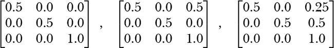

每个映射的选择概率为 1/3，且在玩混沌游戏时，每个映射被选中的概率相等。

其他 IFS 定义方式类似，尽管根据需要可以有更多或更少的映射。`maple` IFS 及其后续的 IFS 由 Paul Bourke 提供（* [`paulbourke.net/fractals/ifs`](https://paulbourke.net/fractals/ifs)*），并已获得许可。Bourke 的网站是一个宝库，里面有许多有趣的计算机图形和几何学页面，包括许多关于分形和 IFS 的内容。我强烈推荐去看看。

剩下的命令行参数如上所述，有两个选项值得特别提及。第一个是使用`maps`来指定颜色。指定`maps`的效果与*sierpinski.py*相同；点被绘制成与选定的 IFS 映射相关的颜色。这个选项可以在输出图像中显示映射。第二个是使用`random`来生成 IFS，它会随机生成一个 IFS，然后迭代找到它所代表的分形。我们稍后会试验这个选项。现在，让我们使用`fern` IFS 来看看得到什么样的输出。尝试这个命令行：

```
> python3 ifs.py 1_000_000 fern.png fern maps
```

它使用四种不同颜色绘制蕨类 IFS 的 100 万个吸引子点。结果如图 7-10 所示。


*图 7-10：蕨类吸引子的 100 万个点*

第四个映射是蕨类植物的狭窄茎部。探索*ifs.py*支持的其他分形，或者浏览*misc*目录，其中包含每种分形使用 100 万个点的图像。

*ifs.py*代码使用 Matplotlib 来生成输出图。Matplotlib 的图形是互动式的。试着生成`shell` IFS 的 1000 万个点，然后点击放大镜图标，在中心周围画一个框来进行放大。用 1000 万个点，你应该能够放大两到三次。螺旋会永远继续下去。

IFS 分形与自然界中的物体相似，这不可能仅仅是巧合；自相似的模式必定有生物学基础，即使它们不是严格的，而只是近似的数学分形。

虽然查看*ifs.py*生成的漂亮分形图像很有趣，但理解它们背后的“原理”更加有趣。让我们分析一下代码，然后尝试纯粹随机的 IFS 分形。

##### **IFS 类**

预定义映射的字典构成了`IFS`类的主体。就实际代码而言，有一些方法值得思考：`ChooseMap`、`GeneratePoints`、`StoreFractal`和`RandomMaps`。我会把`RandomMaps`留到下一节讨论；`StoreFractal`是 Matplotlib 的一个直接应用，用来使用相关的颜色绘制生成的点。这就剩下了`GeneratePoints`和`ChooseMap`。我们从`GeneratePoints`开始，如清单 7-2 所示。

```
def GeneratePoints(self):
    self.xy = np.zeros((self.npoints,3))
    xy = np.array([self.rng.random(), self.rng.random(), 1.0])

    for i in range(100):
        m = self.maps[self.ChooseMap(),:,:]
        xy = m @ xy

    for i in range(self.npoints):
        k = self.ChooseMap()
        m = self.maps[k,:,:]
        xy = m @ xy
        self.xy[i,:] = [xy[0],xy[1],k]
```

*清单 7-2：寻找分形吸引子上的点*

`GeneratePoints` 方法填充一个包含 `npoints` 行和三列的 NumPy 数组：*x*、*y* 和选定地图的索引。代码迭代一个随机初始化的向量 `xy`。第三个元素，一个常量 1，允许我们使用 3×3 矩阵作为地图。

随机选择的点不太可能位于吸引子上；因此，在我们将点存储到 `self.xy` 之前，我们迭代 100 次，确保新点位于吸引子上。每次迭代都涉及根据分配的概率选择一个地图，然后进行与该地图的矩阵乘法，***x** → **Mx***，在代码中变为 `xy = m @ xy`。NumPy 使用 `@` 进行矩阵乘法。

虽然 `GeneratePoints` 方法承担了大部分工作，但它依赖于 `ChooseMap` (列表 7-3)。

```
def ChooseMap(self):
    r = self.rng.random()
    a = 0.0
    k = 0
    for i in range(self.nmaps):
        if (r > a):
            k = i else:
            return k
        a += self.probs[i]
    return k
```

*列表 7-3：选择一个地图*

`IFS` 构造函数根据选择的 IFS 创建成员变量 `nmaps`、`probs` 和 `maps`。`ChooseMap` 方法通过在 0, 1) 范围内选择一个随机数 (`r`)，然后逐步累加每个地图的概率，直到累积和 (`a`) 超过所选值，最终返回当前的索引 `k`。这种方法按比例选择地图，与它们分配的概率成正比。

使用 `IFS` 类非常简单：

```
app = IFS(npoints, name, ctype, rng, show=True)
app.GeneratePoints()
app.StoreFractal(outfile)
```

构造函数接受点数、分形名称、颜色、初始化的 `RE` 对象和一个标志，用于在调用 `StoreFractal` 时显示或隐藏分形。`GeneratePoints` 和 `StoreFractal` 方法完成整个过程。将 `IFS` 封装到一个类中，并使用一个简洁的主驱动程序，让我们能够将 *ifs.py* 作为程序或模块使用；在下一节中，我们将作为模块使用它。

##### **随机 IFS**

使用 `random` 作为分形名称运行 *ifs.py* 会生成一组具有随机概率的随机地图。每个地图是一个 3×3 矩阵

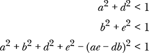

`RandomMaps` 方法创建一个包含地图和概率的集合，如 列表 7-4 所示。

```
def RandomMaps(self):
    def mapping():
        while (True):
            a,b,c,d,e,f = -1 + 2*self.rng.random(6) if (a*a+d*d) >= 1:
                continue
            if (b*b+e*e) >= 1:
                continue
            if a*a+b*b+d*d+e*e - (a*e-d*b)**2 >= 1:
                continue
            break
        return [[a,b,c],[d,e,f],[0,0,1]]

    nmaps = 2 + int(4*self.rng.random()) # [2,5]
    probs = self.rng.random(nmaps)
    probs = probs / probs.sum()

    maps = []
    for k in range(nmaps):
        maps.append(mapping())

    return nmaps, probs, np.array(maps)
```

*列表 7-4：创建一个随机 IFS*

代码首先选择一个随机数目的地图，[2, 5]，和概率 (`probs`)。然后，它循环 `nmaps` 次，调用嵌套函数 `mapping`，该函数返回一个有效的地图矩阵。`mapping` 方法会不断选择 –1, 1) 范围内的随机元素，直到所有约束条件得到满足。

让我们创建 100 个随机分形，感受一下随机生成的 IFS 吸引子的样子。文件 *ifs_maps.py* 包含我们需要的代码。它使用命令行传入的主种子值来生成一组随机分形。以下是我使用的命令行：

```
> python3 ifs_maps.py 100 fractals 271828 >ifs_maps_271828.txt
```

如果你使用相同的命令行，你将得到在 *fractals* 目录中的相同分形集合。文件 *ifs_maps_271828.txt* 包含随机生成的映射和种子值。*ifs_maps.py* 中的代码只有几十行，但它展示了如何在另一个程序中使用 `IFS` 类。

[图 7-11 展示了通过之前的命令行生成的分形。（这些在彩色版中效果更好。）

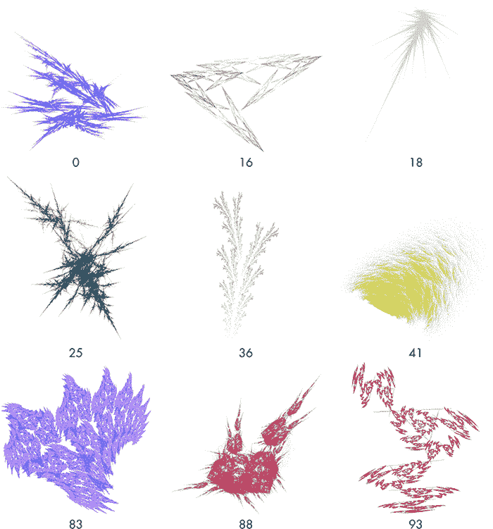

*图 7-11：随机生成的 IFS 分形*

即使没有颜色，我们也能看到随机 IFS 所能产生的效果。数字标识了分形。所使用的映射位于 *ifs_maps_271828.txt* 文件中。

#### ***IFS 映射***

现在我们理解了通过矩阵和概率集合表示的函数系统迭代过程，我们将生成自己的 IFS 映射。本节是可选的，因为涉及了一些线性代数。

请参见 图 7-12。

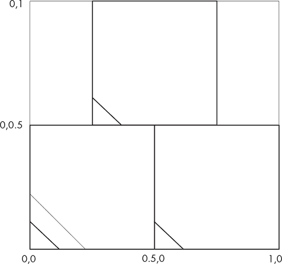

*图 7-12：Sierpiński 三角形的三个收缩映射*

这展示了构成 Sierpiński 三角形的三个映射的效果。这些映射将单位正方形（最外层的正方形）映射到三个更小的正方形之一。对角线显示了方向，以澄清翻转或旋转。在这里，映射缩小了单位正方形并使其偏离原点，但并没有翻转或旋转。吸引子的递归自相似外观来自于在每个更小的正方形中重复此映射，并在这些小正方形中继续重复，以此类推，永无止境。

让我们将 图 7-12 中的插图转换为三个 3×3 矩阵，或者说映射。我们将追踪单位正方形中的三个点 (0, 0)、(1, 0) 和 (0, 1) 在每个映射中最终的位置。

我们将从顶部的映射开始，它将单位正方形映射到 *x* 范围 [0.25, 0.75] 和 *y* 范围 [0.5, 1]。该映射将单位正方形中的任何点映射到这个更小的正方形中的适当位置。点 (1, 0) 必须映射到 (0.75, 0.5)；同样地，(0, 0) *→* (0.25, 0.5) 和 (1, 0) *→* (0.25, 1)。我们如何找到执行此操作的矩阵 ***M***？

从数学上讲，我们需要让***M***像这样作用

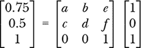

对于适当选择的 *a*、*b*、*c*、*d*、*e* 和 *f*，相同的矩阵还必须将 (0, 0) 和 (0, 1) 分别映射到 (0.25, 0.5) 和 (0.25, 1)。

执行矩阵乘法给我们两个方程，将 (1, 0) 映射到 (0.75, 0.5)：


第三个方程仅包含常数，因此我们将忽略它。

我们还有两个需要考虑的点，它们使用相同的矩阵，因此我们有四个额外的方程：

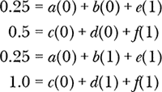

让我们找到 *a*、*b* 和 *e*。这个过程会重复进行，以找到 *c*、*d* 和 *f*。如果我们将涉及 *a*、*b* 和 *e* 的方程组合起来，我们得到：

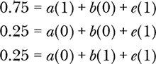

这给我们三个方程和三个未知数，因此我们可以找到一个唯一解。首先，让我们将方程以矩阵形式重新写出：

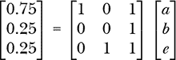

这是一个矩阵方程，形式为 ***b*** = ***Ax***，我们需要找到 ***x***。一种方法是使用 *克莱姆法则*，它通过计算行列式的比值，逐个元素地求解方程。特别地，我们可以通过以下方式找到 ***x*** 的每个元素：

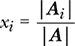

对于 |***A***| 是矩阵的行列式，|***A**[i]*| 是通过将 ***A*** 的第 *i* 列替换为 ***b*** 形成的矩阵的行列式。因此，我们得到 *a*，*b* 和 *e* 如下：

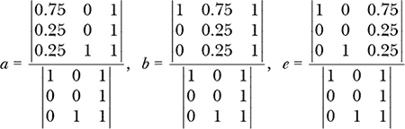

通过行列式的计算，或许可以使用 NumPy 的 `np.linalg.det` 函数，告诉我们 *a* = 0.5，*b* = 0.0 和 *e* = 0.25。对于 *c*，*d* 和 *f* 的相应方程分别给出 0.0，0.5 和 0.5。

现在我们得到了所需的映射矩阵：

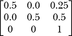

这确实是 *ifs.py* 中的 `sierpinski` 矩阵之一。

我们可以将这个过程推广，编写即刻的解决方案以获得期望的地图。假设单位正方形上有三点，(*a*[0], *a*[1])，(*b*[0], *b*[1]) 和 (*c*[0], *c*[1])。如果它们在映射后的期望位置分别是 (*A*[0], *A*[1])，(*B*[0], *B*[1]) 和 (*C*[0], *C*[1])，那么我们可以通过计算找到地图：

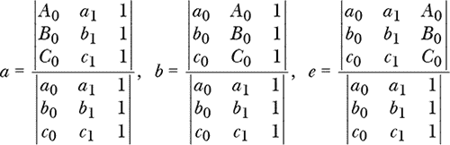

以及：

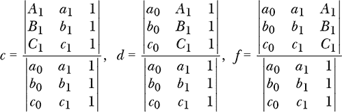

这个过程会生成地图，但并没有提及在玩混沌游戏时选择地图的相关概率。直觉和实验有助于为概率分配提供帮助。

有很多与 IFS 相关的程序，其中许多程序让你可以交互式地设计 IFS 映射，因此你不必手动计算地图。例如，Larry Riddle 的 IFS Construction Kit 是一个 Windows 程序，用于创建和动画化 IFS 分形，其中包括一个图形设计工具（*[`larryriddle.agnesscott.org/ifskit`](https://larryriddle.agnesscott.org/ifskit)*）。我能够在 Linux 上使用 `wine` 运行该程序，下载 Riddle 在安装页面上提到的缺失 *.ocx* 和 *.dll* 文件。

### **练习**

创作生成艺术是无止境的。以下是与本章实验相关的一些练习：

+   *moire.py* 中的代码从单个点画到边缘。尝试从角落画；然后，尝试多个不同步长的点。

+   修改 *walker.py*，使其选择一个随机的颜色表索引，或者使用步数对 256 取模，循环遍历颜色表。

+   为什么要将 *walker.py* 限制为单一的行走者？

+   *warp.py* 中可用函数的列表相当简洁。添加新的函数，假设 *x* 和 *y* 的输入值在 [–1, 1] 范围内，并返回新的 *x* 和 *y* 值以及一个颜色表索引 [0, 255]。

+   如果你改变 *ifs.py* 中每个地图的概率，会发生什么？

+   使用文本中描述的手动过程为 *ifs.py* 创建新的 IFS 地图。它们会生成预期的结果吗？

+   使用 IFS 构建工具包或类似程序创建新的 IFS 地图，并将其添加到 *ifs.py* 库中。

### **总结**

本章向我们介绍了生成艺术中的随机性，虽然我们只触及了表面。我们探讨了通过莫尔条纹效应、随机漫步者以及随机选择的形变函数和颜色表生成的图像。

接下来是分形的内容。我们了解到 IFS 有吸引子，或者说是自相似的分形。通过使用随机映射序列，混沌游戏会落在吸引子上，从而为我们提供了一种生成无限多分形图像的方法。随机选择的映射集合会生成迷人且令人着迷的分形图像集合。自然界结构的形成似乎与 IFS 的吸引子之间有着深刻的联系。

本章聚焦于视觉上令人愉悦的内容。在下一章，我们将深入探讨听觉上令人愉悦的内容。
