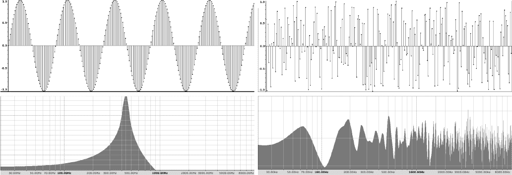
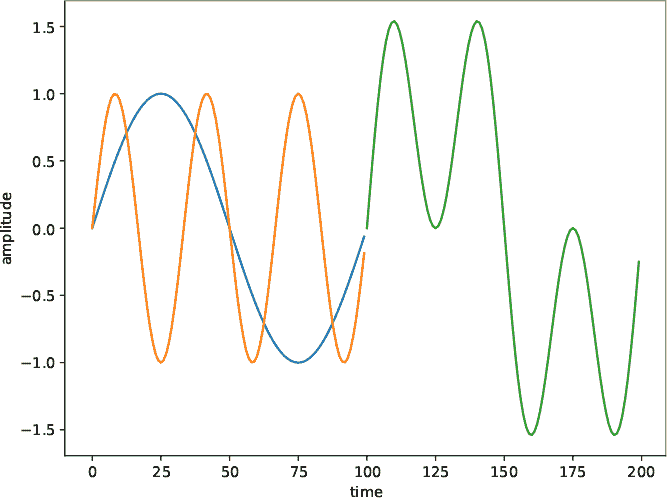
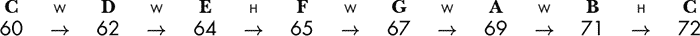
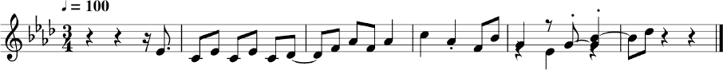
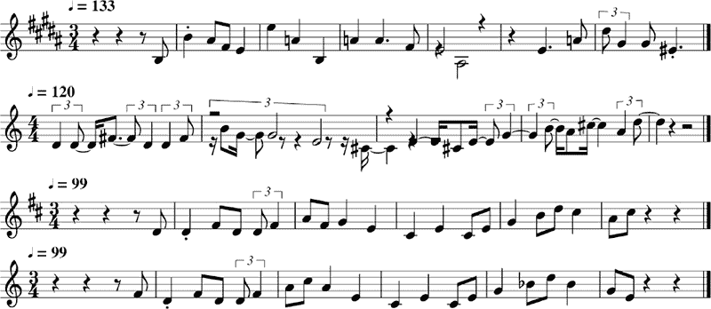

## 音乐**


在本章中，我们将继续探索声音和音乐中的随机性。我们将开始通过随机样本、频率空间中的随机漫步以及在音乐音阶上的上下随机漫步来生成声音。这些项目将为本章最具雄心的实验做准备：从零开始演化出悦耳的旋律。虽然我们无法真正量化这样的旋律，但这并不会阻止我们尝试。

### **创建随机声音**

初看起来，生成随机声音似乎很简单。例如，如果我们有某种方法来创建声音文件，比如 WAV（*.wav* 文件扩展名），那么我们应该只需要以指定的播放速率获取随机声音样本——对吧？让我们实现这个，它将引导我们使用本节所需的音频工具。

WAV 文件可以通过 SciPy 的 `wavfile` 模块轻松读取和写入。要写入 WAV 文件，我们需要两样东西：指定的采样率以及样本本身，它们必须在一些范围内，这些程序如 `mplayer` 或 Audacity 可以理解。

我们以每秒样本数来衡量采样率，即样本播放的速度。采样率越高，音频质量越好。22,050 Hz（每秒周期数）的采样率对于我们的目的来说足够了。这是 CD 的一半采样率。

这些样本是量化的电压，表示一个连续范围被划分为指定数量的离散步骤，每个离散值指定一个特定的模拟电压水平。离散样本对应于输出的音频波形。样本通常是 16 位有符号整数，但我们将使用范围在 [–1, 1] 之间的 32 位浮动点样本。大多数音频程序处理浮动点样本时不会遇到困难。

为了制造随机声音，我们需要生成随机样本，设置 WAV 输出，并将样本写入磁盘以供播放。让我们尝试一下，看看会发生什么。我们想要的代码在 *random_sounds.py* 文件中。

我们先运行一下：

```
> python3 random_sounds.py 3 tmp.wav
```

播放三秒的输出文件 *tmp.wav*。我建议你先调低音量。你听到了你预期的声音吗？可以考虑查看清单 8-1。

```
from scipy.io.wavfile import write as wavwrite

def WriteOutputWav(samples, name):
    s = (samples - samples.min()) / (samples.max() - samples.min())
    s = (-1.0 + 2.0*s).astype("float32")
    wavwrite(name, rate, s)

rate = 22050
duration = float(sys.argv[1])
oname = sys.argv[2]

nsamples = int(duration * rate)
samples = -1.0 + 2.0*np.random.random(nsamples)

WriteOutputWav(samples, oname)
```

*清单 8-1：生成随机样本*

我省略了关于命令行格式的常见信息，专注于相关的代码。

首先，我们从 SciPy 导入 `wavwrite`。我将 `write` 重命名为 `wavwrite`，以澄清这个函数的作用。暂时忽略 `WriteOutputWav` 函数。

文件的主要部分固定了采样 `rate`，并从命令行读取秒数的持续时间，以及输出的 WAV 文件名（`oname`），然后计算 `nsamples`。

如果样本以给定的 `rate` 播放，并且我们想要一个总的 `duration`（秒数），那么乘积（四舍五入为整数）将为我们提供必须生成的样本数。`samples` 是在 [–1, 1) 范围内使用 NumPy 的伪随机生成器随机选择的。在这里使用 `RE` 没有意义。

剩下的就是使用 `WriteOutputWav` 来创建输出的 WAV 文件。我们将在本节的所有实验中使用这个函数。第一行将样本缩放到 [0, 1] 的范围，这样我们可以在生成样本时更加灵活。第二行将范围从 [0, 1] 转换到 [–1, 1]，这是浮点样本的有效范围。最后一行使用 `wavwrite` 将 WAV 文件写出。

*random_sounds.py* 的输出之所以让人感到刺耳，是因为人类对声音的感知方式。我们喜欢那些由一组漂亮的正弦波叠加而成的声音；换句话说，就是有基频和谐波的音调。一个随机的、无关的样本集合只能通过叠加大量正弦波来表示。

图 8-1 显示了左侧的 440 Hz 正弦波和右侧的随机噪声。



*图 8-1：左上：一个正弦波；右上：随机噪声；左下：正弦波的频率谱；右下：随机噪声*

图 8-1 的顶部显示了实际的声音样本随时间的变化。底部显示了频谱，即信号中各个正弦波的强度，因此 *x* 轴不再是时间，而是频率。

正弦波从根本上来说是一个频率为 440 Hz 的单一波形。其他频率的能量很可能是由于对纯正弦波的不完美近似所导致的。垂直刻度是对数标度，这意味着在 440 Hz 之外几乎没有能量。然而，随机噪声的频谱在整个频率范围内（直到 8,000 Hz）大致均匀，反映了必须叠加的正弦波的数量，以近似随机信号。*x* 轴同样是对数刻度。

以下两个部分探讨了生成随机声音的其他方法，均利用了随机游走的思想——不是在空间中，而是在频率上。我们将通过正弦波的叠加来产生声音。第一部分不关注频率的混合，而第二部分使用了 C 大调音阶中的音符频率。

#### ***正弦波***

如果我们将两个不同频率的正弦波相加，它们会合并成一个新的波形。两个正弦波都为正时，它们会相互加强，结果波形会更为积极。当一个为正，另一个为负时，它们会相互抵消。例如，考虑 图 8-2。



*图 8-2：两个正弦波（左）及其和（右）*

左侧是两个频率比为 3:1 的正弦波，右侧是左边两个正弦波的叠加。叠加足够多的波形，任何所需的输出波形都是可能的。

*sine_walker.py* 中的代码创建了一组随机游走者，每个游走者生成 0.5 秒的正弦波，然后改变频率以用于下一个 0.5 秒的时间段。对于每个 0.5 秒的时间块，最终的波形是所有游走者的波形之和。我们来运行代码并逐步解析：

```
> python3 sine_walker.py 5 3 walk.wav
```

这应该会生成一个 5 秒的输出文件，包含三个独立的正弦波随机游走。听一听 *walk.wav*；它让我想起了 1950 年代科幻电影中的音效。

*sine_walker.py* 文件解析命令行参数，然后配置我们需要的随机游走值：

```
nsamples = int(duration * rate)
samples = np.zeros(nsamples, dtype="float32")
dur = 0.5
step_samp = int(dur * rate)
fstep = 5
freq = np.zeros(nwalkers, dtype="uint32")
freq[:] = (440 + 800*(rng.random(nwalkers)-0.5)).astype("uint32")
```

首先，我们使用 `nsamples` 定义 `samples`，它保存所有输出。接下来的两行定义了 `dur`，即步长的持续时间，和 `step_samp`，即每个步长中的样本数量。每个正弦波对应一个特定的频率，生成这些样本数。接下来，`fstep` 设置步长频率，`freq` 是一个初始频率的向量，范围为 40, 840) 赫兹。双重定义处理了只有一个游走者的情况。

然后我们循环直到生成所有样本。每个步长为 0.5 秒，每个游走者使用其当前频率和随机选择的振幅生成一个正弦波，包含 `step_samp` 个样本。我们将所有游走者的波形加和，并将合成后的波形分配到下一个 0.5 秒的样本中；参见 [列表 8-2。

```
   k = 0
➊ while (k < nsamples):
    ➋ for i in range(nwalkers):
           r = rng.random()
           if (r < 0.33333):
               freq[i] += fstep
           elif (r < 0.66666):
               freq[i] -= fstep
           freq[i] = min(max(100,freq[i]),4000)
        ➌ amp = rng.random()
           if (i == 0):
               t = amp*np.sin(2*np.pi*np.arange(rate*dur)*freq[i]/rate)
           else:
               t += amp*np.sin(2*np.pi*np.arange(rate*dur)*freq[i]/rate)
       n = 1
    ➍ while (np.abs(t[-n]) > 1e-4):
           n += 1
       t = t[:-n]
       if ((k+len(t)) < nsamples):
        ➎ samples[k:(k+len(t))] = t
       k += len(t)

   lo = np.quantile(samples, 0.1)
   hi = np.quantile(samples, 0.9)
   samples[np.where(samples <= lo)] = lo
   samples[np.where(samples >= hi)] = hi
   WriteOutputWav(samples, oname)
```

*列表 8-2：生成正弦波游走*

`while` 循环遍历所有输出样本 ➊。接下来的 `for` 循环 ➋ 遍历当前步长的所有游走者。随机值决定是否增加、减少或保持每个游走者的频率不变。然后使用 `min` 和 `max` 快速检查，确保频率在 [100, 4000] 范围内。

正弦波可以写作 *y* = *A* sin *ωx*，其中 *A* 为振幅，*ω* 为频率（ω）。我们随机选择一个振幅 ➌，并用它创建步长的样本，这些样本会被加到现有的样本 `t` 中，从而将所有游走者的结果加总在当前步长内。

每个步长的波形从零振幅开始，因为正弦函数从零开始。因此，我们希望前一步的结束位置也在零振幅处。第二个 `while` 循环 ➍ 尝试从步长波形的末尾扫描，找到一个接近零的样本。

最后，我们将步长的样本放入输出 `samples` 向量 ➎，如果它们适合的话。当 `samples` 满了时，进行剪辑，以保持样本位于第 10 百分位和第 90 百分位之间，然后通过 `WriteOutputWav` 写入磁盘。

使用一个游走者生成一个 15 秒或更长的样本。你能听到这个游走吗？可能有助于暂时将 `amp=1` 设置为使每个步长的音量相同。你也可以用智能手机上的应用程序实时显示频率谱。

如果你增加更多的游走者会发生什么？使用像 Audacity 这样的程序查看 50 个游走者的波形。它应该开始呈现出噪音的特征，结构较少。

用任意组合的正弦波发出奇怪的声音很有趣，但让我们看看是否能采用更具音乐性的方式。

#### ***C 大调音阶***

正弦步进器的频率按固定的 5 Hz 间隔逐步变化。*note_walker.py*中的代码与*sine_walker.py*中的几乎相同，但不同之处在于，正弦波的频率不是按常数赫兹变化，而是依照 C 大调音阶中的音符频率逐步变化：

```
frequencies = np.array([
146.83 ,  164.81 ,  174.61 ,  196\.   ,
220\.   ,  246.94 ,  261.63 ,  293.66 ,  329.63 ,  349.23 ,
392\.   ,  440\.   ,  493.88 ,  523.25 ,  587.33 ,  659.26 ,
698.46 ,  783.99 ,  880\.   ,  987.77 , 1046.5  ])
```

在这个列表中，中央 C 的频率是 261.63 Hz，中央 C 之上的 A 音是 440 Hz。*note_walker.py*文件使用的命令行与*sine_walker.py*相同。仔细阅读代码并尝试一下。结果和*sine_walker.py*一样吗？输出的声音让你想起了什么乐器？

**注意**

*各种频率的电子振荡器与其他电路组合，以调制最终波形，是早期模拟音乐合成器的核心。我们可以通过软件模拟模拟合成器；参考* [`github.com/yuma-m/synthesizer`](https://github.com/yuma-m/synthesizer)。*它基于 Python，并且页面提供了安装依赖的完整说明。GitHub 页面上的示例使用正弦波作为基本波形，就像我们在这里使用的一样。*

让我们从随机变化的正弦波跃升到从头开始演化旋律。

### **生成旋律**

我们将使用群体搜索来生成旋律，目标是从零开始创作出一首“悦耳”的旋律。

首先，我们将设置好我们的环境。接着，我们将学习如何使用程序*melody_maker.py*来生成旋律。最后，我们将逐步讲解代码的关键部分。目标函数比我们之前处理过的要复杂得多。

#### ***群体搜索***

在本节中，我们将使用 MIDI 文件，而不是直接生成 WAV 文件。*MIDI（数字音乐仪器接口）*是数字音乐的标准格式。它可能有些复杂，但我们的使用方式简单至极：只有一条旋律线。因此，对于我们来说，MIDI 变成了一个 NumPy 向量，由一对数字组成，第一个是音符编号（60 是中央 C），接着是时值，其中各时值的比例表示全音符、半音符、四分音符、八分音符，等等。

我们演变出的旋律最终以 MIDI 文件的形式表示。因此，我们需要一些额外的软件，超出常规工具包的范畴，来播放 MIDI 文件、在代码中处理 MIDI 文件，并将 MIDI 文件转化为乐谱图像。让我们安装 `wildmidi`、`midiutil` 和 `musescore3`。

使用以下命令安装 `wildmidi`：

```
> sudo apt-get install wildmidi
```

`wildmidi` 插件可以从命令行播放 MIDI 文件 (*.mid*)。对于 macOS 和 Windows，请查看官方网站 *[`github.com/Mindwerks/wildmidi/releases`](https://github.com/Mindwerks/wildmidi/releases)*。

我们需要 `midiutil` 来在 Python 中处理 MIDI 文件：

```
> sudo pip3 install midiutil
```

`midiutil` 库用于读取和写入 MIDI 文件，尽管我们只会写入文件。

最后，为了生成我们演变出的旋律的乐谱，我们需要 `musescore3`：

```
> sudo apt-get install musescore3
```

macOS 和 Windows 的版本可以从主站下载 (*[`musescore.org/en/download`](https://musescore.org/en/download)*)。如果找不到 `musescore3`，请安装最新版本（`musescore4`），并相应地更新 *melody_maker.py*。

一旦所有东西都安装好，我们就可以开始了。如果你没有安装 `musescore3`，代码仍然可以运行，但你将无法看到最终的视觉效果。

#### ***melody_maker.py 代码***

我们需要用来生成旋律的代码在 *melody_maker.py* 文件中：

```
> python3 melody_maker.py

melody_maker <length> <outfile> <npart> <max_iter> <alg> <mode> [<kind> | <kind> <seed>]

  <length>   - number of notes in the melody
  <outdir>   - output directory
  <npart>    - swarm size
  <max_iter> - maximum number of iterations
  <alg>      - algorithm: PSO,DE,RO,GWO,JAYA,GA,BARE
  <mode>     - mode
  <kind>     - randomness source
  <seed>     - random seed
```

许多命令行参数都很熟悉或不言而喻，比如旋律中的音符数量。`mode` 参数表示我们想要使用的音乐模式或音阶。传统上，有七种模式，所有这些都支持，包括蓝调和五声音阶（摇滚）。其他模式使用它们的古典希腊名字，或者使用 `major` 或 `minor` 来表示标准的大调和小调。模式的名称在 表 8-1 中列出，附有一系列音程和通常与该模式相关的词汇。表 8-1 中的音程表示音阶中音符之间的步伐，其中 `H` 代表半音（半音程），`W` 代表全音（全音程）。

**表 8-1：** 模式、音程和特征

| **模式** | **音程** | **特征** |
| --- | --- | --- |
| Ionian (major) | `W W H W W W H` | 明亮、积极、强烈、简单 |
| Aeolian (minor) | `W H W W H W W` | 悲伤 |
| Dorian | `W H W W W H W` | 轻盈、凉爽、爵士感 |
| Lydian | `W W W H W W H` | 明亮、通透、尖锐 |
| Mixolydian | `W W H W W H W` | 凯尔特风格 |
| Phrygian | `H W W W H W W` | 阴郁、压抑 |
| Locrian | `H W W H W W W` | 更加阴暗，“邪恶” |

例如，如果候选旋律的第一个音符是中音 C（MIDI 音符 60），并且所需的模式是 `major`，那么音阶的音符是：



目标函数会部分通过旋律与目标音阶的匹配度来打分。

如果你不熟悉音乐、音阶或任何音乐理论，别担心。我们需要知道的是，音阶或音符之间的间隔不同，这些间隔在演奏时会影响旋律的音色。例如，大调音阶（Ionian 模式）中的旋律听起来明亮，而小调音阶（Aeolian 模式）中的旋律通常听起来悲伤。这些规则并非硬性规定——只是一些指导原则。我们会在不同的模式下生成许多旋律。

让我们运行 *melody_maker.py*：

```
> python3 melody_maker.py 20 tmp 20 10000 bare mixolydian

Melody maker:

npart = 20
niter = 10000
alg = BARE
Optimization time = 114.775 seconds
63,0.90 60,0.60 63,0.60 60,0.60 63,0.60 60,0.60 61,1.20 
65,0.60 68,0.60 65,0.60 68,1.20 72,1.20 68,0.60 65,1.20 
70,0.60 67,1.20 63,1.20 67,0.60 70,1.20 73,0.60 

31 best updates, final objective value 1.6637
```

我没有指定种子，因此你的运行结果会完全不同。输出会告诉我们搜索的过程，然后输出一串长长的整数和浮动数字。这就是进化后的旋律，已写入输出的 MIDI 文件中，该文件位于 *tmp* 目录下，此外还有其他文件，包括一个 NumPy 向量、一个 Python pickle 文件和乐谱（`score.png`）。旋律是成对的，所以第一个音符是 (63,0.9)，即中音 C 上方的附点八分音符 E-flat。

输出的 MIDI 文件也在 *tmp* 文件夹中。可以用 `wildmidi` 播放它。

```
> wildmidi tmp/melody_BARE.mid
```

其中`BARE`会被我们选择的任何群体算法替代。我选择了`mixolydian`作为调式，因此，理论上，这个旋律应该听起来有些“凯尔特风格”。真的像吗？我其实并不知道。

演化后的旋律在*score.png*中；请参见图 8-3。



*图 8-3：演化后的旋律*

我略过了返回旋律的目标函数值。我们将在稍后查看代码时更详细地探讨这一点。不过，就像我们所有的优化实验一样，越小越好。

尝试实验不同的旋律、调式、算法、群体大小和不同长度的迭代次数。更多的迭代通常会带来更好的性能，这应该意味着更好听的旋律，或者至少是更符合期望调式的旋律。

你可能希望运行*melody_examples*中的示例。该文件作为一个 shell 脚本运行。

```
> sh melody_examples
```

并在*example_melodies*内生成从*ex0*到*ex8*的目录，使用不同的群体算法和调式。我固定了种子，因此你会听到我听到的旋律，这也暗示了可能的结果范围。

以下部分实验了*melody_maker.py*。第一个部分查询旋律在进化过程中是如何变化的，第二部分则专注于算法，以了解它们偏好的旋律类型，最后一部分构建了一个包含四种调式的旋律库。

##### **旋律的演化**

让我们使用基础的 PSO 算法来演化一个大调旋律。这个实验的目的是在旋律进化的过程中聆听它。旋律应该从不稳定且远离目标调式的状态，逐渐发展为一个初学者钢琴学生可能演奏的曲调（或者是我被告知的那样）。

文件*evolve.py*运行*melody_maker.py*，使用 20 个粒子和基础 PSO 算法演化一个包含 20 个音符的大调旋律。生成器和种子是固定的；不同的只是迭代次数，从 1 次到 50,000 次不等，正如图 8-4 所示。

固定的种子意味着 10 次迭代找到的最佳旋律通过了 1 次迭代找到的最佳旋律。每次更高的迭代次数告诉我们，如果早期的迭代继续进行，会在哪个位置结束。换句话说，允许相同的初始配置进行不同次数的迭代。



*图 8-4：逐步演化的旋律。从上到下：1 次、1,000 次、10,000 次和 50,000 次迭代。*

目录*evolve_results*包含每种迭代次数（1、10、100、1,000、5,000、10,000 和 50,000）的 MIDI 文件和乐谱图像。我推荐使用`wildmidi`来播放这些文件。在 1 次迭代和 50,000 次迭代后的旋律相比，如何？图 8-4 展示了不同迭代次数下的选择旋律乐谱。虽然早期的旋律杂乱无章，但在 10,000 次迭代和 50,000 次迭代后的旋律变化不大——除了调性之外几乎没有变化。

目标函数值我们尚未理解，但它随着迭代次数的增加而减少。当然，这就是它所能做到的，但它的下降速度在 1000 次迭代后开始趋于平缓。10,000 次迭代和 50,000 次迭代之间分数的微小变化意味着我们可能不想让搜索运行得太长时间，因为这样有可能在过程中错过一些潜在的令人兴奋的旋律。

当旋律进化时，究竟发生了什么？群体算法会在合适的 MIDI 音符号码和时值范围内随机初始化。选定的音乐模式有效地改变了群体在搜索过程中使用的目标函数。尽管群体搜索包含随机性，但最强烈影响最终结果的是群体的初始配置——至少，我认为是这样。初始群体配置、算法方法和随机性的结合导致收敛到一个或多或少符合目标函数的旋律。

##### **探索算法**

*algorithms.py* 文件会对我们在整本书中使用的 7 个群体算法中的每一个运行 *melody_maker.py* 10 次。每次运行都会生成一个 36 音符的旋律，采用利底亚模式，使用 20 个粒子和 10,000 次迭代。你可以运行这个文件，生成输出到 *algorithms* 目录中。或者，由于种子值是固定的，你也可以听七个 MP3 文件，这些文件将按算法顺序连接输出。

尽管这些算法的任务是相同的——学习一个利底亚模式的旋律——但希望最终的旋律能够揭示出各个算法之间的区别。让我们看看使用哪种群体算法是否重要，以及是否有些算法生成的结果比其他算法“更好”。

我听了所有的 MP3 文件（使用`wildmidi`的`-o`选项和`lame`生成的）并根据我认为它们的音质对旋律进行了排名。以下是我从最好到最差的排名，包括我无法选择一个算法而导致的并列：

1.  简化版 PSO

1.  遗传算法，PSO

1.  差分进化，Jaya

1.  GWO

1.  随机优化

你的排名可能不同，但我猜你会同意，在这种情况下简化版 PSO 表现最佳，而随机优化最差。GWO 和随机优化都生成匆忙的输出；旋律播放得更快，因此生成的 MP3 文件比其他算法短大约 30 秒。

在深入探讨代码之前，我们将进行另一个实验，使用“最佳”算法——简化版 PSO，来创建一个不同模式的歌曲库。

##### **构建旋律库**

文件*songs.py*与*algorithms.py*相似，但使用简化版的 PSO 算法反复生成 36 个音符的旋律，涵盖四种调式：大调、小调、多利安调式和蓝调。在这种情况下，群体中有 32 个粒子，共进行 30,000 次迭代。代码运行需要一些时间，因此我为输出创建了 MP3 文件：*major.mp3*、*minor.mp3*、*dorian.mp3*和*blues.mp3*。在聆听时，请牢记表 8-1 中的描述。如果你认同这些描述，意味着目标函数至少在某种程度上捕捉到了这些调式的特点，即使它可能没有捕捉到完美的旋律特征。

#### ***实现***

现在是时候探索*melody_maker.py*了。从高层次看，它与其他所有的群体优化实验没有什么不同：我们解析命令行，初始化群体框架对象，然后调用`Optimize`来执行搜索。最终结果会被转换成 MIDI 文件对象并写入磁盘。

让我们理解一下群体的结构——粒子位置与旋律之间的映射关系——然后再深入了解目标函数类，因为它是整个过程的核心。

如果我们想要在旋律中有*n*个音符，每个粒子就变成一个 2*n*元素的向量，包含*n*对数据，（MIDI 音符号，时长）。MIDI 音符号是有限制的（参见`MusicBounds`），范围为[57, 81]，其中 57 表示休止符。再次强调，钢琴上的中音 C 是音符 60，每次增减一个单位对应半音的变化。时长是整数，当我们创建 MIDI 文件时，会将其乘以 0.3 来控制节奏。音符之间的比例是重要的，因此时长为 4 的音符是时长为 2 的音符的两倍，依此类推。因此，粒子就是我们正在考虑的旋律，搜索的目标是根据随机生成的旋律集合和选定算法的细节，找到由目标函数决定的最佳旋律。

一切都依赖于`MusicObjective`类。它相当复杂，有超过 150 行代码。我会从最后开始，首先讲解`Evaluate`方法，然后再逐步补充其他部分——标准的自上而下设计。回顾一下，群体使用得分来判断旋律的质量，得分越低越好。下面是代码：

```
def Evaluate(self, p):
    self.fcount += 1
    s = self.Distance(p[::2], self.mode)
    d = self.Durations(p)
    i = self.Intervals(p[::2], self.mode)
    l = self.Leaps(p[::2], self.mode)
    return 4*s+3*d+2*i+l
```

得分是输出的多部分函数，涉及`Distance`、`Durations`、`Intervals`和`Leaps`方法。各部分的值被求和，但并不等权重，`Distance`方法的输出是`Leaps`方法输出的四倍重要。最终得分的每个部分都在[0, 1]范围内，越低越好。

`Distance`方法测量当前旋律（粒子）中的音符和给定音阶中预期旋律音符之间的汉明距离。`ModeNotes`方法返回两个二进制向量，其中 1 表示对应音符在音阶中。第一个向量是当前旋律，第二个包括该音阶中的音符，假设旋律的第一个音符是根音。换句话说，`ModeNotes`返回两个以 0 和 1 表示的二进制数字作为向量。两个二进制数之间的汉明距离是不同的位数。例如，10110111 和 10100101 之间的汉明距离为 2，因为有两个对应的位不同。`Distance`方法通过音符的数量对汉明距离进行缩放，返回一个[0, 1]区间的值；它被认为是目标函数中最重要的部分，因为一个好的指定音阶旋律应该主要由该音阶中的音符组成。

`Durations`方法是一个临时度量，使用旋律中不同音符持续时间的计数与偏好四分音符和二分音符的预期混合之间的根平方误差距离。目的是最小化附点音符。

`Intervals`方法是另一个临时度量，它考察旋律中一个音符与下一个音符之间的间距。我们人类通常偏好大三度、小三度和纯五度，这意味着从音符*i*到音符*i* + 1 的间隔应该是 3、4 或 7 个半音。

最后，`Leaps`尝试最小化跳跃，即音符之间超过 5 个半音的间隔。它与`Intervals`测量的内容存在竞争关系，但`Leaps`的权重是`Intervals`的一半。

现在我们对目标函数的作用有了高层次的理解，让我们看一下对应的代码及其核心部分。

##### **距离**

`Distance`方法使用旋律音符与符合期望音阶的旋律音符之间的汉明距离。以下是代码：

```
def Distance(self, notes, mode):
    A,B = self.ModeNotes(notes, mode)
    lo = int(notes.min() - self.lo)
    hi = int(notes.max() - self.lo)
    a = A[lo:(hi+2)]
    b = B[lo:(hi+2)]
    score = (np.logical_xor(a,b)*1).sum()
    score /= len(a)
    return score
```

`ModeNotes`方法（未显示）返回两个列表，其中每个元素如果对应的音符在旋律中（`A`）或属于给定音阶的旋律（`B`），则值为 1。`a`和`b`中的版本覆盖了给定旋律的范围。

`score`变量保存`a`和`b`之间的汉明距离。汉明距离是指不匹配的位数。通过旋律的长度进行缩放，将计数转化为旋律的一个分数值[0, 1]，并返回该值。

##### **持续时间**

`Durations`方法计算一个评分，反映音符持续时间的分布与临时预定义的“最佳”混合（偏好四分音符和二分音符）之间的匹配程度。以下是代码：

```
def Durations(self, p):
    d = p[1::2].astype("int32")
    dp = np.bincount(d, minlength=8)
    b = dp / dp.sum()
    a = np.array([0,0,100,0,60,0,20,0])
    a = a / a.sum()
    return np.sqrt(((a-b)**2).sum())
```

首先，我们将`d`设置为当前旋律的持续时间，以便`bincount`可以创建相应的分布`b`，并将其缩放为概率。所期望的音符持续时间混合存储在`a`中，并同样缩放为概率。

返回两个分布之间平方距离的总和作为持续时间评分。

##### **音程**

两个音符之间的音程是用半音来衡量的。`音程`方法计算旋律中大三度（4 个半音）、小三度（3 个半音）和五度（7 个半音）的数量，并将这些数字转化为分数。在代码中，这变成了：

```
def Intervals(self, notes, mode):
    _,B = self.ModeNotes(notes, mode)
    minor = major = fifth = 0
    for i in range(len(notes)-1):
        x = int(notes[i]-self.lo)
        y = int(notes[i+1]-self.lo)
        if (B[x] == 1) and (B[y] == 1):
            if (abs(x-y) == 3):
                minor += 1
            if (abs(x-y) == 4):
                major += 1
            if (abs(x-y) == 7):
                fifth += 1
    w = (3*minor + 3*major + fifth) / 7
    return 1.0 - w/len(notes)
```

代码检查旋律中的每一对音符。我们使用半音的差异来计算三度和五度的数量。然后，我们将 `w` 赋值为这些计数的加权平均数，其中，按照规定，我偏爱三度而非五度，比例为 3:1。

`w` 的值越高，旋律越符合期望的音程排列；因此，从 1 中减去缩放后的 `w` 分数以进行最小化。

##### **跳跃**

目标函数评分的最后一部分是 `跳跃`：

```
def Leaps(self, notes, mode):
    _,B = self.ModeNotes(notes, mode)
    leaps = 0
    for i in range(len(notes)-1):
        x = int(notes[i]-self.lo)
        y = int(notes[i+1]-self.lo)
        if (B[x] == 1) and (B[y] == 1):
            if (abs(x-y) > 5):
                leaps += 1
    return leaps / len(notes)
```

跳跃是指两个音符之间的音程差超过 5 个半音，无论是向上还是向下。较小的音程意味着旋律更加平滑。我们返回旋律中包含跳跃的部分。

为什么在目标函数中使用这些组件而不是其他组件？没有特别的理由，仅仅是因为在对什么构成好旋律的思考中提到了其中一些。音乐是主观的，不可能创建一个完全客观的目标函数。 第 254 页上的“练习”要求你思考其他可能适合 `MusicObjective` 的术语。

**生成式 AI**

第七章和第八章中关于生成艺术和音乐的讨论没有提到人工智能，因此这些内容是不完整的。然而，将人工智能引入其中会使这些章节变成一本书。因此，我会引导你去了解基于 AI 的生成艺术和音乐实例。大多数这些实例使用*生成对抗网络*、*深度风格迁移*、*变分自编码器*或相关技术，这些技术依赖于深度神经网络来从某个学习的表示空间中采样，或将嵌入表示中的特征融合起来，从多个输入构建新的输出。

如果你想探索人工智能在这一领域的应用，* [`aiartists.org`](https://aiartists.org)* 是一个很好的起点，并且提供了通向艺术家和工具的链接，这些工具可以用来创作基于 AI 的艺术和音乐。Al Biles 的 GenJam 提供了一种有趣的、先进的进化算法和音乐方法，网址是 *[`genjam.org`](https://genjam.org)*。我推荐观看视频示例，特别是 TEDx 演讲，它展示并解释了这个系统。我们已经目睹了强大的基于 AI 的文本、图像和视频生成系统的爆发，包括 Stable Diffusion、DALL-E 2 和 ChatGPT。新系统和更新每周都会出现，但这些应该足以让你入门：

**DALL-E 2**   *[`openai.com/dall-e-2`](https://openai.com/dall-e-2)*

**Stable Diffusion**   *[`beta.dreamstudio.ai/`](https://beta.dreamstudio.ai/)*

**ChatGPT**   *[`openai.com/blog/chatgpt`](https://openai.com/blog/chatgpt)*

### **练习**

像生成艺术一样，生成音乐也没有尽头。以下是与本章实验相关的一些练习。

+   修改*sine_walker.py*中的裁剪范围。这会如何影响整体声音？在 Audacity 中，波形是什么样子的？

+   你可以通过更改频率表来改变*note_walker.py*中的调性。例如，要从 C 大调改为 D 小调，可以将 B 音符降低：246.94 → 233.08，493.88 → 466.16，987.77 → 932.33。

+   `addProgramChange`函数的最后一个参数在*melody_maker*的`StoreMelody`函数中指定了 MIDI 乐器编号。默认值是 0，表示声学钢琴。可以通过修改*MIDI_instruments.txt*列表来更改此数字。例如，试试 30 代表失真电吉他，13 代表木琴。几乎无法听到气息的双簧管是 68。或者，尝试 114，钢鼓，放手一搏。

+   修改*melody_maker*的目标函数加权，在`Evaluate`方法中进行。若所有组件的加权相同，效果如何？如果反转加权会发生什么？

+   你能在*melody_maker*的目标函数中添加其他术语吗？

### **总结**

本章向我们介绍了生成音乐中的随机性，从音频和随机行走的正弦波开始，产生了其他 worldly 的音效。将频率限制在音乐音阶内，使这些奇怪的声音转变成类似管风琴的音响。

本章的结尾我们通过群体智能和进化算法从零开始演化旋律。我们在一定程度上取得了成功，演化出的旋律大多数符合预期的音乐调式。在这个过程中，我们还看到如何通过代码创建简单的 MIDI 文件。

在下一章，我们将转换话题，探索随机性在一个完全不同领域中的应用：从少量测量数据中恢复信号。
