## 第九章：**音频信号**


本章我们将继续探讨连续信号与离散信号之间的关系。*奈奎斯特-香农采样定理*描述了连续信号和离散信号之间的关系。为了正确地离散化一个连续信号，我们必须以至少是信号中最高频率两倍的采样率进行采样。正是这个定理使得光盘的音频信号采样率为 44.1 kHz，也就是每秒 44,100 次采样。在这个采样率下，任何最高频率为 22,050 Hz 的信号都会被捕捉到。需要注意的是，22 kHz 是人耳能够听到的最高频率的理论上限，尽管大多数成人的上限要低得多；我自己的上限大约是 13.5 kHz。

本章将探讨*压缩感知*（或称为压缩感知技术），这是一种在奈奎斯特和香农的框架下进行逆袭的技术。通过压缩感知，我们可以在对信号进行数字化时采集比奈奎斯特-香农定理所要求的更少的数据。这是一个令人兴奋的现实世界反问题，涉及到随机性。

我们将从压缩感知的主要观点开始讲解；我们会涉及一些数学内容，但我鼓励你自行探索其余部分。接下来，我们将探讨一维的压缩感知，特别是音频信号，看看它如何让我们突破奈奎斯特极限。最后，由于解压后的图像对压缩感知而言与时间信号没有什么区别，我们将应用压缩感知技术，从看似过少的数据中重构图像。

第一部分包含一些矩阵-向量的数学运算，但它不超过我们在第七章遇到的迭代函数系统的内容。

### **压缩感知**

数字化信号通常意味着在一个指定且恒定的时间间隔内读取模拟到数字转换器的输出。每秒的读取次数就是采样率，这是奈奎斯特-香农定理所关注的内容。如果我们按照奈奎斯特-香农定理获取样本，我们就能从这些样本中准确重构信号。

当我们以固定时间间隔进行采样时，我们称之为*均匀采样*。然而，有时不希望进行均匀采样，可能是因为成本过高或存在过多的风险（例如，在 X 射线断层扫描中）。在这种情况下，如果能采集较少的数据但仍能重构整个信号，那就很有帮助。例如，如果我们想要的信号表示为***x***，我们将测量信号的某个子集***y***，然后从***y***重构***x***。从数学角度看，我们可以将这个过程表示为一个矩阵方程

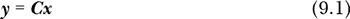

在这里，我们知道向量***y***因为我们已经测量过它，而矩阵***C***因为它决定了我们采样的***x***的部分。我们要找的是***x***，即按照标准采样理论我们应该测量的向量。暂时记住方程 9.1。

让我们回到代数课，通常要求我们解方程组，通常是两个方程和两个未知数：

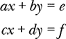

在这里，*a* 到 *f* 是常数。因为有两个方程和两个未知数，我们可以找到满足这两个方程的 *x* 和 *y* 值，前提是其中一个方程不是另一个方程的倍数。以矩阵形式，我们将方程组写成：

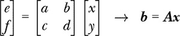

矩阵-向量乘法的规则告诉我们，要将矩阵 ***A*** 的每一行与向量 ***x*** 对应的元素相乘，然后求和。这将矩阵方程转化为方程组。无论向量中有多少个元素，这个规则都适用。

这个方程组能够工作的原因是未知数的数量与方程的数量相等，意味着向量中的元素数量，这里是 ***b*** 和 ***x***，与矩阵 ***A*** 的行数相匹配。对于这样的方程，解（如果存在的话），即使方程成立的 ***x*** 向量，是 ***A***^(–1)***b*** = ***x***，其中 ***A***^(–1) 是 ***A*** 的逆矩阵。例如，这个系统

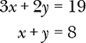

变为

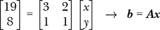

解为

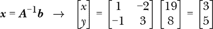

其中，矩阵 ***A*** 的逆矩阵是 ***A***^(–1)，使得 ***AA***^(–1) = ***A***^(–1)***A*** = ***I***。

在这里，***I*** 是 *单位矩阵*——所有元素为零、对角线上的元素为一的矩阵。在矩阵的世界里，***I*** 类似于数字 1。使用 NumPy 的 `linalg.inv` 函数来求解 ***A***^(–1)。

***A*** 是一个 *方阵*，意味着它的行数和列数相等。如果 ***A*** 是方阵，并且行数与 ***b*** 和 ***x*** 中的元素数量匹配，那么我们可以使用 ***A***^(–1) 来求解 ***x***。

现在是有趣的部分。回到 方程 9.1。根据设计，***y***（我们测量的值）的元素比 ***x***（完整信号）的元素要 *少*。如果 ***y*** 中有 *N* 个元素，***x*** 中有 *M* 个元素，那么 ***C*** 是一个 *N*×*M* 的矩阵，具有 *N* 行和 *M* 列。方程 方程 9.1 中的未知数比方程的数量要多。这样的系统称为 *欠定*。欠定系统有无限多个解；有无限多个向量 ***x***，当它们与 ***C*** 相乘时，得到 ***y***。

我们想通过测量 ***y*** 来得到 ***x***，但是仅凭 ***y*** 本身没有足够的信息来告诉我们 *哪个* 无限集合中的 ***x*** 向量是我们需要的。压缩感知可以提供帮助——至少在某些情况下。

根据压缩感知理论，如果***x***是*稀疏的*，也就是说其大部分元素基本为零，那么我们可以通过解决*逆问题*从***y***恢复出***x***，这个逆问题寻找一个***x***，使得***Ax*** - ***b***之间的差异最小，同时强烈鼓励***x***保持稀疏性。正如我们将看到的，存在能够执行这种优化的算法。

太好了！我们开始进入正题。我们测量包含某些元素子集的***y***，这些元素本应出现在***x***中，我们通过解决一个最小化问题从***y***得到***x***。但事情并没有那么简单；这个优化技巧只有在***x***是稀疏时才有效。大多数信号并不是稀疏的；例如，音频信号通常不是。回想一下在第八章中处理波形的情况。我们就此注定失败了吗？不一定。

虽然音频信号并不稀疏，但存在类似傅里叶变换的方式，可以将时间变化的信号映射到频率变化的信号，通常情况下，频域信号*是*稀疏的。因此，如果我们可以将***x***写成***x*** = **Ψ*****s***的形式，其中**Ψ**是某个变换矩阵（psi），而***s***是稀疏向量，那么公式 9.1 就变成了：

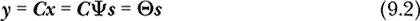

其中**Θ** = ***C*****Ψ**。

尽管***x***不是稀疏的，因此无法恢复，但***s***是稀疏的，这意味着优化技巧或许有可能奏效。通过将***y***中的测量结果与外部知识结合起来，得知***s***是稀疏的，我们就能找到***s***。一旦得到***s***，就可以恢复出***x***。

那么，所有这些浮动的矩阵是做什么的呢？*测量矩阵* ***C*** 在数学上可以是任何满足某种*不相干性*的矩阵，这种不相干性是指***C***中的元素与**Ψ**中的元素之间的关系。对于我们来说，***C***的元素是二值的，即零或一，作用是选择实际测量的***x***中特定的元素。这一要求提供了***C***和**Ψ**之间所需的数学不相干性。最重要的一点是，***C***在某种程度上是*随机的*。在实际操作中，我们并不会显式定义***C***，但我们的测量过程隐含地使用了它。随机性是整个操作的关键所在。

**Ψ**矩阵是一个变换矩阵，它将稀疏向量***s***转化为我们最终想要测量的新表示***x***。对于我们来说，**Ψ**是一个类似傅里叶变换的*离散余弦变换（DCT）*。信号在这个领域通常是稀疏的，因此在压缩感知中非常有用。

最后，**Θ**表示测量过程作用于**Ψ**的组合。

现在我们有足够的信息来尝试求解***y*** = **Θ*****s***，寻找一个既稀疏又能产生我们已有的测量集***y***的***s***。有多种算法可以使用，但我们将采用 scikit-learn 提供的 Lasso 算法。同样，我们还需要 DCT 及其逆变换，SciPy 提供了这些工具：

```
from sklearn.linear_model import Lasso
from scipy.fftpack import dct, idct
```

Lasso 最小化以下内容

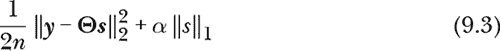

其中*n*是样本数量，或者是***y***中的元素数量。

双竖线符号表示*范数*，它是一种衡量距离的度量。第一个项使用*ℓ*²范数的平方，而第二个项将*ℓ*¹范数乘以*α*。向量***x***的*ℓ^p*范数定义为：

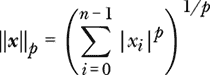

*ℓ*²范数是欧几里得距离。*ℓ*¹范数，有时称为曼哈顿距离或出租车距离，是向量***x***各元素绝对值的总和。Lasso 使用这个项，并将其按*α*缩放，用以找到一个***s***向量，该向量最小化测量值***y***和**Θ*****s***之间的欧几里得距离，同时最小化***s***各元素绝对值的总和。这个后者约束迫使***s***的许多元素趋向零，从而确保稀疏性。

为了理解为什么 Lasso 目标函数中存在*ℓ*¹范数项，考虑一个简单的情况，其中我们有一个二维向量和一个单元素输出。这类似于找到一个尽可能稀疏的* x* + * y* = *c*的解，其中* x* = 0 或* y* = 0。几何上，最小化*ℓ*¹范数导致的情况如图 9-1 左侧所示，而最小化*ℓ*²范数如右侧所示。最小化*ℓ*²范数是标准的最小二乘回归。

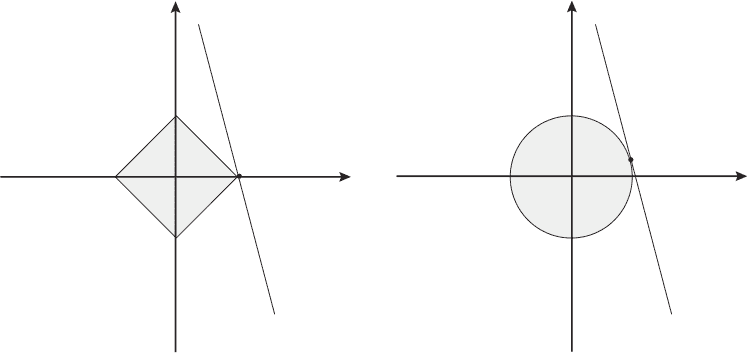

*图 9-1：最小化ℓ¹范数（左）和ℓ²范数（右）*

图 9-1 中的直线表示某个*c*的*ax* + *by* = *c*的无限解集。左侧的菱形和右侧的圆形分别对应常数*ℓ*¹和*ℓ*²范数。最小化*ℓ*¹范数在* y*为零时与直线相交，而最小化*ℓ*²范数在* x*或* y*都不为零的点与直线相交。随着维度的增加，这一趋势持续下去。在每种情况下，最小化*ℓ*¹范数意味着解的稀疏性，而最小化*ℓ*²范数则将“能量”分布在每个维度上，正好与强制稀疏性相反。

让我们总结一下。我们希望通过测量它的一个子集，***y***，来获取***x***。为了求解随机的测量矩阵***A***，我们希望***y*** = ***Ax***。这个表达式是欠定的，意味着有无数个***x***可以作为解，因此我们需要额外的信息来找到我们（可能）想要的那个解。我们通过将***x***表示为其他形式（基）来获得这个信息，在这种形式下它变得稀疏。如果是稀疏的，那么找到一个有意义且简洁的解的可能性就显现出来。常用的基来自傅里叶变换家族，如离散余弦变换（DCT），***x*** = **Ψ*****s***，其中**Ψ**包含了 DCT，***s***是我们希望找到的稀疏向量。如果我们找到***s***，我们就找到了***x***。

将测量矩阵与离散余弦变换（DCT）结合，得到一个新的方程，***y*** = **Θ*****s***，其中我们已知***y***和**Θ**。方程仍然是欠定的，但我们知道***s***是稀疏的。为了求解***s***，我们使用一种优化算法，该算法能在过程中最小化*s*¹范数。这强制执行稀疏性，并让我们有信心可能找到一个合适的***s***。

让我们试试这个方法，看看会发生什么。

### **信号生成**

我们将逐步讲解*cs_signal.py*，它演示了压缩感知过程以及为什么我们需要使用随机测量。首先，运行它，然后我将解释它生成的各种图表。命令行如下：

```
> python3 cs_signal.py 0.2 minstd 65536
```

应该会依次显示几个图表；关闭每个图表后，继续查看下一个。输出文件也会被创建。

代码首先生成一个一秒钟的信号，它是由三条正弦波组成的 C 大调和弦。标准的奈奎斯特采样法给出了这个信号，采样率为 4,096 Hz，即***x***。这是一个演示，所以我们从***x***开始，然后丢弃其中的大部分，生成一个***y***，这是我们最初可能测量到的信号。命令行中包括一个`0.2`的参数，表示保留***x***的 20%，即***y***包含 20%的样本；剩余的 80%被丢弃。命令行的其余部分指定了随机性源（`minstd`）和种子值（`65536`）。

信号来自于：

```
rate = 4096
dur = 1.0
f0,f1,f2 = 261.63, 329.63, 392.0
samples  = np.sin(2*np.pi*np.arange(rate*dur)*f0/rate)
samples += np.sin(2*np.pi*np.arange(rate*dur)*f1/rate)
samples += np.sin(2*np.pi*np.arange(rate*dur)*f2/rate)
```

我们在第八章中使用了类似的代码。三个频率（`f0`、`f1`、`f2`）是 C 大调和弦。`samples`向量是最终的信号，***x***。它是一个包含 4,096 个元素的向量，因为采样率是 4,096 Hz，持续时间是 1 秒。

让我们从***x***构建***y***。这个过程隐式地使用了测量矩阵。我们将保留***x***中的 20%样本，首先通过均匀间隔选择样本，然后随机选择。均匀样本对应于以低于奈奎斯特极限的速率测量信号：

```
nsamp = int(frac*len(samples))
u = np.arange(0, len(samples), int(len(samples)/nsamp))
bu = samples[u]
r = np.argsort(rng.random(len(samples)))[:nsamp]
br = samples[r]
```

***y***中有`nsamp`个样本。第一个***y***向量是`bu`，均匀采样，第二个是`br`，随机采样。图 9-2 显示了原始信号及标记的均匀和随机样本（*cs_signal_samples.png*）。

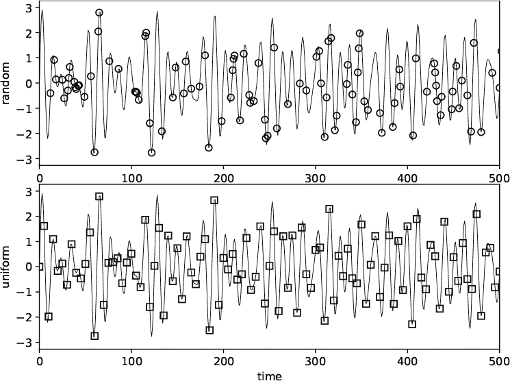

*图 9-2：随机采样（上）与均匀采样（下）*

我们得到了测量值。现在我们需要**Θ**，即**Ψ**和测量矩阵的组合。一旦我们有了它，就可以开始使用 Lasso 了。我们有两个***y***向量，因此我们需要两个**Θ**矩阵：

```
D = dct(np.eye(len(samples)))
U = D[u,:]
R = D[r,:]
```

第一个，`U`，只保留均匀选择的测量值。第二个，`R`，使用随机选择的测量值。在这里，`D`是离散傅里叶变换矩阵，**Ψ**，而`U`和`R`分别是**Θ***[u]*和**Θ***[r]*。

我们进行两次优化，首先是***y**[u]* = **Θ***[u]**s**[u]*，然后是***y**[r]* = **Θ***[r]**s**[r]*，其中下标现在表示均匀采样和随机采样的测量值：

```
lu = Lasso(alpha=0.01, max_iter=6000)
lu.fit(U, bu)
su = lu.coef_
lr = Lasso(alpha=0.01, max_iter=6000)
lr.fit(R, br)
sr = lr.coef_
```

`Lasso` 遵循 scikit-learn 的惯例，创建一个类的实例，然后调用 `fit` 来进行优化。对于 `Lasso`，解向量隐藏在 `coef_` 成员变量中，我们提取它以获得 `su` 和 `sr`，即均匀和随机的 ***s*** 向量。 图 9-3 显示了这两个 ***s*** 向量（*cs_signal_sparse.png*）。

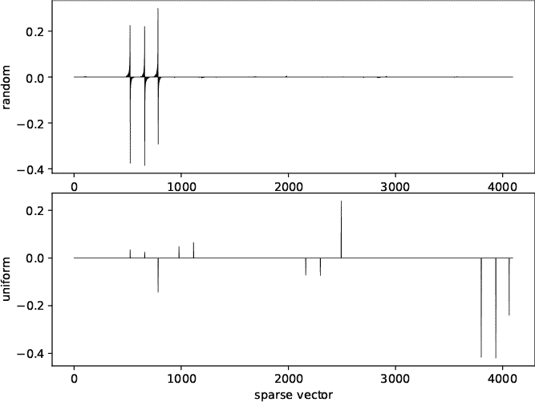

*图 9-3：随机（上）和均匀（下）解向量，* s

最上面的图显示了 ***s**[u]*，底部显示了 ***s**[r]*。这些尖峰对应于 DCT 组件。两个 ***s*** 向量都是稀疏的，大多数 4,096 个元素接近零，但底部的向量有超过 10 个非零元素，而顶部的向量只有 3 个（形状有时既为正也为负）。回想一下，***x*** 是三条正弦波的总和，因此 ***s**[r]* 向量中的三条正弦波和三次尖峰似乎很有前景。

Lasso 已经为我们求解了 ***y*** = **Θ*****s***。现在我们需要 ***x*** = **Ψ*****s***，我们通过调用逆 DCT 来找到它：

```
ru = idct(su.reshape((len(samples),1)), axis=0)
rr = idct(sr.reshape((len(samples),1)), axis=0)
```

图 9-4 显示了 ***x**[u]* (`ru`) 和 ***x**[r]* (`rr`); 参见 *cs_signal_recon.png*。


*图 9-4：从上至下：原始信号、随机采样重建信号、均匀采样重建信号*

最上面的图显示了原始信号。中间的图显示了通过随机选择的测量值，从原始信号的 20% 重建的信号。最后，底部的图显示了通过均匀选择的测量值，同样是原始信号的 20%，重建的信号。你认为哪一种更忠实地捕捉到了原始信号？

最后一步是将信号输出为 WAV 文件：

```
WriteOutputWav(samples, "original.wav")
WriteOutputWav(rr, "recon_random.wav")
WriteOutputWav(ru, "recon_uniform.wav")
```

请参阅 清单 8-1 来回顾 `WriteOutputWav` 是如何工作的。播放输出文件。我想你会同意，随机采样产生了更好的结果。

均匀采样在深层数学原因上失败，原因与测量矩阵和 DCT 变换基之间的相干性有关。然而，我们可以直观地理解均匀采样在低于 Nyquist 率时失败，这意味着会出现 *混叠*，即高频信号看起来像低频信号，且无法将两者区分开来。另一方面，通过随机采样，混叠的可能性降低，使得 Lasso 更可能找到合适的 ***s*** 向量。

重新运行 *cs_signal.py*，但将分数从 20% 改为更小和更大的值。有没有地方出现问题？看看你能否仅通过原始信号的 10%、5% 甚至 1% 来重建信号，然后尝试反方向。即使是稍微超过 50% 的采样，也似乎对均匀采样的质量产生了显著影响。为什么会这样呢？考虑一下 Nyquist-Shannon 采样定理的要求。

### **解开的图像**

文件*cs_image.py*将压缩感知应用于图像。它类似于*cs_signal.py*，但它在选择测量的组件（像素）之前展开图像。图像是***x***，选定的掩膜像素形成***y***。代码期望以下命令行参数：

```
> python3 cs_image.py

cs_image <image> <output> <fraction> <alpha> [ <kind> | <kind> <seed> ]

  <image>    - source image (RGB or grayscale)
  <output>   - output directory (overwrittten)
  <fraction> - fraction of image to sample
  <alpha>    - L1 lambda coefficient
  <kind>     - randomness source
  <seed>     - seed value
```

输入图像可以是灰度图像或 RGB 图像。如果是 RGB 图像，每个通道将使用相同的随机掩膜单独处理。输出目录包含原始图像、重建图像和一个参数文件。

代码尝试从 scikit-image 中导入。如果 scikit-image 没有安装，它也会运行，但你可以通过以下命令安装：

```
> pip3 install scikit-image
```

如果存在 scikit-image，代码会导入`structural_similarity`，它测量两幅图像之间的平均结构相似性——这里是原始图像和重建图像。相似性越高越好，1.0 表示完全匹配。

代码加载输入图像，将其转换为 RGB，并测试是否真的是灰度图像：

```
simg = np.array(Image.open(sname).convert("RGB"))
grayscale = False
if (np.array_equal(simg[:,:,0],simg[:,:,1])):
    grayscale = True
```

一个转换为 RGB 的灰度图像，其每个通道都会相同，因此会调用`array_equal`。这个测试不是完全无懈可击的，但对我们来说已经足够好了。

下一步生成随机掩膜，实际图像像素的子集，用来构造***y***：

```
row, col, _ = simg.shape
mask = np.zeros(row*col, dtype="uint8")
M = int(fraction*row*col)
k = np.argsort(rng.random(row*col))[:M]
mask[k] = 1
```

`mask`向量对于选定的像素值为 1。

代码的其余部分会针对每个图像通道调用`CS`，如果是 RGB 图像，或者如果是灰度图像，则调用第一个通道，然后将原始图像、重建图像和参数转储到输出目录中。所有操作都在`CS`中：

```
def CS(simg, mask, fraction, alpha, rng):
    row, col = simg.shape
    f = simg.ravel()
    N = len(f)
    k = np.where(mask != 0)[0]
    y = f[k]
    D = dct(np.eye(N))
    A = D[k, :]
    seed = int(10000000*rng.random())
    lasso = Lasso(alpha=alpha, max_iter=6000, tol=1e-4, random_state=seed)
    lasso.fit(A, y.reshape((len(k),)))
    r = idct(lasso.coef_.reshape((N, 1)), axis=0) r = (r - r.min()) / (r.max() - r.min())
    oimg = (255*r).astype("uint8").reshape((row,col))
    return oimg
```

`CS`函数是*cs_signal.py*中精简版的核心代码。它形成了展开的图像（`f`），然后选择掩膜区域来形成`y`。

为了使代码从给定的种子值可复现，我们定义了局部变量`seed`，并在调用`fit`之前将其传递给`Lasso`构造函数。

当`fit`退出时，逆 DCT 使用稀疏向量（***s***）来恢复图像。图像没有被缩放到[0, 255]，因此我们首先将其缩放到[0, 1]，然后乘以 255 并重塑（`oimg`）。

让我们来看看*cs_image.py*是否有效。这个命令行

```
> python3 cs_image.py images/peppers.png peppers 0.1 0.001 mt19937 66
```

尝试重建辣椒图像。它将在运行几分钟后生成图 9-5。

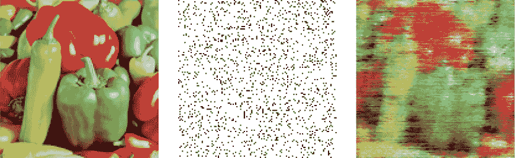

*图 9-5：原始图像（左），掩膜（中），重建图像（右）*

原始图像在左侧，10%的掩膜在中间，重建图像在右侧。最好查看彩色版本；查看*peppers*目录中的文件。我反转了掩膜图像，以便将选定的像素显示为黑色。

重建的图像并不特别引人注目，直到你记得原始图像信息中有 90%被丢弃，或者实际上根本就没有被测量过。

我曾声称 Lasso 找到稀疏的 ***s*** 向量。信号示例是稀疏的，但图像呢？测试图像为 128×128 = 16,384 像素，这意味着 ***s*** 含有这么多元素。使用 *barbara.png* 图像进行快速测试，保留 20% 的像素，返回的 ***s*** 中有 70% 是零。降到 10% 时，零的比例上升到 81%，而升到 80% 时，零的比例降至仅 15%。测量减少意味着 ***s*** 更稀疏，这似乎是合理的。回想一下，***s*** 是图像在离散余弦变换空间中的表示。如果我们在尝试最优拟合 ***y*** 的少量测量时，能找到少数低频成分，我们可能会期待大部分 ***s*** 在施加 *ℓ*¹ 正则化后变为零。

*cs_image_test* 脚本反复运行 *cs_image.py*，在同一测试图像上，测量像素的比例从 1% 到 80% 不等。图 9-6 显示了重建图像的结果。

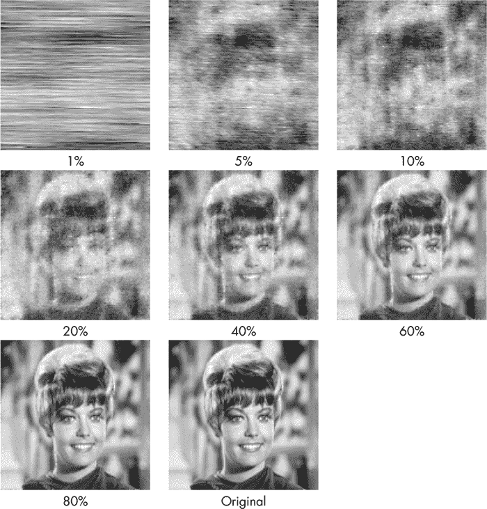

*图 9-6：通过改变原始像素的比例重建 *zelda.png* 图像*

在 10% 时，我们已经能够开始辨认图像，但直到 20% 时，才清楚地知道这是一张人的面孔。注意，我调整了原始 *zelda.png* 图像的亮度，使其使用整个 [0, 255] 范围；这使其亮度与重建图像一致。

图 9-7 显示了重建图像与原始图像之间的平均结构相似性指数 (SSIM) 的变化曲线。

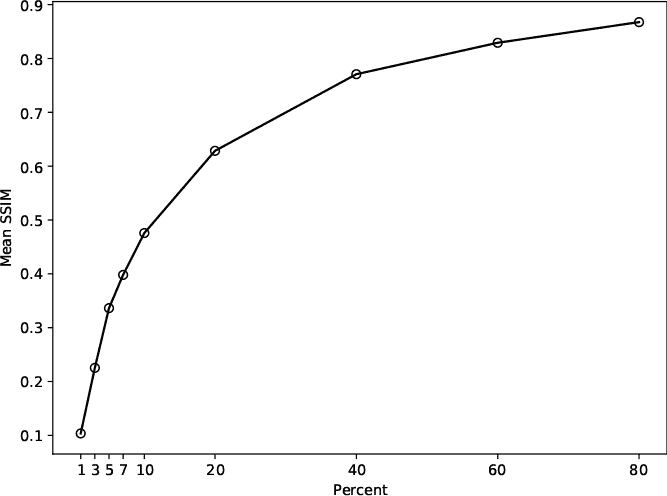

*图 9-7：平均结构相似性指数随测量数量的变化*

正如我们预期的那样，随着测量像素数量的增加，指数迅速增加。结果令人鼓舞，因为原始图像和从减少 20% 测量中重建的图像之间几乎没有感知上的差异。

### **压缩感知应用**

压缩感知被广泛应用于许多领域，包括医学影像学，在磁共振成像和各种断层扫描形式中，压缩感知的应用显著提高了获取时间。将压缩感知应用于断层扫描意味着采集更少的投影，从而大幅减少使用的 X 光能量（电离辐射）。

磁共振成像是压缩感知的自然应用目标。图像采集过程实际上是在*k 空间*（或傅里叶空间）中进行测量，相当于直接测量***s***。通过二维反傅里叶变换恢复所需图像，就像我们通过逆离散余弦变换从***s***恢复***x***一样。许多 k 空间采样策略已被开发出来，以加速图像采集，同时仍能生成具有临床价值的图像。磁共振图像采集的工作原理使得本章中的简单随机采样不适用，但存在用于以数学上不相干的方式采样 k 空间的替代方法，这些方法能够减少采集时间。例如，GE 的*HyperSense*，一种先进的压缩感知方法，能够将扫描时间减少最多 50%。更快的扫描时间意味着患者所需的扫描时间减少。

然而，压缩感知的未来有些不确定。深度神经网络在解决逆线性问题方面也非常擅长——事实上，可能比传统的压缩感知更好。将深度神经网络替代传统的压缩感知，或与其结合使用，是一个活跃的研究领域。

### **练习**

本章简要介绍了两个实验，首先是处理一维信号，然后是将图像表示为一维向量。以下是一些可能的进一步探索方向：

+   *cs_signal.py*中的代码是针对整个一秒钟的声音样本工作的。你如何修改这种基本方法来压缩任意 WAV 文件？提示：试着仅保留每几百毫秒声音的随机子集，并重建每个子集。

+   假设你构建了一个任意的 WAV 文件系统，你能否使用相同的测量矩阵（相同的随机采样）来处理每个子集，还是更好地以某种方式进行修改——也许使用固定的伪随机种子并根据需要以块的方式选择测量？

+   我们所有的图像实验都使用了*α* = 0.001。试着将*α*的值从接近 0 逐渐增加到 1，甚至更大。如果*α* = 0，则 Lasso 中的*ℓ*¹正则化项消失，优化变成了仅使用*ℓ*²范数的标准最小二乘法。当*α*非常小时，压缩感知是否有效？注意，scikit-learn 文档中对 Lasso 的警告是不要使用*α* = 0，因此在这种情况下，请将`Lasso`替换为`LinearRegression`。

+   *cs_image.py*文件包含检查所提供的随机性源是否为`quasi`，如果是，则将种子值解释为准随机生成器的基数。如果使用不同的素数基数，如 2、3 或 13，使用`quasi`会发生什么？你能解释你看到的结果吗？

+   我们处理 RGB 图像时是逐个颜色通道进行的。作为替代方案，我们可以将整个 RGB 图像展开为一个三倍大小的向量，然后进行优化（记得在输出时重新构建 RGB 图像）。修改*cs_image.py*来实现这一点。这有影响吗？会有帮助还是有害？

+   所有的随机测量矩阵都是平等的吗？

### **总结**

压缩感知突破了奈奎斯特-香农采样定理的限制，允许从比最初认为可能的更少的样本中重建信号。在本章中，我们实验了压缩感知的基本形式，并将其应用于音频信号和图像。

首先，我们讨论了压缩感知中的核心概念，包括稀疏性和*ℓ*¹正则化。接着，我们将压缩感知问题表示为一个逆线性问题，形式为***y*** = ***Cx***，其中***y***为测量向量，***x***为期望输出向量。实际上，稀疏性约束意味着使用***x*** = **Ψ*****s***的另一种形式，其中***s***为稀疏向量，**Ψ**为基。对我们来说，**Ψ**来源于离散余弦变换，在这种变换下，信号被认为是稀疏的。

压缩感知问题变成了寻找解向量***s***，使得***y***和***C*****Ψ*****s*** = **Θ*****s***之间的*ℓ*²距离尽可能小，同时满足∥***s***∥[1]也尽可能小的约束。我们发现，Lasso 回归非常好地实现了这一目标。

手头有了理论，我们进行了两组实验。第一组实验旨在利用低于奈奎斯特限制的均匀采样和随机采样来重建一个一秒钟的音频信号，即 C 大调和弦。均匀采样无法恢复信号，直到采样率超过播放率的一半（此时保留了超过 50%的样本）。另一方面，使用压缩感知的随机采样，即使丢弃了最多 90%的原始数据，仍然能得到良好的结果。

在第二个实验中，我们处理了灰度图像和 RGB 图像。与信号一样，我们成功地使用了压缩感知和离散余弦变换，从原始图像的 10%的像素恢复出图像，尽管通常伴随有相当大的噪声。DCT 不一定是图像的最佳基底，但更好的基底，如小波变换，超出了本书的讨论范围。

我们通过指出压缩感知对医学影像的贡献来结束这一章，它改善了患者的舒适度，并减少了电离辐射的暴露。最后，我们提到，深度神经网络的最新进展可能会对压缩感知的未来产生重大影响。

在下一章中，我们将暂停实验，探讨在实验中如何使用随机性。现代科学在很大程度上依赖于精心设计的实验，而随机性在这一过程中起着重要作用。
