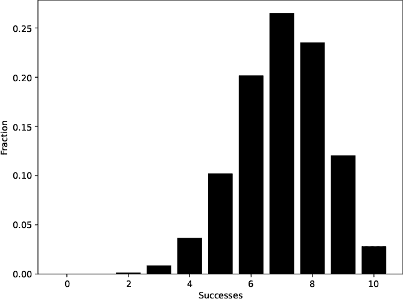
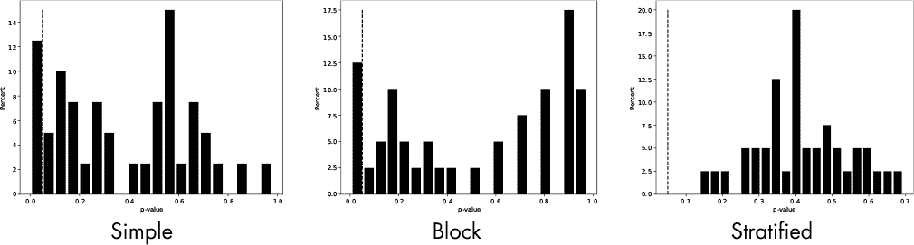

## **10

**实验设计**


*科学方法*是科学的基石。它涉及从假设中创造理论，通过实验进行测试，并通过从实验中获得的证据支持这些理论。在本章中，我们将探讨实验设计，或者说*实验设计*，这是科学方法的基础部分。随机性对于成功的实验设计至关重要，主要有两个原因。首先，无论哪个领域，许多测量都涉及不确定性或其他超出研究人员控制的因素，称为*随机噪声*。我们在实验设计中使用随机性来应对噪声，就像用火对抗火一样。其次，随机性使得实验结果符合统计学的预期。

本章通过模拟（第三章）来探讨实验设计中三种常见的随机化方法。我们的示例模仿了医学研究，但所涉及的概念适用于各个领域。

### **实验中的随机化**

假设一位研究员想了解公众对于一项关于实施噪音法令的选票提案的看法，该法令旨在限制晚上 8 点后举办的吵闹派对。他决定通过电话调查，随机从电话簿中挑选 100 个名字，并在一个星期三下午给每个人打电话。他得到了 64 个答录机留言，36 个接通电话，且有 17 人愿意交谈。在这 17 人中，15 人支持该法令，2 人反对。 这些结果能否公正地反映公众对于这一问题的立场？

我怀疑你的答案是否定的，因为结果中可能有许多偏差来源。研究员使用了电话簿，而电话簿通常只列出固定电话；依赖被叫者愿意提供意见；并且在工作日的下午进行电话调查。

他的样本严重偏向于退休人员，这些人往往年纪较大，且（通常）不太倾向于举办派对，因此他的结果并不一定反映整体人群的情况。他的样本排除了最有可能受到法令影响的群体——年轻人，他们通常使用手机，并且在他收集数据的时间段内可能正处于学校或工作中。

避免这种*样本偏差*是进行实验时使用随机性的一个重要原因。然而，调查和投票中的偏差很难修正，且常常导致相反的结果。更微妙且可能更危险的是，医学研究中在选择群体时的样本偏差。

*bad_sample.py* 中的代码生成了一个包含四个随机选择特征的个体群体：年龄、收入、是否吸烟以及每周平均饮酒量。这些特征与个体的年龄相关，因此年纪较大的人更有可能收入较高、不吸烟且饮酒较少。

`Population` 函数生成一个作为 NumPy 数组的个体群体：

```
def Population(npop):
    pop = []
    for i in range(npop):
        age = 20 + int(55*rng.random())
        income = int(age*200 + age*1000*rng.random())
        income = int(income/1000)
        smoker = 0
        if (rng.random() < (0.75 - age/100)):
            smoker = 1
        drink = 1.0 - age/100
        drink = int(14*drink*rng.random())
        pop.append([age, income, smoker, drink])
    return np.array(pop)
```

代码通过循环附加四元组特征列表，每个特征列表都是根据选择的`age`（年龄）派生的。请注意，`age`的单位是年，`income`（收入）是千元，`smoker`（吸烟者）是二元变量，`drink`（饮酒量）是每周平均饮酒次数。

这段代码从总体中随机选择一个子集，以模拟一个医学研究中的随机样本。例如，以下是*bad_sample.py*的一次运行：

```
> python3 bad_sample.py 1000 10 1 mt19937 4004
age   : 47.22  42.20  (t= 0.9782, p=0.32823)
income: 33.20  24.80  (t= 1.4284, p=0.15350)
smoker:  0.27   0.10  (t= 1.2126, p=0.22555)
drink :  3.14   3.20  (t=-0.0714, p=0.94309)
```

总体规模是 1,000，我们从中随机选择 10 个样本。`1`参数表示采样一次。像往常一样，随机源和种子跟随其后。

我们根据年龄、收入、吸烟情况和饮酒情况对结果进行排序。第一列显示的是整个总体的这些值的均值。第二列是 10 人随机样本的均值。括号中的值是 t 检验结果，其中`t`是*t*统计量，`p`是 p 值。总体和样本之间的显著差异会产生一个低 p 值。*t*统计量的符号使得正的*t*表示总体均值超过样本均值。

在这种情况下，10 人的随机样本在饮酒和总体年龄方面与总体相似。然而，收入有所不同，这可能会影响那些宣称此样本能代表总体的研究结果。

让我们再次运行相同的命令：

```
> python3 bad_sample.py 1000 10 1 mt19937 6502
age   : 47.35  56.10  (t=-1.7258, p=0.08468)
income: 32.43  31.80  (t= 0.1118, p=0.91097)
smoker:  0.29   0.10  (t= 1.3255, p=0.18530)
drink :  3.20   2.60  (t= 0.7774, p=0.43713)
```

这个随机样本明显比总体年龄大，因此吸烟的可能性要小得多。尝试几次运行*bad_sample.py*。虽然有些样本与总体相似，但其他样本则显著偏离。

运行*bad_sample.py*，但将样本数量从 1 改为 40：

```
> python3 bad_sample.py 1000 10 40 mt19937 8080
10 6.36529487 0.49581353
```

总体中的每个人都是一个四元组（年龄、收入、吸烟、饮酒）。因此，他们在四维空间中成为一个点。如果我们考虑个体年龄、收入、吸烟和饮酒特征的均值，那么整个总体就变成了空间中的一个点。*bad_sample.py*文件报告了总体均值点与样本均值点之间的均值（±标准误）欧几里得距离，对于每个 40 个样本的采样而言。在这种情况下，样本量为 10 时，均值距离为 6.37 ± 0.50。

让我们将样本大小增加到 100：

```
> python3 bad_sample.py 1000 100 40 mt19937 8080
100 2.12064926 0.23245698
```

总体与样本之间的均值距离会减少。如果我们有更大的样本，它应该能更好地代表整个总体。这个效应是科研和机器学习模型中尽可能使用大量数据的动机所在。

文件*bad_sample_test.py*对 10,000 人的总体和从 10 到 5,000 的样本量重复此过程。对于每个样本量，我们收集 40 个样本。结果适合绘制图形，如图 10-1 所示。


*图 10-1：总体均值与样本均值之间的欧几里得距离与样本量的关系*

图 10-1 中的 *x* 轴表示每个数据集中的样本数量。我们绘制了这些样本均值与总体均值的平均偏差，并用误差条表示标准误差。我在误差条上添加了端点，以便更容易看到范围。每个点是基于 40 对总体-样本的均值计算得出的。

更大的样本量导致总体均值和样本均值之间的差距变小，表明较大的样本更可能是总体的更好代表。注意，随着样本量的增加，误差条变得更小。样本中的噪声，或与总体均值的偏差，几乎降至零。

样本量为 10 时的误差条很大，均值偏差约为 7，约为样本量 500 时均值偏差的七倍。还要注意，随着样本量的增加，曲线下降得非常快。对于许多实验来说，可能不需要特别大的样本量，但研究的效应强度会影响样本量的选择。更多的样本总是更好的。

实验通常会报告均值结果以及均值的标准差或标准误差。接着，他们会进行显著性检验，比如 t 检验；如果 p 值低于（任意设定的）0.05 阈值，他们就宣布结果显著，并标记为统计学上显著。然而，这只是故事的一部分。如果样本量很大，比如在一些基于广泛收集健康数据的队列研究中，那么结果可能会是 *p* < 0.05，但由于样本量庞大，基于 Cohen 的 *d* 测量的 *效应大小* 可能很小。换句话说，效果虽然真实存在，但由于效应大小较小，可能在实际中并不具有太大意义。故事的启示是：尽可能报告效应大小。

图 10-1 中小样本量的噪声证明了我在前一段中提到的问题。如果效应很小，并且我们预计与总体均值的偏差很小，那么小样本量不太可能捕捉到这种效应，因为它被样本自身固有的噪声所掩盖。我们将在本章后面使用实验设计技术来补偿选择偏差时再次讨论这个概念。

最后，正是图 10-1 中小样本量使其成为不适合研究的选择的原因，也是驱动进化的基因漂变的原因。在第三章中，我们看到，某个亚群体中的性状随机混合，并且偶然与更大群体隔离，导致了基因漂变，最终形成了新物种。从这个意义上讲，进化虽然是一个糟糕的研究者，但却是一个聪明的修补匠，能够利用样本偏差，并将其转化为长期有用的东西。

既然我们知道样本偏差可能导致糟糕的研究结果，那么我们就来探讨一下如何补偿这种偏差。

实验设计中的随机化分为三大类。我们将在本章剩余部分使用的代码支持所有三种方法。

#### ***简单***

如果实验正在测试一个结果——例如某种特定治疗的有效性——我们可能会通过一次招募一个成员来建立治疗组和对照组，并通过掷硬币决定组的分配。我们可以用一段 Python 代码来模拟这种 *简单随机化*：

```
>>> from RE import * 
>>> RE(mode="int", low=0, high=2).random(10)
array([1, 1, 1, 0, 0, 0, 0, 1, 0, 1])
>>> RE(mode="int", low=0, high=2).random(10)
array([0, 1, 1, 0, 1, 1, 0, 0, 1, 1])
```

我们配置 `RE` 来返回硬币翻转结果，0 或 1。每次调用返回 10 次翻转。因此，我们为 20 名参与者生成了分配：治疗组 11 名，对照组 9 名。

简单随机化看起来是一个不错的方法，但它有一个明显的缺点，类似于我们在处理 *bad_sample.py* 时观察到的情况。

让我们再试一次为 10 名参与者进行分配的实验：

```
>>> RE(mode="int", low=0, high=2).random(10)
array([0, 1, 1, 1, 0, 0, 1, 1, 1, 1])
```

如果我们遵循简单随机化，我们会得到治疗组 7 人，对照组只有 3 人——这似乎不太明智。请注意，这不是一个人为的例子；该输出来自于那段代码的单次运行。

虽然简单随机化在研究规模较小时不是最佳方法，但它通常在较大规模的研究中效果很好：

```
>>> s = RE(mode="int", low=0, high=2).random(10000)
>>> np.bincount(s)
array([4852, 5148])
```

在这种情况下，治疗组和对照组大小之间的差异只是总研究规模的一小部分，因此我们可以预期每组会相似。

简单随机化的弱点，尤其是在小规模研究中，是治疗组和对照组中的受试者数量可能会高度不平衡。我们可以通过区块随机化来弥补这一点。

#### ***区块***

*区块随机化* 确保每组中的受试者数量相同。对于一个只有两组——治疗组和对照组——的二项实验，我们首先选择一个区块大小，通常在 4 到 6 之间。我们将在示例中使用固定的区块大小 4。接下来，创建所有可能的四个受试者的区块，其中分配是平衡的。对我们来说，这意味着所有四位二进制数字的组合，其中 1 和 0 的数量相同：

1100, 1010, 1001, 0110, 0101, 0011

每个区块有两个 1 和两个 0。

我们选择足够多的区块来覆盖受试者，以生成最终的组分配。为了实现完全平衡的组，受试者数量必须是区块大小的倍数，在这种情况下是四的倍数。所以，对于 32 名受试者，总共需要八个区块，因为 32 / 4 = 8。我们从区块集随机选择这八个区块，但无论选择哪些区块，1 和 0 的总数都会相同。

例如，下面是一个随机选择的八个区块的序列：

```
>>> from RE import * 
>>> b = ["1100","1010","1001","0110","0101","0011"]
>>> r = RE(mode="int", low=0, high=6)
>>> "".join([b[i] for i in r.random(8)])
'11000011101010101010100100110110'
```

有 16 名受试者被分配到治疗组和对照组。再次运行代码时，顺序会有所不同，但每组分配的人数仍然是 16。将这个顺序应用到选定的 32 名受试者中，可能通过按顺序匹配受试者的 ID 号来实现。参见表 10-1。

**表 10-1：** 匹配受试者 ID 与分配的组别

|  | **0** | **1** | **2** | **3** | **4** | **5** | **6** | **7** | **. . .** |
| --- | --- | --- | --- | --- | --- | --- | --- | --- | --- |
| **受试者** | 0 | 1 | 2 | 3 | 4 | 5 | 6 | 7 | . . . |
| **组别** | 1 | 1 | 0 | 0 | 0 | 0 | 1 | 1 | . . . |

这一过程持续进行，直到所有 32 名受试者都被分配完毕。

区组随机化比简单随机化有优势，因为它平衡了治疗组和对照组中的受试者数量。然而，这两种方法都没有关注可能影响或掩盖治疗效果的其他特征。如果治疗效果显著并且广泛适用，那么简单随机化和区组随机化都能反映这一点。但是，如果治疗效果较弱或仅对特定人群相关，那么单独使用任何一种方法都是不理想的。于是，分层随机化应运而生。

#### ***分层***

在 *分层随机化* 中，我们将受试者分配到治疗组和对照组，使得每个组包含具有其他特征（即*协变量*）的均衡受试者，这些特征是我们（实验者）认为可能影响结果的。例如，如果我们为一个研究项目设计了一个区组设计，旨在测试补充剂服用三个月后的耐力，而我们的治疗组恰好有大量 25 岁以下的不吸烟者，那么在实验结束时，治疗组与对照组之间的耐力差异可能会很大。

分层随机化尽可能通过将对照组的协变量与治疗组匹配来管理组的组成。

分层随机化有不同的实施方法。在我们的模拟中，我们将从一个大范围的潜在受试者群体中随机挑选一个治疗组受试者。根据该受试者的协变量，我们将寻找一个匹配的受试者，放入对照组。这样，我们就能确保治疗组和对照组中的受试者数量平衡，而且我们知道每个治疗组的受试者都有一个匹配的对照组，以使两组的整体特征相同。换句话说，我们将调整协变量的差异。

我们通过 *bad_sample.py* 的经验发现，小规模研究容易受到年龄、收入、吸烟和饮酒等因素的显著变化影响。这些因素就是我们在模拟中使用的协变量。

### **定义模拟**

本章的其余部分将使用*design.py*中的代码。像往常一样，我建议在继续之前先阅读代码。我们将在下一部分进行详细讲解；在这一部分中，我们将定义希望通过模拟实现的目标。

这是场景设定：我们希望评估一种新型补充剂对健康的影响，使用一年后的效果。为此，我们首先选择一个治疗组，该组在一年内服用补充剂。然后，我们将他们的总体健康评分与没有服用补充剂的对照组进行比较。

**注意**

*现代临床试验通常会使用*安慰剂*，即“假”治疗，作为对照组。在这种情况下，安慰剂通常是看起来像补充剂的糖丸。无论是参与者还是研究人员，都无法知道谁接受了什么治疗，这样可以使研究保持双盲设计。另一种方法是，对照组可能完全不知情补充剂组的情况。在这种情况下，他们会在研究开始和结束时接受调查或测试，但不会给与安慰剂。虽然我们会使用后一种方法，但两种方法在此情境下都适用。*

模拟是有偏的；治疗组总是会有正向的健康效益。效应的强度由我们控制。显然，没有补充剂；模拟的目的是了解三种实验设计选择如何影响实验的结果。治疗效应容易被检测到吗？如果我们看到有改善，我们会多么相信这一测量效应是真实的？我们将尝试回答这些问题。

正如我们在*bad_sample.py*中所做的那样，我们将使用相同的协变量生成个体人群：年龄、收入、吸烟和饮酒。与*bad_sample.py*不同，我们不会使用年龄来影响其他协变量，而是立即将协变量分入不同的类别。换句话说，我们不会说某个人是 48 岁或 11 岁；相反，我们会从三个年龄类别中选择，即年龄将是 0、1 或 2。收入和每周饮酒量也会进行同样的处理。吸烟是二元的，0 或 1。

每次运行代码都会累积用户选择的实验次数的统计数据。我们随机生成一个人群，并根据所需的随机化方案选择治疗组和对照组。然后，我们施加治疗（补充剂），并使用两个组的健康评分生成度量指标。当所有实验完成后，我们使用收集到的信息来创建输出，提供对随机化方案效果的洞察。

与所有模拟一样，我们必须小心确保所模拟的事物在所需的程度上是现实的合理近似。记住 Box 的名言：所有模型都是错误的，但有些模型是有用的。

### **实现模拟**

让我们理解一下*design.py*的关键部分，从文件底部的主要循环开始。然后，根据需要，我们将讨论调用循环的函数。接下来是分析结果的代码。从算法角度看，主要循环会按照期望的实验次数（`nsimulations`）重复以下步骤：

1.  创建一个人口（`Person`对象的列表）。

1.  根据用户提供的随机化方案（`typ`）选择`control`和`treatment`组。

1.  通过调用`Treat`方法并传递期望的治疗效应大小（`beta`），将处理应用于`treatment`组。

1.  累计`control`和`treatment`组的统计信息。这包括每个受试者的健康评分以及每个协变量的平均值。

1.  将收集到的数据添加到`results`列表中，每个元素是一个字典，包含该模拟实验的结果。

主要循环位于清单 10-1 中。

```
results = []
for nsim in range(nsimulations):
    pop = []
    for i in range(npop):
        pop.append(Person())

    control, treatment = [Simple, Block, Stratified]typ

    for subject in treatment:
        subject.Treat(beta)

    ch, c_age, c_income, c_smoker, c_drink = Summarize(control)
    th, t_age, t_income, t_smoker, t_drink = Summarize(treatment)

    results.append({
        "c_age": c_age,
        "c_income": c_income,
        "c_smoker": c_smoker,
        "c_drink": c_drink,
        "t_age": t_age,
        "t_income": t_income,
        "t_smoker": t_smoker,
        "t_drink": t_drink,
        "ttest": ttest_ind(th,ch),
        "d": Cohen_d(th,ch),
    })
```

*清单 10-1：主要循环*

有五段代码。第一段创建了`pop`，这是一个`Person`对象的列表，我们从中选择`control`和`treatment`组的受试者。

第二段代码，只有一行，选择适当的随机化函数，传递人口和实验中的受试者总数（`nsubj`）。对于`Block`和`Stratified`随机化，每组的受试者数量始终是所需总数的一半。`control`和`treatment`都是从`pop`中选择的`Person`对象列表。

下一段代码对`treatment`组中的每个受试者调用`Treat`方法。参数`beta`，0, 1)，是用户提供的治疗效应大小，其中较高的`beta`意味着更强的正向治疗效应。换句话说，随着`beta`的增加，补充剂的效果提高。

第四段代码计算`control`和`treatment`组的每个受试者健康评分和协变量均值。

最后一段代码将此实验的结果附加到`results`列表中。调用`ttest_ind`对治疗组和对照组的健康评分进行 t 检验，而`Cohen_d`计算 Cohen 的*d*值来衡量效应大小。

让我们探索由主要循环调用的辅助函数，接下来是每个随机化函数。我们希望正确模拟后者。

#### ***函数和类***

人口是`Person`实例的列表（[清单 10-2）。

```
class Person():
    def __init__(self):
        self.age = int(3*rng.random())
        self.income = int(3*rng.random())
        self.smoker = 0
        if (rng.random() < 0.2):
            self.smoker = 1
        self.drink = int(3*rng.random())
        self.adj = 2*(rng.random() - 0.5)

    def Health(self):
        return 3*(2-self.age) + 2*self.income - 2*self.smoker - self.drink + self.adj

    def Treat(self, beta=0.03):
        self.adj += 3*binomial(300, beta, rng) / 300  # [0,1]
```

*清单 10-2：* Person *类*

一个人是五个特征的集合。其中三个特征是[0, 2]范围内的整数：`age`、`income`和`drink`。注意调用了全局定义的`rng`，它是`RE`类的实例，依据提供的随机源和种子进行初始化。`smoker`特征是二进制的，因此一个人有 20%的概率是吸烟者。第五个特征`adj`是一个[–1, 1]范围内的随机浮点数。我们将在下一节中学习为什么使用这种分箱方案。

`Health` 方法返回一个浮动值，表示一个人的整体健康状况：

`Health` = 3 × (2 – `age`) + 2 × `income` – 2 × `smoker` – `drink` + `adj`

更好的健康（更高的浮动值）与较年轻的年龄、更高的收入水平、不吸烟以及尽量减少饮酒相关，还包括随机调整。

`Treat` 方法通过根据期望治疗效果 `beta` 修改 `adj` 来应用治疗。它通过将 `adj` 增加三倍来自二项分布的随机抽样结果（使用固定试验次数 300）来实现。

我们以前没有处理过二项分布。如果某个事件的发生概率在每次试验中为 *p*，可以想象为掷一枚带有偏向的硬币，正面朝上的概率为 *p*，并且有 *n* 次试验，那么在 *n* 次试验中，成功事件的次数将遵循一个二项分布，预期的结果范围是 [0, *n*]。

例如，如果事件的发生概率 *p* = 0.7（即 70%），并且有 *n* = 10 次试验，那么在重复实验中，事件的预期次数将遵循图 10-2 中的分布。



*图 10-2：10 次试验，每次试验成功概率为 70% 的二项分布*

在 10 次试验中，每次试验成功概率为 70% 时，最常见的成功次数是 7，正如我们所预期的那样。然而，大约 2.5% 的时间内，每次试验都成功了。

随着成功概率的增加，在给定次数试验中可能的成功事件数量也会增加。在 `Treat` 中，我们将成功试验的次数按 300 次概率 `beta` 进行缩放，因此整个表达式变为 [0, 1] 之间的一个数，我们将其乘以 3 并加到 `adj` 上。当试验次数很大时，二项分布看起来就像一个窄的正态分布，其中治疗效应集中在提供的 `beta` 值附近。

`binomial` 函数使用由 `rng` 提供的均匀分布模拟从二项分布中抽取样本。这个算法效率不高，因为它使用了多次对 `rng` 的调用来返回一个来自目标二项分布的样本。但对我们来说，这已经足够了（见清单 10-3）。

```
def binomial(n,a,rng):
    k = 0
    p = a if (a <= 0.5) else 1.0-a
    for i in range(n):
        if (rng.random() <= p):
            k += 1
    return k if (a <= 0.5) else n-k
```

*清单 10-3：从二项分布中采样*

成功试验的次数保存在 `k` 中。条件返回和对 `p` 的赋值利用了二项分布的对称性，返回任何给定成功概率（`a`）的目标样本。

主循环调用了另外两个函数，`Cohen_d` 和 `Summarize`，如同在清单 10-4 中所示。

```
def Cohen_d(a,b):
    s1 = np.std(a, ddof=1)**2
    s2 = np.std(b, ddof=1)**2
    return (a.mean()-b.mean())/np.sqrt(0.5*(s1+s2))

def Summarize(subjects):
    h = []
    age = income = smoker = drink = 0.0
    for subject in subjects:
        h.append(subject.Health())
        age += subject.age
        income += subject.income
        smoker += subject.smoker
        drink += subject.drink
    age /= len(subjects)
    income /= len(subjects)
    smoker /= len(subjects)
    drink /= len(subjects)
    return np.array(h), age, income, smoker, drink
```

*清单 10-4：附加辅助函数*

`Cohen_d` 函数通过计算两个数据集的均值差异以及它们平均方差的平方根来衡量效应大小。

`Summarize` 函数从治疗组或对照组中查询一组对象，并返回一个包含对象健康评分、平均年龄、收入、吸烟和饮酒值的向量。

让我们深入探讨，讨论一下不同的随机化方案。

#### ***方案***

清单 10-5 使用简单随机化来掷硬币，将选定的对象分配到治疗组或对照组。

```
def Simple(pop, nsubj):
    order = np.argsort(rng.random(len(pop)))
    c = []; t = []
    for k in range(nsubj):
        if (rng.random() < 0.5):
            c.append(pop[order[k]])
        else:
            t.append(pop[order[k]])
    return c,t
```

*清单 10-5：简单随机分配*

`Simple` 函数首先生成群体的随机排序。严格来说，这不是必需的，因为我们已经随机生成了 `pop`，但我们不应该假设如果不需要也可以不做此操作。

`for` 循环按顺序挑选对象，并根据掷硬币的结果将它们分配到治疗组或对照组。注意，掷硬币的结果意味着每个组中的对象数量可能不相同。完成后，我们返回两个列表。

区块随机化确保治疗组和对照组的大小平衡，如清单 10-6 所示。

```
def Block(pop, nsubj):
    ns = 4*(nsubj//4)
    blocks = ["1100","1010","1001","0110","0101","0011"]
    nblocks = ns//4
    seq = ""
    for i in range(nblocks):
        n = int(len(blocks)*rng.random())
        seq += blocks[n]
    order = np.argsort(rng.random(len(pop)))
    c = [];  t = []
    for i in range(ns):
        if (seq[i] == "1"):
            t.append(pop[order[i]])
        else:
            c.append(pop[order[i]])
    return c,t
```

*清单 10-6：区块随机化*

`Block` 的第一行使用整数除法将 `ns` 设置为不超过 `nsubj` 的最接近的 4 的倍数。接下来是作为二进制数字字符串的区块定义。这些区块是我们将四个项目均匀分配到两个组（治疗组（1）和对照组（0））的六种方式。

我们创建 `seq` 字符串，包含区块数（`nblocks`），通过随机拼接区块定义，直到字符串长度达到 `ns` 字符。

最后的 `for` 循环模拟了 `Simple`，在根据当前 `seq` 的特征将对象分配到治疗组和对照组之前，对 `pop` 的顺序进行随机化。

我们的分层随机化方法是从群体中随机选取一名对象进入治疗组，然后在群体中寻找一名未分配且具有相同特征的人，将其分配到对照组。通过这种方式，两个组在数量和总体特征上都得到了平衡。在代码中，这对应于清单 10-7。

```
def Stratified(pop, nsubj):
    def match(n,m,pop,selected):
        if (selected[m]):
            return False
        if (pop[n].age != pop[m].age):
            return False
        if (pop[n].income != pop[m].income):
            return False
        if (pop[n].smoker != pop[m].smoker):
            return False
        if (pop[n].drink != pop[m].drink):
            return False
        return True

    selected = np.zeros(len(pop), dtype="uint8")
    c = [];  t = []
    while (len(t) < nsubj//2):
        n = int(len(pop)*rng.random())
        while (selected[n] == 1):
            n = int(len(pop)*rng.random())
        selected[n] = 1
        t.append(pop[n])
        m = int(len(pop)*rng.random())
        while (not match(n,m, pop, selected)):
            m = int(len(pop)*rng.random())
        selected[m] = 1
        c.append(pop[m])
    return c,t
```

*清单 10-7：分层随机化*

清单 10-7 创建了一个标志向量 `selected`，用于标记已经分配到某组的群体成员。然后 `while` 循环运行，直到治疗组包含所请求数量的一半对象。`while` 循环的主体将 `n` 设置为群体中未选择的成员的索引，该成员将成为治疗组的一员。一旦找到 `n`，我们更新 `selected`，并将该成员添加到治疗组（`t`）。

接下来，我们找到了另一位未选择的群体成员，其特征与我们刚刚加入治疗组的人的特征相匹配；这就是`Person`类使用特征分类的原因。共有 3 × 3 × 2 × 3 = 54 种可能的特征组合。在一个大规模的群体中，我们几乎可以确保找到匹配，这发生在`match`内嵌函数返回`True`时。当我们将匹配项添加到对照组后，外层的`while`循环继续，直到为所有受试者分配完毕。

*design.py*中的其余代码分析了多个实验的结果。虽然我不会逐行讲解，但我会在下一节描述分析内容。

### **探索模拟**

我们准备运行一些实验。首先，让我们通过一个简短的回顾来定位自己：

+   我们正在模拟实验，使用已知的正向治疗效应大小，这个大小是我们提供的。

+   我们提供了随机化方案：简单、区块或分层。

+   我们正在评估多个实验的结果，以了解随机化方案的影响。

我们模拟的不是一个单一的实验，而是几十个到上百个实验。我们将评估这些实验的综合结果，以（希望）得出随机化方案对实验结果微妙影响的图景。*design.py*文件代表了一个包含所有治疗研究的完整宇宙，这些研究都是使用给定的随机化方案进行的。

让我们深入了解。*design.py*文件期望接收几个命令行参数：

```
> python3 design.py
design <npop> <nsubj> <beta> <nsim> <type> <plot> [<kind> | <kind> <seed>]

  <npop>  -  population size (e.g. 1000)
  <nsubj> -  number of subjects in the experiment (e.g. 40)
  <beta>  -  supplement effect strength [0..1]
  <nsim>  -  number of simulations to run (e.g. 100)
  <typ>   -  selection type: 0=simple, 1=block, 2=stratified
  <plot>  -  1=show plot, 0=no plot
  <kind>  -  randomness source
  <seed>  -  seed value
```

我们必须提供人口规模（`npop`）、每个实验中的受试者数量（`nsubj`）、治疗效应强度（`beta`）、要模拟的实验数量（`nsim`）以及使用的随机化类型（`type`）。和往常一样，随机性来源和可选的种子值排在最后。

#### ***简单***

我们可以像这样运行第一次模拟：

```
> python3 design.py 10000 32 0.3 40 0 1 minstd 6809

mean p-value (lowest) : 0.01138
mean p-value (highest): 0.82919

mean Cohen's (lowest) : 1.00568
mean Cohen's (highest): 0.07732

delta age   : (high, low, t, p) = (0.16556, 0.41945, -3.27589, 0.01691)
delta income: (high, low, t, p) = (0.21191, 0.30570, -0.64742, 0.54132)
delta smoker: (high, low, t, p) = (0.12377, 0.11255,  0.21945, 0.83357)
delta drink : (high, low, t, p) = (0.38284, 0.22193,  0.83403, 0.43620)
```

一张图表应该会显示出来，并伴随文本输出；我们很快就会看到它。我们请求模拟 40 次实验，每次实验从 10000 人的池子中随机选择 32 个受试者，采用简单随机化（0）。处理效应大小为 0.3，这意味着对每个`Person`对象调用`Treat`方法时，会向个体的整体健康状况添加一个围绕 0.3 的随机值。

这些统计数据来自模拟结果。前两行显示的是最低和最高 10%的实验的平均 p 值。回想一下，实验的 p 值来自治疗组和对照组的健康评分。在这种情况下，每个实验每组大约有 16 个受试者，共模拟了 40 个实验，因此最高和最低 10%的 p 值对应于 4 个实验。因为我们使用了简单随机化，所以某个特定模拟实验的治疗组和对照组大小并不总是 16。

接下来的两行报告了相同实验组的平均 Cohen’s *d*值。Cohen’s *d*是治疗组和对照组均值差异的标准化版本。因此，正如我们在使用分层随机化时所看到的，我们可以期望至少是最低的 10%组的平均效应大小与所要求的效应大小相近。在这里，我们要求的效应大小较小，为 0.3，但均值却为 1.0。对于最高的 10%组，效应大小不显著，p 值为 0.83。对于这一组实验，我们没有发现治疗组与对照组之间的显著差异。

最后的四行输出展示了每个实验的协变量*差异*的均值，分别是低 p 值组和高 p 值组。我们在这里使用 t 检验来检查治疗组和对照组之间的协变量差异是否显著。在这次运行中，年龄差异是显著的。

年龄的*t*统计量为负，这意味着低 p 值实验中的治疗组和对照组年龄差异较大。换句话说，在低 p 值实验中，治疗组和对照组的年龄协变量差异比高 p 值实验中的更大。年龄是健康评分中最突出的因素，因此治疗组和对照组之间的显著不平衡会强烈影响测量结果。

那么，我们应该如何看待这些结果呢？我们进行了许多模拟实验，即便是表现最好的那些——那些在处理后显示出显著差异的实验——我们也不应相信结果，因为这些实验的协变量差异很大。如果我们只进行了一次实验，可能看不到任何效果，并且会认为治疗是失败的。在那些确实看到效果的情况下，结果很可能是人为夸大的，因为处理组与对照组在某个重要的协变量上差异较大。

请记住，这些结果来自 40 个实验，意味着 32 个样本和简单随机分配到治疗组和对照组的实验结果往往不可靠，这些结果要么夸大了治疗的有效性，要么完全掩盖了它。

图 10-3 的左侧显示了*design.py*图表，这是一个直方图，展示了 40 个模拟实验中治疗组与对照组健康状况之间 t 检验的 p 值。垂直虚线 0.05 左侧的结果通常会被认为是统计学显著的结果。



*图 10-3：* design.py *按随机化类型的示例输出图*

从图 10-3 中的最左侧图可以看出，大约 12.5%的实验结果显示出统计学上的显著差异。这些是我们可能在科学期刊上看到的实验。剩余的 87.5%的实验没有产生统计学上显著的治疗效果。根据科学规范，这些实验应该作为负结果发布，但此类论文很少出现——这是科学文献中一个已知的问题。

尽管我们事先并不知道治疗效应在现实中是否存在且为正，但在我们的案例中我们知道——并且所有 40 个模拟实验应该都能找到正结果。那么，为什么没有找到呢？受试者群体的规模是一个影响因素，我们将很快对此进行实验，但正如模拟所示，简单随机化导致的协变量不平衡也是一个因素，它既掩盖又夸大了效应。

#### ***区组***

切换到区组随机化需要在命令行中将 0 改为 1：

```
> python3 design.py 10000 32 0.3 40 1 1 minstd 6809

mean p-value (lowest) : 0.02021
mean p-value (highest): 0.94917

mean Cohen's (lowest) : 0.89363
mean Cohen's (highest): 0.00087

delta age   : (high, low, t, p) = (0.15625, 0.45312, -2.12870, 0.07735)
delta income: (high, low, t, p) = (0.21875, 0.42188, -1.53562, 0.17554)
delta smoker: (high, low, t, p) = (0.10938, 0.14062, -0.35729, 0.73310)
delta drink : (high, low, t, p) = (0.37500, 0.17188,  1.80858, 0.12051)
```

与简单随机化结果相比，变化不大。为每个实验选择平衡的处理组和对照组大小，消除了任何由不良分组导致的效应。不过，这种效应不太可能在我们这里考虑的多个实验层面上显现出来。图 10-3 中的中间图与简单随机化图类似；在这两者中，12.5%的实验在*p* < 0.05 水平上具有统计学显著性。然而，尽管没有达到简单随机化案例中那样的差异，但在最低和最高 p 值实验组之间，年龄差异再次显著。我们或许可以通过增加受试者数量来改善这个问题，但先让我们切换到分层随机化，看看会发生什么。

#### ***分层***

要切换到分层随机化，将命令行中的 1 改为 2：

```
> python3 design.py 10000 32 0.3 40 2 1 minstd 6809

mean p-value (lowest) : 0.19833
mean p-value (highest): 0.64602

mean Cohen's (lowest) : 0.46910
mean Cohen's (highest): 0.16422
```

请注意，输出中没有任何“delta”行，因为在分层随机化中，处理组和对照组的协变量组成是相同的，因此所有的 delta 都是零；没有需要报告的内容。回忆一下，“delta”行是指处理组和对照组之间单个实验差异的均值。这些差异为零，因为我们为每个处理组的受试者选择了一个匹配的对照组受试者。

该图位于图 10-3 的右侧。它看起来不像简单或区组随机化的图表，因为协变量效应已经通过分层（匹配）选择过程得到补偿。该图所显示的是由其他因素导致的结果。

然而，没有实验的 p 值低于 0.05 的阈值。在适当考虑了我们认为会影响健康的协变量后，治疗效应虽然存在，但由于研究中只有 32 名受试者，太弱以至于无法检测到。

对于最低 p 值组，科恩的*d*值为 0.47——与我们应获得的 0.3 值相差不远，这表明我们一致地检测到了治疗效应。为了进一步改善，我们将通过增加受试者数量来调整研究规模。

##### **增加受试者数量**

让我们将受试者数量从 32 增加到 128：

```
> python3 design.py 10000 128 0.3 40 2 1 minstd 6809

mean p-value (lowest) : 0.06149
mean p-value (highest): 0.20789

mean Cohen's (lowest) : 0.33364
mean Cohen's (highest): 0.22381
```

最低 10%的实验的平均 p 值为 0.06，平均*d*为 0.334，所以我们已经接近了，但没有一个实验通过了 0.05 的魔法门槛。

让我们再次将研究规模翻倍：

```
> python3 design.py 10000 256 0.3 40 2 1 minstd 6809

mean p-value (lowest) : 0.00781
mean p-value (highest): 0.05495

mean Cohen's (lowest) : 0.33582
mean Cohen's (highest): 0.24168
```

现在，即使是最高 p 值组也接近 0.05，且两个*d*值大约在 0.3 左右。图表（未显示）说明几乎所有的实验都产生了*p* < 0.05 的结果。

通过分层随机化，我们已经考虑了协变量，因此我们在这些均值中看到了实际的治疗效应。不过，我们仍然需要足够多的受试者来从数据中提取治疗效应。让我们来看看为达到期望的效应大小，我们需要多少受试者。

*cohen_d_test.py*中的代码使用*design.py*来估算为达到最高 10%的实验中平均 p 值为 0.05 或更小所需的受试者数量。运行该代码会生成如下结果：

```
0.9:   50 subjects, p=0.03350000, d=0.7079
0.8:   60 subjects, p=0.03402000, d=0.6172
0.7:   80 subjects, p=0.02784000, d=0.5373
0.6:   90 subjects, p=0.03872000, d=0.4702
0.5:  110 subjects, p=0.04107000, d=0.4141
0.4:  170 subjects, p=0.04417000, d=0.3213
0.3:  280 subjects, p=0.04682000, d=0.2431
0.2:  580 subjects, p=0.04017000, d=0.1724
0.1: 2370 subjects, p=0.04922000, d=0.0811
```

请求的效应大小位于左侧，后面是估算的所需受试者数量、p 值以及模拟实验中最高 10%的*p*和*d*值。我的代码运行大约花了五个小时，大部分时间都在处理*d* = 0.1 的情况。通常，打印出的*d*值接近请求的值，这是一个好兆头。

该代码是一个循环，遍历期望的效应大小，并通过一个内部的`while`循环递增受试者数量，直到平均 p 值为 0.05 或更小：

```
def RunTest(beta, nsubj):
    cmd = "python3 design.py 100000 %d %0.1f 20 2 minstd 6809 >/tmp/xyzzy"
    os.system(cmd % (nsubj,beta))
    lines = [i[:-1] for i in open("/tmp/xyzzy")]
    pv = float(lines[2].split()[-1])
    d =  float(lines[5].split()[-1])
    return pv,d

base = 10
for beta in [0.9,0.8,0.7,0.6,0.5,0.4,0.3,0.2,0.1]:
    pvalue = 10.0
    k = 1
    while (pvalue > 0.05):
        pvalue,d = RunTest(beta, k*base)
        k += 1
    print("%0.1f: %3d subjects, p=%0.8f, d=%0.4f" % (beta, k*base, pvalue, d), flush=True)
```

受试者数量从 10（`base`）开始，并在`while`循环中通过一个递增值`k`来乘以 1，直到 p 值达到或低于 0.05。`RunTest`函数构建*design.py*命令行，执行它并解析输出文件，获取*p*和*d*。

##### **计算模拟的统计功效**

让我们使用`statsmodels`包中的`TTestIndPower`来检查模拟是否准确捕捉了所需的受试者数量，以达到期望的*d*值。

`TTestIndPower`类对两个独立样本——治疗组和对照组——进行*功效*分析。请参见*power_analysis.py*，它为与*cohen_d_test.py*相同的效应大小集生成输出。将两者在受试者数量上的结果进行比较，见表 10-2。

**表 10-2：** 比较计算和估算的受试者数量

| ***d*** | **计算** | **估算** |
| --- | --- | --- |
| 0.9 | 26 | 50 |
| 0.8 | 33 | 60 |
| 0.7 | 43 | 80 |
| 0.6 | 59 | 90 |
| 0.5 | 85 | 110 |
| 0.4 | 132 | 170 |
| 0.3 | 234 | 280 |
| 0.2 | 526 | 580 |
| 0.1 | 2,102 | 2,370 |

计算结果针对阈值 0.05（显著性水平α）和统计功效 0.9，这意味着我们希望有 90%的概率获得至少 0.05 作为治疗组和对照组之间 t 检验的 p 值。我选择 0.9 的功效值是因为经验代码试图使得最高 10% p 值的均值为 0.05 或更低，这意味着几乎所有的模拟实验都会发现一个 p 值为 0.05 或更低的结果。计算结果和估算的受试者数量大致一致且合理，这验证了模拟的有效性。

### **练习**

本章只有两个练习，两个练习都具有挑战性。

#### ***处理两种治疗***

将区块随机化应用于一个包含三种条件的研究：对照、治疗 1 和治疗 2。区块大小应为条件数的倍数；将区块大小固定为 6，意味着每个区块将每个条件使用两次。例如，`[0,0,1,1,2,2]`是一个有效的六人区块，其中 0 是对照，1 接受治疗 1，2 接受治疗 2。

我们需要一种方法从包含所有可能排列的集合中随机选择，这些排列由两次使用的三种条件组成。换句话说，我们希望得到一个 NumPy 数组，其中每一行是一个有效的区块。可以使用如下代码：

```
import numpy as np
from itertools import permutations
b = [0,0,1,1,2,2]
l = list(set(permutations(b)))
blocks = np.array(l)
```

`blocks`数组是一个 90×6 的矩阵，包含 90 个唯一的区块，当构建平衡队列时可以从中选择。`permutations`函数返回一个可迭代对象，`set`用于返回基本区块`b`的所有唯一排列。为了创建 NumPy 数组，在传递给`array`之前，将集合转换为列表。

你的任务是：修改*design.py*的副本，为对照组、治疗 1 组和治疗 2 组选择受试者进行简单和区块随机化。对于简单随机化，掷一个三面骰子。暂时忽略分层随机化。

#### ***结合区块随机化和分层随机化***

为了将区块随机化和分层随机化结合起来，创建区块时，所有受试者根据所需的协变量匹配，并且每个区块以平衡的方式包含所有条件。如果有三个条件——如前一个练习中的情况——并且每个区块包含六个受试者，则每个区块中的受试者必须在协变量方面达到某种匹配程度。

修改*design.py*的副本，参考可能性 1，但考虑到四个协变量的 56 种可能组合。放入区块的受试者必须在协变量的值上完全一致。

例如，如果区块是`[0,1,2,1,2,0]`，协变量集合是`[2,1,0,1]`，则在年龄组 2、收入组 1、吸烟者 0、饮酒者 1 的群体中寻找六个受试者，并按照区块指定的条件分配给他们。继续对*n*个受试者进行操作，其中*n*是六的倍数，即区块大小。将此功能添加到你修改过的*design.py*文件中，参考练习 1。

### **总结**

本章重点讨论了实验设计中的随机化，特别是在受试者选择过程中的随机化。我们在简要讨论了随机化的必要性后，探讨了最常见的几种类型：简单随机化、块随机化和分层随机化。

简单随机化使用抛硬币或掷骰子将受试者分配到治疗组或对照组。虽然这个过程可能由于组别大小不均而引入偏差，但块随机化通过确保治疗组和对照组的大小平衡，消除了这种可能性。

我们了解了协变量，它是指那些可能通过增强或掩盖任何可能的治疗效应，影响研究结果的因素。分层随机化使用协变量来构建具有匹配特征的治疗组和对照组。

接着，我们创建了一个模拟实验，测试不同随机化方案对实验结果的影响，而我们已知应观察到的治疗效应。我们发现，使用简单随机化的小规模队列容易产生偏差；而块随机化通过确保治疗组和对照组的大小平衡，消除了由于组别不平衡引起的偏差，分层随机化则纠正了治疗组和对照组中的偏差。这使得我们能够在受试者数量达到某个最小规模的前提下，衡量我们期望从模拟中获得的效应。

最后，我们将分层设置中所需的受试者数量与大多数模拟实验中期望效应大小达到 *p* < 0.05 水平所需的受试者数量进行了匹配，这个数量是通过基于 t 检验的效能分析得出的。实测的数量与模型结果相当一致，因此我们将此视为我们方法的验证。

让我们继续探索随机算法，这是计算机科学中一种重要的算法类别。
