## **11

计算机科学算法**


虽然我们到目前为止所研究的所有内容都可以称为“随机化算法”，但在计算机科学中，这个术语指的是两大类算法——本章的主题。

*随机化算法*在其操作过程中使用随机性。该算法通过快速产生正确答案，但有时不产生，或者通过快速运行并以某种概率返回错误或非最优结果来完成其目标。

我们将首先定义这两大类随机化算法并举例说明。接下来，我们将学习如何估算一个种群中的动物数量。之后，我们将学习如何证明一个数字是素数，且达到任何所需的可信度，同时避免通过穷举所有可能的除数来进行暴力搜索。最后，我们将介绍随机化快速排序，这是一种经典的随机化算法示例。

### **拉斯维加斯与蒙特卡洛**

拉斯维加斯和蒙特卡洛是与赌博密切相关的地方，也就是依赖于随机性和概率的机会游戏。然而，当计算机科学家提到拉斯维加斯和蒙特卡洛时，他们通常是指两种主要类型的随机化算法。

*拉斯维加斯算法*总是能在随机的时间内返回正确的结果；也就是说，算法执行所需的时间不是确定性的，但输出是正确的。

另一方面，*蒙特卡洛算法*不能保证输出是正确的，但其运行时间是确定性的。输出不正确的概率是非零的，但对于一个实际的蒙特卡洛算法，这个概率是很小的。我们遇到的大多数算法，包括群体智能和进化算法，都是蒙特卡洛算法。通过允许算法在找到正确输出之前退出，拉斯维加斯算法可以转变为蒙特卡洛算法。

我们将研究的第一个例子是一个排序算法，它是一个 Las Vegas 或 Monte Carlo 算法，具体取决于我们的选择。第二个是一个用于验证矩阵乘法的 Monte Carlo 算法。

#### ***排列排序***

*排列*是对一组项目的可能排列。如果集合中有 *n* 个项目，则有 *n*! = *n*(*n* - 1)(*n* - 2) …… 1 种可能的排列。例如，如果集合包含三个元素，假设 *A* = {1, 2, 3}，那么就有六种可能的排列：

{1, 2, 3}, {1, 3, 2}, {2, 1, 3}, {2, 3, 1}, {3, 1, 2}, {3, 2, 1}

请注意，一种排列将项目从小到大排序。因此，如果给定一个无序的数字向量，我们可能会使用一种排序算法，生成排列直到找到能排序项目的那个。虽然我们可以实现确定性排序，但我们也可以使用随机排列，希望在测试过多候选排列之前能偶然找到正确的顺序。*permutation sort*算法（也叫*bogosort*或*stupid sort*）实现了这个想法。

运行文件*permutation_sort.py*时不带任何参数：

```
permutation_sort <items> <limit> [<kind> | <kind> <seed>]

  <items> - number of items in the list
  <limit> - number of passes maximum (0=Las Vegas else Monte Carlo)
  <kind>  - randomness source
  <seed>  - seed value
```

代码生成一个整数随机向量，范围在[0, 99]之间，并通过尝试随机排列最多达到`limit`来对其进行排序。为了对每个排列进行评分，代码返回一对对元素乱序的比例，其中*a* > *b*表示*a*位于索引*i*，*b*位于索引*i* + 1。如果数组已经排序，得分为零。

如果`limit`为零，算法将一直运行直到找到正确的排列，这取决于可能的排列数量。随着排列数的增加（*n*!），如果我们坚持尝试直到成功，运行时间会迅速增加。通过这种方式，`limit`为 0 会将*permutation_sort.py*变成一个拉斯维加斯算法。

例如，要将*permutation_sort.py*作为拉斯维加斯算法运行，使用：

```
> python3 permutation_sort.py 6 0 minstd 42
sorted: 0  25  44  57  65  96  (268 iterations)
```

代码在测试了 268 个可能的 6! = 720 个排列后找到了正确的元素顺序。将随机源从`minstd`更改为`pcg64`时，排序需要 59 次迭代，而`mt19937`则使用了 20 次。我们将限制设置为 0，使代码一直运行直到成功，但测试的排列数通常远小于最大值。

如果我们切换到蒙特卡罗算法：

```
> python3 permutation_sort.py 6 100 minstd 42
partially: 0  57  25  44  65  96  (score = 0.16667, 100 iterations)
```

我们得到了一个部分排序的数组，得分大于 0。由于固定的随机源和种子，我们知道需要 268 次迭代才能排序数组：

```
> python3 permutation_sort.py 6 268 minstd 42
sorted: 0  25  44  57  65  96  (268 iterations)
```

列表 11-1 显示了*permutation_sort.py*中的主循环。

```
v = np.array([int(rng.random()*100) for i in range(N)], dtype="uint8")
k = 0
score = Score(v)
while (score != 0) and (k < limit):
    k += 1
    i = np.argsort(rng.random(len(v)))
    s = Score(v[i])
    if (s < score):
        score = s
        v = v[i]
```

*列表 11-1：*permutation_sort.py 中的主循环

我们创建向量（`v`），并初始化`score`。主循环`while`一直运行，直到得分为零或`limit`超出。如果是拉斯维加斯算法，我们将`limit`设置为一个非常大的数字，以增加在尝试这么多次之前找到真实排序的概率。

`while`循环的主体创建了`v`的随机排序并计算得分。每当找到更低的得分时，代码会重新排序`v`，以便在达到限制时至少返回一个部分排序的向量；然而，这并不是严格必要的。

文件的其余部分显示结果或计算得分（列表 11-2）。

```
def Score(arg):
    n = 0
    for i in range(len(arg)-1):
        if (arg[i] > arg[i+1]):
            n += 1
    return n / len(arg)
```

*列表 11-2：对排列进行评分*

让我们绘制平均排列次数与要排序项目数量的关系，*permutation_sort_plot.py*，它为[n]范围在[2, 10]之间的 10 次调用*permutation_sort.py*绘制了均值和标准误差。结果见图 11-1。

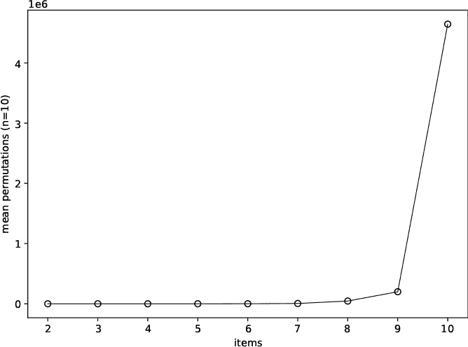

*图 11-1：作为项目数量的函数，测试的排列平均数量（以百万计）*

图 11-1 展示了*组合爆炸*，即问题的运行时间或资源使用量随着输入大小的增加而迅速增长的现象。当排序最多九个项目的列表时，排列排序工作还算不错；但如果超过九个，复杂度就会爆炸。

我们在*permutation_sort_plot.py*的输出中也看到了这种效果：

```
 2:  0.127855 +/- 0.002026
 3:  0.128128 +/- 0.001737
 4:  0.129859 +/- 0.002469
 5:  0.131369 +/- 0.002483
 6:  0.136637 +/- 0.003704
 7:  0.172775 +/- 0.008236
 8:  0.534369 +/- 0.081601
 9:  1.987567 +/- 0.488691
10: 44.133984 +/- 10.929158
```

输出显示了作为*n*的函数，排序该大小向量所需的平均时间（±标准误差）。七个元素后，运行时间迅速增加。

组合爆炸是许多原本有用的算法的诅咒，它通常会达到一个点，宇宙的多个生命周期都不足以找到正确的输出。

排列排序与阶乘密切相关，这就是我们得到这些结果的原因：

| 2! = 2 | 5! = 120 | 8! = 40,320 |
| --- | --- | --- |
| 3! = 6 | 6! = 720 | 9! = 362,880 |
| 4! = 24 | 7! = 5,040 | 10! = 3,628,800 |

阶乘以惊人的速度增长。如果我们要对 20 个项目进行排序，我们需要

20! = 2,432,902,008,176,640,000

需要检查的排列数。如果每个排列需要 1 毫秒的时间，我们就需要超过 7700 万年的计算时间才能检查完所有排列。这并不意味着排列排序不能偶然在不到一秒的时间内排序 20 个项目，但这种概率极低。这就是随机算法的悖论。

#### ***矩阵乘法***

我有三个矩阵，***A***、***B***和***C***。我们将用粗体大写字母表示矩阵。***AB*** = ***C***吗？我们怎么知道？

##### **引入矩阵乘法**

首先，让我们确保我们对矩阵乘法有相同的理解。*矩阵*是一个二维数字数组，因此这里的矩阵可能是：

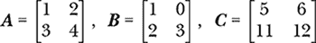

这些是 2×2 矩阵，有两行和两列。如果行数等于列数，我们就正在处理*方阵*。然而，行数和列数不必相等；例如，我们可能有一个 3×5 或 1,000×13 的矩阵。后者在机器学习中很常见，行代表观察值，列代表与这些观察值相关的特征。*n*×1 矩阵是*列向量*，而 1×*n* 矩阵是*行向量*。

问题是，是否***AB*** = ***C***意味着我们知道如何找到***AB***。在 NumPy 中，为了乘以两个二维数组，我们将每个对应的元素相乘（清单 11-3）。

```
>>> A = np.array([[1,2],[3,4]])
>>> B = np.array([[1,0],[2,3]])
>>> A*B
array([[ 1,  0],
       [ 6, 12]])
```

*清单 11-3：在 NumPy 中按元素相乘*

不幸的是，矩阵乘法更为复杂。我们首先要检查第一个矩阵的列数是否等于第二个矩阵的行数。如果不相等，则不能进行矩阵乘法。因此，要将一个*n*×*m*矩阵乘以一个*u*×*v*矩阵，需要*m* = *u*。如果这一条件成立，我们就可以进行乘法运算，得到一个*n*×*v*的结果。本节中的方阵自动满足这一要求。

矩阵乘法过程需要将第二个矩阵的每一列与第一个矩阵的行相乘，其中列的元素与行的对应元素相乘。然后我们将这些乘积求和以产生单一的输出值。例如，用符号表示，乘法两个 2×2 矩阵返回一个新的 2×2 矩阵：

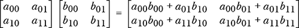

我们从 0 开始索引矩阵，就像我们处理 NumPy 数组一样。然而，许多数学书籍是从 1 开始索引的，所以矩阵 ***A*** 第一行的第一个元素记作 *a*[11]，而不是 *a*[00]。

数学上，如果 ***A*** 是一个 *n* × *m* 矩阵，***B*** 是一个 *m* × *p* 矩阵，那么 ***C*** = ***AB*** 的元素是一个 *n* × *p* 矩阵：

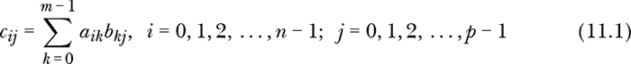

记住矩阵乘法不满足交换律；一般来说，***AB*** ≠ ***BA***。在方程 11.1 中的求和展示了这一点：单一的索引按行访问 ***A***，按列访问 ***B***，因此交换 ***A*** 和 ***B*** 的顺序会导致矩阵中的不同元素被混合。

方程 11.1 中的求和使用了索引变量 *k*，并且对 *i* 和 *j* 的所有值进行了两次隐含的求和，以填充输出矩阵 ***C***。这些观察结果指向一个实现：矩阵乘法变成了一个三重循环，索引 2D 数组的元素。

列表 11-4 将方程 11.1 中的循环转换为代码。

```
def mmult(A,B):
    n,m = A.shape
    p = B.shape[1]
    C = np.zeros((n,p), dtype=A.dtype)
    for i in range(n):
        for j in range(p):
            for k in range(m):
                C[i,j] += A[i,k]*B[k,j]
    return C
```

*列表 11-4：朴素矩阵乘法*

我们将使用这个实现，即使 NumPy 原生支持通过几种方式进行矩阵乘法，例如通过 `@` 运算符。为了理解原因，我们将学习计算机科学家如何衡量算法的性能。

##### **引入大 O 符号**

计算机科学家通过将算法的性能与输入大小增加时类似的函数进行比较，来描述算法的资源使用情况，该函数能够捕捉算法的资源使用如何随着输入的增长而变化。这里的资源指的是内存或时间。例如，一个的(*n*)算法会随着输入大小*n*的增加而线性增加所使用的内存。线性函数可以写作 *y* = *mx* + *b*，其中 *x* 是输入，但在大 O 符号中，我们忽略乘法和常数因素，所以 *y* = *x* 在 *x* 非常大时与 *x* 是功能上相同的。

清单 11-4 中的矩阵乘法代码包含一个三重嵌套的循环。如果输入矩阵是方阵（*n*×*n*），则`I` = `J` = `K` = *n*。每个循环执行 *n* 次，使得最内层的循环每次外层循环递增时执行 *n* 次，外层循环也必须执行 *n* 次来递增最外层循环。因此，乘法两个 *n*×*n* 矩阵所需的操作总数按 *n*³ 规模增长。创建输出矩阵 `C` 和计算函数前两行所需的时间不会改变该函数的本质特征——即它需要通过三个循环进行 *n*³ 次迭代。

因此，计算机科学家会写下 清单 11-4 是一个 (*n*³) 算法，并且是一个“*n* 立方”的实现。通常，我们希望算法的增长率为 (*n*) 或更优。随着 *n* 的增加，算法所需的工作量按线性增长，或者更好的是，按子线性增长，如 (log *n*) 或 (*n* log *n*)。换句话说，工作量与 *n* 的关系是一个直线图。理想情况下，我们希望 (1) 算法，它们在常数时间内运行，无论输入的大小如何，但这并非总是可能的。一个在 (*n*²) 时间内运行的算法通常是可以容忍的，但 (*n*³) 只适用于小的 *n* 值。

请注意，(*n*)、(*n*²) 和 (*n*³) 都是 *n* 的幂次。这类算法被称为 *多项式时间* 算法。我们永远不希望有在 *超多项式时间* 内运行的算法，这类算法的运行时间（或资源使用）无法通过任何多项式来追踪。例如，一个运行在 (2*^n*) 时间内的算法就是一个 *指数时间* 算法，它的资源使用随输入规模的增大而剧烈增长，增长速度远超任何多项式。更糟糕的是我们之前实验过的排列排序；它是一个 (*n*!) 算法，运行在 *阶乘时间* 内。为了理解阶乘时间比指数时间更糟糕，可以绘制一个图，比较 *2*^*n* 和 *n*! 在 *n* = [1, 8] 时的增长情况。

如 Listing 11-4 中的矩阵乘法是(*n*³)。我们的目标是快速检查在给定三个矩阵的情况下，是否***AB*** = ***C***。我们首先将***A***和***B***相乘，然后检查结果的每个元素是否与***C***中对应的元素匹配。乘法是(*n*³)，检查的时间是(*n*²)，因为我们需要检查每个元素。由于立方体增长速度远快于平方，整体的朴素算法运行时间基本为(*n*³)。让我们看看是否可以做得更好。

##### **引入 Freivalds 算法**

1977 年，拉脱维亚计算机科学家 Rūsiņš Freivalds 发明了一种随机算法，能够以高概率正确回答***AB*** = ***C***的问题，并且运行时间为(*n*²)。

对于以下内容，我们假设***A***、***B***和***C***是*n*×*n*的矩阵。该算法也适用于非方阵，但此限制使得理解过程更为简单。

算法本身是直接的：

1.  选择一个随机的*n*维向量，***r*** = {0, 1}*^n*，即一个由 0 和 1 组成的随机向量。

1.  计算***D*** = ***A***(***Br***) – ***Cr***。（注意：括号很重要。）

1.  如果***D***的所有元素都是零，则声明“是”，***AB*** = ***C***；否则，声明“否”。

初看起来，Freivalds 算法似乎不会有帮助。然而，回想一下矩阵乘法是如何工作的。表达式***Br***是将一个*n*×*n*的矩阵与一个*n*×1 的向量相乘，返回一个*n*×1 的向量。接下来的***A***乘法返回另一个*n*×1 的向量。同样，***Cr***也是一个*n*×1 的向量。此时并没有进行完整的*n*×*n*矩阵乘法。随着*n*的增大，计算节省的速度会更快。Freivalds 的算法运行在(*n*²)时间内，比起朴素算法的(*n*³)运行时间，这是一个相当大的改进。

将***B***乘以***r***相当于选择***B***的列的随机子集，并将它们的值在行中相加。例如：

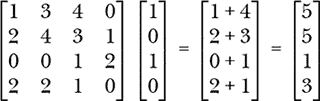

该算法的假设是，检查三者矩阵的随机元素时，如果它们相等，结果将更频繁地使***D***成为全零向量，而不是***D***偶然变为全零。对所涉及概率的分析（我们不会在此讨论）表明，给定***AB*** ≠ ***C***的情况下，***D***为全零的概率小于或等于 1/2。

如果一个计算涉及随机选择的***r***返回错误答案的概率至多为 1/2，那么两次运行算法的随机向量（如果我们运行算法两次）返回错误答案的概率至多为(1/2)(1/2) = 1/4。这里的错误答案是输出“是”，但实际上***AB*** ≠ ***C***。

每次应用算法都是独立于任何先前应用的。对于独立事件，如公平硬币的抛掷，概率是相乘的，因此*k*次运行 Freivalds 算法意味着错误“是”结果的概率为 1/2*^k*或更小。这意味着通过多次运行算法，我们可以提高对结果的信心。

当***AB*** = ***C***时，算法总是返回“是”，这意味着它是*单边的*——只有在***AB*** ≠ ***C***时，输出才会出错。在*双边的*错误中，算法可能在任何情况下都出错，具有一定的概率。

##### **测试 Freivalds 算法**

让我们尝试使用*freivalds.py*算法，它生成 1,000 个随机的*n*×*n*矩阵三元组，*n*由命令行提供。在所有情况下，***AB*** ≠ ***C***，因此我们将失败的次数作为 1,000 次中的一个比例报告。

按如下方式运行*freivalds.py*：

```
freivalds <N> <mode> <reps> [<kind> | <kind> <seed>]

  <N>     - matrix size (always square)
  <mode>  - 0=Freivalds', 1=naive
  <reps>  - reps of Freivalds' (ignored for others)
  <kind>  - randomness source
  <seed>  - seed
```

第一个参数是矩阵的维度。第二个参数决定是否使用计算***AB*** - ***C***的朴素算法或 Freivalds 算法。第三个参数是重复测试的次数，使用随机的***r***向量。我们稍后会使用这个选项来跟踪错误率。像往常一样，其他参数启用任何随机源和一个种子，以重复相同的随机矩阵序列。

例如：

```
> python3 freivalds.py 3 0 1 mt19937 19937
0.08598161 0.132
```

告诉我们，使用 Freivalds 算法对 1,000 个 3×3 矩阵进行单次测试，每次测试大约需要 0.09 秒，并且在 1,000 次测试中失败了 13.2%。

要使用朴素算法，只需在命令行上将 0 改为 1：

```
> python3 freivalds.py 3 1 1 mt19937 19937
0.05456829 0.000
```

如预期的那样，没有失败，因为完整的计算总是能捕捉到当***AB*** ≠ ***C***时的情况。虽然朴素算法似乎比 Freivalds 算法运行得更快，但这只是一个错觉；随着*n*的增加，两者的差距会逐渐增大。

在检查 3×3 矩阵时失败 13%的时候并不是很令人振奋。让我们重新测试，但检查两次而不是一次：

```
> python3 freivalds.py 3 0 2 mt19937 19937
0.14664984 0.016
```

现在我们仅失败了 1.6%的测试，但几乎加倍了运行时间。让我们尝试进行四次测试而不是两次：

```
> python3 freivalds.py 3 0 4 mt19937 19937
0.26030445 0.000
```

经过四次测试，Freivalds 算法成功率为 1,000/1,000。

Freivalds 算法是概率性的。随着矩阵大小的增大，错误的可能性迅速减少。为了看到这个效果，在固定重复次数为 1 的情况下改变矩阵大小。当*n* = 11 时，错误率通常低于 0.1%。

错误率随着矩阵大小的增大而下降是有道理的。随机选择的数值之和恰好等于两个相等的值（***A***(***Br***) 和 ***Cr***）的概率应随着求和的数值增加而减少。

让我们探讨一下运行时间与*n*的关系。运行*freivalds_plots.py*来生成图 11-2 中的图表。

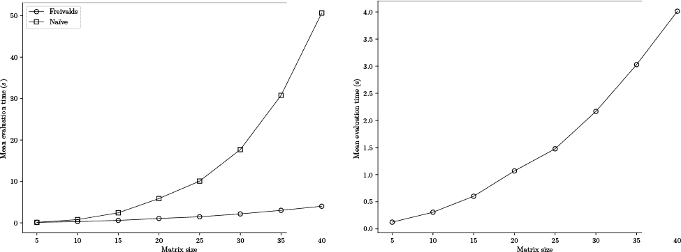

*图 11-2：将 Freivalds 算法的运行时间与朴素算法的运行时间对比，作为矩阵大小的函数（左），并单独绘制 Freivalds 算法的运行时间，以展示其* *(*n^(*2*)*)复杂度——请注意* y*轴范围（右）*

在 图 11-2 的左侧，我们可以看到随着矩阵大小的增加，Freivalds 算法与朴素算法之间运行时间的增长。朴素算法的复杂度为 (*n*³)，比 Freivalds 算法的 (*n*²) 增长得要快得多，后者单独显示在右侧。

性能提升与错误发生概率随 *n* 增加而减少的结合，使得 Freivalds 算法特别有用。是的，它是概率性的，但在最需要它的地方（大 *n*），它也最有可能是正确的。

在查看 *freivalds.py* 之前，我得做一个自白。我们可以做得比 (*n*³) 更好，特别是对于 *n* > 100 的矩阵。Volker Strassen 的 1969 年矩阵乘法算法具有约为 (*n*^(log[2] 7)) *≈* (*n*^(2.807)) 的运行时间，略好于朴素算法。基于 BLAS 库的 NumPy 利用了 Strassen 算法，这也是为什么我们在这一节中没有使用 NumPy。然而， (*n*²) 优于 (*n*^(2.807))，因此即使有 Strassen 矩阵乘法，Freivalds 算法仍然是有用的。

**银河算法**

还有比 Strassen 算法更具渐近行为的矩阵乘法算法。目前最好的算法具有复杂度 (*n*^(2.373)) 左右。然而，这些算法在实践中完全无用。这个看似矛盾的现象与大 O 表示法有关，大 O 表示法展示的是总体行为，但忽略了乘法因子和常数。这意味着，运行时间为 10*n*³ 的算法与运行时间为 10,000*n*³ + 10,000 的算法是一样的。两者的规模都是 (*n*³)，但在实践中，第一个更可能是有用的。

比 Strassen 算法在整体复杂度上更优的矩阵乘法算法，比如 *Coppersmith–Winograd* 算法，其常数非常大，只有当 *n* 大到远超过当前计算机能够处理的范围时（如果有可能的话），该算法才有实际意义。

这些算法被 Kenneth W. Regan 称为 *银河算法*。即使这些算法在渐近行为上是“最优的”，我们在实践中也无法有效使用它们。尽管这些算法在理论上很重要，但它们不会很快出现在我们的工具箱中。

##### **代码解析**

列表 11-5 包含了实现 Freivalds 算法的代码。`mmult` 函数在 列表 11-4 中。`array_equal` 函数会判断 ***A***(***Br***) 与 ***Cr*** 之间差值的绝对最大值是否低于 `eps`，如果是，返回 `True`。

```
def array_equal(a,b, eps=1e-7):
    return np.abs(a-b).max() <= eps

k = 0
m = 1000
s = time.time()
for i in range(m):
    A = 100*rng.random(N*N).reshape((N,N))
    B = 100*rng.random(N*N).reshape((N,N))
    C = A@B + 0.1*rng.random(N*N).reshape((N,N))
    if (mode == 0):
        t = True
        for j in range(reps):
            r = (2*rng.random(N)).astype("uint8").reshape((N,1))
            t &= array_equal(mmult(A,mmult(B,r)), mmult(C,r))
    else:
        t = array_equal(mmult(A,B), C)
    k += 1 if t else 0
print("%0.8f %0.3f" % (time.time()-s, k/m))
```

*列表 11-5：Freivalds 算法*

外部`for`循环执行 1000 次试验，每次使用随机选择的矩阵集。***C***是这样设置的，它永远不等于***AB***，因此每次调用`array_equal`都应返回`False`。

外部`for`循环的主体要么直接相乘***A***和***B***（`mode==1`），要么通过生成一个随机二进制向量`r`来使用 Freivalds 算法。注意，`r`被重新形状为*n*×1 的列向量，这是矩阵乘法所要求的。

内部的`for`循环每次应用 Freivalds 算法重复(`reps`)，并将结果与`t`进行与运算。与运算意味着，在进行`reps`次测试，每次使用不同的`r`向量后，只有当所有测试都给出错误结果时，`t`才会保持为真。每次测试都应该看到`array_equal`返回`False`，因为按设计***AB*** ≠ ***C***。一旦`t`变为`False`，它将在剩余的所有测试中保持`False`，因此即使`array_equal`返回正确结果，也会导致`t`具有预期的值。

如果在内部循环后`t`仍然为`True`，则说明试验失败，我们会增加`k`的值。所有试验完成后，我们将打印总运行时间以及 1000 次试验中失败的比例。

Freivalds 算法是一种蒙特卡洛算法，因为它可能会产生一个错误输出并声称***AB*** = ***C***，尽管实际情况并非如此，而且这种错误输出的概率是可以最小化的。

接下来，我们将转向另一类问题：要估算一个集合中物品的数量，是否有必要逐个计数？

### **动物计数**

生态学家通常希望知道某个特定物种在某一地区的数量，尽管逐一统计每只动物通常是不可能的。这时就需要使用*标记和再捕*方法，这是一种通过小样本来估算种群数量的策略。

在标记和再捕中，生态学家首先进入现场捕捉*n*只样本，然后进行标记并释放。过一段时间后，他们重新进入现场，再次捕捉动物，直到捕获到至少一只已标记的动物。如果他们捕获了*K*只动物，其中有*k*只被标记，那么他们现在就拥有了估算总体数量*N*所需的所有信息。他们通过使用比率来完成这个过程。

最初，生态学家标记了*N*动物中的*n*只，这意味着标记的动物占总体种群的比例为*n*/*N*。再捕阶段捕获了*K*只动物，其中有*k*只被标记。假设没有出生、死亡或迁徙，这两个比例应该大致相等，因此通过解这个方程得到*N*：


这个方程得出了*Lincoln-Petersen 种群估算*，因此是*N[L]*。

一种稍微少偏的种群估算（或如此声称）来自*Chapman 种群估算*：

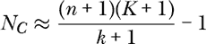

最后，我们采用贝叶斯方法来进行标记和再捕：

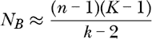

这种方法要求再捕组中至少有三只标记的动物，以避免除以零的情况。

让我们通过*mark_recapture.py*比较这三种对相同种群大小的不同估算方法：

```
> python3 mark_recapture.py
mark_recapture <pop> <mark> <reps> [<kind> | <kind> <seed>]
  <pop>  - population size (e.g. 1000)
  <mark> - number to mark (< pop)
  <reps> - number of repetitions 
  <kind> - randomness source
  <seed> - seed
```

代码通过随机标记指定数量的动物，然后重捕部分种群计算已标记的数量，来模拟标记和重捕的过程。我们先运行几次代码，熟悉输出。我们将真实种群大小固定为 1,000，并最初标记 100 个动物，即 10%。将重复次数设置为 1 时进行一次采样，这与生态学家在实际中可能做的相似。我们得到：

```
> python3 mark_recapture.py 1000 100 1 mt19937 11
Lincoln-Petersen population estimate = 1250
Chapman population estimate          = 1132
Bayesian population estimate         = 1633

> python3 mark_recapture.py 1000 100 1 mt19937 12
Lincoln-Petersen population estimate = 666
Chapman population estimate          = 636
Bayesian population estimate         = 753

> python3 mark_recapture.py 1000 100 1 mt19937 13
Lincoln-Petersen population estimate = 833
Chapman population estimate          = 783
Bayesian population estimate         = 980
```

估算值在每次运行中差异较大，这是我们从随机化算法中可以预期的结果。虽然林肯-彼得森和查普曼估算值通常较低，但贝叶斯估算值更接近真实种群大小，甚至超过了种群大小。

使用单次重复相当于试图从单个收集的数据点进行概括，因此我们增加重复次数：

```
> python3 mark_recapture.py 1000 100 25 mt19937 11
Lincoln-Petersen population estimate = 1028.4713 +/-  78.4623
Chapman population estimate          =  940.0367 +/-  61.6982
Bayesian population estimate         = 1345.2015 +/- 166.3078

> python3 mark_recapture.py 1000 100 25 mt19937 12
Lincoln-Petersen population estimate = 1052.0985 +/-  61.3198
Chapman population estimate          =  963.4317 +/-  49.9620
Bayesian population estimate         = 1345.9986 +/- 108.4192

> python3 mark_recapture.py 1000 100 25 mt19937 13
Lincoln-Petersen population estimate = 1112.8340 +/-  80.5759
Chapman population estimate          = 1009.5146 +/-  63.3742
Bayesian population estimate         = 1485.2546 +/- 169.0492
```

输出现在反映了 25 次重复的平均值和标准误差，提供了更好的估算行为概览。林肯-彼得森和查普曼的结果接近真实种群大小，而贝叶斯估算值则持续偏高。标准误差也具有说明性，贝叶斯的标准误差比其他两个估算器要大，表明试次之间的变化较大。

尝试不同的种群大小和最初标记的动物数量组合进行实验。

图 11-3 展示了三张有些拥挤的图表。

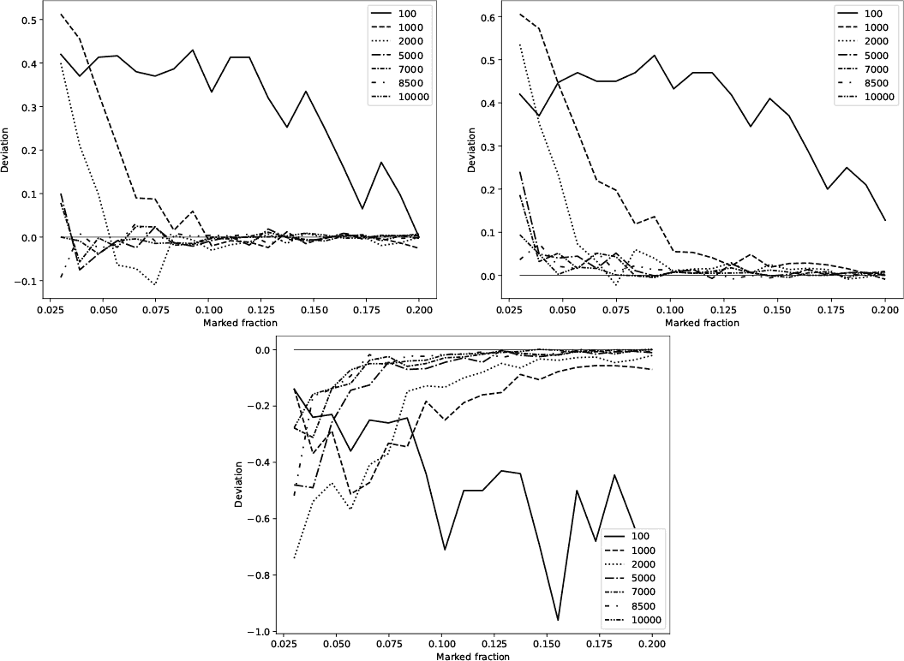

*图 11-3：三种标记重捕估算器作为真实种群大小和初始标记比例的函数。图中显示的是与真实种群大小的偏差：林肯-彼得森（左上）、查普曼（右上）和贝叶斯（底部）。*

在图 11-3 的左上方图表中，每条绘制的七条线代表不同的真实种群大小，范围从 100 到 10,000。*x*轴表示生态学家第一次去野外时标记的真实种群比例。所绘制的值是林肯-彼得森估算值与该组合下的真实种群大小之间的中位数偏差。如果曲线高于零，说明估算值偏低；低于零，则偏高。换句话说，图表显示的是*N*[真实] – *N*[估算]，因此低估为正差，过度估算为负差。其余两张图展示了查普曼（右上）和贝叶斯（底部）估算器的相同信息。

对于种群超过 1,000 的情况，林肯-彼得森估算器通常在初始标记超过 10%的种群时有效，但在实践中可能难以实现。然而，对于小型种群，该估算器需要标记约 20%的种群才能达到可靠性。可以使用模拟来基于怀疑的种群大小和最初标记的动物数量，生成林肯-彼得森估算器的修正函数。

查普曼估计器通常低估真实的种群数量，以至于人们开始质疑它与林肯-彼得森估计相比的实用性。然而，这种低估对于大于 1000 的种群来说是相对一致的，因此，同样可以通过模拟得出一个修正系数。

贝叶斯估计器的表现则截然不同。它总是高估实际的种群数量，只有当种群变大并且最初标记的百分比也较高（至少 15%）时，才会趋近于真实的种群值。在实际操作中，这些条件很难满足。

图 11-3 是*mark_recapture_range.py*的输出，可以通过查看清单 11-6 中*mark_recapture.py*的相关部分来理解。

```
lincoln = []
chapman = []
bayes = []

for j in range(nreps):
    pop = np.zeros(npop, dtype="uint8")
    idx = np.argsort(rng.random(npop))[:nmark]
    pop[idx] = 1

    K = nmark
    while (True):
        idx = np.argsort(rng.random(npop))[:K]
        k = pop[idx].sum()
        if (k > 2):
            break
        K += 5

    lincoln.append(nmark*K/k)
    chapman.append((nmark+1)*(K+1)/(k+1) - 1)
    bayes.append((nmark-1)*(K-1)/(k-2))
```

*清单 11-6：模拟标记和回捕估计*

外部的`for`循环遍历`nreps`处理试验。对于每个试验，我们创建一个种群（`pop`）向量，其中`npop`是从命令行输入的种群大小。该向量最初为零，因为我们还没有标记任何动物。

接下来的两行表示生态学家的第一次实地考察。`argsort`技巧结合只保留排序顺序中的前`nmark`个元素，将`idx`设置为生态学家最初捕获并标记的`pop`索引（`pop[idx]=1`）。

第二段代码表示回捕阶段，在该阶段，生态学家返回现场并捕获与最初标记的动物数量相同的动物（`K`）。我们通过在内部`while`循环中分配的`idx`中的`K`索引来表示被捕获的动物。

标记是二进制的，因此`pop`中所选元素的总和即为已标记动物的数量`k`。如果`k`大于或等于 3，则跳出`while`循环。否则，将`K`增加 5 并再次尝试。最后一段代码计算该试验中真实种群数量的三个估计值。

当外部`for`循环退出时，我们得到了三个关于给定种群大小和最初标记数量的估计向量。*mark_recapture.py*的其余部分显示了结果。根据模拟结果，我的偏好是林肯-彼得森估计器。

让我们从计数转向数学上重要的任务——素性测试。

### **素性测试**

素数——只能被自己和 1 整除的整数——深受数论学者的喜爱。自古以来，素数就吸引着人类的目光，目前大量计算能力被用于寻找*梅森素数*，其形式为 2*^p* – 1，其中*p*是素数。

已知最大的素数是梅森素数。截止到目前，已知的最大梅森素数是 2018 年发现的：

*M*[82,589,933] = 2^(82,589,933) − 1

*M*[82,589,933]是一个 24,862,048 位的数字。梅森素数有时用其编号而非指数表示。因此，*M*[82,589,933]，即第 51 个梅森素数，可能被表示为*M*[51]。

**注意**

*要为寻找梅森质数贡献力量，访问* [`www.mersenne.org`](https://www.mersenne.org) *并注册加入“大型互联网梅森质数搜索”计划。*

我们如何知道 *n* 是质数？定义为我们提供了一个自然的起点用于质数测试算法：如果唯一能整除 *n*（结果没有余数）的数字是 1 和 *n*，那么 *n* 就是质数。

让我们将这个定义转化为一个算法。蛮力法是测试每个可能是 *n* 因子的数字。实际上，这意味着要测试每个整数直到 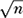，因为任何大于  的 *n* 因子必定会与某个小于  的数字相乘，并在到达  之前就被发现。

当考虑到包含接近 2500 万个数字的数字时，所涉及的工作量会急剧增加。如果 *n* 是质数，我们是否需要测试每一个整数直到 ？

*米勒-拉宾测试* 是一种快速的随机算法，用于判断一个正整数 *n* 是否为质数。然而，要理解米勒-拉宾测试，我们需要了解一些关于模运算的知识。

#### ***模运算***

我们习惯于整数集合，表示为 ℤ，来自德语“Zahl”（数字）。整数是无限的，从零向两边无限延伸。如果我们将范围限制为集合 {0, 1, 2, 3}，我们可以通过需要时进行“回绕”来定义该集合上的算术运算。当和小于 4 时，加法按预期进行：1 + 1 = 2 和 2 + 1 = 3。然而，如果和超过 4，我们就会回绕。例如，2 + 3 = 1，因为 2 + 3 = 5，我们从 5 中减去 4 得到 1。另一种看待这些运算的方式是，在每次加法后应用模运算符，返回除以 4 后的余数。例如，5 mod 4 = 1。

皮埃尔·费尔马，17 世纪的法国数学家，意识到如果 *n* 是质数，那么

*a*^(*n* – 1) ≡ 1 (mod *n*), 0 < *a* < *n*

其中 ≡ 表示：

*a*^(*n* – 1) mod *n* = 1 mod *n* = 1

太好了！我们有了一个质数测试：选择一个整数 0 < *a* < *n*，将其升到 *n* – 1 次方，再除以 *n*，看看余数是否为 1。如果是，那么 *n* 就是质数，所以算法有效并且能够识别 *n* 为质数。然而，一些合成数也会通过这个测试，对于许多 *a* 值，这意味着单靠这个测试不足以证明 *n* 是质数。如果测试失败，则 *n* 绝对不是质数。

米勒-拉宾测试结合了费尔马的测试和另一个事实——如果 *n* 是质数，那么以下公式也可能成立

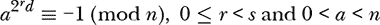

对于某个 *r* 在 [0, *s*) 范围内，其中 *n* = 2*^sd* + 1 且 *d* 是奇数。这是可能成立的，因为有时即使 *n* 是合成数，也会存在满足该同余关系的 *a* 值。我们稍后将讨论这些非见证数。

第一个条件，费马测试，足够简单，但让我们来拆解第二个条件。我们需要将 *n* 表示为 2*^sd* + 1，或者等价地，表示为 *n*–1 = 2*^sd*。对于适当选择的 *s* 和 *d*，2*^sd* 是费马条件中指数的另一种表示方式。

≡ –1 (mod *n*) 中的所有数学运算都是模 *n* 运算，这意味着数字位于集合 {0, 1, 2, . . . , *n* – 1} 中，通常表示为 ℤ*[n]*。我们将负数视为倒数计数，因此 –1 ≡ *n* – 1。

第二个条件检查是否存在某个 *x* 使得 *x*² ≡ –1 (mod *n*)。Miller-Rabin 测试使用一系列这样的 *x* 值，寻找一个当模 *n* 平方时结果为 –1（即 *n* – 1）。序列从 *r* = 0 和 *d* 作为指数开始。下一个检查使用平方，实际上是 *r* = 1：

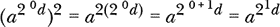

这一切都是模 *n* 运算。接下来的平方操作返回 *r* = 2，依此类推。

如果这种表达式序列中的任何一个等于 *n* – 1，那么 *n* 具有相当高的概率是一个素数。否则，*n* 绝对不是素数，而 *a* 是这一事实的 *见证*。

#### ***Miller-Rabin 测试***

让我们把 Miller-Rabin 实现成代码，如 列表 11-7 所示。

```
def MillerRabin(n, rounds=5):
    if (n==2):
        return True
    if (n%2 == 0):
        return False

    s = 0
    d = n-1
    while (d%2 == 0):
        s += 1
        d //= 2

    for k in range(rounds):
        a = int(rng.random()) # [1,n-1]
        x = pow(a,d,n)
        if (x==1) or (x == n-1):
            continue
        b = False
        for j in range(s-1):
            x = pow(x,2,n)
            if (x == n-1):
                b = True
                break
        if (b):
            continue
        return False
    return True
```

*列表 11-7：Miller-Rabin 代码实现*

函数 `MillerRabin` 接受 *n* 和 `rounds`，默认值为 5。第一段代码捕获了琐碎的情况。由于一半的数字是偶数，直接测试 2 和偶性可以节省时间。

第二段代码定位 *s* 和 *d* 使得 *n* = 2*^sd* + 1。对于任何 *n*（正整数），总是可以找到一个 *s* 和 *d* 的分解。

目前，我们将重点关注第三段中的外层 `for` 循环部分，该部分实现了对随机选择的 *a* 和初始 *x* 值 *a^d* (mod *n*) 的 Miller-Rabin 测试。

内置的 Python 函数 `pow` 计算指数，并接受一个可选的第三个参数，因此 `pow(a,d,n)` 可以高效地实现 *a^d* (mod *n*)。

以下的 `if` 检查是否为 1 或 –1。如果是这种情况，则费马测试通过，因此这一轮外层 `for` 循环结束。

否则，内层 `for` 循环开始执行 *x* = *a^d* 的连续平方序列，同时寻找一个等于 –1 的结果。如果找到这样的平方，内层循环将中断，外层循环继续；否则，*n* 是合数，`MillerRabin` 返回 `False`。

当所有轮次（`k` 的循环）完成，并且每个测试都支持 *n* 是素数的假设时，`MillerRabin` 返回 `True`。

外部的`for`循环应用了米勒-拉宾测试，重复地为随机选择的*a*值进行测试。由于一个*a*值能够证明*n*是复合数的，它是一个见证数，而一个*a*值导致在*n*不是质数时错误地宣称它是质数的则是一个*非见证数*。对于给定的*n*，不可能所有的*a*值都是非见证数，因此多次应用外部循环主体可以最小化非质数输入返回`True`的概率。

你可以在文件*miller_rabin.py*中找到`MillerRabin`。它需要一个待测试的数字、测试轮数（即要尝试的*a*值数量）以及随机数源：

```
> python3 miller_rabin.py
miller_rabin <n> <rounds> [<kind> | <kind> <seed>]
  <n>      - number to test
  <rounds> - number of rounds
  <kind>   - randomness source
  <seed>   - seed
```

例如：

```
> python3 miller_rabin.py 73939133 1
73939133 is probably prime
> python3 miller_rabin.py 73939134 1
73939134 is composite
```

对于这些情况，输出必须是正确的，因为 73,939,133 是质数，并且最接近的两个质数之间相差 2：

```
> python3 miller_rabin.py 8675309 1
8675309 is probably prime
> python3 miller_rabin.py 8675311 1
8675311 is probably prime
```

8,675,309 和 8,675,311 是孪生质数，因此测试是正确的。

米勒-拉宾始终将质数标记为质数。让我们探讨米勒-拉宾何时会失败。

#### ***非见证数***

如前所述，见证数*a*证明*n*不是质数。此外，对于某些复合数，如果米勒-拉宾测试选择了一个非见证数作为*a*，测试将失败。

我们将通过使用一个已知的非见证数集来强制米勒-拉宾算法失败，以查看是否能够检测到预期的失败次数。

我们的目标是*n* = 65。作为 5 的倍数，65 是复合数。共有 64 个潜在的见证数，从 1 到 64。这些潜在见证数中，已知 8、18、47、57 和 64 是非见证数。如果米勒-拉宾测试进行一次并选择了一个非见证数作为*a*，它将失败并错误地宣称 65 是质数。

由于在 64 个可能的数字中有五个非见证数，因此米勒-拉宾测试在单轮情况下应该大约有 5/64 = 7.8%的时间失败。我通过运行*miller_rabin.py* 1,000 次，并统计输出显示为质数的次数，发现恰好有 78 次，意味着失败率为 78/1,000 = 7.8%。

最坏情况下，米勒-拉宾单轮失败的概率对于任意的*n*为 1/4。由于每一轮与前一轮是独立的，运行*k*轮测试意味着最坏的失败概率为(1/4)*^k* = 4^(-*k*)。然而，对于大多数*n*值，实际的失败概率远低于这个值。

让我们继续使用 65。知道它的单轮失败率大约为 7.8%，运行两轮应该大约有(5/64)² ≈ 0.61%的时间失败。运行*miller_rabin.py* 20,000 次，得到了 131 次失败，失败率为 131/20,000 = 0.655%。三轮测试的失败率大约为 0.05%。我们可以通过将*k*设置得足够高来达到任何期望的精度。

#### ***米勒-拉宾性能***

让我们将 Miller-Rabin 的运行时表现与在*brute_primes.py*中实现的暴力方法进行比较。*prime_tests.py*中的代码同时运行 Miller-Rabin 和暴力算法，测试最大 1 位、2 位、3 位……到 15 位的质数。回想一下，当输入是质数时，暴力算法的运行时间最长。

最大的单数字质数是 7，而最大的 15 位质数是 999,999,999,999,989。在图 11-4 中，我们绘制了对每个质数进行五次运行的*miller_rabin.py*和*brute_primes.py*的平均值，以展示随着输入增大，运行时间的变化。

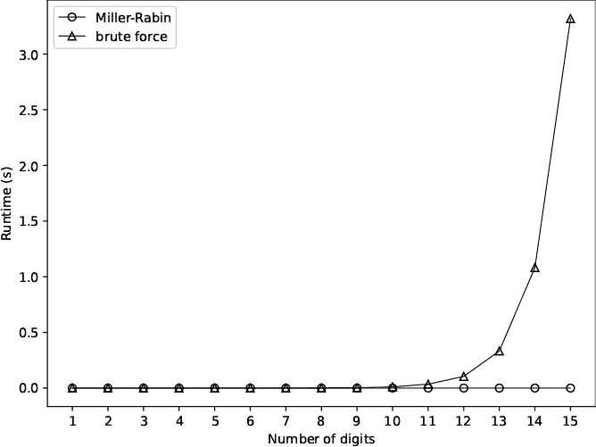

*图 11-4：比较 Miller-Rabin 与暴力质数测试*

暴力算法的运行时复杂度是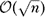，而 Miller-Rabin 的运行时复杂度是(log³ *n*)。尽管暴力算法是次线性的，但它很快变得不可管理，因为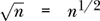且 1/2 < 1。

Miller-Rabin 是一个蒙特卡罗算法，因为它声称*n*是质数，即使在*n*不是质数时仍有非零的概率。如果*n*确实是质数，Miller-Rabin 总是正确地标记它，但它也会错误地将一些合成数标记为质数，无论循环次数多少。因此，Miller-Rabin 的假阳性率是非零的，但其假阴性率为零。然而，在实际应用中，增加轮次可以使假阳性率降低到任何期望的水平。

我们还有一个随机化算法需要考虑。

### **使用快速排序**

快速排序由英国计算机科学家 Tony Hoare 于 1959 年开发，可能仍然是最广泛使用的排序算法。例如，它是 NumPy 的默认排序算法。

如果你参加本科的算法课程，你几乎肯定会接触到快速排序，因为它实现简单且容易理解，即使它是递归的。虽然大多数课程都会专注于表征其运行时复杂度，我们将以更高的层次讨论该算法，并对两种版本进行实验：标准的非随机版本和随机版本。

快速排序是一种递归的*分治*算法，这意味着它会在更小的子问题上反复调用自身，直到遇到基本条件为止，此时实现会将所有部分重新组合，输出排序结果。

算法如下：

1.  如果输入数组为空或仅包含一个元素，直接返回它。

1.  选择一个*基准*元素，可以是数组中的第一个元素或随机选取。

1.  将数组分成三个子集：小于基准元素的、等于基准元素的以及大于基准元素的。

1.  返回快速排序对较小元素、与基准相等的元素以及较大元素进行排序后的拼接结果。

第 1 步是基本条件。如果数组为空或只包含一个元素，那么它就是已排序的。第 2 步选择一个枢轴值，这是我们在第 3 步中用来将数组划分为三部分的元素：小于、等于和大于枢轴的部分。第 2 步是随机性发挥作用的地方。非随机快速排序总是选择数组中的特定元素，因为它已假设数组是随机排序的。然而，随机快速排序会随机选择枢轴元素。我们将实验非随机快速排序和随机快速排序之间的微妙差异。

第 4 步是递归部分。如果我们将已排序的低区间与相同的区间合并，再加上已排序的高区间，数组就会被排序。我们通过使用排序例程来排序低区间和高区间，也就是再次调用快速排序（Quicksort）。我们假设每次调用数组的一部分时，处理的元素数量会逐渐变少，直到最终每个部分只有一个元素，这是第 1 步的基本条件。

天真的排序方法，如冒泡排序或侏儒排序，运行时间是 (*n*²)，其中*n*是要排序的元素个数。正如我们所了解的那样，(*n*²) 算法适用于小*n*值，但随着*n*的增加，性能会迅速变得无法管理。快速排序的平均运行时间复杂度是 (*n* log *n*)，增长速度较慢。因此，尽管快速排序是在 50 多年前引入的，但至今仍被广泛使用。

虽然快速排序的*平均*时间复杂度是 (*n* log *n*)，但如果传递给快速排序的数组已经大部分或完全排序，那么复杂度会变成 (*n*²)，这和冒泡排序一样，效果并不好。这种情况发生在数组已经按顺序或逆顺序排列时。让我们来看看随机快速排序是否能帮我们解决这个问题。

#### ***在 Python 中运行快速排序***

文件*Quicksort.py*实现了两次快速排序。第一次实现使用一个随机枢轴（`QuicksortRandom`），第二次实现总是使用数组的第一个元素作为枢轴（`Quicksort`）。这些函数位于清单 11-8 中。

```
def QuicksortRandom(arr):
    if (len(arr) < 2):
        return arr
    pivot = arr[np.random.randint(0, len(arr))]
    low  = arr[np.where(arr < pivot)]
    same = arr[np.where(arr == pivot)]
    high = arr[np.where(arr > pivot)]
    return np.hstack((QuicksortRandom(low), same, QuicksortRandom(high)))

def Quicksort (arr):
    if (len(arr) < 2):
        return arr
    pivot = arr[0]
    low  = arr[np.where(arr < pivot)]
    same = arr[np.where(arr == pivot)]
    high = arr[np.where(arr > pivot)]
    return np.hstack((Quicksort(low), same, Quicksort(high)))
```

*清单 11-8：随机和非随机快速排序*

在这个例子中，我们使用 NumPy 而不是我们的`RE`类，因为 NumPy 已经加载，这样可以最小化调用`QuicksortRandom`时的开销。两者的实现唯一的区别在于如何分配`pivot`。

两种实现都遵循快速排序算法的每一步。首先，我们检查基本条件，即`arr`已经排序。然后，根据选定的`pivot`将数组分为`low`、`same`和`high`。最后，NumPy 的`hstack`函数将递归调用`Quicksort`返回的向量进行拼接。

一个高性能的实现不会调用`where`三次，因为每次都会对`arr`进行一次完整的遍历，但我们这里只关心随着输入大小变化，性能之间的相对差异。

#### ***实验快速排序***

文件*quicksort_tests.py*生成了两张图。第一张，位于图 11-5 的左侧，比较了随机化快速排序和非随机快速排序随着输入数组大小增加的表现。在所有情况下，输入数组都是随机顺序的。因此，图 11-5 的左侧代表了平均情况运行时。绘制的点是五次运行的均值。虚线表示*y* = *n* log *n*。

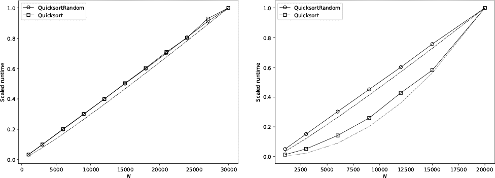

*图 11-5：随机化和非随机快速排序在随机输入下（左）以及相同算法在病态输入下（右）的表现*

图 11-5 中最右侧的图展示了已经排好序的输入情况下的运行时间。这个情况迫使确定性快速排序变成了一个(*n*²)算法，这就是它跟随曲线*y* = *n*²的原因。另一方面，随机化快速排序不受输入顺序的影响，仍然按之前的方式运行。

正确解读图 11-5 需要一些解释。算法的渐进运行时性能忽略了乘法因子和常数，因为它们不会改变随着*n*增大时函数的整体形式。随机化快速排序的运行时间比非随机快速排序稍长，因为它需要额外的一步：选择数组中的一个随机索引。因此，将两者的运行时间一起绘制会使得我们不容易看到`QuicksortRandom`和`Quicksort`之间的总体函数形式是相同的。此外，绘制*y* = *n* log *n*时，*y*轴的数值尺度完全不同，但函数的形式仍然相同。因此，为了将三者一起绘制，图 11-5 将每个*y*值除以最大*y*值，将输出映射到[0, 1]，无论实际范围如何。这清晰地表明，随机化快速排序和非随机快速排序的规模是一样的，且都遵循(*n* log *n*)——所有曲线基本重合。

现在重新考虑图 11-5 右侧的情况，即输入数组已经排好序。再次地，虚线表示*y* = *n* log *n*，随机化快速排序仍然遵循这一形式。然而，非随机快速排序，它将数组的第一个元素作为基准元素，却并不遵循这一形式。相反，它遵循虚线*y* = *n*²，这意味着这种病态输入情况改变了非随机快速排序，使其变成了一个(*n*²)算法。

随机化快速排序是一种拉斯维加斯算法，因为它总是返回正确的输出——一个已排序的数组。尽管涉及的随机性不会使实现变得更容易，但它能够避免一个在实践中比我们最初预期的更常见的病态情况。因此，我推荐总是使用随机化快速排序。

要理解为什么非随机快速排序在已排序的输入上表现如此糟糕，可以考虑当枢轴是数组中最小的值时会发生什么；例如，当选取第一个元素作为枢轴并且输入数组已经排序时会发生什么。发生这种情况时，低向量为空，并且忽略枢轴的重复值，数组中剩余的所有值都进入高向量。每次函数递归时都会发生这种情况，将递归转化为*n*层深的函数调用列表。将每次递归调用中通过数组的(*n*)次（通过`where`隐式实现），我们得到了一个(*n*²)的算法，这与冒泡排序一样差。

在每一层选择一个随机的枢轴，可以确保长期来看这种情况不会发生，因为这就相当于进行*n*次* n *面公正骰子掷骰，每次都掷出 1—这随着*n*的增加会变得越来越不可能。

### **练习**

考虑以下练习，进一步探索随机化算法：

+   编写一个拉斯维加斯算法，定位满足*a*² + *b*² = *c*²的正整数*a*、*b*和*c*。你的代码将是一个拉斯维加斯算法，因为有无数的解，即所有的毕达哥拉斯三元组。

+   你能编写一个成功的拉斯维加斯程序，找到正整数*a*、*b*和*c*，使得存在某个*n* > 2，满足*a^n* + *b^n* = *c^n*吗？如果不能，那么一个蒙特卡洛算法如何？你的停止标准可能是什么？我建议搜索“费马最后定理”。

+   扩展排列排序的运行时间图，考虑*n* = 11、12 甚至 13 的情况。你需要等多久？

+   绘制 Freivalds 算法失败案例的平均试验次数图，作为* n *的函数，表示方阵的大小。

+   文件*test_mmult.py*生成适合从第四章的*curves.py*的输出。使用该输出和*curves.py*生成拟合。拟合的指数是你对朴素算法的预期吗？那么对于使用 Strassen 算法的 NumPy 呢？

+   我有一个装满弹珠的袋子。我想估算袋子里有多少个弹珠。因此，我随机挑选一个，做标记后放回袋子中。然后我再随机挑选一个弹珠，做标记后放回袋子中。我重复这个过程，计算所选弹珠的数量，直到我挑选到一个已经标记过的弹珠。如果所挑选并标记的弹珠数量是*k*，那么袋子里的弹珠数量大致为！Image

    其中，左边的下取整符号（⌊）和右边的上取整符号（⌉）表示“舍入到最接近的整数”。我通过一个简短的描述了解了这个算法，但该描述没有推导公式，也没有引用文献。尽管如此，它还是起作用的。在进行了一些实验后，我发现如果稍微调整公式，它的估算会更好，调整后的公式是：

    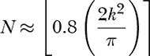

    实现这个算法并探索它的平均效果。然后查看*count.py*，该程序运行算法进行多次迭代，计算结果的平均值并生成图表。例如

    ```
    > python3 count.py 1_000_000_000 40 pcg64 6502
    N = 1023827699, iterations 41414, total 1656576
    ```

    估算袋中略多于 10 亿颗弹珠。正确的数量恰好是 10 亿。它使用了 40 次算法迭代，总共标记了 170 万个弹珠。图 11-6 是结果图，*count_plot.png*，显示了 40 次估算的结果、真实值（实线）和总体估算（虚线）。

    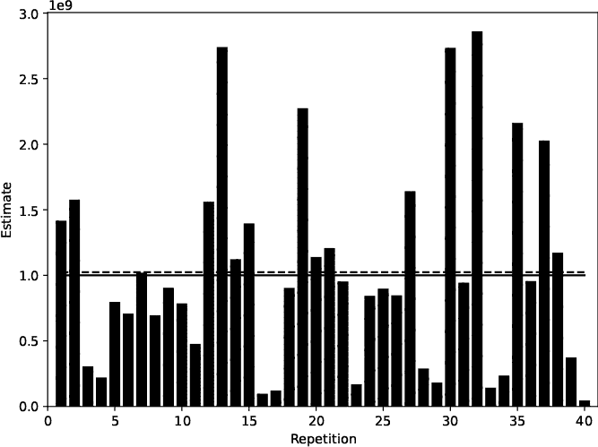

    *图 11-6：40 次弹珠估算*

    如果你知道这个算法的参考文献或如何推导估算公式，请与我联系。

+   你能想到一种“修正因子”来调整林肯-彼得森人口估算方法吗，尤其是在认为总体较小时的情况？

+   非随机快速排序的运行时性能如何随数组的无序程度增加而变化？为了弄清楚这一点，固定数组大小（*n*），但改变数组的无序程度。例如，先从一个已排序的数组开始，然后交换两个元素，再交换三个，依此类推。从(*n*²)到(*n* log *n*)的过渡，随着交换元素的数量增加，是否呈现线性变化？还是说它看起来更为快速？

### **总结**

在这一章中，我们探讨了随机化算法，区分了拉斯维加斯算法和蒙特卡洛算法。前者最终总是能产生正确的输出，而后者可能会产生不正确的输出。我们考虑了排列排序和弗雷瓦尔兹算法来测试矩阵乘法。我们了解到，通过对考虑的候选排列数量施加限制，我们可以将排列排序从拉斯维加斯算法转变为蒙特卡洛算法。一般来说，我们可以将拉斯维加斯算法转化为蒙特卡洛算法，但反之则不可。

接着，我们讨论了生态学家用来估计动物种群的标记和重捕算法。我们通过标记已知数量的动物，然后重捕动物并观察标记的数量来估计种群中动物的数量。通过足够的数量，标记动物与重捕动物的比例应该与最初标记的动物与种群总数的比例相匹配。我们探索了与这一过程相关的三种估算器，并观察了它们的表现。

米勒-拉宾算法能够快速判断一个正整数是否是质数。然而，作为一种随机化算法，它有一定的概率错误地将合数判定为质数。我们学习了通过反复应用该算法来减少假阳性的可能性。

我们通过比较非随机和随机化快速排序的实现来结束这一章。随机化快速排序对运行时间几乎没有影响，同时能够防止已经（或大部分）排序的病态输入。

在我们的最后一章，我们将考虑随机性与从概率分布中抽样的关系。
