## **抽样**


我们的大多数实验都通过从均匀分布中提取样本来进行。虽然我们也使用过正态分布（第一章）、贝塔分布（第三章）和二项分布（第九章），但经得起时间考验的均匀分布仍是我们最古老且最亲密的朋友。

在本章中，我们将从任意概率分布中抽样，无论是离散的还是连续的。这一能力对模拟至关重要，也是贝叶斯推断的基础。

首先，我们将讨论术语并解析术语*贝叶斯推断*。接下来，我们将深入探讨从任意离散概率分布中抽样，首先是一维的，然后是二维的。

在处理完离散分布后，我们将继续通过逆变换抽样、拒绝抽样以及使用 Metropolis-Hastings 算法的马尔可夫链蒙特卡罗抽样来从连续分布中抽样。

这可能是我们最数学化的一章，但不要因此感到困惑。如果你想继续探索这些算法或将它们应用于不同的情况，代码才是最重要的。

### **抽样简介**

在深入讨论抽样之前，让我们先达成一致，了解一些术语及其所包含的概念。我们还将介绍与贝叶斯统计和推断相关的概念，后者是抽样算法发展的主要推动力和受益者。

#### ***术语***

如果我们掷一个标准的骰子，结果可能是六个输出中的一个，每个结果出现的概率相等。我们将这种分布表示为一个条形图，图中的条形标记为 1 至 6，每个条形的高度相等，对应于 1/6 的分数。每个条形所代表的分数的总和为 1，因为该图是离散概率分布。

*概率质量函数 (PMF)* 告诉我们任何离散结果的概率。对于标准骰子，PMF 是每个结果的 1/6。对于二项分布，PMF 取决于试验次数（*n*）和每次试验中事件发生的概率（*p*），公式如下：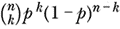。这里的 *k*，*k* = 0, . . . , *n*，是* n *次试验中事件发生的次数。可以将连续情况看作是将离散情况扩展到更多的可能结果；例如，一个条形图，其中条形逐渐变窄，直到它们的宽度变得无穷小。谈论无穷小通常意味着微积分，正如这里所示。离散分布转变为连续分布，从而：

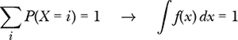

这里，*f*(*x*)是*概率密度函数 (PDF)*，它是概率质量函数的连续类比。符号 *P*(*X* = *i*) 表示随机变量 *X* 取值 *i* 的概率。

*∫*符号只是一个老式的“S”字母，代表“求和”。求和的对象是由宽度为*dx*（一个实体，而不是*d*与*x*的乘积）和高度为*f*(*x*)的矩形所形成的无限多个面积，即在*x*处的 PDF 函数值。如果给定了限制条件，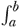，求和就是对从*x* = *a*到*x* = *b*的*x*进行求和。如果没有给定限制条件，意味着“对所有有意义的*x*求和，即使是从–*∞*到+*∞*。”

对离散分布进行抽样，返回*x*的概率是*P*(*X* = *x*)，即与标记为*x*的条形图相关的概率。抽样连续分布并得到特定*x*的概率，反直觉地是*P*(*x*) = 0，对于任何实数*x*都成立。我们不能讨论返回*x*作为样本的概率，而是讨论样本落在某个范围[*a*, *b*]中的概率。这个概率是：

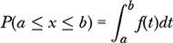

这不过是从*a*到*b*之间 PDF 下的面积。积分中的变量是虚拟变量。我从*x*换成了*t*，以避免与我们在方程左边讨论的*x*混淆。

在连续情况下，我们必须讨论某个范围的概率，因为并不是所有的无穷大都是相同的，这一点是 19 世纪乔治·康托尔首次意识到的。由于实数比整数多得多，从连续分布中选择任何一个实数的概率实际上是零。虽然本章的算法返回的样本看起来像是来自所需的连续分布，但不要被迷惑。像所有计算一样，我们永远不会使用实数，而是以某种形式使用有理数。最终，我们的样本近似于所需的连续概率分布。然而，正如他们所说的，如果它走起来像只鸭子，叫起来像只鸭子，那它就是只鸭子——或者至少是一个合理有用的类似物。

PMF 和 PDF 与从分布中抽取特定值的概率有关。一个相关的概念是*累积分布函数（CDF）*，我们用于离散分布和连续分布。在*x*处的 CDF 是从 PMF 或 PDF 的最小值到*x*之间的面积总和。如果我们对离散分布的所有条形图进行求和，或者对所有 PDF 进行积分，我们得到的面积为 1，因此 CDF 是一个从左侧的 0 到右侧的 1 的函数，随着*x*的增大而变化。

例如，图 12-1 显示了一个二项分布的 PMF（左上）和 CDF（右上），其中*n* = 10 次试验，每次的概率*p* = 0.7。底部则是标准正态分布的 PDF 和 CDF。在这两种情况下，CDF 都从左侧接近 1。

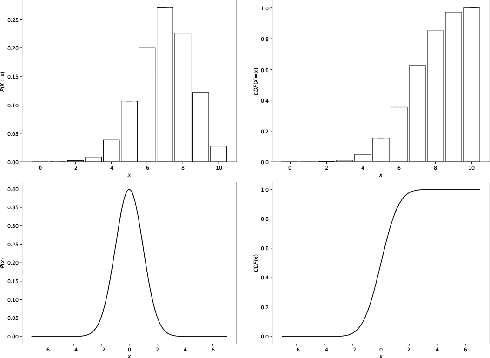

*图 12-1：二项分布的 PMF 和 CDF（上）与标准正态分布的 PDF 和 CDF（下）*

生成图 12-1 的代码在*cdf.py*中，它展示了如何将纯数学转化为代码，至少在概率函数方面是这样。我会跳过代码的绘图部分；有关其余相关代码，请参见列表 12-1。

```
np.random.seed(8675309)
z = np.random.binomial(10,0.7,size=10000)
h = np.bincount(z, minlength=11)
h = h / h.sum()
cdf = np.cumsum(h)

np.random.seed(73939133)
x = np.linspace(-7,7,10000)
y = (1/np.sqrt(2*np.pi))*np.exp(-x**2/2)
cdf = np.cumsum(y*(x[1]-x[0]))
```

*列表 12-1：从 PMF 和 PDF 生成 CDF*

第一段代码从二项分布中生成样本。为了节省时间，我使用了 NumPy 的函数来抽取 10,000 个随机样本，这意味着`z`是一个包含 10,000 个值的向量，每个值是从二项分布中随机选取的样本。为了得到分布本身，我们需要一个直方图。样本在`z`中是整数，因此获取计数的最有效方法是使用`bincount`方法。实验次数为*n* = 10，但可能的结果有 11 种，从 0 次事件到 10 次事件，因此在调用`bincount`时，`minlength=11`。

让我们来看一下`h = h / h.sum()`这一行。`bincount`方法返回每个结果的计数。我们想要一个离散的概率分布，它的总和必须为 1，因此我们将每个计数除以总和，将它们转换为相加为 1 的分数。因此，`h`现在是*n* = 10 和 *p* = 0.7 的离散二项分布的*估计值*。为了更好地估计真实的二项分布，可以将样本数量增加到 20,000 个或更多。

离散分布的 CDF 是每个结果概率的累加和。换句话说，

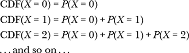

NumPy 的`cumsum`为我们计算这个累积和，以便在一次函数调用中生成整个 CDF。

连续情况类似，尽管我们不需要从中抽样，因为正态分布的 PDF 有封闭形式的表示。对于标准正态分布（*µ* = 0, *σ* = 1），PDF 为：

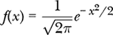

在代码中，我们使用从–7 到 7 之间均匀分布的 10,000 个*x*值（`linspace`）来估计这个函数（`y`）。

然而，要估计 CDF，我们不能像离散情况那样简单地将`y`中的值相加。PDF 下的面积必须为 1，但因为它是一个面积，我们将每个*y*值乘以它与*x*轴之间矩形的宽度。矩形的宽度是相邻`x`值之间的差异，因此在求和之前，我们将`y`乘以`x[1] - x[0]`。不需要缩放`y`，因为`y`中的值是实际的 PDF 值，而不是计数。

本章的目标是从任意分布中抽样，其中“抽样”意味着我们要求一个分布根据可能输出的概率给我们一个数字。分布在 PMF 或 PDF 图中的*y*轴值越高，oracle 选择该数字（离散的）或该位置附近非常窄范围内的数字（连续的）概率就越高。

例如，*nselect.py* 中的代码生成了 图 12-2 中的图形，其中 *x* 轴上的黑点表示来自正态分布的 30 个样本。

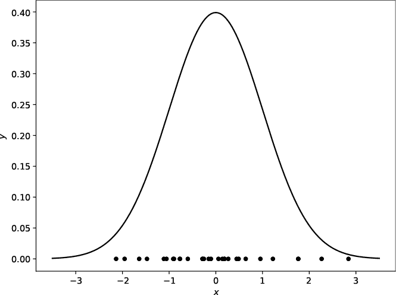

*图 12-2：来自标准正态分布的 30 个样本*

样本集中在 PDF 的中心附近——最有可能被采样的区域。当我们绘制更多样本时，它们在 *x* 轴上的密度与被选择的概率成正比。通过直方图将密度转换为计数，近似 PDF 本身。

现在，让我们讨论贝叶斯推断，因为它的应用依赖于从复杂的概率分布中高效地采样。

#### ***贝叶斯推断***

英国部长托马斯·贝叶斯（1701–1761）提出了一个看似简单的方程，最近它颠覆了统计学的世界。推导这个方程是一个基本概率理论的练习。

我们将事件 *B* 发生的概率表示为，已知事件 *A* 已经发生，即 *P*(*B*|*A*)。这是给定 *A* 的条件概率 *B*。事件 *A* 发生的概率是 *P*(*A*)，而 *B* 和 *A* 同时发生的概率是它们的 *联合概率*，即 *P*(*A*, *B*)。

概率论指出，*P*(*B*, *A*) = *P*(*B*|*A*)*P*(*A*)，反过来交换事件的顺序，我们得到 *P*(*A*, *B*) = *P*(*A*|*B*)*P*(*B*)。联合概率表示所有事件组合的概率，这意味着 *P*(*B*, *A*) = *P*(*A*, *B*)。将这些观察结果结合起来告诉我们：

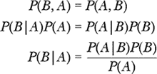

最终的方程是 *贝叶斯定理*，它将 *后验概率* *P*(*B*|*A*) 与 *似然* *P*(*A*|*B*) 和 *先验概率* *P*(*B*) 的乘积相关联。右侧分母 *P*(*A*) 是 *证据*，它是一个归一化值，用来确保后验概率是一个概率——即后验的 PDF 总和为 1。在实践中，*P*(*A*) 成为一个通常无法以闭式表达的积分。在贝叶斯建模中，似然和先验概率是选择并已知的函数形式，但证据变得难以处理。这就是我们将要讨论的采样方法派上用场的地方。从后验分布中抽取样本就是 *贝叶斯推断*。没有先进的采样方法，贝叶斯推断几乎是不可能的；有了这些方法，贝叶斯推断就变成了一种范式转变，正如 Sharon Bertsch McGrayne 在她的著作《那不死的理论》（耶鲁大学出版社，2011）中所指出的：

贝叶斯与马尔可夫链蒙特卡洛（MCMC）的结合被称为“可能是有史以来为处理数据和知识创造的最强大的机制”。

马尔可夫链蒙特卡洛（MCMC）是我们将在本章探讨的采样算法之一。虽然我们在 第十一章 中已经认识到蒙特卡洛方法，但我们将在适当的时候讨论马尔可夫链的部分。

让我们从任意分布开始采样。

### **离散分布**

一个任意的一维离散概率质量函数可能是这样的：

*p[X]*(*x*) = [1, 1, 3, 4, 5, 1, 7, 4, 3]

虽然这可能出乎意料，但对我们而言，这是一个完全有效的 PMF，表示为 Python 列表。它说明了一个返回 0 到 8 范围内样本的分布（该列表有九个元素），每个样本返回 PMF 中的一个索引。就目前而言，PMF 并未*归一化*，因此“概率”的总和不是 1；它是 1 + 1 + 3 + 4 + 5 + 1 + 7 + 4 + 3 = 29。为了得到概率，我们需要将每个数字除以这个总和。

PMF 告诉我们，每个值——从 0 到 8——出现的比例，经过大量采样后，它们的出现频率。例如，6 出现的次数是 0 的 7 倍，因为 6 与 0 的比例是 7 : 1。同样，6 与 7 的比例是 7 : 4，依此类推。

让我们计算采样 6 的概率（7/29）与采样 0 的概率（1/29）之间的比率：

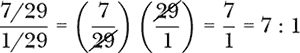

结果符合预期。

本节探讨了三种从任意离散分布中采样的方法。两种方法期望 PMF 已归一化（总和为 1），而第三种方法使用作为整数比率表示的 PMF。这看起来可能是一个缺点，但我们经常从通过直方图近似的分布中采样，而直方图的桶是整数计数。

#### ***顺序搜索***

在第七章中，我们使用 IFS 生成了分形，通过应用根据给定概率选择的映射。换句话说，我们从映射的分布中采样。我们使用的代码在列表 12-2 中。

```
def ChooseMap(self):
    r = self.rng.random()
    a = 0.0
    k = 0
    for i in range(self.nmaps):
        if (r > a):
            k = i
        else:
            return k
        a += self.probs[i]
    return k
```

*列表 12-2：选择一个映射*

列表 12-2 实现了*通过顺序搜索的反转采样*；至少，按照 Luc Devroye 在他的书《非均匀随机变量生成》（Springer，1986）中的说法，叫做反转采样。你可以在 Devroye 的[网站](http://luc.devroye.org/books-luc.html)上找到他的书。他正在免费提供。我推荐你抓紧时间下载一份。

列表 12-2 中的实现并不简洁。我们可以做得更好，参考列表 12-3。

```
def Sequential(probs, rng):
    k = 0
    u = rng.random()
    while u > 0:
        u -= probs[k]
        k += 1
    return k-1
```

*列表 12-3：通过顺序搜索的更简洁的反转实现*

首先，我们将 PMF 作为`probs`传递给函数，预计它已归一化。第二个参数是我们老朋友，一个配置为返回 0, 1)区间浮动数值的`RE`实例。

代码选择一个均匀分布的值`u`，并按顺序从`probs`中减去概率，直到结果为零或负值。然后我们返回减去的次数`k`，作为调整索引后的`probs`中的采样索引。

我们可以像[图 12-3 所示，使用我们之前讨论的未归一化 PMF 来可视化采样过程。

*p[X]*(*x*) = [1, 1, 3, 4, 5, 1, 7, 4, 3]

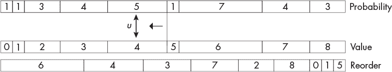

*图 12-3：离散分布的顺序采样*

概率行反映了这个 PMF，其中每个框的长度与其他框成比例，因此 7 号框比 1 号框长七倍。要获取传入 `probs` 的概率，请将每个框标签除以总和 29。

图 12-3 显示了选定的 *u* 作为一个双向箭头。这个 *u* 约为 0.4，因为它略小于整个 PMF 一半的距离，而 PMF 的总和必须为 1。标记为 5 的框后面的垂直线标记了从 *u* 中减去的完整概率集合，直到 *u* < 0。我们按以下顺序减去五个框：1，1，3，4 和 5。根据从 0 开始的索引调整，返回的样本是 4——即与 *u* 匹配的框下方在值行中的标签。暂时忽略重新排序行。

这个过程使用框的宽度将 [0, 1) 映射到 [0, 8]，通过转换均匀输入为非均匀输出，如果我们抽取足够的样本，输出将匹配所需的 PMF。试着通过闭上眼睛并将手指放在 图 12-3 的概率行的某个地方来选择其他样本。然后，将手指滑动到值行，并读取输出，即从左侧覆盖的框数。重复几次后，你应该会发现 6 被选择的频率最高，其次是 4。通过顺序搜索的反转采样是我们的第一种离散采样算法。

让我们做一个小小的改进。图 12-3 的顶部行按顺序展示了 PMF，这意味着分配给 0 的概率是 1/29，而分配给 6 的概率是 7/29。如果我们使用 清单 12-3 从分布中采样，这样是有意义的。然而，要获得 6（最频繁的值）作为一个样本，我们每次都需要从概率向量的开始处进行搜索。如果我们按降序列出概率，那么在通过 清单 12-3 的 `while` 循环后，最可能的结果将被选中。下一个最可能的结果只需要两次循环，依此类推。这一概念导致了 图 12-3 中的重新排序行。

重新排序行的条形图从左到右按大小降序排列，每个条形图上的标签列出如果该条形图被选中时返回的值。请注意，清单 12-3 中的算法没有改变；它仍然是从 *u* 中减去概率，但它们现在按从大到小的顺序排列。因此，我们必须将 清单 12-3 返回的索引映射到识别出实际选中的值。例如，如果 清单 12-3 返回索引 1，则映射知道 1 → 4，从而返回 4 作为选中的值。根据 `probs` 中概率的排列，这一调整应该能加快速度。重新排序的调整是我们的第二种离散采样算法。

#### ***快速加载骰子滚动器***

我们的最终离散抽样算法相对较新：*快速加载骰子滚动器（FLDR）*，由 Saad 等人在其 2020 年的论文《快速加载骰子滚动器：离散概率分布的近似最优精确采样器》中提出。你可以在他们的 GitHub 网站上找到代码和论文，链接为 *[`github.com/probcomp/fast-loaded-dice-roller`](https://github.com/probcomp/fast-loaded-dice-roller)*。我们只需要 *src/python* 目录中的 *fldr.py* 文件。你可以通过浏览器从 GitHub 仓库复制该文件，或者使用 `pip` 安装完整的包：

```
> pip3 install fldr
```

如果你从 GitHub 复制 *fldr.py*，将其放入本章的文件夹中。

FLDR 论文描述了该算法及其起源。它还提到了前面提到的 Devroye 书籍，这本书激发了该算法的设计。我们不会讨论细节，因为它们相当复杂且富有数学性。然而，了解有更多复杂的思维方式来考虑从离散分布中抽样是很有趣的。

我们将使用的 FLDR 版本需要将 PMF 表示为整数向量，正如我迄今为止所展示的那样。使用 FLDR 需要两个步骤；第一个步骤根据 PMF 对算法进行条件化，第二个步骤根据需求抽取单个样本。我们需要 `fldr_preprocess_int` 函数来配置采样器，和 `fldr_sample` 函数来抽取样本。FLDR 代码并不支持 NumPy，但我们可以接受这一点。

现在我们有了算法，接下来将它们互相对比。

#### ***运行时性能***

让我们来看看我们的算法是否有效，并且它们在运行时性能上如何相互比较。

首先，运行 *discrete_test.py*，不带参数：

```
> python3 discrete_test.py
discrete_test <N> [<kind> | <kind> <seed>]

  <N>    - number of samples
  <kind> - randomness source
  <seed> - seed
```

命令行的形式很熟悉。唯一必需的参数是要从“离散分布”章节开头提到的九元素分布中抽取的样本数量，具体见第 328 页：[1, 1, 3, 4, 5, 1, 7, 4, 3]。

让我们选择一些样本：

```
> python3 discrete_test.py 5000 minstd 476
[157 187 504 722 813 155 1251 693 518] (0.033361 s, sequential)
[164 171 526 674 904 162 1198 702 499] (0.029343 s, reordered)
[165 178 510 702 870 166 1225 683 501] (0.005494 s, FLDR)
[172 172 517 690 862 172 1207 690 517] expected
```

命令行请求 5000 个样本，并显示每种可能输出被不同算法类型选择的次数。例如，顺序算法选择了 187 次 1。正如我们预期的那样，6 是最常见的输出。最后一行包含了预期的样本数量，它是通过将概率乘以样本数并四舍五入到最近的整数得到的。

这三种算法似乎按照预期工作，结果接近预期输出。从右侧的运行时间来看，顺序算法最慢，重新排序的算法稍微更快，而 FLDR 则快了将近一个数量级。

如果我们要求 50 个样本而不是 5000 个

```
> python3 discrete_test.py 50 minstd 476
[2  0 10  5 13  0 12  4  4] (0.000363 s, sequential)
[2  1  5  7 13  1  8  8  5] (0.000451 s, reordered)
[3  2  6  5  4  2 12  8  8] (0.000101 s, FLDR)
[2  2  5  7  9  2 12  7  5] expected
```

输出是噪声的，因为预期频率和采样频率相差较远；例如，顺序算法在 10 次中选择了 2，而预期频率仅为 5。

图 12-4 通过 FLDR 展示了这种效果，使用 FLDR 选择了 50 个样本与 5000 个样本进行对比。


*图 12-4：使用 50 个样本（左）和 5000 个样本（右）从离散分布中采样*

条形图表示真实分布，点表示样本，二者均以概率表示。

图 12-5 展示了我们的采样器在对⌊*N^α*⌋个样本进行采样时的运行时性能，其中 *α* 从 1 变化到 6，步长为 25。请注意，*x* 轴单位是百万。

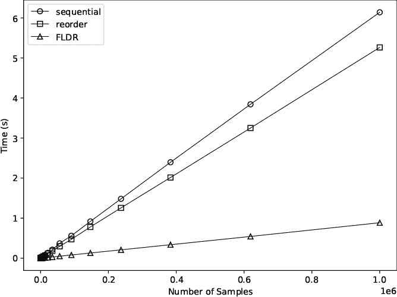

*图 12-5：样本时间与样本数量的关系*

我们可以放心地说，所有三种采样算法的运行时间都是 (*n*) 时间复杂度。然而，图 12-5 对我们来说是一个很好的实际例子。大 O 符号忽略了乘法因子，因此虽然所有三种算法的运行时间是线性的，但在实际应用中我们希望使用 FLDR。

让我们逐步了解 *discrete_test.py*，从设置部分开始（清单 12-4）。

```
from fldr import fldr_preprocess_int, fldr_sample
N = int(sys.argv[1])

if (len(sys.argv) == 4):
    rng = RE(kind=sys.argv[2], seed=int(sys.argv[3]))
elif (len(sys.argv) == 3):
    rng = RE(kind=sys.argv[2])
else:
    rng = RE()

probabilities = [1,1,3,4,5,1,7,4,3]
prob = np.array(probabilities)
prob = prob / prob.sum()
M = len(prob)
```

*清单 12-4：设置* discrete_test.py

我们将重点关注开始部分，在这里我们引入了来自 `fldr` 的函数，以及结束部分，在这里我们定义了 `probabilities`。

FLDR 需要整数计数，因此在这种情况下我们使用 `probabilities`。当使用需要真实概率的顺序采样算法时，我们使用 `prob`。

清单 12-5 使用每种算法绘制所请求的样本数量。每种情况都会创建一个样本向量 `z`，并计时绘制这些样本所花费的时间。使用列表推导式来绘制样本。

```
s = time.time()
z = np.array([Sequential(prob,rng) for i in range(N)])
e = time.time() - s
h = np.bincount(z, minlength=M)
print(h, ("(%0.6f s, sequential)" % e))

idx = np.argsort(prob)[::-1]
p = prob[idx]
s = time.time()
z = np.array([Sequential(p,rng) for i in range(N)])
e = time.time() - s
h = np.bincount(idx[z], minlength=M)
print(h, ("(%0.6f s, reordered)" % e))

s = time.time()
x = fldr_preprocess_int(probabilities)
z = np.array([fldr_sample(x) for i in range(N)])
e = time.time() - s
h = np.bincount(z, minlength=M)
print(h, ("(%0.6f s, FLDR)" % e))

print(np.round(prob*N).astype("uint32"), "expected")
```

*清单 12-5：使用每种算法进行采样*

第一个代码段调用了我们在 清单 12-3 中看到的 `Sequential`，然后使用 `bincount` 创建直方图，最后显示计数和生成时间。

第二段代码最终调用了 `Sequential`，但首先将 `prob` 按降序排列。NumPy 的 `argsort` 返回能够将 `prob` 按升序排序的索引。`[::-1]` 语法则将列表反转，使得 `idx` 按降序排列。

然后我们用 `p` 而不是 `prob` 调用 `Sequential`。这意味着 `z` 中的值不是正确的索引，而是指向 `idx` 的索引，`idx` 保存了正确的索引。换句话说，`idx` 是获取正确样本值的映射。通过使用 `z` 索引的 `idx` 调用 `bincount` 可以生成正确的样本频率。考虑花点时间确认一下 `idx[z]` 是有意义的。

对称性告诉我们，清单 12-5 中的最后一段代码通过重复调用 `fldr_sample` 使用 FLDR 绘制样本。但首先，我们必须将概率传递给 `fldr_preprocess_int`，以创建 `fldr_sample` 使用的结构。

清单 12-5 的最后一行通过将概率与样本数 `N` 相乘并取整，显示了每个值的预期计数。

如果我们想要采样的分布是二维的呢？那是什么意思呢？让我们找出答案。

#### ***二维***

我们可以将一维离散分布存储在一个向量中。通过扩展，我们可以想象将二维分布存储在一个矩阵中。但是我们如何解释这个分布呢？

由于一维分布告诉我们每个值应该出现的频率，二维分布则是指一对值，即每个维度的索引。

考虑这个二维分布，例如：

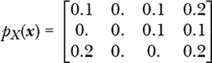

所有元素的总和为 1，因此*p[X]*(***x***)是一个 PMF。注意，我已经将*x*替换为***x***，一个向量。我们还可以写*p[X]*(*x*, *y*)以强调我们有两个维度。

分布表示*p*(*X* = 0, *Y* = 0) = 0.1，而*p*(*X* = 2, *Y* = 3) = 0.2，也就是说，变量的值是表示分布的矩阵中行和列的索引。二维概率分布出现在考虑联合分布时——即一对随机变量如何一起出现并拥有某种值的组合。

我们将使用现有的采样技术，通过解开分布、采样，然后将样本转换回二维对来从二维分布中抽取样本。例如，解开之前的分布给我们带来了：

*p[X]*(*x*) = [0.1, 0.0, 0.1, 0.2, 0.0, 0.0, 0.1, 0.1, 0.2, 0.0, 0.0, 0.2]

如果我们使用上述算法之一从这个分布中抽样，我们将得到范围在[0, 11]之间的样本。为了将样本转换回对，我们必须撤销解开操作，这意味着我们需要知道原始二维分布中的行数和列数。

让我们通过一个例子来演示。使用以下命令行运行*discrete_ravel.py*：

```
> python3 discrete_ravel.py 1000 mt19937 10101
```

输出由四个部分组成。代码本身通过解开*p[X]*(***x***)进行采样，然后将样本映射回表示*x*和*y*组合出现频率的(*x*, *y*)对。如果一切顺利，这些频率的一维和二维直方图应该接近*p[X]*(***x***)。

第一个输出行给出了：

```
[0.091 0\. 0.1 0.204 0\. 0\. 0.091 0.104 0.205 0\. 0\. 0.205]
```

这是一个由解开直方图采样得到的 PMF。其值都在 0.1 和 0.2 之间，这让人感到鼓舞。

第二个输出块是相同的估计 PMF，重新映射到二维：

```
[[0.091 0\.    0.1   0.204]
 [0\.    0\.    0.091 0.104]
 [0.205 0\.    0\.    0.205]]
```

这看起来很像*p[X]*(***x***)。

估计的 PMF 看起来是正确的。至于采样值，这里是从解开的 PMF 中抽取的前八个样本：

```
[ 3 11 11 7 3 0 7 8]
```

映射回成对，这些样本变成：

```
[(0,3), (2,3), (2,3), (1,3), (0,3), (0,0), (1,3), (2,0)]
```

从一维样本到二维对的转换是

(*x*, *y*) = (*z* ÷ 4, *z* mod 4)

其中*z*是 1D 样本值，÷表示整数除法。4 来自于二维 PMF 中的列数。

Listing 12-6 展示了解开、采样、重新映射的过程。

```
prob2 = np.array([[0.1, 0.0, 0.1, 0.2], 
                  [0.0, 0.0, 0.1, 0.1], 
                  [0.2, 0.0, 0.0, 0.2]])
prob = prob2.ravel()

z = np.array([Sequential(prob,rng) for i in range(N)])
h = np.bincount(z, minlength=len(prob))
h = h / h.sum()

print(h)
print(h.reshape((3,4)))
print(z[:8])

x,y = np.unravel_index(z[:8], prob2.shape)
print([i for i in zip(x,y)])
```

*Listing 12-6: 通过解开采样二维 PMF*

二维 PMF 存储在`prob2`中，展开后变成一维 PMF `prob`。第二段代码从`prob`中进行采样，就像我们之前做的那样。注意`rng`，它是我们`RE`类的一个实例。我忽略了*discrete_ravel.py*文件中的一些代码头，因此请确保检查文件本身。像之前一样，样本计数来自`bincout`，我们然后通过将`h`除以计数的总和来将其转换回一维 PMF。

接下来是四个输出中的三个，分别为`h`、`h`重塑为 3×4 矩阵，以及从`z`中提取的前八个样本。

在将样本映射到对时，我们通过调用`unravel_index`来节省时间，它需要一维索引和源数组的形状——这里是来自`prob2`的 3×4。NumPy 返回*x*和*y*坐标，因此一对值为(*x*[0]，*y*[0])，依此类推，通过`zip`实现的列表推导式给出。

我们也可以使用这种展开方法处理超过二维的分布。如果我们有三个随机变量——*X*、*Y*和*Z*——那么来自三维 PMF 的样本，*p[XYZ]*(*x*, *y*, *z*)，就是三元组(*x*, *y*, *z*)，根据某个特定值组合出现的概率。我们展开、在一个维度上进行采样，然后使用`unravel_index`将其映射回三元组。请记住，随着维度的增加，合理逼近分布所需的样本数量会急剧增加。

假设我们系统中的每个随机变量都有 10 个可能的取值。如果我们只有一个变量，我们必须从一个可以表示为 10 个元素的向量的概率分布中进行采样。如果有两个随机变量，我们需要一个矩阵来表示联合分布，展开后是一个 10 × 10 = 100 个元素的向量。如果有三个随机变量，我们展开为 10 × 10 × 10 = 1,000 个元素；如果有四个随机变量，我们需要 10,000 个元素。

固定值的数量为 10 时，*n*维的 PMF 展开成一个包含 10*^n*个元素的向量——分布大小随着维度的增加而呈指数级增长。因此，这个技巧最适用于二维或三维。

#### ***图像***

现在来点有趣的东西。*discrete_2d.py*中的代码知道如何使用图像的灰度版本作为离散的二维概率分布，因此我们可以从中进行采样。灰度图像是一个包含从 0 到 255 的整数值的矩阵，使得展开后的灰度图像立刻可以作为分布被 FLDR 使用。

样本变成了像素位置。图像某个像素的强度越高，它被采样的可能性就越大。因此，如果我们绘制足够的样本，将其缩放到[0, 1]范围内并乘以 255，我们可以将估计的分布转回图像并与原图进行比较。说了这么多，让我们来看一些代码。

Listing 12-7 中的四段代码展示了核心代码，省略了导入和命令行处理部分。

```
image = Image.open(iname).convert("L")
row, col = image.size
row //= 2
col //= 2
image = np.array(image.resize((row,col),Image.BILINEAR))
p = image.ravel()
probabilities = [int(t) for t in p]

x = fldr_preprocess_int(probabilities)
z = np.array([fldr_sample(x) for i in range(N)])

x,y = np.unravel_index(z, (col,row))
im = np.zeros((col,row))
for i in range(len(x)):
    im[x[i],y[i]] += 1
im = im / im.max()

os.system("rm -rf %s; mkdir %s" % (oname,oname))
Image.fromarray(image).save(oname+"/"+os.path.basename(iname))
Image.fromarray((255*im).astype("uint8")).save(oname+"/histogram2d.png")
```

*列表 12-7：将图像视为二维分布并从中进行采样*

为了将输入图像转换为一维分布，我们首先加载图像，将其调整为原始尺寸的一半，然后将其展开成一个像素强度列表，范围是[0, 255]。使用`int`的列表推导是必要的，因为 FLDR 不支持 NumPy 数组。

接下来的段落配置 FLDR（`x`），然后使用它来绘制`N`个样本（`z`），其中`N`是命令行中给出的数值。

获取样本后，`unravel_index`将一维样本转化为(*x*, *y*)对，或像素位置。然后，我们使用这些像素位置来填充`im`，这是一个二维直方图，用来统计 FLDR 选择每个像素的次数。为了将`im`转换为图像，我们必须缩放它，使得最常被采样的像素值为 1，这可以通过除以最大值来实现。

最后一几行代码创建了一个输出目录，并将原始图像和采样图像保存到该目录中。我们必须将`im`（现在的范围是[0, 1]）乘以 255，并将其转化为无符号整数，然后才能将其作为图像写入磁盘。

运行*discrete_2d.py*，不带参数，以了解命令行选项。尝试使用*test_images*中的图像和*images*中的图像进行实验。后者包含高对比度图像，这可能使得更容易看出样本来自哪里，尤其是那些反转的图像（文件名中带有“_inv”）。这些渐变图像呈现了线性、二次和三次渐变，从左到右。我们将优先采样更亮的区域，因为它们更有可能被采样。

图 12-6 展示了其中一张高对比度图像，其中白色区域最有可能被采样。这个版本的图像打印效果很好。反转版本通常需要更少的样本。

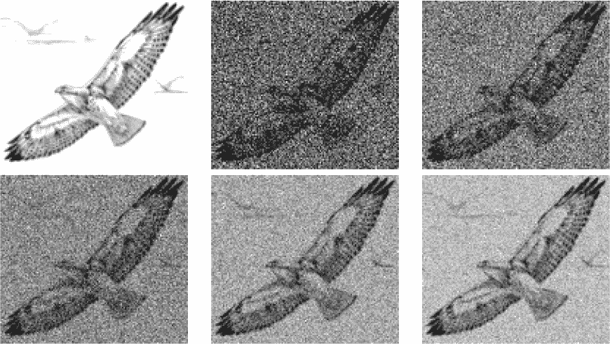

*图 12-6：原始鹰图像（左上角）和使用逐渐增多的样本数量采样的图像*

在图 12-6 中，原始图像位于左上角，接下来是使用 60,000、120,000、240,000、480,000 和 960,000 个样本逐步采样得到的图像，按从左到右、从上到下的顺序排列。我使用了以下命令行

```
> python3 discrete_2d.py images/hawk.png 120_000 tmp mt19937 19937
```

根据需要调整样本数量。

这个实验结束了我们对离散分布采样的研究。让我们继续探讨更具数学相关性的连续分布采样，并学习一些新技术，最终引入马尔可夫链蒙特卡洛的世界。

### **连续分布**

让我们转向考虑连续分布，这些分布由概率密度函数（PDF）表示，允许其范围内任何实数输入。在这种情况下，前一部分的技术已经不再适用——至少不适用于未做修改的情况——但也存在其他方法，我们将探索其中的三种：逆变换采样、拒绝采样和马尔可夫链蒙特卡洛。

#### ***逆变换***

我们用 PDF 来表示连续分布。注意“*函数*”一词，它告诉我们有一个数学关系描述了 PDF 的形状。给定 PDF 的 CDF 是一个积分：

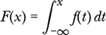

积分是对离散概率求和的连续版本。它表示 PDF 从–*∞*到某个*x*之间的区域。将–*∞*替换为任何 PDF 始终为零的值。

CDF 的值从 0 到 1，这意味着 CDF 的图像会产生从 0 开始、到 1 结束的*y*轴值；请查看图 12-1 中的 CDF。如果我们在 CDF 图的*y*轴上选取一个随机值，从那里水平滑动到曲线，再向下移动到*x*轴，就能得到一个来自 PDF 的样本。再选一个新的*y*轴起点，重复这个过程，就能得到一个新的*x*值和另一个来自 PDF 的样本。均匀采样 CDF 图上[0, 1]范围内的*y*轴值，会生成符合 PDF 形式的*x*值，若进行直方图统计，结果会呈现出 PDF 的形态。

为了用数学表达这个过程，可以将函数*F*(*x*)的图像沿*y* = *x*（该线在第一象限从*x*轴向上以 45 度角斜切）翻转，就得到了该函数的逆函数图像*F*^(–1)(*x*)，如果它存在的话。逆函数将*x*和*y*的值翻转，意味着逆函数的输入类似于原函数的*y*值，逆函数的输出是产生该输入的原函数的*x*值。

因此，如果我们知道表示 CDF 的函数的逆函数的形式，我们可以通过在[0, 1]范围内选择随机值作为输入，并将逆 CDF 的输出作为所需样本，来从 PDF 中采样。这一过程叫做*逆变换采样*。

让我们通过一个例子来讲解。假设我们想从*指数分布*中抽取样本，其 PDF 为

*f*(*x*) = λ*e*^(–λ*x*)

其中λ（lambda）是一个常数，决定了 PDF 从*x* = 0 时最大值λ开始衰减的速度。这个 PDF 最可能的样本接近零，远离零的样本则不太可能出现。

这个 PDF 的 CDF 是一个积分：

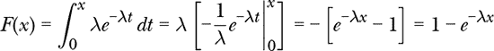

因此，*F*(*x*) = 1 – *e*^(–λ*x*)。如果我们找到这个函数的逆，我们就能通过均匀分布的输入来生成指数分布的样本。为了找到逆函数，将 CDF 等于*u*（代表*均匀样本*），然后解出*x*：

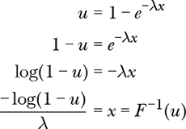

我们现在有了*F*^(–1)(*u*)，它是一个将[0, 1]范围内的均匀输入*u*映射到*x*的关系，*x*是根据指数分布 PDF 的形状选定的值。在使用逆函数之前，让我们再观察一下。

我们不特别关心这个*u*和那个*x*之间的精确配对，因为我们打算随机选择*u*值。因为*u*在[0, 1]之间，1 – *u*也在[0, 1]之间，但沿*u*-轴“翻转”，因为它是*u*的补集，使得这两个值之和为 1。因此，我们可以将 1 – *u*替换为*u*，我们的样本仍将来自指数分布。这一步不是必需的，但它使得逆函数的图像对我们来说看起来不那么奇怪，因为我们习惯于看到从高点开始随*x*向右增大而衰减的曲线。

图 12-7 显示了*F*^(–1)(*u*) = (–log *u*)/λ的图像，其中特定的*u*值已映射到各自的*x*输出。

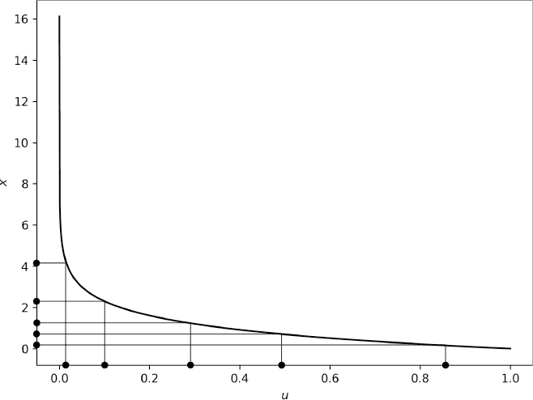

*图 12-7：从* e^(–λ*x*) *使用–log(*u*)/λ进行的逆变换采样*

*x*值的分布——或者来自许多*u*输入的许多*x*值的正确缩放直方图——随着样本数量的增加，将更好地逼近λ*e*^(–λ*x*)。

文件*inverse.py*从作为其累积分布函数（CDF）逆函数提供的函数中采样。换句话说，我们给定代码*F*^(–1)(*u*)及其对应的概率密度函数（PDF）*f*(*x*)，以及所需的样本数量，然后它会给我们返回样本，同时绘制 PDF 和样本的直方图。

让我们使用代码从*f*(*x*) = 2*e*^(–2*x*)中绘制样本。该 PDF 的逆 CDF 是*F*^(–1)(*u*) = (–log *u*)/2。要绘制 1,000 个样本，可以使用如下命令行：

```
> python3 inverse.py 1000 "-np.log(u)/2" "2*np.exp(-2*x)" tmp minstd 90210
```

第一个参数是所需的样本数量。第二个参数，双引号括起来的是实现*F*^(–1)(*u*)的 NumPy 版本，使用 NumPy 函数并将`u`作为自变量。接下来的参数，同样用双引号括起来的是*f*(*x*)，即 PDF。请注意，它是`x`的函数，而不是`u`。其余的参数是输出目录和常规的随机数源以及可选的种子。

图 12 显示了*inverse.py*对 1,000 个（左）和 10,000 个（右）样本的输出。

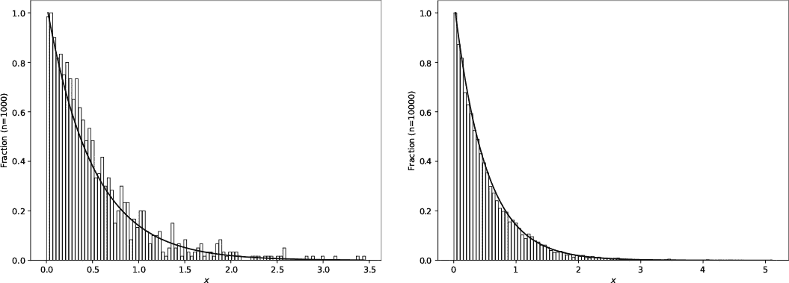

*图 12-8：从 2*e^(*–2*x*)绘制的 1,000 个（左）和 10,000 个（右）样本

代码会对输出进行缩放，使得曲线和直方图匹配。样本遵循期望的分布，更多的样本更好地代表 PDF。10,000 个样本开始选择离零更远的*x*值。

让我们再看一个例子。Kumaraswamy 分布类似于 Beta 分布，但其 PDF 和 CDF 的函数形式有利于逆采样。具体来说：

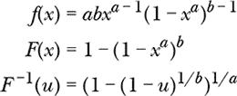

这里，*a*和*b*是常数，用来定义分布的形状，类似于 Beta 分布中的*a*和*b*。我将它作为练习留给你，证明*F*^(–1)(*u*)来源于*F*(*x*)。

让我们从这个分布中绘制样本，设*a* = 2，*b* = 5。我们需要的命令行是：

```
> python3 inverse.py 10000 "(1-(1-u)**(1/5))**(1/2)"
             "10*x**1*(1-x**2)**4" kumaraswamy pcg64 42
```

结果的图形见图 12-9。如预期的那样，样本遵循分布的形状。

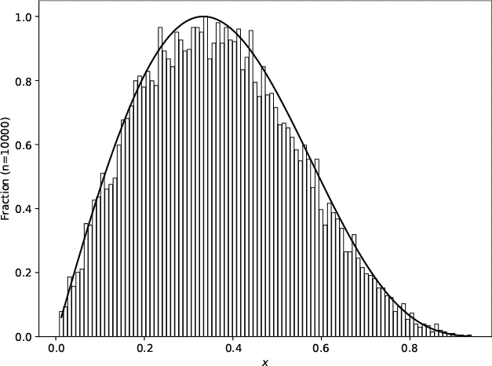

*图 12-9：Kumaraswamy (2,5) 的抽样*

*inverse.py* 中的主要代码很简单，因为我们在命令行中提供了 PDF 和逆 CDF，它们的形式允许我们使用 Python 的 `eval` 函数：

```
samples = np.zeros(N)

for i in range(N):
    u = rng.random()
    samples[i] = eval(ifunc)
```

就是这样。我们创建 `samples` 来保存请求的 `N` 个样本，然后通过评估从命令行传入的逆 CDF 函数（作为 `ifunc` 字符串）来循环生成 `samples[i]`。*inverse.py* 的其余部分用于创建输出图形。

逆变换抽样是直接的，并且适用于封闭形式的函数，但由于必须满足的两个条件，它的适用性有限。PDF 必须生成封闭形式的 CDF，并且该 CDF 必须是可逆的，以便得到 *F*^(–1)(*u*)。这种情况并不常见，特别是对于任意连续的 PDF。在第 358 页的“习题”中，我建议了另一种 PDF/CDF 组合，可以与 *inverse.py* 配合使用，但前提是你将 *u* 限制在 [0, 1] 以外的范围。

让我们探讨下一个连续 PDF 抽样算法——拒绝抽样。与逆变换抽样不同，拒绝抽样适用于任意的 PDF。

#### ***拒绝***

我们希望从函数 *q*(*x*) 中抽样，使得从该函数中得到的多个样本的直方图趋近于该函数本身的形状。虽然我们不知道如何直接从 *q*(*x*) 中抽样，但我们可以从一个我们称之为 *p*(*x*) 的提议函数中抽样。如果我们找到了一个常数 *c*，使得

*q*(*x*) *≤ cp*(*x*)，∀*x*

然后我们可以使用 *p*(*x*) 的样本从 *q*(*x*) 中抽样。回想一下，∀ 表示“对于所有”。

首先，我们从提议函数中抽取一个样本，*x ∼ p*(*x*)，其中 *∼* 表示“从…抽样”。这给了我们一个候选的 *x* 位置。

接下来，我们选择一个 *y* 值，它是从 *x* 向上某个比例的值，但仍然小于 *cp*(*x*)。换句话说，我们在区间 [0, *cp*(*x*)] 中选择一个均匀值，或 *y* = *ucp*(*x*)，其中 *u* 在 [0, 1] 之间。

如果 *y ≤ q*(*x*)，我们保留 *x* 作为 *q*(*x*) 的样本；否则，我们拒绝 *x* 并重新从 *p*(*x*) 中抽取另一个样本。我们在保留了所需数量的 *q*(*x*) 样本后停止。

图 12-10 展示了两个候选 *x* 位置的情况。

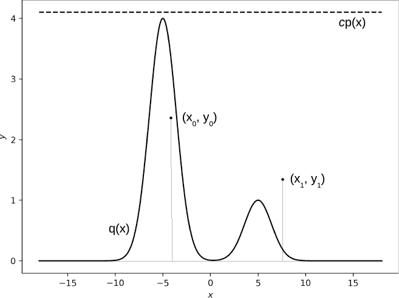

*图 12-10：使用两个候选 *x* 位置的拒绝抽样*

实线曲线是 *q*(*x*)，我们希望从中抽样的函数。虚线曲线，这里是 *q*(*x*) 范围内的均匀值，是 *cp*(*x*)。

让我们先看一下*x* = *x*[0]。算法要求从*p*(*x*)中抽样，得到*x*[0]。接下来，我们从*x*[0]到*cp*(*x*[0])的某个位置选择一个*y*。我们可以将其写为*y*[0] = *u*[0]*cp*(*x*[0])。虽然我们知道*y*[0]将始终小于或等于*cp*(*x*[0])，但我们想知道*y*[0]是否小于*q*(*x*[0])。对于*x*[0]，情况正是如此，因此我们接受*x*[0]作为来自*q*(*x*)的有效样本。

在*x*[1]中，*y*[1] = *u*[1]*cp*(*x*[1])大于*q*(*x*[1])，因此我们拒绝*x*[1]作为来自*q*(*x*)的有效样本，过程重复进行。

算法上，这个过程简化为以下内容：

1.  *x ∼ p*(*x*)。

1.  *u ∼ U*0, 1)。

1.  如果*ucp*(*x*) *≤ q*(*x*)，则接受*x*作为样本；否则，拒绝*x*。

1.  从第 1 步开始重复，直到我们接受了*N*个样本。

你可能会看到第 3 步的条件写作：

![Image

通过除以*cp*(*x*)，我们得到这种形式。我们在此问的是，*u*是否小于从所选*x*到*cp*(*x*)的距离，由*q*(*x*)所覆盖。如果不是，就拒绝*x*并重试。

可以将拒绝采样看作是随机将飞镖投向*xy*平面。如果飞镖的*y*坐标小于*cp*(*x*)和*q*(*x*)，我们接受飞镖的*x*坐标作为来自*q*(*x*)的样本。实际上，我们保留所有落在*q*(*x*)曲线下方的飞镖的*x*坐标。我们在第三章中做了类似的事情来估算*π*。

让我们用*rejection.py*来实践这个过程：

```
> python3 rejection.py
rejection <N> <proposal> <c> <func> <limits> <outdir> [<kind> | <kind> <seed>]

  <N>         - number of samples
  <proposal>  - uniform|normal_mu_sigma (e.g. normal_0_1)
  <c>         - proposal multiplier (e.g. 1)
  <func>      - function to sample from (e.g. 2*x**2+3)
  <limits>    - lo_hi limit on sampling range (e.g. -3_8.8)
  <outdir>    - output directory name (overwritten)
  <kind>      - randomness source
  <seed>      - seed
```

拒绝采样适用于任何提议函数*p*(*x*)，只要我们能从中抽取样本，但*rejection.py*限制了我们只有两个选项：一个均匀分布，如图 12-10 中虚线所示，和一个具有给定均值(*µ*)和标准差(*σ*)的正态分布。Box-Muller 变换让我们能够从正态分布中抽样（参见第一章）。

让我们在图 12-10 中重现这个例子。提议函数是一个均匀分布乘以 4.1，因为这使得提议函数刚好位于采样函数*q*(*x*)的最高部分上方。


它是两个以±5 为中心的正态曲线的和，其中一个比另一个高四倍。

现在，我们进行抽样：

```
> python3 rejection.py 100000 uniform 4.1
    "np.exp(-((x-5)/2)**2)+4*np.exp(-((x+5)/2)**2)" -18_18 reject0 pcg64 1313
832745 trials to get 100000 samples (30.7419 s)
```

输出告诉我们，我们需要超过 830,000 个候选样本才能获得要求的 100,000 个样本。这是一个 12%的转化率，意味着我们拒绝了 88%的候选样本。拒绝采样的效率关键取决于提议函数*cp*(*x*)和采样函数*q*(*x*)之间的接近程度。提议函数与采样函数越接近，效果越好。

图 12-11 显示了来自*q*(*x*)的样本的直方图。提议函数见图 12-10。请注意，拒绝采样并不关心*p*(*x*)和*q*(*x*)是否归一化（即曲线下的面积为 1）。只要*cp*(*x*)高于*q*(*x*)，一切就会正常进行（尽管可能较慢）。

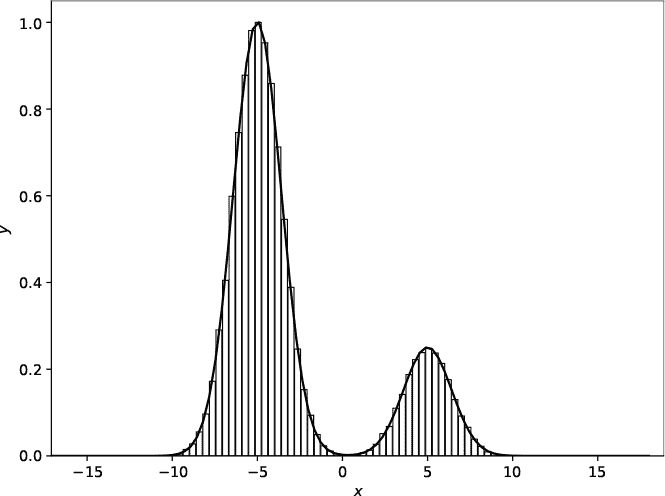

*图 12-11：使用均匀提议函数进行采样*

让我们使用正态曲线作为提议函数：

```
> python3 rejection.py 100000 normal_0_1 4
    "np.exp(-((x-5)/2)**2)+4*np.exp(-((x+5)/2)**2)" -18_18 reject1 pcg64 1313
1511344 trials to get 100000 samples (62.7675 s)
```

提议函数现在是一个均值为 0，标准差为 1 的正态曲线。乘数为 4。

输出结果在*reject1*中。我们得知需要 150 万个候选样本才能获得 10 万个样本，转化率为 6.6%。图 12-12 显示了直方图（左）和提议函数与采样函数的图表（右）。这些图表可能看起来很奇怪，这是有原因的。

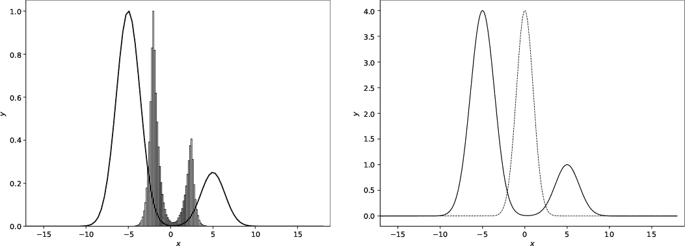

*图 12-12：使用 N(0,1)作为提议函数*

提议函数是图 12-12 中右侧的虚线曲线。它位于组成*q*(*x*)的正态曲线之间，并且在零附近只有一个小区域内，它大于*q*(*x*)。算法不能在*p*(*x*) < *q*(*x*)的区域选择样本；因此，它只在左侧最左边的正态曲线的右侧部分和最右边的正态曲线的左侧部分之间的重叠区域内选择样本。

左侧的直方图中，代码缩放了*q*(*x*)和样本的直方图，因此它们的最大*y*值都为 1。直方图在两个位置有峰值，即重叠区域的左侧和右侧最大值。虽然这不是我们期望的结果，但在给定约束条件下，这次运行的输出是正确的。

让我们尝试更多的例子。文件*run_rejection_examples*包含清单 12-8。

```
python3 rejection.py 100000 normal_0_20 4.2 
    "np.exp(-((x-5)/2)**2)+4*np.exp(-((x+5)/2)**2)" -18_18 reject2 pcg64 1313
python3 rejection.py 100000 normal_-5_2.4 4 
    "np.exp(-((x-5)/2)**2)+4*np.exp(-((x+5)/2)**2)" -18_18 reject3 pcg64 1313
python3 rejection.py 100000 uniform 4 
    "np.exp(-((x-5)/2)**2)+4*np.exp(-((x+5)/2)**2)" -11_4 reject4 pcg64 1313
python3 rejection.py 100000 uniform 158 
    "2*x**2+3" -3_8.8 reject5 pcg64 1313
```

*清单 12-8：附加示例*

图 12-13 显示了从上到下生成的*reject2*到*reject5*的图表。

最上面的图涵盖了整个*q*(*x*)范围，样本从每个峰值处抽取。下一行仅显示从左侧峰值处的样本，因为提议函数覆盖了它并且稍微覆盖了右侧峰值的一部分。第三行将选择范围限制为*x ∈* [–11, 4]，在限制样本范围的同时仍能反映*q*(*x*)的形状。最后一行清单 12-8 切换到一个新的函数，*q*(*x*) = 2*x*² + 3，以及一个均匀提议函数。

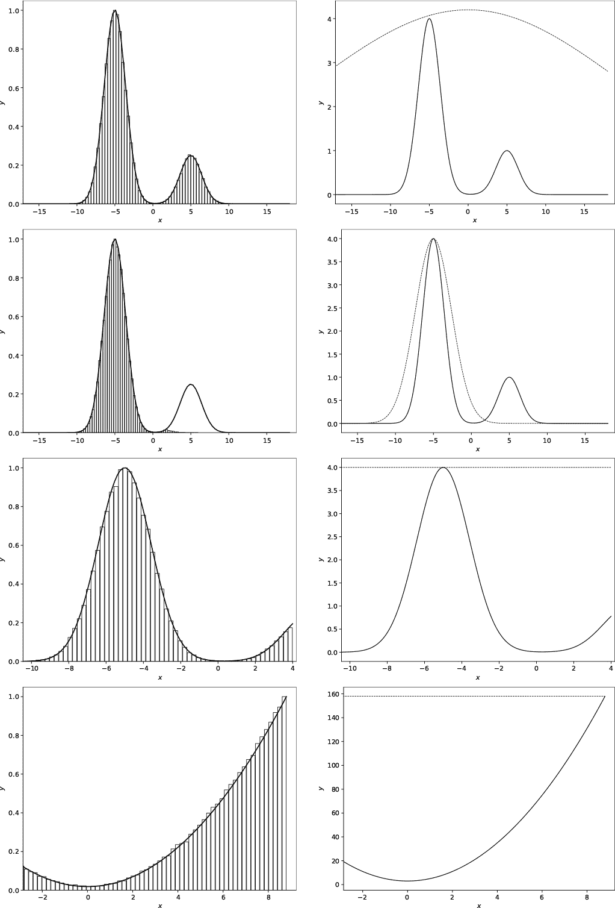

*图 12-13：命令行在清单 12-8 中的直方图和提议函数*

使用*q*(*x*)函数和完全或部分覆盖*q*(*x*)的提议函数来实验*rejection.py*。记得选择一个*c*，使得你想采样的区域中*q*(*x*) < *cp*(*x*)。

拒绝采样不限于一维。例如，如果我们有*q*（*x*，*y*），只要我们能够从*p*（*x*，*y*）中采样，我们就可以绘制样本。均匀函数，对于所有（*x*，*y*）点都是 1，是一个容易使用的*p*（*x*，*y*）。多元正态分布也可以使用，尽管它更难编码和可视化。算法保持不变，但我们不再从*p*（*x*）中绘制*x*，而是从*p*（*x*，*y*）中绘制（*x*，*y*）——二维空间中的一个随机点。测试仍然是*ucp*（*x*，*y*） *≤ q*（*x*，*y*），即：

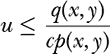

如果条件成立，点（*x*，*y*）就是来自*q*（*x*，*y*）的样本。

扩展到任意维度，***x*** =（*x*[0]，*x*[1]，*x*[2]，...）只要我们能从*p*（***x***）中采样就可以。然而，随着维度的增加，除非*p*（***x***）与*q*（***x***）非常接近，否则被拒绝的样本数会呈指数增长（每增加一个新维度），而这在保持从*p*（***x***）中轻松采样的同时是非常困难的。这种现象，即拒绝采样的效用随着问题维度的增加而降低，是*维度的诅咒*的一个表现，这也是机器学习模型常常面临的问题。

随着问题维度的增加，拒绝采样的低效性促使我们使用最终的采样算法，这个算法可以处理高维问题：马尔可夫链蒙特卡罗。

#### ***马尔可夫链蒙特卡罗***

我们的最终采样算法是最强大的：*马尔可夫链蒙特卡罗（MCMC）*。我们在第十章中学习了蒙特卡罗算法。*马尔可夫链*这一术语以俄罗斯数学家安德烈·马尔可夫（1856–1922）的名字命名，指的是这样一个过程：从当前状态移动到新状态的*转移概率*仅取决于当前状态，与之前的状态无关。马尔可夫链在模拟中非常有用，因为接下来发生的事情完全依赖于系统当前的状态，而与系统的历史无关。

MCMC 使用马尔可夫链来近似从复杂的概率分布中采样。马尔可夫链中的*平稳分布*，通常用***π***表示，是离散情况下的一个向量或连续情况下的概率密度函数（PDF）。无论初始分布如何，行走马尔可夫链最终都会到达由转移概率唯一决定的平稳分布，前提是满足特定的条件。

我们将首先深入研究平稳分布；然后，我们将探索 Metropolis-Hastings 算法，并利用它来行走一个连续的马尔可夫链——最终意识到其平稳分布就是我们想要从中采样的那个 PDF。

##### **行走马尔可夫链**

让我们通过一个例子来演示。圆顶帽在今年非常流行，人人都在佩戴，且有三种颜色：红色、绿色或蓝色。一个人明年换圆顶帽颜色的概率取决于他们今年佩戴的颜色。这个概率从每年到每年都是固定的。随着时间的推移，最初的圆顶帽颜色分布会发生什么变化？颜色的分布会持续变化，还是最终会稳定到某种特定的、或许是静态的分布？

我们通过一个矩阵来编码转移概率，其中行表示当前状态（圆顶帽颜色），而该行的列表示从当前状态到新状态（即新的圆顶帽颜色）的转移概率，新状态可以与当前状态相同。

考虑这个转换矩阵：

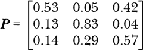

行表示红色、绿色和蓝色的圆顶帽，列也是如此。因此，如果某人今年佩戴红色圆顶帽，他们明年再次佩戴红色圆顶帽的概率为 53%，换成绿色圆顶帽的概率为 5%，换成蓝色圆顶帽的概率为 42%。这一行的总和为 1，这是必须的。同样，喜欢绿色圆顶帽的人明年继续佩戴绿色圆顶帽的概率为 83%，但 13%的人会换成红色圆顶帽，还有 4%的人会大胆地换上蓝色圆顶帽。

要使用转换矩阵，我们需要一个初始的圆顶帽分布：

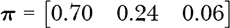

向量告诉我们，70%的群体拥有一顶红色的圆顶帽，24%的人拥有绿色的，只有 6%的人拥有蓝色的。

要找出明年分布的情况，我们需要查看转换矩阵作用于每种圆顶帽颜色的群体比例时会发生什么。佩戴红色圆顶帽的人根据转换矩阵的第一行[0.53, 0.05, 0.42]转换为新的颜色。我们将红色圆顶帽佩戴者与转移概率相乘，以得到明年佩戴红色圆顶帽的人所占比例：

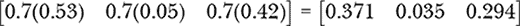

对于绿色圆顶帽的人，我们将转换矩阵的第二行乘以 0.24，对于蓝色圆顶帽的人，我们将最后一行乘以 0.06。最后，我们将结果相加以得到新的圆顶帽颜色分布。

最终，这些步骤不过是将当前的分布作为行向量与转换矩阵相乘而已：

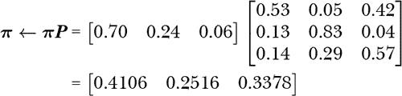

明年，41%的人将佩戴红色圆顶帽，25%的人将佩戴绿色的，几乎 34%的人将佩戴蓝色的。马尔科夫性质告诉我们，接下来的分布是将当前分布与转换矩阵相乘，并如此反复。

文件*markov_chain.py*接受帽子颜色的初始分布（***π***）和转移矩阵（***P***），并生成马尔科夫链直到分布达到平稳。为了增加趣味性，红色、绿色和蓝色帽子的分布被视为 RGB 颜色，这样输出文件*markov_chain.png*就能显示从初始分布到平稳分布的过渡，表现为从左到右的颜色条。

使用之前的值运行代码：

```
> python3 markov_chain.py 70 24 6 [[53,5,42],[13,83,4],[14,29,57]]
```

前三个值是初始分布：红色、绿色和蓝色帽子。最后一个参数，不能包含空格，是表示转移矩阵的 Python 列表。虽然这些值与之前略有不同，但输入值已经根据它们各自的总和进行了缩放，因此

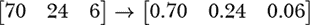

同样适用于转移矩阵的各个行。

我们打印马尔科夫链

```
[0.7  0.24 0.06]
[0.4106 0.2516 0.3378]
[0.297618 0.32732  0.375062]
[0.25279782 0.39532448 0.3518777 ]
[0.23463791 0.44280374 0.32255835]
[0.22708075 0.47280092 0.30011833]
[0.22383348 0.49081312 0.2853534 ]
[0.22238693 0.50131905 0.27629402]
[0.22171771 0.50733942 0.27094286]
[0.22139651 0.51075104 0.26785245]
[0.22123713 0.5126704  0.26609247]
[0.22115578 0.5137451  0.26509912]
[0.2211133  0.51434497 0.26454173]
[0.22109074 0.51467909 0.26423017]
[0.2210786  0.51486493 0.26405647]
[0.221072  0.5149682 0.2639598]
[0.2210684  0.51502555 0.26390605]
[0.22106642 0.51505738 0.2638762 ]
[0.22106533 0.51507504 0.26385963]
[0.22106473 0.51508484 0.26385043]
[0.2210644  0.51509028 0.26384532]
```

这告诉我们，平稳分布为 22%红色、51.5%绿色和 26.4%蓝色帽子。

尝试修改代码，将输入分布改为`1 0 0`（100%红色）或`0 0 1`（100%蓝色）。无论如何，你最终总会到达平稳分布，尽管链中的链接数量可能不同。然后，修改转移矩阵，看看会发生什么。

唯一值得讨论的代码部分是构建链：

```
eps = 1e-5
last = np.array([10,10,10])
chain = []

while (np.abs(d-last).sum() > eps):
    print(d)
    chain.append(d)
    last = d
    d = d @ transition
```

`while`循环运行直到新分布与`last`分布的差异小于或等于`eps`。`chain`列表保存分布序列。我们使用`@`执行矩阵乘法，***π** ← **πP***。

MCMC 的强大之处在于，Metropolis-Hastings 算法（我们接下来要讨论的）运行马尔科夫链时，并不直接生成链，而是作为代理从***π***中返回样本，一旦链足够长，达到平稳分布。

##### **探索 Metropolis-Hastings**

一篇题为《通过快速计算机进行状态方程计算》的论文发表于 1953 年 6 月的*化学物理学杂志*。作者是尼古拉斯·梅特罗波利斯、阿里安娜·W·罗森布鲁斯、马歇尔·N·罗森布鲁斯、奥古斯塔·H·泰勒和爱德华·泰勒。论文介绍了*Metropolis 算法*，之所以这样命名，是因为梅特罗波利斯的名字出现在论文的第一位。然而，正如科学这一极具人性化的事业中常常发生的那样，导致该算法诞生的过程存在争议。现在看来，真正的发明者更可能是马歇尔和阿里安娜·罗森布鲁斯，而不是梅特罗波利斯。五位作者现在都已去世，因此我们可能永远无法知道完整的故事。我们将使用该算法的现代名称——Metropolis 算法，虽然我们知道，或许应当将其归功于其他人。

1970 年，Wilfred Hastings 将该算法扩展到提议分布不对称的情况；因此，这个算法现在被称为 *Metropolis-Hastings (MH)*。我们将限制自己使用对称的正态分布作为提议分布，因此从技术上讲，我们只使用了 Metropolis 部分。

MH 使用提议分布生成样本，方式与拒绝采样非常相似；然而，在这种情况下，提议分布是随机游走的（我们很快会了解这意味着什么），因此它改变了马尔可夫链的分布。运行足够长的随机游走，并适当拒绝或接受移动，最终我们会到达马尔可夫链的平稳分布。到那时，MH 返回的样本就来自平稳分布，这正是我们一开始希望从中抽取样本的分布。多么方便啊！

**注意**

*MH 的完整数学处理和它背后发生的事情超出了我们在此讨论的范围。感兴趣的读者可以在 Gregory Gundersen 的博客中找到一个很好的总结：* [`gregorygundersen.com/blog/2019/11/02/metropolis-hastings`](https://gregorygundersen.com/blog/2019/11/02/metropolis-hastings)*。*

对于我们的目的，我们将接受 MH 的声明，而是关注算法的随机游走版本。MH 需要一个函数，从中采样，该函数定义了我们希望样本在生成其分布直方图时遵循的形式。这是马尔可夫链的平稳分布，因此我们将此函数称为 *π*(*x*)（不要与数字 *π* 混淆）。MH 在多维情况下表现良好，但我们将限制自己到一维，因此是 *π*(*x*) 而不是 ***π***(*x*)。

MH 还需要一个提议分布，*Q*(*x*)。我们将使用正态分布，因为它是对称的，且我们知道如何高效地从中采样，*x′ ∼ N*(*x*, *σ*)，其中 *σ* 是用户提供的标准差，*x* 是均值。

有了 *π*(*x*) 和 *Q*(*x*)，随机游走 MH 就变得简单明了：

1.  选择一个初始样本，*x*；例如，*x* = 1。

1.  基于当前样本提出一个新的样本：*x′ ∼ N*(*x*, *σ*)。

1.  定义 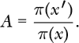

1.  定义 *ρ* = min(1, *A*)。

1.  定义 *u ∼* uniform(0, 1)。

1.  如果 *u* < *ρ*，则接受 *x′*，*x ← x′*。

1.  否则，保留 *x*。

1.  将 *x* 输出为一个样本。

1.  重复步骤 2–8，直到收集到所有所需的样本。

接受值 *A* 使用当前样本位置 *x* 和提议样本位置 *x′* 来评估我们希望采样的函数。如果这个值通过 *ρ*（rho）限制为最大值 1，并且小于一个随机均匀样本，则接受提议样本 (*x′*) 作为新的样本；否则，保留当前样本 *x*。在循环之前，输出当前的 *x* 作为分布 *π*(*x*) 的样本。

这个算法是实现 MH 的最简单方式。实际上，我们可以使其更简单，因为无需定义 *ρ*；我们可以直接使用 *A*，因为 *u* 总是位于 0, 1) 之间。

在步骤 2 中，新的提议位置，*x′*，来自提议函数，它是一个以*x*（当前样本）为中心的正态分布。这就是随机游走的部分。在步骤 6 中，如果*x′*最终被接受，它将成为我们用来选择下一个提议位置的新*x*。换句话说，当一个提议被接受时，正态曲线会跳到*x*轴上的新位置。我们很快将生成显示这种行为的动画。

我们基于*π*(*x′*)和*π*(*x*)的值来判断接受或拒绝，即提议的新样本位置和当前样本位置的*π*的*y*值的比率。如果*π*在当前的位置具有较高的值，则分数*A*会较小，这意味着步骤 6 中的比较成功的可能性较低。如果提议被拒绝，*x*会再次作为*π*的样本输出。我们希望这样做是因为*π*在该*x*处的*y*值较高。如果*π*(*x*)非常小，则*π*(*x′*)更可能较大，意味着*A*大于 1。如果*A* > 1，*ρ* = 1，提议位置将始终被选择，因为*u* < 1。因此，当将*π*视为 PDF 时，*π*的不太可能被选中的部分会更少地被采样。

基于这种行为，我们可以想象，随着时间的推移，基于正态分布样本的随机游走将按照每个位置处*π*的值比例在*π*上游走，从而生成所需比例的样本。我还没有评论*σ*，MH 的用户提供参数。我们很快会对此进行实验并理解其影响。

至于*A*的定义，我将其写作*π*(*x*)在当前和提议的*x*位置上的比值。这是 Metropolis 算法的版本，它适用于对称的提议分布。如果提议分布不是对称的，那么分子和分母各自会有一个额外的乘法因子。在对称情况下，这个因子对分子和分母是相同的，所以它会相互抵消。

*A*是一个比率，贝叶斯定理将后验写成似然和先验的乘积，除以一个归一化因子，在实践中，这通常是一个无法处理的积分。由于它与比率一起工作，MH 取消了这个积分，因此我们根本不需要计算它。MH 使得仅通过似然和先验就能从后验分布中进行采样。这让贝叶斯学派非常高兴，并导致了本章早些时候关于贝叶斯和 MCMC 的戏剧性引述。

运行算法，看看你的样本是否*不*符合 *π*(*x*)。我们忽略了关于 MH 算法的一个关键声明：它并不声称立即从 *π*(*x*) 生成样本，而只是当达到某个极限后，在一段时间后才会这样做。需要多久时间，生成多少样本，我们才能相信这些样本来自 *π*(*x*)？这个问题没有万无一失的答案。我们关于雪顶帽实验通常在十次或更少的迭代后就收敛到了平稳分布。这可能也是 MH 算法的情况，但通常认为复杂的 *π*(*x*) 函数在生成数千个样本或更多样本之前并不会来自 *π*(*x*)。因此，当我们在代码中实现 MH 时，我们会指定一个 *burn-in* 样本数量，我们会丢弃这些样本，只保留之后的样本。我们在 [第七章 玩混沌游戏生成迭代函数系统的吸引子点时，也做过类似的操作。

这是一个随机游走算法和马尔科夫算法，因为我们从一个基于当前样本 *x* 的分布中随机抽取下一个候选样本 *x′*。在随机游走中，下一位置相对于当前的位置。在马尔科夫算法中，历史不重要；只有当前的样本位置 *x* 会影响任何可能的新位置。最后，这是一个蒙特卡洛算法，因为它依赖于随机性，并且不能保证最初就能从 *π*(*x*) 生成准确的样本。

让我们深入一些代码，研究一下 *mcmc.py* 文件。你会发现代码用于解析命令行、从正态分布中采样，并使用这些样本生成一系列图表——这些我们之前已经多次见过。

*mcmc.py* 的核心是 `MH` 函数（清单 12-9）。

```
def MH(func, nsamples, sigma=1, q=1, burn=1000, limits=None):
    samples = [q]
    while (len(samples) < (burn+nsamples)):
        p = normal(q, sigma)
        if (limits is not None):
            lo,hi = limits
            if (p <= lo) or (p >= hi):
                p = q
        x = p; num = eval(func)
        x = q; den = eval(func)
        if (rng.random() < num/den):
            q = p
        samples.append(q)

    samples = np.array(samples)
    return samples[burn:], samples[:burn]
```

*清单 12-9：一个随机游走的 Metropolis-Hastings 采样器*

与拒绝采样一样，`func` 是一个定义 *π*(*x*) 的字符串。其组成规则与 *rejection.py* 中相同。我们最终希望获得 `nsamples` 个样本，去掉前 `burn` 个样本，因为这些样本会被丢弃。这也解释了 `while` 循环条件，知道列表 `samples` 存储了所有生成的样本。

`while` 循环的主体是 MH 算法的直接实现，忽略了 *A* 和 *ρ* 的显式定义。首先，我们从以当前样本位置 `q` 为中心的正态曲线中采样一个提议位置 `p`。然后，如果我们设置了 `MH limits`，它们会限制最终采样自 *π*(*x*) 的部分。我们在拒绝采样中也做了类似的操作。

我们将 `func` 定义为以 `x` 为自变量，因此我们需要调用 `eval` 并将其赋值给 `x`，以获得分子（`num`）和分母（`den`）。最后，如果 *u* 小于 `num`/`den`，则接受 `p` 作为新的 `q`，然后将 `q` 添加到 `samples` 中。

一旦我们获得了所有样本——包括那些标记为烧入的样本，用于绘图目的——在排除烧入样本后，将 `samples` 返回为一个 NumPy 向量。

运行 *mcmc.py* 而不带参数，以查看它期望的命令行参数：

```
> python3 mcmc.py
mcmc <N> <func> <limits> <q> <sigma> <burn> <outdir> yes|no [<kind> | <kind> <seed>]

  <N>         - number of samples
  <func>      - function to sample from (e.g. 2*x**2+3)
  <limits>    - limits for samples (lo_hi, -18_18) or 'none'
  <q>         - initial sample (e.g. 0)
  <sigma>     - proposal distribution sigma (e.g. 1)
  <burn>      - initial samples to throw away (e.g. N//4)
  <outdir>    - output directory name (overwritten)
  yes|no      - show or don't show the initial proposal distribution
  <kind>      - randomness source
  <seed>      - seed
```

这里有很多参数，但我们知道其中大多数的作用。我们需要在忽略前 `burn` 个样本后，获取 `N` 个样本。我们知道 `func` 是一个字符串，用来定义 *π*(*x*)。如果 `limits` 不是 `none`，它会限制 *x* 轴的采样范围。

我们使用 `q` 来提供初始样本位置。最后，提议函数的形状，即从中采样的正态分布，取决于 `sigma`。如果 `sigma` 太小，正态分布很窄，跳跃到 *π*(*x*) 的其他部分就会变得更困难。另一方面，如果 `sigma` 较大，虽然更容易从整个 *π*(*x*) 中进行采样，但也有其上限。

我们理解了 `outdir`、`kind` 和 `seed`。最后一个参数是必需的字符串，可以是 `yes` 或 `no`。如果是 `yes`，则输出的图表将显示 *π*(*x*) 和样本的直方图，同时也会显示以初始 `q` 为中心、标准差为 `sigma` 的正态分布。请阅读 *mcmc.py* 以了解如何生成输出图表。让我们运行代码看看它生成了什么。

我们从这条命令行开始：

```
> python3 mcmc.py 100000 "np.exp(-((x-5)/2)**2)+4*np.exp(-((x+5)/2)**2)" none 0 3 10000 tmp
              yes pcg64 2256
100000 samples in 6.7056 s
```

我们要求在丢弃了 10,000 个烧入样本后，获取 100,000 个样本。我们使用与拒绝采样相同的两正态分布函数之和来表示 *π*(*x*)。`none` 选项会开放所有的 *x* 轴进行采样，尽管我们最终只会在 *π*(*x*) 非零的地方进行采样。初始采样位置为 0，`sigma` 为 3。最后，我们希望在输出图中看到初始分布函数；我们固定伪随机生成器和种子，并将所有输出保存到 `tmp`。

图 12-14 展示了 *mcmc.py* 创建的图表。

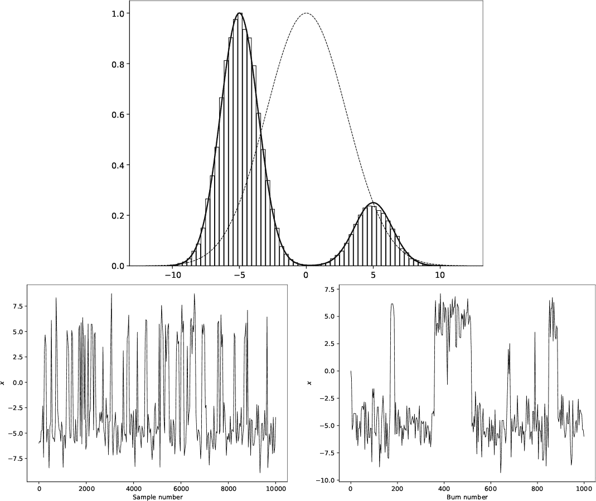

*图 12-14：使用 Metropolis-Hastings 从 π(*x*) 采样（上图）以及跟踪图（左下角）和烧入图（右下角）*

顶部的图表展示了 *π*(*x*) 及 MH 所生成样本的直方图。此外，因为我们在命令行中选择了 `yes`，所以还包括了初始提议分布，即一个以 *x* = 0、*σ* = 3 为中心的正态分布。注意，曲线被缩放到最大值为 1.0。与拒绝采样一样，我们希望 *π*(*x*) 的形状与直方图一致。

图 12-14 底部的图表是 *trace plots*，显示了样本 *x* 随着样本编号变化的情况。可以将“样本编号”看作是时间，因此图表展示了 *x* 随时间的变化。左侧图表跟踪的是烧入期后的样本，右侧图表则显示了烧入样本。

这些图是通过与上面图相同的命令行创建的，但总样本数设置为 10,000，其中 1,000 用于预热期。左边，大多数样本集中在 *x* = –5，那里是构成 *π*(*x*) 的较大正态曲线的峰值。剩余的样本集中在 *x* = 5，较小的峰值。然而，右边的预热期图像在各自的峰值附近跳动。

有许多内容可以用 *mcmc.py* 进行探索。我会提供两个作为起点的建议。我建议运行这些命令行，然后思考输出，看看你是否完全理解它。记得也查看跟踪图，特别是对于 *π*(*x*) = 2*x*² + 3：

```
> python3 mcmc.py 200000 "np.exp(-((x-5)/2)**2)+4*np.exp(-((x+5)/2)**2)"
    none 3 0.1 100000 tmp yes pcg64 1313
> python3 mcmc.py 10000 "2*x**2+3" -3_8.8 0 1 1000 tmp yes pcg64 2233
```

之前，我承诺过我们会制作一个展示我们在 MH 实现中的随机游走的电影；现在我会兑现这个承诺。运行以下命令：

```
> python3 mcmc_movie.py 10000 "np.exp(-((x-5)/2)**2)+4*np.exp(-((x+5)/2)**2)"
    -18_18 0 3 1000 tmp yes 900 pcg64 66
10000 samples in 181.5245 s
```

文件 *mcmc_movie.py* 与 *mcmc.py* 非常相似。输出目录 *tmp* 中包含一个新目录 *frames*。该目录包含从 *frame_0000.png* 到 *frame_0899.png* 的文件，展示了每个提议的样本（细的垂直线）以及每个被接受的样本（粗的垂直线），随着 MH 在其随机游走过程中移动。使用可以按字母顺序翻页浏览文件目录的图像查看器查看这个游走过程，或者从本书的 GitHub 页面下载 *mcmc_movie.mp4*。

### **练习**

这里有一些你可能想尝试的内容：

+   更新 `ChooseMap`，在 *ifs.py* 中使用 `Sequential` （清单 12-3）。

+   使用 *inverse.py*，并用 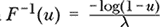 替换 *u*。样本有变化吗？这个 *F*^(–1)(*u*) 看起来是什么样的？

+   Cauchy 分布由 *µ* 和 *γ* 描述。其 PDF 是 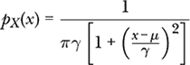

    对应的 CDF：

    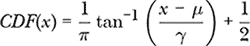

    尝试用 *inverse.py* 从这个函数中采样。设定 *µ* = –2 和 *γ* = 1。例如：

    ```
    > python3 inverse.py 30000 "-2+1*np.tan(np.pi*(u-0.5))"
        "1/(np.pi*1*(1+((x+2)/1)**2))" cauchy pcg64 42
    ```

    你看到了什么？现在，用 *inverse_cauchy.py* 替换 *inverse.py*。这两个程序有什么区别？有时算法需要调整才能成功。

+   执行 shell 脚本 *run_rejection_c*，并用拒绝测试的术语解释输出，考虑当 *cp*(*x*) ≫ *q*(*x*) 与 *q*(*x*) 刚好超过 *cp*(*x*) 时的情况。提示：考虑在 *q*(*x*) *≈ cp*(*x*) 时为给定的 *x* 值选择 *y* 的可能性。

+   使用 *mcmc.py* 对始终在某个给定范围内为正的函数进行实验。当你改变预热期（burn-in）大小时会发生什么？尝试改变 *σ*。大 *σ* 或小 *σ* 值更有效？试试这个函数：

    *p[X]*(*x*) = sin³(*x*) + 1

    我建议使用如下命令行：

    ```
    > python3 mcmc.py 100000 "np.sin(x)**3+1" -9.4248_9.4248 0 3 100000 tmp no pcg64 2256
    ```

    你能解释这个图和直方图吗？这些限制大致是 –3*π* 到 3*π*。

### **总结**

在这一章中，我们从任意分布中进行采样。首先，我们介绍了贝叶斯推断中的术语和概念，贝叶斯推断是采样技术的主要应用领域。接着，我们从离散分布中进行采样，离散分布通常出现在处理直方图时。我们学习了顺序采样和 FLDR，它们都在(*n*)时间内运行——不过，实际上，掷骰子的速度大约快五到七倍。

然后我们通过将二维分布展开为一维分布，实验了从二维离散分布中进行采样。由于灰度图像本质上是二维离散分布，我们从中进行采样，观察到更强烈的像素点被采样的频率更高。

接下来是连续分布，它们由概率密度函数（PDF）表示。在某些情况下，如果累积分布函数是可逆的，采样过程变得简单。对于不可逆的情况，我们探索了两种方法：拒绝采样和使用 MH 算法的马尔科夫链蒙特卡洛（MCMC）方法。

拒绝采样在一维中效果很好，但随着样本维度的增加，它的表现变差。我们探索了在两种提议分布（均匀分布和正态分布）下，算法的表现，意识到提议分布越接近实际的 PDF，拒绝的样本越少，算法的效率越高。

当我们要采样的分布变得复杂或维度较高时，拒绝采样最好被 MCMC 所替代。我们在一维中使用对称正态分布作为提议分布，学习了 MH 算法。动画图表展示了采样算法随着时间的推移如何进展。
