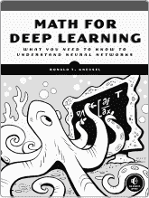
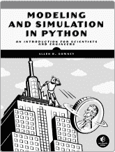
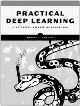
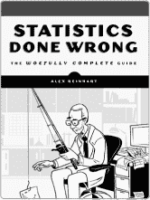
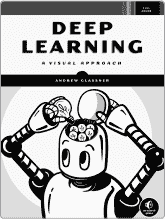
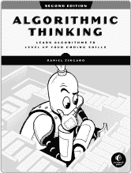

## 第十四章：**索引**

### **A**

等位基因，85，93

苹果 II，212

人工智能（AI），253–254

大气噪声，17

Audacity，12，240

### **B**

反向传播，182

培根，弗朗西斯爵士，40

精简粒子群优化（PSO），114

巴恩斯利，迈克尔，224

BASIC 程序，212

巴斯，托马斯，12

贝叶斯，托马斯，327

贝叶斯推断，328

贝叶斯定理，328

伯努利交叉，116

伯特朗，约瑟夫，100

伯特朗悖论，101

大 O 符号，301

比尔斯，阿尔，253

块随机化，276

保尔，保罗，229

博克斯，乔治，74

博克斯-穆勒分布，184

箱型图，79

“布赖恩的主题”，212

### **C**

*概率计算*（伯特朗），100

微积分积分，324

康托尔，乔治，325

中心极限定理，4

混沌游戏，224–225

查普曼估计，306

科恩的*d*，275

颜色表，215

组合爆炸，298

压缩感知，255–259

切比雪夫不等式，263

应用，267–268

离散余弦变换，258

反问题，257

Lasso 优化，258

范数，258

欧几里得，258

曼哈顿，258

奈奎斯特-香农采样定理，256

稀疏性，257

欠定系统，257

均匀采样，256

混淆矩阵，187，191

连续分布，3，340

Coppersmith-Winograd 算法，305

克莱默法则，236

加密安全，27

加密学，39

累积分布函数（CDF），325

维度灾难，349

曲线拟合，106，109

### **D**

达尔文，查尔斯，85

数据增强，175，179

数据集

乳腺癌，174

鸢尾花, 198

MNIST, 178, 208

决策树, 198

解释, 200

确定性过程, 21

德弗罗耶，卢克, 329

差分进化（DE）算法, 105, 115

恐龙, 93

离散余弦变换（DCT）, 258

离散分布, 2

分治算法, 315

鸭子类型, 111

### **E**

埃伯哈特，拉塞尔, 115

图像增强, 150–159

`ent`, 6

熵, 7

时代, 187

欧几里得距离, 86, 196

欧几里得范数, 258

*Eudaemonic Pie, The* (Bass), 12

进化, 84–99

灾难性世界, 93

交叉, 85–86

灭绝, 101

适应度, 86, 90

创始人效应, 93

基因漂变, 85, 93

基因型, 95

逐渐变化的世界, 91

突变, 85–86, 90

自然选择, 85

种群瓶颈, 93

静态世界, 89

进化算法, 103

差分进化, 105, 115

基因的, 105, 114

有机体, 104

实验设计, 271

区块随机化, 276

对照组, 275

协变量, 277

双盲研究, 278

效应大小, 275

功效分析, 291

随机噪声, 271

样本偏差, 272

简单随机化, 275

分层随机化, 277

处理组, 275

可解释人工智能（XAI）, 198

指数分布, 340–341

极限学习机, 173, 189

鲁莽群体优化, 194–197

### **F**

农民，J. Doyne, 12

快速加载骰子滚动器, 331

费马，皮埃尔, 311

`Fetch`, 33–34

拟合数据, 116–132

傅里叶空间, 267

分形

吸引子, 227–228

混沌游戏, 224–225

Hausdorff 维度, 226

迭代函数系统, 227

收缩映射, 228, 232

创建地图, 234

地图, 228–229

自相似, 224

谷形三角形, 225, 235

Freivalds 算法, 301–304

### **G**

银河算法, 304–305

高斯分布, 3

生成对抗网络, 253

生成型 AI, 253–254

遗传学。*参见* 进化

GenJam, 253

Glorot 初始化, 184。*参见* scikit-learn

梯度下降, 182

伟大灭绝事件, 93

灰狼优化器, 133

网格扭曲

函数, 221

旋转, 223

冈德森, 格雷戈里, 353

### **H**

哈尔, 马茨, 17

哈尔顿序列, 24

哈明距离, 251

哈特尔, 丹尼尔, 73

Hausdorff 维度, 226

He 初始化, 183

赫罗多图, 40

直方图, 5

HotBits, 20

布赖恩·霍华德, 212

混合过程, 26

假设检验

曼-惠特尼 U 检验, 186

t 检验, 186

### **I**

IFS 构建工具包, 237

图像格式, 62

灰度, 62

RGB, 62

图像，解开, 263–267

逆问题, 257

逆变换抽样, 340

迭代函数系统, 227

吸引子, 228

收缩映射, 228, 232

地图, 228–229, 234

### **J**

贾亚, 105, 113

### **K**

詹姆斯·肯尼迪, 115

Kilroy 曾在此, 67

奈瑟尔, 保罗（作曲家）, 56

k 空间, 267

Kumaraswamy 分布, 342

### **L**

`lame`, 249

Lasso 优化, 258

拉斯维加斯算法, 296

林肯-彼得森估计, 306

线性同余生成器, 21

有损压缩, 55. *另见* 声音

卢卡谢维奇, 扬, 117

### **M**

机器学习

数据增强, 175, 179

决策树, 198

解释, 200

极限学习机, 173

过拟合, 200

随机森林, 173, 198

装袋法, 201

自助法, 201

集成, 203

随机特征选择, 205

磁共振成像, 267

曼哈顿范数, 258

曼-惠特尼 U 检验, 186

标记与重捕

查普曼估计, 306

林肯-彼得森估计, 306

马尔可夫, 安德烈, 349

马尔可夫链, 349

平稳分布, 349

转移概率, 349

马尔可夫链蒙特卡罗（MCMC）, 349

*深度学习数学*（Kneusel）, 5

矩阵乘法, 299–300

列向量, 299

平方, 299

麦格雷恩, 沙朗·伯奇, 328

旋律, 245. *另见* 声音

梅森素数, 310

梅森旋转器（MT19937）, 23

元启发式算法, 103

曲线拟合, 106, 109

泛化算法, 104

遗传编程, 116

杂货店, 159

图像增强, 150

自然启发式, 133–134

目标函数, 107

圆形打包, 137

设置基站, 142

美特罗波利斯-哈斯廷斯抽样, 352

算法, 353

烧入, 354

跟踪图, 357

MiCRO, 133

MIDI（音乐仪器数字接口）, 245

米勒-拉宾测试, 311–313

非见证数, 313

性能, 314–315

测试见证数, 312

MINSTD 生成器, 22

模运算, 311

莫尔条纹, 212

蒙特卡罗算法, 296

摩尔-彭若斯伪逆, 190

`mplayer`, 240

多层感知机（MLP），182–183

MuseScore，245

### **N**

自然选择。*见* 进化

神经网络

激活函数，193

解剖学，180

架构，187

反向传播，182

混淆矩阵，188，191

极限学习机，173，189

生成对抗网络，253

梯度下降，182

初始化，183，185

修正线性单元，181

训练，182

变分自编码器，253

*非均匀随机变量生成*（Devroye），329

原假设，9

`NumPyGen`，30–31

Nyquist-Shannon 采样定理，255

### **O**

优化，103

粒子群，105，113

随机，105，113

过拟合，200

### **P**

Packard, Norman，12

PCG64，23

感知机，183

排列排序（bogosort），296

Pillow（PIL），63

多项式时间算法，27

群体遗传学，88。*另见* 进化

后缀表示法，117

*实用深度学习：基于 Python 的入门*（Kneusel），182

Price, Kenneth，115

素性测试，310

Fermat 测试，311

Miller-Rabin，311

非见证数，313

测试见证数，312

*群体遗传学与基因组学导论*（Hartl），73

主成分分析，175

概率

贝叶斯推理，328

贝叶斯定理，328

条件，328

累积分布函数，325

分布，1

贝塔，87

二项式，282，324

Box-Muller，184

连续，2

离散，2

指数，340

高斯，3

Kumaraswamy，342

正态，3，114，184

均匀，3

证据，328

直方图，5

联合，328

似然，328

正态分布 PDF, 326

归一化, 328

后验概率, 328

先验概率, 328

概率密度函数, 324

概率质量函数, 324

随机变量, 1

伪随机生成器

密码学安全, 27

`/dev/urandom`, 26

线性同余生成器, 21

梅森旋转器, 23

MINSTD, 22

PCG64, 23

周期, 22

`RDRAND` 指令, 26

种子, 21

伪随机过程, 1, 21

p 值, 9

### **Q**

准随机生成器, 24

Halton 序列, 24

准随机过程, 1, 21

快速排序, 315–318

### **R**

放射性衰变, 20

随机森林, 173, 198

装袋法, 201

自助法, 201

集成方法, 203

随机特征选择, 205

随机化

块, 276

组合, 292

在实验中, 272

简单, 275

分层, 277

随机化算法, 295

拉斯维加斯算法, 296

蒙特卡洛算法, 296

随机性引擎 (RE), 29

随机噪声, 271. *另见* 实验设计

*随机数与计算机* (Kneusel), 29

随机过程

大气噪声, 17

抛硬币, 8

去偏, 10

掷骰子, 11

混合, 26

物理, 16

伪随机, 1, 21

准随机, 1, 21

放射性衰变, 20

轮盘赌, 12

测试, 6

真正的随机, 8

随机变量, 1

随机游走, 215

`RDRAND`, 26

`RE` 类, 30, 35–36

Regan, Kenneth W., 305

Reinhart, Alex, 5

反波兰表示法 (RPN), 117

Riddle, Larry, 237

Rosenblatt, Frank, 183

### **S**

采样, 324

快速加载骰子滚动器, 331

逆变换, 340

马尔可夫链, 349

平稳分布, 349

转移概率, 349

马尔可夫链蒙特卡罗, 349

Metropolis-Hastings, 352

算法, 353

烧入期, 354

跟踪图, 357

拒绝, 344

算法, 345

提议函数, 344

顺序搜索反转, 329

声音, 240

科学方法, 271

scikit-learn, xxiii, 187. *另见* Glorot 初始化

顺序搜索反转, 329

香农，克劳德, 12

塞尔皮ński，瓦茨瓦夫, 225

简单随机化, 275

仿真, 73–74, 278

生日悖论, 80–84

估计*π*, 74–80

演化, 84–99

灾难性, 93

遗传漂变, 93

静态, 89

实验, 278–291

正常性检查, 91

软件

Audacity, 12, 240

`ent`, 6

GenJam, 253

IFS 构建工具包, 237

`lame`, 249

`mplayer`, 240

MuseScore, 245

Pillow, 63

`wildmidi`, 245

声音

C 大调音阶, 244

旋律, 245

MIDI, 245

音乐模式, 246

随机, 239–241

采样, 240

正弦波, 241–243

WAV 文件, 239

源代码

*40000cointosses.py*, 10

*algorithms.py*, 249

*bad_sample.py*, 276

*bagging.py*, 203

*birthday.py*, 81

*bootstrap.py*, 201

*brute_primes.py*, 314

*build_bc_data.py*, 175

*build_mnist_dataset.py*, 178

*cdf.py*, 326

*cell.py*, 142

*circles.py*, 138

*cohen_d_test.py*, 290

*count.py*, 319

*cs_image.py*, 263

*cs_signal.py*, 260

*curfit_example.py*, 106

*curves.py*, 106

*darwin_catastrophic.py*, 93

*darwin_drift.py*, 93

*darwin_slow.py*, 91

*darwin_static.py*, 89

*DE.py*, 115

*design.py*, 278

*discrete_2d.py*, 338

*discrete_ravel.py*, 336

*discrete_test.py*, 332

*drift.py*, 96

*elm_brute.py*, 196

*elm.py*, 190

*elm_swarm.py*, 195

*elm_test.py*, 193

*elm_test_results.py*, 194

*enhance.py*, 152

*evolve.py*, 248

*fldr.py*, 331

*forest_mnist.py*, 206

*forest.py*, 205

*F.py*, 159

*freivalds_plots.py*, 304

*freivalds.py*, 303

*GA.py*, 115

*gaussian.py*, 133

*gpgen.py*, 126

*gp.py*, 119

*GWO.py*, 133

*ifs_maps.py*, 233

*ifs.py*, 229

*init_test.py*, 185

*inverse_cauchy.py*, 359

*inverse.py*, 342

*iris_tree.py*, 199

*make_random.py*, 49

*make_results_plot.py*, 149

*make_towers_plot.py*, 149

*markov_chain.py*, 351

*mark_recapture.py*, 307

*mark_recapture_range.py*, 309

*mcmc_movie.py*, 358

*mcmc.py*, 355

*melody_maker.py*, 245

*merge_images.py*, 158

*MiCRO.py*, 133

*miller_rabin.py*, 313

*mnist_test.py*, 180

*moire.py*, 212

*note_walker.py*, 244

*nselect.py*, 327

*permutation_sort_plot.py*, 298

*permutation_sort.py*, 296

*plot_gbest_giter.py*, 133

*plot_results.py*, 141

*polygon.py*, 227

*power_analysis.py*, 291

*prime_tests.py*, 314

*process_images.py*, 158

*process_results.py*, 166

*process_rgb_images.py*, 169

*process_vgr_data.py*, 18

*product_order.py*, 167

*PSO.py*, 124

*Quicksort.py*, 316

*quicksort_tests.py*, 317

*random_sounds.py*, 240

*rejection.py*，345

*RE.py*，29

*rf_vs_mlp.py*，208

*rf_vs_mlp_results.py*，208

*RO.py*，134

*sierpinski.py*，225

*silence.py*，14

*sim_pi.py*，76

*sim_pi_quasi.py*，78

*sim_pi_test.py*，78

*sine_walker.py*，242

*songs.py*，250

*spheres.py*，169

*steg_audio.py*，55

*steg_audio_test.py*，58

*steg_image.py*，65

*steg_image_test.py*，66

*steg_random.py*，49

*steg_random_test.py*，50

*steg_simple.py*，41

*steg_text.py*，44

*store.py*，159

*test_mmult.py*，319

*walker.py*，216

*warp_factor_9.py*，224

*warp.py*，222

螺旋图，212

栈，117

统计学

中央极限定理，4

*χ*² 检验，7，9

Mann-Whitney U，186

零假设，9

p 值，9

分位数，201

统计学显著性，9

t 检验，9，186

*Statistics Done Wrong*（Reinhart），5

隐写术，39

音频数据，55

Bacon 密码，40

解码文件，54

在随机数据中嵌入，47

编码文件，52–53

固定偏移，41

历史，40

图像文件，62

池文本，41

随机偏移，44

秘密密钥，44

隐写分析，39

Storn, Rainer，115

Strassen 算法，304

分层随机化，277

群体智能，103，105

算法

精简版 PSO，114

差分进化，115

遗传，114–115

灰狼优化器，133

Jaya，105，113

MiCRO，133

粒子群优化，105，113

随机优化，105，113

粒子，104

### **T**

随机性测试，6

*The Theory That Would Not Die*（McGrayne），328

Thorp, Edward, 12

真正的随机过程, 8–16

T 恤, 217

t 检验, 9, 167, 186

turtle 图形, 212

### **V**

von Neumann, John, 10, 21

*旅行者* 太空船, 18

### **W**

WAV 文件, 239

`wildmidi`, 245

《随机艺术》一书中使用的字体包括 New Baskerville、Futura、The Sans Mono Condensed 和 Dogma。该书由 Boris Veytsman 使用 LaTeX2*ɛ* 包 `nostarch` 排版（*2008/06/06 v1.3 为 No Starch Press 排版书籍*）。

**资源**

访问 *[`nostarch.com/art-randomness`](https://nostarch.com/art-randomness)* 查看勘误和更多信息。

*更多实用无废话的书籍来自*  **NO STARCH PRESS**

**深度学习数学**

**你需要知道的神经网络基础**

*编者* RONALD T. KNEUSEL

344 页, $49.99

ISBN 978-1-7185-0190-4

**Python 中的建模与仿真**

**科学家和工程师的入门**

*编者* ALLEN B. DOWNEY

280 页, $39.99

ISBN 978-1-7185-0216-1

**实用深度学习**

**基于 Python 的入门**

*编者* RONALD T. KNEUSEL

464 页, $59.95

ISBN 978-1-7185-0074-7

**统计学误用**

**极其全面的指南**

*编者* ALEX REINHART

176 页, $24.95

ISBN 978-1-59327-620-1

**深度学习**

**一种视觉化的方法**

*编者* ANDREW GLASSNER

768 页, $99.99

ISBN 978-1-7185-0072-3

*全彩*

**算法思维，第二版**

**学习算法，提升技能**

你的编码技能**

*编者* DANIEL ZINGARO

480 页, $49.99

ISBN 978-1-7185-0322-9

**电话：**

800.420.7240 或

415.863.9900

**电子邮件：**

SALES@NOSTARCH.COM

**网站：**

[WWW.NOSTARCH.COM](http://WWW.NOSTARCH.COM)
