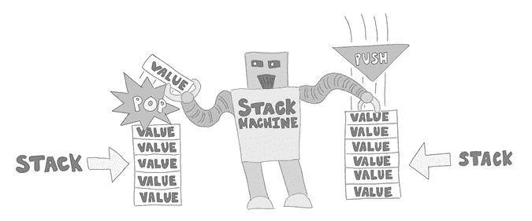
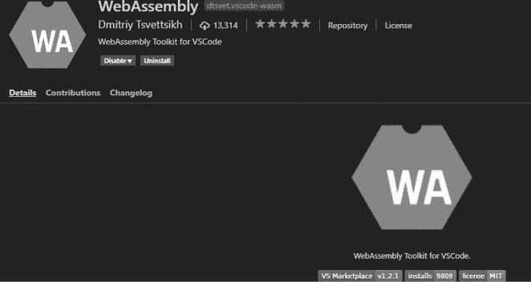

# 1

WebAssembly 简介


本章中，你将获得 WebAssembly 的背景知识，并探索开始使用 WebAssembly 及其文本表示 WebAssembly Text (WAT)所需的工具。我们将讨论 WebAssembly 的好处，包括提升性能、旧版库集成、可移植性、安全性，以及它作为 JavaScript 替代品的应用。我们将考虑 JavaScript 与 WebAssembly 的关系，并阐明 WebAssembly 是什么以及不是什么。你将学习 WAT 内联和 S 表达式语法。我们将介绍嵌入环境的概念，并讨论如何在网页浏览器、Node.js 和 WebAssembly 系统接口（WASI）中嵌入 WebAssembly。

然后，我们将讨论使用 Visual Studio Code 作为 WAT 开发环境的好处。你将学习 Node.js 的基础知识，以及如何将其用作 WebAssembly 的嵌入环境。我们将展示如何使用 npm 安装 wat-wasm 工具，它为你提供了从 WAT 构建 WebAssembly 应用程序所需的一切。此外，我们还将编写第一个 WebAssembly 应用程序，并使用 Node.js 作为嵌入环境执行它。

## 什么是 WebAssembly？

WebAssembly 是一项技术，将在未来几年大幅提升网页应用程序的性能。由于 WebAssembly 是新技术，并且需要一定的解释，许多人对它及其使用方法存在误解。本书将教你 WebAssembly 是什么，以及如何使用它来构建高性能的网页应用程序。

*WebAssembly*是一个虚拟的*指令集架构（ISA）*，用于栈机器。通常，ISA 是一种为特定机器设计的二进制格式。然而，WebAssembly 是为运行在*虚拟*机器上而设计的，这意味着它并不是为物理硬件设计的。虚拟机器使得 WebAssembly 能够在多种计算机硬件和数字设备上运行。WebAssembly 的 ISA 旨在紧凑、可移植且安全，具有小巧的二进制文件，以减少作为网页应用程序一部分进行部署时的下载时间。它容易将字节码移植到多种计算机硬件，并提供一个安全的平台来通过网络部署代码。

所有主要浏览器厂商都已经采用了 WebAssembly。根据 Mozilla 基金会的说法，WebAssembly 代码的执行速度比等效的 JavaScript 代码快 10%到 800%。一个 eBay 的 WebAssembly 项目比原始的 JavaScript 版本执行速度快了 50 倍。在本书后续内容中，我们将构建一个碰撞检测程序，用于衡量性能。我们运行它时，性能基准测试发现我们的 WebAssembly 碰撞检测代码在 Chrome 中运行速度比 JavaScript 快了四倍多，在 Firefox 中则比 JavaScript 快了两倍多。

WebAssembly 提供了自引入即时编译（JIT）JavaScript 编译器以来，网页性能上最显著的提升。现代浏览器的 JavaScript 引擎能比 JavaScript 快一个数量级地解析和下载 WebAssembly 二进制格式。WebAssembly 作为一个二进制目标，而不是像 JavaScript 这样的编程语言，允许开发者选择最适合其应用需求的编程语言。最近流行的说法“JavaScript 是网页的汇编语言”或许变得时髦，但 JavaScript 格式是一个糟糕的编译目标。JavaScript 不仅效率不如像 WebAssembly 这样的二进制格式，而且任何 JavaScript 目标代码还必须处理 JavaScript 语言的细节。

WebAssembly 在两个领域提供了巨大的网页应用性能提升。其中之一是启动速度。目前，最紧凑的 JavaScript 格式是最小化的 JavaScript，它提高了应用程序的下载大小，但必须解析、解释、JIT 编译并优化 JavaScript 代码。这些步骤在 WebAssembly 二进制格式中是多余的，WebAssembly 也更紧凑。WebAssembly 仍然需要解析，但它的速度更快，因为它是字节码格式而非文本格式。Web 引擎仍然会对 WebAssembly 进行优化，但速度要快得多，因为这种语言设计得更为简洁。

WebAssembly 提供的另一个显著的性能提升体现在吞吐量上。WebAssembly 使得浏览器引擎更容易进行优化。JavaScript 是一种高度动态且灵活的编程语言，这对 JavaScript 开发者来说非常有帮助，但却会带来代码优化的噩梦。WebAssembly 不做任何网页特定的假设（尽管它的名字如此），并且可以在浏览器之外使用。

最终，WebAssembly 可能能够做 JavaScript 能做的一切。不幸的是，目前的版本——其 MVP（最小可行产品）版本 1.0——做不到。在 MVP 版本中，WebAssembly 可以很好地完成某些任务。它并不是为了成为 JavaScript 或像 Angular、React 或 Vue 这样的框架的直接替代品。如果你现在想使用 WebAssembly，你应该有一个需要非常高性能的特定计算密集型项目。在线游戏、WebVR、3D 数学和加密是人们目前使用 WebAssembly 的有效方式。

## 使用 WebAssembly 的理由

在我们更深入地了解 WebAssembly 之前，先来看看你可能对使用它感兴趣的几个理由。这些解释还应该能帮助你理解 WebAssembly 是什么，以及为什么和如何使用它。

### 更好的性能

JavaScript 要求软件工程师做出会影响 JavaScript 引擎设计的选择。例如，你可以使用 JIT 优化编译器来优化 JavaScript 引擎的峰值性能，这可以使代码执行更快，但需要更多的启动时间。或者，你可以使用解释器，它可以立即开始执行代码，但无法达到 JIT 优化编译器的峰值性能。大多数 JavaScript 引擎设计师在他们的 Web 浏览器中使用的解决方案是同时实现这两者，但这需要更大的内存占用。你做的每一个决策都是一个权衡。

WebAssembly 允许更快的启动时间和更高的峰值性能，同时避免了过多的内存膨胀。不幸的是，你不能仅仅将 JavaScript 重新编写为 AssemblyScript、Rust 或 C++，然后期待它会发生这种情况，而不做一些额外的工作。WebAssembly 不是魔法，单纯地将 JavaScript 移植到另一种语言并编译它，而不了解 WebAssembly 在更低层次上是如何工作的，可能会导致一些令人失望的结果。编写 C++ 代码并使用优化标志将其编译为 WebAssembly 通常会比 JavaScript 稍微快一些。偶尔，程序员会抱怨他们整整一天都在用 C++ 重写应用程序，结果它只比原来快了 10%。如果是这种情况，可能这些应用程序并不会从转向 WebAssembly 中受益，它们的 C++ 最终会被编译成大部分的 JavaScript。花时间学习 WebAssembly，而不是 C++，让你的 Web 应用程序运行得飞快。

### 集成遗留库

有两个流行的库用于将现有库移植到 WebAssembly，它们分别是 Rust 的 *wasm-pack* 和 C/C++ 的 *Emscripten*。使用 WebAssembly 非常适合当你有现有的 C/C++ 或 Rust 编写的代码，想要将其提供给 Web 应用程序，或是想将整个现有的桌面应用程序移植到 Web 上。如果你选择这条路径，Emscripten 工具链特别适合将现有的 C++ 桌面应用程序移植到 Web 上并使用 WebAssembly。 如果这是你的选择，你可能希望你的应用程序在性能上尽可能接近原生应用的速度，只要应用程序不是资源消耗过大的话，这应该是可行的。然而，你也可能有一个需要性能调优的应用程序，使其在 Web 上的表现接近桌面版的效果。在本书结束时，你将能够评估你的工具链从现有代码生成的 WebAssembly 模块。

### 可移植性和安全性

我们将便携性和安全性特性合并到一个部分，因为它们通常是一起出现的。WebAssembly 起初是为了在浏览器中运行的技术，但它正在迅速扩展，成为一个可以在任何地方运行的沙盒环境。从服务器端的 WASI 代码到 WebAssembly 在嵌入式系统和物联网（IoT）中的应用，WebAssembly 工作组正在创建一个高度安全的运行时环境，防止恶意行为者破坏你的代码。我推荐你收听 Lin Clark 在第一次 WebAssembly Summit 上关于 WebAssembly 安全性和包重用的精彩演讲（[`www.youtube.com/watch?v=IBZFJzGnBoU/`](https://www.youtube.com/watch?v=IBZFJzGnBoU/)）。

尽管 WebAssembly 工作组专注于安全性，但没有任何系统是完全安全的。学习从低层次理解 WebAssembly 将帮助你为未来的安全风险做好准备。

### JavaScript 怀疑论者

有些人简单地不喜欢 JavaScript，希望 JavaScript 不是主流的 Web 编程语言。不幸的是，WebAssembly 并没有能力推翻 JavaScript。今天，JavaScript 和 WebAssembly 必须共存，并且能够良好配合，如 图 1-1 所示。

但是对于世界上的 JavaScript 怀疑论者来说，还是有好消息的：WebAssembly 工具链提供了许多选项，让你能够在不写 JavaScript 的情况下编写 Web 应用程序。例如，Emscripten 允许你用 C/C++ 编写 Web 应用程序，几乎不需要，甚至完全不需要 JavaScript。你还可以使用 Rust 和 wasm-pack 编写完整的 Web 应用程序。这些工具链不仅生成 WebAssembly，还为你的应用程序生成大量的 JavaScript 配套代码。原因是，目前 WebAssembly 的能力有限，工具链用 JavaScript 代码填补这些空白。像 Emscripten 这样的成熟工具链的优点就是，它们为你做了这些。如果你正在使用这些工具链开发，了解你的代码何时会转化为 WebAssembly，何时会是 JavaScript，是很有帮助的。这本书将帮助你了解什么时候会发生这种情况。


图 1-1：JavaScript 和 WebAssembly 可以和谐共存。

## WebAssembly 与 JavaScript 的关系

澄清 WebAssembly 如何与 JavaScript 一起使用并进行比较非常重要。WebAssembly 并不是 JavaScript 的直接替代品；相反，WebAssembly：

+   下载、编译和执行速度更快

+   允许你使用除了 JavaScript 之外的其他语言编写 Web 应用程序

+   当正确使用时，可以为你的应用程序提供接近本地的速度

+   在适当使用时，*与* JavaScript 一起工作，可以提高你的 Web 应用程序的性能

+   它不是一种汇编语言，尽管它有一个与之相关的伪汇编语言（WAT）

+   不仅仅适用于 Web，还可以从非浏览器 JavaScript 引擎（如 Node.js）执行，或者使用实现了 WASI 的运行时执行

+   目前还没有一种适用于所有情况的解决方案来创建 Web 应用程序

WebAssembly 是所有主要浏览器厂商合作的结果，旨在创建一个新的平台，用于通过互联网分发应用程序。JavaScript 语言源于 1990 年代末期对 web 浏览器的需求，发展成今天成熟的脚本语言。尽管 JavaScript 已经成为一种相对快速的语言，web 开发者们注意到它有时表现得不稳定。WebAssembly 是解决 JavaScript 性能问题的一个方案。

虽然 WebAssembly 无法完成 JavaScript 所能做的所有事情，但它能够在执行某些操作时，比 JavaScript 更快且消耗更少的内存。本书中，我们将对比 JavaScript 代码与对应的 WebAssembly。我们将反复进行基准测试和性能分析进行比较。在本书的结尾，你将能够判断什么时候应该使用 WebAssembly，什么时候继续使用 JavaScript 更为合适。

## 为什么要学习 WAT？

许多 WebAssembly 书籍和教程专注于特定的工具链，例如上述的用于 Rust 的 wasm-pack 或用于 C/C++ 的 Emscripten。其他语言的工具链，如 AssemblyScript（TypeScript 的一个子集）和 Go，目前正在开发中。这些工具链是程序员转向 WebAssembly 的一个主要原因，越来越多的 WebAssembly 语言工具链不断涌现。未来，web 开发者将能够根据项目需求而非语言可用性来选择开发语言。

在这些语言中，有一个因素是通用的，那就是理解 WebAssembly 在最低层级的工作原理。深入理解 WAT 可以让你明白为什么代码的执行速度可能没有你预期的快。它有助于你理解 WebAssembly 如何与其嵌入环境交互。在 WAT 中编写模块是尽可能接近底层（低级）工作的最佳方式。了解 WAT 可以帮助你创建最高性能的 web 应用，并允许你反汇编和评估任何为 WebAssembly 平台编写的 web 应用程序。它有助于你评估潜在的安全风险。此外，它使你能够编写尽可能接近本地速度的代码，而无需编写本地代码。

那么，什么是 WAT？WAT 就像是 WebAssembly 虚拟机的汇编语言。让我们从实际的角度来看看这意味着什么。用 Rust 或 C++ 等语言编写 WebAssembly 程序时，使用的工具链会编译出一个 WebAssembly 二进制文件，还会生成 JavaScript 配合代码和嵌入 WebAssembly 模块的 HTML。WebAssembly 文件与机器代码非常相似，因为它包含了各个部分、操作码和数据，所有这些都存储为一系列二进制数字。当你拥有一个机器代码的可执行文件时，可以将该文件反汇编成该机器的*汇编语言*，这是一种最低级的编程语言。汇编语言将二进制中的数字操作码替换为助记码，旨在便于人类读取。WAT 就充当了 WebAssembly 的汇编语言。

### WAT 编码风格

有两种主要的 WAT 编码风格可以选择。一种风格是*线性指令列表*风格。这种编码风格要求开发者在心理上跟踪栈中的项。大多数 WAT 指令会将项推入栈中、从栈中弹出项，或两者兼有。如果选择使用线性指令风格，那么在调用指令之前，指令的参数必须放置在隐式栈中。另一种编码风格叫做*S-表达式*。S-表达式是一种树状结构的编码方式，参数以一种类似于 JavaScript 函数调用的方式传入树中。如果你在可视化栈和项的推入与弹出时遇到困难，S-表达式语法可能更适合你。你也可以根据隐式栈使用两种风格：对于较不复杂的指令使用线性指令风格，对于参数数量较多且难以跟踪时使用 S-表达式。

#### 使用线性指令列表风格的示例

考虑在清单 1-1 中展示的简单加法函数，它使用的是 JavaScript。

```
function main() {
    let a_val = 1;
    let b_val = 2;
    let c_val = a_val + b_val;
}
```

清单 1-1：JavaScript 代码添加 `a_val` 和 `b_val` 变量

执行这些代码行后，`c_val` 变量的值现在是 `3`，这是将 `a_val` 和 `b_val` 相加的结果。要在 WAT 中完成相同的任务，你需要编写相当多的代码行。清单 1-2 展示了使用 WAT 编写的相同程序。

```
(module
  1 (global $a_val (mut i32) (i32.const 1))
  2 (global $b_val (mut i32) (i32.const 2))
    (global $c_val (mut i32) (i32.const 0))
    (func $main (export "main")
        global.get $a_val
        global.get $b_val

        i32.add
        global.set $c_val
    )
)
```

清单 1-2：WebAssembly 将 `$a_val` 加到 `$b_val`

示例 1-2 包含更多的代码行，因为 WAT 必须比 JavaScript 更加明确。JavaScript 在代码运行之前无法知道前两个示例中的类型是浮点数据、整数、字符串，还是它们的混合。而 WebAssembly 是提前编译成字节码的，并且必须在编译时意识到它使用的类型。JavaScript 必须在 JIT 编译器将其转换为字节码之前进行解析和标记化。一旦优化编译器开始处理这些字节码，编译器就必须观察变量是否始终为整数。如果是这样，JIT 编译器就可以创建一个假设这些变量为整数的字节码。

然而，JavaScript 永远无法确定在期望整数时是否会得到字符串数据或浮点数据；因此，随时都必须准备好丢弃优化后的代码并重新开始。WAT 代码可能更难编写和理解，但它更容易被网页浏览器执行。WebAssembly 将大量工作从浏览器转移到工具链编译器或开发人员身上。不必做那么多工作，使得浏览器更加高兴，应用程序运行得更快。

#### 堆栈机器

如前所述，WebAssembly 是一个虚拟堆栈机器。让我们来探讨一下这意味着什么。可以将堆栈想象成一堆碗碟。这个比喻中的每个碗碟就是一块数据。当你将一个碗碟放到堆栈上时，你将它放在已经存在的碗碟上面。当你从堆栈中取出一个碗碟时，你不是从底部取出，而是从顶部取出。因此，你最后放到堆栈上的碗碟是第一个取出的碗碟。在计算机科学中，这叫做*后进先出*（*LIFO*）。将数据添加到堆栈中叫做*推入*（*push*），从堆栈中取出数据叫做*弹出*（*pop*）。使用堆栈机器时，几乎所有指令都会与堆栈进行某种交互，要么通过推入操作将数据添加到堆栈顶部，要么通过弹出操作从堆栈顶部移除数据。图 1-2 显示了堆栈交互的示意图。



图 1-2：堆栈机器从堆栈中弹出值并将值推入堆栈。

如前所见，在示例 1-2 中，`$main` 函数的前两行先将 `$a_val` 推入堆栈 1 的顶部，然后再将 `$b_val` 推入其上面 2。结果是堆栈中有两个值。堆栈底部的值是 `$a_val` 中的值，因为它是第一个添加的，堆栈顶部的值是 `$b_val` 中的值，因为它是最后添加的。

重要的是要区分堆栈机器的 ISA（指令集架构），比如 WebAssembly，和寄存器机器的 ISA，比如 x86、ARM、MIPS、PowerPC 或过去 30 年里任何其他流行的硬件架构。寄存器机器必须将数据从内存移动到 CPU 寄存器中，以便执行数学运算。WebAssembly 是一个虚拟堆栈机器，必须运行在寄存器机器上。当我们编写 WAT 格式的代码时，你将近距离观察到这种交互。

栈机器通过将数据推入栈中和从栈中弹出数据来执行计算。硬件栈机器是一种稀有的计算机类型。像 WebAssembly 这样的虚拟栈机器则更为常见；例如 Java 的 JVM、Adobe Flash 播放器的 AVM2、以太坊的 EVM 和 CPython 字节码解释器。虚拟栈机器的优势在于它们能创建更小的字节码，这对于任何需要通过互联网下载或流式传输的字节码来说非常有用。

栈机器不对嵌入环境中可用的一般寄存器数量做出任何假设。这使得硬件能够选择何时使用哪些寄存器。如果你不清楚栈机器是如何工作的，WAT 代码可能会有些混乱，那么让我们再次看看`$main`函数的前两行代码，特别是在考虑栈的情况下（列表 1-3）。

```
global.get $a_val ;; push $a_val onto the stack
global.get $b_val ;; push $b_val onto the stack
```

列表 1-3：获取`$a_val`和`$b_val`，然后将它们推入栈中

第一行获取了`$a_val`的值，我们将其定义为全局值，第二行获取了全局变量`$b_val`。这两个项最终被推入栈中，等待处理。

函数`i32.add`从栈中取出两个 32 位整数变量，将它们相加，然后将结果重新推入栈顶。当这两个值被放入栈中时，我们可以调用`i32.add`。如果你运行一个弹出栈中更多值的函数，而栈中没有足够的值，转换 WAT 为 WebAssembly 二进制的工具将不允许这样做，并会抛出编译错误。我们在`$main`函数的最后一行使用栈中的值来设置`$c_val`变量。这个值是`i32.add`函数调用的结果。

#### 使用 S 表达式的示例

S 表达式是一种用于编程语言中的嵌套树结构编码风格，例如 Lisp。在列表 1-3 中，我们使用了线性指令列表风格来编写 WAT。线性指令风格在每个调用语句和表达式调用时，隐式地使用栈。对于有一定汇编语言经验的人来说，这种方法可能会感觉比较熟悉。但如果你是从高层语言（如 JavaScript）转向 WebAssembly 的话，S 表达式语法可能会更容易理解。S 表达式以嵌套结构组织你对 WAT 语句和表达式的调用。线性风格要求你在编写代码时，脑海中将项推入栈中并弹出。而 S 表达式更像是 JavaScript 函数调用，而不是线性风格。

在列表 1-2 中，我们通过栈将`c_val`设置为`a_val` + `b_val`。在列表 1-4 中的代码是列表 1-2 中将这些值相加的代码片段：

```
1 global.get $a_val ;; push $a_val onto the stack
global.get $b_val ;; push $b_val onto the stack

2 i32.add           ;; pop two values, add and place result on stack
global.set $c_val ;; pop a value off the stack and set $c_val
```

列表 1-4：在 WebAssembly 中添加并设置`$c_val`

我们将两个 32 位整数变量推送到堆栈中，这些变量是通过 `global.get` 1 从全局变量中获取的。然后我们通过调用 `i32.add` 弹出这两个值。将这两个值相加后，`i32.add` 2 函数将结果值推回堆栈。这就是堆栈机器的工作方式。每个指令要么将值推送到堆栈中，要么从堆栈中弹出值，或者两者兼有。

列表 1-5 显示了使用替代的 S-Expression 语法的相同函数。

```
(module
  (global $a_val (mut i32) (i32.const 1))
  (global $b_val (mut i32) (i32.const 2))
  (global $c_val (mut i32) (i32.const 0))
  (func $main (export "main")
  1 (global.set $c_val
      (i32.add (global.get $a_val) (global.get $b_val))
    )
  )
)
```

列表 1-5：WebAssembly 模块，用于相加两个值

不要让括号弄混你：它们的作用和许多语言中的`{}`字符相同，用来创建代码块。当编写 WAT 函数时，我们将函数包含在括号中。当你将匹配的右括号放在与左括号相同的缩进位置时，它看起来类似于你在像 JavaScript 这样的语言中缩进 `{` 和 `}` 字符。例如，看看 `global.set` 1 调用前的 `(` 的缩进，并用眼睛对齐它下面的闭合 `)`。

这段代码看起来更像是一种传统的编程语言，而不是 列表 1-2，因为它似乎将参数传递给函数，而不是通过堆栈推送和弹出值。明确来说，这段代码会编译成相同的二进制文件。如果你以 S-Expressions 风格编写代码，你仍然是在堆栈上推送和弹出项。这种写 WAT 的风格只是 *语法糖*（使代码更易读的语法）。当你熟悉将 WebAssembly 文件反汇编成 WAT 时，你会发现反汇编工具（例如 *wasm2wat*）并没有提供 S-Expression 语法。

## 嵌入环境

如前所述，WebAssembly 并不直接运行在硬件上。你必须将 WebAssembly 二进制嵌入到一个主机环境中，这个环境控制着 WebAssembly 模块的加载和初始化。在本书中，我们使用 JavaScript 引擎，如 Node.js 和 Web 浏览器作为嵌入环境。其他环境包括 WASI，如 wasmtime（稍后定义）。但是即便我们讨论 WASI，我们在本书中不会使用它，因为它仍然非常新且在开发中。实现堆栈机器的是嵌入环境。由于现代硬件通常是寄存器机器，嵌入环境通过硬件寄存器来管理堆栈。

### 浏览器

你很有可能对 WebAssembly 感兴趣，因为你希望它能提升你网页应用程序的性能。所有现代浏览器的 JavaScript 引擎都实现了 WebAssembly。目前，Chrome 和 Firefox 拥有最好的 WebAssembly 调试工具，因此我们建议选择其中一款浏览器进行开发。你的 WAT 应用程序在 Microsoft Edge 中也应该能正常运行，但 Internet Explorer 不再增加新功能。遗憾的是，Internet Explorer 不支持 WebAssembly，并且永远不会支持。

当你为网页浏览器编写 WAT 时，理解哪些部分可以用 WAT 编写，哪些必须用 JavaScript 编写是至关重要的。也可能会有情况，WebAssembly 带来的性能提升不一定值得额外的开发时间。如果你理解 WAT 和 WebAssembly，你将能够做出这些决策。在使用 WebAssembly 时，你必须频繁地在性能和开发时间之间做出权衡，或者在 CPU 周期和内存之间做出牺牲，反之亦然。性能优化就是关于做出选择。

### WASI

*WASI* 是 WebAssembly 应用程序的运行时规范，是 WebAssembly 与操作系统交互的标准。它允许 WebAssembly 使用文件系统、进行系统调用、处理输入输出。Mozilla 基金会创建了一个名为*wasmtime*的 WebAssembly 运行时，实施了 WASI 标准。通过 WASI，WebAssembly 能够做所有本地应用程序可以做的事情，但以安全、平台独立的方式进行。它的性能与本地应用程序相似。

Node.js 还可以使用`--experimental-wasi-unstable-preview1`标志运行 WASI 实验预览版。你可以用它运行与操作系统交互的 WebAssembly 应用程序，而不依赖网页浏览器。Windows、macOS、Linux 或任何其他操作系统都可以实现 WASI 运行时，因为它的设计目标是使 WebAssembly 具有可移植性、安全性，并最终实现普遍适用。

### Visual Studio Code

*Visual Studio Code (VS Code)* 是一个开源集成开发环境（IDE），也是我用来编写本书示例的工具。VS Code 可在 Windows、macOS 和 Linux 上使用，下载地址为[`code.visualstudio.com/download`](https://code.visualstudio.com/download)。我们使用由 Dmitriy Tsvettsikh 编写的 WebAssembly 扩展，下载链接为[`marketplace.visualstudio.com/items?itemName=dtsvet.vscode-wasm`](https://marketplace.visualstudio.com/items?itemName=dtsvet.vscode-wasm)。该扩展为 WAT 格式提供了代码高亮，并且包含几个其他有用的菜单项。例如，如果你有一个 WebAssembly 文件，你可以通过右键点击文件并选择**Show WebAssembly**菜单选项，将其反汇编为 WAT 格式。如果你想查看不是自己编写的 WebAssembly 代码，或者是通过工具链编译的代码，这非常有用。该扩展还可以将你的 WAT 文件编译为 WebAssembly 二进制文件。你可以右键点击*.wat*文件并选择**Save as WebAssembly binary file**，然后会弹出保存文件提示，允许你指定保存 WebAssembly 文件的文件名。

图 1-3 显示了扩展的截图。



图 1-3：为 VS Code 安装 WebAssembly 扩展

### Node.js

*Node.js* 是一个出色的工具，用于测试 WebAssembly 模块与现有 JavaScript 模块的性能，并且是本书中我们在许多示例中使用的 JavaScript 运行时环境。Node.js 自带 *npm (Node 包管理器)*，你可以使用它轻松安装代码包。WebAssembly 是编写 Node.js 原生模块的一个很好的替代方案，因为原生模块会将你锁定在特定的硬件上。如果你想为通用用途创建一个 npm 模块，编写 WebAssembly 可以让你获得原生模块的性能，同时保留 JavaScript 模块的可移植性和安全性。我们将使用 Node.js 执行本书中编写的许多应用程序。

Node.js 是我们执行 WebAssembly 的首选开发工具，无论是通过 JavaScript 还是通过 Web 服务器。在第七章中，我们将使用 Node.js 从 JavaScript 执行 WebAssembly 模块，并且将编写一个简单的 Web 服务器来提供 WebAssembly Web 应用程序。

Node.js 自带 npm，这使得安装一些用于开发 WebAssembly 的工具变得容易。在本节中，我们将展示如何使用 npm 安装 *wat-wasm* 模块，它是一个用于编译、优化和反汇编 WebAssembly 的工具。我们还将展示如何使用 Node.js 编写一个简单的 WebAssembly 应用程序。许多读者可能已经熟悉 Node.js，但如果没有，网上有大量的 Node.js 文档可供参考，如果你想了解更多的内容，而不仅仅是这里简短的介绍和设置部分。

#### 安装 Node.js

必须安装 Node.js 才能完成本书中的代码示例。幸运的是，安装过程并不复杂。如果你使用的是 Windows 或 macOS，可以在 [`nodejs.org/en/download/`](https://nodejs.org/en/download/) 下载适用于这两个操作系统的安装程序。

对于 Ubuntu Linux，你可以使用以下 `apt` 命令安装 Node：

```
sudo apt install nodejs
```

安装好 Node 后，在命令提示符（在任何平台上）中运行以下命令，以确保一切安装正常：

```
node -v
```

如果一切安装成功，你应该会看到安装的 Node.js 版本作为输出。当我们在 Windows 机器上运行命令 `node -v` 时，它输出如下内容：

```
v12.14.0
```

这意味着我们正在运行版本 12.14.0。

#### 安装 wat-wasm

有许多工具可用于将 WAT 代码转换为 WebAssembly 二进制文件。事实上，在写这本书的时候，我使用了其中许多工具。最终，我在 *WABT.js* 和 *Binaryen.js* 的基础上编写了 *wat-wasm*，以减少我想展示的功能所需的包的数量。要安装 `wat-wasm`，请执行以下 `npm` 命令：

```
npm install -g wat-wasm
```

`-g` 标志会将 `wat-wasm` 安装为全局模块。在本书中，我们将使用像 `wat2wasm` 这样的命令行工具。为了使这些工具不仅限于当前项目，你需要将它们全局安装。一旦安装了 `wat-wasm`，可以通过在命令行中运行 `wat2wasm` 命令来确认它是否可以正常运行：

```
wat2wasm
```

然后你应该能在控制台中看到 `wat-wasm` 的使用日志。这将展示你在本书后续内容中将要学习的各种标志。

你可以通过创建最简单的 WAT 模块来测试 `wat2wasm`，如 列表 1-6 所示。创建一个名为 *file.wat* 的新文件，并将以下代码输入该文件：

```
(module)
```

列表 1-6：最简单的 WebAssembly 模块

安装 `wat-wasm` 后，你可以使用 列表 1-7 中的命令将 *file.wat* 文件编译为 *file.wasm*，即 WebAssembly 二进制文件：

```
wat2wasm file.wat
```

列表 1-7：使用 `wat2wasm` 汇编 *file.wat* 文件

在本书中，我们将始终使用 Node.js 来运行 WebAssembly 命令行应用，并将 WebAssembly 网络应用提供给浏览器打开。在下一节中，我们将编写第一个 WebAssembly 应用，并通过 Node.js 执行。

### 我们的第一个 Node.js WebAssembly 应用

本书从使用 Node.js 作为嵌入环境开始，而不是使用网页浏览器，以便简化代码示例中的 HTML 和 CSS 部分。稍后，在掌握基础知识后，我们将探索如何使用浏览器作为嵌入环境。

我们在 Node.js 应用中的 WAT 代码将与浏览器中的表现一样。Node.js 内部的 WebAssembly 引擎与 Chrome 内部的 WebAssembly 引擎相同，应用程序中的 WebAssembly 部分完全不关心它所运行的环境。

让我们从创建一个简单的 WAT 文件开始，并使用 `wat2wasm` 进行编译。创建一个名为 *AddInt.wat* 的文件，并将 列表 1-8 中的 WAT 代码添加到其中。

**AddInt.wat**

```
(module
    (func (export "AddInt")
    (param $value_1 i32) (param $value_2 i32)
    (result i32)
 local.get $value_1
        local.get $value_2
        i32.add
    )
)
```

列表 1-8：带有两个整数相加函数的 WebAssembly 模块

到目前为止，你应该能理解这段代码。花点时间仔细查看，直到你对其逻辑感到熟悉。这是一个简单的 WebAssembly 模块，包含一个 `AddInt` 函数，我们将其导出到嵌入环境中。现在，使用 `wat2wasm` 将 *AddInt.wat* 编译为 *AddInt.wasm*，如 列表 1-9 所示。

```
wat2wasm AddInt.wat
```

列表 1-9：将 *AddInt.wat* 编译为 *AddInt.wasm*

现在我们已经准备好编写第一个 Node.js 应用的 JavaScript 部分。

### 从 Node.js 调用 WebAssembly 模块

我们可以使用 JavaScript 从 Node.js 调用 WebAssembly 模块。创建一个名为 *AddInt.js* 的文件，并将 列表 1-10 中的 JavaScript 代码添加到其中。

**AddInt.js**

```
1 const fs = require ('fs');
const bytes = fs.readFileSync (__dirname + '/AddInt.wasm');
2 const value_1 = parseInt (process.argv[2]);
const value_2 = parseInt (process.argv[3]);

3 (async () => {
4 const obj = await WebAssembly.instantiate (
                                new Uint8Array (bytes));
5 let add_value = obj.instance.exports.AddInt( value_1, value_2 );
6 console.log(`${value_1} + ${value_2} = ${add_value}`);
})();
```

列表 1-10：从异步 IIFE 调用 `AddInt` WebAssembly 函数

Node.js 可以直接从应用程序运行所在的硬盘读取 WebAssembly 文件，使用的是名为`fs`的内建模块，该模块可以从本地存储中读取文件。我们使用 Node.js 的`require`函数加载这个模块。我们使用`fs`模块通过`readFileSync`函数读取*AddInt.wasm*文件。我们还通过`process.argv` 2 数组从命令行接收两个参数。`argv`数组包含了从命令行传递给 Node.js 的所有参数。我们从命令行运行该函数；`process.argv[0]`将包含命令`node`，`process.argv[1]`将包含 JavaScript 文件*AddInt.js*的名称。当我们运行程序时，会在命令行传入两个数字，这会设置`process.argv[2]`和`process.argv[3]`。

我们使用一个异步*立即调用函数表达式（IIFE）*来实例化 WebAssembly 模块、调用 WebAssembly 函数并将结果输出到控制台。对于不熟悉 IIFE 语法的人来说，它是一种使 JavaScript 能够在执行其余代码之前等待 Promise 的方式。当你执行像实例化 WebAssembly 模块这样的任务时，它需要时间，而你不希望在等待该过程完成时阻塞浏览器或 Node.js。`(async () => {})();` 3 语法告诉 JavaScript 引擎将会有一个 Promise 对象，所以可以在等待结果的过程中做些其他事情。在 IIFE 内部，我们调用`WebAssembly.instantiate` 4，传入之前通过`readFileSync`函数读取的 WebAssembly 文件的`bytes`。实例化模块后，我们调用从 WAT 代码中导出的`AddInt` 5 函数。然后，我们调用`console.log` 6 语句来输出我们正在加的值和结果。

现在我们已经有了 WebAssembly 模块和 JavaScript 文件，我们可以通过命令行调用 Node.js 来运行应用程序，正如 Listing 1-11 所示。

```
node AddInt.js 7 9
```

Listing 1-11: 使用 Node.js 运行*AddInt.js*

运行该命令会输出以下结果：

```
7 + 9 = 16
```

两个整数的加法在 WebAssembly 中执行。在继续之前，我们将简要展示如何使用`.then`语法作为异步 IIFE 的替代方法。

### .then 语法

另一种广泛使用的等待 Promise 返回的语法是`.then`语法。我们更倾向于在 Listing 1-10 中使用 IIFE 语法，但两种语法都是完全可以接受的。

创建一个名为*AddIntThen.js*的文件，并将 Listing 1-12 中的代码添加到其中，替换掉 Listing 1-10 中的异步 IIFE 语法，改为使用`.then`代码。

**AddIntThen.js**

```
const fs = require ('fs');
const bytes = fs.readFileSync (__dirname + '/AddInt.wasm');
const value_1 = parseInt (process.argv[2]);
const value_2 = parseInt (process.argv[3]);

1 WebAssembly.instantiate (new Uint8Array (bytes))
2 .then (obj => {
    let add_value = obj.instance.exports.AddInt(value_1, value_2);
    console.log(`${value_1} + ${value_2} = ${add_value}`);
  });
```

Listing 1-12: 使用`.then`语法调用 WebAssembly 函数

这里的主要区别在于`WebAssembly.instantiate`函数，后跟`.then`，并包含一个箭头函数回调，将一个对象`obj`作为参数传入。

## 现在就是时候了

现在是学习 WAT 的好时机。在撰写本文时，WebAssembly 1.0 的当前版本具有相对较小的指令集，WebAssembly 二进制文件中共有 172 个不同的操作码，尽管你不需要记住所有这些操作码。WebAssembly 支持四种不同的数据类型：`i32`、`i64`、`f32`和`f64`，而且许多操作码是每种类型的重复命令（例如，`i32.add`和`i64.add`）。如果你去除重复的操作码，你只需要了解大约 50 个不同的助记符就能掌握整个语言。随着时间的推移，WebAssembly 支持的操作码数量会增加。从 WebAssembly 的早期阶段开始学习，你将获得一定的优势。未来，记住每一个操作码将变得困难甚至不可能。

如前所述，在 WAT 中编写模块是尽可能在 Web 浏览器中贴近底层操作的最佳方式。今天 JavaScript 在浏览器中的实现方式可能会因为各种因素导致性能不一致。WebAssembly 可以消除这些不一致，而 WAT 可以帮助你优化代码，使其尽可能快速。

你可以使用像 Emscripten 这样的工具链，只需对 WebAssembly 平台有最基本的了解。然而，这样使用工具链可能会导致你的应用程序性能提升有限，并误导你得出 WebAssembly 不值得投入的结论。你会错的。如果你想从你的 Web 应用程序中获得最高性能，你必须尽可能多地了解 WebAssembly。你需要知道它能做什么，不能做什么。你必须理解它擅长什么，以及你应该在 JavaScript 中做什么。获得这些知识的最佳方式是编写 WAT 代码。最终，你可能不会用 WAT 编写应用程序，但了解这种语言有助于你理解 WebAssembly 和 Web 浏览器。
