# 第四章：低级位操作


本章讨论了一些用于 WebAssembly 应用的位操作技巧，我们将在后续章节的项目中应用这些技巧，以提高应用的性能。对于不熟悉低级编程的读者来说，这个话题可能会有一定挑战，因此如果你对处理二进制数据不感兴趣，可以继续阅读下一章，并根据需要随时参考本章内容。

在探索位操作技巧之前，我们将先介绍一些基本概念，包括三种不同的数字进制——十进制、十六进制和二进制；整数和浮点数运算的细节；以及二的补码、大小端字节序。此外，我们还将研究高位和低位、位掩码、位移和位旋转等内容。

WebAssembly 使你能够在 Web 浏览器中尽可能接近硬件层面。如果你希望编写执行速度极快的 WebAssembly，理解如何在比特级别操作数据非常有用。位操作对于理解 WebAssembly 处理的数据类型、它们的表现以及限制也至关重要。WAT 可以以类似汇编语言的方式在比特级别操作数据。低级编程是一个复杂的主题，如果你之前没有接触过本章中的一些概念，可能无法立即掌握它们。好消息是，你并不需要了解所有这些低级概念才能使用 WebAssembly，但理解低级 WebAssembly 有助于你为 Web 编写快速、高性能的代码。很多时候，编译器优化的代码会生成执行位操作的代码，因此了解这些位操作如何工作，对于将 WebAssembly 二进制代码反汇编为 WAT 代码时也非常重要。

## 二进制、十进制和十六进制

*十六进制系统*是计算机编程中常用的数字系统，它使用基数 16，而不是你从两岁开始就使用的十进制数字系统。计算机程序员使用十六进制（hex），因为计算机本地使用二进制，十六进制比十进制更简洁地转换为二进制。你不会学到如何手动将十进制转换为十六进制，因为我假设你要么已经知道如何做，要么有一个计算器可以做到这一点；大多数计算器应用程序都提供程序员模式，可以为你完成这个转换，正如图 4-1 中所示。

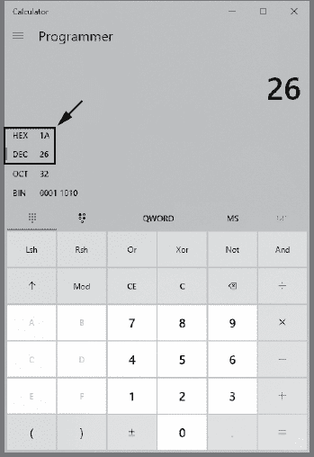

图 4-1：Microsoft Windows 计算器应用的程序员模式

我还提供了一个简单的十进制到十六进制的转换工具，[`wasmbook.com/hex`](https://wasmbook.com/hex)，以及一个用 WAT 编写的在线计算器，[`wasmbook.com/calculator.html`](https://wasmbook.com/calculator.html)。请记住，如果你想将数字数据嵌入到 WAT 字符串中，需要使用两位数的十六进制数字，而不是十进制数字。

## 整数与浮点运算

在讨论如何对类型进行位操作之前，我们需要先讨论 WebAssembly 支持的类型的细节。WebAssembly 的两种主要数据类型是整数和浮点数。这些类型在声明时会分配给所有的局部和全局变量，并且在函数声明中应使用这些类型作为参数。整数表示整数，并且可以表示负数和正数。然而，使用负整数比使用负浮点数稍微复杂一些。

你可以将整数和浮点数存储在变量中，也可以存储在线性内存中。如果你熟悉 JavaScript，线性内存就像一个类型化的无符号整数数组。我们将在第六章中进一步讨论线性内存。

在这一节中，我们将探讨整数和浮点变量是如何工作的，不同类型的浮点和整数变量，以及如何对它们进行一些基本的二进制操作。首先，我们简要讨论一下 WebAssembly 支持的四种主要数据类型。有两种整数数据类型（`i32` 和 `i64`）以及两种浮点数据类型（`f32` 和 `f64`）。

### 整数

对于大多数数学运算，整数运算通常比浮点运算更快。WebAssembly 当前支持 32 位和 64 位整数，但不幸的是，不能像其他数据类型一样轻松地与 JavaScript 共享 64 位整数。

#### i32（32 位整数）

`i32` 数据类型速度快，占用空间小，并且可以在 WebAssembly 和 JavaScript 之间轻松传递。它可以表示无符号数据范围为 0 到 4,294,967,295，表示有符号整数的范围为 -2,147,483,648 到 2,147,483,647。如果你处理的数字值不会超过十亿，并且不需要小数，使用 `i32` 是一个不错的选择。处理有符号或无符号值更多的是与对数据进行的操作有关，而不是变量中的数据本身。`i32` 数据类型使用 2 补码表示负数。

#### 2 补码

2 补码是一种广泛使用的技术，用于以二进制格式表示负数。计算机只以二进制工作，因此内存中只有 1 和 0。二进制可以相对容易地转换为十进制，但如何仅用 1 和 0 表示负数却不太显而易见。需要注意的是，浮点数有专门的符号位，因此不使用 2 补码。

为了理解 2 的补码如何工作，让我们借用一个比喻来说明。假设你有一个按键计数器，每次按下一个按钮时，它都会将一个数字刻度拨动一位 (图 4-2)。这个计数器只有一个十进制数字显示，因此它从 0 开始，计数到 9，但当你按下第十次时，它会回到 0。从计数器的角度来看，增加 10 等同于增加 0，因为你的计数器最终回到与起始位置相同的位置。顺便说一下，按下按钮 9 次在功能上等同于减去 1，除了 0 之外的所有数字都是如此。

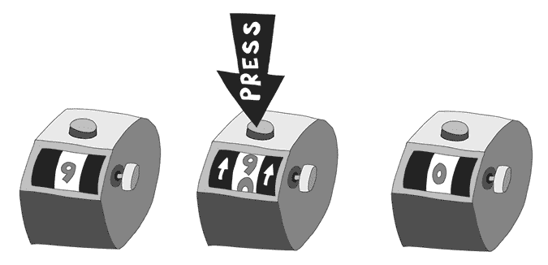

图 4-2：当加 1 时，9 会回到 0。

将高位数作为负数使用仅在你知道你的数字范围不包括所选择的负数时才有用。如果你声明 9 等于 –1，但你需要用计数器数到 9，那么这个数字系统就无法工作。溢出系统是有符号 8 位整数支持从 –128 到 127 的数字的原因。数字 255（八个 1）的无符号 8 位编码与 –1 的有符号 8 位表示相同，因为将 255 加到任何数字上会导致比特像里程表一样滚动并减去 1。最大的数字变成负数是因为它们会导致比特溢出。执行 2 的补码转换的代码使用二进制异或（XOR）操作翻转所有位，然后将数字 1 加到结果上，从而得到该数字的负数。你将在本章稍后看到执行 XOR 和位翻转的代码。

#### i64（64 位整数）

`i64` 数据类型可以表示无符号整数在 0 和 18,446,744,073,709,551,615 之间的正整数，以及有符号整数在 –9,223,372,036,854,775,808 和 9,223,372,036,854,775,807 之间的整数。WAT 中的 `i64` 数据类型在声明变量时没有指定它是有符号还是无符号的。相反，WAT 必须根据用户是否希望将数字视为有符号或无符号来选择执行的操作。并非所有操作都需要你做出这个选择：例如，`i64.add`、`i64.sub` 和 `i64.mul` 无论整数是否有符号，都可以正常工作。与之对比的是除法函数，如 `i64.div_s` 和 `i64.div_u`。除法操作必须区分数字是有符号还是无符号，因此必须在不同版本的操作符后附加 `_s` 和 `_u` 后缀。

如前所述，`i64` 数据类型的一个问题是你无法直接在 WebAssembly 和 JavaScript 之间来回传递 64 位整数。JavaScript 只使用 64 位浮点数，但 64 位浮点数可以容纳 32 位整数和 32 位浮点数。最关键的问题是，将 64 位整数传递到 JavaScript 部分的应用中可能会很麻烦。

### 浮点数

浮点数在二进制中包含三部分：符号位，后跟表示指数的一系列位，然后是表示有效数字的位（有时称为*尾数*或*有效数字*）。请记住，二进制中没有小数点；计算机科学家必须发明一种系统来表示二进制数中的小数点。符号位表示数字是正数还是负数。指数表示小数点需要移动多少位（左移或右移），有效数字则是浮点数的数字部分。让我们看看如何通过使用指数来构造十进制浮点数：如果你拿一个像 345 的数字，并将它乘以 10 的 2 次方，它会在数字的末尾添加两个零，如图 4-3 所示。这实际上是将小数点向右移动了两位。

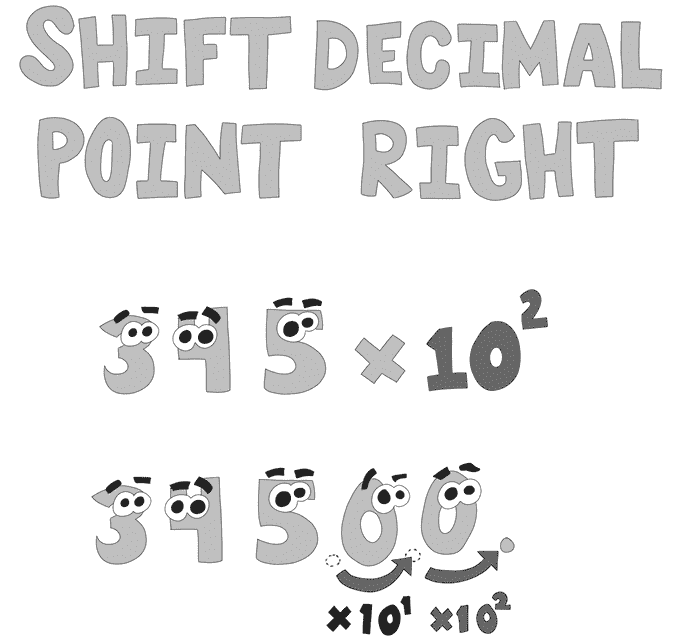

图 4-3：使用正指数将小数点向右移动。

仅使用十进制数字，你会说指数是 2，后跟 3 个小数位，因此 2345 就是数字 34,500，或 345 × 10²，如图 4-4 所示。

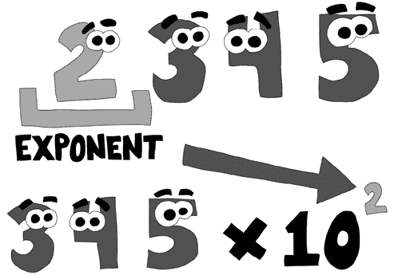

图 4-4：使用十进制指数

为了得到分数值，我们需要一个负的指数而不是正的指数，如图 4-5 所示：负指数将小数点向左移动。


图 4-5：使用负指数将小数点向左移动。

指数为负 2 时，345 变成了 3.45，结果是一个分数值。请注意，这种系统的问题：到目前为止，我们还没有方法来表示第一个指数位的负号。我们说过可以用 2345 来表示 345 × 10²，但我们没有表示负号。我们可以选择两种方法中的一种：2 的补码和偏置指数。首先，我们可以使用像 2 的补码这样的方式，并将较高的数字值赋予负数，因此 8345 可以表示 345 × 10^(–2)，因为 10 – 2 = 8。但这不是浮点数设计者选择的方法。相反，他们使用*偏置指数*，通过简单地从指数中减去一个特定的选定值来给出负指数。例如，如果我们决定总是从指数数字中减去 5，那么 3345 就可以表示 345 × 10^(–2)，因为 3 – 5 = –2。

实数浮动点数是二进制的，而非十进制，但基本原理是相同的。在二进制浮动点数中，最高有效位是符号位，如果数值为正则为 0，若为负则为 1。符号位之后的八位表示指数。尾数表示一个介于一和二之间的分数值。最左侧的位表示 0.5，接着是 0.25、0.125、0.0625，依此类推，每次减半。因为尾数的最小值为 1，所以尾数的实际值总是比所有这些分数字节的和大 1。位的布局如图 4-6 所示。

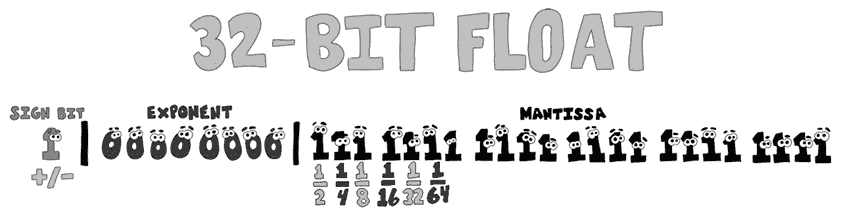

图 4-6：32 位浮动点数位

尾数的最小值为 1 的问题引出了数字 0 的处理。将一个非零值提升到任何幂次时永远不会得到 0 的值。为了弥补这一点，指数有两个特殊值，用于表示浮动点数中的 0 和无限大。如果指数和尾数的所有位都为 0，则表示的数值为 0，尽管 0⁰为 1。值得注意的是，浮动点数可以根据符号位的值表示 0 和-0。无限大和-无限大是指数位全为 1，尾数位全为 0 的数值。如果尾数位不是 0，则浮动点数表示为 NaN（不是数字）。

#### 次正常数

*次正常数*（有时称为*非规范化数*）是 IEEE-754 浮动点数规范中的另一种浮动点数边界情况。次正常数是一种边界情况，其中指数位全为 0。在所有指数位均为 0 的情况下，尾数值不再增加 1 到所表示的值。这使得可以表示更小的十进制数值。虽然本书中不使用次正常数，但你至少应该知道它们的存在。

#### f64/number

`f64`数据类型是双精度 64 位浮动点数。`f64`有 52 位表示有效数字，11 位表示指数，1 位表示符号位。该数据类型允许高精度，但在大多数硬件上，其执行速度比整数或较小的浮动点数要慢。它的一个优点是它是 JavaScript 用于所有数字的数据类型，使得它在 JavaScript 与 WebAssembly 之间转换数据时非常方便。

#### f32

`f32`数据类型比`f64`更小且更快，但精度要低得多，这意味着它能够使用的有效数字较少。`f64`数据类型大约有 16 位十进制有效数字，而`f32`只有大约七位。由于二进制数字表示有效数字，它与十进制数字并不完全对齐。有效十进制数字的数量只是一个近似值，但它能帮助你了解每种类型的限制。

## 高位和低位

本节我们将讨论位的有效性。低位是二进制数的最低有效位；有效性意味着 *表示最大值*。图 4-7 中，数字 128 中的 1 是最高有效位，而 8 是最低有效位。

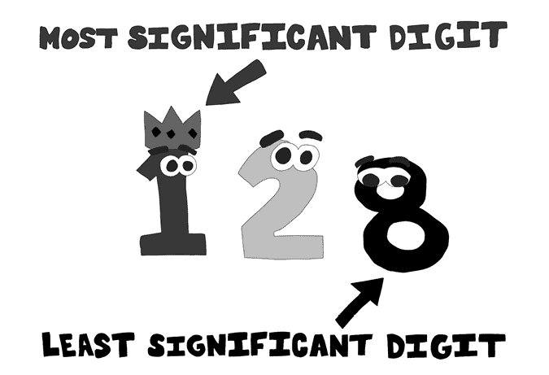

图 4-7：最高有效位和最低有效位

代表最大数值的数字是最高有效位。在这里，1 是最高有效位，因为它处于 100 位，而没有更高位的数字。插图中的那个可怜的小 8 是最低有效位，因为它表示的是个位数。

二进制数也有高位。在计算机中，一个字节总是由八个二进制位组成；即使数字是 00000001，左边的七个二进制位仍然存在于字节中。例如，数字 37 的二进制表示是 100101，但在计算机内存中，字节中的值是 00100101。该字节中的最高有效位（高位）是最左边的 0，如图 4-8 所示。

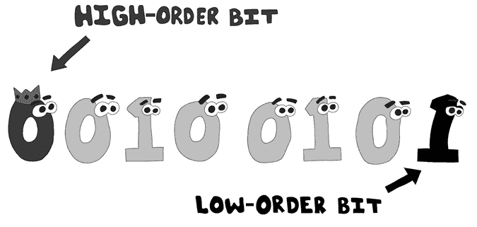

图 4-8：高位和低位

该字节中的低位是最右侧的 1，高位是最左侧的 0。

仅仅查看变量的高位和低位可以揭示一些字节的信息。整数中的低位表示该整数是偶数（0）还是奇数（1）。带符号整数的高位决定了该数字是正数（0）还是负数（1）。

## 位操作

WebAssembly 提供了低级别的数据操作抽象。如果你愿意付出努力，通过在位级别进行数据操作，你可以经常提供更好的代码性能。了解这些操作如何工作也可以在你尝试提高代码性能时发挥作用，即使是在高级语言中。我们将在本书后面写的应用中使用本章中的许多操作，因此根据需要回顾这一章。这些操作非常通用，因此很难给出具体的应用实例。然而，当实际情况出现时，哪个操作适用会显而易见。

### 移位和旋转位

在本节中，我们将介绍位的移位和旋转操作。这些是基本的位操作，我们在本书中会时常使用。一个字节的数据由八个位组成，可以存储从 0 到 255 的十进制数值，等同于从 0 到 FF 的十六进制值。你知道四个位称为 *半字节*（nibble）吗？单个十六进制数字由一个半字节（半个字节）组成，十进制值为 0 到 15，十六进制值为 0 到 F。

四个位可以存储一个十六进制数字，这使得在 WAT 中处理十六进制数字相对容易，尤其是在进行*移位*时。移位是一种通用操作，是我们在后续章节中讨论的优化的基础。移位有点像将位从悬崖上推下来，并用 0（或者对于某些带符号的右移，用 1）替换它们。你可以按任意数量的位进行移位，且可以向左或向右移位。例如，二进制 1110 1001 在十六进制中是 E9（在十进制中是 233）。如果我们使用`(i32.shr_u)`表达式将该数字右移 4 位，它将返回二进制 0000 1110，或在十六进制中是 0E。图 4-9 展示了 E9 四位右移的戏剧化效果。

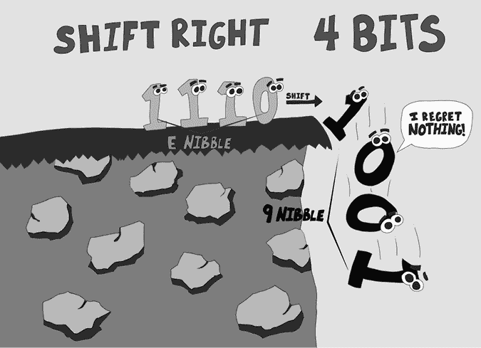

图 4-9：将十六进制 E9 右移四位得到 0E。

将数据向右移位可以是一种有用的技巧。每向右移一位，相当于除以 2。同样，每向左移一位，相当于乘以 2。你可以将移位与位屏蔽结合使用，以隔离二进制数据的某些部分。

在 WebAssembly 中，左移是不依赖符号的，但右移时我们使用带符号或无符号的移位操作。当你进行二进制数的右移或左移时，被移出的位通常会被用 0 替换到整数的另一侧。然而，对于负数，如果进行带符号的右移，1 会从左侧移入，以保持整数的符号。对二进制补码进行符号移位，可以保持符号（即负号）。

*位旋转*与移位不同，它将位反转并移到变量的另一侧。如果你将位向右旋转，最不重要的位将转移到最前面，成为最重要的位，其他所有位都将向右移位。WAT 使用`rotl`（向左旋转）或`rotr`（向右旋转）命令进行位旋转，如图 4-10 所示。

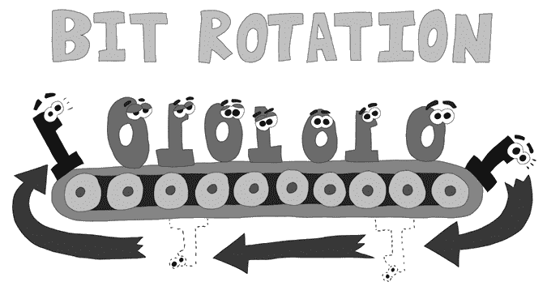

图 4-10：将位向右旋转

### 使用 AND 和 OR 进行位屏蔽

*位屏蔽*是一种方法，用于根据我们使用的掩码类型，将整数中的某些指定位设置为 1 或 0，从而隔离或覆盖它们。在编写高性能应用程序时，这非常有用。此外，需要知道 WebAssembly 没有布尔值的概念。在 WebAssembly 中，比较通常返回 1 表示真，0 表示假。当你在许多编程语言中使用布尔逻辑时，必须使用`i32.and`和`i32.or`。在本节中，我们将使用`i32.and`和`i32.or`进行位屏蔽，隔离或覆盖位值。

使用按位 AND 进行掩码时，整数中的 0 位在比特位的竞争中获胜。掩码中的 0 位就像胶带一样，覆盖了整数中的任何其他位，并将它们替换为 0。掩码中的 1 位则允许原始值透过掩码显示。图 4-11 展示了将二进制 1011 1110（190）与 0000 0111（7）进行 AND 掩码的效果。

如你在图 4-11 中看到的，原始值的所有位都被 AND 掩码中的 0 覆盖。当对两个不同的整数执行按位 AND 操作时，0 位胜出（参见图 4-12）。

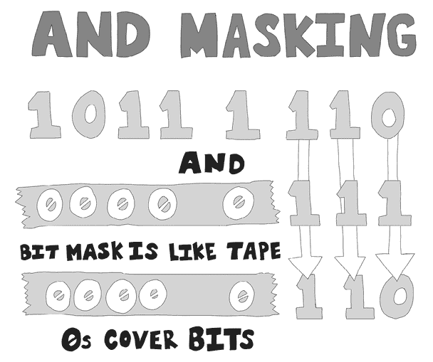

图 4-11：使用按位 AND 进行掩码


图 4-12：按位 AND 操作，0 位胜出

当你使用 OR 掩码时，使用 `i32/i64.or` 操作，结果恰好相反：1 位会覆盖任何包含 1 的位。你不能像使用 AND 掩码那样隔离位。相反，你使用它将特定位设置为 1。图 4-13 展示了使用 OR 进行掩码的效果。

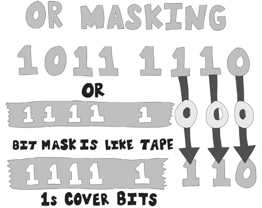

图 4-13：使用按位 OR 进行掩码

如你在图 4-13 中看到的，使用按位 OR 操作时，掩码中的 1 位覆盖了初始整数值中的任何位。因此，在按位 OR 操作中，1 位会覆盖 0 位（参见图 4-14）。


图 4-14：在按位 OR 中，1 位总是胜出。

### XOR 位翻转

我们将要讲解的最后一个二进制操作是 XOR。与 AND 和 OR 不同，掩码的结果是明确的。XOR `i32/i64.xor` 操作稍有不同。如果 0 遮掩了 0，1 遮掩了 0，或 0 遮掩了 1，XOR 操作就像典型的 `i32/i64.or` 操作一样。奇怪的地方出现在两个 1 的情况下，这会导致 XOR 操作将结果位设置为 0。这个特性对于 *位翻转* 很有用，它能将每个位翻转为其相反值。有些操作要求你将整数中的每个 1 位改为 0，将每个 0 位改为 1。图 4-15 展示了如何使用 XOR 翻转一个字节中的每一位。


图 4-15：XOR 位翻转

在我们之前讨论的 2 补码中，我们提到，如果你想找到任何数的负数，你可以通过翻转每个位并加上 1 来实现。你可以通过对一个所有位都设置为 1 的整数进行 `XOR` 操作来翻转所有位。让我们编写一个小应用程序，使用 2 补码和位翻转将一个整数值转换为其负数。创建一个名为 *twos_complement.wat* 的文件，并将列表 4-1 中的代码添加进去。

**twos_complement.wat**

```
(module
  (func $twos_complement (export "twos_complement")
  (param $number i32)
  (result i32)
    local.get $number
  1 i32.const 0xffffffff  ;; all binary 1s to flip the bits
  2 i32.xor               ;; flip all the bits
    i32.const 1
 3 i32.add             ;; add one after flipping all bits for 2s complement
  )
)
```

列表 4-1：2 补码函数

这是一个非常简单的模块，接受一个名为`$number`的`i32`参数。我们将`i32`推送到栈上，接着是一个所有位都是 1 的 32 位数字。当我们调用`i32.xor` 2 时，原始数字的所有位都会被翻转。每个 1 变为 0，每个 0 变为 1。然后我们调用`i32.add` 3，将该数字加上 1，得到 2 的补码，从而得到负数。这个代码作为 2 的补码工作原理的演示非常有效；然而，如果我们只是从`0`中减去`$number`来取反，它会表现得更好。

### 大端与小端

你熟悉的所有数字都采用*大端*格式排列，这意味着最高位的数字在左侧，最低位的数字在右侧。大多数计算机硬件使用*小端*格式，其中最低位的数字在左侧，最高位的数字在右侧，因此 128 会写成 821。请记住，字节序指的是字节顺序，而不是数字顺序，所以我使用的小端十进制 821 示例是一个过于简化的例子，不能直接转化为二进制。小端硬件将字节按照与典型顺序相反的方式排序。数字 168,496,141 用大端十六进制表示为 0A0B0C0D。高位字节是 0A，低位字节是 0D，因为每个十六进制数字由一个半字节（nibble）表示。如果我们按照小端字节序排序字节，它们将按 0D0C0B0A 排列，如图 4-16 所示。

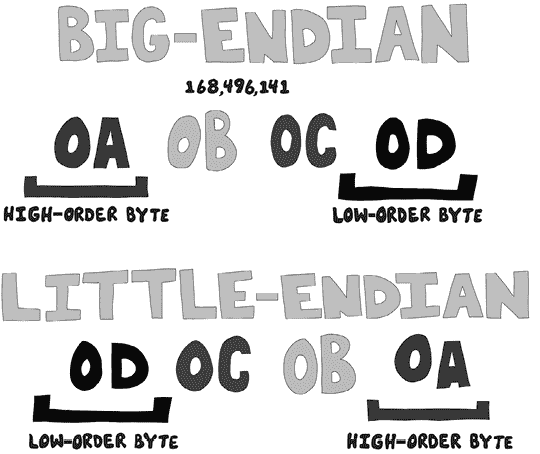

图 4-16：大端与小端字节序

目前大多数硬件出于性能原因使用小端字节序。WebAssembly 无论硬件如何，都会使用小端字节序。当你在 WebAssembly 中使用`(data)`语句初始化数据时，保持字节顺序非常重要。

## 总结

本章涵盖了许多低级编程概念。我们查看了低级编程中使用的不同数字进制（十进制、十六进制和二进制）。我们研究了整数和浮点算术的细节，并涉及了 2 的补码以及大端和小端字节序。我们讨论了位操作，包括高位和低位、位掩码、位移和位旋转。这些低级选项将在后续章节的应用中变得有用，通过操作位来提高性能。

在下一章，你将学习几种管理字符串作为数据结构的方法，包括空字符终止字符串和长度前缀字符串。我们还将探索复制字符串以及将数字数据转换为十进制、十六进制和二进制格式的过程。
