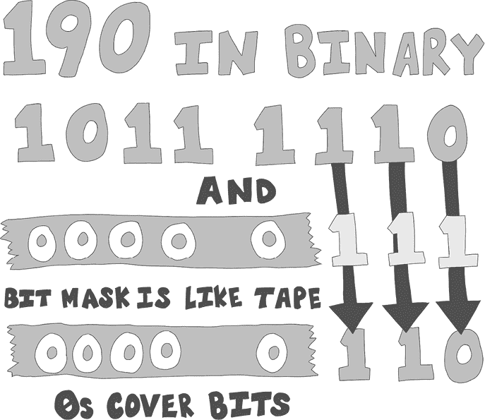
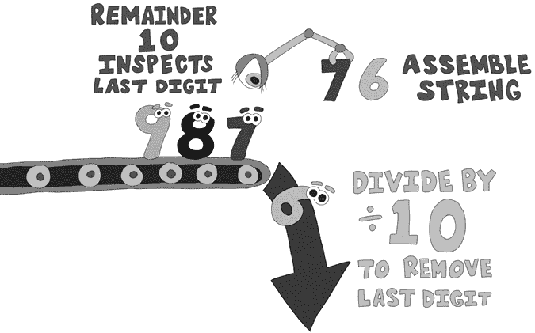
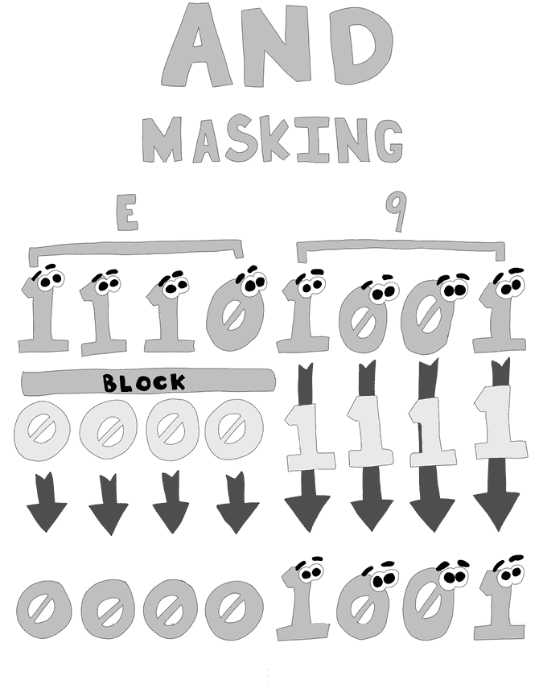
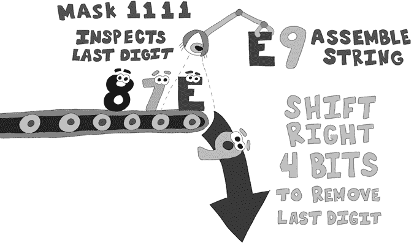

# WebAssembly 中的字符串


本章讨论如何在 WAT 中处理字符串，因为 WebAssembly 不像高级语言那样具有内建的字符串数据类型。要在 WebAssembly 中表示字符串数据，您必须将线性内存设置为 ASCII 或 Unicode 字符值。您需要知道将数据存储在何处以及字符串将使用多少字节。

本章将先介绍 ASCII 和 Unicode 字符格式，然后探讨字符串对象之间的关系，以及如何在线性内存中存储它们。您将学习如何让 JavaScript 从线性内存中获取字符串并将其输出到命令行。一旦您知道如何将字符串数据从 WebAssembly 传递到 JavaScript，我们将介绍两种流行的字符串管理方法：空终止字符串和长度前缀字符串，讨论每种技术的优缺点。您将学习如何通过逐字节复制和 64 位复制将字符串从线性内存中的一个位置复制到另一个位置。然后，您将学习如何将整数数据转换为十进制、十六进制和二进制格式的数字字符串。

## ASCII 和 Unicode

在 WebAssembly 中处理字符串时，您需要知道您使用的是哪种字符集，因为不同的字符集在线性内存中的表现不同。*美国信息交换标准代码（ASCII）* 是一种 7 位字符编码系统，支持最多 128 个字符，其中第 8 位可能用于错误检查，或者简单地设置为 0。ASCII 字符集在仅支持英语的代码中效果良好。

*Unicode 转换格式（UTF）* 有 7 位、8 位、16 位和 32 位几种类型，分别称为 UTF-7、UTF-8、UTF-16 和 UTF-32。UTF-7 和 ASCII 是相同的。UTF-8 包含了 UTF-7，并通过创建灵活的长度格式来支持一些额外的拉丁字母、中东和亚洲字符，当格式的起始字节超出 ASCII 字符集时，可以通过增加字节来适应。UTF-16 也是一种灵活长度的字符集，其中大多数字符占用两个字节。由于某些编码会将字符所占字节数扩展到四个字节，UTF-16 支持超过 110 万个字符。UTF-32 是一个固定的 32 位字符集，支持超过 40 亿个字符。在本书中，我们将专门使用 ASCII/UTF-7 字符集，因为它简单易读且易于理解。

## 线性内存中的字符串

将字符串从 WebAssembly 传递到 JavaScript 的唯一方法是像我们在第二章的 hello world 应用中那样，在内存`buffer`对象中创建一个字符数据数组。然后，你可以将一个 32 位整数传递给 JavaScript，该整数表示该字符数据在内存缓冲区中的位置。这个方案的唯一问题是它没有告诉 JavaScript 数据的结束位置。C 语言通过使用空终止字节来管理这一点：值为 0 的字节（不是字符 0）告诉程序字符串在前一个字节处结束。我们将探讨三种在 WAT 和 JavaScript 之间传递字符串的方法，包括空终止，并进一步讨论如何复制字符串。

### 将字符串长度传递给 JavaScript

与字符串交互的最明显方式是将字符串位置和字符串长度传递给 JavaScript，这样 JavaScript 就可以从线性内存中提取字符串，并且能够知道它的结束位置。创建一个名为*strings.wat*的新 WAT 文件，并添加列表 5-1 中的代码。

**strings.wat（第一部分，共 11 部分）**

```
(module
;; Imported JavaScript function (below) takes position and length
1 (import "env" "str_pos_len" (func $str_pos_len (param i32 i32)))
2 (import "env" "buffer"   (memory 1))
;; 30 character string
3 (data (i32.const 256) "Know the length of this string")
;; 35 characters
4 (data (i32.const 384) "Also know the length of this string")

5 (func (export "main")
;; length of the first string is 30 characters
 6 (call $str_pos_len (i32.const 256) (i32.const 30))
;; length of the second string is 35 characters
 7 (call $str_pos_len (i32.const 384) (i32.const 35))
 )
)
```

列表 5-1：将字符串从 WebAssembly 传递到 JavaScript

本模块导入了我们将创建的一个 JavaScript 函数`"str_pos_len"` 1，该函数通过结合字符串的位置和它在线性内存中的位置，来在内存缓冲区中查找字符串。我们还需要导入我们将在 JavaScript 中声明的内存缓冲区 2。

接下来，我们在内存中定义了两个字符串：`"Know the length of this string"` 3 和`"Also know the length of this string"` 4。这两个字符串表明我们需要知道这些字符串的长度，因为它们仅仅是线性内存中的字符数组，我们需要标明它们的起始和结束位置。第一个字符串有 30 个字符，第二个字符串有 35 个字符。稍后，在`"main"` 5 函数中，我们调用`$str_pos_len`两次。第一次 6，我们传入第一个字符串在内存中的位置`(i32.const` `256)`，接着是该字符串的长度`(i32.const 30)`。这告诉我们稍后写的 JavaScript 从内存位置 256 开始提取 30 个字节并将其显示到控制台。第二次调用`$str_pos_len` 7 时，我们传入第二个字符串在内存中的位置`(i32.const 384)`，接着是该字符串的长度`(i32.const` `35)`。然后，JavaScript 将第二个字符串显示到控制台。使用列表 5-2 中的命令编译 WebAssembly 模块。

```
wat2wasm strings.wat
```

列表 5-2：编译*strings.wat*

编译 WebAssembly 模块后，创建一个名为*strings.js*的 JavaScript 文件，并输入列表 5-3 中的代码。

**strings.js（第一部分，共 3 部分）**

```
const fs = require('fs');
const bytes = fs.readFileSync(__dirname + '/strings.wasm');

let memory = new WebAssembly.Memory( {initial: 1 });

let importObject = {
  env: {
    buffer: memory,
  1 str_pos_len: function(str_pos, str_len) {
    2 const bytes = new Uint8Array( memory.buffer,
                                    str_pos, str_len );
    3 const log_string = new TextDecoder('utf8').decode(bytes);
      4 console.log(log_string);
    }
  }
};

( async () => {
  let obj = await WebAssembly.instantiate( new Uint8Array(bytes),
                                           importObject );

  let main = obj.instance.exports.main;

  main();
})();
```

列表 5-3：调用 WebAssembly 字符串函数的 JavaScript 代码

在`importObject`内部，我们定义了`str_pos_len` 1，它获取字符串在内存中的位置及其长度。它使用长度的位置来检索一个字节数组 2，该数组的长度是指定的。我们使用`TextDecoder`将字节数组转换为字符串 3。然后我们调用`console.log` 4 来显示字符串。当你运行 JavaScript 时，你应该能在清单 5-4 中看到这个信息。

```
Know the length of this string
Also know the length of this string
```

清单 5-4：字符串长度输出

接下来，我们将讨论空字符终止字符串，这是一种用于跟踪字符串长度的方法，C/C++等语言使用它。

### 空字符终止字符串

传递字符串的第二种方法是*空字符终止*（或*零终止*）字符串。空字符终止是一种由 C 编程语言使用的定义字符串长度的方法。在空字符终止的字符串中，你将值为 0 的字符作为数组中的最后一个字符。空字符终止字符串的优点是，你在使用它时不需要知道字符串的长度。缺点是，这需要在处理字符串时进行更多计算，因为你的程序需要花时间查找终止的空字节。我们来打开*strings.wat*文件，并添加清单 5-5 中的代码来处理我们的空字符终止字符串。首先，我们需要添加一个`null_str`函数的导入，这个函数我们稍后将在 JavaScript 中定义。

**strings.wat（第二部分，共 11 部分）**

```
(module
1 (import "env" "str_pos_len" (func $str_pos_len (param i32 i32)))
;; add line below
2 (import "env" "null_str" (func $null_str (param i32)))
...
```

清单 5-5：修改*strings.wat*（来自清单 5-1）以导入`null_str`函数

请注意，与`str_pos_len` 1 不同，`null_str` 2 函数只需要一个`i32`参数，因为与它一起工作的代码只需要知道字符串在线性内存中的起始位置。至于代码如何找到空字符的位置并操作它，则由代码自行决定。

接下来，在定义缓冲区的`import`语句与定义早期字符串的`(data)`表达式之间，在清单 5-6 中，我们添加了另外两个数据表达式，定义了空字符终止的字符串。

**strings.wat（第三部分，共 11 部分）**

```
...
  (import "env" "buffer" (memory 1))
;; add the two lines below
1 (data (i32.const 0) "null-terminating string\00")
2 (data (i32.const 128) "another null-terminating string\00")

  (data (i32.const 256) "Know the length of this string")
...
```

清单 5-6：修改*strings.wat*（来自清单 5-1），以添加空字符终止的字符串数据

第一个数据定义了字符串`"null terminating string\00"`1。请注意最后三个字符`\00`。`\`字符是 WAT 中的转义字符。如果你在转义字符后面跟上两个十六进制数字，它将定义一个你指定值的数字字节。这意味着`\00`表示一个值为`0`的字节。第二个数据表达式创建了字符串`"another null terminating string\00"` 2，它也是空字符终止的，并以`\00`结尾。

在清单 5-7 中，我们在`main`函数的开头添加了两行代码，调用导入的`$null_str` JavaScript 函数，并将空字符终止字符串在线性内存中的位置传递给它。

**strings.wat（第四部分，共 11 部分）**

```
...
(func (export "main")
1 (call $null_str (i32.const 0)) ;; add this line
2 (call $null_str (i32.const 128)) ;; add this line

    (call $str_pos_len (i32.const 256) (i32.const 30))
...
```

清单 5-7：修改*strings.wat*（来自清单 5-1）以调用`null_str`函数

我们传入值`0` 1，它是我们定义字符串`"null terminating string\00"`的内存位置。然后，我们传入值`128` 2，这是我们定义字符串`"another null terminating string\00"`的内存位置。

一旦你在 WAT 文件中做出这些更改，打开*strings.js*以添加更多代码。首先，向`importObject`中嵌套的`env`对象中添加一个新函数，如列表 5-8 所示。

**strings.js（第二部分，共 3 部分）**

```
...
1 const max_mem = 65535;// add this line

  let importObject = {
  env: {
    buffer: memory,
    // add the null_str function to the importObject here
  2 null_str: function(str_pos) **{** // add this function
    3 let bytes = new Uint8Array( memory.buffer,
                                  str_pos, max_mem-str_pos );

    4 let log_string = new TextDecoder('utf8').decode(bytes);
    5 log_string = log_string.split("\0")[0];
    6 console.log(log_string);
    }, // end of function
    str_pos_len: function(str_pos, str_len) {
...
```

列表 5-8：从列表 5-3 开始，添加到`importObject`中的`null_str`函数，在*strings.js*中

这段代码首先通过定义变量`max_mem` 1 来设置字符串的最大可能长度。为了找到以空字符终止的字符串，我们将一块线性内存（最大字符串长度）解码为一个长字符串，然后使用 JavaScript 的 split 函数来获取空字符终止的字符串。在`env`对象中，我们添加了一个名为`null_str` 2 的函数，它接受一个`str_pos`参数。然后，JavaScript 需要从内存缓冲区中提取字节数组，起始位置由传入函数的`str_pos`参数指定。在将内存缓冲区转化为字符串之前，我们不能直接在其上进行搜索。转换为字符串之前，首先需要将其转换为字节数组 3。然后，我们创建一个`TextDecoder`对象，将这些字节解码为一个长字符串 4。

我们使用空字节`"\0"` 5 将字符串拆分为一个数组。以空字节拆分会创建一个以空字节终止的字符串数组。数组中的第一个元素才是我们定义的实际字符串。我们使用 split 作为一种简单的快速方法，将字符串从线性内存中提取出来。然后我们将`log_string`设置为数组中的第一个字符串。我们调用 JavaScript 的`console.log`函数 6，并将`log_string`传递给它，以便将该字符串显示到控制台。因为我们使用了来自 WebAssembly 的两个不同的字符串，所以我们应该能在控制台上看到列表 5-9 中的四条消息。

```
null-terminating string
another null-terminating string
Know the length of this string
Also know the length of this string
```

列表 5-9：空字符终止字符串的输出

### 长度前缀字符串

存储字符串的第三种方法是将字符串的长度放在字符串数据的开头。用这种方法创建的字符串称为*长度前缀字符串*，它可以提高处理性能。我们当前的前缀方式将字符串限制为最大长度 255，因为一个字节的数据只能容纳 0 到 255 之间的数字。

我们先从修改当前的*strings.wat*文件开始，如列表 5-10 所示，添加一行新的导入语句，用于导入稍后在 JavaScript 中定义的`len_prefix`函数。

**strings.wat（第五部分，共 11 部分）**

```
(module
  (import "env" "str_pos_len" (func $str_pos_len (param i32 i32)))
  (import "env" "null_str" (func $null_str (param i32)))
 ;; add the line below
1(import "env" "len_prefix" (func $len_prefix (param i32)))
...
```

列表 5-10：修改*strings.wat*，从列表 5-1 开始，添加`len_prefix`函数导入

`len_prefix` 1 函数将读取字符串的第一个字节来找出长度。

接下来，我们添加两个新的字符串，它们以十六进制数表示其长度。将列表 5-11 中的代码添加到 *strings.wat*。

**strings.wat（第六部分，共 11 部分）**

```
...
  (data (i32.const 384) "Also know the length of this string")

  ;; add the next four lines.  Two data elements and two comments
 ;; length is 22 in decimal, which is 16 in hex
1 (data (i32.const 512) "\16length-prefixed string")
 ;; length is 30 in decimal, which is 1e in hex
2 (data (i32.const 640) "\1eanother length-prefixed string")

 (func (export "main")
...
```

列表 5-11：修改 *strings.wat*，参照列表 5-1，以添加长度前缀的字符串数据

第一个字符串，`"\16length-prefixed string"`，包含 22 个字符，因此我们用 `\16` 作为前缀，因为 22 的十进制数在十六进制中是 16。第二个字符串，`"\1eanother length-prefixed string"`，包含 30 个字符，因此我们用十六进制的 `\1e` 作为前缀。

接下来，我们需要为刚刚创建的两个字符串所在的内存位置添加两次调用 `len_prefix` 函数。`"main"` 函数现在应该像列表 5-12 中的代码那样。

**strings.wat（第七部分，共 11 部分）**

```
...
  (func (export "main")
    (call $null_str (i32.const 0))
    (call $null_str (i32.const 128))

    (call $str_pos_len (i32.const 256) (i32.const 30))
    (call $str_pos_len (i32.const 384) (i32.const 35))

  1 (call $len_prefix (i32.const 512))    ;; add this line
  2 (call $len_prefix (i32.const 640))    ;; add this line

 )
...
```

列表 5-12：修改 *strings.wat*，参照列表 5-1，以添加对 `$len_prefix` 函数的调用

第一次调用 `$len_prefix` 1 时，将数据字符串 `"\16length-prefixed string"` 的内存位置 `512` 传入。第二次调用 2 时，将第二个长度前缀字符串 `"\1eanother length-prefixed string"` 的内存位置 `640` 传入。

在运行之前，我们需要为我们的 JavaScript `importObject` 添加一个新函数。打开 *strings.js*，并将 `len_prefix` 函数添加到 `importObject`，如列表 5-13 所示。

**strings.js（第三部分，共 3 部分）**

```
...
let importObject = {
  env: {
    buffer: memory,
    null_str: function (str_pos) {
      let bytes = new Uint8Array(memory.buffer, str_pos,
                                 max_mem - str_pos);

      let log_string = new TextDecoder('utf8').decode(bytes);
      log_string = log_string.split("\0")[0];
      console.log(log_string);
    }, // end null_str function 
    str_pos_len: function (str_pos, str_len) {
      const bytes = new Uint8Array(memory.buffer,
        str_pos, str_len);
      const log_string = new TextDecoder('utf8').decode(bytes);
      console.log(log_string);
 },
1 len_prefix: function (str_pos) {
    2 const str_len = new Uint8Array(memory.buffer, str_pos, 1)[0];
    3 const bytes = new Uint8Array(memory.buffer,
                                   str_pos + 1, str_len);
    4 const log_string = new TextDecoder('utf8').decode(bytes);
      console.log(log_string);
    }
  }
};
...
```

列表 5-13：将 `len_prefix` 函数添加到 *strings.js* 中的 `importObject`，参照列表 5-3

新的 `len_prefix` 1 函数接受一个字符串位置，然后从该位置取出第一个字节，作为常量 `str_len` 2 中的数字。它使用 `str_len` 中的值，从线性内存中复制适当数量的 `bytes` 3，以便将其解码为 `log_string` 4，然后记录到控制台中。

现在我们有了 WAT 和 JavaScript，可以使用 `wat2wasm` 编译 WAT 模块，如列表 5-14 所示。

```
wat2wasm strings.wat
```

列表 5-14：编译 *strings.wat*

然后我们可以使用 `node` 运行我们的 JavaScript 文件，如列表 5-15 所示。

```
node strings.js
```

列表 5-15：使用 `node` 运行 *strings.js*

你应该会看到列表 5-16 中的输出。

```
null-terminating string
another null-terminating string
Know the length of this string
Also know the length of this string
length-prefixed string
another length-prefixed string
```

列表 5-16：*strings.js* 的输出

在接下来的章节中，你将学习如何使用 WAT 复制字符串。

### 复制字符串

复制字符串从线性内存中的一个位置到另一个位置的最简单方法是逐字节循环，加载每个字节的数据，然后将其存储到新位置。然而，这种方法比较慢。一种更高效的方法是使用 64 位整数加载和存储，每次复制八个字节。不幸的是，并非所有字符串的长度都是八个字节的倍数。为了尽可能高效地处理所有情况，我们需要结合逐字节复制和更快速的 64 位复制方法。

#### 字节逐一复制

我们将首先编写一个做较慢逐字节复制的函数：它接收源内存位置、目标内存位置以及要复制的字符串长度作为参数。

让我们继续向*strings.wat*文件中添加代码。在列表 5-17 中，我们将函数`$byte_copy`添加到*strings.wat*文件中。

**strings.wat（第八部分，共 11 部分）**

```
...
(func $byte_copy
  (param $source i32) (param $dest i32) (param $len i32)
  (local $last_source_byte i32)

1 local.get $source
  local.get $len
2 i32.add   ;; $source + $len

  local.set $last_source_byte         ;; $last_source_byte = $source + $len

  (loop $copy_loop (block $break
  3 local.get $dest    ;; push $dest on stack for use in i32.store8 call
  4 (i32.load8_u (local.get $source)) ;; load a single byte from $source
  5 i32.store8                        ;; store a single byte in $dest

  6 local.get $dest
    i32.const 1
    i32.add
  7 local.set $dest                   ;; $dest = $dest + 1

    local.get $source
    i32.const 1
    i32.add
  8 local.tee $source                 ;; $source = $source + 1

    local.get $last_source_byte
    i32.eq
    br_if $break
    br $copy_loop
  )) ;; end $copy_loop
)
...
```

列表 5-17：将逐字节复制字符串的慢速方法添加到*strings.wat*中（见列表 5-1）

这个`$byte_copy`函数将从`$source` 1 到 `$source` + `$len` 2 的内存块复制到内存位置`$dest` 3 到 `$dest` + `len`，每次复制一个字节。这个循环使用表达式`(i32.load8_u``)`从`$source`加载一个字节 4。然后，它使用命令`i32.store8`将该字节存储到`$dest`位置 5。接着，我们在`$dest`变量 7 中递增目标位置 6，并且将`$source` 8 变量递增，使这两个变量指向内存中的下一个字节。

#### 64 位复制

逐字节复制字符串比实际需要的慢，而 64 位整数有 8 字节长，一次复制 8 字节比逐字节复制要显著更快。我们将编写另一个函数，类似于`$byte_copy`，通过一次复制 8 字节来显著加快数据复制速度。不幸的是，并不是所有的字符串长度都是 8 的倍数。如果字符串的长度为 43 个字符，我们可以通过五次 8 字节的复制来复制前 40 个字节，但对于最后的 3 个字节，我们仍需要回到逐字节复制的方法。

需要注意的是，这些字节复制不会阻止越界内存访问。代码将尝试从不该读取或写入的地方复制数据。然而，如果你尝试访问线性内存之外的数据，WebAssembly 的安全模型会导致读取或写入失败，从而停止代码执行。如前所述，这些函数并非用于通用目的，而是用来演示不同的字符串复制方式。

将 64 位复制函数`$byte_copy_i64`添加到*strings.wat*文件中（见列表 5-18）。

**strings.wat（第九部分，共 11 部分）**

```
...
;; add this block of code to the `strings.wat` file
(func $byte_copy_i64
  (param $source i32) (param $dest i32) (param $len i32)
  (local $last_source_byte i32)

  local.get $source
  local.get $len
  i32.add

  local.set $last_source_byte

**(loop $copy_loop (block $break**
  1 (i64.store (local.get $dest) (i64.load (local.get $source)))

local.get $dest
  2 i32.const 8
    i32.add
    local.set $dest;; $dest = $dest + 8

local.get $source
  3 i32.const 8
    i32.add
    local.tee $source;; $source = $source + 8

    local.get $last_source_byte
    i32.ge_u
 br_if $break
    br $copy_loop
  ));; end $copy_loop
)
...
```

列表 5-18：将更快的复制字符串方法添加到*strings.wat*中（见列表 5-2）

加载和存储函数分别是`(i64.load``)`和`(i64.store``)`1，它们每次加载和存储 64 位（8 字节）数据。这种方法比逐字节加载和存储单个字节快四到五倍（在 x64 架构上）。另一个显著的区别是，`$dest` 2 和 `$source` 3 每次增加`8`，而不是`1`。

#### 组合复制函数

如前所述，并非所有字符串的长度都是 8 的倍数。因此，我们将在列表 5-19 中定义一个新的改进函数，该函数使用`$byte_copy_i64`函数一次复制 8 字节，然后使用`$byte_copy`函数复制剩余的字节，后者一次复制一个字节。

**strings.wat (第十部分，共 11 部分)**

```
...
(func $string_copy
  (param $source i32) (param $dest i32) (param $len i32)
  (local $start_source_byte i32)
  (local $start_dest_byte   i32)
  (local $singles           i32)
  (local $len_less_singles  i32)

  local.get $len
1 local.set $len_less_singles  ;; value without singles

  local.get $len
  i32.const 7                  ;; 7 = 0111 in binary
2 i32.and
  local.tee $singles           ;; set $singles to last 3 bits of length

3 if                           ;; if the last 3 bits of $len is not 000
    local.get $len
    local.get $singles
    i32.sub
  4 local.tee $len_less_singles  ;; $len_less_singles = $len - $singles

    local.get $source
    i32.add
    ;; $start_source_byte=$source+$len_less_singles
  5 local.set $start_source_byte

    local.get $len_less_singles
    local.get $dest
    i32.add
  6 local.set $start_dest_byte  ;; $start_dest_byte=$dest+$len_less_singles

  7 (call $byte_copy (local.get $start_source_byte)
 (local.get $start_dest_byte)(local.get $singles))
  end

  local.get $len
8 i32.const 0xff_ff_ff_f8 ;; all bits are 1 except the last three which are 0
9 i32.and                 ;; set the last three bits of the length to 0
  local.set $len
a (call $byte_copy_i64 (local.get $source) (local.get $dest) (local.get $len))
)
...
```

列表 5-19：在可能的情况下每次复制八个字节，否则每次复制一个字节。

如前所述，`$string_copy` 函数必须结合八字节和单字节复制函数，以尽可能快速地复制字符串。`$len` 参数是字符串的总长度（以字节为单位）。局部变量 `$len_less_singles` 1 是可以用 64 位复制复制的字节数。我们通过屏蔽掉最后三位来获取这个数值。`$singles` 变量是剩余的三位，不在八的倍数范围内，通过执行按位 `(i32.and)` 表达式 2（为位掩码欢呼）在 `$len` 和 `7`（二进制 111）之间设置。长度的最后三位表示如果我们大多数字节使用八字节复制，剩余字节的数量。举个例子，对 `$len` 为 190 和 7 使用 `i32.and` 表达式，结果如图 Figure 5-1 所示。



图 5-1：使用二进制与运算（AND）屏蔽掉除了最后三位之外的所有位

如你所见，调用 `i32.and` 并传入 190 和 7 的值，结果为二进制 110，即十进制 6。`i32.and` 表达式将 `$len` 参数的最后三位之外的所有位都设置为 0。

如果 `$singles` 的值不为零 3，代码首先复制那些无法使用 64 位复制的单独字节。`if` 块将 `$len_less_singles` 4 设置为 `$len` - `$singles`：即必须单独复制的字节数。局部变量 `$start_source_byte` 5 被设置为 `$source+$len_less_singles`，将其设置为逐字节复制的起始字节 7。

然后，变量 `$start_dest_byte` 6 被设置为 `$dest+$len_less_singles`，它设置为逐字节复制的目标位置。接下来，分支调用 `$byte_copy` 来复制这些剩余的单字节。

在 `if` 块之后，代码必须使用 64 位复制函数 `(call` `$byte_copy_i64)`a 复制它可以复制的字节。我们通过使用按位 `(i32.and)` 9 表达式，将 `$len` 中的长度与 32 位常量值 `0xff_ff_ff_f8` 8 进行运算，来确定要复制的字节数。值 `0xff_ff_ff_f8` 的二进制表示是除最后三位外全为 1，最后三位为 0。使用按位与运算将长度的最后三位清零，从而使长度成为八的倍数。

现在我们已经有了字符串复制函数，接下来让我们修改 `main` 函数来测试它。将 `main` 函数修改为只包含 列表 5-20 中的代码。

**strings.wat (第十一部分，共 11 部分)**

```
...
(func (export "main")
  1 (call $str_pos_len (i32.const 256) (i32.const 30))
  2 (call $str_pos_len (i32.const 384) (i32.const 35))

  3 (call $string_copy
        (i32.const 256) (i32.const 384) (i32.const 30))

  4 (call $str_pos_len (i32.const 384) (i32.const 35))
  5 (call $str_pos_len (i32.const 384) (i32.const 30))
  )
```

列表 5-20：*strings.wat* 的 `main` 函数的新版本（列表 5-2）

我们删除了打印空终止字符串和长度前缀字符串到控制台的代码。我们保留了打印位于线性内存地址`256`的字符串 1，`"Know the length of this string"`，以及位于内存地址`384`的字符串 2，`"Also know the length of this string"`。保留这些行会在复制之前将原始字符串值打印到控制台。

调用`$string_copy` 3 将 30 个字节从第一个字符串复制到第二个字符串。然后我们打印第二个字符串的位置及其原始字符串长度。这样会将`"Know the length of this stringtring"` 4 打印到控制台，看起来是错误的，因为它以`stringtring`这个词结尾。最后一个词没有以`string`结尾并且多出了五个字符的原因是我们需要将长度更改为我们复制的字符串的长度。如果我们复制的是空终止字符串或长度前缀字符串，这不会是问题，因为空字节或前缀会帮助我们追踪长度：但在这种情况下，我们需要知道新长度是`30`。

当我们调用`$str_pos_len`，传入`384`作为索引和`30`作为长度 5 时，它会正确地将`"Know the length of this string"`打印到控制台。我们可以使用清单 5-21 中的命令重新编译*strings.wat*。

```
wat2wasm strings.wat
```

清单 5-21：编译*strings.wat*

从命令行运行*strings.js*以查看清单 5-22 中的输出。

```
Know the length of this string
Also know the length of this string
Know the length of this stringtring
Know the length of this string
```

清单 5-22：在添加对`$string_copy`的调用后，*strings.js*的输出

````In the next section, you’ll learn how to turn numbers into strings.    ### Creating Number Strings    When you’re working with strings, converting numeric data into string data is frequently required. High-level languages like JavaScript have functions that can do this for you, but in WAT you’ll need to build your own functions. Let’s look at what it takes to create strings from numbers in decimal, hexadecimal, and binary.    Create a WAT file named *number_string.wat* and add the code in Listing 5-23 to the beginning of the file.    **number_string.wat (part 1 of 7)**    ``` (module 1 (import "env" "print_string" (func $print_string (param i32 i32))) 2 (import "env" "buffer" (memory 1))  3 (data (i32.const 128) "0123456789ABCDEF")  4 (data (i32.const 256) "               0") 5 (global $dec_string_len  i32 (i32.const 16)) ... ```    Listing 5-23: Imported objects and data in the WebAssembly module    The beginning of this module imports a `$print_string` 1 function and one page of linear memory 2 from JavaScript. Next, we define a `data` 3 element with an array of characters that contains every hexadecimal character. Then we define a data element that will hold our string `data` 4, followed by the length of that `data` string 5.    In the next few listings, we define three functions that create number strings in three different formats. We use the first of these functions, `$set_dec_string`, to set the `$dec_string` linear memory area.    Listing 5-24 contains the code that turns an integer into a decimal string. The code can be a bit challenging to follow, so I’ll give you an overview before showing the code. At a high level, when we assemble a string from a number, we need to look at the number one digit at a time and add the character form of that digit to our string. Let’s say the number we’re looking at is 9876\. In the 1s place is the digit 6\. We can find this digit by dividing the full number by 10 and using the remainder (called a *modulo*). In WAT, that code would be the type `i32.rem_u` (`rem` for remainder). Next, you use the character form of the number 6 and add it to your string. Other digits need to move along as if on a conveyor belt (illustrated in Figure 5-2). The way you do this in code is to divide by 10\. Because this divide is on an integer, you don’t get a fractional number, and the 6 is simply thrown away. You then use the remainder to get the next digit (7) and add that to the string. You continue on until all the digits are gone. Listing 5-24 shows the source code for the `$set_dec_string` function.    **number_string.wat (part 2 of 7)**    ``` ... (func $set_dec_string (param $num i32) (param $string_len i32)   (local $index      i32)   (local $digit_char  i32)   (local $digit_val   i32)    local.get $string_len 1 local.set $index    ;; set $index to the string length    local.get $num   i32.eqz             ;; is $num is equal to zero   if                  ;; if the number is 0, I don't want all spaces     local.get $index     i32.const 1     i32.sub     local.set $index  ;; $index--      ;; store ascii '0' to memory location 256 + $index     (i32.store8 offset=256 (local.get $index) (i32.const 48))   end    (loop $digit_loop (block $break ;; loop converts number to a string     local.get $index  ;; set $index to end of string, decrement to 0     i32.eqz           ;; is the $index 0?     br_if $break      ;; if so break out of loop      local.get $num     i32.const 10   2 i32.rem_u         ;; decimal digit is remainder of divide by 10    3 local.set $digit_val ;; replaces call above     local.get $num     i32.eqz              ;; check to see if the $num is now 0     if       i32.const 32           ;; 32 is ascii space character       local.set $digit_char  ;; if $num is 0, left pad spaces     else     4 (i32.load8_u offset=128 (local.get $digit_val))       local.set $digit_char  ;; set $digit_char to ascii digit  end        local.get $index     i32.const 1     i32.sub     local.set $index     ;; store ascii digit in 256 + $index   5 (i32.store8 offset=256       (local.get $index) (local.get $digit_char))        local.get $num     i32.const 10     i32.div_u   6 local.set $num     ;; remove last decimal digit, dividing by 10      br $digit_loop     ;; loop   )) ;; end of $block and $loop ) ```    Listing 5-24: A WebAssembly function that creates a decimal string from an integer    We start the function with `$index` 1, a variable that points to the last byte in `$dec_string`. We set the values of this string from right to left, so the `$index` variable needs to be decremented every pass through the loop. Each pass through the loop, the number value set in `$dec_string` is the final base-10 digit. To get this value, we divide the `$num` 6 value by `10` and get the remainder 2 with modulo 10\. This value is stored in the local variable `$digit_val` 3 so we can later use it to set an ASCII character in the `$dec_string` data. We use `$digit_val` as an offset into the `$digit_char` string to load a character with `i32.load8_u` 4. That character is then written to an address that is `$dec_string+$index` using `i32.store8` 5. Figure 5-2 illustrates the process.      Figure 5-2: Look at digits one at a time and append characters one at a time.      Now that we have the function that does most of the work in our WebAssembly module, let’s add a function to export to the JavaScript, as shown in Listing 5-25.    **number_string.wat (part 3 of 7)**    ``` ...   (func (export "to_string") (param $num i32)   1 (call $set_dec_string       (local.get $num) (global.get $dec_string_len))   2 (call $print_string       (i32.const 256) (global.get $dec_string_len))   ) ) ```    Listing 5-25: The `to_string` function    The function is very simple. It calls `$set_dec_string` 1 passing in the number we want to convert to a string and the length of the string we want including the left padding. It then calls the JavaScript `print_string` 2 function passing in the location of the string we created in linear memory `(i32.const` `256)` and the length of that string.    Now that we’ve completed the *number_string.wat* file, we can compile it using `wat2wasm` in Listing 5-26.    ``` wat2wasm number_string.wat ```    Listing 5-26: Compiling *number_string.wat*    Next, we need to write the JavaScript that will run our WebAssembly module. Create a file named *number_string.js* and add the code in Listing 5-27.    **number_string.js**    ```  const fs = require('fs');   const bytes = fs.readFileSync(__dirname + '/number_string.wasm'); 1 const value = parseInt(process.argv[2]);   let memory = new WebAssembly.Memory({ initial: 1 });    (async () => {     const obj =       await WebAssembly.instantiate(new Uint8Array(bytes), {         env: {           buffer: memory,         2 print_string: function (str_pos, str_len) {             const bytes = new Uint8Array(memory.buffer,               str_pos, str_len);             const log_string = new TextDecoder('utf8').decode(bytes);             // log_string is left padded.            3 console.log(`>${log_string}!`);           }         }       });       obj.instance.exports.to_string(value);   })(); ```    Listing 5-27: The JavaScript that calls the WebAssembly module to convert the number to a string    The JavaScript code loads the WebAssembly module and takes an additional argument 1 that we’ll convert into a number string and left pads the string up to 16 characters. The WebAssembly module will call the `print_string` 2JavaScript function, which writes the string to the console, appending a `>` character to the beginning of the string and a `!` character to the end. We place these extra characters into the `console.log` 3 output to show where the string coming from the WebAssembly module begins and ends. You can run the JavaScript using the `node` command in Listing 5-28.    ``` node number_string.js 1229 ```    Listing 5-28: Use `node` to call the *number_string.js* file, passing in `1229`.    The result is that the number `1229` is converted to a string, and the output in Listing 5-29 is logged to the console.    ``` >            1229! ```    Listing 5-29: The number `1229` is left padded to 16 characters, beginning with `>` and ending with `!`.    In the next section, we’ll use similar techniques to create a hexadecimal string.    ### Setting a Hexadecimal String    Converting an integer to a hexadecimal string is very similar to converting an integer to a decimal number, as we did in the preceding section. We use a bit mask to look at specific hex digits and a shift to remove the digit, similar to our decimal conveyor belt (see Figure 5-2).    Recall from Chapter 4 that four bits of data is called a nibble and a hexadecimal digit corresponds to one nibble of data. At a high level, the code needs to look at the integer one nibble at a time as one hexadecimal digit. We look at the lowest order nibble, also the lowest order hex digit, and then add that digit to the string. Rather than finding the remainder, we use a mask to only look at the last digit. Instead of dividing by 10, we remove the last hex digit by shifting off four bits (one nibble).    In hexadecimal, each digit represents a number from 0 to 15 instead of 0 to 9, so each digit in hex must be one of the following: 0, 1, 2, 3, 4, 5, 6, 7, 8, 9, A, B, C, D, E, F where the value of A = 10, B = 11, C = 12, D = 13, E = 14, and F = 15\. We often use hexadecimal as an alternative to binary numbers, which can get extremely long to represent; for example, the number 233 in decimal is 11101001 in binary. We can shorten 233 in the binary form into the hexadecimal E9 because 1110 is 14 or E in hex, and 1001 is 9 in both decimal and hex.    We mask E9 (binary 1110 1001) using `(i32.and``)` with a value of binary 0000 1111 (0F) to find the least significant nibble. Using `i32.and` in that way results in E9 masked into 09, as shown in Figure 5-3.      Figure 5-3: E9 byte masked to 09 with a mask of 0F (0000 1111)      We use a combination of a bit shift and an AND mask to convert the integer data into a hexadecimal string. Here, we create a hexadecimal version of the `$set_dec_string` function called `$set_hex_string`. This function sets a hexadecimal string based on a number passed into it. We can make this loop simpler than the loop in `$set_dec_string` because we can use simple bit manipulation to find the offset into `$digits`. The end of the function adds the extra ASCII characters `0x` to indicate that the display string is in a hexadecimal format. Listing 5-30 shows what the `$set_hex_string` function looks like.   **number_string.wat (part 4 of 7)**    ``` ... ;; add this code before the $set_dec_string function   (global $hex_string_len  i32 (i32.const 16)) ;; hex character count   (data (i32.const 384) "             0x0")    ;; hex string data    (func $set_hex_string (param $num i32) (param $string_len i32)     (local $index       i32)     (local $digit_char  i32)     (local $digit_val   i32)     (local $x_pos       i32)      global.get $hex_string_len     local.set $index ;; set the index to the number of hex characters      (loop $digit_loop (block $break       local.get $index       i32.eqz           br_if $break        local.get $num       i32.const 0xf ;; last 4 bits are 1     1 i32.and       ;; the offset into $digits is in the last 4 bits of number      2 local.set $digit_val  ;; the digit value is the last 4 bits       local.get $num       i32.eqz     3 if                    ;; if $num == 0         local.get $x_pos         i32.eqz         if           local.get $index         4 local.set $x_pos  ;; position of 'x' in the "0x" hex prefix         else           i32.const 32      ;; 32 is ascii space character           local.set $digit_char         end       else         ;; load character from 128 + $digit_val       5 (i32.load8_u offset=128 (local.get $digit_val))         local.set $digit_char       end          local.get $index       i32.const 1       i32.sub     6 local.tee $index  ;; $index = $index - 1       local.get $digit_char        ;; store $digit_char at location 384+$index     7 i32.store8 offset=384   local.get $num       i32.const 4     8 i32.shr_u            ;; shifts 1 hexadecimal digit off $num       local.set $num        br $digit_loop     ))      local.get $x_pos     i32.const 1     i32.sub      i32.const 120          ;; ascii x   9 i32.store8 offset=384  ;; store 'x' in string      local.get $x_pos     i32.const 2     i32.sub      i32.const 48           ;; ascii '0'   a i32.store8 offset=384  ;; store "0x" at front of string   ) ;; end $set_hex_string ... ```    Listing 5-30: Create a hexadecimal string from an integer. Add this before the `$set_dec_string` function.    In the `$set_dec_string` function, we use a modulo 10 to find each digit, and then shift that digit off by dividing it by 10\. Instead of finding a remainder, the `$set_hex_string` function can use `i32.and` 1 to mask all but the last four bits of `$num`. The value of that nibble is a single hexadecimal digit and is used to set `$digit_val` 2.    If all remaining digits are `0` 3, we set the position to put the hexadecimal string prefix of `0x` in the local variable `$x_pos` 4. Otherwise, if any remaining digits are `1` or greater, we use the value in `$digit_val` to load 5 an ASCII value for that hexadecimal digit from the `$digits` string and store it into `$digit_char`. Then we decrement `$offset` 6 and use that value to store the character in `$digit_char` into the `$hex_string` data 7.    The loop then shifts off one hexadecimal digit (four bits) using `i32.shr_u` 8, which shifts bits to the right. The last task this function does is append the `0x` prefix to the string by using the value we set earlier in `$x_pos` as an offset and storing an ASCII `x` character in that position 9. It then decrements the `$x_pos` position and stores the ASCII `0` a. The process looks a bit like Figure 5-4.      Figure 5-4: Creating a hexadecimal string from an integer      After adding the `$set_hex_string` function, we need to update the `to_string` function to call `$set_hex_string` and print the resulting string to the console. Update the `to_string` function to look like the code in Listing 5-31.    **number_string.wat (part 5 of 7)**    ``` ...   (func (export "to_string") (param $num i32)     (call $set_dec_string       (local.get $num) (global.get $dec_string_len))     (call $print_string (i32.const 256) (global.get $dec_string_len))    1 (call $set_hex_string (local.get $num)       (global.get $hex_string_len))   2 (call $print_string (i32.const 384) (global.get $hex_string_len))   )   ) ```    Listing 5-31: Update to the `to_string` function calling `$set_hex_string` and `$print_string`    These two new statements call `$set_hex_string` 1 to set the hexadecimal string in linear memory. We then call `$print_string` 2 passing in the memory location of the hexadecimal string `(i32.const` `384)` and the length of the string. No changes to the JavaScript file are necessary. All we need to do is recompile our WAT file, as shown in Listing 5-32.    ``` wat2wasm number_string.wat ```    Listing 5-32: Compiling *number_string.wat* with `wat2wasm`    Once you’ve recompiled the WebAssembly module, you can run the *number_string.js* file using `node`, as shown in Listing 5-33.    ``` node number_string.js 2049 ```    Listing 5-33: Running *number_string.js* passing in the value `2049`    Listing 5-34 shows the output.    ``` >            2049! >           0x801! ```    Listing 5-34: The second line is the output of the hexadecimal string conversion.    In the next section, we’ll add a function to generate a string of binary digits from a 32-bit integer.    ### Setting a Binary String    The final format we’ll cover is converting an integer to a string that represents the binary data. It’s best to get an intuitive sense for binary numbers when you’re working with low-level code. Having a better conceptual grasp on the numbers can sometimes help you create improvements in your code’s performance by using bit manipulation as an alternative to decimal math. Computers work with binary, even if your code is working with decimal. Understanding what the computer is doing is often helpful when you’re trying to improve your code’s performance.    We’ll create the `$set_bin_string` function, which uses a double loop to separate every 4-bit nibble with a space character to make it more readable. We’ll use `(i32.and``)` against the number `1` to see whether the last bit is a `1` or a `0`, and then shift a single bit off the number every pass through the inner loop of the function. Listing 5-35 shows what the code looks like.    **number_string.wat (part 6 of 7)**    ``` ... ;; add this code before the $set_hex_string function (global $bin_string_len  i32 (i32.const 40)) (data (i32.const 512) " 0000 0000 0000 0000 0000 0000 0000 0000")  (func $set_bin_string (param $num i32) (param $string_len i32)   (local $index i32)   (local $loops_remaining i32)   (local $nibble_bits i32)    global.get $bin_string_len   local.set $index  1 i32.const 8  ;; there are 8 nibbles in 32 bits (32/4 = 8)   local.set $loops_remaining  ;; outer loop separates nibbles  2 (loop $bin_loop (block $outer_break  ;; outer loop for spaces     local.get $index       i32.eqz  br_if $outer_break        ;; stop looping when $index is 0      i32.const 4   3 local.set $nibble_bits    ;; 4 bits in each nibble    4 (loop $nibble_loop (block $nibble_break ;; inner loop for digits       local.get $index         i32.const 1       i32.sub       local.set $index        ;; decrement $index        local.get $num       i32.const 1     5 i32.and   ;; i32.and 1 results in 1 if last bit is 1 else 0       if        ;; if the last bit is a 1         local.get $index         i32.const 49           ;; ascii '1' is 49       6 i32.store8 offset=512  ;; store '1' at 512 + $index        else                     ;; else executes if last bit was 0         local.get $index         i32.const 48           ;; ascii '0' is 48       7 i32.store8 offset=512  ;; store '0' at 512 + $index       end        local.get $num       i32.const 1     8 i32.shr_u                ;; $num shifted right 1 bit       local.set $num           ;; shift off the last bit of $num        local.get $nibble_bits       i32.const 1       i32.sub       local.tee $nibble_bits   ;; decrement $nibble_bits       i32.eqz                  ;; $nibble_bits == 0     9 br_if $nibble_break      ;; break when $nibble_bits == 0        br $nibble_loop     )) ;; end $nibble_loop      local.get $index       i32.const 1     i32.sub     local.tee $index           ;; decrement $index     i32.const 32               ;; ascii space   a i32.store8 offset=512      ;; store ascii space at 512+$index      br $bin_loop   )) ;; end $bin_loop ) ... ```    Listing 5-35: Create a binary string from an integer. Add this code before the `$set_hex_string` function.    The `$set_bin_string` function has two loops. The outer loop puts a space between each of the nibbles. Because we are working with 32-bit numbers in this code, there are eight nibbles 1 that we need to loop over. We label the outer loop `$bin_loop` 2, and the block we break from is called `$outer_break` 2.    Before the inner loop, we need to set the local variable `$nibble_bits` to `4` 3. The code loops over four bits for each nibble in the inner loop. Inside the inner loop `$nibble_loop` 4, we place a `$nibble_block` block that can break out of the inner loop 4. Inside `$nibble_loop`, we use an `(i32.and``)` 5 expression along with an `if`/`else` statement to determine whether the last bit in the `$num` variable is `1` or `0`. If it’s `1`, we use an `i32.store8` 6 statement to store an ASCII `1` in the linear memory address `$index` + `512`. If it isn’t `1`, we store an ASCII `0` in that location 7.    Next, we need to shift that bit off for the next pass through the loop. As we did in the `$set_hex_string` function, we’re using a `(i32.shr_u``)` 8 expression for this shifting, but this time we’re shifting off a single bit instead of four bits. After looping through the `$nibble` loop four times, we break 9 out of it and store an ASCII space character at the linear memory position `$offset` + `$bin_string` a.    Now we can call `$set_bin_string` to print the value of our string from the `to_string` function. Update the `to_string` function with the code in Listing 5-36.    **number_string.wat (part 7 of 7)**    ``` ... (func (export "to_string") (param $num i32)   (call $set_dec_string     (local.get $num) (global.get $dec_string_len))   (call $print_string (i32.const 256) (global.get $dec_string_len))   (call $set_hex_string     (local.get $num) (global.get $hex_string_len))   (call $print_string (i32.const 384) (global.get $hex_string_len))   1 (call $set_bin_string     (local.get $num) (global.get $bin_string_len))   2 (call $print_string (i32.const 512) (global.get $bin_string_len))   )   ) ```    Listing 5-36: Adding `$set_bin_string` to the `to_string` function    The first of the two `call` statements we just added (`call $set_bin_string` 1) sets the binary string using the function defined in Listing 5-35. The second `call` statement (`call $print_string` 2) prints the binary string to the console. Now let’s recompile the WebAssembly module, as shown in Listing 5-37.    ``` wat2wasm number_string.wat ```    Listing 5-37: Recompiling *number_string.wat* with the binary string function    We can now run the *number_string.js* file using the `node` command in Listing 5-38.    ``` node number_string.js 4103 ```    Listing 5-38: Running *number_string.js* with the binary string WebAssembly module    The output in Listing 5-39 will be logged to the console.    ``` >            4103! >          0x1007! > 0000 0000 0000 0000 0001 0000 0000 0111! ```    Listing 5-39: The binary string logged to the console    ## Summary    This chapter focused on how to work with strings in WAT. You learned about the ASCII and Unicode character formats. You stored string objects in linear memory and learned how to use JavaScript to retrieve the strings and output them to the command line. We covered how to pass string data from WebAssembly to JavaScript and examined two popular methods for string management, null-terminated strings and length-prefixed strings. You copied a string from one location in linear memory to another, using a byte-by-byte copy and a 64-bit copy. Then we explored how to convert integer data into number strings in decimal, hexadecimal, and binary format. In the next chapter, we’ll focus on using linear memory in WAT.````
