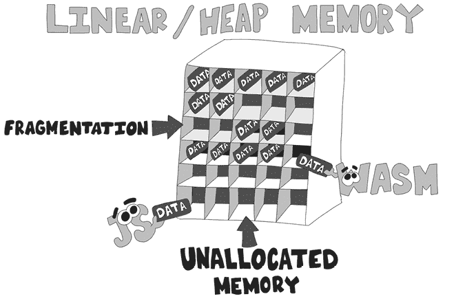
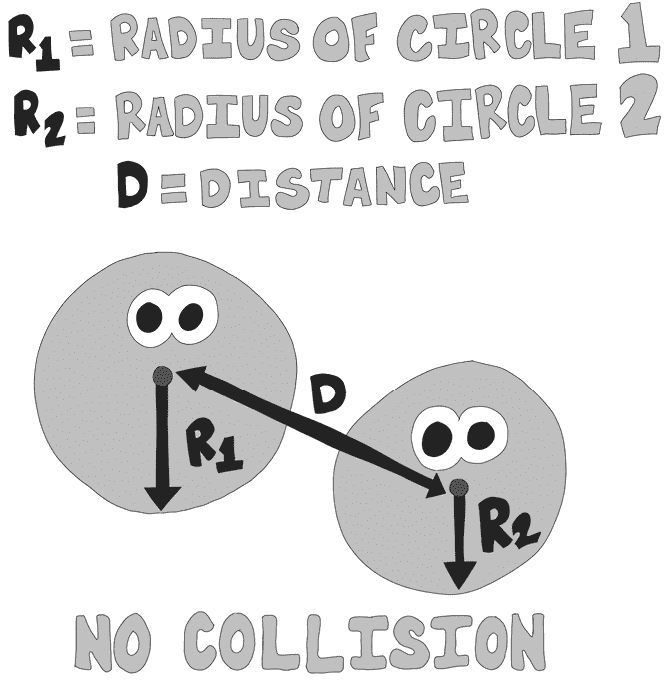
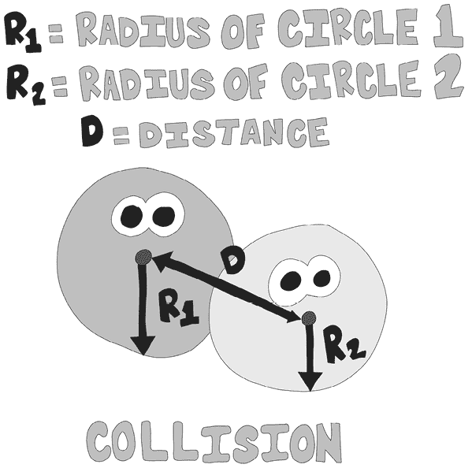

# 第六章：线性内存


在本章中，我们将探讨线性内存是什么，如何使用它在 JavaScript 和 WebAssembly 代码之间共享数据，以及如何从 JavaScript 中创建它。我们还将从 WebAssembly 中更新线性内存，然后在 JavaScript 代码中使用这些更新。

在计算机游戏中，一个常见的任务是碰撞检测，即检测并适当地响应两个物体接触的情况。随着物体数量的增加，所需的计算量会呈指数增长。碰撞检测是构建 WebAssembly 的一个理想候选任务。在本章中，我们将创建一个在 JavaScript 中随机定义的圆形列表，并将该圆形数据添加到 WebAssembly 的线性内存中。然后，我们将使用这些数据来判断这些圆形是否发生碰撞。

WebAssembly 在处理大量需要大量计算的数据时表现得最好，并且可以让它运行。WebAssembly 模块比 JavaScript 更快地执行数学运算。然而，每次 JavaScript 和 WebAssembly 模块之间的交互都有一定的成本。您可以使用线性内存在 JavaScript 中加载大量数据，然后在 WebAssembly 模块内进行处理。

## WebAssembly 中的线性内存

线性内存充当一个巨大的数据数组，可以在 WebAssembly 和 JavaScript 之间共享。如果你熟悉低级编程，线性内存类似于本地应用程序中的堆内存。如果你熟悉 JavaScript，可以把它看作一个巨大的`ArrayBuffer`对象。像 C 和 C++ 这样的语言通过在计算机的栈上分配内存来创建局部变量。栈分配的局部变量在函数执行完毕后立即从内存中释放。这一高效的过程意味着在栈上分配和释放数据就像是递增和递减栈指针一样简单。您的应用程序只需递增栈指针，瞧，您就得到了一个新的已分配变量，如图 6-1 所示。


图 6-1：栈指针

栈非常适合用于局部变量。然而，WAT 中的一个限制是，使用栈的局部变量只能是四种类型之一，且它们都属于数值类型。有时，您可能需要更复杂的数据结构，例如字符串、结构体、数组和对象。

分配命令，例如 C 中的`malloc`和 C++、JavaScript 中的`new`，将内存分配到堆上，这些语言的内存管理库必须寻找一个足够大的空闲内存区域来容纳所需的内存块。随着时间的推移，这可能导致内存碎片化，即已分配的内存块之间被未分配的内存分隔开，如图 6-2 所示。

WebAssembly 线性内存以大块叫做*页面*的形式分配，一旦分配后就无法释放。WebAssembly 内存的管理方式也有点像汇编语言的内存管理：一旦您为 WebAssembly 模块分配了所选数量的页面，您作为程序员必须跟踪您在使用内存时的用途以及它的位置。在接下来的几节中，我们将更仔细地研究如何通过探索内存页面来使用线性内存。



图 6-2：JavaScript 和 WebAssembly 传递的线性内存数据

### 页面

页面是 WebAssembly 模块可以分配的最小数据块。在本文写作时，所有 WebAssembly 页面都是 64KB 大小。在当前版本 WebAssembly 1.0 中，您无法更改该大小，尽管 WebAssembly 社区组正在进行提案，计划根据应用程序的需求使页面大小可变。本文写作时，应用程序可以分配的最大页面数为 32,767，总内存大小为 2GB。对于 Web 应用程序来说，这种最大内存分配已经足够，但对于基于服务器的应用程序则有限制。增加页面大小可能使服务器应用程序能够增加它们可以分配的最大线性内存。对于嵌入式 WebAssembly 应用程序来说，64KB 可能过大；例如，ATmega328 只有 32KB 的闪存。WebAssembly 的更新可能会在您阅读本文时消除这一限制。

您可以在 WebAssembly 模块内部或在嵌入环境中为导入创建应用程序将使用的页面数量。

#### 在代码中创建页面

要在 WAT 中分配一个线性内存页面，使用一个简单的`(memory)`表达式，如列表 6-1 所示。

```
(memory 1)
```

列表 6-1：在 WAT 中声明一个内存页面

将`1`传入内存表达式指示模块为线性内存预留一个页面。要分配当前可以为 WebAssembly 模块在运行时分配的最大内存，请使用列表 6-2 中的表达式。

```
(memory 32_767)
```

列表 6-2：声明最大内存页面数

尝试将 `32_767` 传入`(memory)`表达式会导致编译错误。使用`(memory)`表达式创建的内存对嵌入环境不可访问，除非您包含`(export)`表达式。

#### 在嵌入环境中创建内存

创建线性内存的另一种方式是在嵌入环境内。如果嵌入环境是 JavaScript，则创建该内存的代码是`new WebAssembly.Memory`，如列表 6-3 所示。

```
const memory = new WebAssembly.Memory({initial: 1});
```

列表 6-3：在 JavaScript 中创建 WebAssembly `Memory` 对象

然后，您可以使用列表 6-4 中的`(import)`表达式从 WebAssembly 模块访问它。

```
(import "js" "mem" (memory 1))
```

列表 6-4：在 JavaScript 中导入分配的内存页面

使用`import`要求你在 JavaScript 中创建一个 `Memory` 对象，使用 `WebAssembly.Memory` 类，然后在通过 `import` 对象初始化 WebAssembly 模块时将其传入。创建一个名为 *pointer.js* 的文件，并添加 Listing 6-5 中的 JavaScript 代码，这段代码创建了一个 WebAssembly `Memory` 对象。

**pointer.js**

```
const fs = require('fs');
const bytes = fs.readFileSync(__dirname + '/pointer.wasm');
const memory = new WebAssembly.Memory({1initial: 1, 2maximum: 4});

const importObject = {
  env: {
  3 mem: memory,
  }
};

( async () => {
 let obj = await WebAssembly.instantiate(new Uint8Array(bytes),
                                        4 importObject);
  let pointer_value = obj.instance.exports.get_ptr();
  console.log(`pointer_value=${pointer_value}`);
})();
```

Listing 6-5: 初始化 WebAssembly 线性内存并将其传递给 WebAssembly 模块。

在创建时，这段代码传入一个具有两个初始化值的对象。`initial` 1 参数是必需的，通过传入 `1`，我们指示 JavaScript 引擎为线性内存保留一页空间（64KB）。第二个值 `maximum` 2 是可选的，它让浏览器知道我们可能希望稍后增加线性内存的大小，并且我们大概率不会希望将内存增长到超过四页。你可以通过调用 `memory.grow` 方法来增加线性内存的大小。虽然不需要设置最大值来增加内存，但传入最大值会告诉浏览器为增长的内存预留更多空间，因为很可能会调用 `grow` 方法。如果你尝试将线性内存增长到超过传入的最大值，应用程序将抛出错误。创建内存对象后，我们通过 `importObject` 中的 `env.mem` 3 将其传递给 WebAssembly 模块。JavaScript 在实例化时将 `importObject` 传入模块 4。

### 指针

*指针* 是一个引用内存中某个位置的变量。指针在计算机科学中有多种应用，但在这个上下文中，我们将用它们来指向线性内存中的数据结构。图 6-3 显示了一个指针指向内存位置 5，该位置的值为 99。


图 6-3：指向内存中第五个字节的指针

WebAssembly 的指针行为与 C 或 C++ 中你可能熟悉的指针不同，后者可以指向局部变量或堆上的变量。Listing 6-6 中的 C 代码创建了一个名为 `ptr` 的指针，指向局部变量 `x` 的地址。

```
int x = 25;
int *ptr = &x;
```

Listing 6-6: 在 C 中设置指针值的示例

指针`ptr`被设置为`x`变量的地址，`x`是一个局部变量，它在栈上有一个地址。WebAssembly 没有像 C 语言中的`int*`整数指针类型那样的独立指针类型。WebAssembly 的线性内存是一个大型数据数组。当你在 WAT 中表示指针时，你必须将数据放入线性内存中；然后，指针就是指向该数据的`i32`索引。编译程序为 WebAssembly 时，Listing 6-6 中的变量`x`会在线性内存中接收一个地址。与 C 语言不同，WAT 不能创建指向局部或全局变量的指针。要在 WebAssembly 中实现类似 C 语言的指针功能，你可以将一个全局变量设置为线性内存中的特定位置，并使用该全局变量来设置或检索存储在 WebAssembly 线性内存中的值，如 Listing 6-7 所示。

**pointer.wat**

```
(module
1 (memory 1)
2 (global $pointer i32 (i32.const 128))
3 (func $init
  4 (i32.store
  5 (global.get $pointer)  ;; store at address $pointer
  6 (i32.const 99)         ;; value stored
    )
  )
7 (func (export "get_ptr") (result i32)
8 (i32.load (global.get $pointer)) ;; return value at location $pointer
  )
9 (start $init)
)
```

Listing 6-7: 在 WAT 中模拟指针

该模块创建了一页线性内存 1 和一个指向内存位置`128`的全局`$pointer`2。我们创建了一个函数`$init`3，该函数使用`(i32.store)`4 表达式将`$pointer`指向的内存位置的值设置为`99`。传递给`(i32.store)`5 的第一个参数是存储值的内存位置，第二个参数 6 是你想要存储的值。要从这个指针位置检索值，你可以使用`i32.load`8 表达式，并传入你要检索的内存位置。我们创建了一个函数`"get_ptr"`7 来检索这个值。然后，`(start` `$init)`9 语句将`$init`3 作为模块初始化函数进行调用。`start`语句声明一个函数作为模块的初始化函数。这个函数将在模块实例化时自动执行。

一旦你编译了*pointer.wasm*文件并使用`node`执行它，你应该会看到以下输出：

```
pointer_value=99
```

## JavaScript 内存对象

现在我们对线性内存的工作原理有了一些了解，我们将创建一个 WebAssembly 内存对象，从 WebAssembly 模块内部初始化数据，然后从 JavaScript 访问这些数据。当你在处理线性内存时，很可能你希望从 WebAssembly 和嵌入环境中访问它。在这种情况下，嵌入环境是 JavaScript，因此我们将在 JavaScript 中定义线性内存，以便在 WebAssembly 模块初始化之前访问它。这个 WAT 模块类似于 Listing 6-7，但它将从 JavaScript 导入线性内存。

### 创建 WebAssembly 内存对象

创建一个名为*store_data.wat*的文件，并将 Listing 6-8 中的代码添加到该文件中。

**store_data.wat**

```
(module
1 (import "env" "mem" (memory 1))
2 (global $data_addr (import "env" "data_addr") i32)
3 (global $data_count (import "env" "data_count") i32)

4 (func $store_data (param $index i32) (param $value i32)
    (i32.store
     (i32.add
      (global.get $data_addr) ;; add $data_addr to the $index*4 (i32=4 bytes)
      (i32.mul (i32.const 4) (local.get $index)) ;; multiply $index by 4
     )
     (local.get $value) ;; value stored
    )
  )

5 (func $init
    (local $index i32)

  6 (loop $data_loop
      local.get $index

      local.get $index
      i32.const 5
      i32.mul      

    7 call $store_data ;; called with parameters $index and $index * 5

      local.get $index
      i32.const 1
      i32.add          ;; $index++

      local.tee $index
    8 global.get $data_count
      i32.lt_u
      br_if $data_loop
    )

 9 (call $store_data (i32.const 0) (i32.const 1))

  )

a (start $init)
)
```

Listing 6-8: 在 WebAssembly 中创建线性内存对象

Listing 6-8 中的模块从 JavaScript 嵌入环境中导入其线性内存 1，我们稍后将定义它。它从 JavaScript 导入我们将加载到全局变量`$data_addr` 2 中的数据地址。它还导入了`$data_count` 3，该变量包含在模块初始化时我们将存储的`i32`整数的数量。`$store_data` 4 函数接收一个索引和一个值，并将数据位置（`$data_addr` + `$index` * 4）设置为`$value`（我们乘以 4 是因为`i32`类型占用四个字节）。通过使用`$data_addr`，一个导入的全局变量，允许 JavaScript 决定存储这些值的内存模块位置。

如 Listing 6-6 所示，`$init` 5 函数在模块初始化时执行，因为存在`(start` `$init)`语句。与之前的`$init`函数不同，这个函数在一个循环 6 中初始化数据。循环可以是初始化线性内存中特定部分数据的有用方法，使其设置为相同的值，或某些可能在循环中计算的值。这个循环根据模块从 JavaScript 导入的`$data_count` 8 全局变量设置了几个 32 位整数。当这个`loop`调用`$store_data` 7 时，它传入一个索引，表示`loop`已经完成的次数，以及一个值，值为`$index` * 5。我选择了`$index` * 5 的值，这样当我们显示数据时，你会看到数据值以 5 为增量递增。

在`loop`之后，我们再调用一次`$store_data` 9，将数组中的第一个数据值设置为`1`。如果不初始化它，内存缓冲区将以所有数据初始化为`0`。因为`loop`将第一个数据值设置为`0`，所以当我们在 JavaScript 中查看数据时，无法清楚地看到设置的数据从何处开始。将其设置为`1`，使得在下一节中我们从 JavaScript 显示数据时，数据集的开始更加明显。

在完成创建*store_data.wat*文件后，使用`wat2wasm`编译它，生成*store_data.wasm*文件。

### 在控制台上使用颜色记录

在编写*store_data.js*部分之前，让我们简要了解一个名为*colors*的 Node 模块，它允许你使用自选颜色将日志行输出到控制台。在后续部分，我们将使用这个包来更方便地查看输出数据中的不同结果。要安装 colors，请使用`npm`命令，如 Listing 6-9 所示。

```
npm i colors
```

Listing 6-9: 使用`npm`安装 colors 模块

现在我们可以引入我们的应用程序来使用它，这使我们能够修改 JavaScript 中的字符串类型，添加设置颜色、加粗文本及其他一些功能的属性。创建一个名为*colors.js*的文件，并添加 Listing 6-10 中的代码。

**colors.js**

```
const colors = require('colors');

console.log('RED COLOR'.red.bold);  // logs bold red text
console.log('blue color'.blue); // logs blue text
```

Listing 6-10: 用颜色将日志输出到控制台

当你使用`node`运行*colors.js*时，如 Listing 6-11 所示，日志输出将以我们指定的颜色显示。

```
node colors.js
```

Listing 6-11: 运行*color.js*并将颜色日志输出到控制台。

现在你应该能看到清单 6-12 中的输出，第一行是红色，第二行是蓝色。

```
**RED COLOR**
blue color
```

清单 6-12：应用颜色模块

我们将在未来的应用程序中使用颜色模块，以改善控制台中输出的外观。在书中，红色的输出会变为黑色，但会加粗。接下来，让我们继续创建一个 *store_data.js* 文件。

### 在 store_data.js 中创建 JavaScript

现在我们需要一个 *store_data.js* JavaScript 文件来执行 *store_data.wasm* 模块。我们使用清单 6-13 来创建这个 JavaScript 文件。

**store_data.js（第一部分 / 共 2 部分）**

```
 const colors = require('colors'); // allow console logs with color
  const fs = require('fs');
  const bytes = fs.readFileSync(__dirname + '/store_data.wasm');

// allocate a 64K block of memory
1 const memory = new WebAssembly.Memory({initial: 1 });
// 32-bit data view of the memory buffer
2 const mem_i32 = new Uint32Array(memory.buffer);

3 const data_addr = 32; // the address of the first byte of our data

// The 32-bit index of the beginning of our data
4 const data_i32_index = data_addr / 4;
5 const data_count = 16; // the number of 32-bit integers to set

6 const importObject = { // The objects WASM imports from JavaScript
    env: {
      mem: memory,
 data_addr: data_addr,
      data_count: data_count
    }
  };
...
```

清单 6-13：一个 WebAssembly 线性内存缓冲区和带有全局导入的 `importObject`

我们创建了三个常量，第一个常量创建了一个新的 `WebAssembly.Memory` 1 对象，我们将在初始化 WebAssembly 模块时使用它。常量 `mem_i32` 2 提供了一个 32 位整数视图，用于查看内存缓冲区。这一点很重要，必须记住它不是缓冲区数据的副本，而是以特定的方式将缓冲区视为一个 32 位无符号整数数组。当我们从 WebAssembly 模块内部更改内存缓冲区中的值时，我们可以使用这个 `mem_i32` 视图查看这些值的变化。常量 `data_addr` 3 是我们在 WebAssembly 模块中设置的数据的字节位置。这个位置是 *字节索引 m*，而不是 32 位整数数组的编号。

因为一个 32 位整数占四个字节，我们需要一个起始数据索引，它是 `data_addr` 常量除以 4。我们将这个值设置为 `data_i32_index` 4。然后，我们定义了由 `const data_count` 5 指定的模块中设置的 32 位整数值的数量。本段代码中的最后一个 `const` 是 `importObject` 6。`importObject` 包含三个导入的数据对象，用于 WebAssembly 模块。

清单 6-14 中的 JavaScript 最后一部分使用了 IIFE 来实例化 WebAssembly 模块并将线性内存中的值输出到控制台。

**store_data.js（第二部分 / 共 2 部分）**

```
...
( async () => {
1 let obj = await WebAssembly.instantiate(new Uint8Array(bytes),
                                          importObject );

2 for( let i = 0; i < data_i32_index + data_count + 4; i++ ) {
    let data = mem_i32[i];
    if (data !== 0) {
    3 console.log(`data[${i}]=${data}`.red.bold);
    }
    else {
    4 console.log(`data[${i}]=${data}`);
    }

  }
})();
```

清单 6-14：在 IIFE 实例化 WebAssembly 模块后输出线性内存中的数据值

这段 JavaScript 代码的最后部分实例化了 *store_data.wasm* 模块，并传入了我们在清单 6-13 中创建的 `importObject`。初始化 WebAssembly 模块后，内存缓冲区中的数据会发生变化，因为 WAT 代码中的 `$init` 函数会在初始化过程中运行。然后，我们开始循环 2 遍历 `mem_i32` 数组，从内存缓冲区的第一个地址开始，并在数据设置后显示四个整数。如果值不为 `0`，则在浏览器中通过将其日志显示为红色 3 来展示 `mem_i32` 中的值；如果值为 `0`，则以默认的控制台颜色 4 显示。

使用 `node` 运行 *store_data.js*；你应该可以在控制台中看到清单 6-15 中的输出日志。

```
data[0]=0
data[1]=0
data[2]=0
data[3]=0
data[4]=0
data[5]=0
data[6]=0
data[7]=0
**data[8]=1**
**data[9]=5**
**data[10]=10**
**data[11]=15**
**data[12]=20**
**data[13]=25**
**data[14]=30**
**data[15]=35**
**data[16]=40**
**data[17]=45**
**data[18]=50**
**data[19]=55**
**data[20]=60**
**data[21]=65**
**data[22]=70**
**data[23]=75**
data[24]=0
data[25]=0
data[26]=0
data[27]=0
```

清单 6-15：数据输出

WebAssembly 模块设置的第一个数据元素是`data[8]`，这就是红色输出开始的位置。值`8`是`data_i32_index`常量中的值，是`data_addr`值的四分之一。在代码中设置了 16 个整数，因为我们已将`const data_count`设置为 16。在清单 6-15 中的数据里，所有值为`0`的数据元素没有在 WebAssembly 模块中被设置。你可以看到，前八个数字以及最后四个数字都是`0`，它们都以默认控制台颜色显示。

## 碰撞检测

之前，我们在 JavaScript 中创建了内存缓冲区对象，但它是从 WebAssembly 模块初始化的。这一次，我们将在 JavaScript 中初始化内存缓冲区，并使用在 JavaScript 中生成的值。我们还将创建更多有趣的数据结构来处理我们的碰撞检测数据。当修改 WebAssembly 内存缓冲区中的数据时，我们希望将数据分组到结构中，以便更易于管理。我们将在 JavaScript 中创建一组随机的圆形定义，每个定义都包含一个 x 和 y 坐标以及半径。然后，JavaScript 将这些值设置到 WebAssembly 内存缓冲区中。为了组织线性内存中的对象，你需要使用基地址、跨度和偏移量的组合。

### 基地址、跨度和偏移量

在 WebAssembly 模块内处理线性内存时，我们需要在低级别理解我们的数据结构。在我们的 JavaScript 中，我们将线性内存中的数据当作 JavaScript 类型化数组来处理。在 WebAssembly 模块内部，线性内存更像是一个内存堆或一个大型字节数组。当我们想要创建一个数据结构数组时，我们需要知道该数组的*起始地址*（基地址）、*跨度*（每个结构之间的字节距离）以及任何结构属性的*偏移量*（我们在结构中找到属性的位置）。

我们将在线性内存中处理一个有四个属性的结构：x 和 y 坐标、半径和碰撞标志。我们将跨度设置为*单位跨度*，如图 6-4 所示，这意味着数组中每个结构之间的距离与结构的大小匹配。


图 6-4：设置单位跨度

为了获取我们想要访问的特定数据结构的内存地址，我们将结构的索引乘以跨度并加上基地址。*基地址*是我们结构数组的起始地址。

作为单位跨度的替代方案，你可以给跨度添加填充。如果开发人员决定将他们的结构地址对齐到 2 的幂次方，他们可能会在结构末尾添加未使用的字节（称为*填充*）。例如，如果我们希望我们的结构与 16 字节地址对齐，我们可以在结构末尾添加四个字节的填充，使其跨度为 16，如图 6-5 所示。

然而，在这个例子中我们不需要填充。我们数据结构中的每个属性都有一个偏移量。例如，假设我们有两个 32 位整数属性，`x` 和 `y`，它们分别是数据结构中的前两个属性。第一个属性 `x` 位于数据结构的开头，因此其偏移量为 `0`。由于 `x` 属性是 32 位整数，它占据了数据结构的前四个字节。这意味着 `y` 的偏移量从第五个字节开始，偏移量为 `4`（字节 0、1、2、3）。通过使用基本地址（我们数据结构的起始地址）、步幅和每个属性的偏移量，我们可以构建一个数据结构数组。


Figure 6-5: 填充步幅

### 从 JavaScript 加载数据结构

让我们开始创建一个名为 *data_structures.js* 的新示例应用程序的 JavaScript 文件。在这个应用中，我们将创建表示内存中圆形的结构体。稍后，我们将对这些圆形进行碰撞检测。将 Listing 6-16 中的代码添加到 *data_structures.js* 中。

**data_structures.js（第一部分，共 3 部分）**

```
const colors = require('colors'); // allow console logs with color
const fs = require('fs');
const bytes = fs.readFileSync(__dirname + '/data_structures.wasm');
 // allocate a 64K block of memory
1 const memory = new WebAssembly.Memory({initial: 1});

 // 32-bit view of memory buffer
  const mem_i32 = new Uint32Array(memory.buffer);

  const obj_base_addr = 0; // the address of the first byte of our data
2 const obj_count = 32;    // the number of structures
3 const obj_stride = 16;   // 16-byte stride

  // structure attribute offsets
4 const x_offset = 0;
5 const y_offset = 4;
  const radius_offset = 8;			
  const collision_offset = 12;			

  // 32-bit integer indexes
  const obj_i32_base_index = obj_base_addr / 4; // 32-bit data index
  const obj_i32_stride = obj_stride / 4;        // 32-bit stride

 // offsets in the 32-bit integer array
6 const x_offset_i32 = x_offset / 4;
  const y_offset_i32 = y_offset / 4;
 const radius_offset_i32 = radius_offset / 4;
  const collision_offset_i32 = collision_offset / 4;

7 const importObject = { // The objects WASM imports from JavaScript
    env: {
      mem: memory,
      obj_base_addr: obj_base_addr,
      obj_count: obj_count,
      obj_stride: obj_stride,
      x_offset: x_offset,			
      y_offset: y_offset,
      radius_offset: radius_offset,
      collision_offset: collision_offset,
    }
  };
...
```

Listing 6-16: 设置常量以定义碰撞检测程序的结构

首先，我们创建一系列 `const` 值，用于在 WebAssembly 内存缓冲区中创建结构体。正如 Listing 6-16 中的代码，这段代码创建了一个单一的 64KB WebAssembly 内存页面 1，并通过 32 位无符号整数视图来访问该数据。`obj_base_addr` 常量将数据结构的基本地址设置为 `0`，即页面内存的第一个字节。

我们将`obj_count` 2 `const` 设置为此代码中结构体的数量。`obj_stride` 3 常量保存结构体的字节数。我们将其设置为`16`，因为这个结构体包含四个 32 位整数，合计 16 字节。接下来的 `const` 声明组包含了属性的偏移量。

`x_offset` 4 是 `x` 从结构体开始位置的偏移量，即 `x` 值位置在每个结构体中的字节数。`y_offset` 5 是结构体中 `y` 值位置的字节数，其值为 `4`，因为 `x` 值是 32 位整数，使得 `y` 值位于结构体的第五个字节。然后我们设置了 `radius` 6 属性和 `collision` 7 属性的偏移量。

我们通过将字节地址除以 4 和步幅除以 4 来计算整数索引和步幅。原因是字节地址和步幅是字节数，而整数索引是 32 位整数（4 字节）。我们还需要找到整数数组中的索引，这是通过将字节索引除以 4 来计算的。`importObject` 7 已被修改以包括我们添加的新 `const` 值。

在定义了常量之后，我们将创建一系列随机大小的圆形供程序使用。如前所述，圆形由 x 和 y 坐标以及半径定义。我们将随机定义圆形的 x 和 y 坐标，值从 0 到 99，半径在 1 到 11 之间。列表 6-17 中的代码循环遍历内存对象，为每个结构设置随机值。

**data_structures.js（第二部分，共 3 部分）**

```
...
  for( let i = 0; i < obj_count; i++ ) {
  1 let index = obj_i32_stride * i + obj_i32_base_index;

 2 let x = Math.floor( Math.random() * 100 );
    let y = Math.floor( Math.random() * 100 );
    let r = Math.ceil( Math.random() * 10 );

  3 mem_i32[index + x_offset_i32] = x;
    mem_i32[index + y_offset_i32] = y;
    mem_i32[index + radius_offset_i32] = r;
  }
...
```

列表 6-17：使用随机的 x 和 y 坐标以及半径初始化圆形

循环为每个结构获取一个索引，用于碰撞检测圆形。`x`、`y` 和半径 `r` 的值被设置为随机值。这些随机值随后用于基于对象索引和属性偏移设置内存值。

### 显示结果

接下来，我们需要实例化 *data_structures.wasm* 模块，它运行 `$init` 函数，执行我们在此数据测试中随机生成的每个圆形之间的碰撞检测。列表 6-18 显示了添加到 *data_structures.js* 的代码。

**data_structures.js（第三部分，共 3 部分）**

```
...
( async () => {
1 let obj = await WebAssembly.instantiate(new Uint8Array(bytes),
                                          importObject );

2 for( let i = 0; i < obj_count; i++ ) {
  3 let index = obj_i32_stride * i + obj_i32_base_index;

  4 let x = mem_i32[index+x_offset_i32].toString().padStart(2, ' ');
    let y = mem_i32[index+y_offset_i32].toString().padStart(2, ' ');
    let r = mem_i32[index+radius_offset_i32].toString()
                   .padStart(2,' ');
    let i_str = i.toString().padStart(2, '0');
    let c = !!mem_i32[index + collision_offset_i32];

    if (c) {
    5 console.log(`obj[${i_str}] x=${x} y=${y} r=${r} collision=${c}`
          .red.bold);
    }
    else {
    6 console.log(`obj[${i_str}] x=${x} y=${y} r=${r} collision=${c}`
          .green);
    }
  }
})();
```

列表 6-18：WebAssembly 运行后，代码循环遍历线性内存，查找圆形碰撞。

这个 IIFE 函数实例化 WebAssembly 模块 1，并循环遍历 `mem_i32` 数组中的对象 2。这个循环使用步幅、索引和基索引值 3 获取结构的索引。然后，我们使用计算出的索引从 `mem_i32` 4 数组中获取 `x`、`y`、半径和碰撞值。如果发生碰撞，这些值会以红色 5 显示在控制台上，如果没有碰撞，则以绿色 6 显示。

我们现在有了加载一系列定义圆形的 JavaScript 代码，每个圆形的 x 和 y 坐标是随机选择的，值在 0 到 100 之间。每个圆形还有一个半径，值在 1 到 10 之间随机选择。WebAssembly 内存缓冲区已使用这些值进行初始化。JavaScript 将在 `importObject` 中设置适当的偏移量和步幅值。除了每个结构中的 `x`、`y` 和半径外，还会留出四个字节来存储碰撞值。如果圆形与另一个圆形发生碰撞，值为 `1`，如果没有碰撞，则值为 `0`。WebAssembly 模块的初始化 `(start)` 函数计算碰撞。WebAssembly 模块初始化完成后，控制台显示此碰撞检查的结果。此时，我们还没有定义 WebAssembly 模块。接下来我们将定义它。

### 碰撞检测函数

在其他部分中，我们在 JavaScript 之前定义了 WAT 代码。在这一部分中，JavaScript 初始化定义圆形的值，这些值存储在结构体数组中。因此，我们将在本节中首先编写 JavaScript。当你在两个圆之间进行碰撞检测时，你会使用毕达哥拉斯定理来判断圆心之间的距离是否大于圆的半径和。本节中的 WAT 代码循环遍历我们在 WebAssembly 内存中定义的每个圆，将其与其他圆进行比较，查看它们是否发生碰撞。碰撞检测的细节不是本节的重点，因此我们不会过多深入探讨。它仅仅是演示如何将数据分离到结构体中，并使用这些数据与 WAT 代码进行计算。

WAT 代码的第一部分定义了从 JavaScript 导入的内容。Listing 6-19 显示了 WAT 模块的开头。

**data_structures.wat（第一部分，共 6 部分）**

```
(module
  (import "env" "mem" (memory 1))           
1 (global $obj_base_addr  (import "env" "obj_base_addr") i32)
2 (global $obj_count    (import "env" "obj_count") i32)
3 (global $obj_stride   (import "env" "obj_stride") i32)

 ;; attribute offset locations
4 (global $x_offset     (import "env" "x_offset") i32)
5 (global $y_offset     (import "env" "y_offset") i32)
6 (global $radius_offset  (import "env" "radius_offset") i32)
7 (global $collision_offset (import "env" "collision_offset") i32)
...
```

Listing 6-19：导入定义数据结构的全局变量

传递给 WebAssembly 模块的全局变量定义了线性内存的布局和其中的数据结构。`$obj_base_addr` 1 个全局变量是定义圆形结构体在内存中的位置。`$obj_count` 2 个全局变量是在线性内存中定义的圆的数量。`$obj_stride` 3 个全局变量是每个圆形定义之间的字节数。接下来，我们导入每个属性的值。`$x_offset` 4、`$y_offset` 5、`$radius_offset` 6 和 `$collision_offset` 7 是对象的 `x`、`y`、半径和碰撞标志值的字节偏移量。必须在该模块内设置这些值。

接下来，我们将定义 `$collision_check` 函数。这个函数的工作原理的细节只有在你对圆形碰撞检测的工作方式感兴趣时才有价值。简而言之，它使用毕达哥拉斯定理来判断两个圆之间的距离是否小于圆的半径和。简要解释一下，假设第一个圆的半径为 R[1]，第二个圆的半径为 R[2]，圆之间的距离为 D，如图 6-6 所示。如果 R[1] + R[2] 小于 D，则不会发生碰撞。



图 6-6：如果 R[1] + R[2] 小于圆之间的距离，则不会发生碰撞。

如果距离小于 R[1] + R[2]，则发生碰撞，如图 6-7 所示。



图 6-7：R[1] + R[2] 大于圆之间的距离。

Listing 6-20 展示了 `$collision_check` 函数的代码。

**data_structures.wat（第二部分，共 6 部分）**

```
...
1 (func $collision_check
    (param $x1 i32) (param $y1 i32) (param $r1 i32)
    (param $x2 i32) (param $y2 i32) (param $r2 i32)
    (result i32)

    (local $x_diff_sq i32)
    (local $y_diff_sq i32)
    (local $r_sum_sq i32)

    local.get $x1
    local.get $x2
    i32.sub
    local.tee $x_diff_sq
    local.get $x_diff_sq
    i32.mul
      2 local.set $x_diff_sq  ;; ($x1 - $x2) * ($x1 - $x2)

    local.get $y1
 local.get $y2
    i32.sub
    local.tee $y_diff_sq
    local.get $y_diff_sq
    i32.mul
      3 local.set $y_diff_sq  ;; ($y1 - $y2) * ($y1 - $y2)

    local.get $r1
    local.get $r2
    i32.add
    local.tee $r_sum_sq
    local.get $r_sum_sq
    i32.mul
      4 local.tee $r_sum_sq   ;; ($r1 + $r2) * ($r1 + $r2)

    local.get $x_diff_sq
    local.get $y_diff_sq
      5 i32.add  ;; pythagorean theorem A squared + B squared = C squared

      6 i32.gt_u ;; if distance is less than sum of the radii return true
)
...
```

Listing 6-20：一个 WebAssembly 碰撞检测函数

该函数接受两个圆形的`x`、`y`和半径属性 1，然后如果它们重叠则返回`1`，否则返回`0`。它首先通过从`$x2`减去`$x1`来计算两个圆形之间的`x`距离。然后它将该值平方，并存储在`$x_diff_sq` 2 中；接着通过从`$y2`减去`$y1`来计算两个圆形之间的`y`距离。它将这个结果平方并存储在`$y_diff_sq` 3 中。我们要建立的是毕达哥拉斯定理 A² + B² = C² 5。在这个场景中，`$x_diff_sq`是 A²，`$y_diff_sq`是 B²。这两者的和是 C²，然后与半径平方的和 4 进行比较。如果半径²大于 C²，表示圆形重叠，函数返回`1`；否则，函数返回`0`。该函数使用`i32.gt_u` 6 表达式来做出这个决定。

在`$collision_check`函数之后，我们需要一些辅助函数。`$get_attr`辅助函数接受一个对象基地址参数和一个属性偏移量参数，并返回该地址位置在线性内存中的值。列表 6-21 展示了该函数。

**data_structures.wat（第三部分，共 6 部分）**

```
...
1 (func $get_attr (param $obj_base i32) (param $attr_offset i32)
    (result i32)
    local.get $obj_base
    local.get $attr_offset
  2 i32.add         ;; add attribute offset to base address
  3 i32.load        ;; load the address and return it
  )
...
```

列表 6-21：从线性内存中检索对象属性

在函数定义 1 中，`$obj_base`参数是对象的基地址，而`$attr_offset`是我们要检索的特定属性的偏移量。该函数将这两个值相加 2，然后从该地址加载值 3，并将其作为结果返回。

下一个辅助函数是`$set_collision`，它将两个圆形对象的碰撞标志设置为真。列表 6-22 展示了该函数。

**data_structures.wat（第四部分，共 6 部分）**

```
...
1 (func $set_collision
    (param $obj_base_1 i32) (param $obj_base_2 i32)
    local.get $obj_base_1
    global.get $collision_offset
  2 i32.add   ;; address = $obj_base_1 + $collision_offset
    i32.const 1
  3 i32.store ;; store 1 as true in the collision attribute for this object

    local.get $obj_base_2
    global.get $collision_offset
  4 i32.add   ;; address = $obj_base_2 + $collision_offset
    i32.const 1
  5 i32.store ;; store 1 as true in the collision attribute for this object
  )
...
```

列表 6-22：为给定对象设置碰撞属性

该函数接受两个对象基地址参数 1，用于设置内存中这些对象的碰撞标志。它通过将`$obj_base_1`加到`$collision_offset` 2，然后将该位置在线性内存中的值设置为`1` 3。接着，它将`$obj_base_2`加到`$collision_offset` 4，并将该位置的值设置为`1` 5。

现在我们已经定义了其他函数，可以将`$init`函数添加到 WAT 代码中，如列表 6-23 所示。

**data_structures.wat（第五部分，共 6 部分）**

```
...
(func $init
1 (local $i i32)     ;; outer loop counter
  (local $i_obj i32) ;; address of ith object
  (local $xi i32)(local $yi i32)(local $ri i32) ;; x,y,r for object i

2 (local $j i32)     ;; inner loop counter
  (local $j_obj i32) ;; address of the jth object
  (local $xj i32)(local $yj i32)(local $rj i32) ;; x,y,r for object j

  (loop $outer_loop
  (local.set $j (i32.const 0))  ;; $j = 0

  (loop $inner_loop
    (block $inner_continue
    ;; if $i == $j continue
  3 (br_if $inner_continue (i32.eq (local.get $i) (local.get $j) ) )

 ;; $i_obj = $obj_base_addr + $i * $obj_stride
    (i32.add (global.get $obj_base_addr)
           4 (i32.mul (local.get $i) (global.get $obj_stride) ) )

 ;; load $i_obj + $x_offset and store in $xi
  5 (call $get_attr (local.tee $i_obj) (global.get $x_offset) )
    local.set $xi    

 ;; load $i_obj + $y_offset and store in $yi
    (call $get_attr (local.get $i_obj) (global.get $y_offset) )
    local.set $yi    

 ;; load $i_obj + $radius_offset and store in $ri
    (call $get_attr (local.get $i_obj) (global.get $radius_offset) )
    local.set $ri    

 ;; $j_obj = $obj_base_addr + $j * $obj_stride
  6 (i32.add (global.get $obj_base_addr)
             (i32.mul (local.get $j)(global.get $obj_stride)))

 ;; load $j_obj + $x_offset and store in $xj
    (call $get_attr (local.tee $j_obj) (global.get $x_offset) )
    local.set $xj    

 ;; load $j_obj + $y_offset and store in $yj
    (call $get_attr (local.get $j_obj) (global.get $y_offset) )
    local.set $yj    

 ;; load $j_obj + $radius_offset and store in $rj
    (call $get_attr (local.get $j_obj) (global.get $radius_offset) )
    local.set $rj    

 ;; check for collision between ith and jth objects
  7 (call $collision_check
      (local.get $xi)(local.get $yi)(local.get $ri)
      (local.get $xj)(local.get $yj)(local.get $rj))

    if ;; if there is a collision
    8 (call $set_collision (local.get $i_obj) (local.get $j_obj))
    end
  )

  9 (i32.add (local.get $j) (i32.const 1)) ;; $j++

 ;; if $j < $obj_count loop
    (br_if $inner_loop
      (i32.lt_u (local.tee $j) (global.get $obj_count)))
  )

  a (i32.add (local.get $i) (i32.const 1)) ;; $i++

 ;; if $i < $obj_count loop
  (br_if $outer_loop
 (i32.lt_u (local.tee $i) (global.get $obj_count) ) )
 )
)
...
```

列表 6-23：一个双重循环，检查线性内存中每个对象之间的碰撞

函数以两组局部变量开始。一组包含计数器、对象地址，以及用于外层循环 1 的`x`、`y`和`r`局部变量。第二组局部变量用于内层`loop` 2 中。该函数的核心是一个双重循环，比较线性内存中每个圆与其他所有圆，查找发生碰撞的圆。内层循环的开始检查`$i`是否与`$j` 3 相等。如果相等，代码跳过对该`$j`对象的检查，否则每个圆都会与自己发生碰撞。

下一行代码计算第`i`个对象 4 的线性内存地址，公式为`$obj_base_addr` + `$i` * `$obj_stride`。然后，它使用`local.tee`表达式在下一行的`(call` `$get_attr)` 5 表达式中设置`$i_obj`的值。对`$getattr` 5 的调用获取第`i`个对象的`x`值，并将其赋给`$xi`。

接下来的四行代码以相同的方式将值加载到`$yi`和`$ri`中。然后，`$xj`、`$yj`和`$rj` 6 也通过调用`$get_attr`来设置。这些值会传递给`$collision_check` 7 函数，如果`$i`和`$j`两个圆相撞，它会返回`1`，如果不相撞，则返回`0`。紧随其后的`if`语句会执行对`$set_collision` 8 的`call`，如果发生了碰撞，该函数会将这两个对象的碰撞标志设置为`1`。循环结束时，`$j` 9 会递增，并且如果`$j`小于`$obj_count`，则会跳转回内层`loop`的顶部。外层`loop`结束时，`$i`会递增，如果`$i`小于`$obj_count`，则会跳转回外层`loop`的顶部。

我们在这个模块中调用的最后一项是`(start` `$init)` 语句，如清单 6-24 所示，它在模块初始化时执行`$init`函数。

**data_structures.wat（第六部分，共 6 部分）**

```
...
  (start $init)
)
```

清单 6-24：`start`表示模块初始化时会执行的函数。

现在我们已经将所有代码放入*data_structures.wat*文件中，可以使用`wat2wasm`来编译 WebAssembly 文件，如清单 6-25 所示。

```
wat2wasm data_structures.wat
```

清单 6-25：编译 *data_structures.wat*

一旦我们有了编译好的 *data_structures.wasm* 文件，就可以使用`node`运行 *data_structures.js*，如清单 6-26 所示。

```
node data_structures.js
```

清单 6-26：运行 *data_structures.js*。

输出将类似于清单 6-27。

```
**obj[00] x=48 y=65 r= 4 collision=true**
**obj[01] x=46 y=71 r= 6 collision=true**
**obj[02] x=12 y=75 r= 3 collision=true**
obj[03] x=54 y=43 r= 2 collision=false
obj[04] x=16 y= 6 r= 1 collision=false
**obj[05] x= 5 y=21 r= 9 collision=true**
obj[06] x=71 y=50 r= 5 collision=false
**obj[07] x=11 y=13 r= 5 collision=true**
**obj[08] x=43 y=70 r= 7 collision=true**
obj[09] x=88 y=60 r= 9 collision=false
**obj[10] x=96 y=21 r= 9 collision=true**
**obj[11] x= 5 y=87 r= 2 collision=true**
obj[12] x=64 y=39 r= 3 collision=false
**obj[13] x=75 y=74 r= 6 collision=true**
**obj[14] x= 2 y=74 r= 8 collision=true**
**obj[15] x=12 y=85 r= 7 collision=true**
obj[16] x=60 y=27 r= 5 collision=false
**obj[17] x=43 y=67 r= 2 collision=true**
obj[18] x=38 y=53 r= 3 collision=false
obj[19] x=34 y=39 r= 5 collision=false
**obj[20] x=42 y=62 r= 2 collision=true**
obj[21] x=72 y=93 r= 7 collision=false
**obj[22] x=78 y=79 r= 8 collision=true**
obj[23] x=50 y=96 r= 7 collision=false
**obj[24] x=34 y=18 r=10 collision=true**
obj[25] x=19 y=44 r= 8 collision=false
**obj[26] x=92 y=82 r= 7 collision=true**
obj[27] x=59 y=56 r= 3 collision=false
**obj[28] x=41 y=75 r= 9 collision=true**
**obj[29] x=28 y=29 r= 6 collision=true**
**obj[30] x=32 y=10 r= 1 collision=true**
**obj[31] x=83 y=15 r= 6 collision=true**
```

清单 6-27：*data_structures.js* 的输出

在实际输出中，任何与其他圆形相撞的圆形应该用红色文本显示，而没有与其他圆形相撞的圆形应该用绿色文本显示。现在我们有一个应用程序，使用 JavaScript 将随机生成的圆形数据加载到 WebAssembly 线性内存中。然后，WebAssembly 模块中的初始化函数会遍历所有数据，并在发生圆形相撞时更新线性内存。碰撞检测是 WebAssembly 的一个很好的使用案例，因为它允许你将大量数据加载到线性内存中，并让 WebAssembly 模块以快速高效的方式进行处理。

## 总结

本章中，你学习了什么是 WebAssembly 线性内存以及如何从 WebAssembly 模块或 JavaScript 中创建它。接下来，我们在 WebAssembly 模块中初始化了线性数据，并从 JavaScript 访问了这些数据。然后，我们使用基址、步幅和属性偏移量在线性内存中创建了数据结构，并通过 JavaScript 使用随机数据初始化了这些数据结构。

最终的项目是一个包含圆形数据结构的数组，每个数据结构都有 x 和 y 坐标以及半径。这些数据被传递到 WebAssembly 模块中，模块使用双重循环遍历圆形数据结构，寻找重叠的圆形。如果找到两个圆形重叠，WebAssembly 模块会在这两个圆形的线性内存中设置一个碰撞标志。然后，JavaScript 会遍历所有这些圆形，显示它们的 x 和 y 坐标、半径，以及它们是否与其他圆形发生了碰撞。

到这一点，你应该已经理解如何在 WAT 和 JavaScript 中操作和设置线性内存。你还应该能够在你的应用程序中使用线性内存来创建数据结构，并在 WebAssembly 中处理大量数据，然后通过 JavaScript 显示出来。在下一章，我们将探讨如何从 WebAssembly 操作文档对象模型（DOM）。
