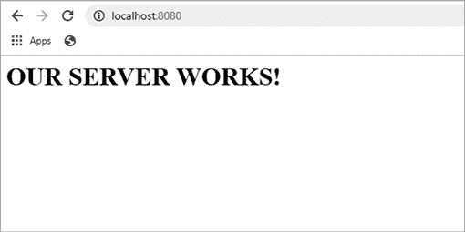
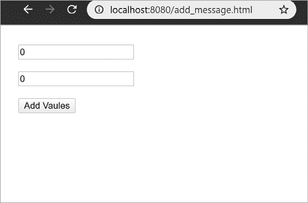
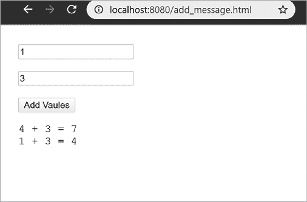
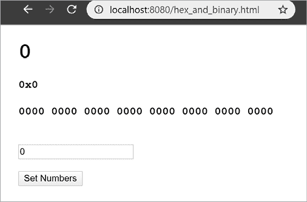
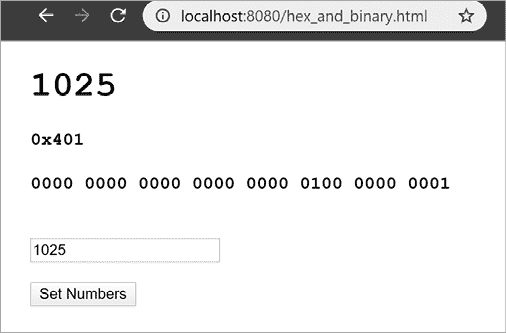

# 第七章：网页应用程序


本章将帮助你理解 WebAssembly 如何通过 JavaScript 与 DOM 交互。虽然这看起来可能有些繁琐，但这是理解 WebAssembly 及其优缺点的必要之恶。如果你正在使用 WebAssembly 工具链，你需要了解该工具链将生成多少额外的 JavaScript 胶水代码。从这一点开始，大多数示例将通过网页运行，而不是通过命令行使用 `node`。

我们将从使用 Node.js 创建一个简单的静态网页服务器开始。WebAssembly 网页应用程序不能直接从文件系统在网页浏览器中加载；相反，它们需要你运行一个网页服务器。Node.js 提供了我们创建网页服务器所需的所有工具。然后，我们将编写我们的第一个 WebAssembly 网页应用程序。

我们将编写的第二个网页应用程序重用了我们在第五章中编写的函数，这些函数从 HTML 的输入元素获取一个数字，并将其传递给 WebAssembly，WebAssembly 将这个数字转换为十进制、十六进制和二进制字符串。

本章结束时，你将了解编写一个加载并实例化 WebAssembly 模块的网页应用程序的基础知识，然后从该模块内调用函数。应用程序还将把来自这些模块的数据写入 DOM 元素。本章中的示例并不代表你通常会使用 WebAssembly 编写的应用程序类型，它们只是演示了一个网页如何加载、实例化并与 WebAssembly 模块进行交互。

## DOM

现代基于网页的应用程序非常复杂，容易让人忘记，HTML 页面本质上只是一个简单的文档。网络最初是为了共享文档和信息而构思的，但很快就显现出我们需要一种标准的方法，使用像 JavaScript 或 Java 这样的语言来动态更新这些文档。DOM 被设计为一个与语言无关的接口，用于操作 HTML 和 XML 文档。由于 HTML 文档是一个树状结构，DOM 将文档表示为一个逻辑树。DOM 是 JavaScript 和其他语言修改网页应用程序中 HTML 的方式。

WebAssembly 1.0 版本没有直接操作 DOM 的手段，因此 JavaScript 必须对 HTML 文档进行所有修改。如果你使用的是一个工具链，如 Rust 或 Emscripten，DOM 的操作通常是通过 JavaScript 胶水代码来完成的。通常，WebAssembly 在网页应用程序中的部分应该专注于处理数字数据，但对于 DOM，大多数数据处理可能是字符串操作。WebAssembly 中字符串操作的性能完全取决于你用于该任务的库。因此，DOM 重的工作通常最好保留在应用程序的 JavaScript 部分。

## 设置一个简单的 Node 服务器

要设置一个静态网页服务器，首先为你的项目创建一个文件夹，并在 VS Code 或你选择的 IDE 中打开它。我们需要使用 `npm` 安装两个包。使用 清单 7-1 中的命令安装第一个包 `connect`。

```
npm install connect --save-dev
```

清单 7-1：使用 `npm` 安装 connect 包。

使用 清单 7-2 中的命令安装第二个包 `serve-static`。

```
npm install serve-static --save-dev
```

清单 7-2：使用 `npm` 安装 `serve-static`。

安装完包后，创建一个名为 *server.js* 的文件，并输入 清单 7-3 中的代码，定义一个静态网页服务器。

**server.js**

```
var connect = require('connect');
var serveStatic = require('serve-static');
connect().use(serveStatic(__dirname + "/")).listen(8080, function(){
  console.log('localhost:8080');
});
```

清单 7-3：Node.js http 服务器代码

我们已经创建了一个静态服务器，它可以提供当前目录中的文件，但我们还没有任何文件可以提供。使用 VS Code 创建一个名为 *index.html* 的文件，并输入一些 HTML，类似于 清单 7-4 中的代码。

**index.html**

```
<html>
  <head></head>
  <body>
    <h1>OUR SERVER WORKS!</h1>
  </body>
</html>
```

清单 7-4：一个简单的网页

现在，你可以使用以下命令运行你的 Node.js 网络服务器：

```
node server.js
```

一个网络服务器开始在端口 8080 上运行。通过在浏览器中输入 *localhost:8080* 来测试；你应该会看到类似 图 7-1 的内容。



图 7-1：测试我们的简单静态服务器

现在我们已经有了一个工作的 Node.js 网络服务器，让我们创建我们的第一个 WebAssembly 网页应用。

## 我们的第一个 WebAssembly 网络应用

我们将从一个简单的网页应用开始，它接受两个数字输入，将它们相加，然后显示这些值。该应用的最终版本可以在 [`wasmbook.com/add_message.html`](https://wasmbook.com/add_message.html) 访问。

这个应用展示了 WebAssembly 如何与 DOM 交互。你会发现，我们并没有改变 WebAssembly 模块的工作方式，而是改变了嵌入的环境，而 WebAssembly 本身对此毫不知情。

要创建一个网页应用，我们必须运行一个网页服务器，编写一个包含与 DOM 交互的 JavaScript 的 HTML 页面，并使用 `instantiateStreaming` 函数加载 WebAssembly 模块（而不是像前面章节中那样使用 `instantiate`）。我们将定义一个将两个整数相加的 WebAssembly 模块，以及一个加载并运行该 WebAssembly 模块的 HTML 文件。在清单 1-8 中，JavaScript 使用 Node.js 加载并执行 WebAssembly 模块，调用了 `AddInt` 函数。在这个应用中，HTML 文件将包含该 JavaScript，并且需要一个浏览器来运行该应用。

清单 7-5 显示了具有加法功能的 WAT 模块。创建一个名为 *add_message.wat* 的文件，并在其中添加 清单 7-5 中的代码。

**add_message.wat**

```
(module
1 (import "env" "log_add_message"
    (func $log_add_message (param i32 i32 i32)))

2 (func (export "add_message")
    3 (param $a i32) (param $b i32)
      (local $sum i32)

      local.get $a
      local.get $b
    4 i32.add
      local.set $sum

    5 (call $log_add_message
      6 (local.get $a) (local.get $b) (local.get $sum))
  )
)
```

清单 7-5：*add_message.wat* 文件将两个数字相加并调用一个 JavaScript 日志函数。

这个 WAT 模块此时应该很熟悉了。它从 JavaScript 中导入了 `log_add_message` 1，并定义了一个将导出到嵌入环境中的函数 `add_message` 2。它还接收两个 `i32` 类型的参数 3。这两个参数相加 4 并存储在一个局部变量 `$sum` 中。接着，它调用 JavaScript 函数 `log_add_message` 5，传入 `$a` 和 `$b` 参数，以及 `$sum` 6，这两个参数的和。

此时，你可能会想知道 WebAssembly 如何与 DOM 交互。遗憾的事实是，WebAssembly 1.0 无法直接与 DOM 交互。它必须依赖于嵌入环境（JavaScript）来执行所有交互。调用 WebAssembly 模块时与在 Node.js 和网页之间的区别，完全是在嵌入环境中。WebAssembly 模块只能调用嵌入环境中的函数。我们将在 HTML 页面中创建 JavaScript 函数。WebAssembly 模块将调用这些 JavaScript 函数，这些函数将更新 DOM。使用 `wat2wasm` 编译 *add_message.wat*。

### 定义 HTML 头部

现在我们将创建我们的 HTML 页面。当我们以前使用 Node.js 作为嵌入环境时，可以直接使用纯 JavaScript，但对于静态网站，你需要一个 HTML 页面。网页浏览器不会像 Node.js 一样直接执行 JavaScript。网页浏览器加载 HTML 页面，其中嵌入 JavaScript 代码在 `<script>` 标签内。假设你对 HTML 基础有一定了解，但如果没有，这个示例应该也能很容易跟上。创建一个新的文件 *add_message.html* 并添加 列表 7-6 中的代码。

**add_message.html（第一部分，共 3 部分）**

```
<!DOCTYPE html>
<html lang="en">
<head>
  <meta charset="UTF-8">
  <meta name="viewport"
        content="width=device-width, initial-scale=1.0">
  <title>Add Message</title>
...
```

列表 7-6：*add_message* 应用的 HTML 头部主要是 HTML 基本模板。

这是 HTML 开始标签和头部信息。它仅设置一些字体配置，并将应用程序名称 `Add Message` 显示为标题。

### JavaScript

在结束 head 元素之前，我们包含了一个 `script` 标签来写入 JavaScript。与我们使用 Node.js 时类似，JavaScript 代码是实例化和执行 WebAssembly 模块中函数所必需的。HTML 页面使用 `script` 标签来包含这段 JavaScript，如 列表 7-7 中所示。

**add_message.html（第二部分，共 3 部分）**

```
...
  <script>
  1 //const sleep = m => new Promise(r => setTimeout(r, m));
    var output = null;
    var add_message_function;

  2 var log_add_message = (a, b, sum) => {
      if (output == null) {
        console.log("page load not complete: log_add_message");
        return;
      }
 3 output.innerHTML += `${a} + ${b} = ${sum}<br>`;
    };

    let importObject = {
      env: {
      4 log_add_message: log_add_message,
      }
    };

    (async () => {
    5 // await sleep(5000);
      let obj = await
    6 WebAssembly.instantiateStreaming(fetch('add_message.wasm'),
                                        importObject);
      add_message_function = obj.instance.exports.add_message;
    7 let btn = document.getElementById("add_message_button");
      btn.style.display = "block";
    })();

  8 function onPageLoad() {
      //(async () => {
    9 //await sleep(5000);
    a output = document.getElementById("output");
      //})();
    }
  </script>
...
```

列表 7-7：加载 WebAssembly 模块的 JavaScript 代码位于 `script` 标签内。

在构建网页时，我们需要注意所有网页元素何时加载完成，以及流式加载和实例化 WebAssembly 模块所需的时间。

这个应用将消息写入段落标签 `output`。在 JavaScript 执行时，输出段落尚未加载，因为它位于 HTML 页面更下方。WebAssembly 模块将异步流式加载，因此你无法确定 WebAssembly 模块是在页面加载完成之前还是之后实例化的。

为了测试无论这些事件按何种顺序发生该函数是否都能正常工作，我们在开头创建了一个 `sleep` 1 函数来强制 JavaScript 等待。此函数在这里被注释掉。为了测试加载顺序，请取消注释此处的 `sleep`，以及 IIFE 内部或 `onPageLoad` 函数中的 `sleep`。

我们创建了 `add_message_function` 变量，作为占位符，当 WebAssembly 模块实例化后，它将指向 `add_message` 函数。

接下来，我们定义了 `log_add_message` 2，其中包含一个箭头函数，用于检查 `output` 是否被设置为非 `null` 的值。`output` 的默认值为 `null`，但一旦页面加载完成，`output` 将被设置为具有 `id` 为 `output` 的段落元素；因此，如果在页面加载完成之前函数运行，该函数将记录一条信息。`log_add_message` 4 函数由 WebAssembly 模块导入并调用，该模块将两个要添加的参数和它们的和传递给 `log_add_message`。该函数随后将这些值写入列表 7-8 中的 `output` 3 HTML 段落标签。

在 IIFE 中，`sleep` 5 函数被注释掉了，但你可以恢复它进行测试。然而，在从网页加载 WebAssembly 模块时，您需要使用 `WebAssembly.instantiateStreaming` 6 结合 `fetch` 调用来检索该模块。一旦模块实例化，`add_message_button` 7 元素就会从 DOM 中获取，并通过将其 `style.display` 属性设置为 `block` 使其可见。此时，用户就可以点击这个按钮来运行 WebAssembly 函数。

此外，我们定义了 `onPageLoad` 8 函数，该函数在 HTML `body` 加载完成时执行。该函数将列表 7-7 中顶部定义的 `output` 变量设置为具有 `id` 为 `output` 的段落标签。在页面加载之前，`output` 变量的值为 `null`。如果需要 `output` 标签的函数在页面加载完成之前执行，它可以在使用之前检查是否为 `null`。这样可以防止代码在段落标签加载之前尝试使用它。我们还包含了一个可选的 `sleep` 9 函数，可以用来延迟设置 `output` 变量，这使我们能够模拟当页面加载时间比预期更长时的情况。

### HTML Body

HTML 的 `body` 标签包含将在网页上显示的 DOM 元素。请将列表 7-8 中的代码添加到 *add_message.html* 文件中，放在 `script` 标签下方。

**add_message.html（第三部分，共 3 部分）**

```
...
</head>
1 <body onload="onPageLoad()"
      style="font-family: 'Courier New', Courier, monospace;">
2 <input type="number" id="a_val" value="0"><br><br>
3 <input type="number" id="b_val" value="0"><br><br>
4 <button id="add_message_button" type="button" style="display:none"
5 onclick="add_message_function(  
                document.getElementById('a_val').value,
                document.getElementById('b_val').value )">
    Add Values
  </button>
  <br>
6 <p id="output" style="float:left; width:200px; min-height:300px;">
  </p>
</body>
</html>
```

列表 7-8：HTML `body` 标签中的 DOM 元素

`body` 1 标签包含一个 `onload` 属性，该属性调用 JavaScript 的 `onPageLoad` 函数。这确保了我们的 JavaScript 中的 `output` 变量在 `output` 段落标签存在之前不会被设置。

然后我们有两个`input`元素，其`id`分别为`a_val` 2 和 `b_val` 3。这些输入框中的值在点击`button` 4 元素时会传递给 WebAssembly。当模块实例化后，`onclick`属性被设置为调用`add_message_function`，该函数会调用 WebAssembly 模块中的`add_message`函数。调用`add_message`函数时，会将两个输入框中的值（`a_val` 和 `b_val`）传递给它。此外，我们还有一个`id`为`output` 6 的段落标签，用于显示来自 WebAssembly 模块的值。

### 我们的完整 Web 应用程序

现在我们应该能够运行我们的 web 应用程序。如前所述，我们必须通过 web 服务器来提供网页，因此首先确保清单 7-3 中的 web 服务器正在运行，方法是使用清单 7-9 中的命令。

```
node server.js
```

清单 7-9：运行简单的 web 服务器。

如果你在清单 7-10 中遇到错误，说明该端口上已经运行着一个 web 服务器。

```
Error: listen EADDRINUSE: address already in use :::8080
```

清单 7-10：端口已被占用时的 web 服务器错误

出现此错误可能意味着你是在不同的命令行中运行*server.js*。确保 web 服务器正在运行后，在浏览器中打开以下 URL：[`localhost:8080/add_message.html`](http://localhost:8080/add_message.html)。

你应该会看到类似图 7-2 的屏幕。



图 7-2：*add_message.html* Web 应用程序

在两个数字字段中设置值，然后点击**添加值**查看加法结果（图 7-3）。



图 7-3：通过应用程序添加的两个加法消息

请注意，WebAssembly 模块调用了 JavaScript 函数，就像在其他章节中一样。在本章中，你无需学习 WAT 中的任何新命令。由于 WebAssembly 1.0 无法直接与 DOM 交互，我们所有的 DOM 更改都在 JavaScript 中进行。尽管这是我们第一次使用 HTML 页面，但它并未影响 WebAssembly 的工作。WebAssembly 1.0 还是相当有限的，它对于增加计算密集型应用的性能非常有用。随着更多功能的添加，后续的 WebAssembly 版本将会有所改变。但目前，在决定哪些应用最适合使用这一新技术时，你需要牢记这些限制。

## 十六进制和二进制字符串

我们将继续创建第二个应用程序，该应用程序使用第五章中的函数将数字数据转换为十进制、十六进制和二进制字符串，并将它们显示在网页上。可以在[`wasmbook.com/hex_and_binary.html`](https://wasmbook.com/hex_and_binary.html)查看最终的应用程序。

### HTML

HTML 基本与清单 7-6 相同，但`title`内容不同。创建一个名为*hex_and_binary.html*的文件，并添加清单 7-11 中的代码。

**hex_and_binary.html（第一部分，共 3 部分）**

```
<!DOCTYPE html>
<html lang="en">

<head>
  <meta charset="UTF-8">
  <meta name="viewport"
 content="width=device-width, initial-scale=1.0">
  <title> 1 Hex and Binary</title>
...
```

列表 7-11：*hex_and_binary.html* 文件开头的模板代码

这里的 `title` 标签包含 `Hex` 和 `Binary` 1。接下来，在 列表 7-12 中，我们添加 `script` 标签和 JavaScript 代码，这些代码将实例化并调用 WebAssembly 模块。

**hex_and_binary.html（第二部分，共 3 部分）**

```
...
  <script>
 // allocate a 64K block of memory
    const memory = new WebAssembly.Memory({ initial: 1 });
    var output = null;

 // function will change when WebAssembly module is instantiated
  1 var setOutput = (number) => {
 // this message will appear if you run the function
 // before the WebAssembly module is instantiated.
    2 console.log("function not available");
      return 0;
    };

 // This function will be called from a button click and runs
 // the setOutput function in the WebAssembly module.
  3 function setNumbers(number) {
    4 if (output == null) {
 // if page has not fully loaded return
        return;
      }

 // calling WebAssembly setOutput function generates the HTML
 // string and puts it in linear memory returning its length
    5 let len = setOutput(number);

 // we know the position and length of the HTML string in
 // linear memory so we can take it out of the memory buffer
    6 let bytes = new Uint8Array(memory.buffer, 1024, len);

 // convert the bytes taken from linear memory into a
 // JavaScript string and use it to set the HTML in output
    7 output.innerHTML = new TextDecoder('utf8').decode(bytes);
    }

  8 function onPageLoad() {
 // when the page load is complete, set the output variable
 // to the element with an id of "output"
    9 output = document.getElementById("output");
      var message_num = 0;
    }

    let importObject = {
      env: {
 buffer: memory
      }
    };

    (async () => {
 // use WebAssembly.instantiateStreaming in combination with
 // fetch instead of WebAssembly.instantiate and fs.readFileSync
      let obj = await WebAssembly.instantiateStreaming(
                        fetch('hex_and_binary.wasm'),
                        importObject);
 // reset the setOutput variable to the setOutput
 // function from the WASM module
    a setOutput = obj.instance.exports.setOutput;
         let btn = document.getElementById("set_numbers_button");
         btn.style.display = "block";
    })();

  </script>
</head>
...
```

列表 7-12：*hex_and_binary.html* 文件的 JavaScript 代码

`script` 标签首先创建变量 `setOutput` 1，并将其设置为一个箭头函数，该函数将 `"function not available"` 2 输出到控制台。如果用户在 WebAssembly 模块加载完成之前点击 **设置数字** 按钮，则会显示此消息。

接下来，我们定义了 `setNumbers` 3 函数，当用户点击 **设置数字** 按钮时会调用该函数。如果页面加载尚未完成，则在按钮点击时 `output` 仍为 `null` 4，我们将从该函数返回。然后，`setNumbers` 函数调用 WebAssembly 模块中的 `setOutput` 5，该函数从传入的数字创建一个 HTML 字符串，并返回该字符串的长度，我们将使用它从线性内存中检索字符串。我们从线性内存的 `buffer` 6 中获取用于创建显示字符串的 `bytes`。

然后，`output` 标签的 `innerHTML` 7 属性被设置为从这些 `bytes` 生成的显示字符串，该字符串使用 `TextDecoder` 对象显示在网页中。

我们定义了 `onPageLoad` 8 函数，该函数在 `body` 标签加载完成后执行。该函数设置了 `output` 9 变量，用于显示 WebAssembly 模块输出的字符串。它还实例化了 WebAssembly 模块，并将 `setOutput` 变量设置为 WebAssembly 模块中的 `setOutput` 函数，这样我们就可以从 JavaScript 中调用 `setOutput`。

最后，我们需要 `body` 标签，其中包含一个 `output` 标签，用于显示 WebAssembly 函数调用的输出，一个数字 `input` 用于接收用户输入，以及一个 `button`，点击后将调用 `setNumbers` 函数。列表 7-13 显示了该代码。

**hex_and_binary.html（第三部分，共 3 部分）**

```
...
<!-- body tag calls onPageLoad when the body load is complete -->
1 <body onload="onPageLoad()"
      style="font-family: 'Courier New', Courier, monospace;">
2 <div id="output"><!-- displays output from WebAssembly -->
    <h1>0</h1>
    <h4>0x0</h4>
    <h4> 0000 0000 0000 0000 0000 0000 0000 0000</h4>
  </div>
  <br>
 <!-- user enters input to convert to hex and binary here -->
3 <input type="number" id="val" value="0"><br><br>
 <!-- when user clicks this button, the WASM function is run -->
4 <button id="set_numbers_button" type="button" style="display:none"
  5 onclick="setNumbers( document.getElementById('val').value )">
    Set Numbers
  </button>
</body>
</html>
```

列表 7-13：HTML 页面中的 UI 元素

`onload` 1 属性告诉浏览器在 `body` 标签加载完成时执行 `onPageLoad` 函数。标签 2 `<div id="output">` 是 WebAssembly 模块输出显示的位置。数字 `input` 标签 3，`<input type="number" id="val" value="0">` 是用户输入要转换为十六进制和二进制的数字的地方。`button` 4 在点击时使用 `onclick` 5 属性调用 WebAssembly 模块。现在我们已经有了 HTML 页面，可以为此应用程序创建 WAT 文件。

### WAT

该应用程序中有大量的 WAT 代码，因此我们将其分为四个部分。同时，你需要从第五章复制几个函数。创建一个名为 *hex_and_binary.wat* 的文件，并将 列表 7-14 中的代码添加进去。

**hex_and_binary.wat（第一部分，共 4 部分）**

```
(module
  (import "env" "buffer" (memory 1))

 ;; hexadecimal digits
1 (global $digit_ptr i32 (i32.const 128))
  (data (i32.const 128) "0123456789ABCDEF")
 ;; the decimal string pointer, length and data section
2 (global $dec_string_ptr  i32 (i32.const 256))
(global $dec_string_len  i32 (i32.const 16))
  (data (i32.const 256) "               0")

 ;; the hexadecimal string pointer, length and data section
3 (global $hex_string_ptr  i32 (i32.const 384))
(global $hex_string_len  i32 (i32.const 16))
(data (i32.const 384) "             0x0")

 ;; the binary string pointer, length and data section
4 (global $bin_string_ptr  i32 (i32.const 512))
(global $bin_string_len  i32 (i32.const 40))
(data (i32.const 512) " 0000 0000 0000 0000 0000 0000 0000 0000")

 ;; the h1 open tag string pointer, length and data section
5 (global $h1_open_ptr i32  (i32.const 640))
(global $h1_open_len i32  (i32.const 4))
(data (i32.const 640) "<H1>")

 ;; the h1 close tag string pointer, length and data section
6 (global $h1_close_ptr i32  (i32.const 656))
(global $h1_close_len i32  (i32.const 5))
(data (i32.const 656) "</H1>")

 ;; the h4 open tag string pointer, length and data section
7 (global $h4_open_ptr i32  (i32.const 672))
(global $h4_open_len i32  (i32.const 4))
(data (i32.const 672) "<H4>")

 ;; the h4 close tag string pointer, length and data section
8 (global $h4_close_ptr i32  (i32.const 688))
(global $h4_close_len i32  (i32.const 5))
(data (i32.const 688) "</H4>")

 ;; the output string length and data section
9 (global $out_str_ptr i32 (i32.const 1024))
(global $out_str_len (mut i32) (i32.const 0))

...
```

列表 7-14：模块开头的字符串数据定义

我们定义了一系列数据段、指针和数据长度，用于从整数数据中组装十进制、十六进制和二进制字符串。`$digit_ptr` 1 全局变量是指向包含 16 个十六进制数字 0 到 F 的数据段的指针，该数据段定义在线性内存位置 `128`。这段数据将用于三种整数到字符串的转换。我们还定义了长度和指针的全局变量，以及用于十进制 2、十六进制 3 和二进制 4 字符串的数据段。我们将使用的代码大部分来自第五章的部分内容。

接下来，我们有几个表示 HTML 标签的字符串。包含 5 个开标签和 6 个闭标签的 `H1` 标签指针、长度和数据段，以及 7 个开标签和 8 个闭标签的 `H4` 标签数据。这些字符串将用于组合我们的 HTML 输出字符串，并存储在线性内存位置 `1024` 9，我选择这个位置是因为它未被使用。

当我们将字符串数据复制到输出字符串时，我们需要跟踪该字符串的新长度，并将该值传递给 JavaScript；因此，我们使用全局变量 `$out_str_len` 来跟踪输出字符串的长度。为了避免重复包含第五章中原始函数的代码，我使用省略号 (…) 和注释来指示包含复制函数代码的清单号。请从原始清单中复制并粘贴所有六个函数的代码，清单编号为 清单 7-15。

**hex_and_binary.wat（第二部分，共 4 部分）**

```
...
1 (func $set_bin_string (param $num i32) (param $string_len i32)
  ;; $set_bin_string defined in listing 5-35
...
)

2 (func $set_hex_string (param $num i32) (param $string_len i32)
  ;; $set_hex_string defined in listing 5-30
...
) ;; end $set_hex_string

3 (func $set_dec_string (param $num i32) (param $string_len i32)
  ;; $set_dec_string defined in listing 5-24
...
)

4 (func $byte_copy
  (param $source i32) (param $dest i32) (param $len i32)
  ;; $byte_copy defined in listing 5-17
...
)

5 (func $byte_copy_i64
  (param $source i32) (param $dest i32) (param $len i32)
  ;; $byte_copy_i64 defined in listing 5-18
...
)

6 (func $string_copy
  (param $source i32) (param $dest i32) (param $len i32)
  ;; $string_copy defined in listing 5-19
...
  )
...
```

清单 7-15：来自第五章的重用函数

首先是数字转字符串的转换函数。`$set_bin_string` 1 函数将数字转换为二进制字符串。它的参数包括需要转换为二进制字符串的 `i32 $num` 和输出字符串的长度 `$string_len`，该长度包括通过空格填充的半字节（见清单 5-35）。接下来是 `$set_hex_string` 2 函数，它将数字和长度转换为以 `0x` 前缀表示十六进制数字的十六进制字符串（见清单 5-30）。然后，`$set_dec_string` 3 函数将数字转换为十进制字符串（见清单 5-24）。

接下来是三个复制函数，分别用于按字节、每次复制八个字节和复制字符串。每个函数都接收三个参数：`$source` 参数是我们要复制的源字符串，`$dest` 参数是我们要复制到的目标字符串，`$len` 是字符串的长度。首先是 `$byte_copy` 4 函数，它每次复制一个字节（见清单 5-17）。`$byte_copy_i64` 5 函数每次复制八个字节（见清单 5-18）。`$string_copy` 6 函数使用 `$byte_copy_i64` 每次复制八个字节，直到剩余少于八个字节时，再使用 `$byte_copy` 函数一个字节一个字节地复制剩余的字节（见清单 5-17）。

有一个最终的复制命令不在 列表 7-15 中。它是 `$append_out` 函数，该函数始终通过将给定的源字符串复制到当前输出字符串的末尾来附加字符串。将 列表 7-16 中的代码添加到 *hex_and_binary.wat*。

**hex_and_binary.wat（第三部分，共 4 部分）**

```
...
 ;; append the source string to the output string
1 (func $append_out (param $source i32) (param $len i32)
 2 (call $string_copy
   (local.get $source)
     (i32.add
      (global.get $out_str_ptr)
      (global.get $out_str_len)
    )
   (local.get $len)
  )

 ;; add length to the output string length
  global.get $out_str_len
  local.get $len
  i32.add
  3 global.set $out_str_len
)
...
```

列表 7-16：`$append_out` 函数将内容附加到输出字符串。

`$append_out` 1 函数使用 `$string_copy` 2 将源字符串附加到输出字符串的末尾，然后将刚刚附加的字符串的长度加到 `$out_str_len` 3 中，该变量表示输出字符串的长度。

本模块的最终函数是 `setOutput`，它创建我们用来设置 `output` `div` 标签的字符串。它已被导出，以便可以从 JavaScript 中调用。将 列表 7-17 中的代码添加到 WAT 文件的末尾。

**hex_and_binary.wat（第四部分，共 4 部分）**

```
...
(func (export "setOutput") (param $num i32) (result i32)
 ;; create a decimal string from $num value
1 (call $set_dec_string
    (local.get $num) (global.get $dec_string_len))    
 ;; create a hexadecimal string from $num value
2 (call $set_hex_string
    (local.get $num) (global.get $hex_string_len))    
 ;; create a binary string from $num value
3 (call $set_bin_string
    (local.get $num) (global.get $bin_string_len))    

    i32.const 0
  4 global.set $out_str_len ;; set $out_str_len to 0

 ;; append <h1>${decimal_string}</h1> to output string
  5 (call $append_out
      (global.get $h1_open_ptr) (global.get $h1_open_len))
    (call $append_out
 (global.get $dec_string_ptr) (global.get $dec_string_len))
    (call $append_out
      (global.get $h1_close_ptr) (global.get $h1_close_len))

 ;; append <h4>${hexadecimal_string}</h4> to output string
  6 (call $append_out
      (global.get $h4_open_ptr) (global.get $h4_open_len))
    (call $append_out
      (global.get $hex_string_ptr) (global.get $hex_string_len))
    (call $append_out
      (global.get $h4_close_ptr) (global.get $h4_close_len))

 ;; append <h4>${binary_string}</h4> to output string
  7 (call $append_out
      (global.get $h4_open_ptr) (global.get $h4_open_len))
    (call $append_out
      (global.get $bin_string_ptr) (global.get $bin_string_len))
    (call $append_out
      (global.get $h4_close_ptr) (global.get $h4_close_len))

 ;; return output string length
  8 global.get $out_str_len
  )
)
```

列表 7-17：`setOutput` 函数已导出，可供 JavaScript 调用

列表 7-17 中 `set_output` 函数的前三个调用分别是 `$set_dec_string` 1、`$set_hex_string` 2 和 `$set_bin_string` 3。这些函数将传递给 `setOutput` 的数字转换为十进制字符串、十六进制字符串和二进制字符串，并存储在线性内存中。一旦这些字符串被设置，全局变量 `$out_str_len` 4 会被重置为 `0`，从而重置输出字符串，使得附加到输出字符串时会覆盖当前内存中的字符串。重置值后，我们可以开始将内容附加到输出字符串。

接下来是九次调用 `$append_out`，分为三组。前三次调用会附加一个开闭的 `H1` 标签，并将十进制 5 字符串放在其中。这将创建一个 HTML 字符串，在网页中显示十进制数值。接下来的三次调用将十六进制 6 字符串放入 `H4` 元素中，然后将二进制 7 字符串放入另一个 `H4` 元素中。最后，使用对 `global.get` `$out_str_len` 8 的调用将输出字符串的长度加载到栈中，并将其返回给调用的 JavaScript。

### 编译并运行

WAT 模块已完成，因此使用 `wat2wasm` 编译你的 *hex_and_binary.wasm* 文件，如 列表 7-18 所示。

```
wat2wasm hex_and_binary.wat
```

列表 7-18：使用 `wat2wasm` 编译 *hex_and_binary.wat*

验证你是否在运行 *server.js*，并使用地址 *http://localhost:8080/hex_and_binary.html* 在浏览器中打开 *hex_and_binary.html*。

图 7-4 显示了你应在屏幕上看到的类似内容。



图 7-4：将十进制转换为十六进制和二进制

输入一个数字并试试吧。例如，在 图 7-5 中，我输入了数字 1025 并点击了设置数字。



图 7-5：将 1025 转换为十六进制和二进制

这个应用程序使用了我们在第五章中创建的几个 WebAssembly 函数，将十进制数字转换为十六进制和二进制字符串。我们添加了一些额外的功能，在 WebAssembly 模块中创建了 HTML 标签，以便我们可以将 HTML 传递给 JavaScript 并在网页上显示。正如你所看到的，从 WAT 操作字符串和操作 DOM 是相当繁琐的。如果你正在使用工具链，很多繁重的工作将为你完成。这些功能中的一部分可能会编译成 JavaScript 附加代码。

## 总结

WebAssembly 1.0 并不直接与用户界面交互。它的最佳应用场景是数学密集型应用。在基于 WebAssembly 构建的 Web 应用程序中与 DOM 交互时，操作 DOM 主要是 JavaScript 部分的任务。从 WebAssembly 中操作字符串完全取决于实现。尽管如此，WebAssembly 仍然是许多 Web 应用程序，特别是图形应用程序（如游戏）的绝佳选择。但在当前状态下，它并不设计为直接与 DOM 一起使用。

本章开始时，我们创建了一个简单的 JavaScript Web 服务器，并使用 Node.js 运行。你不能从文件系统加载 WebAssembly Web 应用程序，而是必须通过 Web 服务器来提供页面。我们编写了我们的第一个 WebAssembly Web 应用程序，它将两个数字相加，然后将这些数字记录到名为 `output` 的段落标签中。

Web 应用程序和 Node.js 应用程序之间的主要区别在于嵌入环境。Node.js 命令行应用程序完全用 JavaScript 编写，而 Web 应用程序将其 JavaScript 嵌入在 HTML 页面中。Node.js 可以直接从文件系统加载 WebAssembly 模块，而 Web 应用程序使用 `instantiateStreaming` 和 `fetch` 从 Web 服务器流式传输 WebAssembly 模块并实例化它。Node.js 应用程序将其输出记录到控制台，而 HTML 页面则更新了 DOM 元素的 `innerHTML`。

我们编写的第二个应用程序显示了传入 WebAssembly 模块的数字的十进制、十六进制和二进制表示。这是通过组装一个包含要在应用程序中显示的 HTML 元素的字符串来完成的。该应用程序重用了第五章中为字符串操作创建的几个函数。此应用程序中的 JavaScript 将字符串写入我们网页中一个 `div` 标签的 `innerHTML`。

我们编写的这两个应用程序都不是 WebAssembly 的特别理想用例。我在本章的目标是创建我们第一个 WebAssembly Web 应用程序，而不一定是要创建那些确实适合使用 WebAssembly 的 Web 应用程序。在下一章中，我们将渲染到 HTML 画布并检查该画布上大量物体之间的碰撞检测。这些任务，通常出现在 Web 游戏中，更好地代表了 WebAssembly 1.0 能够提升你的 Web 应用程序性能的功能。
