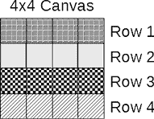
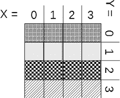
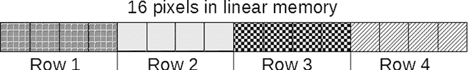
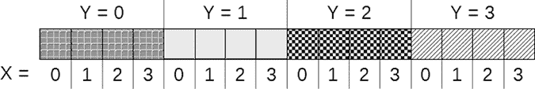
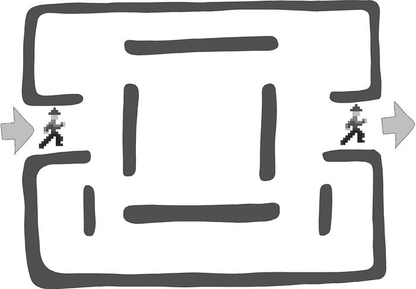
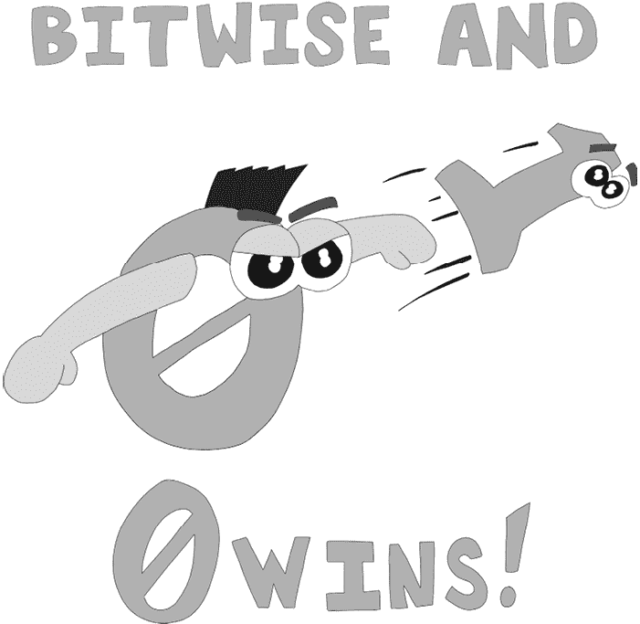
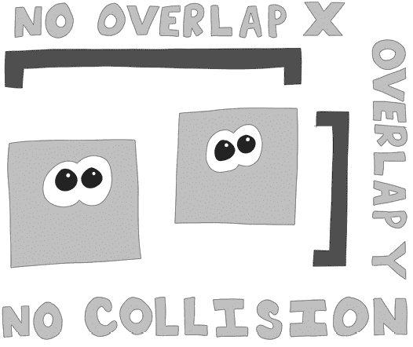
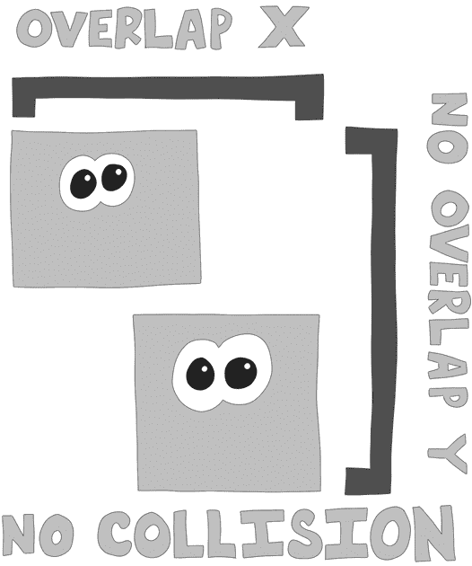
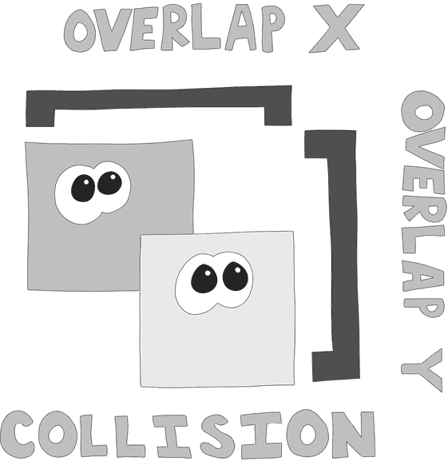
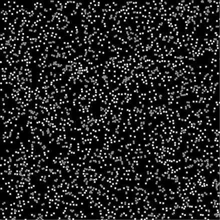

# 8

使用 Canvas


在本章中，您将学习如何使用 WebAssembly 与 HTML canvas 元素配合，在 Web 应用程序中创建快速高效的动画。我们将操作 WebAssembly 线性内存中的像素数据，然后将这些像素数据直接转移到 HTML canvas 上。我们将继续使用我们的随机碰撞体对象示例（列表 6-16），通过在 JavaScript 线性内存中生成对象，然后使用 WebAssembly 来移动这些对象、检测碰撞并进行渲染。由于可能发生碰撞的数量随着对象数量的增加呈指数增长，这种图形碰撞检测是测试 WebAssembly 功能的一个极好案例。到本章结束时，我们将有一个能够每秒测试数千个不同碰撞体之间碰撞的应用程序。在这个例子中，如果没有发生碰撞，我们的对象将绘制成绿色，如果发生碰撞，则绘制成红色。

如前所述，网页浏览器最初是为展示简单的在线文档而设计的，这意味着对文档中任何元素位置的修改通常会导致整个页面被重新渲染。这对于任何需要高帧率图形效果的应用程序（如游戏）来说，都是一个性能噩梦。此后，浏览器已发展成复杂的应用托管环境，因此需要开发一种更为复杂的渲染模型：*canvas*。canvas 元素由苹果公司在 2004 年为其 Safari 浏览器推出，并在 2006 年作为 HTML 标准的一部分被采纳。在 canvas 元素的范围内，Web 开发人员可以渲染 2D 图像和动画，性能比之前通过操作 DOM 所能实现的要好得多。使用 canvas 与 WebAssembly 可以帮助我们以极快的速度将动画渲染到浏览器中。

## 渲染到 Canvas

关于 HTML canvas API 已经写了整本书，因此我们这里只触及 WebAssembly 演示所需的一些特性。与 DOM 一样，WebAssembly 不能直接与 canvas 交互。相反，我们必须将像素数据直接从线性内存渲染到 canvas 元素上。这使我们能够用最少的 JavaScript 代码编写 canvas 应用程序。在编写 WebAssembly 代码之前，我们将先编写 HTML 和 JavaScript 部分。要查看完成后的应用程序效果，可以浏览 [`wasmbook.com/collide.html`](https://wasmbook.com/collide.html)。

### 在 HTML 中定义 Canvas

和往常一样，我们将把 HTML 文件分成几个部分，并逐个分析。这第一部分定义了 canvas，这是网页中渲染动画的区域。创建一个名为 *collide.html* 的文件，并添加 列表 8-1 中的代码。

**collide.html（第一部分，共 5 部分）**

```
<!DOCTYPE html>
<html lang="en">
<head>
  <meta charset="UTF-8">
  <meta name="viewport" content="width=device-width, initial-scale=1.0">
  <title>Collision detection</title>
</head>
<body>
1 <canvas 2id="cnvs" 3width="512" 4height="512"></canvas>
...
```

列表 8-1：HTML 定义 canvas

这里需要关注的元素是`canvas` 1 元素。我们给`canvas`元素赋予`id`为`cnvs` 2，以便稍后使用`document.getElementById`来获取 canvas 元素。我们将`width` 3 和`height` 4 设置为`512`，选择 512 是因为 512 是 2⁹或者十六进制 0x200。这个选择使得通过二进制逻辑处理宽度和高度更加方便，这有助于在我们合理设计代码的情况下提升应用程序的性能。

### 在 HTML 中定义 JavaScript 常量

在我们的 JavaScript 代码开头，我们将添加常量值，用于配置 WebAssembly 模块中的一些顶层设置。这些值将在 JavaScript 和 WebAssembly 之间共享。将这些值定义在 JavaScript 中可以更简便地更新配置。我们从一些与 canvas 相关的常量开始，这些常量设置了 WebAssembly 与 HTML `canvas`元素之间交互的参数。我们还定义了一组常量，用于定义我们在线性内存中组织数据的基本地址、步长和偏移量，这些常量决定了我们正在渲染的对象。此外，我们必须定义一个新的`ImageData`对象，该对象将线性内存缓冲区的一部分划分为一个应用程序可以直接绘制到 canvas 的对象。将清单 8-2 中的代码添加到你的 HTML 文件中。

**collide.html（第二部分，共 5 部分）**

```
...
<script>
1 const cnvs_size = 512;  // square canvas where width and height = 512

2 const no_hit_color = 0xff_00_ff_00; // no hit color (green)
  const hit_color = 0xff_00_00_ff;    // hit color (red)

 // pixels count is canvas_size x canvas_size because it's a square canvas
3 const pixel_count = cnvs_size * cnvs_size; 

4 const canvas = document.getElementById("cnvs");
5 const ctx = canvas.getContext("2d");
  ctx.clearRect(0, 0, 512, 512);

 // the number of bytes needed for that pixel data is the number of pixels * 4
6 const obj_start = pixel_count * 4; // 4 bytes in every pixel.
  const obj_start_32 = pixel_count;  // 32-bit offset to the starting object
  const obj_size = 4;       // how many pixels is the square object
  const obj_cnt = 3000;     // 3000 objects
  const stride_bytes = 16;  // there are 16 bytes in each stride

  const x_offset  = 0;      // x attribute is bytes 0-3
  const y_offset  = 4;      // y attribute is bytes 4-7
  const xv_offset = 8;      // x velocity attribute is bytes 8-11
  const yv_offset = 12;     // y velocity attribute is bytes 12-15

7 const memory = new WebAssembly.Memory({initial: 80});
  const mem_i8 = new Uint8Array(memory.buffer);         // 8-bit view
  const mem_i32 = new Uint32Array(memory.buffer);       // 32-bit view

8 const importObject = {
  env: {
    buffer: memory,

    cnvs_size: cnvs_size,
    no_hit_color: no_hit_color,
 hit_color: hit_color,
    obj_start: obj_start,
    obj_cnt: obj_cnt,
    obj_size: obj_size,

    x_offset: x_offset,
    y_offset: y_offset,
    xv_offset: xv_offset,
    yv_offset: yv_offset
  }
 };

 // An ImageData object can be blitted onto the canvas
  const image_data = 
  9 new ImageData( new Uint8ClampedArray(memory.buffer, 0, obj_start),
                 cnvs_size, 
                 cnvs_size );
...
```

清单 8-2：在 JavaScript 中配置图像数据

我们有一个名为`cnvs_size` 1 的常量，保存`canvas`元素的高度和宽度，因为它们是相同的。接下来，我们定义了两个常量，用于定义十六进制颜色值。第一个，`no_hit_color` 2，定义了当对象没有与其他对象发生碰撞时的颜色。第二个，`hit_color`，定义了当对象与其他对象发生碰撞时的颜色。这些十六进制数字的含义在“位图图像数据”第 162 页中有更详细的说明。接着我们定义了`pixel_count` 3，通过将`canvas_size`平方得到，因为我们有一个正方形的 canvas。

接下来，我们处理 Canvas API 接口，即*绘图上下文*，它允许 JavaScript 与`canvas`进行交互。处理 HTML `canvas`时有几种选择。我们将使用`"2d"` canvas 上下文，因为它相对简单。在这里，我们通过调用`document.getElementById`来获取 HTML canvas 中的上下文，从而创建一个`canvas` 4 元素常量。然后，我们在该`canvas`常量上调用`getContext` 5 函数，以创建一个包含上下文接口的常量，我们将其命名为`ctx`。我们将使用这个`ctx`对象将 WebAssembly 生成的位图渲染到`canvas`元素上。

在与画布相关的常量之后，紧接着是一组与线性内存对象相关的常量。这些常量以`obj_start` 6 常量开头，并遵循我们在第六章中讨论的基址、步长和偏移格式。`obj_start`中的基地址必须指示一个地址，该地址紧随我们线性内存开始处的所有像素数据之后。我们将`obj_start`设置为`pixel_count * 4`，因为每个像素占用四个字节的数据，且对象数据紧跟在这一大小的区域之后。在这个区域中，我们使用一些常量来定义步长大小和每个对象属性的偏移量。我们定义了初始大小为 80 页的线性内存 7，足以容纳我们所需的所有对象和像素数据。然后，我们创建了该数据对象的 8 位和 32 位视图。到目前为止，我们创建的所有常量必须通过`importObject` 8 传入 WebAssembly 模块。

最后，我们创建一个新的`ImageData` 9 对象，这是一个 JavaScript 接口，我们可以通过它访问画布元素中底层的像素数据。我们在清单 8-2 中创建的`Memory` 7 对象有一个名为`buffer`的属性，这是一个包含线性内存中数据的类型化数组。`buffer`属性是一个数据缓冲区，可以表示画布上显示的像素数据。要创建一个新的`ImageData`对象，必须将`memory.buffer`对象作为`Uint8ClampedArray`传递给`ImageData`对象，同时传入画布的宽度和高度。

### 创建随机对象

接下来，我们将创建随机对象，类似于我们在本书中之前所做的那样。我们继续使用随机数据，因为它使我们能够专注于 WebAssembly，而不是数据本身。然而，WebAssembly 没有随机数功能，因此在 JavaScript 中创建我们的随机对象要简单得多。对象有四个属性：x 和 y 坐标（位置），以及 x 和 y 速度（运动）。我们使用 32 位整数来表示这些属性的值。清单 8-3 展示了创建多个对象数据的循环代码，这些对象由我们之前定义的`object_cnt`常量表示。

**collide.html（第三部分，共 5 部分）**

```
...
1 const stride_i32 = stride_bytes/4;
2 for( let i = 0; i < obj_cnt * stride_i32; i += stride_i32 ) {

 // value less than canvas_size
  3 let temp = Math.floor(Math.random() * cnvs_size);

 // set object x attribute to random value
  4 mem_i32[obj_start_32 + i] = temp; 

 //random value less than canvas_size
  5 temp = Math.floor(Math.random()*cnvs_size);

 // set object y attribute to random value
  6 mem_i32[obj_start_32 + i + 1] = temp; 

 // random value between -2 and 2
  7 temp = (Math.round(Math.random() * 4) - 2); 

 // set x velocity to random value
  8 mem_i32[obj_start_32 + i + 2] = temp; 

 // random value between -2 and 2
  9 temp = (Math.round(Math.random() * 4) - 2);  

 // set y velocity to random value
 a mem_i32[obj_start_32 + i + 3] = temp; 
}
...
```

清单 8-3：设置线性内存数据

该循环中的代码通过`mem_i32`中的 32 位整数视图访问线性内存中的数据。由于循环使用的是 32 位数字，我们创建了一个 32 位版本的`stride_bytes`，我们称之为`stride_i32` 1。我们将其设置为`stride_bytes / 4`，因为每个`i32`占用四个字节。`for`循环会一直执行，直到索引`i`等于`obj_count`中设置的对象数量乘以由`stride_i32` 2 定义的步长中的 32 位整数数量。这就在线性内存中创建了圆形数据结构。

在循环内部，我们将四个 32 位整数设置为随机数，这些随机数将表示每个物体的位置和速度。首先，我们设置位置属性。我们从`cnvs_size`中获取一个介于 0 和画布宽度 3 之间的随机数，并将其存储在线性内存中`x`位置属性 4 的位置。接下来，生成一个介于 0 和画布高度 5 之间的随机数，并将其存储在线性内存中`y`属性 6 的位置。然后，我们通过生成一个介于-2 和 2 之间的数字 7 来设置速度属性，将其存储在`x`速度 8 属性的位置，并对`y`速度 a 属性做同样的操作 9。

### 位图图像数据

我们可以直接将位图图像数据渲染到 HTML `canvas`元素中，使用`putImageData`函数，传入我们之前定义的`ImageData`对象。HTML 画布是一个像素网格；每个像素可以通过三个字节表示，其中每个字节代表一种颜色：红色、绿色和蓝色。在位图格式中，一个像素由一个 32 位整数表示，其中整数的每个字节表示一种颜色。整数的第四个字节表示*alpha 值*，用于像素的不透明度。当 alpha 字节为 0 时，像素完全透明；当其值为 255 时，像素完全不透明。在 WebAssembly 线性内存中，我们将创建一个 32 位整数数组，表示像素数据的数组。这种类型的数组使 WebAssembly 成为操作渲染到 HTML 画布的非常便捷的工具。

在`script`标签中，我们将存储生成该位图数据的 WebAssembly 模块函数，并将其保存在变量`animation_wasm`中。我们还需要一个 JavaScript 函数来调用该 WebAssembly 函数。然后，我们调用`ctx.putImageData`将图像数据渲染到`canvas`元素中。Listing 8-4 包含了你需要添加到 HTML 文件中的下一段 JavaScript 代码。

**collide.html（第四部分，共 5 部分）**

```
...
1 var animation_wasm; // the webassembly function we will call every frame

2 function animate() {
  3 animation_wasm();
  4 ctx.putImageData(image_data, 0, 0); // render pixel data
 5 requestAnimationFrame(animate);
  }
...
```

Listing 8-4：JavaScript `animate`函数渲染动画帧。

`animation_wasm` 1 变量保存生成图像数据的 WebAssembly 函数。接下来的`animate` 2 函数调用 WebAssembly 模块的`animation_wasm` 3 函数，该函数生成动画的下一帧`image_data`。然后将`image_data`对象传递到对`ctx.putImageData` 4 的调用中，该函数将 WebAssembly 生成的图像渲染到`canvas`元素中。最后一个函数`requestAnimationFrame` 5 稍微复杂一些，我们将在下一节更详细地探讨它。

### requestAnimationFrame 函数

动画是一种视觉错觉：一系列静止图像快速显示使眼睛误以为有运动发生。你曾观看过的每台电视机、电脑显示器和电影都是这样运作的。JavaScript 提供了方便的`requestAnimationFrame`函数：当你调用`requestAnimationFrame`时，传递给`requestAnimationFrame`的函数会在下一帧渲染时调用。为了`requestAnimationFrame`，我们传递了我们希望在计算机准备渲染动画帧时调用的函数。

我们在 JavaScript 的结尾调用此函数，并传递了我们在第 8-4 节中定义的`animate`函数。我们从`animate`函数的末尾第二次调用`requestAnimationFrame`，以在后续的帧渲染中将该函数注册为回调函数。必须进行第二次调用，因为`requestAnimationFrame`函数不会注册一个函数以在每次帧渲染时调用；它只在下一帧渲染时注册。`animate`函数需要调用 WebAssembly 模块，该模块执行碰撞检测和对象移动计算。WebAssembly 计算放置在画布上的图像数据。然而，它无法直接将该数据渲染到画布上。这就是为什么我们必须从我们的 JavaScript 动画函数中调用`putImageData`以将像素数据渲染到画布上。对`putImageData`的调用将我们设置的线性内存块移动到`canvas`元素上表示像素数据的区域。

第一次调用`requestAnimationFrame`是在代码的最后一行实例化 WebAssembly 模块之后立即进行的。第 8-5 节显示了 HTML 代码的最后部分。

**collide.html (第五部分/共 5 部分)**

```
...
(async () => {
  let obj = await
  1 WebAssembly.instantiateStreaming( fetch('collide.wasm'),
                                     importObject );
  2 animation_wasm = obj.instance.exports.main;
  3 requestAnimationFrame(4animate);
})();
</script>
</body>
</html>
```

第 8-5 节：实例化 WebAssembly 模块并调用`requestAnimationFrame`。

在异步 IIFE 内部，我们首先调用`instantiateStreaming` 1 函数。我们将在第 8-4 节中定义的`animation_wasm` 2 变量设置为 WebAssembly 模块中名为`main`的导出函数。回想一下，我们从`animate`函数中调用了`animation_wasm`函数。最后，调用`requestAnimationFrame` 3 传递了之前定义的`animate` 4 函数。因为`animate`也在自身上调用`requestAnimationFrame`，所以浏览器每次刷新时都会调用`animate`。

## WAT 模块

现在，我们已经定义了 HTML，需要在 WAT 中编写 WebAssembly 模块，该模块将管理对象移动、碰撞检测和位图图像数据。创建名为 *collide.wat* 的文件。我们将尽可能简单地编写碰撞代码和画布渲染代码。为此，我们将编写多个函数，其中一些可能导致性能不佳。在下一章中，我们将尝试优化此代码。但在本章中，我们将专注于清晰和简单，而不是高性能。该模块将定义从 JavaScript 导入值的全局变量。我们需要定义一系列函数，用于清除画布、计算整数的绝对值、设置单个像素以及绘制碰撞器对象。然后，我们需要定义 `main` 函数，该函数将使用双循环移动每个碰撞器对象，并测试其是否与另一个对象发生碰撞。

### 导入的数值

模块的开头，如 Listing 8-6 中所示，通过我们在 JavaScript 中定义的 `importObject` 导入了传递给模块的常量。这些值包括我们的内存缓冲区、画布大小、对象颜色以及我们可以用来访问线性内存中对象的基础、偏移和步进值。

**collide.wat (第一部分，共 12 部分)**

```
(module
1 (global $cnvs_size    (import "env" "cnvs_size")    i32)

2 (global $no_hit_color (import "env" "no_hit_color") i32)
  (global $hit_color    (import "env" "hit_color")    i32)
3 (global $obj_start    (import "env" "obj_start")    i32)
4 (global $obj_size     (import "env" "obj_size")     i32)
5 (global $obj_cnt      (import "env" "obj_cnt")      i32)

6 (global $x_offset     (import "env" "x_offset")     i32)  ;; bytes 00-03
  (global $y_offset     (import "env" "y_offset")     i32)  ;; bytes 04-07
7 (global $xv_offset    (import "env" "xv_offset")    i32)  ;; bytes 08-11
  (global $yv_offset    (import "env" "yv_offset")    i32)  ;; bytes 12-15
 8 (import "env" "buffer" (memory 80))                       ;; canvas buffer
...
```

Listing 8-6: 声明导入的全局变量和内存缓冲区

我们首先导入全局变量 `$cnvs_size` 1，它在 JavaScript 中定义为 `512`，表示画布的宽度和高度。接下来是两个颜色值，`$no_hit_color` 2，表示非碰撞对象的 32 位颜色，以及 `$hit_color`，表示碰撞对象的颜色。请记住，我们将它们定义为绿色和红色的十六进制值。

然后，我们有一个 `$obj_start` 3 变量，其中包含对象数据的基本位置。`$obj_size` 4 变量是对象的宽度和高度（像素），将是正方形。`$obj_cnt` 5 变量包含应用程序将渲染并检查碰撞的对象数量。接下来是两个坐标的偏移量，`$x_offset` 6 和 `$y_offset`，以及速度值的两个属性 7，`$xv_offset` 和 `$yv_offset`。此代码块中的最后一个 `import` 8 导入了我们在 JavaScript 中定义的 `memory` `buffer`。

### 清除画布

接下来，我们将定义一个函数，用于清除整个位图图像缓冲区。如果在每次渲染帧时不清除画布，则每个对象的旧印象将保留在内存中，并且对象将在屏幕上涂抹。`$clear_canvas` 函数将每个颜色值设置为 `0xff_00_00_00`，表示黑色且完全不透明。Listing 8-7 显示了 `$clear_canvas` 函数的代码。

**collide.wat (第二部分，共 12 部分)**

```
...
;; clear the entire canvas
(func $clear_canvas 
  (local $i       i32)
  (local $pixel_bytes  i32)

  global.get $cnvs_size
  global.get $cnvs_size
  i32.mul                  ;; multiply $width and $height

  i32.const 4
  i32.mul                  ;; 4 bytes per pixel

1 local.set $pixel_bytes   ;; $pixel_bytes = $width * $height * 4

2 (loop $pixel_loop
  3 (i32.store (local.get $i) (i32.const 0xff_00_00_00)) 

    (i32.add (local.get $i) (i32.const 4))
  4 local.set $i           ;; $i += 4 (bytes per pixel)

 ;; if $i < $pixel_bytes
 5 (i32.lt_u (local.get $i) (local.get $pixel_bytes)) 
  6 br_if $pixel_loop ;; break loop if all pixels set
  )
)
...
```

Listing 8-7: `$clear_canvas` 函数定义

`$clear_canvas` 函数通过将画布大小平方（因为我们选择了一个正方形画布）来计算像素字节数，然后再乘以 `4`，因为每个像素使用四个字节。接下来，我们将这个值存储在局部变量 `$pixel_bytes` 中，这就是分配给像素内存的字节数。然后，函数遍历每个像素，存储一个十六进制值 `0xff_00_00_00`，其中所有像素颜色为 `0`，而 `0xff`（完全不透明）用于 alpha 值。函数接着将存储在 `$i` 中的索引增加 `4`，因为每个 `i32` 整数占四个字节。代码检查 `$i` 索引是否小于像素字节数，如果是，则跳回 `loop` 的顶部，因为如果 `$i` 小于像素数，意味着仍然有对象需要被清除。

### 绝对值函数

在这个应用程序中，我们将使用盒子碰撞检测策略，而不是本书之前使用的圆形碰撞检测，因为我们的对象是正方形的。我们需要切换到矩形碰撞检测算法，这要求代码找到一个有符号整数的绝对值。在 清单 8-8 中，我们将编写一个小的 `$abs` 函数，它可以接受一个有符号整数，并查看传入的参数是否为负数，如果是，就将其转换为正数，以获得绝对值。

**collide.wat（第三部分，共 12 部分）**

```
...
;; this function returns an absolute value when a value is passed in
(func $abs 
  (param $value       i32) 
  (result             i32)

1 (i32.lt_s (local.get $value) (i32.const 0)) ;; is $value negative?
2 if ;; if $value is negative subtract it from 0 to get the positive value
    i32.const 0
    local.get $value
  3 i32.sub
  4 return
  end
5 local.get $value  ;; return original value
)
...
```

清单 8-8：绝对值函数 `$abs`

`$abs` 函数首先查看传入的值，并检查该整数的符号值是否小于 `0`。如果小于 `0`，函数就会将这个数减去 `0`，将其取反并返回正数。如果这个数不是负数，函数将返回原始数值。

### 设置像素颜色

为了将对象绘制到画布上，我们需要能够在给定 x 和 y 坐标以及颜色值的情况下，在线性内存中设置像素的颜色。这个函数需要进行边界检查，因为我们正在写入一块被分配出来的线性内存区域来表示画布的区域。如果没有这个检查，如果我们尝试写入一个不在画布上的内存位置，函数就会向我们可能用于其他用途的内存区域写入数据。

函数会将坐标与画布的边界进行比较，如果这些坐标超出了边界，则返回。这决定了在何处（在线性内存中）需要更新像素数据。在查看代码之前，让我们快速了解一下画布上的坐标如何转换为线性内存。

画布是一个具有行和列的二维表面。图 8-1 显示了一个简单的画布，四个像素高，四个像素宽。



图 8-1：一个 4 × 4 的画布

每一行在画布上的纹理不同，原因将在稍后解释。画布有 x 和 y 坐标，其中第一列的 x 坐标为 0，并从左到右递增；y 坐标也从 0 开始，并从上到下递增。图 8-2 展示了我们的 4 × 4 画布及其 x 和 y 坐标。



图 8-2：4 × 4 画布的 x 和 y 坐标

这就是画布在计算机显示器上的排列方式，但计算机内存并不是按行列排列的。内存是一维的，每个像素都有一个唯一的地址。因此，我们的像素数据在内存中按图 8-3 所示的方式排列。



图 8-3：画布在线性内存中的 16 个像素

这些行是按顺序排列的，组成一个 16 个像素的数据数组。如果从 x 和 y 坐标的角度来看线性内存如何排列这些像素，它看起来像是图 8-4 所示。



图 8-4：线性内存中的 x 和 y 坐标

我们的`$set_pixel`函数已经有了 x 和 y 坐标，并且需要找到内存地址。我们通过公式`$y * 4 + $x`来计算，这样可以得到线性内存中的值，如图 8-5 所示。


图 8-5：从 x、y 坐标到线性内存的转换公式

一旦获取到内存位置，我们就可以使用`i32.store`更新线性内存，将该地址处的值设置为参数`$c`的颜色值。代码清单 8-9 展示了源代码。

**collide.wat（第四部分，共 12 部分）**

```
...
;; this function sets a pixel at coordinates $x, $y to the color $c
(func $set_pixel
  (param $x       i32)    ;; x coordinate
  (param $y       i32)    ;; y coordinate
  (param $c       i32)    ;; color value

 ;; is $x > $cnvs_size
  1 (i32.ge_u (local.get $x) (global.get $cnvs_size)) 
  if    ;; $x is outside the canvas bounds
    return
  end

2 (i32.ge_u (local.get $y) (global.get $cnvs_size))  ;; is $y > $cnvs_size
  if    ;; $y is outside the canvas bounds
    return
  end

  local.get $y
  global.get $cnvs_size
3 i32.mul

  local.get $x
4 i32.add       ;; $x + $y * $cnvs_size (get pixels into linear memory)

  i32.const 4
5 i32.mul       ;; multiply by 4 because each pixel is 4 bytes

  local.get $c  ;; load color value

6 i32.store     ;; store color in memory location
)
...
```

代码清单 8-9：设置单个像素为给定颜色的函数

这个函数首先进行边界检查，以防用户尝试设置不在画布上的像素颜色。为了验证 x 坐标是否在画布的范围内，我们检查`$x`是否大于`$cnvs_size` 1，如果是，则返回函数并不更新内存。我们对 y 坐标 2 也做相同的检查。

在进行边界检查后，我们需要以整数形式获取目标像素的位置。我们通过将`$y`乘以`$cnvs_size` 3 来得到像素前面行的内存中像素的数量，然后再加上`4`乘以`$x`的值。因为位置值是以 32 位整数（每个像素四个字节）表示的，我们需要将该值乘以`4` 5，才能得到我们像素在线性内存中的字节位置。这个内存位置就是我们通过调用`i32.store` 6 语句存储`$c`的地方。

### 绘制对象

如果碰撞体对象与其他对象没有碰撞，它们将显示为绿色方块；如果发生碰撞，则显示为红色方块。我们在 JavaScript 代码的常量部分设置了这些方块的大小为 `4`，因此每个方块的宽度和高度都是四个像素。我们使用一个循环绘制这些像素，该循环会递增 `x` 值，直到它达到对象的位置加上宽度。这样就绘制了第一行像素。当 x 坐标值超过最大 `x` 时，代码会递增 y 坐标值。接着，我们绘制第二行像素，并重复此过程，直到超过该对象像素的最大 `y` 值。然后代码跳出循环。最终我们得到一个 4 × 4 像素的对象。让我们将此函数的代码添加到我们的 WAT 文件中，如 Listing 8-10 所示。

**collide.wat（第五部分，共 12 部分）**

```
...
;; draw multi pixel object as a square given coordinates $x, $y and color $c
(func $draw_obj 
  (param $x i32)    ;; x position of the object
  (param $y i32)    ;; y position of the object
  (param $c i32)    ;; color of the object     

  (local $max_x       i32)
  (local $max_y       i32)

  (local $xi          i32)
  (local $yi          i32)

  local.get $x
1 local.tee $xi
  global.get $obj_size
  i32.add
2 local.set $max_x        ;; $max_x = $x + $obj_size

  local.get $y
  local.tee $yi
  global.get $obj_size
  i32.add
3 local.set $max_y        ;; $max_y = $y + $obj_size

  (block $break (loop $draw_loop 

    local.get $xi
    local.get $yi
    local.get $c
  4 call $set_pixel     ;; set pixel at $xi, $yi to color $c

    local.get $xi
    i32.const 1
    i32.add
  5 local.tee $xi       ;; $xi++

    local.get $max_x
  6 i32.ge_u            ;; is $xi >= $max_x

    if
      local.get $x
    7 local.set $xi     ;; reset $xi to $x

      local.get $yi
      i32.const 1
      i32.add
    8 local.tee $yi     ;; $yi++

      local.get $max_y
    9 i32.ge_u          ;; is $yi >= $max_y

 br_if $break

    end
    br $draw_loop
  ))
)
...
```

Listing 8-10: `$draw_obj` 函数通过调用 `$set_pixel` 函数绘制一个像素方块。

`$draw_obj` 函数以 `param` `i32` 变量 `$x`、`$y` 和 `$c` 的形式接收参数，分别表示 x 坐标、y 坐标和颜色。该函数从 `$x` 位置开始绘制像素点，x 坐标为 `$x`，y 坐标为 `$y`。它需要循环遍历每个像素，直到达到 `$max_x` 和 `$max_y` 的 x 坐标和 y 坐标。函数首先通过使用 `local.tee` 1 将 `$xi` 的值设置为传递给函数的 `$x` 值。然后，它将对象的大小（`$obj_size`）加到此值中，以找到 `$max_x` 2 的值。之后，函数以相同的方式找到 `$max_y` 3。

我们首先找出起始和结束的 x 坐标，然后对 y 轴 4 做相同的操作。我选择了 512 作为画布的宽度和高度，因为我假设这种掩码比使用 `i32.rem_u` 来进行画布边界检查具有更好的性能。在第九章中，我们将测试这个假设，看看这是一个有效的假设，还是一个过早的优化。第四章详细讲解了位掩码的工作原理。

最小值和最大值的 `x` 和 `y` 进入一个循环，使用 `call` `$set_pixel` 表达式 5 来绘制每个像素。循环增加 `$xi` 6，并将其与 `$max_x` 进行比较，如果 `$xi` 大于或等于 `$max_x` 7，则将 `$xi` 重置为 `$x`，并将 `$yi` 9 增加 1。然后，当 `$yi` 超过 `$max_y` 时，物体完全绘制完毕，代码退出循环。

### 设置和获取对象属性

让我们创建一些辅助函数，用于在线性内存中设置和获取对象属性值。这些函数接收一个对象编号和一个属性偏移，并返回该对象在内存中的属性值。在 `$set_obj_attr` 函数中，它还接收一个值，并将该值设置为对象属性。在 `$get_obj_attr` 函数中，它返回该对象和属性在内存中的值。将 Listing 8-11 中的 `$set_obj_attr` 代码添加到您的 WAT 模块中。

**collide.wat（第六部分，共 12 部分）**

```
...
;; set the attribute of an object in linear memory using the object number,
;; the attributes offset and a value used to set the attribute
(func $set_obj_attr
  (param $obj_number  i32)
  (param $attr_offset i32)
  (param $value       i32)

  local.get $obj_number

 i32.const 16
1 i32.mul                 ;;  16 byte stride multiplied by the object number 

  global.get $obj_start   ;;  add the starting byte for the objects (base)
2 i32.add                 ;;  ($obj_number*16) + $obj_start

  local.get $attr_offset  ;; add the attribute offset to the address
3 i32.add                 ;; ($obj_number*16) + $obj_start + $attr_offset

  local.get $value

 ;; store $value at location ($obj_number*16)+$obj_start+$attr_offset
4 i32.store  
)
...
```

Listing 8-11: 基于步幅值为 16 在内存中设置一个对象

这个函数中的大部分代码计算了存储特定对象属性的线性内存地址。回顾第六章，我们通过基址（本函数中的 `$obj_start`）、步幅值 `16`、对象编号（`$obj_number`）和属性偏移量（`$attr_offset`）计算了属性的内存位置。该函数使用公式 `$obj_number`*`16` 1 + `$obj_start` 2 + `$attr_offset` 3 来确定我们想要修改的属性的内存位置。然后它调用 `i32.store` 4 语句将该值存储到内存中。

接下来，我们将创建相应的 `$get_obj_attr`，它需要计算属性值的地址。你可能已经熟悉软件开发原则 *不要重复自己 (DRY)*。DRY 代码是一种编写可维护代码的优秀方法，易于其他开发者阅读和更新。不幸的是，有时候 DRY 代码可能会降低性能。在这个示例中，我们将重新做一些在前一个函数中做过的计算。当我们进入性能优化章节时，我们将使代码变得比本章更不 DRY（有时称为 *湿代码*）。一些能产生 DRY 代码的技术可能会增加需要额外计算周期的抽象层。例如，函数调用需要额外的周期来将值推送到栈上并跳转到代码中的新位置。优化编译器通常能够减轻代码中使用的抽象的影响，但理解它们如何做到这一点以及为什么 DRY 代码在执行时不总是最有效的，仍然是有帮助的。

在其他汇编语言中，宏是保持性能的同时保持代码相对 DRY 的好方法。不幸的是，`wat2wasm` 当前不支持宏。 Listing 8-12 展示了 `$get_obj_attr` 函数的代码。

**collide.wat（第七部分，共 12 部分）**

```
...
;; get the attribute of an object in linear memory using the object
;; number, and the attributes offset
(func $get_obj_attr
  (param $obj_number  i32)
 (param $attr_offset i32)
  (result i32)

  local.get $obj_number
  i32.const 16
1 i32.mul                  ;; $obj_number * 16

  global.get $obj_start
2 i32.add                  ;; ($obj_number*16) + $obj_start

  local.get $attr_offset
3 i32.add                  ;; ($obj_number*16) + $obj_start + $attr_offset

4 i32.load                 ;; load the pointer above
 ;; returns the attribute
)
...
```

Listing 8-12：根据步幅值 16 获取内存中的对象

要获取一个对象的偏移字节，我们首先将 `$obj_number` 乘以 `16` 的步幅值 1。然后我们加上 2 基址，该基址存储在全局变量 `$obj_start` 中。接着，添加偏移量，该偏移量存储在 `$attr_offset` 3 中。此时，栈顶包含了我们想要获取的属性在内存中的位置，因此调用表达式 `i32.load` 4 会将该值推送到栈上。

### $main 函数

`$main` 函数将在每一帧渲染时从 JavaScript 代码中被调用。它的任务是根据对象的速度移动每个对象，检测对象之间的碰撞，如果对象与其他对象发生碰撞，则将其渲染为红色，如果没有，则渲染为绿色。由于 `$main` 函数非常长，因此我们将其分为几个部分。

#### 定义本地变量

`$main` 函数的第一部分，如 Listing 8-13 所示，定义了所有本地变量并调用 `$clear_canvas` 函数。

**collide.wat（第八部分，共 12 部分）**

```
...
;; move and detect collisions between all of the objects in our app
(func $main (export "main")
1 (local $i           i32) ;; outer loop index
  (local $j           i32) ;; inner loop index
2 (local $outer_ptr   i32) ;; pointer to outer loop object
  (local $inner_ptr   i32) ;; pointer to inner loop object

3 (local $x1          i32) ;; outer loop object x coordinate
  (local $x2          i32) ;; inner loop object x coordinate
  (local $y1          i32) ;; outer loop object y coordinate
  (local $y2          i32) ;; inner loop object y coordinate

4 (local $xdist       i32) ;; distance between objects on x axis
  (local $ydist       i32) ;; distance between objects on y axis

5 (local $i_hit       i32) ;; i object hit boolean flag
6 (local $xv          i32) ;; x velocity
  (local $yv          i32) ;; y velocity

7 (call $clear_canvas) ;; clear the canvas to black
...
```

Listing 8-13：`$main` 函数的开头声明了局部变量并清除了画布。

该函数包含一个双重循环，用于将每个对象与其他所有对象进行比较。为此，我们定义了两个循环变量，分别是 `$i` 和 `$j`，它们将作为外层和内层循环的计数器。我们需要使用 `$i` 变量循环遍历每个对象，并用 `$j` 变量与其他每个对象进行比较。然后，我们使用两个指针变量，`$outer_ptr` 和 `$inner_ptr`，分别指向这两个碰撞对象的线性内存位置。

接下来的四个局部变量是内层和外层循环对象的 `x` 和 `y` 坐标。两个对象的 `x` 和 `y` 坐标之间的距离存储在 `$xdist` 和 `$ydist` 局部变量中。`$i_hit` 局部变量是一个布尔标志，如果 `$i` 对象与其他对象发生碰撞，则设置为 `1`，否则设置为 `0`。两个变量 `$xv` 和 `$yv` 存储 `$i` 对象的速度。声明了这些局部变量后，函数执行第一个操作：使用语句 `(call` `$clear_canvas)` 将画布的所有像素清除为黑色。

#### $move_loop

`$main` 函数的下一部分定义了一个循环，每一帧都将线性内存中的每个对象移动。这部分代码将获取 `$i` 对象的 `$x`、`$y`、`$xv` 和 `$yv` 属性。`$xv` 和 `$yv` 变量分别是 `x` 和 `y` 速度变量，用于通过改变 `$x` 和 `$y` 坐标值来移动对象。代码还强制 `x` 和 `y` 值保持在画布的边界内。移动循环之后，`$i` 变量会被重置为 `0`。将代码添加到 Listing 8-14 中的 WAT 模块。

**collide.wat（第九部分，共 12 部分）**

```
...
1 (loop $move_loop
    ;; get x attribute
    (call $get_obj_attr (local.get $i) (global.get $x_offset))
    local.set $x1

    ;; get y attribute
    (call $get_obj_attr (local.get $i) (global.get $y_offset)) 
    local.set $y1

    ;; get x velocity attribute
    (call $get_obj_attr (local.get $i) (global.get $xv_offset)) 
    local.set $xv
 ;; get y velocity attribute
    (call $get_obj_attr (local.get $i) (global.get $yv_offset)) 
    local.set $yv

    ;; add velocity to x and force it to stay in the canvas bounds
  2 (i32.add (local.get $xv) (local.get $x1))
    i32.const 0x1ff  ;; 511 in decimal
  3 i32.and          ;; clear high-order 23 bits
    local.set $x1

    ;; add velocity to y and force it to stay in the canvas bounds
    (i32.add (local.get $yv) (local.get $y1))
    i32.const 0x1ff  ;; 511 in decimal
    i32.and          ;; clear high-order 23 bits
  4 local.set $y1

    ;; set the x attribute in linear memory
  5 (call $set_obj_attr 
    (local.get $i) 
    (global.get $x_offset)
    (local.get $x1)
  )

    ;; set the y attribute in linear memory
    (call $set_obj_attr 
    (local.get $i) 
    (global.get $y_offset)
    (local.get $y1)
  )

  local.get $i
  i32.const 1
6 i32.add
7 local.tee $i        ;; increment $i

  global.get $obj_cnt
  i32.lt_u            ;; $i < $obj_cnt

8 if  ;; if $i < $obj_count branch back to top of $move_loop
    br $move_loop
  end

 )

  i32.const 0
9 local.set $i
...
```

Listing 8-14：移动每个对象的循环

Listing 8-14 中的代码遍历所有对象，基于 `x` 和 `y` 速度改变它们的 `x` 和 `y` 坐标。循环的前几行调用 `$get_obj_attr` 来获取 `x` 位置、`y` 位置、`x` 速度和 `y` 速度属性，并传入循环索引和需要设置的属性偏移量。这样做会将属性值推送到栈上。接着，使用 `local.set` 表达式来设置我们将在 `loop` 中使用的局部变量。

````The `loop` will add the velocity variables (`$xv` and `$yv`) to the position variables `($x1` and `$y1`) with a call to `i32.add` 2. Before `$x1` is set to the new position, an `i32.and` 3 is used to mask the last nine bits of the `x` position. This holds the value of the x-coordinate between 0 and 511, wrapping the value back around to 0 if it exceeds 511\. The same is then done for `$y1` 4 to set the `y` position. Once the new values of `$x1` and `$y1` are set, the `$set_obj_attr` 5 function is called for those values to set them in linear memory. The loop counter `$i` 6 is incremented with a call to `i32.and` and `local.tee` 7. If the value in `$i` is less than the object count (`$obj_count` 8), the code branches back to the top of the `loop`. Otherwise, `local.set` 9 is called to set `$i` to `0`.    The squares in Listing 8-14 wrap around on the canvas so when one goes offscreen on the right, it loops back around and appears on the left side of the screen, as in the old-school arcade games. Games like Atari’s *Asteroids* and Namco’s *Pac-Man* didn’t need any extra code to have this effect; instead, their screens were 256 pixels wide and used an 8-bit number to store the x-coordinate. So if a game object had an x-coordinate of 255 and moved one pixel to the right, the single byte value would roll back over to 0, and the game object would reappear on the left side of the screen, as shown in Figure 8-6.      Figure 8-6: Player’s character goes off the screen to the right and appears on the left.      We can accomplish this effect using `i32.and` to mask all but the bottom nine bits. The code calls `$get_obj_attr` to get the attributes for `$x1`, `$y1`, `$xv`, and `$yv` 1. The new `$x1` value is calculated by adding `$xv` 2 and then using the `i32.and` 3 against the constant `0x1ff`. In binary, `0x1ff` has the lowest nine bits all set to 1, and all the higher bits are set to 0\. Chapter 4 explained how to use an `i32.and` to set specific bits to 0, as illustrated in Figure 8-7.      Figure 8-7: The 0s in our mask turn any values in the initial value to 0.      When we call `i32.and` 3 on `$x1` and `0x1ff` (binary 00000000000000000000000111111111), the resulting value has the top 23 bits set to 0\. That limits the `$x1` value to nine bits, so if the number goes above what a 9-bit number can hold, the `$x1` value rolls back over, similar to an odometer. That creates an old-school arcade effect where objects that move offscreen to the left reappear on the right, and objects that move offscreen on the top reappear on the bottom of the screen.    After making changes to the x- and y-coordinates, the `$i` index is incremented 8, and if `$i` is less than `$obj_count`, the code branches back to the top of the `$move_loop`. When the loop is complete, the `$i` 9 index variable is reset to `0`.    #### Beginning of the Outer Loop    Now we need to define our double loop, which compares every object against every other object to see whether any collisions have occurred. The next part of the `$main` function defines the outer loop of our double loop, which will determine the first object of our collision test. The loop begins by initializing `$j` to `0`. The `$i` local variable is the increment variable for the outer loop. The inner loop will use `$j` to loop through all the objects to check each one against `$i` until it finds a collision or makes its way through every object. The outer loop starts with the first object, and then the inner loop checks that object for a collision with every other object. This continues until the outer loop has checked every object. Add the code in Listing 8-15 to the `$main` function.    **collide.wat (part 10 of 12)**    ``` ...   (loop $outer_loop (block $outer_break     i32.const 0   1 local.tee $j        ;; setting j to 0      ;; $i_hit is a boolean value.  0 for false, 1 for true   2 local.set $i_hit    ;; setting i_hit to 0      ;; get x attribute for object $i     (call $get_obj_attr (local.get $i) (global.get $x_offset))   3 local.set $x1      ;; get y attribute for object $i     (call $get_obj_attr (local.get $i) (global.get $y_offset))   4 local.set $y1 ... ```    Listing 8-15: The outer loop of a collision detection double loop    The beginning of the loop resets `$j` 1 and `$i_hit` 2 to `0`. The code then calls the `$get_obj_attr` function to find the values for `$x1` 3 and `$y1` 4.    #### The Inner Loop    The next section of the `$main` function is the inner loop, whose function is to detect a collision between two squares. Square collision detection is very simple: you compare the x-coordinates and size to see whether the objects overlap on the x-axis. If the x-axis doesn’t overlap but the y-axis does, it looks like Figure 8-8 and has no collision.    If the x-axis overlaps but the y-axis doesn’t, there is no collision between the objects, as in Figure 8-9.      Figure 8-8: The x-axis doesn’t overlap but the y-axis does.        Figure 8-9: The x-axis overlaps but the y-axis doesn’t.      The only collision scenario is when the x-axis and y-axis overlap, as in Figure 8-10.      Figure 8-10: The x-axis and y-axis overlap, so there is a collision.      The inner loop performs this check against every object in linear memory. Listing 8-16 shows the code.    **collide.wat (part 11 of 12)**    ``` ... 1 (loop $inner_loop (block $inner_break       local.get $i       local.get $j       i32.eq     2 if              ;; if $i == $j increment $j         local.get $j         i32.const 1         i32.add         local.set $j       end        local.get $j       global.get $obj_cnt       i32.ge_u     3 if              ;; if $j >= $obj_count break from inner loop         br $inner_break       end   ;; get x attribute     4 (call $get_obj_attr (local.get $j)(global.get $x_offset))        local.set $x2  ;; set the x attribute for inner loop object   ;; distance between $x1 and $x2       (i32.sub (local.get $x1) (local.get $x2))        call $abs  ;; distance is not negative so get the absolute value     5 local.tee $xdist  ;; $xdist = the absolute value of ($x1 - $x2)        global.get $obj_size       i32.ge_u       6 if  ;; if $xdist >= $obj_size object does not collide         local.get $j         i32.const 1         i32.add         local.set $j          br $inner_loop  ;; increment $j and jump to beginning of inner loop       end   ;; get y attribute       (call $get_obj_attr (local.get $j)(global.get $y_offset))       local.set $y2        (i32.sub (local.get $y1) (local.get $y2))       call $abs     7 local.tee $ydist        global.get $obj_size       i32.ge_u       8 if         local.get $j         i32.const 1         i32.add         local.set $j          br $inner_loop       end        i32.const 1     9 local.set $i_hit  ;; exit the loop if there is a collision   )) ;; end of inner loop ... ```    Listing 8-16: The inner loop of a collision detection double loop    The inner `loop` 1 compares the current object of the outer loop against every other object that hasn’t already been checked against it. First, it needs to make sure it’s not checking an object against itself. An object always completely collides with itself, so if `$i` is equal to `$j` 2, we ignore it and need to increment `$j`. Then we compare `$j` with `$obj_cnt` 3 to see whether the code has tested all the objects yet. If it has, the code exits the inner `loop`  .  If the code hasn’t tested all objects, the `x` attribute is loaded into the `$x2` variable by calling `$get_obj_attr` 4. We then get the distance between `$x1` and `$x2` by subtracting `$x2` from `$x1`, taking the absolute value and setting the `$xdist` 5 variable. We compare the `x` distance between the two objects to the object size to see whether the two objects overlap on the x-axis. If they don’t overlap because `$xdist` is greater than `$obj_size` 6, the code increments `$j` and jumps back to the top of the `loop`.    In the same way, the `y` distance is calculated and stored in the `$ydist` 7 variable, and the code checks whether the `$ydist` variable is greater than `$obj_size` 8. If so, these objects don’t collide, so we increment `$j` and jump back to the top of the `loop`. If we haven’t jumped to the top of the loop at this point, we know that the x- and y-axis of the objects overlap, indicating a collision, so we set `$i_hit` 9 to `1` and exit the inner `loop`.    #### Redrawing the Objects    When the code has exited the inner loop, either a collision was found or it wasn’t. The code checks the hit variable (`$i_hit`) and calls the `$draw_obj` function with the no collision color (green) if there wasn’t a collision and with the `$hit_color` (red) if there was a collision. Then `$`i is incremented, and if `$i` is less than the number of objects, the code jumps back to the top of the outer loop. Listing 8-17 shows the last section of code to add to the WAT file.    **collide.wat (part 12 of 12)**    ``` ...     local.get $i_hit     i32.const 0     i32.eq   1 if      ;; if $i_hit == 0 (no hit)       (call $draw_obj         (local.get $x1) (local.get $y1)  (global.get $no_hit_color))   2 else    ;; if $i_hit == 1 (hit)       (call $draw_obj         (local.get $x1) (local.get $y1) (global.get $hit_color))     end      local.get $i     i32.const 1     i32.add   3 local.tee $i          ;; increment $i      global.get $obj_cnt     i32.lt_u   4 if                    ;; if $i < $obj_cnt jump to top of the outer loop       br $outer_loop     end 5 )) ;; end of outer loop ) ;; end of function ) ;; end of module ```    Listing 8-17: Drawing the object inside the inner loop    Immediately after the inner loop ends, the outer loop checks whether the `$i_hit` variable was set to `0` 1 , indicating no collision. If it was, `$draw_obj` is called, passing in the `$no_hit_color` global variable as the last parameter and drawing the square in green. If the `$i_hit` variable is set to `1` 2 (true), `$draw_obj` is called with `$hit_color` (red). At this point, `$i` 3 is incremented, and if it’s less than `$obj_cnt` 4, indicating we’ve not completed drawing our objects, the code jumps back to the top of the loop. If not 5, the code exits the loop and this function is complete.    ### Compiling and Running the App    Before we run the collider application, we need to compile our WAT into a WebAssembly module. Use the following `wat2wasm` command to compile *collide.wat* into *collide.wasm*:    ``` wat2wasm collide.wat ```    When you run a web server and open the *collide.html* file in a web browser from localhost, your screen should look similar to Figure 8-11.      Figure 8-11: The collider app      The boxes should move about the canvas, appearing on the left side of the canvas when they move off the right side and on the top when they move off the bottom. Boxes that collide with each other appear in red, and boxes that don’t collide with other boxes appear in green.    ## Summary    In this chapter, we explored how WebAssembly and the HTML canvas can work together to create fantastic animations on a web page. You should now understand when it’s best to use WebAssembly and when using JavaScript is a better option. Rendering to the canvas from WebAssembly can be done quickly and efficiently by modifying memory locations that represent bitmap data. The collider app we created used many JavaScript constants to define its details. That allowed us to tweak and play with the numbers in the app without recompiling the WebAssembly module. JavaScript can easily generate random numbers that we can use in the app. Generating random numbers from WebAssembly is much more challenging. Because the random numbers only need to be generated once, using JavaScript isn’t a significant performance hit.    You learned about bitmap image data and how to use WebAssembly to generate that image data inside linear memory. We used the `requestAnimationFrame` function from within JavaScript to call the WebAssembly module once per frame, using WebAssembly to generate the bitmap image data to be used in the canvas. This image data is moved into the HTML canvas using the `putImageData` function on the canvas context.    In the WAT module code, we set up and modified an area of memory dedicated to the image data, and created a canvas clearing function. We drew a specific pixel color to the canvas; then we drew objects larger than a single pixel and made those objects appear at the opposite side of the canvas when they moved out of the element’s bounds. Lastly, we used box collision detection to detect and change the color of our objects if there were collisions between objects.    We didn’t spend a lot of time or effort trying to make the collider application fast. In the next chapter, we’ll make this application run as fast as possible with some performance tuning.````
