# 性能优化


本章专门面向那些希望实现极速应用程序并愿意为此付出时间和精力的开发人员。我们将首先讨论性能分析工具，评估 WebAssembly 模块性能，并研究如何将 WebAssembly 的性能与类似的 JavaScript 代码进行比较。我们还将探讨一些提升 WebAssembly 性能的策略，包括内联函数、用位移操作替代乘法和除法、合并常量，以及使用死代码消除（DCE）删除冗余代码。

我们还将探讨确定模块性能的其他方法：我们将使用`console.log`和`Date.now`来衡量应用程序的性能，并使用测试工具*benchmark.js*来收集应用程序的详细性能数据。然后，为了好玩，我们将打印出 Chrome JavaScript V8 引擎的中间表示（IR）字节码。JavaScript IR 字节码可以帮助你了解 JavaScript 函数的工作原理，这对于评估是否使用 WebAssembly 或 JavaScript 编写函数非常有帮助。

## 使用性能分析器

*性能分析器*是用来分析应用程序性能的工具，包括应用程序的内存使用和执行时间。这可以帮助你做出关于优化的决策，确定优化的方向和重点。你通常需要在不同类型的优化之间做出权衡。例如，你需要决定是优先提升交互时间（TTI），以便用户能够尽快使用你的应用程序，还是在应用程序运行时优化峰值性能。如果你正在开发一款游戏，可能需要较长的加载时间，以确保游戏在下载完成后能够顺畅运行。然而，在线商店可能更倾向于确保用户尽快与网站进行交互。在大多数情况下，你需要在这两者之间找到平衡，使用性能分析器可以帮助你做出这个决策。

性能分析器还非常高效地帮助你发现代码中的瓶颈，帮助你将时间和精力集中在这些关键区域。我们将关注 Chrome 和 Firefox 的性能分析器，因为它们目前对 WebAssembly 提供了最好的支持。我们将对第八章中的碰撞检测应用进行性能分析。

### Chrome 性能分析器

使用 Chrome 性能分析器时，你需要使用一个新的隐身浏览器窗口。隐身窗口不会加载网站缓存、Cookies 或 Chrome 插件，这些都会在分析时引发问题，因为它们会运行额外的 JavaScript 代码并影响你想要分析的站点性能。缓存和 Cookies 通常问题不大，但它们会把与你分析的代码无关的数据引入你的环境。你可以通过点击浏览器右上角菜单中的**新建隐身窗口**来打开隐身窗口，如图 9-1 所示。

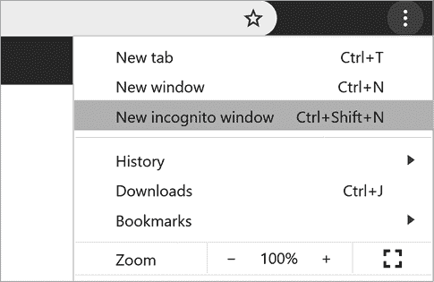

图 9-1：在 Chrome 中打开隐身窗口。

打开隐身浏览器窗口后，确保在命令行中使用`node server.js`命令运行一个 Web 服务器，然后在浏览器中输入**localhost:8080/collide.html**。从右上角菜单中点击**更多工具**▶**开发者工具**，如图 9-2 所示。

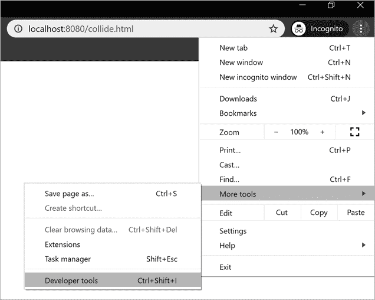

图 9-2：在 Chrome 中打开开发者工具。

你应该能看到开发者工具顶部的多个标签。要查看性能分析器，点击**性能**，如图 9-3 所示。

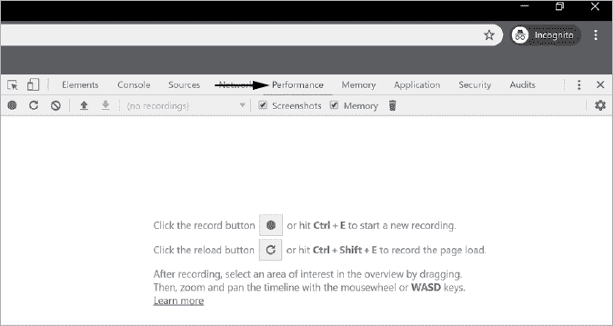

图 9-3：在 Chrome 中打开性能标签。

性能标签在你第一次打开时提供两个选项：记录和重新加载。记录按钮会在不重新加载应用程序的情况下开始录制性能数据。这种性能分析最适用于你不太关心应用程序启动时间，而更关注峰值性能的情况。在我们开始性能分析之前，确保在性能标签的顶部勾选了内存复选框。如果没有勾选，内存堆将不会被分析。如果你希望从应用初始化开始进行性能分析，可以点击重新加载按钮。点击**记录**继续。一旦录制了大约五秒钟，点击**停止**，如图 9-4 所示。


图 9-4：在 Chrome 中录制性能数据

当录制停止后，性能分析器会打开，并展示应用程序渲染的每一帧记录。底部的摘要标签显示，应用程序执行的大部分时间都花费在了脚本执行（图 9-5），这包括 JavaScript 和 WebAssembly 时间。

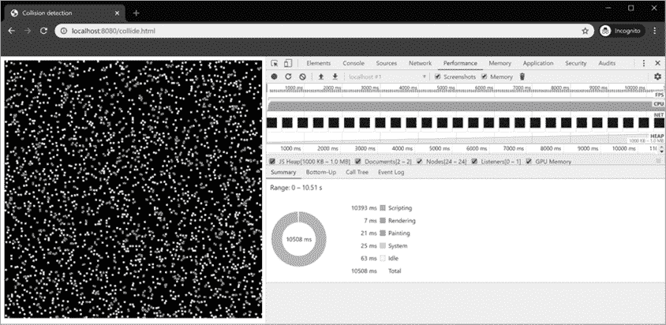

图 9-5：录制性能数据后的 Chrome 性能标签

在这个主要的性能页面中，一个饼图展示了在脚本执行、渲染、绘制、系统和空闲时间中花费的处理时间。饼图上方是一些标签，包括摘要、从下到上、调用树和事件日志，我们将在本章中进行探讨。以上这些标签的上方显示了分配的 JS 堆内存，此外，还有渲染的帧数、CPU 和 FPS 信息。接下来，我们将快速查看 JavaScript 堆内存。

#### JavaScript 堆内存

图 9-5 中的分析显示堆内存有增长。我们将花些时间调查为什么会发生这种情况。首先，我们检查在垃圾回收前分配了多少内存。一些开发者认为，因为 JavaScript 是一种垃圾回收语言，所以他们不需要担心内存问题。不幸的是，这并非如此；你的代码仍然可能创建对象的速度超过垃圾回收器能回收它们的速度。也有可能将对象的引用保持得比实际需要的时间更长，这样 JavaScript 无法判断是否应该删除这些对象。如果一个应用程序的内存增长速度像这个一样快，那么监控垃圾回收前分配的内存是很有意义的。然后，尝试理解应用程序在哪里分配了内存。目前，堆内存的大小大约是 1MB。

经过一些额外的性能分析后，我们可以看到 JS 堆内存增长到 2.2MB，而在垃圾回收器运行后，堆内存大小降回到 1.2MB。垃圾回收器运行可能需要几分钟，所以请耐心等待。图 9-6 显示了垃圾回收过程中 JS 堆内存的变化情况。如你所见，在图表的右侧，堆内存大小突然显著下降了 1MB。

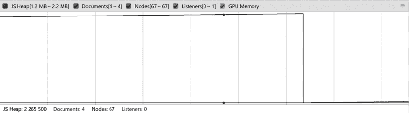

图 9-6：垃圾回收期间的内存下降

最好精确地确定这个内存分配发生的位置，因为如果我们能减缓堆内存的增长，它有可能减少垃圾回收器的负担。

#### 内存分配跟踪

由于堆内存的增长是持续的，我们可以推测内存分配可能发生在每一帧的渲染过程中。这个应用程序的大部分工作都在 WebAssembly 模块中完成，因此我们首先注释掉 WebAssembly 的调用，看看内存是否继续显示相同的 JS 堆增长分析。打开 *collide.html*，并如 清单 9-1 所示，注释掉 `animate` 函数内的 `animation_wasm()` 调用。

**collide.html**

```
...
    function animate() {
    **//      animation_wasm();**
      ctx.putImageData(image_data, 0, 0); // render pixel data
      requestAnimationFrame(animate);
    }
...
```

清单 9-1：注释掉 `animation_wasm` 函数调用

现在重新加载页面并记录一个新的性能分析。图 9-7 显示了没有 `animation_wasm` 函数调用的新的 JS 堆内存分析。

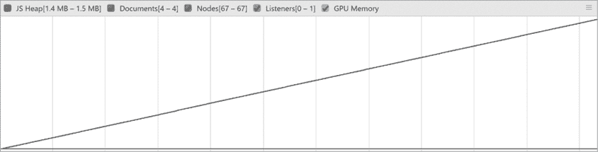

图 9-7：`animation_wasm` 函数移除后的堆内存分配图

没有对 WebAssembly 模块的调用后，应用程序无法正常运行。然而，你仍然可以看到相同的 JS 堆内存增长分析，因此内存的增长似乎不是来自 WebAssembly 模块。接下来，我们取消注释 WebAssembly 模块的调用，然后注释掉 `ctx.putImageData` 的调用，并创建另一个性能分析，正如 清单 9-2 所示。

**collide.html**

```
 function animate() {
      animation_wasm();
  **//**   **ctx.putImageData(image_data, 0, 0);** // render pixel data
      requestAnimationFrame(animate);
    }
```

清单 9-2：`animation_wasm` 函数已恢复，`putImageData` 被移除。

在注释掉 `ctx.putImageData` 调用后，我们现在可以创建一个新的分析结果来检查内存增长情况（图 9-8）。

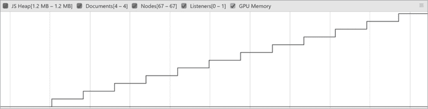

图 9-8：移除 `putImageData` 调用时，内存增长变慢。

在没有 `ctx.putImageData` 调用的情况下，内存增长明显变慢。虽然增长依然存在，但其增长呈现较慢的阶梯型模式，而不是几乎垂直的直线。这表明，`ctx.putImageData` 调用内部可能正在创建一些大型对象，垃圾回收器最终需要删除它们。现在我们知道内存是如何分配的。由于 `ctx.putImageData` 是一个内置函数，我们无法优化它。如果内存分配是问题所在，我们就需要寻找其他方式来渲染到画布上。

#### 帧

在分析器窗口中，堆内存上方有一个区域，提供更多的性能信息，包括渲染的每秒帧数（fps）。它还显示了一个显示 CPU 使用率的图表，并展示了每一帧渲染的小缩略图。当你将鼠标悬停在这些帧上时，你可以观察到应用程序如何渲染其动画（图 9-9），这对你调试应用程序是否按预期工作非常有帮助。

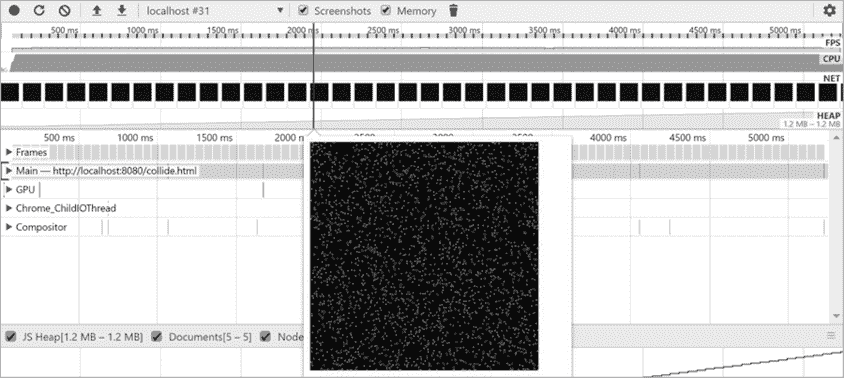

图 9-9：在分析器中查看单独的帧渲染

你可以将鼠标悬停在绿色的*Frames*框上，查看分析中任意时刻的 fps（图 9-10）。

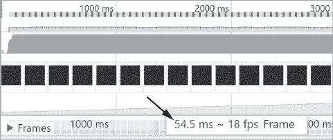

图 9-10：在分析器中查看 fps

如你所见，在应用程序执行的这一时刻，帧率为 18 fps。当我们拖动帧时，帧数在 17 和 20 之间徘徊。每秒帧数是碰撞检测应用性能的主要衡量标准，因此我们需要记住大约 18 fps 的分析结果，以便与之后的结果进行比较。请记住，运行分析器似乎会影响应用程序的性能，因此尽管这些结果在相互比较时很有用，但它们可能并不完全准确地反映应用程序在实际环境中的表现。

#### 自下而上

自下而上的标签显示了应用程序内调用的函数、它们运行的总时间以及自时间（Self Time），即函数运行的时间，排除了它调用的其他函数所花费的时间。自时间非常有用，因为调用其他运行时间较长的函数的函数，总时间总是会比较长，正如你在图 9-11 中看到的那样。

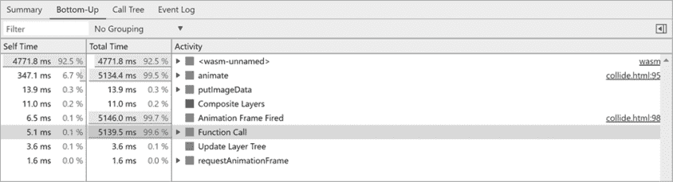

图 9-11：Chrome 的自下而上标签窗口

`<wasm-unnamed>`的自时间是最长的。总时间在多个函数中更长，例如`animate`，因为`animate`函数调用了 WebAssembly 模块。令人有些失望的是，Chrome 没有指出它在 WebAssembly 模块中调用了哪个函数，但我们可以一眼看出，应用程序有超过 90%的处理时间是在执行 WebAssembly。

### Firefox 性能分析器

使用 Firefox 性能分析器是收集应用程序性能数据的另一种优秀方式。我建议在运行 Firefox 性能分析器时打开一个私人窗口。可以通过打开浏览器右上角的菜单，点击**新建私人窗口**来实现（图 9-12）。

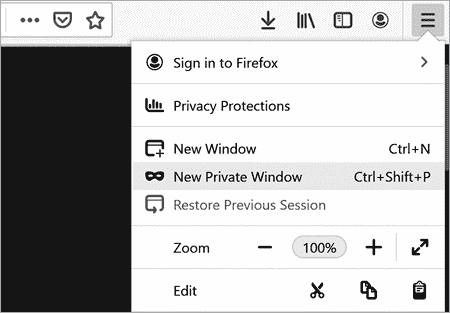

图 9-12：在 Firefox 中打开一个新的私人窗口。

通过点击**Web 开发者**▶**性能**来打开性能分析器（图 9-13）。

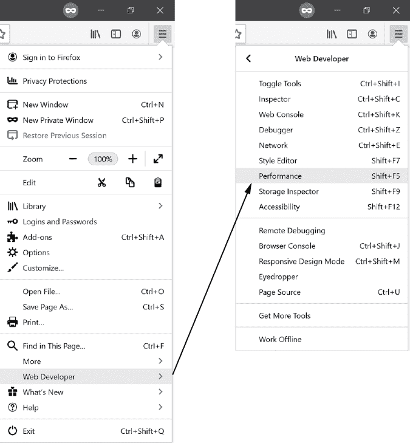

图 9-13：在 Firefox 菜单中点击**Web 开发者**▶**性能**。

在性能菜单中，点击**开始录制性能**按钮以录制性能数据。几秒钟后，停止录制。图 9-14 展示了你应该在性能标签中看到的内容类似的结果。Waterfall 标签（这是录制后的默认视图）显示了顶级函数调用以及它们执行所需的时间。

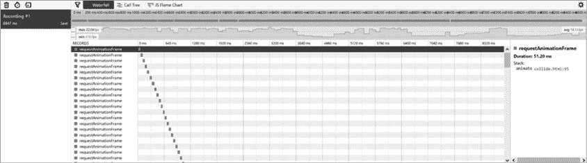

图 9-14：Firefox 性能窗口中的 Waterfall 标签

向下滚动以查看垃圾回收发生的位置以及执行所需的时间。对于我们的应用程序来说，这个报告有点无聊，因为它主要执行`requestAnimationFrame`。窗口顶部的三个标签提供了更多信息。Waterfall 标签让你大致了解任务执行时间过长的地方。我们不会详细讲解 Waterfall 标签，因为它更像是一个*一目了然的运行时*总结。相反，我们将重点查看 Call Tree 和 JS Flame Chart 标签。

#### Call Tree

Call Tree 标签显示了应用程序花费大部分时间的函数调用。该界面允许你深入查看每个函数，并查看它们调用了哪些函数。图 9-15 展示了 Call Tree 标签的截图。

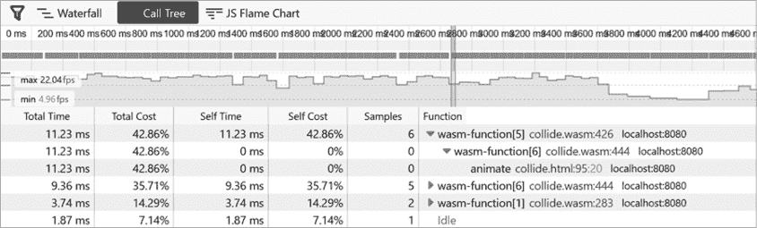

图 9-15：Firefox 的 Call Tree 标签

一个很好的功能是，你可以点击 WebAssembly 文件的名称，链接会将你带到 WebAssembly 代码中的相应函数。函数名称会丢失，但一个显示函数编号的索引会跟随`wasm-function`标签。这样可以稍微帮助确定函数调用的内容。

#### JS Flame Chart

JS Flame Chart 标签显示的信息与 Call Tree 标签中看到的信息几乎相同，但它是按照时间线组织的，而不是作为总结。你可以放大图表的特定部分，查看在该时间点上执行的函数（图 9-16）。

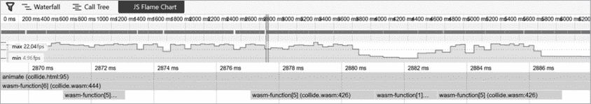

图 9-16：Firefox JS 火焰图标签

这是调用 JavaScript `animate` 函数的代码。`animate` 函数大部分时间运行 `wasm-function[6]`，这是我们 WAT 代码中的第七个函数，名为 `$main`。`$main` 函数调用了 `wasm-function[5]`，即第六个函数（`$get_obj_attr`）和 `wasm-function[1]`（`$abs`）。

每个标签页都显示了最小和最大帧率在左侧，平均帧率在右侧。分析器的左侧类似于 图 9-17。

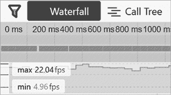

图 9-17：Firefox 最大和最小帧率

如你所见，最大帧率略高于 22，最小帧率略低于 5 fps。如前所述，运行分析器可能会影响帧率。平均帧率显示在分析器的右侧（图 9-18）。

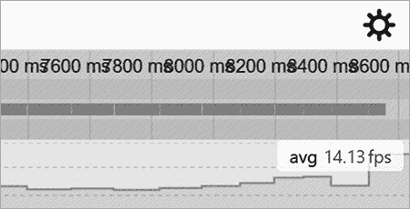

图 9-18：Firefox 平均帧率

此配置文件的平均帧率约为 14 fps。在下一节中，我们将探讨如何使用 `wasm-opt` 改善应用性能。

## wasm-opt

我们使用 `wasm-opt` 命令行工具对 WebAssembly 文件进行性能优化。它随 `wat-wasm` 和 *Binaryen.js* 一起提供。如果你已经安装了 `wat-wasm` 来使用 `wat2wasm` 工具，那么你应该已经有一个版本，可以跳过下一节。如果没有，安装 *Binaryen.js*，它是 Binaryen WebAssembly 工具的 JavaScript 版本，用于将中间表示（IR）转换为 WebAssembly 代码。它提供了一些有用的选项来优化 WebAssembly 代码。

### 安装 Binaryen

安装 Binaryen 有几种选择。我推荐使用 *Binaryen.js*，你可以通过 `npm` 使用以下命令来安装：

```
npm install binaryen -g
```

对于有兴趣从源代码构建的人，可以在 GitHub 上找到它，地址是 [`github.com/WebAssembly/binaryen`](https://github.com/WebAssembly/binaryen)。还有一个名为 `wasm-opt` 的 `npm` 包，它会为*Binaryen* 安装特定平台的二进制文件，但我推荐使用 `npm` 安装 `wat-wasm` 或 *binaryen.js*。

### 运行 wasm-opt

`wasm-opt` 工具提供了许多标志，你可以使用这些标志来最小化下载大小并优化 WebAssembly 模块的执行。你可以使用这些标志告诉优化器是关注性能还是下载大小。如果有变动可以减少文件大小而不影响性能，那么无论如何都会进行修改。如果有变动可以改善性能而不影响下载大小，也是如此。这些标志告诉编译器在需要权衡时应该优先考虑哪种优化。

我们将使用两种标志运行`wasm-opt`，首先使用针对文件大小的优化偏好，然后再次编译以优化性能。这些标志适用于任何使用 Binaryen 的工具链，如 Emscripten 或 AssemblyScript。我们首先将查看的两个标志会优化 WAT 文件的大小。

#### 针对下载大小的优化

`wasm-opt`命令有两个标志可以优化你的 WebAssembly 文件以减小下载大小：`-Oz`和`-Os`。O 是大写字母 O，而不是数字零。`-Oz`标志会创建一个更小的 WebAssembly 文件，但缩小文件大小所需的时间更长。`-Os`标志会创建一个略大的 WebAssembly 文件，但执行时间较短。我们的应用程序很小，因此无论运行哪种优化，所需时间也都非常短。你可能会在创建一个大型 Emscripten 项目时使用`-Os`，因为它需要较长的编译时间。就我们的目的而言，我们不需要使用`-Os`。清单 9-3 显示了如何使用`-Oz`标志优化我们的*collide.wasm*文件以减小其大小。

```
wasm-opt collide.wasm -Oz -o collide-z.wasm
```

清单 9-3：运行`wasm-opt`以优化*collide.wasm*文件的下载大小

当你运行此优化时，WebAssembly 文件的大小从 709 字节减少到 666 字节。减少了大约 6%的大小，但我们没有做任何额外的工作来实现这个效果。通常，当你使用此标志和工具链时，会获得更好的大小减少效果。

#### 针对执行时间的优化

当你编写游戏时，你会更关注提升帧率（fps）而不是下载时间。有三个优化标志：`-O1`、`-O2` 和 `-O3`。再说一遍，O 是字母 o，而不是数字零。`-O3`标志提供了最高级别的优化，但执行时间最长。`-O1`标志执行时间最短，但优化效果最差。`-O2`标志介于两者之间。由于我们的应用程序非常小，`-O1`和`-O3`的执行时间差异不大。在清单 9-4 中，我们使用`-O3`标志来从我们的优化中获取最大收益，优化的是*collide.wasm*文件。

```
wasm-opt collide.wasm -O3 -o collide-3.wasm
```

清单 9-4：使用`wasm-opt`优化*collide.wasm*文件的性能

一旦你获得了新的*collide.wasm*文件版本，修改*collide.html*文件以运行优化后的版本。现在，当我们通过分析器运行它时，可以了解性能的提升情况。在 Chrome 中进行分析，显示应用现在运行在 35 fps 的帧率上（图 9-19）。

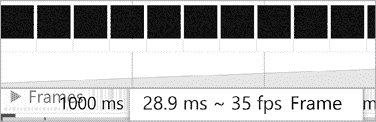

图 9-19：优化后的*collide-3.wasm*文件在 Chrome 中的新帧率

图 9-10 显示了原始帧率为 18 fps。仅仅运行`wasm-opt`就能使你的应用在 Chrome 中帧率翻倍。接下来，让我们看看在 Firefox 中运行分析器时会发生什么（图 9-20）。

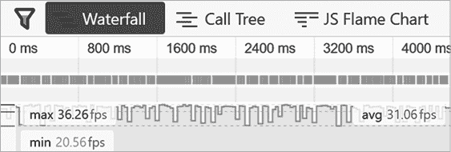

图 9-20：优化后的*collide-3.wasm*文件在 Firefox 中的新帧率

回顾图 9-18，我们在最初的运行中只达到了平均 14 帧每秒，因此在 Firefox 中，帧率几乎翻倍。在接下来的章节中，我们将查看反汇编后的优化 WAT 代码，看看 `wasm-opt` 做了哪些优化。

### 查看优化后的 WAT 代码

你应该已经安装了 VS Code 的 WebAssembly 扩展（我们在第一章中做了这一步）。在 Visual Studio 中，你可以右键点击一个 WebAssembly 文件，选择“显示 WebAssembly”来查看给定 WebAssembly 文件的 WAT。在清单 9-5 中，我们使用命令行中的 `wasm2wat` 将优化后的 *collide-3.wasm* 文件转换为 WAT 文件。

```
wasm2wat collide-3.wasm -f -o collide-3.wat
```

清单 9-5：运行 `wasm2wat` 将 *collide-3.wasm* 反汇编为 WAT。

接下来，在 VS Code 中打开 *collide.wat* 和 *collide-3.wat*，查看 `wasm-opt` 对 WebAssembly 文件所做的更新，如图 9-21 所示。

在优化后的代码中，所有的函数和变量名都消失了。我添加了一些注释来帮助你跟进。你可以很快看到，优化将函数的数量从七个减少到三个。优化通过将许多小函数展开为内联代码实现了这一点。在剩下的函数之一中，优化移除了一个变量。你可能会创建两个不同的变量，而实际上只需要一个，因为这样可以使代码更易于阅读。优化器可以检测到这一点并减少变量的数量。还要注意，优化器将乘法运算替换为二的幂次左移。例如，在图 9-21 中的代码，优化器将乘以 4 替换为了左移 2 位。在接下来的章节中，我们将更详细地探讨这些策略如何提升性能。

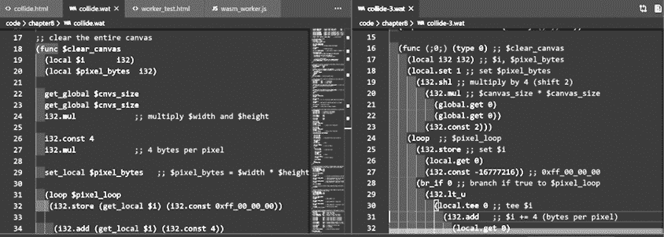

图 9-21：比较优化版本和未优化版本的 *collide.wat*

## 提升性能的策略

现在我们来看看一些可以用来提升 WebAssembly 应用程序性能的策略。优化器使用了一些这些技术，你也可以通过编写代码来使优化器的工作变得更加简单。有时，你可能希望查看优化器生成的 WAT 代码，从中获得改进代码的建议。让我们来看看你可以在 WAT 中使用的一些常见优化技术。

### 内联函数

调用一个函数有一点点开销。除非函数每秒被调用成千上万次，否则这种开销通常不会成为大问题。内联函数是将函数调用替换为该函数相同代码的过程。这样做可以去除执行函数调用所需的额外处理开销，但会增加 WebAssembly 模块的大小，因为它在每个调用该函数的地方都会复制代码。当我们对*collide.wasm*模块运行优化器时，它内联了七个函数中的四个。让我们看一个内联函数的简单示例。以下的 WAT 代码并不是应用的一部分，它只是一个演示。在 Listing 9-6 中，我们创建了一个将三个数字相加的函数，然后创建了另一个函数来多次调用`$add_three`。

```
 (func $add_three ;; function adds three numbers together
    (param $a i32)
    (param $b i32)
    (param $c i32)
    (result i32)
 local.get $a
    local.get $b
    local.get $c
    i32.add
    i32.add
  )
  (func (export "inline_test")  ;; I will inline functions in inline_test
    (param $p1 i32)
    (param $p2 i32)
    (param $p3 i32)
    (result i32)
    (call $add_three (local.get $p1) (i32.const 2) (local.get $p2))
    (call $add_three (local.get $p3) (local.get $p1) (i32.const 13))
    ;; add the results together and return
    i32.add
 )
```

Listing 9-6：用于内联的演示代码

我们将专注于内联作为本节的优化方法。为了内联这些函数，我们将函数的内容复制粘贴到每个调用它的地方。在 Listing 9-7 中，灰色代码是原始的函数调用，后面的代码是内联的函数。

```
 (func (export "inline_test");; I will inline the functions in inline_test
    (param $p1 i32)
    (param $p2 i32)
    (param $p3 i32)
    (result i32)
;;  (call $add_three (local.get $p1) (i32.const 2) (local.get $p2))
;;  the function above is inlined into the code below
    local.get $p1
    i32.const 2
    local.get $p2
    i32.add
    i32.add
;;  (call $add_three (local.get $p3) (local.get $p1) (i32.const 13))
;;  the function above is inlined into the code below
    local.get $p3
    local.get $p1
    i32.const 13
    i32.add
    i32.add

    i32.add
 )
```

Listing 9-7：手动内联代码示例

内联函数调用可能会暴露其他优化机会。例如，你可以看到我们在添加`2`之后又添加了`13`。由于这两个值都是常量，如果我们直接添加`15`，代码的性能会更好。

让我们编写一个可能会被内联的模块，编译并优化它，然后查看`wasm-opt`生成的代码。我们将创建一个包含三个函数的模块：`$add_three`、`$square`和`$inline_test`。创建一个名为*inline.wat*的 WAT 文件，并在其中添加 Listing 9-8 中的代码。

**inline.wat**

```
(module
  (func $add_three
    (param $a i32)
    (param $b i32)
    (param $c i32)
    (result i32)
    local.get $a
    local.get $b
    local.get $c
    i32.add
    i32.add
  )
  (func $square
    (param $a i32)
    (result i32)
    local.get $a
    local.get $a
    i32.mul
  )
  (func $inline_test (export "inline_test")
    (param $p1 i32)
    (param $p2 i32)
    (param $p3 i32)
    (result i32)
    (call $add_three (local.get $p1) (i32.const 2) (local.get $p2))
    (call $add_three (local.get $p3) (local.get $p1) (i32.const 13))
    call $square
    i32.add
    call $square
  )
)
```

Listing 9-8：我们将使用`wasm-opt`来内联这段代码

`$add_three`函数是我们在 Listing 9-7 中手动内联的相同函数。`$square`函数将栈顶的值与自身相乘，而`$inline_test`函数是调用函数。让我们使用`wat2wasm`编译`$inline_test`函数：

```
wat2wasm inline.wat
```

现在我们可以使用`wasm-opt`进行优化：

```
wasm-opt inline.wasm -O3 -o inline-opt.wasm
```

最后，让我们使用`wasm2wat`将其转换回 WAT：

```
wasm2wat inline-opt.wasm
```

现在我们可以打开*inline-opt.wat*，查看我们的优化代码是什么样的（Listing 9-9）。

**inline-opt.wat**

```
(module
  (type (;0;) (func (param i32 i32 i32) (result i32)))
  (func (;0;) (type 0) (param i32 i32 i32)
    (result i32) ;; $inline_test function
    local.get 0
    local.get 1
    i32.const 2  
    i32.add
    i32.add
    local.get 2
    local.get 0
    i32.const 13
    i32.add
    i32.add
    local.tee 0
    local.get 0
    i32.mul
    i32.add
    local.tee 0
    local.get 0
    i32.mul)
  (export "inline_test" (func 0)))
```

Listing 9-9：优化后的*inline.wat*版本，*inline-opt.wat*，内联了两个函数。

优化器移除了两个函数`$add_three`和`$square`，并将这些代码内联到`inline_test`函数中。

### 乘法和除法与位移

第八章展示了如何通过将整数位向右移动作为乘以 2 的幂的更快方法。例如，向左移动 3 位等同于乘以 2³，即 8。同样，将整数向右移动等同于除以该 2 的幂。例如，右移 4 位等同于除以 2⁴，即 16。让我们看看`wasm-opt`如何处理 2 的幂的乘法和除法。创建一个新的 WAT 文件，命名为*pow2_mul.wat*，并将清单 9-10 中的代码添加进去，创建一个模块用于乘以和除以 2 的幂。

**pow2_mul.wat**

```
(module
  (func (export "pow2_mul")
    (param $p1 i32)
    (param $p2 i32)
    (result i32)
    local.get $p1
    i32.const 16
    i32.mul ;; multiply by 16, which is 24
    local.get $p2
    i32.const 8
    i32.div_u ;; divide by 8, which is 23
 i32.add
  )
)
```

清单 9-10：一个用于乘以和除以 2 的幂的函数

使用`wat2wasm`编译这段代码，使用`wasm-opt`优化 WebAssembly 文件，然后使用`wasm2wat`将 WebAssembly 文件反汇编回 WAT 文件。接着在 VS Code 中打开优化后的*pow2_mul.wat*，如清单 9-11 所示。

**pow2_mul_optimized.wat**

```
(module
  (type (;0;) (func (param i32 i32) (result i32)))
  (func (;0;) (type 0) (param i32 i32) (result i32)
    local.get 1
    i32.const 8
    i32.div_u
    local.get 0
    i32.const 4
    i32.shl
    i32.add)
  (export "pow2_mul" (func 0)))
```

清单 9-11：来自清单 9-10 的`pow2_mul`函数的优化版本

注意，优化后的代码会在执行乘法之前先对第二个参数进行除法操作。当你乘以一个 2 的幂常量时，`wasm-opt`会将其转换为左移操作。然而，`wasm-opt`并不总是将 2 的幂的除法替换为右移操作。在本章后面，我们将花些时间通过*benchmark.js*运行不同版本的代码，看看它们的性能如何。我们将比较由`wasm-opt`生成的优化代码与我们手动优化的代码，看看是否能够做得更好。

#### 合并常量

通常，优化会合并常量以提高性能。例如，假设你有两个常量偏移量需要加在一起。你原来的代码是*x* = 3 + 8，但如果你一开始就将*x* = 11，性能会更好。像这样的情况人眼不总是能轻易看出来，但`wasm-opt`非常高效，能够帮你找出这些情况。作为例子，创建一个 WAT 文件，命名为*combine_constants.wat*，并将清单 9-12 中的代码添加进去，该代码仅仅是将三个常量合并在一起。

**combine_constants.wat**

```
(module
  (func $combine_constants (export "combine_constants")
    (result i32)
    i32.const 10
    i32.const 20
    i32.add
 i32.const 55
    i32.add
  )
)
```

清单 9-12：一个将三个常量相加的函数

注意，`$combine_constants`返回的值将始终是 85。`wasm-opt`工具足够智能，能够搞清楚这一点。当你通过`wat2wasm`运行代码，使用`wasm-opt`优化 WebAssembly 文件，再通过`wasm2wat`反汇编 WebAssembly 文件时，你会看到清单 9-13 中的代码。

**combine_constants_optimized.wat**

```
(module
  (type (;0;) (func (result i32)))
  (func (;0;) (type 0) (result i32)
1 i32.const 85)
  (export "combine_constants" (func 0)))
```

清单 9-13：三个常量的加法被合并为一个常量。

清单 9-13 中的函数返回`85`，并且不再执行两个加法操作。

### DCE

*死代码消除 (DCE)* 是一种优化技术，用于删除模块中未被调用或导出的任何代码。这是一种直接的优化方法，虽然不会改善执行时间，但可以减少下载文件的大小。DCE 无论使用哪种优化标志都会发生。我们来看一个简单的例子。打开一个名为*dce_test.wat*的新文件，并添加清单 9-14 中的代码，这段代码创建了一个包含两个永不使用的函数的模块。

**dce_test.wat**

```
(module
1 (func $dead_code_1
    (param $a i32)
    (param $b i32)
    (param $c i32)
    (result i32)
    local.get $a
    local.get $b
    local.get $c
    i32.add
    i32.add
  )
2 (func $dead_code_2
    (param $a i32)
    (result i32)
    local.get $a
    local.get $a
    i32.mul
  )
  (func $dce_test (export "dce_test")
    (param $p1 i32)
 (param $p2 i32)
    (result i32)
    local.get $p1
    local.get $p2
    i32.add
  )
)
```

清单 9-14：该模块包含两个未使用的函数。

前两个函数`$dead_code_1` 1 和 `$dead_code_2` 2 没有被调用，也没有被导出。我们运行的任何优化都会删除这些函数。运行`wat2wasm`生成代码，使用`wasm-opt`与`-O3`标志进行优化，再使用`wasm2wat`将其转换回 WAT 文件。打开新文件，查看优化后的代码，如清单 9-15 所示。

**dce_test_optimized.wat**

```
(module
  (type (;0;) (func (param i32 i32) (result i32)))
  (func (;0;) (type 0) (param i32 i32) (result i32)
    local.get 0
    local.get 1
    i32.add)
  (export "dce_test" (func 0)))
```

清单 9-15：两个函数被 DCE 移除。

唯一剩下的函数是 `"dce_test"`。使用 DCE 已将模块的大小从 79 字节减少到 46 字节。

## 使用 JavaScript 比较碰撞检测应用

我们已经看过 WebAssembly 碰撞检测应用的表现。接下来，让我们快速写出相同的代码，用 JavaScript 实现，并比较其与 WebAssembly 版本的性能。创建一个名为 *collidejs.html* 的新网页。首先，向 *collide.html* 页面添加头部和 canvas 元素，并将其重新保存为 *collidejs.html*，如清单 9-16 所示。

**collidejs.html（第一部分，共 2 部分）**

```
<!DOCTYPE html>
<html lang="en">
<head>
    <meta charset="UTF-8">
    <meta name="viewport" content="width=device-width, initial-scale=1.0">
    <title>Collide JS</title>
</head>
<body>
    <canvas id="canvas" width="1024" height="1024"></canvas>
...
```

清单 9-16：*collidejs.html* 中的 HTML 头部和 canvas 元素

这段代码与该应用的 WebAssembly 版本相似。主要区别在于`script`标签，如清单 9-17 所示。在`script`标签中添加以下 JavaScript 代码。

**collidejs.html（第二部分，共 2 部分）**

```
...
    <script type="text/javascript">
        // javascript version
        var animate_callback;
        const out_tag = document.getElementById('out');
        const cnvs_size = 1024 | 0;

        const noh_color = 0xff00ff00 | 0;
        const hit_color = 0xff0000ff | 0;

        const obj_start = cnvs_size * cnvs_size * 4;
        const obj_size = 8 | 0;
        const obj_cnt = 3000 | 0;

        const canvas = document.getElementById("canvas");
        const ctx = canvas.getContext("2d");

        class Collider {
            constructor() {
                this.x = Math.random() * cnvs_size;
                this.y = Math.random() * cnvs_size;
                this.xv = (Math.round(Math.random() * 4) - 2);
                this.yv = (Math.round(Math.random() * 4) - 2);
                this.color = "green";
            }

            move = () => {
                this.x += this.xv;
                this.y += this.yv;
                this.x %= 1024;
                this.y %= 1024;
            }
            draw = () => {
                ctx.beginPath();
                ctx.fillStyle = this.color;
                ctx.fillRect(this.x, this.y, obj_size, obj_size);
                ctx.stroke();
            }
            hitTest = (c2) => {
                let x_dist = this.x - c2.x;
                let y_dist = this.y - c2.y;

                if (Math.abs(x_dist) <= obj_size &&
                    Math.abs(y_dist) <= obj_size) {
                    this.color = "red";
                    return true;
                }
                else {
                    this.color = "green";
                }
                return false;
            }
        }

 let collider_array = new Array();
        for (let i = 0; i < obj_cnt; i++) {
            collider_array.push(new Collider());
        }

        let animate_count = 0;

        function animate() {
            // clear
            ctx.clearRect(0, 0, canvas.width, canvas.height);
            for (let i = 0; i < collider_array.length; i++) {
                collider_array[i].move();
            }

            // loop and render
            for (i = 0; i < collider_array.length; i++) {
                for (let j = 0; j < collider_array.length; j++) {
                    if (i === j) {
                        continue;
                    }
                    if (collider_array[i].hitTest(collider_array[j]))
                    {
                        break;
                    }
                }
                collider_array[i].draw();
            }
            requestAnimationFrame(animate);
        }
        requestAnimationFrame(animate);
    </script>
</body>
</html>
```

清单 9-17：我们的碰撞检测应用的 JavaScript 版本

我不会详细讲解清单 9-17 中的代码，因为它的目的是为了与第八章中的 WebAssembly 代码进行对比。现在我们可以在 Chrome 和 Firefox 分析器中运行 *collidejs.html* 来查看它们的表现。图 9-22 显示了 *collidejs.html* 在 Chrome 分析器中的帧率。

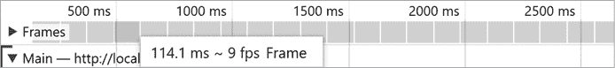

图 9-22：我们的 JavaScript 应用在 Chrome 分析器中的帧率

Chrome 运行该 JavaScript 版本的应用时帧率约为 9 fps，比未优化的 WebAssembly 版本（在 Chrome 中运行约 18 fps）和优化后的版本（运行帧率为 35 fps）都要慢。优化后的 WebAssembly 代码在 Chrome 中的运行速度几乎是原来的四倍。

现在我们来看看我们的 JavaScript 在 Firefox 中的表现（如图 9-23 所示）。


图 9-23：我们的 JavaScript 应用在 Firefox 分析器中的帧率

Firefox 在这个应用程序中的表现明显优于 Chrome（几乎快一倍）。它甚至能够超越 WebAssembly 应用程序在 Firefox 上的未优化版本，后者大约运行在 14 fps。这个速度仅为 Firefox 上优化版 WebAssembly 应用程序的一半左右，后者的帧率大约是 31 fps。

在本节中，你学习了如何使用 Firefox 和 Chrome 的性能分析工具将你的 WebAssembly 代码与类似的 JavaScript 代码进行比较。你现在应该能够利用这些知识，在不同浏览器上比较应用程序的不同版本，以了解哪些代码最好使用 WebAssembly 编写，哪些则最好使用 JavaScript 编写。

## 手动优化 WAT

我花了一些时间手动优化我的 WebAssembly 碰撞应用程序，结果我将帧率进一步提高了。在这本书中无法详细描述所有的更改。然而，我想指出的是，如果你愿意花时间进行手动优化，可能会获得哪些性能提升。我成功地将碰撞应用程序的帧率提高到 Chrome 性能分析工具中的 36 fps (图 9-24)。

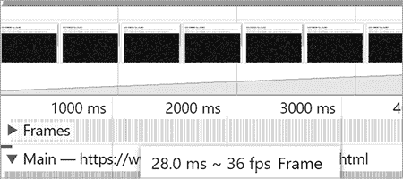

图 9-24：手动优化后的碰撞应用程序在 Chrome 中运行

Firefox 的帧率更高，达到了 52 fps (图 9-25)。

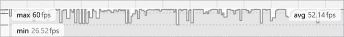

图 9-25：手动优化后的碰撞应用程序在 Firefox 中运行

你可以在 [`wasmbook.com/collide.html`](https://wasmbook.com/collide.html) 上看到我手动优化后的成果，在 [`wasmbook.com/collide.wat`](https://wasmbook.com/collide.wat) 上查看 WAT 代码。我对精心调优的代码运行了 Binaryen 优化器，但它实际上使帧率下降了几帧。Binaryen 一直在改进它的优化输出。到你阅读这篇文章时，结果可能会有所不同。

## 性能日志记录

记录 JavaScript 应用程序性能的最简单方法之一是使用 `Date` 类和 `console.log` 函数。WebAssembly 无法在不使用 JavaScript 的情况下写入控制台。因此，我们需要使用 JavaScript 来记录 WebAssembly 和 JavaScript 代码的性能到控制台。

让我们看看从 JavaScript 调用 WebAssembly 模块时所涉及的开销。我们将创建一个 WebAssembly 模块，其中包含一些可以从 JavaScript 中反复调用的小函数。创建一个名为 *mod_and.wat* 的文件，并添加 清单 9-18 中的代码。

**mod_and.wat**

```
(module
  (func $mod (export "mod")
    (param $p0 i32)
    (result i32)
    local.get $p0
    i32.const 1000
    i32.rem_u
  )

  (func $and (export "and")
    (param $p0 i32)
    (result i32)
    local.get $p0
    i32.const 0x3ff
    i32.and
  )
)
```

清单 9-18：比较余数与按位与操作的性能

这个模块中有两个函数，一个是 `$mod` 函数，它用于计算除以 `1000` 的余数，另一个是 `$and` 函数，它使用按位与操作。使用 `wat2wasm` 编译 *mod_and.wat* 文件，并使用 `wasm-opt` 进行优化。

接下来，我们需要创建一个 JavaScript 函数来运行这个 WAT 模块，并将其与等效的 JavaScript 代码进行测试。创建一个名为 *mod_and.js* 的新文件，并添加 清单 9-19 中的代码。

**mod_and.js**

```
const fs = require('fs');
const bytes = fs.readFileSync('./mod_and.wasm');

(async () => {
  const obj =
    await WebAssembly.instantiate(new Uint8Array(bytes));
  let mod = obj.instance.exports.mod;
  let and = obj.instance.exports.and;

 let start_time = Date.now(); // reset start_time
 // The '| 0' syntax is a hint to the JavaScript engine to tell it
 // to use integers instead of floats, which can improve performance in
 // some circumstances
  for (let i = 0 | 0; i < 4_000_000; i++) {
    mod(i);  // call the mod function 4 million times
  }
// calculate the time it took to run 4 million mod calls
  console.log(`mod: ${Date.now() - start_time}`);
  start_time = Date.now(); // reset start_time

  for (let i = 0 | 0; i < 4_000_000; i++) {
    and(i); // call the and function 4 million times
  }
// calculate the time it took to run 4 million and calls
  console.log(`and: ${Date.now() - start_time}`);
  start_time = Date.now(); // reset start_time
  for (let i = 0 | 0; i < 4_000_000; i++) {
    Math.floor(i % 1000);
  }
// calculate the time it took to run 4 million modulo calls
  console.log(`js mod: ${Date.now() - start_time}`);
})();
```

列表 9-19：使用`Date.now`和`console.log`记录运行时间

在运行每个代码块之前，我们设置一个变量`start_time`为`Date.now()`。这样做将`start_time`变量设置为当前时间的毫秒数。完成代码后，我们记录`Date.now() - start_time`，这将给出我们测试的运行时间（毫秒）。我们会对 WebAssembly 模块和 JavaScript 代码执行这个操作，以便比较两者。

现在我们已经有了*mod_and.js*函数，可以使用以下`node`命令来运行它：

```
node mod_and.js
```

列表 9-20 显示了运行*mod_and.js*后的输出。

```
mod: 29
and: 23
js mod: 4
```

列表 9-20：*mod_and.js*的输出

`mod`函数执行四百万次花费了 29 毫秒。`and`函数执行四百万次花费了 23 毫秒。JavaScript 版本执行四百万次只花费了 4 毫秒。那么，如果 WebAssembly 这么快，为什么它的执行时间却是这些函数的五到七倍呢？问题在于 JavaScript 和 WebAssembly 之间的调用存在一些开销。调用一个小函数四百万次时，也会产生四百万次开销的成本。让我们重写代码，从 WebAssembly 内部执行这些函数，而不是从 JavaScript 的循环中调用它们。

首先，我们将重写 WebAssembly 模块，将循环包含在模块内部，而不是在 JavaScript 内部。创建一个新的 WAT 文件，命名为*mod_and_loop.wat*，并添加列表 9-21 中的代码。

**mod_and_loop.wat**

```
(module
  (func (export "mod_loop")
    (result i32)
    (local $i i32)
    (local $total i32)
    i32.const 100_000_000 ;; loop 100 million times
    local.set $i

    (loop $loop
      local.get $i
      i32.const 0x3ff
      i32.rem_u
      local.set $total

      local.get $i
      i32.const 1
      i32.sub
      local.tee $i  ;; i--

      br_if $loop
    )
    local.get $total
  )

  (func (export "and_loop")
    (result i32)
    (local $total i32)
    (local $i i32)
    i32.const 100_000_000 ;; loop 100 million times
    local.set $i

    (loop $loop
      local.get $i
      i32.const 0x3ff
      i32.and
      local.set $total

      local.get $i
      i32.const 1
      i32.sub
      local.tee $i ;; i--

      br_if $loop
    )
 local.get $total
  )
)
```

列表 9-21：按位与/取余函数的循环版本

这些函数执行的任务与原始函数相同，但程序将它们执行 1 亿次。我们需要修改 JavaScript 文件，只调用这些函数一次，并让 JavaScript 执行 1 亿次。这样，我们就可以将性能与 WebAssembly 模块进行比较，后者已经修改为执行函数 1 亿次。创建一个名为*mod_and_loop.js*的新函数，并添加列表 9-22 中的代码。

**mod_and_loop.js**

```
const fs = require('fs');
const bytes = fs.readFileSync('./mod_and_loop.wasm');

(async () => {
  const obj =
    await WebAssembly.instantiate(new Uint8Array(bytes));
  let mod_loop = obj.instance.exports.mod_loop;
  let and_loop = obj.instance.exports.and_loop;

  let start_time = Date.now(); // set start_time
  and_loop();
  console.log(`and_loop: ${Date.now() - start_time}`);

  start_time = Date.now(); // reset start_time
  mod_loop();
  console.log(`mod_loop: ${Date.now() - start_time}`);
  start_time = Date.now(); // reset start_time
  let x = 0;
  for (let i = 0; i < 100_000_000; i++) {
    x = i % 1000;
  }
  console.log(`js mod: ${Date.now() - start_time}`);
})();
```

列表 9-22：运行`and_loop`、`mod_loop`和相应 JavaScript 代码的 JavaScript

我们调用`mod_loop`和`and_loop`函数，记录每个循环执行所花的时间。接下来，我们运行一个循环，在其中执行 100 百万次取余操作，并记录所花费的时间。如果我们编译并优化 WebAssembly 模块，然后使用`node`运行*mod_and_loop.js*，我们应该看到类似列表 9-23 中的输出。

```
and_loop: 31
mod_loop: 32
js mod: 52
```

列表 9-23：*mod_and_loop.js*的输出

现在 WebAssembly 比相同的 JavaScript 代码快了 67%。虽然按位与操作的性能没有比取余操作好多少，这点让我有些失望，但至少我们现在知道如何使用`console.log`结合`Date.now()`进行最简单的性能测试了。

## 使用 benchmark.js 进行更复杂的测试

如果你想让你的测试比仅使用日志和 `Date.now` 更复杂一些，可以安装一个性能测试模块，例如*benchmark.js*。在清单 9-10 中，我们创建了一个 WebAssembly 函数，它先乘以 16 然后除以 8，并通过 `wasm-opt` 查看 Binaryen 如何优化我们的代码。优化器用位移操作替换了乘法，但没有用位移替换除法操作，它还重新排列了除法和乘法的顺序。

我们将测试这个 WebAssembly 模块的几个版本，包括原始版本和优化器生成的版本，看看是否可以通过一些努力超越优化器的效果。我们将使用*benchmark.js*来测试所有这些函数的性能。创建一个新的 WAT 文件，命名为*pow2_test.wat*，并添加清单 9-24 中的代码。

**pow2_test.wat（第一部分，共 5 部分）**

```
(module
  ;; this is the original function we wrote
  (func (export "pow2")
    (param $p1 i32)
    (param $p2 i32)
    (result i32)
    local.get $p1
    i32.const 16
    i32.mul
    local.get $p2
    i32.const 8
    i32.div_u
    i32.add
  )
...
```

清单 9-24：模块开始与原始函数

清单 9-24 显示了我们原始的 2 的幂次测试版本，在其中我们先乘以 16，然后除以 8\。

下一个函数在清单 9-25 中，先进行除法再进行乘法。我想测试这个，因为`wasm-opt`交换了乘法和除法函数，我很好奇这是否对函数性能产生了积极的影响。

**pow2_test.wat（第二部分，共 5 部分）**

```
...
 ;; wasm-opt placed the div before mul, so let's see if that helps
  (func (export "pow2_reverse")
    (param $p1 i32)
    (param $p2 i32)
    (result i32)
    local.get $p2
 i32.const 8
    i32.div_u
    local.get $p1
    i32.const 16
    i32.mul
    i32.add
  )
...
```

清单 9-25：交换除法和乘法顺序

下一个函数在清单 9-26 中，使用了二进制位移进行 2 的幂次乘法和除法。我们还使用了优化器插入的顺序，其中除法发生在乘法之前。

**pow2_test.wat（第三部分，共 5 部分）**

```
...
 ;; change multiply and divide to shifts
  (func (export "pow2_mul_div_shift")
    (param $p1 i32)
    (param $p2 i32)
    (result i32)
    local.get $p2
    i32.const 3
    i32.shr_u
    local.get $p1
    i32.const 4
    i32.shl
    i32.add
  )
...
```

清单 9-26：将乘法和除法表达式改为二进制位移

接下来，在清单 9-27 中，我们使用了位移操作进行除法和乘法，但这次我们没有改变除法和乘法的顺序，仍然保留了原始代码中的顺序。

**pow2_test.wat（第四部分，共 5 部分）**

```
...
 ;; back to original order of multiply and divide
  (func (export "pow2_mul_div_nor")
    (param $p1 i32)
    (param $p2 i32)
    (result i32)
    local.get $p1
    i32.const 4
    i32.shl
    local.get $p2
    i32.const 3
    i32.shr_u
    i32.add
  )
...
```

清单 9-27：原始顺序，先乘法再除法

下一个函数在清单 9-28 中，这是通过 `wasm-opt` 和 `-O3` 标志生成的代码版本。

**pow2_test.wat（第五部分，共 5 部分）**

```
...
;; this was what was generated by wasm-opt
  (func (export "pow2_opt") (param i32 i32) (result i32)
    local.get 1
    i32.const 8
    i32.div_u
    local.get 0
    i32.const 4
    i32.shl
    i32.add
  )
)
```

清单 9-28：`wasm-opt`优化版本的函数

现在我们可以用`wat2wasm`编译这个模块，但我们*不应该*优化它，因为我们要测试原始的 WAT 代码，避免优化器的修改。接下来，我们需要创建我们的*benchmark.js*代码。首先，我们需要使用 `npm` 安装 *benchmark.js* 模块：

```
npm i --save-dev benchmark
```

现在我们可以编写一个 JavaScript 程序，使用*benchmark.js*测试 WebAssembly 函数。让我们把这个程序分成几个部分，一次讲解一个部分。将清单 9-29 中的代码添加到*benchmark_test.js*中。

**benchmark_test.js**

```
// import benchmark.js
1 var Benchmark = require('benchmark');
2 var suite = new Benchmark.Suite();

// use fs to read the pow2_test.wasm module into a byte array
3 const fs = require('fs');
const bytes = fs.readFileSync('./pow2_test.wasm');
const colors = require('colors'); // allow console logs with color

// Variables for the WebAssembly functions
var pow2;
var pow2_reverse;
var pow2_mul_shift;
var pow2_mul_div_shift;
var pow2_mul_div_nor;

console.log(`
================= RUNNING BENCHMARK =================
`.rainbow 4);
...
```

清单 9-29：*benchmark_test.js* JavaScript 文件的第一部分

首先，我们引入 1 `benchmark` 模块，然后从该模块创建一个新的 `suite` 2 对象。接着，我们引入 `fs` 3 模块，并用它将 WebAssembly 模块加载到 `byte` 数组中。然后，我们定义一系列变量来保存 WebAssembly 模块中的函数。我们记录一个 `rainbow` 4 颜色分隔符，显示 `RUNNING BENCHMARK`，以便在回滚查看统计数据时更容易找到基准测试的起点。如果你像我一样在基准测试时更改模块，那么在一个显眼的位置标记基准测试开始的地方会很有帮助。

在 列表 9-30 中，我们将添加一个可以调用的函数，用于初始化并运行基准测试套件。将以下函数添加到 *benchmark_test.js* 中。

**benchmark_test.js**

```
...
1 function init_benchmark() {
  // adds the callbacks for the benchmarks
2 suite.add('#1 '.yellow + 'Original Function', pow2);
  suite.add('#2 '.yellow + 'Reversed Div/Mult order', pow2_reverse);
  suite.add('#3 '.yellow + 'Replace mult with shift',
             pow2_mul_shift);
  suite.add('#4 '.yellow + 'Replace mult & div with shift',
             pow2_mul_div_shift);
  suite.add('#5 '.yellow + 'wasm-opt optimized version', pow2_opt);
  suite.add('#6 '.yellow + 'Use shifts with OG order',
             pow2_mul_div_nor);
 // add listeners
3 suite.on('cycle', function (event) {
    console.log(String(event.target));
  });

4 suite.on('complete', function () {
    // when the benchmark has finished, log the fastest and slowest functions
    let fast_string = ('Fastest is ' +
      5 this.filter('fastest').map('name'));
    let slow_string = ('Slowest is ' +
        this.filter('slowest').map('name'));
  6 console.log(`
    ------------------------------------------------------------
    ${fast_string.green}
    ${slow_string.red}
    ------------------------------------------------------------
    `);

    // create an array of all successful runs and sort fast to slow
  7 var arr = this.filter('successful');
  8 arr.sort(function (a, b) { 
    return a.stats.mean - b.stats.mean;
    });

    console.log(`

    `);
    console.log("============ FASTEST ============".green);
  9 while (obj = arr.shift()) {
 let extension = '';
      let count = Math.ceil(1 / obj.stats.mean);

     if (count > 1000) {
       count /= 1000;
       extension = 'K'.green.bold;
     }

     if (count > 1000) {
      count /= 1000;
      extension = 'M'.green.bold;
     }

     count = Math.ceil(count);
     let count_string = count.toString().yellow + extension;
     console.log(
      `${obj.name.padEnd(45, ' ')} ${count_string} exec/sec`
      );
    }
    console.log("============ SLOWEST ============".red);
  });
  // run async
  a suite.run({ 'async': false });
}
...
```

列表 9-30：`init_benchmark` 函数

我们定义了 `init_benchmark()` 1 函数，它为 WebAssembly 模块中的每个函数调用基准测试模块中的 `suite.add`2。使用 `suite.add` 告诉基准测试套件测试该函数，并用作为第二个参数传递的字符串记录结果。`suite.on` 函数设置了一个事件回调，用于处理基准测试期间发生的不同事件。第一次调用 `suite.on` 3 设置回调，用于每个周期，这将输出我们测试的函数和该测试的统计数据。接下来的调用 `suite.on` 4 设置回调，用于基准测试完成时，它将使用 `filter` 5 方法来 `log` 6 最快和最慢的函数。然后，我们按 `'successful'` 7 过滤，获取所有成功运行的函数数组。我们根据该周期的 `mean`（平均）运行时间 `sort` 8 该数组。这样可以将周期按从最快到最慢的运行时间进行排序。然后，我们可以通过循环 9 遍历这些周期，从最快到最慢地打印它们。在该函数的最后，我们 `run` 了 `suite`。

定义了 `init_benchmark` 函数后，在 列表 9-31 中，我们创建了异步 IIFE 来实例化我们的 WebAssembly 模块并调用 `init_benchmark`。

**benchmark_test.js**

```
...
(async () => {
1 const obj = await WebAssembly.instantiate(new Uint8Array(bytes));
2 pow2 = obj.instance.exports.pow2;
  pow2_reverse = obj.instance.exports.pow2_reverse;
  pow2_mul_shift = obj.instance.exports.pow2_mul_shift;
  pow2_mul_div_shift = obj.instance.exports.pow2_mul_div_shift;
 pow2_opt = obj.instance.exports.pow2_opt;
  pow2_mul_div_nor = obj.instance.exports.pow2_mul_div_nor;
3 init_benchmark();
})();
```

列表 9-31：异步 IIFE 实例化 WebAssembly 并运行 *benchmark**.js**。 

在这里，我们 `instantiate` 1 我们的 WebAssembly 模块，并设置所有我们将从 *benchmark.js* 中调用的函数 2。然后，通过调用 `init_benchmark()` 3 运行 *benchmark.js*。现在，我们可以使用 `node` 并通过以下命令运行我们的应用程序：

```
node benchmark_test.js
```

图 9-26 显示了输出结果。

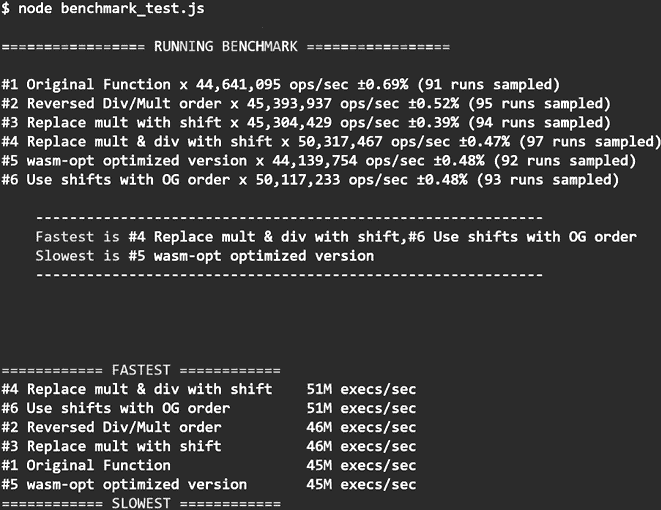

图 9-26：*benchmark_test.js* 的输出

有趣的是，最慢的这些函数是 `wasm-opt` 优化版本：原始版本和 `wasm-opt` 优化版本的执行时间差不多。最快的运行是我们将 `i32.mul` 和 `i32.div_u` 操作替换为位移，并按 `wasm-opt` 工具重排的顺序重新排序调用。这表明，你不能假设 `wasm-opt`（或任何程序化优化工具）总是能给你最优性能的代码。始终建议对你的应用程序进行性能测试。

## 使用 `--print-bytecode` 比较 WebAssembly 和 JavaScript

在本节中，我们将深入探讨低级字节码。观察 JavaScript JIT 生成的字节码既有趣又令人兴奋。将其与 WebAssembly 进行比较也很有趣，思考如何提高性能更是引人入胜。如果这个话题不感兴趣，你可以跳过并继续看下一节。

我们简要看看如何在 WebAssembly 代码和 JavaScript 之间做更好的对比。V8 将 JavaScript 编译成 IR 字节码，看起来很像汇编语言或 WAT。IR 使用寄存器和累加器，但不是机器特定的。我们可以使用 IR 来比较经过 JIT 编译器运行后的 JavaScript 代码和我们的 WebAssembly 代码。因为它们都是低级字节码，这让我们能进行更好的*类比比较*。但请记住，JavaScript 代码需要在运行时解析并编译成这种字节码，而 WebAssembly 是提前编译的。

让我们创建一个小的 JavaScript 程序，并使用 `node --print-bytecode` 标志查看由该 JavaScript 生成的字节码。创建一个名为 *print_bytecode.js* 的 JavaScript 文件，并添加 Listing 9-32 中的代码。

**print_bytecode.js**

```
1 function bytecode_test() {
  let x = 0;
2 for (let i = 0; i < 100_000_000; i++) {
  3 x = i % 1000;
  }
4 return 99;
} 
```

// 如果我们不调用这个，函数会在 DCE 检查中被移除

```
5 bytecode_test();
```

Listing 9-32: 我们将用 `--print-bytecode` 标志执行的 `bytecode_test` 函数

这个 `bytecode_test` 函数类似于我们在 Listing 9-22 中进行性能测试的代码。它是一个简单的 `for` 循环，取 `i` 计数器的模数，将其存储在 `x` 中，然后返回 `99`。它其实没有做什么有用的事情，但我想用一个易于理解的函数，这样我们可以将其编译成字节码。

然后我们除了定义这个函数，还需要调用它；否则 V8 会将其作为 DCE 的一部分移除。我们可以在 Listing 9-33 中运行 `node` 命令来打印字节码。

```
node --print-bytecode --print-bytecode-filter=bytecode_test print_bytecode.js
```

Listing 9-33: 使用 `--print-bytecode` 标志运行 `node`

我们向`node`传递`--print-bytecode`标志，指示它打印字节码。我们还传递`--print-bytecode-filter`标志，将其设置为我们函数的名称，以便打印该函数的字节码。如果不包含过滤器标志，输出的字节码将远超我们需要查看的部分。最后，我们传递`node` JavaScript 文件的名称。使用来自示例 9-33 的标志运行*print_bytecode.js*，你应该能在示例 9-34 中看到输出结果。

```
[generated bytecode for function: bytecode_test]
Parameter count 1
Register count 2
Frame size 16
22 E> 0000009536F965F6 @    0 : a5                **StackCheck**
38 S> 0000009536F965F7 @    1 : 0b                **LdaZero**
      0000009536F965F8 @    2 : 26 fb             **Star r0**
57 S> 0000009536F965FA @    4 : 0b                **LdaZero**
      0000009536F965FB @    5 : 26 fa             **Star r1**
62 S> 0000009536F965FD @    7 : 01 0c 00 e1 f5 05 **LdaSmi.ExtraWide [100000000]**
62 E> 0000009536F96603 @   13 : 69 fa 00          **TestLessThan r1, [0]**
      0000009536F96606 @   16 : 99 16             **JumpIfFalse [22]** (0000009536F9661C @ 38)
44 E> 0000009536F96608 @   18 : a5                **StackCheck**
89 S> 0000009536F96609 @   19 : 25 fa             **Ldar r1**
95 E> 0000009536F9660B @   21 : 00 44 e8 03 01 00 **ModSmi.Wide [1000], [1]**
      0000009536F96611 @   27 : 26 fb             **Star r0**
78 S> 0000009536F96613 @   29 : 25 fa             **Ldar r1**
      0000009536F96615 @   31 : 4c 02             **Inc [2]**
      0000009536F96617 @   33 : 26 fa             **Star r1**
      0000009536F96619 @   35 : 8a 1c 00          **JumpLoop [28], [0]** (0000009536F965FD @ 7)
111 S> 0000009536F9661C @   38 : 0c 63             **LdaSmi [99]**
121 S> 0000009536F9661E @   40 : a9                **Return**
Constant pool (size = 0)
Handler Table (size = 0)
```

示例 9-34：*print_bytecode.js*的字节码输出

示例 9-34 中输出的右侧显示了 IR 的操作码。在这里，我列出了这些操作码，并在右侧添加了 WAT 风格的注释。V8 引擎生成的字节码并不是栈机器，而是一个虚拟寄存器机器，它具有一个累加器寄存器。*累加器*是这个虚拟机器进行计算的地方。快速查看示例 9-35 中的代码，这段代码是 V8 生成的。

```
;; A = Accumulator R0 = Register 0, R1 = Register 1
StackCheck
LdaZero                                   **;; A = 0**
Star r0                                   **;; R0 = A**
LdaZero                                   **;; A = 0**
Star r1                                   **;; R1 = A**
;; THIS IS THE TOP OF THE LOOP
LdaSmi.ExtraWide [100000000]              **;; A=100_000_000**
TestLessThan r1, [0]                      **;; R1 < A**
JumpIfFalse [22] (0000006847C9661C @ 38)  **;; IF R1 >= A GO 22 BYTES**
                                          **;;   AHEAD [END OF LOOP]**
StackCheck
Ldar r1                                   **;; A = R1**
ModSmi.Wide [1000], [1]                   **;; A %= 1_000**
Star r0                                   **;; R0 = A**
Ldar r1                                   **;; A = R1**
Inc [2]                                   **;; A++**
Star r1                                   **;; R1 = A**
JumpLoop [28], [0] (0000006847C965FD @ 7) **;; 28 BYTES BACK [LOOP TOP]**
LdaSmi [99]                               **;; A = 99 | END OF LOOP**
Return                                    **;; RETURN A**
```

示例 9-35：带有解释的操作码，解释位于 *;;* 字符后

V8 的 IR 使用了一个累加器。累加器机器有一个通用寄存器，所有的计算都由累加器在其中完成，而不是在其他寄存器中进行。带有字母`a`的操作码通常指的是累加器，而`r`通常指的是寄存器。例如，`StackCheck`后的第一个操作码是`LdaZero`，它将 0（`Zero`）加载到累加器（`a`）中。然后，`Star` `r0`这一行将累加器（`a`）中的值存储（`St`）到寄存器（`r`）中，并将`r0`传入定义该寄存器。之所以这么做，是因为 IR 不能直接将`Register0`设为 0 的值；相反，它需要先将该值加载到累加器中，然后再将累加器中的值移动到`Register0`。在代码后面，你会看到`LdaSmi.ExtraWide`。这将一个使用所有 32 位（`ExtraWide`）的小整数（`Smi`）加载到累加器（`a`）中。如果你加载的是一个使用 16 位的数字，它会显示`Wide`而不是`ExtraWide`，如果是 8 位的数字，则`LdaSmi`后面不会跟任何东西。`TestLessThan`操作码比较指定寄存器（`r1`）中的值与累加器中的值。`JumpIfFalse` `[22]`这一行检查`TestLessThan`的结果是否为假，如果是，则跳转 22 个字节。

`--print-bytecode`标志是一个有用的工具，可以帮助你调优 JavaScript 性能。如果你熟悉 WAT 或汇编语言，它并不难理解。它还可以用于比较你的 WAT 代码与 JavaScript 之间的性能调优，适用于 WebAssembly 应用程序的两个部分。

## 总结

本章中，我们讨论了几种评估 WAT 代码性能的工具。我们还将我们的代码与等效的 JavaScript 性能进行了比较。然后，我们探索了几种提升 WebAssembly 模块性能的策略。

我们查看了 Chrome 浏览器中的性能分析器，讨论了概况页面和 JS 堆内存部分，它们提供了关于内存波动和垃圾回收的信息。我们还查看了我们的分析数据中的 fps，这是评估游戏或 UI 密集型应用程序性能的绝佳方式。

我们使用 Firefox 的性能分析器调查了我们的碰撞检测应用程序。Firefox 性能分析器提供了一些额外的工具，包括调用树和 JS 火焰图。我们通过分析性能分析器中的`wasm-function[index]`，追踪到了被调用的 WAT 函数。

接下来，我们安装了*Binaryen.js*并使用`wasm-opt`工具优化了 WebAssembly 模块，以优化下载大小或峰值性能。我们还将其反汇编回 WAT 代码，以便查看优化器所做的更改。

然后，我们研究了提高应用程序峰值性能的各种策略，包括内联函数、用位移操作替代乘法和除法，以及合并常量。我们还讨论了 DCE（死代码消除），它是优化器执行的操作，用于删除我们模块中未使用的函数。

我们创建了一个 JavaScript 版本的应用程序，用以比较 JavaScript 与 WebAssembly 模块的性能。

在本章的大部分内容中使用了性能分析工具后，我们还研究了其他几种确定模块性能的方法。使用`console.log`和`Date.now`是衡量应用程序性能最简单的方法，而测试工具*benchmark.js*则提供了更详细的信息，用于评估不同函数的性能。为了好玩，我们还打印了 V8 IR 字节码，进一步评估了 JavaScript 代码，并将其与 WebAssembly 进行了对比。在下一章中，您将学习如何调试 WebAssembly 模块。
