# 第十章：调试 WebAssembly


在本章中，您将学习几种调试 WAT 代码的技术。我们将讨论如何将日志输出到控制台和使用警报，以及如何将堆栈跟踪输出到控制台。我们还将介绍如何在 Firefox 和 Chrome 中使用调试器，它们之间的差异，以及各自调试器的局限性。

*源映射*将浏览器中运行的代码映射到原始的预编译源代码。它允许开发者在使用 TypeScript 等语言或 React 等框架时，逐步调试他们的原始代码。WebAssembly 工具链（如 Emscripten）将生成的 WebAssembly 二进制文件映射回原始的 C++ 源代码。在撰写本文时，*wat2wasm* 并不为转换为 WebAssembly 二进制格式的 WAT 代码生成源映射。这并不意味着调试 WAT 代码变得毫无意义，但它确实意味着在转换为二进制后，本地或全局变量的任何名称都会丢失。因此，您在 WAT 中编写的代码看起来与在调试器中看到的代码并不完全一样。您必须手动将变量的特定名称映射到浏览器调试器分配的通用名称。本章稍后您将学到如何理解这种映射。一旦学会了调试您的 WebAssembly 代码，您将能够使用这些工具逐步调试在网上找到的任何 WebAssembly 代码，即使您没有源代码。

## 从控制台进行调试

调试 WebAssembly 代码的最简单方法是通过将语句记录到浏览器控制台。如前所述，WebAssembly 必须依赖 JavaScript 来实现这一点。在本章中，我们将使用一个 JavaScript 函数来创建调试日志。让我们创建一个简单的 WebAssembly 函数，使用毕达哥拉斯定理计算两点之间的距离。我们将在代码中引入一个错误，并将其用作调试代码。创建一个名为 *pythagoras.wat* 的新文件，并在其中添加 Listing 10-1 中的代码。

**pythagoras.wat**

```
(module
  (import "js" "log_f64" (func $log_f64(param i32 f64)))

  (func $distance (export "distance")
    (param $x1 f64) (param $y1 f64) (param $x2 f64) (param $y2 f64)
    (result f64)
    (local $x_dist f64)
    (local $y_dist f64)

    local.get $x1
    local.get $x2
    f64.sub             ;; $x1 - $x2
    local.tee $x_dist   ;; $x_dist = $x1 - $x2
    local.get $x_dist
    f64.mul             ;; $x_dist * $x_dist on stack

    local.get $y1
    local.get $y2
  1 f64.add             ;; should be $y1 - $y2
    local.tee $y_dist   ;; $y_dist = $y1 - $y2
    local.get $y_dist
    f64.mul             ;; $y_dist * $y_dist on stack
    f64.add             ;; $x_dist * $x_dist + $y_dist * $y_dist on stack

    f64.sqrt            ;; take the square root of x squared plus y squared
  )
)
```

Listing 10-1：使用毕达哥拉斯定理计算两点之间的距离

为了使用毕达哥拉斯定理，我们在 x 轴和 y 轴之间的两点之间画一个直角三角形。x 轴上的长度是两个 `x` 值之间的距离。我们也可以用同样的方法计算 y 轴上的距离。我们可以通过对这两个值进行平方、相加，然后取平方根来得到两点之间的距离（图 10-1）。


图 10-1：使用毕达哥拉斯定理计算游戏对象之间的距离

这个示例中的数学并不特别重要。重要的细节是，我们通过将 `$y1` 和 `$y2` 相加，而不是相减 1 来计算 y 坐标之间的距离，从而在代码中引入了一个 bug。将 *pythagoras.wat* 编译成 *pythagoras.wasm*，并创建一个名为 *pythagoras.html* 的新文件。然后将 Listing 10-2 中的代码添加到 *pythagoras.html* 中。

**pythagoras.html**

```
<!DOCTYPE html>
<html lang="en">
<body>
  1 X1: <input type="number" id="x1" value="0">
  2 Y1: <input type="number" id="y1" value="0">
  3 X2: <input type="number" id="x2" value="4">
  4 Y2: <input type="number" id="y2" value="3">
    <br><br>
  5 DISTANCE: <span id="dist_out">??</span>
    <script>
      var distance = null;
      let importObject = {
        js: {
        6 log_f64: function(message_index, value) {
            console.log(`message #${message_index} value=${value}`);
          }
        }
      };

      ( async () => {
        let obj = await WebAssembly.instantiateStreaming(
                            fetch('pythagoras.wasm'), importObject );
        distance = obj.instance.exports.distance;
 })();

      7 function set_distance() {
        8 let dist_out = document.getElementById('dist_out');
          let x1 = document.getElementById('x1');
          let x2 = document.getElementById('x2');
          let y1 = document.getElementById('y1');
          let y2 = document.getElementById('y2');

        9 let dist = distance(x1.value, y1.value, x2.value, y2.value);
          dist_out.innerHTML = dist;
      }
    </script>
    <br>
    <br>
  a <button onmousedown="set_distance()">Find Distance</button>
</body>
</html>
```

清单 10-2：调用 WebAssembly 距离函数的 Web 应用程序

在 `body` 标签内，我们通过添加数字类型的输入标签来设置用户界面，包括 `x1` 1, `y1` 2, `x2` 3 和 `y2` 4 坐标。我们还添加了一个 `span` 标签，用于显示 WebAssembly 函数运行后两点之间的距离 5。

在 `script` 标签内，`importObject` 包含一个 `log_f64` 6 函数，它接受消息索引和一个值作为参数。该函数将这两个值记录到浏览器控制台。由于 WebAssembly 无法直接传递字符串到 JavaScript（必须传递线性内存中的索引），因此通常更容易使用消息代码并在 JavaScript 中定义要记录的字符串。该函数使用模板字符串 `` `message #${message_index} value=${value}` `` 将 `message_index` 和值记录到控制台。你也可以根据 `message_index` 变量选择其他模板字符串。`set_distance` 7 函数在用户点击 Find Distance 按钮时执行。该函数会获取 `dist_out` 8 `span` 标签的元素 ID，以及 `x1`、`x2`、`y1` 和 `y2` 输入字段的 ID。然后它会使用这些输入字段中的值执行 WebAssembly 的 `distance` 9 函数。

运行一个 Web 服务器，并将 *pythagoras.html* 页面加载到浏览器中；你应该会看到类似于图 10-2 的内容。

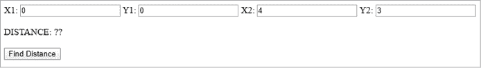

图 10-2：*pythagoras.html* 网页截图

在图 10-2 中看到的值是表单中填充的默认值。距离字段下方显示为“??”，用户可以在此输入坐标。当我们点击 **Find Distance** 时，距离应该是 5。我们使用 3-4-5 三角形来测试这个距离计算器。只要 x 轴的距离为 3，y 轴的距离为 4，那么两点之间的距离就是 5，因为 3² + 4² = 5²，正如图 10-3 所示。


图 10-3：使用 3-4-5 三角形

当你点击应用中的 **Find Distance** 按钮时，你将看到 DISTANCE 字段填充了值 5，如图 10-4 所示。

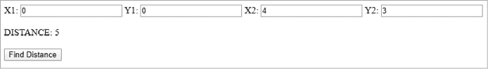

图 10-4：计算出的 3-4-5 三角形距离

当我们将 X 和 Y 值都改变相同的量时，两点之间的距离应该保持不变。然而，由于我们故意引入的一个 bug，将 1 加到 Y1 和 Y2 后，DISTANCE 字段中显示的值是错误的（见图 10-5）。

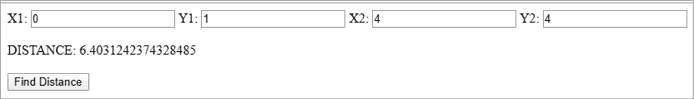

图 10-5：计算距离中的错误

我们应该仍然在 DISTANCE 字段中看到 5，但实际上这是一个完全不同的数字。我们需要追踪出错的原因；第一步是在线程中添加 `log` 语句。

如我们所知，在 WAT 中直接处理字符串并不是一项简单的任务。因此，为了逐步调试代码，我们使用一个消息 ID 以及从 WebAssembly 模块传递给 JavaScript 的值。使用清单 10-3，修改*pythagoras.wat* 文件，在 `$distance` 函数中调用 `$log_f64`。

**pythagoras.wat**

```
...
(func $distance (export "distance")
  (param $x1 f64) (param $y1 f64) (param $x2 f64) (param $y2 f64) (result f64)
  (local $x_dist f64)
  (local $y_dist f64)
  (local $temp_f64 f64)

  local.get $x1
  local.get $x2
  f64.sub             ;; $x1 - $x2

  local.tee $x_dist   ;; $x_dist = $x1 - $x2

1 (call $log_f64 (i32.const 1) (local.get $x_dist))

  local.get $x_dist
  f64.mul             ;; $x_dist * $x_dist on stack

2 local.tee $temp_f64 ;; used to hold top of the stack without changing it
3 (call $log_f64 (i32.const 2) (local.get $temp_f64))

  local.get $y1
  local.get $y2
  f64.add             ;; should be $y1 - $y2
  local.tee $y_dist   ;; $y_dist = $y1 - $y2

4 (call $log_f64 (i32.const 3) (local.get $y_dist))

  local.get $y_dist
  f64.mul             ;; $y_dist * $y_dist on stack

5 local.tee $temp_f64 ;; used to hold top of the stack without changing it
6 (call $log_f64 (i32.const 4) (local.get $temp_f64))

  f64.add             ;; $x_dist * $x_dist + $y_dist * $y_dist on stack

7 local.tee $temp_f64 ;; used to hold top of the stack without changing it
8 (call $log_f64 (i32.const 5) (local.get $temp_f64))

  f64.sqrt            ;; take the square root of x squared plus y squared

9 local.tee $temp_f64 ;; used to hold top of the stack without changing it
a (call $log_f64 (i32.const 6) (local.get $temp_f64))
)
...
```

清单 10-3：更新后的*pythagoras.wat*文件，添加了 JavaScript 函数调用以记录 f64 变量

我们在这里的几个位置添加了对 `$log_f64` 函数的调用（13468a）。`$log_f64` 的第一个参数是消息 ID，这是一个整数，我们将使用它作为此消息的唯一标识符。稍后我们会使用这个 ID 从 JavaScript 输出特定的消息。

第二个参数是一个 64 位浮点值，它可以在多个不同的阶段显示我们的距离计算值。在其中一些调用中，我们希望记录栈顶的值，但*不*将其移除，因此我们使用 `local.tee`（2579）来设置 `$temp_f64` 的值，这会设置值但不从栈中移除它。然后我们使用 `$temp_f64` 中的值在调用 `$log_f64`（368a）时。

### 将消息记录到控制台

如前所述，WebAssembly 模块不能直接将消息记录到浏览器的控制台，并且 WAT 没有原生的字符串处理库。我们到目前为止使用的 `log_f64` 函数是通过 WebAssembly 模块从 JavaScript 导入的。所以，在清单 10-4 中，我们将在 JavaScript 中实现这个函数。

**pythagoras.html**

```
log_f64: function(message_index, value) {
  console.log(`message #${message_index} value=${value}`);
}
```

清单 10-4：*pythagoras.wat* 调用的 JavaScript 函数

这是一个相当直接的版本，它记录了消息索引和数值，但没有根据任何 `message_index` 值自定义消息。要在 Chrome 中查看控制台，我们将打开开发者工具。进入浏览器菜单并点击 **更多工具**（图 10-6）。

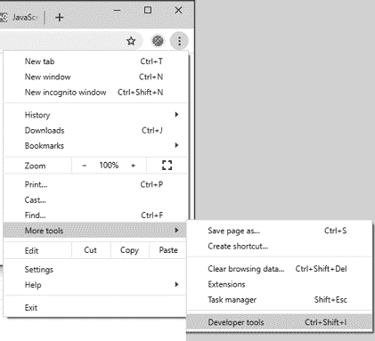

图 10-6：打开 Chrome 开发者工具

点击 **开发者工具**，然后点击 **控制台** 标签页以查看控制台，如图 10-7 所示。

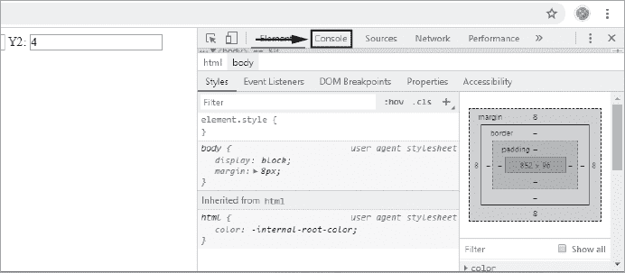

图 10-7：打开 Chrome 控制台

要在 Firefox 中打开控制台，点击 Firefox 浏览器菜单中的 **Web 开发者** 子菜单，如图 10-8 所示。

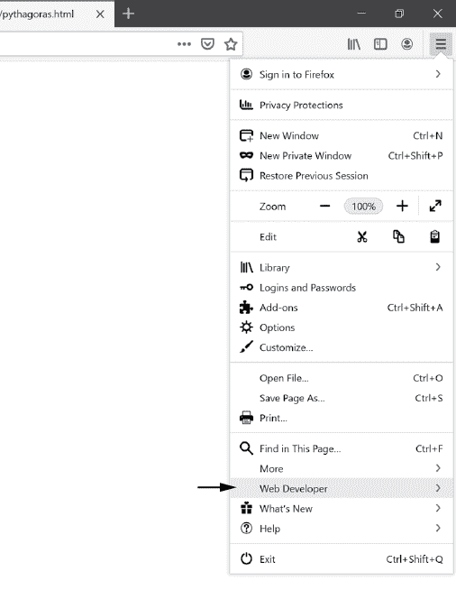

图 10-8：打开 Firefox Web 开发者菜单

点击 **Web 控制台**，如图 10-9 所示。

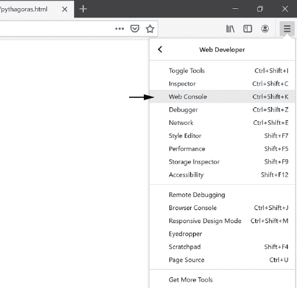

图 10-9：打开 Firefox Web 控制台

你的 Firefox 屏幕应该类似于图 10-10 所示。

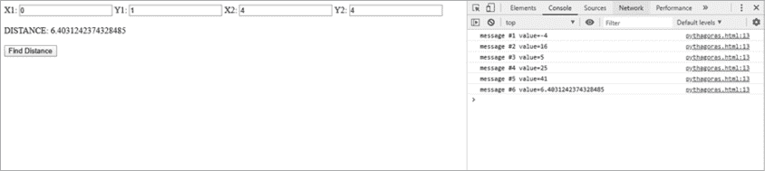

图 10-10：在 Web 控制台中显示消息

所有消息都以 `message #` 开头，后面跟着消息 ID。

这种消息通常已足够，但我们将对函数进行修改，记录更具体的消息。例如，如果你在跟踪每条消息的意义时遇到困难，可能希望消息更具体。你可以像清单 10-5 那样操作，或者根据不同的情况，拥有一系列不同的日志函数。

**pythagoras.html**

```
log_f64: function(message_index, value) {
  switch( message_index ) {
    case 1:
      console.log(`$x_dist=${value}`);
      break;
 case 2:
      console.log(`$x_dist*$x_dist=${value}`);
      break;
     case 3:
       console.log(`$y_dist=${value}`);
       break;
     case 4:
       console.log(`$y_dist*$y_dist=${value}`);
       break;
     case 5:
       console.log(`$y_dist*$y_dist + $x_dist*$x_dist=${value}`);
       break;
     case 6:
       console.log(`dist=${value}`);
       break;
     default:
       console.log(`message #${message_index} value=${value}`);
     }
   }
```

清单 10-5：更新了*pythagoras.html*，以显示更详细的消息

有六条消息，因此我们在`message_index`参数上创建了一个开关，根据`message_index`的不同值，将不同的消息打印到控制台。该开关有一个默认值，在`message_index`出现意外值时，显示原始消息。更改这些消息后，控制台输出应类似于图 10-11。

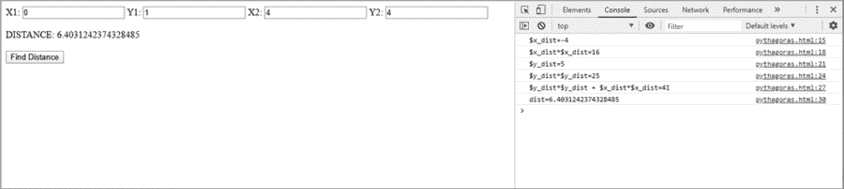

图 10-11：描述性消息记录到控制台

## 使用警告

接下来，我们将使用 JavaScript 警告来暂停代码执行，给你时间查看日志消息。在此任务中，我们将使用`alert`函数，它会打开一个带有错误文本的对话框。请注意，过度使用警告会使检查日志变得耗时，因此最好适度使用它们。

在早期的`log_f64`示例中，你可能希望在某个特定的情况执行时立即提醒用户。`alert`会停止代码执行并弹出窗口通知用户。你只应在调试时，在需要立即注意的特殊情况下使用`alert`。在清单 10-6 中，我们将`case 1:`的代码更改为在弹出窗口中显示警告，而不是输出到控制台。将`log_f64`函数的开始部分更改为清单 10-6 所示。

**pythagoras.html**

```
log_f64: function(message_index, value) {
  switch( message_index ) {
    case 1:
    1 alert(`$x_dist=${value}`);
      break;
```

清单 10-6：更新*pythagoras.html*文件，以调用来自`log_f64`的警告。

我们将`console.log`函数调用更改为`alert` 1，当`message_index`为 1 时显示警告框。结果如图 10-12 所示，应在浏览器中显示。

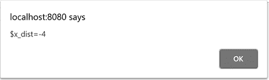

图 10-12：显示警告框

## 堆栈跟踪

*堆栈跟踪*显示了调用过的函数列表，直到当前代码的这一点。例如，如果函数 A 调用函数 B，函数 B 又调用函数 C，随后执行堆栈跟踪，那么堆栈跟踪将显示函数 C、B 和 A，以及调用这些函数的行。WebAssembly 并不直接提供这个功能，因此就像向控制台输出日志一样，我们从 JavaScript 调用堆栈跟踪。调用的函数链应类似于图 10-13。

我们通过调用 JavaScript 的`console.trace`函数来显示堆栈跟踪。当前，Firefox 和 Chrome 提供的堆栈跟踪差异较大。使用 Firefox 中的 `console.trace`，你可以获取比在 Chrome 浏览器中更多的有关 WAT 文件的信息。Firefox 浏览器将 WebAssembly 二进制文件转换为 WAT 文件，并为你提供一个指向该反汇编 WAT 文件中行号的堆栈跟踪。另一方面，Chrome 给出的只是一个指向函数索引的引用，如果你不熟悉它，可能会显得相当晦涩。


图 10-13：函数 1 调用函数 2，函数 2 调用函数 3，函数 3 调用函数 4，堆栈跟踪中的函数调用

创建一个名为 *stack_trace.wat* 的文件，并将 列表 10-7 中的代码添加到文件中。

**stack_trace.wat**

```
(module

1 (import "js" "log_stack_trace" (func $log_stack_trace (param i32)))

2 (func $call_level_1 (param $level i32)
    local.get $level
    call $log_stack_trace
  )

3 (func $call_level_2 (param $level i32)
    local.get $level
    call $call_level_1
  )

4 (func $call_level_3 (param $level i32)
    local.get $level
    call $call_level_2
  )

5 (func $call_stack_trace (export "call_stack_trace")
 6 (call $log_stack_trace (i32.const 0))
    (call $call_level_1 (i32.const 1))
    (call $call_level_2 (i32.const 2))
    (call $call_level_3 (i32.const 3)) 
  )
)
```

列表 10-7：演示堆栈跟踪调用的 WebAssembly 模块

这个 WebAssembly 模块从 JavaScript 导入 `log_stack_trace` 1 函数，该函数将调用嵌入的 JavaScript 中的 `console.trace`。我们定义了四个额外的函数，演示每个浏览器如何记录 WebAssembly 调用栈。导入的函数 `$log_stack_trace` 由 `$call_stack_trace` 和 `$call_level_1` 2 调用。函数 `$call_level_1` 由 `$call_stack_trace` 和 `$call_level_2` 3 调用。函数 `$call_level_2` 由 `$call_stack_trace` 和 `$call_level_3` 4 调用。最后，`$call_level_3` 由 `$call_stack_trace` 调用。我们通过嵌套这些函数调用，展示从不同函数级别调用时堆栈跟踪的样子。

注意，`$call_stack_trace` 5 调用了其他每个函数。首先，它直接调用 `$log_stack_trace`，并传递一个常量 `0`。接下来，它调用 `$call_level_1`，该函数调用 `$log_stack_trace`，并传递一个常量值 `1`。当堆栈跟踪被记录时，它应显示 `$call_level_1`、`$log_stack_trace` 6 和 `$call_stack_trace` 在调用栈中。`$call_level_2` 和 `$call_level_3` 函数会分别添加更多层级，这些层级将在堆栈跟踪中显示。

现在，创建一个名为 *stack_trace.html* 的新文件，并将 列表 10-8 中的代码添加到文件中。

**stack_trace.html**

```
<!DOCTYPE html>
<html lang="en">
<body>
    <h1>Stack Trace</h1>
    <script>
      let importObject = {
        js: {
          1 log_stack_trace: function( level ) {
                console.trace(`level=${level}`);
          }
        }
      };

      ( async () => {
        let obj =
          await WebAssembly.instantiateStreaming( fetch('stack_trace.wasm'),
                                                  importObject );
       obj.instance.exports.call_stack_trace();

      })();
    </script>
</body>
</html>
```

列表 10-8：带有 JavaScript 调用堆栈跟踪的 HTML 文件

这是一个非常基础的 HTML 文件，类似于*pythagoras.html*。主要的代码是定义在 `importObject` 内的 `log_stack_trace` 函数 1，它调用 JavaScript 函数 `console.trace`，并传递一个字符串，该字符串会在堆栈跟踪之前打印到控制台。保存此 HTML 文件后，在 Firefox 浏览器中打开，你应该会看到类似 图 10-14 的控制台日志。

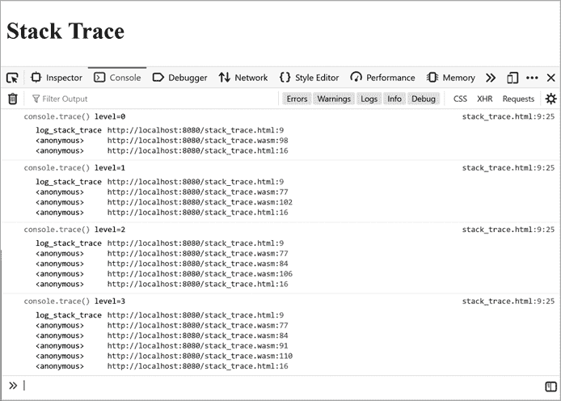

图 10-14：在 Firefox 中显示堆栈跟踪

如你所见，第一个堆栈跟踪是通过`level=0`记录的，因为我们直接将`0`作为值传递给 WAT 代码中对`$log_stack_trace`的首次调用。这是从 WebAssembly 函数`$call_stack_trace`到导入的 JavaScript 函数的直接调用。由于第一次调用是直接调用`$log_stack_trace`，因此在这个第一个堆栈跟踪中，*stack_trace.wasm*文件只有一个堆栈帧被记录。该日志表明堆栈跟踪是从*stack_trace.wasm*的第 98 行执行的。这不一定是你 WAT 文件中的第 98 行；你需要在浏览器中查看 WAT，看看它指的是哪一行。每个堆栈跟踪都会在 WebAssembly 文件中添加一个额外的函数调用，因为我们为每次调用`$log_stack_trace`添加了额外的函数层。注意，在每个堆栈跟踪中，*stack_trace.wasm*内部都会出现额外的一行，该行出现在堆栈跟踪中。

点击其中一行，Firefox 会打开*stack_trace.wasm*文件，并定位到代码中发生函数调用的位置。

如果你还没有在 Firefox 调试器中打开*stack_trace.wasm*，你可能会被提示刷新浏览器页面以查看作为反汇编 WAT 显示的内容。当*stack_trace.wasm*打开到字节 98 时，你应该在 Firefox 调试器控制台中看到类似于图 10-15 的内容。

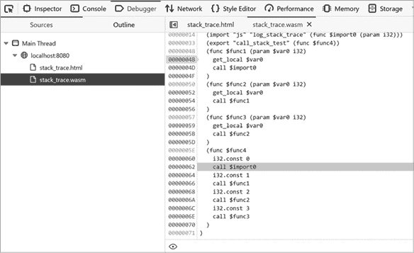

图 10-15：点击*stack_trace.wasm*中的位置显示 WAT 代码

发出调用的行会暂时以灰色高亮显示。注意左侧的字节数（62）是十六进制的，不像控制台日志中的字节是十进制数字 98\。

Chrome 不在 WAT 文件中显示每个堆栈跟踪的字节数；相反，它看起来像是图 10-16。

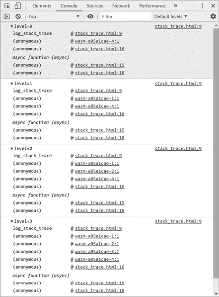

图 10-16：在 Chrome 中显示堆栈跟踪

在 Chrome 浏览器中，行号总是 1\。但是，当你点击控制台中的链接时，Chrome 会打开该特定函数的反汇编版本。所有 WebAssembly 函数都以`wasm-`为前缀，后跟函数的索引，再加上`:1`。点击堆栈跟踪中出现的第一个 WebAssembly 函数时，应该像图 10-17 所示。

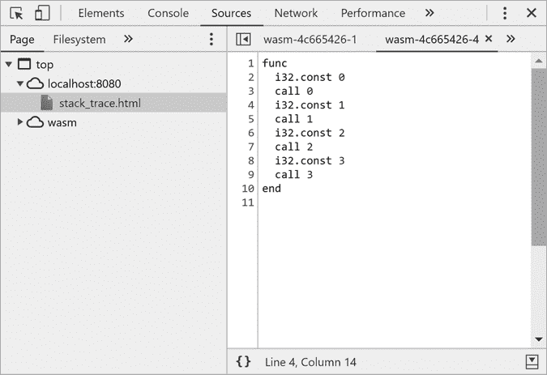

图 10-17：点击 Chrome 中的堆栈跟踪显示 WebAssembly 函数。

在 Chrome 中，反汇编后的函数与 Firefox 中的不同。我们将在下一节中更详细地讨论这些差异。现在，注意 Chrome 使用变量和函数索引而不是标签进行反汇编，这使得阅读起来更具挑战性。

堆栈跟踪在你尝试弄清楚某些函数如何执行时非常有用。当你不确定一个函数是如何被调用时，堆栈跟踪可能会成为救命稻草。接下来，让我们看看 Firefox 和 Chrome 中的调试器代码。

## Firefox 调试器

在这一节中，我们将编写一些可以在调试器中逐步执行的代码。首先，花点时间查看 *pythagoras.html* 和 *pythagoras.wat* 文件。我们故意引入了一个 bug，以便在调试器中追踪它。我们将修改 *pythagoras.wat* 文件，移除向 JavaScript 输出日志的调用，以便我们可以在调试器中逐步执行。创建一个名为 *debugger.wat* 的文件，并添加 清单 10-9 中的代码，或者简单地从 *pythagoras.wat* 中移除日志调用并重新保存文件。

**debugger.wat**

```
(module
  (func $distance (export "distance")
    (param $x1 f64) (param $y1 f64) (param $x2 f64) (param $y2 f64)
    (result f64)
    (local $x_dist f64)
    (local $y_dist f64)

    local.get $x1
    local.get $x2
    f64.sub             ;; $x1 - $x2
    local.tee $x_dist   ;; $x_dist = $x1 - $x2    local.get $x_dist
    f64.mul             ;; $x_dist * $x_dist on stack
    local.get $y1
    local.get $y2
   f64.add             ;; Should be $y1 - $y2    local.tee $y_dist   ;; $y_dist = $y1 - $y2
    local.get $y_dist
    f64.mul             ;; $y_dist * $y_dist on stack
    f64.add             ;; $x_dist * $x_dist + $y_dist * $y_dist on stack
    f64.sqrt            ;; take the square root of x squared plus y squared
  )
)
```

清单 10-9：我们通过移除日志调用来修改 *pythagoras.wat*。

之前，我们通过将 `$y1` 加到 `$y2` 上，而不是相减，故意引入了一个有时会给出不正确结果的 bug。将 *pythagoras.html* 复制到一个名为 *debugger.html* 的新文件中，并将 `<script>` 标签内的 JavaScript 代码改为加载 *debugger.wasm*。然后删除 `importObject`，使其看起来像 清单 10-10 中的代码。

**pythagoras.html**

```
...
<script>
  var distance = null;

  ( async () => {
    let obj = await WebAssembly.instantiateStreaming( fetch(**'debugger.wasm'**) );

    distance = obj.instance.exports.distance;

  })();
  function set_distance() {
    let dist_out = document.getElementById('dist_out');
    let x1 = document.getElementById('x1');
    let x2 = document.getElementById('x2');
    let y1 = document.getElementById('y1');
 let y2 = document.getElementById('y2');

    let dist = distance(x1.value, y1.value, x2.value, y2.value);
    dist_out.innerHTML = dist;
  }
</script>
...
```

清单 10-10：测试 *debugger.wasm* 的 HTML 文件

将 *debugger.html* 加载到 Firefox 中并打开控制台；然后点击 **调试器** 标签，进入 Firefox 调试器。在左侧的 **Sources** 标签下，选择 *debugger.wasm*，查看反汇编版本的 WAT 代码，应该类似于 图 10-18。


图 10-18：Firefox 调试器中的 WAT 代码

这段代码是 WebAssembly 二进制的反汇编，因此现在函数和变量的名称不再可用。这个结果类似于你反汇编一个从网上找到的二进制文件。由于在 *wat2wasm* 中还没有源映射功能，我们无法在调试器中逐步执行原始源代码。相反，你需要将原始代码和反汇编代码进行并排比较。清单 10-11 显示了反汇编代码的样子。

```
(module

  (type $type0 (func (param f64 f64 f64 f64) (result f64)))
  (export "distance" (func $func0))
1 (func $func0
    (param 2$var0 f64)(param 3$var1 f64)(param 4$var2 f64)(param 5$var3 f64)
    (result f64)
    (local 6$var4 f64) (local 7$var5 f64)
    local.get $var0
 local.get $var2
    f64.sub
    local.tee $var4
    local.get $var4
    f64.mul
    local.get $var1
    local.get $var3
    f64.add
    local.tee $var5
    local.get $var5
    f64.mul
    f64.add
    f64.sqrt
  )
)
```

清单 10-11：Firefox 反汇编生成的 WAT 代码

这段代码是从 WebAssembly 二进制文件反汇编而来的，并没有意识到我们为变量或函数所给的标签。它也无法识别代码中的任何注释。如果你回头查看原始的 WAT 代码(清单 10-9)，你可以看到函数`$distance`变成了`$func0` 1。参数变量`$x1`、`$y1`、`$x2` 和 `$y2` 分别变成了`$var0` 2、`$var1` 3、`$var2` 4 和`$var3` 5。局部变量`$x_dist` 和 `$y_dist` 变成了`$var4` 6 和`$var5` 7。了解原始变量与反汇编变量之间的对应关系后，你就可以逐步执行代码，知道每个变量的用途。要查看这些变量的值，你可以将它们输入到右侧的 Watch 表达式窗口中，去掉 `$` 符号。在 Watch 窗口中，你可以通过输入 `var0` 来查看`$var0`变量。我使用一个简单的技巧来跟踪哪个变量对应哪个。我在我的 Watch 表达式中添加 JavaScript 注释，标记该变量的原始名称。例如，我可能会在 Watch 表达式中输入 `$var0` 为 `var0 // $x1`。图 10-19 展示了 Watch 表达式中的效果。

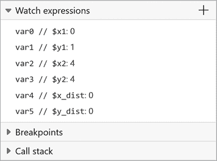

图 10-19：在 Firefox 中使用注释的 Watch 表达式

要逐步执行 WAT 代码，请确保已选择 WebAssembly 文件。我们需要创建一个断点，这是调试器停止执行代码的地方，以便你可以逐行查看代码。要设置断点，请点击 WAT 代码左侧的字节编号。在右侧的 Watch 表达式窗口中，你可以看到变量的变化。设置好断点后，通过点击**查找距离**(图 10-20)来执行 WebAssembly 代码。

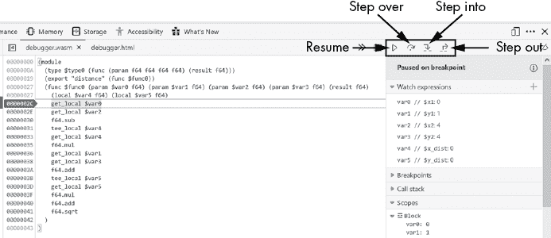

图 10-20：在 Firefox 调试器中设置断点

当执行到达断点时，点击位于 Watch 表达式上方的**逐步跳过**按钮 。这将允许你逐行执行代码。要进入一个函数而不是执行它，请点击**逐步进入**按钮 ，该按钮位于**逐步跳过**按钮旁边。如果你想跳出当前的函数，点击**逐步跳出**按钮 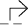。如果你希望调试器继续执行，直到达到另一个断点，点击**恢复**按钮 ，它看起来像一个播放按钮。

要定位代码中的错误，请点击**逐步跳过**按钮，直到到达 3D 行。此时，`var5` 已设置，我们可以在 Watch 表达式窗口中看到其值，如图 10-21 所示。

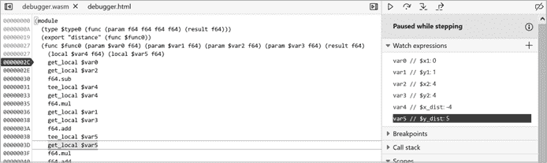

图 10-21：在 Firefox 调试器中逐步执行代码

注意，当`Y1`被设置为`1`，`Y2`被设置为`4`时，`$y_dist`被设置为`5`。这意味着`$y_dist`本应是`3`。之前，我们将编号为 3A 的行从`f64.sub`改为`f64.add`，引入了这个错误。通过在调试器中逐行单步执行代码，我们找到了问题所在。

## Chrome 调试器

在 Chrome 中调试 WebAssembly 与在 Firefox 中调试相同的代码有所不同。WAT 代码不会按 WebAssembly 文件进行分解；相反，Chrome 会按函数对 WAT 代码进行分组。WebAssembly 函数末尾的数字是一个索引号，基于你在代码中定义函数的位置。

要进入调试器，打开 Chrome 的**开发者工具**并点击**Sources**标签。在名为 Page 的部分下，你应该看到一个标有`wasm`的云图标。展开此分支，可以看到每个在 WebAssembly 模块中定义的函数的页面。因为我们在这个模块中只定义了一个函数，所以只有一个函数存在。点击该函数，在右侧窗口中显示该函数的代码。在该窗口中，在包含代码`local.get` `0`的第 3 行设置断点（图 10-22）。

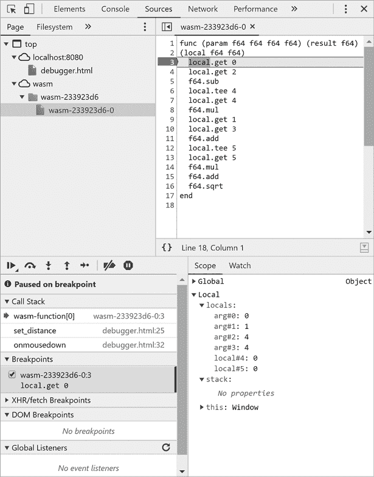

图 10-22：在 Chrome 调试器中设置断点

注意到`local.get`获取的是一个数字而不是变量名。原因是，在`local.get`后面跟着一个数字时，会根据索引而不是名称获取局部变量。使用`local.get 0`等同于在 Firefox 浏览器中的`local.get` `$var0`。像在 Firefox 中一样，你可以查看代码，并将其与函数中的代码进行匹配。清单 10-12 展示了在 Chrome 调试器中显示的代码。

```
1 func (param f64 f64 f64 f64) (result f64)
2 (local f64 f64)
  local.get 0
  local.get 2
  f64.sub
  local.tee 4
  local.get 4
  f64.mul
  local.get 1
  local.get 3
  f64.add
  local.tee 5
  local.get 5
  f64.mul
  f64.add
  f64.sqrt
end
```

清单 10-12：Chrome 调试器中的 WAT 反汇编

注意，Chrome 使用索引来表示局部变量、参数和函数。函数 1 没有与之关联的名称，它的任何参数或局部变量 2 也没有名称。全局变量和类型也是如此。如果我们使用全局变量，我们将使用`global.get`和`global.set`，并传入一个与变量定义顺序相对应的索引号。

Chrome 调试功能的一个优点是你可以在作用域窗口中访问堆栈。在逐步执行代码时，你可以看到值被推送到堆栈中，并从堆栈中弹出。一个缺点是，Watch 窗口的用处远不如在 Firefox 中，因为 Chrome 不会像在 JavaScript 变量那样使变量可用。

和 Firefox 一样，Chrome 有一个 Resume 按钮 、一个 Step over 按钮 、一个 Step into 按钮 和一个 Step out 按钮 ，如图 10-23 所示。

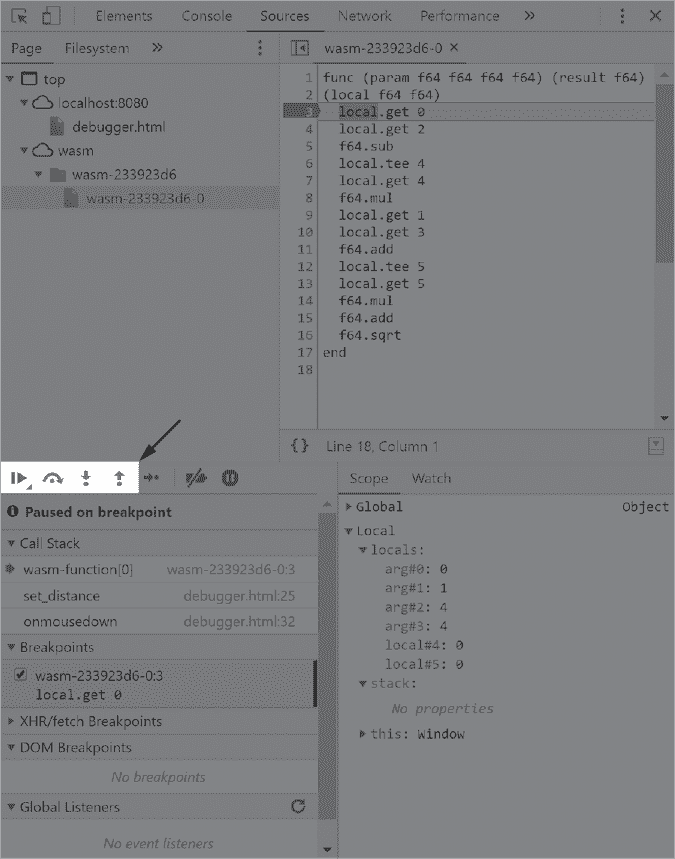

图 10-23：在 Chrome 调试器中查看堆栈

## 总结

在本章中，我们使用了多种不同的技术在 Chrome 和 Firefox 中调试 WAT 代码。我们对控制台日志记录进行了比之前章节更深入的探讨。接着，我们使用了 JavaScript 的`alert`函数来暂停执行并等待用户指令。我们还探索了使用*console.trace*来记录堆栈跟踪，并讨论了 Chrome 和 Firefox 中堆栈跟踪的工作方式差异。最后，我们使用了 Chrome 和 Firefox 内置的调试器。

调试 WebAssembly 有多种可用选项。其中一些选项，例如使用 Chrome 或 Firefox 调试器，仍在开发中。你选择使用的工具将取决于代码和调试时的目标。在下一章中，我们将使用 WebAssembly 构建 Node.js 模块。
