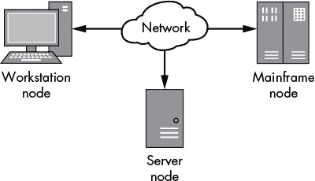
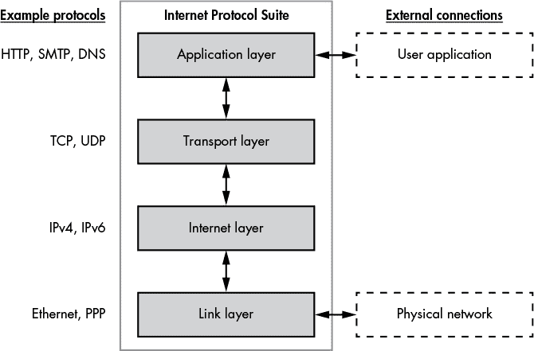
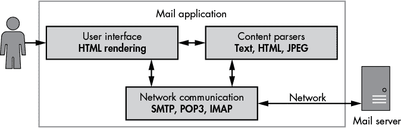
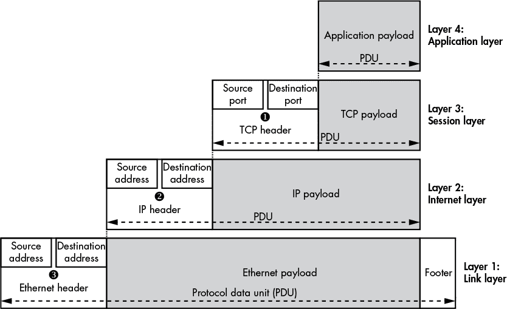
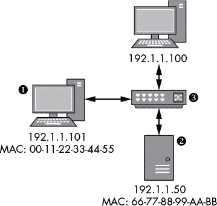
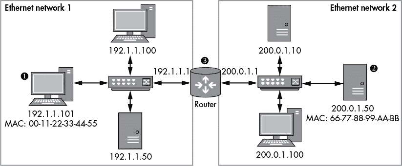
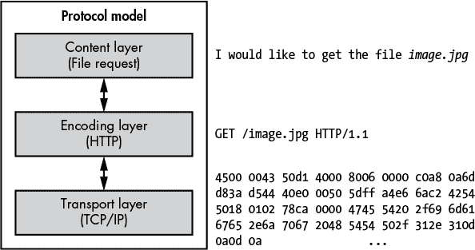
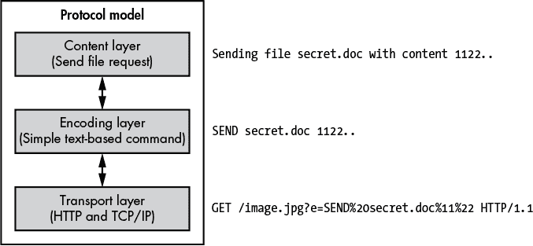

## **1**

**网络基础**

要攻克网络协议，你需要了解计算机网络的基础知识。你对常见网络的构建和运作方式了解得越多，应用这些知识来捕获、分析和利用新协议就越容易。

在本章中，我将介绍你在分析网络协议时每天都会遇到的基本网络概念。我还将为你提供一种思考网络协议的方法，使得在分析过程中更容易发现以前未曾察觉的安全问题。

### **网络架构和协议**

让我们从回顾一些基本的网络术语开始，并提出一个根本性的问题：什么是网络？一个*网络*是由两个或更多计算机通过连接共享信息的集合。通常会将每个连接的设备称为网络上的*节点*，以便这个描述适用于更广泛的设备。图 1-1 展示了一个非常简单的示例。

*图 1-1：一个简单的三节点网络*

图中展示了三个节点通过一个公共网络连接。每个节点可能有不同的操作系统或硬件。但只要每个节点遵循一套规则，或*网络协议*，它就可以与网络上的其他节点进行通信。为了正确通信，网络上的所有节点必须理解相同的网络协议。

一个网络协议有许多功能，其中包括以下一种或多种：

**保持会话状态** 协议通常实现机制来创建新的连接和终止现有连接。

**通过寻址识别节点** 数据必须传输到网络上的正确节点。一些协议实现了寻址机制，用以识别特定节点或节点组。

**控制流量** 通过网络传输的数据量是有限的。协议可以实现管理数据流的方法，以提高吞吐量并减少延迟。

**保证传输数据的顺序** 许多网络不能保证数据发送的顺序与接收的顺序一致。一个协议可以重新排序数据，以确保数据按正确顺序传递。

**检测和纠正错误** 许多网络并不是百分之百可靠的；数据可能会损坏。检测损坏并理想地进行修复是非常重要的。

**格式化和编码数据** 数据并不总是以适合在网络上传输的格式存在。一个协议可以指定数据的编码方式，例如将英文文本编码为二进制值。

### **互联网协议套件**

TCP/IP 是现代网络使用的事实标准协议。虽然你可以将 TCP/IP 看作一个单一的协议，但它实际上是由两个协议组合而成：*传输控制协议（TCP）*和*互联网协议（IP）*。这两个协议是*互联网协议套件（IPS）*的一部分，互联网协议套件是一个概念模型，描述了网络协议如何通过互联网发送网络流量，将网络通信分解为四个层次，如图 1-2 所示。

*图 1-2：互联网协议套件层次*

这四个层次构成了一个*协议栈*。以下列表解释了 IPS 的每一层：

**链路层（层 1）** 这一层是最低层，描述了用于在本地网络节点之间传输信息的物理机制。知名的例子包括以太网（有线和无线）和点对点协议（PPP）。

**互联网层（层 2）** 这一层提供了用于网络节点寻址的机制。与层 1 不同，节点不必位于本地网络中。这个层次包含了 IP；在现代网络中，实际使用的协议可以是版本 4（IPv4）或版本 6（IPv6）。

**传输层（层 3）** 这一层负责客户端与服务器之间的连接，有时确保数据包的正确顺序并提供服务复用。服务复用允许单个节点通过为每个服务分配不同的编号来支持多个不同的服务；这个编号被称为*端口*。TCP 和用户数据报协议（UDP）在这一层上运行。

**应用层（层 4）** 这一层包含了网络协议，如*超文本传输协议（HTTP）*，用于传输网页内容；*简单邮件传输协议（SMTP）*，用于传输电子邮件；*域名系统（DNS）协议*，用于将名称转换为网络中的节点。在本书中，我们将主要关注这一层。

每一层只与上下层交互，但必须与栈外部进行某些交互。图 1-2 展示了两个外部连接。链路层与物理网络连接交互，通过物理介质（如电信号或光脉冲）传输数据。应用层与用户应用程序交互：*应用程序*是一个相关功能的集合，为用户提供服务。图 1-3 展示了一个处理电子邮件的应用程序的例子。邮件应用程序提供的服务是通过网络发送和接收消息。

*图 1-3：邮件应用程序示例*

通常，应用程序包含以下组件：

**网络通信** 该组件通过网络进行通信，并处理进出数据。对于邮件应用程序，网络通信最有可能是标准协议，如 SMTP 或 POP3。

**内容解析器** 通过网络传输的数据通常包含必须提取和处理的内容。内容可能包括文本数据，如邮件正文，或可能是图片或视频。

**用户界面（UI）** UI 允许用户查看已接收的邮件并创建新的邮件进行传输。在邮件应用程序中，UI 可能会使用 HTML 在 Web 浏览器中显示邮件。

请注意，与 UI 交互的用户不一定是人类。它也可以是一个自动化工具，通过命令行工具发送和接收邮件的其他应用程序。

### **数据封装**

IPS 中的每一层都建立在下层之上，每一层能够封装来自上一层的数据，使其能够在层之间传输。每层传输的数据被称为*协议数据单元（PDU）*。

#### ***头部、尾部和地址***

每一层中的 PDU 包含正在传输的有效载荷数据。通常会在有效载荷数据前加上*头部*——它包含传输有效载荷数据所需的信息，如网络中源节点和目标节点的*地址*。有时，PDU 还会有一个*尾部*，它被附加到有效载荷数据后面，包含确保正确传输所需的值，例如错误检查信息。图 1-4 展示了 PDU 在 IPS 中的布局。

*图 1-4：IPS 数据封装*

TCP 头部包含源端口和目标端口号 ➊。这些端口号允许单个节点拥有多个独特的网络连接。TCP（和 UDP）的端口号范围为 0 到 65535。大多数端口号会根据需要分配给新的连接，但有些端口号已经被特别指定，例如 HTTP 的端口 80。（你可以在大多数类 Unix 操作系统的*/etc/services*文件中找到当前的端口号分配列表。）TCP 的有效载荷和头部通常称为*段*，而 UDP 的有效载荷和头部通常称为*数据报*。

IP 协议使用源地址和目标地址 ➋。*目标地址*使数据能够发送到网络中的特定节点。*源地址*使接收数据的节点知道是哪个节点发送了数据，并允许接收方回复发送者。

IPv4 使用 32 位地址，通常以四个数字用点分隔的形式表示，例如 192.168.10.1。IPv6 使用 128 位地址，因为 32 位地址不足以满足现代网络中节点的数量。IPv6 地址通常以冒号分隔的十六进制数表示，例如 fe80:0000:0000:0000:897b:581e:44b0:2057。连续的 0000 数字会被压缩成两个冒号。例如，前面的 IPv6 地址也可以写成 fe80::897b:581e:44b0:2057。IP 有效负载和头部通常被称为*数据包*。

以太网还包含源地址和目标地址➌。以太网使用一个 64 位值，称为*媒体访问控制（MAC）*地址，通常在以太网适配器制造时设定。MAC 地址通常以一系列用短横线或冒号分隔的十六进制数字表示，例如 0A-00-27-00-00-0E。以太网的有效负载，包括头部和尾部，通常被称为*帧*。

#### ***数据传输***

让我们简要看看如何使用 IPS 数据封装模型将数据从一个节点传输到另一个节点。图 1-5 显示了一个简单的以太网网络，包含三个节点。

*图 1-5：一个简单的以太网网络*

在这个例子中，位于➊的节点，其 IP 地址为 192.1.1.101，想要通过 IP 协议向位于➋的节点（IP 地址为 192.1.1.50）发送数据。（*交换机*设备➌在网络中的所有节点之间转发以太网帧。交换机不需要 IP 地址，因为它仅在链路层操作。）以下是两个节点之间传输数据时发生的过程：

1.  操作系统的网络协议栈节点➊封装应用层和传输层的数据，并构建一个 IP 数据包，源地址为 192.1.1.101，目标地址为 192.1.1.50。

1.  操作系统此时可以将 IP 数据封装为以太网帧，但可能不知道目标节点的 MAC 地址。它可以使用地址解析协议（ARP）请求特定 IP 地址的 MAC 地址，该协议向网络中的所有节点发送请求，以查找目标 IP 地址的 MAC 地址。

1.  一旦位于➊的节点收到 ARP 响应，它可以构建帧，将源地址设置为本地 MAC 地址 00-11-22-33-44-55，目标地址设置为 66-77-88-99-AA-BB。新的帧被传输到网络上，并由交换机➌接收。

1.  交换机将帧转发到目标节点，目标节点解包 IP 数据包并验证目标 IP 地址是否匹配。然后，IP 有效负载数据被提取并传递到协议栈，等待应用程序接收。

### **网络路由**

以太网要求所有节点直接连接到同一局域网。这个要求对真正的全球网络来说是一个主要限制，因为不可能将每个节点物理连接到每一个其他节点。为了避免要求所有节点都直接连接，源地址和目标地址允许数据在不同的网络上进行*路由*，直到数据到达所需的目的地节点，如图 1-6 所示。

*图 1-6：连接两个以太网网络的路由网络示例*

图 1-6 显示了两个以太网网络，每个网络有不同的 IP 网络地址范围。以下描述解释了 IP 如何利用该模型将数据从网络 1 上的节点➊发送到网络 2 上的节点➋。

1.  操作系统网络栈节点➊封装了应用层和传输层的数据，并构建了一个源地址为 192.1.1.101、目标地址为 200.0.1.50 的 IP 数据包。

1.  网络栈需要发送一个以太网帧，但由于目标 IP 地址在节点连接的任何以太网网络中都不存在，网络栈查询其操作系统的*路由表*。在此示例中，路由表包含了指向 IP 地址 200.0.1.50 的条目。该条目表明，IP 地址 192.1.1.1 的路由器➌知道如何到达该目标地址。

1.  操作系统使用 ARP 查找路由器 192.1.1.1 的 MAC 地址，原始 IP 数据包被封装在包含该 MAC 地址的以太网帧中。

1.  路由器接收到以太网帧并解包 IP 数据包。当路由器检查目标 IP 地址时，它发现该 IP 数据包不是发往路由器，而是发往另一个连接网络上的不同节点。路由器查找 200.0.1.50 的 MAC 地址，将原始 IP 数据包封装到新的以太网帧中，并将其发送到网络 2。

1.  目标节点接收到以太网帧，解包 IP 数据包并处理其内容。

这个路由过程可能会重复多次。例如，如果路由器没有直接连接到包含节点 200.0.1.50 的网络，它将查询自己的路由表，并确定可以将 IP 数据包发送到的下一台路由器。

显然，对于网络上的每个节点来说，知道如何到达互联网上的每个其他节点是不现实的。如果没有明确的路由条目指向某个目的地，操作系统会提供一个默认的路由表条目，称为*默认网关*，它包含了一个路由器的 IP 地址，该路由器可以将 IP 数据包转发到它们的目的地。

### **我的网络协议分析模型**

IPS 描述了网络通信的工作原理；然而，出于分析目的，大部分 IPS 模型是不相关的。使用我的模型更简单，可以理解应用程序网络协议的行为。我的模型包含三个层次，如图 1-7 所示，图中展示了我如何分析一个 HTTP 请求。

这是我的模型的三个层次：

**内容层** 提供了所传达内容的意义。在图 1-7 中，意义就是发出一个 HTTP 请求以获取文件 *image.jpg*。

**编码层** 提供了如何表示内容的规则。在这个例子中，HTTP 请求被编码为一个 HTTP GET 请求，指定了要检索的文件。

**传输层** 提供了关于如何在节点之间传输数据的规则。在这个例子中，HTTP GET 请求通过 TCP/IP 连接发送到远程节点的 80 端口。

*图 1-7：我的概念协议模型*

这样划分模型可以减少应用特定协议的复杂性，因为它可以让我们过滤掉与网络协议无关的细节。例如，因为我们并不关心 TCP/IP 如何发送到远程节点（我们理所当然地认为它会以某种方式到达那里），我们只是将 TCP/IP 数据视为一个简单的二进制传输，它就是能正常工作的。

为了理解为什么协议模型有用，考虑这个协议示例：假设你正在检查某些恶意软件的网络流量。你发现恶意软件使用 HTTP 从服务器接收操作员的命令。例如，操作员可能要求恶意软件列举感染计算机硬盘上的所有文件。文件列表可以返回到服务器，届时操作员可以请求上传特定的文件。

如果我们从操作员与恶意软件交互的角度来分析协议，例如请求上传一个文件，那么新协议会分解成图 1-8 中显示的各层。

*图 1-8：使用 HTTP 的恶意软件协议的概念模型*

以下列表解释了新协议模型的每一层：

**内容层** 恶意应用程序正在将一个名为 *secret.doc* 的被盗文件发送到服务器。

**编码层** 发送被盗文件的命令编码是一个简单的文本字符串，包含命令 `SEND`，后面跟着文件名和文件数据。

**传输层** 协议使用 HTTP 请求参数来传输命令。它使用标准的百分号编码机制，使其成为一个合法的 HTTP 请求。

注意，在这个例子中，我们没有考虑通过 TCP/IP 发送的 HTTP 请求；我们已将图 1-7 中的编码和传输层合并为图 1-8 中的传输层。虽然恶意软件仍然使用低层协议，如 TCP/IP，但这些协议对分析恶意软件命令发送文件并不重要。原因是我们可以将基于 TCP/IP 的 HTTP 视为一个单独的传输层，它能够正常工作，进而专注于恶意软件命令的独特性。

通过将我们的分析范围缩小到需要分析的协议层，我们可以避免大量工作，并专注于协议的独特方面。另一方面，如果我们使用图 1-7 中的协议层来分析该协议，我们可能会认为恶意软件只是请求了文件*image.jpg*，因为看起来好像 HTTP 请求只是这么做的。

### **结束语**

本章简要介绍了网络基础知识。我讨论了 IPS，包括一些你在实际网络中会遇到的协议，并描述了数据如何通过本地网络的节点以及通过路由传输到远程网络。此外，我还介绍了一种思考应用程序网络协议的方法，这应该有助于你集中注意协议的独特特性，从而加速其分析。

在第二章中，我们将使用这些网络基础知识来指导我们捕获网络流量进行分析。捕获网络流量的目标是访问你需要的数据，以便开始分析过程，识别正在使用的协议，并最终发现你可以利用的安全问题，从而破坏使用这些协议的应用程序。
