# 第二章：捕获应用程序流量

令人惊讶的是，捕获有用的流量可能是协议分析中的一个具有挑战性的方面。本章描述了两种不同的捕获技术：*被动*和*主动*。被动捕获不会直接与流量交互，而是提取其在*传输过程中*的数据，这一点在使用 Wireshark 等工具时应该很熟悉。你会发现不同的应用程序提供了不同的机制（这些机制有自己的优缺点）来重定向流量。主动捕获会干扰客户端应用程序和服务器之间的流量；这种方法具有强大的功能，但可能会带来一些复杂性。你可以将主动捕获理解为代理或甚至是中间人攻击。让我们更深入地了解主动和被动技术。

### **被动网络流量捕获**

被动捕获是一种相对简单的技术：通常不需要任何专门的硬件，也不需要编写自己的代码。图 2-1 展示了一个常见的场景：客户端和服务器通过以太网在网络上进行通信。

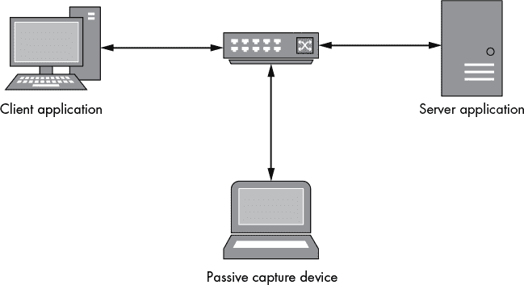

*图 2-1：被动网络捕获示例*

被动网络捕获可以通过在网络上以某种方式拦截经过的流量，或者通过直接嗅探客户端或服务器主机来进行。

### **Wireshark 快速入门**

Wireshark 可能是目前最受欢迎的数据包嗅探工具。它是跨平台的，易于使用，并且带有许多内置的协议分析功能。在第五章中，你将学习如何编写一个解码器来辅助协议分析，但现在，让我们设置 Wireshark 来捕获网络中的 IP 流量。

要从以太网接口（有线或无线）捕获流量，捕获设备必须处于*混杂模式*。处于混杂模式的设备接收并处理它看到的任何以太网帧，即使该帧并非为该接口所传送。捕获同一台计算机上运行的应用程序流量很简单：只需监控出站网络接口或本地回环接口（通常称为 localhost）。否则，您可能需要使用网络硬件，如集线器或配置过的交换机，来确保流量发送到您的网络接口。

图 2-2 显示了从以太网接口捕获流量时的默认视图。

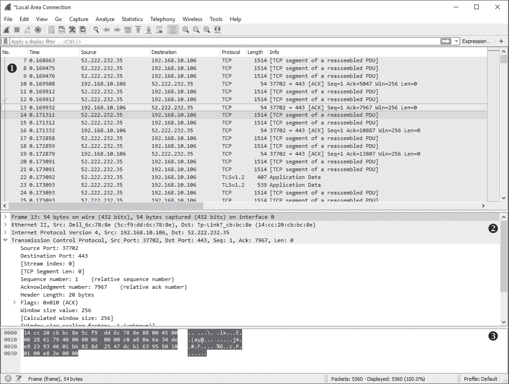

*图 2-2：Wireshark 默认视图*

有三个主要的视图区。区域 ➊ 显示了从网络捕获的原始数据包时间线。时间线提供了源和目标 IP 地址以及解码后的协议概要信息。区域 ➋ 提供了数据包的详细视图，分为多个协议层，分别对应 OSI 网络堆栈模型。区域 ➌ 显示了捕获的数据包的原始形式。

TCP 网络协议是基于流的，设计用来从丢失的数据包或数据损坏中恢复。由于网络和 IP 的特性，无法保证数据包会按照特定的顺序接收。因此，当你捕获数据包时，时间线视图可能难以解释。幸运的是，Wireshark 为已知协议提供了解析器，通常会重新组装整个流，并将所有信息集中展示。例如，在时间线视图中高亮显示一个 TCP 连接的数据包，然后从主菜单选择 **分析** ▸ **跟踪 TCP 流**。一个类似图 2-3 的对话框应该会出现。对于没有解析器的协议，Wireshark 可以解码流并以易于查看的对话框呈现出来。

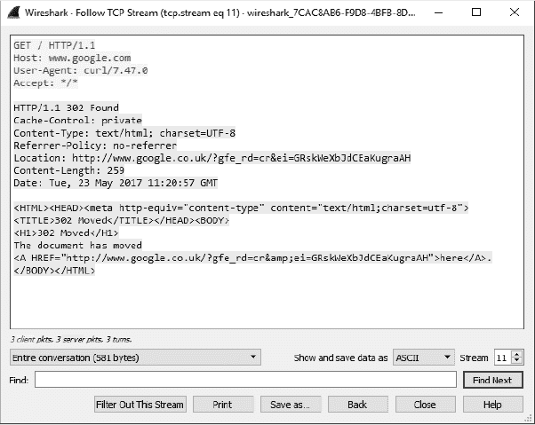

*图 2-3：跟踪 TCP 流*

Wireshark 是一款功能全面的工具，涵盖其所有功能超出了本书的范围。如果你不熟悉它，可以参考一本好的资料，比如 *Practical Packet Analysis, 第 3 版*（No Starch Press, 2017），学习其许多有用的功能。Wireshark 对于分析应用程序网络流量是必不可少的，并且在通用公共许可证（GPL）下免费提供。

### **替代的被动捕获技术**

有时候使用数据包嗅探器并不合适，例如在你没有权限捕获流量的情况下。你可能正在对一个没有管理权限的系统进行渗透测试，或者对一个权限有限的移动设备进行测试。你可能还只想确保你只查看正在测试的应用程序的流量。在使用数据包嗅探工具时，除非你根据时间关联流量，否则这并不容易做到。在这一节中，我将介绍几种不使用数据包嗅探工具从本地应用程序中提取网络流量的技术。

#### ***系统调用追踪***

许多现代操作系统提供两种执行模式。*内核模式*以较高的权限运行，包含实现操作系统核心功能的代码。*用户模式*是日常进程运行的地方。内核通过导出一组特殊的系统调用（参见图 2-4），向用户模式提供服务，允许用户访问文件、创建进程——以及对我们来说最重要的——连接到网络。


*图 2-4：通过系统调用进行用户与内核网络通信的示例*

当应用程序想要连接到远程服务器时，它会向操作系统的内核发出特殊的系统调用以打开连接。然后，应用程序会读取和写入网络数据。根据运行网络应用程序的操作系统，你可以直接监控这些调用，以被动地从应用程序中提取数据。

大多数类 Unix 系统实现了类似于伯克利套接字模型的网络通信系统调用。这并不令人惊讶，因为 IP 协议最初是在伯克利软件分发（BSD）4.2 Unix 操作系统中实现的。这个套接字实现也是 POSIX 的一部分，使其成为事实上的标准。表 2-1 展示了伯克利套接字 API 中的一些重要系统调用。

**表 2-1：** 常见的 Unix 网络系统调用

| **名称** | **描述** |
| --- | --- |
| `socket` | 创建一个新的套接字文件描述符。 |
| `connect` | 将套接字连接到已知的 IP 地址和端口。 |
| `bind` | 将套接字绑定到一个已知的本地 IP 地址和端口。 |
| `recv`, `read`, `recvfrom` | 通过套接字从网络接收数据。通用函数`read`用于从文件描述符读取，而`recv`和`recvfrom`则专用于套接字的 API。 |
| `send`, `write`, `sendfrom` | 通过套接字将数据发送到网络。 |

要了解这些系统调用是如何工作的，一个很好的资源是*《TCP/IP 指南》*（No Starch Press，2005）。网上也有很多相关资源，并且大多数类 Unix 操作系统都包括可以通过终端使用`man 2 syscall_name`命令查看的手册。现在让我们来看一下如何监视系统调用。

#### ***Linux 上的 strace 工具***

在 Linux 中，你可以直接监视用户程序的系统调用，而无需特殊权限，除非你要监视的应用程序以特权用户身份运行。许多 Linux 发行版包含了实用的工具`strace`，它为你做大部分工作。如果它没有默认安装，可以通过发行版的包管理器下载，或者从源代码编译安装。

运行以下命令，将`/path/to/app`替换为你正在测试的应用程序路径，将`args`替换为所需的参数，以记录该应用程序使用的网络系统调用：

```
$ strace –e trace=network,read,write /path/to/app args
```

让我们监视一个读取和写入几个字符串的网络应用程序，并查看`strace`的输出。列表 2-1 显示了四个日志条目（为了简洁，已移除多余的日志记录）。

```
   $ strace -e trace=network,read,write customapp
   --snip--
➊ socket(PF_INET, SOCK_STREAM, IPPROTO_TCP) = 3
➋ connect(3, {sa_family=AF_INET, sin_port=htons(5555),
                        sin_addr=inet_addr("192.168.10.1")}, 16) = 0
➌ write(3, "Hello World!\n", 13)          = 13
➍ read(3, "Boo!\n", 2048)                 = 5
```

*列表 2-1：`strace`工具的示例输出*

第一个条目 ➊ 创建一个新的 TCP 套接字，分配给句柄 3。接下来的条目 ➋ 显示使用`connect`系统调用建立到 IP 地址 192.168.10.1，端口 5555 的 TCP 连接。然后应用程序写入字符串`Hello World!` ➌，接着读取字符串`Boo!` ➍。输出表明，即使你没有高权限，也能通过这个工具大致了解应用程序在系统调用层面的行为。

#### ***使用 DTrace 监视网络连接***

DTrace 是一个非常强大的工具，适用于许多类 Unix 系统，包括 Solaris（最初开发的地方）、macOS 和 FreeBSD。它允许你在特殊的追踪提供者上设置系统范围的探针，包括系统调用。你可以通过编写 C 风格语法的脚本来配置 DTrace。有关此工具的更多详细信息，请参考 DTrace 在线指南，网址为 *[`www.dtracebook.com/index.php/DTrace_Guide`](http://www.dtracebook.com/index.php/DTrace_Guide)*。

清单 2-2 展示了一个使用 DTrace 监控外发 IP 连接的脚本示例。

traceconnect.d

```
   /* traceconnect.d - A simple DTrace script to monitor a connect system call */
➊ struct sockaddr_in {
       short            sin_family;
       unsigned short   sin_port;
       in_addr_t        sin_addr;
       char             sin_zero[8];
   };

➋ syscall::connect:entry
➌ /arg2 == sizeof(struct sockaddr_in)/
   {
    ➍ addr = (struct sockaddr_in*)copyin(arg1, arg2);
    ➎ printf("process:'%s' %s:%d", execname, inet_ntop(2, &addr->sin_addr),
         ntohs(addr->sin_port));
   }
```

*清单 2-2：一个简单的 DTrace 脚本，用于监控 `connect` 系统调用*

这个简单的脚本监控 `connect` 系统调用，并输出 IPv4 TCP 和 UDP 连接。该系统调用接受三个参数，在 DTrace 脚本语言中分别由 `arg0`、`arg1` 和 `arg2` 表示，这些参数在内核中为我们初始化。`arg0` 参数是套接字文件描述符（我们不需要使用它），`arg1` 是我们正在连接的套接字的地址，`arg2` 是该地址的长度。参数 `0` 是套接字句柄，在本例中不需要。下一个参数是套接字地址结构的用户进程内存地址，它是要连接的地址，并且根据套接字类型的不同，大小可能不同。（例如，IPv4 地址比 IPv6 地址小。）最后一个参数是套接字地址结构的字节长度。

脚本在 ➊ 处定义了一个 `sockaddr_in` 结构，用于 IPv4 连接；在许多情况下，这些结构可以直接从系统的 C 头文件中复制过来。要监控的系统调用在 ➋ 处指定。在 ➌ 处，使用了一个特定于 DTrace 的过滤器，以确保我们只追踪那些套接字地址与 `sockaddr_in` 大小相同的连接调用。在 ➍ 处，`sockaddr_in` 结构被从你的进程复制到 DTrace 检查的本地结构中。在 ➎ 处，进程名称、目标 IP 地址和端口被打印到控制台。

要运行这个脚本，将其复制到一个名为 *traceconnect.d* 的文件中，然后以 root 用户身份运行命令 `dtrace -s traceconnect.d`。当你使用一个网络连接的应用程序时，输出应类似于 清单 2-3。

```
process:'Google Chrome'    173.194.78.125:5222
process:'Google Chrome'    173.194.66.95:443
process:'Google Chrome'    217.32.28.199:80
process:'ntpd'             17.72.148.53:123
process:'Mail'             173.194.67.109:993
 process:'syncdefaultsd'    17.167.137.30:443
process:'AddressBookSour'  17.172.192.30:443
```

*清单 2-3：来自* traceconnect.d *脚本的示例输出*

输出显示了单独的 IP 地址连接，打印出进程名称，例如 `'Google Chrome'`、IP 地址以及连接的端口。不幸的是，输出并不像 Linux 中 `strace` 的输出那样总是非常有用，但 DTrace 绝对是一个有价值的工具。这个演示仅仅是 DTrace 能做的一小部分。

#### ***Windows 上的进程监视器***

与类 Unix 系统不同，Windows 实现了不直接通过系统调用的用户模式网络功能。网络协议栈通过驱动程序暴露出来，建立连接时使用 `open`、`read` 和 `write` 系统调用来配置网络套接字供使用。即使 Windows 支持类似 `strace` 的工具，这种实现方式仍然使得在相同层次上监控网络流量变得更加困难。

从 Vista 及之后版本开始，Windows 支持一个事件生成框架，允许应用程序监控网络活动。编写你自己的实现会相当复杂，但幸运的是，有人已经为你编写了一个工具：微软的进程监视器工具。图 2-5 显示了在仅过滤网络连接事件时的主界面。

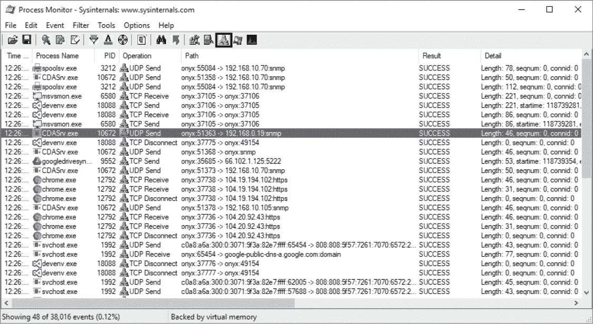

*图 2-5：一个示例进程监视器捕获*

选择图 2-5 中圈出的过滤器，只显示与被监控进程的网络连接相关的事件。详细信息包括涉及的主机以及使用的协议和端口。虽然捕获的数据不提供与连接相关的任何数据，但它确实为应用程序建立的网络通信提供了有价值的见解。进程监视器还可以捕获当前调用栈的状态，帮助你确定应用程序中在哪个位置正在建立网络连接。这在我们开始反向工程二进制文件以研究网络协议时，在第六章中将变得非常重要。图 2-6 详细显示了一个到远程服务器的单一 HTTP 连接。

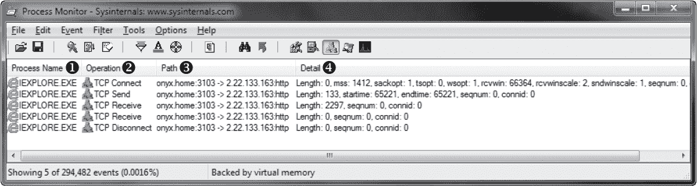

*图 2-6：一个捕获的单一连接*

第 ➊ 列显示了建立连接的进程名称。第 ➋ 列显示了操作，在本例中是连接到远程服务器，发送初始的 HTTP 请求并接收响应。第 ➌ 列指示源地址和目标地址，第 ➍ 列提供了关于捕获事件的更深入信息。

尽管这种方法在其他平台上监控系统调用时没有那么有用，但在 Windows 中，当你只想确定某个特定应用程序使用的网络协议时，它仍然是有用的。你不能通过这种技术捕获数据，但一旦确定了使用的协议，你可以通过更主动的网络流量捕获将这些信息加入到你的分析中。

### **被动捕获的优缺点**

使用被动捕获的最大优势在于，它不会干扰客户端和服务器应用程序的通信。它不会改变流量的目标地址或源地址，也不需要对应用程序进行任何修改或重新配置。

当你无法直接控制客户端或服务器时，被动捕获可能是你能使用的唯一技术。你通常可以找到一种方法，监听网络流量并用有限的精力捕获它。收集到数据后，你可以确定使用哪些主动捕获技术以及分析你想要研究的协议的最佳攻击方式。

被动网络流量捕获的一个主要缺点是，像数据包嗅探这类捕获技术运行在非常低的层级，可能很难解释应用程序接收到的数据。像 Wireshark 这样的工具无疑有帮助，但如果你分析的是自定义协议，可能很难在不直接与其交互的情况下轻松拆解该协议。

被动捕获也不总是容易修改应用程序产生的流量。修改流量并非总是必要的，但在遇到加密协议、需要禁用压缩，或需要改变流量以进行利用时，这种修改是很有用的。

当分析流量并注入新数据包没有得到结果时，可以切换战术，尝试使用主动捕获技术。

### **主动网络流量捕获**

主动捕获与被动捕获不同，它试图通过中间人攻击来影响流量的流向，通常是通过网络通信中的中间人攻击。正如图 2-7 所示，捕获流量的设备通常位于客户端和服务器应用程序之间，充当桥梁。这种方法有几个优点，包括能够修改流量和禁用像加密或压缩等功能，这些都能让分析和利用网络协议变得更容易。

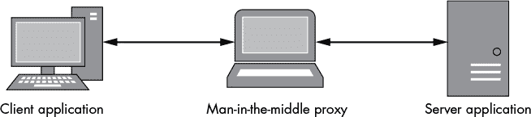

*图 2-7：中间人代理*

这种方法的一个缺点是通常更困难，因为你需要通过你的主动捕获系统重新路由应用程序的流量。主动捕获也可能带来一些意想不到的、不希望出现的效果。例如，如果你将服务器或客户端的网络地址更改为代理的地址，这可能会导致混乱，进而导致应用程序将流量发送到错误的地方。尽管有这些问题，主动捕获可能是分析和利用应用程序网络协议时最有价值的技术。

### **网络代理**

对网络流量执行中间人攻击最常见的方式是强制应用程序通过代理服务进行通信。在本节中，我将解释一些常见代理类型的相对优缺点，你可以使用这些代理捕获流量、分析数据，并利用网络协议。我还会展示如何将典型客户端应用程序的流量引导到代理中。

#### ***端口转发代理***

端口转发是代理连接最简单的方法。只需设置一个监听服务器（TCP 或 UDP），然后等待新的连接。当新的连接建立到代理服务器时，它会打开一个到实际服务的转发连接，并逻辑上将两者连接起来，如图 2-8 所示。

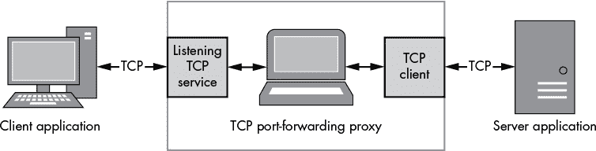

*图 2-8：TCP 端口转发代理概览*

##### **简单实现**

为了创建我们的代理，我们将使用 Canape Core 库中内置的 TCP 端口转发器。将清单 2-4 中的代码放入一个 C# 脚本文件，并将 `LOCALPORT` ➋、`REMOTEHOST` ➌ 和 `REMOTEPORT` ➍更改为适合您网络的值。

PortFormat

Proxy.csx

```
   // PortFormatProxy.csx – Simple TCP port-forwarding proxy
   // Expose methods like WriteLine and WritePackets
   using static System.Console;
   using static CANAPE.Cli.ConsoleUtils;

   // Create proxy template
   var template = new ➊FixedProxyTemplate();
   template.LocalPort = ➋LOCALPORT;
   template.Host = ➌"REMOTEHOST";
   template.Port = ➍REMOTEPORT;

   // Create proxy instance and start
➎ var service = template.Create();
   service.Start();

   WriteLine("Created {0}", service);
   WriteLine("Press Enter to exit...");
   ReadLine();
➏ service.Stop();

   // Dump packets
   var packets = service.Packets;
   WriteLine("Captured {0} packets:",
       packets.Count);
➐ { WritePackets(packets);
```

*清单 2-4：一个简单的 TCP 端口转发代理示例*

这个非常简单的脚本创建了一个 `FixedProxyTemplate` ➊ 的实例。Canape Core 基于模板模型工作，虽然如果需要，您可以深入到底层网络配置。脚本使用所需的本地和远程网络信息来配置模板。模板用于在 ➎ 创建服务实例；你可以将框架中的文档视为服务的模板。然后启动新创建的服务；此时，网络连接已配置好。在等待按键后，服务在 ➏ 被停止。然后，所有捕获的包将使用 `WritePackets()` 方法 ➐ 写入控制台。

运行此脚本应将我们的转发代理实例仅绑定到本地接口的 `LOCALPORT` 端口。当建立新的 TCP 连接到该端口时，代理代码应建立到 `REMOTEHOST` 的新连接，使用 TCP 端口 `REMOTEPORT`，并将这两个连接链接在一起。

**警告**

*将代理绑定到所有网络地址从安全角度来看可能是有风险的，因为用于测试协议的代理通常不会实现强大的安全机制。除非您完全控制所连接的网络或别无选择，否则请只将代理绑定到本地回环接口。在清单 2-4 中，默认值是 `LOCALHOST`；要绑定到所有接口，请将 `AnyBind` 属性设置为 `true`。*

##### **将流量重定向到代理**

完成简单的代理应用后，我们现在需要将应用流量通过它进行转发。

对于网页浏览器来说，操作非常简单：要捕获特定的请求，使用 *http://localhost:localport/resource* 代替 *http://www.domain.com/resource*，这样请求就会通过你的端口转发代理。

其他应用程序则更棘手：你可能需要深入到应用程序的配置设置。有时，应用程序允许你更改的唯一设置是目标 IP 地址。但这可能会导致一个鸡和蛋的问题，你不知道应用程序可能会使用哪些 TCP 或 UDP 端口，特别是当应用程序包含多个不同服务连接运行的复杂功能时。这种情况通常发生在 *远程过程调用（RPC）* 协议中，例如通用对象请求代理架构（CORBA）。该协议通常首先与代理建立网络连接，代理充当可用服务的目录。然后，第二个连接通过特定实例的 TCP 端口与请求的服务建立连接。

在这种情况下，一种好的方法是尽可能使用应用程序的所有网络连接功能，同时使用被动捕获技术进行监控。通过这样做，你应该能够发现该应用程序通常会建立的连接，然后你可以使用转发代理轻松地复制这些连接。

如果应用程序不支持更改其目标地址，你需要更具创意。如果应用程序通过主机名解析目标服务器地址，你会有更多的选择。你可以设置一个自定义的 DNS 服务器，响应名称请求并返回代理的 IP 地址。或者你可以使用大多数操作系统（包括 Windows）上都可用的 *hosts* 文件功能，前提是你有权限控制应用程序运行设备上的系统文件。

在主机名解析过程中，操作系统（或解析库）首先会参考 *hosts* 文件，查看该名称是否有本地条目，如果没有找到，则才会发起 DNS 请求。例如，清单 2-5 中的 hosts 文件将主机名 *[www.badgers.com](http://www.badgers.com)* 和 *[www.domain.com](http://www.domain.com)* 重定向到 *localhost*。

```
# Standard Localhost addresses
127.0.0.1       localhost
::1             localhost

# Following are dummy entries to redirect traffic through the proxy
127.0.0.1       www.badgers.com
127.0.0.1       www.domain.com
```

*清单 2-5：一个示例* 主机 *文件*

在类 Unix 操作系统中，*hosts* 文件的标准位置是 */etc/hosts*，而在 Windows 中则是 *C:\Windows\System32\Drivers\etc\hosts*。显然，你需要根据你的环境，适当替换 Windows 文件夹的路径。

**注意**

*一些杀毒软件和安全产品会跟踪系统的 hosts 文件变化，因为这些变化是恶意软件的迹象。如果你想修改* hosts *文件，可能需要禁用该产品的保护。*

##### **端口转发代理的优势**

端口转发代理的主要优势在于其简单性：你等待连接，打开到原始目标的新连接，然后在两者之间传递流量。代理没有与之相关的协议需要处理，也不需要应用程序提供特别的支持来捕获流量。

端口转发代理也是代理 UDP 流量的主要方式；由于它不是面向连接的，UDP 转发器的实现相对简单。

##### **端口转发代理的缺点**

当然，端口转发代理的简单性也带来了它的缺点。因为你只是将流量从一个监听连接转发到一个单一的目的地，如果应用程序在不同端口上使用多种协议，那么就需要多个代理实例。

例如，假设一个应用程序只有一个主机名或 IP 地址作为目标，你可以直接通过更改应用程序配置或伪造主机名来控制该地址。然后该应用程序尝试连接 TCP 端口 443 和 1234。因为你能控制它连接的地址，而不是端口，所以你需要为两个端口都设置转发代理，即使你只关心通过端口 1234 传输的流量。

这种代理还可能使得处理与一个知名端口的多个连接变得困难。例如，如果端口转发代理正在监听端口 1234 并与*[www.domain.com](http://www.domain.com)*的 1234 端口建立连接，只有原始域名的重定向流量才会按预期工作。如果你还想重定向*[www.badgers.com](http://www.badgers.com)*，情况就会更复杂。如果应用程序支持指定目标地址和端口，或者使用其他技术，如目标网络地址转换（DNAT），可以将特定连接重定向到独特的转发代理，那么可以缓解这一问题。（第五章包含了更多关于 DNAT 以及其他高级网络捕获技术的详细信息。）

此外，协议可能会将目的地地址用于自身的目的。例如，超文本传输协议（HTTP）中的 Host 头可以用于虚拟主机决策，这可能会导致端口转发的协议与重定向连接的行为不同，甚至完全无法工作。不过，至少对于 HTTP，我将在“反向 HTTP 代理”一节中讨论这个限制的解决方法，见第 32 页。

#### ***SOCKS 代理***

可以把 SOCKS 代理看作是增强版的端口转发代理。它不仅将 TCP 连接转发到目标网络位置，而且所有新的连接都通过一个简单的握手协议来启动，告知代理最终的目标位置，而不是固定的目标。它还支持监听连接，这对于像文件传输协议（FTP）这样的协议非常重要，因为 FTP 需要为服务器打开新的本地端口以发送数据。图 2-9 提供了 SOCKS 代理的概述。

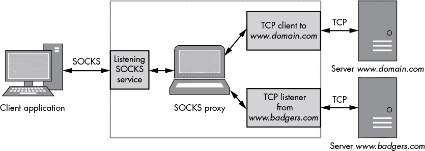

*图 2-9：SOCKS 代理概述*

当前有三种常见的协议变体——SOCKS 4、4a 和 5——每种都有其独特的用途。版本 4 是协议中最常支持的版本；然而，它仅支持 IPv4 连接，且目标地址必须指定为 32 位 IP 地址。版本 4 的更新版，版本 4a，允许通过主机名连接（如果没有 DNS 服务器能解析 IP 地址，这非常有用）。版本 5 引入了主机名支持、IPv6、UDP 转发以及改进的身份验证机制；它也是唯一在 RFC（1928）中指定的版本。

作为示例，客户端将发送如图 2-10 所示的请求，以建立与 IP 地址 10.0.0.1、端口 12345 的 SOCKS 连接。`USERNAME`组件是 SOCKS 版本 4 中唯一的身份验证方法（我知道，这不算特别安全）。`VER`表示版本号，在此案例中为 4。`CMD`表示它想要连接外部（绑定到地址是`CMD` 2），TCP 端口和地址以二进制形式指定。

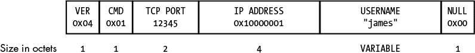

*图 2-10：SOCKS 版本 4 请求*

如果连接成功，它将返回适当的响应，如图 2-11 所示。`RESP`字段表示响应的状态；TCP 端口和地址字段仅对绑定请求有意义。然后，连接变得透明，客户端和服务器直接进行协商；代理服务器只在两个方向上传递流量。

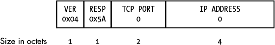

*图 2-11：SOCKS 版本 4 成功响应*

##### **简单实现**

Canape Core 库内置了对 SOCKS 4、4a 和 5 的支持。将清单 2-6 放入 C#脚本文件中，将`LOCALPORT` ➋改为你希望监听 SOCKS 代理的本地 TCP 端口。

SocksProxy.csx

```
   // SocksProxy.csx – Simple SOCKS proxy
   // Expose methods like WriteLine and WritePackets
   using static System.Console;
   using static CANAPE.Cli.ConsoleUtils;

   // Create the SOCKS proxy template
➊ var template = new SocksProxyTemplate();
   template.LocalPort = ➋LOCALPORT;

   // Create proxy instance and start
   var service = template.Create();
   service.Start();
 WriteLine("Created {0}", service);
   WriteLine("Press Enter to exit...");
   ReadLine();
   service.Stop();

   // Dump packets
   var packets = service.Packets;
   WriteLine("Captured {0} packets:",
       packets.Count);
   WritePackets(packets);
```

*清单 2-6：一个简单的 SOCKS 代理示例*

清单 2-6 遵循与清单 2-4 中 TCP 端口转发代理相同的模式。但在这种情况下，➊处的代码创建了一个 SOCKS 代理模板。其余的代码完全相同。

##### **将流量重定向到代理**

要确定如何通过 SOCKS 代理转发应用程序的网络流量，首先查看该应用程序。例如，当你在 Mozilla Firefox 中打开代理设置时，图 2-12 对话框会出现。在这里，你可以配置 Firefox 使用 SOCKS 代理。

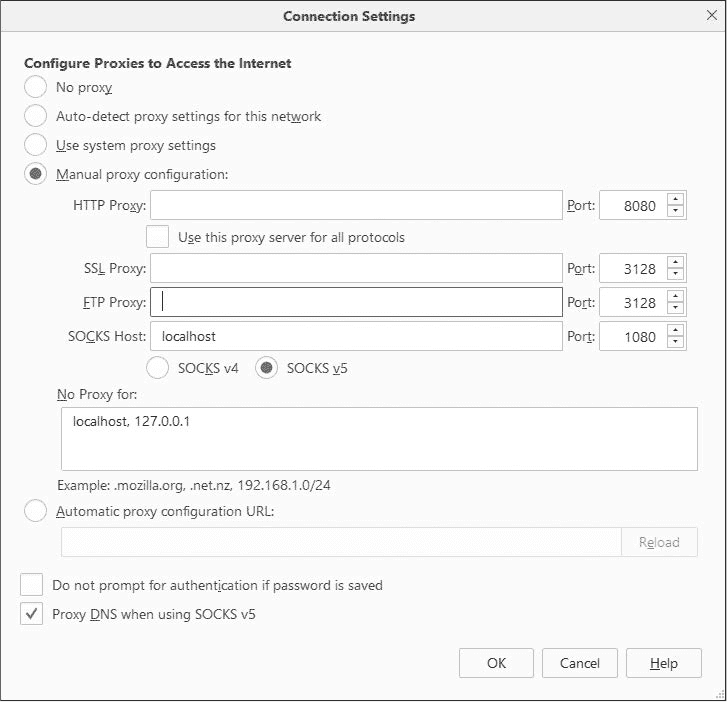

*图 2-12：Firefox 代理配置*

但有时候 SOCKS 支持并不显而易见。如果你正在测试一个 Java 应用程序，Java 运行时接受命令行参数，这些参数可以为任何外发的 TCP 连接启用 SOCKS 支持。例如，考虑列表 2-7 中的这个非常简单的 Java 应用程序，它连接到 IP 地址 192.168.10.1 的 5555 端口。

SocketClient.java

```
// SocketClient.java – A simple Java TCP socket client
import java.io.PrintWriter;
import java.net.Socket;

public class SocketClient {
    public static void main(String[] args) {
        try {
            Socket s = new Socket("192.168.10.1", 5555);
            PrintWriter out = new PrintWriter(s.getOutputStream(), true);
            out.println("Hello World!");
            s.close();
        } catch(Exception e) {
        }
    }
}
```

*列表 2-7：一个简单的 Java TCP 客户端*

当你正常运行这个编译后的程序时，它会按照预期的方式工作。但如果在命令行中传递两个特殊的系统属性，`socksProxyHost` 和 `socksProxyPort`，你可以为任何 TCP 连接指定一个 SOCKS 代理：

```
java –DsocksProxyHost=localhost –DsocksProxyPort=1080 SocketClient
```

这样会使 TCP 连接通过本地主机的 SOCKS 代理，端口为 1080。

另一个可以查看的地方来确定如何将应用程序的网络流量通过 SOCKS 代理转发的是操作系统的默认代理。在 macOS 中，导航到**系统偏好设置** ▸ **网络** ▸ **高级** ▸ **代理**。此时将会出现图 2-13 所示的对话框。在这里，你可以配置一个系统范围的 SOCKS 代理或为其他协议配置通用代理。虽然这种方法并不总是有效，但它是一个值得尝试的简单选项。

此外，如果应用程序原生不支持 SOCKS 代理，某些工具可以将该功能添加到任意应用程序中。这些工具从免费的开源工具（如 Linux 上的 Dante（*[`www.inet.no/dante/`](https://www.inet.no/dante/)）*）到商业工具（如 Proxifier（*[`www.proxifier.com/`](https://www.proxifier.com/)*），它们运行在 Windows 和 macOS 上）。无论哪种方式，它们都会注入到应用程序中以添加 SOCKS 支持，并修改套接字功能的操作。

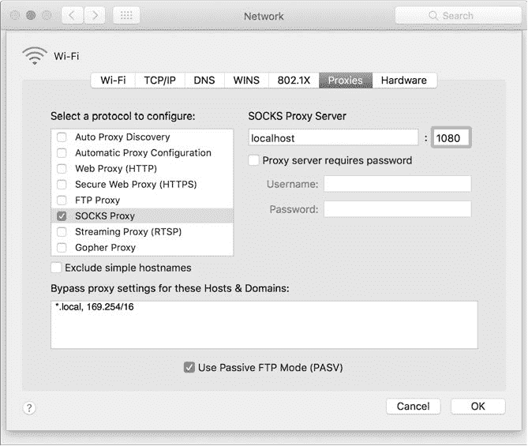

*图 2-13：macOS 上的代理配置对话框*

##### **SOCKS 代理的优点**

使用 SOCKS 代理的明显优势，相比于使用简单的端口转发器，是它应该捕获应用程序所做的所有 TCP 连接（如果你使用的是 SOCKS 版本 5，可能还包括一些 UDP）。只要操作系统的套接字层被包装起来，能够有效地将所有连接通过代理转发，这就是一个优势。

SOCKS 代理通常会从客户端应用程序的角度保留连接的目标。因此，如果客户端应用程序发送包含其端点的带内数据，那么端点将是服务器所期望的。然而，这并不会保留源地址。一些协议，例如 FTP，假设它们可以请求在源客户端上打开端口。SOCKS 协议提供了一个绑定监听连接的功能，但这增加了实现的复杂性。这使得捕获和分析变得更加困难，因为你必须考虑许多不同的数据流进出服务器。

##### **SOCKS 代理的缺点**

SOCKS 的主要缺点是它在不同应用程序和平台之间的支持可能不一致。Windows 系统代理仅支持 SOCKS 版本 4 代理，这意味着它只能解析本地主机名。它不支持 IPv6，也没有健壮的身份验证机制。通常，使用 SOCKS 工具添加到现有应用程序中会获得更好的支持，但这并不总是有效。

#### ***HTTP 代理***

HTTP 驱动着万维网以及无数的网页服务和 RESTful 协议。图 2-14 提供了 HTTP 代理的概览。该协议还可以作为传输机制，支持非网页协议，如 Java 的远程方法调用（RMI）或实时消息协议（RTMP），因为它可以穿透最严格的防火墙。了解 HTTP 代理如何在实践中工作非常重要，因为它几乎肯定对协议分析有所帮助，即使没有进行网页服务的测试。现有的网页应用测试工具在 HTTP 超出其原始环境使用时，通常无法做到理想的效果。有时，自己实现一个 HTTP 代理是唯一的解决方案。

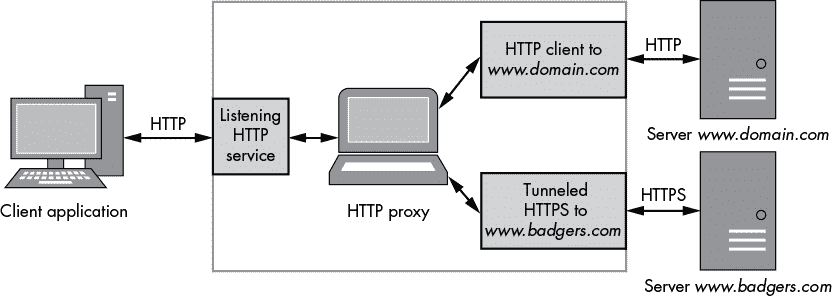

*图 2-14：HTTP 代理概览*

HTTP 代理的两种主要类型是转发代理和反向代理。对于潜在的网络协议分析师来说，每种类型都有其优缺点。

#### ***转发 HTTP 代理***

HTTP 协议在 RFC 1945 中为版本 1.0 进行了规范，在 RFC 2616 中为版本 1.1 进行了规范；这两个版本都提供了一个简单的 HTTP 请求代理机制。例如，HTTP 1.1 规定，请求的第一行，也就是 *请求行*，具有以下格式：

```
➊GET ➋/image.jpg HTTP/1.1
```

方法 ➊ 使用熟悉的动词，如 `GET`、`POST` 和 `HEAD`，指定在请求中应该执行的操作。在代理请求中，这一点与普通 HTTP 连接无异。路径 ➋ 是代理请求变得有趣的地方。如所示，绝对路径指示方法将作用于的资源。重要的是，路径也可以是绝对的统一资源标识符（URI）。通过指定绝对 URI，代理服务器可以建立与目标的全新连接，转发所有流量并将数据返回给客户端。代理甚至可以在一定程度上操控流量，添加身份验证、将 1.0 版本的服务器隐藏于 1.1 客户端背后，并增加传输压缩及其他种种功能。然而，这种灵活性也带来了成本：代理服务器必须能够处理 HTTP 流量，这增加了巨大的复杂性。例如，以下请求行通过代理访问远程服务器上的图像资源：

```
GET http://www.domain.com/image.jpg HTTP/1.1
```

你，细心的读者，可能已经发现了这种代理 HTTP 通信方法中的一个问题。因为代理必须能够访问底层的 HTTP 协议，那么处理传输加密的 HTTPS 怎么办呢？你可以解密加密流量；然而，在正常环境下，HTTP 客户端不太可能信任你提供的任何证书。而且，TLS 是故意设计的，几乎不可能通过其他方式进行中间人攻击。幸运的是，这一点早已被预见到，RFC 2817 提供了两种解决方案：它包括将 HTTP 连接升级为加密的能力（此处不再详细说明），更重要的是，它为我们的问题指定了 `CONNECT` HTTP 方法，用于通过 HTTP 代理创建透明的隧道连接。举个例子，一个想要建立与 HTTPS 网站的代理连接的网页浏览器，可以向代理发出以下请求：

```
CONNECT www.domain.com:443 HTTP/1.1
```

如果代理接受此请求，它将与服务器建立一个新的 TCP 连接。成功后，它应返回以下响应：

```
HTTP/1.1 200 Connection Established
```

现在，代理的 TCP 连接变得透明，浏览器能够建立协商后的 TLS 连接，而不会被代理阻碍。当然，值得注意的是，代理不太可能验证此连接上是否实际使用了 TLS。它可以是任何协议，而这一点被一些应用程序滥用，通过 HTTP 代理隧道它们自己的二进制协议。因此，通常会发现 HTTP 代理的部署会限制可以隧道的端口，只允许非常有限的子集。

##### **简单实现**

再次提醒，Canape 核心库包含一个简单的 HTTP 代理实现。不幸的是，它们不支持 `CONNECT` 方法来创建透明隧道，但这对于演示目的已经足够了。将示例 2-8 放入 C# 脚本文件中，将 `LOCALPORT` ➋ 更改为你想要监听的本地 TCP 端口。

HttpProxy.csx

```
   // HttpProxy.csx – Simple HTTP proxy
   // Expose methods like WriteLine and WritePackets
   using static System.Console;
   using static CANAPE.Cli.ConsoleUtils;

   // Create proxy template
➊ var template = new HttpProxyTemplate();
   template.LocalPort = ➋LOCALPORT;

   // Create proxy instance and start
   var service = template.Create();
   service.Start();

   WriteLine("Created {0}", service);
   WriteLine("Press Enter to exit...");
   ReadLine();
   service.Stop();

   // Dump packets
   var packets = service.Packets;
   WriteLine("Captured {0} packets:", packets.Count);
   WritePackets(packets);
```

*示例 2-8：一个简单的正向 HTTP 代理示例*

在这里，我们创建了一个正向 HTTP 代理。第 ➊ 行的代码与之前的示例几乎相同，用于创建 HTTP 代理模板。

##### **将流量重定向到代理**

与 SOCKS 代理类似，首要步骤将是应用程序。使用 HTTP 协议的应用程序不太可能没有某种形式的代理配置。如果应用程序没有专门的 HTTP 代理支持设置，可以尝试操作系统的配置，它与 SOCKS 代理配置位于同一位置。例如，在 Windows 上，你可以通过选择控制面板 ▸ Internet 选项 ▸ 连接 ▸ 局域网设置来访问系统代理设置。

在类 Unix 系统上的许多命令行工具，如`curl`、`wget`和`apt`，也支持通过环境变量设置 HTTP 代理配置。如果你将环境变量`http_proxy`设置为要使用的 HTTP 代理的 URL，例如 *http://localhost:3128*，应用程序就会使用它。对于安全流量，你还可以使用 *https_proxy*。一些实现允许特殊的 URL 方案，如 *socks4://*，来指定你希望使用 SOCKS 代理。

##### **转发 HTTP 代理的优点**

转发 HTTP 代理的主要优点是，如果应用程序仅使用 HTTP 协议，它所需要做的就是将请求行中的绝对路径改为绝对 URI，并将数据发送到一个监听的代理服务器。并且，只有少数几款使用 HTTP 协议进行传输的应用程序不支持代理。

##### **转发 HTTP 代理的缺点**

转发 HTTP 代理要求实现一个完整的 HTTP 解析器，以处理协议中的许多特性，这增加了复杂性；这种复杂性可能导致处理问题，甚至在最坏的情况下引发安全漏洞。此外，协议中添加代理目的地意味着，通过外部技术将 HTTP 代理支持集成到现有应用程序中可能会变得更加困难，除非你将连接转换为使用 `CONNECT` 方法（即使是未加密的 HTTP 也可以使用此方法）。

由于处理完整的 HTTP 1.1 连接的复杂性，代理通常会在一次请求后断开与客户端的连接，或者将通信降级到 1.0 版本（该版本在接收完所有数据后总是会关闭响应连接）。这可能会破坏一些期望使用 1.1 版本或请求 *管道化*（即能够并行处理多个请求以提高性能或状态局部性）的高级协议。

#### ***反向 HTTP 代理***

转发代理在内部客户端连接到外部网络的环境中相当常见。它们充当安全边界，限制外向流量只使用少量的协议类型。（暂时忽略 `CONNECT` 代理的潜在安全隐患。）但有时你可能希望代理入站连接，可能是出于负载均衡或安全原因（防止直接暴露服务器到外部世界）。然而，如果这样做，会出现一个问题：你无法控制客户端。事实上，客户端可能根本没有意识到它正在连接到一个代理。这时，*反向 HTTP 代理* 就派上用场了。

与转发代理需要在请求行中指定目标主机不同，你可以利用所有符合 HTTP 1.1 标准的客户端 *必须* 在请求中发送一个 Host HTTP 头，指定请求 URI 中使用的原始主机名。（注意，HTTP 1.0 没有此要求，但大多数使用该版本的客户端仍然会发送此头。）通过 Host 头信息，你可以推断请求的原始目标，并与该服务器建立代理连接，如 示例 2-9 所示。

```
 GET /image.jpg HTTP/1.1
User-Agent: Super Funky HTTP Client v1.0
Host: ➊www.domain.com
Accept: */*
```

*示例 2-9：一个 HTTP 请求示例*

示例 2-9 显示了一个典型的 Host 头 ➊，其中 HTTP 请求的 URL 是 *[`www.domain.com/image.jpg`](http://www.domain.com/image.jpg)*。反向代理可以轻松地获取这些信息并加以利用，重构原始目标。再次强调，由于需要解析 HTTP 头，对于受 TLS 保护的 HTTPS 流量使用起来更为困难。幸运的是，大多数 TLS 实现支持通配符证书，其主体形式为 **.domain.com** 或类似形式，这样就可以匹配 *[domain.com](http://domain.com)* 的任何子域名。

##### **简单实现**

不出所料，Canape 核心库包含了一个内置的 HTTP 反向代理实现，你可以通过将模板对象从 *HttpProxyTemplate* 更改为 *HttpReverseProxyTemplate* 来访问该实现。但为了完整起见，示例 2-10 显示了一个简单的实现。将以下代码放入 C# 脚本文件中，将 `LOCALPORT` ➊ 更改为你希望监听的本地 TCP 端口。如果 `LOCALPORT` 小于 1024，并且你在 Unix 风格的系统上运行该脚本，你还需要以 root 用户身份运行此脚本。

ReverseHttp

Proxy.csx

```
// ReverseHttpProxy.csx – Simple reverse HTTP proxy
// Expose methods like WriteLine and WritePackets
using static System.Console;
using static CANAPE.Cli.ConsoleUtils;

// Create proxy template
var template = new HttpReverseProxyTemplate();
template.LocalPort = ➊LOCALPORT;

// Create proxy instance and start
var service = template.Create();
service.Start();

WriteLine("Created {0}", service);
WriteLine("Press Enter to exit...");
ReadLine();
service.Stop();

// Dump packets
var packets = service.Packets;
WriteLine("Captured {0} packets:",
    packets.Count);
WritePackets(packets);
```

*示例 2-10：一个简单的反向 HTTP 代理示例*

##### **将流量重定向到你的代理**

将流量重定向到反向 HTTP 代理的方法与 TCP 端口转发的方法相似，都是通过将连接重定向到代理。但有一个很大的区别；你不能只更改目标主机名。这会改变 Host 头，如示例 2-10 所示。如果不小心，可能会导致代理循环。^(1) 相反，最好是通过修改 *hosts* 文件来更改与主机名相关联的 IP 地址。

但也许你正在测试的应用程序运行在一个无法修改 *hosts* 文件的设备上。因此，设置一个自定义的 DNS 服务器可能是最简单的方法，前提是你能够更改 DNS 服务器配置。

你也可以使用另一种方法，即配置一个完整的 DNS 服务器并设置适当的配置。这可能会非常耗时且容易出错；只需问问任何曾经配置过绑定服务器的人。幸运的是，现有的工具可以做我们想做的事情，即在响应 DNS 请求时返回代理的 IP 地址。这样的工具是*dnsspoof*。为了避免安装另一个工具，你可以使用 Canape 的 DNS 服务器来完成。基础的 DNS 服务器只会将所有 DNS 请求伪造为单一的 IP 地址（请参见清单 2-11）。将`IPV4ADDRESS` ➊、`IPV6ADDRESS` ➋ 和 `REVERSEDNS` ➌ 替换为合适的字符串。和 HTTP 反向代理一样，你需要在类 Unix 系统上以 root 用户身份运行，因为它会尝试绑定到 53 端口，而普通用户通常不允许这么做。在 Windows 上，绑定到低于 1024 的端口没有这样的限制。

DnsServer.csx

```
// DnsServer.csx – Simple DNS Server
// Expose console methods like WriteLine at global level.
using static System.Console;

// Create the DNS server template
var template = new DnsServerTemplate();

// Setup the response addresses
template.ResponseAddress = ➊"IPV4ADDRESS";
template.ResponseAddress6 = ➋"IPV6ADDRESS";
template.ReverseDns = ➌"REVERSEDNS";

// Create DNS server instance and start
var service = template.Create();
service.Start();
WriteLine("Created {0}", service);
WriteLine("Press Enter to exit...");
ReadLine();
service.Stop();
```

*清单 2-11：一个简单的 DNS 服务器*

现在，如果你将应用程序的 DNS 服务器配置为指向你的伪造 DNS 服务器，那么应用程序应该会通过该服务器发送其流量。

##### **反向 HTTP 代理的优势**

反向 HTTP 代理的优势在于它不要求客户端应用程序支持典型的转发代理配置。如果客户端应用程序不在你的直接控制之下，或者具有无法轻易更改的固定配置，这一点尤其有用。只要你能强制将原始 TCP 连接重定向到代理，就可以在几乎没有困难的情况下处理对多个不同主机的请求。

##### **反向 HTTP 代理的缺点**

反向 HTTP 代理的缺点基本上和转发代理一样。代理必须能够解析 HTTP 请求并处理协议的特性。

### **总结**

本章中你已经了解了被动和主动捕获技术，但哪种方法更好呢？这取决于你想要测试的应用程序。除非你只是监控网络流量，否则采用主动方法是值得的。随着你继续阅读本书，你会意识到主动捕获对协议分析和利用有显著的好处。如果你的应用程序有选择的话，使用 SOCKS，因为在许多情况下这是最简单的方法。
