## **3**

**网络协议结构**

“天下没有新事物”这一古老的格言在协议结构的方式上得到了验证。二进制和文本协议遵循常见的模式和结构，一旦理解了这些结构，它们就能轻松应用到任何新的协议中。本章详细介绍了这些结构，并对我在本书其余部分中如何表示它们进行了形式化描述。

在本章中，我讨论了许多常见的协议结构类型。每种类型都进行了详细描述，并说明了它如何在二进制或文本协议中表示。到本章结束时，你应该能够轻松识别你分析中的任何未知协议中的这些常见类型。

一旦你理解了协议的结构，你还会发现一些可利用的行为模式——即攻击网络协议本身的方式。第十章将详细介绍如何找到网络协议的问题，但现在我们只关心结构本身。

### **二进制协议结构**

二进制协议在二进制级别工作；数据的最小单位是一个二进制位。处理单个比特很困难，因此我们将使用 8 位单位，称为*字节*（octets），通常称为*字节*。字节是网络协议的事实单位。尽管字节可以被拆分成单个比特（例如，表示一组标志），但我们会将所有网络数据视为 8 位单位，如图 3-1 所示。

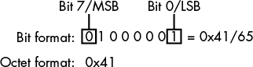

*图 3-1：二进制数据描述格式*

当显示单独的位时，我会使用*位格式*，该格式将第 7 位，即*最重要位 (MSB)*，放在左侧，第 0 位或*最不重要位 (LSB)*，放在右侧。（一些架构，例如 PowerPC，定义位编号的方向正好相反。）

#### ***数值数据***

表示数字的数据值通常是二进制协议的核心。这些值可以是整数或十进制值。数字可以用来表示数据的长度、标识标签值，或者简单地表示一个数字。

在二进制中，数值可以通过几种不同的方式表示，协议选择的方式取决于它所表示的值。以下部分描述了一些更常见的格式。

##### **无符号整数**

无符号整数是二进制数字最明显的表示方式。每一位都有一个基于其位置的特定值，这些值相加后便代表了整数。表 3-1 展示了一个 8 位整数的十进制和十六进制值。

**表 3-1：十进制位值**

| **位** | **十进制值** | **十六进制值** |
| --- | --- | --- |
| 0 | 1 | 0x01 |
| 1 | 2 | 0x02 |
| 2 | 4 | 0x04 |
| 3 | 8 | 0x08 |
| 4 | 16 | 0x10 |
| 5 | 32 | 0x20 |
| 6 | 64 | 0x40 |
| 7 | 128 | 0x80 |

##### **有符号整数**

并非所有整数值都是正数。在某些场景中，需要使用负整数——例如，为了表示两个整数之间的差异，需要考虑差值可能是负数——而只有有符号整数才能表示负值。虽然对无符号整数进行编码看起来很直观，但 CPU 只能处理相同的一组位。因此，CPU 需要一种将无符号整数值解释为有符号整数的方式；最常见的有符号解释方式是二进制补码。术语*二进制补码*指的是有符号整数在 CPU 的本地整数值中表示的方式。

在二进制补码表示中，无符号值和有符号值的转换是通过对整数执行按位取反操作（将 0 位转换为 1，将 1 位转换为 0），然后再加上 1 来完成的。例如，图 3-2 展示了 8 位整数 123 转换为二进制补码表示的过程。

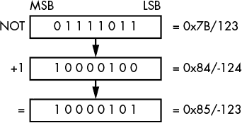

*图 3-2：123 的二进制补码表示*

二进制补码表示有一个危险的安全后果。例如，8 位有符号整数的范围是-128 到 127，因此最小值的绝对值大于最大值。如果最小值被取反，结果将是它本身；换句话说，–(–128)就是–128。这可能导致在解析格式时计算错误，从而引发安全漏洞。我们将在第十章中详细讨论这一点。

##### **可变长度整数**

网络数据的高效传输在历史上一直非常重要。尽管今天的高速网络可能使得效率问题变得不那么重要，但减少协议带宽仍然有其优势。当所表示的最常见整数值位于一个非常有限的范围内时，使用可变长度整数是有益的。

例如，考虑长度字段：当发送大小在 0 到 127 字节之间的数据块时，可以使用 7 位的可变整数表示。图 3-3 展示了 32 位字的几种不同编码方式。最多需要五个字节来表示整个范围。但如果你的协议倾向于分配 0 到 127 之间的值，它只需要使用一个字节，这样就节省了相当多的空间。

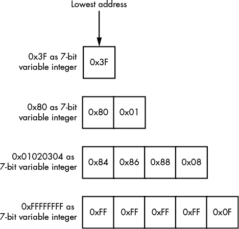

*图 3-3：7 位整数编码示例*

也就是说，如果你解析超过五个字节（甚至是 32 位），从解析操作得到的整数将取决于解析程序。有些程序（包括那些用 C 语言开发的程序）会直接丢弃超出给定范围的位，而其他开发环境则会生成溢出错误。如果处理不当，这种整数溢出可能导致漏洞，例如缓冲区溢出，进而可能导致分配的内存缓冲区比预期的要小，从而导致内存损坏。

##### **浮点数据**

有时，整数无法表示协议所需的十进制值范围。例如，一个多人计算机游戏的协议可能需要传输玩家或游戏虚拟世界中物体的坐标。如果这个虚拟世界很大，使用 32 位或甚至 64 位定点值的有限范围就会导致问题。

最常用的浮点整数格式是*IEEE 格式*，它在 IEEE 浮点算术标准（IEEE 754）中有所规定。尽管该标准规定了多种不同的二进制格式，甚至包括十进制格式，但你很可能只会遇到两种：单精度二进制表示，即 32 位值；以及双精度 64 位值。每种格式都指定了尾数和指数的位置及其位大小。还指定了符号位，用于表示值是正数还是负数。图 3-4 展示了 IEEE 浮点数值的一般布局，表 3-2 列出了常见的指数和尾数大小。

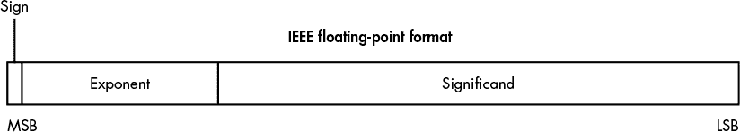

*图 3-4：浮点数表示*

**表 3-2：** 常见浮点数大小和范围

| **位大小** | **指数位** | **尾数位** | **值范围** |
| --- | --- | --- | --- |
| 32 | 8 | 23 | +/– 3.402823 × 10³⁸ |
| 64 | 11 | 52 | +/– 1.79769313486232 × 10³⁰⁸ |

#### ***布尔值***

由于布尔值对计算机非常重要，因此在协议中看到它们的反映并不奇怪。每个协议都会确定如何表示布尔值是真还是假，但也有一些常见的约定。

表示布尔值的基本方式是使用单个位的值。0 位表示假，1 位表示真。这种方式确实节省空间，但不一定是与底层应用接口的最简单方式。通常会使用单字节来表示布尔值，因为这样更容易处理。也常常使用 0 来表示假，非 0 值来表示真。

#### ***位标志***

位标志是一种在协议中表示特定布尔状态的方式。例如，在 TCP 中，一组位标志用于确定连接的当前状态。在建立连接时，客户端发送一个带有同步标志（SYN）的数据包，表示连接应该同步它们的定时器。服务器随后可以通过一个确认标志（ACK）来响应，表示已接收到客户端的请求，同时发送 SYN 标志以建立与客户端的同步。如果这个握手使用单一的枚举值，这种双重状态就无法实现，因为缺少一个独立的 SYN/ACK 状态。

#### ***二进制字节序***

数据的字节序是正确解读二进制协议时非常重要的一部分。每当一个多字节的值（如 32 位字）被传输时，字节序就会发挥作用。字节序是计算机如何在内存中存储数据的一个副产品。

由于八位字节是按顺序在网络上传输的，因此可以将值的最重要的八位字节作为传输的第一部分发送，也可以反过来——先发送最不重要的八位字节。八位字节的传输顺序决定了数据的字节序。未正确处理字节序格式可能会导致协议解析中的微妙 bug。

现代平台使用两种主要的字节序格式：大端和小端。*大端字节序*将最重要的字节存储在最低地址处，而*小端字节序*将最不重要的字节存储在该位置。图 3-5 展示了 32 位整数 0x01020304 在这两种格式中的存储方式。

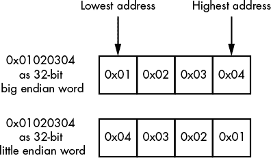

*图 3-5：大端和小端字的表示方式*

一个值的字节序通常被称为*网络顺序*或*主机顺序*。由于互联网 RFC 标准通常使用大端字节序作为所有网络协议的首选类型（除非出于历史原因另有规定），大端字节序被称为网络顺序。但你的计算机可能是大端字节序或小端字节序。像 x86 这样的处理器架构使用小端字节序；而像 SPARC 这样的架构使用大端字节序。

**注意**

*一些处理器架构，包括 SPARC、ARM 和 MIPS，可能具有指定字节序的内建逻辑，通常通过切换处理器控制标志来实现。开发网络软件时，不要对可能运行的平台的字节序做出假设。用于构建应用程序的网络 API 通常会包含方便的函数，用于在这些字节序之间进行转换。其他平台，如 PDP-11，使用*中端字节序*格式，其中 16 位字被交换；然而，在日常生活中你不太可能遇到这种格式，所以不必太在意它。*

#### ***文本与人类可读数据***

与数字数据一起，字符串是你最常遇到的值类型，无论它们是用于传递身份验证凭证还是资源路径。在检查一个仅设计用于传输英文字符的协议时，文本可能会使用 ASCII 编码。原始的 ASCII 标准定义了一个从 0 到 0x7F 的 7 位字符集，包含了表示英文所需的大部分字符（如图 3-6 所示）。

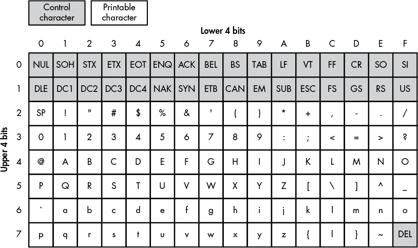

*图 3-6：一个 7 位 ASCII 表*

ASCII 标准最初是为文本终端（带有打印头的物理设备）开发的。控制字符用于向终端发送消息，以移动打印头或同步计算机与终端之间的串行通信。ASCII 字符集包含两种类型的字符：*控制字符*和*可打印字符*。大多数控制字符是这些设备的遗留物，几乎没有使用。但有些字符在现代计算机中仍然提供信息，例如 CR 和 LF，它们用于结束文本行。

可打印字符是你可以看到的字符。这些字符包括许多熟悉的符号和字母数字字符；然而，如果你想表示国际字符（其中有成千上万种字符），这些字符集就不太有用了。用 7 位数字表示全世界所有语言的字符，甚至其中的一部分，几乎是不可能的。

为了应对这个限制，通常使用三种策略：代码页、多字节字符集和 Unicode。一个协议要么要求你使用这三种方式之一来表示文本，要么提供一个选项，供应用程序选择。

##### **字符集**

扩展 ASCII 字符集的最简单方法是通过认识到，如果你所有的数据都存储在字节中，那么 128 个未使用的值（从 128 到 255）可以被重新用于存储额外的字符。虽然 256 个值不足以存储所有语言中的字符，但你可以通过多种方式使用这些未使用的范围。哪些字符映射到哪些值通常在名为*代码页*或*字符编码*的规范中进行编码。

##### **多字节字符集**

在中文、日文和韩文等语言中（统称为 CJK），即使你使用所有可用的空间，也根本无法用 256 个字符表示整个书面语言。解决方案是将多字节字符集与 ASCII 结合使用来编码这些语言。常见的编码有日语的 Shift-JIS 和简体中文的 GB2312。

*多字节字符集*允许你使用两个或更多的字节序列来编码所需的字符，尽管你很少会看到它们的使用。事实上，如果你不处理 CJK（中文、日文、韩文），你可能根本不会遇到它们。（为了简洁起见，我不会进一步讨论多字节字符集；如果需要解码，网上有很多资源可以帮助你。）

##### **Unicode**

Unicode 标准最早在 1991 年被标准化，旨在通过一个统一的字符集表示所有语言。你可以把 Unicode 看作另一种多字节字符集。但与专注于特定语言的字符集（如 Shift-JIS 用于日语）不同，Unicode 尝试将所有书面语言（包括一些古老和人工构造的语言）编码到一个通用字符集中。

Unicode 定义了两个相关的概念：*字符映射* 和 *字符编码*。字符映射包括数字值与字符之间的映射，以及许多关于字符如何使用或组合的规则和规范。字符编码定义了这些数字值在底层文件或网络协议中的编码方式。为了分析目的，更重要的是了解这些数字值是如何编码的。

每个 Unicode 字符都有一个 *代码点*，它表示一个唯一的字符。代码点通常以 *U+ABCD* 的格式书写，其中 *ABCD* 是代码点的十六进制值。为了兼容性，前 128 个代码点与 ASCII 中指定的内容匹配，接下来的 128 个代码点来自 ISO/IEC 8859-1。所得的值使用特定的方案进行编码，有时称为 *通用字符集 (UCS)* 或 *Unicode 转换格式 (UTF)* 编码。 (UCS 和 UTF 格式之间存在细微差异，但为了标识和操作，这些差异并不重要。) 图 3-7 显示了几种不同的 Unicode 格式的简单示例。

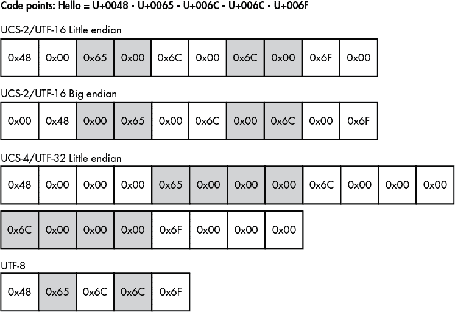

*图 3-7：字符串 `"Hello"` 在不同 Unicode 编码中的表示*

三种常见的 Unicode 编码格式是 UTF-16、UTF-32 和 UTF-8。

**UCS-2/UTF-16**

UCS-2/UTF-16 是现代 Microsoft Windows 平台的本地格式，也是 Java 和 .NET 虚拟机运行代码时使用的格式。它以 16 位整数序列对代码点进行编码，并且有小端和大端变种。

**UCS-4/UTF-32**

UCS-4/UTF-32 是 Unix 应用程序中常用的一种格式，因为它是许多 C/C++ 编译器中的默认宽字符格式。它以 32 位整数序列对代码点进行编码，并且有不同的字节序变种。

**UTF-8**

UTF-8 可能是 Unix 上最常见的格式。它也是许多平台和技术的默认输入输出格式，如 XML。与为代码点设定固定整数大小不同，它使用简单的可变长度值进行编码。表 3-3 显示了代码点在 UTF-8 中的编码方式。

**表 3-3：** UTF-8 中的 Unicode 代码点编码规则

| **代码点位数** | **第一个代码点 (U+)** | **最后一个代码点 (U+)** | **字节 1** | **字节 2** | **字节 3** | **字节 4** |
| --- | --- | --- | --- | --- | --- | --- |
| 0–7 | 0000 | 007F | 0xxxxxxx |  |  |  |
| 8–11 | 0080 | 07FF | 110xxxxx | 10xxxxxx |  |  |
| 12–16 | 0800 | FFFF | 1110xxxx | 10xxxxxx | 10xxxxxx |  |
| 17–21 | 10000 | 1FFFFF | 11110xxx | 10xxxxxx | 10xxxxxx | 10xxxxxx |
| 22–26 | 200000 | 3FFFFFF | 111110xx | 10xxxxxx | 10xxxxxx | 10xxxxxx |
| 26–31 | 4000000 | 7FFFFFFF | 1111110x | 10xxxxxx | 10xxxxxx | 10xxxxxx |

UTF-8 有许多优点。首先，它的编码定义确保了 ASCII 字符集（码点 U+0000 到 U+007F）使用单字节进行编码。这种方案使得该格式不仅与 ASCII 兼容，而且还非常节省空间。此外，UTF-8 还与依赖 NUL 终止字符串的 C/C++程序兼容。

尽管 UTF-8 有很多优点，但它也有一定的成本，因为像中文和日文这样的语言在 UTF-8 中占用的空间比在 UTF-16 中要大。图 3-8 展示了中文字符的一种不太优的编码方式。但请注意，这个例子中的 UTF-8 编码仍然比 UTF-32 编码在相同字符上的空间效率要高。

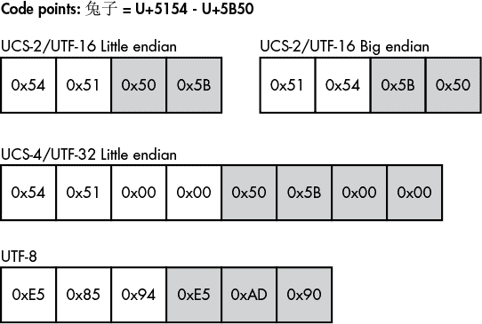

*图 3-8: 字符串* "兔子" *在不同 Unicode 编码下的表现*

**注意**

*不正确或天真的字符编码可能是微妙的安全问题的源头，这些问题包括绕过过滤机制（例如在请求的资源路径中）或导致缓冲区溢出。我们将在第十章中调查与字符编码相关的一些漏洞。*

#### ***变长二进制数据***

如果协议开发人员事先确切知道必须传输哪些数据，他们可以确保协议中的所有值都是固定长度的。实际上，这种情况很少见，尽管即便是简单的认证凭证也可以从能够指定可变用户名和密码字符串长度的功能中受益。协议使用几种策略来生成变长数据值：我将在接下来的章节中讨论最常见的几种——终止数据、长度前缀数据、隐式长度数据和填充数据。

##### **终止数据**

在本章之前讨论变长整数时，你已经看到了一个变长数据的示例。当时，变长整数值通过八位字节的最高有效位（MSB）为 0 来终止。我们可以进一步扩展终止值的概念，应用到字符串或数据数组等元素上。

终止数据值具有一个终止符号，该符号告诉数据解析器数据值已经结束。使用终止符号的原因是它通常不会出现在典型的数据中，从而确保数据值不会被提前终止。对于字符串数据，终止值可以是一个 NUL 值（由 0 表示），也可以是 ASCII 字符集中的其他控制字符之一。

如果所选的终止符号在正常数据传输过程中出现，你需要使用一种机制来转义这些符号。对于字符串，常见的做法是将终止字符前加反斜杠（`\`）或重复两次，以防止它被识别为终止符号。当协议无法事先知道数据值的长度时，这种方法尤其有用——例如，如果数据是动态生成的。图 3-9 展示了一个由 NUL 值终止的字符串示例。

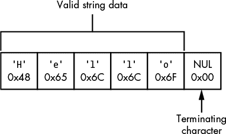

*图 3-9: `"Hello"` 作为 NUL 终止字符串*

有界数据通常通过一个符号来结束，该符号与可变长度序列中的第一个字符相匹配。例如，当使用字符串数据时，你可能会看到一个*带引号的字符串*夹在引号之间。初始的双引号告诉解析器查找匹配的字符以结束数据。图 3-10 显示了一个由一对双引号界定的字符串。

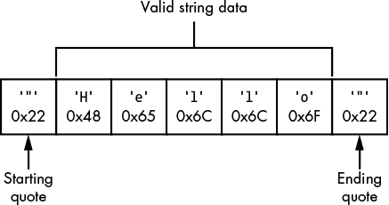

*图 3-10: `"Hello"` 作为一个由双引号界定的字符串*

##### **长度前缀数据**

如果数据值事先已知，可以将其长度直接插入到协议中。协议的解析器可以读取这个值，然后读取适当数量的单元（例如字符或字节）来提取原始值。这是一种非常常见的指定可变长度数据的方法。

*长度前缀*的实际大小通常不是很重要，尽管它应该合理地代表所传输数据的类型。大多数协议不需要指定 32 位整数的完整范围；然而，你常常会看到这个大小被用作长度字段，部分原因是它与大多数处理器架构和平台非常匹配。例如，图 3-11 显示了一个带有 8 位长度前缀的字符串。

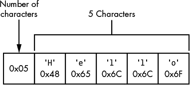

*图 3-11: `"Hello"` 作为一个长度前缀字符串*

##### **隐式长度数据**

有时数据值的长度是由其周围的值隐式表示的。例如，考虑一个协议，它使用面向连接的协议（如 TCP）将数据发送回客户端。服务器可以关闭 TCP 连接，从而隐式地表示数据的结束，而无需事先指定数据的大小。这就是 HTTP 1.0 响应中数据返回的方式。

另一个例子是一个更高级的协议或结构，已经指定了一组值的长度。解析器可能首先提取该高级结构，然后读取其中包含的值。协议可以利用这个结构有一个有限长度的事实，类似于关闭连接的方式来隐式计算一个值的长度（当然，是不关闭连接的）。例如，图 3-12 显示了一个简单的示例，其中一个 7 位可变整数和字符串包含在一个单独的块中。（当然，在实际应用中，这可能要复杂得多。）

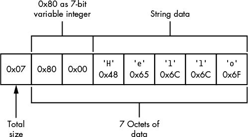

*图 3-12: `"Hello"` 作为一个隐式长度字符串*

##### **填充数据**

填充数据用于当值的长度有最大上限时，例如 32 字节的限制。为了简化，协议可以不使用长度前缀或明确的终止值，而是发送整个固定长度的字符串，并通过用已知值填充未使用的数据来终止值。图 3-13 显示了一个示例。

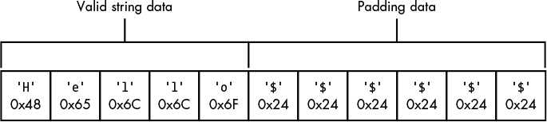

*图 3-13：“`Hello`”作为一个用 `'$'` 填充的字符串*

### **日期和时间**

对于一个协议来说，获取正确的日期和时间可能非常重要。两者都可以作为元数据使用，例如网络文件协议中的文件修改时间戳，也可以用于确定身份验证凭证的过期时间。如果时间戳未正确实现，可能会导致严重的安全问题。日期和时间的表示方法取决于使用需求、应用程序运行的平台以及协议的空间需求。接下来的章节将讨论两种常见的表示方式：POSIX/Unix 时间和 Windows FILETIME。

#### ***POSIX/Unix 时间***

当前，POSIX/Unix 时间存储为一个 32 位带符号整数值，表示自 Unix 纪元以来经过的秒数，Unix 纪元通常指定为 1970 年 1 月 1 日 00:00:00（UTC）。尽管这不是一个高精度的定时器，但它足以满足大多数场景。作为一个 32 位整数，这个值的最大表示时间为 2038 年 1 月 19 日 03:14:07（UTC），此时表示将发生溢出。一些现代操作系统现在使用 64 位表示法来解决这个问题。

#### ***Windows FILETIME***

Windows FILETIME 是微软 Windows 用于其文件系统时间戳的日期和时间格式。作为 Windows 上唯一具有简单二进制表示形式的格式，它也出现在一些不同的协议中。

FILETIME 格式是一个 64 位无符号整数。该整数的一个单位表示 100 纳秒的时间间隔。该格式的起始时间为 1601 年 1 月 1 日 00:00:00（UTC）。这使得 FILETIME 格式的时间范围比 POSIX/Unix 时间格式更大。

### **标签、长度、值模式**

想象一下如何使用简单的协议发送不重要的数据是很容易的，但发送更复杂和重要的数据则需要一些解释。例如，能够发送不同类型结构的协议必须有一种方式来表示结构的边界和类型。

表示数据的一种方式是使用 *标签、长度、值（TLV）模式*。标签值表示协议发送的数据类型，通常是一个数字值（通常是一个枚举值列表）。但标签可以是任何为数据结构提供唯一模式的内容。长度和值是可变长度的值。这些值出现的顺序不重要；事实上，标签可能是值的一部分。图 3-14 显示了这些值可能的几种排列方式。

发送的标签值可以用来确定如何进一步处理数据。例如，给定两种标签类型，一种表示发送给应用程序的身份验证凭证，另一种表示传输到解析器的消息，我们必须能够区分这两种数据类型。这种模式的一个大优点是，它允许我们扩展协议，而不会破坏那些尚未更新以支持更新协议的应用程序。由于每个结构都与一个标签和长度相关联，协议解析器可以忽略它不理解的结构。

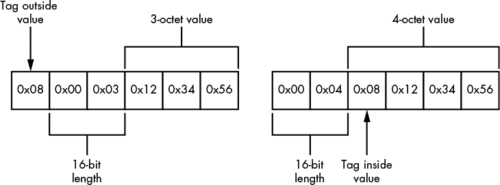

*图 3-14：可能的 TLV 排列*

### **多路复用与分片**

在计算机通信中，通常需要同时执行多个任务。例如，考虑微软的*远程桌面协议（RDP）*：用户可能在移动鼠标光标、键盘输入以及将文件传输到远程计算机的同时，显示和音频的变化也会回传给用户（见图 3-15）。

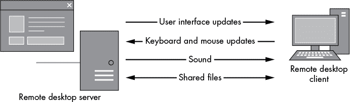

*图 3-15：远程桌面协议的数据需求*

如果显示更新必须等待一个 10 分钟的音频文件完成后才能更新显示，那么这种复杂的数据传输将无法带来丰富的体验。当然，解决方法是打开多个与远程计算机的连接，但这样会消耗更多资源。相反，许多协议使用*多路复用*，它允许多个连接共享相同的底层网络连接。

多路复用（见图 3-16）定义了一种内部的*通道*机制，允许通过将大规模传输拆分为更小的块，从而使单一连接能够承载多种类型的流量。然后，多路复用将这些数据块合并成一个单一的连接。在分析协议时，你可能需要将这些通道解复用，以便恢复原始数据。

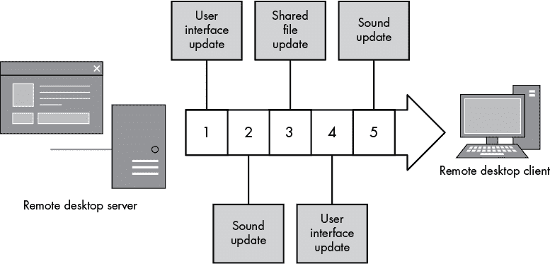

*图 3-16：多路复用的 RDP 数据*

不幸的是，一些网络协议限制了可以传输的数据类型以及每个数据包的最大大小——这是在协议层次化时常见的问题。例如，以太网定义了流量帧的最大大小为 1500 个字节，而在其上运行 IP 时会产生问题，因为 IP 数据包的最大大小可以达到 65536 字节。*分片*是为了解决这个问题而设计的：它使用一种机制，使得网络栈能够在应用程序或操作系统知道整个数据包无法由下一层处理时，将大数据包转化为更小的片段。

### **网络地址信息**

协议中网络地址信息的表示通常遵循一个相当标准的格式。因为我们几乎肯定在处理 TCP 或 UDP 协议，所以最常见的二进制表示是将 IP 地址表示为一个 4 字节或 16 字节的值（对于 IPv4 或 IPv6），并附带一个 2 字节的端口。根据惯例，这些值通常作为大端整数值存储。

你也可能看到主机名被发送，而不是原始地址。因为主机名仅仅是字符串，它们遵循用于发送变长字符串的模式，这在前面“变长二进制数据”一节的第 47 页中讨论过。图 3-17 展示了这些格式可能出现的样子。

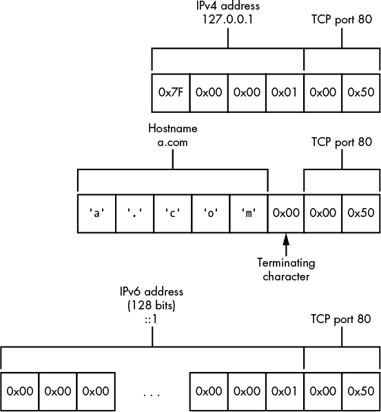

*图 3-17：网络信息的二进制表示*

### **结构化二进制格式**

尽管自定义网络协议往往喜欢重新发明轮子，但有时在描述新协议时，重新利用现有设计会更有意义。例如，在二进制协议中常见的一种格式是*抽象语法表示法 1 (ASN.1)*。ASN.1 是诸如简单网络管理协议 (SNMP) 等协议的基础，它也是所有种类的加密值的编码机制，如 X.509 证书。

ASN.1 由 ISO、IEC 和 ITU 在 X.680 系列中标准化。它定义了一种抽象语法来表示结构化数据。数据在协议中根据编码规则进行表示，并且存在多种编码方式。但你最有可能遇到的是*区分编码规则 (DER)*，它被设计为以一种不会被误解的方式表示 ASN.1 结构——这是加密协议中非常有用的特性。DER 表示法是 TLV 协议的一个很好的例子。

而不是详细讲解 ASN.1（这会占用本书相当多的篇幅），我给你提供了列表 3-1，它展示了 X.509 证书的 ASN.1 表示。

```
Certificate  ::=  SEQUENCE  {
     version         [0]  EXPLICIT Version DEFAULT v1,
     serialNumber         CertificateSerialNumber,
     signature            AlgorithmIdentifier,
     issuer               Name,
     validity             Validity,
     subject              Name,
     subjectPublicKeyInfo SubjectPublicKeyInfo,
     issuerUniqueID  [1]  IMPLICIT UniqueIdentifier OPTIONAL,
     subjectUniqueID [2]  IMPLICIT UniqueIdentifier OPTIONAL,
     extensions      [3]  EXPLICIT Extensions OPTIONAL
}
```

*列表 3-1：X.509 证书的 ASN.1 表示*

X.509 证书的这个抽象定义可以用 ASN.1 的任何编码格式表示。列表 3-2 展示了通过 OpenSSL 工具转储的 DER 编码形式的文本片段。

```
$ openssl asn1parse -in example.cer
    0:d=0  hl=4 l= 539 cons: SEQUENCE
    4:d=1  hl=4 l= 388 cons: SEQUENCE
    8:d=2  hl=2 l=   3 cons: cont [ 0 ]
   10:d=3  hl=2 l=   1 prim: INTEGER         :02
   13:d=2  hl=2 l=  16 prim: INTEGER         :19BB8E9E2F7D60BE48BFE6840B50F7C3
   31:d=2  hl=2 l=  13 cons: SEQUENCE
   33:d=3  hl=2 l=   9 prim: OBJECT          :sha1WithRSAEncryption
   44:d=3  hl=2 l=   0 prim: NULL
   46:d=2  hl=2 l=  17 cons: SEQUENCE
   48:d=3  hl=2 l=  15 cons: SET
   50:d=4  hl=2 l=  13 cons: SEQUENCE
   52:d=5  hl=2 l=   3 prim: OBJECT          :commonName
   57:d=5  hl=2 l=   6 prim: PRINTABLESTRING :democa
```

*列表 3-2：X.509 证书的小样本*

### **文本协议结构**

当主要目的是传输文本时，文本协议是一个不错的选择，这也是邮件传输协议、即时消息和新闻聚合协议通常采用文本基础的原因。文本协议必须具有类似于二进制协议的结构。原因是，尽管它们的主要内容不同，但两者的目标都是将数据从一个地方传输到另一个地方。

接下来的章节详细介绍了一些你在现实世界中可能遇到的常见文本协议结构。

#### ***数字数据***

几千年来，科学和书面语言发明了在文本格式中表示数值的方法。当然，计算机协议不需要人类可读，但为什么要特意让协议不可读呢（除非你的目标是故意混淆）。

##### **整数**

使用当前字符集表示字符 0 到 9（如果是十六进制则是 A 到 F）来表示整数值是很容易的。在这种简单的表示法中，大小限制不是问题，如果一个数字需要大于二进制字长，可以添加更多的数字。当然，你最好希望协议解析器能够处理额外的数字，否则安全问题将不可避免地发生。

要表示一个带符号的数字，你只需在数字前加上减号（`–`）；正数使用加号（`+`）符号则是隐含的。

##### **十进制数字**

十进制数字通常以人类可读的形式定义。例如，你可能会将一个数字写成 1.234，用点号将整数部分和小数部分分开；然而，你仍然需要考虑之后解析值的要求。

二进制表示法，如浮点数，无法用有限精度精确表示所有十进制值（就像十进制无法表示像 1/3 这样的数）。这个事实可能导致一些值在文本格式中难以表示，并可能引发安全问题，尤其是在进行值比较时。

#### ***文本布尔值***

布尔值在文本协议中容易表示。通常，它们用*true*或*false*这两个词表示。但为了增加难度，一些协议可能要求这些词必须完全大写才能有效。有时，整数值会被用来代替词语，比如 0 代表假，1 代表真，但这种情况并不常见。

#### ***日期和时间***

在简单的层面上，编码日期和时间很容易：只需像人类语言中那样表示它们即可。只要所有应用程序在表示上达成一致，这就足够了。

不幸的是，并不是每个人都能就标准格式达成一致，因此通常会使用许多竞争性的日期表示方式。这在一些应用程序中可能会成为一个特别严重的问题，尤其是邮件客户端，它们需要处理各种国际日期格式。

#### ***可变长度数据***

除了最简单的协议外，几乎所有协议都必须有一种方法来分隔重要的文本字段，以便它们可以被轻松解释。当一个文本字段从原始协议中分离出来时，通常称之为*标记*。一些协议指定了标记的固定长度，但更常见的是要求某种类型的可变长度数据。

##### **定界文本**

使用分隔符字符分隔标记是分隔标记和字段的一种非常常见的方式，这种方式简单易懂，且容易构建和解析。任何字符都可以作为分隔符（具体取决于传输的数据类型），但在可读性较强的格式中，空白字符最为常见。不过，分隔符不一定非得是空白字符。例如，金融信息交换（FIX）协议使用 ASCII 头部起始（SOH）字符（值为 1）来分隔标记。

##### **终止文本**

指定分隔单独标记方式的协议还必须有定义“命令结束”条件的方法。如果协议被分成单独的行，这些行必须以某种方式结束。大多数知名的基于文本的互联网协议是*按行处理的*，如 HTTP 和 IRC；这些行通常用来区分完整的结构，如命令的结束。

什么构成了行尾字符？这取决于你问的是谁。操作系统开发者通常将行尾字符定义为 ASCII *换行符（LF）*，其值为 10；或*回车符（CR）*，其值为 13；或者是 CR LF 的组合。像 HTTP 和简单邮件传输协议（SMTP）这样的协议将 CR LF 指定为官方的行尾组合。然而，许多错误的实现会发生，因此大多数解析器也会接受单独的 LF 作为行尾指示符。

#### ***结构化文本格式***

与结构化二进制格式（如 ASN.1）一样，当你想在文本协议中表示结构化数据时，通常没有必要重新发明轮子。你可以将结构化文本格式看作是加速版的分隔文本，因此，必须有规则来规定值的表示方式和层级的构建方式。考虑到这一点，我将描述三种在实际文本协议中常用的格式。

##### **多用途互联网邮件扩展**

最初为了发送多部分电子邮件而开发的*多用途互联网邮件扩展（MIME）*已经进入了多个协议中，如 HTTP。RFC 2045、2046 和 2047 中的规范，以及其他众多相关 RFC，定义了一种编码多个独立附件到一个 MIME 编码消息中的方式。

MIME 消息通过定义一个以两个短横线（--）为前缀的公共分隔符行来分隔消息体部分。消息通过在分隔符后跟随相同的两个短横线来结束。列表 3-3 展示了一个结合了二进制版本的相同消息的文本消息示例。

```
MIME-Version: 1.0
Content-Type: multipart/mixed; boundary=MSG_2934894829

This is a message with multiple parts in MIME format.
--MSG_2934894829
Content-Type: text/plain

Hello World!
--MSG_2934894829
Content-Type: application/octet-stream
Content-Transfer-Encoding: base64

PGh0bWw+Cjxib2R5PgpIZWxsbyBXb3JsZCEKPC9ib2R5Pgo8L2h0bWw+Cg==
--MSG_2934894829--
```

*列表 3-3：一个简单的 MIME 消息*

MIME 最常见的用途之一是用于 Content-Type 值，这通常被称为 *MIME 类型*。MIME 类型广泛应用于 HTTP 内容的服务以及操作系统中将应用程序与特定内容类型映射的场合。每种类型由数据所表示的形式组成，例如 *text* 或 *application*，以及数据的格式。在这种情况下，`plain` 是未编码的文本，而 `octet-stream` 是一系列字节。

##### **JavaScript 对象表示法**

*JavaScript 对象表示法 (JSON)* 设计为一种简单的表示方式，用于描述基于 JavaScript 编程语言提供的对象格式的结构。它最初用于在浏览器中的网页和后端服务之间传输数据，比如在异步 JavaScript 和 XML（AJAX）中。目前，它广泛应用于 Web 服务的数据传输以及各种其他协议。

JSON 格式很简单：一个 JSON 对象使用大括号 ({}) ASCII 字符包围。在这些大括号中可以包含零个或多个成员条目，每个条目由一个键和值组成。例如，列表 3-4 显示了一个简单的 JSON 对象，其中包括一个整数索引值、"Hello world!" 作为字符串，以及一个字符串数组。

```
{
    "index" : 0,
    "str" : "Hello World!",
    "arr" : [ "A", "B" ]
}
```

*列表 3-4：一个简单的 JSON 对象*

JSON 格式是为 JavaScript 处理设计的，可以使用 `"eval"` 函数进行解析。不幸的是，使用这个函数存在显著的安全风险；即在对象创建过程中可能插入任意脚本代码。尽管大多数现代应用程序使用不需要与 JavaScript 连接的解析库，但仍值得确保在应用程序上下文中不会执行任意 JavaScript 代码。原因是这可能导致潜在的安全问题，如 *跨站脚本攻击 (XSS)*，这是一种攻击者控制的 JavaScript 可以在另一个网页的上下文中执行的漏洞，从而使攻击者能够访问该页面的安全资源。

##### **可扩展标记语言**

*可扩展标记语言 (XML)* 是一种用于描述结构化文档格式的标记语言。它由 W3C 开发，源自标准化通用标记语言 (SGML)。它与 HTML 有许多相似之处，但它旨在通过更严格的定义来简化解析器并减少安全问题。^(1)

从基本层面来看，XML 由元素、属性和文本组成。*元素* 是主要的结构值。它们有一个名称，并可以包含子元素或文本内容。在单个文档中只允许有一个根元素。*属性* 是可以分配给元素的附加名称-值对。它们的形式是 `name`="Value"。文本内容仅仅是文本。文本是元素的子项或属性的值组件。

列表 3-5 显示了一个非常简单的 XML 文档，包含元素、属性和文本值。

```
<value index="0">    <str>Hello World!</str>
    <arr><value>A</value><value>B</value></arr>
</value>
```

*清单 3-5：一个简单的 XML 文档*

所有的 XML 数据都是文本；在 XML 规范中没有提供类型信息，因此解析器必须知道这些值表示什么。某些规范，如 XML Schema，旨在弥补这种类型信息的缺失，但它们并非处理 XML 内容的必要条件。XML 规范定义了一些结构良好的标准，可以用来确定一个 XML 文档是否符合最基本的结构要求。

XML 在许多不同的地方用于定义信息在协议中的传输方式，比如在丰富网站摘要（RSS）中。它也可以是协议的一部分，比如在可扩展消息和存在协议（XMPP）中。

### **编码二进制数据**

在计算机通信的早期历史中，8 位字节并不是常态。由于大多数通信都是基于文本的，且集中在英语国家，因此按照 ASCII 标准每个字节只发送 7 位是有经济意义的。这允许其他位提供串行链路协议的控制或提高性能。这一历史在一些早期的网络协议中得到了充分体现，比如 SMTP 或网络新闻传输协议（NNTP），这些协议假定使用 7 位通信通道。

但是，7 位限制带来了一个问题，如果你想通过电子邮件发送那张有趣的图片，或者你想用非英语字符集写邮件。为了克服这个限制，开发人员设计了多种方法将二进制数据编码为文本，每种方法的效率或复杂性有所不同。

事实证明，将二进制内容转换为文本的能力仍然有其优势。例如，如果你想以结构化的文本格式（如 JSON 或 XML）发送二进制数据，你可能需要确保分隔符得到适当转义。相反，你可以选择一个现有的编码格式，如 Base64，来发送二进制数据，它将被双方轻松理解。

让我们来看一下在检查文本协议时，你可能会遇到的一些常见的二进制到文本的编码方案。

#### ***十六进制编码***

一种最简单的二进制数据编码技术是*十六进制编码*。在十六进制编码中，每个字节被分割成两个 4 位的值，转换成两个文本字符表示十六进制表示。结果是一个简单的二进制文本表示，如图 3-18 所示。

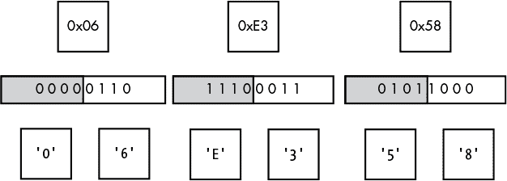

*图 3-18：二进制数据的示例十六进制编码*

尽管简单，十六进制编码并不高效，因为所有二进制数据都会自动变大 100%，比原始数据大一倍。但它的一个优点是编码和解码操作快速且简单，出错的几率小，这对于安全性是非常有利的。

HTTP 为 URL 和一些文本协议指定了类似的编码方式，称为 *百分号编码*。与所有数据都被编码不同，只有不可打印的数据会被转换为十六进制，值通过在前面加上一个 % 字符来表示。如果使用百分号编码对图 3-18 中的值进行编码，结果将是 %06%E3%58。

#### ***Base64***

为了克服十六进制编码中的明显低效，我们可以使用 Base64，这是一种最初作为 MIME 规范的一部分开发的编码方案。名字中的*64*指的是用于编码数据的字符数量。

输入的二进制数据被分成单独的 6 位值，足以表示从 0 到 63。然后使用这个值查找编码表中的对应字符，如图 3-19 所示。

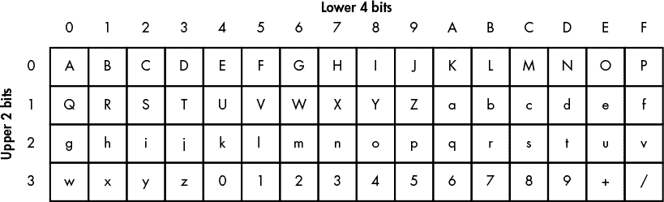

*图 3-19：Base64 编码表*

但这种方法存在一个问题：当 8 位被 6 位除时，剩下 2 位。为了解决这个问题，输入数据以三个八位字节为单位处理，因为将 24 位除以 6 位会产生 4 个值。因此，Base64 将 3 个字节编码为 4 个字符，表示增加仅为 33%，比十六进制编码的增加量要好得多。图 3-20 显示了将三个八位字节序列编码为 Base64 的示例。

但是，这种策略还存在另一个问题。如果你只有一个或两个八位字节需要编码呢？这难道不会导致编码失败吗？Base64 通过定义一个占位符字符——等号（=）来解决这个问题。如果在编码过程中没有有效的位可以使用，编码器将把该值编码为占位符。图 3-21 显示了只编码一个八位字节的示例。请注意，它生成了两个占位符字符。如果编码了两个八位字节，Base64 将仅生成一个占位符字符。

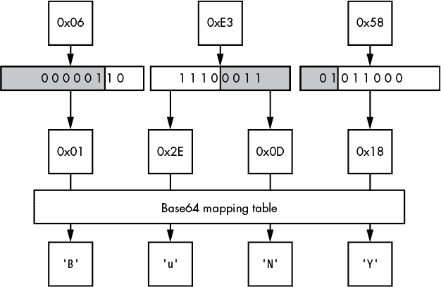

*图 3-20：Base64 编码 3 个字节为 4 个字符*

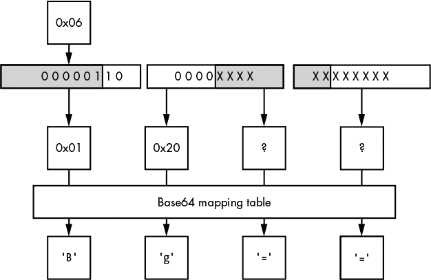

*图 3-21：Base64 编码 1 个字节为 3 个字符*

要将 Base64 数据转换回二进制，只需按照步骤反向操作。但是，当在解码过程中遇到非 Base64 字符时，会发生什么呢？这就取决于应用程序如何决定了。我们只能希望它做出安全的决策。

### **总结**

在这一章中，我定义了多种表示数据值的方式，包括二进制和文本协议，并讨论了如何在二进制中表示数值数据，比如整数。理解八位字节如何在协议中传输，对于成功解码值至关重要。同时，识别可变长度数据值的多种表示方式也非常重要，因为它们可能是你在网络协议中遇到的最关键结构。当你分析更多的网络协议时，你会看到相同的结构被反复使用。能够快速识别这些结构是轻松处理未知协议的关键。

在第四章中，我们将查看一些现实世界中的协议，并对它们进行剖析，看看它们如何与本章中呈现的描述相匹配。
