# 第四章：高级应用流量捕获

通常，你在第二章中学到的网络流量捕获技术应该足够用了，但有时你会遇到需要更高级方法来捕获网络流量的复杂情况。有时，挑战来自于只能通过动态主机配置协议（DHCP）配置的嵌入式平台；有时，可能是一个网络，除非你直接连接到它，否则你几乎无法控制它。

本章讨论的大多数高级流量捕获技术都使用现有的网络基础设施和协议来重定向流量。这些技术不需要专用硬件；你只需要一些常见的操作系统软件包。

### **重定向流量**

IP 是一种*路由*协议；也就是说，网络上的节点不需要知道其他任何节点的确切位置。相反，当一个节点想要将流量发送到它没有直接连接的另一个节点时，它会将流量发送到一个*网关*节点，网关节点将流量转发到目的地。网关通常也被称为*路由器*，它是一种将流量从一个位置路由到另一个位置的设备。

例如，在图 4-1 中，客户端 192.168.56.10 正试图将流量发送到服务器 10.1.1.10，但客户端与服务器没有直接连接。它首先将目标流量发送到路由器 A。接着，路由器 A 将流量发送到路由器 B，后者与目标服务器有直接连接；路由器 B 将流量转发到最终目的地。

与所有节点一样，网关节点并不知道流量的确切目的地，因此它会查找合适的下一个网关进行转发。在这种情况下，路由器 A 和 B 只知道它们直接连接的两个网络。为了让客户端与服务器之间的流量能够到达，必须进行路由。

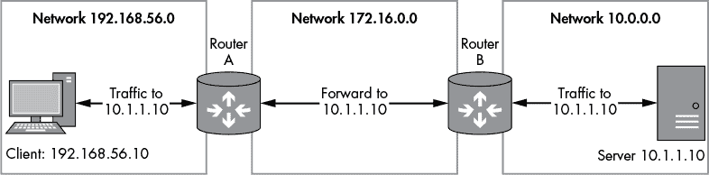

*图 4-1：路由流量示例*

#### ***使用 Traceroute***

路由追踪时，你试图映射出 IP 流量到达特定目的地的路径。大多数操作系统都有内置工具来执行追踪，例如大多数类 Unix 平台上的 `traceroute` 和 Windows 上的 `tracert`。

清单 4-1 显示了从家庭互联网连接追踪到 *[www.google.com](http://www.google.com)* 的结果。

```
C:\Users\user>tracert www.google.com

Tracing route to www.google.com [173.194.34.176]
over a maximum of 30 hops:

  1     2 ms     2 ms     2 ms  home.local [192.168.1.254]
  2    15 ms    15 ms    15 ms  217.32.146.64
  3    88 ms    15 ms    15 ms  217.32.146.110
  4    16 ms    16 ms    15 ms  217.32.147.194
  5    26 ms    15 ms    15 ms  217.41.168.79
  6    16 ms    26 ms    16 ms  217.41.168.107 7    26 ms    15 ms    15 ms  109.159.249.94
  8    18 ms    16 ms    15 ms  109.159.249.17
  9    17 ms    28 ms    16 ms  62.6.201.173
 10    17 ms    16 ms    16 ms  195.99.126.105
 11    17 ms    17 ms    16 ms  209.85.252.188
 12    17 ms    17 ms    17 ms  209.85.253.175
 13    27 ms    17 ms    17 ms  lhr14s22-in-f16.1e100.net [173.194.34.176]
```

*清单 4-1：使用 `tracert` 工具追踪到* [www.google.com](http://www.google.com) *的路径*

每一行输出（1、2 等）代表一个唯一的网关，将流量路由到最终目的地。输出中提到的最大跳数(*hops*)表示从一个网关到下一个网关的网络跳数。例如，在你的机器和第一个路由器之间有一个跳数，在那个路由器和下一个路由器之间又有一个跳数，一直到达最终目的地。如果跳数超过最大值，跟踪路由过程将停止探测更多的路由器。最大跳数可以在 trace route 工具的命令行中指定；在 Windows 上指定`-h NUM`，在类 Unix 系统上指定`-m NUM`。（输出还显示了执行 traceroute 的机器与发现节点之间的往返时间。）

#### ***路由表***

操作系统使用*路由表*来决定将流量发送到哪些网关。路由表包含目标网络和将流量路由到的网关列表。如果某个网络直接连接到发送网络流量的节点，则无需网关，网络流量可以直接通过本地网络传输。

你可以通过在大多数类 Unix 系统中输入命令`netstat -r`，或在 Windows 中输入`route print`来查看计算机的路由表。列表 4-2 显示了在 Windows 中执行此命令时的输出。

> **route print**

```
   IPv4 Route Table
   =============================================================================
   Active Routes:
   Network Destination           Netmask         Gateway      Interface   Metric
➊             0.0.0.0           0.0.0.0   192.168.1.254   192.168.1.72       10
             127.0.0.0         255.0.0.0         On-link      127.0.0.1      306
             127.0.0.1   255.255.255.255         On-link      127.0.0.1      306
       127.255.255.255   255.255.255.255         On-link      127.0.0.1      306
           192.168.1.0     255.255.255.0         On-link   192.168.1.72      266
          192.168.1.72   255.255.255.255         On-link   192.168.1.72      266
         192.168.1.255   255.255.255.255         On-link   192.168.1.72      266
             224.0.0.0         240.0.0.0         On-link      127.0.0.1      306
             224.0.0.0         240.0.0.0         On-link   192.168.56.1      276
             224.0.0.0         240.0.0.0         On-link   192.168.1.72      266
       255.255.255.255   255.255.255.255         On-link      127.0.0.1      306
       255.255.255.255   255.255.255.255         On-link   192.168.56.1      276
 255.255.255.255   255.255.255.255         On-link   192.168.1.72      266
   =============================================================================
```

*列表 4-2：示例路由表输出*

如前所述，使用路由的一大原因是使节点无需知道网络中所有其他节点的位置。但当与目标网络通信的网关未知时，流量会发生什么？在这种情况下，路由表通常会将所有未知流量转发到一个*默认网关*。你可以在 ➊ 看到默认网关，其中网络目标是 0.0.0.0。这一目标是默认网关的占位符，简化了路由表的管理。通过使用占位符，如果网络配置发生变化（例如通过 DHCP 配置），就不需要更改路由表。发送到没有已知匹配路由的任何目标的流量将被发送到注册在 0.0.0.0 占位符地址的网关。

如何利用路由来为自己谋取优势？我们可以考虑一个嵌入式系统，其中操作系统和硬件作为一个整体设备存在。在嵌入式系统中，你可能无法影响网络配置，因为你可能甚至无法访问底层操作系统，但如果你能将捕获设备呈现为系统与最终目标之间的网关，你就可以捕获该系统上的流量。

接下来的部分将讨论如何配置操作系统以充当网关来促进流量捕获。

### **配置路由器**

默认情况下，大多数操作系统不会直接在网络接口之间路由流量。 这主要是为了防止路由器的一侧与另一侧的网络地址直接通信。 如果在操作系统配置中未启用路由，则发送到计算机的任何需要路由的流量将被丢弃或向发送者发送错误消息。 默认配置对安全性非常重要：想象一下，如果控制您与互联网连接的路由器将互联网流量直接路由到您的私有网络，会有什么影响。

因此，要使操作系统能够执行路由功能，您需要以管理员身份进行一些配置更改。 尽管每个操作系统启用路由的方式都不同，但一个方面保持不变：您需要至少安装两个单独的网络接口来充当路由器。 此外，您需要在网关两侧配置路由以确保路由正常运行。 如果目的地没有返回源设备的对应路由，通信可能无法正常工作。 启用路由后，您可以配置网络设备通过新的路由器转发流量。 通过在路由器上运行诸如 Wireshark 之类的工具，您可以捕获在您配置的两个网络接口之间转发的流量。

#### ***在 Windows 上启用路由***

默认情况下，Windows 不会在网络接口之间启用路由。 要在 Windows 上启用路由功能，您需要修改系统注册表。 您可以使用 GUI 注册表编辑器来执行此操作，但最简单的方法是以管理员身份从命令提示符运行以下命令：

```
C> reg add HKLM\System\CurrentControlSet\Services\Tcpip\Parameters ^
    /v IPEnableRouter /t REG_DWORD /d 1
```

完成流量捕获后，要关闭路由，请输入以下命令：

```
C> reg add HKLM\System\CurrentControlSet\Services\Tcpip\Parameters ^
    /v IPEnableRouter /t REG_DWORD /d 0
```

在更改命令之间，还需要重新启动。

**警告**

*在修改 Windows 注册表时一定要非常小心。 错误的更改可能会完全破坏 Windows 并阻止其启动！ 在执行任何危险更改之前，请务必使用内置的 Windows 备份工具等实用程序进行系统备份。*

#### ***在*nix 上启用路由***

要在类 Unix 操作系统上启用路由功能，只需使用`sysctl`命令更改 IP 路由系统设置。 （请注意，这样做的说明可能在各个系统之间并不一致，但你应该可以很容易地找到具体的说明。）

要在 Linux 上为 IPv4 启用路由，请以 root 身份输入以下命令（无需重新启动；更改立即生效）：

```
# sysctl net.ipv4.conf.all.forwarding=1
```

要在 Linux 上启用 IPv6 路由，请输入以下命令：

```
# sysctl net.ipv6.conf.all.forwarding=1
```

您可以通过在上述命令中将`1`更改为`0`来恢复路由配置。

要在 macOS 上启用路由，请输入以下命令：

```
> sysctl -w net.inet.ip.forwarding=1
```

### **网络地址转换**

在尝试捕获流量时，你可能会发现能够捕获出站流量，但无法捕获返回流量。原因是上游路由器不知道到原始源网络的路由；因此，它要么完全丢弃流量，要么将流量转发到一个不相关的网络。你可以通过使用*网络地址转换（NAT）*来缓解这种情况，这种技术修改了 IP 和更高层协议（如 TCP）的源和目的地址信息。NAT 被广泛用于通过隐藏多个设备在一个公共 IP 地址后面，来扩展有限的 IPv4 地址空间。

NAT 也可以使网络配置和安全性变得更简单。当启用 NAT 时，你可以在单个 NAT IP 地址后运行任意数量的设备，并只管理这个公共 IP 地址。

今天常见的两种 NAT 类型是*源 NAT（SNAT）*和*目的 NAT（DNAT）*。这两者的区别在于，在 NAT 处理网络流量时，修改的是哪个地址。SNAT（也叫*伪装*）修改的是源 IP 地址信息；DNAT 修改的是目的地址。

#### ***启用 SNAT***

当你想让路由器将多个机器隐藏在一个 IP 地址后面时，你需要使用 SNAT。启用 SNAT 时，当流量通过外部网络接口路由时，数据包中的源 IP 地址会被重写，匹配由 SNAT 提供的单一 IP 地址。

当你想将流量路由到一个你不控制的网络时，实施 SNAT 可能会很有用，因为正如你所记得的，网络中的两个节点必须拥有适当的路由信息才能在节点之间发送网络流量。在最坏的情况下，如果路由信息不正确，流量只能单向流动。即使在最好的情况下，你也很可能只能捕获一个方向的流量；另一个方向将会通过其他路径路由。

SNAT 通过将流量的源地址修改为目的节点可以路由到的 IP 地址来解决这个潜在问题——通常是分配给路由器外部接口的地址。这样，目的节点就可以将流量返回到路由器的方向。图 4-2 展示了一个简单的 SNAT 示例。

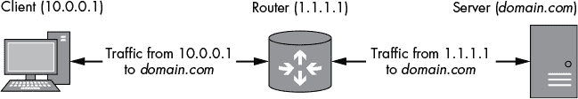

*图 4-2：从客户端到服务器的 SNAT 示例*

当客户端想要向不同网络中的服务器发送数据包时，它会将数据包发送到已配置 SNAT 的路由器。当路由器接收到来自客户端的数据包时，源地址是客户端的（10.0.0.1），目的地是服务器（*[domain.com](http://domain.com)*的解析地址）。就在这个时候，使用了 SNAT：路由器将数据包的源地址修改为它自己的（1.1.1.1），然后将数据包转发给服务器。

当服务器接收到此数据包时，它会假设数据包来自路由器；因此，当它想要发送数据包时，它会将数据包发送到 1.1.1.1。路由器接收到数据包后，会根据目标地址和端口号判断它来自现有的 NAT 连接，并还原地址更改，将 1.1.1.1 转换回原始客户端地址 10.0.0.1。最后，数据包可以被转发回原始客户端，而不需要服务器知道客户端的具体信息或如何路由到其网络。

#### ***在 Linux 上配置 SNAT***

虽然你可以在 Windows 和 macOS 上使用 Internet 连接共享配置 SNAT，但我只会提供如何在 Linux 上配置 SNAT 的详细信息，因为它是最容易描述的平台，也是最灵活的网络配置平台。

在配置 SNAT 之前，你需要执行以下操作：

• 如本章前面所述，启用 IP 路由。

• 查找你想要配置 SNAT 的出站网络接口名称。你可以使用 `ifconfig` 命令来查找。出站接口可能会被命名为 `eth0` 之类的名称。

• 在使用 `ifconfig` 时，记下与出站接口关联的 IP 地址。

现在你可以使用 `iptables` 配置 NAT 规则。（`iptables` 命令很可能已经安装在你的 Linux 发行版中。）但首先，请以 root 用户身份输入以下命令，清除 `iptables` 中的任何现有 NAT 规则：

```
# iptables -t nat -F
```

如果出站网络接口具有固定地址，请以 root 用户身份运行以下命令以启用 SNAT。将 `INTNAME` 替换为你的出站接口名称，将 `INTIP` 替换为分配给该接口的 IP 地址。

```
# iptables -t nat -A POSTROUTING -o INTNAME -j SNAT --to INTIP
```

然而，如果 IP 地址是动态配置的（可能是通过 DHCP 或拨号连接），可以使用以下命令自动确定出站 IP 地址：

```
# iptables -t nat -A POSTROUTING -o INTNAME -j MASQUERADE
```

#### ***启用 DNAT***

如果你想将流量重定向到代理或其他服务以终止它，或在将流量转发到其原始目的地之前，DNAT 非常有用。DNAT 会重写目标 IP 地址，并可选地重写目标端口。你可以使用 DNAT 将特定流量重定向到不同的目的地，如图 4-3 所示，其中流量被从路由器和服务器都重定向到位于 192.168.0.10 的代理，以进行中间人分析。

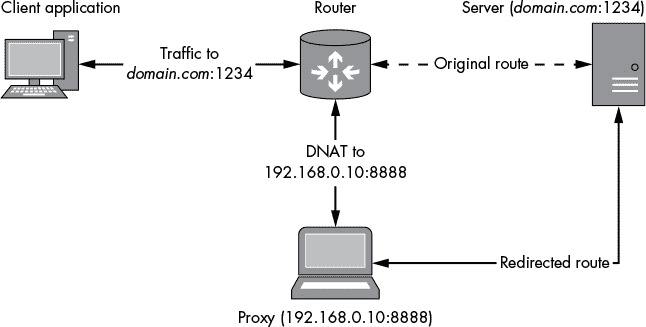

*图 4-3：DNAT 重定向到代理的示例*

图 4-3 展示了一个客户端应用程序通过路由器发送流量，目标是端口 1234 上的*[domain.com](http://domain.com)*。当数据包到达路由器时，路由器通常会将数据包转发到原始目标。但由于使用了 DNAT 来改变数据包的目标地址和端口为 192.168.0.10:8888，路由器将应用其转发规则并将数据包发送到能够捕获流量的代理机器。代理然后与服务器建立新连接，并将客户端发送的任何数据包转发给服务器。原始客户端与服务器之间的所有流量都可以被捕获和篡改。

配置 DNAT 取决于路由器运行的操作系统。（如果你的路由器运行 Windows，可能不行，因为支持该功能的功能并没有暴露给用户。）不同版本的类 Unix 操作系统和 macOS 的设置差异很大，所以我只会展示如何在 Linux 上配置 DNAT。首先，输入以下命令清除任何现有的 NAT 规则：

```
# iptables -t nat -F
```

接下来，以 root 用户身份运行以下命令，替换`ORIGIP`（源 IP）为要匹配流量的 IP 地址，并将`NEWIP`替换为你希望流量转发到的新目标 IP 地址。

```
 # iptables -t nat -A PREROUTING -d ORIGIP -j DNAT --to-destination NEWIP
```

新的 NAT 规则将把任何路由到`ORIGIP`的数据包重定向到`NEWIP`。（因为 DNAT 发生在 Linux 的常规路由规则之前，选择一个本地网络地址是安全的；DNAT 规则不会影响直接从 Linux 发送的流量。）要将规则仅应用于特定的 TCP 或 UDP，可以更改命令：

```
iptables -t nat -A PREROUTING -p PROTO -d ORIGIP --dport ORIGPORT -j DNAT \
    --to-destination NEWIP:NEWPORT
```

占位符`PROTO`（协议）应该是`tcp`或`udp`，取决于通过 DNAT 规则重定向的 IP 协议。`ORIGIP`（原始 IP）和`NEWIP`的值与之前相同。

你还可以配置`ORIGPORT`（原始端口）和`NEWPORT`，如果你希望改变目标端口。如果没有指定`NEWPORT`，则只会改变 IP 地址。

### **将流量转发到网关**

你已经设置好网关设备来捕获和修改流量。一切似乎都在正常工作，但有一个问题：你无法轻易更改你想要捕获的设备的网络配置。此外，你也有限制改变该设备连接的网络配置的能力。你需要一种方法来重新配置或欺骗发送设备，将流量转发到你的网关。你可以通过利用局域网，利用欺骗数据包的方式来实现这一点，方法包括欺骗 DHCP 或*地址解析协议（ARP）*。

#### ***DHCP 欺骗***

DHCP 旨在在 IP 网络上运行，以自动向节点分发网络配置。因此，如果我们能够伪造 DHCP 流量，我们就可以远程更改节点的网络配置。使用 DHCP 时，推送到节点的网络配置可以包括 IP 地址、默认网关、路由表、默认 DNS 服务器，甚至额外的自定义参数。如果你要测试的设备使用 DHCP 配置其网络接口，这种灵活性使得提供一个自定义配置变得非常容易，从而便于捕获网络流量。

DHCP 使用 UDP 协议向本地网络中的 DHCP 服务发送请求。协商网络配置时，会发送四种类型的 DHCP 数据包：

**发现** 发送到 IP 网络上的所有节点，以发现 DHCP 服务器

**提供** 由 DHCP 服务器发送给发送发现数据包的节点，以提供网络配置

**请求** 由发起节点发送，确认其接受该配置

**确认** 由服务器发送，确认配置完成

DHCP 的有趣之处在于，它使用未经身份验证的无连接协议来执行配置。即使网络中已有 DHCP 服务器，你也可能能够欺骗配置过程并更改节点的网络配置，包括默认网关地址，改为你控制的地址。这被称为 *DHCP 欺骗*。

要执行 DHCP 欺骗，我们将使用 *Ettercap*，这是一款免费工具，适用于大多数操作系统（尽管 Windows 并不被正式支持）。

1.  在 Linux 上，以 root 用户身份启动 Ettercap 图形模式：

    ```
    # ettercap -G
    ```

    你应该能看到如 图 4-4 所示的 Ettercap 图形界面。

    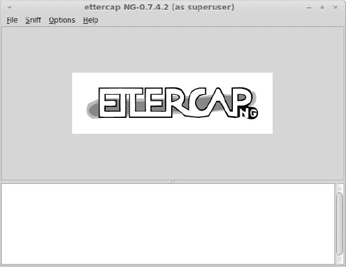

    *图 4-4：Ettercap 主图形界面*

1.  通过选择 **嗅探** ▸ **统一嗅探** 配置 Ettercap 的嗅探模式。

1.  如 图 4-5 所示，应该会提示你选择要嗅探的网络接口。选择连接到你想进行 DHCP 欺骗的网络的接口。（确保该网络接口的网络配置正确，因为 Ettercap 会自动将该接口配置的 IP 地址作为 DHCP 默认网关发送。）

    

    *图 4-5：选择嗅探接口*

1.  通过选择 **Mitm** ▸ **DHCP 欺骗** 启用 DHCP 欺骗。此时，应该会显示 图 4-6 中所示的对话框，允许你配置 DHCP 欺骗选项。

    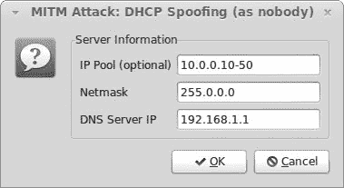

    *图 4-6：配置 DHCP 欺骗*

1.  IP 池字段设置要欺骗 DHCP 请求的 IP 地址范围。提供一个 IP 地址范围，该范围是您为捕获流量配置的网络接口的 IP 地址。例如，在 图 4-6 中，IP 池值设置为 10.0.0.10-50（短划线表示包括每个值的所有地址），因此我们将分配从 10.0.0.10 到 10.0.0.50 的 IP 地址。配置 Netmask 以匹配您的网络接口的子网掩码，以防止冲突。指定您选择的 DNS 服务器 IP。

1.  通过选择 **开始** ▸ **开始嗅探** 来开始嗅探。如果设备上的 DHCP 欺骗成功，Ettercap 日志窗口应如 图 4-7 所示。关键行是 Ettercap 响应 DHCP 请求发送的 `fake ACK`。

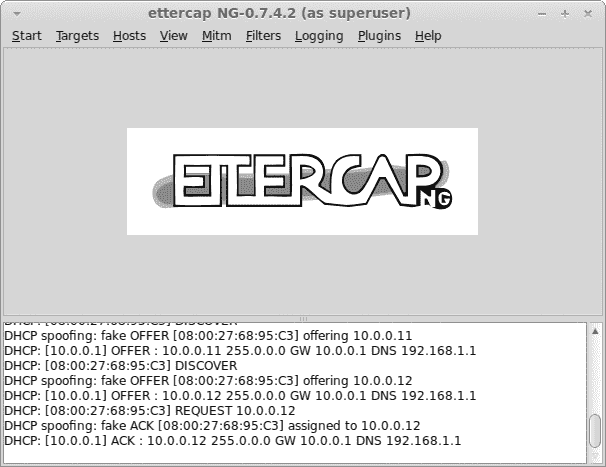

*图 4-7: 成功的 DHCP 欺骗*

这就是使用 Ettercap 进行 DHCP 欺骗的全部内容。如果您没有其他选择并且网络上已经存在 DHCP 服务器，则它可能非常强大。

#### ***ARP 毒化***

ARP 对以太网运行的 IP 网络的操作至关重要，因为 ARP 查找给定 IP 地址的以太网地址。没有 ARP，要在以太网上高效地通信 IP 流量将非常困难。ARP 的工作原理如下：当一个节点想要与同一以太网网络上的另一个节点通信时，它必须能够将 IP 地址映射到以太网 MAC 地址（这是以太网知道发送流量到目标节点的方式）。该节点生成一个 ARP 请求数据包（见 图 4-8），其中包含节点的 6 字节以太网 MAC 地址，当前 IP 地址以及目标节点的 IP 地址。该数据包通过以太网网络传输，目的 MAC 地址为 ff:ff:ff:ff:ff:ff，这是定义的广播地址。通常，以太网设备只处理目的地址与其地址匹配的数据包，但如果收到目的 MAC 地址设置为广播地址的数据包，它也会处理。

如果广播消息的接收者之一被分配了目标 IP 地址，则现在可以返回一个 ARP 响应，如 图 4-9 所示。该响应几乎与请求完全相同，只是发送者和目标字段被颠倒。因为发送者的 IP 地址应该对应于最初请求的目标 IP 地址，原始请求者现在可以提取发送者的 MAC 地址，并将其记住以备将来的网络通信，而无需重新发送 ARP 请求。

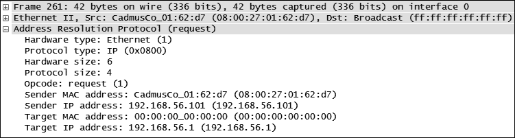

*图 4-8: ARP 请求数据包示例*

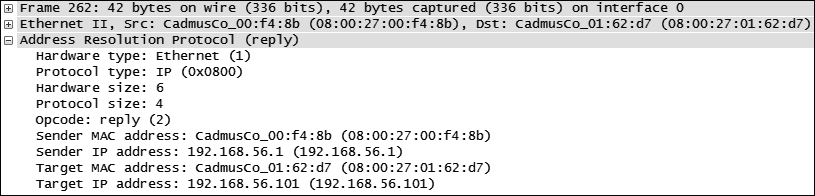

*图 4-9: ARP 响应示例*

如何利用 ARP 中毒为自己谋取利益？与 DHCP 类似，ARP 包没有认证，它们会被故意发送到以太网网络上的所有节点。因此，你可以通过向目标节点发送伪造的 ARP 包，欺骗它认为你拥有一个 IP 地址，并确保该节点将流量转发到你的恶意网关，进而中毒目标节点的 ARP 缓存。你可以使用 Ettercap 来伪造这些包，具体操作见图 4-10。

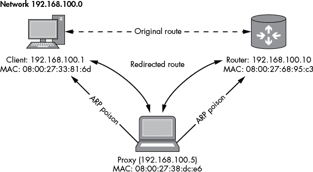

*图 4-10：ARP 中毒*

在图 4-10 中，Ettercap 向本地网络上的客户端和路由器发送伪造的 ARP 包。如果伪造成功，这些 ARP 包将会改变这两个设备的缓存 ARP 条目，使它们指向你的代理。

**警告**

*确保同时对客户端和路由器进行 ARP 包伪造，以确保你能够捕获到通信的两端。当然，如果你只需要捕获通信的一端，你只需对其中一个节点进行 ARP 中毒即可。*

要开始 ARP 中毒，请按照以下步骤操作：

1.  启动 Ettercap，并进入**Unified Sniffing**模式，就像你在 DHCP 伪造时所做的那样。

1.  选择要中毒的网络接口（即连接到你要中毒的节点的网络接口）。

1.  配置一个 ARP 中毒的主机列表。获取主机列表的最简单方法是通过选择**Hosts** ▸ **Scan For Hosts**让 Ettercap 扫描网络。根据网络的大小，扫描可能需要几秒钟到几小时的时间。扫描完成后，选择**Hosts** ▸ **Host List**，应该会弹出一个对话框，类似于图 4-11。

    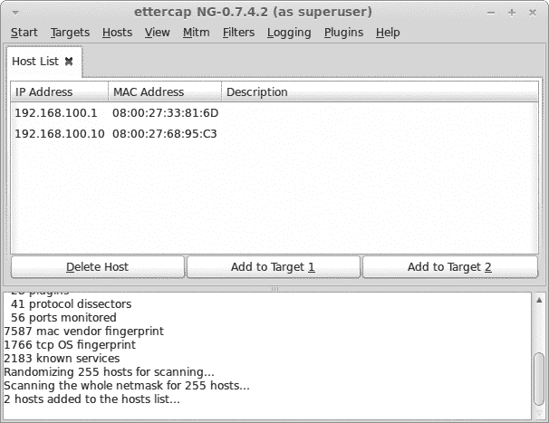

    *图 4-11：已发现的主机列表*

    如图 4-11 所示，我们已经找到两个主机。在这个例子中，一个是你想要捕获的客户端节点，IP 地址为 192.168.100.1，MAC 地址为 08:00:27:33:81:6d。另一个节点是通往互联网的网关，IP 地址为 192.168.100.10，MAC 地址为 08:00:27:68:95:c3。你很可能已经知道每个网络设备的 IP 地址配置，因此可以判断哪个是本地机器，哪个是远程机器。

1.  选择你的目标。选中列表中的一个主机并点击**Add to Target 1**；选择另一个你想要中毒的主机并点击**Add to Target 2**。（Target 1 和 Target 2 用于区分客户端和网关。）这将启用单向 ARP 中毒，其中只有从 Target 1 到 Target 2 的数据会被重定向。

1.  通过选择**Mitm** ▸ **ARP poisoning**开始 ARP 中毒。一个对话框应该会弹出。接受默认设置并点击**OK**。Ettercap 应该会尝试中毒你选择的目标的 ARP 缓存。由于 ARP 缓存需要刷新，ARP 中毒可能不会立即生效。如果中毒成功，客户端节点的显示应类似于图 4-12。

    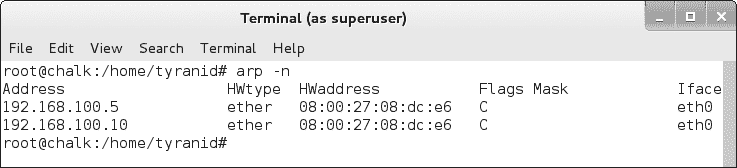

    *图 4-12：成功的 ARP 中毒*

图 4-12 显示路由器在 IP 192.168.100.10 处遭到中毒，且其 MAC 硬件地址已被修改为代理的 MAC 地址 08:00:27:08:dc:e6（对比，请参见 图 4-11 中的相应条目）。现在，任何从客户端发送到路由器的流量将被发送到代理（由 192.168.100.5 的 MAC 地址表示）。代理可以在捕获或修改流量后将其转发到正确的目标。

ARP 中毒相比 DHCP 欺骗的一个优势是，即使目标在本地网络上，你也可以将本地网络中的节点重定向到与你的网关通信。如果你不希望，它不需要破坏节点与外部网关之间的连接。

### **结束语**

在本章中，你学习了几种额外的方法来捕获并修改客户端与服务器之间的流量。我首先描述了如何将你的操作系统配置为 IP 网关，因为如果你能通过自己的网关转发流量，你将拥有多种可用的技术。

当然，仅仅让设备将流量发送到你的网络捕获设备并不总是容易的，因此使用诸如 DHCP 欺骗或 ARP 中毒等技术很重要，以确保流量发送到你的设备而不是直接发送到互联网。幸运的是，正如你所看到的，你不需要自定义工具来完成这项任务；你所需的所有工具要么已经包含在操作系统中（特别是如果你使用的是 Linux），要么可以轻松下载。
