## **5**

**来自网络的分析**

在第二章中，我讨论了如何捕获网络流量进行分析。现在是时候将这些知识付诸实践了。在本章中，我们将分析如何从聊天应用程序中捕获的网络协议流量，了解正在使用的协议。如果你能确定协议支持哪些功能，你就能评估它的安全性。

分析一个未知协议通常是渐进的。你从捕获网络流量开始，然后分析它，尝试理解流量中的每个部分代表什么。在本章中，我将向你展示如何使用 Wireshark 和一些自定义代码来检查一个未知的网络协议。我们的方法将包括提取结构和状态信息。

### **产生流量的应用程序：SuperFunkyChat**

本章的测试对象是我用 C# 编写的一个聊天应用程序，名为 SuperFunkyChat，它将在 Windows、Linux 和 macOS 上运行。可以从 GitHub 页面下载最新的预构建应用程序和源代码，网址是 *[`github.com/tyranid/ExampleChatApplication/releases/`](https://github.com/tyranid/ExampleChatApplication/releases/)*；请务必选择适合您平台的发布二进制文件。（如果您使用 Mono，请选择 .NET 版本，依此类推。）SuperFunkyChat 的示例客户端和服务器控制台应用程序分别名为 ChatClient 和 ChatServer。

下载完应用程序后，将发布文件解压到你计算机上的一个目录，以便运行每个应用程序。为了简化起见，所有示例命令行将使用 Windows 可执行二进制文件。如果你在 Mono 下运行，请在命令前加上主 *mono* 二进制文件的路径。当运行 .NET Core 的文件时，在命令前加上 *dotnet* 二进制文件。这些 .NET 文件将以 *.dll* 扩展名而非 *.exe* 扩展名。

#### ***启动服务器***

通过运行*ChatServer.exe*（不带参数）来启动服务器。如果成功，应该会打印一些基本信息，如清单 5-1 所示。

```
C:\SuperFunkyChat> ChatServer.exe
ChatServer (c) 2017 James Forshaw
WARNING: Don't use this for a real chat system!!!
Running server on port 12345 Global Bind False
```

*清单 5-1：运行 ChatServer 的示例输出*

**注意**

*请注意警告！此应用程序并未设计为一个安全的聊天系统。*

请注意，在清单 5-1 中，最后一行打印了服务器运行的端口（此处为 12345）以及服务器是否已绑定到所有接口（全局）。你可能不需要更改端口（`--port NUM`），但如果你希望客户端和服务器存在于不同的计算机上，可能需要更改应用程序是否绑定到所有接口。特别是在 Windows 上，这一点尤为重要。在 Windows 上捕获本地回环接口的流量并不容易；如果遇到困难，你可能需要在另一台计算机或虚拟机（VM）上运行服务器。要绑定到所有接口，请指定`--global`参数。

#### ***启动客户端***

在服务器运行的情况下，我们可以启动一个或多个客户端。启动客户端时，运行 *ChatClient.exe*（见清单 5-2），指定你在服务器上使用的用户名（用户名可以是你喜欢的任何名称），并指定服务器主机名（例如，`localhost`）。当你运行客户端时，你应该会看到类似于清单 5-2 所示的输出。如果看到任何错误，确保服务器已正确设置，包括要求绑定到所有接口或禁用服务器上的防火墙。

```
C:\SuperFunkyChat> ChatClient.exe USERNAME HOSTNAME
ChatClient (c) 2017 James Forshaw
WARNING: Don't use this for a real chat system!!!
Connecting to localhost:12345
```

*清单 5-2：运行 ChatClient 的示例输出*

启动客户端时，查看正在运行的服务器：你应该能在控制台看到类似于清单 5-3 的输出，表示客户端已经成功发送了一个“Hello”数据包。

```
Connection from 127.0.0.1:49825
Received packet ChatProtocol.HelloProtocolPacket
Hello Packet for User: alice HostName: borax
```

*清单 5-3：客户端连接时服务器的输出*

#### ***客户端之间的通信***

完成上述步骤后，你应该能够连接多个客户端，以便它们之间进行通信。要向所有用户发送消息，可以在命令行中输入消息并按 ENTER 键。

ChatClient 还支持一些其他命令，这些命令都以斜杠（`/`）开头，具体如下表 5-1 所述。

**表 5-1：** ChatClient 应用程序的命令

| **命令** | **描述** |
| --- | --- |
| `/quit [消息]` | 带可选消息退出客户端 |
| `/msg 用户消息` | 向特定用户发送消息 |
| `/list` | 列出系统中的其他用户 |
| `/help` | 打印帮助信息 |

现在你已经准备好在 SuperFunkyChat 客户端和服务器之间生成流量。让我们通过使用 Wireshark 捕获并检查一些流量来开始分析。

### **Wireshark 分析速成课程**

在第二章中，我介绍了 Wireshark，但并没有详细讲解如何使用 Wireshark 进行分析，而不仅仅是捕获流量。由于 Wireshark 是一个非常强大且全面的工具，这里我只会简单介绍它的一些功能。当你在 Windows 上第一次启动 Wireshark 时，你应该会看到一个类似于图 5-1 所示的窗口。

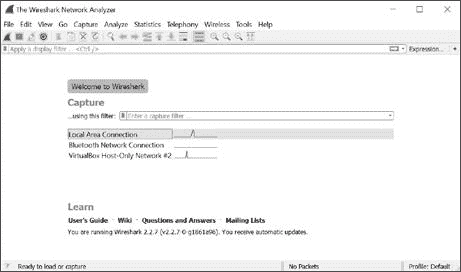

*图 5-1：Windows 上的 Wireshark 主窗口*

主窗口允许你选择捕获流量的接口。为了确保我们只捕获想要分析的流量，我们需要在接口上配置一些选项。选择 **Capture** ▸ **Options** 菜单项。图 5-2 显示了打开的选项对话框。

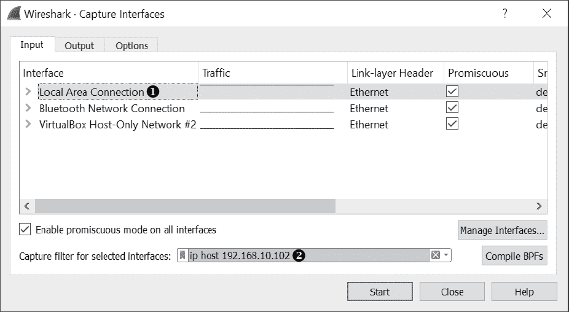

*图 5-2：Wireshark 捕获接口对话框*

选择你希望捕获流量的网络接口，如图 ➊ 所示。因为我们使用的是 Windows 系统，选择 **本地连接**，这是我们的主要以太网连接；我们无法轻易地从本地主机捕获流量。然后设置一个捕获过滤器 ➋。在这种情况下，我们指定过滤器 **ip host 192.168.10.102**，以限制只捕获到或来自 IP 地址 192.168.10.102 的流量。（我们使用的 IP 地址是聊天服务器的地址。根据你的配置，适当更改 IP 地址。）点击 **开始** 按钮开始捕获流量。

#### ***生成网络流量并捕获数据包***

数据包分析的主要方法是尽可能多地生成来自目标应用程序的流量，以提高你找到其各种协议结构的机会。例如，列表 5-4 显示了 `alice` 的单个 ChatClient 会话。

```
# alice - Session
> Hello There!
< bob: I've just joined from borax
< bob: How are you?
< bob: This is nice isn't it?
< bob: Woo
< Server: 'bob' has quit, they said 'I'm going away now!'
< bob: I've just joined from borax
< bob: Back again for another round.
< Server: 'bob' has quit, they said 'Nope!'
> /quit
< Server: Don't let the door hit you on the way out!
```

*列表 5-4：`alice` 的单个 ChatClient 会话。*

列表 5-5 和 列表 5-6 显示了 `bob` 的两个会话。

```
# bob - Session 1
> How are you?
> This is nice isn't it?
> /list
< User List
< alice - borax
> /msg alice Woo
> /quit
< Server: Don't let the door hit you on the way out!
```

*列表 5-5：`bob` 的第一次 ChatClient 会话*

```
# bob - Session 2
> Back again for another round.
> /quit Nope!
< Server: Don't let the door hit you on the way out!
```

*列表 5-6：`bob` 的第二次 ChatClient 会话*

我们为 `bob` 运行了两个会话，以便捕获可能仅发生在会话之间的连接或断开连接事件。在每个会话中，右尖括号（`>`）表示要输入 ChatClient 的命令，左尖括号（`<`）表示从服务器写入控制台的响应。你可以执行这些会话捕获中的命令，重现本章中的其余结果以进行分析。

现在转到 Wireshark。如果你已经正确配置了 Wireshark 并将其绑定到正确的接口，你应该开始看到捕获的数据包，如 图 5-3 所示。

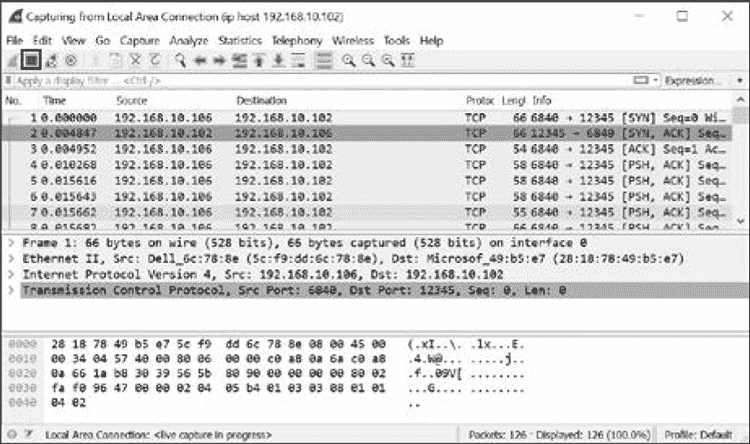

*图 5-3：Wireshark 中捕获的流量*

运行完示例会话后，点击 **停止** 按钮（高亮显示）停止捕获，并保存数据包以备后续使用（如果需要）。

#### ***基础分析***

让我们看看我们捕获的流量。要概览捕获期间发生的通信，可以在统计菜单中选择相应的选项。例如，选择 **统计** ▸ **会话**，你应该看到一个新窗口显示高层次的会话信息，如 图 5-4 中会话窗口所示的 TCP 会话。

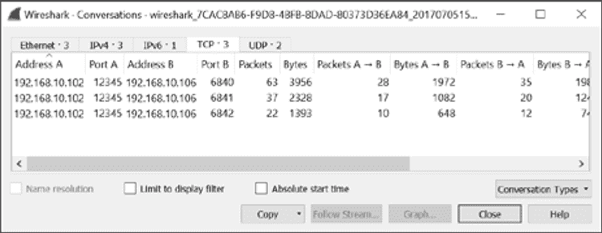

*图 5-4：Wireshark 会话窗口*

会话窗口显示了在捕获流量中三个独立的 TCP 会话。我们知道 SuperFunkyChat 客户端应用程序使用端口 12345，因为我们看到有三个独立的 TCP 会话来自端口 12345。 这些会话应与 列表 5-4、列表 5-5 和 列表 5-6 中显示的三个客户端会话相对应。

#### ***读取 TCP 会话的内容***

要查看单个对话的捕获流量，请在“会话”窗口中选择一个对话并点击**跟踪流**按钮。此时应该会弹出一个新窗口，显示流的内容，内容以 ASCII 文本形式呈现，如图 5-5 所示。

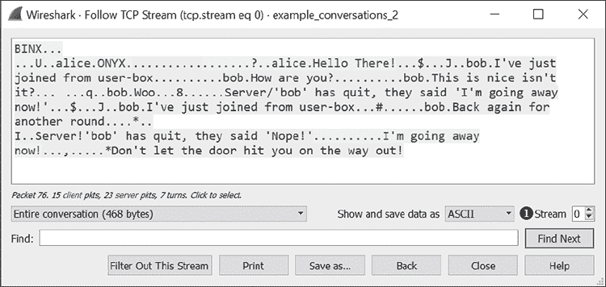

*图 5-5：在 Wireshark 的“跟踪 TCP 流”视图中显示 TCP 会话内容*

Wireshark 将无法表示为 ASCII 字符的数据替换为一个点字符，但即使进行字符替换，我们也能清楚地看到许多数据以明文形式发送。也就是说，网络协议显然不是纯文本协议，因为数据的控制信息是不可打印字符。我们之所以看到文本，是因为 SuperFunkyChat 的主要目的是发送文本消息。

Wireshark 使用不同的颜色显示会话中的进出流量：粉色表示出站流量，蓝色表示入站流量。在 TCP 会话中，出站流量来自发起 TCP 会话的客户端，而入站流量来自 TCP 服务器。因为我们已经捕获了所有到服务器的流量，接下来让我们看一下另一段对话。要更改对话，请将图 5-5 中的流号 ➊更改为 1\. 现在你应该能看到一段不同的对话，比如图 5-6 中的那一段。

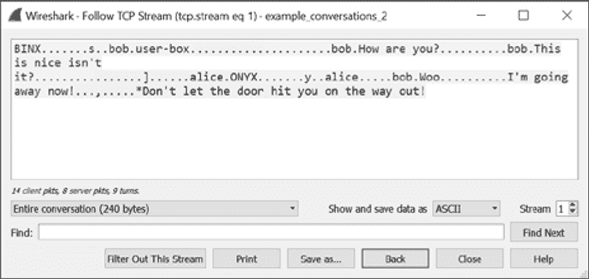

*图 5-6：来自不同客户端的第二个 TCP 会话*

将图 5-6 与图 5-5 进行比较，你会看到两个会话的详细信息不同。在图 5-6 中客户端发送的某些文本，比如“你好吗？”，会显示为服务器在图 5-5 中接收到的内容。接下来，我们将尝试确定协议中的那些二进制部分表示什么。

### **通过十六进制转储识别数据包结构**

此时，我们知道我们的协议似乎既包含二进制数据也包含文本，这表明仅查看可打印文本不足以确定协议中所有的各种结构。

要深入分析，我们首先回到 Wireshark 的“跟踪 TCP 流”视图，如图 5-5 所示，并将“显示并保存数据为”下拉菜单更改为**十六进制转储**选项。此时流应该看起来像图 5-7 中的样子。

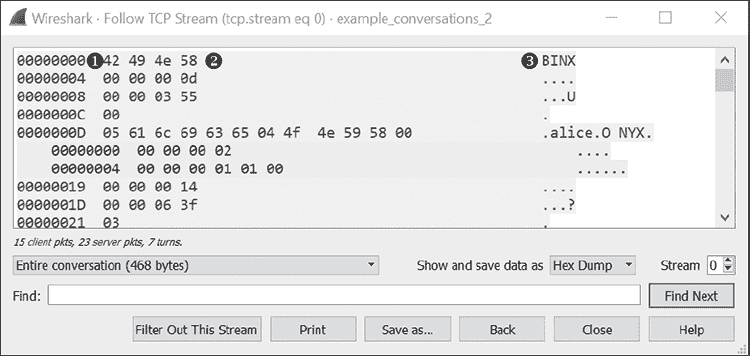

*图 5-7：流的十六进制转储视图*

十六进制转储视图显示了三列信息。最左边的列 ➊ 是特定方向上数据流的字节偏移。例如，偏移量为 0 的字节是该方向上发送的第一个字节，偏移量为 4 的字节是第五个字节，以此类推。中间的列 ➋ 显示的是字节的十六进制转储。右边的列 ➌ 是 ASCII 表示形式，我们之前在 图 5-5 中看到过。

#### ***查看单个数据包***

注意在 图 5-7 中，中间列显示的字节块长度是如何变化的。再次与 图 5-6 进行比较，你会发现，除了按方向分隔外，图 5-6 中的所有数据都呈现为一个连续的块。相比之下，图 5-7 中的数据可能仅显示为几个 4 字节的小块，然后是一个 1 字节的块，最后是一个包含主要文本数据的大块。

我们在 Wireshark 中看到的是单个数据包：每个块都是一个单独的 TCP 数据包，或称为 *段*，可能仅包含 4 字节的数据。TCP 是基于流的协议，这意味着在你读取和写入数据到 TCP 套接字时，连续的数据块之间没有真正的边界。然而，从物理角度来看，实际上并不存在一个真正的基于流的网络传输协议。相反，TCP 发送的是由包含信息的 TCP 头部组成的单个数据包，这些信息包括源端口和目标端口号以及数据内容。

事实上，如果我们返回到主 Wireshark 窗口，我们可以找到一个数据包来证明 Wireshark 正在显示单个 TCP 数据包。选择 **编辑** ▸ **查找数据包**，主窗口中将出现一个额外的下拉菜单，如图 5-8 所示。

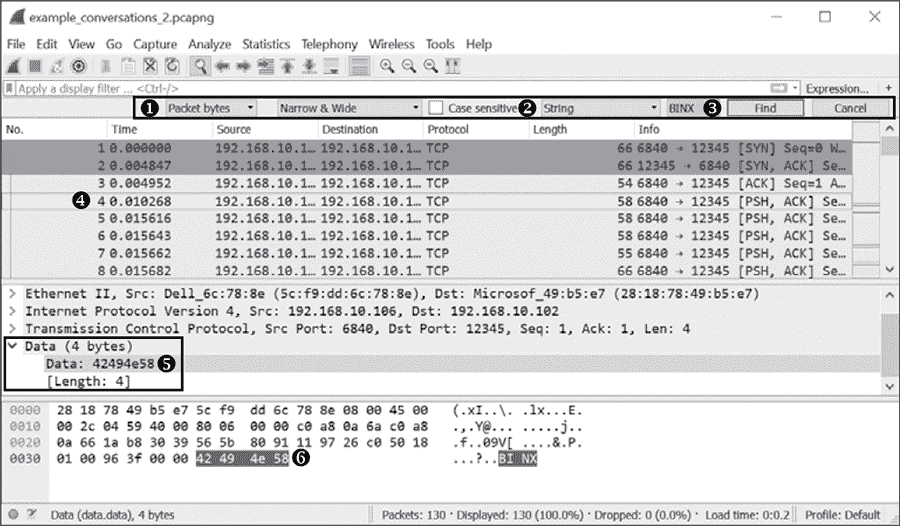

*图 5-8：在 Wireshark 主窗口中查找数据包*

我们将在图 5-7 中找到第一个显示的值，即字符串`BINX`。为此，请按照图 5-8 所示填写查找选项。第一个选择框表示要在数据包捕获中查找的位置。指定要在数据包字节➊中进行查找。第二个选择框保持为“Narrow & Wide”，这表示您要查找 ASCII 和 Unicode 字符串。还请保持“区分大小写”框未选中，并在第三个下拉菜单中指定要查找字符串值➋。然后输入我们要查找的字符串值，在本例中是字符串`BINX` ➌。最后，点击**查找**按钮，主窗口应该会自动滚动并高亮显示 Wireshark 找到的第一个包含`BINX`字符串的数据包➍。在位于➎的中间窗口中，您应该看到数据包包含 4 个字节，并且您可以在底部窗口看到原始数据，这表明我们找到了`BINX`字符串➏。现在我们知道，Wireshark 在图 5-8 中显示的十六进制转储视图代表数据包边界，因为`BINX`字符串位于一个独立的数据包中。

#### ***确定协议结构***

为了简化协议结构的确定，最好只观察网络通信的一个方向。例如，我们只看 Wireshark 中的出站方向（从客户端到服务器）。回到“跟踪 TCP 流”视图，在“显示并保存数据为”下拉菜单中选择**十六进制转储**选项。然后，从➊的下拉菜单中选择从客户端到服务器的流量方向，端口号为 12345，如图 5-9 所示。

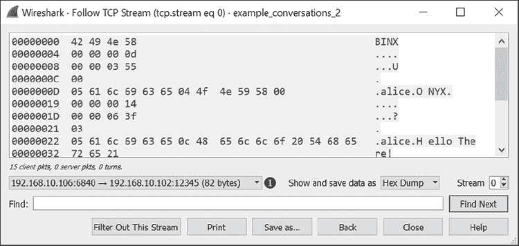

*图 5-9：仅显示出站方向的十六进制转储*

点击**另存为 . . .**按钮，将出站流量的十六进制转储复制到文本文件中，方便检查。列表 5-7 显示了保存为文本的小部分流量。

```
00000000  42 49 4e 58                                        BINX➊
00000004  00 00 00 0d                                        ....➋
00000008  00 00 03 55                                        ...U➌
0000000C  00                                                 .➍
0000000D  05 61 6c 69 63 65 04 4f  4e 59 58 00               .alice.O NYX.➎
00000019  00 00 00 14                                        ....
0000001D  00 00 06 3f                                        ...?
00000021  03                                                 .
00000022  05 61 6c 69 63 65 0c 48  65 6c 6c 6f 20 54 68 65   .alice.H ello The
00000032  72 65 21                                           re!
--snip--
```

*列表 5-7：出站流量的片段*

出站流开始时有四个字符`BINX` ➊。这些字符在数据流的其余部分中从未重复出现，如果您比较不同的会话，您会发现流的开头总是这四个字符。如果我对这个协议不熟悉，此时我的直觉是，这是一个从客户端发送到服务器的魔法值，用来告诉服务器它正在与一个有效的客户端通信，而不是与一个偶然连接到服务器 TCP 端口的其他应用程序通信。

沿着数据流，我们看到发送了四个块。位于➋和➌的块是 4 字节，位于➍的块是 1 字节，而位于➎的块较大，包含大部分可读文本。我们来考虑位于➋的第一个 4 字节块。这些字节可能代表一个小数字，比如十六进制值 0xD 或十进制值 13 吗？

回顾在第三章中讨论的标签、长度、值（TLV）模式。TLV 是一种非常简单的模式，其中每个数据块都由一个表示后续数据长度的值进行分隔。这个模式对于基于流的协议尤其重要，比如那些运行在 TCP 上的协议，因为如果没有这个模式，应用程序就无法知道它需要从连接中读取多少数据来处理协议。如果我们假设第一个值是数据的长度，这个长度与数据包其余部分的长度是否匹配呢？让我们来验证一下。

统计➋、➌、➍和➎处数据块的总字节数，这些数据看起来是一个单独的数据包，结果为 21 字节，比我们预期的 13 字节多了 8 字节（即整数值 0xD）。长度块的值可能没有计入它自己的长度。如果我们去掉长度块（4 字节），结果是 17 字节，比目标长度多了 4 字节，但更接近了。我们还注意到在➌处有一个其他未知的 4 字节数据块，它可能紧跟在潜在的长度块之后，也许它没有被计算在内。当然，这只是猜测，事实更为重要，因此我们需要进行一些测试。

#### ***测试我们的假设***

在进行这样的分析时，我通常会停止盯着十六进制转储，因为这不是最有效的方法。验证我们的假设是否正确的一种快速方法是导出流的数据，并编写一些简单的代码来解析结构。在本章后面，我们将为 Wireshark 编写一些代码，在 GUI 内进行所有测试，但现在我们将使用 Python 在命令行中实现代码。

为了将数据导入 Python，我们本可以添加对 Wireshark 捕获文件的支持，但现在我们只会将数据包字节导出到一个文件。要从图 5-9 中显示的对话框中导出数据包，请按照以下步骤操作：

1.  在“显示和保存数据为”下拉菜单中，选择**原始**选项。

1.  点击**另存为**，将出站数据包导出为名为*bytes_outbound.bin*的二进制文件。

我们还需要导出入站数据包，所以切换到并选择入站会话。然后，使用前面提到的步骤保存原始入站字节，并将文件命名为*bytes_inbound.bin*。

现在，在命令行中使用 XXD 工具（或类似工具）确保我们成功地导出了数据，如清单 5-8 所示。

```
$ xxd bytes_outbound.bin
00000000: 4249 4e58 0000 000f 0000 0473 0003 626f  BINX.......s..bo
00000010: 6208 7573 6572 2d62 6f78 0000 0000 1200  b.user-box......
00000020: 0005 8703 0362 6f62 0c48 6f77 2061 7265  .....bob.How are
00000030: 2079 6f75 3f00 0000 1c00 0008 e303 0362   you?..........b
00000040: 6f62 1654 6869 7320 6973 206e 6963 6520  ob.This is nice
00000050: 6973 6e27 7420 6974 3f00 0000 0100 0000  isn't it?.......
00000060: 0606 0000 0013 0000 0479 0505 616c 6963  .........y..alic
00000070: 6500 0000 0303 626f 6203 576f 6f00 0000  e.....bob.Woo...
00000080: 1500 0006 8d02 1349 276d 2067 6f69 6e67  .......I'm going
00000090: 2061 7761 7920 6e6f 7721                  away now!
```

*清单 5-8：导出的数据包字节*

#### ***使用 Python 解析协议***

现在我们将编写一个简单的 Python 脚本来解析协议。因为我们只是从文件中提取数据，所以不需要编写任何网络代码；我们只需要打开文件并读取数据。我们还需要从文件中读取二进制数据——具体来说，是网络字节顺序的整数值，表示长度和未知的 4 字节数据块。

##### **执行二进制转换**

我们可以使用内置的 Python struct 库来进行二进制转换。如果出现任何问题，脚本应该立即失败，例如无法读取我们预期的所有数据。如果长度是 100 字节，而我们只能读取 20 字节，则读取应该失败。如果在解析文件时没有发生错误，我们可以更有信心地认为我们的分析是正确的。清单 5-9 展示了第一个实现版本，适用于 Python 2 和 3。

```
   from struct import unpack
   import sys
   import os
 # Read fixed number of bytes
➊ def read_bytes(f, l):
       bytes = f.read(l)
    ➋ if len(bytes) != l:
           raise Exception("Not enough bytes in stream")
       return bytes

   # Unpack a 4-byte network byte order integer
➌ def read_int(f):
       return unpack("!i", read_bytes(f, 4))[0]

   # Read a single byte
➍ def read_byte(f):
       return ord(read_bytes(f, 1))

   filename = sys.argv[1]
   file_size = os.path.getsize(filename)

   f = open(filename, "rb")
➎ print("Magic: %s" % read_bytes(f, 4))

   # Keep reading until we run out of file
➏ while f.tell() < file_size:
       length = read_int(f)
       unk1 = read_int(f)
       unk2 = read_byte(f)
       data = read_bytes(f, length - 1)
       print("Len: %d, Unk1: %d, Unk2: %d, Data: %s"
           % (length, unk1, unk2, data))
```

*清单 5-9：解析协议数据的示例 Python 脚本*

让我们分析一下脚本中的关键部分。首先，我们定义了一些辅助函数来从文件中读取数据。函数`read_bytes()` ➊从文件中读取指定数量的字节。如果文件中的字节不足以满足读取要求，将抛出一个异常，表示发生了错误 ➋。我们还定义了一个函数`read_int()` ➌，用于按网络字节顺序读取 4 字节整数，其中整数的最高有效字节位于文件的最前面，并且定义了一个读取单个字节的函数 ➍。在脚本的主体部分，我们打开命令行中传递的文件，并首先读取一个 4 字节的值 ➎，我们期望它是魔法值`BINX`。然后代码进入一个循环 ➏，只要还有数据可以读取，就继续读取长度、两个未知值，最后是数据，并将这些值打印到控制台。

当你运行清单 5-9 脚本并传入一个二进制文件的名称时，如果我们分析认为文件的前 4 字节是网络上发送的数据长度，则文件中的所有数据应该会被正确解析且不会产生错误。清单 5-10 展示了在 Python 3 中的示例输出，Python 3 在显示二进制字符串方面比 Python 2 更好。

```
$ python3 read_protocol.py bytes_outbound.bin
Magic: b'BINX'
Len: 15, Unk1: 1139, Unk2: 0, Data: b'\x03bob\x08user-box\x00'
Len: 18, Unk1: 1415, Unk2: 3, Data: b'\x03bob\x0cHow are you?'
Len: 28, Unk1: 2275, Unk2: 3, Data: b"\x03bob\x16This is nice isn't it?"
Len: 1, Unk1: 6, Unk2: 6, Data: b''
Len: 19, Unk1: 1145, Unk2: 5, Data: b'\x05alice\x00\x00\x00\x03\x03bob\x03Woo'
Len: 21, Unk1: 1677, Unk2: 2, Data: b"\x13I'm going away now!"
```

*清单 5-10：运行清单 5-9 时对二进制文件的示例输出*

##### **处理入站数据**

如果你对导出的入站数据集运行清单 5-9，你将立即遇到错误，因为入站协议中没有魔法字符串`BINX`，如清单 5-11 所示。当然，如果我们的分析有误，长度字段并不像我们想象的那么简单，那么这正是我们所预期的。

```
$ python3 read_protocol.py bytes_inbound.bin
Magic: b'\x00\x00\x00\x02'
Length: 1, Unknown1: 16777216, Unknown2: 0, Data: b''
Traceback (most recent call last):
  File "read_protocol.py", line 31, in <module>
    data = read_bytes(f, length - 1)
  File "read_protocol.py", line 9, in read_bytes
    raise Exception("Not enough bytes in stream")
Exception: Not enough bytes in stream
```

*清单 5-11：清单 5-9 在入站数据上生成的错误*

我们可以通过稍微修改脚本，增加对魔法值的检查，并在魔法值不等于字符串`BINX`时重置文件指针，从而解决这个错误。在原始脚本中，在文件打开后添加以下行，如果魔法值不正确，则将文件指针重置到开始位置。

```
if read_bytes(f, 4) != b'BINX': f.seek(0)
```

现在，通过这个小修改，脚本将在入站数据上成功执行，并生成清单 5-12 中显示的输出。

```
$ python3 read_protocol.py bytes_inbound.bin
Len: 2, Unk1: 1, Unk2: 1, Data: b'\x00'
Len: 36, Unk1: 3146, Unk2: 3, Data: b"\x03bob\x1eI've just joined from user-box"
Len: 18, Unk1: 1415, Unk2: 3, Data: b'\x03bob\x0cHow are you?'
```

*清单 5-12：修改后的脚本在入站数据上的输出*

##### **深入挖掘协议中的未知部分**

我们可以使用清单 5-10 和清单 5-12 中的输出，开始深入探索协议中未知的部分。首先，考虑标记为`Unk1`的字段。它的值似乎对每个数据包都不同，但这些值较小，范围从 1 到 3146。

但输出中最有信息量的部分是以下两项，一项来自出站数据，一项来自入站数据。

```
OUTBOUND: Len: 1, Unk1: 6, Unk2: 6, Data: b''
INBOUND:  Len: 2, Unk1: 1, Unk2: 1, Data: b'\x00'
```

注意到在这两个条目中，`Unk1`的值与`Unk2`相同。这可能是巧合，但两个条目具有相同的值可能表明某些重要的东西。还要注意，第二个条目的长度是`2`，包括`Unk2`值和一个`0`数据值，而第一个条目的长度只有`1`，在`Unk2`值后没有跟随数据。也许`Unk1`直接与数据包中的数据有关？让我们来看看。

##### **计算校验和**

在网络协议中添加校验和是很常见的。校验和的典型示例就是对你想检查是否有错误的所有字节求和。如果我们假设未知值是一个*简单*的校验和，我们可以将前面部分中提到的出站和入站数据包中的所有字节求和，得到表 5-2 中显示的计算结果。

**表 5-2：** 示例数据包的校验和测试

| **未知值** | **数据字节** | **数据字节的和** |
| --- | --- | --- |
| 6 | 6 | 6 |
| 1 | 1, 0 | 1 |

尽管表 5-2 似乎确认了未知值与我们对非常简单数据包的简单校验和预期相符，但我们仍然需要验证校验和是否适用于更大和更复杂的数据包。有两种简单方法可以确定我们是否正确猜测未知值是数据的校验和。第一种方法是从客户端发送简单的递增消息（比如*A*，然后是*B*，然后是*C*，依此类推），捕获数据并进行分析。如果校验和是简单的加法，那么每条递增的消息值应该增加 1。另一种方法是向脚本中添加计算校验和的函数，看看捕获的网络数据与我们计算的值之间是否匹配。

为了测试我们的假设，将清单 5-13 中的代码添加到清单 5-7 中的脚本中，并在读取数据后调用它来计算校验和。然后，只需比较从网络捕获中提取的`Unk1`值和计算值，看看我们计算的校验和是否匹配。

```
def calc_chksum(unk2, data):
    chksum = unk2
    for i in range(len(data)):
        chksum += ord(data[i:i+1])
    return chksum
```

*清单 5-13：计算数据包的校验和*

结果确实如此！计算出来的数字与`Unk1`的值匹配。因此，我们已经发现了协议结构中的下一部分。

##### **发现标签值**

现在我们需要确定`Unk2`可能代表什么。由于`Unk2`的值被视为数据包的数据的一部分，因此它很可能与所发送内容的含义有关。然而，正如我们在清单 5-7 的➍处所看到的，`Unk2`的值作为一个单字节值被写入网络，这表明它实际上与数据是分开的。也许这个值表示 TLV 模式中的标签部分，就像我们怀疑长度（Length）是该结构中的值部分一样。

为了确定`Unk2`是否确实是标签值，并代表如何解释其余数据，我们将尽可能多地测试 ChatClient，尝试所有可能的命令，并捕获结果。然后，我们可以进行基本分析，比较发送相同类型命令时`Unk2`的值，以查看`Unk2`的值是否总是相同。

例如，考虑清单 5-4、清单 5-5 和清单 5-6 中的客户端会话。在清单 5-5 中的会话里，我们连续发送了两个消息。我们已经通过清单 5-10 中的 Python 脚本分析了这个会话。为了简便起见，清单 5-14 只显示了前三个捕获数据包（使用的是最新版本的脚本）。

```
Unk2: 0➊, Data: b'\x03bob\x08user-box\x00'
Unk2: 3➋, Data: b'\x03bob\x0cHow are you?'
Unk2: 3➌, Data: b"\x03bob\x16This is nice isn't it?"
*SNIP*
```

*清单 5-14：来自清单 5-5 会话的前三个数据包*

第一个数据包➊与我们在清单 5-5 客户端会话中输入的内容无关。未知值是`0`。我们在清单 5-5 中发送的两个消息在数据包的`Data`部分清晰可见，分别位于➋和➌处。这两条消息的`Unk2`值为`3`，与第一个数据包的`0`值不同。根据这一观察，我们可以推测`3`的值可能代表发送消息的数据包，如果是这样的话，我们就会期望在每次发送单个值时，连接中都使用`3`这个值。实际上，如果你现在分析包含发送消息的其他会话，你会发现每次发送消息时，都会使用相同的`3`值。

**注意**

*在我的分析阶段，我会回到各种客户端会话，并尝试将我在客户端执行的操作与发送的消息进行关联。同时，我会将从服务器收到的消息与客户端的输出进行关联。当然，当我们在客户端使用的命令与网络上的结果之间可能有一一对应关系时，这很容易做到。然而，更复杂的协议和应用程序可能不会这么明显，因此你需要进行大量的关联和测试，试图发现协议中特定部分的所有可能值。*

我们可以假设 `Unk2` 代表 TLV 结构中的 Tag 部分。通过进一步分析，我们可以推断出可能的 Tag 值，如 表 5-3 所示。

**表 5-3：** 从捕获的会话分析推测的命令

| **命令编号** | **方向** | **描述** |
| --- | --- | --- |
| 0 | 出站 | 客户端连接到服务器时发送。 |
| 1 | 入站 | 服务器在客户端向服务器发送命令 `'0'` 后发送。 |
| 2 | 双向 | 客户端使用 `/quit` 命令时发送。服务器响应时发送。 |
| 3 | 双向 | 客户端发送给所有用户的消息。服务器发送所有用户的消息。 |
| 5 | 出站 | 客户端使用 `/msg` 命令时发送。 |
| 6 | 出站 | 客户端使用 `/list` 命令时发送。 |
| 7 | 入站 | 服务器响应 `/list` 命令时发送。 |

**注意**

*我们已经建立了一个命令表，但仍然不知道每个命令的数据是如何表示的。为了进一步分析这些数据，我们将返回到 Wireshark，编写代码来解析该协议并在图形界面中显示出来。处理简单的二进制文件可能很困难，尽管我们可以使用工具解析从 Wireshark 导出的捕获文件，但最好让 Wireshark 处理很多这项工作。*

### **在 Lua 中开发 Wireshark 解析器**

使用 Wireshark 分析已知协议，如 HTTP，很容易，因为该软件可以提取所有必要的信息。但自定义协议则稍微有些挑战性：为了分析这些协议，我们需要手动从网络流量的字节表示中提取所有相关信息。

幸运的是，你可以使用 Wireshark 插件协议解析器来为 Wireshark 添加额外的协议分析功能。过去，做到这一点需要用 C 语言构建一个解析器，以便与特定版本的 Wireshark 一起工作，但现代版本的 Wireshark 支持 Lua 脚本语言。你在 Lua 中编写的脚本同样可以与 tshark 命令行工具一起使用。

本节介绍如何为我们一直在分析的 SuperFunkyChat 协议开发一个简单的 Lua 脚本解析器。

**注意**

*关于在 Lua 中开发和 Wireshark API 的详细信息超出了本书的范围。如需了解如何在 Lua 中开发，请访问其官方网站 [`www.lua.org/docs.html`](https://www.lua.org/docs.html)。Wireshark 的官方网站，特别是 Wiki，是访问各种教程和示例代码的最佳去处* ([`wiki.wireshark.org/Lua/`](https://wiki.wireshark.org/Lua/))。

在开发解析器之前，请确保你的 Wireshark 版本支持 Lua，可以通过 **帮助** ▸ **关于 Wireshark** 对话框来检查。如果你在对话框中看到 *Lua* 字样，如 图 5-10 所示，说明一切正常，可以继续操作。

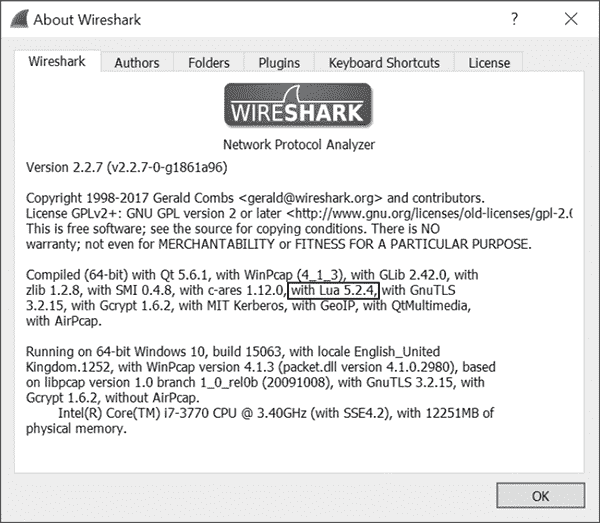

*图 5-10：Wireshark 关于对话框显示 Lua 支持*

**注意**

*如果你以 root 用户身份在类 Unix 系统上运行 Wireshark，Wireshark 通常会出于安全原因禁用 Lua 支持，且你需要将 Wireshark 配置为非特权用户来捕获并运行 Lua 脚本。请参阅你的操作系统的 Wireshark 文档，了解如何安全地进行配置。*

你可以为 Wireshark 捕获的几乎任何协议开发解码器，包括 TCP 和 UDP。开发 UDP 协议的解码器比 TCP 更容易，因为每个捕获的 UDP 包通常包含了解码器所需的所有信息。而对于 TCP，你需要处理跨多个数据包的数据（这正是我们在使用 Python 脚本处理 SuperFunkyChat 时需要考虑数据长度块问题的原因，见清单 5-9）。由于 UDP 更易处理，我们将专注于开发 UDP 解码器。

方便的是，SuperFunkyChat 支持通过在启动客户端时传递 `--udp` 命令行参数来启用 UDP 模式。在捕获数据时发送此标志，你应该能看到类似于图 5-11 所示的包。（注意，Wireshark 错误地试图将流量解析为不相关的 GVSP 协议，如协议列 ➊ 所示。实现我们自己的解码器将修正这一错误的协议选择。）

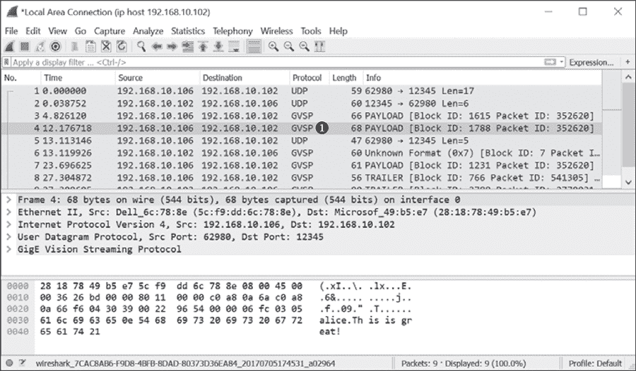

*图 5-11: Wireshark 显示捕获的 UDP 流量*

加载 Lua 文件的一种方法是将脚本放置在 Windows 系统中的 *%APPDATA%\Wireshark\plugins* 目录下，或在 Linux 和 macOS 系统中的 *~/.config/wireshark/plugins* 目录下。你也可以通过在命令行中指定 Lua 脚本来加载，方法如下，将路径信息替换为你脚本的存储位置：

```
wireshark -X lua_script:</path/to/script.lua>
```

如果你的脚本语法有误，你应该会看到类似于图 5-12 所示的消息对话框。（虽然这不是开发过程中最高效的方式，但只要你只是进行原型开发，这样也没问题。）

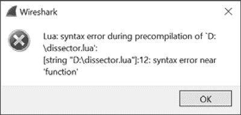

*图 5-12: Wireshark Lua 错误对话框*

#### ***创建解码器***

要为 SuperFunkyChat 协议创建协议解码器，首先创建解码器的基本框架，并将其注册到 Wireshark 的 UDP 端口 12345 的解码器列表中。将清单 5-15 复制到一个名为 *dissector.lua* 的文件中，并将其与相应的 UDP 流量数据包捕获一起加载到 Wireshark 中。它应该能够无误地运行。

dissector.lua

```
   -- Declare our chat protocol for dissection
➊ chat_proto = Proto("chat","SuperFunkyChat Protocol")
   -- Specify protocol fields
➋ chat_proto.fields.chksum = ProtoField.uint32("chat.chksum", "Checksum",
                                                base.HEX)
   chat_proto.fields.command = ProtoField.uint8("chat.command", "Command")
   chat_proto.fields.data = ProtoField.bytes("chat.data", "Data")

   -- Dissector function
   -- buffer: The UDP packet data as a "Testy Virtual Buffer"
   -- pinfo: Packet information
   -- tree: Root of the UI tree
➌ function chat_proto.dissector(buffer, pinfo, tree)
       -- Set the name in the protocol column in the UI
    ➍ pinfo.cols.protocol = "CHAT"

       -- Create sub tree which represents the entire buffer.
    ➎ local subtree = tree:add(chat_proto, buffer(),
                                "SuperFunkyChat Protocol Data")
       subtree:add(chat_proto.fields.chksum, buffer(0, 4))
       subtree:add(chat_proto.fields.command, buffer(4, 1))
       subtree:add(chat_proto.fields.data, buffer(5))
   end

   -- Get UDP dissector table and add for port 12345
➏ udp_table = DissectorTable.get("udp.port")
   udp_table:add(12345, chat_proto)
```

*清单 5-15: 基本的 Lua Wireshark 解码器*

当脚本初次加载时，它会创建`Proto`类的新实例➊，该实例表示 Wireshark 协议的一个实例，并将其命名为`chat_proto`。虽然你可以手动构建解码树，但我选择在➋处为协议定义特定字段，这样这些字段将被添加到显示过滤器引擎中，你就可以设置`chat.command == 0`的显示过滤器，这样 Wireshark 只会显示命令为`0`的数据包。（这种技术对于分析非常有用，因为你可以轻松过滤出特定的数据包并单独分析它们。）

在➌处，脚本在`Proto`类的实例上创建了一个`dissector()`函数。这个`dissector()`函数将被调用来解析一个数据包。该函数接受三个参数：

• 一个包含数据包数据的缓冲区，它是 Wireshark 所称的 Testy Virtual Buffer (TVB)的一个实例。

• 一个表示解码显示信息的数据包实例。

• 用于 UI 的根树对象。你可以将子节点附加到这棵树上，以生成数据包数据的显示。

在➍处，我们设置了 UI 列中协议的名称（如图 5-11 所示）为`CHAT`。接下来，我们构建了我们正在解析的协议元素的树形结构➎。由于 UDP 没有明确的长度字段，我们不需要考虑这个因素；我们只需要提取校验和字段。我们使用协议字段将其添加到子树中，并使用`buffer`参数创建一个范围，该范围从缓冲区的起始索引开始，并可选地指定一个长度。如果没有指定长度，则使用缓冲区的其余部分。

然后，我们将协议解码器注册到 Wireshark 的 UDP 解码器表中。（注意，我们在➌处定义的函数实际上并未执行；我们只是定义了它。）最后，我们获取 UDP 表并将`chat_proto`对象添加到端口 12345 的表中➏。现在我们已经准备好开始解码了。

#### ***Lua 解码***

使用清单 5-15 中的脚本（例如，使用`–X`参数）启动 Wireshark，然后加载 UDP 流量的数据包捕获。你应该看到解码器已经加载并解析了数据包，如图 5-13 所示。

在➊处，协议列已更改为`CHAT`。这与我们在清单 5-15 中的解码器函数的第一行相匹配，这使得更容易看到我们正在处理正确的协议。在➋处，生成的树显示了协议的不同字段，校验和以十六进制格式打印，正如我们所指定的那样。如果你点击树中的数据字段，相应的字节范围应在窗口底部的原始数据包显示中高亮显示➌。

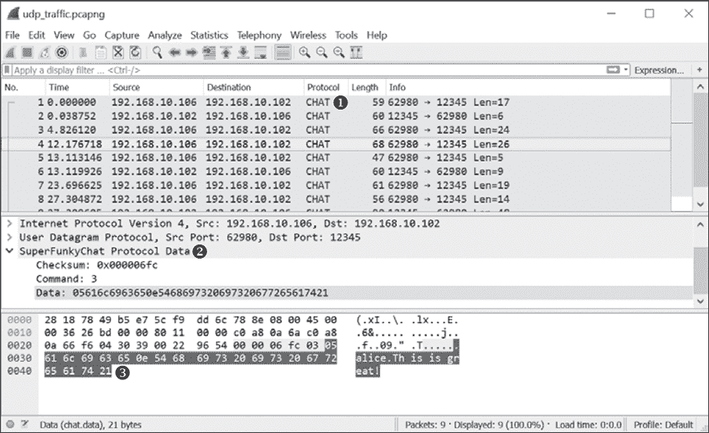

*图 5-13：解析后的 SuperFunkyChat 协议流量*

#### ***解析消息数据包***

让我们扩展解剖器，解析一个特定的数据包。我们将使用命令`3`作为示例，因为我们已经确定它标记了消息的发送或接收。由于接收到的消息应该显示发送者的 ID 以及消息文本，因此这个数据包应包含这两个组件；这使得它成为一个非常合适的示例。

清单 5-16 显示了从清单 5-10 中提取的片段，我们通过 Python 脚本转储了流量。

```
b'\x03bob\x0cHow are you?'
b"\x03bob\x16This is nice isn't it?"
```

*清单 5-16：示例消息数据*

清单 5-16 显示了两条消息数据包的示例，数据采用二进制 Python 字符串格式。`\xXX`字符实际上是不可打印字节，因此`\x05`实际上是字节 0x05，`\x16`是 0x16（或十进制的 22）。每个数据包中都有两个可打印的字符串，第一个是用户名（在这个例子中是`bob`），第二个是消息。每个字符串前都有一个不可打印字符。通过非常简单的分析（例如，字符计数），我们可以看到不可打印字符表示后续字符串的长度。例如，在用户名字符串中，不可打印字符表示 0x03，而字符串`bob`的长度为三个字符。

我们来写一个函数，用于解析单个字符串的二进制表示。我们将更新清单 5-15，以支持解析清单 5-17 中的消息命令。

dissector_with

_commands.lua

```
   -- Declare our chat protocol for dissection
   chat_proto = Proto("chat","SuperFunkyChat Protocol")
   -- Specify protocol fields
   chat_proto.fields.chksum = ProtoField.uint32("chat.chksum", "Checksum",
                                                base.HEX)
   chat_proto.fields.command = ProtoField.uint8("chat.command", "Command")
   chat_proto.fields.data = ProtoField.bytes("chat.data", "Data")

   -- buffer: A TVB containing packet data
   -- start: The offset in the TVB to read the string from
   -- returns The string and the total length used
➊ function read_string(buffer, start)
       local len = buffer(start, 1):uint()
       local str = buffer(start + 1, len):string()
       return str, (1 + len)
   end

   -- Dissector function
   -- buffer: The UDP packet data as a "Testy Virtual Buffer"
   -- pinfo: Packet information
   -- tree: Root of the UI tree
   function chat_proto.dissector(buffer, pinfo, tree)
       -- Set the name in the protocol column in the UI
       pinfo.cols.protocol = "CHAT"

       -- Create sub tree which represents the entire buffer.
       local subtree = tree:add(chat_proto,
                                buffer(),
                                "SuperFunkyChat Protocol Data")
       subtree:add(chat_proto.fields.chksum, buffer(0, 4))
       subtree:add(chat_proto.fields.command, buffer(4, 1))

       -- Get a TVB for the data component of the packet.
    ➋ local data = buffer(5):tvb()
       local datatree = subtree:add(chat_proto.fields.data, data())

       local MESSAGE_CMD = 3
    ➌ local command = buffer(4, 1):uint()
       if command == MESSAGE_CMD then
           local curr_ofs = 0
           local str, len = read_string(data, curr_ofs)
        ➍ datatree:add(chat_proto, data(curr_ofs, len), "Username: " .. str)
           curr_ofs = curr_ofs + len
           str, len = read_string(data, curr_ofs)
           datatree:add(chat_proto, data(curr_ofs, len), "Message: " .. str)
       end
   end
 -- Get UDP dissector table and add for port 12345
   udp_table = DissectorTable.get("udp.port")
   udp_table:add(12345, chat_proto)
```

*清单 5-17：用于解析`Message`命令的更新后的解剖脚本*

在清单 5-17 中，添加的`read_string()`函数➊接受一个 TVB 对象（`buffer`）和一个起始偏移量（`start`），它返回缓冲区的长度和字符串内容。

**注意**

*如果字符串长度超过字节值的范围怎么办？啊，这是协议分析中的一个挑战。仅仅因为某些东西看起来很简单，并不意味着它实际上就简单。我们将忽略长度等问题，因为这仅作为一个示例，忽略长度对于我们捕获的任何示例都适用。*

有了一个解析二进制字符串的函数，我们现在可以将`Message`命令添加到解剖树中。代码首先通过添加原始数据树并创建一个新的 TVB 对象➋，该对象仅包含数据包的内容。接着，它将命令字段提取为整数并检查是否是我们的`Message`命令➌。如果不是，我们保持原有的数据树不变；但如果字段匹配，我们继续解析两个字符串并将它们添加到数据子树中➍。然而，我们并不需要定义特定的字段，只需指定 proto 对象而不是字段对象，就可以添加文本节点。如果现在将这个文件重新加载到 Wireshark 中，你应该能看到用户名和消息字符串被正确解析，如图 5-14 所示。

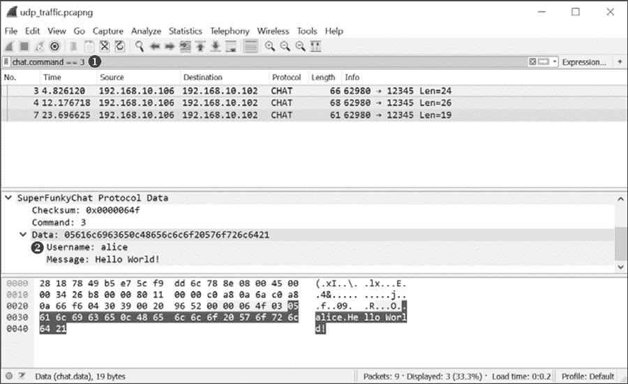

*图 5-14：一个解析过的 `Message` 命令*

由于解析后的数据最终成为可过滤的值，我们可以通过指定 `chat.command == 3` 作为显示过滤器来选择 `Message` 命令，如图 5-14 中的 ➊ 所示。我们可以看到，用户名和消息字符串在树形结构中已正确解析，如 ➋ 所示。

这就是我们对为 Wireshark 编写 Lua 解码器的简要介绍。显然，你仍然可以对这个脚本做很多事情，包括增加对更多命令的支持，但这些内容已经足够用来进行原型设计。

**注意**

*务必访问 Wireshark 网站，了解如何编写解析器，包括如何实现 TCP 流解析器。*

### **使用代理主动分析流量**

使用诸如 Wireshark 之类的工具被动地捕获网络流量，以便稍后分析网络协议，相较于主动捕获（如第二章所讨论的），具有许多优势。被动捕获不会影响你想要分析的应用程序的网络操作，也不需要对应用程序进行任何修改。另一方面，被动捕获不允许你轻松地与实时流量进行交互，这意味着你不能轻易地修改流量，来查看应用程序如何响应。

相比之下，主动捕获允许你操作实时流量，但比被动捕获需要更多的设置。它可能需要你修改应用程序，或者至少将应用程序流量通过代理进行重定向。你选择的方式将取决于你的具体场景，当然你也可以结合被动和主动捕获。

在第二章中，我包含了一些示例脚本，演示了如何捕获流量。你可以将这些脚本与 Canape Core 库结合使用，以生成多个代理，可能会在某些情况下代替被动捕获。

现在你对被动捕获有了更好的理解，我将在本章剩余部分介绍如何实现 SuperFunkyChat 协议的代理，并重点讲解如何最好地使用主动网络捕获。

#### ***设置代理***

为了设置代理，我们将首先修改第二章中的一个捕获示例，特别是清单 2-4，以便可以用于主动网络协议分析。为了简化 SuperFunkyChat 应用程序的开发过程和配置，我们将使用端口转发代理，而不是像 SOCKS 这样的工具。

将清单 5-18 复制到文件 `chapter5_proxy.csx` 中，并通过将脚本的文件名传递给 *CANAPE.Cli* 可执行文件来使用 Canape Core 运行它。

chapter5

_proxy.csx

```
   using static System.Console;
   using static CANAPE.Cli.ConsoleUtils;

   var template = new FixedProxyTemplate();
   // Local port of 4444, destination 127.0.0.1:12345
➊ template.LocalPort = 4444;
   template.Host = "127.0.0.1";
   template.Port = 12345;

   var service = template.Create();
   // Add an event handler to log a packet. Just print to console.
➋ service.LogPacketEvent += (s,e) => WritePacket(e.Packet);
   // Print to console when a connection is created or closed.
➌ service.NewConnectionEvent += (s,e) =>
            WriteLine("New Connection: {0}", e.Description);
   service.CloseConnectionEvent += (s,e) =>
            WriteLine("Closed Connection: {0}", e.Description);
   service.Start();

   WriteLine("Created {0}", service);
   WriteLine("Press Enter to exit...");
   ReadLine();
   service.Stop();
```

*清单 5-18：主动分析代理*

在➊处，我们告诉代理在本地端口 4444 上监听，并与 127.0.0.1 端口 12345 建立代理连接。这对于测试聊天应用程序应该没问题，但如果您想将脚本用于其他应用协议，则需要根据需要更改端口和 IP 地址。

在➋处，我们对第二章中的脚本进行了一项重大修改：我们添加了一个事件处理程序，当数据包需要记录时会被调用，这使得我们可以在数据包到达时立即打印出来。在➌处，我们添加了一些事件处理程序，用于在新连接建立并关闭时打印信息。

接下来，我们重新配置 ChatClient 应用程序，使其与本地端口 4444 通信，而不是原始端口 12345。对于 ChatClient，我们只需在命令行中添加`--port NUM`参数，如下所示：

```
ChatClient.exe --port 4444 user1 127.0.0.1
```

**注意**

*在实际应用中，更改目标可能并不这么简单。请参考第二章和第四章，了解如何将任意应用程序重定向到您的代理。*

客户端应通过代理成功连接到服务器，并且代理的控制台应开始显示数据包，如清单 5-19 所示。

```
   CANAPE.Cli (c) 2017 James Forshaw, 2014 Context Information Security.
   Created Listener (TCP 127.0.0.1:4444), Server (Fixed Proxy Server)
   Press Enter to exit...
➊ New Connection: 127.0.0.1:50844 <=> 127.0.0.1:12345
   Tag 'Out'➋ – Network '127.0.0.1:50844 <=> 127.0.0.1:12345'➌
           : 00 01 02 03 04 05 06 07 08 09 0A 0B 0C 0D 0E 0F - 0123456789ABCDEF
   --------:-------------------------------------------------------------------
   00000000: 42 49 4E 58 00 00 00 0E 00 00 04 16 00 05 75 73 - BINX..........us
   00000010: 65 72 31 05 62 6F 72 61 78 00                   - er1.borax.

   Tag 'In'➍ - Network '127.0.0.1:50844 <=> 127.0.0.1:12345'
           : 00 01 02 03 04 05 06 07 08 09 0A 0B 0C 0D 0E 0F - 0123456789ABCDEF
   --------:-------------------------------------------------------------------
   00000000: 00 00 00 02 00 00 00 01 01 00                   - ..........

   PM - Tag 'Out' - Network '127.0.0.1:50844 <=> 127.0.0.1:12345'
           : 00 01 02 03 04 05 06 07 08 09 0A 0B 0C 0D 0E 0F - 0123456789ABCDEF
   --------:-------------------------------------------------------------------
➎ 00000000: 00 00 00 0D                                    - ....

   Tag 'Out' - Network '127.0.0.1:50844 <=> 127.0.0.1:12345'
           : 00 01 02 03 04 05 06 07 08 09 0A 0B 0C 0D 0E 0F - 0123456789ABCDEF
   --------:-------------------------------------------------------------------
   00000000: 00 00 04 11 03 05 75 73 65 72 31 05 68 65 6C 6C - ......user1.hell
   00000010: 6F                                              - o

   --snip--
➏ Closed Connection: 127.0.0.1:50844 <=> 127.0.0.1:12345
```

*清单 5-19：客户端连接时代理的示例输出*

在➊处，输出显示新代理连接已建立。每个数据包都会显示带有方向信息（出站或入站）的标题，使用描述性标签`Out` ➋和`In` ➍。

如果您的终端支持 24 位颜色（大多数 Linux、macOS 甚至 Windows 10 终端都支持），则可以通过在启动代理脚本时使用`--color`参数来启用 Canape Core 中的颜色支持。分配给入站数据包的颜色类似于 Wireshark 中的颜色：粉色表示出站，蓝色表示入站。数据包显示还会显示它来自哪个代理连接 ➌，这与➊处的输出相匹配。可能会同时发生多个连接，特别是当您代理一个复杂的应用程序时。

每个数据包都以十六进制和 ASCII 格式转储。如同在 Wireshark 中捕获的情况一样，流量可能会分割成多个数据包，如在➎所示。然而，与 Wireshark 不同的是，使用代理时，我们不需要处理网络效应，例如重传数据包或分片：我们只需在操作系统为我们处理了所有网络效应之后，直接访问原始 TCP 流数据。

在➏处，代理打印出连接已关闭的信息。

#### ***使用代理进行协议分析***

设置好代理后，我们可以开始对协议进行基本分析。显示在列表 5-19 中的数据包只是原始数据，但我们理应编写代码来解析这些流量，正如我们为 Wireshark 编写的 Python 脚本一样。为此，我们将编写一个`数据解析器`类，包含用于读取和写入网络数据的函数。将列表 5-20 中的代码复制到与您在列表 5-18 中复制的*chapter5_proxy.csx*文件相同的目录中新文件，并命名为*parser.csx*。

parser.csx

```
using CANAPE.Net.Layers;
using System.IO;

class Parser : DataParserNetworkLayer
{
    ➊ protected override bool NegotiateProtocol(
           Stream serverStream, Stream clientStream)
    {
     ➋ var client = new DataReader(clientStream);
        var server = new DataWriter(serverStream);

        // Read magic from client and write it to server.
     ➌ uint magic = client.ReadUInt32();
        Console.WriteLine("Magic: {0:X}", magic);
        server.WriteUInt32(magic);

        // Return true to signal negotiation was successful.
        return true;
    }
}
```

*列表 5-20：代理的基本解析器代码*

协商方法 ➊ 在任何其他通信发生之前被调用，并传递给两个 C#流对象：一个连接到聊天服务器，另一个连接到聊天客户端。我们可以使用此协商方法来处理协议使用的魔法值，但我们也可以将其用于更复杂的任务，例如启用加密（如果协议支持的话）。

协商方法的第一个任务是从客户端读取魔法值并将其传递给服务器。为了简单地读取和写入 4 字节的魔法值，我们首先将流包装在`DataReader`和`DataWriter`类中 ➋。然后，我们从客户端读取魔法值，将其打印到控制台，并将其写入服务器 ➌。

在*chapter5_proxy.csx*的最顶部添加行`#load "parser.csx"`。现在，当解析主*chapter5_proxy.csx*脚本时，*parser.csx*文件将与主脚本一起自动加载和解析。使用此加载功能，您可以将解析器的每个组件写入单独的文件，从而使编写复杂代理的任务变得可管理。然后，在`template.Port = 12345;`后面添加行`template.AddLayer<Parser>();`，以将解析层添加到每个新连接中。此添加将在每个连接时实例化列表 5-20 中`Parser`类的新实例，因此您可以将任何需要的状态作为类的成员进行存储。如果您启动代理脚本并通过代理连接客户端，只有重要的协议数据会被记录；您将不再看到魔法值（除了控制台输出中）。

#### ***添加基础协议解析***

现在，我们将重新构建网络协议，以确保每个数据包只包含一个单独数据包的数据。我们将通过添加函数来读取网络中的长度和校验和字段，并只保留数据。同时，我们将在将数据发送到原始接收方时重写长度和校验和，以保持连接打开状态。

通过实现基本的解析和代理客户端连接，所有非必要的信息，如长度和校验和，应该从数据中移除。额外的好处是，如果你在代理内部修改数据，发送的包将具有正确的校验和和长度，以匹配你的修改。将 Listing 5-21 添加到`Parser`类中以实现这些更改，并重启代理。

```
➊ int CalcChecksum(byte[] data) {
       int chksum = 0;
       foreach(byte b in data) {
           chksum += b;
       }
       return chksum;
   }

➋ DataFrame ReadData(DataReader reader) {
       int length = reader.ReadInt32();
       int chksum = reader.ReadInt32();
       return reader.ReadBytes(length).ToDataFrame();
   }

➌ void WriteData(DataFrame frame, DataWriter writer) {
       byte[] data = frame.ToArray();
       writer.WriteInt32(data.Length);
       writer.WriteInt32(CalcChecksum(data));
       writer.WriteBytes(data);
   }

➍ protected override DataFrame ReadInbound(DataReader reader) {
       return ReadData(reader);
   }

   protected override void WriteOutbound(DataFrame frame, DataWriter writer) {
       WriteData(frame, writer);
   }

   protected override DataFrame ReadOutbound(DataReader reader) {
       return ReadData(reader);
   }

   protected override void WriteInbound(DataFrame frame, DataWriter writer) {
       WriteData(frame, writer);
   }
```

*Listing 5-21：SuperFunkyChat 协议的解析器代码*

尽管代码有些冗长（这可以怪 C#语言），但应该相当容易理解。在➊处，我们实现了校验和计算器。我们可以检查我们读取的包以验证其校验和，但我们只会使用这个计算器在发送包时重新计算校验和。

➋处的`ReadData()`函数从网络连接中读取一个数据包。它首先读取一个大端 32 位整数，表示长度，然后是 32 位的校验和，最后是数据的字节，之后调用一个函数将字节数组转换为`DataFrame`。（`DataFrame`是一个包含网络包的对象，您可以根据需要将字节数组或字符串转换为数据帧。）

➌处的`WriteData()`函数执行`ReadData()`的反操作。它使用`ToArray()`方法将传入的`DataFrame`转换为字节，以便写入。一旦我们得到字节数组，我们可以重新计算校验和和长度，然后将其写回`DataWriter`类。在➍处，我们实现了从入站和出站流中读取和写入数据的各种函数。

将所有用于网络代理和解析的脚本整合起来，并通过代理启动客户端连接，所有非必要的信息，如长度和校验和，应该从数据中移除。额外的好处是，如果你在代理内部修改数据，发送的包将具有正确的校验和和长度，以匹配你的修改。

#### ***改变协议行为***

协议通常包括多个可选组件，如加密或压缩。不幸的是，要确定加密或压缩的实现方式，通常需要进行大量的逆向工程。对于基础分析来说，最好能够简单地移除这些组件。此外，如果加密或压缩是可选的，协议几乎肯定会在初始连接协商时指示支持这些功能。所以，如果我们能够修改流量，可能可以更改该支持设置，并禁用这个附加功能。虽然这是一个微不足道的例子，但它展示了使用代理而不是像 Wireshark 这样的被动分析工具的威力。我们可以修改连接，使得分析变得更加容易。

例如，考虑聊天应用程序。它的一个可选功能是 XOR 加密（尽管请参阅第七章了解它为何实际上并非加密）。要启用此功能，您需要将`--xor`参数传递给客户端。清单 5-22 比较了在连接时不带 XOR 参数和带 XOR 参数时的前两个数据包。

```
OUTBOUND XOR   :    00 05 75 73 65 72 32 04 4F 4E 59 58 01     - ..user2.ONYX.
OUTBOUND NO XOR:    00 05 75 73 65 72 32 04 4F 4E 59 58 00     - ..user2.ONYX.

INBOUND XOR   :     01 E7                                      - ..
INBOUND NO XOR:     01 00                                      - ..
```

*清单 5-22：启用和禁用 XOR 加密的示例数据包*

我已经用粗体标出了清单 5-22 中的两个差异。让我们从这个例子中得出一些结论。在出站数据包（即基于第一个字节的命令 0）中，当启用 XOR 时，最后一个字节是 1，而当未启用时则为 0x00。我猜测这个标志表示客户端是否支持 XOR 加密。对于入站流量，第一个数据包（在这种情况下为命令 1）的最后一个字节在启用 XOR 时为 0xE7，在未启用时为 0x00。我猜测这是 XOR 加密的密钥。

实际上，如果您在启用 XOR 加密时查看客户端控制台，您会看到一行`ReKeying connection to key 0xE7`，这表明确实是密钥。尽管协商是有效的流量，但如果您现在尝试通过代理发送客户端消息，连接将不再工作，甚至可能会断开连接。连接停止工作是因为代理将尝试从连接中解析诸如数据包长度之类的字段，但将获得无效值。例如，在读取长度为 0x10 的数据时，代理实际上会读取 0x10 XOR 0xE7，即 0xF7。因为网络连接中没有 0xF7 字节，所以会挂起。简而言之，在这种情况下继续分析，我们需要对 XOR 做些处理。

当我们在读取流量时实现去 XOR 化代码，并在写入时重新 XOR 化代码，这并不是特别困难，但如果此功能用于支持某些专有的压缩方案，实现起来可能就不那么简单了。因此，我们将简单地在代理中禁用 XOR 加密，而不管客户端的设置如何。为此，我们读取连接中的第一个数据包，并确保最后一个字节设置为 0。当我们将该数据包转发时，服务器将不启用 XOR 并将返回 0 作为密钥的值。因为在 XOR 加密中，0 是一个 NO-OP（即 A XOR 0 = A），这种技术将有效地禁用 XOR。

修改解析器中的`ReadOutbound()`方法为清单 5-23 中的代码以禁用 XOR 加密。

```
protected override DataFrame ReadOutbound(DataReader reader) {
  DataFrame frame = ReadData(reader);
  // Convert frame back to bytes.
  byte[] data = frame.ToArray();
  if (data[0] == 0) {
    Console.WriteLine("Disabling XOR Encryption");
    data[data.Length - 1] = 0;
    frame = data.ToDataFrame();
  }
  return frame;
}
```

*清单 5-23：禁用 XOR 加密*

如果您现在通过代理创建连接，您会发现无论 XOR 设置是否启用，客户端都无法启用 XOR。

### **最后的话**

在本章中，你学习了如何使用被动和主动捕获技术对未知协议进行基本的协议分析。我们首先通过 Wireshark 捕获示例流量来进行基本的协议分析。然后，通过手动检查和一个简单的 Python 脚本，我们能够理解一些示例聊天协议的部分内容。

在最初的分析中，我们发现能够实现一个基本的 Lua 解码器用于 Wireshark，以提取协议信息并直接在 Wireshark 图形界面中显示。使用 Lua 是 Wireshark 中原型化协议分析工具的理想选择。

最后，我们实现了一个中间人代理来分析该协议。代理流量使得我们能够展示一些新的分析技巧，例如修改协议流量以禁用可能会妨碍使用纯粹被动技术分析协议的协议功能（如加密）。

你选择的技术将取决于许多因素，例如捕获网络流量的难度和协议的复杂性。你需要应用最合适的技术组合，来全面分析一个未知协议。
