# 第六章：应用程序逆向工程

如果你能仅凭传输的数据分析整个网络协议，那么你的分析就相对简单。但对于某些协议，尤其是那些使用自定义加密或压缩方案的协议，这通常是行不通的。然而，如果你能够获得客户端或服务器的可执行文件，你可以使用二进制*逆向工程（RE）*来确定协议的运行方式，并寻找潜在的漏洞。

逆向工程主要有两种方式：*静态*和*动态*。静态逆向工程是将已编译的可执行文件反汇编成原生机器码，并通过分析这些代码来理解可执行文件的工作原理。动态逆向工程则是执行一个应用程序，然后使用调试器、函数监控器等工具检查应用程序的运行时操作。

在这一章中，我将带你了解如何拆解可执行文件，识别并理解负责网络通信的代码区域。

我将首先聚焦于 Windows 平台，因为你在 Windows 上更容易找到没有源代码的应用程序，相较于 Linux 或 macOS。之后，我会更详细地讨论平台之间的差异，并给你一些在不同平台上工作的技巧和窍门；然而，你学到的大多数技能将在所有平台上都适用。在阅读时，请记住，成为一名优秀的逆向工程师需要时间，而我无法在一章中涵盖逆向工程的广泛内容。

在深入研究逆向工程之前，我将讨论开发者如何创建可执行文件，并提供一些关于无处不在的 x86 计算机架构的细节。一旦你理解了 x86 架构的基础以及它如何表示指令，你就能知道在逆向工程代码时该寻找什么。

最后，我将解释一些通用的操作系统原理，包括操作系统如何实现网络功能。掌握这些知识后，你应该能够追踪并分析网络应用程序。

我们从现代操作系统上程序执行的背景信息开始，研究编译器和解释器的原理。

### **编译器、解释器和汇编器**

大多数应用程序都是用高级编程语言编写的，如 C/C++、C#、Java 或众多脚本语言中的一种。当开发一个应用程序时，原始语言是它的*源代码*。不幸的是，计算机无法理解源代码，因此必须通过*解释*或*编译*源代码，将高级语言转换为*机器码*（计算机处理器执行的本地指令）。

开发和执行程序的两种常见方式是通过解释原始源代码或将程序编译为本地代码。程序的执行方式决定了我们如何对其进行逆向工程，因此让我们来看看这两种不同的执行方法，以更好地理解它们的工作原理。

#### ***解释型语言***

解释型语言，如 Python 和 Ruby，有时被称为*脚本语言*，因为它们的应用程序通常是从作为文本文件编写的短脚本中运行的。解释型语言是动态的，并且能加快开发速度。但解释器执行程序的速度比已转换为*机器代码*的代码慢，而机器代码是计算机直接理解的。为了将源代码转换为更本地的表示，编程语言可以选择编译。

#### ***编译型语言***

编译型编程语言使用*编译器*来解析源代码并生成机器代码，通常先生成一个中间语言。对于本地代码生成，通常使用特定于应用程序运行的 CPU 的*汇编语言*（例如 32 位或 64 位汇编语言）。该语言是底层处理器指令集的可读和可理解形式。然后，使用*汇编器*将汇编语言转换为机器代码。例如，图 6-1 展示了 C 编译器的工作原理。

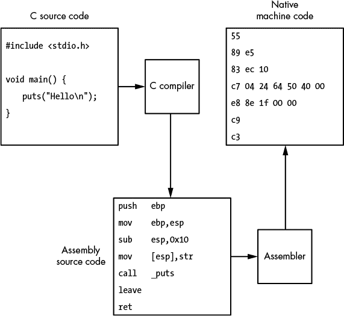

*图 6-1：C 语言编译过程*

要将本地二进制文件恢复到原始源代码，你需要通过一种叫做*反编译*的过程来逆向编译。不幸的是，反编译机器代码非常困难，因此逆向工程师通常只逆向汇编过程，使用一种叫做*反汇编*的过程。

#### ***静态链接与动态链接***

对于极其简单的程序，编译过程可能就是生成可执行文件所需的全部步骤。但在大多数应用程序中，大量代码通过*链接*从外部库导入到最终的可执行文件中—这是一个在编译后使用链接器程序的过程。链接器将编译器生成的特定于应用程序的机器代码与应用程序使用的任何必要外部库一起处理，并通过静态链接将所有内容嵌入到最终的可执行文件中。这个*静态链接*过程生成一个单一的、自包含的可执行文件，不依赖于原始的库。

由于不同操作系统处理某些过程的方式可能大不相同，因此将所有代码静态链接成一个大的二进制文件可能不是一个好主意，因为操作系统特定的实现可能会发生变化。例如，写入磁盘文件在 Windows 和 Linux 上的操作系统调用可能大相径庭。因此，编译器通常通过*动态链接*将可执行文件链接到操作系统特定的库：编译器不是将机器代码嵌入最终的可执行文件中，而是仅存储对动态库和所需函数的引用。操作系统必须在应用程序运行时解析这些链接引用。

### **x86 架构**

在深入研究逆向工程的方法之前，你需要对 x86 计算机架构的基本知识有所了解。对于一款已有 30 多年历史的计算机架构，x86 的持久性令人惊讶。它在今天的大多数台式机和笔记本电脑中都有使用。虽然 PC 一直是 x86 架构的传统家园，但它已经进入了 Mac^(1) 电脑、游戏机，甚至智能手机。

原始的 x86 架构由英特尔于 1978 年发布，采用了 8086 CPU。多年来，英特尔和其他制造商（如 AMD）大大提升了它的性能，从支持 16 位操作扩展到 32 位，再到现在的 64 位操作。现代架构与最初的 8086 几乎没有什么相同之处，除了处理器指令和编程习惯。由于其悠久的历史，x86 架构非常复杂。我们将首先了解 x86 如何执行机器代码，然后检查其 CPU 寄存器以及用于确定执行顺序的方法。

#### ***指令集架构***

在讨论 CPU 如何执行机器代码时，通常会谈到 *指令集架构 (ISA)*。ISA 定义了机器代码如何工作，如何与 CPU 以及计算机的其他部分交互。有效的逆向工程需要对 ISA 有一定的工作知识。

ISA 定义了程序可以使用的机器语言指令集；每个独立的机器语言指令由*助记符指令*表示。助记符为每条指令命名，并确定其参数或*操作数*的表示方式。表 6-1 列出了部分常见 x86 指令的助记符。（我将在接下来的章节中详细介绍这些指令。）

**表 6-1：** 常见的 x86 指令助记符

| **指令** | **描述** |
| --- | --- |
| `MOV` `destination``,` `source` | 将值从`source`移动到`destination` |
| `ADD` `destination``,` `value` | 将整数 `value` 加到 `destination` |
| `SUB` `destination``,` `value` | 从 `destination` 中减去整数 `value` |
| `CALL` `地址` | 调用指定`地址`处的子程序 |
| `JMP` `地址` | 无条件跳转到指定的`地址` |
| `RET` | 从上一个子程序返回 |
| `RETN` `大小` | 从上一个子程序返回，并将堆栈指针加`大小` |
| `Jcc` `地址` | 如果`cc`表示的条件为真，则跳转到指定的`地址` |
| `PUSH` `值` | 将`值`压入当前堆栈，并减少堆栈指针 |
| `POP` `目标` | 从堆栈顶端弹出数据到`目标`并增加堆栈指针 |
| `CMP` `值 a``,` `值 b` | 比较`值 a`和`值 b`并设置相应的标志位 |
| `TEST` `值 a``,` `值 b` | 对`值 a`和`值 b`进行按位与运算，并设置相应的标志位 |
| `AND` `目标``,` `值` | 对`目标`与`值`进行按位与运算 |
| `OR` `目标``,` `值` | 对`目标`与`值`进行按位或运算 |
| `XOR` `目标``,` `值` | 对`目标`与`值`进行按位异或运算 |
| `SHL` `目标``,` `N` | 将`目标`左移`N`位（左移即更高的位） |
| `SHR` `目标``,` `N` | 将`目标`右移`N`位（右移即更低的位） |
| `INC` `目标` | 将`目标`加 1 |
| `DEC` `目标` | 将`目标`减 1 |

这些助记指令根据指令的操作数数量有三种不同的形式。表 6-2 展示了三种不同形式的操作数。

**表 6-2:** Intel 助记符形式

| **操作数数量** | **形式** | **示例** |
| --- | --- | --- |
| 0 | 名称 | `POP`, `RET` |
| 1 | 名称 输入 | `PUSH 1`; `CALL func` |
| 2 | 名称 输出, 输入 | `MOV EAX, EBX`; `ADD EDI, 1` |

表示 x86 指令的两种常见方式是*Intel 语法*和*AT&T 语法*。Intel 语法最初由英特尔公司开发，本章中我使用的就是 Intel 语法。AT&T 语法则在许多类 Unix 系统上的开发工具中使用。这两种语法在一些方面有所不同，比如操作数的顺序。例如，向 EAX 寄存器中的值加 1 的指令在 Intel 语法中是这样写的：`ADD EAX, 1`，而在 AT&T 语法中则是这样写：`addl $1, %eax`。

#### ***CPU 寄存器***

CPU 有许多寄存器，用于非常快速的临时存储当前执行状态。在 x86 架构中，每个寄存器通过一个两到三个字符的标签来表示。图 6-2 展示了 32 位 x86 处理器的主要寄存器。理解处理器支持的多种寄存器类型至关重要，因为每种寄存器都服务于不同的目的，且对于理解指令的操作方式是必要的。

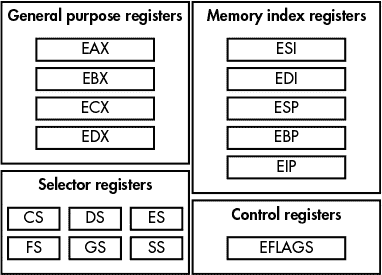

*图 6-2：主要的 32 位 x86 寄存器*

x86 的寄存器分为四个主要类别：通用寄存器、内存索引寄存器、控制寄存器和选择器寄存器。

##### **通用寄存器**

*通用寄存器*（在图 6-2 中为 EAX、EBX、ECX 和 EDX）是用于存储计算中的非特定值的临时寄存器，例如加法或减法的结果。*通用寄存器*的大小为 32 位，尽管指令可以通过简单的命名约定以 16 位和 8 位版本访问它们：例如，EAX 寄存器的 16 位版本为 AX，8 位版本为 AH 和 AL。图 6-3 展示了 EAX 寄存器的结构。

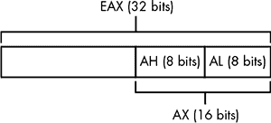

*图 6-3：EAX 通用寄存器及其小寄存器组件*

##### **内存索引寄存器**

*内存索引寄存器*（ESI、EDI、ESP、EBP、EIP）大多数是通用寄存器，只有 ESP 和 EIP 寄存器不是。ESP 寄存器由 PUSH 和 POP 指令使用，也用于子程序调用中，表示栈的当前基址的内存位置。

尽管你可以将 ESP 寄存器用于栈索引以外的目的，但通常不建议这样做，因为这可能导致内存损坏或意外行为。原因是一些指令隐式依赖于寄存器的值。另一方面，EIP 寄存器*不能*作为通用寄存器直接访问，因为它表示将从内存中读取指令的下一个地址。

更改 EIP 寄存器值的唯一方式是使用控制指令，如`CALL`、`JMP`或`RET`。在本讨论中，重要的*控制寄存器*是 EFLAGS。EFLAGS 包含多种布尔标志，用于表示指令执行结果，例如最后一次操作是否产生了 0 的结果。这些布尔标志实现了 x86 处理器中的条件分支。例如，如果你对两个值进行减法，结果为 0，则 EFLAGS 寄存器中的零标志将被设置为 1，而不相关的标志则被设置为 0。

EFLAGS 寄存器还包含重要的系统标志，例如中断是否启用。并非所有指令都会影响 EFLAGS 的值。表 6-3 列出了最重要的标志值，包括标志的位位置、常用名称以及简短描述。

**表 6-3：** 重要的 EFLAGS 状态标志

| **位** | **名称** | **描述** |
| --- | --- | --- |
| 0 | 进位标志 | 表示最后一次操作是否产生了进位位 |
| 2 | 奇偶标志 | 最后一次操作的最低有效字节的奇偶性 |
| 6 | 零标志 | 表示最后一次操作的结果是否为零；用于比较操作 |
| 7 | 符号标志 | 表示最后一次操作的符号；实际上是结果的最高有效位 |
| 11 | 溢出标志 | 指示上一次操作是否发生溢出 |

##### **选择符寄存器**

*选择符寄存器*（CS、DS、ES、FS、GS、SS）通过指定一个特定的内存块来访问内存，你可以在其中读写数据。读取或写入值时使用的实际内存地址会在内部 CPU 表中查找。

**注意**

*选择符寄存器通常仅在操作系统特定的操作中使用。例如，在 Windows 上，FS 寄存器用于访问分配用于存储当前线程控制信息的内存。*

内存是使用小端字节顺序访问的。回忆一下 第三章，小端顺序意味着最低有效字节存储在最低的内存地址。

x86 架构的另一个重要特点是，它不要求内存操作对齐。在 *对齐的* 处理器架构中，所有读取和写入主内存的操作都必须与操作大小对齐。例如，如果你想读取一个 32 位值，你必须从一个是 4 的倍数的内存地址进行读取。在像 SPARC 这样的对齐架构中，读取一个未对齐的地址会生成错误。相反，x86 架构允许你从任何内存地址读取或写入，而不管是否对齐。

与使用专用指令在 CPU 寄存器和主内存之间加载和存储值的架构（如 ARM）不同，许多 x86 指令可以将内存地址作为操作数。事实上，x86 支持一种复杂的内存寻址格式：每个内存地址引用可以包含基址寄存器、索引寄存器、索引的乘数（范围为 1 到 8），或 32 位偏移量。例如，以下 MOV 指令结合了这四种引用选项，以确定哪个内存地址包含要复制到 EAX 寄存器的值：

```
MOV EAX, [ESI + EDI * 8 + 0x50]   ; Read 32-bit value from memory address
```

当像这样的复杂地址引用用于指令时，通常会看到它被括在方括号中。

#### ***程序流程***

*程序流程*，或称 *控制流程*，是指程序如何决定执行哪些指令。x86 有三种主要的程序流程指令：*子程序调用*、*条件分支* 和 *无条件分支*。子程序调用将程序的执行流重定向到一个 *子程序*——一个指定的指令序列。这是通过 `CALL` 指令实现的，`CALL` 将 EIP 寄存器更改为子程序的位置。`CALL` 将下一条指令的内存地址放入当前栈中，这样程序就能在执行完子程序任务后知道返回的位置。返回操作通过 `RET` 指令完成，`RET` 会将 EIP 寄存器更改为栈顶地址（即 `CALL` 放入的位置）。

条件跳转允许代码根据之前的操作做出决策。例如，`CMP` 指令比较两个操作数的值（可能是两个寄存器），并计算出适当的 EFLAGS 寄存器值。在底层，`CMP` 指令通过将一个值减去另一个值来实现此操作，适当地设置 EFLAGS 寄存器，然后丢弃结果。`TEST` 指令做的事情相同，不过它执行的是与操作，而不是减法。

在计算出 EFLAGS 值之后，可以执行条件跳转；跳转的地址取决于 EFLAGS 的状态。例如，`JZ` 指令会在零标志位被设置时有条件地跳转（例如，`CMP` 指令比较了两个相等的值时就会发生）；否则，指令就是一个无操作。请记住，EFLAGS 寄存器也可以通过算术和其他指令设置。例如，`SHL` 指令将目标的值按位从低到高移动若干位。

无条件跳转程序流通过 `JMP` 指令实现，该指令会无条件跳转到目标地址。关于无条件跳转，没什么更多可以说的了。

### **操作系统基础**

理解计算机架构对于静态和动态逆向工程都很重要。没有这些知识，很难理解一系列指令到底在做什么。但架构只是其中的一部分：如果没有操作系统处理计算机的硬件和进程，这些指令就不会有太大用处。在这里，我将解释一些操作系统的基本原理，这将帮助你理解逆向工程的过程。

#### ***可执行文件格式***

可执行文件格式定义了可执行文件如何存储在磁盘上。操作系统需要指定它们支持的可执行文件格式，以便加载并运行程序。与早期的操作系统（例如 MS-DOS）不同，后者对可执行文件格式没有限制（文件中的指令加载后会直接进入内存执行），现代操作系统有更多的要求，这就需要更复杂的格式。

现代可执行文件格式的一些要求包括：

• 为可执行指令和数据分配内存

• 支持外部库的动态链接

• 支持加密签名以验证可执行文件的来源

• 维护调试信息，将可执行代码与原始源代码关联，以便调试

• 引用可执行文件中代码开始执行的地址，通常称为*起始地址*（这是必要的，因为程序的起始地址可能不是可执行文件中的第一条指令）

Windows 使用可移植可执行（PE）格式处理所有可执行文件和动态库。可执行文件通常使用*.exe*扩展名，动态库使用*.dll*扩展名。Windows 实际上不需要这些扩展名来使新进程正确运行；这些扩展名仅为方便使用。

大多数类 Unix 系统，包括 Linux 和 Solaris，使用可执行链接格式（ELF）作为其主要可执行格式。主要的例外是 macOS，它使用 Mach-O 格式。

#### ***部分***

内存*部分*可能是可执行文件中存储的最重要的信息。所有复杂的可执行文件都会有至少三个部分：代码部分，包含可执行文件的本机机器代码；数据部分，包含在执行期间可以读写的初始化数据；以及一个特殊部分，包含未初始化的数据。每个部分都有一个名称，用于标识它所包含的数据。代码部分通常叫做*text*，数据部分叫做*data*，未初始化的数据叫做*bss*。

每个部分包含四个基本信息：

• 一个文本名称

• 可执行文件中包含的部分数据的大小和位置

• 数据应加载到内存中的大小和地址

• 内存保护标志，指示部分数据在加载到内存时是否可以写入或执行

#### ***进程和线程***

操作系统必须能够同时运行多个可执行文件实例，并确保它们不会发生冲突。为此，操作系统定义了一个*进程*，它作为正在运行的可执行文件实例的容器。一个进程存储该实例运行所需的所有私有内存，将其与同一可执行文件的其他实例隔离开。进程还是一个安全边界，因为它在操作系统的特定用户下运行，基于此身份可以做出安全决策。

操作系统还定义了一个*线程*，它允许操作系统在多个进程之间快速切换，使得用户感觉它们似乎同时运行。这叫做*多任务处理*。为了在进程之间切换，操作系统必须中断 CPU 当前的操作，存储当前进程的状态，并恢复另一个进程的状态。当 CPU 恢复时，它正在运行另一个进程。

一个线程定义了当前的执行状态。它有自己的内存块用于栈，并在操作系统停止线程时存储其状态。一个进程通常至少会有一个线程，并且进程中线程的数量限制通常由计算机的资源控制。

为了从可执行文件创建一个新进程，操作系统首先创建一个空进程，并为其分配内存空间。然后，操作系统将主可执行文件加载到进程的内存空间中，并根据可执行文件的段表分配内存。接着，创建一个新的线程，这个线程称为 *主线程*。

动态链接程序负责在跳回原始起始地址之前，链接主可执行文件的系统库。当操作系统启动主线程时，进程创建完成。

#### ***操作系统网络接口***

操作系统必须管理计算机的网络硬件，以便能够在所有运行的应用程序之间共享。硬件对高级协议，如 TCP/IP，几乎一无所知，因此操作系统必须提供这些高级协议的实现。

操作系统还需要提供一种方式，让应用程序能够与网络接口。最常见的网络 API 是 *伯克利套接字模型*，最初由加利福尼亚大学伯克利分校于 1970 年代为 BSD 开发。所有类 Unix 系统都内建支持伯克利套接字。在 Windows 上，*Winsock* 库提供了一个非常相似的编程接口。伯克利套接字模型如此普遍，你几乎肯定会在各种平台上遇到它。

##### **创建一个简单的 TCP 客户端连接到服务器**

为了更好地理解套接字 API 的工作原理，清单 6-1 展示了如何创建一个简单的 TCP 客户端连接到远程服务器。

```
   int port = 12345;
   const char* ip = "1.2.3.4";
   sockaddr_in addr = {0};

➊ int s = socket(AF_INET, SOCK_STREAM, 0);

   addr.sin_family = PF_INET;
➋ addr.sin_port = htons(port);
➌ inet_pton(AF_INET, ip, &addr.sin_addr);
➍ if(connect(s, (sockaddr*) &addr, sizeof(addr)) == 0)
   {
       char buf[1024];
       ➎ int len = recv(s, buf, sizeof(buf), 0);

       ➏ send(s, buf, len, 0);
   }

   close(s);
```

*清单 6-1：一个简单的 TCP 网络客户端*

第一个 API 调用 ➊ 创建了一个新的套接字。`AF_INET` 参数表示我们要使用 IPv4 协议。（如果要使用 IPv6，可以写成 `AF_INET6`）。第二个参数 `SOCK_STREAM` 表示我们希望使用流连接，对于互联网来说，就是 TCP。如果要创建 UDP 套接字，我们应该写成 `SOCK_DGRAM`（即 *数据报套接字*）。

接下来，我们使用 `addr` 来构建目标地址，`addr` 是系统定义的 `sockaddr_in` 结构的一个实例。我们设置地址结构，包括协议类型、TCP 端口和 TCP IP 地址。调用 `inet_pton` ➌ 将 `ip` 中的 IP 地址字符串表示转换为 32 位整数。

请注意，在设置端口时，`htons` 函数用于 ➋ 将值从主机字节序（对于 x86 是小端序）转换为网络字节序（始终是大端序）。这同样适用于 IP 地址。在这种情况下，IP 地址 1.2.3.4 在大端格式下会变成整数 0x01020304。

最后一步是发出调用，连接到目标地址 ➍。这是主要的失败点，因为此时操作系统必须发起一个外部调用，连接到目标地址，看看是否有任何监听程序。当新的套接字连接建立时，程序可以像操作文件一样，通过`recv` ➎和`send` ➏系统调用向套接字读写数据。（在类 Unix 系统中，你也可以使用通用的`read`和`write`调用，但在 Windows 中不能使用。）

##### **创建到 TCP 服务器的客户端连接**

清单 6-2 显示了网络连接的另一端，一个非常简单的 TCP 套接字服务器。

```
   sockaddr_in bind_addr = {0};

   int s = socket(AF_INET, SOCK_STREAM, 0);

   bind_addr.sin_family = AF_INET;
   bind_addr.sin_port = htons(12345);
➊ inet_pton("0.0.0.0", &bind_addr.sin_addr);

➋ bind(s, (sockaddr*)&bind_addr, sizeof(bind_addr));
➌ listen(s, 10);
 sockaddr_in client_addr;
   int socksize = sizeof(client_addr);
➍ int newsock = accept(s, (sockaddr*)&client_addr, &socksize);

   // Do something with the new socket
```

*清单 6-2：一个简单的 TCP 套接字服务器*

连接到 TCP 套接字服务器的第一步是将套接字绑定到本地网络接口上的地址，如➊和➋所示。这实际上是与清单 6-1 中的客户端情况相反，因为`inet_pton()` ➊只是将字符串 IP 地址转换为其二进制形式。套接字绑定到所有网络地址，由`"0.0.0.0"`表示，尽管这也可以是端口 12345 上的特定地址。

然后，套接字被绑定到该本地地址 ➋。通过绑定到所有接口，我们确保服务器套接字可以从当前系统外部访问，例如通过互联网，前提是没有防火墙阻挡。

最后，清单请求网络接口监听新的传入连接 ➌，并调用`accept` ➍，返回下一个新的连接。与客户端一样，新的套接字也可以通过`recv`和`send`调用进行读写。

当你遇到使用操作系统网络接口的本地应用程序时，你必须追踪可执行代码中的所有这些函数调用。当你查看反汇编器中的反向代码时，你对 C 语言层面程序编写的了解将非常有用。

#### ***应用程序二进制接口***

*应用程序二进制接口（ABI）*是操作系统定义的接口，用于描述应用程序如何调用 API 函数的约定。大多数编程语言和操作系统会从左到右传递参数，这意味着原始源代码中最左边的参数会被放置在最低的栈地址。如果参数是通过压入栈来构建的，最后一个参数会最先压入栈。

另一个重要的考虑因素是，当 API 调用完成时，如何将返回值提供给函数的调用者。在 x86 架构中，只要值小于或等于 32 位，就会通过 EAX 寄存器返回。如果值在 32 位到 64 位之间，则通过 EAX 和 EDX 寄存器的组合返回。

EAX 和 EDX 在 ABI 中被认为是*临时*寄存器，这意味着它们的寄存器值在函数调用之间不会被保留：换句话说，调用函数时，调用者不能依赖这些寄存器中存储的任何值在调用返回时仍然存在。这种将寄存器指定为临时的设计模式出于实际考虑：它使得函数能够节省时间和内存来保存寄存器，而这些寄存器可能根本不会被修改。事实上，ABI 指定了一个确切的寄存器列表，必须由被调用函数将其保存到堆栈中的某个位置。

表 6-4 包含了典型寄存器分配目的的简要说明。该表还指示了在调用函数时，寄存器是否需要保存，以便在函数返回之前将寄存器恢复到其原始值。

**表 6-4：** 保存寄存器列表

| **寄存器** | **ABI 使用** | **是否保存？** |
| --- | --- | --- |
| EAX | 用于传递函数的返回值 | 否 |
| EBX | 通用寄存器 | 是 |
| ECX | 用于局部循环和计数器，有时也用于在 C++ 等语言中传递对象指针 | 否 |
| EDX | 用于扩展返回值 | 否 |
| EDI | 通用寄存器 | 是 |
| ESI | 通用寄存器 | 是 |
| EBP | 指向当前有效堆栈帧基址的指针 | 是 |
| ESP | 指向堆栈基址的指针 | 是 |

图 6-4 显示了 `print_add()` 函数中的汇编代码调用 `add()` 函数的过程：它将参数压入堆栈（`PUSH 10`），调用 `add()` 函数（`CALL add`），然后进行清理（`ADD ESP, 8`）。加法的结果通过 EAX 寄存器从 `add()` 返回，然后打印到控制台。

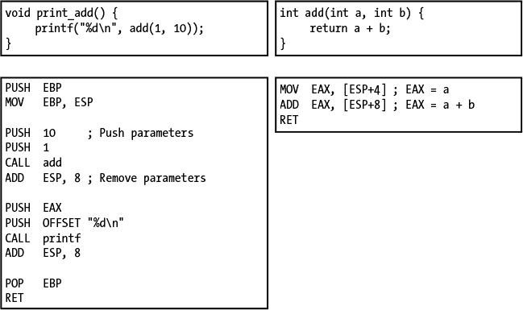

*图 6-4：汇编代码中的函数调用*

### **静态逆向工程**

现在你已经对程序如何执行有了基本的理解，我们将看看一些逆向工程的方法。*静态逆向工程* 是剖析应用程序可执行文件以确定其功能的过程。理想情况下，我们可以将编译过程逆向回原始源代码，但这通常是太困难的。相反，更常见的做法是反汇编可执行文件。

与仅使用十六进制编辑器和机器代码参考对二进制文件进行攻击不同，你可以使用许多工具来反汇编二进制文件。一个这样的工具是基于 Linux 的 objdump，它简单地将反汇编的输出打印到控制台或文件中。然后，你可以使用文本编辑器浏览反汇编内容。然而，objdump 的用户界面并不友好。

幸运的是，有一些交互式反汇编器可以以易于检查和导航的形式呈现反汇编代码。其中，最全功能的反汇编器是由 Hex Rays 公司开发的 IDA Pro。IDA Pro 是进行静态反向工程的首选工具，它支持许多常见的可执行文件格式以及几乎所有的 CPU 架构。完整版价格较高，但也有免费的版本可供使用。尽管免费版仅支持反汇编 x86 代码，并且不能在商业环境中使用，但它非常适合帮助你快速入门反汇编工具。你可以从 Hex Rays 网站下载 IDA Pro 的免费版，网址是*[`www.hex-rays.com/`](https://www.hex-rays.com/)*。免费版仅支持 Windows 系统，但在 Linux 或 macOS 上使用 Wine 也能良好运行。接下来，让我们简要了解如何使用 IDA Pro 来剖析一个简单的网络二进制文件。

#### ***IDA Pro 免费版使用快速指南***

安装完成后，启动 IDA Pro，然后点击**文件** ▸ **打开**选择目标可执行文件。应该会弹出“加载新文件”窗口（见图 6-5）。

这个窗口展示了几个选项，但大多数是高级用户使用的；你只需考虑某些重要选项。第一个选项允许你选择要检查的可执行格式 ➊。图中的默认选项“Portable executable”通常是正确的选择，但最好还是检查一下。处理器类型 ➋ 指定了默认的处理器架构，这里是 x86。这个选项在你反汇编不常见的处理器架构的二进制数据时尤其重要。当你确认所选选项无误时，点击**OK**开始反汇编。

第一个和第二个选项的选择取决于你尝试反汇编的可执行文件。在这个例子中，我们正在反汇编一个使用 PE 格式、基于 x86 处理器的 Windows 可执行文件。对于其他平台，如 macOS 或 Linux，你需要选择适当的选项。IDA 会尽力自动检测反汇编目标所需的格式，通常你不需要手动选择。在反汇编过程中，它会尽力找到所有可执行代码，注释反编译后的函数和数据，并确定反汇编区域之间的交叉引用。

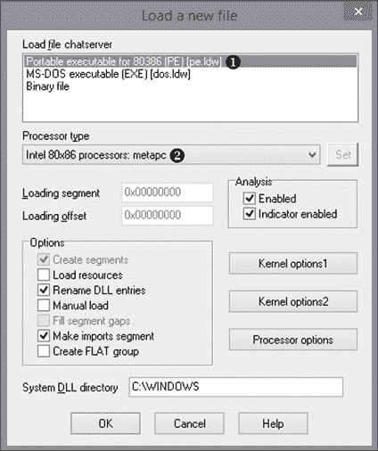

*图 6-5：加载新文件的选项*

默认情况下，IDA 会尝试为变量名和函数参数提供注释，前提是它知道这些信息，例如调用常见 API 函数时。对于交叉引用，IDA 会找到反汇编中引用数据和代码的位置：你可以在逆向工程过程中查看这些引用，正如你即将看到的那样。反汇编可能需要很长时间，完成后，你应该可以访问主 IDA 界面，如图 6-6 所示。

在 IDA 的主界面中，有三个重要的窗口需要注意。➋ 位置的窗口是默认的反汇编视图。在这个例子中，它显示的是 IDA Pro 的*图形视图*，这通常是查看单个函数执行流程的非常有用的方式。要显示一个基于指令加载地址的线性格式的反汇编视图，按空格键。➌ 位置的窗口显示了反汇编过程的状态以及如果你尝试在 IDA 中执行无法识别的操作时可能出现的任何错误。打开窗口的标签在 ➊ 处。

你可以通过选择 **View** ▸ **Open subviews** 来打开更多窗口。以下是你几乎肯定需要的窗口及其显示内容：

**IDA View** 显示可执行文件的反汇编

**Exports** 显示可执行文件导出的任何函数

**Imports** 显示在运行时动态链接到此可执行文件中的任何函数

**Functions** 显示 IDA Pro 识别出的所有函数列表

**Strings** 显示 IDA Pro 在分析过程中识别出的可打印字符串列表

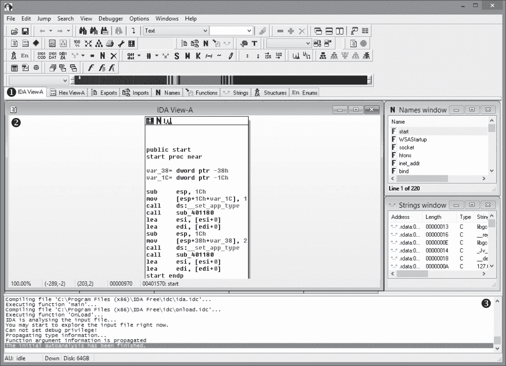

*图 6-6：IDA Pro 的主界面*

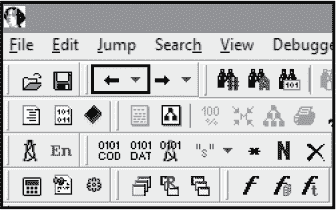

*图 6-7：IDA Pro 反汇编窗口的返回按钮*

在列出的五种窗口类型中，最后四种基本上只是信息列表。IDA View 是你在进行逆向工程时大部分时间会呆的地方，因为它显示了反汇编的代码。你可以轻松地在 IDA View 中浏览反汇编。例如，双击任何看起来像函数名称或数据引用的内容，会自动跳转到该引用的位置。这个技巧在分析对其他函数的调用时特别有用：例如，如果你看到 `CALL sub_400100`，只需双击 `sub_400100` 部分，系统会直接跳转到该函数。你可以通过按 ESC 键或点击返回按钮返回到原始调用者，如图 6-7 所示。

实际上，你可以像在网页浏览器中一样，在反汇编窗口中来回导航。当你在文本中找到一个引用字符串时，将文本光标移到该引用上，按 X 键或右键点击并选择 **Jump to xref to operand**，会弹出一个交叉引用对话框，显示可执行文件中所有引用该函数或数据值的位置。双击某个条目可以直接跳转到反汇编窗口中的引用位置。

**NOTE**

*默认情况下，IDA 会为引用的值生成自动名称。例如，函数被命名为* `sub_``XXXX`，*其中* `XXXX` *是它们的内存地址；名称* `loc_``XXXX` *表示当前函数中的分支位置或不属于任何函数的位置。这些名称可能无法帮助你理解反汇编代码的功能，但你可以重命名这些引用，使它们更有意义。要重命名引用，移动光标到引用文本处，按 N 键，或右键单击并从菜单中选择 ***重命名***。对名称的更改应该会在所有引用该名称的地方传播。*

#### ***分析栈变量和参数***

IDA 的反汇编窗口的另一个特点是它对栈变量和参数的分析。当我在“应用二进制接口”一节的第 123 页讨论调用约定时，我提到参数通常通过栈传递，但栈还存储临时局部变量，这些局部变量被函数用来存储无法放入可用寄存器的重要值。IDA Pro 会分析函数并确定它接受多少个参数以及使用哪些局部变量。图 6-8 展示了反汇编函数开始时的这些变量以及一些使用这些变量的指令。

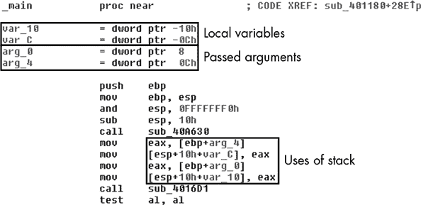

*图 6-8：反汇编函数，显示局部变量和参数*

你可以重命名这些局部变量和参数，并查找它们的所有交叉引用，但局部变量和参数的交叉引用只会局限于当前函数内。

#### ***识别关键功能***

接下来，你需要确定你正在反汇编的可执行文件处理网络协议的位置。最直接的方法是依次检查可执行文件的所有部分，确定它们的功能。但如果你反汇编的是一个大型商业产品，这种方法效率非常低。相反，你需要一种快速识别功能区域以进行进一步分析的方法。在本节中，我将讨论四种常见的实现方法，包括提取符号信息、查找可执行文件中导入的库、分析字符串和识别自动化代码。

##### **提取符号信息**

将源代码编译为本地可执行文件是一个有损过程，尤其是当代码包含符号信息时，例如变量和函数的名称或内存结构的形式。由于这些信息通常不是本地可执行文件正常运行所必需的，因此编译过程中可能会丢弃它。但是，丢失这些信息使得调试编译后可执行文件中的问题变得非常困难。

所有编译器都支持转换符号信息的能力，并生成*调试符号*，这些符号包含与内存中指令关联的原始源代码行的信息，以及函数和变量的类型信息。然而，开发人员很少故意保留调试符号，通常会在公开发布之前将它们移除，以防别人发现他们的专有秘密（或糟糕的代码）。不过，有时开发人员会犯错，你可以利用这些错误来帮助逆向工程。

IDA Pro 会在可能的情况下自动加载调试符号，但有时你需要自己去寻找符号。让我们来看一下 Windows、macOS 和 Linux 使用的调试符号，以及*符号信息存储的位置*和*如何*让 IDA 正确加载它们。

当使用常见编译器（如 Microsoft Visual C++）构建 Windows 可执行文件时，调试符号信息不会存储在可执行文件内部；相反，它会存储在可执行文件的一个部分，该部分提供了*程序数据库（PDB）*文件的位置。实际上，所有的调试信息都存储在这个 PDB 文件中。调试符号与可执行文件的分离使得分发不带调试信息的可执行文件变得容易，同时又能使这些信息在调试时随时可用。

PDB 文件很少与可执行文件一起分发，至少在封闭源代码软件中是如此。但有一个非常重要的例外是 Microsoft Windows。为了帮助调试工作，Microsoft 会为 Windows 安装的绝大多数可执行文件（包括内核）发布公共符号。尽管这些 PDB 文件并未包含编译过程中所有的调试信息（Microsoft 会剥离他们不想公开的部分，如详细的类型信息），但这些文件仍然包含大多数函数名，这通常是你需要的。总之，当对 Windows 可执行文件进行逆向工程时，IDA Pro 应该会自动从 Microsoft 的公共符号服务器查找符号文件并处理它。如果你恰好拥有符号文件（因为它随可执行文件一起提供），可以将它放在可执行文件所在目录旁边，然后让 IDA Pro 对可执行文件进行反汇编。你也可以在初次反汇编后，通过选择**文件** ▸ **加载文件** ▸ **PDB 文件**来加载 PDB 文件。

调试符号在使用 IDA Pro 进行逆向工程时尤为重要，尤其是在反汇编窗口和函数窗口中命名函数时。如果符号还包含类型信息，你应该能在函数调用上看到注释，指示参数的类型，如图 6-9 所示。

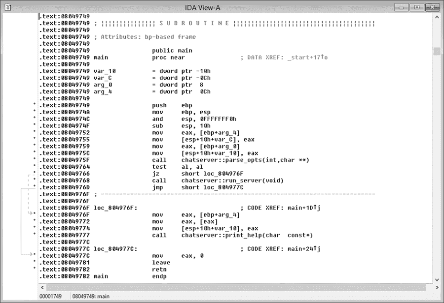

*图 6-9: 带有调试符号的反汇编*

即使没有 PDB 文件，你也可能从可执行文件中访问到一些符号信息。例如，动态库必须导出一些函数供其他可执行文件使用：这些导出将提供一些基本的符号信息，包括外部函数的名称。通过这些信息，你应该能够在导出窗口中深入查找你需要的内容。图 6-10 展示了*ws2_32.dll* Windows 网络库中该信息的显示方式。

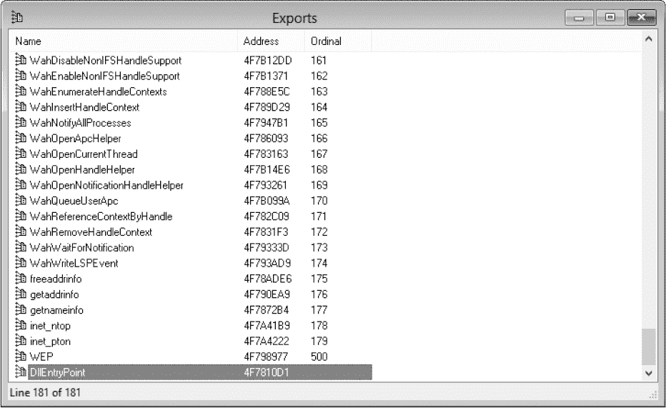

*图 6-10：来自* ws2_32.dll *库的导出*

调试符号在 macOS 上的工作方式类似，唯一的不同是调试信息存储在一个*调试符号包（dSYM）*中，这个包与可执行文件一起创建，而不是存储在一个单独的 PDB 文件中。dSYM 包是一个独立的 macOS 包目录，通常不会与商业应用程序一起分发。然而，Mach-O 可执行文件格式可以在可执行文件中存储基本的符号信息，比如函数和数据变量的名称。开发者可以使用名为 Strip 的工具，去除 Mach-O 二进制文件中的所有符号信息。如果没有使用 Strip，那么 Mach-O 二进制文件仍然可能包含对逆向工程有用的符号信息。

在 Linux 上，ELF 可执行文件将所有调试信息和其他符号信息打包进单一的可执行文件，通过将调试信息放入可执行文件的独立部分。与 macOS 类似，移除这些信息的唯一方法是使用 Strip 工具；如果开发者在发布之前没有这么做，可能会有运气。（当然，对于大多数在 Linux 上运行的程序，你将可以访问源代码。）

##### **查看导入的库**

在通用操作系统上，网络 API 的调用通常不会直接编译到可执行文件中。相反，函数会在运行时动态链接。要确定可执行文件动态导入了哪些内容，可以查看 IDA Pro 中的导入窗口，如图 6-11 所示。

在该图中，各种网络 API 从*ws2_32.dll*库中导入，*ws2_32.dll* 是 Windows 上的 BSD 套接字实现。当你双击一个条目时，应该会在反汇编窗口中看到该导入项。在那里，你可以使用 IDA Pro 查找该函数的引用，查看该地址的交叉引用。

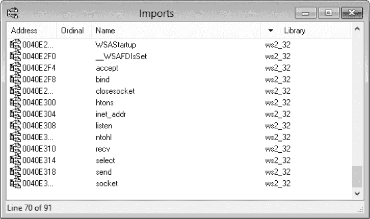

*图 6-11：导入窗口*

除了网络函数外，你可能还会看到一些加密库已被导入。追踪这些引用可以帮助你找到可执行文件中加密使用的地方。通过使用这些导入的信息，你也许能够追溯到原始的被调用方，了解它是如何使用的。常见的加密库包括 OpenSSL 和 Windows 的*Crypt32.dll*。

##### **分析字符串**

大多数应用程序都包含可打印的文本信息字符串，例如应用程序执行期间显示的文本、用于日志记录的文本，或者未使用的调试过程中的剩余文本。尤其是内部调试信息，可能会提示反汇编函数的功能。根据开发者添加调试信息的方式，你可能会找到函数名、原始 C 源代码文件，甚至是打印调试字符串时源代码中的行号。（大多数 C 和 C++ 编译器支持在编译过程中将这些值嵌入到字符串中。）

IDA Pro 会尝试在分析过程中找到可打印的文本字符串。要显示这些字符串，请打开字符串窗口。点击感兴趣的字符串，你将看到它的定义。然后，你可以尝试找到引用该字符串的地方，这样你就可以追踪到与之关联的功能。

字符串分析对于确定可执行文件静态链接了哪些库也非常有用。例如，ZLib 压缩库通常是静态链接的，链接的可执行文件应该始终包含以下字符串（版本号可能有所不同）：

```
inflate 1.2.8 Copyright 1995-2013 Mark Adler
```

通过快速发现可执行文件中包含哪些库，你可能能够成功猜测协议的结构。

##### **识别自动化代码**

某些类型的功能适合自动识别。例如，加密算法通常具有几个*魔术常量*（由算法定义的数字，具有特定的数学属性）。如果你在可执行文件中找到了这些魔术常量，那么你就知道至少有一个特定的加密算法已被编译到可执行文件中（虽然不一定被使用）。例如，清单 6-3 展示了 MD5 哈希算法的初始化，它使用了魔术常量值。

```
void md5_init( md5_context *ctx )
{
    ctx->state[0] = 0x67452301;
    ctx->state[1] = 0xEFCDAB89;
    ctx->state[2] = 0x98BADCFE;
    ctx->state[3] = 0x10325476;
}
```

*清单 6-3：显示魔术常量的 MD5 初始化*

了解 MD5 算法后，你可以通过在 IDA Pro 中选择反汇编窗口并选择 **搜索** ▸ **立即值** 来搜索这个初始化代码。按照图 6-12 所示的对话框完成操作，然后点击 **确定**。

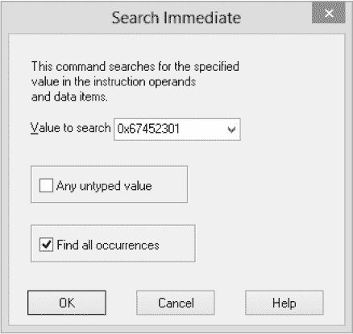

*图 6-12：IDA Pro MD5 常量搜索框*

如果 MD5 存在，你的搜索应该显示出该唯一值出现的位置列表。然后，你可以切换到反汇编窗口，尝试确定使用该值的代码。你还可以使用这种技术处理像 AES 加密算法这样的算法，它使用包含类似魔术常量的特殊*s-box*结构。

然而，使用 IDA Pro 的搜索框定位算法可能既耗时又容易出错。例如，图 6-12 中的搜索会同时找到 MD5 和 SHA-1，因为它们使用相同的四个魔术常量（并且 SHA-1 会增加一个第五个常量）。幸运的是，有些工具可以为你执行这些搜索。例如，PEiD（可从*[`www.softpedia.com/get/Programming/Packers-Crypters-Protectors/PEiD-updated.shtml`](http://www.softpedia.com/get/Programming/Packers-Crypters-Protectors/PEiD-updated.shtml)*下载）可以判断 Windows PE 文件是否使用已知的打包工具（如 UPX）进行打包。它包括一些插件，其中一个插件可以检测潜在的加密算法，并指示它们在可执行文件中的引用位置。

要使用 PEiD 检测加密算法，启动 PEiD 并点击右上角的按钮**…**，选择一个 PE 可执行文件进行分析。然后点击右下角的按钮并选择**Plugins** ▸ **Krypto Analyzer**来运行插件。如果可执行文件包含任何加密算法，插件应该能够识别它们并显示像图 6-13 中的对话框。然后，你可以将引用的地址值➊输入到 IDA Pro 中分析结果。


*图 6-13：PEiD 加密算法分析结果*

### **动态逆向工程**

*动态逆向工程*是检查正在运行的可执行文件操作的一种方法。这种逆向方法在分析复杂功能时特别有用，例如自定义的加密或压缩程序。原因是，与其盯着复杂功能的反汇编代码看，不如逐条指令地分析执行过程。动态逆向工程还可以通过允许你注入测试输入来测试你对代码的理解。

执行动态逆向工程的最常见方法是使用调试器在特定点停止正在运行的应用程序并检查数据值。虽然可以选择几种调试程序，但我们将使用 IDA Pro，它包含一个基本的 Windows 应用程序调试器，并能在静态视图和调试器视图之间同步。例如，如果你在调试器中重命名了一个函数，这一变化将在静态反汇编中反映出来。

**注意**

*尽管在以下讨论中我使用的是 Windows 上的 IDA Pro，基本技巧也适用于其他操作系统和调试器。*

要在 IDA Pro 的调试器中运行当前反汇编的可执行文件，按 F9。如果可执行文件需要命令行参数，可以通过选择**Debugger** ▸ **Process Options**并在显示的对话框中填写*Parameters*文本框来添加参数。要停止调试一个正在运行的进程，按 CTRL-F2。

#### ***设置断点***

使用调试器功能的最简单方法是在反汇编中的感兴趣位置设置*断点*，然后检查程序在这些断点处的运行状态。要设置断点，找到感兴趣的区域并按 F2 键。该反汇编行应变为红色，表示断点已正确设置。现在，每当程序尝试执行该断点处的指令时，调试器应该会停止，并让你查看程序的当前状态。

#### ***调试器窗口***

默认情况下，当调试器遇到断点时，IDA Pro 调试器会显示三个重要的窗口。

##### **EIP 窗口**

第一个窗口显示基于 EIP 寄存器中指令的反汇编视图，显示当前正在执行的指令（见图 6-14）。这个窗口的工作方式与静态逆向工程时的反汇编窗口类似。你可以快速从这个窗口导航到其他函数并重命名引用（这些更改会反映在你的静态反汇编中）。当你将鼠标悬停在寄存器上时，应该会看到该寄存器值的快速预览，如果该寄存器指向一个内存地址，这非常有用。

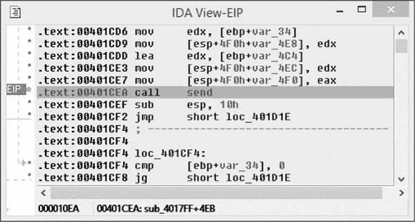

*图 6-14：调试器 EIP 窗口*

##### **ESP 窗口**

调试器还会显示一个 ESP 窗口，反映当前 ESP 寄存器的位置，ESP 寄存器指向当前线程栈的基地址。在这里，你可以识别传递给函数调用的参数或局部变量的值。例如，图 6-15 显示了调用 `send` 函数之前的栈值。我已突出显示了四个参数。与 EIP 窗口一样，你可以双击引用跳转到该位置。

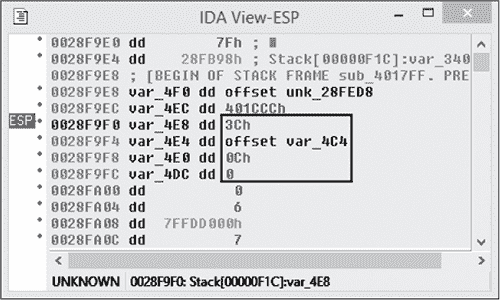

*图 6-15：调试器 ESP 窗口*

##### **通用寄存器的状态**

通用寄存器默认窗口显示当前通用寄存器的状态。回想一下，寄存器用于存储各种程序状态的当前值，例如循环计数器和内存地址。对于内存地址，这个窗口提供了一种方便的方式导航到内存视图窗口：点击每个地址旁边的箭头，可以从上一个活动内存窗口跳转到对应寄存器值的内存地址。

要创建一个新的内存窗口，右键点击数组并选择 **在新窗口中跳转**。你会在窗口右侧看到来自 EFLAGS 寄存器的条件标志，如图 6-16 所示。

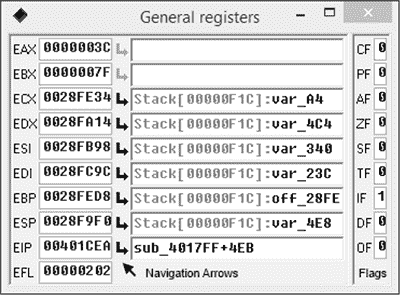

*图 6-16：通用寄存器窗口*

#### ***在哪里设置断点？***

在调查网络协议时，最好的断点设置位置在哪里？一个好的起步点是设置断点在 `send` 和 `recv` 函数的调用上，它们分别用于发送和接收来自网络栈的数据。加密函数也是一个不错的目标：你可以在设置加密密钥或加密和解密函数的地方设置断点。由于调试器与 IDA Pro 中的静态反汇编器同步，你还可以在看似构建网络协议数据的代码区域设置断点。通过逐步执行带有断点的指令，你可以更好地理解底层算法是如何工作的。

### **逆向工程托管语言**

不是所有的应用程序都作为本地可执行文件分发。例如，使用*托管语言*（如 .NET 和 Java）编写的应用程序编译为一种中间机器语言，这种语言通常是为了 CPU 和操作系统无关的设计。当应用程序执行时，*虚拟机*或*运行时*执行代码。在 .NET 中，这种中间机器语言称为*公共中间语言（CIL）*；在 Java 中，它被称为*Java 字节码*。

这些中间语言包含大量元数据，例如类的名称以及所有内部和外部方法的名称。此外，与本地编译的代码不同，托管语言的输出是相对可预测的，这使得它们非常适合反编译。

在接下来的章节中，我将探讨 .NET 和 Java 应用程序是如何打包的。我还将演示一些工具，帮助你高效地逆向工程 .NET 和 Java 应用程序。

#### ***.NET 应用程序***

.NET 运行时环境被称为*公共语言运行时（CLR）*。一个 .NET 应用程序依赖于 CLR 以及一个称为*基础类库（BCL）*的大型功能库。

虽然 .NET 主要是一个 Microsoft Windows 平台（毕竟它是由 Microsoft 开发的），但也有多个其他的、更具可移植性的版本可用。最著名的版本是 Mono 项目，它支持类 Unix 系统并涵盖了多种 CPU 架构，包括 SPARC 和 MIPS。

如果你查看与 .NET 应用程序一起分发的文件，你会看到 *.exe* 和 *.dll* 扩展名的文件，你可能会认为它们只是本地可执行文件。但如果你将这些文件加载到 x86 反汇编器中，你将看到类似于图 6-17 中显示的消息。

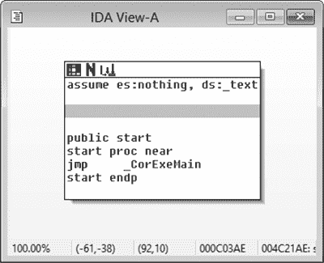

*图 6-17：x86 反汇编器中的 .NET 可执行文件*

事实证明，.NET 仅使用*.exe*和*.dll*文件格式作为 CIL 代码的便捷容器。在 .NET 运行时中，这些容器被称为*程序集*。

程序集包含一个或多个类、枚举和/或结构。每个类型都由一个名称表示，通常由命名空间和短名称组成。命名空间减少了名称冲突的可能性，同时也有助于分类。例如，任何在命名空间 System.Net 下的类型都与网络功能有关。

#### ***使用 ILSpy***

你很少需要，甚至不需要直接与原始 CIL 交互，因为像 Reflector (*[`www.red-gate.com/products/dotnet-development/reflector/`](https://www.red-gate.com/products/dotnet-development/reflector/)*) 和 ILSpy (*[`ilspy.net/`](http://ilspy.net/)*) 这样的工具可以将 CIL 数据反编译为 C# 或 Visual Basic 源代码，并显示原始 CIL。让我们来看一下如何使用 ILSpy，这是一款免费开源工具，你可以用它来查找应用程序的网络功能。图 6-18 展示了 ILSpy 的主界面。

界面分为两个窗口。左侧窗口 ➊ 是 ILSpy 加载的所有程序集的树状列表。你可以展开树视图查看程序集包含的命名空间和类型 ➋。右侧窗口显示反汇编的源代码 ➌。你在左侧窗口选择的程序集会在右侧窗口中展开。

要处理 .NET 应用程序，通过按 CTRL+O 并在对话框中选择应用程序，将其加载到 ILSpy 中。如果你打开应用程序的主可执行文件，ILSpy 应该会根据需要自动加载可执行文件中引用的任何程序集。

打开应用程序后，你可以搜索网络功能。一个方法是搜索那些名称像网络功能的类型和成员。要搜索所有已加载的程序集，按 F3\. 屏幕右侧应该会出现一个新窗口，如图 6-19 所示。

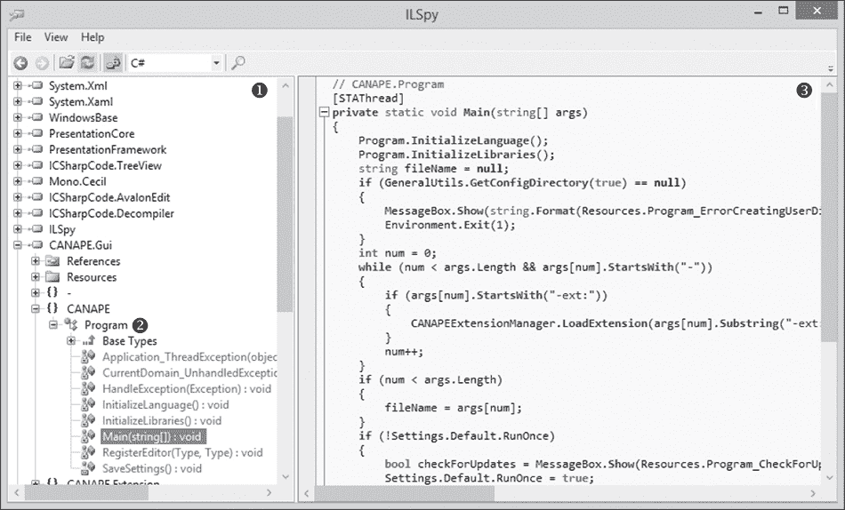

*图 6-18：ILSpy 主界面*

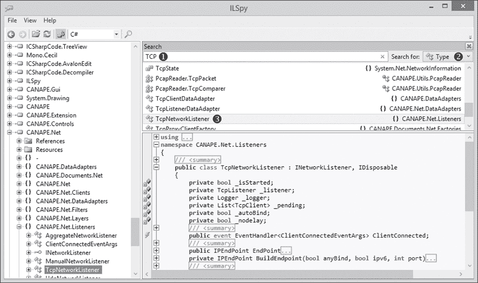

*图 6-19：ILSpy 搜索窗口*

在 ➊ 输入搜索词以筛选出所有已加载的类型，并将其显示在下面的窗口中。你还可以通过从 ➋ 的下拉列表中选择来搜索成员或常量。例如，搜索字面量字符串时，选择 **常量**。当你找到想要检查的条目时，比如 TcpNetworkListener ➌，双击它，ILSpy 应该会自动反编译该类型或方法。

除了直接搜索特定的类型和成员外，你还可以搜索应用程序中使用内置网络或加密库的区域。基础类库包含一大套低级套接字 API 和用于更高级别协议（如 HTTP 和 FTP）的库。如果你右键点击左侧窗口中的某个类型或成员并选择 **分析**，应该会出现一个新窗口，如图 6-20 右侧所示。

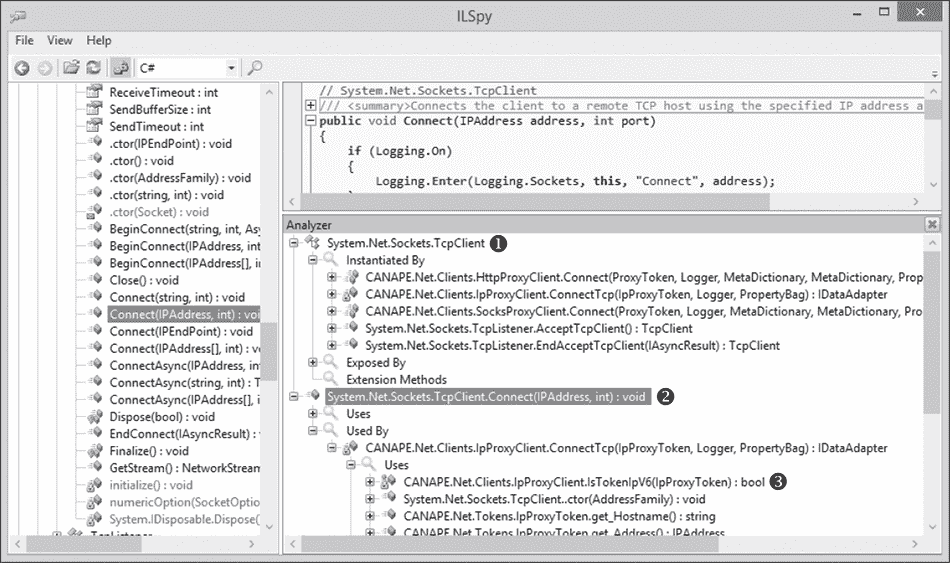

*图 6-20：ILSpy 分析一个类型*

这个新窗口是一个树形结构，展开后显示可以对你在左侧窗口中选择的项进行的分析类型。你的选项将取决于你选择分析的内容。例如，分析一个类型 ➊ 会显示三个选项，尽管你通常只需要使用以下两种分析形式：

**实例化者** 显示哪些方法创建此类型的新实例

**由此暴露** 显示哪些方法或属性在声明或参数中使用此类型

如果你分析一个成员、方法或属性，你会看到两个选项 ➋：

**使用** 显示选定成员使用的其他成员或类型

**被使用** 显示其他成员如何使用选定的成员（例如，通过调用方法）

你可以展开所有条目 ➌。

这几乎就是静态分析 .NET 应用程序的全部内容。找到一些感兴趣的代码，检查反编译后的代码，然后开始分析网络协议。

**注意**

*大多数 .NET 的核心功能都在与 .NET 运行时环境一起分发的基础类库（BCL）中，并且所有 .NET 应用程序都可以访问。BCL 中的程序集提供了几个基本的网络和加密库，如果应用程序实现网络协议，这些库是应用程序可能需要的。请查找引用 `System.Net` 和 `System.Security.Cryptography` 命名空间中的类型的区域。这些大多数实现于 MSCORLIB 和 System 程序集中。如果你能够从对这些重要 API 的调用中追溯回来，你将发现应用程序如何处理网络协议。*

#### ***Java 应用程序***

Java 应用程序与 .NET 应用程序不同，因为 Java 编译器不会将所有类型合并成一个文件；相反，它会将每个源代码文件编译成一个单独的 *Class 文件*，并带有 *.class* 扩展名。由于文件系统目录中的独立 Class 文件在系统之间传输时不太方便，Java 应用程序通常被打包成 *Java 存档*，或 *JAR 文件*。JAR 文件其实就是一个 ZIP 文件，包含了一些附加文件来支持 Java 运行时。 图 6-21 显示了一个在 ZIP 解压程序中打开的 JAR 文件。

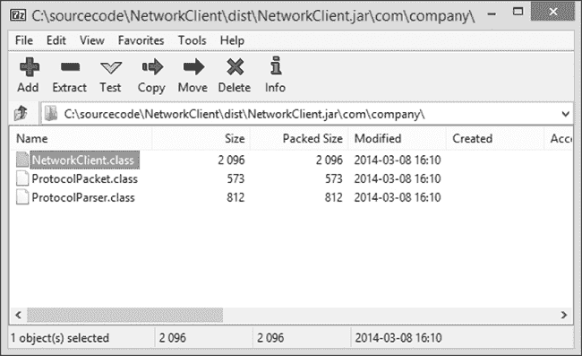

*图 6-21：通过 ZIP 应用程序打开的 JAR 文件示例*

要反编译 Java 程序，我推荐使用 JD-GUI (*[`jd.benow.ca/`](http://jd.benow.ca/)*)，它在反编译 .NET 应用程序时与 ILSpy 基本相同。我不会深入介绍如何使用 JD-GUI，但会简要介绍 图 6-22 中用户界面的几个重要区域，以帮助你快速上手。

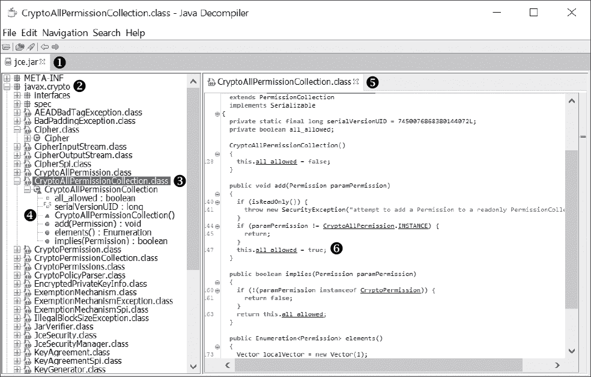

*图 6-22：带有打开的 JAR 文件的 JD-GUI*

图 6-22 展示了当你打开 JAR 文件*jce.jar* ➊时 JD-GUI 的用户界面，该文件在安装 Java 时会默认安装，并且通常可以在*JAVAHOME/lib*目录下找到。你可以根据逆向工程的应用结构一次打开单个类文件或多个 JAR 文件。当你打开 JAR 文件时，JD-GUI 会解析元数据以及类的列表，并以树形结构展示。在图 6-22 中，我们可以看到 JD-GUI 提取的两个重要信息。首先是一个名为`javax.crypto` ➋的包，该包定义了各种 Java 加密操作的类。在包名下方是该包中定义的类列表，例如`CryptoAllPermissionCollection.class` ➌。如果你点击左侧窗口中的类名，右侧窗口会显示该类的反编译版本 ➍。你可以滚动浏览反编译的代码，或者点击类中暴露的字段和方法 ➎，跳转到反编译代码窗口中的相应位置。

第二个重要的注意事项是，任何在反编译代码中带下划线的标识符都可以被点击，工具会导航到该标识符的定义位置。如果你点击下划线标识符`all_allowed` ➏，用户界面将导航到当前反编译类中`all_allowed`字段的定义。

#### ***处理混淆***

包含在典型的 .NET 或 Java 应用程序中的所有元数据，使得逆向工程师能够更容易地了解应用程序的功能。然而，商业开发者，尤其是那些使用特殊“秘制”网络协议的开发者，通常不喜欢这些应用程序被轻易逆向工程。由于这些语言的反编译过程相对简单，也使得发现自定义网络协议中的安全漏洞变得相对容易。一些开发者可能不希望你知道这些信息，因此他们将模糊化作为一种安全解决方案。

你可能会遇到一些故意使用工具（例如 Java 的 ProGuard 或 .NET 的 Dotfuscator）进行混淆的应用程序。这些工具会对编译后的应用程序进行各种修改，目的是使逆向工程师的工作变得更加困难。这些修改可能简单到将所有的类型和方法名称更改为无意义的值，或者可能更加复杂，例如采用运行时解密字符串和代码。无论使用哪种方法，混淆都会使反编译代码变得更加困难。例如，图 6-23 展示了一个原始的 Java 类与其混淆后的版本，后者是在通过 ProGuard 运行后获得的。

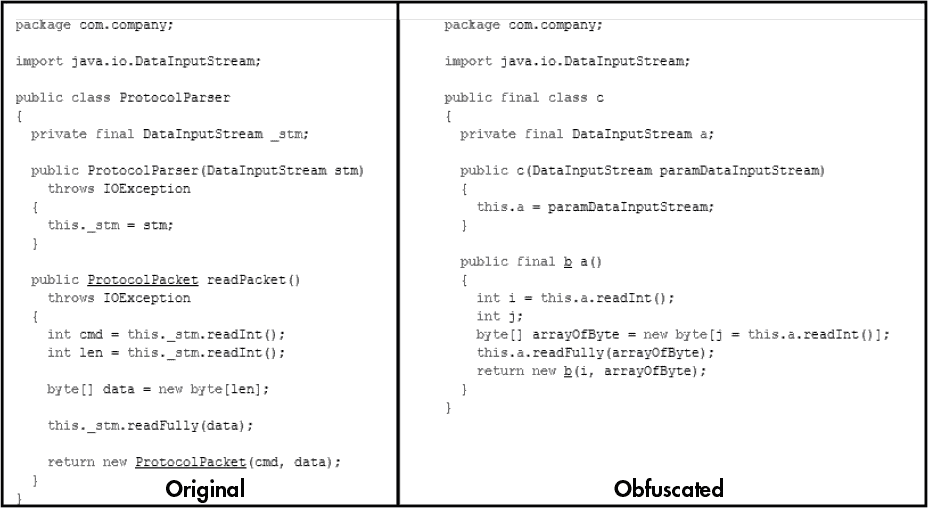

*图 6-23：原始与混淆后的类文件对比*

如果你遇到一个混淆的应用程序，使用普通的反编译工具可能很难判断它的功能。毕竟，这正是混淆的目的。然而，下面是一些在处理它们时可以使用的小贴士：

• 请记住，外部库类型和方法（如核心类库）无法被混淆。如果应用程序进行任何网络通信，必须在其中存在对 socket API 的调用，因此要搜索它们。

• 因为 .NET 和 Java 容易动态加载和执行，你可以编写一个简单的测试工具来加载混淆的应用程序并运行字符串或代码解密程序。

• 尽可能使用动态反向工程来检查运行时的类型，以确定它们的用途。

### **反向工程资源**

以下网址提供了关于反向工程软件的优秀信息资源。这些资源提供了更多关于反向工程或其他相关主题（如可执行文件格式）的详细信息。

• OpenRCE 论坛：*[`www.openrce.org/`](http://www.openrce.org/)*

• ELF 文件格式：*[`refspecs.linuxbase.org/elf/elf.pdf`](http://refspecs.linuxbase.org/elf/elf.pdf)*

• macOS Mach-O 格式：*[`web.archive.org/web/20090901205800/`](https://web.archive.org/web/20090901205800/)*

*[`developer.apple.com/mac/library/documentation/DeveloperTools/Conceptual/MachORuntime/Reference/reference.html`](http://developer.apple.com/mac/library/documentation/DeveloperTools/Conceptual/MachORuntime/Reference/reference.html)*

• PE 文件格式：*[`msdn.microsoft.com/en-us/library/windows/desktop/ms680547(v=vs.85).aspx`](https://msdn.microsoft.com/en-us/library/windows/desktop/ms680547(v=vs.85).aspx)*

有关本章中使用的工具的更多信息，包括下载位置，请参见附录 A。

### **最后的话**

反向工程需要时间和耐心，所以不要期望一夜之间就能学会。理解操作系统和架构如何协同工作，理清优化后的 C 代码在反汇编器中产生的混乱，以及静态分析反编译后的代码，都需要时间。我希望我能给你一些关于反向工程可执行文件以查找其网络协议代码的有用建议。

反向工程的最佳方法是从你已经理解的小型可执行文件入手。你可以将这些小型可执行文件的源代码与反汇编的机器码进行比较，以更好地理解编译器如何将原始编程语言翻译成机器语言。

当然，不要忘记动态逆向工程，并尽可能使用调试器。有时，直接运行代码比静态分析更高效。逐步调试程序不仅可以帮助你更好地理解计算机架构的工作原理，还能让你完全分析代码的一个小部分。如果你幸运的话，可能还可以使用众多可用工具分析一个用.NET 或 Java 编写的托管语言可执行文件。当然，如果开发者对可执行文件进行了混淆，分析会变得更加困难，但这也是逆向工程乐趣的一部分。
