## **7**  

**网络协议安全**  

网络协议在网络中的参与者之间传输信息，这些信息很可能是敏感的。无论信息是否包含信用卡详细信息或政府系统中的机密信息，都需要提供安全保护。在最初设计协议时，工程师会考虑很多安全要求，但漏洞往往会随着时间的推移显现，特别是在协议被用于公共网络上时，任何监控流量的人都可以对其进行攻击。

所有安全协议应当做到以下几点：  

• 通过保护数据不被读取来保持数据机密性  

• 通过保护数据不被篡改来保持数据完整性  

• 通过实现服务器认证，防止攻击者冒充服务器  

• 通过实现客户端认证，防止攻击者冒充客户端  

在本章中，我将讨论这些四个要求如何在常见的网络协议中得到满足，分析在检查协议时需要注意的潜在弱点，并描述这些要求如何在现实世界中的安全协议中得以实现。我还将讨论如何识别正在使用的协议加密或在后续章节中寻找潜在缺陷。  

密码学领域包括两种许多网络协议使用的重要技术，它们以某种方式保护数据或协议：*加密*提供数据机密性，*签名*提供数据完整性和认证。  

安全的网络协议高度依赖加密和签名，但加密技术的正确实现可能很困难：常常会发现实现和设计上的错误，这些错误会导致漏洞，进而破坏协议的安全性。在分析一个协议时，你应该对所涉及的技术和算法有充分的了解，以便能够发现甚至利用严重的弱点。我们先来看加密，了解实现上的错误如何影响应用的安全性。  

### **加密算法**  

加密的历史可以追溯到数千年前，随着电子通信变得越来越容易被监控，加密的重要性也大大增加。现代加密算法通常依赖于非常复杂的数学模型。然而，仅仅因为一个协议使用复杂的算法并不意味着它是安全的。  

我们通常将加密算法称为*密码*或*编码*，这取决于它的结构。讨论加密操作时，原始的、未加密的信息被称为*明文*。加密算法的输出是一个加密信息，称为*密文*。大多数算法还需要一个*密钥*来进行加密和解密。破解或削弱加密算法的努力被称为*密码分析*。  

许多曾经被认为安全的算法已经显示出许多弱点，甚至后门。这部分是因为自这些算法发明以来，计算性能的大幅提升（其中一些算法可以追溯到 1970 年代），使得曾经只在理论上可行的攻击变得现实可行。

如果你想破解安全网络协议，你需要了解一些知名的密码学算法以及它们的弱点所在。加密不一定需要复杂的数学。有些算法仅用于混淆网络上协议的结构，如字符串或数字。当然，如果一个算法很简单，它的安全性通常较低。一旦混淆机制被发现，它就不再提供真正的安全性。

在这里，我将提供一些常见加密算法的概述，但我不会深入讲解这些密码的构造，因为在协议分析中，我们只需要理解当前使用的算法。

#### ***替换密码***

替换密码是最简单的加密形式。替换密码使用一种算法，通过一个替换表加密一个值，该替换表包含明文和对应的密文值之间的一对一映射，如图 7-1 所示。要解密密文，过程是反向的：查找密文值在表中的对应值（该表已被反转），并恢复原始明文值。图 7-1 展示了一个示例替换密码。

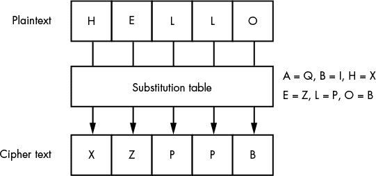

*图 7-1：替换密码加密*

在图 7-1 中，替换表（仅作为一个简单示例）显示了右侧的六个定义的替换。在完整的替换密码中，通常会定义更多的替换。在加密过程中，首先从明文中选择一个字母，然后在替换表中查找该明文字母的替换。这里，*H*在“HELLO”中被替换为字母*X*。这个过程持续进行，直到所有字母都被加密。

尽管替换可以有效防御一般攻击，但它无法抵挡密码分析。*频率分析*通常用于通过将密文中符号的频率与明文数据集中的常见符号频率进行比较，破解替换密码。例如，如果密文保护的是一条用英语写的消息，频率分析可以通过分析大量书面作品中常见字母、标点符号和数字的频率来揭示规律。因为字母*E*在英语中是最常见的字母，所以密文中最常见的字符很可能代表*E*。通过将这一过程推向逻辑结论，就可以构建出原始替换表并破解消息。

#### ***异或加密***

异或加密算法是一种非常简单的数据加密和解密技术。它通过将明文字节和密钥字节之间进行逐位异或操作，得到密文。例如，给定字节 0x48 和密钥字节 0x82，对它们进行异或操作的结果将是 0xCA。

由于异或操作是对称的，将相同的密钥字节应用于密文将返回原始明文。图 7-2 展示了使用单字节密钥的异或加密操作。

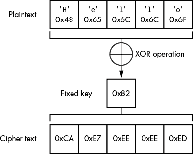

*图 7-2：使用单字节密钥的异或加密操作*

指定一个单字节密钥使得加密算法非常简单，但安全性较差。对于攻击者来说，尝试所有 256 个可能的密钥值来解密密文为明文并不难，增加密钥大小也无济于事。由于异或操作是对称的，密文可以与已知明文进行异或操作，从而确定密钥。给定足够的已知明文，密钥可以被计算出来，并应用于其余的密文，解密整个消息。

安全地使用异或加密的唯一方法是密钥与消息大小相同，并且密钥中的值完全随机选择。这种方法被称为*一次性密码本加密*，并且相当难以破解。如果攻击者知道明文的任何一小部分，他们也无法确定完整的密钥。恢复密钥的唯一方法是知道整个消息的明文；在那种情况下，显然攻击者就不需要恢复密钥了。

不幸的是，一次性密码本加密算法存在显著问题，在实际中很少使用。一个问题是，当使用一次性密码本时，发送方和接收方必须发送与消息大小相同的密钥材料。一次性密码本能够安全的唯一方式是，如果消息中的每个字节都用完全随机的值进行加密。而且，你不能将一次性密码本密钥用于不同的消息，因为如果攻击者能够解密你的一条消息，那么他们就能恢复密钥，然后，使用相同密钥加密的后续消息就会受到威胁。

如果异或加密如此劣质，为什么还要提它呢？嗯，尽管它并不“安全”，开发者还是出于懒惰而使用它，因为它实现起来很简单。异或加密也作为构建更安全加密算法的基础原语，因此理解它的工作原理是很重要的。

### **随机数生成器**

加密系统严重依赖高质量的随机数。在本章中，你将看到它们被用作每会话密钥、初始化向量以及 RSA 算法中的大素数*p*和*q*。然而，获得真正随机的数据是困难的，因为计算机天生是确定性的：任何给定的程序在相同输入和状态下应该产生相同的输出。

生成相对不可预测的数据的一种方法是通过采样物理过程。例如，你可以计时用户在键盘上的按键，或者采样电气噪声源，例如电阻器中的热噪声。这些源的问题是它们提供的数据量很少——最多每秒几百字节，这对于通用加密系统来说是不够的。一个简单的 4096 位 RSA 密钥至少需要两个随机的 256 字节数字，这些数字需要几秒钟才能生成。

为了使这些采样数据更有用，加密库实现了*伪随机数生成器（PRNG）*，它使用一个初始种子值，并生成一系列数字，理论上，在不知道生成器内部状态的情况下，应该无法预测这些数字。PRNG 的质量在不同的库中差异巨大：例如，C 语言库函数*rand()*对于加密安全协议完全没用。一个常见的错误是使用弱算法生成用于加密的随机数。

### **对称密钥加密**

加密消息的唯一安全方法是在加密之前发送一个与消息大小相同的完全随机密钥作为一次性密钥。当然，我们不希望处理如此大的密钥。幸运的是，我们可以构建一个对称密钥算法，利用数学构造来创建一个安全的加密算法。由于密钥的大小比要发送的消息小得多，并且不依赖于需要加密的内容量，因此它更容易分发。

如果使用的算法没有明显的弱点，那么安全性的限制因素就是密钥的大小。如果密钥较短，攻击者可以通过暴力破解密钥，直到找到正确的密钥。

对称加密算法主要有两种类型：分组密码和流密码。每种都有其优缺点，选择错误的加密算法会严重影响网络通信的安全性。

#### ***分组密码***

许多著名的对称密钥算法，如*高级加密标准（AES）*和*数据加密标准（DES）*，每次应用加密算法时都会加密和解密固定数量的位（称为*块*）。要加密或解密一条消息，算法需要一个密钥。如果消息比一个块的大小要长，则必须将其拆分成更小的块，然后依次对每个块应用算法。每次应用算法时都使用相同的密钥，如图 7-3 所示。请注意，使用的是相同的密钥进行加密和解密。

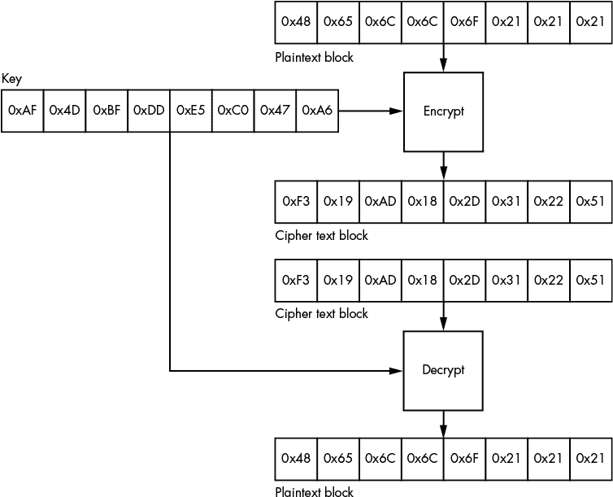

*图 7-3：分组密码加密*

当使用对称密钥算法进行加密时，明文块与密钥按照算法描述的方式结合，生成密文。然后，如果我们将结合密钥的解密算法应用于密文，我们就能恢复原始明文。

##### **DES**

可能仍在现代应用中使用的最古老的块加密算法是 DES，它最初由 IBM 开发（名为 Lucifer），并于 1979 年作为 *联邦信息处理标准（FIPS）* 发布。该算法使用 *费斯特尔网络* 实现加密过程。费斯特尔网络在许多块加密算法中都很常见，它通过反复应用一个函数到输入中，执行若干 *轮* 的操作。该函数以上一轮的值（原始明文）以及通过 *密钥调度* 算法从原始密钥派生的特定子密钥作为输入。

DES 算法使用 64 位的块大小和 64 位的密钥。然而，DES 要求 8 位密钥用于错误检查，因此有效密钥长度仅为 56 位。结果是一个非常小的密钥，已经不适合现代应用，正如 1998 年电子前沿基金会的 DES 破解器所证明的那样——这是一种硬件密钥暴力破解攻击工具，能够在约 56 小时内破解一个未知的 DES 密钥。当时，这种定制硬件的成本大约为 25 万美元；今天，基于云的破解工具可以以更低的成本在不到一天的时间内破解密钥。

##### **三重 DES**

密码学家没有完全放弃 DES，而是开发了一种修改版，将该算法应用三次。*三重 DES（TDES 或 3DES）*算法使用三个独立的 DES 密钥，提供 168 位的有效密钥长度（尽管可以证明其安全性实际上低于预期的大小）。如图 7-4 所示，在三重 DES 中，首先使用第一个密钥对明文应用 DES 加密函数。接下来，使用第二个密钥对输出进行解密。然后，再使用第三个密钥对输出进行加密，最终得到密文。解密时，操作则是反向进行的。

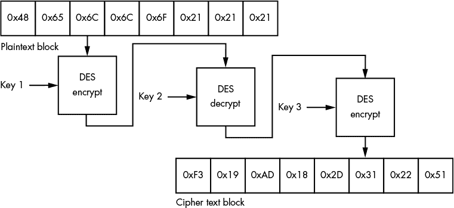

*图 7-4：三重 DES 加密过程*

##### **AES**

一种更现代的加密算法是 AES，它基于 Rijndael 算法。AES 使用固定的 128 位块大小，并可以使用三种不同的密钥长度：128 位、192 位和 256 位；它们分别被称为 AES128、AES192 和 AES256。与使用费斯特尔网络不同，AES 使用 *代换-置换网络*，该网络由两个主要组件组成：*代换盒（S-Box）* 和 *置换盒（P-Box）*。这两个组件链式连接，形成算法的单轮操作。与费斯特尔网络类似，这一轮操作可以多次应用，并使用不同的 S-Box 和 P-Box 值来生成加密输出。

S-Box 是一种基本的映射表，类似于简单的替换密码。S-Box 接收输入，查表并生成输出。由于 S-Box 使用一个大型的、独特的查找表，它在识别特定算法时非常有用。这个独特的查找表提供了一个非常大的指纹，可以在应用程序的可执行文件中被发现。我在第六章中详细解释了这一点，当时我讨论了通过逆向工程二进制文件来寻找未知加密算法的技术。

##### **其他块加密算法**

DES 和 AES 是你最常遇到的块加密算法，但还有其他算法，如表 7-1 中列出的（以及商业产品中的其他算法）。

**表 7-1：** 常见的块加密算法

| **密码名称** | **块大小（位）** | **密钥大小（位）** | **引入年份** |
| --- | --- | --- | --- |
| 数据加密标准（DES） | 64 | 56 | 1979 |
| Blowfish | 64 | 32–448 | 1993 |
| 三重数据加密标准（TDES/3DES） | 64 | 56, 112, 168 | 1998 |
| 蛇形算法 | 128 | 128, 192, 256 | 1998 |
| Twofish | 128 | 128, 192, 256 | 1998 |
| Camellia | 128 | 128, 192, 256 | 2000 |
| 高级加密标准（AES） | 128 | 128, 192, 256 | 2001 |

块和密钥大小帮助你根据密钥的指定方式或加密数据如何被划分成块，来确定协议使用的是哪种加密算法。

#### ***块加密模式***

块加密算法定义了加密如何在数据块上操作。单独来看，块加密算法有一些弱点，正如你很快会看到的那样。因此，在实际协议中，通常会将块加密与另一种称为*操作模式*的算法结合使用。操作模式提供了额外的安全特性，例如使加密输出更难预测。有时，操作模式还会改变加密算法的运作方式，例如将块加密转换为流加密（我将在第 158 页的“流加密”中详细解释）。让我们看看一些常见的模式，以及它们的安全特性和弱点。

##### **电子代码本**

块加密的最简单和默认的操作模式是*电子代码本（ECB）*。在 ECB 模式中，加密算法会应用于明文的每一个固定大小的数据块，生成一系列的密文数据块。数据块的大小由所使用的算法定义。例如，如果使用 AES 作为加密算法，在 ECB 模式下每个数据块的大小必须为 16 字节。明文被分为单独的块，并应用加密算法。（图 7-3 展示了 ECB 模式的工作原理。）

因为在 ECB 中每个明文块是独立加密的，所以它将始终加密为相同的密文块。因此，ECB 并不总是能隐藏明文中的大规模结构，如图 7-5 所示的位图图像。此外，攻击者可以通过在解密之前对密文块进行重新排列，来破坏或操纵独立块加密的解密数据。


*图 7-5：对位图图像的 ECB 加密*

##### **密码块链接**

另一种常见的操作模式是*密码块链接（CBC）*，它比 ECB 更复杂，并且避免了 ECB 的缺陷。在 CBC 模式中，单个明文块的加密依赖于前一个块的加密值。前一个加密块与当前明文块进行异或操作，然后将加密算法应用于这个组合结果。图 7-6 展示了将 CBC 应用于两个块的示例。

在图 7-6 的顶部是原始的明文块，底部是通过应用块加密算法以及 CBC 模式算法生成的结果密文。在每个明文块加密之前，明文会与前一个加密块进行异或操作。将块进行异或后，再应用加密算法。这样可以确保输出的密文不仅依赖于明文，还依赖于前一个加密块。

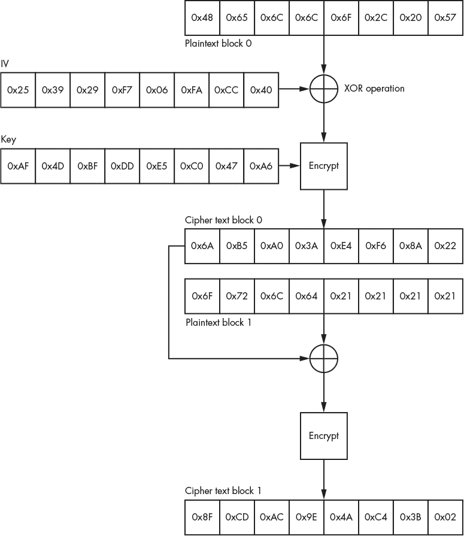

*图 7-6：CBC 操作模式*

因为第一个明文块没有前一个密文块可以执行异或（XOR）操作，所以你需要将它与一个手动选择或随机生成的块结合，这个块被称为*初始化向量（IV）*。如果 IV 是随机生成的，它必须与加密数据一起发送，否则接收方将无法解密消息的第一个块。（如果使用固定的 IV，并且相同的密钥用于所有通信，就会存在问题，因为如果相同的消息被多次加密，它将始终加密为相同的密文。）

要解密 CBC，加密操作按相反顺序执行：解密从消息的末尾到前端进行，每次用密钥解密一个密文块，并在每一步将解密后的块与前面一个加密块进行异或操作。

##### **替代模式**

块密码的其他操作模式包括那些可以将块密码转换为流密码的模式，以及一些特殊模式，如*Galois 计数器模式（GCM）*，它们提供数据完整性和保密性。表 7-2 列出了几种常见的操作模式，并指示它们是生成块密码还是流密码（我将在“流密码”一节中进一步讨论，见第 158 页）。详细描述每个模式超出了本书的范围，但此表提供了进一步研究的粗略指南。

**表 7-2：** 常见块密码操作模式

| **模式名称** | **缩写** | **模式类型** |
| --- | --- | --- |
| 电子密码本 | ECB | 块模式 |
| 密码块链接 | CBC | 块模式 |
| 输出反馈 | OFB | 流模式 |
| 密码反馈 | CFB | 流模式 |
| 计数器 | CTR | 流模式 |
| Galois 计数器模式 | GCM | 带数据完整性的流模式 |

#### ***块密码填充***

块密码在固定大小的消息单元上进行操作：一个块。但是，如果你想加密一个字节的数据，而块大小是 16 字节，该怎么办？这时，*填充*方案就派上用场了。填充方案决定了在加密和解密过程中如何处理块中未使用的剩余部分。

填充的最简单方法是用特定已知的值填充额外的块空间，如重复的零字节。但是，当你解密这个块时，如何区分填充字节和有意义的数据呢？一些网络协议指定了一个显式长度字段，你可以用它来去除填充，但你不能总是依赖这个方法。

一种解决这个问题的填充方案在*公钥密码学标准 #7（PKCS#7）*中定义。在这种方案中，所有填充的字节都设置为表示填充字节数量的值。例如，如果有三个字节的填充，每个字节都设置为值 3，如图 7-7 所示。

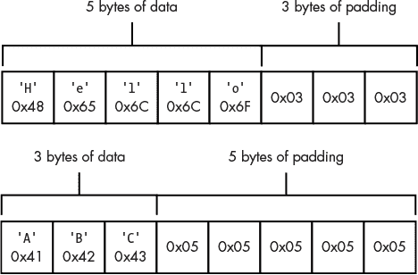

*图 7-7：PKCS#7 填充示例*

如果你不需要填充怎么办？例如，如果你正在加密的最后一个块已经是正确的长度呢？如果你只是加密最后一个块并传输它，解密算法会将合法数据解释为填充块的一部分。为了解除这种歧义，加密算法必须发送一个只包含填充的虚拟块，以便向解密算法指示最后一个块可以被丢弃。

当填充的块被解密时，解密过程可以轻松验证填充字节的数量。解密过程读取块中的最后一个字节，以确定预期的填充字节数量。例如，如果解密过程读取到值为 3，它知道应该有三个填充字节。然后，解密过程会读取另外两个预期的填充字节，验证每个字节的值是否也为 3。如果填充不正确，可能是因为所有预期的填充字节的值不相同，或者填充值超出范围（值必须小于或等于块的大小且大于 0），则会发生错误，可能导致解密过程失败。失败的方式本身就是一个安全考虑。

#### ***填充 oracle 攻击***

一个严重的安全漏洞，被称为*填充 oracle 攻击*，当 CBC 模式与 PKCS#7 填充方案结合使用时发生。此攻击允许攻击者解密数据，在某些情况下，当数据通过此协议发送时，即使攻击者不知道密钥，也能加密自己的数据（例如会话令牌）。如果攻击者能够解密会话令牌，他们可能会恢复敏感信息。但如果他们能够加密令牌，他们可能会绕过网站的访问控制。

例如，考虑清单 7-1，它使用私有 DES 密钥解密来自网络的数据。

```
 def decrypt_session_token(byte key[])
{
➊ byte iv[] = read_bytes(8);
      byte token[] = read_to_end();

➋ bool error = des_cbc_decrypt(key, iv, token);

      if(error) {
    ➌ write_string("ERROR");
      } else {
    ➍ write_string("SUCCESS");
      }
}
```

*清单 7-1：来自网络的简单 DES 解密*

该代码从网络读取 IV 和加密数据 ➊，并将其传递给使用内部应用密钥的 DES CBC 解密程序 ➋。在这种情况下，它解密客户端会话令牌。这个用例在 Web 应用程序框架中很常见，在这种情况下，客户端实际上是无状态的，每次请求都必须发送令牌来验证其身份。

解密函数返回一个错误条件，指示解密是否失败。如果失败，它会将字符串 `ERROR` 发送到客户端 ➌；否则，它会发送字符串 `SUCCESS` ➍。因此，代码为攻击者提供了有关解密客户端任意加密块成功或失败的信息。此外，如果代码使用 PKCS#7 进行填充，并且发生错误（因为填充与最后解密块中的正确模式不匹配），攻击者可以利用这些信息执行填充 oracle 攻击，然后解密攻击者发送到易受攻击服务的数据块。

这就是填充 Oracle 攻击的本质：通过关注网络服务是否成功解密了 CBC 加密块，攻击者可以推测出该块的原始未加密值。（术语 *oracle* 指的是攻击者可以向服务提出问题并获得真假答案。具体来说，在这种情况下，攻击者可以询问他们发送到服务的加密块的填充是否有效。）

为了更好地理解填充 Oracle 攻击是如何工作的，让我们回顾一下 CBC 解密单个块的过程。图 7-8 展示了一个 CBC 加密数据块的解密过程。在这个例子中，明文是字符串 `Hello`，后面有三个字节的 PKCS#7 填充。

通过查询网络服务，攻击者可以直接控制原始密文和 IV。因为在最终解密步骤中，每个明文字节都会与一个 IV 字节进行异或运算，攻击者可以通过改变 IV 中相应字节来直接控制明文输出。在图 7-8 中，解密块的最后一个字节是 0x2B，它与 IV 字节 0x28 进行异或运算，输出 0x03，这是一个填充字节。但如果将最后一个 IV 字节更改为 0xFF，密文的最后一个字节解密为 0xD4，这不再是有效的填充字节，解密服务将返回错误。

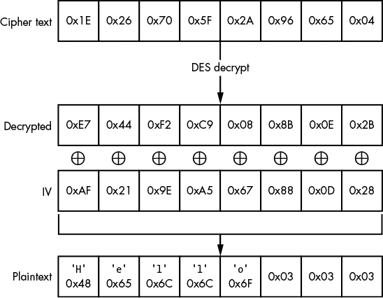

*图 7-8：带 IV 的 CBC 解密*

现在，攻击者已经拥有了破解填充值所需的一切。他们通过查询网络服务并发送虚假的密文，尝试所有可能的 IV 最后一个字节值。每当解密后的值不等于 0x01（或者恰好是其他有效的填充方式）时，解密返回错误。但一旦填充有效，解密将返回成功。

有了这些信息，攻击者即使没有密钥，也能确定解密块中该字节的值。例如，假设攻击者将最后一个 IV 字节发送为 0x2A。解密返回成功，这意味着解密字节与 0x2A 异或后应等于 0x01。现在，攻击者可以通过将 0x2A 与 0x01 异或来计算解密值，得到 0x2B；如果攻击者将该值与原始 IV 字节（0x28）异或，结果就是 0x03，原始填充值，符合预期。

攻击的下一步是使用初始化向量（IV）在明文的最低两个字节中生成 0x02 的值。与攻击者之前在最低字节上使用暴力破解的方法相同，现在他们可以对倒数第二个字节进行暴力破解。接下来，由于攻击者知道最低字节的值，他们可以使用合适的 IV 值将其设置为 0x02。然后，他们可以对倒数第二个字节进行暴力破解，直到解密成功，这意味着解密后的第二个字节现在等于 0x02。通过重复这个过程直到*所有*字节都被计算出来，攻击者可以使用这种技术来解密任何块。

#### ***流密码***

与加密消息块的块密码不同，流密码在单个比特级别进行工作。流密码中最常用的算法通过初始密钥生成伪随机的比特流，称为*密钥流*。然后，该密钥流通过算术运算应用于消息，通常使用异或操作（XOR），从而生成密文，如图 7-9 所示。

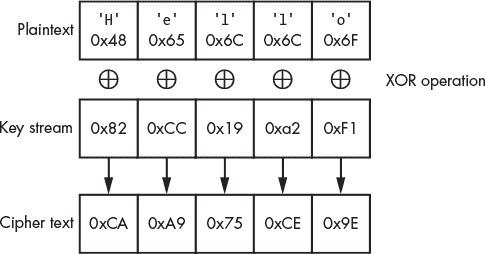

*图 7-9：流密码操作*

只要算术操作是可逆的，解密消息所需的就是生成与加密时相同的密钥流，并对密文执行逆算术操作。（在异或操作的情况下，逆操作实际上也是异或。）密钥流可以使用完全自定义的算法生成，如 RC4，或者通过使用块密码及其配套的操作模式生成。

表 7-3 列出了一些你可能在现实世界应用中遇到的常见算法。

**表 7-3：** 常见流密码

| **密码名称** | **密钥大小（位）** | **引入年份** |
| --- | --- | --- |
| A5/1 和 A5/2（用于 GSM 语音加密） | 54 或 64 | 1989 |
| RC4 | 最大 2048 | 1993 |
| 计数器模式（CTR） | 依赖于块密码 | 不适用 |
| 输出反馈模式（OFB） | 依赖于块密码 | 不适用 |
| 密码反馈模式（CFB） | 依赖于块密码 | 不适用 |

### **非对称密钥加密**

对称密钥加密在安全性和便利性之间取得了良好的平衡，但它有一个显著的问题：网络中的参与者需要物理交换秘密密钥。当网络跨越多个地理区域时，这一点尤其困难。幸运的是，*非对称密钥加密*（通常称为*公钥加密*）可以缓解这个问题。

非对称算法需要两种类型的密钥：*公钥*和*私钥*。公钥用于加密消息，私钥用于解密消息。由于公钥*不能*解密消息，因此它可以安全地分发给任何人，即使通过公共网络，也无需担心被攻击者捕获并用来解密流量，如图 7-10 所示。


*图 7-10：非对称密钥加密与解密*

尽管公钥和私钥在数学上是相关的，但非对称密钥算法的设计目的是让从公钥获取私钥变得非常耗时；它们是基于一种称为 *陷门函数* 的数学原语。（这一名称源自一个概念，即通过陷门很容易，但如果它在你之后关闭，你就很难再回去了。）这些算法依赖于一个假设：对于底层数学的时间消耗性没有任何绕过的办法。然而，未来数学或计算能力的进步可能会证明这一假设是错误的。

#### ***RSA 算法***

令人惊讶的是，常用的唯一非对称密钥算法并不多，尤其是与对称算法相比。*RSA* 算法目前是最广泛用于保护网络流量的算法，预计在可预见的未来仍将是主流。尽管较新的算法基于一种称为 *椭圆曲线* 的数学结构，它们与 RSA 算法有许多共同的基本原理。

RSA 算法首次发布于 1977 年，以其原始开发者——Ron Rivest、Adi Shamir 和 Leonard Adleman 的名字命名。其安全性依赖于一个假设，即将由两个素数相乘得到的大整数进行因式分解是非常困难的。

图 7-11 展示了 RSA 的加密和解密过程。为了使用 RSA 生成新的密钥对，你需要生成两个大的随机素数 *p* 和 *q*，然后选择一个 *公共指数* (*e*)。（通常使用值 65537，因为它具有确保算法安全性的数学特性。）你还需要计算另外两个数字：*模数* (*n*)，即 *p* 和 *q* 的乘积，以及一个 *私有指数* (*d*)，用于解密。（生成 *d* 的过程相当复杂，超出了本书的讨论范围。）公共指数和模数组成了 *公钥*，私有指数和模数组成了 *私钥*。

为了保证私钥的保密性，私有指数必须保持秘密。并且由于私有指数是由原始素数 *p* 和 *q* 生成的，这两个数字也必须保密。

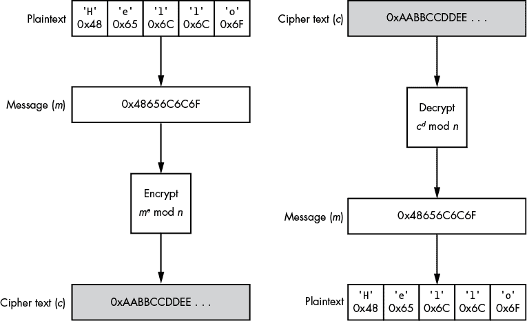

*图 7-11：RSA 加密与解密的简单示例*

加密过程的第一步是将消息转换为一个整数，通常通过假设消息的字节实际上表示一个可变长度的整数来实现。这个整数 *m* 会被提升到公共指数的幂。然后，使用公共模数 *n* 进行模运算，作用于提升后的整数 *m^e*。生成的密文是一个介于零和 *n* 之间的值。（因此，如果你有一个 1024 位的密钥，消息中最多只能加密 1024 位。）为了解密消息，你需要应用相同的过程，只需将公共指数替换为私有指数。

RSA 的计算开销非常大，尤其是与像 AES 这样的对称加密算法相比。为了减少这一开销，极少有应用直接使用 RSA 加密消息。相反，它们会生成一个随机的*会话密钥*，并用这个密钥通过对称加密算法（例如 AES）加密消息。然后，当应用程序想要向网络上的另一方发送消息时，它只加密会话密钥，并通过 RSA 加密这个密钥，再将 RSA 加密的密钥和 AES 加密的消息一起发送。接收方首先通过解密会话密钥来解密消息，然后使用会话密钥解密实际的消息。将 RSA 与像 AES 这样的对称加密算法结合使用，提供了两者的最佳优势：快速加密和公钥安全。

#### ***RSA 填充***

这种基本 RSA 算法的一个弱点是它是确定性的：如果使用相同的公钥多次加密相同的消息，RSA 总是产生相同的加密结果。这使得攻击者可以发起所谓的*选择明文攻击*，在这种攻击中，攻击者可以访问公钥，因此可以加密任何消息。在这种攻击的最基本版本中，攻击者只需猜测加密消息的明文。他们继续使用公钥加密他们的猜测，如果任何一个加密后的猜测与原始加密消息的值匹配，他们就知道自己成功地猜中了目标明文，也就相当于在没有私钥访问权限的情况下解密了消息。

为了防止选择明文攻击，RSA 在加密过程中使用一种填充方式，确保加密输出是不可预测的。（这种“填充”不同于之前讨论的分组密码填充。分组密码填充是为了填充明文至下一个分组边界，以便加密算法有一个完整的分组来处理。）RSA 通常使用两种填充方案：一种是公钥密码学标准 #1.5 中规定的；另一种被称为*最优非对称加密填充（OAEP）*。OAEP 被推荐用于所有新的应用程序，但这两种方案都能为典型的使用案例提供足够的安全性。需要注意的是，不使用填充的 RSA 是一个严重的安全漏洞。

#### ***Diffie–Hellman 密钥交换***

RSA 并不是唯一用于网络参与者之间交换密钥的技术。还有几种算法专门用于此目的，其中最重要的就是*Diffie–Hellman 密钥交换（DH）*算法。

DH 算法由 Whitfield Diffie 和 Martin Hellman 于 1976 年开发，和 RSA 一样，它也建立在指数运算和模算术的数学原理之上。DH 允许网络中的两个参与者交换密钥，并防止任何监控网络的人能够确定该密钥是什么。图 7-12 展示了该算法的操作。

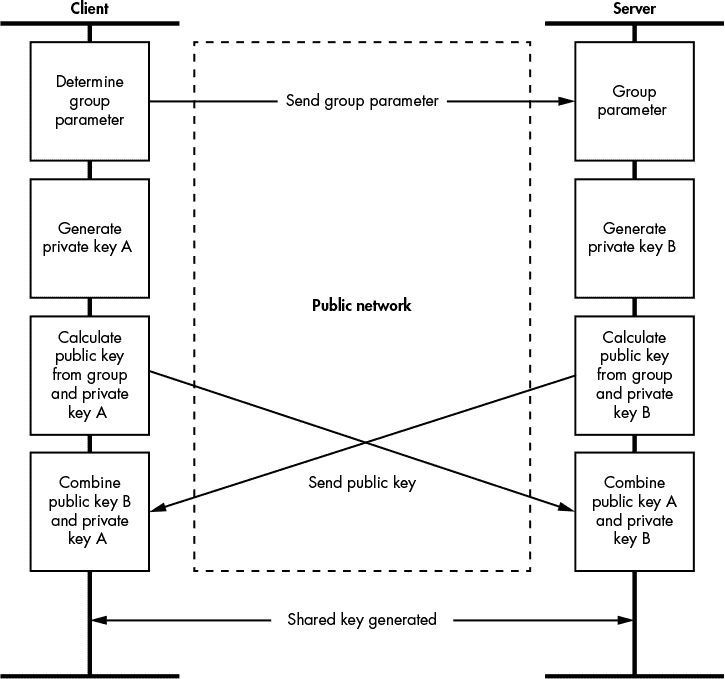

*图 7-12：Diffie–Hellman 密钥交换算法*

发起交换的参与者确定一个参数，这是一个大质数，并将其发送给另一个参与者：所选择的值不是秘密，可以明文传输。然后每个参与者生成自己的私钥值——通常使用加密安全的随机数生成器——并利用此私钥和客户端请求的选定群体参数计算公钥。公钥可以安全地在参与者之间传输，而不会泄露私钥。最后，每个参与者通过将对方的公钥与自己的私钥结合，计算出*共享*密钥。现在两个参与者都拥有共享密钥，且从未直接交换过密钥。

DH 并不完美。例如，这种基本版本的算法无法应对攻击者对密钥交换实施中间人攻击。攻击者可以在网络上冒充服务器与客户端交换一个密钥。接下来，攻击者与服务器交换一个不同的密钥，导致攻击者现在拥有连接的两个独立密钥。然后，攻击者可以解密来自客户端的数据并转发给服务器，反之亦然。

### **签名算法**

加密消息可以防止攻击者查看通过网络发送的信息，但它无法识别*发送者*是谁。仅仅因为某人拥有加密密钥，并不意味着他们就是他们所声称的人。通过非对称加密，你甚至不需要事先手动交换密钥，因此任何人都可以使用你的公钥加密数据并发送给你。

*签名算法*通过为消息生成唯一的*签名*来解决这个问题。消息接收方可以使用与生成签名时相同的算法来证明消息确实来自签名者。附加的好处是，给消息添加签名可以防止在不可信的网络上传输时被篡改。这一点非常重要，因为加密数据并不保证数据的*完整性*；也就是说，攻击者可以在了解底层网络协议的情况下修改加密消息。

所有签名算法都建立在*加密哈希算法*之上。首先，我将更详细地描述哈希，然后解释一些最常见的签名算法。

#### ***加密哈希算法***

加密哈希算法是应用于消息的函数，用于生成该消息的固定长度摘要，通常比原始消息要短得多。这些算法也称为*消息摘要算法*。在签名算法中，哈希的目的是生成一个相对唯一的值，用以验证消息的完整性，并减少需要签名和验证的数据量。

要使哈希算法适合加密用途，它必须满足三个要求：

**前像抗性** 给定一个哈希值，应该很难（例如需要大量计算能力）恢复出原始消息。

**碰撞抗性** 应该很难找到两个不同的消息，它们的哈希值相同。

**非线性** 应该很难创造出一个哈希值为任何给定值的消息。

有多种哈希算法可用，但最常见的是*消息摘要（MD）*或*安全哈希算法（SHA）*系列的成员。消息摘要系列包括 MD4 和 MD5 算法，它们由 Ron Rivest 开发。SHA 系列包括 SHA-1 和 SHA-2 等算法，由美国国家标准与技术研究院（NIST）发布。

其他简单的哈希算法，如校验和和循环冗余校验（CRC），对于检测数据集的变化很有用；然而，它们对于安全协议并不是特别有用。攻击者可以轻松地更改校验和，因为这些算法的线性行为使得确定校验和的变化变得非常简单，而这种数据修改是受保护的，因此目标方无法知道更改内容。

#### ***非对称签名算法***

非对称签名算法利用非对称密码学的属性来生成消息签名。一些算法，如 RSA，可以同时用于提供签名和加密，而另一些，如*数字签名算法（DSA）*，则专门用于签名。在这两种情况下，待签名的消息都会先经过哈希处理，然后从哈希值生成签名。

之前你看到 RSA 如何用于加密，那么它如何用于签名消息呢？RSA 签名算法依赖于这样一个事实：可以使用*私钥*加密消息，然后用*公钥*解密。尽管这种“加密”不再安全（解密消息的密钥现在是公开的），它仍然可以用于签名消息。

例如，签名者对消息进行哈希处理，并使用其私钥对哈希值进行 RSA 解密；这个加密后的哈希就是签名。消息接收方可以使用签名者的公钥解密签名，得到原始的哈希值，并与自己对消息进行哈希得到的值进行比较。如果两者哈希值相同，则表明发送者一定使用了正确的私钥加密该哈希值；如果接收者相信只有签名者拥有私钥，那么签名就被验证通过。图 7-13 展示了这一过程。

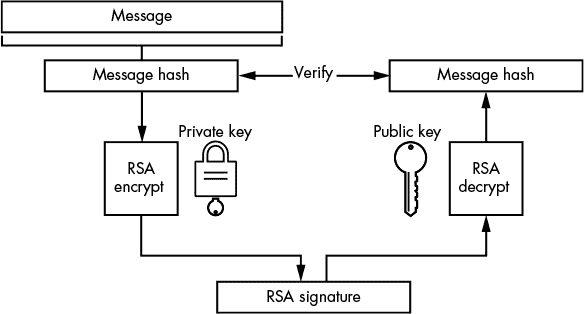

*图 7-13：RSA 签名处理*

#### ***消息认证码***

不同于 RSA 这种非对称算法，*消息认证码（MAC）*是*对称*签名算法。与对称加密一样，对称签名算法依赖于发送方和接收方之间共享密钥。

例如，假设你想发送一条签名消息，我们都有一个共享密钥。首先，你将某种方式将消息与密钥结合起来。（稍后我会更详细地讨论如何做到这一点。）然后，你将组合后的结果进行哈希，生成一个没有原始消息和共享密钥就难以重现的值。当你发送消息时，你还会将这个哈希值作为签名发送给我。我可以通过执行与你相同的算法来验证签名是否有效：我会将密钥和消息结合起来，进行哈希，并将生成的值与你发送的签名进行比较。如果这两个值相同，我就可以确定是你发送了这条消息。

你如何将密钥与消息结合呢？你可能会试图做一些简单的操作，例如将密钥作为前缀添加到消息中，并将组合后的结果进行哈希，就像在图 7-14 中所示。

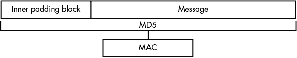

*图 7-14：简单的 MAC 实现*

但是，对于许多常见的哈希算法（包括 MD5 和 SHA-1），这将是一个严重的安全漏洞，因为它会打开一个已知的漏洞，称为 *长度扩展攻击*。要理解为什么如此，你需要了解一些哈希算法的构造原理。

##### **长度扩展攻击与碰撞攻击**

许多常见的哈希算法，包括 MD5 和 SHA-1，都采用块结构。当哈希消息时，算法必须首先将消息拆分成等大小的块进行处理。（例如，MD5 使用 64 字节的块大小。）

在哈希算法的执行过程中，算法在每个块之间维护的唯一状态就是前一个块的哈希值。对于第一个块，前一个哈希值是一组精心选择的常数。这些精心选择的常数是算法的一部分，通常对安全操作至关重要。图 7-15 显示了 MD5 中如何实现这一点的示例。

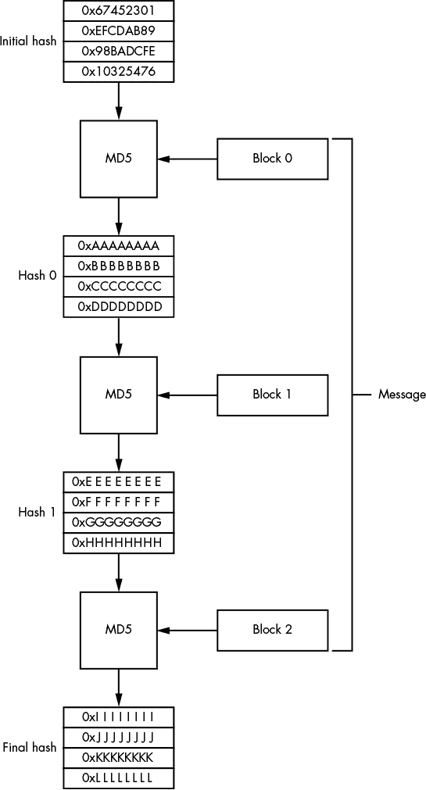

*图 7-15：MD5 的块结构*

需要注意的是，块哈希过程的最终输出仅取决于前一个块的哈希值和当前消息块。最终的哈希值并没有应用任何置换操作。因此，可以通过从最后一个哈希值开始算法，而不是从预定义的常数开始，然后处理你想要添加到最终哈希中的数据块，从而扩展哈希值。

在使用密钥作为消息开始部分的 MAC 中，这种结构可能会让攻击者以某种方式篡改消息，例如通过在上传的文件末尾附加额外的数据。如果攻击者能够将更多的数据块附加到消息末尾，他们就可以在不知道密钥的情况下计算出相应的 MAC 值，因为在攻击者控制之前，密钥已经被哈希到算法的状态中。

如果你将密钥移到消息的末尾，而不是将其附加到消息前面，结果会如何？这种方法确实可以防止长度扩展攻击，但仍然存在问题。攻击者需要找到一个哈希碰撞，即找到一个与真实发送的消息具有相同哈希值的消息。由于许多哈希算法（包括 MD5）并不具备抗碰撞性，MAC 可能会受到这种碰撞攻击的威胁。（一种*不*易受此攻击的哈希算法是 SHA-3。）

##### **散列消息认证码**

你可以使用*散列消息认证码（HMAC）*来应对上一节中描述的攻击。HMAC 并不是直接将密钥附加到消息上，并使用哈希输出生成签名，而是将过程分为两个部分。

首先，将密钥与一个填充块进行异或操作，填充块的大小等于哈希算法的块大小。这个填充块填充有一个重复的值，通常是字节 0x36。组合的结果是第一个密钥，有时称为*内部填充块*。将其添加到消息前面，然后应用哈希算法。第二步将第一步得到的哈希值与一个新的密钥进行拼接（这个新的密钥称为*外部填充块*，通常使用常量 0x5C），并再次应用哈希算法。最终结果就是最终的 HMAC 值。图 7-16 展示了这个过程。

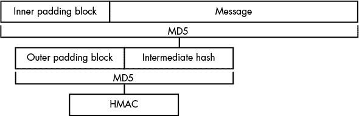

*图 7-16：HMAC 构造*

这种构造能抵抗长度扩展攻击和碰撞攻击，因为攻击者在没有密钥的情况下很难预测最终的哈希值。

### **公钥基础设施**

如何验证公钥加密中公钥所有者的身份？仅仅因为一个密钥与一个相关的身份（例如，伦敦的 Bob Smith）一起发布，并不意味着它真的是来自伦敦的 Bob Smith。例如，如果我成功地让你相信我的公钥是来自 Bob，那么你加密给他的任何信息将只有我能读取，因为我拥有私钥。

为了缓解这种威胁，你可以实现*公钥基础设施（PKI）*，它指的是用于在网络中管理非对称公钥信息的一套协议、加密密钥格式、用户角色和政策的集合。PKI 的一种模型——*信任网（WOT）*，被像 *Pretty Good Privacy (PGP)* 这样的应用程序使用。在 WOT 模型中，公钥的身份由你信任的人证明，可能是你亲自见过的人。不幸的是，尽管 WOT 在电子邮件中效果很好（你可能知道你正在与谁通信），但对于自动化网络应用和商业流程，它的效果就不那么理想了。

#### ***X.509 证书***

当 WOT（Web of Trust）无法使用时，通常会采用更为集中化的信任模型，比如 X.509 证书，它通过生成严格的信任层级来取代直接信任对等方。X.509 证书用于验证 Web 服务器、签名可执行程序或对网络服务进行身份验证。信任是通过使用非对称签名算法（如 RSA 和 DSA）建立的证书层级提供的。

为了完成这个层级，有效的证书必须至少包含四个信息：

• *主题*，指定证书的身份

• 主题的公钥

• *颁发者*，用于标识签名证书

• 证书上应用的有效签名，并由颁发者的私钥进行认证

这些要求创建了一个称为*信任链*的证书层级，如图 7-17 所示。这种模型的一个优点是，因为只分发公钥信息，所以可以通过公共网络将组件证书提供给用户。

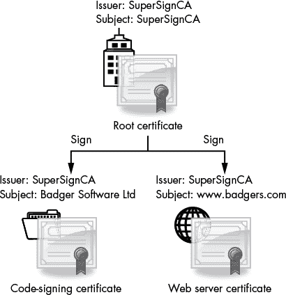

*图 7-17：X.509 证书信任链*

请注意，层级中通常有不止一个级别，因为根证书颁发者直接签发应用程序使用的证书是不常见的。根证书由一个称为*证书颁发机构（CA）*的实体颁发，这个机构可能是一个公共组织或公司（如 Verisign），也可能是一个私人实体，为内部网络上的使用颁发证书。CA 的职责是验证它为谁颁发证书。

不幸的是，实际执行的*检查*数量并不总是很清楚；通常，证书授权中心（CA）更关心的是销售签名证书，而不是履行他们的职责，一些 CA 做的事情无非就是检查它们是否正在向一个已注册的商业地址颁发证书。大多数尽职的 CA 至少会拒绝为已知公司（如微软或谷歌）生成证书，特别是当证书请求并非来自这些公司时。根据定义，根证书不能被另一个证书签名。相反，根证书是一个*自签名证书*，它使用与证书公钥相关联的私钥来签名自己。

#### ***验证证书链***

为了验证证书，你需要追溯到根证书的颁发链，确保在每一步中每个证书都有有效且未过期的签名。此时，你决定是否信任根证书——从而信任证书链末尾的身份。大多数处理证书的应用程序，如 Web 浏览器和操作系统，都有一个受信任的根证书数据库。

有什么可以阻止获得 web 服务器证书的人，使用该 web 服务器的私钥签署他们自己的伪造证书吗？实际上，他们完全可以这样做。从加密学的角度来看，一个私钥与任何其他私钥是相同的。如果你将证书的信任建立在密钥链上，伪造的证书就会链回一个可信的根证书，看起来是有效的。

为了防范这种攻击，X.509 规范定义了 *基本约束* 参数，可以选择性地添加到证书中。该参数是一个标志，指示该证书可以用于签署另一个证书，从而充当证书授权中心（CA）。如果证书的 CA 标志被设置为 false（或者基本约束参数缺失），如果该证书被用于签署另一个证书，验证链应该失败。图 7-18 展示了一个真实证书中的基本约束参数，表明该证书应有效地充当证书授权中心。

那么，如果用于验证 web 服务器的证书被用来签署应用程序代码怎么办？在这种情况下，X.509 证书可以指定一个 *密钥使用* 参数，表示证书是为哪些用途生成的。如果证书被用于它原本不被设计来认证的用途，验证链应该失败。

最后，如果与某个证书关联的私钥被盗，或者证书授权中心（CA）错误地颁发了伪造的证书（这种情况已经发生过几次）会怎样呢？即使每个证书都有到期日期，这个日期可能是在未来很多年。因此，如果需要撤销证书，CA 可以发布一个 *证书撤销列表（CRL）*。如果链中的任何证书在撤销列表上，验证过程应该失败。

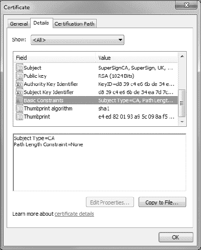

*图 7-18：X.509 证书基本约束*

正如你所看到的，证书链验证可能会在多个地方失败。

### **案例研究：传输层安全性**

让我们将一些协议安全和加密学的理论应用到一个现实世界的协议中。*传输层安全性（TLS）*，前身为 *安全套接字层（SSL）*，是目前互联网上最常用的安全协议。TLS 最初是由 Netscape 在 1990 年代中期为保障 HTTP 连接的安全性而开发的 SSL 协议。该协议经历了多次修订：SSL 版本 1.0 到 3.0 以及 TLS 版本 1.0 到 1.2。虽然它最初是为 HTTP 设计的，但你可以将 TLS 应用于任何 TCP 协议。甚至还有一个变体，*数据报传输层安全性（DTLS）* 协议，用于与不可靠协议（如 UDP）一起使用。

TLS 使用本章中描述的许多构造，包括对称和非对称加密、MAC、密钥交换和 PKI。我将讨论这些加密工具在 TLS 连接安全性中的作用，并简要介绍一些针对该协议的攻击。（我将只讨论 TLS 1.0 版本，因为这是最常见的支持版本，但请注意，由于 1.0 版本存在一些安全问题，1.1 和 1.2 版本正在慢慢变得更为普及。）

#### ***TLS 握手***

建立新 TLS 连接最重要的部分是 *握手*，在握手过程中，客户端和服务器协商将使用的加密类型，交换唯一的连接密钥，并验证彼此的身份。所有通信都使用 *TLS Record* 协议——一种预定义的标签长度值结构，允许协议解析器从字节流中提取单个记录。所有握手数据包都分配一个标签值为 22，用以将其与其他数据包区分开来。图 7-19 显示了这些握手数据包的简化流程。（如图所示，一些数据包是可选的。）

正如你所看到的，所有数据来回传输，握手过程可能非常耗时：有时可以通过缓存先前协商的会话密钥或客户端通过提供唯一的会话标识符请求服务器恢复先前会话，从而省略或完全绕过握手过程。这并不是一个安全问题，因为尽管恶意客户端可能请求恢复会话，但客户端仍然不知道私密的协商会话密钥。

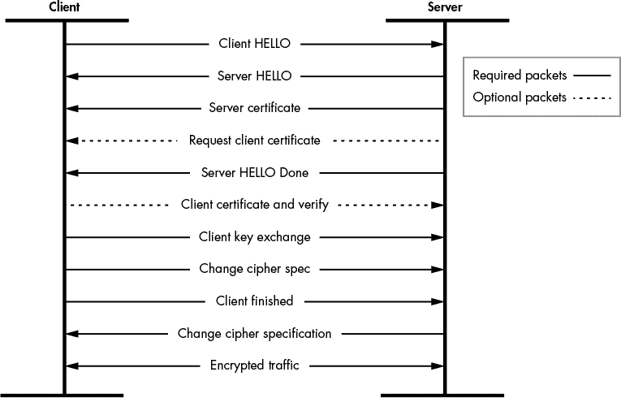

*图 7-19：TLS 握手过程*

#### ***初始协商***

在握手的第一步中，客户端和服务器通过 *HELLO 消息* 协商他们想要用于 TLS 连接的安全参数。HELLO 消息中的一项信息是 *客户端随机数*，这是一种随机值，确保连接过程无法轻易被重放。HELLO 消息还指示客户端支持的加密算法类型。尽管 TLS 设计上具有灵活性，能够使用多种加密算法，但它仅支持对称加密算法，如 RC4 或 AES，因为使用公钥加密在计算上成本过高。

服务器响应它自己的 HELLO 消息，指示它从客户端提供的可用列表中选择了哪个密码套件。（如果双方无法协商出共同的密码套件，连接将结束。）服务器的 HELLO 消息还包含*服务器随机数*，这是另一个随机值，为连接提供额外的重放保护。接下来，服务器发送其 X.509 证书，以及任何必要的中间 CA 证书，以便客户端可以做出关于服务器身份的知情决定。然后，服务器发送*HELLO 完成*数据包，通知客户端它可以继续进行连接验证。

#### ***端点认证***

客户端必须验证服务器证书的合法性，并确保它们符合客户端自己的安全要求。首先，客户端必须通过将证书的*主题*字段与服务器的域名进行匹配来验证证书中的身份。例如，图 7-20 显示了一个用于 *[www.domain.com](http://www.domain.com)* 的证书。该主题包含一个*通用名称（CN）* ➊字段，该字段与此域名匹配。

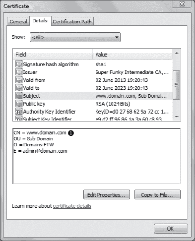

*图 7-20：* [www.domain.com](http://www.domain.com) 的证书主题

证书的主题和颁发者字段不是简单的字符串，而是*X.500 名称*，包含其他字段，例如*组织*（通常是拥有证书的公司名称）和*电子邮件*（一个任意的电子邮件地址）。然而，在握手过程中只有 CN 字段会被检查来验证身份，因此不要被额外的数据所迷惑。CN 字段中也可能包含通配符，这对于共享证书给多个运行在子域名上的服务器非常有用。例如，CN 设置为**.domain.com** 将同时匹配 *[www.domain.com](http://www.domain.com)* 和 *blog.domain.com*。

客户端检查了端点的身份（即连接另一端的服务器）后，必须确保证书是受信任的。它通过构建证书的信任链以及任何中间 CA 证书来做到这一点，并检查确保这些证书没有出现在任何证书撤销列表中。如果信任链的根证书不被客户端信任，客户端可以假设证书是可疑的，并断开与服务器的连接。图 7-21 显示了一个简单的信任链，其中包含一个用于 *[www.domain.com](http://www.domain.com)* 的中间 CA。


*图 7-21：* [www.domain.com](http://www.domain.com) 的信任链

TLS 还支持一个可选的*客户端证书*，它允许服务器对客户端进行身份验证。如果服务器请求客户端证书，它会在 HELLO 阶段向客户端发送一份可接受根证书的列表。客户端随后可以搜索其可用的证书，并选择最合适的证书返回给服务器。客户端会将证书与包含所有已发送和接收的握手消息哈希值的验证信息一并发送，并使用证书的私钥对其进行签名。服务器可以验证签名是否与证书中的密钥匹配，并授予客户端访问权限；但是，如果匹配失败，服务器可以关闭连接。签名向服务器证明客户端拥有与证书相关联的私钥。

#### ***建立加密连接***

当端点已被认证后，客户端和服务器最终可以建立加密连接。为此，客户端会发送一个随机生成的*预主密钥*，并用服务器证书的公钥加密发送给服务器。接下来，客户端和服务器将预主密钥与客户端和服务器的随机值结合，并使用这个组合值为随机数生成器提供种子，从而生成一个 48 字节的*主密钥*，该主密钥将作为加密连接的会话密钥。（服务器和客户端都生成主密钥这一事实为连接提供了重放保护，因为如果任一端在协商过程中发送了不同的随机数，双方将生成不同的主密钥。）

当双方都拥有主密钥或会话密钥时，就可以建立加密连接。客户端会发送一个*更改密码规范*数据包，告诉服务器从此只发送加密消息。然而，客户端在正常流量传输之前还需要向服务器发送最后一条消息：*完成*数据包。该数据包使用会话密钥加密，并包含所有在握手过程中发送和接收的握手消息的哈希值。这是防止*降级攻击*的关键步骤，在降级攻击中，攻击者会修改握手过程，试图通过选择弱加密算法来降低连接的安全性。一旦服务器接收到完成消息，它可以验证协商的会话密钥是否正确（否则该数据包无法解密），并检查哈希值是否正确。如果不正确，服务器可以关闭连接。但如果一切正确，服务器将向客户端发送自己的更改密码规范消息，之后加密通信即可开始。

每个加密的数据包还会使用 HMAC 进行验证，这提供了数据认证并确保数据完整性。如果协商使用了流密码（例如 RC4），则此验证尤为重要；否则，加密数据块可能会被轻易篡改。

#### ***满足安全要求***

TLS 协议成功地满足了本章开头列出的四项安全要求，具体总结在表 7-4 中。

**表 7-4：** TLS 如何满足安全要求

| **安全要求** | **如何满足** |
| --- | --- |
| 数据机密性 | 可选择的强加密套件 安全的密钥交换 |
| 数据完整性 | 加密数据通过 HMAC 保护，握手数据包通过最终哈希验证 |
| 服务器认证 | 客户端可以选择使用公钥基础设施（PKI）和颁发的证书验证服务器端点 |
| 客户端认证 | 可选的基于证书的客户端认证 |

但 TLS 协议仍然存在问题。最重要的问题是，截至本文撰写时，最新版本的协议尚未解决的问题：它依赖于基于证书的公钥基础设施（PKI）。该协议完全依赖于证书是颁发给正确的人和组织的信任。如果某个网络连接的证书表明该应用程序正在与 Google 服务器通信，你会假设只有 Google 能够购买所需的证书。不幸的是，这并非总是如此。有文件记录了企业和政府通过篡改 CA 过程生成证书的情况。此外，当 CA 没有尽到应有的尽职调查而颁发了错误证书时，也发生过错误，例如图 7-22 中显示的 Google 证书，最终被撤销。

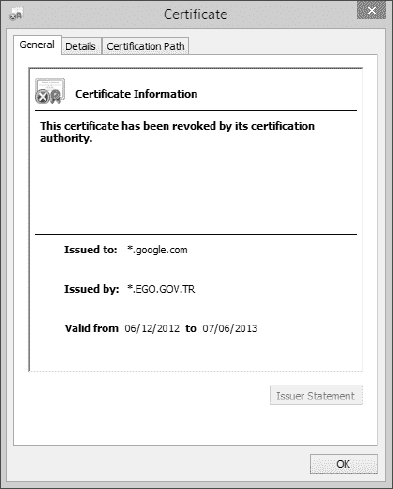

*图 7-22：由 CA TÜRKTRUST“错误”颁发的 Google 证书*

解决证书模型部分问题的一种方法是一个叫做*证书固定*的过程。固定意味着应用程序限制某些域名可接受的证书和证书颁发机构（CA）。因此，如果有人设法欺诈性地获得了一个有效的证书用于*[www.google.com](http://www.google.com)*，应用程序将会发现该证书不符合 CA 的限制，并会导致连接失败。

当然，证书固定（certificate pinning）也有其缺点，因此并不适用于所有场景。最常见的问题是固定列表的管理；具体来说，构建初始列表可能并不太具挑战性，但更新列表会增加额外的负担。另一个问题是，开发者无法轻松地将证书迁移到另一个证书颁发机构（CA），或在不同时更新所有客户端的情况下更换证书。

TLS 的另一个问题，至少在网络监控方面，是 TLS 连接可以从网络中捕获并由攻击者存储，直到需要时再使用。如果攻击者获得了服务器的私钥，那么所有历史流量都可能被解密。因此，许多网络应用程序正在转向使用 DH 算法交换密钥，并且除了使用证书进行身份验证之外。这种做法可以实现*完美前向保密*——即使私钥被泄露，也不容易计算出由 DH 生成的密钥。

### **总结**

本章主要关注协议安全的基础知识。协议安全涉及许多方面，是一个非常复杂的主题。因此，了解可能出现的问题并在进行协议分析时识别这些问题是非常重要的。

加密和签名使得攻击者难以捕获在网络上传输的敏感信息。加密过程将明文（你想隐藏的数据）转换为密文（加密后的数据）。签名用于验证通过网络传输的数据是否已经被篡改。适当的签名也可以用来验证发送者的身份。验证发送者的能力对于在不可信的网络上验证用户和计算机身份非常有用。

本章还描述了一些针对协议安全中使用的加密技术的可能攻击，包括著名的填充 oracle 攻击，该攻击可能允许攻击者解密发送到服务器的流量以及从服务器发送回来的流量。在后续章节中，我将更详细地解释如何分析协议的安全配置，包括用于保护敏感数据的加密算法。
