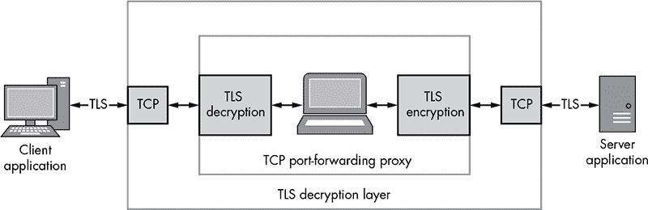
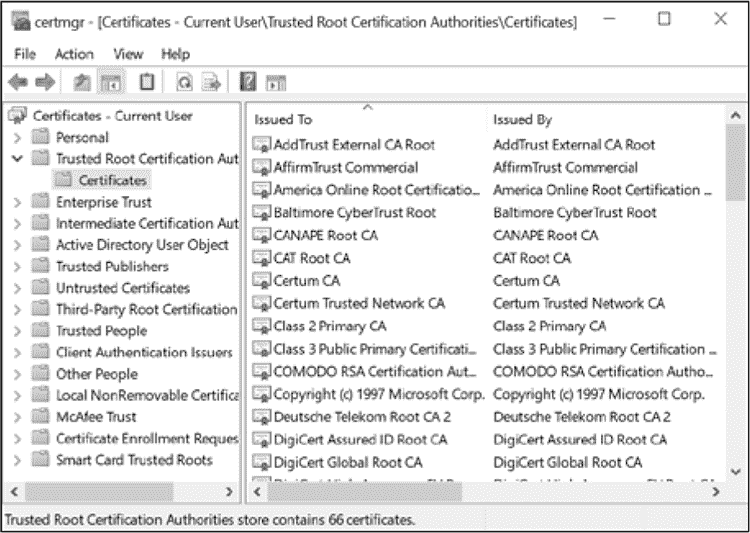
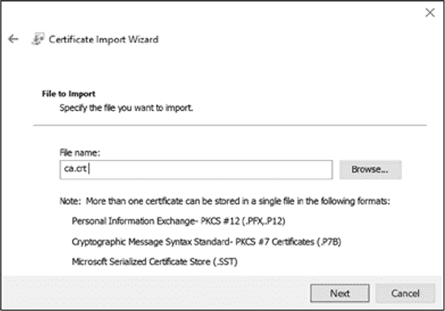
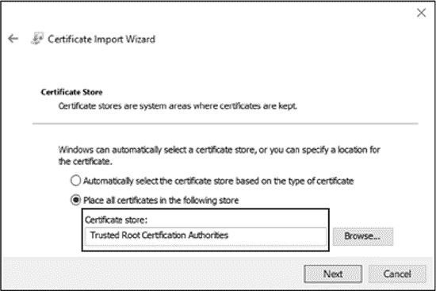
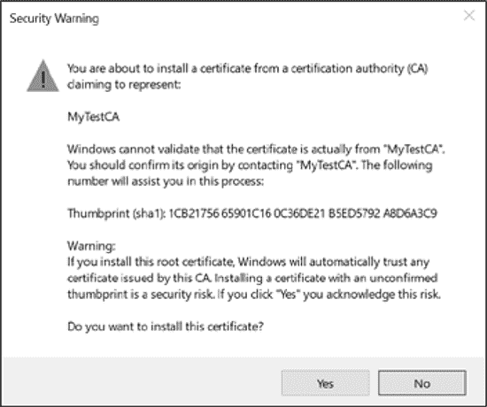

## **8**

**实现网络协议**

分析网络协议本身可能是一个目的；然而，更可能的是，你会希望实现该协议，以便实际测试它的安全漏洞。在本章中，你将学习一些实现协议用于测试的方法。我将介绍一些技术，尽可能地重新利用现有的代码，以减少你需要开发的工作量。

本章使用了我的 SuperFunkyChat 应用程序，它提供了测试数据和客户端、服务器来进行测试。当然，你可以使用任何你喜欢的协议：基本原则应该是相同的。

### **重放已捕获的网络流量**

理想情况下，我们希望只做最少的工作来实现一个客户端或服务器以进行安全性测试。减少所需工作量的一种方法是捕获示例网络协议流量并将其重放到实际的客户端或服务器上。我们将探讨三种实现此目标的方法：使用 Netcat 发送原始二进制数据、使用 Python 发送 UDP 数据包，以及重新利用我们在第五章中的分析代码来实现客户端和服务器。

#### ***使用 Netcat 捕获流量***

Netcat 是实现网络客户端或服务器的最简单方式。基本的 Netcat 工具在大多数平台上都有提供，尽管有多个版本具有不同的命令行选项。（Netcat 有时也叫做 `nc` 或 `netcat`。）我们将使用 BSD 版本的 Netcat，它在 macOS 上使用，并且在大多数 Linux 系统上是默认版本。如果你使用的是不同的操作系统，可能需要调整命令。

使用 Netcat 的第一步是捕获你希望重放的一些流量。我们将使用 Wireshark 的命令行版本 Tshark 来捕获 SuperFunkyChat 生成的流量。（你可能需要在你的平台上安装 Tshark。）

为了将我们的捕获范围限制在发送到并由我们在 TCP 端口 12345 上运行的 ChatServer 接收的包，我们将使用 *伯克利数据包过滤器（BPF）* 表达式来限制捕获到一个非常特定的数据包集合。BPF 表达式限制了捕获的数据包，而 Wireshark 的显示过滤器仅限制了显示的大量捕获数据包。

在控制台运行以下命令以开始捕获 12345 端口的流量并将输出写入文件 *capture.pcap*。将 `INTNAME` 替换为你正在捕获流量的接口名称，例如 `eth0`。

```
$ tshark -i INTNAME -w capture.pcap tcp port 12345
```

启动客户端与服务器的连接以开始数据包捕获，然后通过在运行 Tshark 的控制台中按 CTRL+C 停止捕获。通过使用 `-r` 参数并指定 *capture.pcap* 文件来运行 Tshark，确保你已经捕获到正确的流量到输出文件中。清单 8-1 显示了 Tshark 的示例输出，增加了 `-z conv,tcp` 参数以打印捕获对话的列表。

```
$ tshark -r capture.pcap -z conv,tcp
 ➊ 1 0 192.168.56.1 → 192.168.56.100 TCP 66 26082 → 12345 [SYN]
    2 0.000037695 192.168.56.100 → 192.168.56.1 TCP 66 12345 → 26082 [SYN, ACK]
    3 0.000239814 192.168.56.1 → 192.168.56.100 TCP 60 26082 → 12345 [ACK]
    4 0.007160883 192.168.56.1 → 192.168.56.100 TCP 60 26082 → 12345 [PSH, ACK]
    5 0.007225155 192.168.56.100 → 192.168.56.1 TCP 54 12345 → 26082 [ACK]
--snip--
 ================================================================================
TCP Conversations
Filter:<No Filter>
                                              |       <-      | |       ->      |
                                              | Frames  Bytes | | Frames  Bytes |
192.168.56.1:26082 <-> 192.168.56.100:12345➋   17      1020➌     28      1733➍
================================================================================
```

*清单 8-1：验证聊天协议流量的捕获*

正如您在清单 8-1 中看到的，Tshark 会在 ➊ 打印原始数据包列表，然后显示会话摘要 ➋，显示我们从 192.168.56.1 端口 26082 到 192.168.56.100 端口 12345 的连接。客户端 192.168.56.1 已接收 17 帧或 1020 字节的数据 ➌，服务器接收到 28 帧或 1733 字节的数据 ➍。

现在我们使用 Tshark 导出一个方向的原始字节数据：

```
$ tshark -r capture.pcap -T fields -e data 'tcp.srcport==26082' > outbound.txt
```

该命令读取数据包捕获并输出每个数据包中的数据；它不会过滤掉重复数据包或乱序数据包等项。有几个细节需要注意。首先，您应仅在可靠网络上使用此命令，例如通过本地主机或本地网络连接生成的捕获文件，否则您可能会在输出中看到错误的数据包。其次，只有当协议没有被解码器解码时，`data` 字段才会可用。对于 TCP 捕获来说这不是问题，但当我们处理 UDP 时，必须禁用解码器才能使此命令正确工作。

回顾在清单 8-1 的 ➋ 处，客户端会话使用了 26082 端口。显示过滤器 `tcp.srcport==26082` 会移除输出中不包含 TCP 源端口 26082 的所有流量。这样，输出只会包含从客户端到服务器的流量。结果是以十六进制格式呈现的数据，类似于清单 8-2。

```
$ cat outbound.txt
42494e58
0000000d
00000347
00
057573657231044f4e595800
--snip--
```

*清单 8-2：转储原始流量的示例输出*

接下来，我们将此十六进制输出转换为原始二进制数据。最简单的方法是使用 xxd 工具，它在大多数类 Unix 系统上默认安装。运行 `xxd` 命令，如清单 8-3 所示，将十六进制转储转换为二进制文件。（`-p` 参数会转换原始十六进制转储，而不是默认的带编号的十六进制转储格式。）

```
 $ xxd -p -r outbound.txt > outbound.bin
$ xxd outbound.bin
00000000: 4249 4e58 0000 000d 0000 0347 0005 7573  BINX.......G..us
00000010: 6572 3104 4f4e 5958 0000 0000 1c00 0009  er1.ONYX........
00000020: 7b03 0575 7365 7231 1462 6164 6765 7220  {..user1.badger
--snip--
```

*清单 8-3：将十六进制转储转换为二进制数据*

最后，我们可以使用 Netcat 和二进制数据文件。运行以下 `netcat` 命令，将 *outbound.bin* 中的客户端流量发送到 `HOSTNAME` 服务器的 12345 端口。任何从服务器返回客户端的流量将被捕获到 *inbound.bin* 文件中。

```
$ netcat HOSTNAME 12345 < outbound.bin > inbound.bin
```

您可以使用十六进制编辑器编辑 *outbound.bin* 来更改您正在重放的会话数据。您还可以使用 *inbound.bin* 文件（或从 PCAP 中提取它）通过伪装成服务器的方式向客户端发送流量，使用以下命令：

```
$ netcat -l 12345 < inbound.bin > new_outbound.bin
```

#### ***使用 Python 重新发送捕获的 UDP 流量***

使用 Netcat 的一个限制是，尽管重放像 TCP 这样的流协议很容易，但重放 UDP 流量就没那么简单了。原因是 UDP 流量需要保持数据包边界，就像我们在第五章分析聊天应用协议时所看到的那样。然而，Netcat 在从文件或 shell 管道发送数据时，会尽量发送它能发送的所有数据。

相反，我们将编写一个非常简单的 Python 脚本，用于将 UDP 数据包转发到服务器并捕获任何结果。首先，我们需要使用 ChatClient 的 `--udp` 命令行参数来捕获一些 UDP 示例聊天协议流量。然后，我们将使用 Tshark 将数据包保存到文件 `udp_capture.pcap` 中，如下所示：

```
tshark -i INTNAME -w udp_capture.pcap udp port 12345
```

接下来，我们将再次将所有客户端到服务器的数据包转换为十六进制字符串，以便在 Python 客户端中进行处理：

```
tshark -T fields -e data -r udp_capture.pcap --disable-protocol gvsp/
  "udp.dstport==12345" > udp_outbound.txt
```

从 UDP 捕获中提取数据的一个区别是，Tshark 会自动尝试将流量解析为 GVSP 协议。这导致 `data` 字段无法使用。因此，我们需要禁用 GVSP 解码器，以生成正确的输出。

有了数据包的十六进制转储，我们终于可以创建一个非常简单的 Python 脚本来发送 UDP 数据包并捕获响应。将清单 8-4 复制到 *udp_client.py* 中。

udp_client.py

```
import sys
import binascii
from socket import socket, AF_INET, SOCK_DGRAM

if len(sys.argv) < 3:
    print("Specify destination host and port")
    exit(1)

# Create a UDP socket with a 1sec receive timeout
sock = socket(AF_INET, SOCK_DGRAM)
sock.settimeout(1)
addr = (sys.argv[1], int(sys.argv[2]))

for line in sys.stdin:
    msg = binascii.a2b_hex(line.strip())
    sock.sendto(msg, addr)

    try:
        data, server = sock.recvfrom(1024)
        print(binascii.b2a_hex(data))
    except:
        pass
```

*清单 8-4：一个简单的 UDP 客户端，用于发送网络流量捕获*

使用以下命令行运行 Python 脚本（它应适用于 Python 2 和 3），将 `HOSTNAME` 替换为适当的主机：

```
python udp_client.py HOSTNAME 12345 < udp_outbound.txt
```

服务器应接收数据包，客户端接收到的任何数据包应作为二进制字符串打印到控制台。

#### ***重新利用我们的分析代理***

在第五章中，我们实现了一个简单的 SuperFunkyChat 代理，用于捕获流量并实现一些基本的流量解析。我们可以使用该分析的结果来实现一个网络客户端和网络服务器，用于重放和修改流量，这样我们就可以重用大部分现有的解析器和相关代码，而无需为不同的框架或语言重新编写。

##### **捕获示例流量**

在我们实现客户端或服务器之前，我们需要捕获一些流量。我们将使用在第五章中开发的 *parser.csx* 脚本和清单 8-5 中的代码来创建一个代理，捕获连接的流量。

chapter8_capture

_proxy.csx

```
   #load "parser.csx"
   using static System.Console;
   using static CANAPE.Cli.ConsoleUtils;

   var template = new FixedProxyTemplate();
   // Local port of 4444, destination 127.0.0.1:12345
   template.LocalPort = 4444;
   template.Host = "127.0.0.1";
   template.Port = 12345;
➊ template.AddLayer<Parser>();

   var service = template.Create();
   service.Start();
   WriteLine("Created {0}", service);
   WriteLine("Press Enter to exit...");
   ReadLine();
   service.Stop();

   WriteLine("Writing Outbound Packets to packets.bin");
➋ service.Packets.WriteToFile("packets.bin", "Out");
```

*清单 8-5：捕获聊天流量到文件的代理*

清单 8-5 在端口 4444 上设置了一个 TCP 监听器，将新的连接转发到 127.0.0.1 的 12345 端口，并捕获流量。请注意，我们仍然在代理的 ➊ 处添加了解析代码，以确保捕获的数据包含数据部分，而不是长度或校验和信息。还要注意，在 ➋ 处，我们将数据包写入文件，这将包括所有出站和入站的数据包。稍后我们需要过滤掉特定方向的流量，以便将捕获的数据通过网络发送。

通过这个代理运行一次客户端连接，并适当操作客户端。然后关闭客户端中的连接，并在控制台按 ENTER 键退出代理，并将数据包数据写入 *packets.bin* 文件。（保留此文件的副本，我们稍后在客户端和服务器中会需要它。）

##### **实现一个简单的网络客户端**

接下来，我们将使用捕获的流量实现一个简单的网络客户端。为此，我们将使用`NetClientTemplate`类来建立与服务器的新连接，并提供一个接口来读取和写入网络数据包。将列表 8-6 复制到一个名为*chapter8_client.csx*的文件中。

chapter8

_client.csx

```
   #load "parser.csx"

   using static System.Console;
   using static CANAPE.Cli.ConsoleUtils;

➊ if (args.Length < 1) {
       WriteLine("Please Specify a Capture File");
       return;
   }
➋ var template = new NetClientTemplate();
   template.Port = 12345;
   template.Host = "127.0.0.1";
   template.AddLayer<Parser>();
➌ template.InitialData = new byte[] { 0x42, 0x49, 0x4E, 0x58 };

➍ var packets = LogPacketCollection.ReadFromFile(args[0]);

➎ using(var adapter = template.Connect()) {
       WriteLine("Connected");
       // Write packets to adapter
    ➏ foreach(var packet in packets.GetPacketsForTag("Out")) {
           adapter.Write(packet.Frame);
       }

       // Set a 1000ms timeout on read so we disconnect
       adapter.ReadTimeout = 1000;
    ➐ DataFrame frame = adapter.Read();
       while(frame != null) {
           WritePacket(frame);
           frame = adapter.Read();
       }
   }
```

*列表 8-6：一个简单的客户端，用于替换 SuperFunkyChat 流量*

这段代码中的一个新内容是，每个脚本都会在`args`变量中获取一个命令行参数列表➊。通过使用命令行参数，我们可以指定不同的数据包捕获文件，而无需修改脚本。

`NetClientTemplate`的配置方式➋与我们的代理类似，连接到 127.0.0.1:12345，但有一些区别以支持客户端。例如，由于我们在`Parser`类中解析初始网络流量，我们的捕获文件不包含客户端发送给服务器的初始魔术值。我们向模板中添加了一个包含魔术字节➌的`InitialData`数组，以正确建立连接。

然后，我们将从文件中读取数据包➍到一个数据包集合中。当一切配置完成后，我们调用`Connect()`方法来与服务器建立新连接➎。`Connect()`方法返回一个`Data Adapter`，允许我们在连接上读取和写入解析后的数据包。我们读取的任何数据包也将经过`Parser`处理，并移除长度和校验和字段。

接下来，我们筛选加载的包，只保留出站包，并将其写入网络连接➏。`Parser`类再次确保我们写入的任何数据包都附带适当的头信息，然后才会发送到服务器。最后，我们读取包并将其打印到控制台，直到连接关闭或读取超时➐。

当你运行这个脚本并传入我们之前捕获的数据包路径时，它应该能够连接到服务器并重放你的会话。例如，原始捕获中发送的任何消息应该会被重新发送。

当然，仅仅回放原始流量并不一定那么有用。更有用的做法是修改流量来测试协议的特性，既然我们已经有了一个非常简单的客户端，我们可以通过向发送循环中添加一些代码来修改流量。例如，我们可能会简单地将所有数据包中的用户名更改为其他名称——比如从`user1`改为`bobsmith`——通过将发送循环（在列表 8-6 中的➏处）的内部代码替换为列表 8-7 中显示的代码。

```
➊ string data = packet.Frame.ToDataString();
➋ data = data.Replace("\u0005user1", "\u0008bobsmith");
   adapter.Write(data.ToDataFrame());
```

*列表 8-7：一个简单的客户端数据包编辑器*

要编辑用户名，我们首先将数据包转换为一种便于处理的格式。在这种情况下，我们使用 `ToDataString()` 方法 ➊ 将其转换为二进制字符串，这样就得到了一个 C# 字符串，其中每个字节直接转换为相同的字符值。由于 SuperFunkyChat 中的字符串以它们的长度为前缀，因此在 ➋ 处我们使用 `\uXXXX` 转义序列将字节 5 替换为 8，以表示新用户名的长度。你可以通过相同的方式替换任何不可打印的二进制字符，使用字节值的转义序列。

当你重新运行客户端时，所有的 `user1` 实例应该都被替换为 `bobsmith`。（当然，你此时可以做更复杂的数据包修改，但我会留给你去实验。）

##### **实现一个简单的服务器**

我们已经实现了一个简单的客户端，但在客户端和服务器应用程序中都可能出现安全问题。所以现在我们将实现一个自定义服务器，类似于我们为客户端所做的。

首先，我们将实现一个小类来充当我们的服务器代码。每当有新的连接时，该类都会被创建。类中的 `Run()` 方法将获取一个 `Data Adapter` 对象，基本上与我们为客户端使用的相同。将 列表 8-8 复制到一个名为 *chat_server.csx* 的文件中。

chat_server.csx

```
   using CANAPE.Nodes;
   using CANAPE.DataAdapters;
   using CANAPE.Net.Templates;

➊ class ChatServerConfig {
       public LogPacketCollection Packets { get; private set; }
       public ChatServerConfig() {
           Packets = new LogPacketCollection();
       }
   }

➋ class ChatServer : BaseDataEndpoint<ChatServerConfig> {
       public override void Run(IDataAdapter adapter, ChatServerConfig config) {
           Console.WriteLine("New Connection");
        ➌ DataFrame frame = adapter.Read();
           // Wait for the client to send us the first packet
           if (frame != null) {
 // Write all packets to client
            ➍ foreach(var packet in config.Packets) {
                   adapter.Write(packet.Frame);
               }
           }
           frame = adapter.Read();
       }
   }
```

*列表 8-8：一个简单的聊天协议服务器类*

代码 ➊ 是一个配置类，简单地包含一个日志数据包集合。我们本可以通过直接指定 `LogPacketCollection` 作为配置类型来简化代码，但通过使用一个单独的类来演示如何更轻松地添加自定义配置。

代码 ➋ 定义了服务器类。它包含 `Run()` 函数，该函数接收一个数据适配器和服务器配置，并允许我们在等待客户端发送数据包 ➌ 后，读写数据适配器。一旦接收到数据包，我们会立即将整个数据包列表发送给客户端 ➍。

请注意，我们在 ➍ 处并没有过滤数据包，也没有指定使用任何特定的解析器来处理网络流量。事实上，这整个类对于 SuperFunkyChat 协议完全是独立的。我们在模板中配置了大部分网络服务器的行为，如列表 8-9 所示。

chapter8

_example

_server.csx

```
➊ #load "chat_server.csx"
   #load "parser.csx"
   using static System.Console;

   if (args.Length < 1) {
       WriteLine("Please Specify a Capture File");
       return;
   }
➋ var template = new NetServerTemplate<ChatServer, ChatServerConfig>();
   template.LocalPort = 12345;
   template.AddLayer<Parser>();
➌ var packets = LogPacketCollection.ReadFromFile(args[0])
                                    .GetPacketsForTag("In");
   template.ServerFactoryConfig.Packets.AddRange(packets);

➍ var service = template.Create();
   service.Start();
   WriteLine("Created {0}", service);
   WriteLine("Press Enter to exit...");
   ReadLine();
   service.Stop();
```

*列表 8-9：一个简单的 ChatServer 示例*

列表 8-9 可能看起来很熟悉，因为它与我们在列表 2-11 中使用的 DNS 服务器脚本非常相似。我们首先加载*chat_server.csx*脚本来定义我们的 ChatServer 类 ➊。接着，我们在 ➋ 处创建服务器模板，通过指定服务器类型和配置类型。然后，我们从命令行传递的文件中加载数据包，过滤以捕获仅入站数据包并将其添加到配置中的数据包集合 ➌。最后，我们创建服务并启动它 ➍，就像我们做代理一样。服务器现在在 TCP 端口 12345 上监听新的连接。

尝试使用 ChatClient 应用程序连接服务器；捕获的流量应被发送回客户端。当所有数据发送到客户端后，服务器将自动关闭连接。只要你观察我们重新发送的消息，不必担心在 ChatClient 的输出中看到错误。当然，你可以向服务器添加功能，比如修改流量或生成新数据包。

### **重用现有可执行代码**

在本节中，我们将探讨多种方法，利用现有的二进制可执行代码来减少实现协议所需的工作量。一旦你通过反向工程（可能参考了第六章的一些技巧）确定了协议的详细信息，你会很快意识到，如果你能重用可执行代码，就能避免重新实现协议。

理想情况下，你会拥有实现特定协议所需的源代码，要么是因为它是开源的，要么是因为实现使用像 Python 这样的脚本语言。如果你确实拥有源代码，你应该能够重新编译或直接在自己的应用程序中重用这些代码。然而，当代码已经编译成二进制可执行文件时，你的选择可能会更有限。现在我们来看一下每种情况。

管理语言平台，如.NET 和 Java，是最容易重用现有可执行代码的平台，因为它们的编译代码中有明确定义的元数据结构，允许新的应用程序针对内部类和方法进行编译。相比之下，在许多非托管平台中，比如 C/C++，编译器无法保证二进制可执行文件中的任何组件可以轻松地从外部调用。

明确定义的元数据还支持*反射*，即应用程序能够支持执行代码的延迟绑定，检查运行时数据并执行任意方法。虽然你可以轻松地反编译许多托管语言，但这并不总是方便，尤其是在处理混淆过的应用程序时。因为混淆可能会阻止可靠地反编译为可用的源代码。

当然，你需要执行的可执行代码部分将取决于你正在分析的应用程序。在接下来的章节中，我将详细介绍一些编码模式和技巧，如何在 .NET 和 Java 应用程序中调用代码的适当部分，这些平台是你最有可能遇到的。

#### ***在 .NET 应用程序中重用代码***

如在第六章中讨论的，.NET 应用程序由一个或多个程序集组成，这些程序集可以是可执行文件（扩展名为 .*exe*）或库（扩展名为 .*dll*）。当涉及到重用现有代码时，程序集的形式并不重要，因为我们可以同样调用两者中的方法。

是否能够直接编译我们的代码与程序集的代码，取决于我们尝试使用的类型的可见性。 .NET 平台支持不同的类型和成员可见性范围。三种最重要的可见性范围是 public、private 和 internal。公共类型或成员对程序集外部的所有调用者可用。私有类型或成员的作用范围仅限于当前类型（例如，你可以在一个公共类中包含一个私有类）。内部可见性将类型或成员的范围限定为同一程序集中的调用者，在此范围内，它们的作用类似于公共类型（尽管外部调用无法编译使用它们）。例如，考虑清单 8-10 中的 C# 代码。

```
➊ public class PublicClass
   {
     private class PrivateClass
     {
    ➋ public PrivatePublicMethod() {}
     }
     internal class InternalClass
     {
    ➌ public void InternalPublicMethod() {}
     }
     private void PrivateMethod() {}
     internal void InternalMethod() {}
   ➍ public void PublicMethod() {}
   }
```

*清单 8-10：.NET 可见性范围示例*

清单 8-10 定义了三种类型：一个公共的、一个私有的和一个内部的。当你对包含这些类型的程序集进行编译时，只有 `PublicClass` 及其类的 `PublicMethod()`（由 ➊ 和 ➍ 指示）可以直接访问；尝试访问任何其他类型或成员将导致编译器错误。但注意在 ➋ 和 ➌ 处定义了公共成员。难道我们不能访问这些成员吗？不幸的是，不能，因为这些成员包含在 `PrivateClass` 或 `InternalClass` 的作用范围内。类的作用范围优先于成员的可见性。

一旦你确定了所有你想使用的类型和成员是否为公共的，你就可以在编译时添加对该程序集的引用。如果你正在使用 IDE，你应该能找到一种方法来将此引用添加到你的项目中。但如果你在命令行上使用 Mono 或 Windows .NET 框架进行编译，你将需要向适当的 C# 编译器（CSC 或 MCS）指定 `-reference:<FILEPATH>` 选项。

##### **使用反射 API**

如果所有类型和成员都不是公开的，你将需要使用 .NET 框架的反射 API。你会在 `System.Reflection` 命名空间中找到大多数这些 API，除了 `Type` 类，它位于 `System` 命名空间中。表 8-1 列出了与反射功能相关的最重要的类。

**表 8-1：** .NET 反射类型

| **类名** | **描述** |
| --- | --- |
| `System.Type` | 代表程序集中的单个类型，并允许访问其成员的信息 |
| `System.Reflection.Assembly` | 允许访问加载和检查程序集，以及枚举可用类型 |
| `System.Reflection.MethodInfo` | 代表类型中的一个方法 |
| `System.Reflection.FieldInfo` | 代表类型中的一个字段 |
| `System.Reflection.PropertyInfo` | 代表类型中的一个属性 |
| `System.Reflection.ConstructorInfo` | 代表一个类的构造函数 |

##### **加载程序集**

在您可以对类型和成员进行任何操作之前，您需要使用`Assembly`类中的`Load()`或`LoadFrom()`方法加载程序集。`Load()`方法接受一个*程序集名称*，它是程序集的标识符，假设程序集文件可以在与调用应用程序相同的位置找到。`LoadFrom()`方法接受程序集文件的路径。

为了简化起见，我们将使用`LoadFrom()`方法，这在大多数情况下都可以使用。清单 8-11 展示了如何从文件加载程序集并通过名称提取类型的简单示例。

```
Assembly asm = Assembly.LoadFrom(@"c:\path\to\assembly.exe");
Type type = asm.GetType("ChatProgram.Connection");
```

*清单 8-11：一个简单的程序集加载示例*

类型的名称始终是完全限定名称，包括其命名空间。例如，在清单 8-11 中，被访问的类型的名称是`ChatProgram`命名空间中的`Connection`。类型名称的每个部分之间由句点分隔。

如何访问声明在其他类内部的类，例如在清单 8-10 中所示的那些类？在 C# 中，您可以通过指定父类名称和子类名称，并用句点分隔来访问它们。框架能够区分`ChatProgram.Connection`，其中我们想要在`ChatProgram`命名空间中获取`Connection`类，和类`ChatProgram`内部的子类`Connection`，通过使用加号（`+`）符号：`ChatProgram+Connection`表示父类/子类关系。

清单 8-12 展示了如何创建一个内部类的实例并调用它的方法的简单示例。我们假设该类已经编译到自己的程序集里。

```
internal class Connection
{
  internal Connection() {}

  public void Connect(string hostname)
  {
    Connect(hostname, 12345);
  }

  private void Connect(string hostname, int port)
  {
    // Implementation...
  }

  public void Send(byte[] packet)
  {
    // Implementation...
  }

  public void Send(string packet)
  {
    // Implementation...
  }

  public byte[] Receive()
  {
    // Implementation...
  }
}
```

*清单 8-12：一个简单的 C# 示例类*

我们需要采取的第一步是创建一个`Connection`类的实例。我们可以通过在类型上调用`GetConstructor`并手动调用它来实现，但有时候有更简单的方法。一个方法是使用内置的`System.Activator`类来处理类型实例的创建，至少在非常简单的场景下是这样。在这种情况下，我们调用`CreateInstance()`方法，它接受要创建的类型实例和一个布尔值，表示构造函数是否公开。由于构造函数是非公开的（它是内部的），我们需要传递`true`来让激活器找到正确的构造函数。

示例 8-13 展示了如何创建一个新的实例，假设有一个非公开的无参构造函数。

```
Type type = asm.GetType("ChatProgram.Connection");
object conn = Activator.CreateInstance(type, true);
```

*示例 8-13：构造一个新的`Connection`对象实例*

这时，我们会调用公开的`Connect()`方法。

在`Type`类的可用方法中，你会找到`GetMethod()`方法，该方法只接受要查找的方法名，并返回一个`MethodInfo`类型的实例。如果找不到该方法，则返回 null。示例 8-14 展示了如何通过调用`MethodInfo`的`Invoke()`方法来执行该方法，传入要执行的方法实例及其参数。

```
MethodInfo connect_method = type.GetMethod("Connect");
connect_method.Invoke(conn, new object[] { "host.badgers.com" });
```

*示例 8-14：在`Connection`对象上执行方法*

`GetMethod()`的最简单形式接受一个参数——要查找的方法名称，但它只会查找公开方法。如果你想调用私有的`Connect()`方法，以便能够指定任意的 TCP 端口，可以使用`GetMethod()`的各种重载之一。这些重载接受一个`BindingFlags`枚举值，这是一个你可以传递给反射函数的标志集合，用于确定你想查找的信息种类。表 8-2 展示了一些重要的标志。

**表 8-2：** 重要的 .NET 反射绑定标志

| **标志名称** | **描述** |
| --- | --- |
| `BindingFlags.Public` | 查找公开成员 |
| `BindingFlags.NonPublic` | 查找非公开成员（内部或私有） |
| `BindingFlags.Instance` | 查找只能在类的实例上使用的成员 |
| `BindingFlags.Static` | 查找可以静态访问的成员，无需实例 |

要获取私有方法的`MethodInfo`，我们可以使用`GetMethod()`的重载，如示例 8-15 所示，该方法接受方法名和绑定标志。我们需要在标志中指定`NonPublic`和`Instance`，因为我们想要一个可以在类型实例上调用的非公开方法。

```
MethodInfo connect_method = type.GetMethod("Connect",
                                   BindingFlags.NonPublic | BindingFlags.Instance);
connect_method.Invoke(conn, new object[] { "host.badgers.com", 9999 });
```

*示例 8-15：调用一个非公开的`Connect()`方法*

到目前为止，一切顺利。现在我们需要调用`Send()`方法。由于这个方法是公共的，我们应该能够调用基本的`GetMethod()`方法。但调用基本方法会生成清单 8-16 中显示的异常，表明匹配存在歧义。出了什么问题？

```
System.Reflection.AmbiguousMatchException: Ambiguous match found.
   at System.RuntimeType.GetMethodImpl(...)
 at System.Type.GetMethod(String name)
   at Program.Main(String[] args)
```

*清单 8-16：`Send()`方法抛出的异常*

请注意，清单 8-12 中，`Connection`类有两个`Send()`方法：一个接受字节数组，另一个接受字符串。由于反射 API 不知道你想要哪个方法，它不会返回任何一个方法的引用；相反，它会抛出异常。与此对比，`Connect()`方法之所以能正常工作，是因为绑定标志消除了调用的歧义。如果你正在查找名为`Connect()`的公共方法，反射 API 甚至不会检查非公共的重载。

我们可以通过使用另一个重载的`GetMethod()`来解决这个错误，该重载明确指定了我们希望方法支持的类型。我们将选择接受字符串的那个方法，如清单 8-17 所示。

```
MethodInfo send_method = type.GetMethod("Send", new Type[] { typeof(string) });
send_method.Invoke(conn, new object[] { "data" });
```

*清单 8-17：调用`Send(string)`方法*

最后，我们可以调用`Receive()`方法。它是公共的，因此没有额外的重载，应该很简单。由于`Receive()`不接受任何参数，我们可以向`Invoke()`传递一个空数组或 null。由于`Invoke()`返回一个*对象*，我们需要将返回值强制转换为字节数组，以便直接访问字节。清单 8-18 展示了最终的实现。

```
MethodInfo recv_method = type.GetMethod("Receive");
byte[] packet = (byte[])recv_method.Invoke(conn, null);
```

*清单 8-18：调用`Receive()`方法*

#### ***在 Java 应用中重新利用代码***

Java 与.NET 非常相似，因此我将专注于它们之间的区别，即 Java 没有程序集的概念。相反，每个类都由单独的*.class*文件表示。虽然你可以将类文件合并为一个 Java 归档（JAR）文件，但这仅仅是一个便利功能。由于这个原因，Java 没有只能由同一程序集中的其他类访问的内部类。然而，Java 有一个类似的功能，称为*包私有*作用域类，只能被同一包中的类访问。（.NET 将包称为*命名空间*。）

这一特性的结果是，如果你想访问标记为包作用域的类，你可以编写一些 Java 代码，将其定义在同一个包中，然后它就能随意访问包作用域的类和成员。例如，清单 8-19 展示了一个包私有类，这个类会在你想要调用的库中定义，并且你可以编写一个简单的桥接类，将其编译到你自己的应用程序中，以创建该类的实例。

```
 // Package-private (PackageClass.java)
package com.example;

class PackageClass {
    PackageClass() {
    }

    PackageClass(String arg) {
    }

    @Override
    public String toString() {
        return "In Package";
    }
}

// Bridge class (BridgeClass.java)
package com.example;

public class BridgeClass {
    public static Object create() {
        return new PackageClass();
    }
}
```

*清单 8-19：实现一个桥接类以访问包私有类*

通过将现有的类或 JAR 文件的路径添加到 Java 类路径中来指定它们，通常是通过为 Java 编译器或 Java 运行时可执行文件指定 `-classpath` 参数来完成的。

如果你需要通过反射调用 Java 类，核心的 Java 反射类型与前面 .NET 部分描述的类型非常相似：在 .NET 中的 *Type* 在 Java 中对应 *class*，`MethodInfo` 对应 `Method`，以此类推。表 8-3 包含了一个简短的 Java 反射类型列表。

**表 8-3:** Java 反射类型

| **类名** | **描述** |
| --- | --- |
| `java.lang.Class` | 表示单个类并允许访问其成员 |
| `java.lang.reflect.Method` | 表示类型中的方法 |
| `java.lang.reflect.Field` | 表示类型中的字段 |
| `java.lang.reflect.Constructor` | 表示类的构造函数 |

你可以通过调用 `Class.forName()` 方法按名称访问类对象。例如，清单 8-20 展示了我们如何获取 `PackageClass`。

```
 Class c = Class.forName("com.example.PackageClass");
System.out.println(c);
```

*清单 8-20：在 Java 中获取类*

如果我们想创建一个具有无参数构造函数的公共类实例，`Class` 实例有一个 `newInstance()` 方法。这个方法对于我们的包私有类不起作用，因此我们将通过调用 `Class` 实例上的 `getDeclaredConstructor()` 来获取 `Constructor` 实例。我们需要将一组 `Class` 对象传递给 `getDeclaredConstructor()`，以根据构造函数接受的参数类型选择正确的构造函数。清单 8-21 展示了我们如何选择一个接受字符串的构造函数，并创建一个新实例。

```
   Constructor con = c.getDeclaredConstructor(String.class);
➊ con.setAccessible(true);
   Object obj = con.newInstance("Hello");
```

*清单 8-21：从私有构造函数创建新实例*

清单 8-21 中的代码应该相当容易理解，除了可能是 ➊ 处的那一行。在 Java 中，任何非公共成员，无论是构造函数、字段还是方法，都必须在使用前设置为可访问。如果没有调用 `setAccessible()` 并将其值设置为 `true`，那么调用 `newInstance()` 将抛出异常。

#### ***未托管可执行文件***

在大多数未托管可执行文件中调用任意代码比在托管平台上要困难得多。尽管你可以调用指向内部函数的指针，但这样做有可能导致应用程序崩溃。然而，当通过动态库显式暴露未托管实现时，你可以合理地调用它。本节简要概述了如何在类 Unix 平台和 Microsoft Windows 上使用内置的 Python 库 ctypes 调用未托管库。

**注意**

*有许多复杂的场景涉及使用 Python ctypes 库调用未管理的代码，如传递字符串值或调用 C++ 函数。你可以在网上找到几个详细的资源，但这一部分应该能为你提供足够的基础，激发你进一步了解如何使用 Python 调用未管理的库。*

##### **调用动态库**  

Linux、macOS 和 Windows 都支持动态库。Linux 称其为目标文件（.*so*），macOS 称其为动态库（.*dylib*），而 Windows 称其为动态链接库（.*dll*）。Python 的 ctypes 库提供了一种大多数通用的方式来加载所有这些库到内存中，并为定义如何调用导出函数提供一致的语法。Listing 8-22 展示了一个简单的用 C 编写的库，我们将用它作为接下来部分的示例。  

```
#include <stdio.h>
#include <wchar.h>

void say_hello(void) {
  printf("Hello\n");
}

void say_string(const char* str) {
  printf("%s\n", str);
}

void say_unicode_string(const wchar_t* ustr) {
  printf("%ls\n", ustr);
}

const char* get_hello(void) {
  return "Hello from C";
}

int add_numbers(int a, int b) {
  return a + b;
}

long add_longs(long a, long b) {
  return a + b;
}

void add_numbers_result(int a, int b, int* c) {
  *c = a + b;
}

struct SimpleStruct
{
  const char* str;
  int num;
};

void say_struct(const struct SimpleStruct* s) {
  printf("%s %d\n", s->str, s->num);
}
```

*Listing 8-22: 示例 C 库* lib.c  

你可以将 Listing 8-22 中的代码编译成适合你测试平台的动态库。例如，在 Linux 上，你可以通过安装 C 编译器（如 GCC），并在 shell 中执行以下命令，生成共享库*lib.so*：  

```
gcc -shared -fPIC -o lib.so lib.c
```

##### **使用 Python 加载库**  

转到 Python，我们可以使用`ctypes.cdll.LoadLibrary()`方法加载我们的库，该方法返回一个已加载库的实例，并将导出的函数作为命名方法附加到实例上。例如，Listing 8-23 展示了如何调用在 Listing 8-22 中编译的库中的`say_hello()`方法。  

listing8-23.py  

```
from ctypes import *

# On Linux
lib = cdll.LoadLibrary("./lib.so")
# On macOS
#lib = cdll.LoadLibrary("lib.dylib")
# On Windows
#lib = cdll.LoadLibrary("lib.dll")
# Or we can do the following on Windows
#lib = cdll.lib

lib.say_hello()
>>> Hello
```

*Listing 8-23: 一个简单的 Python 示例，用于调用动态库*  

请注意，为了在 Linux 上加载库，你需要指定路径。默认情况下，Linux 不会将当前目录包含在库搜索路径中，因此加载*lib.so*会失败。而在 macOS 或 Windows 上则不是这样。在 Windows 上，你只需在*cdll*后指定库的名称，它会自动添加*.dll*扩展名并加载库。  

让我们来做些探索。例如，将 Listing 8-23 加载到 Python shell 中，通过运行`execfile("listing8-23.py")`，你会看到返回`Hello`。保持交互式会话打开，进入下一部分。  

##### **调用更复杂的函数**  

调用简单方法（如`say_hello()`）非常容易，如 Listing 8-23 所示。但在这一部分，我们将探讨如何调用稍微复杂一些的函数，包括未管理的函数，这些函数接受多个不同的参数。  

在可能的情况下，ctypes 将尝试根据您在 Python 脚本中传递的参数确定自动传递给函数的参数。此外，该库始终假定方法的返回类型是 C 整数。例如，清单 8-24 展示了如何调用`add_numbers()`或`say_string()`方法以及交互会话的预期输出。

```
print lib.add_numbers(1, 2)
>>> 3
 lib.say_string("Hello from Python");
>>> Hello from Python
```

*清单 8-24：调用简单方法*

更复杂的方法需要使用 ctypes 数据类型来明确指定我们希望在 ctypes 命名空间中使用的类型。表 8-4 展示了一些常见的数据类型。

**表 8-4：Python ctypes 及其本地 C 类型等效**

| **Python ctypes** | **本地 C 类型** |
| --- | --- |
| `c_char`, `c_wchar` | char，wchar_t |
| `c_byte`, `c_ubyte` | char，无符号字符 |
| `c_short`, `c_ushort` | 短整型，无符号短整型 |
| `c_int`, `c_uint` | 整型，无符号整型 |
| `c_long`, `c_ulong` | 长整型，无符号长整型 |
| `c_longlong`, `c_ulonglong` | 长长整型，无符号长长整型（通常为 64 位） |
| `c_float`, `c_double` | 浮点型，双精度型 |
| `c_char_p`, `c_wchar_p` | char*，wchar_t*（以 NUL 结尾的字符串） |
| `c_void_p` | void*（通用指针） |

要指定返回类型，我们可以将数据类型分配给`lib.name.restype`属性。例如，清单 8-25 展示了如何调用`get_hello()`，它返回一个指向字符串的指针。

```
# Before setting return type
print lib.get_hello()
>>> -1686370079

# After setting return type
lib.get_hello.restype = c_char_p
print lib.get_hello()
>>> Hello from C
```

*清单 8-25：调用返回 C 字符串的方法*

如果您希望指定要传递给方法的参数，可以将数据类型数组设置为`argtypes`属性。例如，清单 8-26 展示了如何正确调用`add_longs()`。 

```
# Before argtypes
lib.add_longs.restype = c_long
print lib.add_longs(0x100000000, 1)
>>> 1

# After argtypes
lib.add_longs.argtypes = [c_long, c_long]
 print lib.add_longs(0x100000000, 1)
>>> 4294967297
```

*清单 8-26：为方法调用指定`argtypes`*

要通过指针传递参数，请使用`byref`助手。例如，`add_numbers_result()`将值作为整数指针返回，如清单 8-27 所示。

```
i = c_int()
lib.add_numbers_result(1, 2, byref(i))
print i.value
>>> 3
```

*清单 8-27：调用带引用参数的方法*

##### **使用结构参数调用函数**

我们可以通过创建从`Structure`类派生的类并分配`_fields_`属性来为 ctypes 定义结构，然后将结构传递给导入方法。清单 8-28 展示了如何为接受包含字符串和数字的结构体指针的`say_struct()`函数执行此操作。

```
class SimpleStruct(Structure):
  _fields_ = [("str", c_char_p),
              ("num", c_int)]

s = SimpleStruct()
s.str = "Hello from Struct"
s.num = 100
lib.say_struct(byref(s))
>>> Hello from Struct 100
```

*清单 8-28：调用接受结构体的方法*

##### **在 Microsoft Windows 上使用 Python 调用函数**

本节中，关于在 Windows 上调用非托管库的信息特指 32 位 Windows。如 第六章 中讨论的，Windows API 调用可以指定多种不同的调用约定，最常见的是 *stdcall* 和 *cdecl*。通过使用 *cdll*，所有调用都假定函数是 *cdecl*，而 *windll* 属性则默认为 *stdcall*。如果一个 DLL 同时导出 *cdecl* 和 *stdcall* 方法，你可以根据需要通过 *cdll* 和 *windll* 混合调用。

**注意**

*你需要考虑使用 Python ctypes 库时的更多调用场景，例如如何传回字符串或调用 C++ 函数。你可以在线找到许多详细资源，但这一部分应该已经为你提供了足够的基础，足以激发你进一步了解如何使用 Python 调用非托管库的兴趣。*

### **加密与处理 TLS**

网络协议中的加密可能会让你很难进行协议分析并重新实现协议以测试安全性问题。幸运的是，大多数应用程序并没有自行开发加密技术，而是使用了 TLS 的一个版本，如 第七章 结尾所描述的那样。由于 TLS 是一个已知的标准，我们通常可以将其从协议中去除，或者使用标准工具和库重新实现它。

#### ***了解正在使用的加密方式***

或许不足为奇，SuperFunkyChat 支持 TLS 端点，尽管你需要通过传递服务器证书的路径来进行配置。SuperFunkyChat 的二进制分发包自带了一个 *server.pfx* 文件用于此目的。按照 列表 8-29 中所示，使用 `--server_cert` 参数重启 `ChatServer` 应用程序，并观察输出以确保 TLS 已启用。

```
$ ChatServer  --server_cert ChatServer/server.pfx
ChatServer (c) 2017 James Forshaw
WARNING: Don't use this for a real chat system!!!
Loaded certificate, Subject=CN=ExampleChatServer➊
Running server on port 12345 Global Bind False
Running TLS server on port 12346➋ Global Bind False
```

*列表 8-29：使用 TLS 证书运行 ChatServer*

列表 8-29 输出中的两个指示表明已经启用了 TLS。首先，服务器证书的主题名称显示在 ➊ 位置。其次，你可以看到 TLS 服务器正在端口 12346 上监听 ➋。

连接客户端时使用 `--tls` 参数不需要指定端口号：客户端会自动递增端口号以匹配。 列表 8-30 显示了当你在客户端添加 `--tls` 命令行参数时，如何在控制台显示关于连接的基本信息。

```
   $ ChatClient -–tls user1 127.0.0.1
   Connecting to 127.0.0.1:12346
➊ TLS Protocol: TLS v1.2
➋ TLS KeyEx   : RsaKeyX
➌ TLS Cipher  : Aes256
➍ TLS Hash    : Sha384
➎ Cert Subject: CN=ExampleChatServer
➏ Cert Issuer : CN=ExampleChatServer
```

*列表 8-30：正常的客户端连接*

在此输出中，使用的 TLS 协议在 ➊ 处显示为 TLS 1.2。我们还可以看到 ➋ 处协商的密钥交换、➌ 处的加密算法和 ➍ 处的哈希算法。在 ➎ 处，我们看到了有关服务器证书的一些信息，包括证书主题的名称，通常表示证书所有者。证书颁发者 ➏ 是签署服务器证书的权威机构，它是链中的下一个证书，详细描述见 “公钥基础设施” 第 169 页。在这种情况下，证书主题和证书颁发者是相同的，这通常意味着证书是自签名的。

#### ***解密 TLS 流量***

解密 TLS 流量的常见方法是通过主动进行中间人攻击来拦截网络流量，这样你就可以解密来自客户端的 TLS 流量，并在将其发送到服务器时重新加密。当然，在此过程中，你可以随意操作和观察流量。但难道中间人攻击不正是 TLS 所要防范的吗？是的，但只要我们足够控制客户端应用程序，通常可以为了测试目的执行这种攻击。

向代理添加 TLS 支持（因此也支持服务器和客户端，如本章前面讨论的那样）通常只是向代理脚本中添加一两行代码，从而增加一个 TLS 解密和加密层。图 8-1 显示了这样一个简单的代理示例。



*图 8-1：一个 MITM TLS 代理示例*

我们可以通过用清单 8-31 中的代码替换清单 8-5 中的模板初始化，来实现图 8-1 中展示的攻击。

```
   var template = new FixedProxyTemplate();
   // Local port of 4445, destination 127.0.0.1:12346
➊ template.LocalPort = 4445;
   template.Host = "127.0.0.1";
   template.Port = 12346;

   var tls = new TlsNetworkLayerFactory();
➋ template.AddLayer(tls);
   template.AddLayer<Parser>();
```

*清单 8-31：为捕获代理添加 TLS 支持*

我们对模板初始化做了两个重要更改。在 ➊ 处，我们增加了端口号，因为客户端在尝试通过 TLS 连接时会自动将端口号加 1。然后在 ➋ 处，我们为代理模板添加了 TLS 网络层。（确保在解析器层之前添加 TLS 层，否则解析器层会尝试解析 TLS 网络流量，这样会出问题。）

在设置了代理之后，让我们使用清单 8-31 中的客户端重复测试，以查看差异。清单 8-32 显示了输出结果。

```
   C:\> ChatClient user1 127.0.0.1 --port 4444 -l
   Connecting to 127.0.0.1:4445
➊ TLS Protocol: TLS v1.0
➋ TLS KeyEx   : ECDH
   TLS Cipher  : Aes256
   TLS Hash    : Sha1
   Cert Subject: CN=ExampleChatServer
➌ Cert Issuer : CN=BrokenCA_PleaseFix
```

*清单 8-32：通过代理连接的 ChatClient*

请注意在列表 8-32 中的一些明显变化。其中之一是 TLS 协议现在是 TLS v1.0 ➊，而不是 TLS v1.2\。另一个变化是加密算法和哈希算法与列表 8-30 中的不同，尽管密钥交换算法仍然使用椭圆曲线 Diffie-Hellman (ECDH) 以实现前向保密 ➋。最后一个变化体现在证书颁发者 ➌ 中。代理库将根据服务器的原始证书自动生成一个有效证书，但它会使用库的证书颁发机构 (CA) 证书签名。如果没有配置 CA 证书，将在首次使用时生成一个。

##### **强制使用 TLS 1.2**

列表 8-32 中显示的加密设置协商更改可能会干扰你成功代理应用程序，因为一些应用程序会检查协商的 TLS 版本。如果客户端只会连接到 TLS 1.2 服务，你可以通过在脚本中添加以下行来强制使用该版本：

```
tls.Config.ServerProtocol = System.Security.Authentication.SslProtocols.Tls12;
```

##### **用我们自己的证书替换证书**

替换证书链涉及确保客户端接受你生成的证书作为有效的根 CA。运行列表 8-33 中的脚本，使用*CANAPE.Cli*生成一个新的 CA 证书，将其输出到 PFX 文件，并以 PEM 格式输出公钥证书。

generate_ca

_cert.csx

```
using System.IO;

// Generate a 4096 bit RSA key with SHA512 hash
var ca = CertificateUtils.GenerateCACert("CN=MyTestCA",
    4096, CertificateHashAlgorithm.Sha512);
// Export to PFX with no password
File.WriteAllBytes("ca.pfx", ca.ExportToPFX());
 // Export public certificate to a PEM file
File.WriteAllText("ca.crt", ca.ExportToPEM());
```

*列表 8-33：为代理生成新的根 CA 证书*

在磁盘上，你现在应该能找到一个*ca.pfx*文件和一个*ca.crt*文件。将*ca.pfx*文件复制到与你的代理脚本文件所在的相同目录，并在初始化 TLS 层之前添加以下行，如列表 8-31 所示。

```
CertificateManager.SetRootCert("ca.pfx");
```

所有生成的证书现在应该使用你的 CA 证书作为根证书。

现在你可以将*ca.crt*导入为应用程序的受信根证书。导入证书的方法将取决于许多因素，例如，客户端应用程序运行的设备类型（移动设备通常更难被攻破）。然后还有一个问题是应用程序的受信根证书存储的位置。例如，它是存储在应用程序二进制文件中吗？我将展示一个在微软 Windows 上导入证书的示例。

由于 Windows 应用程序通常会引用系统受信根存储来获取其根 CA，我们可以将自己的证书导入此存储，SuperFunkyChat 就会信任它。为此，首先运行`certmgr.msc`，可以通过运行对话框或命令提示符来启动。你应该会看到图 8-2 所示的应用程序窗口。



*图 8-2：Windows 证书管理器*

选择**受信根证书颁发机构** ▸ **证书**，然后选择**操作** ▸ **所有任务** ▸ **导入**。应该会出现一个导入向导。点击**下一步**，你应该看到一个类似于图 8-3 的对话框。



*图 8-3：使用证书导入向导文件导入*

输入*ca.crt*的路径或浏览到该文件，然后再次点击**下一步**。

接下来，确保在证书存储框中显示受信任的根证书颁发机构（参见图 8-4），然后点击**下一步**。



*图 8-4：证书存储位置*

在最后一个屏幕上，点击**完成**；你应该看到图 8-5 中显示的警告对话框。显然，要注意它的警告，但仍然点击**是**。

**注意**

*在将任意根 CA 证书导入到受信任的根证书存储区时要非常小心。如果有人获得了你的私钥，即使你只打算测试单个应用程序，他们也可以对你进行任何 TLS 连接的中间人攻击。切勿在任何你使用或关心的设备上安装任意证书。*



*图 8-5：导入根 CA 证书时的警告*

只要你的应用程序使用系统根存储区，你的 TLS 代理连接将会被信任。我们可以通过使用 `--verify` 启用服务器证书验证，快速用 SuperFunkyChat 测试这个功能。默认情况下，验证是关闭的，以便你可以为服务器使用自签名证书。但当你使用 `--verify` 在客户端和代理服务器之间运行时，连接应该会失败，你应该看到如下输出：

```
SSL Policy Errors: RemoteCertificateNameMismatch
Error: The remote certificate is invalid according to the validation procedure.
```

问题在于，尽管我们将 CA 证书添加为受信任的根证书，但服务器名称（在许多情况下是证书的主题）对于目标无效。由于我们正在代理连接，服务器主机名例如是 127.0.0.1，但生成的证书是基于原始服务器的证书。

要解决此问题，请添加以下行来指定生成证书的主题名称：

```
tls.Config.SpecifyServerCert = true;
tls.Config.ServerCertificateSubject = "CN=127.0.0.1";
```

当你重新尝试客户端时，它应该能够成功连接到代理，然后再连接到真实的服务器，所有流量应该在代理内部是未加密的。

我们可以将相同的代码更改应用于示例 8-6 和示例 8-8 中的网络客户端和服务器代码。框架将确保仅建立特定的 TLS 连接。（你甚至可以在配置中指定 TLS 客户端证书，用于执行互认证，但这是一个高级话题，超出了本书的范围。）

现在你应该对如何进行 TLS 连接的中间人攻击有了一些了解。你所学到的技术将使你能够解密和加密来自许多应用程序的流量，以进行分析和安全测试。

### **总结**

本章展示了你可以采取的一些方法，以根据进行链路监测或逆向工程实现的结果重新实现你的应用协议。我只是触及了这一复杂话题的表面——在你调查网络协议中的安全问题时，许多有趣的挑战在等着你。
