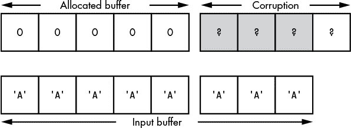
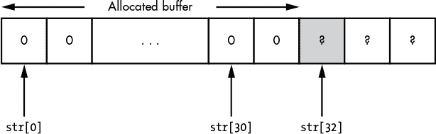
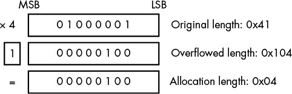
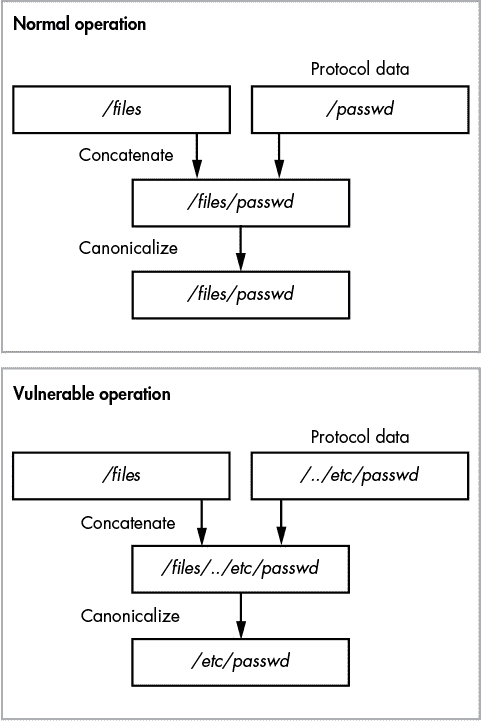

## **9**

**漏洞的根本原因**

本章描述了由协议实现引起的常见安全漏洞的根本原因。这些原因不同于源自协议规范的漏洞（如第七章中所讨论）。漏洞不一定必须是可以直接利用的才算漏洞。它可能削弱协议的安全防护，使其他攻击更容易发生，或者它可能导致访问更严重的漏洞。

阅读完这一章后，你将开始识别协议中的模式，这将帮助你在分析过程中发现安全漏洞。（我不会在本章讨论如何利用不同类别的漏洞，直到第十章才会涉及。）

在本章中，我将假设你在使用所有可用手段进行协议分析，包括分析网络流量、反向工程应用程序的二进制文件、审查源代码以及手动测试客户端和服务器，以确定实际漏洞。有些漏洞通过使用如*模糊测试*（通过变异网络协议数据来揭示问题的技术）等技术总是更容易发现，而其他漏洞则通过审查代码更易于发现。

### **漏洞类别**

当处理安全漏洞时，将它们分类为一组不同的类别有助于评估漏洞被利用时所带来的风险。例如，考虑一个漏洞，当它被利用时，允许攻击者入侵应用程序所在的系统。

#### ***远程代码执行***

*远程代码执行*是指任何允许攻击者在实现协议的应用程序上下文中执行任意代码的漏洞。这可能通过劫持应用程序逻辑或影响正常操作中创建的子进程的命令行来发生。

远程代码执行漏洞通常是最为关键的安全漏洞，因为它们允许攻击者入侵应用程序执行所在的系统。这种入侵会使攻击者能够访问应用程序可以访问的任何内容，甚至可能导致托管网络被攻破。

#### ***拒绝服务***

应用程序通常被设计用来提供某种服务。如果存在某个漏洞，一旦被利用，就会导致应用程序崩溃或无法响应，攻击者可以利用该漏洞拒绝合法用户访问特定应用程序及其提供的服务。通常被称为*拒绝服务*漏洞，它所需的资源很少，有时甚至只需一个网络数据包，就能让整个应用程序瘫痪。毫无疑问，这在不法分子手中可能造成极大的危害。

我们可以将拒绝服务漏洞分为*持久性*和*非持久性*两类。持久性漏洞会永久阻止合法用户访问服务（至少在管理员修复问题之前）。原因是利用该漏洞会破坏某些存储的状态，导致应用程序重启时崩溃。非持久性漏洞则仅在攻击者持续发送数据导致拒绝服务条件时存在。通常，如果允许应用程序自行重启或给予足够的时间，服务将恢复。

#### ***信息泄露***

许多应用程序是黑箱，在正常操作中，它们只通过网络向你提供某些信息。如果存在一种方式可以让应用程序提供它最初未设计提供的信息，比如内存内容、文件系统路径或认证凭据，那么就存在*信息泄露*漏洞。这类信息对攻击者可能直接有用，因为它可能有助于进一步的利用。例如，信息泄露可能会揭示重要内存结构的位置，这些结构可能有助于远程代码执行。

#### ***认证绕过***

许多应用程序要求用户提供认证凭据，以完全访问应用程序。有效的凭据可能是用户名和密码，或者更复杂的验证，如加密安全交换。认证限制了对资源的访问，但当攻击者未经认证时，它也能减少应用程序的攻击面。

如果有一种方式可以在没有提供完整认证凭据的情况下验证应用程序，那么该应用程序就存在*认证绕过*漏洞。这类漏洞可能非常简单，比如应用程序错误地检查密码——例如，因为它只比较密码的简单校验和，而这个校验和很容易被暴力破解。或者，漏洞也可能由于更复杂的问题，如 SQL 注入（稍后在“SQL 注入”一节中讨论，第 228 页）。

#### ***授权绕过***

不是所有用户都相同。应用程序可能通过相同的接口支持不同类型的用户，例如只读用户、低权限用户或管理员。如果应用程序提供对资源（如文件）的访问，它可能需要根据认证来限制访问。为了允许访问受保护的资源，必须建立一个授权过程，以确定分配给用户的权限和资源。

*授权绕过*漏洞发生在攻击者能够获得额外的权限或访问他们没有权限访问的资源时。例如，攻击者可能直接改变认证用户或用户权限，或者协议可能没有正确检查用户权限。

**注意**

*不要将授权绕过与身份验证绕过漏洞混淆。两者之间的主要区别在于，身份验证绕过允许您从系统角度验证为特定用户；而授权绕过允许攻击者从不正确的认证状态访问资源（实际上可能未经验证）。*

定义了漏洞类别后，让我们更详细地了解它们的根本原因，并探索一些可能存在的协议结构。每种根本原因都包含可能导致的漏洞类别列表。尽管这不是详尽无遗的列表，我涵盖了您经常会遇到的那些。

### **内存损坏漏洞**

如果您进行过任何分析，那么内存损坏很可能是您遇到的主要安全漏洞。应用程序将其当前状态存储在内存中，如果可以以受控的方式损坏该内存，则结果可能导致任何类别的安全漏洞。此类漏洞可能仅导致应用程序崩溃（导致服务拒绝状态），或者更危险，例如允许攻击者在目标系统上运行可执行代码。

#### ***内存安全 vs. 内存不安全编程语言***

内存损坏漏洞在很大程度上取决于应用程序开发时所使用的编程语言。在涉及内存损坏时，语言之间最大的区别在于语言（及其托管环境）是否*内存安全*或*内存不安全*。像 Java、C#、Python 和 Ruby 这样的内存安全语言通常不要求开发人员处理低级别的内存管理。它们有时会提供库或结构来执行不安全操作（例如 C#的`unsafe`关键字）。但是，使用这些库或结构需要开发人员明确指定其使用方式，这允许对其进行安全性审计。内存安全语言通常还会对内存缓冲区访问进行边界检查，以防止越界读写。然而，即使语言是内存安全的，也不意味着它完全免于内存损坏。然而，损坏更可能是语言运行时中的错误，而不是原始开发人员的错误。

另一方面，像 C 和 C++这样的内存不安全语言，执行非常有限的内存访问验证，并且缺乏自动管理内存的强大机制。因此，可能发生多种类型的内存损坏。这些漏洞的可利用性取决于操作系统、使用的编译器以及应用程序的结构。

内存损坏是最古老且最著名的漏洞根源之一，因此已经做出了大量努力来消除它。（我将在第十章详细讨论一些缓解策略，解释如何利用这些漏洞。）

#### ***内存缓冲区溢出***

也许最著名的内存损坏漏洞是*缓冲区溢出*。当应用程序尝试将更多的数据放入内存区域时，超过了该区域设计时能够容纳的大小，就会发生这种漏洞。缓冲区溢出可能被利用来执行任意程序，或者绕过安全限制，例如用户访问控制。图 9-1 展示了一个简单的缓冲区溢出，原因是输入数据超出了分配的缓冲区，导致内存损坏。



*图 9-1：缓冲区溢出导致的内存损坏*

缓冲区溢出可能有两种原因：通常所说的*固定长度缓冲区溢出*，即应用程序错误地假设输入缓冲区会适配分配的缓冲区。而*可变长度缓冲区溢出*则发生在分配的缓冲区大小计算错误时。

##### **固定长度缓冲区溢出**

迄今为止，最简单的缓冲区溢出发生在应用程序错误地检查外部数据值的长度与内存中固定长度缓冲区的关系时。该缓冲区可能位于栈上、堆中分配，或者作为编译时定义的全局缓冲区存在。关键在于，内存长度在实际数据长度被知晓之前就已经确定。

溢出的原因取决于应用程序，但它可能像应用程序根本不检查长度或错误地检查长度一样简单。列表 9-1 是一个例子。

```
 def read_string()
 {
➊ byte str[32];
  int i  = 0;

  do
  {
  ➋ str[i] = read_byte();
     i = i + 1;
  }
➌ while(str[i-1] != 0);
  printf("Read String: %s\n", str);
}
```

*列表 9-1：一个简单的固定长度缓冲区溢出*

这段代码首先分配一个缓冲区，用于存储字符串（位于栈上），并分配 32 字节的数据 ➊。接着，它进入一个循环，从网络读取一个字节，并将其存储在缓冲区中的递增索引位置 ➋。当从网络读取的最后一个字节为零时，循环退出，这表示数据已发送 ➌。

在这种情况下，开发人员犯了一个错误：循环在 ➌ 处没有验证当前的长度，因此读取了网络上可用的所有数据，导致内存损坏。当然，这个问题是由于不安全的编程语言没有对数组进行边界检查。这种漏洞如果没有编译器的缓解措施（例如堆栈保护来检测损坏），可能会非常容易被利用。

**不安全的字符串函数**

C 编程语言没有定义字符串类型。相反，它使用指向*char*类型的内存指针来表示字符串。字符串的结尾由一个零值字符表示。这本身并不构成安全问题。然而，当用于操作字符串的内置库被开发时，并未考虑安全性。因此，许多这些字符串函数在安全关键的应用中非常危险。

为了理解这些函数的危险性，我们来看一个使用`strcpy`的例子，这个函数用于复制字符串。该函数只接受两个参数：指向源字符串的指针和指向目标内存缓冲区的指针，用于存储复制的内容。请注意，没有任何信息表示目标内存缓冲区的长度。而正如你已经看到的，像 C 这样的内存不安全语言并不会跟踪缓冲区的大小。如果程序员尝试复制一个比目标缓冲区更长的字符串，尤其是来自外部不可信源的字符串，就会发生内存破坏。

更新版的 C 编译器和语言标准已经加入了更安全的版本，比如 `strcpy_s`，它增加了目标长度参数。但是，如果应用程序使用的是旧版的字符串函数，如 `strcpy`、`strcat` 或 `sprintf`，那么就很有可能存在严重的内存破坏漏洞。

即使开发者执行了长度检查，这个检查也可能做得不正确。没有自动边界检查的数组访问，必须由开发者手动验证所有的读写操作。清单 9-2 展示了一个修正版本，相比于清单 9-1，它考虑了比缓冲区大小更长的字符串。尽管如此，即便修正了代码，漏洞仍然潜藏其中。

```
 def read_string_fixed()
 {
➊ byte str[32];
  int i = 0;
 do
  {
  ➋ str[i] = read_byte();
     i = i + 1;
  }
➌ while((str[i-1] != 0) && (i < 32));

  /* Ensure zero terminated if we ended because of length */
➍ str[i] = 0;

  printf("Read String: %s\n", str);
}
```

*清单 9-2：越界缓冲区溢出*

如同在清单 9-1 中所示，在 ➊ 和 ➋，代码分配了一个固定大小的栈缓冲区，并在循环中读取字符串。第一个不同之处出现在 ➌。开发者添加了一个检查，以确保如果已经读取了 32 字节（栈缓冲区能容纳的最大字节数），就退出循环。不幸的是，为了确保字符串缓冲区正确终止，代码在缓冲区最后一个可用位置写入了零字节 ➍。此时，`i` 的值为 32。由于像 C 这样的语言从 0 开始计数，这实际上意味着它会将 0 写入缓冲区的第 33 个元素，从而导致内存破坏，如图 9-2 所示。



*图 9-2：越界错误引发的内存破坏*

这会导致一个*越界错误*（由于索引位置的偏移），这是内存不安全语言中一个常见的错误，尤其是在使用从 0 开始的缓冲区索引时。如果被覆盖的值很重要——例如，它是函数的返回地址——这个漏洞就可能被利用。

##### **可变长度缓冲区溢出**

应用程序不必使用固定长度的缓冲区来存储协议数据。在大多数情况下，应用程序可以为存储的数据分配一个正确大小的缓冲区。然而，如果应用程序错误地计算了缓冲区的大小，就可能发生变长缓冲区溢出。

由于缓冲区的长度是在运行时根据协议数据的长度计算的，你可能认为变长缓冲区溢出在现实世界中不太可能成为一个漏洞。但实际上，这个漏洞仍然可以通过多种方式发生。例如，应用程序可能会错误地计算缓冲区的长度。（应用程序应该在公开发布之前经过严格测试，但这并不总是能够做到的。）

更严重的问题发生在计算引发语言或平台的未定义行为时。例如，清单 9-3 展示了长度计算错误的常见方式。

```
   def read_uint32_array()
   {
     uint32 len;
     uint32[] buf;

     // Read the number of words from the network
➊   len = read_uint32();

     // Allocate memory buffer
➋   buf = malloc(len * sizeof(uint32));

     // Read values
     for(uint32 i = 0; i < len; ++i)
     {
➌     buf[i] = read_uint32();
     }
     printf("Read in %d uint32 values\n", len);
   }
```

*清单 9-3：一个错误的分配长度计算*

在这里，内存缓冲区在运行时动态分配，用于容纳协议中输入数据的总大小。首先，代码读取一个 32 位整数，并利用该整数确定协议中后续 32 位值的数量 ➊。接着，它计算总的分配大小，然后分配一个相应大小的缓冲区 ➋。最后，代码启动一个循环，从协议中读取每个值并将其存储到已分配的缓冲区中 ➌。

那么，可能会发生什么问题呢？为了回答这个问题，让我们快速看一下*整数溢出*。

##### **整数溢出**

在处理器指令层面，整数算术操作通常使用*模运算*进行。模运算允许值在超过某个值后进行回绕，这个值被称为*模数*。如果处理器仅支持某一固定大小的整数（如 32 位或 64 位），那么它就会使用模运算。这意味着任何算术操作的结果必须始终在允许的固定大小整数值范围内。例如，一个 8 位整数只能取 0 到 255 之间的值；它不可能表示其他任何值。图 9-3 展示了当你将一个值乘以 4 导致整数溢出时的情况。



*图 9-3：一个简单的整数溢出*

尽管图中为了简洁起见显示的是 8 位整数，但相同的逻辑适用于 32 位整数。当我们将原始长度 0x41 或 65 乘以 4 时，结果是 0x104 或 260。这个结果显然无法适应 0 到 255 的 8 位整数范围。因此，处理器会丢弃溢出的位（更可能的是将其存储在一个特殊标志中，指示溢出发生），结果是值为 4——这并不是我们预期的。处理器可能会发出错误，表示发生了溢出，但内存不安全的编程语言通常会忽略这种错误。事实上，在像 x86 这样的架构中，包装整数值的行为被用来指示操作的符号结果。更高级的语言可能会指示错误，或者根本不支持整数溢出，例如通过按需扩展整数的大小。

回到示例 9-3，你可以看到如果攻击者提供了一个合适选择的缓冲区长度值，乘以 4 的结果会发生溢出。这样会导致分配给内存的数字比通过网络传输的数字小。当从网络读取值并将其插入已分配的缓冲区时，解析器使用原始长度。由于数据的原始长度与分配的大小不匹配，值会被写入缓冲区之外，从而导致内存损坏。

**如果我们分配零字节，会发生什么？**

考虑一下当我们计算分配长度为零字节时会发生什么。分配会因为无法分配零长度的缓冲区而失败吗？像 C 语言这样的语言中，很多问题都由实现决定（这就是令人畏惧的实现定义行为）。对于 C 语言的分配器函数`malloc`，传入零作为请求的大小，可能返回失败，也可能返回一个不确定大小的缓冲区，这显然不可信。

#### ***越界缓冲区索引***

你已经看到内存不安全的语言不会执行边界检查。但有时，由于缓冲区大小不正确，会导致内存损坏。越界索引源于一个不同的根本原因：不是错误地指定数据值的大小，而是我们可以控制访问缓冲区中某个位置。如果访问位置做了不正确的边界检查，就会存在漏洞。在许多情况下，这个漏洞可以被利用来将数据写入缓冲区之外，从而导致选择性内存损坏。或者，它还可以通过读取缓冲区外的值来被利用，这可能会导致信息泄露甚至远程代码执行。示例 9-4 展示了一个利用第一个情况——将数据写入缓冲区外部——的示例。

```
➊ byte app_flags[32];

   def update_flag_value()
   {
  ➋ byte index = read_byte();
     byte value = read_byte();

     printf("Writing %d to index %d\n", value, index);

  ➌ app_flags[index] = value;
   }
```

*示例 9-4：写入越界缓冲区索引*

这个简短的例子展示了一个协议，其中包含一组客户端可以更新的常见标志。它可能是为了控制某些服务器属性而设计的。列表定义了一个包含 32 个标志的固定缓冲区 ➊。在 ➋ 处，它从网络读取一个字节，该字节将作为索引（可能的值范围是 0 到 255），然后将该字节写入标志缓冲区 ➌。在这种情况下，漏洞应该很明显：攻击者可以提供超出 0 到 32 范围的索引值，从而导致选择性内存损坏。

越界索引不仅仅涉及写操作。当从缓冲区读取一个值并返回给客户端时，使用不正确的索引也同样会导致漏洞。此时会存在一个简单的信息泄露漏洞。

如果索引被用来识别应用程序中的函数并执行，可能会发生特别严重的漏洞。此用法可能很简单，例如使用命令标识符作为索引，通常通过将指向函数的内存指针存储在缓冲区中来进行编程。然后使用该索引从网络中查找处理指定命令的函数。越界索引会导致从内存中读取一个意外的值，该值会被解释为指向函数的指针。这个问题很容易导致可利用的远程代码执行漏洞。通常，只需要找到一个索引值，当它被当作函数指针读取时，会导致执行转移到攻击者可以轻松控制的内存位置。

#### ***数据扩展攻击***

即使是现代高速网络也会压缩数据，以减少发送的原始字节数，无论是通过减少数据传输时间来提高性能，还是通过降低带宽成本来节省费用。某个时刻，这些数据必须被解压，如果压缩是由应用程序执行的，则可能会发生数据扩展攻击，如列表 9-5 所示。

```
   void read_compressed_buffer()
   {
     byte buf[];
     uint32 len;
     int i = 0;

     // Read the decompressed size
➊   len = read_uint32();

     // Allocate memory buffer
➋   buf = malloc(len);

➌   gzip_decompress_data(buf)

     printf("Decompressed in %d bytes\n", len);
   }
```

*列表 9-5：易受数据扩展攻击的示例代码*

在这里，压缩数据前面加上了解压数据的总大小。大小从网络中读取 ➊，并用于分配所需的缓冲区 ➋。之后，使用流式算法（如 gzip）将数据解压到缓冲区 ➌。代码没有检查解压后的数据是否能够实际适应分配的缓冲区。

当然，这种攻击不仅限于压缩。任何数据转换过程，无论是加密、压缩还是文本编码转换，都可能改变数据大小并导致扩展攻击。

#### ***动态内存分配失败***

系统的内存是有限的，当内存池耗尽时，动态内存分配池必须处理应用程序需要更多内存的情况。在 C 语言中，这通常会导致从分配函数返回一个错误值（通常是一个空指针）；在其他语言中，可能会导致环境终止或生成异常。

如果没有正确处理动态内存分配失败，可能会引发几种潜在的漏洞。最明显的问题是应用程序崩溃，这可能导致服务拒绝状态。

### **默认或硬编码凭据**

当部署使用身份验证的应用程序时，默认凭据通常作为安装过程的一部分添加。通常，这些账户会关联一个默认的用户名和密码。如果部署应用程序的管理员在使服务可用之前没有重新配置这些账户的凭据，则默认凭据会引发问题。

当应用程序中存在硬编码凭据且只能通过重新构建应用程序来更改时，问题会变得更加严重。这些凭据可能在开发过程中为了调试目的被添加，但在最终发布之前没有被移除。或者，它们可能是带有恶意意图的故意后门。列表 9-6 显示了一个被硬编码凭据破解的身份验证示例。

```
 def process_authentication()
 {
➊ string username = read_string();
   string password = read_string();

   // Check for debug user, don't forget to remove this before release
➋ if(username == "debug")
   {
     return true;
   }
   else
   {
  ➌ return check_user_password(username, password);
   }
}
```

*列表 9-6：默认凭据示例*

应用程序首先从网络 ➊ 读取用户名和密码，然后检查是否存在硬编码的用户名 *debug* ➋。若应用程序发现用户名为 *debug*，则自动通过身份验证过程；否则，按照正常的检查流程 ➌ 进行。要利用这种默认用户名，你只需要以 *debug* 用户身份登录即可。在实际应用中，凭据可能不会如此简单。登录过程可能要求你具有已接受的源 IP 地址、在登录之前向应用程序发送一个魔术字符串，等等。

### **用户枚举**

大多数面向用户的身份验证机制使用用户名来控制资源访问。通常，用户名会与令牌（如密码）结合使用来完成身份验证。用户身份不必是保密的：用户名通常是公开可用的电子邮件地址。

然而，仍然有一些好处是，不允许某人，特别是未认证用户，访问这些信息。通过识别有效的用户账户，攻击者更有可能通过暴力破解密码。因此，任何披露有效用户名存在或提供用户列表访问的漏洞，都是值得识别的问题。列表 9-7 显示了一个披露用户存在的漏洞。

```
 def process_authentication()
 {
   string username = read_string();
   string password = read_string();

➊ if(user_exists(username) == false)
   {
  ➋ write_error("User " + username " doesn't exist");
   }
   else
   {
  ➌ if(check_user_password(username, password))
     {
       write_success("User OK");
     }
     else
     {
    ➍ write_error("User " + username " password incorrect");
     }
   }
}
```

*列表 9-7：披露应用程序中存在的用户*

该列表展示了一个简单的身份验证过程，其中用户名和密码从网络读取。它首先检查用户是否存在 ➊；如果用户不存在，则返回错误 ➋。如果用户存在，列表会检查该用户的密码 ➌。同样，如果检查失败，则写入错误信息 ➍。你会注意到，错误信息在 ➋ 和 ➍ 处是不同的，这取决于是用户不存在还是只有密码错误。这些信息足以确定哪些用户名是有效的。

通过知道用户名，攻击者可以更容易地暴力破解有效的身份验证凭证。（仅猜测密码比同时猜测密码和用户名更简单。）知道用户名还可以为攻击者提供足够的信息，进行成功的社交工程攻击，诱使用户泄露他们的密码或其他敏感信息。

### **不正确的资源访问**

提供资源访问的协议，如 HTTP 或其他文件共享协议，使用一个标识符来表示你想要访问的资源。该标识符可能是文件路径或其他唯一标识符。应用程序必须解析该标识符才能访问目标资源。如果成功，资源的内容将被访问；否则，协议将抛出错误。

当这些协议处理资源标识符时，可能会受到多个漏洞的影响。值得测试所有可能的漏洞，并仔细观察应用程序的响应。

#### ***规范化***

如果资源标识符是一个包含资源和目录的层次列表，通常称之为*路径*。操作系统通常定义相对路径信息的指定方式，即使用两个点（..）表示父目录关系。在文件可以被访问之前，操作系统必须使用这个相对路径信息来找到它。一种非常简单的远程文件协议可能会接受一个远程用户提供的路径，将其与基本目录连接起来，并直接传递给操作系统，如列表 9-8 所示。这被称为*规范化*漏洞。

```
   def send_file_to_client()
   {
➊   string name = read_string();
    // Concatenate name from client with base path
➋   string fullPath = "/files" + name;

➌   int fd = open(fullPath, READONLY);

    // Read file to memory
➍   byte data[] read_to_end(fd);

    // Send to client
➎   write_bytes(data, len(data));
   }
```

*列表 9-8：路径规范化漏洞*

这个列表从网络读取一个字符串，表示要访问的文件名 ➊。然后，将该字符串与固定的基本路径连接起来，形成完整路径 ➋，以仅允许访问文件系统的有限区域。操作系统然后打开该文件 ➌，如果路径包含相对组件，则会被解析。最后，文件被读取到内存 ➍，并返回给客户端 ➎。

如果你发现代码执行了相同的操作序列，那么你已经找到了一个规范化漏洞。攻击者可以发送一个相对路径，该路径会被操作系统解析为基目录之外的文件，从而导致敏感文件被泄露，如图 9-4 所示。

即使应用程序在将路径发送给操作系统之前进行了一些检查，应用程序仍必须正确匹配操作系统对该字符串的解释。例如，在 Microsoft Windows 上，反斜杠（\）和正斜杠（/）都可以作为路径分隔符。如果应用程序只检查反斜杠，按照 Windows 的标准，仍然可能存在漏洞。



*图 9-4：正常路径标准化操作与易受攻击操作的对比*

尽管从系统下载文件的能力可能足以使其受到威胁，但如果文件上传协议中存在标准化漏洞，问题会更加严重。如果你可以将文件上传到应用程序托管系统并指定任意路径，那么更容易使系统受到威胁。例如，你可以将脚本或其他可执行内容上传到系统，并让系统执行这些内容，从而导致远程代码执行。

#### ***冗长的错误信息***

如果应用程序在尝试检索资源时没有找到资源，通常会返回一些错误信息。这个错误可能只是一个错误代码，或者是对不存在内容的完整描述；然而，错误信息不应泄露超出必要的信息。当然，这并非总是如此。

如果应用程序在请求不存在的资源时返回错误信息，并将访问资源的本地信息插入错误中，则存在一个简单的漏洞。如果访问的是一个文件，错误信息可能包含传递给操作系统的文件的本地路径：这些信息可能对试图进一步获取系统访问权限的人有用，如列表 9-9 所示。

```
 def send_file_to_client_with_error()
 {
➊ string name = read_string();

   // Concatenate name from client with base path
➋ string fullPath = "/files" + name;

➌ if(!exist(fullPath))
   {
  ➍ write_error("File " + fullPath + " doesn't exist");
   }
   else
   {
  ➎ write_file_to_client(fullPath);
   }
}
```

*列表 9-9：错误信息泄露*

这个列表展示了当请求的文件不存在时，返回给客户端的简单错误信息示例。在➊处，它从网络读取一个字符串，表示要访问的文件名。然后，这个字符串与一个固定的基础路径连接，形成完整路径，在➋处进行拼接。文件是否存在由操作系统在➌处检查。如果文件不存在，文件的完整路径会被添加到错误字符串中并返回给客户端 ➍；否则，数据将被返回 ➎。

该列表容易泄露本地文件系统上基础路径的位置。此外，该路径可能与其他漏洞结合使用，从而获得更多的系统访问权限。如果资源目录位于用户的主目录中，举个例子，可能还会泄露当前运行应用程序的用户信息。

### **内存耗尽攻击**

应用程序运行所在系统的资源是有限的：可用的磁盘空间、内存和处理能力都有其上限。一旦某个关键系统资源耗尽，系统可能会以意想不到的方式开始失败，比如不再响应新的网络连接。

当动态内存用于处理协议时，存在内存过度分配或忘记释放分配的内存块的风险，从而导致*内存耗尽*。协议易受内存耗尽漏洞影响的最简单方式是，如果它基于协议中传输的绝对值动态分配内存。例如，考虑清单 9-10。

```
 def read_buffer()
 {
   byte buf[];
   uint32 len;
   int i = 0;

   // Read the number of bytes from the network
➊ len = read_uint32();

   // Allocate memory buffer
➋ buf = malloc(len);

   // Allocate bytes from network
➌ read_bytes(buf, len);

   printf("Read in %d bytes\n", len);
 }
```

*清单 9-10：内存耗尽攻击*

这个清单从协议中读取一个可变长度的缓冲区。首先，它以无符号 32 位整数的形式读取字节长度➊。接下来，它尝试根据该长度分配一个缓冲区，然后再从网络中读取数据➋。最后，它从网络中读取数据➌。问题在于，攻击者可以轻松指定一个非常大的长度，比如 2GB，当内存被分配时，它会阻塞一大片内存区域，使得应用程序的其他部分无法访问。然后，攻击者可以缓慢地向服务器发送数据（试图防止连接因超时而关闭），通过多次重复此过程，最终使系统内存耗尽。

大多数系统不会在未使用时分配物理内存，从而限制了对系统整体的影响。然而，对于专用嵌入式系统而言，这种攻击可能更加严重，因为这些系统内存稀缺，并且没有虚拟内存。

### **存储耗尽攻击**

随着今天的多 TB 硬盘的普及，存储耗尽攻击发生的可能性较小，但对于更紧凑的嵌入式系统或没有存储的设备，依然可能成为问题。如果攻击者能够耗尽系统的存储容量，则该系统上的应用程序或其他进程可能会开始失败。这样的攻击甚至可能阻止系统重启。例如，如果操作系统需要在启动之前将某些文件写入磁盘，但无法写入，则可能会导致永久性的拒绝服务（DoS）状态。

这种类型漏洞最常见的原因是在将操作信息记录到磁盘时。例如，如果日志记录非常详细，每次连接产生几百千字节的数据，并且最大日志大小没有任何限制，那么通过反复连接到服务，攻击者很容易就能将存储空间填满。如果一个应用程序记录发送给它的远程数据，并且支持压缩数据，那么这种攻击可能特别有效。在这种情况下，攻击者可以通过非常少的网络带宽，导致大量数据被记录。

### **CPU 耗尽攻击**

尽管今天的平均智能手机有多个 CPU 可供使用，但 CPU 一次只能执行有限数量的任务。如果攻击者能够用极少的努力和带宽消耗 CPU 资源，便有可能导致拒绝服务条件的发生。虽然可以通过多种方式做到这一点，但我将仅讨论两种方法：利用算法复杂性和识别加密系统中的外部可控参数。

#### ***算法复杂性***

所有计算机算法都有一个相关的计算成本，表示为特定输入获得期望输出所需执行的工作量。算法所需的工作量越多，它就需要系统处理器更多的时间。在理想的世界中，算法应该无论收到什么输入都需要恒定的时间。但现实中，情况往往并非如此。

一些算法在输入参数数量增加时变得特别昂贵。例如，考虑排序算法*冒泡排序*。该算法检查缓冲区中每一对值，如果左侧的值大于右侧的值，则交换它们。这会将较大的值“冒泡”到缓冲区的末尾，直到整个缓冲区排序完成。列表 9-11 展示了一个简单的实现。

```
def bubble_sort(int[] buf)
{
  do
  {
    bool swapped = false;
    int N = len(buf);
    for(int i = 1; i < N - 1; ++i)
    {
      if(buf[i-1] > buf[i])
      {
        // Swap values
        swap( buf[i-1], buf[i] );
        swapped = true;
      }
    }
  } while(swapped == false);
}
```

*列表 9-11：一个简单的冒泡排序实现*

该算法所需的工作量与需要排序的缓冲区中元素的数量（我们称元素数量为*N*）成正比。在最佳情况下，这只需要一次遍历缓冲区，进行*N*次迭代，当所有元素已经排序时就会发生这种情况。在最坏情况下，当缓冲区是逆序排列时，算法需要重复排序过程*N*²次。如果攻击者能够指定大量逆序排列的值，那么执行这种排序的计算成本就会变得非常高。因此，排序可能会消耗 CPU 100%的处理时间，导致拒绝服务。

在一个现实世界的例子中，发现一些编程环境（包括 PHP 和 Java）在哈希表实现中使用了一种最坏情况下需要*N*²次操作的算法。*哈希表*是一种数据结构，它将值与另一个值（例如文本名称）相关联。首先使用一个简单的算法对键进行哈希处理，然后确定一个*桶*，将值放入该桶中。当将新值插入桶时，使用的是*N*²算法；理想情况下，键的哈希值之间应该发生很少的碰撞，这样桶的大小就会很小。但是，通过构造一组具有相同哈希值（但至关重要的是，具有不同键值）的键，攻击者可以通过发送少量请求，在网络服务（如 Web 服务器）上引发拒绝服务状态。

**大 O 符号**

*大 O* 表示法，是对计算复杂度的常见表示，表示算法复杂度的上限。表 9-1 列出了各种算法的常见大 O 表示法，从最简单到最复杂。

**表 9-1：** 最坏情况算法复杂度的大 O 表示法

| **符号** | **描述** |
| --- | --- |
| O(1) | 常数时间；算法始终花费相同的时间。 |
| O(log *N*) | 对数；最坏情况下与输入数量的对数成正比。 |
| O(*N*) | 线性时间；最坏情况下与输入数量成正比。 |
| O(*N* ²) | 二次；最坏情况下与输入数量的平方成正比。 |
| O(2*^N*) | 指数；最坏情况下与 2 的*N*次方成正比。 |

请记住，这些是最坏情况值，并不一定代表真实世界的复杂性。也就是说，如果了解特定算法，例如冒泡排序，有很大可能攻击者会故意触发最坏情况。

#### ***可配置的密码学***

密码学原语处理，如哈希算法，在处理认证凭据时可能会产生大量的计算工作量。在计算机安全中的一项规则是，在存储密码之前，密码应始终使用密码学摘要算法进行哈希处理。这将密码转换为哈希值，几乎不可能逆向还原为原始密码。即使哈希值泄露，也很难获得原始密码。但是有人仍然可以猜测密码并生成哈希值。如果猜测的密码在哈希处理后匹配，则他们已经发现了原始密码。为了缓解这个问题，通常会多次运行哈希操作，以增加攻击者的计算需求。不幸的是，这个过程也会增加应用程序的计算成本，这可能在面对拒绝服务条件时成为问题。

如果哈希算法花费的时间是指数级（根据输入大小），或者可以从外部指定算法的迭代次数，就会发生漏洞。大多数密码算法所需时间与给定输入的关系相当线性。但是，如果可以无限制地指定算法的迭代次数，处理时间可能会持续到攻击者所需的任意时间。这样一个易受攻击的应用程序显示在清单 9-12 中。

```
   def process_authentication()
   {
➊   string username = read_string();
     string password = read_string();
➋   int iterations = read_int();

     for(int i = 0; i < interations; ++i)
     {
➌     password = hash_password(password);
     }

➍   return check_user_password(username, password);
   }
```

*清单 9-12：检查易受攻击的认证*

首先，从网络读取用户名和密码 ➊。接下来，读取哈希算法的迭代次数 ➋，并应用该次数进行哈希处理 ➌。最后，将哈希后的密码与应用程序存储的密码进行对比 ➍。显然，攻击者可以提供一个非常大的迭代次数，这可能会消耗大量的 CPU 资源，尤其是在哈希算法计算复杂的情况下，持续的时间也会很长。

客户端可以配置的一个很好的加密算法示例是公钥/私钥的处理。像 RSA 这样的算法依赖于对大公钥值的因式分解计算成本。公钥值越大，执行加密/解密所需的时间就越长，生成新密钥对的时间也会更长。

### **格式化字符串漏洞**

大多数编程语言都有将任意数据转换为字符串的机制，并且通常会定义一些格式化机制来指定开发者希望的输出方式。这些机制中的一些非常强大且特权，尤其是在内存不安全的语言中。

*格式化字符串*漏洞发生在攻击者能够向应用程序提供一个字符串值，并将其直接作为格式字符串使用时。最著名、也可能是最危险的格式化器由 C 语言的`printf`及其变体（如`sprintf`，它会打印到字符串）使用。`printf`函数将格式字符串作为第一个参数，然后是要格式化的值列表。列表 9-13 展示了这样的易受攻击的应用程序。

```
def process_authentication()
{
      string username = read_string();
      string password = read_string();

      // Print username and password to terminal
      printf(username);
      printf(password);

      return check_user_password(username, password))
}
```

*列表 9-13：`printf`格式字符串漏洞*

`printf`的格式字符串使用`%?`语法来指定数据的位置和类型，其中问号由字母数字字符替换。格式说明符还可以包含格式化信息，例如数字的小数位数。如果攻击者可以直接控制格式字符串，可能会破坏内存或泄露当前堆栈的信息，这些信息可能对进一步攻击有用。表 9-2 展示了攻击者可能滥用的常见`printf`格式说明符列表。

**表 9-2:** 常见可利用的`printf`格式说明符列表

| **格式说明符** | **描述** | **潜在漏洞** |
| --- | --- | --- |
| `%d`、`%p`、`%u`、`%x` | 打印整数 | 如果返回给攻击者，可能会泄露堆栈中的信息 |
| `%s` | 打印一个零终止的字符串 | 如果返回给攻击者，可能会泄露堆栈中的信息，或者导致无效内存访问，从而引发服务拒绝（DoS） |
| `%n` | 将当前已打印的字符数写入参数中指定的指针 | 可能用于导致选择性内存损坏或应用崩溃 |

### **命令注入**

大多数操作系统，特别是基于 Unix 的操作系统，都包含了一个功能丰富的实用工具集，用于执行各种任务。有时候，开发人员决定，执行某个特定任务（比如更新密码）的最简单方法是执行外部应用程序或操作系统实用工具。尽管如果执行的命令行完全由开发人员指定，这通常不会构成问题，但经常会将一些来自网络客户端的数据插入到命令行中以执行所需的操作。列表 9-14 展示了一个这样的易受攻击的应用程序。

```
 def update_password(string username)
 {
➊ string oldpassword = read_string();
   string newpassword = read_string();

   if(check_user_password(username, oldpassword))
   {
     // Invoke update_password command
  ➋ system("/sbin/update_password -u " + username + " -p " + newpassword);
   }
 }
```

*列表 9-14：一个易受命令注入攻击的密码更新示例*

该代码段会在知道原始密码的情况下更新当前用户的密码 ➊。接着它构建一个命令行，并调用 Unix 风格的 `system` 函数 ➋。虽然我们不能控制 `username` 或 `oldpassword` 参数（它们必须正确才能执行 `system` 调用），但我们完全控制 `newpassword`。因为没有进行任何数据净化，这段代码容易受到命令注入的攻击，因为 `system` 函数使用当前的 Unix shell 来执行命令行。例如，我们可以为 `newpassword` 指定一个值，如 `password; xcalc`，这样就会首先执行密码更新命令。然后，shell 会将分号作为命令分隔符，执行 `xcalc`。

### **SQL 注入**

即使是最简单的应用程序也可能需要持久化存储和检索数据。应用程序可以通过多种方式实现这一点，但最常见的一种方式是使用关系型数据库。数据库提供了许多优势，其中之一就是能够针对数据发出查询，以执行复杂的分组和分析。

定义关系型数据库查询的事实标准是*结构化查询语言（SQL）*。这种基于文本的语言定义了要读取的数据表以及如何过滤这些数据，以获取应用程序所需的结果。在使用基于文本的语言时，常常会有一个诱惑，就是通过字符串操作构建查询。然而，这很容易导致类似命令注入的漏洞：攻击者并不是将不可信的数据插入到命令行中而不进行适当的转义，而是将数据插入到 SQL 查询中，随后该查询在数据库上执行。这种技术可以修改查询的操作，返回已知的结果。例如，如果查询提取了当前身份验证用户的密码，如列表 9-15 所示，结果会怎样呢？

```
   def process_authentication()
   {
➊   string username = read_string();
     string password = read_string();

➋   string sql = "SELECT password FROM user_table WHERE user = '" + username "'";

➌   return run_query(sql) == password;
   }
```

*列表 9-15：一个容易受到 SQL 注入攻击的身份验证示例*

这个代码段从网络读取用户名和密码 ➊。然后，它构建一个新的 SQL 查询字符串，使用 `SELECT` 语句从用户表中提取与用户相关的密码 ➋。最后，它在数据库上执行该查询，并检查从网络读取的密码是否与数据库中的密码匹配 ➌。

这个漏洞很容易被利用。在 SQL 中，字符串需要用单引号括起来，以防它们被误解为 SQL 语句中的命令。如果用户名在协议中包含了单引号，攻击者就可以提前结束引号中的字符串，从而将新的命令注入到 SQL 查询中。例如，一个 `UNION SELECT` 语句就可以让查询返回任意的密码值。攻击者可以利用 SQL 注入绕过应用程序的身份验证。

SQL 注入攻击甚至可能导致远程代码执行。例如，尽管默认情况下被禁用，Microsoft SQL Server 的数据库功能 `xp_cmdshell` 允许执行操作系统命令。Oracle 的数据库甚至允许上传任意的 Java 代码。当然，也有一些应用程序通过网络传递原始的 SQL 查询。即使某个协议本身并不是为了控制数据库，仍然很可能被利用来访问底层的数据库引擎。

### **文本编码字符替换**

在理想的世界里，每个人都可以使用一种文本编码来处理所有不同的语言。但是我们并不生活在理想的世界里，正如在第三章中讨论的那样，我们使用多种文本编码，比如 ASCII 和各种 Unicode 变体。

一些文本编码之间的转换无法做到“往返”：从一种编码转换到另一种编码时会丢失重要信息，以至于如果再进行反向操作，原始文本无法恢复。特别是在从像 Unicode 这样的大字符集转换到像 ASCII 这样的小字符集时，这个问题尤为突出。因为用 7 位无法编码整个 Unicode 字符集。

文本编码转换通过两种方式来处理这个问题。最简单的方法是用占位符替换无法表示的字符，例如问号（?）字符。如果数据值引用的是某些特殊情况，比如 URL 解析中，问号作为查询字符串的开始，那么这样就可能成问题。

另一种方法是应用最佳匹配映射。这种方法用于那些在新编码中有类似字符的字符。例如，Unicode 中的引号字符有左双引号和右双引号的形式，分别映射到特定的代码点，如 U+201C 和 U+201D。虽然这些字符不在 ASCII 范围内，但在转换到 ASCII 时，它们通常会被替换成等效的字符，如 U+0022 或引号。最佳匹配映射可能会在应用程序处理转换后的文本时产生问题。虽然略微损坏的文本通常不会对用户造成太大问题，但自动转换过程可能会导致应用程序错误地处理数据。

重要的实现问题是，应用程序首先使用一种编码形式的字符串来验证安全条件。然后，它使用另一种编码形式的字符串执行特定操作，例如读取资源或执行命令，如在示例 9-16 中所示。

```
 def add_user()
 {
➊ string username = read_unicode_string();

   // Ensure username doesn't contain any single quotes
➋ if(username.contains("'") == false)
   {
     // Add user, need to convert to ASCII for the shell
  ➌ system("/sbin/add_user '" + username.toascii() + "'");
   }
 }
```

*示例 9-16：文本转换漏洞*

在这个示例中，应用程序读取一个表示用户的 Unicode 字符串，以将其添加到系统中 ➊。它将把该值传递给 `add_user` 命令，但为了避免命令注入漏洞，因此它首先确保用户名不包含任何可能被误解的单引号字符 ➋。一旦确认字符串没有问题，它会将其转换为 ASCII（Unix 系统通常使用狭窄的字符集，尽管许多系统支持 UTF-8），并确保该值被单引号包围，以防止空格被误解 ➌。

当然，如果最佳匹配规则将其他字符转换回单引号，那么就有可能提前终止引号字符串，并导致前面讨论的同样类型的命令注入漏洞。

### **结束语**

本章向你展示了漏洞的许多可能根本原因，并且在实际中存在着几乎无限的变种。即使某些东西看起来并不立即显示出漏洞，仍然要保持警觉。漏洞可能出现在最令人意想不到的地方。

我已经涵盖了从内存损坏导致应用程序行为与原始设计不符，到阻止合法用户访问提供的服务等漏洞。识别这些不同问题可能是一个复杂的过程。

作为协议分析员，你有多个可能的切入点。同时，当寻找实现漏洞时，改变策略也至关重要。考虑应用程序是用内存安全语言还是不安全语言编写的，记住，例如在 Java 应用程序中，你不太可能找到内存损坏问题。
